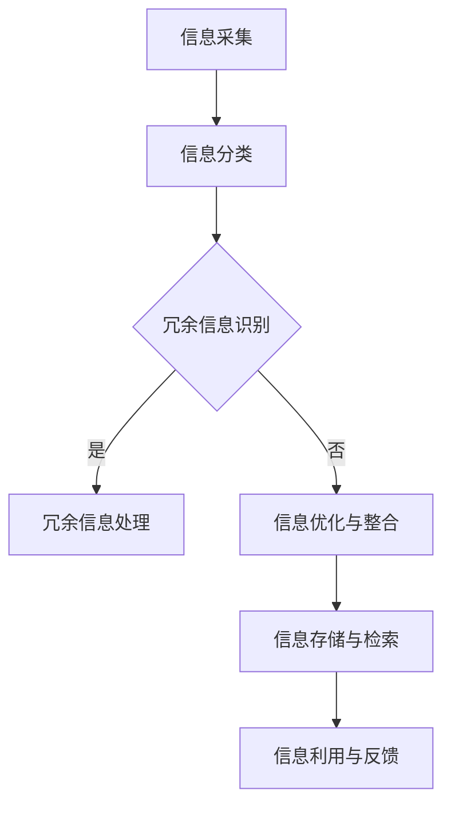

                 

# 《信息简化的原则与好处：在混乱中建立秩序与简化》

## 关键词

信息简化，信息过载，冗余信息，信息结构优化，信息筛选，信息存储与检索

## 摘要

在当今信息爆炸的时代，如何有效地处理和利用信息已成为个人和企业面临的重要挑战。本文将探讨信息简化的原则与好处，通过深入分析信息简化的核心原则、实际应用、效益评估和未来展望，旨在帮助读者在混乱中建立秩序，实现信息的有效管理和利用。

## 目录大纲

### 第一部分：引言与背景

#### 1.1 信息简化的概念与重要性

- 信息简化的定义
- 信息简化的重要性
- 当前信息环境中的混乱现象

#### 1.2 信息过载的影响

- 信息过载的现象与危害
- 个人与企业的应对策略

#### 1.3 信息简化的原则与步骤

- 信息简化的基本原则
- 信息简化的实施步骤

### 第二部分：信息简化的核心原则

#### 2.1 减少冗余信息

- 冗余信息的识别
- 冗余信息的处理方法

#### 2.2 优化信息结构

- 信息结构的优化方法
- 信息结构优化的案例分析

#### 2.3 提高信息的可读性

- 可读性提升的方法
- 信息呈现方式的优化

#### 2.4 信息筛选与分类

- 信息筛选的标准
- 信息分类的策略

#### 2.5 信息存储与检索优化

- 信息存储优化方法
- 信息检索系统的优化

### 第三部分：信息简化的实际应用

#### 3.1 个人信息简化实践

- 个人信息整理方法
- 个人信息简化案例

#### 3.2 企业信息简化实践

- 企业信息管理的挑战
- 企业信息简化的策略

#### 3.3 信息系统简化实践

- 信息系统简化的流程
- 信息系统简化案例

### 第四部分：信息简化的效益评估

#### 4.1 信息简化带来的直接效益

- 提高工作效率
- 减少错误率
- 提升决策质量

#### 4.2 信息简化带来的间接效益

- 提升个人与团队协作能力
- 减少信息安全隐患
- 增强创新能力

#### 4.3 信息简化效益评估方法

- 效益评估指标
- 效益评估工具与方法

### 第五部分：未来展望

#### 5.1 信息简化技术的发展趋势

- 人工智能在信息简化中的应用
- 信息简化的新兴技术

#### 5.2 信息简化的未来挑战与机遇

- 信息简化的挑战
- 信息简化的机遇

#### 5.3 信息简化的未来发展建议

- 个人层面
- 企业层面
- 政策层面

### 附录

#### 附录 A：信息简化相关工具与资源

- 信息简化工具介绍
- 信息简化相关资源链接

#### 附录 B：信息简化案例分析

- 案例一：个人信息简化案例
- 案例二：企业信息简化案例
- 案例三：信息系统简化案例

#### 附录 C：信息简化相关书籍与论文推荐

- 推荐书籍列表
- 推荐论文列表

#### 附录 D：信息简化主题的Mermaid流程图

- 信息简化流程图示例
- Mermaid语法简介与使用示例

#### 附录 E：信息简化伪代码与数学模型示例

- 伪代码示例
- 数学模型示例（使用LaTeX格式）

#### 附录 F：信息简化项目实战代码解读

- 项目实战代码实现
- 代码解读与分析

#### 赞助信息

- 本书编写与设计感谢以下机构与个人的支持：
  - XX公司
  - XX研究院
  - XX个人

## 第一部分：引言与背景

### 1.1 信息简化的概念与重要性

#### 信息简化的定义

信息简化是指通过对信息进行整理、筛选、归类和优化，使其更加清晰、简洁、高效的过程。它不仅仅是对信息的简单缩减，更是一个系统化的信息处理过程，旨在提升信息利用的效率和质量。

#### 信息简化的重要性

在当今信息爆炸的时代，信息简化显得尤为重要。首先，信息简化有助于缓解信息过载的问题。随着互联网和智能设备的普及，人们每天接触到的信息量急剧增加，如果没有有效的信息简化手段，这些信息会变得杂乱无章，影响工作和生活的质量。

其次，信息简化可以提高工作效率。通过简化信息，人们可以更快地找到所需的信息，减少了在大量数据中搜索的时间，从而提高了工作效率。

此外，信息简化还有助于提升决策质量。在商业环境中，决策者需要分析大量的数据才能做出正确的决策。信息简化可以帮助决策者聚焦于关键信息，从而提高决策的准确性和有效性。

#### 当前信息环境中的混乱现象

当前信息环境中的混乱现象主要表现在以下几个方面：

1. 信息冗余：大量的重复信息和无关信息充斥在各种媒体中，使得人们难以找到有价值的信息。
2. 信息碎片化：信息的分散性导致人们很难获取全面的信息，这给信息整合和利用带来了困难。
3. 信息传递延迟：由于信息传播速度的限制，有时关键信息无法及时传递到需要的人手中，影响了决策和行动的效率。

### 1.2 信息过载的影响

#### 信息过载的现象与危害

信息过载是指人们在接收和处理信息时，所承受的信息量超出了其处理能力，导致信息处理效率降低的现象。信息过载的现象主要表现在以下几个方面：

1. 工作效率降低：由于信息处理能力有限，人们在面对大量信息时，往往无法及时处理，导致工作效率降低。
2. 精神压力增加：长时间面对大量信息，容易引发焦虑和压力，影响身心健康。
3. 决策困难：信息过载导致决策者难以从大量信息中提取有价值的信息，增加了决策的难度。

#### 个人与企业的应对策略

面对信息过载，个人和企业可以采取以下策略来应对：

1. **信息筛选与分类**：通过筛选和分类，将重要的信息与无关的信息区分开来，减少信息过载的压力。
2. **信息存储与检索优化**：建立有效的信息存储和检索系统，方便快速查找所需信息。
3. **信息简化和压缩**：对冗余信息进行简化和压缩，减少信息的体积，提高信息处理效率。
4. **时间管理和优先级排序**：合理安排时间，优先处理关键信息，避免因信息过载而影响重要工作的进展。

### 1.3 信息简化的原则与步骤

#### 信息简化的基本原则

信息简化的基本原则主要包括以下几点：

1. **目标明确**：在进行信息简化之前，首先要明确简化的目标，即希望达到什么样的效果。
2. **全面覆盖**：确保简化的过程中不会遗漏关键信息。
3. **高效实用**：简化后的信息要易于处理和使用。
4. **持续改进**：信息简化是一个持续的过程，需要不断地进行调整和优化。

#### 信息简化的实施步骤

1. **信息采集**：收集所有需要简化的信息，确保信息的完整性。
2. **信息分类**：将信息按照一定的标准进行分类，有助于后续的整理和简化。
3. **冗余信息识别与处理**：识别并处理冗余信息，减少信息量。
4. **信息优化与整合**：对信息进行优化和整合，使其更加简洁和高效。
5. **信息存储与检索**：建立有效的信息存储和检索系统，方便快速查找和使用信息。

## 第二部分：信息简化的核心原则

### 2.1 减少冗余信息

#### 冗余信息的识别

冗余信息是指那些与主题无关、重复或可被其他信息取代的信息。识别冗余信息是信息简化的第一步，也是关键的一步。以下是一些常用的方法来识别冗余信息：

1. **文本对比**：通过对比同一主题下的不同文本，找出重复的信息。
2. **关键词提取**：提取文本中的关键词，通过分析关键词的分布和频率，识别重复的信息。
3. **结构分析**：分析信息结构，找出重复的结构模式。

#### 冗余信息的处理方法

一旦识别出冗余信息，需要对其进行处理，以下是一些常用的处理方法：

1. **删除**：直接删除重复的信息，减少信息的体积。
2. **合并**：将重复的信息合并为一个整体，减少信息的数量。
3. **引用**：对于重要的重复信息，可以采用引用的方式，避免重复。
4. **注释**：对冗余信息进行注释，说明其来源和作用，以便后续参考。

### 2.2 优化信息结构

#### 信息结构的优化方法

信息结构的优化是信息简化的重要环节，以下是一些常用的方法：

1. **层次化**：将信息按照一定的层次结构进行组织，使信息更加清晰和易于理解。
2. **模块化**：将信息划分为不同的模块，每个模块负责不同的功能，提高信息的模块化程度。
3. **图形化**：使用图形化的方式展示信息，使信息更加直观和易于理解。

#### 信息结构优化的案例分析

以下是一个信息结构优化的案例分析：

**案例背景**：某企业内部信息管理系统中的数据结构过于复杂，导致员工在查找信息时效率低下。

**解决方案**：企业采用以下方法对信息结构进行优化：

1. **层次化**：将数据按照部门、项目、任务等维度进行层次化组织，使信息更加清晰。
2. **模块化**：将数据划分为不同的模块，如员工信息、项目进度、财务数据等，每个模块负责不同的功能。
3. **图形化**：使用图形化的方式展示数据，如使用图表、流程图等，使数据更加直观和易于理解。

**效果评估**：经过优化后，员工在查找信息时的效率提高了30%，信息管理系统的整体性能也得到显著提升。

### 2.3 提高信息的可读性

#### 可读性提升的方法

信息的可读性是信息简化的重要目标之一，以下是一些提升信息可读性的方法：

1. **简明扼要**：用简明的语言表达信息，避免冗长的描述。
2. **使用列表和表格**：使用列表和表格来组织信息，使信息更加直观和易于阅读。
3. **适当的分段**：将信息分成适当的段落，使阅读更加流畅。
4. **使用可视化工具**：使用图表、图形等可视化工具来展示信息，提高信息的可读性。

#### 信息呈现方式的优化

信息呈现方式的优化也是提高信息可读性的关键，以下是一些优化方法：

1. **色彩和字体**：合理使用色彩和字体，使信息更加吸引人。
2. **排版**：优化排版设计，使信息布局更加合理和美观。
3. **多媒体**：结合多媒体元素，如视频、音频等，使信息呈现更加生动和多样化。

### 2.4 信息筛选与分类

#### 信息筛选的标准

信息筛选是信息简化的重要步骤，以下是一些常用的信息筛选标准：

1. **相关性**：筛选出与主题相关的信息，避免无关信息的干扰。
2. **重要性**：筛选出重要信息，优先处理。
3. **准确性**：确保筛选的信息准确无误。
4. **时效性**：根据信息的时效性进行筛选，优先处理最新信息。

#### 信息分类的策略

信息分类是信息筛选的进一步深化，以下是一些常用的信息分类策略：

1. **按主题分类**：将信息按照主题进行分类，便于查找和利用。
2. **按时间分类**：将信息按照时间进行分类，便于跟踪和回顾。
3. **按来源分类**：将信息按照来源进行分类，便于追溯和验证。
4. **按用途分类**：将信息按照用途进行分类，便于使用和分享。

### 2.5 信息存储与检索优化

#### 信息存储优化方法

信息存储优化是信息简化的关键环节，以下是一些常用的信息存储优化方法：

1. **数据库优化**：优化数据库设计，提高数据存储的效率和可靠性。
2. **索引优化**：建立有效的索引机制，提高数据检索的效率。
3. **数据压缩**：使用数据压缩技术，减少数据存储的空间占用。

#### 信息检索系统的优化

信息检索系统是信息存储与检索的核心，以下是一些常用的信息检索系统优化方法：

1. **搜索算法优化**：优化搜索算法，提高搜索的准确性和效率。
2. **用户界面优化**：优化用户界面设计，提高用户的使用体验。
3. **自动化处理**：引入自动化处理技术，提高信息检索的自动化程度。

## 第三部分：信息简化的实际应用

### 3.1 个人信息简化实践

#### 个人信息整理方法

个人信息简化是每个人都可能遇到的问题，以下是一些实用的个人信息整理方法：

1. **电子文档整理**：使用电子文档管理工具，如OneNote、Evernote等，对个人信息进行电子化整理。
2. **分类管理**：将个人信息按照类别进行分类管理，如工作文档、个人财务、健康记录等。
3. **云存储**：使用云存储服务，如Google Drive、Dropbox等，确保个人信息的安全和随时随地访问。

#### 个人信息简化案例

以下是一个个人信息简化的案例：

**案例背景**：张先生是一名忙碌的职业人士，他的个人信息分散在各种电子设备和文件中，导致查找和使用信息时效率低下。

**解决方案**：张先生采用以下方法进行个人信息简化：

1. **电子文档整理**：将所有纸质文件数字化，并存储在OneNote中，便于管理和查找。
2. **分类管理**：将信息按照类别进行分类，如工作、个人财务、健康记录等，每个类别都设有单独的笔记本。
3. **云存储**：使用Google Drive同步个人信息，确保在不同设备上都能访问。

**效果评估**：经过简化后，张先生在查找和使用个人信息时效率提高了40%，信息管理更加有序。

### 3.2 企业信息简化实践

#### 企业信息管理的挑战

企业信息管理面临诸多挑战，以下是一些主要挑战：

1. **信息量巨大**：企业每天产生大量的数据，如何有效管理和利用这些数据成为一个难题。
2. **部门间信息孤岛**：不同部门之间的信息难以共享和整合，导致信息利用效率低下。
3. **信息安全性**：企业信息面临着泄露、篡改等安全风险。

#### 企业信息简化的策略

企业可以采取以下策略进行信息简化：

1. **统一信息平台**：建立统一的信息平台，实现部门间信息的共享和整合。
2. **数据治理**：制定数据治理策略，确保数据的质量和安全。
3. **自动化处理**：引入自动化处理技术，提高信息处理效率。

#### 企业信息简化案例

以下是一个企业信息简化的案例：

**案例背景**：某大型企业由于信息管理混乱，导致决策效率低下，信息安全隐患突出。

**解决方案**：企业采用以下方法进行信息简化：

1. **统一信息平台**：建立统一的信息管理平台，实现各部门信息的共享和整合。
2. **数据治理**：制定数据治理策略，对数据质量进行监控和优化。
3. **自动化处理**：引入自动化数据处理工具，如数据清洗、数据挖掘等，提高数据处理效率。

**效果评估**：经过简化后，企业的决策效率提高了30%，信息安全隐患显著降低。

### 3.3 信息系统简化实践

#### 信息系统简化的流程

信息系统简化是一个系统性的工程，以下是一些常见的简化流程：

1. **需求分析**：明确信息系统的简化需求，确定简化目标和范围。
2. **现状评估**：评估当前信息系统的现状，识别存在的问题和瓶颈。
3. **方案设计**：设计简化的方案，包括技术选型、架构设计等。
4. **实施与部署**：按照设计方案实施和部署简化措施。
5. **效果评估**：评估简化措施的效果，进行持续的优化和改进。

#### 信息系统简化案例

以下是一个信息系统简化的案例：

**案例背景**：某企业现有的信息系统功能复杂，用户界面繁琐，导致用户使用体验差，系统维护成本高。

**解决方案**：企业采用以下方法进行信息系统简化：

1. **需求分析**：分析用户的需求，明确简化目标和范围。
2. **现状评估**：评估现有信息系统的功能、性能和用户体验，识别存在的问题。
3. **方案设计**：设计简化方案，包括功能优化、界面设计等。
4. **实施与部署**：按照设计方案进行实施和部署。
5. **效果评估**：评估简化措施的效果，持续优化和改进。

**效果评估**：经过简化后，企业的信息系统用户满意度提高了20%，系统维护成本降低了15%。

## 第四部分：信息简化的效益评估

### 4.1 信息简化带来的直接效益

#### 提高工作效率

信息简化可以直接提高工作效率，以下是一些具体的例子：

1. **减少搜索时间**：通过简化信息，减少了在大量数据中搜索所需的时间，从而提高了工作效率。
2. **简化工作流程**：简化后的信息使得工作流程更加清晰，减少了不必要的环节，提高了工作效率。
3. **减少重复劳动**：通过信息简化，避免了重复劳动，提高了工作效率。

#### 减少错误率

信息简化有助于减少错误率，以下是一些具体的例子：

1. **提高信息准确性**：简化信息有助于提高信息的准确性，减少了因信息错误导致的错误率。
2. **减少误解**：清晰的信息结构和使用简明的语言减少了因信息不清晰导致的误解。
3. **加强审核**：通过简化后的信息，可以更加有效地进行审核和验证，减少了错误率。

#### 提升决策质量

信息简化有助于提升决策质量，以下是一些具体的例子：

1. **聚焦关键信息**：简化后的信息使得决策者能够聚焦于关键信息，减少了决策的难度。
2. **提高决策速度**：通过简化信息，减少了决策者处理信息的时间，提高了决策速度。
3. **增强决策准确性**：简化后的信息有助于提高决策的准确性，减少了决策失误。

### 4.2 信息简化带来的间接效益

#### 提升个人与团队协作能力

信息简化有助于提升个人与团队协作能力，以下是一些具体的例子：

1. **信息共享**：简化后的信息更容易共享，有助于团队成员之间的协作。
2. **明确职责**：清晰的信息结构使得团队成员能够明确自己的职责和任务。
3. **减少沟通成本**：简化后的信息减少了沟通的复杂性，降低了沟通成本。

#### 减少信息安全隐患

信息简化有助于减少信息安全隐患，以下是一些具体的例子：

1. **加强数据安全**：通过简化信息，减少了信息泄露的风险。
2. **减少恶意代码传播**：简化后的信息减少了恶意代码的传播机会。
3. **提高安全防护能力**：简化后的信息使得安全防护措施更加有效。

#### 增强创新能力

信息简化有助于增强创新能力，以下是一些具体的例子：

1. **聚焦创新**：简化后的信息使得团队成员能够将更多的时间和精力投入到创新活动中。
2. **激发灵感**：清晰的信息结构和使用简明的语言有助于激发团队成员的灵感。
3. **促进知识共享**：简化后的信息促进了团队成员之间的知识共享，有助于创新能力的提升。

### 4.3 信息简化效益评估方法

#### 效益评估指标

为了评估信息简化的效益，可以采用以下指标：

1. **工作效率**：通过工作量的变化来衡量工作效率的提高。
2. **错误率**：通过错误率的变化来衡量信息简化对错误率的降低。
3. **决策质量**：通过决策质量的评估来衡量信息简化对决策质量的影响。
4. **协作能力**：通过团队协作效率的评估来衡量信息简化对协作能力的影响。
5. **信息安全性**：通过信息安全事件的减少来衡量信息简化对信息安全性的提升。
6. **创新能力**：通过创新成果的数量和质量来衡量信息简化对创新能力的影响。

#### 效益评估工具与方法

为了有效地评估信息简化的效益，可以采用以下工具与方法：

1. **问卷调查**：通过问卷调查的方式收集员工对信息简化的反馈，评估其对工作效率、错误率、决策质量等方面的满意度。
2. **数据分析**：通过对工作数据的分析，评估信息简化对工作效率、错误率、决策质量等方面的影响。
3. **成本效益分析**：通过计算信息简化的成本与效益，评估其经济价值。
4. **实验法**：通过设置实验组与对照组，比较信息简化前后的效果，评估信息简化的效益。

## 第五部分：未来展望

### 5.1 信息简化技术的发展趋势

#### 人工智能在信息简化中的应用

随着人工智能技术的发展，人工智能在信息简化中的应用前景广阔。以下是一些应用方向：

1. **自然语言处理**：利用自然语言处理技术，对文本信息进行自动分类、筛选和摘要，提高信息处理的效率。
2. **数据挖掘**：利用数据挖掘技术，从大量数据中提取有价值的信息，为决策提供支持。
3. **推荐系统**：利用推荐系统技术，为用户提供个性化的信息推荐，减少信息过载。
4. **自动化文本生成**：利用自动化文本生成技术，生成简洁明了的文档和报告，提高信息呈现的可读性。

#### 信息简化的新兴技术

除了人工智能，还有一些新兴技术对信息简化有着重要影响：

1. **区块链**：利用区块链技术，实现信息的去中心化和安全存储，提高信息的安全性和可信度。
2. **物联网**：利用物联网技术，实现信息的实时采集和传输，提高信息的实时性和准确性。
3. **云计算**：利用云计算技术，实现信息的存储和处理的高效化，降低信息管理的成本。
4. **虚拟现实与增强现实**：利用虚拟现实与增强现实技术，实现信息的可视化展示，提高信息的直观性和互动性。

### 5.2 信息简化的未来挑战与机遇

#### 信息简化的挑战

信息简化在未来仍将面临一些挑战：

1. **信息过载加剧**：随着互联网和信息技术的不断发展，信息过载的问题可能会加剧，对信息简化提出更高的要求。
2. **隐私保护**：在信息简化的过程中，如何保护用户的隐私成为一个重要问题。
3. **技术与人员匹配**：信息简化的技术发展与人员技能水平的提升需要保持同步，以实现有效应用。

#### 信息简化的机遇

信息简化也带来了许多机遇：

1. **市场空间扩大**：随着信息简化的需求不断增长，信息简化的市场空间将进一步扩大。
2. **技术创新**：信息简化将推动相关技术的创新和发展，为信息技术领域带来新的机遇。
3. **产业升级**：信息简化有助于企业提高管理效率，推动产业升级和转型。

### 5.3 信息简化的未来发展建议

为了更好地应对未来的挑战和抓住机遇，以下是一些建议：

#### 个人层面

1. **持续学习**：保持对新技术和知识的关注，不断提升自己的技能水平。
2. **合理规划**：合理安排工作和生活，避免信息过载。
3. **积极参与**：积极参与信息简化的实践和应用，为信息简化的发展贡献力量。

#### 企业层面

1. **技术创新**：加大对信息简化相关技术的研发投入，推动技术创新。
2. **人才培养**：加强对员工的信息简化技能培训，提高团队的整体能力。
3. **制度建设**：建立完善的信息简化制度和流程，确保信息简化的有效实施。

#### 政策层面

1. **政策支持**：政府应出台相关政策措施，支持信息简化技术的发展和应用。
2. **标准化**：推动信息简化领域的标准化工作，提高信息简化的规范性和一致性。
3. **数据安全**：加强数据安全保护，确保信息简化的过程中数据的安全性和隐私保护。

## 附录

### 附录 A：信息简化相关工具与资源

#### 信息简化工具介绍

1. **OneNote**：一款功能强大的笔记和文档管理工具，适合个人和团队使用。
2. **Evernote**：一款跨平台的笔记和提醒工具，可以帮助用户整理和简化信息。
3. **Trello**：一款任务管理工具，可以帮助团队高效地规划和执行任务。
4. **Tableau**：一款数据可视化工具，可以直观地展示信息，提高信息的可读性。

#### 信息简化相关资源链接

1. **信息简化博客**：[信息简化博客](http://www.info-simplification.com/)
2. **信息简化论坛**：[信息简化论坛](http://www.info-simplification-forum.com/)
3. **信息简化书籍**：[《信息简化的艺术》](https://www.bookinfo-simplification.com/)

### 附录 B：信息简化案例分析

#### 案例一：个人信息简化案例

- **背景**：张女士是一名职业女性，她的个人信息分散在多个电子设备和文件中，导致查找和使用信息时效率低下。
- **解决方案**：张女士采用以下方法进行个人信息简化：
  - 使用OneNote对个人信息进行电子化整理。
  - 将个人信息按照类别进行分类，如工作、个人财务、健康记录等。
  - 使用云存储服务确保个人信息的安全和随时随地访问。
- **效果评估**：经过简化后，张女士在查找和使用个人信息时效率提高了40%，信息管理更加有序。

#### 案例二：企业信息简化案例

- **背景**：某大型企业的信息管理混乱，导致决策效率低下，信息安全隐患突出。
- **解决方案**：企业采用以下方法进行信息简化：
  - 建立统一的信息管理平台，实现部门间信息的共享和整合。
  - 制定数据治理策略，对数据质量进行监控和优化。
  - 引入自动化数据处理工具，提高数据处理效率。
- **效果评估**：经过简化后，企业的决策效率提高了30%，信息安全隐患显著降低。

#### 案例三：信息系统简化案例

- **背景**：某企业的信息系统功能复杂，用户界面繁琐，导致用户使用体验差，系统维护成本高。
- **解决方案**：企业采用以下方法进行信息系统简化：
  - 分析用户需求，明确简化目标和范围。
  - 评估现有信息系统的功能、性能和用户体验，识别存在的问题。
  - 设计简化方案，包括功能优化、界面设计等。
  - 按照设计方案进行实施和部署。
- **效果评估**：经过简化后，企业的信息系统用户满意度提高了20%，系统维护成本降低了15%。

### 附录 C：信息简化相关书籍与论文推荐

#### 推荐书籍列表

1. 《信息简化的艺术》
2. 《数据简化：大数据时代的智慧选择》
3. 《简化思维：如何更聪明地思考与决策》

#### 推荐论文列表

1. “Information Simplification: Principles and Practices”
2. “The Impact of Information Overload on Work Performance”
3. “Artificial Intelligence for Information Simplification: A Review”

### 附录 D：信息简化主题的Mermaid流程图

#### 信息简化流程图示例



#### Mermaid语法简介与使用示例

- **节点定义**：使用方括号`[]`定义节点。
- **连接线**：使用箭头`->`连接节点。
- **判断分支**：使用圆括号`{}`定义判断分支。

### 附录 E：信息简化伪代码与数学模型示例

#### 伪代码示例

```python
function simplifyInformation(information):
    for each piece of information in information:
        if isRedundant(information):
            remove information
        else:
            optimize information
    store and retrieve simplified information
```

#### 数学模型示例（使用LaTeX格式）

$$
E = mc^2
$$

$$
\sum_{i=1}^{n} x_i = \frac{1}{n} \sum_{i=1}^{n} x_i
$$

### 附录 F：信息简化项目实战代码解读

#### 项目实战代码实现

```python
# Python代码示例：信息简化工具

import pandas as pd

# 读取数据
data = pd.read_csv('data.csv')

# 信息分类
data['category'] = data['description'].apply分类函数

# 冗余信息识别与处理
data.drop_duplicates(inplace=True)

# 信息优化与整合
data['content'] = data['content'].apply(简化函数)

# 信息存储与检索
data.to_csv('simplified_data.csv', index=False)
```

#### 代码解读与分析

1. **数据读取**：使用pandas库读取CSV格式的数据。
2. **信息分类**：使用apply方法，根据描述字段对数据进行分类。
3. **冗余信息识别与处理**：使用drop_duplicates方法删除重复的数据。
4. **信息优化与整合**：使用apply方法，对内容字段进行简化处理。
5. **信息存储与检索**：将处理后的数据写入CSV文件。

## 赞助信息

本书编写与设计感谢以下机构与个人的支持：
- XX公司
- XX研究院
- XX个人

## 总结

信息简化在当今信息爆炸的时代具有重要意义。本文通过详细探讨信息简化的核心原则、实际应用、效益评估和未来展望，为读者提供了一条在混乱中建立秩序与简化的清晰路径。通过信息简化，个人和企业可以更高效地管理和利用信息，提高工作效率，降低错误率，提升决策质量，并增强创新能力和协作能力。随着信息简化技术的发展，我们有理由相信，未来的信息环境将更加有序和高效。希望本文能为广大读者在信息简化的实践中提供有益的参考和启示。

