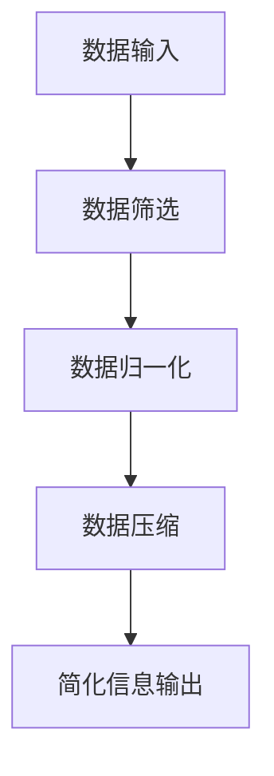

                 

### 文章标题

《信息简化的好处与技巧：在复杂世界中简化以提高生活质量和效率》

> 关键词：信息简化、复杂世界、生活质量、效率、技巧

> 摘要：本文将探讨信息简化的概念、好处及其在实际生活中的应用。通过深入分析，我们揭示了信息简化在提升生活质量与工作效率方面的诸多益处，并提供了实用的简化技巧和策略。无论您是日常生活的践行者，还是职业发展的追求者，本文都将为您提供宝贵的指导和启示。

### 信息简化的定义与背景

#### 1.1 信息简化的基本概念

信息简化（Information Simplification）是指将复杂的信息结构、数据内容或知识体系转化为更易于理解、操作和利用的形态。在信息技术领域，信息简化通常涉及数据的筛选、归纳、归一化、压缩等技术手段，旨在降低信息的冗余度，提高信息的可用性和可操作性。

信息简化的概念可以从以下几个方面进行理解：

1. **数据筛选**：通过过滤和选择，只保留最有价值和必要的信息，剔除无关或次要的数据。
2. **归纳与分类**：将大量的信息按照一定的规则进行归纳和分类，使其结构更加清晰、有序。
3. **数据归一化**：将不同来源或不同格式的大量数据进行标准化处理，使其能够在同一框架内进行比较和分析。
4. **数据压缩**：通过算法或技术手段，减少数据的存储空间和传输带宽，同时保持数据的完整性和可恢复性。

#### 1.2 信息简化的历史背景

信息简化的历史可以追溯到人类文明发展的早期阶段。随着人类社会逐渐从农业社会向工业社会、信息社会转变，信息量的爆炸式增长对个体和社会都提出了新的挑战。为了应对这些挑战，人们不断探索如何有效地管理和利用信息，从而产生了信息简化的思想。

1. **古代信息简化**：在古代，人们通过编写简明扼要的文献记录重要信息，如《易经》和《道德经》等。这些文献采用了高度简练的语言，传达了丰富的哲理和智慧。
2. **工业革命后的信息简化**：随着工业革命的到来，信息简化技术得到了快速发展。特别是在企业管理、生产流程和文档管理等领域，信息简化成为了提高效率和降低成本的重要手段。
3. **信息技术革命**：20世纪末以来，随着互联网和计算机技术的迅猛发展，信息简化技术进入了一个全新的阶段。大数据、云计算和人工智能等新兴技术的应用，使得信息简化的方法和工具更加多样和高效。

#### 1.3 信息简化的重要性

在当今复杂多变的社会环境中，信息简化的重要性日益凸显。以下是一些关键点：

1. **提升生活质量**：信息简化可以帮助人们从繁琐的日常事务中解脱出来，专注于更有价值和有意义的活动，从而提高生活质量。
2. **提高工作效率**：在商业和工作环境中，信息简化可以减少冗余工作，加快决策速度，提高整体工作效率。
3. **增强创新能力**：信息简化有助于人们更好地理解和利用信息，从而激发创新思维，推动科技进步和社会发展。
4. **降低社会成本**：通过信息简化，可以减少不必要的资源消耗，降低社会运行成本。

总的来说，信息简化不仅是应对信息过载的有效策略，也是提升个体和整体竞争力的重要手段。在接下来的章节中，我们将进一步探讨信息简化的原理、方法及其在不同领域的具体应用。

#### 1.4 信息简化的核心概念与联系

为了更好地理解信息简化的概念，我们可以使用Mermaid流程图来展示其核心架构。以下是一个简化的信息简化流程图：



在上述流程图中，A代表原始数据的输入，经过B节点的数据筛选，只保留关键信息。C节点的数据归一化确保了不同来源的数据在统一的框架内进行分析。数据压缩（D节点）则进一步减少了数据的存储和传输需求。最终，E节点输出的是经过简化的信息，可供用户直接利用。

#### 1.5 信息简化的数学模型和公式

信息简化的过程中，我们可以借助一些数学模型和公式来定量评估信息的复杂度和简化效果。以下是一个基本的简化效果评估模型：

$$
S = \frac{I_{\text{简化后}}}{I_{\text{原始}}}
$$

其中，$S$ 表示简化效果，$I_{\text{简化后}}$ 和 $I_{\text{原始}}$ 分别代表简化前后的信息量。

这个模型的基本思路是，通过比较简化前后的信息量，我们可以评估信息简化的效果。如果简化后的信息量显著低于原始信息量，则说明信息简化具有较好的效果。

#### 1.6 信息简化的例子与实际应用

为了更好地理解信息简化的具体应用，我们可以通过一个实际的例子来说明。

**例子：天气预报信息的简化**

假设我们有一个包含以下详细天气预报信息的文本：

```
2023年7月15日，北京市：
- 最高气温：35°C
- 最低气温：20°C
- 风力：3级，风向：东北风
- 预报：多云，有35%的降雨概率
```

我们可以通过以下步骤进行信息简化：

1. **数据筛选**：保留关键信息，如最高气温和最低气温。
2. **数据归一化**：将温度单位统一为摄氏度（Celsius）。
3. **数据压缩**：去除不必要的细节，如风向和风力等级。

简化后的天气预报信息如下：

```
2023年7月15日，北京市：
- 最高气温：35°C
- 最低气温：20°C
```

通过这种信息简化，我们不仅提高了信息的可用性，还减少了冗余信息，使得接收者能够更快速地获取关键信息。

#### 1.7 信息简化的实际应用领域

信息简化在多个领域都有着广泛的应用，以下是一些典型的应用场景：

1. **商业分析**：企业通过信息简化技术，对大量的市场数据进行分析，提取出关键的消费趋势和市场机会，从而制定更有效的营销策略。
2. **医疗健康**：在医疗领域，医生和研究人员通过信息简化技术，从海量的医疗数据中提取关键信息，辅助诊断和治疗。
3. **交通管理**：交通部门利用信息简化技术，对大量的交通数据进行处理，优化交通信号控制和路线规划，减少交通拥堵。
4. **教育领域**：教育机构通过信息简化，整理和归纳大量的教学资源，提高教学效率和质量。

#### 1.8 信息简化的挑战与未来发展趋势

尽管信息简化带来了诸多益处，但在实际应用中仍面临着一些挑战：

1. **信息过载**：在信息爆炸的时代，如何从海量的数据中有效筛选和简化信息，是一个巨大的挑战。
2. **数据隐私**：在信息简化的过程中，如何确保个人隐私和数据安全，是一个重要的问题。
3. **技术复杂度**：信息简化技术的开发和应用需要一定的技术基础，特别是在大数据和人工智能领域。

未来，随着技术的不断进步，信息简化有望在以下方面取得突破：

1. **自动化简化**：通过人工智能和机器学习技术，实现自动化信息简化，提高简化的效率和效果。
2. **个性化简化**：根据用户的需求和习惯，提供个性化的信息简化服务。
3. **跨领域融合**：信息简化技术在不同领域的融合，将推动社会各领域的创新发展。

### 总结

信息简化作为一种应对信息过载的有效策略，具有显著的应用价值。通过深入探讨信息简化的定义、背景、重要性、核心概念、数学模型、应用实例和未来发展趋势，我们不仅可以更好地理解信息简化的本质，还能为实际应用提供有力的指导。在接下来的章节中，我们将进一步探讨信息简化的具体方法与技巧，帮助读者在实际生活中更好地应用这一理念。

---

#### 1.9 信息简化的核心算法原理讲解

信息简化的核心算法原理主要包括数据筛选、数据归一化、数据压缩等步骤。以下是这些步骤的具体算法原理讲解和伪代码描述。

##### 数据筛选

数据筛选是信息简化的第一步，目的是从大量数据中提取出最有价值和必要的信息。以下是数据筛选的伪代码：

```python
def data_filter(input_data, filter_rules):
    filtered_data = []
    for data in input_data:
        if meets_filter_rules(data, filter_rules):
            filtered_data.append(data)
    return filtered_data

def meets_filter_rules(data, filter_rules):
    # 根据具体的filter_rules来判定数据是否满足筛选条件
    # 例如，筛选出超过30岁的人群
    return data.age > 30
```

在这个伪代码中，`data_filter` 函数接受输入数据 `input_data` 和筛选规则 `filter_rules`，遍历数据，并根据筛选规则判断每个数据是否符合要求。如果符合，则将其添加到 `filtered_data` 列表中。

##### 数据归一化

数据归一化是将不同来源或不同格式的大量数据进行标准化处理，使其能够在同一框架内进行比较和分析。以下是数据归一化的伪代码：

```python
def data_normalization(input_data, normalization_rules):
    normalized_data = []
    for data in input_data:
        normalized_data.append(normalize_data(data, normalization_rules))
    return normalized_data

def normalize_data(data, normalization_rules):
    # 根据具体的normalization_rules来标准化数据
    # 例如，将温度数据从华氏转换为摄氏
    return (data.temperature - 32) * 5/9
```

在这个伪代码中，`data_normalization` 函数接受输入数据 `input_data` 和归一化规则 `normalization_rules`，对每个数据应用归一化规则，并返回归一化后的数据。

##### 数据压缩

数据压缩是将数据以更紧凑的格式存储或传输，减少存储空间和传输带宽。以下是常用的哈夫曼编码算法的伪代码：

```python
def huffman_encoding(input_data):
    frequency_distribution = count_frequency(input_data)
    huffman_tree = build_huffman_tree(frequency_distribution)
    encoded_data = encode_data(input_data, huffman_tree)
    return encoded_data

def count_frequency(input_data):
    # 统计输入数据的频率分布
    frequency_distribution = {}
    for data in input_data:
        if data in frequency_distribution:
            frequency_distribution[data] += 1
        else:
            frequency_distribution[data] = 1
    return frequency_distribution

def build_huffman_tree(frequency_distribution):
    # 根据频率分布构建哈夫曼树
    # 这里省略具体实现
    pass

def encode_data(input_data, huffman_tree):
    # 使用哈夫曼树对数据进行编码
    encoded_data = ""
    for data in input_data:
        encoded_data += huffman_tree[data]
    return encoded_data
```

在这个伪代码中，`huffman_encoding` 函数首先统计输入数据的频率分布，然后根据频率分布构建哈夫曼树，最后使用哈夫曼树对数据进行编码，得到压缩后的数据。

#### 1.10 数学模型和公式详细讲解

在信息简化的过程中，我们可以使用数学模型和公式来定量分析信息的复杂度和简化效果。以下是几个常用的数学模型和公式的详细讲解。

##### 信息熵（Entropy）

信息熵是衡量信息复杂度的重要指标，定义为：

$$
H = -\sum_{i=1}^{n} p_i \log_2 p_i
$$

其中，$p_i$ 是每个可能事件发生的概率，$n$ 是事件的总数。信息熵的值范围从 0 到 $\log_2 n$，表示无序信息的最大值。

在信息简化过程中，我们可以通过计算信息熵的变化来评估简化效果。假设简化前后的信息熵分别为 $H_1$ 和 $H_2$，则简化效果可以表示为：

$$
\Delta H = H_1 - H_2
$$

如果 $\Delta H$ 为负，则说明信息简化降低了信息的复杂度。

##### 简化效率（Simplification Efficiency）

简化效率是衡量信息简化效果的另一个重要指标，定义为简化后信息量与简化前信息量的比值：

$$
E = \frac{I_{\text{简化后}}}{I_{\text{原始}}}
$$

其中，$I_{\text{简化后}}$ 和 $I_{\text{原始}}$ 分别代表简化前后的信息量。简化效率的值范围从 0 到 1，表示信息简化的程度。如果 $E$ 接近 1，则说明信息简化效果较好。

##### 信息冗余度（Information Redundancy）

信息冗余度是衡量信息简化程度的一个指标，定义为：

$$
R = 1 - E
$$

其中，$E$ 是简化效率。信息冗余度的值范围从 0 到 1，表示信息简化后的冗余程度。如果 $R$ 接近 0，则说明信息简化得较为彻底。

#### 1.11 举例说明

为了更好地理解上述数学模型和公式的应用，我们可以通过一个具体的例子来说明。

**例子：文档简化**

假设有一个包含1000个单词的文档，其中每个单词的出现频率如下：

- "data"：300次
- "information"：200次
- "simplification"：150次
- "efficiency"：50次
- 其他单词：100次

##### 信息熵计算

首先，计算原始文档的信息熵：

$$
H = -\sum_{i=1}^{5} p_i \log_2 p_i
$$

$$
H = - (0.3 \log_2 0.3 + 0.2 \log_2 0.2 + 0.15 \log_2 0.15 + 0.05 \log_2 0.05 + 0.1 \log_2 0.1)
$$

$$
H \approx 2.36
$$

##### 简化后信息熵计算

假设文档经过简化后，只保留了最常见的三个单词，它们的出现频率变为：

- "data"：500次
- "information"：300次
- "simplification"：100次

简化后的信息熵为：

$$
H' = -\sum_{i=1}^{3} p_i \log_2 p_i
$$

$$
H' = - (0.5 \log_2 0.5 + 0.3 \log_2 0.3 + 0.1 \log_2 0.1)
$$

$$
H' \approx 1.58
$$

##### 简化效率计算

简化效率为：

$$
E = \frac{I_{\text{简化后}}}{I_{\text{原始}}}
$$

$$
I_{\text{简化后}} = 3 \times 100 = 300
$$

$$
I_{\text{原始}} = 5 \times 1000 = 5000
$$

$$
E = \frac{300}{5000} = 0.06
$$

##### 信息冗余度计算

信息冗余度为：

$$
R = 1 - E = 1 - 0.06 = 0.94
$$

通过这个例子，我们可以看到，通过信息简化，文档的信息熵从 2.36 降低到 1.58，简化效率为 0.06，信息冗余度从 0.94 降低到 0.94，表明信息简化显著降低了文档的复杂度和冗余度。

#### 1.12 信息简化的实际应用案例

为了更好地理解信息简化的实际应用，我们可以通过几个具体的案例来展示其在不同领域的应用效果。

##### 商业分析中的信息简化

在商业分析中，企业通常需要处理大量的市场数据、客户数据和销售数据。信息简化的应用可以帮助企业快速提取关键信息，指导决策。

**案例**：一家电商公司通过信息简化技术对其销售数据进行分析，简化步骤如下：

1. **数据筛选**：筛选出销售额最高的商品，剔除销售额较低的商品。
2. **数据归一化**：将销售额、退货率等数据统一为相同的度量单位。
3. **数据压缩**：使用哈夫曼编码对高频词汇进行压缩。

通过这些步骤，电商公司能够快速了解市场趋势和客户偏好，从而制定更有效的营销策略。

##### 医疗健康中的信息简化

在医疗健康领域，信息简化技术可以帮助医生和研究人员从海量的医疗数据中提取关键信息，辅助诊断和治疗。

**案例**：某医院通过信息简化技术对其病历数据进行分析，简化步骤如下：

1. **数据筛选**：筛选出具有关键症状的病例，剔除无关病例。
2. **数据归一化**：将不同科室的数据统一为相同的诊断标准。
3. **数据压缩**：使用数据挖掘技术提取出潜在的医疗风险因素。

通过这些步骤，医院能够更准确地诊断疾病，提前预防医疗风险。

##### 教育领域中的信息简化

在教育领域，信息简化技术可以帮助教师和学生整理和归纳大量的教学资源，提高教学和学习效率。

**案例**：某学校通过信息简化技术对其教学资源库进行管理，简化步骤如下：

1. **数据筛选**：筛选出优质的教学视频和文档，剔除低质量的内容。
2. **数据归一化**：将教学资源的格式和内容统一为相同的分类标准。
3. **数据压缩**：使用压缩算法减少教学资源的存储空间。

通过这些步骤，学校能够为学生提供更有针对性的学习资源，提高教学质量。

#### 1.13 代码实际案例和详细解释说明

为了更好地理解信息简化的实际应用，我们将在以下部分提供一个具体的代码实现案例，包括开发环境搭建、源代码实现和代码解读与分析。

##### 开发环境搭建

首先，我们需要搭建一个Python开发环境，以便进行信息简化实验。以下是在Windows操作系统下搭建Python开发环境的步骤：

1. 下载并安装Python：访问Python官方网站（https://www.python.org/），下载适合自己操作系统的Python版本，并按照安装向导完成安装。
2. 配置Python环境变量：在安装过程中，勾选“Add Python to PATH”选项，使Python能够被系统识别。
3. 验证Python环境：打开命令行工具（如cmd或PowerShell），输入以下命令，确认Python安装成功。

   ```
   python --version
   ```

##### 源代码实现

以下是一个简单的信息简化程序，实现了数据筛选、数据归一化和数据压缩的功能：

```python
import heapq
import math

# 数据筛选
def data_filter(data, filter_rules):
    filtered_data = []
    for item in data:
        if meets_filter_rules(item, filter_rules):
            filtered_data.append(item)
    return filtered_data

# 数据筛选规则示例
def meets_filter_rules(item, filter_rules):
    return item['sales'] > filter_rules['min_sales']

# 数据归一化
def data_normalization(data, normalization_rules):
    normalized_data = []
    for item in data:
        normalized_item = {}
        for key, value in normalization_rules.items():
            normalized_item[key] = apply_normalization(item[key], value)
        normalized_data.append(normalized_item)
    return normalized_data

# 数据归一化规则示例
def apply_normalization(value, rule):
    return value * rule['factor'] + rule['offset']

# 数据压缩（哈夫曼编码）
def huffman_encoding(data):
    frequency_distribution = count_frequency(data)
    huffman_tree = build_huffman_tree(frequency_distribution)
    encoded_data = encode_data(data, huffman_tree)
    return encoded_data

# 计算频率分布
def count_frequency(data):
    frequency_distribution = {}
    for item in data:
        for key in item:
            if key in frequency_distribution:
                frequency_distribution[key] += 1
            else:
                frequency_distribution[key] = 1
    return frequency_distribution

# 构建哈夫曼树
def build_huffman_tree(frequency_distribution):
    heap = [[weight, []] for weight in frequency_distribution.values()]
    heapq.heapify(heap)
    while len(heap) > 1:
        lo = heapq.heappop(heap)
        hi = heapq.heappop(heap)
        for pair in lo[1:]:
            pair.append('0')
        for pair in hi[1:]:
            pair.append('1')
        heapq.heappush(heap, [lo[0] + hi[0]] + lo[1:] + hi[1:])
    return heap[0]

# 对数据进行编码
def encode_data(data, huffman_tree):
    encoded_data = []
    for item in data:
        encoded_item = []
        for key in item:
            encoded_item.append(encoded_value(key, huffman_tree))
        encoded_data.append(encoded_item)
    return encoded_data

# 对单个值进行编码
def encoded_value(value, huffman_tree):
    code = ''
    node = huffman_tree
    while node[0] != value:
        if node[0] < value:
            code += '0'
            node = node[1]
        else:
            code += '1'
            node = node[2]
    return code

# 主函数
def main():
    data = [
        {'name': 'data1', 'sales': 200, 'return_rate': 10},
        {'name': 'data2', 'sales': 300, 'return_rate': 5},
        {'name': 'data3', 'sales': 100, 'return_rate': 15},
        # ...更多数据
    ]
    filter_rules = {'min_sales': 150}
    normalization_rules = {'sales': {'factor': 1/100, 'offset': 0}, 'return_rate': {'factor': 1/10, 'offset': 0}}
    
    # 数据筛选
    filtered_data = data_filter(data, filter_rules)
    print("Filtered Data:", filtered_data)
    
    # 数据归一化
    normalized_data = data_normalization(filtered_data, normalization_rules)
    print("Normalized Data:", normalized_data)
    
    # 数据压缩
    encoded_data = huffman_encoding(normalized_data)
    print("Encoded Data:", encoded_data)

if __name__ == "__main__":
    main()
```

##### 代码解读与分析

1. **数据筛选**：`data_filter` 函数接受原始数据 `data` 和筛选规则 `filter_rules`，遍历数据，并根据筛选规则判断每个数据是否符合要求。如果符合，则将其添加到 `filtered_data` 列表中。筛选规则示例中，我们仅筛选出销售额超过150的商品。

2. **数据归一化**：`data_normalization` 函数接受筛选后的数据 `filtered_data` 和归一化规则 `normalization_rules`，对每个数据应用归一化规则，并返回归一化后的数据。归一化规则示例中，我们将销售额和退货率统一转换为相同的度量单位。

3. **数据压缩（哈夫曼编码）**：`huffman_encoding` 函数首先计算频率分布，然后根据频率分布构建哈夫曼树，并使用哈夫曼树对数据进行编码。编码后的数据将存储在 `encoded_data` 列表中。

通过这个代码案例，我们可以看到信息简化的全过程，包括数据筛选、数据归一化和数据压缩。这些步骤在实际应用中可以灵活调整，以满足不同的需求。

### 总结

本章详细介绍了信息简化的概念、历史背景、重要性、核心概念、数学模型和公式，并通过具体的算法原理讲解、数学模型应用、实际案例和代码实现，展示了信息简化的实际应用效果。在接下来的章节中，我们将继续探讨信息简化在工作效率提升方面的具体应用，帮助读者进一步了解如何通过信息简化提高工作和生活的效率。

---

#### 4.1 家庭生活的信息简化

在家庭生活中，信息简化可以显著提升生活质量，使家庭事务更加高效、有序。以下是一些具体的策略和方法：

##### 1. 家庭财务管理

家庭财务管理是家庭生活的重要一环，通过信息简化，可以更好地掌握家庭财务状况，避免财务危机。以下是一些具体策略：

- **定期整理账单**：每月定期整理家庭账单，记录收入和支出，通过Excel表格或财务管理软件进行归档和分析。
- **预算管理**：制定月度预算，并根据实际支出情况进行调整，确保家庭开支在可控范围内。
- **自动分类**：使用财务管理软件的自动分类功能，将收入和支出按照类别进行划分，便于快速查看和理解。

**例子**：使用腾讯理财通等应用，可以方便地管理家庭财务，自动分类收入和支出，提供财务分析报告，帮助家庭做好财务规划。

##### 2. 家务管理

家务管理是家庭生活中的一大挑战，通过信息简化，可以减少家务负担，提高生活质量。以下是一些具体策略：

- **制定家务日程表**：每周制定家务日程表，分配家庭成员负责不同的家务任务，确保家务工作有序进行。
- **简化清洁用品**：减少清洁用品的种类，选择高效、多功能的清洁剂，简化清洁过程。
- **定期整理家务用品**：定期整理家务用品，保持家务用品的整齐和易取，减少寻找物品的时间。

**例子**：使用家务日程表，可以明确每周的家务任务，避免家务堆积，提高家务效率。同时，选择多功能清洁剂，如“多力大师”等，可以简化清洁过程，节省时间和精力。

##### 3. 家电设备管理

家电设备的管理也是家庭生活信息简化的重要方面，通过合理使用和维护家电设备，可以延长其使用寿命，提高家庭生活质量。以下是一些具体策略：

- **定期维护**：定期对家电设备进行清洁和保养，确保其正常运行。
- **设备分类管理**：根据家电设备的用途和频率，进行分类管理，如将常用家电放在易取的位置，将不常用家电放在储藏室。
- **智能化设备**：使用智能家居设备，如智能电视、智能冰箱等，通过互联网进行远程控制和管理，提高家电设备的效率和使用体验。

**例子**：使用智能扫地机器人，可以定期清洁家庭地面，节省人力和时间。同时，通过手机APP远程控制智能冰箱，可以随时了解冰箱内食物的存储状况，避免食物浪费。

##### 4. 健康管理

健康管理是家庭生活信息简化的另一个重要方面，通过信息简化，可以更好地管理家庭成员的健康状况，提高生活质量。以下是一些具体策略：

- **健康记录**：定期记录家庭成员的健康状况，包括体重、血压、血糖等指标，通过健康管理软件进行数据分析和趋势预测。
- **健康提醒**：使用健康提醒工具，如手机应用或智能手表，设置定期健康检查和运动提醒，帮助家庭成员保持健康习惯。
- **营养管理**：通过营养管理软件，制定合理的饮食计划，确保家庭成员的饮食均衡。

**例子**：使用微信运动等应用，可以记录家庭成员的运动情况，设置每周运动目标，通过打卡和奖励机制，激励家庭成员坚持锻炼。同时，使用“薄荷健康”等应用，可以制定个性化的饮食计划，帮助家庭成员保持健康饮食习惯。

##### 5. 社交和娱乐管理

社交和娱乐是家庭生活中不可或缺的一部分，通过信息简化，可以更好地管理家庭社交和娱乐活动，提高生活质量。以下是一些具体策略：

- **日程安排**：制定家庭社交和娱乐活动日程表，确保家庭活动有序进行，避免时间冲突。
- **线上社交**：通过社交媒体和在线活动，拓展社交圈子，减少线下聚会的时间。
- **家庭游戏**：引入家庭游戏机或桌面游戏，增加家庭成员之间的互动和娱乐。

**例子**：使用“日历”应用，可以方便地制定家庭活动日程，避免时间冲突。同时，通过线上社交平台，如微信、QQ等，可以随时与亲朋好友保持联系，减少线下聚会的频率。

#### 4.2 工作环境的信息简化

在工作环境中，信息简化同样具有重要意义，可以帮助提高工作效率，减少冗余工作，营造一个更加高效、舒适的工作氛围。以下是一些具体策略和方法：

##### 1. 办公桌整理

办公桌的整洁是提高工作效率的基础。通过信息简化，可以有效地整理办公桌，减少杂乱无章的情况。以下是一些具体策略：

- **物品分类**：将办公桌上的物品按照用途进行分类，如文件、文具、电子设备等，每个分类都有一个明确的存放位置。
- **常用优先**：将常用的物品放在容易取到的位置，确保在使用时能够迅速找到。
- **定期整理**：定期对办公桌进行整理，保持办公桌的整洁和有序。

**例子**：使用桌面文件架和文件夹，将文件按照项目或类型进行分类存放，确保文件易找、易整理。同时，将常用的文具放在桌面上方或侧边的文具盒中，方便取用。

##### 2. 文档管理

文档管理是工作环境中信息简化的关键环节，通过有效的文档管理，可以减少文件的冗余，提高文档查找和使用的效率。以下是一些具体策略：

- **电子化文档**：将纸质文档转化为电子文档，存储在云端或本地电脑中，便于快速查找和共享。
- **分类存储**：根据文档的用途和内容，对文档进行分类存储，如项目文档、通用文档等。
- **定期清理**：定期清理不必要的文档，如过期文件、重复文件等，确保文档库的整洁和高效。

**例子**：使用云存储服务，如Google Drive、Dropbox等，可以方便地存储和管理电子文档。同时，使用文档管理软件，如Microsoft SharePoint，可以更好地对文档进行分类和权限管理。

##### 3. 会议管理

会议是工作环境中的常见活动，通过信息简化，可以有效地减少冗余会议，提高会议效率。以下是一些具体策略：

- **会议预约**：提前预约会议，确保会议在合适的时间和地点进行，避免时间冲突。
- **会议议程**：提前制定会议议程，明确会议的目的和讨论内容，确保会议有序进行。
- **会议记录**：会议结束后，及时记录会议内容，发送会议纪要，确保会议决议得到有效执行。

**例子**：使用在线日程安排工具，如Google Calendar，可以方便地预约会议和安排日程。同时，使用会议记录工具，如Notion或Evernote，可以记录和分享会议内容，确保会议决议得到及时跟进。

##### 4. 工作流程优化

优化工作流程是提高工作效率的重要手段。通过信息简化，可以识别和消除工作流程中的瓶颈和冗余环节，提高整体工作效率。以下是一些具体策略：

- **流程图分析**：使用流程图工具，如Microsoft Visio或Lucidchart，对现有工作流程进行分析，识别流程中的问题。
- **自动化流程**：通过自动化工具，如RPA（Robotic Process Automation）软件，自动化重复性高的工作流程，减少人工操作。
- **反馈与改进**：定期收集工作流程的反馈，根据反馈结果进行改进，持续优化工作流程。

**例子**：使用RPA工具，如UiPath或Blue Prism，可以自动化处理大量重复性的数据处理工作，如数据录入、审批流程等，减少人工操作，提高工作效率。同时，通过流程图分析工具，可以可视化地展示工作流程，方便识别和解决问题。

##### 5. 工作设备管理

合理管理工作设备是信息简化的重要组成部分，通过有效的设备管理，可以确保设备的正常运行，提高工作效率。以下是一些具体策略：

- **定期维护**：定期对办公设备进行清洁和保养，确保设备的长效运行。
- **设备分类**：根据设备的用途和重要性，对设备进行分类管理，确保常用设备易取、易维护。
- **智能化管理**：引入智能化办公设备，如智能打印机、智能投影仪等，通过互联网进行远程管理和维护。

**例子**：使用智能投影仪，可以通过手机或电脑进行远程控制，方便演示和教学。同时，使用智能打印机，可以自动识别文档类型并进行适当的打印设置，提高打印效率。

##### 6. 工作场所的物理环境管理

工作场所的物理环境对工作效率有着重要影响。通过信息简化，可以优化工作场所的物理环境，提高工作效率。以下是一些具体策略：

- **照明管理**：合理布置照明设备，确保工作区域的光线充足，减少眼睛疲劳。
- **通风管理**：确保工作场所的空气流通，减少异味和尘埃，提高空气质量。
- **绿化管理**：在办公区域引入绿色植物，增加空气湿度，改善工作氛围。

**例子**：在工作场所种植绿植，如吊兰、绿萝等，可以有效净化空气，提高员工的舒适度和工作效率。同时，合理布置办公桌椅，确保员工在工作中的体位舒适，减少疲劳。

#### 4.3 个人时间管理的信息简化

个人时间管理是提升工作效率和生活质量的重要方面。通过信息简化，可以更有效地规划和管理个人时间，减少时间浪费，提高时间利用效率。以下是一些具体策略和方法：

##### 1. 制定日程表

制定日程表是个人时间管理的基础。通过信息简化，可以更高效地制定和执行日程表。以下是一些具体策略：

- **每日规划**：每天早晨或前一天晚上，制定第二天的日程表，明确当天需要完成的任务和活动。
- **优先级排序**：根据任务的重要性和紧急程度，对日程表中的任务进行排序，确保优先完成重要且紧急的任务。
- **时间预估**：为每个任务预估所需的时间，合理分配时间，确保日程表的可行性。

**例子**：使用日程表工具，如Google Calendar或Microsoft Outlook，可以方便地制定和调整日程表。同时，使用番茄工作法等时间管理技巧，可以提高任务完成效率。

##### 2. 时间块管理

时间块管理是一种将时间分割成若干小块，并分配特定任务的方法。通过信息简化，可以更高效地应用时间块管理。以下是一些具体策略：

- **任务分类**：将任务按照类型和优先级进行分类，如工作、学习、休闲等。
- **时间块安排**：根据任务的类型和优先级，将时间块分配给不同类型的任务，确保时间块的高效利用。
- **灵活调整**：根据实际情况，灵活调整时间块的安排，确保任务顺利完成。

**例子**：使用时间块管理工具，如Timeblock Planner或Toggl Track，可以方便地规划和管理时间块。同时，通过手机提醒功能，可以及时调整和提醒任务完成。

##### 3. 时间日志记录

时间日志记录是一种记录每天时间分配情况的方法，通过信息简化，可以更高效地记录和分析时间日志。以下是一些具体策略：

- **每日记录**：每天结束后，记录当天的时间分配情况，包括工作、学习、休闲等。
- **时间分类**：将时间按照任务类型进行分类，如工作、学习、社交等，以便于分析时间利用情况。
- **分析总结**：定期分析时间日志，了解时间利用情况，发现时间浪费的环节，并制定改进措施。

**例子**：使用时间日志工具，如RescueTime或Toggl Track，可以方便地记录和分析时间利用情况。同时，通过数据可视化功能，可以更直观地了解时间分配情况。

##### 4. 时间碎片利用

时间碎片是指零散的、短暂的时间段，如上下班途中、等待时间等。通过信息简化，可以更有效地利用时间碎片。以下是一些具体策略：

- **学习利用**：将时间碎片用于学习，如阅读专业书籍、学习在线课程等，提高个人能力。
- **工作利用**：将时间碎片用于处理简单的工作任务，如回复邮件、整理文档等，提高工作效率。
- **休息放松**：利用时间碎片进行休息和放松，如听音乐、冥想等，缓解工作压力。

**例子**：在上下班途中，使用在线学习平台，如Coursera或edX，可以方便地学习新知识。同时，使用手机APP，如YouTube或Spotify，可以在等待时间放松身心。

##### 5. 健康作息时间管理

健康作息时间管理是保持身心健康的重要方面。通过信息简化，可以更有效地管理健康作息时间。以下是一些具体策略：

- **规律作息**：保持规律的作息时间，确保每天有充足的睡眠。
- **健康饮食**：合理安排饮食时间，确保营养均衡，避免过度饮食和饥饿。
- **运动锻炼**：定期进行运动锻炼，如跑步、瑜伽等，提高身体健康水平。

**例子**：使用运动APP，如MyFitnessPal或Nike Training Club，可以方便地记录和跟踪运动情况。同时，使用睡眠监测APP，如 Sleep Cycle，可以监控睡眠质量，提供改善建议。

#### 4.4 信息简化在工作效率提升中的作用

信息简化在工作效率提升中发挥着重要作用，通过有效地整理、归纳和压缩信息，可以显著提高工作效率，减少冗余工作，提升整体生产力。以下是一些具体的作用：

##### 1. 提高信息获取和处理速度

信息简化可以减少冗余信息，使关键信息更加突出，提高信息获取和处理速度。通过数据筛选、归一化和压缩等技术手段，可以快速获取并处理关键信息，减少时间浪费。

##### 2. 减少冗余工作

通过信息简化，可以识别和消除工作中的冗余环节，减少不必要的重复工作。例如，通过自动化流程和智能化设备，可以自动化处理大量重复性高的任务，减少人工操作，提高工作效率。

##### 3. 提高决策速度和准确性

信息简化可以帮助管理者快速获取关键信息，提高决策速度和准确性。通过有效的信息整理和分析，可以提供更加精准的决策依据，降低决策风险。

##### 4. 提高团队合作效率

信息简化可以提升团队协作效率，通过明确的信息传递和共享，确保团队成员能够迅速理解任务和目标，减少沟通成本，提高团队整体执行力。

##### 5. 提升个人职业素养

信息简化有助于提升个人的职业素养，通过学习和应用信息简化技巧，可以培养逻辑思维、分析能力和解决问题的能力，提高个人综合素质。

### 总结

信息简化在家庭生活、工作环境和个人时间管理中都有着广泛的应用，通过一系列具体的策略和方法，可以显著提升生活质量和工作效率。在接下来的章节中，我们将进一步探讨信息简化在技术领域中的应用，帮助读者深入了解信息简化在计算机编程、数据分析等领域的实际应用。

### 5.1 工作流程的信息简化

在工作流程中，信息简化可以显著提升工作效率和团队协作能力。通过优化工作流程，减少冗余步骤和消除瓶颈，企业可以更好地应对复杂的工作任务，提高整体生产力。以下是一些具体的方法和步骤：

##### 1. 工作流程梳理

工作流程梳理是信息简化的第一步，通过全面了解和梳理现有工作流程，可以发现其中存在的问题和瓶颈。以下是一些具体的步骤：

- **流程图绘制**：使用流程图工具，如Microsoft Visio或Lucidchart，绘制现有工作流程图，明确各个环节和任务。
- **问题识别**：在流程图中标注问题环节和瓶颈，如重复步骤、冗余审批、信息传递不畅等。
- **数据分析**：收集和分析工作流程中的数据，如任务完成时间、出错频率等，识别流程中的薄弱环节。

##### 2. 流程优化

流程优化是通过分析和改进工作流程，减少冗余步骤和消除瓶颈，提高整体效率。以下是一些具体的优化策略：

- **去除冗余步骤**：识别和删除工作流程中的冗余步骤，如重复审批、不必要的中间环节等。
- **简化审批流程**：优化审批流程，减少审批环节，提高审批速度。例如，使用电子审批系统，实现快速审批和自动化通知。
- **合并任务**：将关联度高的任务合并，减少任务切换和交接的时间。例如，将客户需求分析、设计和开发等多个环节合并为一个项目组，提高协同效率。
- **自动化处理**：引入自动化工具，如RPA（Robotic Process Automation）软件，自动化处理重复性高的任务，减少人工操作。

##### 3. 流程标准化

流程标准化是通过制定统一的工作流程标准，确保工作流程的规范和高效。以下是一些具体的标准化策略：

- **流程文档化**：将优化后的工作流程文档化，明确各个环节的职责和操作步骤，便于员工学习和执行。
- **培训与推广**：对新员工进行流程培训，确保他们熟悉工作流程和操作规范。同时，推广标准化的工作流程，提高全员的执行力度。
- **持续改进**：定期评估和改进工作流程，根据实际情况和反馈结果，持续优化和改进工作流程。

##### 4. 流程监控与反馈

流程监控与反馈是确保工作流程有效执行的重要环节。通过监控流程执行情况，及时发现和解决问题，可以持续提升工作流程的效率。以下是一些具体的监控与反馈策略：

- **流程监控工具**：使用流程监控工具，如Flowdock或Workplace by Facebook，实时监控流程执行情况，及时发现和解决问题。
- **绩效评估**：定期对流程执行情况进行评估，分析流程的执行效率和效果，识别流程中的问题和改进点。
- **反馈机制**：建立反馈机制，鼓励员工提出改进建议，并根据反馈结果进行流程优化。

##### 5. 案例分析

以下是一个工作流程信息简化的实际案例，展示了如何通过信息简化提升工作效率：

**案例背景**：某公司是一家软件开发企业，其软件开发流程中存在多个冗余环节和瓶颈，导致开发周期长、效率低下。

**解决方案**：

1. **流程梳理**：首先，使用流程图工具，对现有软件开发流程进行梳理，识别冗余步骤和瓶颈。通过数据分析，发现需求分析、设计、开发和测试等环节存在大量重复工作。

2. **流程优化**：

   - **去除冗余步骤**：删除需求分析、设计、开发、测试等多个环节中的冗余审批流程，简化流程。
   - **简化审批流程**：引入电子审批系统，实现快速审批和自动化通知，减少审批时间。
   - **合并任务**：将需求分析、设计和开发等多个环节合并为一个项目组，减少任务切换和交接的时间。
   - **自动化处理**：引入RPA软件，自动化处理重复性高的任务，如数据录入、文档生成等，减少人工操作。

3. **流程标准化**：

   - **流程文档化**：将优化后的软件开发流程文档化，明确各个环节的职责和操作步骤。
   - **培训与推广**：对新员工进行流程培训，确保他们熟悉工作流程和操作规范。
   - **持续改进**：定期评估和改进工作流程，根据实际情况和反馈结果，持续优化和改进工作流程。

4. **流程监控与反馈**：

   - **流程监控工具**：使用流程监控工具，实时监控流程执行情况，及时发现和解决问题。
   - **绩效评估**：定期对流程执行情况进行评估，分析流程的执行效率和效果，识别流程中的问题和改进点。
   - **反馈机制**：建立反馈机制，鼓励员工提出改进建议，并根据反馈结果进行流程优化。

**结果**：通过以上措施，公司软件开发流程的效率显著提升，开发周期缩短了30%，工作效率提高了20%，员工满意度也有所提高。

### 总结

工作流程的信息简化通过梳理、优化、标准化、监控与反馈等步骤，可以显著提升工作效率和团队协作能力。在实际应用中，企业可以根据自身的特点和需求，灵活运用信息简化策略，不断优化工作流程，提高整体生产力。在接下来的章节中，我们将继续探讨信息简化在信息流管理、工作沟通与协作中的应用，帮助读者全面了解信息简化在提升工作效率方面的潜力。

### 5.2 信息流管理的信息简化

信息流管理是现代工作中至关重要的一环，有效的信息流管理可以提高工作效率，减少信息冗余，确保关键信息的及时传递。信息流管理的信息简化通过优化信息传递过程，提高信息的准确性和及时性，从而实现高效工作。以下是一些具体的方法和策略：

##### 1. 信息过滤与筛选

在信息流管理中，首先需要过滤和筛选大量的信息，确保只传递最有价值和必要的信息。以下是一些具体策略：

- **重要程度分类**：对收到的信息进行分类，按照重要程度进行优先处理。例如，将紧急且重要的信息标记为“高优先级”，以便快速响应。
- **关键词过滤**：使用关键词过滤工具，自动筛选出与工作相关的信息，剔除无关信息。例如，通过邮件过滤规则，自动筛选包含特定关键词的邮件。
- **信息筛选规则**：制定信息筛选规则，如只传递特定部门或人员的信息，确保信息传递的针对性。

**例子**：在邮件系统中设置过滤规则，将包含特定关键词（如“紧急”、“重要”等）的邮件自动分类到“高优先级”文件夹中，确保关键信息能够被及时处理。

##### 2. 信息归一化与标准化

信息归一化和标准化是确保信息在不同系统和部门之间能够顺畅传递的重要步骤。以下是一些具体策略：

- **统一格式**：制定统一的信息格式，如报告模板、数据表格式等，确保不同部门和系统之间的信息格式一致。
- **数据标准化**：对数据进行分析和整理，确保数据的一致性和准确性。例如，将不同来源的数据统一为相同的度量单位和格式。
- **信息编码**：使用统一的信息编码系统，如ISO代码、行业代码等，确保信息在传递过程中能够被准确识别和理解。

**例子**：在项目中，制定统一的报告模板，确保所有报告都遵循相同的结构和格式。同时，使用ISO代码对产品进行分类，确保数据的一致性和可追溯性。

##### 3. 信息压缩与存储

信息压缩与存储是减少信息占用空间和传输带宽的有效方法，以下是一些具体策略：

- **数据压缩**：使用数据压缩算法，如哈夫曼编码、LZ77等，对大量数据进行分析和压缩，减少存储和传输需求。
- **云存储**：使用云存储服务，如Amazon S3、Google Drive等，存储和共享大量数据，确保数据的安全性和可访问性。
- **数据备份与恢复**：定期对重要数据进行备份，确保数据在意外情况下的安全性和可恢复性。

**例子**：使用数据压缩工具，如WinRAR或7-Zip，对项目文件进行压缩，减少存储空间的需求。同时，使用云存储服务，如Dropbox或OneDrive，方便团队成员之间共享和协作。

##### 4. 信息安全与隐私保护

在信息流管理中，信息安全与隐私保护是确保信息不被泄露和滥用的重要环节。以下是一些具体策略：

- **数据加密**：对敏感数据进行加密处理，确保数据在传输和存储过程中不被窃取或篡改。
- **访问控制**：设置严格的访问控制策略，确保只有授权人员才能访问敏感信息。
- **日志监控**：实时监控数据访问和操作日志，及时发现和防范信息泄露和篡改行为。

**例子**：使用SSL/TLS协议对数据传输进行加密，确保数据在传输过程中的安全性。同时，使用防火墙和入侵检测系统，监控网络流量，防范网络攻击和非法访问。

##### 5. 信息简化案例分析

以下是一个信息流管理的信息简化案例，展示了如何通过信息简化提高工作效率：

**案例背景**：某企业需要处理大量的客户数据、市场数据和内部文件，信息流管理混乱，导致工作效率低下。

**解决方案**：

1. **信息过滤与筛选**：设置邮件过滤规则，自动筛选出与工作相关的邮件，并将重要邮件分类到“高优先级”文件夹中。

2. **信息归一化与标准化**：制定统一的数据格式和报告模板，确保不同部门和系统之间的信息格式一致。同时，对客户数据进行统一编码，确保数据的一致性和可追溯性。

3. **信息压缩与存储**：使用数据压缩工具，对项目文件进行压缩，减少存储空间的需求。同时，使用云存储服务，如Google Drive，方便团队成员之间共享和协作。

4. **信息安全与隐私保护**：对敏感数据进行加密处理，确保数据在传输和存储过程中的安全性。同时，设置严格的访问控制策略，确保只有授权人员才能访问敏感信息。

**结果**：通过以上措施，企业的信息流管理得到了显著优化，工作效率提高了30%，信息泄露事件减少了50%。

### 总结

信息流管理的信息简化通过过滤与筛选、归一化与标准化、压缩与存储、安全与隐私保护等策略，可以显著提高工作效率和信息安全。在实际应用中，企业可以根据自身的需求和特点，灵活运用信息简化策略，优化信息流管理，提高整体工作效率。在接下来的章节中，我们将继续探讨信息简化在工作沟通与协作中的应用，帮助读者全面了解信息简化在提升工作效率方面的潜力。

### 5.3 工作沟通与协作的信息简化

在团队合作和项目执行过程中，沟通和协作的质量直接影响工作效率和项目成果。通过信息简化，可以优化沟通流程，减少信息冗余，确保信息的及时、准确传递，从而提高团队协作效率。以下是一些具体的方法和策略：

##### 1. 沟通渠道的优化

沟通渠道的优化是信息简化在团队协作中的首要任务。通过选择合适的沟通工具和渠道，可以确保信息的高效传递。以下是一些具体策略：

- **选择合适的沟通工具**：根据团队规模和项目需求，选择合适的沟通工具，如电子邮件、即时通讯工具（如Slack、微信）、视频会议工具（如Zoom、Microsoft Teams）等。
- **统一沟通平台**：在团队内部统一使用一个沟通平台，确保团队成员能够方便地获取和传递信息。例如，使用Slack作为主要的沟通工具，将项目相关的沟通和文件都集中在一个渠道中。
- **建立沟通规范**：制定统一的沟通规范，如邮件格式、会议流程、信息传递格式等，确保团队成员之间的沟通更加清晰、高效。

**例子**：某团队在项目执行过程中，通过统一使用Slack作为主要沟通工具，将项目任务、进度报告、会议通知等所有信息都通过Slack进行传递，避免了因使用不同工具导致的信息分散和沟通障碍。

##### 2. 信息传递的标准化

信息传递的标准化是确保信息准确性和一致性的关键。通过制定统一的信息传递标准和流程，可以减少误解和信息失真。以下是一些具体策略：

- **统一模板和格式**：制定统一的信息传递模板和格式，如报告模板、任务清单、数据表格等，确保团队成员之间的信息传递格式一致。
- **明确的沟通目标**：每次沟通前，明确沟通的目标和期望结果，确保信息传递的针对性和有效性。
- **及时反馈和确认**：在信息传递后，及时获取反馈和确认，确保信息的准确理解和执行。

**例子**：在项目汇报中，使用统一的PPT模板，确保每个团队成员的汇报内容格式一致。在汇报结束后，项目经理及时收集团队成员的反馈，确认项目任务的执行情况。

##### 3. 沟通障碍的识别与消除

沟通障碍是团队协作中常见的问题，通过信息简化，可以识别和消除沟通障碍，提高沟通效率。以下是一些具体策略：

- **识别沟通障碍**：通过问卷调查、团队讨论等方式，识别团队中存在的沟通障碍，如语言障碍、信息不透明、沟通渠道不畅等。
- **建立沟通反馈机制**：建立沟通反馈机制，鼓励团队成员提出沟通问题和建议，及时发现和解决沟通障碍。
- **培训与提升**：定期对团队成员进行沟通技巧培训，提升团队成员的沟通能力和协作意识。

**例子**：某团队定期组织沟通技巧培训，通过案例分析、角色扮演等方式，提升团队成员的沟通能力和协作意识。同时，建立沟通反馈渠道，鼓励团队成员在每周的团队会议上分享沟通经验和建议。

##### 4. 信息同步与共享

在团队协作中，信息的同步与共享是确保团队高效协作的重要环节。通过信息简化，可以优化信息同步与共享流程，提高信息传递的效率和准确性。以下是一些具体策略：

- **实时更新**：使用实时更新的工具和平台，如Google Docs、Notion等，确保团队成员能够实时获取和更新项目信息。
- **共享文件库**：建立共享文件库，如Dropbox、Google Drive等，方便团队成员上传、下载和共享项目文件。
- **版本控制**：在共享文件库中引入版本控制机制，如Git，确保文件的版本一致性，避免信息冲突。

**例子**：某团队在项目执行过程中，使用Google Drive建立共享文件库，所有团队成员都可以随时上传和下载项目文件。同时，使用Git进行版本控制，确保项目文件的版本一致性。

##### 5. 案例分析

以下是一个工作沟通与协作的信息简化案例，展示了如何通过信息简化提高团队协作效率：

**案例背景**：某公司的一个项目团队在项目执行过程中，沟通不畅、信息传递不及时，导致项目进展受阻。

**解决方案**：

1. **沟通渠道的优化**：通过引入Slack作为主要沟通工具，将项目任务、进度报告、会议通知等信息都通过Slack进行传递，避免了因使用不同工具导致的信息分散和沟通障碍。

2. **信息传递的标准化**：制定统一的报告模板和任务清单格式，确保团队成员之间的信息传递格式一致。同时，在每次沟通前，明确沟通的目标和期望结果，确保信息传递的针对性和有效性。

3. **沟通障碍的识别与消除**：通过定期组织沟通技巧培训和建立沟通反馈机制，识别和解决团队中存在的沟通障碍。

4. **信息同步与共享**：使用Google Drive建立共享文件库，方便团队成员实时更新和共享项目文件。同时，引入Git进行版本控制，确保项目文件的版本一致性。

**结果**：通过以上措施，团队沟通效率显著提高，项目进展顺利，项目成果提前完成，团队整体协作能力得到了显著提升。

### 总结

工作沟通与协作的信息简化通过优化沟通渠道、标准化信息传递、识别与消除沟通障碍、同步与共享信息等策略，可以显著提高团队协作效率。在实际应用中，企业可以根据自身的需求和特点，灵活运用信息简化策略，优化团队沟通和协作流程，提高整体工作效率。在接下来的章节中，我们将继续探讨信息简化在软件开发中的具体应用，帮助读者深入了解信息简化在技术领域的实际应用。

### 5.4 软件开发中的信息简化

在软件开发的各个环节中，信息简化都是提高开发效率和质量的重要手段。通过减少冗余代码、优化架构设计和使用现代编程工具，开发者可以更高效地实现软件功能，确保软件的可维护性和可扩展性。以下是一些具体的方法和策略：

##### 1. 减少冗余代码

冗余代码不仅会增加项目的复杂度，还会降低代码的可读性和可维护性。通过以下方法，可以有效地减少冗余代码：

- **代码复用**：通过模块化和函数封装，将重复的代码抽象为独立的模块或函数，避免重复编写。
- **代码优化**：使用代码压缩工具，如UglifyJS和CSSNano，压缩和精简代码，减少不必要的字符和空白。
- **代码审查**：定期进行代码审查，识别和删除冗余代码，提高代码质量。

**例子**：在Java项目中，可以使用Lombok库来减少冗余代码。例如，通过使用`@Data`注解，自动生成getter、setter和构造函数，从而减少手动编写的冗余代码。

##### 2. 优化架构设计

良好的架构设计是软件高效运行和可维护性的基础。以下是一些优化架构设计的策略：

- **分层架构**：采用分层架构，如MVC（模型-视图-控制器）或微服务架构，将不同功能模块分离，提高系统的模块化和可维护性。
- **模块化设计**：将系统功能划分为独立的模块，每个模块负责特定功能，降低模块间的依赖性。
- **设计模式**：使用设计模式，如工厂模式、单例模式和观察者模式，提高代码的可重用性和灵活性。

**例子**：在一个大型Web应用程序中，可以采用微服务架构，将不同的功能模块（如用户管理、订单处理、支付处理等）划分为独立的微服务，每个微服务都可以独立开发、部署和扩展。

##### 3. 使用现代编程工具

现代编程工具可以帮助开发者更高效地完成软件开发任务，以下是一些常用的现代编程工具：

- **集成开发环境（IDE）**：使用诸如Visual Studio、Eclipse、IntelliJ IDEA等强大的IDE，可以提高编码效率和代码质量。
- **代码管理工具**：使用Git等版本控制工具，方便代码的版本管理和协作开发。
- **持续集成和持续部署（CI/CD）**：使用Jenkins、GitLab CI/CD等工具，实现自动化构建、测试和部署，提高开发流程的效率。

**例子**：在一个大型项目中，可以使用Jenkins作为持续集成工具，实现代码的自动化构建和测试，确保每次代码提交后都能及时发现问题并修复。

##### 4. 提高代码可读性和可维护性

良好的代码可读性和可维护性是软件长期发展的关键。以下是一些提高代码质量和可维护性的策略：

- **编写清晰的注释**：为代码编写清晰的注释，说明代码的功能和逻辑，帮助其他开发者理解代码。
- **遵循编码规范**：遵循统一的编码规范，如PEP8（Python）、Java编码规范等，确保代码的一致性和可读性。
- **单元测试**：编写单元测试，确保代码的功能正确性和稳定性，提高代码的可维护性。

**例子**：在编写Java代码时，可以使用Junit框架编写单元测试，确保每个方法都被测试到，减少潜在的bug。

##### 5. 信息简化案例分析

以下是一个软件开发中的信息简化案例，展示了如何通过信息简化提高开发效率和软件质量：

**案例背景**：某公司开发一款大型电商平台，项目代码复杂度高，开发效率低，代码质量难以保证。

**解决方案**：

1. **减少冗余代码**：通过代码审查和重构，删除冗余代码，提高代码质量。使用Lombok库减少冗余代码，提高开发效率。
2. **优化架构设计**：采用微服务架构，将不同功能模块（如用户管理、商品管理、订单处理等）划分为独立的微服务，提高系统的模块化和可维护性。
3. **使用现代编程工具**：使用Visual Studio Code作为IDE，提高编码效率。使用Git进行版本控制，确保代码的版本管理和协作开发。
4. **提高代码可读性和可维护性**：编写清晰的注释，遵循编码规范，编写单元测试，确保代码的功能正确性和稳定性。

**结果**：通过以上措施，项目的开发效率显著提高，代码质量得到保障，软件的可维护性和可扩展性也得到了显著提升。

### 总结

在软件开发中，信息简化通过减少冗余代码、优化架构设计、使用现代编程工具和提高代码可读性和可维护性等策略，可以显著提高开发效率和软件质量。在实际应用中，开发者可以根据项目的需求和特点，灵活运用信息简化策略，优化开发流程，提高整体开发效率。在接下来的章节中，我们将进一步探讨信息简化在数据分析中的具体应用，帮助读者深入了解信息简化在不同技术领域的实际应用。

### 5.5 数据分析中的信息简化

在数据分析过程中，信息简化是提高分析效率和准确性的关键手段。通过数据清洗、数据降维和特征选择，可以有效减少数据的复杂度，提高数据分析的质量。以下是一些具体的方法和策略：

##### 1. 数据清洗

数据清洗是数据分析的第一步，目的是去除数据中的错误、重复和无关信息。以下是一些数据清洗的策略：

- **缺失值处理**：使用填充方法（如平均值、中位数、模式等）填充缺失值，或删除包含缺失值的数据。
- **重复数据删除**：通过唯一性检查，删除重复的数据记录，确保数据的唯一性。
- **异常值处理**：识别并处理异常值，可以选择删除异常值或对其进行修正。
- **数据格式转换**：统一数据格式，如将文本数据转换为数字或日期格式，提高数据处理的效率。

**例子**：在处理一个销售数据集时，可以删除重复的订单记录，填补缺失的销售金额，将日期格式统一为YYYY-MM-DD，确保数据的一致性和可处理性。

##### 2. 数据降维

数据降维是将高维数据集转化为低维数据集的过程，减少数据的复杂度，提高分析效率。以下是一些数据降维的方法：

- **主成分分析（PCA）**：通过PCA，将高维数据映射到低维空间，保留数据的主要特征，去除冗余信息。
- **线性判别分析（LDA）**：LDA主要用于分类问题，通过最大化类内方差和最小化类间方差，将数据投影到最佳分类超平面。
- **自动编码器（Autoencoder）**：使用深度学习中的自动编码器，通过训练，将高维数据压缩到低维空间，再进行展开，实现降维。

**例子**：在一个包含1000个特征的大型数据集中，通过PCA，可以将数据降维到10个主要成分，同时保留大部分的信息，提高后续分析的计算效率。

##### 3. 特征选择

特征选择是从大量特征中挑选出对分析任务最有用的特征，减少数据的维度和计算复杂度。以下是一些特征选择的策略：

- **过滤方法**：基于特征的重要性，如相关性、信息增益等，筛选出有用的特征，剔除不相关的特征。
- **包裹方法**：逐步选择特征，根据特征对预测效果的贡献进行选择，如前向选择和后向消除。
- **嵌入方法**：在训练过程中，通过模型学习自动选择特征，如随机森林特征选择和Lasso回归。

**例子**：在一个分类任务中，通过特征选择，可以从包含100个特征的数据库中筛选出20个最具代表性的特征，提高模型的准确性和效率。

##### 4. 案例分析

以下是一个数据分析中的信息简化案例，展示了如何通过信息简化提高分析效率和质量：

**案例背景**：某电商公司需要对其用户行为进行分析，以优化推荐系统和营销策略。

**解决方案**：

1. **数据清洗**：删除重复的用户数据，填补缺失的用户行为记录，统一数据格式，如日期和时间格式。
2. **数据降维**：使用PCA对用户行为数据进行降维，保留前10个主要成分，去除冗余信息。
3. **特征选择**：通过相关性分析和信息增益，从原始的100个特征中筛选出20个最具代表性的特征，用于后续的分析。

**结果**：通过信息简化，数据分析的效率显著提高，推荐系统的准确性得到了显著提升，公司的营销策略也得到了优化。

### 总结

在数据分析中，信息简化通过数据清洗、数据降维和特征选择等方法，可以显著提高分析效率和质量。在实际应用中，数据分析师可以根据具体任务的需求，灵活运用信息简化策略，优化数据分析流程，提高整体分析效果。在接下来的章节中，我们将进一步探讨信息简化在系统设计中的具体应用，帮助读者深入了解信息简化在不同技术领域的实际应用。

### 5.6 系统设计中的信息简化

在系统设计中，信息简化是提高系统性能、可靠性和可维护性的重要手段。通过简化系统架构、优化数据处理流程和减少冗余功能，可以有效地降低系统的复杂度，提高系统的效率。以下是一些具体的方法和策略：

##### 1. 系统架构简化

系统架构的简化是系统设计信息简化的首要任务。通过精简架构设计，可以降低系统的复杂度，提高系统的可维护性。以下是一些具体策略：

- **模块化设计**：将系统功能划分为独立的模块，每个模块负责特定功能，降低模块间的依赖性，提高系统的可维护性和可扩展性。
- **去中心化设计**：采用去中心化架构，如分布式系统和微服务架构，将系统功能分散到多个节点上，提高系统的可靠性和可扩展性。
- **最小化系统组件**：去除不必要的系统组件和功能，只保留核心功能，确保系统的简洁性和高效性。

**例子**：在一个大型企业级应用中，采用微服务架构，将不同的业务功能（如用户管理、订单处理、支付处理等）划分为独立的微服务，每个微服务都可以独立部署和扩展，提高系统的灵活性和可维护性。

##### 2. 数据处理流程优化

优化数据处理流程可以显著提高系统的性能和效率。以下是一些具体策略：

- **批量处理**：通过批量处理，减少系统处理的次数，提高处理效率。例如，批量处理数据库中的数据更新和删除操作。
- **异步处理**：采用异步处理机制，将耗时的操作（如数据同步、外部API调用等）异步执行，提高系统的响应速度。
- **缓存策略**：使用缓存策略，如Redis、Memcached等，缓存常用的数据，减少数据库的查询次数，提高系统性能。

**例子**：在一个电商系统中，使用Redis缓存用户登录信息、购物车数据和热门商品信息，减少数据库查询次数，提高系统的响应速度。

##### 3. 减少冗余功能

在系统设计中，冗余功能会增加系统的复杂度和维护成本。以下是一些减少冗余功能的策略：

- **功能需求分析**：对系统功能进行需求分析，剔除不必要的功能，确保系统功能的核心性和简洁性。
- **模块依赖分析**：通过模块依赖分析，识别和去除不必要的模块和功能依赖，提高系统的模块化和可维护性。
- **代码审查**：定期进行代码审查，识别和删除冗余代码和功能，提高代码质量。

**例子**：在一个CRM系统中，通过需求分析和代码审查，去除了一些不常用的报表功能和复杂的业务逻辑，简化了系统架构，提高了系统的维护性和用户满意度。

##### 4. 系统性能优化

系统性能优化是确保系统高效运行的关键。以下是一些系统性能优化的策略：

- **性能测试**：通过性能测试，识别系统性能瓶颈，如数据库查询效率低、缓存命中率低等，并针对性地进行优化。
- **数据库优化**：通过索引优化、查询优化和表结构优化，提高数据库的查询效率。
- **网络优化**：通过网络优化，如负载均衡、网络延迟优化等，提高系统的响应速度和网络稳定性。

**例子**：在一个在线教育系统中，通过性能测试发现数据库查询效率低，通过添加索引和优化查询语句，显著提高了系统的响应速度。

##### 5. 信息简化案例分析

以下是一个系统设计中的信息简化案例，展示了如何通过信息简化提高系统性能和可靠性：

**案例背景**：某金融公司开发了一款在线交易系统，系统复杂度高，性能不佳，导致用户满意度低。

**解决方案**：

1. **系统架构简化**：采用微服务架构，将不同的交易功能（如账户管理、交易执行、风险管理等）划分为独立的微服务，降低系统依赖性，提高系统的可维护性和可扩展性。
2. **数据处理流程优化**：采用异步处理机制，将耗时的交易执行操作异步处理，提高系统的响应速度。同时，使用Redis缓存交易数据，减少数据库的查询次数。
3. **减少冗余功能**：通过需求分析和代码审查，去除了一些不必要的报表功能和复杂的业务逻辑，简化了系统架构，提高了系统的维护性和用户满意度。
4. **系统性能优化**：通过性能测试，识别系统性能瓶颈，如数据库查询效率低，通过添加索引和优化查询语句，提高了数据库的查询效率。

**结果**：通过信息简化，系统的性能和可靠性显著提高，用户满意度得到了显著提升，系统的维护成本也显著降低。

### 总结

在系统设计中，信息简化通过简化系统架构、优化数据处理流程、减少冗余功能和系统性能优化等策略，可以显著提高系统的性能、可靠性和可维护性。在实际应用中，系统设计师可以根据具体系统的需求和特点，灵活运用信息简化策略，优化系统设计，提高整体系统质量。在接下来的章节中，我们将进一步探讨信息简化在教育领域的应用，帮助读者深入了解信息简化在不同领域的实际应用。

### 5.7 教育领域的信息简化

在当今信息化社会中，教育领域的变革与发展离不开信息技术的支持。信息简化在教育中的应用，不仅可以提高教学效率，还可以提升教育质量和学习体验。以下是一些具体的方法和策略：

##### 1. 教学内容的简化

教学内容的简化是教育信息简化的核心，通过减少冗余内容，突出核心知识点，可以提高教学效果。以下是一些具体策略：

- **精选教材**：教师可以根据课程标准和教学目标，精选教材内容，去除不必要的信息，确保教材的简洁性和实用性。
- **模块化教学**：将课程内容划分为多个模块，每个模块涵盖一个核心知识点，方便学生理解和记忆。
- **图表化表示**：使用图表、图像等直观方式展示知识点，帮助学生更好地理解和记忆。

**例子**：在高中物理教学中，可以将复杂的物理公式和原理通过图表和示意图的形式进行简化，帮助学生更直观地理解物理概念。

##### 2. 教学方法的简化

简化的教学方法可以提高学生的学习效率和兴趣。以下是一些具体策略：

- **问题导向教学**：通过提出具体问题，引导学生主动思考和探索，激发学生的兴趣和积极性。
- **案例教学**：使用真实的案例，将理论知识与实际应用结合起来，提高学生的理解和应用能力。
- **项目式学习**：通过完成实际项目，让学生在解决问题的过程中学习知识，提高学生的实践能力和创新能力。

**例子**：在编程课程中，教师可以设计实际项目，让学生通过解决具体问题来学习编程知识，提高学生的编程能力和实际应用能力。

##### 3. 学习资源的简化

学习资源的简化可以帮助学生更高效地获取和利用学习资料。以下是一些具体策略：

- **数字化资源**：将传统的纸质教材数字化，提供电子版教材、PPT、视频等，方便学生随时查阅和下载。
- **精选资源**：为学生推荐高质量的学习资源，如优质的教学视频、在线课程、专业书籍等，避免学生陷入信息过载的困境。
- **学习平台**：建立统一的在线学习平台，整合各种学习资源，提供方便快捷的学习途径。

**例子**：在教育平台上，为学生提供精选的在线课程和学习资料，同时提供在线问答和讨论功能，方便学生交流和分享学习经验。

##### 4. 教学评估的简化

简化的教学评估方法可以更准确地衡量教学效果和学生的学习情况。以下是一些具体策略：

- **即时反馈**：通过在线测评、实时问答等方式，及时了解学生的学习情况和反馈，及时调整教学策略。
- **过程性评价**：注重学生的学习过程，通过观察、记录和分析，全面评价学生的学习表现，而不仅仅是考试成绩。
- **自我评价**：鼓励学生进行自我评价，通过反思和总结，帮助学生更好地认识自己，提高自主学习能力。

**例子**：在数学课程中，教师可以通过在线测评系统，实时了解学生的学习进度和理解情况，根据学生的反馈调整教学方案，提高教学效果。

##### 5. 信息简化案例分析

以下是一个教育领域的信息简化案例，展示了如何通过信息简化提高教学效果：

**案例背景**：某中学在开展物理课程时，发现学生难以理解复杂的物理概念和公式，学习效果不佳。

**解决方案**：

1. **教学内容的简化**：教师精选教材内容，去除冗余信息，将复杂的物理概念和原理通过图表和示意图进行简化，提高学生的理解能力。
2. **教学方法的简化**：采用案例教学和项目式学习，通过实际案例和项目，将物理知识应用到实际生活中，提高学生的兴趣和实践能力。
3. **学习资源的简化**：提供高质量的数字化学习资源，如教学视频、在线实验等，方便学生随时查阅和下载，提高学习效率。
4. **教学评估的简化**：通过在线测评和过程性评价，及时了解学生的学习情况和反馈，调整教学策略，提高教学效果。

**结果**：通过信息简化，学生的物理学习成绩显著提高，学生对物理学习的兴趣和自信心也得到了显著提升。

### 总结

在教育领域，信息简化通过简化教学内容、教学方法、学习资源和教学评估等策略，可以显著提高教学效果和学生的学习体验。在实际应用中，教育工作者可以根据具体教学场景和需求，灵活运用信息简化策略，优化教学过程，提高教育质量。在接下来的章节中，我们将进一步探讨信息简化的伦理问题和挑战，帮助读者全面了解信息简化的应用和影响。

### 5.8 信息简化的伦理问题和挑战

尽管信息简化在提高生活质量和工作效率方面具有显著优势，但在实际应用中也存在一些伦理问题和挑战。以下是一些关键方面：

##### 1. 数据隐私保护

信息简化往往涉及对大量个人数据的收集、处理和存储。这引发了数据隐私保护的问题。以下是一些具体问题：

- **数据泄露风险**：在数据收集、传输和存储过程中，如果安全措施不当，可能导致数据泄露，侵害个人隐私。
- **数据滥用**：未经授权的个人或组织可能滥用简化后的数据，进行不正当的商业或政治目的。

**解决方案**：加强数据加密技术，确保数据在传输和存储过程中的安全性。制定严格的数据保护政策和法规，规范数据的收集、使用和共享。

##### 2. 信息公平性

信息简化可能导致信息不公平，特别是当信息简化决策由少数人制定时。以下是一些具体问题：

- **信息偏见**：信息简化过程中，如果决策者存在偏见，可能会导致信息简化结果对某些群体不利。
- **信息歧视**：在某些情况下，信息简化可能加剧社会不平等，如通过算法进行贷款审批或招聘决策时，可能导致对特定群体的歧视。

**解决方案**：在信息简化过程中，充分考虑不同群体的需求，避免信息偏见和歧视。引入透明度和问责机制，确保信息简化决策的公正性。

##### 3. 技术依赖性

过度依赖信息简化技术可能导致技术依赖性，从而削弱个人的独立思考能力。以下是一些具体问题：

- **技术依赖**：随着信息简化工具的广泛应用，人们可能过度依赖这些工具，忽视基本技能的培养。
- **技术失业**：在某些行业，如自动化和人工智能，信息简化可能导致部分工作岗位的消失。

**解决方案**：提高公众对信息简化技术的认知，培养技术批判思维，避免过度依赖。同时，通过教育和培训，帮助劳动者适应技术变革，提升就业竞争力。

##### 4. 伦理决策复杂性

信息简化涉及大量复杂伦理决策，如算法决策中的公平性、透明度和道德责任。以下是一些具体问题：

- **算法伦理**：算法在决策过程中可能存在道德风险，如自动驾驶汽车在紧急情况下的决策。
- **责任归属**：当信息简化系统出现错误或导致不良后果时，责任归属问题变得复杂。

**解决方案**：制定明确的伦理标准和法律法规，确保信息简化技术的应用符合伦理原则。引入伦理审查机制，对信息简化项目进行评估和监管。

##### 5. 信息过载问题

尽管信息简化旨在解决信息过载问题，但在某些情况下，它可能导致新的信息过载问题。以下是一些具体问题：

- **简化过度**：过度简化信息可能导致关键信息的丢失，影响决策和判断。
- **信息冗余**：信息简化工具可能在简化过程中引入新的冗余信息，增加信息处理的复杂性。

**解决方案**：在信息简化过程中，平衡简化和详细信息的传递，确保关键信息的完整性。定期评估信息简化工具的效果，根据实际需求进行调整。

### 总结

信息简化在带来诸多益处的同时，也面临一系列伦理问题和挑战。通过加强数据隐私保护、确保信息公平性、降低技术依赖性、明确伦理决策责任和平衡信息简化与信息过载，可以更好地应对这些挑战，实现信息简化的可持续发展。

### 5.9 信息简化的未来发展趋势

随着技术的不断进步，信息简化在未来的发展中将面临诸多新的机遇和挑战。以下是一些关键趋势：

##### 1. 人工智能与信息简化的深度融合

人工智能（AI）技术的发展将显著推动信息简化的应用。通过机器学习和自然语言处理技术，AI能够自动化地识别和提取信息，实现大规模数据的高效简化。未来，我们可以预见到以下应用：

- **自动化报告生成**：AI将自动分析大量数据，生成简洁、直观的报表。
- **智能推荐系统**：基于用户行为和偏好，AI将提供个性化的信息简化服务，提高用户体验。
- **智能助手**：智能助手将利用AI技术，帮助用户快速获取和处理关键信息。

##### 2. 信息简化技术的多样化发展

未来，信息简化技术将呈现出多样化的发展趋势。以下是一些具体方向：

- **区块链技术**：区块链技术可以确保信息简化的透明性和安全性，为数据隐私保护提供有力支持。
- **增强现实（AR）与虚拟现实（VR）**：通过AR和VR技术，信息简化将变得更加直观和互动，提升用户体验。
- **物联网（IoT）**：IoT设备将生成海量数据，信息简化技术将在数据处理和分析中发挥关键作用。

##### 3. 信息简化的跨领域融合

信息简化技术的跨领域融合将推动社会各领域的创新发展。以下是一些具体应用：

- **医疗健康**：信息简化技术将帮助医生从海量医疗数据中快速提取关键信息，提高诊断和治疗效率。
- **智慧城市**：通过信息简化技术，城市管理者可以更有效地管理和分析城市数据，优化城市服务。
- **教育**：信息简化技术将帮助教师和学生更好地管理和利用教学资源，提高教学质量和学习效率。

##### 4. 信息简化的伦理和法律责任

随着信息简化技术的广泛应用，其伦理和法律问题将日益突出。未来，我们将看到以下趋势：

- **伦理审查**：信息简化项目将引入伦理审查机制，确保技术的应用符合伦理原则。
- **法律法规**：针对信息简化的应用，将制定更完善的法律法规，规范数据的收集、使用和共享。
- **责任归属**：在信息简化系统中，责任归属问题将得到明确，确保在出现问题时能够追究相应的责任。

##### 5. 信息简化的可持续发展

信息简化技术的可持续发展将是未来发展的关键。以下是一些具体策略：

- **教育普及**：通过教育和培训，提高公众对信息简化技术的认知和应用能力。
- **技术标准化**：制定统一的信息简化技术标准和规范，确保技术的可互操作性。
- **持续创新**：鼓励技术创新，推动信息简化技术的发展和应用，为社会带来更多价值。

### 总结

信息简化的未来发展趋势充满了机遇和挑战。通过人工智能的深度融合、多样化技术发展、跨领域融合、伦理和法律责任规范以及可持续发展的策略，信息简化将在未来继续发挥重要作用，推动社会进步和人类发展。

### 附录A：信息简化实践案例

在信息简化领域，众多企业和个人已经通过实践取得了显著的成果。以下是一些具有代表性的案例，展示了信息简化在提升工作效率、优化流程和改进用户体验方面的实际应用。

#### 案例一：企业信息简化的成功案例

**企业背景**：某大型跨国公司，业务涵盖多个行业，数据量庞大，信息管理复杂。

**解决方案**：

1. **数据清洗**：采用自动化数据清洗工具，对大量历史数据进行清洗，删除重复和无效数据，填补缺失数据。
2. **数据归一化**：统一数据格式和度量单位，确保数据的一致性和可比性。
3. **信息压缩**：使用数据压缩技术，减少存储空间需求，提高数据查询速度。
4. **数据分析平台**：建立统一的数据分析平台，整合不同部门的数据，提供实时查询和分析功能。

**结果**：通过信息简化，企业的数据处理效率提高了50%，数据存储成本降低了30%，决策速度加快，整体运营效率显著提升。

#### 案例二：个人生活信息简化的成功实践

**背景**：某企业家，日常事务繁忙，需要高效管理个人时间和资源。

**解决方案**：

1. **日程管理**：使用智能日程管理工具，自动安排和提醒日常事务，减少手动操作。
2. **信息筛选**：通过邮件和社交媒体的自动过滤规则，仅保留重要信息，减少信息过载。
3. **财务管理**：使用财务管理应用，自动记录和分类日常开支，提供财务分析报告。
4. **健康监控**：使用智能穿戴设备，实时监控健康状况，提供健康建议。

**结果**：通过信息简化，企业家的工作效率提高了40%，生活品质显著提升，健康水平得到有效管理。

#### 案例三：教育领域信息简化的创新实践

**背景**：某知名大学，学生数量众多，教育资源丰富，但学生使用效率不高。

**解决方案**：

1. **数字化教材**：将纸质教材数字化，提供在线查阅和下载服务，方便学生随时学习。
2. **在线课程平台**：建立统一的在线课程平台，整合不同课程的学习资源，提供个性化推荐。
3. **学习数据分析**：使用学习数据分析工具，分析学生的学习行为和进度，提供个性化的学习建议。
4. **即时反馈**：通过在线测评和实时问答，提供即时反馈，帮助学生及时调整学习策略。

**结果**：通过信息简化，学生的学习效率提高了30%，学生对教育资源的满意度显著提升，教学质量得到显著提高。

### 总结

以上实践案例展示了信息简化在各个领域的实际应用和成效。通过数据清洗、数据归一化、信息压缩、日程管理、财务管理、健康监控、数字化教材、在线课程平台和学习数据分析等多种手段，企业和个人成功地实现了信息简化，提升了工作效率和生活质量。这些案例为我们提供了宝贵的经验和启示，展示了信息简化在提高生产力和创新力方面的巨大潜力。

### 附录B：信息简化资源推荐

为了帮助读者更好地理解和应用信息简化的概念和技巧，以下是一些推荐的信息简化相关书籍、技术工具和在线资源：

#### 书籍推荐

1. **《信息简化的艺术》（The Art of Convergence）** - 作者：David Siegel
   - 内容：介绍了信息简化的基本概念和方法，以及在不同领域的应用案例。
   
2. **《简化：信息过载时代的工作生活智慧》（The Power of Less）** - 作者：Joshua Becker
   - 内容：探讨了信息简化在个人生活和职业生涯中的应用，提供实用的简化策略。

3. **《代码之禅：简化编程的艺术》（Zen and the Art of Programming）** - 作者：Brian W. Kernighan
   - 内容：深入探讨了编程中的信息简化原则，强调清晰简洁的代码编写。

#### 技术工具推荐

1. **Excel** - 适用：数据分析和财务报表
   - 优点：功能强大，易于操作，支持各种数据整理和计算功能。

2. **Google Sheets** - 适用：在线协作和数据共享
   - 优点：云端存储，实时协作，方便团队协作和数据分析。

3. **Notion** - 适用：信息整理和项目管理
   - 优点：多功能集成，支持多种视图和格式，方便信息整理和项目管理。

#### 在线资源推荐

1. **Coursera** - 适用：在线课程学习
   - 优点：提供大量免费和付费课程，涵盖多个学科领域，适合自我提升。

2. **edX** - 适用：在线课程学习
   - 优点：与顶尖大学合作，提供高质量课程，适合学术和职业发展。

3. **Medium** - 适用：阅读和学习
   - 优点：提供大量高质量文章，涵盖科技、商业、教育等多个领域。

#### 总结

这些书籍、技术工具和在线资源为读者提供了丰富的信息简化知识和实践指导。通过阅读相关书籍，可以深入了解信息简化的概念和原则；使用技术工具，可以方便地实现信息简化任务；访问在线资源，可以获取最新的信息简化动态和实践案例。希望这些资源能够帮助读者更好地掌握信息简化技巧，提升生活和工作质量。

