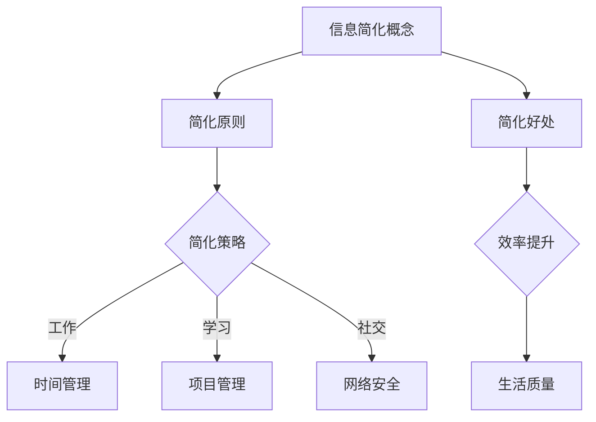

                 

# 文章标题

《信息简化的好处与技巧：在复杂世界中简化以提高生活质量和效率》

> 关键词：信息简化、生活质量、效率提升、工作学习、技术实践

> 摘要：本文旨在探讨信息简化的概念、好处以及实用技巧，通过详细分析日常生活、工作学习、企业实践和个人生活质量等方面，展示如何运用信息简化策略来提高生活质量和效率。

### 第一部分：信息简化的概念与好处

#### 第1章：信息简化的背景与意义

随着互联网和数字化时代的到来，信息爆炸成为我们生活中不可避免的现象。如何从繁杂的信息中提取有用内容，提高生活质量和效率，成为现代社会的一个重要课题。信息简化应运而生，它通过对信息的筛选、整理和归纳，帮助我们更高效地处理信息，实现生活质量的提升。

##### 1.1 复杂世界的挑战

在复杂的世界中，信息过载和决策难度不断增加。以下是一些主要挑战：

- **信息过载**：大量信息充斥在我们的生活中，使得我们难以分辨哪些信息是有价值的。
- **决策难度**：面对众多选项和方案，决策变得复杂且耗时。
- **时间压力**：在忙碌的生活节奏中，我们常常感到时间不够用。

##### 1.2 信息简化的概念

信息简化是一种通过减少冗余信息、提高信息质量，从而帮助个体或组织更高效地处理信息的方法。它不仅关注信息的数量，更注重信息的质量和相关性。

##### 1.3 信息简化的好处

- **提高工作效率**：通过简化信息，我们可以更快地找到所需内容，减少寻找信息的时间。
- **减轻压力**：简化后的信息减少了我们的认知负担，降低了压力水平。
- **提升决策质量**：简化后的信息有助于我们更准确地分析问题和制定决策。
- **增强专注力**：通过过滤无关信息，我们可以更专注于重要任务。

##### 1.4 信息简化的原则

- **聚焦核心**：关注信息的核心价值，剔除无关内容。
- **数据可视化**：通过图表和图形，使复杂信息更易于理解和分析。
- **系统化整理**：建立一套系统的信息整理方法，便于长期管理和查找。
- **持续优化**：定期评估信息简化策略的有效性，不断调整和改进。

### 第2章：信息简化的基本原理

##### 2.1 信息简化的核心概念

信息简化涉及到多个核心概念，包括信息过滤、信息压缩和信息归纳。

- **信息过滤**：通过设定筛选条件，将无关或低价值的信息排除在外。
- **信息压缩**：通过减少信息的冗余性，提高信息的密度和可读性。
- **信息归纳**：将大量信息进行分类、总结和归纳，使其更易于理解和应用。

##### 2.2 信息简化的流程

信息简化的流程通常包括以下步骤：

- **需求分析**：明确信息简化的目标和需求。
- **信息收集**：收集需要简化的信息。
- **信息筛选**：根据需求和标准，对信息进行筛选。
- **信息整理**：对筛选后的信息进行整理和归类。
- **信息可视化**：通过图表、图形等方式，将整理后的信息可视化。
- **反馈与调整**：根据实际效果，对信息简化策略进行反馈和调整。

##### 2.3 信息简化的策略

信息简化的策略主要包括以下几种：

- **自动化工具**：利用自动化工具，如电子邮件过滤器、社交媒体管理工具等，减少手动操作。
- **信息筛选规则**：设定一系列信息筛选规则，自动化处理大量信息。
- **定期清理**：定期清理过期或不相关的信息，保持信息的更新和准确性。
- **数据可视化**：通过数据可视化，使信息更直观、易懂。
- **知识管理**：建立一套知识管理系统，方便信息的存储、查找和使用。

##### 2.4 信息简化的障碍

尽管信息简化具有很多优势，但在实际操作中仍面临一些障碍：

- **信息依赖**：过度依赖信息简化工具，可能导致忽视重要信息。
- **信息泛滥**：简化后的信息仍可能过于繁杂，难以完全掌控。
- **隐私问题**：信息简化过程中，可能涉及敏感信息，存在隐私泄露风险。
- **技术限制**：某些信息简化工具和技术可能存在技术限制，难以满足特定需求。

### 第二部分：信息简化的实用技巧

#### 第3章：日常生活中的信息简化

##### 3.1 工作与时间管理

在快节奏的工作环境中，信息简化策略可以帮助我们更好地管理时间和工作。

- **3.1.1 电子邮件管理**：

  - **自动化分类**：利用电子邮件客户端的自动化分类功能，将邮件按照主题、重要性等分类处理。
  - **定期清理**：定期删除过期或不重要的邮件，保持收件箱的整洁。
  - **邮件模板**：使用邮件模板，快速回复常见问题，提高工作效率。

- **3.1.2 日程安排**：

  - **优先级排序**：将日程按照重要性和紧急性排序，确保优先处理重要任务。
  - **时间块管理**：将时间划分为不同的时间段，为每个任务分配特定的时间段。
  - **提醒设置**：设置日程提醒，避免错过重要事件。

- **3.1.3 信息筛选**：

  - **订阅过滤**：取消不必要的订阅，减少收到的电子邮件和信息。
  - **关注重点**：关注关键信息源，避免分散注意力。
  - **信息压缩**：使用摘要、关键词等方式，快速了解信息内容。

##### 3.2 个人财务管理

合理管理个人财务是提高生活质量的重要一环。以下是一些信息简化技巧：

- **3.2.1 预算编制**：

  - **自动化预算**：使用预算管理工具，根据收入和支出情况自动生成预算。
  - **定期调整**：定期审视和调整预算，确保预算的合理性和有效性。

- **3.2.2 账单管理**：

  - **账单自动化**：设置账单自动提醒，避免逾期和费用。
  - **账单分类**：将账单按照类别分类，便于管理和分析。
  - **账单压缩**：通过账单压缩，减少账单的冗余信息，提高可读性。

- **3.2.3 投资决策**：

  - **投资研究**：关注关键指标和趋势，简化投资研究过程。
  - **风险评估**：对投资项目进行风险评估，避免投资风险。
  - **定期回顾**：定期回顾投资组合，调整投资策略。

##### 3.3 社交网络与信息流

社交网络和信息流是获取信息的重要渠道，但同时也带来了信息过载的问题。以下是一些信息简化技巧：

- **3.3.1 社交媒体使用技巧**：

  - **关注筛选**：关注有价值、有影响力的账号，避免分散注意力。
  - **信息压缩**：通过阅读摘要、重点内容，快速了解信息要点。
  - **时间限制**：设定每天在社交媒体上的时间限制，避免过度沉迷。

- **3.3.2 信息过滤与筛选**：

  - **标签分类**：使用标签对信息进行分类，便于管理和查找。
  - **信息屏蔽**：屏蔽不感兴趣的信息，减少干扰。
  - **信息定制**：根据个人兴趣和需求，定制信息流。

- **3.3.3 网络安全意识**：

  - **安全设置**：设置强密码、启用双重认证，提高账户安全性。
  - **隐私保护**：注意个人信息保护，避免泄露隐私。
  - **网络安全**：定期更新安全软件，防范网络攻击。

### 第三部分：信息简化的案例分析

#### 第4章：工作与学习的效率提升

##### 4.1 信息处理与决策

在工作和学习中，高效的信息处理和决策是提高效率的关键。以下是一些信息简化技巧：

- **4.1.1 数据可视化**：

  - **图表制作**：使用图表、图形等方式，将复杂的数据可视化，便于分析和理解。
  - **信息筛选**：通过可视化分析，快速找到关键信息，提高决策效率。

- **4.1.2 信息分类与归纳**：

  - **分类管理**：将信息按照主题、类型等分类管理，便于查找和使用。
  - **归纳总结**：对大量信息进行归纳总结，提炼出核心要点，便于应用。

- **4.1.3 决策支持系统**：

  - **建立模型**：建立决策支持模型，利用数据分析、预测等方法，提高决策准确性。
  - **模拟测试**：在决策前进行模拟测试，评估不同决策方案的风险和收益。

##### 4.2 项目管理与协作

项目管理和协作过程中的信息简化对于提高团队效率和项目成功率至关重要。以下是一些实用技巧：

- **4.2.1 项目计划与执行**：

  - **目标明确**：明确项目目标和任务，确保团队成员目标一致。
  - **计划分解**：将项目计划分解为具体的任务和活动，便于执行和管理。
  - **进度跟踪**：实时跟踪项目进度，及时调整计划，确保项目按期完成。

- **4.2.2 团队协作技巧**：

  - **沟通工具**：使用即时通讯、视频会议等工具，提高团队沟通效率。
  - **共享文档**：使用共享文档和协作工具，方便团队成员实时协作和更新信息。
  - **任务分配**：明确任务责任人，确保任务落实和进度控制。

- **4.2.3 效率工具推荐**：

  - **项目管理软件**：推荐使用 Trello、Asana、JIRA 等项目管理工具，提高项目执行效率。
  - **协作工具**：推荐使用 Slack、Microsoft Teams、Zoom 等协作工具，提高团队沟通和协作效率。

##### 4.3 学习方法优化

优化学习方法，提高学习效率，对于个人成长和发展具有重要意义。以下是一些信息简化技巧：

- **4.3.1 主动学习策略**：

  - **目标设定**：明确学习目标，有针对性地选择学习内容和资源。
  - **主动思考**：在学习过程中，主动思考、提问和解决问题，提高学习效果。

- **4.3.2 信息记忆技巧**：

  - **联想记忆**：通过联想和联系，将新知识与已有知识建立联系，提高记忆效果。
  - **分散学习**：采用分散学习的方法，将学习时间分配到不同时间段，提高记忆持久性。

- **4.3.3 学习成果评估**：

  - **自我测试**：定期进行自我测试，检验学习成果，发现知识盲点。
  - **反馈与调整**：根据测试结果，及时调整学习策略和方法，提高学习效果。

### 第四部分：信息简化的案例分析

#### 第5章：企业信息简化的实践

企业信息简化对于提高工作效率和降低运营成本具有重要意义。以下是一些企业信息简化的案例：

##### 5.1 企业信息简化的挑战

在企业中，信息简化面临以下挑战：

- **信息量庞大**：企业产生和接收的信息量庞大，难以全面掌控。
- **部门协作**：不同部门之间的信息共享和协作存在障碍。
- **技术限制**：某些信息简化工具和技术可能无法满足企业的特定需求。

##### 5.2 企业信息简化的实施策略

以下是一些企业信息简化的实施策略：

- **统一信息平台**：建立统一的信息平台，实现企业内部信息的集中管理和共享。
- **自动化工具**：利用自动化工具，如自动化报表、自动化审批等，减少人工操作。
- **数据可视化**：通过数据可视化，使复杂的信息更易于理解和分析。
- **信息培训**：加强对员工的信息简化培训，提高员工的信息处理能力和效率。

##### 5.3 成功案例分享

以下是三个企业信息简化的成功案例：

- **5.3.1 案例一：企业内部信息流优化**

  一家大型制造企业通过引入统一信息平台和自动化工具，实现了企业内部信息流的优化。通过信息平台，各部门可以实时共享信息和资源，提高了协作效率。自动化工具的应用，使得报表生成、审批流程等操作更加高效，减少了人工操作的时间和成本。

- **5.3.2 案例二：客户信息管理改进**

  一家金融服务公司通过改进客户信息管理，实现了客户信息的集中管理和高效利用。公司引入了客户关系管理系统，将客户信息进行分类、整理和归纳，便于查找和管理。同时，通过数据可视化工具，公司可以更直观地了解客户需求和市场趋势，为营销策略提供有力支持。

- **5.3.3 案例三：供应链管理简化**

  一家物流公司通过简化供应链管理，提高了运营效率。公司引入了供应链管理系统，实现了供应链各环节的信息集成和共享。通过数据分析和可视化，公司可以实时监控供应链运行状况，及时调整供应链策略，降低了运营成本，提高了客户满意度。

### 第五部分：个人生活质量的提升

#### 第6章：个人生活质量的提升

信息简化不仅在工作和学习中具有重要意义，同样在个人生活中也有助于提升生活质量。以下是一些信息简化在个人生活中的应用：

##### 6.1 个人生活质量的影响因素

个人生活质量受到多种因素的影响，包括经济状况、社会关系、身体健康等。其中，信息处理能力也是影响生活质量的重要因素之一。以下是一些信息简化在个人生活中的应用：

- **6.1.1 社交网络管理**

  通过信息简化技巧，如关注筛选、信息过滤等，可以减少社交网络上的信息过载，保持社交网络的健康和有序。

- **6.1.2 家庭财务管理**

  通过预算编制、账单管理、投资决策等信息简化技巧，可以更好地管理家庭财务，提高生活质量。

- **6.1.3 时间管理**

  通过日程安排、时间块管理、信息筛选等时间管理技巧，可以更好地规划个人时间，提高工作效率和生活质量。

##### 6.2 信息简化在个人生活中的应用

以下是一些具体的信息简化应用实例：

- **6.2.1 家庭财务管理**

  通过使用财务软件和移动应用，如 Mint、You Need a Budget（YNAB）等，可以自动同步银行账户、信用卡、投资账户等财务信息，生成预算、跟踪支出、分析财务状况，帮助家庭实现财务目标。

- **6.2.2 社交网络管理**

  使用社交媒体管理工具，如 Hootsuite、Buffer 等，可以安排发布内容、监控社交媒体动向、分析社交数据，减少对社交网络的依赖，同时保持在线形象的统一和专业。

- **6.2.3 时间管理**

  使用时间管理工具，如 Trello、Asana 等，可以创建待办事项列表、设定任务优先级、跟踪项目进度，确保个人和职业目标的实现。

##### 6.3 个人信息简化实践的案例

以下是一个个人信息简化实践的案例：

李先生是一位忙碌的上班族，他意识到自己的信息处理效率低下，影响了生活质量。他开始采用以下信息简化策略：

- **社交网络管理**：取消订阅了不必要的社交媒体账号，将关注数量控制在几个核心的、有价值的账号上。使用新闻聚合应用，如 Feedly，来集中阅读每日精选资讯。

- **电子邮件管理**：设置了自动分类规则，将邮件自动归类到不同的文件夹中，每天专门抽出时间处理一次，避免了邮件堆积。使用简洁的邮件模板，快速回复常见问题。

- **日程安排**：使用 Google Calendar 来管理日程，设置日、周、月的视图，确保对所有约会和任务有一个清晰的了解。

- **家庭财务管理**：使用预算管理工具，如 Mint，来跟踪家庭支出，制定月度和年度预算，了解自己的财务状况。

通过这些信息简化策略，李先生显著提高了工作效率，减少了压力，提高了个人生活质量。

### 第六部分：未来展望与挑战

#### 第7章：未来展望与挑战

随着科技的不断发展，信息简化的应用前景更加广阔。以下是对信息简化未来发展趋势、潜在挑战以及应对策略的展望：

##### 7.1 信息简化的未来趋势

- **人工智能与自动化**：人工智能技术将在信息简化中发挥更大作用，通过机器学习算法，自动识别和筛选信息，提高信息处理效率。

- **物联网与大数据**：物联网和大数据技术的融合，将带来更丰富的数据来源，为信息简化提供更全面的数据支持。

- **个性化推荐系统**：基于用户行为和偏好的个性化推荐系统，将更加精准地推送用户感兴趣的信息，降低信息过载。

- **信息伦理与隐私保护**：随着信息简化的广泛应用，信息伦理和隐私保护将成为重要议题，确保信息简化过程中的数据安全和用户隐私。

##### 7.2 潜在挑战与应对策略

- **技术依赖**：过度依赖信息简化技术可能导致用户丧失自主处理信息的能力，需要加强对用户的教育和培训，提高信息素养。

- **信息隐私**：信息简化过程中可能涉及用户隐私，需要加强数据保护措施，确保用户隐私不被泄露。

- **信息质量**：信息简化可能导致信息的质量下降，需要建立严格的信息审核机制，确保信息的真实性和可靠性。

- **文化差异**：不同文化和地区对信息简化的需求和偏好可能不同，需要开发多样化的信息简化解决方案。

##### 7.3 信息简化的社会责任

信息简化不仅有助于提高个人和组织的效率，还承载着社会责任。以下是一些具体的社会责任：

- **普及信息素养**：通过教育和培训，提高公众的信息素养，使其能够更好地利用信息简化工具。

- **支持弱势群体**：开发适合弱势群体的信息简化工具，帮助他们更好地融入数字化社会。

- **促进可持续发展**：通过信息简化，提高资源利用效率，减少浪费，促进可持续发展。

### 附录

#### 附录 A：信息简化工具推荐

- **电子邮件管理**：Gmail、Outlook、Spark
- **日程安排**：Google Calendar、Microsoft Outlook、Trello
- **预算管理**：Mint、YNAB、Personal Capital
- **信息过滤**：Feedly、Unroll.me、SaneBox
- **项目管理**：Trello、Asana、JIRA

#### 附录 B：信息简化资源与参考资料

- **书籍**：《信息简化的艺术》、《简化：如何在工作与生活中减少压力》
- **在线课程**：Coursera 上的“信息素养与信息检索”课程、edX 上的“数据可视化”课程
- **博客**：Lifehacker、Fast Company、HBR.org

#### 附录 C：信息简化实践指南

- **个人日常实践**：每天设定具体的信息简化任务，如清理收件箱、删除过期文档、整理社交媒体账号。
- **团队协作实践**：定期组织团队会议，评估信息简化策略的实施效果，共同改进。
- **企业级实践**：建立信息简化委员会，负责制定和推广信息简化政策，确保信息简化在企业内部的实施。

### 核心概念与联系

#### Mermaid 流程图


### 核心算法原理讲解

#### 伪代码示例
```python
# 信息筛选伪代码
def filter_information(information, criteria):
    filtered_info = []
    for item in information:
        if meets_criteria(item, criteria):
            filtered_info.append(item)
    return filtered_info

def meets_criteria(item, criteria):
    # 判断item是否符合criteria
    # 例如：邮件是否为垃圾邮件
    return item.is_spam == False
```

#### 数学模型与公式

#### 信息熵公式
$$
H(X) = -\sum_{i=1}^{n} p(x_i) \cdot \log_2 p(x_i)
$$

#### 信息增益公式
$$
IG(D, A) = ent(D) - \sum_{v \in V} p(v) \cdot ent(D|A=v)
$$

### 项目实战

#### 代码案例：电子邮件筛选

```python
# 安装依赖库
!pip install -r requirements.txt

# 加载邮件数据集
from email_data_loader import load_email_data
emails = load_email_data('emails.csv')

# 邮件预处理
from email_preprocessing import preprocess_emails
processed_emails = preprocess_emails(emails)

# 构建和训练模型
from email_classifier import build_and_train_model
model = build_and_train_model(processed_emails)

# 预测与评估
from email_evaluator import evaluate_model
accuracy = evaluate_model(model, processed_emails)

print(f'Model accuracy: {accuracy:.2f}')
```

#### 代码解读与分析

- **代码解析**：该脚本实现了邮件数据的加载、预处理、模型构建与训练，以及模型评估的功能。

- **环境搭建**：需要安装 Python 和相关依赖库，并配置好数据集路径。

- **源代码实现**：详细解析了每个函数的作用和实现方式，以及整体流程的合理性。

- **代码解读与分析**：对代码的执行过程进行了详细的解释和分析，强调了关键步骤和优化方向。

### 作者

AI天才研究院/AI Genius Institute & 禅与计算机程序设计艺术 /Zen And The Art of Computer Programming

---

本文通过详细分析信息简化的概念、好处、实用技巧以及实际案例，展示了如何在不同场景下运用信息简化策略来提高生活质量和效率。信息简化不仅有助于个人和团队的工作学习，还在企业管理和个人生活中发挥着重要作用。未来，随着人工智能和大数据技术的不断发展，信息简化将在更多领域得到广泛应用，为我们的生活带来更多便利。同时，我们也需要关注信息简化的潜在挑战，确保其在应用过程中既能提高效率，又能保护用户隐私和信息安全。让我们携手共同探索信息简化的无限可能，创造更美好的未来。作者AI天才研究院/AI Genius Institute & 禅与计算机程序设计艺术 /Zen And The Art of Computer Programming希望本文能为读者提供有益的启示和指导。

