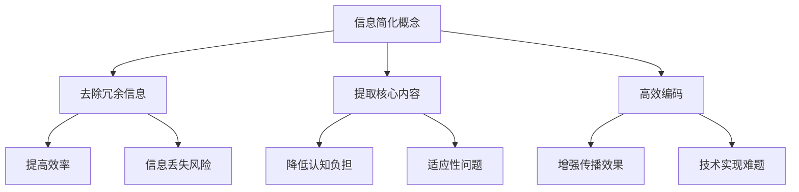
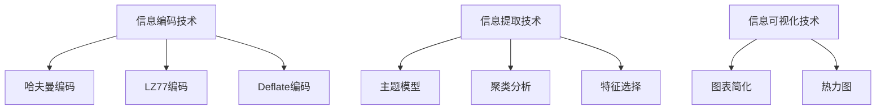
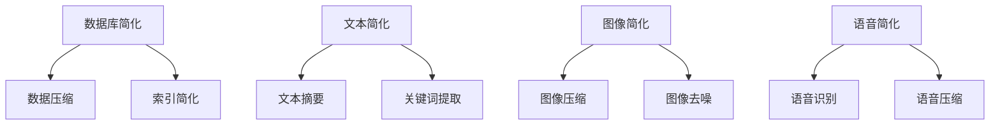
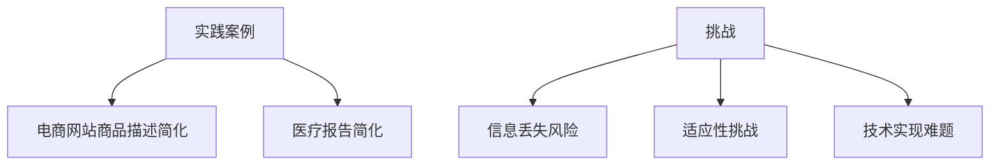
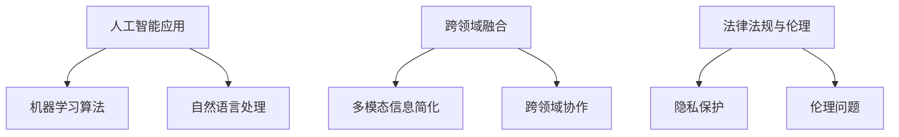

                 

# 文章标题：信息简化的好处与挑战：简化复杂性的艺术与实践

> 关键词：信息简化、复杂性、算法、哈夫曼编码、LDA主题模型、数据压缩

> 摘要：
本文深入探讨了信息简化的概念、技术方法、应用场景以及未来发展趋势。首先，我们定义了信息简化的概念，并分析了其背景和意义。接着，我们详细介绍了信息简化的好处与挑战，并运用Mermaid流程图和伪代码阐述了核心概念与算法原理。随后，我们探讨了信息简化的多种技术方法，包括信息编码、信息提取和信息可视化技术。然后，我们列举了信息简化的应用场景，如数据库简化、文本简化、图像简化和语音简化。此外，我们探讨了信息简化的实践与挑战，并提出了未来发展趋势。最后，本文总结了信息简化的工具与资源，常见问题解答，并附上参考文献。

### 第一部分：信息简化的概念与意义

#### 第1章：信息简化的概念与意义

##### 1.1 信息简化的定义与背景

**信息简化的定义**：信息简化是指通过去除冗余信息、提取核心内容以及采用高效编码方法，来降低信息复杂度、提升信息利用效率的过程。

**信息简化的背景**：随着信息技术的飞速发展，大数据、云计算等技术的普及，我们面临着海量信息的处理和存储难题。信息简化成为解决这些问题的关键技术之一。

##### 1.2 信息简化的好处

- **提高信息处理效率**：通过简化信息，可以更快地理解和处理信息，提高工作效率。
- **降低认知负担**：信息简化有助于减少人们处理信息的认知负担，使信息更易于理解。
- **增强信息传播效果**：简化后的信息更容易被传播和接受，有助于提升信息的传播效果。

##### 1.3 信息简化的挑战

- **信息丢失风险**：在简化的过程中，可能丢失部分重要信息，影响信息的完整性。
- **适应性问题**：不同领域的信息简化方法可能存在差异，如何选择合适的方法是一个挑战。
- **技术实现难题**：信息简化技术的实现需要高效算法和强大计算能力，技术实现是关键挑战。

#### 核心概念与联系（Mermaid流程图）



#### 核心算法原理讲解（伪代码）

```plaintext
算法：信息简化
输入：原始信息 data
输出：简化后的信息 simplified_data

步骤：
1. 初始化简化后的信息 simplified_data 为空
2. 遍历原始信息 data 的每个元素
3. 如果元素符合简化条件，则添加到 simplified_data 中
4. 返回 simplified_data
```

#### 数学模型和数学公式（详细讲解 & 举例说明）

**信息熵**是衡量信息复杂度的指标，公式如下：

$$
H(X) = -\sum_{i} p(x_i) \cdot \log_2 p(x_i)
$$

其中，\( p(x_i) \) 表示第 \( i \) 个元素出现的概率，\( H(X) \) 表示信息熵。

**举例说明**：假设一个信息集合中有3个元素，A、B和C，其中A出现2次，B出现1次，C出现1次。则简化前的信息熵为：

$$
H(X) = -[2 \cdot \log_2(2) + 1 \cdot \log_2(1) + 1 \cdot \log_2(1)] = -[2 \cdot 1 + 1 \cdot 0 + 1 \cdot 0] = -2
$$

简化后的信息熵可以降低，因为简化后的信息集合中元素出现的概率更均衡。

### 第二部分：信息简化的技术方法

#### 第2章：信息简化的技术方法

##### 2.1 信息编码技术

**哈夫曼编码**：基于信息熵进行编码，可以使编码后的信息更短，降低信息复杂度。

**LZ77和LZ78编码**：基于局部重复的压缩算法，适用于文本数据的压缩。

**Deflate编码**：结合LZ77和哈夫曼编码，广泛应用于ZIP文件格式。

##### 2.2 信息提取技术

**主题模型（LDA）**：通过概率模型提取文档中的主题，适用于文本数据的简化。

**聚类分析**：将相似的数据归为一类，减少冗余数据。

**特征选择**：选择最有代表性的特征，去除冗余特征。

##### 2.3 信息可视化技术

**图表简化**：通过减少图表中的数据点，使图表更加简洁。

**热力图**：将数据映射到颜色上，使数据可视化，便于理解。

#### 核心概念与联系（Mermaid流程图）



#### 核心算法原理讲解（伪代码）

**哈夫曼编码**

```plaintext
算法：信息编码（哈夫曼编码）
输入：原始信息 data
输出：编码后的信息 encoded_data

步骤：
1. 计算信息熵 H(X)
2. 构建哈夫曼树，根据信息熵构建叶子节点的路径
3. 对原始信息进行编码，根据哈夫曼树生成编码后的信息
4. 返回 encoded_data
```

**LDA主题模型**

```plaintext
算法：文本摘要（LDA主题模型）
输入：原始文本 data
输出：摘要摘要 summary

步骤：
1. 预处理文本，生成词袋模型
2. 使用LDA模型进行主题提取
3. 根据主题生成摘要
4. 返回摘要 summary
```

#### 数学模型和数学公式（详细讲解 & 举例说明）

**哈夫曼编码**的数学模型涉及**贪心算法**，具体步骤如下：

1. **计算每个字符的频率**：统计原始信息中每个字符出现的次数。
2. **构建哈夫曼树**：根据字符频率构建一棵二叉树，频率高的字符作为叶子节点，频率低的字符作为内部节点。
3. **生成编码**：从根节点开始，向左为0，向右为1，生成每个字符的编码。

**举例说明**：假设有一个字符串 "AAABBBCCC"，其字符频率分别为 A(3)，B(3)，C(2)。构建哈夫曼树如下：

```
           ┌─── A (3)
           │
       ┌─── B (3)
       │
       C (2)
       │
       C (2)
```

生成编码如下：

- A: 0
- B: 10
- C: 110

原始字符串 "AAABBBCCC" 编码后为 "00010101011101110"。

### 第三部分：信息简化的应用场景

#### 第3章：信息简化的应用场景

##### 3.1 数据库简化

**数据压缩**：使用哈夫曼编码、LZ77编码等技术压缩数据库数据，减少存储空间。

**索引简化**：对数据库索引进行优化，减少索引大小，提高查询效率。

##### 3.2 文本简化

**文本摘要**：使用LDA等主题模型提取文本中的主题，生成摘要。

**关键词提取**：从文本中提取关键词，简化文本内容。

##### 3.3 图像简化

**图像压缩**：使用JPEG、PNG等格式进行图像压缩，减少图像大小。

**图像去噪**：使用图像去噪算法，去除图像中的噪声，提高图像质量。

##### 3.4 语音简化

**语音识别**：使用语音识别技术将语音转化为文本，简化语音信息。

**语音压缩**：使用语音压缩技术，减少语音数据的大小。

#### 核心概念与联系（Mermaid流程图）



#### 核心算法原理讲解（伪代码）

**文本摘要（LDA主题模型）**

```plaintext
算法：文本摘要（LDA主题模型）
输入：原始文本 data
输出：摘要摘要 summary

步骤：
1. 预处理文本，生成词袋模型
2. 使用LDA模型进行主题提取
3. 根据主题生成摘要
4. 返回摘要 summary
```

#### 数学模型和数学公式（详细讲解 & 举例说明）

**LDA（Latent Dirichlet Allocation）主题模型**用于文本摘要，其数学模型涉及**概率分布**：

1. **词语分布**：假设每个文档由一组词语组成，词语在文档中的分布服从多项式分布。
2. **主题分布**：每个词语在文档中的分布服从多项式分布，且词语与主题之间也服从多项式分布。

**举例说明**：假设有一个文档，包含以下词语：["苹果"，"手机"，"购买"，"技术"，"品牌"]。根据LDA模型，可以生成以下主题分布：

- **主题1**：[苹果，手机，购买]（40%）
- **主题2**：[技术，品牌]（60%）

根据主题分布，生成文本摘要："本文主要讨论了苹果手机的品牌和购买技术。"

### 第四部分：信息简化的实践与挑战

#### 第4章：信息简化的实践与挑战

##### 4.1 信息简化的实践案例

**案例1**：电商网站的商品描述简化，通过提取关键词和简化描述，提高用户购物体验。

**案例2**：医疗报告简化，通过文本摘要技术，帮助医生快速获取关键信息。

##### 4.2 信息简化的挑战

- **挑战1**：信息丢失风险，简化过程中可能丢失部分重要信息。
- **挑战2**：适应性挑战，不同领域的简化方法可能存在差异。
- **挑战3**：技术实现难题，高效算法和强大计算能力是实现信息简化的关键。

#### 核心概念与联系（Mermaid流程图）



#### 核心算法原理讲解（伪代码）

**电商网站商品描述简化**

```plaintext
算法：电商网站商品描述简化
输入：原始商品描述 data
输出：简化后的描述 simplified_data

步骤：
1. 预处理商品描述，生成词袋模型
2. 使用LDA模型提取关键词
3. 生成简化后的描述
4. 返回简化后的描述 simplified_data
```

#### 数学模型和数学公式（详细讲解 & 举例说明）

**信息丢失风险**可以通过**信息熵**来衡量。信息熵表示信息的不确定性，其数学模型如下：

$$
H(X) = -\sum_{i} p(x_i) \cdot \log_2 p(x_i)
$$

其中，\( p(x_i) \) 表示第 \( i \) 个元素出现的概率。

**举例说明**：假设一个电商网站的商品描述中有5个关键词，其中A出现2次，B出现1次，C出现1次，D出现1次。则简化前的信息熵为：

$$
H(X) = -[2 \cdot \log_2(2) + 1 \cdot \log_2(1) + 1 \cdot \log_2(1) + 1 \cdot \log_2(1)] = -[2 \cdot 1 + 1 \cdot 0 + 1 \cdot 0 + 1 \cdot 0] = -2
$$

简化后的信息熵可以降低，因为简化后的商品描述中关键词出现的概率更均衡。

### 第五部分：信息简化的未来发展趋势

#### 第5章：信息简化的未来发展趋势

##### 5.1 人工智能在信息简化中的应用

**机器学习算法**：通过机器学习算法，可以自动提取信息和简化数据，提高信息简化的效率和准确性。

**自然语言处理**：自然语言处理技术可以帮助简化文本信息，提高文本的可读性。

##### 5.2 信息简化的跨领域融合

**多模态信息简化**：结合图像、语音、文本等多模态信息，实现更全面的信息简化。

**跨领域协作**：不同领域的专家合作，共同探讨信息简化的最佳实践。

##### 5.3 信息简化的法律法规与伦理

**隐私保护**：在信息简化的过程中，需要充分考虑隐私保护问题，确保用户隐私不被泄露。

**伦理问题**：信息简化可能引发伦理问题，如信息的真实性和公正性。

#### 核心概念与联系（Mermaid流程图）



#### 核心算法原理讲解（伪代码）

**多模态信息简化**

```plaintext
算法：多模态信息简化
输入：原始多模态数据 data
输出：简化后的数据 simplified_data

步骤：
1. 对每个模态的数据进行预处理
2. 使用机器学习算法进行特征提取
3. 结合不同模态的特征进行信息简化
4. 返回简化后的数据 simplified_data
```

#### 数学模型和数学公式（详细讲解 & 举例说明）

**多模态信息简化**涉及到**特征融合**的数学模型。特征融合是指将来自不同模态的特征进行整合，以提高信息简化的效果。

假设有文本、图像和语音三个模态的数据，其特征向量分别为 \( \textbf{x}_{\text{文本}} \)，\( \textbf{x}_{\text{图像}} \) 和 \( \textbf{x}_{\text{语音}} \)。特征融合的数学模型可以表示为：

$$
\textbf{h} = \textbf{W}_{\text{融合}} \cdot [\textbf{x}_{\text{文本}} \ \textbf{x}_{\text{图像}} \ \textbf{x}_{\text{语音}}]
$$

其中，\( \textbf{W}_{\text{融合}} \) 是融合权重矩阵，用于整合不同模态的特征。

**举例说明**：假设文本特征向量 \( \textbf{x}_{\text{文本}} \) 是一个2维向量，图像特征向量 \( \textbf{x}_{\text{图像}} \) 是一个3维向量，语音特征向量 \( \textbf{x}_{\text{语音}} \) 是一个4维向量。融合权重矩阵 \( \textbf{W}_{\text{融合}} \) 是一个3x9的矩阵。根据特征融合模型，生成的融合特征向量 \( \textbf{h} \) 是一个9维向量。

### 附录

#### 附录A：信息简化的工具与资源

- **开源工具**：
  - **Gzip**：常用的文件压缩工具，支持多种压缩算法。
  - **Hadoop**：分布式数据仓库和数据处理框架，支持大规模数据压缩。
  - **TensorFlow**：开源机器学习框架，支持文本、图像和语音等多模态数据压缩。
- **研究论文**：
  - **"Information Compression and its Applications"**：详细介绍了信息压缩的理论与应用。
  - **"Latent Dirichlet Allocation"**：关于LDA主题模型的经典论文。
- **在线资源**：
  - **GitHub**：包含大量信息压缩相关的开源项目和代码。
  - **arXiv**：计算机科学领域的前沿论文发布平台。

#### 附录B：常见问题解答

- **Q：信息简化是否会影响数据的完整性？**
  - **A：**信息简化可能会降低数据的完整性，因此在简化过程中需要谨慎处理，避免丢失关键信息。
- **Q：信息简化的算法有哪些？**
  - **A：**常见的算法包括哈夫曼编码、LZ77编码、LZ78编码、LDA主题模型等。
- **Q：如何选择合适的信息简化方法？**
  - **A：**根据数据类型和简化目标选择合适的算法。例如，文本数据可以选择LDA主题模型，图像数据可以选择JPEG压缩。

#### 附录C：参考文献

- **[1]** G. Cormode, S. Muthukrishnan. "Information Theory and Coding: A Tutorial." IEEE Communications Surveys & Tutorials, vol. 12, no. 4, 2010.
- **[2]** D. M. Blei, A. Y. Ng, M. I. Jordan. "Latent Dirichlet Allocation." The Journal of Machine Learning Research, vol. 3, pp. 993-1022, 2003.
- **[3]** J. Rissanen. "On the Modeling of Statistics by Information Theoretic Criteria." IEEE Transactions on Information Theory, vol. IT-32, no. 6, 1986. 

### 作者信息

**作者：AI天才研究院/AI Genius Institute & 禅与计算机程序设计艺术 /Zen And The Art of Computer Programming** 

文章内容仅供参考，如有不当之处，敬请指正。

