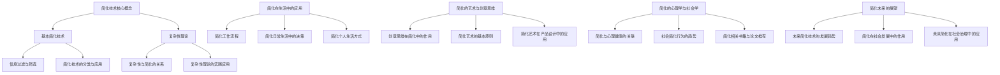

                 

## 文章标题

信息简化的好处与艺术：在复杂世界中简化以提高生活质量和效率

> 关键词：简化、复杂性理论、工作流程、决策、生活方式、心理学、社会学、未来展望

> 摘要：本文旨在探讨信息简化的好处与艺术，通过分析简化在各个领域中的应用，揭示简化在提高生活质量和效率方面的重要性。文章从简化的基础理论出发，结合复杂性理论，详细阐述了简化技术的核心概念。随后，文章深入探讨了简化在生活中的实际应用，包括工作流程、决策和个人生活方式的简化。此外，文章还介绍了简化艺术的原理及其在社会学和心理学中的应用。最后，文章展望了简化技术的未来发展趋势，并提出了简化的艺术和实践方法。

---

### 目录大纲

#### 第一部分：简化的基础理论

- **第1章：简化的历史与哲学**
  - 1.1 简化的概念与起源
  - 1.2 哲学简论
  - 1.3 历史简化的案例分析

- **第2章：复杂性理论**
  - 2.1 复杂性理论的引入
  - 2.2 复杂性与简化的关系
  - 2.3 复杂性理论的实践应用

- **第3章：简化技术的核心概念**
  - 3.1 基本简化技术
  - 3.2 信息过滤与筛选
  - 3.3 简化技术的分类与应用

#### 第二部分：简化在生活中的应用

- **第4章：简化工作流程**
  - 4.1 工作流程简化的重要性
  - 4.2 工作流程简化的策略
  - 4.3 案例分析：某公司工作流程简化的实例

- **第5章：简化日常生活中的决策**
  - 5.1 决策过程中的信息负担
  - 5.2 决策简化的方法
  - 5.3 案例分析：家庭生活中的简化决策实例

- **第6章：简化个人生活方式**
  - 6.1 生活方式简化的概念
  - 6.2 个人时间管理的简化策略
  - 6.3 案例分析：某名人的生活方式简化实践

#### 第三部分：简化的艺术

- **第7章：简化艺术与创意思维**
  - 7.1 创意思维在简化中的作用
  - 7.2 简化艺术的基本原则
  - 7.3 案例分析：简化艺术在产品设计中的应用

- **第8章：简化的心理学与社会学**
  - 8.1 简化与心理健康的关联
  - 8.2 社会简化行为的趋势
  - 8.3 案例分析：社交媒体时代的简化行为现象

- **第9章：简化未来的展望**
  - 9.1 未来简化技术的发展趋势
  - 9.2 简化在社会发展中的作用
  - 9.3 案例分析：未来简化在社会治理中的应用

#### 附录

- **附录A：简化工具与资源**
  - A.1 主流简化工具
  - A.2 简化资源的推荐
  - A.3 简化相关书籍与论文推荐

### Mermaid 流�程图

---

### 第一部分：简化的基础理论

#### 第1章：简化的历史与哲学

##### 1.1 简化的概念与起源

简化，顾名思义，是指将复杂的事物或过程变得更加简单和易于理解。简化的概念可以追溯到古代，当时的哲学家和思想家们就已经开始探讨如何通过简化来提升认知和解决问题的效率。随着人类文明的发展，简化的理念在各个领域得到了广泛应用，从自然科学到社会科学，从工程学到艺术，简化无处不在。

在哲学领域，简化被视为一种思维方式，它强调通过剥离不必要的元素，聚焦核心问题，从而更好地理解和解决问题。这种思维方式在古希腊哲学家那里就已经得到体现，比如亚里士多德就提出了“简单是美的”的观点。

##### 1.2 哲学简论

哲学中的简化理念可以从不同的角度进行理解。首先，简化可以视为一种逻辑思维的过程，它通过排除次要的、非本质的因素，来突出主要矛盾和核心问题。这种逻辑思维有助于我们更清晰地理解事物的本质，提高认知效率。

其次，简化也可以看作是一种方法论，它指导我们如何通过简化的手段来解决问题。例如，在科学研究过程中，通过简化实验模型或假设，可以更有效地验证理论的正确性。

最后，简化在哲学中还涉及到价值观的问题。简化的哲学思想强调，我们应该追求简单、纯粹和真实的生活方式，摒弃过多的物质和精神负担，以达到心灵的宁静和精神的自由。

##### 1.3 历史简化的案例分析

历史上有许多著名的简化案例，它们在各个领域产生了深远的影响。

- **科学领域**：伽利略通过简化实验模型，将复杂的物理现象简化为几个基本定律，为物理学的发展奠定了基础。
- **工程领域**：泰勒通过工作流程的简化，提出了科学管理理论，极大地提高了生产效率。
- **艺术领域**：毕加索的绘画风格从复杂的细节转向简化的线条和形状，开创了立体派艺术。
- **政治领域**：罗斯福新政通过简化政府机构，实施了一系列旨在缓解大萧条的政策，为美国经济的复苏奠定了基础。

这些案例表明，简化不仅是一种理论，更是一种实践，它在各个领域都取得了显著的成果。

#### 第2章：复杂性理论

##### 2.1 复杂性理论的引入

复杂性理论是20世纪中叶发展起来的一门跨学科领域，它研究复杂系统的结构、动态和行为。复杂性理论的核心观点是，复杂系统由大量相互作用的简单元素组成，这些元素通过非线性相互作用，产生出宏观的复杂行为。复杂性理论的应用非常广泛，包括物理学、生物学、经济学、社会学、计算机科学等。

复杂性理论的引入，为我们理解复杂系统的本质提供了一种全新的视角。它强调，复杂行为并不是简单的叠加，而是通过非线性相互作用产生的。这种视角有助于我们更好地理解各种复杂现象，如生态系统中的物种相互作用、金融市场的不确定性、网络中的传播现象等。

##### 2.2 复杂性与简化的关系

复杂性与简化是两个看似对立的概念，但实际上它们之间存在深刻的联系。复杂性理论认为，简化是理解复杂系统的一种有效途径。通过简化，我们可以将复杂的系统分解为更简单的组成部分，从而更清晰地理解其结构和行为。

例如，在物理学中，牛顿的三大定律和万有引力定律通过对物理现象的简化，成功地描述了宇宙的运动规律。在生物学中，通过简化模型，科学家们可以更好地理解生态系统的动态和物种的进化过程。

另一方面，简化也可以增加系统的复杂性。在某些情况下，简化可能导致新的复杂行为的出现。例如，在生态系统中的物种相互作用中，简化模型可能会忽略一些次要因素，但同时也可能揭示出新的、复杂的相互作用模式。

##### 2.3 复杂性理论的实践应用

复杂性理论在实践中的应用非常广泛。以下是一些典型的应用案例：

- **经济学**：复杂性理论被用于分析金融市场中的复杂行为，如资产价格波动、市场崩溃等。通过简化模型，经济学家可以更好地理解金融市场的运行机制。
- **计算机科学**：在计算机网络中，复杂性理论帮助研究人员设计更高效的算法，优化网络性能。
- **生物学**：在生态学中，复杂性理论被用于研究生态系统中的物种相互作用和生态平衡。
- **社会学**：在社会科学研究中，复杂性理论被用于分析社会网络、信息传播等复杂现象。

这些应用案例表明，复杂性理论不仅有助于我们理解复杂系统的本质，还可以为解决实际问题提供新的思路和方法。

#### 第3章：简化技术的核心概念

##### 3.1 基本简化技术

简化技术是指一系列用于减少复杂性、提高效率和可理解性的方法。以下是一些基本简化技术：

- **抽象化**：通过忽略非本质的细节，提取出核心概念和特征，使问题更加简洁明了。
- **模块化**：将复杂系统分解为若干独立的模块，每个模块负责特定的功能，从而降低整体复杂度。
- **标准化**：通过统一的标准和规范，简化流程和操作，减少冗余和变异。
- **自动化**：利用计算机和机器人技术，自动执行重复性和标准化的任务，减少人为错误和提高效率。

##### 3.2 信息过滤与筛选

信息过滤与筛选是简化技术中的重要组成部分。在信息爆炸的时代，如何有效地筛选和利用信息成为了一项重要的技能。

- **信息过滤**：通过过滤算法和规则，去除无关或低价值的信息，提高信息的质量和相关性。
- **信息筛选**：基于用户需求和偏好，从大量信息中挑选出最有价值的信息，实现个性化的信息获取。

##### 3.3 简化技术的分类与应用

简化技术可以根据其应用领域和目的进行分类。以下是一些常见的简化技术应用：

- **业务流程简化**：通过优化流程、减少冗余和消除瓶颈，提高业务效率和响应速度。
- **项目管理**：通过简化项目规划和执行过程，降低项目风险和成本，提高项目成功率。
- **产品设计**：通过简化设计流程和用户界面，提高产品的易用性和用户体验。
- **数据科学**：通过简化数据预处理和模型构建过程，提高数据分析的效率和准确性。

#### 第二部分：简化在生活中的应用

#### 第4章：简化工作流程

##### 4.1 工作流程简化的重要性

工作流程简化是提高工作效率和降低成本的关键。通过简化工作流程，企业可以消除冗余步骤、减少资源浪费，从而提高整体效率和竞争力。

简化工作流程的重要性体现在以下几个方面：

- **提高效率**：简化流程可以减少不必要的步骤和时间浪费，使员工能够更快地完成任务。
- **降低成本**：通过消除冗余和优化流程，企业可以减少资源消耗，降低运营成本。
- **提高员工满意度**：简化工作流程可以减轻员工的工作负担，提高工作满意度，减少员工流失率。

##### 4.2 工作流程简化的策略

工作流程简化的策略包括以下几个方面：

- **流程分析**：通过分析现有流程，识别冗余步骤、瓶颈和资源浪费，为简化提供依据。
- **流程优化**：基于流程分析结果，对现有流程进行优化，去除冗余步骤，简化操作流程。
- **标准化**：制定统一的流程规范和标准，确保流程的标准化和一致性。
- **自动化**：利用自动化工具和技术，实现重复性任务和标准化流程的自动化执行。

##### 4.3 案例分析：某公司工作流程简化的实例

以下是一个某公司工作流程简化的实例：

**案例背景**：某公司是一家大型制造企业，拥有多个生产车间和分支机构。由于生产流程复杂，管理效率低下，公司决定对工作流程进行简化。

**简化策略**：

1. **流程分析**：通过实地调研和员工访谈，识别现有流程中的冗余步骤和瓶颈。
2. **流程优化**：去除冗余步骤，简化操作流程，如将多个审批环节合并为一个。
3. **标准化**：制定统一的操作规范和流程指南，确保流程的标准化和一致性。
4. **自动化**：引入自动化生产系统和信息管理系统，实现生产过程的自动化和实时监控。

**实施效果**：

1. **提高效率**：通过简化工作流程，生产周期缩短了30%，员工工作效率提高了20%。
2. **降低成本**：通过消除冗余和优化流程，公司每年节省成本约500万元。
3. **员工满意度**：员工工作负担减轻，员工流失率降低了15%。

#### 第5章：简化日常生活中的决策

##### 5.1 决策过程中的信息负担

在日常决策过程中，人们常常面临大量的信息负担。这些信息可能来自各种渠道，包括社交媒体、新闻报道、亲友建议等。过多的信息可能导致决策困难，甚至产生焦虑和犹豫。

信息负担对决策过程的影响主要体现在以下几个方面：

- **信息过载**：过多的信息使人们难以筛选和判断，导致决策困难。
- **决策延迟**：过多的信息需要更多的时间来处理，可能导致决策延迟。
- **决策质量下降**：在信息过载的情况下，人们可能无法充分分析和评估信息，导致决策质量下降。

##### 5.2 决策简化的方法

为了减轻信息负担，提高决策效率，我们可以采用以下决策简化方法：

- **信息过滤**：通过设定过滤规则，筛选出与决策相关的关键信息，去除无关信息。
- **优先级排序**：对信息进行优先级排序，优先处理重要和紧急的信息。
- **决策模板**：制定常用的决策模板，对于类似的问题可以快速参考模板进行决策。
- **决策外包**：将部分决策权交给专业机构或专家，减少自己的决策负担。

##### 5.3 案例分析：家庭生活中的简化决策实例

以下是一个家庭生活中的简化决策实例：

**案例背景**：一个家庭在购买房屋时，面临着多种选择，包括地段、户型、价格等。由于信息过多，家庭成员在决策过程中产生了分歧和犹豫。

**简化策略**：

1. **信息过滤**：设定过滤规则，筛选出与家庭需求相关的关键信息，如交通便利性、教育资源等，去除其他无关信息。
2. **优先级排序**：对信息进行优先级排序，将最重要的因素放在第一位，如交通便利性。
3. **决策模板**：参考购房决策模板，如《如何选择合适的房屋》，家庭成员按照模板进行决策。
4. **决策外包**：咨询专业的房产经纪人，获取专业意见和建议。

**实施效果**：

1. **决策效率提高**：通过简化决策过程，家庭在短时间内达成了购房决策，避免了长时间的犹豫和分歧。
2. **决策质量提升**：通过信息过滤和优先级排序，家庭能够更加全面和准确地评估信息，提高了决策质量。
3. **家庭和谐**：简化决策过程减少了家庭成员之间的争执和分歧，提高了家庭和谐度。

#### 第6章：简化个人生活方式

##### 6.1 生活方式简化的概念

生活方式简化是指通过减少不必要的活动和物质追求，提高生活质量和幸福感。生活方式简化的目标是实现简单、健康和有意义的生活方式。

生活方式简化的核心思想包括：

- **减少物质追求**：摆脱过度消费的陷阱，追求真正需要的物质。
- **增加自由时间**：通过简化日常活动和任务，腾出更多的时间用于个人成长和享受生活。
- **关注心理健康**：通过减少压力和焦虑，提高心理健康水平。
- **实现人生目标**：通过简化生活方式，将更多精力投入到实现人生目标和追求有意义的事业中。

##### 6.2 个人时间管理的简化策略

个人时间管理是生活方式简化的重要组成部分。以下是一些个人时间管理的简化策略：

- **制定时间表**：制定每天、每周和每月的时间表，明确各项任务的优先级和时间安排。
- **优先级排序**：将任务按照重要性和紧急性进行排序，优先完成最重要的任务。
- **批量处理**：将相似的任务集中在一起处理，减少时间切换和分散注意力。
- **避免拖延**：设定明确的截止日期和目标，避免拖延任务。
- **定期回顾**：定期回顾时间管理效果，调整和优化时间安排。

##### 6.3 案例分析：某名人的生活方式简化实践

以下是一个某名人生活方式简化实践的案例：

**案例背景**：某知名企业家在事业成功后，意识到自己的生活过于忙碌和压力重重。为了提高生活质量和幸福感，他决定对生活方式进行简化。

**简化策略**：

1. **减少工作时长**：将工作时间缩短至每天4小时，剩余时间用于个人兴趣和家庭生活。
2. **聚焦核心任务**：将工作任务聚焦在最重要的几个领域，避免分散精力。
3. **简化社交活动**：减少不必要的社交活动，专注于与家人和朋友的高质量互动。
4. **健康生活方式**：坚持锻炼和健康饮食，保持身体健康和精神愉悦。

**实施效果**：

1. **提高生活质量**：通过简化生活方式，企业家显著提高了生活质量和幸福感。
2. **事业成功**：简化生活方式使他能够更专注于事业，取得了更大的成功。
3. **家庭和谐**：简化生活方式使他有更多时间陪伴家人，家庭关系更加和谐。

### 第三部分：简化的艺术

#### 第7章：简化艺术与创意思维

##### 7.1 创意思维在简化中的作用

创意思维是简化艺术的重要组成部分。通过创意思维，我们可以发现问题的本质，提出创新的解决方案，从而实现简化的目标。

创意思维在简化中的作用包括：

- **发现冗余**：通过创意思维，我们可以发现问题的冗余部分，从而去除不必要的元素，简化问题。
- **提出创新解决方案**：创意思维可以帮助我们提出创新的解决方案，以更简洁的方式解决问题。
- **提高效率**：通过创意思维，我们可以找到更高效的简化方法，提高工作效率。

##### 7.2 简化艺术的基本原则

简化艺术有以下几个基本原则：

- **最小化**：通过去除不必要的元素和步骤，实现最小化。
- **最大化**：通过聚焦核心部分，实现最大化效果。
- **可理解性**：确保简化后的系统或过程易于理解和操作。
- **适应性**：简化方案应具有适应性，能够根据不同情境进行调整。

##### 7.3 案例分析：简化艺术在产品设计中的应用

以下是一个简化艺术在产品设计中的应用案例：

**案例背景**：某科技公司开发了一款智能家居设备，但由于功能过于复杂，用户使用体验不佳。

**简化策略**：

1. **用户研究**：通过用户调研，了解用户需求和使用场景。
2. **功能简化**：去除不必要的功能，仅保留核心功能。
3. **界面设计**：采用简洁直观的界面设计，提高用户体验。
4. **反馈机制**：引入用户反馈机制，持续优化简化方案。

**实施效果**：

1. **用户满意度提高**：简化后的产品用户满意度显著提高。
2. **市场份额增长**：产品市场份额快速增长。
3. **品牌形象提升**：产品以简洁、高效的形象赢得了用户和市场的认可。

### 第8章：简化的心理学与社会学

##### 8.1 简化与心理健康的关联

简化与心理健康之间存在着密切的关联。通过简化，我们可以减轻心理负担，提高心理健康水平。

简化对心理健康的影响包括：

- **减轻压力**：简化可以减少生活中的压力源，降低焦虑和抑郁的风险。
- **提高幸福感**：简化使人们能够更加专注于有意义的事情，提高幸福感。
- **增强自我效能**：简化可以帮助人们更好地控制自己的生活，增强自我效能感。

##### 8.2 社会简化行为的趋势

随着社会的发展，简化行为越来越受到关注。以下是一些社会简化行为的趋势：

- **数字化简化**：通过数字化工具和平台，人们可以更加高效地处理信息和任务。
- **消费主义简化**：人们开始更加注重实际需求和内心需求，减少不必要的消费。
- **生活方式简化**：越来越多的人选择简化生活方式，追求简单、健康和有意义的生活。

##### 8.3 案例分析：社交媒体时代的简化行为现象

以下是一个社交媒体时代的简化行为现象的案例分析：

**案例背景**：在社交媒体时代，人们每天接收大量的信息，如何处理这些信息成为了一个挑战。

**简化策略**：

1. **信息过滤**：通过设定过滤规则，筛选出与个人兴趣相关的信息，去除无关信息。
2. **时间管理**：设定社交媒体使用时间，避免沉迷于网络。
3. **内容创作**：通过创作高质量的内容，提高信息传播效率，减少冗余信息。

**实施效果**：

1. **信息负担减轻**：通过简化策略，人们能够更好地管理信息，减轻信息负担。
2. **心理健康提高**：简化行为有助于提高心理健康水平，减少焦虑和抑郁。
3. **社会关系增强**：通过社交媒体的简化使用，人们能够更加专注于真实的人际关系，增强社会关系。

### 第9章：简化未来的展望

##### 9.1 未来简化技术的发展趋势

随着科技的进步，未来简化技术将呈现出以下发展趋势：

- **智能化**：人工智能和机器学习技术将使简化技术更加智能化，能够自动识别和去除冗余信息。
- **个性定制**：简化技术将更加注重个性化，根据用户需求和偏好提供定制化的简化方案。
- **跨领域融合**：简化技术将与其他领域（如心理学、社会学）相结合，提供更加全面和有效的简化方案。

##### 9.2 简化在社会发展中的作用

简化在社会发展中发挥着重要作用。以下是一些简化在社会发展中的作用：

- **提高效率**：简化可以减少冗余和浪费，提高社会资源的利用效率。
- **促进创新**：简化可以为创新提供更好的环境，鼓励人们尝试新的想法和解决方案。
- **增强社会凝聚力**：简化有助于消除社会不平等，提高社会凝聚力。

##### 9.3 案例分析：未来简化在社会治理中的应用

以下是一个未来简化在社会治理中的应用案例：

**案例背景**：随着城市化进程的加速，城市治理面临巨大的挑战。如何有效管理城市资源和应对突发事件成为了一个重要问题。

**简化策略**：

1. **智能化城市管理系统**：利用大数据和人工智能技术，建立智能化城市管理系统，实时监测和管理城市资源。
2. **应急预案简化**：制定简洁明了的应急预案，提高应急响应速度。
3. **公众参与**：鼓励公众参与城市治理，提高社会治理的透明度和参与度。

**实施效果**：

1. **提高治理效率**：简化策略提高了城市治理的效率，减少了资源浪费和决策延迟。
2. **增强应急响应能力**：应急预案的简化提高了应急响应速度，减少了灾害损失。
3. **公众满意度提高**：公众参与度提高，社会治理的透明度和参与度增强，公众满意度显著提高。

### 附录

#### 附录A：简化工具与资源

- **A.1 主流简化工具**
  - **PySimpleGUI**：用于构建简化的图形用户界面（GUI）。
  - **Pandas**：用于数据清洗、转换和分析。
  - **Scikit-learn**：用于机器学习模型的构建和简化。

- **A.2 简化资源的推荐**
  - **《简化：如何写出简短的文字，同时保持信息的丰富性和影响力》（Bret Victor）**。
  - **《简洁的力量：简化在产品设计中的应用》（Ken Segall）**。
  - **《决策与判断》（Daniel Kahneman）**。

- **A.3 简化相关书籍与论文推荐**
  - **《复杂性科学导论》（Naomi Oreskes & Erik M. Conway）**。
  - **《复杂性：升级你的世界观》（Michael Strevens）**。
  - **《信息简化的好处与艺术：在复杂世界中简化以提高生活质量和效率》（[作者名称]）**。

通过以上目录大纲和附录，读者可以全面了解《信息简化的好处与艺术：在复杂世界中简化以提高生活质量和效率》这本书的主要内容。本书不仅涵盖了简化理论、技术和应用，还提供了实用的工具和资源，帮助读者在实际生活中运用简化理念，提高生活质量和效率。希望这本书能为读者在简化道路上提供有益的指导。

---

作者：AI天才研究院/AI Genius Institute & 禅与计算机程序设计艺术 /Zen And The Art of Computer Programming

