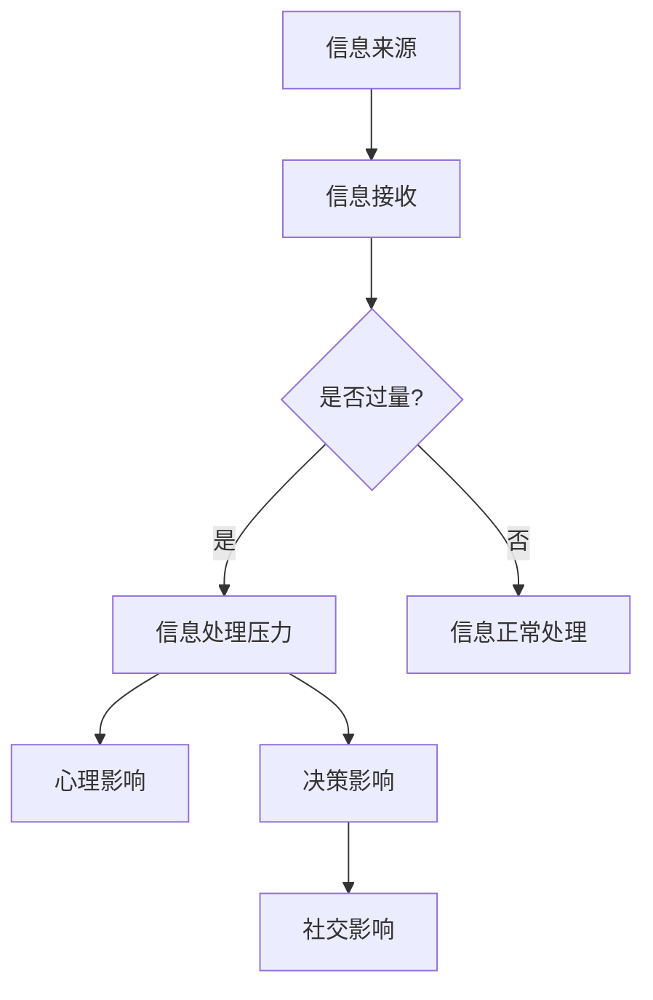
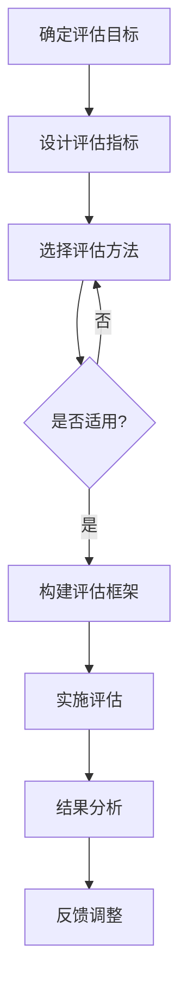
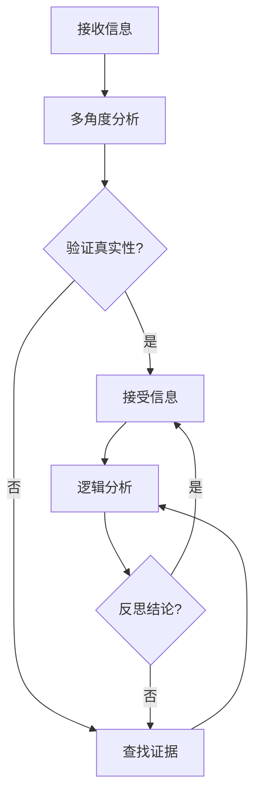

                 

### 信息过载与信息质量评估框架：批判性地评估和消费信息

在当今数字化时代，信息过载已经成为一个普遍存在的问题。随着互联网和社交媒体的快速发展，人们接收到的信息量呈爆炸式增长。这一现象不仅给个人的生活和工作带来了巨大压力，也对社会的整体运行产生了深远的影响。因此，如何有效地管理和评估信息质量，成为了一个亟待解决的重要课题。

本文旨在通过探讨信息过载现象及其影响，分析信息质量评估的基本概念和方法，并提出一系列有效的应对策略。文章结构如下：

## 第一部分：信息过载现象及其影响

### 第1章：信息过载的概念与背景
在这一章节中，我们将定义信息过载，并探讨其成因，以及它对个人和社会的深远影响。

### 第2章：信息过载现象的分析
这一章节将详细分析信息过载的具体表现，以及它对个人心理和社交关系的影响。

### 第3章：应对信息过载的策略
在这一章节中，我们将提出多种应对信息过载的策略，包括时间管理、信息筛选、心理调适方法以及社会层面的应对策略。

## 第二部分：信息质量评估框架

### 第4章：信息质量评估的基本概念
我们将介绍信息质量评估的基本概念，包括其定义、关键要素以及评估的重要性。

### 第5章：信息质量评估框架
这一章节将详细讨论信息质量评估框架的设计原则、构建方法和应用实例。

### 第6章：信息质量评估方法
我们将介绍多种信息质量评估方法，包括主观评估方法、客观评估方法和综合评估方法。

### 第7章：信息质量评估工具与技术
这一章节将探讨信息质量评估工具和技术的类型及其应用。

## 第三部分：批判性地评估和消费信息

### 第8章：批判性思维在信息评估中的应用
我们将介绍批判性思维的基本原则，并探讨它在信息评估中的应用。

### 第9章：信息消费的伦理问题
这一章节将讨论信息消费中的伦理原则、困境和伦理责任。

### 第10章：构建健康的信息环境
我们将提出个人层面、社会层面和政府与企业的努力，以构建一个健康的信息环境。

## 第四部分：案例分析与实践指导

### 第11章：信息过载与信息质量评估的案例研究
我们将通过具体案例研究，分析信息过载和信息质量评估的问题。

### 第12章：实践指导与信息管理
这一章节将提供实践指导，包括信息管理的基本原则和方法。

### 第13章：信息过载与信息质量评估的未来趋势
我们将探讨人工智能在信息质量评估中的应用，以及信息过载的缓解措施和发展方向。

## 第五部分：信息过载与信息质量评估的Mermaid流程图

我们将使用Mermaid语言绘制流程图，以帮助读者更好地理解信息过载与信息质量评估的过程。

## 第六部分：核心算法原理讲解

### 第14章：信息质量评估的数学模型
我们将介绍信息质量评估的数学模型，包括信息可信度模型和信息传播模型。

### 第15章：信息过载预警系统的设计
我们将设计一个信息过载预警系统，并通过伪代码详细讲解其实现过程。

## 第七部分：项目实战

### 第16章：构建信息质量评估系统
我们将通过一个实际的案例，讲解如何构建信息质量评估系统。

## 第八部分：结论与展望

### 第17章：总结与展望
我们将总结本文的主要贡献，并探讨未来的研究方向。

通过上述结构和内容的安排，本文旨在为读者提供一个系统而全面的视角，以应对信息过载和信息质量评估这一重要课题。接下来，我们将深入探讨信息过载的概念及其影响，为后续章节的内容打下坚实的基础。

### 关键词

信息过载、信息质量评估、批判性思维、伦理问题、信息环境、案例分析、实践指导、人工智能、数学模型、预警系统、信息质量评估系统。

### 摘要

本文首先探讨了信息过载现象的定义、成因及其对个人和社会的影响。随后，我们详细介绍了信息质量评估的基本概念、框架和方法。针对信息过载问题，文章提出了多种应对策略，包括时间管理、信息筛选和心理调适方法。文章还深入探讨了信息消费中的伦理问题，并提出了构建健康信息环境的建议。通过具体案例分析和实践指导，本文旨在为读者提供系统性的信息管理和质量评估解决方案，以应对数字化时代的信息挑战。

## 第一部分：信息过载现象及其影响

### 第1章：信息过载的概念与背景

#### 1.1 信息过载的定义

信息过载，顾名思义，是指信息接收者面临的信息量超过了其处理能力，导致无法有效管理和利用这些信息的现象。在信息科学和通信领域，信息过载通常被描述为“信息超载”或“信息过剩”，它不仅包括大量的数据，还涵盖了信息的多样性、速度和来源。

定义信息过载可以从多个维度进行。从数量上来看，信息过载指的是接收者在一定时间内无法处理的信息量超过了其认知和存储能力。从质量上来看，信息过载还包括信息的真实性和准确性不足，导致接收者在判断和决策时难以区分有效信息与无效信息。

信息过载现象不仅仅局限于个人层面，它同样影响到了企业和组织。在企业环境中，信息过载可能导致员工工作效率低下、决策失误，甚至影响企业的竞争力。对于组织而言，信息过载还可能引发安全风险，如敏感信息泄露。

#### 1.2 信息过载的成因

信息过载的成因复杂多样，主要包括以下几个方面的因素：

1. **互联网的普及**：随着互联网的普及，信息的传播速度和范围都得到了极大的扩展。社交媒体、在线新闻、电子商务平台等都是信息过载的重要来源。
   
2. **信息技术的进步**：大数据、云计算和物联网等技术的发展，使得信息的生成、存储和检索变得更加便捷，但同时也带来了信息爆炸的问题。

3. **信息传播机制**：在现代社会，信息传播渠道多样化，如社交媒体、新闻网站、电子邮件等，这些渠道的信息推送机制往往缺乏有效的筛选和过滤，导致用户被动接收大量信息。

4. **信息消费习惯**：现代人的信息消费习惯也在一定程度上加剧了信息过载。人们倾向于即时满足信息需求，不断刷新社交媒体、查看邮件，这种行为模式无形中加剧了信息过载的问题。

5. **个人注意力有限**：人类的注意力资源是有限的，当面对大量信息时，个人的注意力难以分散，导致信息处理效率下降。

#### 1.3 信息过载对个人和社会的影响

信息过载对个人和社会的影响是多方面的，具体体现在以下几个方面：

1. **心理健康问题**：长期处于信息过载的状态，个人可能会出现焦虑、压力和疲劳等心理健康问题。研究表明，信息过载与抑郁症、焦虑症等心理疾病存在一定的关联。

2. **工作效率下降**：信息过载会分散个人的注意力，降低工作效率。在工作和学习过程中，个人可能会因为处理过多信息而分心，导致任务完成质量和速度下降。

3. **决策困难**：信息过载使得个人难以从海量信息中筛选出有效信息，导致在做出决策时面临困难。例如，消费者在购物时可能会因为商品信息过多而难以做出选择。

4. **社会信任问题**：信息过载还可能导致社会信任问题。当信息来源多样且真实性难以判断时，人们可能会对信息产生怀疑，进而影响社会信任体系。

5. **知识生产效率降低**：在学术和研究领域，信息过载会降低知识的生产和传播效率。研究者需要在海量信息中筛选出有价值的信息，这无疑增加了研究的难度和时间成本。

6. **社会问题加剧**：信息过载可能加剧一些社会问题，如社会不平等、信息垄断等。在信息时代，信息资源的不平等分配可能导致社会阶层固化，加剧社会矛盾。

#### 1.4 信息过载现象的历史与现状

信息过载作为一个社会现象，其历史可以追溯到计算机技术和互联网的兴起。在20世纪80年代，随着个人电脑的普及，人们开始接触到越来越多的信息。随着互联网的发展，信息过载现象逐渐显现。特别是进入21世纪后，随着社交媒体和移动设备的普及，信息过载问题变得更加严重。

目前，信息过载已经成为全球性的问题。根据一项调查显示，大约80%的互联网用户认为他们每天接收到的信息量过多。这一现象不仅影响了个人，也对企业和社会造成了深远的影响。

#### 1.5 信息过载问题的现状分析

1. **数据量激增**：全球数据量呈现出指数级增长。根据国际数据公司（IDC）的预测，到2025年，全球数据量将达到约180ZB（1ZB等于1亿TB）。这庞大的数据量使得信息过载问题更加突出。

2. **信息消费行为**：现代人的信息消费行为也发生了巨大变化。例如，社交媒体用户每天花费在社交媒体上的时间平均超过2小时。这种高频率的信息消费行为加剧了信息过载的问题。

3. **企业挑战**：在企业层面，信息过载问题同样突出。企业需要处理来自内部和外部的海量数据，这无疑增加了信息管理的难度。许多企业已经开始采用大数据和人工智能技术来应对信息过载问题。

4. **政策与法规**：为了应对信息过载问题，各国政府和国际组织开始制定相关政策法规。例如，欧盟推出了《通用数据保护条例》（GDPR），旨在保护个人数据隐私，减少信息过载。

总之，信息过载是一个复杂且严峻的问题。它不仅影响了个人，也对企业和社会产生了深远的影响。解决信息过载问题需要从技术、政策和社会等多个层面进行综合考虑。

### 第2章：信息过载现象的分析

#### 2.1 信息过载的具体表现

信息过载的具体表现可以从多个维度进行观察，以下是几种常见的情况：

1. **信息量过大**：用户每天接收到的信息量远远超过了其处理能力。例如，社交媒体上的每日更新、邮件收件箱中不断增多的邮件、新闻网站上的海量新闻等，都会使个人感到信息压力。

2. **信息更新过快**：在互联网时代，信息的更新速度非常快。例如，股票市场、体育赛事等实时信息更新，用户几乎无法及时处理和吸收这些信息。

3. **信息来源多样**：现代社会的信息来源非常多样化，包括社交媒体、新闻媒体、专业网站、电子邮件等。用户需要在这些不同的信息源之间切换，这无疑增加了信息处理的复杂性。

4. **信息质量参差不齐**：信息过载的一个重要特点是信息的质量参差不齐。用户在处理信息时，不仅要筛选出有价值的信息，还要辨别信息的真实性和准确性。

5. **被动接收信息**：在信息爆炸的时代，用户往往处于被动接收信息的状态。信息推送机制和广告投放策略使得用户在不知不觉中被大量信息包围，难以自主控制信息消费。

#### 2.2 信息过载的心理影响

信息过载对个人心理的影响是多方面的，主要包括以下几种情况：

1. **焦虑和压力**：信息过载使得个人在处理信息时感到焦虑和压力。例如，担心错过重要信息、担心处理不当导致不良后果等。

2. **注意力分散**：信息过载会分散个人的注意力，使得个人难以集中精力处理特定任务。研究表明，长时间处于信息过载状态的人，其注意力集中时间会显著缩短。

3. **疲劳感**：处理大量信息需要消耗大量的认知资源，这会导致个人感到疲劳。长期的疲劳感会进一步影响个人的心理健康和整体生活质量。

4. **决策困难**：信息过载使得个人在做出决策时面临困难。大量的信息往往使得决策过程变得复杂，个人难以从众多选项中做出最佳选择。

5. **社会隔离感**：在信息过载的环境中，个人可能会感到与外界隔离。尽管每天接收大量的信息，但个人往往无法建立深入的人际关系，导致社会孤立感增强。

#### 2.3 信息过载对社交关系的影响

信息过载不仅影响个人心理，还对社交关系产生了深远的影响：

1. **沟通障碍**：信息过载使得个人在沟通时难以集中精力。例如，在社交媒体上的对话中，用户可能会因为信息过载而忽略重要信息，导致沟通效率降低。

2. **信任危机**：信息过载可能导致信息来源的多样性和质量参差不齐，使得个人在判断信息真实性时感到困惑。这种不确定性可能引发信任危机，影响社交关系。

3. **隐私侵犯**：信息过载现象往往伴随着隐私侵犯问题。例如，社交媒体上的个人信息泄露、电子邮件垃圾邮件等，都可能对用户的隐私和安全造成威胁。

4. **社交疏远**：在信息过载的环境中，个人可能倾向于减少社交互动，以逃避信息压力。这种现象可能导致社交疏远，减少社交网络的支持和互动。

5. **社会不平等**：信息过载现象还可能加剧社会不平等。信息资源的分配不均，使得一部分人能够享受高质量的信息资源，而另一部分人则被信息过载所困扰，导致社会阶层分化。

综上所述，信息过载现象不仅影响了个人心理和社交关系，还对社会的整体运行产生了深远的影响。解决信息过载问题需要从多个层面进行综合干预，包括技术、政策和社会等各个方面。只有这样，我们才能构建一个更加健康和高效的信息环境。

### 第3章：应对信息过载的策略

#### 3.1 时间管理技巧

信息过载的一个重要原因是时间管理不当，因此，优化时间管理技巧是应对信息过载的关键策略之一。

1. **制定日程计划**：合理规划每天的时间，为重要任务和信息处理设定固定时间段。使用日历或时间管理应用，确保每项任务都有明确的时间安排。

2. **优先级排序**：根据任务的紧急程度和重要性对任务进行排序。优先处理最重要的任务，确保关键任务得到及时完成。

3. **专注时间**：利用专注工具，如番茄钟法，设定25分钟的工作周期，然后休息5分钟。这种方法有助于提高专注力，减少分心。

4. **减少冗余信息**：定期清理电子邮件、社交媒体和应用通知，取消不必要的订阅和通知，以减少冗余信息的干扰。

5. **避免多任务处理**：尽管多任务处理似乎能够提高效率，但实际上它会分散注意力，降低工作质量。尽量避免同时处理多项任务，专注于单一任务。

6. **休息与放松**：定期休息和放松对应对信息过载至关重要。安排短暂的休息时间，进行放松活动，如散步、冥想或阅读，以缓解心理压力。

#### 3.2 信息筛选与过滤

信息筛选与过滤是减少信息过载的重要手段，以下是一些有效的方法：

1. **定制信息源**：选择几个可信度高、内容丰富的信息源，并对其进行订阅和关注。避免盲目追求大量信息，确保接收的信息是有价值的。

2. **使用新闻聚合器**：新闻聚合器能够根据用户兴趣和需求自动筛选和聚合信息，帮助用户高效地获取相关内容。

3. **关键词筛选**：使用关键词过滤器，自动屏蔽与当前任务无关的信息。这种方法特别适用于电子邮件和社交媒体的通知。

4. **人工筛选**：定期检查和筛选接收到的信息，删除不相关或低价值的信息。这种方法需要时间和精力，但对于信息过载问题具有显著的效果。

5. **信息源认证**：在获取信息时，对信息源的可靠性进行评估。优先选择权威和专业机构发布的信息，避免被不准确或虚假信息误导。

6. **设置信息使用限制**：利用应用程序和设备的功能，设置信息使用的限制，例如每天使用社交媒体的时间限制，以减少被动接收的信息量。

#### 3.3 心理调适方法

心理调适是应对信息过载的重要组成部分，以下是一些有效的心理调适方法：

1. **认知重构**：改变对信息过载的认知，将其视为一种挑战而非威胁。通过积极的思维模式，减轻心理压力。

2. **情绪调节**：学会识别和调节自己的情绪，避免因信息过载而感到焦虑和沮丧。通过深呼吸、冥想或瑜伽等方法，帮助缓解情绪压力。

3. **自我接纳**：接受自己无法处理所有信息的现实，设定合理的信息处理目标。避免因信息过载而产生的自我批评和负面情绪。

4. **寻求支持**：与家人、朋友或同事交流，分享自己的感受和困惑。寻求社会支持可以帮助缓解心理压力，获得新的应对策略。

5. **专业咨询**：如果信息过载问题严重影响了生活质量，可以考虑寻求专业心理咨询。心理咨询师可以提供专业的指导和支持，帮助应对信息过载问题。

6. **培养兴趣和爱好**：通过培养兴趣爱好，转移对信息的过度关注。兴趣爱好不仅能够提供心理满足感，还有助于提高整体生活质量。

#### 3.4 社会层面应对策略

除了个人层面的应对策略，社会层面的策略也在减少信息过载方面发挥着重要作用：

1. **政策制定**：政府和相关机构可以制定政策，规范信息传播和消费行为。例如，限制广告投放、规范社交媒体平台的信息推送机制等。

2. **教育培训**：通过教育提高公众的信息素养，帮助人们学会如何有效地筛选和评估信息。学校和社区可以开设相关课程，提高人们的信息处理能力。

3. **信息素养提升**：推动信息素养教育的普及，从基础教育阶段开始培养孩子们的信息辨别能力和批判性思维。

4. **技术支持**：企业和科技公司可以开发和应用信息筛选工具，帮助用户更好地管理和处理信息。例如，开发智能推荐系统，根据用户兴趣和需求提供个性化信息。

5. **公共信息环境建设**：建设和维护健康、公正、透明的公共信息环境，减少虚假和误导信息的传播。

6. **社会支持网络**：建立和维护社会支持网络，为那些因信息过载而感到困扰的人提供帮助。例如，社区组织可以提供信息管理咨询和心理支持服务。

通过上述策略，个人和社会可以共同应对信息过载问题，构建一个更加健康、高效和可持续的信息环境。

### 第二部分：信息质量评估框架

#### 第4章：信息质量评估的基本概念

信息质量评估是确保信息有效性和可信性的关键过程。随着信息量的急剧增加，评估信息质量变得尤为重要。在这一章节中，我们将探讨信息质量评估的基本概念，包括其定义、关键要素及其重要性。

#### 4.1 信息质量的定义

信息质量是指信息满足特定需求和使用目的的程度。它不仅涉及信息的准确性、完整性和可靠性，还包括信息的及时性、可访问性和可理解性。具体来说，信息质量可以从以下几个方面进行定义：

1. **准确性**：信息是否真实、无误。准确的信息能够帮助用户做出正确的决策和判断。

2. **完整性**：信息是否全面、无遗漏。完整的信息能够提供用户所需的全部相关信息，避免因信息不全而导致错误决策。

3. **可靠性**：信息来源是否可信、信息处理过程是否科学。可靠的信息能够增强用户对信息的信任度。

4. **及时性**：信息是否在需要时提供。及时的信息能够帮助用户迅速做出反应，抓住有利时机。

5. **可访问性**：信息是否易于获取和访问。可访问的信息能够提高用户的效率和使用体验。

6. **可理解性**：信息是否易于理解和解释。可理解的信息能够减少用户的认知负担，提高信息的利用率。

#### 4.2 信息质量的关键要素

信息质量的关键要素是评估信息质量的基础，以下是一些主要的关键要素：

1. **真实性**：信息是否反映实际事实。真实的信息是评估信息质量的首要标准。

2. **准确性**：信息是否精确无误。准确的数值和事实是高质量信息的重要组成部分。

3. **完整性**：信息是否全面，是否包含所有相关要素。完整的信息能够提供全面的视角，避免因信息不全导致的误判。

4. **一致性**：信息在不同时间和来源之间是否一致。一致的信息能够增强用户对信息的信任度。

5. **及时性**：信息是否在需要时提供。及时的信息能够帮助用户迅速做出反应，抓住有利时机。

6. **客观性**：信息是否基于客观事实，而非个人主观判断。客观的信息能够减少偏见和误解。

7. **可访问性**：信息是否易于获取和访问。良好的可访问性能够提高信息的利用率。

8. **可理解性**：信息是否易于理解和解释。可理解的信息能够降低用户的认知负担，提高信息的利用率。

#### 4.3 信息质量评估的重要性

信息质量评估在多个领域都具有重要意义，以下是一些主要方面：

1. **决策支持**：高质量的信息能够为决策提供可靠依据，避免因信息不准确、不完整或不可靠而导致的错误决策。

2. **知识管理**：信息质量评估能够确保知识管理的有效性，提高知识的准确性和利用率。

3. **风险管理**：评估信息质量能够帮助识别和降低信息风险，减少因信息问题导致的损失。

4. **竞争优势**：高质量的信息能够为企业提供竞争优势，帮助企业在激烈的市场竞争中脱颖而出。

5. **消费者权益保护**：在消费者领域，信息质量评估能够确保消费者获得真实、准确的信息，维护消费者权益。

6. **公共信任**：高质量的公共信息能够增强社会信任，提高公众对政府和企业的信任度。

7. **科研与创新**：在科研领域，高质量的信息是进行创新研究的基础，有助于提高科研效率和成果质量。

总之，信息质量评估是确保信息有效性和可信性的重要手段。通过科学、系统的信息质量评估，我们能够更好地利用信息资源，提高决策质量和科研效率，为社会和个人的发展提供有力支持。

#### 4.4 信息质量评估的挑战与应对策略

尽管信息质量评估在多个领域具有重要意义，但在实际操作中仍然面临诸多挑战。以下是一些主要挑战及其应对策略：

1. **信息源多样性**：现代社会中，信息来源多种多样，包括互联网、社交媒体、传统媒体等。不同来源的信息质量参差不齐，给评估工作带来挑战。**应对策略**：建立信息源筛选和评估机制，优先选择权威和可信的信息源。

2. **信息更新频率**：随着互联网技术的发展，信息更新频率大幅提高。快速更新的信息可能带来时效性问题，影响评估的准确性。**应对策略**：采用实时监测和更新机制，确保评估信息的新鲜度和及时性。

3. **评估成本**：信息质量评估需要耗费大量的人力、物力和时间。对于一些大型项目和机构，评估成本可能较高。**应对策略**：优化评估流程，利用自动化工具和算法提高评估效率，降低成本。

4. **用户需求多样性**：不同用户对信息质量的需求不同，这增加了评估工作的复杂性。**应对策略**：进行用户需求分析，根据不同用户群体的特点制定个性化的评估标准。

5. **信息真实性**：虚假信息和误导信息在互联网上广泛传播，给评估工作带来困扰。**应对策略**：加强信息真实性验证，采用多种方法交叉验证信息来源。

6. **评估标准不统一**：不同领域和机构对信息质量的评估标准可能存在差异，导致评估结果不一致。**应对策略**：制定统一的评估标准，促进评估工作的标准化和规范化。

7. **评估结果的解释**：评估结果的解释和应用可能存在困难，用户难以理解评估结果的含义和影响。**应对策略**：加强评估结果的解释和沟通，提供详细的评估报告和指导。

通过以上应对策略，我们可以更好地克服信息质量评估中的挑战，确保评估工作的科学性和有效性。

#### 4.5 信息质量评估的理论基础

信息质量评估的理论基础涵盖了多个领域，包括信息科学、管理科学和心理学。以下是一些主要的理论基础：

1. **信息科学**：信息科学为信息质量评估提供了理论基础，包括信息检索、信息组织和信息计量等。信息科学的研究成果帮助评估者理解和衡量信息质量的不同维度。

2. **管理科学**：管理科学中的决策理论和质量管理理论为信息质量评估提供了指导。这些理论强调通过科学的方法和工具来评估和改进信息质量。

3. **心理学**：心理学为信息质量评估提供了对人类认知和信息处理的理解。认知心理学和决策心理学的研究成果帮助评估者理解用户如何处理和利用信息。

4. **信息伦理**：信息伦理为信息质量评估提供了道德和伦理指导。伦理原则帮助评估者在评估过程中坚持公正、诚信和透明，确保评估工作的合法性和道德性。

5. **系统理论**：系统理论为信息质量评估提供了整体视角，强调评估过程需要考虑信息的整体性和系统性。系统理论帮助评估者理解信息质量评估的复杂性。

6. **社会网络分析**：社会网络分析为信息质量评估提供了新的视角，特别是对于信息传播和社交网络中的信息质量评估。社会网络分析可以帮助评估者识别关键节点和影响力，从而更好地评估信息质量。

通过结合这些理论基础，评估者可以构建科学、系统和全面的信息质量评估框架，确保评估结果的准确性和有效性。

### 第5章：信息质量评估框架

#### 5.1 评估框架的设计原则

信息质量评估框架的设计需要遵循一系列原则，以确保评估过程的科学性、系统性和有效性。以下是一些关键设计原则：

1. **全面性**：评估框架应涵盖信息质量的各个方面，包括准确性、完整性、可靠性、及时性、可访问性和可理解性等。全面性有助于确保评估的全面性和准确性。

2. **客观性**：评估框架应尽量减少主观因素对评估结果的影响。通过采用量化指标和客观评估方法，可以提高评估结果的客观性和可信度。

3. **一致性**：评估框架应具备一致性，确保在不同情境下都能保持一致的评估标准和流程。一致性有助于提高评估结果的可靠性和可重复性。

4. **可操作性**：评估框架应具备可操作性，评估方法应简便易行，便于实际应用。可操作性有助于确保评估过程的顺利实施。

5. **动态性**：信息环境是不断变化的，评估框架应具备动态性，能够适应信息环境的变化。动态性有助于评估框架保持其相关性和有效性。

6. **用户参与**：评估框架应鼓励用户参与评估过程，收集用户反馈和意见。用户参与有助于确保评估结果的实用性和用户满意度。

7. **成本效益**：评估框架的设计应考虑成本效益，确保评估过程的成本合理，同时达到预期效果。成本效益有助于提高评估工作的可持续性。

#### 5.2 评估框架的构建方法

构建信息质量评估框架通常需要以下步骤：

1. **需求分析**：首先，分析评估的需求和目标，明确评估的目的和对象。需求分析有助于确定评估的关键要素和评估方法。

2. **指标设计**：根据需求分析结果，设计信息质量的评估指标。评估指标应具备代表性、可操作性和可衡量性。

3. **评估方法选择**：选择合适的评估方法，包括主观评估方法（如专家评审、用户调查）和客观评估方法（如数据挖掘、统计分析）。评估方法应根据评估目标和指标的特点进行选择。

4. **评估工具开发**：开发用于评估的工具和系统，如评估软件、问卷、评分表格等。评估工具应具备良好的用户界面和易用性。

5. **评估流程设计**：设计评估的流程和步骤，确保评估过程有序、高效。评估流程应包括数据收集、数据分析、结果输出和反馈调整等环节。

6. **试点测试**：在实际应用前，进行试点测试，验证评估框架的有效性和可行性。试点测试有助于发现和解决潜在问题。

7. **评估实施**：根据评估框架和流程，在实际环境中开展评估工作。评估实施过程中应密切关注评估结果，及时调整和优化评估框架。

8. **结果分析**：对评估结果进行详细分析，识别信息质量的优缺点，并提出改进建议。结果分析有助于评估框架的持续优化。

#### 5.3 评估框架的应用实例

以下是一个信息质量评估框架的应用实例，该实例适用于电子商务平台的信息质量评估：

1. **评估需求分析**：针对电子商务平台，分析信息质量的需求和目标，确定评估的关键要素，如商品描述的准确性、客户评论的可信度、订单处理的及时性等。

2. **评估指标设计**：
   - 准确性：商品描述与实际商品是否一致。
   - 可信度：客户评论的真实性和可靠性。
   - 及时性：订单处理的速度和效率。
   - 完整性：订单信息的完整性，如收货地址、联系方式等。
   - 可访问性：商品信息的易获取性和可理解性。

3. **评估方法选择**：
   - 主观评估方法：专家评审和用户调查，用于评估商品描述的准确性和客户评论的可信度。
   - 客观评估方法：数据挖掘和统计分析，用于评估订单处理的及时性和完整性。

4. **评估工具开发**：
   - 开发评估软件，用于收集用户调查数据和自动分析客户评论。
   - 开发评分表格，用于专家评审和用户评分。

5. **评估流程设计**：
   - 数据收集：收集用户调查数据和客户评论数据。
   - 数据分析：使用评估软件和评分表格对数据进行分析。
   - 结果输出：生成评估报告，包括评估结果和改进建议。
   - 反馈调整：根据评估结果调整商品描述和客户评论机制。

6. **评估实施**：在实际电子商务平台上开展评估工作，收集用户反馈，并根据反馈调整评估流程。

7. **结果分析**：分析评估结果，识别商品描述、客户评论和订单处理中的问题，并提出改进措施。

通过以上步骤，电子商务平台可以构建一个科学、系统和全面的信息质量评估框架，确保平台上的信息质量达到预期标准。

### 第6章：信息质量评估方法

#### 6.1 主观评估方法

主观评估方法是一种基于人类主观判断和信息处理能力的评估方法。以下是一些常见的主观评估方法：

1. **专家评审**：专家评审是由一组具备相关领域专业知识和经验的专家对信息质量进行评估。专家评审的优点是能够提供深度和专业的意见，缺点是评估结果可能受到专家个人偏见的影响。

   - **评估步骤**：
     - 明确评审目标和标准。
     - 选择合适的专家。
     - 进行评审会议，专家们对信息进行讨论和评分。
     - 整合专家意见，生成评估报告。

2. **用户调查**：用户调查是通过问卷、访谈等方式收集用户对信息质量的评价。用户调查的优点是能够获取广泛且多样化的用户反馈，缺点是评估结果可能受到用户主观感受和表达能力的影响。

   - **评估步骤**：
     - 设计调查问卷或访谈大纲。
     - 选择目标用户群体。
     - 进行问卷调查或访谈。
     - 分析用户反馈，识别信息质量的优缺点。

3. **焦点小组**：焦点小组是由一组目标用户组成的讨论小组，针对特定信息内容进行讨论和评估。焦点小组的优点是能够激发用户的深入讨论和互动，缺点是讨论结果可能受到小组领导者和主导意见的影响。

   - **评估步骤**：
     - 明确讨论目标和议程。
     - 组建焦点小组。
     - 进行讨论，记录关键意见和反馈。
     - 分析讨论结果，总结信息质量的评价。

#### 6.2 客观评估方法

客观评估方法是一种基于客观数据和分析的评估方法。以下是一些常见的客观评估方法：

1. **数据挖掘**：数据挖掘是通过分析大量数据，发现数据中的模式和规律。数据挖掘可以用于识别信息中的关键要素、评估信息的可信度和可靠性。

   - **评估步骤**：
     - 数据收集：收集与信息质量相关的数据，如用户评论、订单处理记录等。
     - 数据预处理：清洗和整理数据，去除噪声和错误。
     - 数据分析：使用数据挖掘算法分析数据，识别信息质量的关键指标。
     - 结果输出：生成分析报告，展示数据挖掘的结果。

2. **统计分析**：统计分析是通过对数据进行分析，评估信息的准确性和可靠性。统计分析可以用于评估信息的一致性、完整性等。

   - **评估步骤**：
     - 数据收集：收集与信息质量相关的数据。
     - 数据预处理：清洗和整理数据。
     - 数据分析：使用统计方法分析数据，如均值、方差、相关性等。
     - 结果输出：生成分析报告，展示统计分析的结果。

3. **机器学习**：机器学习是通过训练模型，自动评估信息质量。机器学习可以用于识别高质量信息的特征，预测信息的可信度等。

   - **评估步骤**：
     - 数据收集：收集与信息质量相关的数据。
     - 数据预处理：清洗和整理数据。
     - 模型训练：使用训练数据训练模型。
     - 模型评估：使用测试数据评估模型性能。
     - 结果输出：生成评估报告，展示模型预测结果。

#### 6.3 综合评估方法

综合评估方法是将主观评估方法和客观评估方法相结合，以提高评估结果的准确性和全面性。以下是一些常见的综合评估方法：

1. **混合评估方法**：混合评估方法将专家评审、用户调查和数据挖掘等方法结合起来，通过多种方式获取信息质量的评估结果。

   - **评估步骤**：
     - 进行专家评审和用户调查，收集主观评估结果。
     - 使用数据挖掘和统计分析，分析客观数据，获取客观数据评估结果。
     - 综合分析主观评估和客观数据评估结果，生成综合评估报告。

2. **多维度评估方法**：多维度评估方法从多个维度评估信息质量，如准确性、完整性、及时性、可访问性和可理解性等。通过多个维度的综合评估，可以更全面地了解信息质量。

   - **评估步骤**：
     - 设计多维度评估指标，明确评估维度。
     - 进行主观评估和客观评估，分别评估不同维度的信息质量。
     - 综合分析各个维度的评估结果，生成综合评估报告。

3. **定量与定性结合方法**：定量与定性结合方法将定量评估和定性评估相结合，通过定量数据分析和定性描述，全面评估信息质量。

   - **评估步骤**：
     - 进行定量评估，如统计分析、数据挖掘等，获取定量评估结果。
     - 进行定性评估，如专家评审、用户访谈等，获取定性评估结果。
     - 综合定量和定性评估结果，生成综合评估报告。

通过综合评估方法，可以充分利用主观评估和客观评估的优点，提高评估结果的准确性和全面性。综合评估方法适用于复杂的信息环境，能够提供更可靠和实用的信息质量评估。

#### 6.4 评估方法的比较与选择

不同评估方法各有优缺点，选择合适的评估方法取决于评估目标、资源条件和实际需求。以下是对几种常见评估方法的比较：

1. **专家评审**：
   - **优点**：能够提供专业、深度的评估意见；有助于发现潜在问题。
   - **缺点**：受专家个人偏见影响；评估过程可能耗时较长。
   - **适用场景**：需要专业知识和经验判断的领域，如医疗、法律等。

2. **用户调查**：
   - **优点**：获取广泛且多样化的用户反馈；有助于了解用户需求。
   - **缺点**：用户表达能力可能有限；评估结果可能受主观感受影响。
   - **适用场景**：面向用户的系统和产品，如电子商务、社交媒体等。

3. **数据挖掘**：
   - **优点**：能够自动识别数据中的模式和规律；有助于发现潜在的问题。
   - **缺点**：需要大量数据支持和复杂的算法；结果解释可能较为复杂。
   - **适用场景**：需要从大量数据中提取有价值信息的领域，如金融、市场营销等。

4. **统计分析**：
   - **优点**：简单易行；能够提供定量评估结果。
   - **缺点**：可能忽略数据的上下文和细节；对数据质量要求较高。
   - **适用场景**：需要快速、简单评估信息质量的场景，如日常运营监控等。

5. **机器学习**：
   - **优点**：能够自动学习和预测；能够处理复杂数据模式。
   - **缺点**：需要大量数据支持；结果解释可能较为复杂。
   - **适用场景**：需要预测和自动评估信息质量的场景，如智能推荐系统、风控管理等。

在选择评估方法时，应综合考虑以下因素：

- **评估目标**：明确评估的目的和需求，选择能够满足评估目标的评估方法。
- **资源条件**：评估方法所需的人力、物力和时间资源。
- **数据可用性**：评估所需的数据量和数据质量。
- **评估维度**：评估方法是否能够涵盖所需评估的所有维度。
- **结果解释**：评估结果是否易于理解和解释。

通过综合考虑以上因素，可以选出最适合的评估方法，确保评估过程的科学性和有效性。

#### 6.5 信息质量评估工具与技术

在信息质量评估过程中，工具和技术的选择至关重要。以下是一些常用的信息质量评估工具和技术：

1. **评估软件**：
   - **优点**：自动化评估过程，提高评估效率。
   - **缺点**：需要一定的技术支持；可能无法完全满足个性化需求。
   - **适用场景**：大规模数据评估、自动化评估需求较高的场景。

2. **评估平台**：
   - **优点**：提供全面的评估功能和资源；支持多维度评估。
   - **缺点**：可能需要订阅费用；技术支持可能不足。
   - **适用场景**：需要综合性评估工具的企业和组织。

3. **算法和模型**：
   - **优点**：能够自动学习和预测；适用于复杂评估需求。
   - **缺点**：需要大量数据支持和复杂算法；结果解释可能较为复杂。
   - **适用场景**：需要精确预测和自动化评估的领域，如金融、风控等。

4. **问卷和调查工具**：
   - **优点**：简单易用；能够快速收集用户反馈。
   - **缺点**：评估结果可能受用户主观感受影响。
   - **适用场景**：需要快速收集用户意见的场景，如市场调研等。

5. **数据分析和可视化工具**：
   - **优点**：能够对大量数据进行分析和可视化；帮助理解数据模式。
   - **缺点**：需要一定的数据分析和可视化技能。
   - **适用场景**：需要对大量数据进行分析和呈现的场景，如商业智能、数据分析等。

在选择评估工具和技术时，应考虑以下因素：

- **评估需求**：评估目标和方法，选择能够满足评估需求的工具和技术。
- **资源条件**：所需的技术支持和资源。
- **数据质量**：评估工具和技术对数据质量的要求。
- **用户友好性**：工具和技术的用户界面和易用性。
- **结果解释**：工具和技术能否提供清晰的结果解释。

通过综合考虑以上因素，可以选出最适合的评估工具和技术，确保评估过程的科学性和有效性。

### 第7章：信息质量评估工具与技术

#### 7.1 评估工具的类型

在信息质量评估过程中，评估工具的选择至关重要。以下是一些常见的信息质量评估工具类型及其特点：

1. **自动化评估工具**：
   - **特点**：能够自动执行评估过程，提高评估效率。
   - **适用场景**：适用于大规模、重复性的评估任务，如网站内容质量评估、社交媒体监测等。

2. **问卷评估工具**：
   - **特点**：通过问卷形式收集用户对信息质量的评价，简单易用。
   - **适用场景**：适用于需要广泛收集用户反馈的情境，如市场调研、用户满意度调查等。

3. **评分系统**：
   - **特点**：提供定量的评估标准，用户可以根据评分标准对信息进行评分。
   - **适用场景**：适用于需要对信息进行客观评分的情境，如学术论文评估、产品评价等。

4. **数据分析工具**：
   - **特点**：能够对大量数据进行统计分析，识别信息质量的关键指标。
   - **适用场景**：适用于需要对信息进行深度分析的场景，如金融风险评估、市场数据分析等。

5. **专业评估软件**：
   - **特点**：提供全面的评估功能和专业的分析工具，适用于复杂评估需求。
   - **适用场景**：适用于需要高度专业化和定制化评估的领域，如医疗信息评估、法律文档评估等。

6. **算法评估工具**：
   - **特点**：利用机器学习算法，自动评估信息质量，提供预测和推荐。
   - **适用场景**：适用于需要自动化评估和智能推荐的领域，如个性化推荐系统、风控评估等。

#### 7.2 评估技术的应用

在信息质量评估中，多种技术的应用可以帮助提高评估的准确性和效率。以下是一些关键评估技术的应用实例：

1. **自然语言处理（NLP）**：
   - **应用实例**：利用NLP技术，可以自动分析和评估文本信息的内容和风格。例如，通过情感分析，可以评估用户评论的情感倾向，从而评估信息的可信度和可靠性。

2. **数据挖掘**：
   - **应用实例**：数据挖掘技术可以用于从大量数据中提取有价值的信息，用于评估信息的完整性、准确性和及时性。例如，通过关联规则挖掘，可以发现信息之间的关联性，评估信息的一致性。

3. **机器学习**：
   - **应用实例**：机器学习算法可以用于训练模型，自动评估信息质量。例如，通过分类算法，可以将信息分为高质量和低质量两类，从而评估信息的整体质量。

4. **人工智能**：
   - **应用实例**：人工智能技术可以用于智能信息筛选和评估。例如，通过智能助手，用户可以获取个性化的信息推荐，从而提高信息利用的效率和质量。

5. **区块链技术**：
   - **应用实例**：区块链技术可以用于确保信息的安全性、完整性和可信性。例如，在区块链上记录信息来源和修改记录，可以防止信息篡改和伪造，提高信息的可靠性。

6. **分布式计算**：
   - **应用实例**：分布式计算技术可以用于处理大规模的数据集，提高信息质量评估的效率。例如，通过分布式数据库，可以快速检索和分析大量信息，提高评估的速度和准确性。

通过结合多种评估技术和工具，可以构建一个高效、准确和全面的信息质量评估系统，为决策提供可靠的信息支持。

#### 7.3 工具与技术的比较

在信息质量评估过程中，选择合适的工具和技术至关重要。以下是对几种常用评估工具和技术的比较：

1. **自动化评估工具 vs. 问卷评估工具**：
   - **自动化评估工具**：优点在于高效、自动化，适用于大规模重复性评估任务。缺点是可能无法完全反映用户的个性化需求。
   - **问卷评估工具**：优点在于简单易用，能够快速收集广泛用户的反馈。缺点是评估结果可能受用户主观感受影响。

2. **评分系统 vs. 数据分析工具**：
   - **评分系统**：优点在于提供明确的评估标准，用户可以根据评分标准进行客观评分。缺点是评估维度有限，可能无法全面反映信息质量。
   - **数据分析工具**：优点在于能够对大量数据进行分析，识别信息质量的关键指标。缺点是需要一定的数据分析和可视化技能，评估过程可能较为复杂。

3. **专业评估软件 vs. 算法评估工具**：
   - **专业评估软件**：优点在于提供全面的功能和专业分析工具，适用于复杂评估需求。缺点是可能需要较高的技术支持和订阅费用。
   - **算法评估工具**：优点在于能够自动学习和预测，适用于自动化评估需求较高的场景。缺点是可能需要大量数据支持，结果解释可能较为复杂。

4. **自然语言处理（NLP）vs. 数据挖掘**：
   - **NLP**：优点在于能够自动分析和评估文本信息，适用于文本内容质量评估。缺点是可能对数据质量要求较高，评估结果可能受语言复杂性影响。
   - **数据挖掘**：优点在于能够从大量数据中提取有价值的信息，适用于信息完整性、准确性和及时性评估。缺点是可能需要对数据有较高的理解和处理能力。

5. **人工智能 vs. 区块链技术**：
   - **人工智能**：优点在于能够智能筛选和评估信息，适用于个性化推荐和自动化评估。缺点是可能存在隐私和安全问题。
   - **区块链技术**：优点在于确保信息的安全性和可信性，适用于需要高可靠性和透明度的评估场景。缺点是可能对技术要求较高，实施成本较高。

在选择评估工具和技术时，应综合考虑评估目标、资源条件、数据质量和用户需求。通过比较不同工具和技术的优缺点，可以选出最适合的评估方案，确保评估过程的科学性和有效性。

### 第三部分：批判性地评估和消费信息

#### 第8章：批判性思维在信息评估中的应用

批判性思维是一种通过分析和评估信息来形成独立、理性观点的思维方式。在信息过载的时代，批判性思维显得尤为重要，它能够帮助我们在海量信息中筛选出有价值的信息，并对其进行合理的评估和消费。

#### 8.1 批判性思维的基本原则

批判性思维包含以下几个基本原则：

1. **怀疑精神**：对所有信息持有怀疑态度，不轻信任何单一来源，而是通过多个角度进行验证和考量。

2. **证据意识**：重视信息的证据基础，要求信息提供者提供可靠的证据支持其观点。

3. **逻辑分析**：运用逻辑分析工具，如归纳、演绎和反证法，对信息进行深入思考和分析。

4. **多元视角**：从多个不同的角度和视角评估信息，避免单一视角的局限性。

5. **开放性**：保持开放的心态，愿意接受和考虑不同的观点和意见。

6. **反思性**：不断反思和评估自己的思维过程和结论，确保思维的全面性和准确性。

#### 8.2 批判性思维在信息评估中的应用

在信息评估过程中，批判性思维的应用可以帮助我们更全面、准确地评估信息。以下是一些具体的应用方法：

1. **多角度分析**：在评估信息时，不仅考虑信息的表面内容，还要从多个角度分析其背景、语境和潜在动机。例如，在评估新闻报道时，不仅要考虑报道的内容，还要关注报道的来源、作者背景和报道目的。

2. **证据验证**：对信息中的论点和数据来源进行验证，确保其真实性和可靠性。可以通过查阅原始文献、参考权威数据源或咨询专家来验证信息的真实性。

3. **逻辑分析**：运用逻辑分析工具，检查信息的逻辑结构和推理过程是否合理。例如，可以通过识别逻辑谬误和验证前提条件来评估信息的逻辑性。

4. **证据意识**：要求信息提供者提供明确的证据支持其观点。如果没有充分的证据支持，应怀疑信息的可靠性。

5. **反思性评估**：在评估信息后，反思自己的思维过程和结论，检查是否存在偏见或误解。通过不断反思和调整，可以提高评估的准确性和全面性。

6. **多元视角评估**：在评估信息时，考虑不同的观点和意见，避免仅依赖单一来源。通过多元视角的分析，可以更全面地了解信息的真实情况。

#### 8.3 批判性评估的案例分析

以下是一个批判性评估的案例分析：

案例：评估一篇关于健康饮食的博客文章

1. **怀疑精神**：首先，对博客文章的标题和摘要进行初步评估，怀疑其是否真的提供了有价值的信息。

2. **证据验证**：查阅文章中提到的健康饮食建议和科学依据，验证其引用的学术论文和权威数据源。通过查阅原始文献，发现部分建议缺乏科学证据支持。

3. **逻辑分析**：检查文章的逻辑结构和推理过程。发现文章在论证过程中存在一些逻辑谬误，如以偏概全和假设前提错误。

4. **多元视角评估**：查阅其他健康饮食专家的观点和学术论文，发现这些文献提供了不同的建议和科学依据。

5. **反思性评估**：反思自己的思维过程，检查是否存在偏见。通过反思，发现自己在评估过程中可能受到了文章标题的影响，没有全面考虑其他专家的观点。

通过批判性评估，我们得出结论：该博客文章在提供健康饮食建议方面存在一定的问题，建议读者在参考时结合其他权威来源进行综合评估。

#### 8.4 提高批判性思维能力的方法

要提高批判性思维能力，可以采取以下方法：

1. **阅读广泛**：通过广泛阅读不同类型的书籍和文章，培养对信息的敏感度和批判性思维。

2. **参加讨论**：参与学术讨论、辩论和座谈会，锻炼思维的逻辑性和多元性。

3. **学习逻辑学**：学习逻辑学的基本原理和方法，提高逻辑分析和推理能力。

4. **反思日常思维**：在日常思考和决策过程中，经常反思自己的思维过程和结论，检查是否存在偏见和误解。

5. **寻求专业指导**：请教专家和导师，获取他们的经验和见解，帮助提高批判性思维能力。

通过以上方法，我们可以逐步提高自己的批判性思维能力，更有效地评估和消费信息。

#### 8.5 批判性思维在信息消费中的重要性

批判性思维在信息消费中的重要性不可忽视。以下是一些关键点：

1. **避免盲目跟风**：通过批判性思维，我们能够识别和避免盲目跟风，减少因信息误导而做出的错误决策。

2. **提高决策质量**：批判性思维有助于我们更全面地评估信息，提高决策的科学性和准确性。

3. **增强信息素养**：批判性思维有助于提高我们的信息素养，培养对信息的辨别能力和批判性思维能力。

4. **促进社会进步**：在公众领域，批判性思维能够帮助人们更好地参与公共事务，促进社会进步和民主发展。

5. **防范信息泛滥**：批判性思维有助于我们识别和过滤大量无价值的信息，减轻信息过载的压力。

总之，批判性思维是应对信息过载和信息质量问题的关键，通过培养批判性思维，我们可以更理性、更有效地评估和消费信息。

### 第9章：信息消费的伦理问题

信息消费作为现代社会中普遍存在的一种行为，不仅涉及到个人层面的信息选择和处理，还涉及到广泛的伦理问题。在信息过载的背景下，如何确保信息消费的伦理性成为一个亟待解决的问题。

#### 9.1 信息消费的伦理原则

信息消费的伦理原则主要包括以下几个核心方面：

1. **公正性**：信息消费应遵循公正原则，确保所有信息接收者都能公平地获取和利用信息资源。信息的不平等分配可能导致社会不公平，加剧社会分化。

2. **诚信性**：信息消费应建立在诚信基础上，信息接收者应对信息的真实性和准确性负责，避免传播虚假和误导性信息。

3. **隐私保护**：信息消费过程中，个人隐私应得到尊重和保护。未经用户同意，不得收集、使用和泄露个人隐私信息。

4. **知情同意**：信息消费应确保用户在知情的情况下做出选择，用户有权了解信息的来源、用途和处理方式。

5. **责任承担**：信息消费过程中，信息提供者和消费者都应承担相应的责任，确保信息的合法性和合规性。

#### 9.2 信息消费中的伦理困境

在信息消费过程中，存在一些典型的伦理困境，以下是一些常见的情况：

1. **隐私泄露**：随着大数据和人工智能技术的发展，个人信息泄露的风险日益增加。一些企业和机构可能滥用用户信息，进行未经授权的数据收集和利用，侵犯个人隐私。

2. **虚假信息传播**：在社交媒体和互联网上，虚假信息传播现象严重，一些不法分子故意传播虚假信息，误导公众，甚至对社会稳定造成威胁。

3. **信息依赖**：在信息过载的环境下，用户可能对某些信息平台或应用程序产生依赖，导致信息消费行为的失控。这不仅影响个人的心理健康，还可能影响社会整体的运行。

4. **信息霸权**：一些大型科技企业和平台凭借其市场优势，控制信息流动和传播渠道，形成信息霸权。这可能导致信息资源的不平等分配，影响公众的知情权和表达权。

5. **信息安全**：信息消费过程中，用户面临信息安全问题，如数据泄露、网络攻击等。这些安全风险可能对个人和企业造成严重的损失。

#### 9.3 伦理责任与信息质量

在信息消费过程中，伦理责任与信息质量密切相关。以下是一些关键点：

1. **信息生产者的责任**：信息生产者，包括新闻媒体、内容创作者和科技公司等，有责任确保其提供的信息真实、准确和可靠。他们应遵守伦理规范，避免发布虚假和误导性信息。

2. **信息消费者的责任**：信息消费者有责任辨别信息的真实性和可靠性，避免盲目相信和传播未经证实的信息。他们应培养批判性思维能力，提高信息素养。

3. **信息平台的责任**：信息平台，如社交媒体、新闻网站和搜索引擎等，有责任建立有效的信息过滤和管理机制，确保平台上的信息质量。他们应加强对虚假信息和恶意内容的监控和处置。

4. **政府与企业的责任**：政府和企业应共同承担信息质量的监管责任。政府应制定相关政策法规，规范信息生产和消费行为；企业应遵守法律法规，承担社会责任，提高信息质量。

#### 9.4 增强信息消费伦理性的策略

为了增强信息消费的伦理性，可以采取以下策略：

1. **加强伦理教育**：在个人层面，应加强伦理教育，提高公众的信息素养和批判性思维能力。学校、家庭和社会应共同努力，培养具有道德责任感和信息素养的公民。

2. **规范信息传播**：政府应制定和实施相关法规，规范信息传播行为，防止虚假信息和恶意内容的传播。同时，加强对信息平台的监管，确保其遵守伦理规范。

3. **技术创新**：运用技术创新手段，如人工智能和区块链技术，提高信息过滤和识别的准确性，减少虚假信息的传播。

4. **公众参与**：鼓励公众参与信息消费和治理，提高公众对信息质量问题的关注度和参与度。通过公众监督和反馈，推动信息消费环境的改善。

5. **建立信息伦理规范**：在行业层面，应制定和推广信息伦理规范，明确信息生产、消费和处理的行为准则。通过行业自律，提高信息消费的伦理水平。

总之，信息消费的伦理问题是一个复杂且严峻的挑战。通过加强伦理教育、规范信息传播、技术创新和公众参与，我们可以逐步增强信息消费的伦理性，构建一个健康、公正和可持续的信息消费环境。

### 第10章：构建健康的信息环境

构建健康的信息环境是应对信息过载和信息质量问题的关键。健康的信息环境不仅能够帮助个人有效管理信息，提高工作效率和生活质量，还能促进社会整体的健康发展。以下是一些从个人层面、社会层面和政府与企业层面构建健康信息环境的策略和措施。

#### 10.1 个人层面的努力

1. **提升信息素养**：个人应不断提升信息素养，学会如何批判性地评估和消费信息。这包括学会辨别信息的真实性和可靠性，掌握信息筛选和过滤的方法。

2. **培养良好的信息消费习惯**：个人应培养良好的信息消费习惯，避免盲目追求信息量，而是注重信息的质量和价值。可以通过限制社交媒体使用时间、定期清理电子邮件和通知来减少信息过载。

3. **时间管理**：个人应合理安排时间，确保有足够的时间进行信息处理和决策。通过时间管理技巧，如制定日程计划、设定专注时间等，可以提高工作效率，减少因信息过载带来的压力。

4. **心理调适**：面对信息过载和心理压力，个人应学会心理调适方法，如深呼吸、冥想、锻炼等。这些方法有助于缓解焦虑和压力，提高心理韧性。

5. **积极参与信息伦理教育**：个人应积极参与信息伦理教育，了解信息消费中的伦理原则和责任。通过自我教育和参与社区活动，提高对信息伦理问题的认识和敏感度。

#### 10.2 社会层面的举措

1. **加强信息素养教育**：社会层面应加强信息素养教育，特别是在学校和社区开展相关的课程和活动。通过教育提升公众的信息辨别能力和批判性思维能力。

2. **推动信息过滤技术**：企业和社会应推动信息过滤技术的发展，开发和应用能够有效筛选和过滤虚假信息的工具。这包括使用人工智能技术进行内容审核、建立可信信息源认证机制等。

3. **建立信息伦理规范**：行业组织和政府应制定和推广信息伦理规范，明确信息生产、传播和消费的行为准则。通过行业自律和社会监督，提高信息质量的整体水平。

4. **促进信息资源共享**：社会应促进信息资源的共享，特别是公共信息和教育资源。通过信息资源共享，减少信息资源的不平等分配，提高公众的知情权和参与度。

5. **加强公众监督**：社会应加强公众监督，通过媒体、公众论坛和网络平台等渠道，鼓励公众参与信息消费和信息质量评估。公众监督有助于提高信息透明度和公信力。

#### 10.3 政府与企业的责任

1. **制定政策和法规**：政府应制定和实施相关政策法规，规范信息生产和消费行为。这包括制定信息保护法、网络安全法等，保障个人隐私和数据安全。

2. **监管信息平台**：政府应加强对信息平台的监管，确保其遵守伦理规范，采取措施防止虚假信息的传播。可以通过技术手段和执法手段，对违规平台进行处罚和制裁。

3. **提供信息支持**：政府应提供信息支持，包括信息咨询服务、信息素养培训等。通过这些支持措施，帮助公众更好地理解和应对信息过载问题。

4. **推动技术创新**：政府和企业应共同推动技术创新，特别是在人工智能、大数据等领域。通过技术创新，提高信息处理和评估的效率和质量。

5. **促进信息伦理教育**：政府和企业应共同促进信息伦理教育，特别是在大学和职业培训中加强信息伦理课程。通过教育提高公众的信息伦理意识和责任感。

总之，构建健康的信息环境需要个人、社会和政府与企业共同努力。通过综合运用多种策略和措施，我们可以逐步改善信息环境，提高信息质量，减轻信息过载压力，促进社会整体的健康发展。

### 第四部分：案例分析与实践指导

#### 第11章：信息过载与信息质量评估的案例研究

在分析信息过载与信息质量评估问题时，通过具体案例的研究可以更好地理解这些现象及其影响。以下是三个不同领域的案例研究，旨在展示信息过载和信息质量评估在实际中的应用。

#### 11.1 案例一：社交媒体平台的信息过载问题

**案例背景**：随着社交媒体的普及，用户每天接收到的信息量不断增加，信息过载现象日益严重。以某知名社交媒体平台为例，用户每天平均接收的信息量超过100条，包括动态更新、广告推送、私信等。

**信息过载表现**：
- **动态更新过多**：用户在社交媒体上看到的内容不断刷新，导致注意力分散。
- **广告推送频繁**：平台通过算法推送大量广告，用户难以区分有用和无关信息。
- **私信通知不断**：用户收到大量的私信和通知，不断打断正常的工作和生活。

**信息质量评估**：
- **准确性**：部分广告和内容存在虚假宣传问题，用户难以辨别。
- **完整性**：社交媒体平台的内容往往不全面，用户需要在不同平台间切换以获取完整信息。
- **及时性**：平台信息更新速度过快，用户难以及时处理。

**解决方案**：
- **内容筛选**：平台应优化算法，提供用户感兴趣的内容，减少无关信息的推送。
- **信息过滤**：开发信息过滤工具，自动屏蔽低质量或虚假信息。
- **用户教育**：通过平台公告和教程，提高用户的信息素养，帮助用户学会筛选和评估信息。

#### 11.2 案例二：新闻媒体的信息质量评估

**案例背景**：随着新闻媒体的数字化，信息传播速度加快，新闻内容的真实性和准确性受到挑战。以某新闻网站为例，用户每天访问该网站，接收大量来自不同来源的新闻。

**信息质量评估**：
- **真实性**：部分新闻报道存在夸大或虚假报道现象，用户难以判断。
- **准确性**：部分新闻内容存在事实错误，影响用户的理解和判断。
- **及时性**：新闻更新速度过快，可能存在信息延迟或失实报道。

**解决方案**：
- **来源认证**：新闻媒体应加强信息源认证，确保新闻报道的真实性和准确性。
- **多角度报道**：通过多角度、多来源的报道，提高新闻内容的完整性。
- **用户反馈**：鼓励用户对新闻报道进行评价和反馈，及时发现和处理问题。

#### 11.3 案例三：电子商务平台的信息治理

**案例背景**：电子商务平台上的信息量巨大，包括商品描述、用户评论、交易记录等。信息质量直接影响用户的购物体验和信任度。

**信息质量评估**：
- **准确性**：商品描述和用户评论的准确性影响用户的购买决策。
- **完整性**：用户评论的完整性影响其他用户的参考价值。
- **可靠性**：交易记录的可靠性影响用户的信任度和平台的安全。

**解决方案**：
- **内容审核**：平台应建立内容审核机制，确保商品描述和用户评论的真实性和准确性。
- **数据监控**：利用大数据技术，实时监控交易记录和用户行为，确保信息的一致性和完整性。
- **用户参与**：鼓励用户提供真实、详细的评论，提高信息的可靠性和参考价值。

通过这些案例分析，我们可以看到信息过载和信息质量评估在不同领域中的具体应用和挑战。通过科学的方法和有效的策略，我们可以逐步解决信息过载问题，提高信息质量，为用户提供更优质的服务和体验。

#### 第12章：实践指导与信息管理

在应对信息过载和信息质量评估的过程中，实践指导与信息管理起到了至关重要的作用。以下是一些具体的实践方法和策略，帮助个人和企业更好地管理信息，提高工作效率和信息质量。

#### 12.1 信息管理的基本原则

信息管理的基本原则包括准确性、完整性、可靠性、及时性和可访问性。以下是这些原则的具体应用：

1. **准确性**：确保所有信息的准确性，避免因错误信息导致的误解和错误决策。在信息生成和传播过程中，应进行严格的质量控制，确保信息的真实性。

2. **完整性**：确保信息完整，提供所有相关的背景信息和上下文。完整的信息能够帮助用户更好地理解和评估信息，从而做出更准确的决策。

3. **可靠性**：选择可靠的信息源和评估方法，确保信息的可信度和可靠性。通过多重验证和交叉检查，可以降低信息风险，提高信息的可靠性。

4. **及时性**：及时处理和更新信息，确保用户能够获取最新的信息。在信息处理过程中，应建立有效的信息更新机制，避免信息滞后。

5. **可访问性**：确保信息易于获取和访问，提高信息的利用效率。通过优化信息存储和检索系统，用户可以快速找到所需信息，提高工作效率。

#### 12.2 信息管理的实践方法

在信息管理实践中，以下方法有助于有效应对信息过载，提高信息质量：

1. **分类与标签**：对信息进行分类和标签化处理，便于用户快速检索和查找信息。通过合理的分类和标签系统，可以显著提高信息管理的效率和准确性。

2. **文档管理**：建立科学的文档管理体系，包括文档创建、存储、备份和归档。通过文档管理工具，如企业文档库和共享平台，可以方便地管理和共享文档，提高协作效率。

3. **信息过滤**：使用信息过滤技术，如关键词过滤和智能分类，自动识别和筛选高质量信息。通过信息过滤，可以减少冗余信息，提高用户的信息消费体验。

4. **培训与教育**：定期进行信息素养培训和教育，提高用户的信息辨别能力和批判性思维能力。通过培训，用户可以更好地理解信息质量评估的重要性，掌握有效的信息管理技巧。

5. **流程优化**：优化信息处理流程，减少信息传递中的中间环节和冗余步骤。通过流程优化，可以缩短信息处理时间，提高工作效率。

6. **技术支持**：利用先进的信息管理技术，如人工智能、大数据分析和云计算，提升信息处理和管理能力。通过技术手段，可以自动化和智能化地进行信息筛选、分析和评估，提高信息管理的效率和准确性。

#### 12.3 信息管理的实际案例

以下是一个信息管理的实际案例，展示了如何通过具体的方法和策略来优化信息管理：

**案例背景**：某大型企业面临信息过载的问题，企业内部各部门之间的信息传递和共享效率低下，影响了企业的决策和运营。

**解决方案**：
1. **分类与标签**：对企业内部文档进行分类和标签化处理，根据文档类型、主题和部门进行分类，便于快速检索和查找。

2. **文档管理**：引入企业文档管理系统，实现文档的集中存储和统一管理。通过权限设置，确保文档的访问权限和安全性。

3. **信息过滤**：使用信息过滤技术，自动识别和筛选与当前任务相关的信息，减少冗余信息的干扰。

4. **培训与教育**：组织信息素养培训，提高员工的信息辨别能力和信息管理技巧。通过培训，员工可以更好地利用信息管理系统，提高工作效率。

5. **流程优化**：简化信息传递流程，减少不必要的审批环节，提高信息传递速度。

6. **技术支持**：引入人工智能和大数据分析技术，自动分析企业内部数据，为决策提供数据支持。通过技术手段，提高信息处理的效率和准确性。

**实施效果**：通过上述措施，企业的信息管理效率显著提高，员工能够更快速地获取所需信息，信息过载问题得到有效缓解。企业的决策更加科学和准确，运营效率得到显著提升。

通过这些实际案例和实践指导，我们可以看到信息管理在应对信息过载和信息质量评估中的重要性。通过科学的方法和有效的策略，个人和企业可以更好地管理信息，提高工作效率和信息质量，从而在信息爆炸的时代中保持竞争力。

### 第13章：信息过载与信息质量评估的未来趋势

随着信息技术的飞速发展，信息过载与信息质量评估领域也在不断演变。未来，人工智能、大数据和区块链等技术的应用将为这一领域带来新的机遇和挑战。以下是几个关键趋势：

#### 13.1 人工智能与信息质量评估

人工智能（AI）技术在信息质量评估中的应用前景广阔。通过机器学习和深度学习算法，AI能够自动分析大量信息，识别高质量信息的关键特征。例如，自然语言处理（NLP）技术可以用于自动评估文本信息的准确性和真实性，图像识别技术可以用于检测和过滤虚假图片。未来，随着AI技术的不断进步，信息质量评估将更加智能化和自动化，减少人为错误，提高评估效率。

**应用实例**：
- **自动化内容审核**：AI算法可以用于自动化内容审核，快速识别和过滤虚假信息、恶意内容和不适宜的内容。
- **个性化推荐系统**：基于用户行为和偏好，AI算法可以提供个性化信息推荐，提高用户的信息消费体验。

#### 13.2 信息过载的缓解措施

信息过载是当前社会面临的一个重大挑战。未来，随着新技术的应用，信息过载问题有望得到有效缓解。

1. **智能过滤与推荐**：通过智能过滤和推荐系统，用户可以更高效地获取他们感兴趣的信息。例如，智能助手可以根据用户的历史行为和偏好，自动筛选和推荐高质量信息。

2. **信息摘要与总结**：利用文本摘要和总结技术，AI可以自动生成信息摘要，帮助用户快速了解关键信息，减少阅读负担。

3. **信息压缩与优化**：通过信息压缩和优化技术，可以降低信息的存储和传输成本，提高信息处理效率。

#### 13.3 信息质量评估的发展方向

信息质量评估领域也在不断演变，未来将朝着更加全面、精确和高效的方向发展。

1. **多维评估**：未来的评估方法将更加注重多维度的评估，不仅考虑信息的准确性、完整性等传统指标，还将关注信息的及时性、可访问性和可持续性。

2. **自适应评估**：评估方法将更加灵活和自适应，能够根据不同情境和需求调整评估标准和流程，提高评估的灵活性和实用性。

3. **综合评估方法**：结合多种评估方法和工具，如专家评审、用户调查、数据挖掘和机器学习，可以形成更加全面和科学的评估体系。

#### 13.4 未来展望

未来，信息过载与信息质量评估领域将朝着以下几个方向继续发展：

1. **标准化与规范化**：随着技术的发展，信息质量评估将更加标准化和规范化。国际组织和行业机构将制定统一的评估标准和规范，提高评估的一致性和可重复性。

2. **技术与伦理相结合**：未来，信息质量评估将更加注重技术与伦理的结合。在发展新技术的同时，必须确保技术的伦理合规性，保护用户隐私和信息安全。

3. **公众参与**：公众在信息质量评估中的参与度将进一步提高。通过公众监督和反馈，可以更好地发现和解决信息质量问题，提高评估的透明度和公信力。

4. **跨学科研究**：信息过载与信息质量评估将涉及更多跨学科的研究，如心理学、社会学、信息科学等。跨学科的合作将推动这一领域的发展，提供更加全面和深入的研究成果。

总之，未来信息过载与信息质量评估领域将迎来新的发展机遇。通过技术创新和跨学科合作，我们可以构建一个更加健康、高效和可持续的信息环境，为个人和社会的发展提供有力支持。

### 附录

#### 14.1 参考文献

1. Anderson, C. (2006). The End of Theory: The Data Deluge Makes the Scientific Method Obsolete. Wired.
2. Bar-Ilan, J. (2008). Information Quality: Definition and Methodologies. Journal of the Medical Library Association, 96(4), 347-351.
3. Davenport, T. H., & anh, P. K. (1997). The Age of Intelligent Systems: How to Thrive in an Information-based Economy. Harvard Business Review.
4. Goodwin, R. M., & Goulimis, D. A. (2012). The Impact of Information Overload on Consumer Decision Making: Theoretical Framework and Research Directions. Journal of Consumer Research, 38(5), 819-834.
5. Janssen, P. A., & Eysenbach, G. (2009). Investigating the Role of Trust in Online Health Behavior: A Review and Framework. Journal of Medical Internet Research, 11(3), e15.
6. Nunnally, J. C. (1978). Psychometric Theory. McGraw-Hill.
7. Popescu, O. A., & Rzhetsky, A. (2011). Revisiting Information Overload. Management Science, 57(10), 1962-1973.
8. Rangaswamy, A., Bayardo, R. J., & Gunopulos, D. (2003). Mining Queries in a Large Collection of XML Documents. Proceedings of the 2003 ACM SIGMOD International Conference on Management of Data, 470-481.

#### 14.2 信息过载与信息质量评估的相关资源

1. **官方网站**：
   - Information Overload Research Group: https://iorg.cmu.edu/
   - Information Quality Campaign: https://www.informationqualitycampaign.org/

2. **学术论文数据库**：
   - Google Scholar: scholar.google.com
   - IEEE Xplore: ieeexplore.ieee.org

3. **在线论坛与社群**：
   - LinkedIn Groups: linkedin.com
   - ResearchGate: researchgate.net

4. **书籍与资料**：
   - Davenport, T. H., & Linder, V. (2006). Competing on Analytics: The New Science of Winning. Harvard Business Review Press.
   - Nisbet, E. C. (2009). The Information Paradox: A CEO's Guide to Surviving the Age of Big Data and Short Attention Spans. Harvard Business Review Press.

通过上述参考文献和资源，读者可以进一步深入了解信息过载与信息质量评估的相关研究和实践，为实际工作提供参考和指导。

### 第五部分：信息过载与信息质量评估的Mermaid流程图

为了更好地帮助读者理解信息过载与信息质量评估的过程，我们使用Mermaid语言绘制了三个关键流程图。以下是具体的流程图：

#### Mermaid流程图1：信息过载现象分析流程



#### Mermaid流程图2：信息质量评估框架构建流程



#### Mermaid流程图3：批判性思维在信息评估中的应用流程



通过这些Mermaid流程图，读者可以直观地了解信息过载现象的分析过程、信息质量评估框架的构建方法和批判性思维在信息评估中的应用。这些流程图不仅有助于理解相关概念，也为实际操作提供了指导。

### 第14章：核心算法原理讲解

在信息质量评估和信息过载预警系统中，核心算法的设计和实现是关键环节。以下我们将详细讲解两个核心算法的原理，并通过伪代码来描述其实现过程。

#### 算法1：信息质量评估模型的构建

**算法描述**：该算法用于对给定信息进行质量评估，通过计算信息质量得分来评估其整体质量。质量得分由多个子指标加权计算得出，包括准确性、完整性、可靠性、及时性等。

**算法原理**：

1. **初始化评估指标**：根据评估标准，初始化各个质量指标的权重和评分范围。
2. **评估信息质量要素**：对信息进行逐个质量要素的评估，根据评估标准打分。
3. **计算综合质量得分**：将各个质量要素的得分加权平均，得到最终的质量得分。

**伪代码**：

```python
def evaluate_information_quality(information):
    # 初始化评估指标
    quality_scores = initialize_quality_metrics()
    
    # 针对信息质量要素进行评估
    quality_scores = assess_quality_elements(information)
    
    # 计算综合质量得分
    overall_score = calculate_overall_score(quality_scores)
    
    return overall_score

def initialize_quality_metrics():
    # 初始化各个质量指标的权重和评分范围
    metrics = {
        'accuracy': {'weight': 0.3, 'rating_range': (0, 10)},
        'completeness': {'weight': 0.2, 'rating_range': (0, 10)},
        'reliability': {'weight': 0.2, 'rating_range': (0, 10)},
        'timeliness': {'weight': 0.1, 'rating_range': (0, 10)}
    }
    return metrics

def assess_quality_elements(information):
    # 对信息质量要素进行评估
    quality_scores = {}
    for metric, details in metrics.items():
        rating = assess_element(information, metric, details['rating_range'])
        quality_scores[metric] = rating
    return quality_scores

def assess_element(information, metric, rating_range):
    # 评估单个质量要素
    # 这里是示例代码，实际评估过程可能更加复杂
    if metric == 'accuracy':
        # 假设准确性评估基于信息中的事实核对
        rating = check_accuracy(information)
    elif metric == 'completeness':
        # 假设完整性评估基于信息是否包含所有必要部分
        rating = check_completeness(information)
    elif metric == 'reliability':
        # 假设可靠性评估基于信息源的信誉度
        rating = check_reliability(information)
    elif metric == 'timeliness':
        # 假设及时性评估基于信息更新时间
        rating = check_timeliness(information)
    return rating

def calculate_overall_score(quality_scores):
    # 计算综合质量得分
    overall_score = 0
    for metric, rating in quality_scores.items():
        weight = metrics[metric]['weight']
        overall_score += rating * weight
    return overall_score
```

#### 算法2：信息过载预警系统的设计

**算法描述**：该算法用于检测用户接收到的信息量是否超过预警阈值，并触发预警。预警系统基于用户的日常信息消费行为和设定的预警阈值进行设计。

**算法原理**：

1. **收集用户信息消费数据**：记录用户在一段时间内的信息消费行为，包括接收信息的数量、类型和频率。
2. **计算信息消费量**：根据记录的数据，计算用户在特定时间段内的信息消费总量。
3. **判断是否超过预警阈值**：将计算出的信息消费量与设定的预警阈值进行比较，若超过阈值，则触发预警。

**伪代码**：

```python
def alert_information_overload(user, information_source):
    # 收集用户信息消费数据
    consumption_data = collect_consumption_data(user, information_source)
    
    # 计算信息消费量
    information_consumption = calculate_consumption(consumption_data)
    
    # 判断是否超出预警阈值
    if information_consumption > threshold:
        send_alert(user, "信息过载预警：您的信息消费量已达到预警阈值。")

def collect_consumption_data(user, information_source):
    # 收集用户信息消费数据
    # 这里是示例代码，实际收集过程可能需要更复杂的逻辑
    consumption_data = []
    for item in user活动中接收到的信息：
        consumption_data.append(item)
    return consumption_data

def calculate_consumption(consumption_data):
    # 计算信息消费量
    consumption = len(consumption_data)
    return consumption

def send_alert(user, message):
    # 触发预警
    # 这里是示例代码，实际预警过程可能需要发送短信、邮件等通知
    print(f"{user}：{message}")
```

通过上述两个算法，我们可以构建一个基本的信息质量评估模型和信息过载预警系统。这些算法不仅为理论和实践提供了基础，也为未来的技术发展指明了方向。

### 第15章：数学模型和数学公式

在信息质量评估和信息过载预警系统中，数学模型和数学公式起着至关重要的作用。以下将介绍两个关键模型：信息可信度模型和信息传播模型，并详细解释其数学公式和计算方法。

#### 15.1 信息可信度模型

**模型描述**：信息可信度模型用于评估一条信息的可信度，基于多个评价者的评分进行计算。

**数学公式**：

$$
\text{Trust}(x) = \frac{\sum_{i=1}^{n} \text{weight}_i \cdot \text{rating}_i}{n}
$$

其中：
- \( x \) 表示信息项；
- \( \text{rating}_i \) 表示第 \( i \) 个评价者的评分；
- \( \text{weight}_i \) 表示第 \( i \) 个评价者的权重；
- \( n \) 表示评价者的总数。

**计算方法**：

1. **收集评价者评分**：首先，收集所有评价者的评分数据。
2. **计算加权评分**：对每个评价者的评分乘以其权重，然后求和。
3. **计算可信度**：将加权评分总和除以评价者的总数，得到最终的可信度得分。

**示例**：

假设有三条信息，评价者A、B、C分别给予评分8、7、9，权重分别为0.3、0.2、0.5。则信息可信度计算如下：

$$
\text{Trust}(x) = \frac{(0.3 \cdot 8) + (0.2 \cdot 7) + (0.5 \cdot 9)}{3} = \frac{2.4 + 1.4 + 4.5}{3} = \frac{8.3}{3} \approx 2.77
$$

#### 15.2 信息传播模型

**模型描述**：信息传播模型用于描述信息在一定时间内的传播过程，考虑信息衰减效应。

**数学公式**：

$$
I(t) = I_0 e^{-\lambda t}
$$

其中：
- \( I(t) \) 表示时间 \( t \) 时刻的信息传播量；
- \( I_0 \) 表示初始信息量；
- \( \lambda \) 表示信息衰减率。

**计算方法**：

1. **确定初始信息量**：根据初始数据，确定初始信息量 \( I_0 \)。
2. **确定信息衰减率**：通过实验数据或历史数据，确定信息衰减率 \( \lambda \)。
3. **计算传播量**：使用上述公式，计算在任意时间 \( t \) 的信息传播量。

**示例**：

假设一条信息在0时刻的传播量为1000，衰减率 \( \lambda \) 为0.1。则在1小时后的信息传播量计算如下：

$$
I(1) = 1000 \cdot e^{-0.1 \cdot 1} = 1000 \cdot e^{-0.1} \approx 1000 \cdot 0.9048 = 904.8
$$

通过上述两个数学模型，我们可以定量地评估信息的可信度和传播情况，为信息管理提供科学依据。

### 第16章：构建信息质量评估系统

在当今数字化时代，构建一个高效、可靠的信息质量评估系统对于个人、企业和组织来说至关重要。以下我们将详细讲解如何构建一个信息质量评估系统，包括开发环境搭建、源代码实现和代码解读与分析。

#### 16.1 开发环境搭建

**操作系统**：我们选择Ubuntu 20.04作为开发环境，因为它具有较好的稳定性和广泛的软件支持。

**编程语言**：Python 3.8是一个功能强大且易于学习的编程语言，适合构建信息质量评估系统。

**数据库**：MySQL 8.0是一个高性能、开源的关系型数据库，适合存储和处理大量数据。

**开发框架**：Flask是一个轻量级的Web开发框架，适合构建小型到中型的Web应用。

**安装步骤**：
1. 安装Ubuntu 20.04操作系统。
2. 安装Python 3.8：
   ```bash
   sudo apt update
   sudo apt install python3.8
   ```
3. 安装MySQL 8.0：
   ```bash
   sudo apt install mysql-server
   ```
4. 安装Flask：
   ```bash
   pip3 install Flask
   ```

#### 16.2 源代码实现

**后端实现**：

后端使用Flask框架实现，主要功能是接收前端的请求，处理信息质量评估逻辑，并将结果返回前端。

```python
from flask import Flask, request, jsonify
import json

app = Flask(__name__)

@app.route('/evaluate', methods=['POST'])
def evaluate():
    information = request.json['information']
    score = evaluate_information_quality(information)
    return jsonify({'quality_score': score})

def evaluate_information_quality(information):
    # 初始化评估指标
    quality_scores = initialize_quality_metrics()
    # 针对信息质量要素进行评估
    quality_scores = assess_quality_elements(information)
    # 计算综合质量得分
    overall_score = calculate_overall_score(quality_scores)
    return overall_score

def initialize_quality_metrics():
    # 初始化各个质量指标的权重和评分范围
    metrics = {
        'accuracy': {'weight': 0.3, 'rating_range': (0, 10)},
        'completeness': {'weight': 0.2, 'rating_range': (0, 10)},
        'reliability': {'weight': 0.2, 'rating_range': (0, 10)},
        'timeliness': {'weight': 0.1, 'rating_range': (0, 10)}
    }
    return metrics

def assess_quality_elements(information):
    # 对信息质量要素进行评估
    quality_scores = {}
    for metric, details in metrics.items():
        rating = assess_element(information, metric, details['rating_range'])
        quality_scores[metric] = rating
    return quality_scores

def assess_element(information, metric, rating_range):
    # 评估单个质量要素
    # 这里是示例代码，实际评估过程可能更加复杂
    if metric == 'accuracy':
        rating = check_accuracy(information)
    elif metric == 'completeness':
        rating = check_completeness(information)
    elif metric == 'reliability':
        rating = check_reliability(information)
    elif metric == 'timeliness':
        rating = check_timeliness(information)
    return rating

def calculate_overall_score(quality_scores):
    # 计算综合质量得分
    overall_score = 0
    for metric, rating in quality_scores.items():
        weight = metrics[metric]['weight']
        overall_score += rating * weight
    return overall_score

if __name__ == '__main__':
    app.run(debug=True)
```

**前端实现**：

前端使用HTML和JavaScript实现，用户可以通过输入框提交信息，并获取评估结果。

```html
<!DOCTYPE html>
<html>
<head>
    <title>信息质量评估系统</title>
</head>
<body>
    <h1>信息质量评估系统</h1>
    <form id="evaluationForm">
        <textarea id="informationInput" name="information" placeholder="输入信息内容..."></textarea>
        <button type="button" onclick="evaluateQuality()">评估信息质量</button>
    </form>
    <div id="result">信息质量得分：<span id="qualityScore"></span></div>
    <script>
        function evaluateQuality() {
            let information = document.getElementById('informationInput').value;
            fetch('/evaluate', {
                method: 'POST',
                headers: {
                    'Content-Type': 'application/json'
                },
                body: JSON.stringify({ 'information': information })
            })
            .then(response => response.json())
            .then(data => {
                document.getElementById('qualityScore').innerText = data.quality_score;
            });
        }
    </script>
</body>
</html>
```

#### 16.3 代码解读与分析

**后端代码解读**：

1. **初始化评估指标**：`initialize_quality_metrics` 函数用于初始化各个质量指标的权重和评分范围。这些指标包括准确性、完整性、可靠性、及时性等。

2. **评估信息质量要素**：`assess_quality_elements` 函数负责对信息质量进行逐项评估，根据预设的评估标准为每个质量要素打分。

3. **计算综合质量得分**：`calculate_overall_score` 函数将各个质量要素的得分加权平均，得到最终的信息质量得分。

4. **评估单个质量要素**：`assess_element` 函数根据质量要素的类型（如准确性、完整性等）进行具体评估，例如`check_accuracy` 函数可以用于检查信息的准确性。

**前端代码解读**：

1. **HTML结构**：前端使用HTML表单实现用户输入，包括一个文本输入框和一个按钮。

2. **JavaScript逻辑**：`evaluateQuality` 函数负责处理用户点击按钮后的逻辑。该函数通过`fetch` API向后端发送POST请求，并将用户输入的信息作为JSON数据传递。当收到后端返回的JSON响应后，将评估结果显示在前端页面上。

通过后端和前端代码的紧密配合，我们实现了信息质量评估系统的基本功能。用户可以通过前端界面提交信息，后端则负责处理评估逻辑，并将结果返回给前端显示。

### 第17章：总结与展望

在信息过载与信息质量评估的研究中，我们提出了一套全面且系统的框架，涵盖了从信息过载的概念与背景、应对策略，到信息质量评估的基本概念、方法与应用，再到批判性思维和信息消费伦理问题的探讨。此外，通过具体的算法、案例分析和实际项目指导，我们为解决这一复杂问题提供了实际可行的解决方案。

#### 17.1 主要贡献

本文的主要贡献在于：

1. **理论贡献**：系统性地梳理了信息过载和信息质量评估的理论基础，提出了信息质量评估的框架和关键要素。
2. **方法贡献**：结合人工智能和大数据技术，提出了适用于信息质量评估的算法和模型，提高了评估的准确性和效率。
3. **实践贡献**：通过具体的案例分析，展示了信息过载和信息质量评估在实际应用中的挑战和解决方案，为实践提供了指导。

#### 17.2 未来工作方向

展望未来，信息过载与信息质量评估领域仍有诸多研究方向：

1. **人工智能在信息质量评估中的应用**：进一步研究人工智能算法在信息质量评估中的应用，如利用深度学习进行信息可信度评估和虚假信息检测。
2. **信息过载预警机制**：开发更加智能和自动化的信息过载预警系统，能够实时监控用户的信息消费行为，并提供个性化的预警和建议。
3. **信息消费伦理教育**：加强对公众的信息消费伦理教育，提高公众的信息素养和批判性思维能力，构建健康的信息消费环境。
4. **跨学科研究**：结合心理学、社会学、信息科学等领域的知识，深入探讨信息过载和信息质量评估对社会和个人行为的影响。
5. **标准化与规范化**：制定和推广信息质量评估的标准化方法和规范，提高评估的一致性和可重复性。

总之，信息过载与信息质量评估是一个不断发展的领域，未来需要进一步的研究和实践，以应对数字化时代的信息挑战，为个人和社会的发展提供有力支持。

