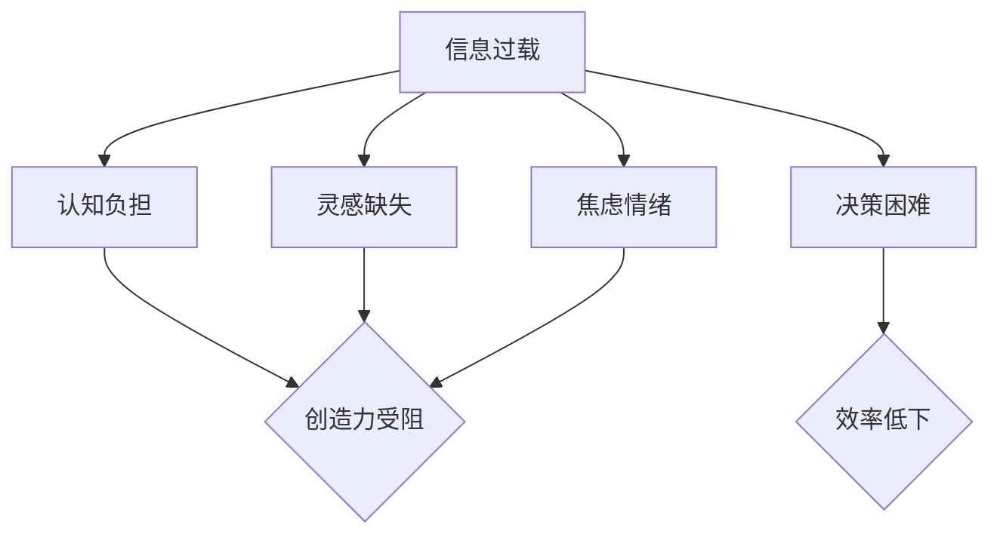

                 

# 文章标题：信息过载与创造力：如何在混乱中找到灵感

> 关键词：信息过载，创造力，灵感，策略，项目管理

> 摘要：本文从信息过载对个人和社会的影响出发，探讨了创造力在信息过载环境下的挑战与机遇。通过深入分析创造力的基础理论和提升策略，结合实际案例和数学模型，本文旨在为读者提供一套有效的方法，帮助他们在信息泛滥的时代找到灵感和创造力。

## 目录

### 第一部分：理解信息过载与创造力

#### 第1章：信息过载时代

1.1 信息过载的定义与影响
1.2 信息筛选机制
1.3 信息过载与创造力的关系

#### 第2章：创造力的基础理论

2.1 创造力的定义与类型
2.2 创造力的心理学研究
2.3 创造力的神经科学研究

#### 第3章：提升创造力的策略

3.1 心理技巧
3.2 环境管理
3.3 社交互动

#### 第4章：信息过载下的灵感捕捉

4.1 灵感的定义与特点
4.2 灵感捕捉方法
4.3 灵感管理

#### 第5章：信息过载中的创新思维

5.1 创新思维的定义与类型
5.2 创新思维技巧
5.3 创新思维的应用

#### 第6章：信息过载中的项目管理

6.1 项目管理的定义与原则
6.2 项目管理方法
6.3 项目管理工具与技术

#### 第7章：信息过载与创造力的未来展望

7.1 信息过载与创造力的趋势分析
7.2 信息过载与创造力的挑战与机遇
7.3 未来展望

### 附录

附录A：创意工具推荐
附录B：创意实践案例
附录C：创意思维练习
附录D：信息管理资源

### Mermaid 流程图

---

### 第1章：信息过载时代

#### 1.1 信息过载的定义与影响

**定义：** 信息过载是指信息接收者接收到的信息量超出了其处理能力，导致信息处理效率降低，甚至产生负面影响的现象。

**影响：**

1. **认知负担：** 信息过载使个体在处理信息时感到疲劳和压力，导致认知负担加重。
2. **创造力受阻：** 过多的信息干扰和冗余数据使大脑难以集中精力进行创造性思考，从而影响创造力。
3. **灵感缺失：** 在信息过载的环境中，人们往往难以从海量信息中捕捉到有价值的灵感。
4. **决策困难：** 信息过载导致决策者难以从众多信息中找到关键信息，从而影响决策质量。
5. **效率低下：** 过多的信息处理任务使个体在工作和生活中感到效率低下。
6. **焦虑情绪：** 面对海量的信息，人们容易产生焦虑和不安的情绪，影响心理健康。

#### 1.2 信息筛选机制

为了应对信息过载，个体和群体需要建立有效的信息筛选机制，以过滤和选择出有价值的信息。

**心理机制：**

1. **注意力机制：** 通过有意注意和无意注意，选择关注重要信息，忽略无关信息。
2. **记忆机制：** 利用记忆的编码、存储和提取过程，选择记忆有价值的信息。
3. **情感机制：** 通过情感反应，选择关注引起强烈情感体验的信息。

**技术机制：**

1. **搜索算法：** 利用搜索引擎的算法，过滤和排序信息，提供个性化搜索结果。
2. **推荐系统：** 通过分析用户的行为和兴趣，推荐相关且有价值的信息。
3. **过滤工具：** 使用邮件过滤器、新闻订阅过滤器等工具，自动筛选和分类信息。

#### 1.3 信息过载与创造力的关系

信息过载对创造力具有双重影响。

**负面影响：**

1. **分散注意力：** 信息过载导致注意力分散，难以集中精力进行深入思考。
2. **信息冗余：** 海量的冗余信息降低信息处理的效率，增加认知负担。
3. **情绪压力：** 信息过载带来的焦虑和压力影响情绪稳定，进而影响创造力。

**正面影响：**

1. **丰富知识：** 广泛的信息接触有助于拓宽知识面，激发新的创意和灵感。
2. **快速迭代：** 信息过载推动快速迭代，为创造力提供了更多实践和验证的机会。
3. **跨界融合：** 不同领域的交叉融合，为创造力提供了新的思路和可能性。

总之，信息过载既是创造力的挑战，也是机遇。如何平衡信息处理与创造力发挥，是我们在信息时代需要思考的重要问题。

---

### 第2章：创造力的基础理论

#### 2.1 创造力的定义与类型

**定义：** 创造力是指个体产生新颖、有价值的想法、概念或解决方案的能力。

**类型：**

1. **原创性创造力：** 产生前所未有的想法或作品，如科学发现、艺术创作等。
2. **适应性创造力：** 在已有知识基础上，进行改进或创新，如产品改进、技术优化等。
3. **模仿性创造力：** 通过模仿和创新结合，产生新的想法或作品，如模仿艺术、衍生产品等。
4. **实用主义创造力：** 注重实际应用，将创意转化为实际产品或服务，如技术创新、商业模式创新等。

#### 2.2 创造力的心理学研究

**心理学理论：**

1. **双过程理论：** 创造力由系统1（直觉、快速、自动化）和系统2（逻辑、分析、有意识）共同作用。
2. **流畅性、灵活性和独创性：** 创造力表现为流畅性（产生大量想法）、灵活性（想法多样性）和独创性（产生新颖想法）。
3. **联想主义：** 创造力依赖于大脑中的联想网络，通过跨领域的联想产生新的创意。

**测评方法：**

1. **创造力测试：** 通过问题解决、创意写作、思维导图等测试手段，评估个体的创造力水平。
2. **问卷调查：** 通过对个体的行为、态度和价值观的调查，了解创造力的影响因素。
3. **实验室研究：** 通过实验方法，控制变量，探讨创造力与心理、生理等因素的关系。

#### 2.3 创造力的神经科学研究

**大脑结构：**

1. **前额叶皮层：** 与创造性思维密切相关，参与计划、决策和问题解决。
2. **海马体：** 与记忆和联想能力相关，对创造性思维有重要影响。
3. **前扣带皮层：** 与情感和自我反思相关，调节创造性思维的积极性和情绪。

**神经递质：**

1. **多巴胺：** 与奖励和动机相关，对创造性思维有促进作用。
2. **血清素：** 与情绪稳定相关，有助于维持创造力的发挥。
3. **去甲肾上腺素：** 与注意力和警觉性相关，影响创造性思维的集中度。

通过心理学和神经科学的研究，我们可以更深入地了解创造力的本质，从而为提升创造力提供科学依据。

---

### 第3章：提升创造力的策略

#### 3.1 心理技巧

**意识流写作：** 意识流写作是一种自由写作的方法，鼓励个体将思维和感受自然地表达出来，不受任何限制。这种方法有助于释放内心的创意，为创造力提供丰富的素材。

**头脑风暴：** 头脑风暴是一种集体创意激发的方法，通过快速提出想法，不进行评判，激发参与者的创造力和想象力。这种方法适用于团队协作，有助于快速积累创意。

**悬念技巧：** 悬念技巧通过在创意过程中引入悬念和不确定性，激发个体思考和探索的欲望。这种方法有助于打破思维定势，激发新的创意。

#### 3.2 环境管理

**清晰的工作空间：** 清晰的工作空间有助于提高专注力和创造力。通过整理工作环境，消除杂乱无章的干扰，个体可以更好地集中注意力，发挥创造力。

**创造力的触发器：** 创造力的触发器是指能够激发创意和灵感的事物或环境。通过在工作和生活中设置创造力的触发器，个体可以更容易地进入创造状态。

**专注力训练：** 专注力训练包括冥想、瑜伽等练习，有助于提高个体的专注力和心理韧性。通过训练，个体可以更好地抵御信息过载的干扰，保持创造力。

#### 3.3 社交互动

**团队合作：** 团队合作有助于不同思维碰撞，激发新的创意。通过团队讨论和协作，个体可以借鉴他人的观点，拓展思维，提高创造力。

**师徒制：** 师徒制是一种经验传承和创新思维培养的方式。通过导师的指导和启发，徒弟可以更快地提升创造力，同时传承导师的经验和智慧。

**社交网络的影响：** 社交网络为个体提供了丰富的信息和资源，有助于拓展视野和激发创意。通过社交网络，个体可以与同行交流，分享经验和见解，共同提高创造力。

通过心理技巧、环境管理和社交互动，个体可以在信息过载的环境中提升创造力，应对各种挑战。

---

### 第4章：信息过载下的灵感捕捉

#### 4.1 灵感的定义与特点

**定义：** 灵感是一种突然产生的、具有创造性的想法或概念，通常来源于外部刺激或内心的感悟。

**特点：**

1. **突发性：** 灵感往往在人们没有预期的情况下突然产生，难以人为控制。
2. **创造性：** 灵感通常涉及新颖的想法或解决方案，具有独特的创造力。
3. **模糊性：** 灵感在产生时往往不够清晰，需要进一步的思考和挖掘。
4. **价值性：** 灵感可能具有潜在的价值，但需要经过验证和实施才能转化为实际成果。

#### 4.2 灵感捕捉方法

**日记法：** 日记法是一种记录灵感的有效方法。通过每天记录自己的想法、感受和经历，个体可以捕捉到潜在的灵感，并在日后进行回顾和挖掘。

**番茄工作法：** 番茄工作法是一种时间管理技巧，通过将工作时间划分为25分钟的工作周期（番茄钟），个体可以在专注的状态下捕捉灵感。在每个番茄钟结束后，休息5分钟，有助于恢复精力，捕捉灵感的火花。

**闪念笔记：** 闪念笔记是一种快速记录灵感的工具。通过使用手机应用或纸质笔记，个体可以在任何时间、任何地点记录下灵感的闪念，确保不会遗漏。

#### 4.3 灵感管理

**灵感筛选：** 通过对捕捉到的灵感进行筛选，个体可以识别出有价值的创意。筛选标准可以包括创意的新颖性、可行性、实用性等。

**灵感培养：** 灵感培养是指对有价值的灵感进行深入思考和挖掘，使其发展成为具体的创意。通过分析灵感的背景、应用场景、潜在价值等，个体可以更好地理解灵感的内涵，为后续的创意实践提供方向。

**灵感实践：** 灵感实践是指将灵感转化为实际的创意产品或解决方案。通过尝试和验证，个体可以检验灵感的价值，并在实践中不断优化和完善。

通过灵感捕捉和灵感管理，个体可以在信息过载的环境中保持创造力的活力，应对各种挑战。

---

### 第5章：信息过载中的创新思维

#### 5.1 创新思维的定义与类型

**定义：** 创新思维是指个体在思考过程中，能够产生新颖、有价值的想法或解决方案的思维方式。

**类型：**

1. **头脑风暴：** 头脑风暴是一种集体创意激发的方法，通过快速提出想法，不进行评判，激发参与者的创新思维。
2. **平行思维：** 平行思维是一种从多个角度和维度思考问题的方法，有助于发现新的解决方案。
3. **逆向思维：** 逆向思维是一种从相反角度思考问题的方法，有助于打破思维定势，产生创新的思路。

#### 5.2 创新思维技巧

**头脑风暴：** 头脑风暴的技巧包括快速提出想法、鼓励多样性和开放性、不进行评判等。通过这些技巧，可以激发参与者的创新思维，产生丰富的创意。

**平行思维：** 平行思维的技巧包括从不同角度和维度思考问题、寻找相似性问题、分析因果关系等。通过这些技巧，可以拓宽思考范围，发现新的解决方案。

**逆向思维：** 逆向思维的技巧包括从相反角度思考问题、质疑现有假设、寻找替代方案等。通过这些技巧，可以打破思维定势，产生创新的思路。

#### 5.3 创新思维的应用

**产品设计：** 在产品设计过程中，创新思维可以帮助设计师发现新的设计方向，优化产品功能，提升用户体验。

**管理创新：** 在企业管理中，创新思维可以帮助企业发现新的商业模式、管理方法，提升企业竞争力。

**社会创新：** 在社会创新领域，创新思维可以帮助解决社会问题，推动社会进步。

通过创新思维的应用，个体可以在信息过载的环境中发挥创造力，实现创新和突破。

---

### 第6章：信息过载中的项目管理

#### 6.1 项目管理的定义与原则

**定义：** 项目管理是指通过计划、组织、协调和控制等手段，实现项目目标的过程。

**原则：**

1. **目标导向：** 项目管理应以实现项目目标为核心，确保项目按计划推进。
2. **资源整合：** 项目管理需要整合人力、物力、财力等资源，确保项目顺利进行。
3. **风险管理：** 项目管理应识别和管理项目风险，降低风险对项目的影响。
4. **质量保证：** 项目管理应确保项目质量符合预期标准，满足客户需求。
5. **持续改进：** 项目管理应不断总结经验教训，持续改进项目管理方法和流程。

#### 6.2 项目管理方法

**威廉·诺兰的方法：** 威廉·诺兰提出了项目管理的四个阶段：项目启动、项目计划、项目执行和项目收尾。每个阶段都有明确的目标和任务，确保项目顺利进行。

**PMI的项目管理知识体系：** PMI（项目管理协会）提出了项目管理知识体系，包括项目整合管理、项目范围管理、项目时间管理、项目成本管理、项目质量管理、项目人力资源管理、项目沟通管理、项目风险管理、项目采购管理和项目干系人管理。这些知识体系为项目管理提供了全面的指导。

**敏捷项目管理：** 敏捷项目管理是一种迭代和增量的项目管理方法，强调灵活应对变化、快速响应客户需求。敏捷管理包括敏捷开发、敏捷团队、敏捷流程等，有助于提高项目效率和质量。

#### 6.3 项目管理工具与技术

**项目计划工具：** 项目计划工具包括甘特图、PERT图、关键路径法等，用于规划项目进度和资源分配。

**风险管理技术：** 风险管理技术包括风险识别、风险评估、风险应对策略等，用于识别和管理项目风险。

**质量管理技术：** 质量管理技术包括质量控制、质量保证、质量评估等，用于确保项目质量。

通过有效的项目管理和工具应用，个体和组织可以在信息过载的环境中，实现项目目标，提高工作效率。

---

### 第7章：信息过载与创造力的未来展望

#### 7.1 信息过载与创造力的趋势分析

随着技术的不断进步，信息过载和创造力之间的关系将发生深刻变化。

**趋势一：智能化信息处理**

人工智能技术的应用将极大地改变信息处理方式，通过自动化和智能化的手段，减轻个体在信息过载环境下的负担，提高创造力。

**趋势二：个性化信息推送**

大数据和机器学习技术的发展将使个性化信息推送更加精准，满足个体的个性化需求，激发创造力。

**趋势三：跨界融合创新**

不同领域之间的知识交叉融合将为创造力提供更多可能性，跨界合作将成为创新的重要途径。

#### 7.2 信息过载与创造力的挑战与机遇

**挑战一：注意力分散**

信息过载导致注意力分散，影响创造力的发挥。如何有效管理注意力，提高专注力，是未来需要解决的重要问题。

**挑战二：信息冗余**

大量的冗余信息降低信息处理的效率，增加认知负担。如何筛选和利用有价值的信息，提高信息处理效率，是未来需要关注的挑战。

**机遇一：跨界整合**

跨界整合将激发新的创意和灵感，推动创造力的发展。如何充分利用跨界资源，实现创新，是未来需要把握的机遇。

**机遇二：快速迭代**

快速迭代将使创造力得到更快的发展，推动创新成果的快速应用。如何适应快速迭代的环境，提高创新能力，是未来需要关注的机遇。

#### 7.3 未来展望

在未来，信息过载与创造力将在智能化的推动下实现更紧密的融合。通过大数据、人工智能等技术的应用，个体和组织将更好地应对信息过载的挑战，发挥创造力。

**方向一：智能化创造力管理**

通过智能化工具和平台，个体和组织可以更好地管理创造力，提高创造力效率。

**方向二：个性化创造力激发**

通过个性化信息推送和智能推荐，个体可以更好地激发创造力，产生新颖的创意。

**方向三：跨界融合创新**

跨界融合将为创造力提供更多可能性，推动创新成果的快速应用。

未来，信息过载与创造力将在智能化的推动下实现更紧密的融合，为人类社会带来更多的创新和价值。

---

### 附录

#### 附录A：创意工具推荐

- **思维导图工具：** XMind、MindManager
- **笔记软件：** OneNote、Evernote
- **创意绘图工具：** Sketch、Adobe Illustrator
- **项目管理工具：** Trello、Asana

#### 附录B：创意实践案例

- **案例一：产品创新设计**：通过用户调研和头脑风暴，团队提出了一系列创新产品设计方案，最终成功推出市场。
- **案例二：营销活动策划**：通过创意策划和跨部门协作，团队策划了一系列具有创意的营销活动，提高了品牌知名度和用户参与度。

#### 附录C：创意思维练习

- **练习一：思维导图练习**：选择一个主题，使用思维导图软件绘制思维导图，锻炼创意思维。
- **练习二：情景模拟练习**：设定一个特定情境，通过角色扮演和模拟对话，激发创意思维。
- **练习三：快速写作练习**：设定一个主题，限时写作，锻炼思维的敏捷性和创造力。

#### 附录D：信息管理资源

- **资源一：信息筛选工具**：使用搜索算法和推荐系统，筛选和推送有价值的信息。
- **资源二：信息整理工具**：使用笔记软件和思维导图工具，整理和分类信息。
- **资源三：信息处理技术**：利用人工智能和大数据技术，处理和分析信息。

---

### 作者

**作者：AI天才研究院/AI Genius Institute & 禅与计算机程序设计艺术 /Zen And The Art of Computer Programming**

