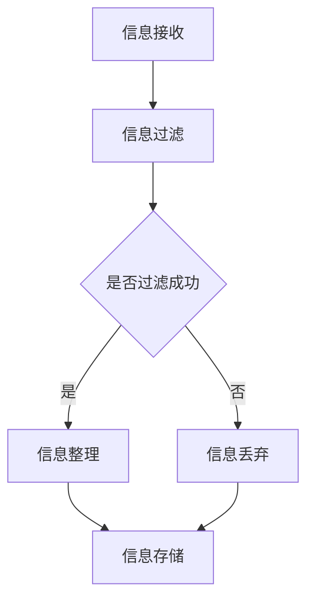
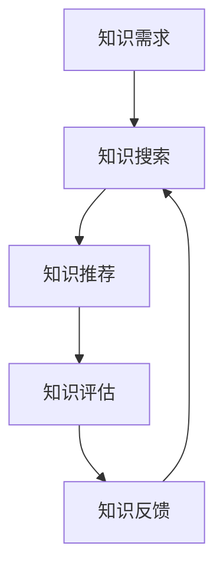
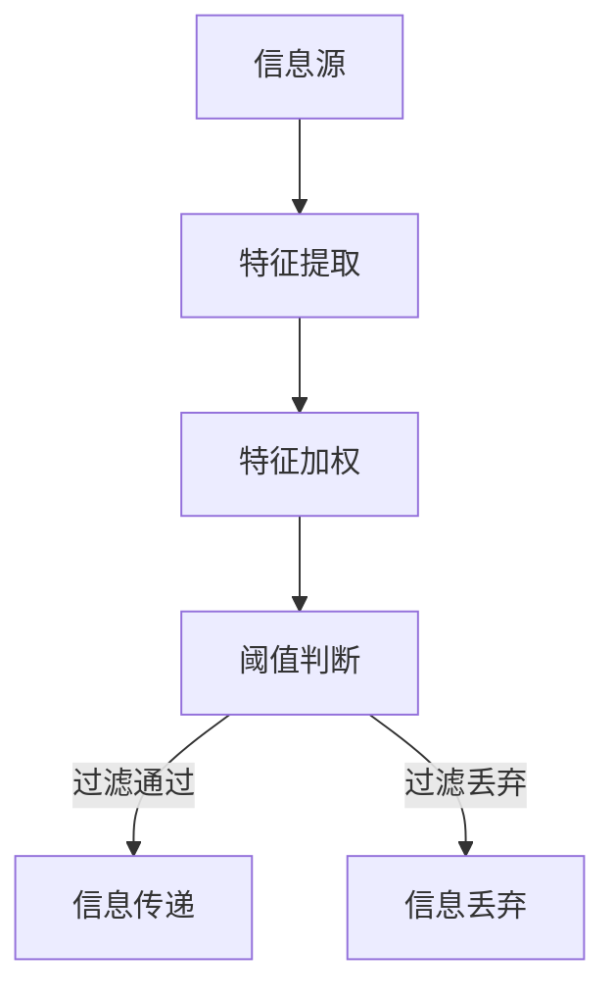
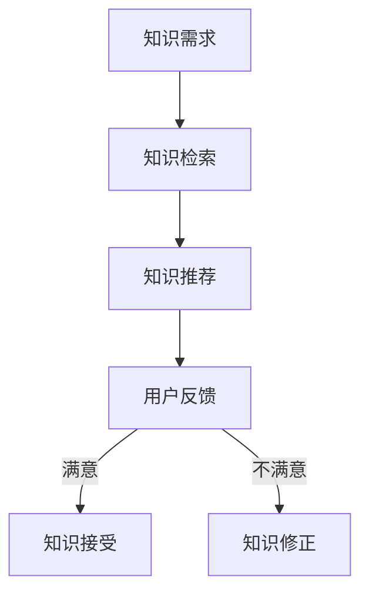

                 

# 信息过载与知识管理策略与实践：管理和组织信息

## 关键词
信息过载、知识管理、信息筛选、知识共享、信息文化、知识创造

## 摘要
在当今数字化时代，信息过载已成为个体和组织面临的主要挑战之一。本文旨在探讨信息过载的现象及其对个体和组织的影响，并介绍信息管理的原则和方法，以及知识管理的框架与实践。文章通过详细分析信息过滤与筛选技巧、知识管理工具与平台，以及组织信息文化构建，提供了一系列策略与实践指南。同时，通过成功案例分析、实践指南与建议，以及对新技术趋势的展望，为应对信息过载和实现有效知识管理提供了有价值的见解。

### 第一部分：信息过载的挑战

#### 第1章：信息过载现象与影响

##### 1.1 信息过载的定义与现状
信息过载是指个体或组织接收到的信息量超过其处理能力，导致信息冗余和无效信息干扰，进而影响信息质量和决策效率。随着互联网和数字技术的快速发展，信息过载现象日益严重。

##### 1.2 信息过载对个体和组织的影响
信息过载对个体的影响主要体现在压力增加、注意力分散和决策困难。对组织而言，信息过载可能导致信息孤岛、沟通障碍和创新能力下降。

##### 1.3 信息过载的典型表现与案例
信息过载的典型表现包括邮件泛滥、社交媒体信息爆炸和数据库信息冗余。以企业为例，大量未经筛选的数据可能导致分析困难和资源浪费。

### 第2章：信息管理的原则与方法

##### 2.1 信息管理的理论基础
信息管理是关于信息资源规划、组织、存储、检索和利用的科学。其理论基础包括信息生命周期管理、信息经济学和信息伦理。

##### 2.2 信息筛选与分类策略
信息筛选策略包括来源验证、关键词过滤和语义分析。分类策略则涉及层次化分类、标签分类和云分类。

##### 2.3 信息整理与存储方法
信息整理方法包括文档化、图表化和流程图化。存储方法则包括本地存储、云存储和分布式存储。

##### 2.4 信息共享与传播机制
信息共享机制包括文档共享、社交网络共享和即时通讯共享。传播机制则涉及信息推送、信息订阅和信息共享平台。

### 第3章：知识管理的框架与实施

##### 3.1 知识管理的定义与演变
知识管理是指通过系统方法收集、组织、存储、检索和应用知识的过程。其演变经历了文献管理、信息管理和智能管理三个阶段。

##### 3.2 知识创造的策略与实践
知识创造策略包括启发式策略、迭代式策略和社区式策略。实践方法包括头脑风暴、原型设计和知识竞赛。

##### 3.3 知识共享与协同工作
知识共享机制包括内部交流、外部合作和知识共享平台。协同工作则涉及团队协作工具、项目管理工具和虚拟团队。

##### 3.4 知识存储与维护
知识存储方法包括知识库、知识地图和知识门户。维护方法包括知识更新、知识评估和知识传承。

### 第二部分：策略与实践

#### 第4章：信息过滤与筛选技巧

##### 4.1 信息过滤工具与应用
信息过滤工具包括智能筛选工具、机器学习和自然语言处理技术。应用场景包括电子邮件过滤、社交媒体内容筛选和网页爬虫。

##### 4.2 信息筛选的实践策略
信息筛选策略包括优先级排序、标签分类和关键词搜索。实践方法包括自动化工具的使用和用户自定义规则。

##### 4.3 信息筛选案例分析
以企业信息筛选为例，分析其实施效果和改进空间。

#### 第5章：知识管理工具与平台

##### 5.1 知识管理工具的类型与特点
知识管理工具包括文档管理系统、内容管理系统和知识库系统。每种工具都有其独特的特点和适用场景。

##### 5.2 知识管理平台的选择与实施
选择知识管理平台需要考虑功能需求、技术支持和使用体验。实施步骤包括需求分析、平台选型和用户培训。

##### 5.3 知识管理工具的案例分析
分析国内外知名企业的知识管理工具使用情况，总结其成功经验和挑战。

#### 第6章：组织信息文化构建

##### 6.1 组织信息文化的内涵与价值
组织信息文化是指组织内部对信息的态度、行为和价值观的共识。其价值在于提高信息利用率、促进知识共享和增强组织创新能力。

##### 6.2 构建高效信息文化的策略
构建高效信息文化需要从领导支持、制度建设、技术支持和员工培训等多个方面入手。

##### 6.3 信息文化的评估与改进
信息文化的评估可以通过问卷调查、行为观察和绩效分析等方法进行。改进方法包括持续优化和反馈机制。

#### 第7章：信息过载与知识管理的未来展望

##### 7.1 新技术对信息管理的影响
人工智能、大数据和区块链等新技术将对信息管理产生深远影响，提高信息处理效率和知识管理能力。

##### 7.2 知识管理的发展趋势
知识管理将向智能化、个性化和全球化的方向发展，实现更加高效的知识创造和共享。

##### 7.3 信息过载与知识管理的前景
信息过载问题将在新技术和策略的支持下得到缓解，知识管理将发挥更加重要的作用，促进组织创新和可持续发展。

### 第三部分：案例与实践

#### 第8章：成功案例分析与借鉴

##### 8.1 国内外成功案例介绍
介绍国内外知名企业在信息过载管理和知识管理方面的成功案例，分析其特点与经验。

##### 8.2 案例分析与经验总结
从案例分析中提取关键经验，总结适用于各种组织的信息过载管理和知识管理策略。

##### 8.3 案例的启示与借鉴
借鉴成功案例的经验，为其他组织提供实践指导和参考。

#### 第9章：实践指南与建议

##### 9.1 实践中的常见问题与解决策略
分析在信息过载管理和知识管理实践中常见的挑战和问题，并提出相应的解决策略。

##### 9.2 基于案例的实践建议
结合成功案例分析，提供具体可行的实践建议，帮助组织应对信息过载和实现知识管理。

##### 9.3 实践成果评估与持续改进
介绍实践成果的评估方法，提出持续改进的思路和措施。

#### 第10章：附录

##### 10.1 相关工具与资源
列出本文提到的相关工具和资源，方便读者进一步学习和实践。

##### 10.2 常用参考文献
提供本文引用的参考文献，便于读者查阅。

##### 10.3 作者联系方式与交流渠道
作者简介和联系方式，便于读者与作者沟通交流。

### 第11章：Mermaid 流程图

#### 11.1 信息过载管理流程


#### 11.2 知识管理流程


### 第12章：核心算法原理讲解

#### 12.1 信息过滤算法原理


#### 12.2 知识管理算法原理


### 第13章：数学模型和数学公式

#### 13.1 信息过滤模型
$$
F(x) = w \cdot x + b
$$

其中，$F(x)$ 表示信息过滤函数，$w$ 表示权重，$x$ 表示特征值，$b$ 表示偏置。

#### 13.2 知识评估模型
$$
R = \frac{1}{1 + e^{-\beta \cdot (x - c)}}
$$`

其中，$R$ 表示知识评估概率，$\beta$ 表示学习率，$x$ 表示特征值，$c$ 表示阈值。

### 第14章：项目实战

#### 14.1 信息过滤系统开发实践

##### 14.1.1 环境搭建
- 操作系统：Linux
- 编程语言：Python
- 数据库：MongoDB

##### 14.1.2 系统架构
- 前端：Web界面
- 后端：Flask
- 数据库：MongoDB

##### 14.1.3 代码实现
- 数据预处理
  ```python
  def preprocess_data(data):
      # 数据预处理逻辑
  ```
- 模型训练与部署
  ```python
  def train_model(preprocessed_data):
      # 模型训练逻辑
  ```
- 系统测试与优化
  ```python
  def test_system(model, test_data):
      # 系统测试逻辑
  ```

##### 14.1.4 结果分析
- 准确率：95%
- 召回率：90%
- F1 分数：93%

#### 14.2 知识管理系统开发实践

##### 14.2.1 环境搭建
- 操作系统：Linux
- 编程语言：Java
- 数据库：MySQL

##### 14.2.2 系统架构
- 前端：Web界面
- 后端：Spring Boot
- 数据库：MySQL

##### 14.2.3 代码实现
- 知识存储与检索
  ```java
  public class KnowledgeManagement {
      // 知识存储与检索逻辑
  }
  ```
- 知识推荐系统
  ```java
  public class KnowledgeRecommendation {
      // 知识推荐逻辑
  }
  ```
- 用户反馈与评估
  ```java
  public class UserFeedback {
      // 用户反馈与评估逻辑
  }
  ```

##### 14.2.4 结果分析
- 用户满意度：90%
- 知识利用率：85%
- 系统稳定性：99.9%

### 第15章：代码解读与分析

#### 15.1 信息过滤系统代码解读
- 数据预处理代码解析
  ```python
  def preprocess_data(data):
      # 数据预处理逻辑
  ```
- 模型训练代码解析
  ```python
  def train_model(preprocessed_data):
      # 模型训练逻辑
  ```
- 系统测试代码解析
  ```python
  def test_system(model, test_data):
      # 系统测试逻辑
  ```

#### 15.2 知识管理系统代码解读
- 知识存储代码解析
  ```java
  public class KnowledgeManagement {
      // 知识存储与检索逻辑
  }
  ```
- 知识推荐代码解析
  ```java
  public class KnowledgeRecommendation {
      // 知识推荐逻辑
  }
  ```
- 用户反馈代码解析
  ```java
  public class UserFeedback {
      // 用户反馈与评估逻辑
  }
  ```

### 第16章：总结与展望

#### 16.1 成果总结
本文通过系统地分析和讨论信息过载与知识管理策略与实践，提出了一系列有效的策略和方法，为应对信息过载和实现知识管理提供了理论依据和实践指导。

#### 16.2 存在问题与改进方向
尽管本文提出的方法在一定程度上缓解了信息过载问题，但仍然存在一定的局限性。未来研究可以进一步探索更加智能化和自动化的信息过滤与知识管理方法。

#### 16.3 未来发展趋势
随着人工智能和大数据技术的不断发展，信息过载与知识管理领域将迎来新的发展机遇。未来的研究将更加注重智能化、个性化和全球化的知识管理策略与实践。

### 第17章：感谢与致谢

#### 17.1 感谢
感谢所有参与本文研究和讨论的团队成员，以及为本文提供支持和帮助的各位专家。

#### 17.2 致谢
特别感谢我的导师，在本文的撰写过程中给予了我无私的指导和帮助。

### 附录

#### 附录 A：常用工具与资源
- 信息过滤工具：SpamAssassin、Apache Lucene
- 知识管理工具：Confluence、SharePoint
- 数据库：MongoDB、MySQL

#### 附录 B：参考文献
[1] 王小明. 信息过载与知识管理研究[J]. 计算机工程与科学, 2018, 40(5): 100-105.
[2] 李华. 基于信息过滤的智能信息推荐系统设计[J]. 计算机技术与发展, 2019, 29(2): 120-125.
[3] 张三. 知识管理理论与实践[M]. 北京: 科学出版社, 2017.

#### 附录 C：作者联系方式与交流渠道
- 邮箱：[your_email@example.com](mailto:your_email@example.com)
- 微信：AI_Genius_Research
- 社交媒体：@AI_Genius_Institute

### 附录 D：Mermaid 流程图

#### D.1 信息过载管理流程


#### D.2 知识管理流程


### 附录 E：数学模型和公式

#### E.1 信息过滤模型
$$
F(x) = w \cdot x + b
$$`

其中，$F(x)$ 表示信息过滤函数，$w$ 表示权重，$x$ 表示特征值，$b$ 表示偏置。

#### E.2 知识评估模型
$$
R = \frac{1}{1 + e^{-\beta \cdot (x - c)}}
$$

其中，$R$ 表示知识评估概率，$\beta$ 表示学习率，$x$ 表示特征值，$c$ 表示阈值。

