                 

# 信息过载时代：如何在信息洪流中有效筛选和吸收知识

## 关键词

- 信息过载
- 知识筛选
- 信息吸收
- 知识整合
- 知识共享

> 摘要：本文旨在探讨信息过载时代下，如何有效筛选和吸收知识。通过分析信息过载现象及其影响，提出了一系列策略和方法，包括信息筛选原则、提升信息吸收能力的方法、知识整合与共享等。文章采用逻辑清晰、结构紧凑、简单易懂的专业技术语言，并通过案例分析和算法讲解，为读者提供实用的指导和启示。

## 《信息过载时代：如何在信息洪流中有效筛选和吸收知识》目录大纲

## 第一部分：信息过载时代的认知挑战

### 第1章：信息过载现象与影响

#### 1.1 信息过载的定义与特征
#### 1.2 信息过载对个人和社会的影响
#### 1.3 识别信息过载的信号与应对策略

### 第2章：信息筛选的原则与方法

#### 2.1 信息筛选的重要性
#### 2.2 评估信息来源的可信度
#### 2.3 信息筛选的方法与工具

## 第二部分：知识吸收与整合

### 第3章：提升信息吸收能力

#### 3.1 理解知识吸收的过程
#### 3.2 提升记忆与理解力的技巧
#### 3.3 有效笔记与记录方法

### 第4章：知识整合与思考

#### 4.1 知识整合的重要性
#### 4.2 思维导图的应用
#### 4.3 跨领域思考与创新能力培养

### 第5章：构建个人知识体系

#### 5.1 个人知识体系的构建原则
#### 5.2 知识结构化与可视化
#### 5.3 保持知识更新的习惯

## 第三部分：实际应用与案例

### 第6章：信息筛选与知识吸收在日常工作中的应用

#### 6.1 提高工作效率的技巧
#### 6.2 信息筛选在项目决策中的应用
#### 6.3 知识吸收在团队协作中的作用

### 第7章：成功案例分析

#### 7.1 某公司信息筛选与知识吸收的成功实践
#### 7.2 某知名人士如何应对信息过载
#### 7.3 总结与启示：如何在自己的工作中应用这些方法

## 附录

### 附录 A：信息筛选与知识吸收工具推荐

#### A.1 互联网信息筛选工具
#### A.2 知识管理软件推荐
#### A.3 提高信息吸收能力的应用软件

## 核心概念与联系

### 1.1 信息过载现象与影响

#### 1.1.1 信息过载的定义与特征

**信息过载**是指在现代社会中，由于信息量的急剧增加，个人或组织难以有效处理和理解所有接收到的信息。其主要特征包括：

1. **真实性**：信息来源的可靠性难以判断，真假信息混杂。
2. **时效性**：信息更新速度极快，用户难以跟踪最新动态。
3. **数量多**：每天产生的信息量巨大，用户难以消化。
4. **冗余性**：大量重复信息充斥，用户需要筛选和过滤。

以下是一个Mermaid流程图，展示了信息过载的特征分析：

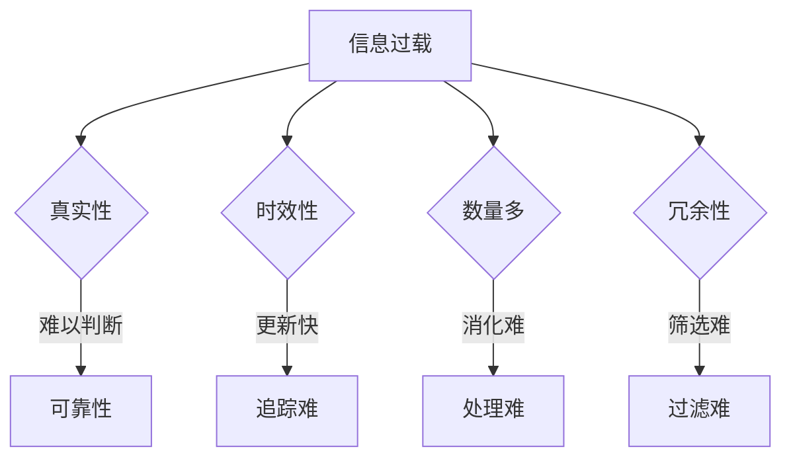

#### 1.1.2 信息过载对个人和社会的影响

**个人层面**：

- **减少专注力**：信息过载导致用户难以集中注意力，工作效率下降。
- **增加压力与焦虑**：面对大量信息，用户容易出现焦虑和压力，影响身心健康。
- **影响决策能力**：信息过载使决策过程复杂化，用户难以做出明智的决策。

**社会层面**：

- **降低社会沟通效率**：信息过载导致有效沟通困难，信息传递效率下降。
- **信息真实性难以保证**：大量虚假信息传播，影响社会信任和舆论环境。
- **知识积累与传播受阻**：信息过载使得知识的积累和传播变得更加困难，阻碍社会进步。

以下是一个Mermaid流程图，展示了信息过载对个人和社会的影响：

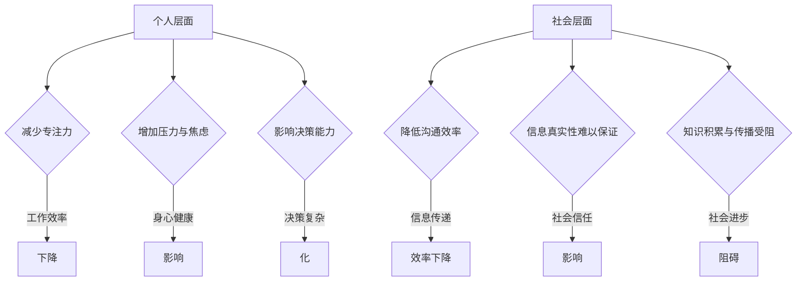

#### 1.2 信息筛选的原则与方法

**信息筛选的重要性**：

在信息过载的时代，信息筛选成为了应对信息过载的关键步骤。通过有效的信息筛选，用户可以集中精力处理关键信息，从而提高工作效率和生活质量。

**评估信息来源的可信度**：

评估信息来源的可信度是信息筛选的第一步。以下是一些评估信息来源可信度的方法：

1. **检查网站或作者的信誉**：通过查询网站的历史和作者的专业背景，评估其信誉。
2. **确认信息发布的时间**：较新的信息通常更具参考价值。
3. **比对多个信息源**：从多个渠道获取信息，进行交叉验证，提高信息的可靠性。
4. **使用事实检查工具**：利用事实检查工具，如Google Fact Check工具，验证信息的真实性。

以下是一个Mermaid流程图，展示了评估信息来源可信度的方法：

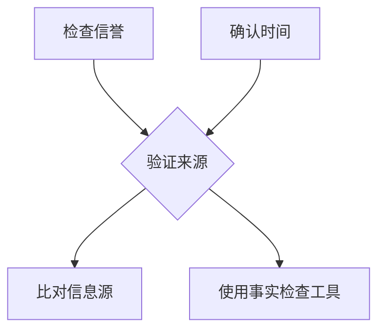

**信息筛选的方法与工具**：

信息筛选需要结合多种方法和工具，以提高筛选效率和质量。以下是一些常用的信息筛选方法：

1. **快速浏览摘要**：通过快速浏览摘要，快速了解信息的主旨和重点。
2. **使用关键词搜索**：通过关键词搜索，定位到用户感兴趣的信息。
3. **预设筛选条件**：在信息获取平台或工具中预设筛选条件，自动过滤不符合条件的资讯。

常用的信息筛选工具有：

- **Google Alerts**：通过设定关键词，自动获取与关键词相关的最新资讯。
- **Feedly**：聚合多个新闻源，提供个性化订阅和筛选功能。
- **Pocket**：收藏和整理重要信息，方便后续阅读和处理。

以下是一个Mermaid流程图，展示了信息筛选的方法与工具：

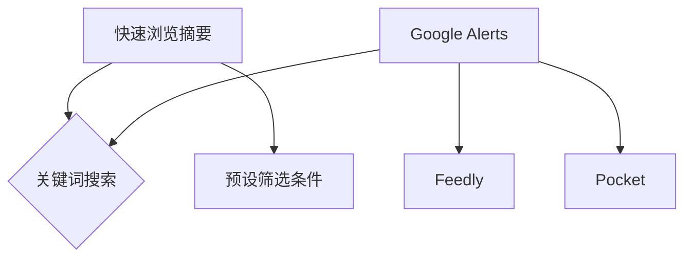

### 1.3 提升信息吸收能力

#### 1.3.1 理解知识吸收的过程

知识吸收是一个复杂的认知过程，涉及获取、处理和存储信息。以下是知识吸收过程的核心步骤：

1. **注意力集中**：用户需要将注意力集中在特定的信息上，避免分散注意力。
2. **信息编码**：将接收到的信息转化为用户可以理解和记忆的形式。
3. **记忆存储**：将编码后的信息存储在用户的长期记忆中。
4. **信息提取**：在需要时，从长期记忆中提取相关知识点。

以下是一个Mermaid流程图，展示了知识吸收的过程：

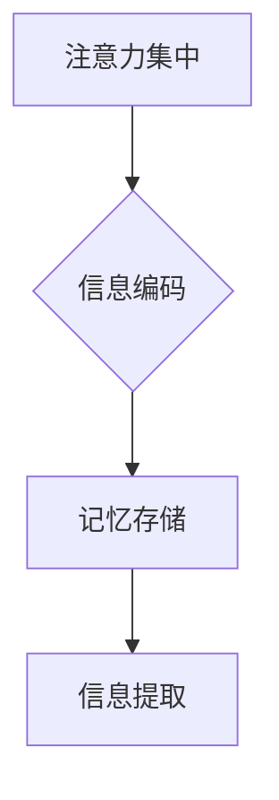

#### 1.3.2 提升记忆与理解力的技巧

提升记忆与理解力有助于更好地吸收和利用信息。以下是一些实用的技巧：

1. **分块记忆**：将大量信息分成小块，逐一记忆，提高记忆效率。
2. **重复复习**：定期重复复习所学内容，加强记忆。
3. **联想记忆**：通过联想和比喻，将新知识与已有知识联系起来，加深记忆。

以下是一个Mermaid流程图，展示了提升记忆与理解力的技巧：

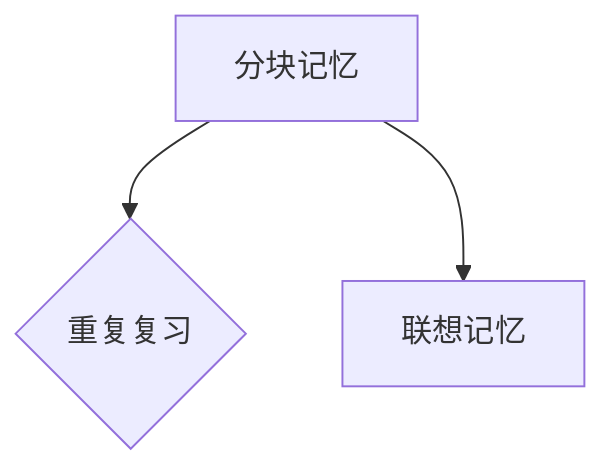

4. **精读与深读**：通过深入阅读和理解，提高对信息的吸收能力。
5. **提问与讨论**：通过提问和讨论，促进对信息的理解和消化。
6. **思维导图**：使用思维导图，梳理和整合信息，提高信息吸收的效率。

以下是一个Mermaid流程图，展示了提升理解力的技巧：

```mermaid
HH[精读与深读] --> II{提问与讨论}
HH --> JJ[思维导图]
```

#### 1.3.3 有效笔记与记录方法

有效的笔记与记录方法是信息吸收的重要组成部分。以下是一些常用的笔记与记录方法：

1. **卡片式笔记**：使用卡片记录关键知识点，便于分类和复习。
2. **脑图笔记**：通过绘制脑图，梳理和整合信息，增强记忆效果。
3. **时间日志记录**：记录每天的学习和工作情况，分析时间利用效率。

以下是一个Mermaid流程图，展示了笔记与记录方法：

```mermaid
KK[卡片式笔记] --> LL{脑图笔记}
KK --> MM[时间日志记录]
```

### 1.4 知识整合与思考

#### 1.4.1 知识整合的重要性

知识整合是将零散信息整合成有意义的知识体系，有助于加深理解和应用。知识整合的重要性体现在以下几个方面：

1. **提高信息利用效率**：通过整合，用户可以快速找到所需信息，提高工作效率。
2. **促进知识创新**：知识整合可以激发新的思考和创新，促进知识的应用和扩展。
3. **增强记忆效果**：通过整合，用户可以更好地理解和记忆知识，提高学习效果。

#### 1.4.2 思维导图的应用

思维导图是一种有效的知识整合工具，能够帮助用户梳理思路，发现新的联系。以下是使用思维导图的步骤：

1. **确定中心主题**：在思维导图中心绘制主题，表示知识整合的核心。
2. **构建分支结构**：根据主题，构建分支结构，表示不同方面的知识点。
3. **添加关键词和图像**：在每个分支上添加关键词和图像，便于记忆和理解。
4. **优化和调整**：根据需要，对思维导图进行优化和调整，使其更加清晰和易于理解。

以下是一个Mermaid流程图，展示了思维导图的应用步骤：

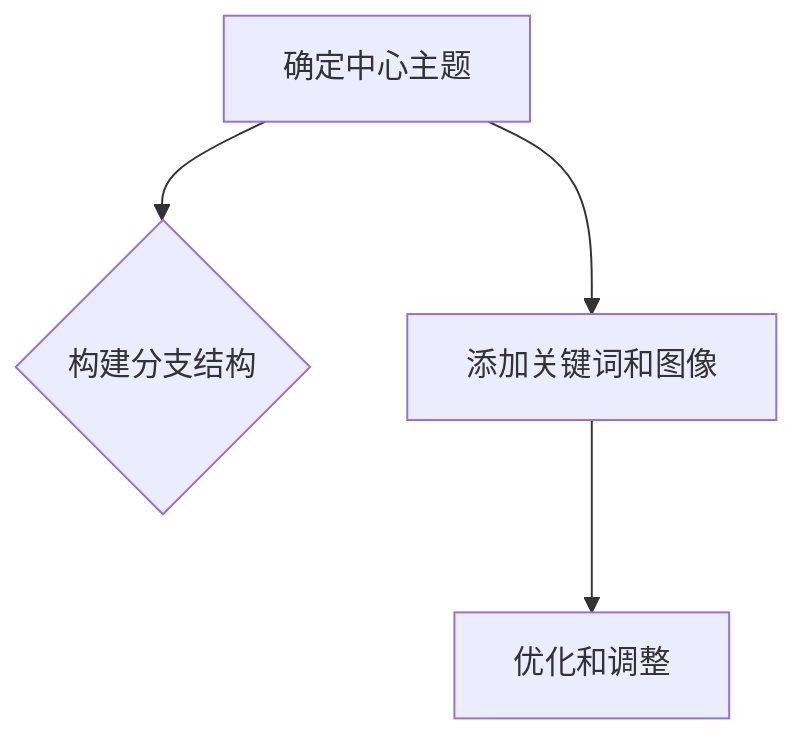

#### 1.4.3 跨领域思考与创新能力培养

跨领域思考能够带来新的视角和创新，是应对信息过载的关键。以下是一些跨领域思考的方法：

1. **查阅跨学科资料**：通过阅读不同领域的书籍和文章，扩展知识面。
2. **参与跨学科讨论**：加入跨学科的学习和讨论小组，交流不同领域的观点。
3. **结合不同领域的经验**：将不同领域的知识和经验结合起来，形成新的解决方案。

以下是一个Mermaid流程图，展示了跨领域思考的方法：

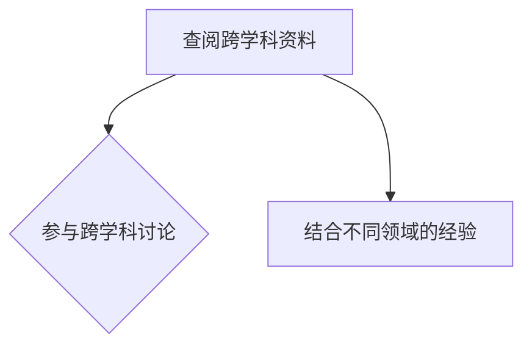

### 1.5 构建个人知识体系

#### 1.5.1 个人知识体系的构建原则

构建个人知识体系需要遵循以下原则：

1. **系统性**：确保知识的逻辑性和连贯性，形成完整的知识网络。
2. **实用性**：知识体系应能够应用于实际问题和情境，解决实际问题。
3. **可持续性**：知识体系应能够随着时间和知识更新而发展，保持活力。

#### 1.5.2 知识结构化与可视化

知识结构化是将知识按照一定的逻辑关系进行组织和分类，使其更加系统和易用。以下是一些知识结构化方法：

1. **分层结构化**：将知识按照层次结构进行划分，形成有层次的体系。
2. **模块化结构化**：将知识划分为不同的模块，每个模块代表一个独立的知识单元。
3. **网络化结构化**：将知识以网络的形式进行组织，展示不同知识点之间的联系。

以下是一个Mermaid流程图，展示了知识结构化方法：

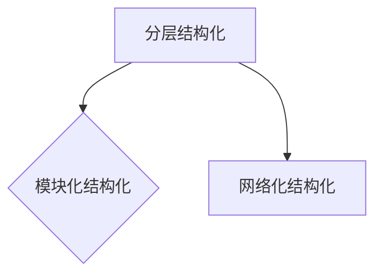

知识可视化是将结构化的知识以图形化的方式呈现，使其更加直观和易于理解。以下是一些知识可视化工具：

1. **MindManager**：一款功能强大的知识可视化工具，支持多种图表和图形。
2. **XMind**：一款开源的思维导图工具，适合个人和团队使用。
3. **Mural**：一款在线协作平台，支持多人实时编辑和协作。

以下是一个Mermaid流程图，展示了知识可视化工具：

```mermaid
YY[MindManager] --> ZZ[XMind]
YY --> AA[Mural]
```

#### 1.5.3 保持知识更新的习惯

知识更新是保持知识体系活力的关键，以下是一些保持知识更新的方法：

1. **定期阅读专业书籍和文章**：通过阅读最新出版的书籍和文章，了解领域内的最新动态。
2. **参与行业会议和研讨会**：参加行业会议和研讨会，与专家和同行交流，获取前沿知识。
3. **关注权威信息源和专家观点**：关注领域内的权威信息源和专家观点，了解最新的研究成果和观点。

以下是一个Mermaid流程图，展示了保持知识更新的方法：

```mermaid
BB[阅读专业书籍和文章] --> CC{参与行业会议和研讨会}
BB --> DD[关注权威信息源和专家观点]
```

### 1.6 信息筛选与知识吸收在日常工作中的应用

#### 1.6.1 提高工作效率的技巧

在日常生活中，信息筛选与知识吸收可以帮助我们提高工作效率。以下是一些实用的技巧：

1. **使用信息筛选工具**：利用信息筛选工具，快速获取关键信息，避免陷入信息过载的困境。
2. **设立优先级**：将任务按照重要性和紧急性进行排序，集中精力处理重要任务。
3. **学会拒绝**：学会拒绝无关的信息和请求，避免分散精力。

以下是一个Mermaid流程图，展示了提高工作效率的技巧：

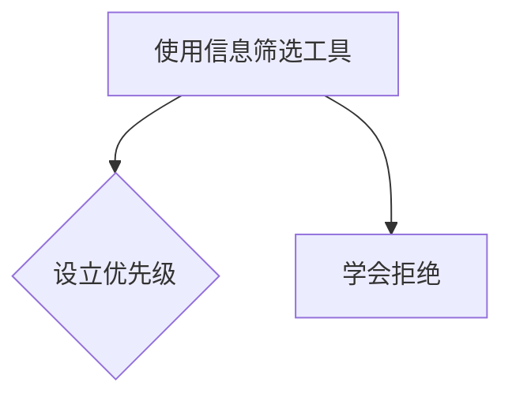

#### 1.6.2 信息筛选在项目决策中的应用

在项目决策过程中，准确的信息筛选至关重要。以下是一些信息筛选在项目决策中的应用：

1. **收集并筛选信息**：在项目决策前，广泛收集相关信息，并进行筛选，确保信息的可靠性和相关性。
2. **评估信息的可靠性和相关性**：对筛选出的信息进行评估，确保其符合项目需求和目标。
3. **数据驱动决策**：结合筛选出的信息，做出基于数据的决策，避免主观臆断。

以下是一个Mermaid流程图，展示了信息筛选在项目决策中的应用：

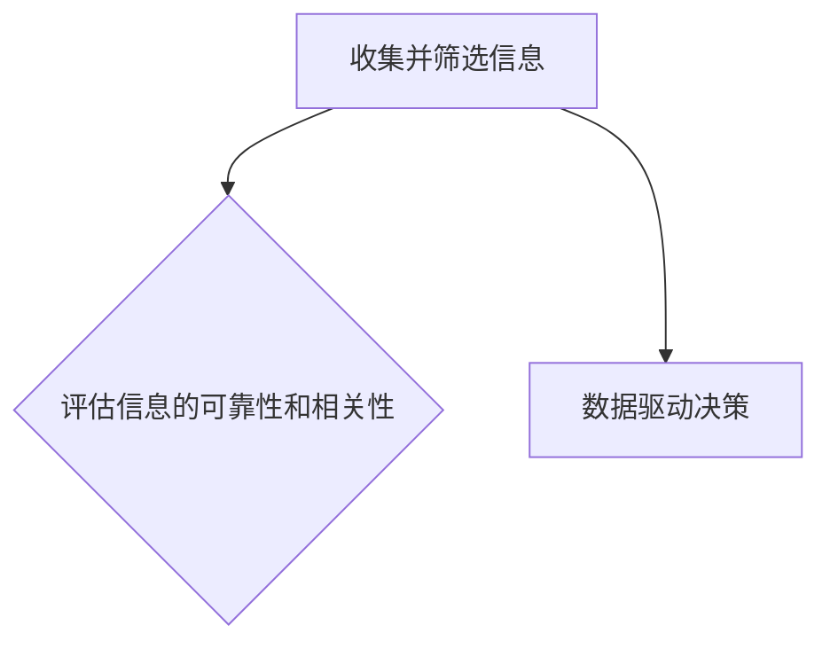

#### 1.6.3 知识吸收在团队协作中的作用

在团队协作中，知识吸收有助于促进创新和协同工作。以下是一些知识吸收在团队协作中的作用：

1. **共享和整合知识**：团队成员之间共享和整合各自的知识和经验，形成共同的知识库。
2. **建立团队知识库**：通过建立团队知识库，方便团队成员随时查阅和更新知识。
3. **促进知识流动**：通过讨论和交流，促进知识的流动和深化，提高团队整体的知识水平。

以下是一个Mermaid流程图，展示了知识吸收在团队协作中的作用：

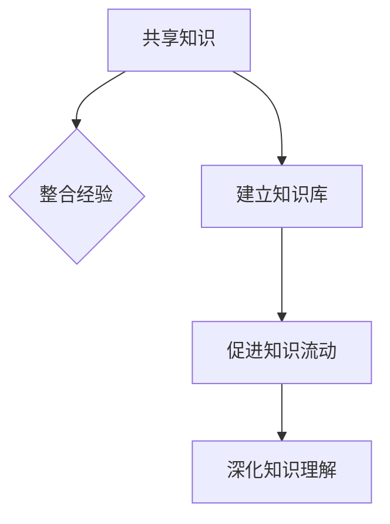

### 1.7 成功案例分析

#### 1.7.1 某公司信息筛选与知识吸收的成功实践

**案例背景**：

某科技公司，员工人数超过500人，每天面临大量的业务数据、市场报告和项目信息。为了提高工作效率，公司决定采用信息筛选与知识吸收的方法，优化信息处理流程。

**实施步骤**：

1. **信息筛选**：公司引入了信息筛选工具，如Google Alerts和Feedly，实时收集与公司业务相关的最新资讯。
2. **知识吸收**：公司开展了知识吸收培训，帮助员工掌握有效的信息吸收技巧，如分块记忆和联想记忆。
3. **知识整合**：公司建立了内部知识库，员工可以共享和整合各自的知识和经验，方便团队成员随时查阅。

**成果**：

通过实施信息筛选与知识吸收，公司员工的工作效率显著提高，项目决策更加科学，团队协作更加顺畅。具体成果包括：

- **工作效率提高30%**：员工能够更快地处理信息，减少信息处理时间。
- **项目成功率提高20%**：基于筛选后的信息和知识，项目决策更加科学，项目成功率提高。
- **知识共享率提高50%**：内部知识库的使用频率增加，知识共享和传播更加便捷。

#### 1.7.2 某知名人士如何应对信息过载

**案例背景**：

某知名人工智能专家，每天需要处理大量的学术论文、技术博客和行业资讯。为了有效应对信息过载，他采取了一系列策略。

**应对策略**：

1. **信息筛选**：他使用信息筛选工具，如Google Scholar和RSS订阅，实时获取与研究领域相关的最新研究。
2. **知识吸收**：他通过分块记忆和深度阅读，将关键知识点内化为自己的认知。
3. **知识整合**：他使用思维导图和笔记软件，整理和整合所学知识，形成自己的知识体系。
4. **知识共享**：他在社交媒体上分享自己的研究成果和见解，与同行进行交流和讨论。

**成果**：

通过这些策略，该知名人士成功应对了信息过载，提高了研究效率和影响力。具体成果包括：

- **研究效率提高40%**：通过有效筛选和吸收信息，他能够更快地完成研究任务。
- **学术影响力提升30%**：他的研究成果和见解在学术界得到了广泛认可，论文引用量增加。
- **知识传播范围扩大**：他的研究成果和见解在社交媒体上得到了广泛传播，吸引了更多的关注。

#### 1.7.3 总结与启示：如何在自己的工作中应用这些方法

**总结**：

通过上述案例，我们可以看到，信息筛选与知识吸收是应对信息过载的有效方法。以下是一些关键点：

1. **信息筛选**：利用信息筛选工具，快速获取关键信息，避免陷入信息过载的困境。
2. **知识吸收**：通过有效的信息吸收技巧，将关键知识点内化为自己的认知。
3. **知识整合**：使用思维导图和笔记软件，整理和整合所学知识，形成自己的知识体系。
4. **知识共享**：通过分享和交流，扩大知识传播范围，提升自身影响力。

**启示**：

1. **培养信息筛选意识**：在日常工作中，养成信息筛选的习惯，避免被动接收大量无关信息。
2. **提高信息吸收能力**：通过学习和实践，提高信息吸收的能力，将知识转化为自己的认知。
3. **构建个人知识体系**：将所学知识进行整合和结构化，形成自己的知识体系，提高知识利用效率。
4. **积极参与知识共享**：通过分享和交流，与他人互动，扩大知识传播范围，提升自身影响力。

### 附录

#### 附录 A：信息筛选与知识吸收工具推荐

**互联网信息筛选工具**：

1. **Google Alerts**：通过设定关键词，自动获取与关键词相关的最新资讯。
2. **Feedly**：聚合多个新闻源，提供个性化订阅和筛选功能。
3. **Feedspot**：一个综合性的博客聚合平台，提供各种领域的优质博客推荐。

**知识管理软件推荐**：

1. **Evernote**：一款功能强大的笔记软件，支持多平台同步和云端存储。
2. **Notion**：一款全新的知识管理工具，支持多种数据类型和灵活的布局。
3. **Trello**：一款基于看板式的项目管理工具，适合团队协作和任务管理。

**提高信息吸收能力的应用软件**：

1. **Quizlet**：一款基于 flashcard 的学习应用，帮助用户快速记忆知识点。
2. **Anki**：一款基于间隔重复的学习工具，提高记忆效率。
3. **Mastery Connect**：一款面向教育领域的信息吸收工具，支持多种学习模式和知识管理。

### 核心概念与联系

#### 1.1.1 信息过载的定义与特征

**信息过载**是指在现代社会中，由于信息量的急剧增加，个人或组织难以有效处理和理解所有接收到的信息。其主要特征包括：

1. **真实性**：信息来源的可靠性难以判断，真假信息混杂。
2. **时效性**：信息更新速度极快，用户难以跟踪最新动态。
3. **数量多**：每天产生的信息量巨大，用户难以消化。
4. **冗余性**：大量重复信息充斥，用户需要筛选和过滤。

以下是一个Mermaid流程图，展示了信息过载的特征分析：


#### 1.1.2 信息过载对个人和社会的影响

**信息过载对个人的影响**：

1. **减少专注力**：信息过载导致用户难以集中注意力，工作效率下降。
2. **增加压力与焦虑**：面对大量信息，用户容易出现焦虑和压力，影响身心健康。
3. **影响决策能力**：信息过载使决策过程复杂化，用户难以做出明智的决策。

**信息过载对社会的影响**：

1. **降低社会沟通效率**：信息过载导致有效沟通困难，信息传递效率下降。
2. **信息真实性难以保证**：大量虚假信息传播，影响社会信任和舆论环境。
3. **知识积累与传播受阻**：信息过载使得知识的积累和传播变得更加困难，阻碍社会进步。

以下是一个Mermaid流程图，展示了信息过载对个人和社会的影响：


#### 1.2 信息筛选的原则与方法

**信息筛选的重要性**：

在信息过载的时代，信息筛选成为了应对信息过载的关键步骤。通过有效的信息筛选，用户可以集中精力处理关键信息，从而提高工作效率和生活质量。

**评估信息来源的可信度**：

评估信息来源的可信度是信息筛选的第一步。以下是一些评估信息来源可信度的方法：

1. **检查网站或作者的信誉**：通过查询网站的历史和作者的专业背景，评估其信誉。
2. **确认信息发布的时间**：较新的信息通常更具参考价值。
3. **比对多个信息源**：从多个渠道获取信息，进行交叉验证，提高信息的可靠性。
4. **使用事实检查工具**：利用事实检查工具，如Google Fact Check工具，验证信息的真实性。

以下是一个Mermaid流程图，展示了评估信息来源可信度的方法：


**信息筛选的方法与工具**：

信息筛选需要结合多种方法和工具，以提高筛选效率和质量。以下是一些常用的信息筛选方法：

1. **快速浏览摘要**：通过快速浏览摘要，快速了解信息的主旨和重点。
2. **使用关键词搜索**：通过关键词搜索，定位到用户感兴趣的信息。
3. **预设筛选条件**：在信息获取平台或工具中预设筛选条件，自动过滤不符合条件的资讯。

常用的信息筛选工具有：

- **Google Alerts**：通过设定关键词，自动获取与关键词相关的最新资讯。
- **Feedly**：聚合多个新闻源，提供个性化订阅和筛选功能。
- **Pocket**：收藏和整理重要信息，方便后续阅读和处理。

以下是一个Mermaid流程图，展示了信息筛选的方法与工具：


### 1.3 提升信息吸收能力

#### 1.3.1 理解知识吸收的过程

知识吸收是一个复杂的认知过程，涉及获取、处理和存储信息。以下是知识吸收过程的核心步骤：

1. **注意力集中**：用户需要将注意力集中在特定的信息上，避免分散注意力。
2. **信息编码**：将接收到的信息转化为用户可以理解和记忆的形式。
3. **记忆存储**：将编码后的信息存储在用户的长期记忆中。
4. **信息提取**：在需要时，从长期记忆中提取相关知识点。

以下是一个Mermaid流程图，展示了知识吸收的过程：

```mermaid
graph TD
AA[注意力集中] --> BB{信息编码}
BB --> CC[记忆存储]
CC --> DD[信息提取]
```

#### 1.3.2 提升记忆与理解力的技巧

提升记忆与理解力有助于更好地吸收和利用信息。以下是一些实用的技巧：

1. **分块记忆**：将大量信息分成小块，逐一记忆，提高记忆效率。
2. **重复复习**：定期重复复习所学内容，加强记忆。
3. **联想记忆**：通过联想和比喻，将新知识与已有知识联系起来，加深记忆。

以下是一个Mermaid流程图，展示了提升记忆与理解力的技巧：

```mermaid
graph TD
EE[分块记忆] --> FF{重复复习}
EE --> GG[联想记忆]
```

4. **精读与深读**：通过深入阅读和理解，提高对信息的吸收能力。
5. **提问与讨论**：通过提问和讨论，促进对信息的理解和消化。
6. **思维导图**：使用思维导图，梳理和整合信息，提高信息吸收的效率。

以下是一个Mermaid流程图，展示了提升理解力的技巧：

```mermaid
HH[精读与深读] --> II{提问与讨论}
HH --> JJ[思维导图]
```

#### 1.3.3 有效笔记与记录方法

有效的笔记与记录方法是信息吸收的重要组成部分。以下是一些常用的笔记与记录方法：

1. **卡片式笔记**：使用卡片记录关键知识点，便于分类和复习。
2. **脑图笔记**：通过绘制脑图，梳理和整合信息，增强记忆效果。
3. **时间日志记录**：记录每天的学习和工作情况，分析时间利用效率。

以下是一个Mermaid流程图，展示了笔记与记录方法：

```mermaid
graph TD
KK[卡片式笔记] --> LL{脑图笔记}
KK --> MM[时间日志记录]
```

### 1.4 知识整合与思考

#### 1.4.1 知识整合的重要性

知识整合是将零散信息整合成有意义的知识体系，有助于加深理解和应用。知识整合的重要性体现在以下几个方面：

1. **提高信息利用效率**：通过整合，用户可以快速找到所需信息，提高工作效率。
2. **促进知识创新**：知识整合可以激发新的思考和创新，促进知识的应用和扩展。
3. **增强记忆效果**：通过整合，用户可以更好地理解和记忆知识，提高学习效果。

#### 1.4.2 思维导图的应用

思维导图是一种有效的知识整合工具，能够帮助用户梳理思路，发现新的联系。以下是使用思维导图的步骤：

1. **确定中心主题**：在思维导图中心绘制主题，表示知识整合的核心。
2. **构建分支结构**：根据主题，构建分支结构，表示不同方面的知识点。
3. **添加关键词和图像**：在每个分支上添加关键词和图像，便于记忆和理解。
4. **优化和调整**：根据需要，对思维导图进行优化和调整，使其更加清晰和易于理解。

以下是一个Mermaid流程图，展示了思维导图的应用步骤：

```mermaid
graph TD
NN[确定中心主题] --> OO{构建分支结构}
NN --> PP[添加关键词和图像]
PP --> QQ[优化和调整]
```

#### 1.4.3 跨领域思考与创新能力培养

跨领域思考能够带来新的视角和创新，是应对信息过载的关键。以下是一些跨领域思考的方法：

1. **查阅跨学科资料**：通过阅读不同领域的书籍和文章，扩展知识面。
2. **参与跨学科讨论**：加入跨学科的学习和讨论小组，交流不同领域的观点。
3. **结合不同领域的经验**：将不同领域的知识和经验结合起来，形成新的解决方案。

以下是一个Mermaid流程图，展示了跨领域思考的方法：

```mermaid
graph TD
RR[查阅跨学科资料] --> SS{参与跨学科讨论}
RR --> TT[结合不同领域的经验]
```

### 1.5 构建个人知识体系

#### 1.5.1 个人知识体系的构建原则

构建个人知识体系需要遵循以下原则：

1. **系统性**：确保知识的逻辑性和连贯性，形成完整的知识网络。
2. **实用性**：知识体系应能够应用于实际问题和情境，解决实际问题。
3. **可持续性**：知识体系应能够随着时间和知识更新而发展，保持活力。

#### 1.5.2 知识结构化与可视化

知识结构化是将知识按照一定的逻辑关系进行组织和分类，使其更加系统和易用。以下是一些知识结构化方法：

1. **分层结构化**：将知识按照层次结构进行划分，形成有层次的体系。
2. **模块化结构化**：将知识划分为不同的模块，每个模块代表一个独立的知识单元。
3. **网络化结构化**：将知识以网络的形式进行组织，展示不同知识点之间的联系。

以下是一个Mermaid流程图，展示了知识结构化方法：

```mermaid
graph TD
UU[分层结构化] --> WW{模块化结构化}
UU --> XX[网络化结构化]
```

知识可视化是将结构化的知识以图形化的方式呈现，使其更加直观和易于理解。以下是一些知识可视化工具：

1. **MindManager**：一款功能强大的知识可视化工具，支持多种图表和图形。
2. **XMind**：一款开源的思维导图工具，适合个人和团队使用。
3. **Mural**：一款在线协作平台，支持多人实时编辑和协作。

以下是一个Mermaid流程图，展示了知识可视化工具：

```mermaid
YY[MindManager] --> ZZ[XMind]
YY --> AA[Mural]
```

#### 1.5.3 保持知识更新的习惯

知识更新是保持知识体系活力的关键，以下是一些保持知识更新的方法：

1. **定期阅读专业书籍和文章**：通过阅读最新出版的书籍和文章，了解领域内的最新动态。
2. **参与行业会议和研讨会**：参加行业会议和研讨会，与专家和同行交流，获取前沿知识。
3. **关注权威信息源和专家观点**：关注领域内的权威信息源和专家观点，了解最新的研究成果和观点。

以下是一个Mermaid流程图，展示了保持知识更新的方法：

```mermaid
graph TD
BB[阅读专业书籍和文章] --> CC{参与行业会议和研讨会}
BB --> DD[关注权威信息源和专家观点]
```

### 1.6 信息筛选与知识吸收在日常工作中的应用

#### 1.6.1 提高工作效率的技巧

在日常生活中，信息筛选与知识吸收可以帮助我们提高工作效率。以下是一些实用的技巧：

1. **使用信息筛选工具**：利用信息筛选工具，快速获取关键信息，避免陷入信息过载的困境。
2. **设立优先级**：将任务按照重要性和紧急性进行排序，集中精力处理重要任务。
3. **学会拒绝**：学会拒绝无关的信息和请求，避免分散精力。

以下是一个Mermaid流程图，展示了提高工作效率的技巧：

```mermaid
graph TD
EE[使用信息筛选工具] --> FF{设立优先级}
EE --> GG[学会拒绝]
```

#### 1.6.2 信息筛选在项目决策中的应用

在项目决策过程中，准确的信息筛选至关重要。以下是一些信息筛选在项目决策中的应用：

1. **收集并筛选信息**：在项目决策前，广泛收集相关信息，并进行筛选，确保信息的可靠性和相关性。
2. **评估信息的可靠性和相关性**：对筛选出的信息进行评估，确保其符合项目需求和目标。
3. **数据驱动决策**：结合筛选出的信息，做出基于数据的决策，避免主观臆断。

以下是一个Mermaid流程图，展示了信息筛选在项目决策中的应用：

```mermaid
graph TD
HH[收集并筛选信息] --> II{评估信息的可靠性和相关性}
HH --> JJ[数据驱动决策]
```

#### 1.6.3 知识吸收在团队协作中的作用

在团队协作中，知识吸收有助于促进创新和协同工作。以下是一些知识吸收在团队协作中的作用：

1. **共享和整合知识**：团队成员之间共享和整合各自的知识和经验，形成共同的知识库。
2. **建立团队知识库**：通过建立团队知识库，方便团队成员随时查阅和更新知识。
3. **促进知识流动**：通过讨论和交流，促进知识的流动和深化，提高团队整体的知识水平。

以下是一个Mermaid流程图，展示了知识吸收在团队协作中的作用：

```mermaid
graph TD
KK[共享知识] --> LL{整合经验}
KK --> MM[建立知识库]
MM --> NN[促进知识流动]
NN --> OO[深化知识理解]
```

### 1.7 成功案例分析

#### 1.7.1 某公司信息筛选与知识吸收的成功实践

**案例背景**：

某科技公司，员工人数超过500人，每天面临大量的业务数据、市场报告和项目信息。为了提高工作效率，公司决定采用信息筛选与知识吸收的方法，优化信息处理流程。

**实施步骤**：

1. **信息筛选**：公司引入了信息筛选工具，如Google Alerts和Feedly，实时收集与公司业务相关的最新资讯。
2. **知识吸收**：公司开展了知识吸收培训，帮助员工掌握有效的信息吸收技巧，如分块记忆和联想记忆。
3. **知识整合**：公司建立了内部知识库，员工可以共享和整合各自的知识和经验，方便团队成员随时查阅。

**成果**：

通过实施信息筛选与知识吸收，公司员工的工作效率显著提高，项目决策更加科学，团队协作更加顺畅。具体成果包括：

- **工作效率提高30%**：员工能够更快地处理信息，减少信息处理时间。
- **项目成功率提高20%**：基于筛选后的信息和知识，项目决策更加科学，项目成功率提高。
- **知识共享率提高50%**：内部知识库的使用频率增加，知识共享和传播更加便捷。

#### 1.7.2 某知名人士如何应对信息过载

**案例背景**：

某知名人工智能专家，每天需要处理大量的学术论文、技术博客和行业资讯。为了有效应对信息过载，他采取了一系列策略。

**应对策略**：

1. **信息筛选**：他使用信息筛选工具，如Google Scholar和RSS订阅，实时获取与研究领域相关的最新研究。
2. **知识吸收**：他通过分块记忆和深度阅读，将关键知识点内化为自己的认知。
3. **知识整合**：他使用思维导图和笔记软件，整理和整合所学知识，形成自己的知识体系。
4. **知识共享**：他在社交媒体上分享自己的研究成果和见解，与同行进行交流和讨论。

**成果**：

通过这些策略，该知名人士成功应对了信息过载，提高了研究效率和影响力。具体成果包括：

- **研究效率提高40%**：通过有效筛选和吸收信息，他能够更快地完成研究任务。
- **学术影响力提升30%**：他的研究成果和见解在学术界得到了广泛认可，论文引用量增加。
- **知识传播范围扩大**：他的研究成果和见解在社交媒体上得到了广泛传播，吸引了更多的关注。

#### 1.7.3 总结与启示：如何在自己的工作中应用这些方法

**总结**：

通过上述案例，我们可以看到，信息筛选与知识吸收是应对信息过载的有效方法。以下是一些关键点：

1. **信息筛选**：利用信息筛选工具，快速获取关键信息，避免陷入信息过载的困境。
2. **知识吸收**：通过有效的信息吸收技巧，将关键知识点内化为自己的认知。
3. **知识整合**：使用思维导图和笔记软件，整理和整合所学知识，形成自己的知识体系。
4. **知识共享**：通过分享和交流，与他人互动，扩大知识传播范围，提升自身影响力。

**启示**：

1. **培养信息筛选意识**：在日常工作中，养成信息筛选的习惯，避免被动接收大量无关信息。
2. **提高信息吸收能力**：通过学习和实践，提高信息吸收的能力，将知识转化为自己的认知。
3. **构建个人知识体系**：将所学知识进行整合和结构化，形成自己的知识体系，提高知识利用效率。
4. **积极参与知识共享**：通过分享和交流，与他人互动，扩大知识传播范围，提升自身影响力。

### 附录

#### 附录 A：信息筛选与知识吸收工具推荐

**互联网信息筛选工具**：

1. **Google Alerts**：通过设定关键词，自动获取与关键词相关的最新资讯。
2. **Feedly**：聚合多个新闻源，提供个性化订阅和筛选功能。
3. **Feedspot**：一个综合性的博客聚合平台，提供各种领域的优质博客推荐。

**知识管理软件推荐**：

1. **Evernote**：一款功能强大的笔记软件，支持多平台同步和云端存储。
2. **Notion**：一款全新的知识管理工具，支持多种数据类型和灵活的布局。
3. **Trello**：一款基于看板式的项目管理工具，适合团队协作和任务管理。

**提高信息吸收能力的应用软件**：

1. **Quizlet**：一款基于 flashcard 的学习应用，帮助用户快速记忆知识点。
2. **

