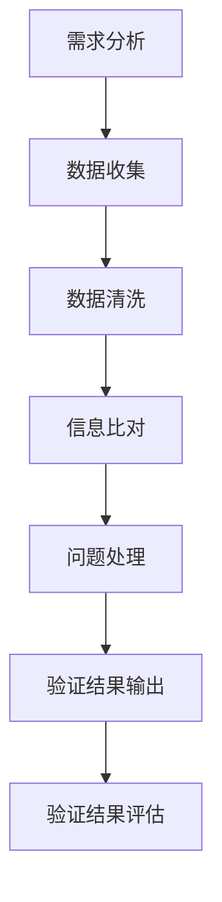
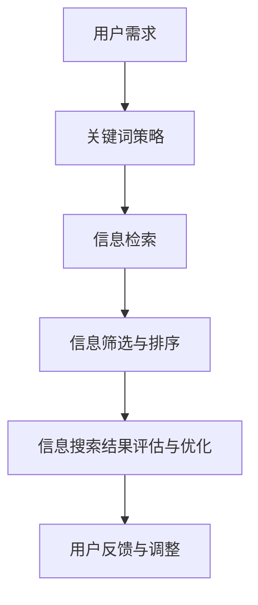

                 

### 文章标题: 信息验证和信息搜索策略：如何在信息海洋中找到可靠的信息

#### 关键词：
- 信息验证
- 信息搜索
- 可靠信息
- 信息验证技术
- 搜索引擎优化
- 信息伦理

#### 摘要：
本文旨在探讨信息验证和信息搜索策略，指导读者在信息爆炸的时代如何找到可靠的信息。首先，我们解析信息验证的基本概念，包括重要性、核心原则、技术方法和实际应用。然后，深入探讨信息搜索的基本概念、策略与方法，以及高效搜索技巧和社会伦理问题。最后，结合学术研究、商业应用和公共安全等实际场景，展示信息验证与搜索的综合应用，并附上相关工具和资源推荐。通过本文的阅读，读者将提高在信息海洋中找到可靠信息的能力。

### 第一部分：信息验证的基本概念

#### 第1章：信息验证的重要性

##### 1.1 信息验证的定义与作用

信息验证是指对信息的真实性、准确性、完整性和可靠性进行核实和确认的过程。其核心作用在于确保信息的可信度和有效性，从而支持决策和行动的准确性。

在当今信息时代，信息验证的重要性愈发凸显。首先，互联网的普及和信息技术的迅猛发展使得信息量呈爆炸性增长，信息来源多样、真假难辨。如果不进行信息验证，可能会误信虚假信息，导致误导性决策和行动。其次，信息验证有助于保护个人隐私和数据安全，防止信息泄露和滥用。最后，信息验证也是构建可信信息生态系统的基础，有助于提高整体信息质量和使用效率。

##### 1.2 信息验证的必要性

信息验证的必要性体现在多个方面。首先，从个人层面来看，信息验证有助于我们做出明智的决策。例如，在求职、投资和医疗等领域，准确的信息是我们做出决策的基础。其次，从企业层面来看，信息验证有助于确保业务运营的准确性和合规性。企业需要获取真实、准确的市场信息和竞争对手情报，以制定有效的战略和决策。最后，从社会层面来看，信息验证有助于提高公共治理水平和社会信任度。政府和社会组织需要验证信息的真实性，确保政策制定和执行的准确性和公正性。

##### 1.3 信息验证的历史与发展

信息验证的历史可以追溯到古代文献的校对和验证。随着印刷术的发展，信息验证逐渐成为一种专门的职业，如图书馆员和档案管理员。在现代社会，信息验证技术随着计算机技术和互联网的普及而不断演进。

早期的信息验证主要依赖于人工检查和经验判断，例如通过对比多个来源的信息来验证其一致性。随着信息技术的发展，出现了各种自动化验证工具，如数据清洗软件、信息认证技术和比对算法。近年来，随着人工智能和大数据技术的应用，信息验证技术进入了新的发展阶段，如基于机器学习的验证算法和智能搜索技术。

### 第2章：信息验证的核心原则

##### 2.1 准确性原则

准确性是信息验证的首要原则，确保信息的真实性和可靠性。具体来说，准确性原则包括以下几个方面：

- **数据源验证**：对信息来源进行核实，确保其可信度和权威性。
- **数据内容核实**：对信息内容进行仔细检查，排除错误和误导性信息。
- **数据一致性验证**：确保同一数据在不同时间、不同来源的准确性。

##### 2.2 完整性原则

完整性原则确保信息的完整性和全面性，防止信息缺失或遗漏。具体来说，完整性原则包括以下几个方面：

- **数据完整性检查**：对数据集进行完整性检查，确保没有缺失值或重复值。
- **信息补全技术**：利用数据补全技术，如数据插值、聚类和关联规则挖掘，补充缺失的信息。
- **数据整合**：将来自不同来源的信息进行整合，确保信息的全面性和一致性。

##### 2.3 时效性原则

时效性原则确保信息的及时性和更新性，避免使用过时或失效的信息。具体来说，时效性原则包括以下几个方面：

- **数据更新频率**：确保数据源及时更新，以获取最新信息。
- **信息时效性评估**：对信息进行时效性评估，排除过时或失效的信息。
- **预警机制**：建立信息预警机制，及时发现和纠正时效性问题。

##### 2.4 可靠性原则

可靠性原则确保信息的可靠性和可信度，防止虚假和误导性信息。具体来说，可靠性原则包括以下几个方面：

- **多源验证**：利用多个信息来源进行交叉验证，提高信息可靠性。
- **数据质量评估**：对数据质量进行评估，确保信息的准确性和完整性。
- **风险控制**：建立风险控制机制，防止信息滥用和泄露。

### 第3章：信息验证的技术方法

##### 3.1 数据清洗与预处理

数据清洗与预处理是信息验证的重要步骤，旨在提高数据质量和可靠性。具体方法包括：

- **缺失值处理**：利用插值、平均值填充或删除缺失值。
- **异常值检测与处理**：使用统计方法或机器学习算法检测异常值，并采取相应处理措施。
- **数据格式转换**：将不同格式的数据转换为统一的格式，便于后续处理。

##### 3.2 信息认证技术

信息认证技术通过数字签名、加密和身份验证等手段确保信息的安全性、完整性和可信度。具体方法包括：

- **数字签名**：利用公钥加密技术对信息进行签名，确保信息不可否认。
- **加密技术**：利用对称加密或非对称加密算法保护信息的安全性。
- **身份验证**：通过用户名、密码、生物特征识别等手段验证用户的身份。

##### 3.3 信息比对与一致性验证

信息比对与一致性验证通过对比多个信息来源，确保信息的一致性和准确性。具体方法包括：

- **比对算法**：使用模糊匹配、关键字匹配、机器学习等算法进行信息比对。
- **一致性规则**：建立一致性规则，对信息进行标准化处理和对比。
- **数据融合**：将多个信息来源进行融合，确保信息的一致性和完整性。

### 第4章：信息验证的流程

##### 4.1 信息验证的基本流程

信息验证的基本流程包括以下步骤：

1. **需求分析**：明确信息验证的目标和需求，确定信息验证的范围和标准。
2. **数据收集**：收集需要验证的信息，包括原始数据和衍生数据。
3. **数据清洗**：对收集到的数据进行分析、清洗和预处理。
4. **信息比对**：对数据源进行比对，发现不一致的地方。
5. **问题处理**：对发现的问题进行处理，如修正错误、删除重复数据或补充缺失信息。
6. **验证结果输出**：将验证结果输出，包括验证报告、可视化图表等。

##### 4.2 信息验证的关键步骤

信息验证的关键步骤包括：

- **数据源评估**：评估数据源的可靠性和权威性，确保数据来源可信。
- **数据清洗**：对数据进行缺失值处理、异常值检测和处理、数据格式转换等操作，提高数据质量。
- **信息比对**：采用合适的比对算法，对多源信息进行比对，发现不一致的地方。
- **问题处理**：对发现的问题进行修正、删除或补充，确保信息的一致性和完整性。
- **验证结果评估**：对验证结果进行评估，确保验证的准确性和有效性。

##### 4.3 信息验证的评估指标

信息验证的评估指标包括：

- **准确率**：验证结果与真实结果的一致性程度。
- **召回率**：发现不一致信息的能力。
- **F1值**：准确率和召回率的综合指标。
- **效率**：验证过程的效率，包括处理时间和资源消耗。
- **用户体验**：验证过程的易用性和用户体验。

### 第5章：信息验证的实际应用

##### 5.1 信息验证在企业和组织中的应用

信息验证在企业和组织中的应用非常广泛，包括：

- **市场调研**：验证市场调研数据的准确性和可靠性，支持市场分析和决策。
- **供应链管理**：验证供应链信息，确保供应链的稳定和可靠。
- **客户关系管理**：验证客户数据的准确性和完整性，提高客户满意度和忠诚度。
- **人力资源**：验证员工信息的真实性和准确性，确保人力资源管理的公正和高效。

##### 5.2 信息验证在政府和社会治理中的应用

信息验证在政府和社会治理中的应用主要体现在以下几个方面：

- **政策制定**：验证政策依据和数据的准确性和可靠性，确保政策制定的科学性和公正性。
- **公共服务**：验证公共服务信息，提高公共服务的质量和效率。
- **社会治理**：验证社会管理信息，提高社会治理的智能化和精细化水平。
- **应急管理**：验证应急信息，提高应急响应的准确性和及时性。

##### 5.3 信息验证在个人隐私保护中的应用

信息验证在个人隐私保护中的应用主要体现在以下几个方面：

- **数据保护**：验证个人信息数据的安全性和隐私性，防止信息泄露和滥用。
- **身份验证**：通过信息验证技术，确保身份验证的准确性和可靠性。
- **隐私政策**：验证隐私政策的合规性和透明度，保护用户隐私权。
- **隐私管理**：验证个人隐私管理措施的可行性和有效性，提高隐私保护水平。

### 第二部分：信息搜索策略

#### 第6章：信息搜索的基本概念

##### 6.1 信息搜索的定义与作用

信息搜索是指从海量的信息资源中检索和获取目标信息的过程。其核心作用在于帮助用户快速、准确地找到所需信息，提高信息获取的效率和质量。

信息搜索在现代社会具有重要意义。首先，随着互联网的普及和信息技术的快速发展，信息爆炸和知识爆炸成为时代特征，信息搜索成为人们获取信息的主要途径。其次，信息搜索有助于提高信息利用效率和决策质量，支持个人、企业和组织的业务发展。最后，信息搜索技术本身也具有巨大的商业价值，如搜索引擎广告、大数据分析和个性化推荐等。

##### 6.2 信息搜索的类型

信息搜索可以分为以下几种类型：

- **文本搜索**：基于关键词或短语检索文本信息，是最常见的搜索类型。
- **图片搜索**：基于图像内容或特征检索图片信息，广泛应用于社交媒体、电商和安防等领域。
- **语音搜索**：基于语音输入检索信息，如智能助手和语音助手等。
- **视频搜索**：基于视频内容或特征检索视频信息，广泛应用于视频网站和短视频平台。
- **实体搜索**：基于实体（如人、地点、组织等）特征检索相关信息，如人物搜索、地点搜索等。

##### 6.3 信息搜索的挑战与机遇

信息搜索面临着一系列挑战和机遇。挑战方面，首先是如何在海量信息中快速准确地检索到用户所需的信息。其次是如何处理信息的多样性、不确定性和噪声。此外，如何保证搜索结果的公正性和可解释性也是一大挑战。机遇方面，随着人工智能和大数据技术的发展，信息搜索技术将变得更加智能和高效。个性化搜索、智能推荐和智能问答等新型搜索模式将为用户提供更好的搜索体验。同时，信息搜索技术在商业、医疗、教育和公共安全等领域的应用也将带来巨大的商业价值和社会影响。

#### 第7章：信息搜索的策略与方法

##### 7.1 搜索引擎优化（SEO）

搜索引擎优化（SEO）是指通过优化网站内容和结构，提高网站在搜索引擎结果页面（SERP）中的排名，从而吸引更多访问者的过程。SEO的核心策略包括：

- **关键词研究**：确定目标关键词，并分析其搜索量和竞争度，选择合适的关键词进行优化。
- **网站结构优化**：设计合理的网站结构和导航，提高用户体验和搜索引擎爬虫的抓取效率。
- **内容优化**：创建高质量、有价值的内容，满足用户需求和搜索引擎算法要求。
- **外部链接建设**：获取高质量的 inbound 链接，提高网站的权威性和可信度。
- **技术优化**：优化网站速度、移动友好性和安全性能，提高搜索引擎友好度。

##### 7.2 关键词策略

关键词策略是信息搜索的核心环节，直接影响搜索结果的相关性和用户体验。关键词策略包括以下几个方面：

- **关键词定位**：根据用户需求和市场分析，确定核心关键词和长尾关键词。
- **关键词分布**：合理分布关键词在网站的各个部分，包括标题、描述、内容、标签等。
- **关键词密度**：控制关键词在内容中的合理密度，避免过度优化导致搜索引擎降权。
- **关键词更新**：定期分析关键词表现，根据用户需求和市场变化调整关键词策略。

##### 7.3 信息筛选与排序算法

信息筛选与排序算法是信息搜索的重要组成部分，直接影响搜索结果的质量和用户体验。常见的筛选与排序算法包括：

- **基于关键词匹配的排序算法**：如基于TF-IDF、布尔模型、向量空间模型等。
- **基于内容的排序算法**：如基于相似度、相关度、质量度等排序算法。
- **基于用户的排序算法**：如基于用户历史行为、兴趣偏好、地理位置等排序算法。
- **混合排序算法**：结合多种排序策略，提高搜索结果的多样性和公正性。

##### 7.4 信息检索模型

信息检索模型是信息搜索的理论基础，用于描述信息检索的过程和机制。常见的信息检索模型包括：

- **布尔模型**：基于布尔逻辑运算符（AND、OR、NOT）进行检索，简单直观。
- **向量空间模型**：将文档和查询表示为向量，通过向量空间中的距离计算检索结果的相关性。
- **概率模型**：如贝叶斯模型、隐马尔可夫模型（HMM）、条件概率模型等，通过概率计算检索结果的相关性。
- **深度学习模型**：如卷积神经网络（CNN）、循环神经网络（RNN）、Transformer 模型等，通过深度学习技术进行检索和排序。

#### 第8章：高效信息搜索技巧

##### 8.1 信息搜索技巧

高效的信息搜索技巧有助于提高搜索效率和结果质量。以下是一些常见的搜索技巧：

- **使用通配符**：使用问号（?）或星号（*）代替不确定的关键词部分，进行模糊搜索。
- **使用引号**：使用引号将关键词组合成短语，精确搜索相关短语。
- **使用搜索指令**：利用搜索引擎提供的搜索指令，如 site:、intitle:、filetype: 等，进行高级搜索。
- **利用搜索历史和推荐**：利用搜索历史和搜索推荐，发现潜在的相关信息。
- **跨平台搜索**：同时使用多个搜索引擎，提高搜索结果的全面性和准确性。

##### 8.2 信息搜索工具的使用

有效的信息搜索工具可以大大提高搜索效率和质量。以下是一些常用的信息搜索工具：

- **通用搜索引擎**：如百度、谷歌、必应等，提供广泛的搜索结果。
- **垂直搜索引擎**：如淘宝、京东、去哪儿等，专注于特定领域或行业的搜索。
- **学术搜索引擎**：如谷歌学术、百度学术等，提供专业的学术搜索服务。
- **社交媒体搜索**：如微博、推特、领英等，通过社交媒体平台进行信息搜索。
- **专业数据库**：如CNKI、IEEE Xplore、PubMed等，提供专业的领域数据库搜索服务。

##### 8.3 信息搜索结果的评估与优化

评估和优化信息搜索结果有助于提高搜索质量和用户体验。以下是一些评估和优化搜索结果的方法：

- **结果质量评估**：通过准确率、召回率、F1值等指标评估搜索结果的质量。
- **用户体验优化**：优化搜索结果页面设计，提高用户可读性和交互性。
- **结果排序优化**：采用混合排序算法，结合用户历史行为和内容质量，提高搜索结果的公正性和多样性。
- **用户反馈机制**：收集用户反馈，根据用户需求和偏好调整搜索策略。
- **实时更新和索引**：定期更新索引库，提高搜索结果的时效性和准确性。

### 第9章：信息搜索的社会与伦理问题

##### 9.1 信息搜索对社会的影响

信息搜索对社会产生了深远的影响，既带来了机遇，也带来了一些挑战。以下是信息搜索对社会的主要影响：

- **信息获取便捷**：信息搜索使得人们可以快速获取所需信息，提高了信息获取的效率。
- **知识传播加速**：信息搜索促进了知识的传播和共享，推动了人类文明的进步。
- **商业发展机遇**：信息搜索为商业活动提供了新的机会，如搜索引擎广告、电子商务和大数据分析等。
- **隐私泄露风险**：信息搜索可能导致个人隐私泄露，如搜索引擎记录用户搜索历史、社交媒体收集用户信息等。
- **信息过载问题**：信息搜索使得信息获取变得便捷，但也可能导致信息过载，增加用户的心理负担。
- **数字鸿沟扩大**：信息搜索在提高信息获取效率的同时，也可能扩大数字鸿沟，使信息获取更加不公平。

##### 9.2 信息搜索伦理问题

信息搜索伦理问题主要包括以下几个方面：

- **隐私保护**：在信息搜索过程中，保护用户隐私是重要伦理问题。搜索引擎和社交媒体等平台应遵守相关隐私保护法规，采取措施防止用户隐私泄露。
- **信息真实性**：信息搜索应确保搜索结果的真实性和可靠性，避免误导用户。平台和开发者应采取措施，如验证信息来源、打击虚假信息等。
- **算法偏见**：信息搜索算法可能导致偏见和不公平，如性别、种族、地域等偏见。开发者应采取措施，如算法透明化、公平性评估等，减少算法偏见。
- **信息垄断**：信息搜索领域可能产生信息垄断，影响市场公平竞争。监管机构和平台应采取措施，如反垄断法规、公平竞争机制等，维护市场秩序。
- **版权保护**：信息搜索应尊重版权保护，避免侵犯他人的知识产权。平台和开发者应遵守版权法规，采取版权保护措施。

##### 9.3 信息搜索的监管与政策

信息搜索的监管与政策旨在确保信息搜索的公平性、透明性和安全性。以下是相关信息搜索监管与政策的主要方面：

- **隐私保护法规**：如《通用数据保护条例》（GDPR）、《加州消费者隐私法》（CCPA）等，规范信息收集、处理和使用行为，保护用户隐私。
- **虚假信息打击**：如《反虚假信息法》、《虚假信息举报平台》等，打击虚假信息和谣言传播，维护网络生态。
- **算法透明化**：如《算法透明化法案》、《算法公平性评估指南》等，要求平台和开发者公开算法模型、训练数据等信息，提高算法透明度和可解释性。
- **市场竞争政策**：如《反垄断法》、《公平竞争审查制度》等，规范市场竞争行为，防止信息搜索领域产生垄断。
- **版权保护政策**：如《版权法》、《数字千年版权法》（DMCA）等，规范信息搜索和分发行为，保护知识产权。

### 第三部分：信息验证与搜索的综合应用

#### 第10章：信息验证与搜索在学术研究中的应用

##### 10.1 学术研究中的信息验证

在学术研究中，信息验证至关重要。以下是一些学术研究中的信息验证方法：

- **文献查重**：通过查重软件检测论文的原创性，确保论文的学术诚信。
- **数据验证**：对实验数据进行分析和验证，确保数据的真实性和可靠性。
- **文献引用验证**：检查论文引用的文献是否真实可靠，避免抄袭和伪造引用。
- **同行评审**：通过同行评审过程，对研究成果进行验证和评估，确保研究的质量和可信度。

##### 10.2 学术研究中的信息搜索

在学术研究中，信息搜索是获取知识的重要手段。以下是一些学术研究中的信息搜索方法：

- **数据库搜索**：利用学术数据库，如CNKI、PubMed、IEEE Xplore等，检索相关文献和研究成果。
- **搜索引擎优化**：通过优化论文标题、关键词和摘要，提高论文在搜索引擎中的排名，便于他人检索和引用。
- **网络爬虫**：利用网络爬虫技术，自动检索和获取大量学术资源，提高信息获取的效率。
- **社交媒体和论坛**：通过社交媒体和学术论坛，与同行进行交流，获取最新的学术动态和研究成果。

##### 10.3 学术成果的验证与检索

学术成果的验证与检索是学术评价和传播的重要环节。以下是一些学术成果的验证与检索方法：

- **引文分析**：通过引文分析，评估学术成果的影响力和贡献度。
- **期刊评价**：通过期刊评价，判断学术成果的发表平台质量和影响力。
- **数据可视化和分析**：利用数据可视化工具，对学术成果进行分析和展示，提高学术传播效果。
- **开放获取**：通过开放获取（Open Access），提高学术成果的传播和利用，促进知识的共享和传播。

#### 第11章：信息验证与搜索在商业应用中的应用

##### 11.1 市场调研中的信息验证

在市场调研中，信息验证至关重要。以下是一些市场调研中的信息验证方法：

- **数据源验证**：核实调查数据的来源，确保数据的可靠性和权威性。
- **样本验证**：对调查样本进行验证，确保样本的代表性和准确性。
- **问卷质量验证**：评估问卷的设计和质量，确保调查数据的真实性和有效性。
- **数据分析验证**：对数据分析过程和结果进行验证，确保分析的准确性和可信度。

##### 11.2 商业决策中的信息搜索

商业决策中的信息搜索是获取商业洞察和制定战略的重要手段。以下是一些商业决策中的信息搜索方法：

- **市场分析**：通过市场分析，获取市场竞争态势、消费者需求和行业趋势等信息。
- **竞争对手分析**：通过分析竞争对手的产品、策略和市场份额，制定有效的竞争策略。
- **客户反馈分析**：通过客户反馈，了解客户需求和满意度，优化产品和服务。
- **数据挖掘**：利用数据挖掘技术，从大量数据中挖掘潜在的商机和趋势。

##### 11.3 商业信息的验证与监测

商业信息的验证与监测有助于确保商业信息的准确性和可靠性，以下是一些商业信息的验证与监测方法：

- **供应链监控**：通过供应链监控，确保供应链信息的准确性和及时性。
- **市场监测**：通过市场监测，实时获取市场动态和竞争态势，及时调整商业策略。
- **风险监测**：通过风险监测，识别潜在的商业风险，制定应对措施。
- **合规性监测**：通过合规性监测，确保商业活动的合规性和合法性。

#### 第12章：信息验证与搜索在公共安全中的应用

##### 12.1 公共安全信息验证

在公共安全领域，信息验证至关重要。以下是一些公共安全信息验证的方法：

- **预警信息验证**：对预警信息进行验证，确保预警信息的准确性和及时性，提高应急响应能力。
- **情报信息验证**：对情报信息进行验证，确保情报信息的真实性和可靠性，为决策提供支持。
- **现场信息验证**：对现场信息进行验证，确保现场信息的准确性和完整性，为应急处置提供依据。
- **数据源审核**：对信息来源进行审核，确保信息来源的权威性和可信度。

##### 12.2 公共安全信息搜索

在公共安全领域，信息搜索是获取信息和情报的重要手段。以下是一些公共安全信息搜索的方法：

- **大数据分析**：通过大数据分析，从海量数据中挖掘潜在的安全威胁和风险信息。
- **社交媒体监测**：通过社交媒体监测，实时获取社会动态和舆论走向，提高信息感知能力。
- **专业数据库检索**：通过专业数据库检索，获取相关领域的信息和情报，为决策提供支持。
- **信息共享与协作**：通过信息共享与协作，实现跨部门、跨地区的信息交流和资源整合。

##### 12.3 公共安全信息管理

公共安全信息管理是保障公共安全的重要环节。以下是一些公共安全信息管理的方法：

- **信息分类与归档**：对公共安全信息进行分类和归档，便于信息检索和利用。
- **信息共享与协作**：建立信息共享与协作机制，实现跨部门、跨地区的信息共享和资源整合。
- **信息安全保障**：通过信息安全保障措施，确保公共安全信息的保密性、完整性和可用性。
- **信息应急预案**：制定信息应急预案，确保在突发事件发生时，能够迅速、有效地获取和利用信息。

### 附录

#### 附录A：常用信息验证与搜索工具介绍

##### A.1 搜索引擎

- **通用搜索引擎**：如百度、谷歌、必应等，提供广泛的搜索服务。
- **学术搜索引擎**：如谷歌学术、百度学术等，专注于学术资源的检索。
- **垂直搜索引擎**：如淘宝、京东、去哪儿等，提供专业领域的信息检索服务。

##### A.2 数据库

- **学术数据库**：如CNKI、PubMed、IEEE Xplore等，提供专业的学术资源检索服务。
- **企业数据库**：如企业信息查询平台、工商登记信息库等，提供企业相关信息查询服务。
- **行业数据库**：如金融数据库、医药数据库、市场调查数据库等，提供专业领域的信息检索服务。

##### A.3 信息验证工具

- **文献查重软件**：如PaperPass、Turnitin等，用于检测论文的原创性。
- **数据清洗工具**：如Python的Pandas库、R语言的dplyr包等，用于数据清洗和预处理。
- **信息比对工具**：如相似度计算工具、关键字匹配工具等，用于信息比对和一致性验证。

#### 附录B：信息验证与搜索相关资源推荐

##### B.1 学术资源

- **学术论文库**：如CNKI、Web of Science、Scopus等，提供丰富的学术资源。
- **学术期刊**：如Nature、Science、IEEE Transactions等，提供高质量的学术期刊。
- **学术会议**：如国际计算机大会（ICCC）、国际人工智能大会（AAAI）等，提供学术交流平台。

##### B.2 商业资源

- **市场研究报告**：如艾瑞咨询、智研咨询等，提供专业的市场研究报告。
- **商业数据库**：如企业信息查询平台、天眼查等，提供企业相关信息查询服务。
- **商业案例分析**：如哈佛商学院案例库、MBA案例库等，提供商业案例分析资源。

##### B.3 社会资源

- **政策法规**：如国家法律法规库、地方政府官网等，提供政策法规信息查询服务。
- **社会调查报告**：如国家统计局、中国社会科学院等，提供社会调查报告资源。
- **公众信息平台**：如12345市民服务热线、政务服务网等，提供公共服务信息查询服务。

#### 附录C：信息验证与搜索的 Mermaid 流程图

##### C.1 信息验证流程图



##### C.2 信息搜索流程图



#### 附录D：信息验证与搜索相关算法伪代码

##### D.1 数据清洗伪代码

```python
def data_cleaning(data):
    # 缺失值处理
    data = handle_missing_values(data)
    # 异常值检测与处理
    data = handle_outliers(data)
    # 数据格式转换
    data = convert_data_format(data)
    return data
```

##### D.2 信息比对伪代码

```python
def information_comparison(data1, data2):
    # 比对算法
    similarity = compare_similarity(data1, data2)
    # 一致性规则
    is_consistent = apply一致性_rules(similarity)
    return is_consistent
```

##### D.3 信息检索算法伪代码

```python
def information_retrieval(query, documents):
    # 检索模型
    similarity_scores = compute_similarity_scores(query, documents)
    # 排序算法
    ranked_documents = sort_by_similarity_scores(similarity_scores)
    return ranked_documents
```

### 后记

感谢您的阅读，希望本书能帮助您更好地理解和应用信息验证与搜索策略，提高在信息海洋中找到可靠信息的能力。通过本书的介绍，您已经掌握了信息验证的基本概念、核心原则、技术方法和实际应用，以及信息搜索的基本概念、策略与方法、高效搜索技巧和社会与伦理问题。

在信息时代，信息验证与搜索能力的重要性不言而喻。无论是学术研究、商业应用还是公共安全，信息验证与搜索策略都是不可或缺的工具。通过本书的学习，您将能够更好地应对信息时代的挑战，提高信息获取和处理的能力。

如果您在阅读本书的过程中有任何问题或建议，欢迎通过以下方式与我们联系：

- 电子邮件：[info@book.com](mailto:info@book.com)
- 官方网站：[www.book.com](http://www.book.com)
- 社交媒体：[Book 官方微博](https://weibo.com/book) 和 [Book 官方微信公众号](https://mp.weixin.qq.com/s/book)

我们期待您的反馈，并希望这本书能为您在信息时代的探索之旅提供有力的支持。祝愿您在信息海洋中航行愉快，找到可靠的宝藏！

