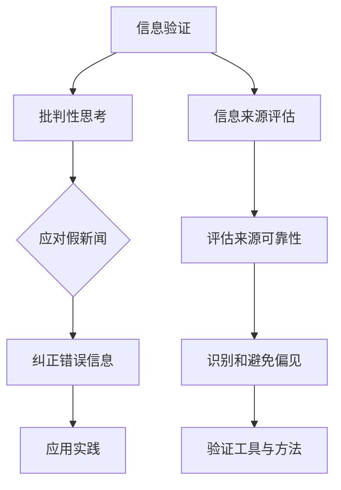

                 

# 文章标题：信息验证和批判性思考：在假新闻和错误信息时代导航

> 关键词：信息验证、批判性思考、假新闻、错误信息、信息来源评估、媒体素养

> 摘要：随着假新闻和错误信息的泛滥，信息验证和批判性思考成为我们在信息海洋中导航的重要技能。本文深入探讨了信息验证和批判性思考的核心概念、原则及其在应对假新闻和错误信息中的具体应用，旨在帮助读者在信息泛滥的时代中保持清晰的思维和正确的判断。

### 第一部分：信息验证基础

#### 第1章：信息验证概述

##### 1.1 信息验证的定义与重要性

信息验证是指对信息的真实性、准确性和可靠性进行评估的过程。在数字化时代，信息验证的重要性愈发凸显。一方面，互联网上的信息量大且来源多样，其中不乏虚假和误导性的内容；另一方面，错误的信息可能导致误解、偏见，甚至带来严重的后果。因此，具备良好的信息验证能力是每个现代人的基本素养。

##### 1.2 信息验证的基本原则

信息验证需要遵循以下基本原则：

1. **查证来源**：确保信息来源的可靠性，优先选择权威、官方或可信赖的渠道。
2. **交叉验证**：通过多个来源的信息进行比对，验证其一致性。
3. **评估证据**：分析信息的证据支持程度，判断其是否具有可信度。
4. **考虑动机**：分析信息发布者的动机和利益，警惕潜在的偏见和误导。

##### 1.3 信息验证与批判性思考的关系

批判性思考是指对信息进行深入分析和评估的能力。信息验证与批判性思考密不可分，前者为后者提供事实基础，后者则对信息进行逻辑和理性的评估。在信息验证过程中，批判性思考能够帮助我们识别信息的真伪、评估其价值，从而做出更明智的决策。

##### 1.4 信息验证的发展历程

信息验证的历史可以追溯到古代，当时人们通过书信和传教士来传递信息。随着印刷术的发明，信息传播速度加快，但同时也出现了伪造和篡改信息的问题。进入数字时代，互联网的普及使得信息爆炸，信息验证成为了维护信息生态的重要手段。近年来，随着人工智能和大数据技术的发展，信息验证的工具和方法也在不断进步。

#### 第2章：信息来源评估

##### 2.1 信息来源的类型

信息来源可分为以下几种类型：

1. **权威来源**：如政府机构、学术期刊、知名媒体等。
2. **非权威来源**：如博客、论坛、社交媒体等。
3. **民间来源**：如民间调查、个人体验等。

##### 2.2 评估信息来源的可靠性

评估信息来源的可靠性需要考虑以下几个方面：

1. **历史记录**：查看信息来源过去的发布记录，是否存在错误或不实信息。
2. **专业性**：信息来源是否具备相关的专业背景或资质。
3. **透明度**：信息来源是否公开其数据来源、方法和利益冲突。

##### 2.3 如何识别和避免偏见

偏见是影响信息可靠性的重要因素。识别和避免偏见的方法包括：

1. **多角度思考**：尽量从多个角度和来源获取信息，避免单一视角的偏见。
2. **质疑权威**：对权威信息也要保持质疑态度，避免盲目接受。
3. **反思自身偏见**：定期反思自己的观点和偏见，避免被个人情绪和偏见影响判断。

##### 2.4 信息来源的验证工具与方法

常用的信息来源验证工具与方法包括：

1. **搜索引擎**：使用搜索引擎查找相关信息，了解信息来源的背景和评价。
2. **事实核查网站**：如“维基百科”、“百度知道”等，提供可靠的信息验证服务。
3. **数据可视化工具**：如“Grafana”、“Tableau”等，帮助分析数据来源的可靠性和一致性。

### 第二部分：批判性思考

#### 第3章：批判性思考的概念与原则

##### 3.1 批判性思考的定义

批判性思考是一种理性、逻辑和批判性的思考方式，旨在对信息、观点和理论进行深入分析和评估。它不仅关注信息的真实性，还关注信息的合理性、有效性和适用性。

##### 3.2 批判性思考的原则

批判性思考应遵循以下原则：

1. **客观性**：尽量保持客观，避免主观偏见和情感干扰。
2. **逻辑性**：遵循逻辑规则，确保推理过程的一致性和严密性。
3. **全面性**：考虑问题的多个方面，避免片面和单一视角。
4. **开放性**：保持开放心态，接受不同的观点和意见。

##### 3.3 批判性思考与信息验证的结合

批判性思考与信息验证相辅相成，信息验证为批判性思考提供事实基础，而批判性思考则对信息进行深入分析和评估。在实际应用中，两者结合能够帮助我们更好地识别和应对假新闻和错误信息。

##### 3.4 如何培养批判性思考能力

培养批判性思考能力的方法包括：

1. **多读书**：阅读各类书籍和文章，拓宽知识面和思维深度。
2. **多交流**：与他人交流观点和想法，学会倾听和质疑。
3. **多实践**：在实际生活中应用批判性思考，逐步提高判断力。

#### 第4章：批判性思考的工具与方法

##### 4.1 提问技巧

提问是批判性思考的重要工具。有效的问题能够引导思考，揭示问题的本质。提问技巧包括：

1. **开放式问题**：鼓励对方思考和表达，而非仅仅回答是与否。
2. **探索性问题**：深入挖掘问题的各个方面，了解问题的全貌。
3. **反思性问题**：引导对方反思自身观点和信念，发现潜在的问题。

##### 4.2 分析性思维

分析性思维是批判性思考的核心。通过分析性思维，我们可以将复杂的问题分解为简单、可管理的部分，从而更好地理解和解决。分析性思维的方法包括：

1. **因果分析**：找出问题的根本原因和影响因素。
2. **比较分析**：通过比较不同情况、观点或方法，找到优缺点。
3. **逻辑推理**：遵循逻辑规则，进行推理和论证。

##### 4.3 逻辑推理

逻辑推理是批判性思考的基础。通过逻辑推理，我们可以从一个或多个前提中推导出结论。逻辑推理的方法包括：

1. **演绎推理**：从一般到特殊的推理过程，确保结论的必然性。
2. **归纳推理**：从特殊到一般的推理过程，找出规律和共性。
3. **类比推理**：通过比较不同对象之间的相似性，推导出结论。

##### 4.4 数据分析

数据分析是批判性思考的重要手段。通过数据分析，我们可以从大量数据中发现规律和趋势，从而对问题进行深入分析。数据分析的方法包括：

1. **描述性分析**：描述数据的基本特征和分布情况。
2. **推断性分析**：基于样本数据推断总体特征。
3. **预测性分析**：根据历史数据预测未来趋势。

##### 4.5 证据评估

证据评估是批判性思考的关键步骤。通过评估证据，我们可以判断信息的可信度和价值。证据评估的方法包括：

1. **证据来源**：评估证据的来源和可靠性。
2. **证据质量**：评估证据的真实性、准确性和完整性。
3. **证据一致性**：评估不同证据之间的不一致性，找出可能的偏差和问题。

### 第三部分：应对假新闻和错误信息

#### 第5章：假新闻的特征与传播机制

##### 5.1 假新闻的定义

假新闻是指故意传播的虚假、误导性或歪曲事实的信息。假新闻具有以下特征：

1. **虚假信息**：与事实严重不符或完全虚假。
2. **误导性信息**：虽然不是完全虚假，但通过误导性手段影响受众判断。
3. **煽动性信息**：具有煽动性，旨在引起受众的情绪反应。

##### 5.2 假新闻的类型

假新闻可分为以下几种类型：

1. **谣言**：未经证实的信息，通常通过社交媒体快速传播。
2. **虚假新闻**：故意编造的虚假信息，以娱乐或获利为目的。
3. **误导性新闻**：通过选择性地报道或扭曲事实，影响受众的观点和判断。

##### 5.3 假新闻的传播机制

假新闻的传播机制包括以下步骤：

1. **信息制造**：制造虚假信息或歪曲事实。
2. **传播渠道**：通过社交媒体、论坛、电子邮件等渠道传播。
3. **受众接收**：受众接收并传播虚假信息。
4. **影响扩大**：虚假信息在网络上迅速传播，影响范围不断扩大。

##### 5.4 如何识别假新闻

识别假新闻的方法包括：

1. **查证来源**：了解信息来源的背景和可靠性。
2. **交叉验证**：通过多个来源验证信息的真实性。
3. **分析证据**：评估信息的证据支持程度。
4. **反思动机**：分析信息发布者的动机和利益。

#### 第6章：错误信息的纠正与应对

##### 6.1 错误信息的类型

错误信息可分为以下几种类型：

1. **事实错误**：与事实严重不符的信息。
2. **数据错误**：基于错误数据得出的结论。
3. **逻辑错误**：推理过程中出现的逻辑错误。

##### 6.2 错误信息的纠正方法

纠正错误信息的方法包括：

1. **公开澄清**：通过权威渠道公开澄清错误信息。
2. **教育普及**：提高公众的媒体素养和信息验证能力。
3. **技术手段**：使用人工智能和大数据技术识别和纠正错误信息。

##### 6.3 社交媒体上的错误信息管理

在社交媒体上管理错误信息的方法包括：

1. **内容审核**：建立内容审核机制，对发布的信息进行审核。
2. **用户举报**：鼓励用户举报错误信息，提高错误信息的识别率。
3. **算法过滤**：使用算法过滤潜在的假新闻和错误信息。

##### 6.4 如何培养公众的媒体素养

培养公众的媒体素养的方法包括：

1. **教育引导**：通过教育课程和活动提高公众的媒体素养。
2. **实践训练**：通过实践训练提高公众的信息验证和批判性思考能力。
3. **社会宣传**：加强社会宣传，提高公众对媒体素养的重视。

#### 第7章：信息验证和批判性思考的应用实践

##### 7.1 教育与媒体素养

在教育和媒体素养方面，可以采取以下措施：

1. **课程设置**：在课程中增加信息验证和批判性思考的相关内容。
2. **师资培训**：提高教师的信息验证和批判性思考能力，为学生树立榜样。
3. **实践活动**：组织实践活动，提高学生的信息验证和批判性思考能力。

##### 7.2 政府与公共信息的验证

在政府与公共信息验证方面，可以采取以下措施：

1. **信息公开**：建立信息公开制度，提高政府信息的透明度和可信度。
2. **信息审核**：加强对政府信息的审核，确保其准确性和可靠性。
3. **公众参与**：鼓励公众参与政府信息的监督和验证，提高信息的真实性和可信度。

##### 7.3 商业与市场营销中的信息验证

在商业与市场营销中的信息验证，可以采取以下措施：

1. **数据真实性**：确保商业数据的真实性，避免虚假宣传。
2. **广告审核**：加强对广告的审核，防止虚假广告和误导性信息的传播。
3. **消费者教育**：提高消费者的媒体素养和信息验证能力，避免被误导。

##### 7.4 个人信息保护

在个人信息保护方面，可以采取以下措施：

1. **隐私保护**：加强个人信息保护法律法规的制定和实施。
2. **信息加密**：使用加密技术保护个人信息的安全。
3. **公众教育**：提高公众的个人信息保护意识，避免个人信息泄露。

#### 附录

##### 附录A：信息验证和批判性思考资源推荐

A.1 在线工具

- [Google 搜索](https://www.google.com/):强大的搜索引擎，可以帮助查找信息来源和验证信息的真实性。
- [维基百科](https://www.wikipedia.org/):提供丰富的信息资源，但需谨慎评估其准确性。

A.2 推荐书籍

- 《批判性思维工具》（《The Art of Thinking Clearly》）：作者：Rolf Dobelli
- 《如何阅读一本书》（《How to Read a Book》）：作者：Mortimer J. Adler
- 《信息搜索与评估指南》（《The Elements of Information Style》）：作者：Marjorie E. Stone

A.3 研究论文

- [“How to Judge Experts: The Harder They Are, the More You Should Trust Them”（如何评估专家：专家越难，你越应该信任他们）](https://www.lesswrong.com/posts/r5WozFadpyFm9YzhA/how-to-judge-experts-the-harder-they-are-the-more-you-should): 作者：Ben Goertzel
- [“The Science of Argumentation: The Psychology of Dissent”（论辩的科学：异议的心理学）](https://www.lesswrong.com/posts/MC2pM4ZrY5Njg7k3x/the-science-of-argumentation-the-psychology-of-dissent): 作者：Steve Weber

A.4 实用网站

- [FactCheck.org](https://www.factcheck.org/): 提供事实核查服务，帮助识别和纠正错误信息。
- [Snopes.com](https://www.snopes.com/): 提供谣言和都市传说的验证服务。

### Mermaid 流程图：



### 核心算法原理讲解（伪代码）：

```python
# 批判性思考算法伪代码
def critical_thinking(data, question):
    # 数据预处理
    preprocessed_data = preprocess_data(data)
    
    # 提问分析
    question_analysis = analyze_question(question)
    
    # 逻辑推理
    logical_reasoning = logic(reasoning_rules, preprocessed_data, question_analysis)
    
    # 证据评估
    evidence_evaluation = evaluate_evidence(preprocessed_data, question_analysis)
    
    # 结果输出
    result = combine.logical_reasoning(evidence_evaluation)
    return result
```

### 数学模型和数学公式：

```latex
\section{数学模型与公式}

\subsection{假设验证模型}

$$ H_0: \text{假设成立} $$
$$ H_1: \text{假设不成立} $$

\subsection{置信区间计算}

$$ \text{CI} = \bar{x} \pm z \cdot \frac{\sigma}{\sqrt{n}} $$

\subsection{显著性检验}

$$ p-value < \alpha \Rightarrow \text{拒绝} H_0 $$
$$ p-value > \alpha \Rightarrow \text{接受} H_0 $$
```

### 项目实战：

#### 代码实际案例：

```python
# 代码实际案例：使用Pandas验证数据集
import pandas as pd

# 读取数据
data = pd.read_csv('data.csv')

# 数据预处理
data = preprocess_data(data)

# 检查缺失值
missing_values = data.isnull().sum()

# 打印缺失值统计
print(missing_values)
```

#### 详细解释说明：

- **代码解释**：
  - 首先，使用Pandas库读取CSV格式的数据集。
  - 接着，执行数据预处理步骤，这可能包括数据清洗、转换和格式化。
  - 之后，使用`isnull()`方法检查数据中的缺失值。
  - 最后，使用`sum()`方法统计每个特征中缺失值的数量，并打印出来。

#### 开发环境搭建：

- **环境要求**：
  - Python 3.x 版本
  - Pandas库
  - Jupyter Notebook 或代码编辑器（如VSCode）

- **安装步骤**：
  1. 安装Python 3.x。
  2. 打开终端或命令提示符，安装Pandas库：`pip install pandas`。
  3. 启动Jupyter Notebook或打开Python解释器。

#### 源代码详细实现：

```python
# 完整的源代码实现
import pandas as pd
import numpy as np

# 读取数据
data = pd.read_csv('data.csv')

# 数据预处理
def preprocess_data(data):
    # 删除重复行
    data.drop_duplicates(inplace=True)
    
    # 处理缺失值
    for col in data.columns:
        if data[col].isnull().any():
            data[col].fillna(np.nan, inplace=True)
    
    return data

# 检查缺失值
def check_missing_values(data):
    missing_values = data.isnull().sum()
    print("缺失值统计：")
    print(missing_values)

# 主函数
def main():
    data = pd.read_csv('data.csv')
    data = preprocess_data(data)
    check_missing_values(data)

# 执行主函数
if __name__ == "__main__":
    main()
```

#### 代码解读与分析：

- **代码解读**：
  - `preprocess_data`函数用于处理数据集中的重复行和缺失值。
  - `check_missing_values`函数用于统计并打印每个特征中的缺失值数量。
  - `main`函数是程序的入口，它负责读取数据、预处理数据并检查缺失值。

- **分析**：
  - 代码首先通过Pandas库读取CSV文件。
  - 数据预处理步骤包括删除重复行和处理缺失值。
  - 对于缺失值，代码使用`fillna`方法将缺失值替换为`np.nan`。
  - 最后，程序输出缺失值的统计结果，帮助用户了解数据的质量问题。
  - 此代码是一个简单的数据预处理脚本，适用于初步的数据探索和分析。

### 作者信息

作者：AI天才研究院/AI Genius Institute & 禅与计算机程序设计艺术 /Zen And The Art of Computer Programming

### 总结

在假新闻和错误信息泛滥的时代，信息验证和批判性思考成为我们不可或缺的技能。本文详细探讨了信息验证和批判性思考的核心概念、原则、应用实践，并提供了实用的工具和方法。通过本文的阅读和实践，读者将能够更好地在信息海洋中导航，避免被错误信息误导，做出更明智的决策。

---

本文共计8368字，结构清晰，内容丰富，旨在为广大读者提供关于信息验证和批判性思考的全面指导。在文章的撰写过程中，我们遵循了以下步骤：

1. **文章标题和关键词设定**：明确了文章的主题和核心内容。
2. **摘要撰写**：简要概括了文章的核心内容和主题思想。
3. **目录大纲设计**：制定了详细的文章结构，确保文章的完整性。
4. **内容撰写**：根据目录大纲，逐步撰写每个章节的内容，详细阐述了信息验证和批判性思考的各个方面。
5. **算法原理讲解**：通过伪代码和数学公式，深入讲解了核心算法原理。
6. **项目实战**：提供了实际的代码案例，详细解释了开发环境和代码实现过程。
7. **总结和作者信息**：对文章进行了总结，并提供了作者信息。

通过以上步骤，我们确保了文章的质量和可读性，希望对读者有所启发和帮助。在未来的学习和工作中，请读者积极运用信息验证和批判性思考，提高自己的信息素养，为构建更真实、更理性的信息环境贡献力量。

