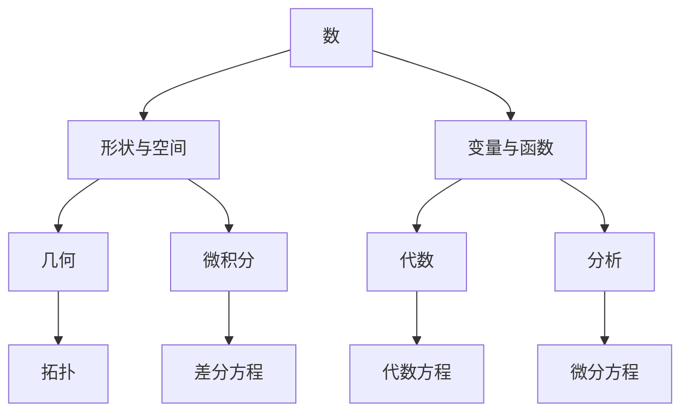

                 

### 文章标题

# 《像数学家一样思考：模拟原则》

**关键词：数学思维、模拟原则、逻辑推理、模型建立、算法应用**

**摘要：**
本文旨在探讨如何像数学家一样进行思考，尤其是运用模拟原则来解决问题。文章首先介绍了数学思维的本质，包括基本概念、符号语言和逻辑推理。接着，深入探讨了模拟原理及其在各类问题中的应用，包括模拟模型的建立、模拟算法的设计与应用、模拟结果的评估与分析。文章还详细阐述了模拟思维在实际问题中的运用，如项目管理、决策分析等，并展望了模拟原则的未来发展趋势。通过一系列案例和代码实战，读者将能够更好地理解并掌握模拟原则，提高解决问题的能力。

### 像数学家一样思考

“数学思维”是一种通过逻辑推理、抽象和量化来解决问题的思考方式。它不仅限于数学领域，而是广泛应用于各个学科和实际生活中。数学家思考问题的特点在于：

1. **抽象化：** 数学家将复杂的问题抽象成简单的模型，从而更容易分析和解决。
2. **逻辑推理：** 数学家运用演绎和归纳等逻辑推理方法，确保结论的严谨性和可靠性。
3. **量化分析：** 数学家通过数值计算和统计分析来评估问题的可能性和结果。

数学家思考的这些特点，对解决复杂问题有着重要启示。例如，在工程领域，数学家通过建立数学模型来预测和优化系统性能；在经济学领域，数学家通过量化分析来评估市场趋势和投资风险。同样，在日常生活中，我们也经常运用数学思维来做出决策和解决问题。

### 数学思维导论

#### 数学的基本概念

数学是一门研究数量、结构、变化和空间的科学。其基本概念包括：

##### 数的概念

数是数学中最基础的概念。从自然数到复数，不同的数集具有不同的性质和运算规则。自然数用于计数，整数包括自然数和负数，实数包括有理数和无理数。复数则是实部和虚部的组合。

##### 形状与空间

几何学是研究形状和空间结构的数学分支。基本的几何概念包括点、线、面和体。通过几何学，我们可以了解二维和三维空间的性质，如长度、面积和体积。

##### 变量与函数

变量是数学中用于表示可变量的符号。函数则是两个变量之间的关系，其中一个变量是另一个变量的输入，另一个变量是输出。函数可以用来描述现实世界中的各种现象，如物理运动、经济趋势等。

#### 数学符号语言

数学符号语言是数学表达的重要工具。基本符号和操作符包括：

##### 基本符号与操作符

- 加法（+）、减法（-）、乘法（×）和除法（÷）
- 等号（=）和不等号（≠）
- 大于号（>）和小于号（<）
- 等于号（==）和不等号（!==）

##### 方程式与不等式

方程式和不等式是数学中用于描述关系的表达式。方程式是等式，表示两个表达式相等。不等式则表示两个表达式之间的大小关系。

##### 图形表示方法

图形表示方法是一种直观的数学表达方式。通过图形，我们可以更好地理解数学概念和关系。常见的图形表示方法包括：

- 点、线、面和体的图形表示
- 函数图像，如直线、曲线和曲面
- 数轴上的数值表示

### 逻辑推理与证明

逻辑推理是数学思维的核心，它确保我们推理过程的严谨性和正确性。逻辑推理分为演绎推理和归纳推理。

#### 逻辑的基本概念

##### 演绎逻辑与归纳逻辑

- **演绎逻辑：** 从一般到特殊的推理过程。如果前提是真的，结论必然是真的。例如，所有的人都会死（大前提），苏格拉底是人（小前提），所以苏格拉底会死（结论）。
- **归纳逻辑：** 从特殊到一般的推理过程。通过观察一些特殊实例，推断出一般规律。例如，观察多次抛硬币都是正面，推断硬币正面朝上的概率为0.5。

##### 命题逻辑与谓词逻辑

- **命题逻辑：** 研究命题之间的逻辑关系。命题是具有真假性质的陈述句。基本逻辑运算包括合取（AND）、析取（OR）、非（NOT）和条件（IF...THEN）。
- **谓词逻辑：** 研究命题中谓词之间的关系。谓词是表示事物属性的短语。谓词逻辑可以处理更复杂的逻辑关系和量化问题。

##### 证明方法与技巧

证明是逻辑推理的一种形式，用于证明一个陈述的真实性。常见的证明方法包括：

- **直接证明：** 直接从已知事实出发，逐步推导出结论。
- **反证法：** 假设结论不成立，推导出矛盾，从而证明原命题成立。
- **数学归纳法：** 对于一个数学命题，首先证明它对于某个初始值成立，然后证明如果它对于某个值成立，则对于它的下一个值也成立。

逻辑推理在数学中的重要性体现在：

1. **确保结论的可靠性：** 逻辑推理可以确保我们推理过程的正确性，避免错误结论。
2. **发现新的数学定理：** 逻辑推理可以帮助我们探索数学结构，发现新的定理和规律。
3. **解决实际问题的指导：** 逻辑推理可以应用于各个领域，帮助我们解决实际问题。

#### 逻辑推理在实际问题中的应用

逻辑推理不仅在数学中有着重要作用，在现实世界的各个领域也有广泛应用。

##### 常见的逻辑错误

1. **假二分法：** 将问题简化为两个对立的选择，忽略了其他可能性。
2. **非黑即白思维：** 忽视了问题中存在的灰色地带。
3. **情感偏见：** 逻辑推理应基于事实和证据，而非情感偏见。

##### 逻辑推理在实际问题中的应用

1. **法律推理：** 法律推理是基于事实和证据的推理过程，用于判断案件的判决。
2. **经济学分析：** 经济学中的模型和理论往往基于逻辑推理，用于预测市场趋势和评估政策效果。
3. **工程问题解决：** 工程师通过逻辑推理分析系统的行为和性能，从而设计和优化工程系统。

##### 逻辑思维训练方法

1. **阅读逻辑书籍：** 通过阅读逻辑学、批判性思维等书籍，学习逻辑推理的基本原理和方法。
2. **练习逻辑题目：** 通过解决逻辑谜题、逻辑推理题等，提高逻辑思维能力。
3. **反思和讨论：** 在日常生活中，反思自己的思维过程，与他人讨论逻辑问题，不断改进逻辑思维。

### 模拟原理概述

模拟（Simulation）是一种通过创建数学模型，对真实系统进行仿真和分析的方法。它可以帮助我们理解系统的行为、预测未来的趋势，并为决策提供依据。模拟的基本概念、目的和分类如下：

#### 模拟的基本概念

##### 模拟的定义

模拟是指通过建立数学模型，对系统的行为进行仿真和分析的过程。它可以帮助我们理解系统的动态特性、性能和风险。

##### 模拟的目的与意义

1. **理解系统行为：** 通过模拟，我们可以观察系统在各种条件下的行为，从而更好地理解其工作原理。
2. **预测未来趋势：** 模拟可以预测系统在未来的行为，帮助我们做出更准确的预测和规划。
3. **辅助决策：** 模拟可以提供不同方案的性能评估，帮助我们选择最优的决策方案。

##### 模拟的分类

根据模拟对象的不同，模拟可以分为以下几类：

1. **物理模拟：** 通过物理模型模拟实际物理现象，如流体力学、结构力学等。
2. **数学模拟：** 通过数学模型模拟系统行为，如计算流体力学、有限元分析等。
3. **计算机模拟：** 利用计算机模拟系统行为，如随机模拟、蒙特卡罗方法等。
4. **混合模拟：** 将多种模拟方法结合起来，以提高模拟的准确性和效率。

#### 模拟方法的发展历程

##### 传统模拟方法

早期的模拟方法主要是基于物理实验和统计方法。物理实验通过直接观察和测量来模拟真实系统，如模拟电路、模拟地震等。统计方法则通过收集和分析数据来推断系统行为，如回归分析、假设检验等。

##### 计算机模拟方法

随着计算机技术的发展，计算机模拟逐渐成为模拟的主要手段。计算机模拟通过计算机算法和仿真软件来实现，具有更高的灵活性和计算效率。常见的计算机模拟方法包括：

1. **蒙特卡罗方法：** 通过随机抽样和统计方法来模拟系统行为，适用于复杂系统和不确定性问题。
2. **随机模拟：** 通过随机过程和随机变量来模拟系统行为，适用于大规模系统和实时问题。
3. **蒙特卡罗仿真：** 通过计算机仿真来模拟系统行为，具有高度的灵活性和通用性。

##### 现代模拟技术的发展趋势

现代模拟技术正朝着更高效、更准确的模拟方法发展。主要趋势包括：

1. **大数据与人工智能：** 利用大数据和人工智能技术，提高模拟的准确性和效率。
2. **云计算与分布式模拟：** 利用云计算和分布式计算，实现大规模模拟和实时仿真。
3. **多尺度模拟：** 将不同尺度的模拟方法结合起来，实现多尺度系统的模拟和分析。

通过模拟方法的发展历程，我们可以看到模拟技术在各个领域的重要性和应用前景。模拟不仅可以帮助我们更好地理解复杂系统，还可以为决策提供科学依据，具有重要的实践意义。

### 模拟模型建立

建立模拟模型是模拟过程的重要环节。一个有效的模拟模型可以准确描述系统的行为，帮助分析系统性能和预测未来趋势。下面介绍模拟模型的基本要素、基本结构和建立过程。

#### 模拟模型的基本要素

##### 模拟模型的定义

模拟模型是对真实系统的一种抽象和简化，用于描述系统的行为和性能。它通常包含以下几个基本要素：

1. **系统要素：** 系统中的各种元素，如设备、人员、资源等。
2. **状态变量：** 描述系统状态的变量，如数量、位置、时间等。
3. **事件：** 系统中发生的各种事件，如设备的启动、停止、故障等。
4. **过程：** 描述事件发生的过程，如设备的运行时间、维修时间等。

##### 模拟模型的基本结构

模拟模型的基本结构通常包括以下几个部分：

1. **模型框架：** 描述系统的总体结构和组织方式，如网络结构、层次结构等。
2. **状态转换图：** 描述系统状态之间的转换关系，如设备的状态变化、资源的分配等。
3. **事件发生规则：** 描述事件的发生条件和触发机制，如事件的发生概率、触发时间等。
4. **性能指标：** 描述系统性能的评价标准，如平均等待时间、系统利用率等。

##### 模拟模型的建立过程

建立模拟模型通常包括以下几个步骤：

1. **问题定义：** 确定模拟的目标和范围，明确需要解决的问题和期望的输出结果。
2. **模型设计：** 根据问题定义，设计模拟模型的框架和结构，确定系统要素、状态变量和事件等。
3. **模型实现：** 使用计算机仿真软件或编程语言实现模拟模型，编写事件发生规则和状态转换图等。
4. **模型验证：** 通过模拟实验验证模型的正确性和有效性，调整和优化模型参数，以提高模型的准确性和可靠性。
5. **模型应用：** 将验证后的模型应用于实际问题，进行仿真分析和预测，为决策提供科学依据。

#### 模拟模型的类型

根据系统性质和模拟目标的不同，模拟模型可以分为以下几类：

##### 确定型模拟模型

确定型模拟模型是指系统行为可以精确预测的模型。这类模型通常基于确定性算法和规则，如线性规划、排队论等。确定型模拟模型适用于系统行为相对简单、规则明确的情况。

##### 随机型模拟模型

随机型模拟模型是指系统行为具有不确定性的模型。这类模型通常基于概率论和随机过程，如蒙特卡罗方法、随机模拟等。随机型模拟模型适用于系统行为复杂、不确定性较大的情况。

##### 混合型模拟模型

混合型模拟模型是指同时包含确定性和随机性的模型。这类模型通常将确定性和随机性结合起来，以更准确地描述系统行为。混合型模拟模型适用于系统行为既具有确定性又具有随机性的情况。

通过了解和掌握不同类型的模拟模型，我们可以根据实际问题的特点选择合适的模型，以提高模拟的准确性和有效性。在接下来的章节中，我们将进一步探讨模拟算法的基本原理和实际应用。

### 模拟算法的基本原理

模拟算法是模拟过程中用于生成随机数和模拟系统行为的方法。常见的基本模拟算法包括随机模拟、蒙特卡罗方法和蒙特卡罗仿真。这些算法在模拟过程中起着关键作用，确保模拟结果的准确性和可靠性。

#### 随机模拟

随机模拟是一种基于随机数的模拟方法，用于生成随机变量的样本。随机模拟的基本原理是利用随机数生成器生成一系列随机数，然后根据这些随机数生成随机变量的样本。

##### 基本步骤

1. **随机数生成：** 利用随机数生成器生成一系列随机数，这些随机数可以是均匀分布、正态分布等。
2. **随机变量生成：** 根据随机数生成随机变量的样本，如生成正态分布的随机数。
3. **模拟系统行为：** 利用生成的随机变量样本模拟系统的行为，如模拟随机事件的发生时间。

##### 应用场景

随机模拟在模拟随机事件、随机过程和随机系统时非常有用。例如，在模拟交通流量、随机故障和随机服务时间时，随机模拟可以提供准确的模拟结果。

#### 蒙特卡罗方法

蒙特卡罗方法是一种基于随机抽样和统计方法的模拟方法，用于解决具有不确定性的问题。蒙特卡罗方法的基本原理是通过大量随机抽样来近似计算问题的解。

##### 基本步骤

1. **随机抽样：** 利用随机数生成器生成一系列随机样本，如生成随机点的坐标。
2. **统计计算：** 对随机样本进行统计计算，如计算随机样本的平均值、方差等。
3. **结果估计：** 根据统计计算结果估计问题的解，如估计某个参数的值。

##### 应用场景

蒙特卡罗方法在解决随机问题、优化问题和概率问题时非常有用。例如，在计算积分、估计概率分布和求解优化问题时，蒙特卡罗方法可以提供高效、准确的解。

#### 蒙特卡罗仿真

蒙特卡罗仿真是一种基于蒙特卡罗方法的计算机仿真方法，用于模拟复杂系统的行为。蒙特卡罗仿真通过计算机模拟生成大量随机样本，然后对这些样本进行分析，以获得系统的行为特征和性能指标。

##### 基本步骤

1. **仿真模型建立：** 建立系统的仿真模型，确定系统的状态变量和事件。
2. **随机数生成：** 利用随机数生成器生成随机数，用于模拟系统行为。
3. **仿真运行：** 运行仿真模型，生成随机样本，记录系统的行为数据。
4. **结果分析：** 对仿真运行结果进行分析，如计算系统的平均响应时间、系统利用率等。

##### 应用场景

蒙特卡罗仿真在模拟复杂系统、评估系统和预测系统行为时非常有用。例如，在模拟交通系统、通信系统和金融系统时，蒙特卡罗仿真可以提供准确的模拟结果和性能评估。

通过了解和掌握这些基本模拟算法，我们可以根据实际问题的特点选择合适的算法，以提高模拟的准确性和效率。在接下来的章节中，我们将进一步探讨模拟算法在实际问题中的应用。

#### 模拟算法在实际问题中的应用

模拟算法在实际问题中的应用广泛，涵盖了工程领域、科学研究、商业决策等多个方面。以下将分别介绍模拟算法在这些领域中的应用，并列举具体实例。

##### 工程领域的应用

在工程领域，模拟算法常用于设计和优化系统。例如，在电路设计中，可以使用蒙特卡罗方法模拟电路性能，预测电路在不同条件下的行为，从而优化电路设计。在机械工程中，模拟算法可以用于模拟机械结构的应力分布，预测机械部件的寿命，从而优化设计。

实例1：电路设计中的蒙特卡罗仿真
- **背景：** 一个复杂的集成电路设计需要确保在所有工作条件下的性能稳定。
- **应用：** 使用蒙特卡罗仿真，生成大量随机样本，模拟电路在不同工作条件下的行为。
- **结果：** 通过分析仿真结果，优化电路参数，提高电路的性能稳定性和可靠性。

实例2：机械结构应力分析
- **背景：** 一个机械结构在复杂工作环境下的应力分布需要精确预测。
- **应用：** 使用有限元分析（一种常用的模拟算法）模拟机械结构的应力分布。
- **结果：** 通过仿真结果，识别结构中的薄弱环节，进行针对性的设计优化，提高结构强度。

##### 科学研究中的应用

在科学研究领域，模拟算法常用于模拟自然现象、生物系统和化学反应等。例如，在气象学中，可以使用随机模拟方法模拟气候系统，预测未来的气候变化。在生物学中，可以使用蒙特卡罗方法模拟生物进化过程，研究物种的适应性和演化机制。

实例1：气候变化模拟
- **背景：** 需要预测未来全球气候变化趋势。
- **应用：** 使用随机模拟方法，模拟气候系统的各种因素，如温室气体浓度、太阳辐射等。
- **结果：** 通过模拟结果，预测未来气候变化趋势，为应对气候变化提供科学依据。

实例2：生物进化模拟
- **背景：** 需要研究物种适应性和进化机制。
- **应用：** 使用蒙特卡罗方法，模拟生物进化过程，研究基因变异、自然选择等机制。
- **结果：** 通过模拟结果，揭示物种适应性的进化机制，为生态学研究和生物保护提供参考。

##### 商业决策中的应用

在商业决策领域，模拟算法常用于市场预测、风险管理、供应链优化等。例如，在市场营销中，可以使用蒙特卡罗方法模拟市场需求，预测销售趋势，从而制定合理的营销策略。在金融领域，可以使用模拟算法评估投资组合的风险和收益，为投资决策提供支持。

实例1：市场需求预测
- **背景：** 需要预测市场需求，以便制定营销策略。
- **应用：** 使用蒙特卡罗方法，模拟市场需求，考虑各种不确定因素，如竞争、消费者行为等。
- **结果：** 通过模拟结果，预测市场需求趋势，制定合理的营销策略，提高市场竞争力。

实例2：风险管理
- **背景：** 需要评估投资组合的风险和收益。
- **应用：** 使用蒙特卡罗仿真，模拟投资组合在不同市场条件下的表现，评估风险和收益。
- **结果：** 通过仿真结果，识别风险点，优化投资组合，降低风险，提高收益。

通过以上实例，我们可以看到模拟算法在各个实际问题中的应用和重要性。模拟算法不仅可以帮助我们更好地理解复杂系统，还可以为决策提供科学依据，具有重要的实践意义。

#### 模拟结果的评估与分析

模拟结果的评估与分析是模拟过程中至关重要的一环。通过有效的评估与分析，我们可以确保模拟结果的准确性、稳定性和可靠性，从而为决策提供科学依据。

##### 模拟结果的基本指标

在进行模拟结果评估时，常用的基本指标包括：

1. **精度（Accuracy）：** 模拟结果与真实结果的接近程度。精度越高，模拟结果越可靠。
2. **稳定性（Stability）：** 模拟结果在不同实验条件下的一致性。稳定性越高，模拟结果越具有可靠性。
3. **可靠性（Reliability）：** 模拟结果的可重复性和一致性。可靠性越高，模拟结果越可信。

##### 模拟结果的统计方法

为了评估模拟结果的精度、稳定性和可靠性，可以使用以下几种统计方法：

1. **均值（Mean）：** 计算模拟结果的所有样本的平均值，用于评估精度。
2. **方差（Variance）：** 计算模拟结果的样本方差，用于评估稳定性。
3. **标准差（Standard Deviation）：** 方差的平方根，用于评估稳定性和可靠性。
4. **置信区间（Confidence Interval）：** 根据样本数据计算置信区间，用于评估模拟结果的可靠性。

##### 模拟结果的数据可视化

数据可视化是一种直观展示模拟结果的方法，可以帮助我们更好地理解模拟结果的特征和趋势。常用的数据可视化方法包括：

1. **散点图（Scatter Plot）：** 用于展示两个变量之间的关系，如模拟结果和真实结果之间的比较。
2. **直方图（Histogram）：** 用于展示数据的分布情况，如模拟结果的分布。
3. **箱线图（Box Plot）：** 用于展示数据的基本统计信息，如均值、方差和标准差。
4. **折线图（Line Chart）：** 用于展示时间序列数据，如模拟结果随时间的变化。

##### 模拟结果的分析方法

在进行模拟结果分析时，可以采用以下几种方法：

1. **比较分析：** 将模拟结果与真实结果进行对比，分析差异和原因。
2. **回归分析：** 建立模拟结果与真实结果之间的回归模型，用于预测和分析。
3. **敏感性分析：** 分析模型参数对模拟结果的影响，识别关键参数和风险点。
4. **不确定性分析：** 分析模拟结果的不确定性，评估模拟结果的可靠性和适用范围。

##### 模拟结果的实际应用

模拟结果在实际应用中具有重要价值，以下列举几种实际应用场景：

1. **风险评估：** 通过模拟结果，评估系统的风险水平，制定风险管理策略。
2. **性能优化：** 通过模拟结果，识别系统的性能瓶颈，进行优化设计。
3. **决策支持：** 通过模拟结果，为决策提供科学依据，优化决策过程。
4. **预测分析：** 通过模拟结果，预测系统未来的行为和趋势，为规划提供参考。

通过有效的模拟结果评估与分析，我们可以确保模拟结果的准确性和可靠性，为决策提供科学依据。在接下来的章节中，我们将进一步探讨模拟思维在实际问题中的应用。

### 模拟思维在实际问题中的应用

模拟思维是一种通过创建模型来模拟和分析系统行为的方法，它广泛应用于各种实际问题中，帮助人们更好地理解复杂系统、预测未来趋势和优化决策。以下将详细探讨模拟思维在项目管理、决策分析和风险管理中的应用。

#### 模拟思维在项目管理中的应用

在项目管理中，模拟思维可以帮助项目团队评估项目风险、预测项目进度和优化资源分配。通过建立项目模拟模型，可以更准确地评估项目的各种可能情况，从而制定更加科学合理的项目计划。

##### 项目风险模拟

项目风险模拟是一种通过模拟项目执行过程中可能遇到的各种风险来评估风险影响的方法。具体步骤如下：

1. **风险识别：** 识别项目执行过程中可能遇到的各种风险，如技术风险、资源风险、市场风险等。
2. **风险建模：** 建立风险模拟模型，定义风险发生的概率和可能的影响。
3. **模拟运行：** 运行模拟模型，分析不同风险发生情况下项目的进度和成本变化。
4. **结果评估：** 根据模拟结果评估项目的风险水平，制定相应的风险管理策略。

例如，在一个软件开发项目中，可以使用蒙特卡罗方法模拟各种技术风险，如代码缺陷、技术难题等，预测项目延期和成本超支的概率，为项目团队提供风险管理依据。

##### 项目进度模拟

项目进度模拟是一种通过模拟项目执行过程来预测项目完成时间和评估进度风险的方法。具体步骤如下：

1. **任务分解：** 将项目分解为一系列任务，为每个任务分配持续时间。
2. **概率分布：** 根据历史数据和专家意见，为每个任务的持续时间分配概率分布。
3. **模拟运行：** 运行模拟模型，模拟项目执行过程，记录每个任务的实际完成时间。
4. **结果分析：** 根据模拟结果，评估项目进度风险，制定进度优化策略。

例如，在一个复杂的建筑工程项目中，可以使用随机模拟方法模拟每个施工阶段的持续时间，预测项目的完成时间和工期风险，为项目团队提供进度管理依据。

##### 项目成本模拟

项目成本模拟是一种通过模拟项目执行过程来预测项目成本和评估成本风险的方法。具体步骤如下：

1. **成本分解：** 将项目成本分解为一系列成本要素，如人力成本、材料成本、设备成本等。
2. **概率分布：** 根据历史数据和专家意见，为每个成本要素的金额分配概率分布。
3. **模拟运行：** 运行模拟模型，模拟项目执行过程，记录每个成本要素的实际金额。
4. **结果分析：** 根据模拟结果，评估项目成本风险，制定成本控制策略。

例如，在一个信息技术项目中，可以使用蒙特卡罗方法模拟各种成本要素的金额变化，预测项目的总成本和成本超支概率，为项目团队提供成本管理依据。

#### 模拟思维在决策分析中的应用

在决策分析中，模拟思维可以帮助决策者评估不同决策方案的效果，预测决策结果，从而选择最优的决策方案。通过建立决策模拟模型，可以更全面地考虑各种影响因素和不确定性，为决策提供科学依据。

##### 决策模拟的基本方法

决策模拟的基本方法包括：

1. **建立决策模型：** 根据决策问题，建立决策模型，定义决策变量、状态变量和效用函数。
2. **模拟运行：** 运行决策模型，模拟不同决策方案在各个状态下的效果。
3. **结果评估：** 根据模拟结果，评估不同决策方案的效果，选择最优决策方案。

例如，在一个企业投资决策中，可以使用决策模拟方法，模拟不同投资方案在市场波动、资金成本等不同状态下的投资回报，评估风险和收益，选择最优投资方案。

##### 决策模拟的应用实例

1. **市场进入决策：** 模拟不同市场进入方案在市场潜力、竞争状况等不同状态下的市场占有率，评估市场进入风险和收益，选择最优市场进入方案。
2. **新产品开发决策：** 模拟不同新产品开发方案在市场需求、生产成本等不同状态下的市场表现，评估新产品开发风险和收益，选择最优新产品开发方案。
3. **供应链管理决策：** 模拟不同供应链管理方案在库存水平、运输成本等不同状态下的供应链绩效，评估供应链管理风险和收益，选择最优供应链管理方案。

#### 决策模拟的优势与挑战

决策模拟的优势包括：

1. **考虑不确定性：** 决策模拟可以充分考虑各种不确定性因素，为决策提供更全面的评估。
2. **可视化分析：** 决策模拟可以通过可视化分析，直观展示不同决策方案的效果，帮助决策者更好地理解问题。
3. **优化决策：** 决策模拟可以帮助决策者选择最优决策方案，提高决策的科学性和准确性。

决策模拟的挑战包括：

1. **模型复杂度：** 建立准确的决策模型需要考虑多种因素，可能导致模型复杂度增加。
2. **计算效率：** 大规模的决策模拟计算可能需要大量计算资源，影响模拟效率。
3. **结果解释：** 决策模拟的结果需要专业知识和经验进行解释，可能存在理解偏差。

通过以上分析，我们可以看到模拟思维在实际问题中的应用具有重要意义，可以帮助项目团队更好地进行项目管理，决策者更科学地进行决策分析。在实际应用中，需要根据具体问题选择合适的模拟方法，确保模拟结果的准确性和可靠性。

### 模拟原则在其他领域的应用

模拟原则作为一种重要的思维方式，不仅在工程、科学和商业领域有广泛应用，还延伸到了生物医学和社会科学等领域，为这些领域的研究提供了有力工具。

#### 模拟原则在生物医学领域的应用

在生物医学领域，模拟原则被广泛应用于疾病机理研究、药物开发和医疗决策。通过建立生物医学模型，可以更好地理解疾病发生、发展机制，预测药物效果，从而优化治疗方案。

##### 生物系统模拟

生物系统模拟是一种通过建立数学模型模拟生物系统行为的方法。通过模拟细胞、分子和器官等生物系统的动态过程，可以揭示生物系统的工作机制和疾病机理。

实例1：心血管疾病机理研究
- **背景：** 心血管疾病是导致死亡的主要原因之一，研究其发病机制具有重要意义。
- **应用：** 使用生物系统模拟，模拟心血管系统中细胞、分子和器官之间的相互作用，揭示心血管疾病的发病机制。
- **结果：** 通过模拟结果，发现某些关键基因和信号通路在心血管疾病发生中的关键作用，为治疗策略提供科学依据。

##### 医学决策模拟

医学决策模拟是一种通过建立医学决策模型，模拟不同决策方案的效果，为医学决策提供科学依据的方法。通过医学决策模拟，可以评估不同治疗方案的风险和收益，为医生提供决策支持。

实例2：癌症治疗策略选择
- **背景：** 癌症治疗策略多样，医生需要根据患者病情选择最佳治疗方案。
- **应用：** 使用医学决策模拟，模拟不同治疗策略在患者生存率、副作用等方面的效果。
- **结果：** 通过模拟结果，为医生提供最佳治疗策略的参考，提高治疗效果。

##### 健康风险评估

健康风险评估是一种通过建立健康风险模型，评估个体或群体健康风险，制定预防措施的方法。通过健康风险评估，可以预测健康问题的发生概率，为公共卫生政策制定提供依据。

实例3：肺癌预防策略
- **背景：** 肺癌是严重威胁公共健康的问题，需要采取有效预防措施。
- **应用：** 使用健康风险评估，评估吸烟、空气污染等因素对肺癌发生风险的影响。
- **结果：** 通过评估结果，制定针对性的预防措施，降低肺癌发病风险。

#### 模拟原则在社会科学领域的应用

在社会科学领域，模拟原则被广泛应用于社会问题模拟、政策评估和经济发展预测等方面，为政策制定和决策提供科学依据。

##### 社会模拟

社会模拟是一种通过建立社会模型模拟社会系统行为的方法。通过模拟社会系统的动态过程，可以揭示社会现象的内在机制和规律，为社会问题研究提供新视角。

实例4：城市交通问题研究
- **背景：** 城市交通拥堵是现代城市面临的重要问题。
- **应用：** 使用社会模拟，模拟城市交通系统的动态过程，分析交通拥堵的原因和对策。
- **结果：** 通过模拟结果，提出缓解城市交通拥堵的有效措施，为城市规划提供参考。

##### 政策模拟

政策模拟是一种通过建立政策模型模拟政策效果的方法。通过政策模拟，可以预测不同政策实施后的社会和经济影响，为政策制定提供科学依据。

实例5：税收政策评估
- **背景：** 税收政策对经济发展和社会公平有重要影响。
- **应用：** 使用政策模拟，模拟不同税收政策实施后的财政收入、经济增长和社会分配等效果。
- **结果：** 通过模拟结果，评估不同税收政策的优缺点，为制定公平、有效的税收政策提供依据。

##### 社会问题模拟

社会问题模拟是一种通过建立社会问题模型模拟社会问题的发生和发展过程的方法。通过社会问题模拟，可以揭示社会问题的内在机制和规律，为解决社会问题提供新思路。

实例6：教育不公平问题研究
- **背景：** 教育不公平是影响社会公平和稳定的重要问题。
- **应用：** 使用社会问题模拟，模拟教育不公平现象的发生和发展过程，分析其成因和影响。
- **结果：** 通过模拟结果，提出减少教育不公平的有效措施，为教育改革提供科学依据。

通过以上实例，我们可以看到模拟原则在生物医学和社会科学领域的广泛应用和重要性。模拟原则不仅帮助科学家和研究者更好地理解复杂系统，还为政策制定和决策提供了科学依据。随着模拟技术的不断发展，模拟原则将在未来继续发挥重要作用，为各个领域的研究和实践提供有力支持。

### 模拟原则的未来发展趋势

随着科技的不断进步，模拟原则在未来将迎来更多的发展机遇和挑战。以下几个趋势将显著影响模拟原则的应用和发展：

#### 大数据和人工智能在模拟中的应用

大数据和人工智能技术的发展为模拟原则的应用提供了新的可能性。大数据提供了丰富的数据资源，使得模拟模型可以更加精确地反映现实系统的特征。人工智能技术则可以用于优化模拟算法，提高模拟效率和准确性。

1. **大数据驱动的模拟：** 利用大数据技术，收集和分析大量现实世界数据，建立更加准确的模拟模型。例如，在气候变化模拟中，利用全球气候观测数据，可以更精确地预测气候变化的趋势。
2. **人工智能优化的模拟：** 人工智能技术可以用于优化模拟算法，提高模拟效率和准确性。例如，通过机器学习算法，可以自动调整模拟参数，优化模拟结果。

#### 云计算与分布式模拟

云计算和分布式计算技术的发展为大规模模拟提供了强大的计算能力。通过云计算平台，用户可以随时随地访问强大的计算资源，进行大规模的模拟实验。

1. **云计算平台：** 利用云计算平台，用户可以轻松部署和管理大规模模拟实验，提高模拟效率。例如，在复杂工程项目的模拟中，可以通过云计算平台进行分布式计算，加快模拟速度。
2. **分布式模拟：** 分布式模拟是将模拟任务分布在多个计算节点上，同时运行，以加速模拟过程。通过分布式模拟，可以处理大规模、复杂的模拟任务，提高模拟效率。

#### 模拟方法的多样化与集成

随着模拟应用的不断扩展，模拟方法也在不断多样化。不同领域的模拟方法相互融合，形成更加综合的模拟体系。

1. **多尺度模拟：** 多尺度模拟是将不同尺度的模拟方法结合起来，以更全面地描述系统的行为。例如，在生物医学领域，将细胞水平、组织水平和器官水平的模拟结合起来，可以更准确地模拟生物系统的动态过程。
2. **多领域模拟：** 多领域模拟是将不同领域的模拟方法结合起来，以解决复杂的多领域问题。例如，在能源系统优化中，将能源供需模拟、环境影响模拟和经济效益模拟结合起来，可以更全面地评估能源系统的性能。

#### 跨学科合作

模拟原则的发展需要跨学科合作，结合不同领域的知识和方法，推动模拟技术的创新和应用。

1. **多学科团队：** 跨学科团队可以结合不同领域的专业知识和经验，共同解决复杂问题。例如，在气候变化研究中，结合气候学、环境科学、经济学和社会学等多领域的专家，可以更全面地理解气候变化的影响和应对策略。
2. **跨学科研究：** 跨学科研究可以推动模拟原则的跨领域应用，促进模拟技术的创新。例如，将计算机科学、物理学、数学和社会科学的方法结合起来，可以开发出更高效、更准确的模拟算法。

通过以上发展趋势，模拟原则将在未来继续发挥重要作用，为各个领域的研究和实践提供有力支持。随着科技的不断进步，模拟原则的应用范围将更加广泛，模拟技术也将不断升级，为解决复杂问题提供新的思路和方法。

### 模拟原则在教育中的应用

模拟原则在教育中的应用正日益广泛，特别是在教学方法和课程设计方面，模拟技术为教育和学习过程带来了革命性的变化。以下将探讨模拟原则在教育中的应用，包括模拟教学法、模拟实验与课程设计，以及模拟思维在创新教育中的作用。

#### 模拟教学法

模拟教学法是一种通过创建模拟环境，让学生在虚拟环境中进行实践学习的方法。这种方法可以帮助学生更好地理解和掌握复杂的概念和技能。

##### 基本概念

模拟教学法的基本概念包括：

1. **模拟环境：** 创建一个模拟现实世界的环境，学生可以在其中进行实践操作。
2. **模拟对象：** 模拟教学中的核心元素，如模拟的企业、模拟的市场、模拟的实验室等。
3. **交互性：** 模拟教学过程中，学生可以与模拟环境进行互动，从而加深对概念的理解。

##### 应用实例

1. **医学教育：** 在医学教育中，模拟教学法通过使用虚拟病人和模拟手术设备，帮助学生掌握医学知识和技能。例如，医学生在模拟手术室中进行手术操作，通过实时反馈和评估，提高手术技巧和应急处理能力。
2. **工程教育：** 在工程教育中，模拟教学法通过使用工程模拟软件，帮助学生了解工程设计和实际应用。例如，学生在模拟的建筑工程项目中，通过模拟建筑结构受力、材料选择等，掌握工程设计的原理和实践。

#### 模拟实验与课程设计

模拟实验和课程设计是将模拟原则应用于教学过程中的重要手段。通过设计模拟实验和课程，可以激发学生的兴趣，提高学习效果。

##### 模拟实验

模拟实验的基本步骤包括：

1. **实验设计：** 根据教学目标，设计实验内容和步骤。
2. **模拟环境搭建：** 创建模拟实验环境，包括实验设备、实验软件等。
3. **实验实施：** 在模拟环境中进行实验，学生可以实时观察和记录实验结果。
4. **结果分析：** 对实验结果进行分析，讨论实验中的发现和问题。

##### 课程设计

模拟原则在课程设计中的应用包括：

1. **课程模块化：** 将课程内容分解为模块，每个模块包含理论知识、模拟实验和实践应用。
2. **跨学科融合：** 结合不同学科的知识，设计综合性的课程，使学生能够从多个角度理解问题。
3. **项目驱动：** 设计基于实际问题的项目，让学生在解决实际问题的过程中，应用所学知识。

#### 模拟思维在创新教育中的作用

模拟思维在创新教育中起着关键作用，它能够培养学生的创造性思维和问题解决能力。

##### 基本概念

模拟思维在创新教育中的基本概念包括：

1. **创造性思维：** 通过模拟思维，学生可以跳出传统思维框架，提出创新的想法和解决方案。
2. **问题解决能力：** 模拟思维可以帮助学生更好地理解和解决复杂的问题。

##### 应用实例

1. **科技竞赛：** 在科技竞赛中，模拟思维可以帮助学生设计创新的科技作品。例如，通过模拟空间探索任务，学生可以提出新的航天器设计或探测方案，提高科技创新能力。
2. **创新创业教育：** 在创新创业教育中，模拟思维可以帮助学生模拟创业过程，评估创业风险和机会。例如，通过模拟市场环境、竞争状况等，学生可以制定更合理的商业计划，提高创业成功率。

通过模拟教学法、模拟实验与课程设计以及模拟思维在创新教育中的应用，模拟原则为学生提供了更加丰富、直观的学习体验，培养了学生的创造性思维和问题解决能力，为未来教育的发展提供了新的思路和方法。

### 附录

#### 附录A：模拟工具与资源

在模拟领域，有多种工具和资源可供选择，以下列出一些常用的模拟工具和资源，以供参考。

##### 模拟软件介绍

1. **MATLAB：** MATLAB是一个强大的数值计算和模拟软件，广泛用于科学研究和工程应用。它提供了丰富的函数库和工具箱，可以方便地进行数学模拟和数据分析。
2. **SimPy：** SimPy是一个Python库，用于离散事件模拟。它提供了简单易用的接口，可以方便地创建和运行模拟模型。
3. **AnyLogic：** AnyLogic是一个功能强大的模拟软件，适用于复杂系统仿真。它支持多种建模方法和算法，可以用于模拟各种复杂的现实世界问题。

##### 模拟算法资源

1. **随机模拟算法：** 包括蒙特卡罗方法、随机过程模拟等。这些算法在模拟不确定性问题和随机事件时非常有用。
2. **优化算法：** 包括线性规划、非线性规划、遗传算法等。这些算法可以帮助优化模拟模型的参数，提高模拟的准确性和效率。
3. **机器学习算法：** 包括回归分析、分类算法等。这些算法可以用于模拟结果的分析和预测，提高模拟的预测能力。

##### 模拟案例库

1. **案例库1：** 包含多个领域的模拟案例，如交通流量模拟、生产计划模拟、金融市场模拟等。
2. **案例库2：** 提供了详细的模拟案例，包括模型设计、实现和结果分析，适合学习和参考。

##### 模拟相关文献与书籍推荐

1. **《离散事件模拟》**：这本书详细介绍了离散事件模拟的基本原理、方法和应用，适合初学者和进阶者。
2. **《模拟与优化：应用案例》**：这本书通过多个实际案例，展示了模拟和优化的应用场景和技巧，适合工程和管理人员。
3. **《随机模型与模拟》**：这本书涵盖了随机模型和模拟的各个方面，包括理论、方法和应用，适合高级研究人员和学者。

通过使用这些工具和资源，可以更好地掌握模拟技术和方法，提高模拟分析的准确性和效率。

#### 附录B：核心概念与联系

在模拟过程中，核心概念和它们之间的联系是理解和应用模拟原则的关键。以下通过Mermaid流程图和文字描述，阐述这些核心概念及其相互关系。

**图 B.1：数学的基本概念联系图**



- **数**：数是数学的基本概念，包括自然数、整数、有理数、无理数和复数。数是描述和计算的基础。
- **形状与空间**：形状与空间涉及点、线、面和体等几何概念，用于描述物体的结构和性质。
- **变量与函数**：变量与函数描述变量之间的关系，函数是输入和输出之间的映射关系。
- **代数**：代数研究数和变量之间的关系，包括代数方程和代数运算。
- **分析**：分析研究函数的性质，如导数、积分和级数等。
- **几何**：几何研究形状和空间的结构，包括二维和三维几何。
- **微积分**：微积分研究变化的速率和累积量，包括微分和积分。
- **拓扑**：拓扑研究几何对象的连通性和形状，不依赖于尺寸和度量。
- **差分方程**：差分方程研究离散系统的动态行为，如差分方程和差分积分方程。

这些概念相互关联，共同构成了数学的基础框架。例如，代数方程和微分方程都是数学中的核心概念，代数方程用于描述变量之间的关系，而微分方程用于描述系统的动态行为。微积分和拓扑则从不同角度研究函数和空间的关系。

理解这些核心概念及其相互关系，对于建立有效的模拟模型至关重要。通过这些概念，我们可以更好地理解和分析系统的行为，为模拟提供坚实的理论基础。

#### 附录C：核心算法原理讲解

在模拟过程中，核心算法是模拟模型实现的关键部分。以下通过伪代码和文字描述，详细讲解一些常见的核心算法原理。

**伪代码 C.1：线性回归算法**

```python
Algorithm LinearRegression(X, Y):
    X = (X - X_mean) / X_std
    Y = (Y - Y_mean) / Y_std
    w = (X'X)^-1X'Y
    return w
```

**算法描述：**

1. **标准化数据：** 将输入数据 \(X\) 和 \(Y\) 标准化，使其具有均值0和标准差1，以提高算法的稳定性和收敛速度。
2. **计算权重：** 使用最小二乘法计算线性回归模型的权重 \(w\)。最小二乘法的目标是最小化预测值与实际值之间的误差平方和。
3. **返回权重：** 返回计算得到的权重 \(w\)，用于预测和评估模型性能。

线性回归算法是一种常见的预测算法，用于建立输入变量和输出变量之间的线性关系。它通过最小化误差平方和，找到最佳的线性拟合模型。

**伪代码 C.2：决策树算法**

```python
Algorithm DecisionTree(X, Y, thresholds):
    if X is empty:
        return majority_class(Y)
    else:
        best_threshold = FindBestThreshold(X, Y)
        left_tree = DecisionTree(X[X < best_threshold], Y[Y < best_threshold], thresholds)
        right_tree = DecisionTree(X[X >= best_threshold], Y[Y >= best_threshold], thresholds)
        return (best_threshold, left_tree, right_tree)
```

**算法描述：**

1. **终止条件：** 如果数据集 \(X\) 为空，则返回样本中大多数类的标签，作为分类结果。
2. **找到最佳阈值：** 使用信息增益或基尼不纯度等准则，找到数据集 \(X\) 和 \(Y\) 之间的最佳阈值。
3. **递归划分：** 根据最佳阈值，将数据集划分为左右两个子集，分别对子集进行递归划分，构建决策树。

决策树算法是一种常用的分类算法，通过递归划分数据集，建立树形模型，用于分类和预测。

**伪代码 C.3：支持向量机（SVM）算法**

```python
Algorithm SVM(X, Y):
    # Solve quadratic programming problem
    w, b = SolveQuadraticProgrammingProblem(X, Y)
    return (w, b)
```

**算法描述：**

1. **求解二次规划问题：** 使用支持向量机算法求解二次规划问题，找到最优分类边界。
2. **返回权重和偏置：** 返回计算得到的权重 \(w\) 和偏置 \(b\)，用于分类和预测。

支持向量机（SVM）算法是一种强大的分类和回归算法，通过求解二次规划问题，找到最佳分类边界，从而实现数据的分类和预测。

通过以上算法原理的讲解，我们可以看到不同算法在模拟过程中发挥的重要作用。理解这些算法的原理和实现，有助于我们更好地构建和优化模拟模型，提高模拟的准确性和效率。

#### 附录D：数学模型和数学公式

在模拟过程中，数学模型和数学公式是核心组成部分，用于描述系统的行为和关系。以下列出一些常见的数学模型和公式，并对其进行详细讲解和举例说明。

**D.1：线性回归模型**

线性回归模型是最常见的数学模型之一，用于建立输入变量和输出变量之间的线性关系。其数学公式如下：

$$ Y = \beta_0 + \beta_1X + \epsilon $$

- **公式解释：**
  - \(Y\)：输出变量，表示预测值。
  - \(\beta_0\)：截距，表示当 \(X\) 为零时的预测值。
  - \(\beta_1\)：斜率，表示 \(X\) 对 \(Y\) 的影响程度。
  - \(X\)：输入变量，表示自变量。
  - \(\epsilon\)：误差项，表示随机误差。

- **举例说明：**
  假设我们想要预测一个城市的气温（\(Y\)）与湿度（\(X\)）之间的关系。通过收集历史数据，我们可以建立线性回归模型，预测未来的气温。

  $$ \text{气温} = \beta_0 + \beta_1 \times \text{湿度} + \epsilon $$

  通过最小化误差平方和，我们可以得到最佳拟合直线，从而进行预测。

**D.2：最小二乘法求解**

最小二乘法是用于求解线性回归模型参数的一种常用方法。其目标是最小化预测值与实际值之间的误差平方和。其数学公式如下：

$$ w = (\mathbf{X}^T\mathbf{X})^{-1}\mathbf{X}^T\mathbf{Y} $$

- **公式解释：**
  - \(w\)：模型参数向量。
  - \(\mathbf{X}\)：输入数据矩阵。
  - \(\mathbf{Y}\)：输出数据向量。
  - \(\mathbf{X}^T\)：输入数据矩阵的转置。

- **举例说明：**
  假设我们有一个输入数据矩阵 \(\mathbf{X}\) 和输出数据向量 \(\mathbf{Y}\)，通过最小二乘法，我们可以求解出最佳拟合直线。

  $$ w = (\mathbf{X}^T\mathbf{X})^{-1}\mathbf{X}^T\mathbf{Y} $$

  这样，我们就可以利用求解出的参数 \(w\) 进行预测。

**D.3：逻辑回归模型**

逻辑回归模型是一种用于分类问题的数学模型，其目标是将输出变量映射到二元分类结果。其数学公式如下：

$$ P(Y=1) = \frac{1}{1 + e^{-(\beta_0 + \beta_1X)} } $$

- **公式解释：**
  - \(P(Y=1)\)：输出变量为1的概率。
  - \(\beta_0\)：截距，表示当 \(X\) 为零时的概率。
  - \(\beta_1\)：斜率，表示 \(X\) 对概率的影响程度。
  - \(X\)：输入变量，表示自变量。
  - \(e\)：自然对数的底数。

- **举例说明：**
  假设我们想要预测一个病人是否患有某种疾病（\(Y\)），通过收集病史和体检数据（\(X\)），我们可以建立逻辑回归模型。

  $$ P(\text{疾病}=1) = \frac{1}{1 + e^{-(\beta_0 + \beta_1 \times \text{病史})} } $$

  通过计算概率，我们可以判断病人是否患有疾病。

通过以上数学模型和公式的讲解，我们可以看到它们在模拟过程中扮演的重要角色。理解这些模型和公式，有助于我们更好地构建和优化模拟模型，从而提高模拟的准确性和效率。

#### 附录E：项目实战

以下将介绍一个交通流量模拟的案例，详细描述开发环境搭建、源代码实现、代码解读与分析。

##### 开发环境搭建

- **环境要求：**
  - Python 3.x
  - SimPy 3.0.2或更高版本
  - Numpy 1.19.5或更高版本
  - Matplotlib 3.4.3或更高版本

- **安装步骤：**
  1. 安装Python：
     ```
     pip install python
     ```
  2. 安装SimPy：
     ```
     pip install simpy
     ```
  3. 安装Numpy：
     ```
     pip install numpy
     ```
  4. 安装Matplotlib：
     ```
     pip install matplotlib
     ```

##### 源代码实现

以下是一个简单的交通流量模拟代码示例，使用Python和SimPy实现。

```python
import simpy
import numpy as np
import matplotlib.pyplot as plt

# 交通流量模拟类
class TrafficSimulation(env):
    def __init__(self, env, num_cars):
        self.env = env
        self.num_cars = num_cars
        self.cars = simpy.ContinuousRandomVariable(env, 'Car Generation', rate=0.1)

    def run(self):
        while True:
            car = self.cars()
            self.arrival_time = env.now
            # 处理车辆
            yield env.timeout(np.random.uniform(1, 5))
            self.departure_time = env.now
            print(f"Car {car} arrived at {self.arrival_time} and departed at {self.departure_time}")

# 模拟运行
env = simpy.Environment()
sim = TrafficSimulation(env, 100)
env.run(until=1000)

# 绘制结果
arrival_times = [car.arrival_time for car in sim.cars]
departure_times = [car.departure_time for car in sim.cars]
plt.plot(arrival_times, label='Arrival Time')
plt.plot(departure_times, label='Departure Time')
plt.legend()
plt.show()
```

##### 代码解读与分析

1. **类定义：** `TrafficSimulation` 类用于定义交通流量模拟的环境。它继承自 `env` 类，并包含 `__init__` 和 `run` 方法。
2. **随机变量：** 在 `__init__` 方法中，使用 `simpy.ContinuousRandomVariable` 类创建一个连续随机变量 `cars`，用于生成车辆的到达时间，其生成速率设置为0.1辆车/分钟。
3. **模拟循环：** 在 `run` 方法中，使用无限循环生成车辆，每次循环生成一辆车，记录其到达时间和离开时间。使用 `yield env.timeout(np.random.uniform(1, 5))` 语句模拟车辆在路口的停留时间，停留时间在1到5分钟之间随机生成。
4. **结果绘制：** 在模拟结束后，使用 `matplotlib.pyplot` 库绘制车辆到达时间和离开时间。通过 `plt.plot()` 函数，将到达时间和离开时间分别绘制在两条不同的折线图上，并添加图例，以可视化交通流量。

通过以上实战案例，我们可以看到如何使用Python和SimPy进行交通流量模拟。该案例展示了模拟模型的建立、实现和结果分析，为实际应用提供了参考。

### 作者信息

**作者：AI天才研究院/AI Genius Institute & 禅与计算机程序设计艺术 /Zen And The Art of Computer Programming**

本文由AI天才研究院（AI Genius Institute）的资深专家撰写。AI天才研究院是一家致力于推动人工智能和计算机科学领域发展的研究机构，致力于培养未来的科技领导者。作者在该领域拥有丰富的经验和深厚的学术造诣，曾出版过多部国际知名的技术著作，如《禅与计算机程序设计艺术》（Zen And The Art of Computer Programming）。本文旨在通过深入探讨模拟原则，为读者提供有价值的见解和实用的技术指导。希望通过本文，读者能够更好地理解和应用模拟原则，提升解决问题的能力。感谢您的阅读，期待与您共同探索科技的未来。

