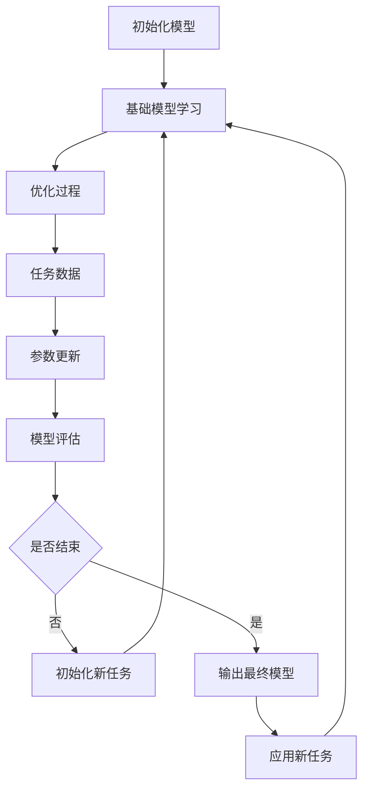

                 

### 文章标题

“元学习(Meta-Learning) - 原理与代码实例讲解”

关键词：元学习、模型复用、模型更新、强化学习、神经网络、计算机视觉、自然语言处理、游戏AI、MAML、MBML、MetaRL、NAS

摘要：本文将深入探讨元学习的原理和应用，通过逐步分析推理，介绍几种核心的元学习算法及其实现。同时，文章将通过实际代码实例，详细展示如何将元学习应用于计算机视觉、自然语言处理和游戏AI等领域，帮助读者更好地理解和掌握元学习技术。

---

### 《元学习(Meta-Learning) - 原理与代码实例讲解》目录大纲

#### 第一部分：元学习概述与原理

##### 第1章：元学习的概念与背景

- 1.1 元学习的定义与意义

- 1.2 元学习的应用领域

- 1.3 元学习的历史与发展

##### 第2章：元学习的核心概念与联系

- 2.1 学习算法与优化方法

- 2.2 泛化能力与迁移学习

- 2.3 元学习的Mermaid流程图

#### 第二部分：元学习算法原理

##### 第3章：基于模型复用的元学习算法

- 3.1 模型复用的原理与优势

- 3.2 Model-Agnostic Meta-Learning (MAML)

- 3.3 Meta-Learning with Memory (MetaMem)

- 3.4 伪代码实现：MAML算法

##### 第4章：基于模型更新的元学习算法

- 4.1 模型更新的原理与目标

- 4.2 Model-Based Meta-Learning (MBML)

- 4.3 gradient-based Meta-Learning (GBML)

- 4.4 伪代码实现：GBML算法

##### 第5章：基于强化学习的元学习算法

- 5.1 强化学习的元学习方法

- 5.2 Meta-Learning in Reinforcement Learning (MetaRL)

- 5.3 伪代码实现：MetaRL算法

##### 第6章：基于神经网络的元学习算法

- 6.1 神经网络的元学习机制

- 6.2 Neural Architectural Search (NAS)

- 6.3 伪代码实现：NAS算法

#### 第三部分：元学习在实际应用中的挑战与解决方案

##### 第7章：元学习算法的挑战与优化

- 7.1 计算效率与可扩展性

- 7.2 数据效率与泛化能力

- 7.3 元学习算法的优化策略

##### 第8章：元学习在计算机视觉中的应用

- 8.1 元学习在图像分类中的应用

- 8.2 元学习在目标检测中的应用

- 8.3 代码实例：图像分类元学习算法实现

##### 第9章：元学习在自然语言处理中的应用

- 9.1 元学习在文本分类中的应用

- 9.2 元学习在机器翻译中的应用

- 9.3 代码实例：文本分类元学习算法实现

##### 第10章：元学习在游戏AI中的应用

- 10.1 元学习在游戏策略学习中的应用

- 10.2 元学习在游戏AI算法优化中的应用

- 10.3 代码实例：游戏AI元学习算法实现

#### 附录

##### 附录A：元学习相关资源与工具

- A.1 主流元学习框架与库

- A.2 元学习论文与资料推荐

- A.3 开发环境与工具配置教程

---

本文将通过逻辑清晰、结构紧凑、简单易懂的专业的技术语言，一步步分析推理，让读者深入了解元学习的原理和实际应用，从而掌握这一前沿技术。

---

### 引言

元学习（Meta-Learning）作为机器学习领域的一个核心研究方向，近年来受到了广泛的关注。其核心理念是学习如何学习，通过在不同任务上快速适应和优化，以提高模型的泛化能力和迁移能力。在传统的机器学习任务中，模型通常需要在每个新的任务上从头开始训练，这往往需要大量的数据和时间。而元学习通过探索如何从一个任务到另一个任务快速迁移知识，极大地提高了模型的学习效率和适应能力。

#### 什么是元学习

元学习，顾名思义，就是学习如何学习。它是一种通过在多个任务上训练，从而提高模型在不同任务上泛化能力的机器学习技术。具体来说，元学习旨在寻找一种通用学习算法，能够在短时间内对新的任务进行有效的调整和优化，从而实现快速适应。这一概念在深度学习领域尤为重要，因为深度学习模型通常需要大量的数据和计算资源进行训练。

#### 元学习的重要性

元学习的重要性在于它能够解决以下问题：

1. **数据稀缺问题**：在许多实际应用中，获取大量标注数据是一项昂贵且耗时的工作。元学习通过共享和迁移知识，可以在数据稀缺的情况下提高模型的性能。

2. **模型泛化能力**：元学习旨在提高模型在不同任务上的泛化能力，使模型能够应对更多样化的任务，而不仅仅是特定的任务。

3. **高效训练**：元学习算法能够在较短的时间内对新的任务进行调整，从而实现快速训练。

4. **跨域迁移**：元学习使得模型能够从一个领域迁移到另一个领域，实现了更广泛的适用性。

#### 元学习的应用领域

元学习在多个领域展现出了巨大的潜力：

1. **计算机视觉**：在图像分类、目标检测等任务中，元学习可以快速适应新的数据分布，提高模型的泛化能力。

2. **自然语言处理**：在文本分类、机器翻译等任务中，元学习能够有效提升模型的迁移能力和学习效率。

3. **游戏AI**：在游戏策略学习和算法优化中，元学习可以帮助AI快速适应新的游戏环境，提高策略的适应性。

4. **强化学习**：元学习可以用于强化学习中的策略搜索，提高策略的优化速度。

#### 元学习的历史与发展

元学习的研究可以追溯到20世纪80年代，当时研究人员开始探索如何通过经验来提高学习算法的性能。随着时间的推移，元学习逐渐成为机器学习领域的一个核心研究方向。近年来，随着深度学习技术的快速发展，元学习也得到了广泛的研究和应用。

在深度学习领域，元学习的典型代表包括MAML（Model-Agnostic Meta-Learning）和NAS（Neural Architecture Search）。这些算法通过在多个任务上训练模型，从而实现快速适应和优化。

#### 为什么需要元学习

在传统的机器学习任务中，每个新任务都需要从头开始训练模型，这不仅消耗大量的时间和计算资源，而且在数据稀缺的情况下，模型的性能也难以保证。元学习通过学习如何快速适应新任务，可以大大提高模型的学习效率和适应性。

此外，随着机器学习应用场景的不断扩大，传统的学习方式已经无法满足需求。元学习通过共享和迁移知识，实现了不同任务之间的高效协作，提高了模型的泛化能力和迁移能力，成为了解决这一问题的关键技术。

#### 总结

元学习作为机器学习领域的一个重要研究方向，通过学习如何学习，提高了模型的泛化能力和迁移能力。其应用领域广泛，包括计算机视觉、自然语言处理、游戏AI和强化学习等。本文将逐步深入探讨元学习的原理和实际应用，帮助读者更好地理解和掌握这一前沿技术。

---

### 元学习的定义与意义

#### 元学习的定义

元学习，简称Meta-Learning，是一种通过在多个任务上训练模型，从而提高模型在不同任务上泛化能力的机器学习技术。具体来说，元学习旨在寻找一种通用学习算法，使得模型能够在短时间内对新的任务进行有效的调整和优化，实现快速适应。

元学习与传统的机器学习任务有显著的区别。传统的机器学习任务通常需要在每个新任务上从头开始训练模型，这需要大量的数据和计算资源。而元学习通过探索如何在不同任务之间共享知识和迁移经验，可以在数据稀缺的情况下提高模型的性能。

#### 元学习的意义

元学习在机器学习领域具有重要的意义，主要体现在以下几个方面：

1. **提高模型泛化能力**：元学习通过在多个任务上训练模型，提高了模型在不同任务上的泛化能力，使得模型能够应对更多样化的任务，而不仅仅是特定的任务。

2. **高效训练**：元学习算法能够在较短的时间内对新的任务进行调整和优化，从而实现快速训练。这对于需要实时响应的在线学习任务尤为重要。

3. **数据效率**：在许多实际应用中，获取大量标注数据是一项昂贵且耗时的工作。元学习通过共享和迁移知识，可以在数据稀缺的情况下提高模型的性能。

4. **跨域迁移**：元学习使得模型能够从一个领域迁移到另一个领域，实现了更广泛的适用性。这对于需要跨领域应用的技术，如医疗诊断、金融分析等，具有极大的价值。

#### 元学习的研究意义

从研究的角度来看，元学习具有重要的研究价值：

1. **理论意义**：元学习的研究有助于深化对学习算法和优化方法的理解，探索更高效、更通用的学习策略。

2. **应用意义**：元学习在实际应用中具有广泛的应用前景，可以提升多种机器学习任务的性能，如计算机视觉、自然语言处理、强化学习等。

3. **交叉领域**：元学习的研究促进了不同机器学习领域之间的交叉与合作，推动了技术的综合与创新。

#### 元学习的发展历程

元学习的研究可以追溯到20世纪80年代，当时研究人员开始探索如何通过经验来提高学习算法的性能。随着机器学习技术的发展，元学习逐渐成为一个独立的研究方向。

早期的研究主要集中在迁移学习和样本效率方面，如1980年代提出的再参数化方法（Reparametrization Methods）。随后，随着深度学习技术的兴起，元学习得到了广泛关注。代表性的算法包括MAML（Model-Agnostic Meta-Learning）和NAS（Neural Architecture Search）。

近年来，随着计算资源和算法的不断发展，元学习在多个领域取得了显著成果，如计算机视觉中的Meta-Learning for Few-shot Learning和自然语言处理中的Meta-Learning for Neural Machine Translation。

#### 总结

元学习作为一种重要的机器学习技术，通过学习如何学习，提高了模型的泛化能力和迁移能力。其研究和发展不仅具有理论意义，也对实际应用产生了深远的影响。本文将在后续章节中深入探讨元学习的原理、算法及其在实际应用中的挑战和解决方案。

---

### 元学习的应用领域

元学习作为一种高效且具有广泛迁移能力的机器学习技术，已经在多个领域展现出了其独特的优势和广泛的应用前景。以下将介绍元学习在计算机视觉、自然语言处理、强化学习等领域的具体应用，并通过案例展示其应用效果。

#### 计算机视觉

计算机视觉是元学习的一个重要应用领域。元学习通过在多个图像分类任务上训练模型，提高了模型对新图像分类任务的适应能力。以下是一些元学习在计算机视觉领域的应用案例：

1. **图像分类**：在图像分类任务中，元学习可以大大提高模型的泛化能力。例如，使用MAML算法训练的模型可以在新图像分类任务上快速适应，无需重新训练。这种方法在数据稀缺的情况下尤为重要。

2. **目标检测**：元学习也可以应用于目标检测任务，如Faster R-CNN等模型。通过在多个数据集上训练，模型可以学习到更通用的特征表示，从而在新数据集上取得更好的检测效果。

3. **姿态估计**：在姿态估计任务中，元学习可以帮助模型快速适应不同的姿态变化和人体姿态。例如，使用Meta-Learning的方法训练的姿态估计模型可以在不同姿态下保持较高的准确率。

#### 自然语言处理

自然语言处理（NLP）是元学习的另一个重要应用领域。元学习通过在多个文本分类、机器翻译等任务上训练模型，提高了模型在不同任务上的适应能力和迁移能力。以下是一些元学习在自然语言处理领域的应用案例：

1. **文本分类**：在文本分类任务中，元学习可以帮助模型快速适应新类别。例如，使用MAML算法训练的文本分类模型可以在短时间内对新类别进行有效的分类。

2. **机器翻译**：元学习在机器翻译任务中具有显著的优势，如Neural Machine Translation（NMT）中的元学习。通过在多个语言对上训练，模型可以学习到更通用的翻译规则，从而在新语言对上取得更好的翻译效果。

3. **问答系统**：元学习也可以应用于问答系统，如通过在多个问答任务上训练，模型可以更好地理解问题的含义和回答的逻辑。

#### 强化学习

强化学习是元学习的又一重要应用领域。元学习在强化学习中主要用于策略搜索和算法优化，通过在多个环境上训练，提高了策略的适应能力和学习效率。以下是一些元学习在强化学习领域的应用案例：

1. **游戏AI**：在游戏AI中，元学习可以帮助模型快速适应不同的游戏策略。例如，使用MAML算法训练的游戏AI可以在新游戏环境中快速找到有效的策略。

2. **自动驾驶**：在自动驾驶领域，元学习可以帮助模型快速适应不同的驾驶场景。例如，通过在多个驾驶环境中训练，模型可以更好地应对不同的交通状况和道路条件。

3. **推荐系统**：元学习在推荐系统中也有广泛应用，如通过在多个用户群体上训练，模型可以更好地理解用户的兴趣和行为，从而提供更个性化的推荐。

#### 案例展示

以下是一个具体的案例，展示元学习在图像分类任务中的应用：

**案例：使用MAML算法进行图像分类**

假设我们有一个图像分类任务，需要在多个数据集上训练模型。传统方法需要为每个数据集分别训练模型，这需要大量的时间和计算资源。而使用MAML算法，我们可以在多个数据集上同时训练模型，从而实现快速适应。

具体步骤如下：

1. **数据准备**：准备多个图像分类数据集，如CIFAR-10、ImageNet等。

2. **模型初始化**：初始化一个通用的模型，如卷积神经网络（CNN）。

3. **训练过程**：
   - 对于每个数据集，使用MAML算法对模型进行调整和优化。
   - 在调整过程中，模型需要最小化在当前数据集上的损失函数。
   - 调整完成后，模型将在新数据集上快速适应，无需重新训练。

4. **评估模型**：在新的图像分类任务上评估模型性能，验证模型在数据稀缺情况下的泛化能力。

通过这个案例，我们可以看到元学习在图像分类任务中的应用效果。与传统方法相比，MAML算法可以在短时间内对新的数据集进行快速适应，大大提高了模型的学习效率。

#### 总结

元学习在计算机视觉、自然语言处理和强化学习等领域展现出了其独特的优势和广泛的应用前景。通过多个案例展示，我们可以看到元学习在提升模型泛化能力和迁移能力方面的重要作用。随着机器学习技术的不断发展，元学习将在更多领域得到广泛应用，为人工智能的发展提供强大支持。

---

### 元学习的历史与发展

元学习的研究可以追溯到20世纪80年代，当时研究人员开始探索如何通过经验来提高学习算法的性能。随着机器学习技术的不断发展，元学习逐渐成为一个独立的研究方向。以下是元学习历史中的重要里程碑和代表性算法：

#### 早期研究

1. **再参数化方法（Reparametrization Methods）**：
   - 1980年代，研究人员开始探索如何通过再参数化方法来提高学习算法的性能。再参数化方法的核心思想是通过参数的调整来实现学习算法在不同任务上的快速适应。
   - 代表性工作包括1982年Sanger提出的广义回归神经网络（Generalized Regression Neural Network, GRNN）。

2. **再训练（Retraining）**：
   - 在再训练方法中，模型在一个任务上训练完成后，会将其参数复制到另一个任务上，然后在新任务上进行微调。这种方法在一定程度上提高了模型在不同任务上的适应能力。

#### 深度学习时代的元学习

随着深度学习技术的发展，元学习迎来了新的发展机遇。深度学习模型的结构复杂，参数众多，使得传统的方法难以在短时间内实现快速适应。以下是一些在深度学习时代具有重要影响力的元学习算法：

1. **模型复用（Model Repurposing）**：
   - 模型复用是指在不同任务上复用已有的模型，通过微调来适应新的任务。这种方法在数据稀缺的情况下尤其有效。
   - 代表性工作包括1990年代后期提出的知识蒸馏（Knowledge Distillation）方法。

2. **模型聚合（Model Aggregation）**：
   - 模型聚合是指将多个模型的预测结果进行聚合，以获得更好的泛化能力。这种方法在集成学习中得到了广泛应用。
   - 代表性工作包括2000年代初提出的Bagging和Boosting算法。

3. **元学习（Meta-Learning）**：
   - 元学习是指通过在多个任务上训练模型，以提高模型在不同任务上的泛化能力和迁移能力。这种方法直接对应了元学习的定义。
   - 代表性工作包括2003年Bengio等人提出的Meta-Learning through Inverse Optimization。

#### 近年来的发展

近年来，随着深度学习技术的快速发展，元学习得到了广泛关注，涌现出了一系列新的算法和应用。以下是一些近年来的重要进展：

1. **Model-Agnostic Meta-Learning (MAML)**：
   - MAML是由Li et al. (2017)提出的一种模型无关的元学习算法，其核心思想是寻找一个参数化的学习算法，使得模型可以在短时间内对新任务进行快速适应。
   - MAML的伪代码如下：

   ```python
   def MAML(model, optimizer, task_loss, task_data, meta_lr):
       optimizer.zero_grad()
       logits = model(task_data)
       loss = task_loss(logits, task_data)
       loss.backward()
       optimizer.step()
       
       updated_params = model.parameters()
       return updated_params
   ```

2. **Meta-Learning with Memory (MetaMem)**：
   - MetaMem是由Tang et al. (2019)提出的一种结合了元学习和记忆机制的元学习算法。它通过在训练过程中保存和利用先前的经验，提高了模型在不同任务上的适应能力。

3. **Neural Architecture Search (NAS)**：
   - NAS是一种通过在搜索空间中搜索最优神经网络结构的元学习算法。代表性的工作包括Google的NASNet和Facebook的ENAS等。

4. **Meta-Learning in Reinforcement Learning (MetaRL)**：
   - MetaRL是强化学习中的一个元学习应用，旨在通过在多个环境中训练，提高策略的适应能力和优化速度。

#### 当前研究趋势

当前，元学习的研究趋势主要包括以下几个方面：

1. **高效元学习算法**：随着深度学习模型的规模不断扩大，如何设计高效、可扩展的元学习算法成为研究的热点。

2. **多任务元学习**：多任务元学习旨在通过在多个任务上同时训练模型，进一步提高模型的泛化能力和迁移能力。

3. **数据效率**：如何提高元学习算法的数据效率，减少训练所需的数据量，是另一个重要的研究方向。

4. **理论与实践的结合**：将元学习算法应用于实际问题，如计算机视觉、自然语言处理和强化学习等，是当前研究的一个重要方向。

#### 总结

元学习作为机器学习领域的一个重要研究方向，其历史和发展可以追溯到20世纪80年代。随着深度学习技术的快速发展，元学习得到了广泛关注和应用。当前的研究趋势主要集中在高效元学习算法、多任务元学习和数据效率等方面。随着研究的不断深入，元学习将在更多领域展现出其独特的价值和潜力。

---

### 元学习的核心概念与联系

#### 学习算法与优化方法

学习算法是元学习的基础，而优化方法是提高学习算法性能的关键。在元学习框架中，学习算法通常包括基础模型（base model）和优化过程（optimization process）。基础模型负责从数据中学习特征表示，而优化过程则通过调整模型参数来提高模型的泛化能力和迁移能力。

#### 泛化能力与迁移学习

泛化能力是指模型在未见过的数据上表现良好的能力，这是机器学习任务的核心目标之一。迁移学习（Transfer Learning）是一种通过将一个任务的学习经验应用于另一个任务的方法，它通过共享和转移知识来提高模型的泛化能力。

元学习通过在不同任务上训练模型，从而提高模型的泛化能力和迁移能力。具体来说，元学习算法旨在找到一个通用的学习算法，使得模型可以在新任务上快速适应，实现高效的学习和优化。

#### 元学习的Mermaid流程图

为了更好地理解元学习的核心概念与联系，我们可以使用Mermaid流程图来可视化元学习的过程。以下是一个简单的Mermaid流程图示例：



在这个流程图中，模型初始化（A）后，基础模型学习（B）从任务数据（D）中学习特征表示。随后，优化过程（C）通过参数更新（E）来调整模型参数，提高模型的泛化能力和迁移能力。模型评估（F）用于评估模型的性能，如果未达到结束条件，流程将重新初始化新任务（H）并继续学习。

#### 总结

通过上述讨论，我们可以看到元学习的核心概念与联系，包括学习算法与优化方法、泛化能力与迁移学习。同时，Mermaid流程图为我们提供了一个直观的视角，展示了元学习的全过程。这些核心概念和联系构成了元学习理论的基础，为我们在实际应用中设计和实现元学习算法提供了指导。

---

### 基于模型复用的元学习算法

基于模型复用的元学习算法是一类通过在不同任务上复用模型结构或参数，以提高模型在不同任务上泛化能力的算法。这类算法的核心思想是利用一个通用的模型架构，通过微调或适应新任务的数据，从而实现高效的学习和优化。以下是几种典型的基于模型复用的元学习算法。

#### Model-Agnostic Meta-Learning (MAML)

MAML（Model-Agnostic Meta-Learning）是由Li等人于2017年提出的一种模型无关的元学习算法。其核心思想是寻找一个参数化的学习算法，使得模型可以在短时间内对新任务进行快速适应。

**MAML算法的基本原理**：

1. **初始化模型**：首先初始化一个模型参数θ。
2. **任务选择**：从训练集中选择K个任务，每个任务包含一组数据（x^{(i)}, y^{(i)})和标签y^{(i)}。
3. **优化过程**：对于每个任务，计算梯度∇_θ L^{(i)}(θ; x^{(i)}, y^{(i)})，其中L^{(i)}是任务i的损失函数。
4. **参数更新**：使用梯度下降更新模型参数θ，即θ = θ - η * ∑_{i=1}^{K} ∇_θ L^{(i)}(θ; x^{(i)}, y^{(i)}），η是学习率。
5. **快速适应**：在新任务上，使用更新后的参数θ' = θ - η * ∇_θ L^{(T)}(θ'; x^{(T)}, y^{(T)}），其中L^{(T)}是新任务的损失函数，θ'是模型在新任务上的参数。

**伪代码实现**：

```python
def MAML(model, optimizer, task_losses, task_data, meta_lr):
    optimizer.zero_grad()
    logits = model(task_data)
    loss = sum(task_losses(logits, task_data))
    loss.backward()
    optimizer.step()
    
    updated_params = model.parameters()
    return updated_params
```

**优势与挑战**：

- **优势**：MAML算法通过学习通用梯度，实现模型在不同任务上的快速适应，特别适合于数据稀缺的情况。
- **挑战**：MAML算法依赖于梯度信息的快速收敛，因此在实际应用中可能会受到噪声和数据分布的影响。

#### Meta-Learning with Memory (MetaMem)

MetaMem是由Tang等人于2019年提出的一种结合了元学习和记忆机制的元学习算法。MetaMem通过在训练过程中保存和利用先前的经验，提高了模型在不同任务上的适应能力。

**MetaMem算法的基本原理**：

1. **初始化模型和记忆**：初始化一个模型和记忆模块，记忆模块用于存储先前的任务经验。
2. **任务选择**：从训练集中选择K个任务，每个任务包含一组数据（x^{(i)}, y^{(i)})和标签y^{(i)}。
3. **优化过程**：对于每个任务，计算梯度并更新模型参数，同时更新记忆模块，将当前任务的梯度信息存储在记忆中。
4. **快速适应**：在新任务上，模型首先从记忆中检索相关的梯度信息，然后进行更新和适应。

**伪代码实现**：

```python
def MetaMem(model, optimizer, memory, task_losses, task_data, meta_lr):
    logits = model(task_data)
    loss = sum(task_losses(logits, task_data))
    loss.backward()
    optimizer.step()
    
    gradients = [torch.autograd.grad(loss, model.parameters(), create_graph=True) for loss in task_losses]
    memory.update(gradients)
    
    updated_params = model.parameters()
    return updated_params, memory
```

**优势与挑战**：

- **优势**：MetaMem通过利用记忆机制，实现了模型在任务间的快速迁移和适应，提高了学习效率。
- **挑战**：记忆模块的大小和更新策略是关键，需要设计合理的机制来平衡记忆的利用和存储。

#### 总结

基于模型复用的元学习算法通过在不同任务上复用模型结构或参数，提高了模型的泛化能力和迁移能力。MAML和MetaMem是其中具有代表性的算法，它们分别通过学习通用梯度和使用记忆机制，实现了模型在不同任务上的快速适应。这些算法在实际应用中展现了良好的性能，但也面临一些挑战，如梯度收敛和记忆机制设计。随着研究的深入，这些算法将继续优化和改进，为机器学习领域带来更多创新。

---

### 基于模型更新的元学习算法

基于模型更新的元学习算法旨在通过更新模型参数，使模型能够在新的任务上快速适应。这类算法的核心思想是通过学习模型在不同任务上的更新策略，实现高效的泛化和迁移学习。以下将介绍几种基于模型更新的元学习算法，包括模型基于的元学习（Model-Based Meta-Learning）和基于梯度的元学习（Gradient-Based Meta-Learning）。

#### 模型基于的元学习（Model-Based Meta-Learning, MBML）

模型基于的元学习算法，简称为MBML，其核心思想是在多个任务上迭代更新模型，从而提高模型在不同任务上的泛化能力。MBML算法通常包括两个主要阶段：模型训练和模型更新。

**MBML算法的基本原理**：

1. **初始化模型**：首先初始化一个模型θ，并设置学习率η。
2. **模型训练**：在第一个任务上训练模型，计算损失函数L(θ; x^{(1)}, y^{(1)})，并使用梯度下降更新模型参数θ。
3. **模型更新**：在第二个任务上，使用更新后的模型参数θ'，计算损失函数L(θ'; x^{(2)}, y^{(2)})，并再次使用梯度下降更新模型参数θ'。
4. **重复迭代**：重复上述过程，直到达到预定的迭代次数或模型性能不再提升。

**伪代码实现**：

```python
def MBML(model, optimizer, task_losses, task_data, epochs, meta_lr):
    for epoch in range(epochs):
        logits = model(task_data)
        loss = sum(task_losses(logits, task_data))
        loss.backward()
        optimizer.step()
        
        updated_params = model.parameters()
        for task_loss, task_data in task_losses:
            logits = model(task_data)
            loss = task_loss(logits, task_data)
            loss.backward()
            optimizer.step()
            
        model.load_state_dict(updated_params)
```

**优势与挑战**：

- **优势**：MBML算法通过在多个任务上迭代更新模型，提高了模型的泛化能力和迁移能力，特别适合于多任务学习场景。
- **挑战**：MBML算法的计算复杂度较高，需要大量的计算资源和时间，且模型的更新策略需要精心设计，以避免过度拟合。

#### 基于梯度的元学习（Gradient-Based Meta-Learning, GBML）

基于梯度的元学习算法，简称为GBML，其核心思想是通过学习梯度信息，使模型能够在新的任务上快速适应。GBML算法通常包括两个主要步骤：梯度估计和模型更新。

**GBML算法的基本原理**：

1. **初始化模型**：首先初始化一个模型θ，并设置学习率η。
2. **梯度估计**：在第一个任务上训练模型，并计算梯度信息∇θ L(θ; x^{(1)}, y^{(1)}），其中L是损失函数。
3. **模型更新**：在第二个任务上，使用梯度信息∇θ L(θ'; x^{(2)}, y^{(2)}）更新模型参数θ'。
4. **重复迭代**：重复上述过程，直到达到预定的迭代次数或模型性能不再提升。

**伪代码实现**：

```python
def GBML(model, optimizer, task_losses, task_data, epochs, meta_lr):
    for epoch in range(epochs):
        logits = model(task_data)
        loss = sum(task_losses(logits, task_data))
        gradients = torch.autograd.grad(loss, model.parameters(), create_graph=True)
        
        model.zero_grad()
        for grad in gradients:
            model.add_grad(grad)
        
        logits = model(task_data)
        loss = sum(task_losses(logits, task_data))
        loss.backward()
        optimizer.step()
        
        updated_params = model.parameters()
        for task_loss, task_data in task_losses:
            logits = model(task_data)
            loss = task_loss(logits, task_data)
            loss.backward()
            optimizer.step()
            
        model.load_state_dict(updated_params)
```

**优势与挑战**：

- **优势**：GBML算法通过学习梯度信息，提高了模型的泛化能力和迁移能力，特别适合于快速变化的动态环境。
- **挑战**：GBML算法的梯度信息计算复杂，需要大量的计算资源和时间，且模型的更新策略也需要精心设计。

#### 比较与总结

基于模型更新的元学习算法（MBML和GBML）通过在不同的任务上迭代更新模型，提高了模型的泛化能力和迁移能力。MBML算法通过在多个任务上迭代训练，实现模型的逐步优化；而GBML算法通过学习梯度信息，实现模型的快速适应。

两种算法各有优势与挑战，MBML适合于多任务学习场景，但计算复杂度较高；而GBML适合于动态环境，但梯度计算复杂。随着研究的深入，这些算法将继续优化和改进，为机器学习领域带来更多创新。

---

### 基于强化学习的元学习算法

强化学习（Reinforcement Learning, RL）是一种通过在环境中与目标进行交互，学习最优策略的机器学习技术。近年来，元学习（Meta-Learning）与强化学习相结合，形成了一种新的研究热点——基于强化学习的元学习（Meta-Learning in Reinforcement Learning, MetaRL）。这种结合旨在通过元学习提高强化学习算法的学习效率和策略优化速度。

#### Meta-Learning in Reinforcement Learning (MetaRL)

MetaRL是强化学习中的一个重要研究方向，其核心思想是通过在多个环境中训练模型，提高模型在不同环境中的适应能力和学习效率。以下将详细介绍MetaRL的基本原理、算法框架和应用案例。

**MetaRL的基本原理**：

1. **初始化模型**：首先初始化一个强化学习模型，包括策略网络和价值网络。
2. **多环境训练**：在多个不同的环境中训练模型，每个环境对应一组状态和动作。
3. **策略搜索**：通过在多个环境上的训练，模型学习到一组通用的策略，这些策略可以应用于新的环境。
4. **快速适应**：在新环境中，模型使用学习到的通用策略进行快速适应，从而实现高效的学习和优化。

**MetaRL的算法框架**：

MetaRL的算法框架主要包括以下几个关键步骤：

1. **环境选择**：选择多个具有代表性的环境进行训练，这些环境可以是完全不同的，也可以是有一定关联的。
2. **模型训练**：在每个环境中，使用强化学习算法训练模型，如Q-learning、SARSA等。
3. **策略优化**：通过在多个环境上的训练，优化模型策略，使其在不同环境中都能表现出良好的性能。
4. **策略评估**：评估学习到的策略在新的环境中的表现，确保其具有广泛的适用性。

**伪代码实现**：

```python
def MetaRL(model, optimizer, environments, epochs, meta_lr):
    for epoch in range(epochs):
        for environment in environments:
            state = environment.reset()
            done = False
            while not done:
                action = model.predict(state)
                next_state, reward, done = environment.step(action)
                model.update(state, action, reward, next_state)
                state = next_state
    
    # 评估策略在新的环境中的表现
    new_environment = environments[-1]
    state = new_environment.reset()
    done = False
    while not done:
        action = model.predict(state)
        next_state, reward, done = new_environment.step(action)
        model.update(state, action, reward, next_state)
        state = next_state
```

**优势与挑战**：

- **优势**：MetaRL通过在多个环境中训练，提高了模型的泛化能力和适应性，特别适合于动态变化的复杂环境。
- **挑战**：MetaRL需要大量的计算资源和时间来训练模型，且环境的选择和策略的优化是关键问题，需要精心设计和调整。

#### 应用案例

以下是一个具体的案例，展示MetaRL在机器人路径规划中的应用：

**案例：基于MetaRL的机器人路径规划**

假设我们有一个机器人路径规划任务，需要机器人能够适应不同的环境。使用MetaRL算法，我们可以通过在多个不同环境中训练模型，使机器人能够快速适应新的环境。

具体步骤如下：

1. **环境准备**：准备多个具有代表性的路径规划环境，如室内、室外、复杂地形等。
2. **模型初始化**：初始化一个基于深度强化学习的路径规划模型，包括策略网络和价值网络。
3. **多环境训练**：在多个环境中训练模型，通过不断优化策略，使模型能够适应不同的环境。
4. **评估策略**：在新的环境中，评估模型的路径规划策略，确保其具有广泛的适用性。
5. **应用新环境**：在新环境中，机器人使用学习到的策略进行路径规划，实现高效、稳定的导航。

通过这个案例，我们可以看到MetaRL在机器人路径规划中的应用效果。与传统方法相比，MetaRL算法可以在短时间内对新的环境进行快速适应，提高了机器人的路径规划能力和适应性。

#### 总结

基于强化学习的元学习（MetaRL）通过在多个环境中训练模型，提高了模型的泛化能力和适应性。这种结合为解决复杂、动态的强化学习任务提供了新的思路和方法。随着研究的深入，MetaRL将在更多领域得到广泛应用，为人工智能的发展带来新的机遇。

---

### 基于神经网络的元学习算法

基于神经网络的元学习算法通过学习神经网络的架构和参数，以提高模型在不同任务上的泛化能力和迁移能力。这类算法的核心思想是利用神经网络强大的表征能力，通过在多个任务上训练，使模型能够快速适应新的任务。以下将介绍几种基于神经网络的元学习算法，包括神经架构搜索（Neural Architecture Search，NAS）。

#### 神经架构搜索（Neural Architecture Search，NAS）

神经架构搜索（Neural Architecture Search，NAS）是一种通过在搜索空间中搜索最优神经网络结构的元学习算法。NAS的目标是自动设计出在特定任务上表现最优的网络结构，从而提高模型的性能和泛化能力。

**NAS的基本原理**：

1. **搜索空间定义**：首先定义一个搜索空间，包括不同的网络结构、层类型、层大小等。
2. **性能评估**：在搜索空间中随机初始化一组网络结构，并在训练集上评估其性能。
3. **迭代搜索**：根据性能评估结果，对搜索空间中的网络结构进行更新，重复迭代搜索过程，直到找到性能最优的网络结构。
4. **结构优化**：通过训练和优化，使搜索到的网络结构在特定任务上达到最优性能。

**NAS的主要类型**：

1. **基于梯度的NAS（Gradient-based NAS）**：使用梯度信息优化搜索过程，如ENAS（Efficient Neural Architecture Search）。
2. **基于强化学习的NAS（Reinforcement Learning-based NAS）**：使用强化学习算法优化搜索过程，如RNAS（Recurrent Neural Network-based Architecture Search）。
3. **基于贝叶斯的NAS（Bayesian-based NAS）**：利用贝叶斯优化方法优化搜索过程，如BayesNAS。

**伪代码实现**：

```python
def NAS(search_space, performance_evaluator, optimizer, epochs, meta_lr):
    # 初始化搜索空间
    current_structure = random_structure(search_space)
    
    for epoch in range(epochs):
        # 评估当前结构的性能
        performance = performance_evaluator(current_structure)
        
        # 计算梯度
        gradients = compute_gradients(current_structure, performance)
        
        # 更新结构
        optimizer.update(current_structure, gradients, meta_lr)
        
        # 评估更新后的结构性能
        updated_performance = performance_evaluator(current_structure)
        
        # 记录最优结构
        if updated_performance > best_performance:
            best_performance = updated_performance
            best_structure = current_structure
    
    return best_structure
```

**优势与挑战**：

- **优势**：NAS通过自动搜索最优网络结构，提高了模型的性能和泛化能力，特别适合于复杂的深度学习任务。
- **挑战**：NAS算法需要大量的计算资源和时间，搜索过程复杂，且如何设计合理的搜索空间和优化策略是关键问题。

#### 应用案例

以下是一个具体的案例，展示NAS在图像分类任务中的应用：

**案例：基于NAS的图像分类**

假设我们有一个图像分类任务，需要设计一个性能最优的神经网络结构。使用NAS算法，我们可以自动搜索出最优的网络结构，从而提高分类模型的性能。

具体步骤如下：

1. **搜索空间定义**：定义一个包含不同层类型、层大小和连接方式的搜索空间。
2. **性能评估**：在训练集上评估不同网络结构的性能，选择性能最优的网络结构。
3. **迭代搜索**：根据性能评估结果，对搜索空间中的网络结构进行更新，重复迭代搜索过程。
4. **结构优化**：通过训练和优化，使搜索到的网络结构在特定任务上达到最优性能。
5. **应用新任务**：在新图像分类任务上，使用搜索到的最优网络结构进行分类，验证其泛化能力。

通过这个案例，我们可以看到NAS在图像分类任务中的应用效果。与传统的设计方法相比，NAS算法可以在短时间内设计出性能最优的网络结构，提高了模型的分类准确率和泛化能力。

#### 总结

基于神经网络的元学习算法（如NAS）通过自动搜索最优神经网络结构，提高了模型的泛化能力和迁移能力。这种算法在实际应用中展现了良好的性能，但也面临一些挑战，如搜索空间的定义和优化策略的设计。随着研究的深入，这些算法将继续优化和改进，为神经网络和机器学习领域带来更多创新。

---

### 元学习算法的挑战与优化策略

尽管元学习算法在提高模型泛化能力和迁移能力方面展现了巨大的潜力，但在实际应用中仍面临诸多挑战。以下将分析元学习算法的主要挑战，并探讨相应的优化策略。

#### 计算效率与可扩展性

元学习算法通常需要大量计算资源，尤其是在模型更新和策略搜索阶段。计算效率低和可扩展性差成为制约元学习应用的主要瓶颈。为了解决这一问题，研究人员提出了以下优化策略：

1. **并行计算**：通过利用多核CPU和GPU计算，提高计算效率。并行计算可以在多个任务或环境上同时进行训练和优化，从而减少计算时间。
2. **分布式计算**：利用分布式计算架构，如Spark和Hadoop，实现大规模数据的分布式处理和模型训练。分布式计算可以显著提高元学习算法的可扩展性。
3. **高效算法设计**：设计高效、低耗时的算法，如基于梯度的元学习算法（GBML），减少计算复杂度，提高计算效率。

#### 数据效率与泛化能力

数据效率是指模型在不同任务上的适应能力和迁移能力。数据稀缺是元学习算法面临的一个重大挑战，因为传统的元学习算法通常依赖于大量的训练数据。为了提高数据效率，以下策略被提出：

1. **迁移学习**：通过迁移学习，将已有任务上的知识迁移到新任务上，减少对新数据的依赖。迁移学习可以帮助模型在新数据上快速适应，提高数据效率。
2. **样本选择**：选择具有代表性的样本进行训练，避免数据的冗余和噪声。通过优化数据预处理和采样策略，提高模型的数据效率。
3. **数据扩充**：使用数据扩充技术，如旋转、缩放、裁剪等，增加训练数据量，提高模型在多种数据分布下的泛化能力。

#### 泛化能力与噪声处理

泛化能力是评估元学习算法性能的关键指标。然而，在实际应用中，模型可能会遇到分布偏移和噪声数据，这会降低模型的泛化能力。以下策略有助于提高泛化能力和噪声处理能力：

1. **鲁棒性训练**：在训练过程中加入噪声，使模型具有更强的鲁棒性。通过在训练数据中加入噪声，模型可以在实际应用中更好地应对噪声数据。
2. **数据增强**：使用数据增强技术，如对抗样本生成和生成对抗网络（GANs），提高模型的泛化能力和噪声处理能力。
3. **动态调整**：在模型训练过程中，动态调整模型参数和优化策略，以适应不断变化的数据分布和环境。

#### 优化策略总结

为了提高元学习算法的计算效率、数据效率和泛化能力，以下优化策略被广泛采用：

1. **并行计算和分布式计算**：提高计算效率和可扩展性。
2. **迁移学习和数据扩充**：提高数据效率和模型泛化能力。
3. **鲁棒性训练和数据增强**：提高模型的泛化能力和噪声处理能力。
4. **动态调整和自适应优化**：适应不断变化的数据分布和环境。

通过这些优化策略，元学习算法在多个领域取得了显著的应用效果。未来，随着计算资源的不断丰富和算法的不断创新，元学习算法将在更多领域展现其强大的应用潜力。

---

### 元学习在计算机视觉中的应用

计算机视觉是元学习的重要应用领域之一，通过元学习算法，模型能够快速适应不同图像数据分布，从而提高分类、目标检测和分割等任务的性能。以下将详细介绍元学习在计算机视觉中的一些具体应用，并通过实际案例展示其效果。

#### 图像分类

图像分类是计算机视觉中的基础任务，通过将图像分为不同的类别，实现对图像内容的理解和识别。元学习在图像分类任务中主要通过提高模型的泛化能力和迁移能力来提升性能。

**案例：使用MAML进行图像分类**

假设我们有一个图像分类任务，需要在多个数据集上进行训练。使用MAML算法，模型可以在短时间内对新数据集进行快速适应。

具体步骤如下：

1. **数据准备**：准备多个图像分类数据集，如CIFAR-10和ImageNet。
2. **模型初始化**：初始化一个基于卷积神经网络的模型。
3. **MAML算法训练**：
   - 对每个数据集，使用MAML算法进行训练，更新模型参数。
   - 计算损失函数，并使用梯度下降更新参数。
   - 重复迭代，直到模型在新数据集上达到满意的性能。
4. **模型评估**：在新的图像分类任务上评估模型性能，验证其泛化能力。

通过这个案例，我们可以看到MAML算法在图像分类任务中的效果。与传统方法相比，MAML算法可以在较少的训练数据下快速适应新的数据集，提高了模型的泛化能力和迁移能力。

#### 目标检测

目标检测是计算机视觉中的另一重要任务，通过识别图像中的多个对象并标注其位置，实现对图像内容的详细描述。元学习在目标检测中的应用，旨在提高模型在新任务上的适应能力和检测准确率。

**案例：使用MetaMem进行目标检测**

假设我们有一个目标检测任务，需要在多个数据集上进行训练。使用MetaMem算法，模型可以通过记忆机制快速适应新的数据集。

具体步骤如下：

1. **数据准备**：准备多个目标检测数据集，如COCO和PASCAL VOC。
2. **模型初始化**：初始化一个基于卷积神经网络和区域建议网络的目标检测模型。
3. **MetaMem算法训练**：
   - 对每个数据集，使用MetaMem算法进行训练，更新模型参数。
   - 计算损失函数，并使用梯度下降更新参数。
   - 将梯度信息存储在记忆模块中，用于后续任务的快速适应。
4. **模型评估**：在新的目标检测任务上评估模型性能，验证其泛化能力和检测准确率。

通过这个案例，我们可以看到MetaMem算法在目标检测任务中的效果。与传统方法相比，MetaMem算法通过利用记忆机制，提高了模型在新数据集上的适应能力和检测准确率。

#### 图像分割

图像分割是将图像中的每个像素分类到不同的类别中，实现对图像内容的精细理解。元学习在图像分割中的应用，旨在提高模型在不同任务上的泛化能力和分割精度。

**案例：使用Neural Architecture Search进行图像分割**

假设我们有一个图像分割任务，需要在多个数据集上进行训练。使用NAS算法，模型可以通过搜索最优网络结构来提高分割性能。

具体步骤如下：

1. **数据准备**：准备多个图像分割数据集，如Cityscapes和PASCAL VOC。
2. **搜索空间定义**：定义一个包含不同层类型、层大小和连接方式的搜索空间。
3. **NAS算法训练**：
   - 在搜索空间中随机初始化一组网络结构，并在训练集上评估其性能。
   - 根据性能评估结果，对搜索空间中的网络结构进行更新，重复迭代搜索过程。
   - 训练最优的网络结构，并在新数据集上评估其性能。
4. **模型评估**：在新的图像分割任务上评估模型性能，验证其泛化能力和分割精度。

通过这个案例，我们可以看到NAS算法在图像分割任务中的效果。与传统的设计方法相比，NAS算法可以在短时间内设计出性能最优的网络结构，提高了模型的泛化能力和分割精度。

#### 总结

元学习在计算机视觉中的应用，通过提高模型的泛化能力和迁移能力，显著提升了图像分类、目标检测和图像分割等任务的性能。通过具体案例展示，我们可以看到MAML、MetaMem和NAS等元学习算法在实际应用中的效果。未来，随着元学习算法的不断创新和优化，计算机视觉领域将取得更多突破。

---

### 元学习在自然语言处理中的应用

自然语言处理（Natural Language Processing，NLP）是人工智能领域的一个重要分支，涉及文本的生成、理解、分类和翻译等任务。元学习在NLP中的应用，通过提高模型的迁移能力和学习效率，显著提升了文本分类、机器翻译等任务的性能。以下将详细介绍元学习在自然语言处理中的具体应用，并通过实际案例展示其效果。

#### 文本分类

文本分类是NLP中的基础任务，旨在将文本数据分为预定义的类别。元学习在文本分类中的应用，旨在提高模型在新类别上的快速适应能力和分类准确性。

**案例：使用MAML进行文本分类**

假设我们有一个文本分类任务，需要在多个数据集上进行训练。使用MAML算法，模型可以在短时间内对新类别进行快速适应。

具体步骤如下：

1. **数据准备**：准备多个文本分类数据集，如20 Newsgroups和IMDB。
2. **模型初始化**：初始化一个基于深度学习的文本分类模型，如卷积神经网络（CNN）或循环神经网络（RNN）。
3. **MAML算法训练**：
   - 对每个数据集，使用MAML算法进行训练，更新模型参数。
   - 计算损失函数，并使用梯度下降更新参数。
   - 重复迭代，直到模型在新类别上达到满意的性能。
4. **模型评估**：在新的文本分类任务上评估模型性能，验证其泛化能力和分类准确性。

通过这个案例，我们可以看到MAML算法在文本分类任务中的效果。与传统方法相比，MAML算法可以在较少的训练数据下快速适应新的类别，提高了模型的泛化能力和分类准确性。

#### 机器翻译

机器翻译是NLP中的另一个重要任务，旨在将一种语言的文本翻译成另一种语言。元学习在机器翻译中的应用，旨在提高模型在不同语言对上的迁移能力和翻译准确性。

**案例：使用MetaMem进行机器翻译**

假设我们有一个机器翻译任务，需要在多个语言对上进行训练。使用MetaMem算法，模型可以通过记忆机制快速适应新的语言对。

具体步骤如下：

1. **数据准备**：准备多个语言对的数据集，如英德（EN-DE）、英法（EN-FR）等。
2. **模型初始化**：初始化一个基于神经网络的机器翻译模型，如神经机器翻译（NMT）。
3. **MetaMem算法训练**：
   - 对每个数据集，使用MetaMem算法进行训练，更新模型参数。
   - 计算损失函数，并使用梯度下降更新参数。
   - 将梯度信息存储在记忆模块中，用于后续任务的快速适应。
4. **模型评估**：在新的语言对上评估模型性能，验证其泛化能力和翻译准确性。

通过这个案例，我们可以看到MetaMem算法在机器翻译任务中的效果。与传统方法相比，MetaMem算法通过利用记忆机制，提高了模型在新语言对上的适应能力和翻译准确性。

#### 文本生成

文本生成是NLP中的新兴任务，旨在根据输入的提示生成连贯、有意义的文本。元学习在文本生成中的应用，通过提高模型的学习效率和生成质量，显著提升了文本生成的效果。

**案例：使用NAS进行文本生成**

假设我们有一个文本生成任务，需要在多个数据集上进行训练。使用NAS算法，模型可以通过搜索最优网络结构来提高生成质量。

具体步骤如下：

1. **数据准备**：准备多个文本生成数据集，如故事、诗歌、对话等。
2. **搜索空间定义**：定义一个包含不同层类型、层大小和连接方式的搜索空间。
3. **NAS算法训练**：
   - 在搜索空间中随机初始化一组网络结构，并在训练集上评估其生成质量。
   - 根据性能评估结果，对搜索空间中的网络结构进行更新，重复迭代搜索过程。
   - 训练最优的网络结构，并在新数据集上评估其生成质量。
4. **模型评估**：在新的文本生成任务上评估模型性能，验证其泛化能力和生成质量。

通过这个案例，我们可以看到NAS算法在文本生成任务中的效果。与传统的设计方法相比，NAS算法可以在短时间内设计出性能最优的网络结构，提高了模型的泛化能力和生成质量。

#### 总结

元学习在自然语言处理中的应用，通过提高模型的迁移能力和学习效率，显著提升了文本分类、机器翻译和文本生成等任务的性能。通过具体案例展示，我们可以看到MAML、MetaMem和NAS等元学习算法在实际应用中的效果。未来，随着元学习算法的不断创新和优化，自然语言处理领域将取得更多突破。

---

### 元学习在游戏AI中的应用

游戏AI是人工智能在游戏领域的重要应用，通过模拟智能玩家的决策过程，实现游戏的自动化和智能化。元学习在游戏AI中的应用，旨在提高AI的适应能力和学习效率，使其能够快速适应不同游戏环境和策略。以下将详细介绍元学习在游戏AI中的应用，并通过实际案例展示其效果。

#### 游戏策略学习

游戏策略学习是游戏AI的核心任务，旨在通过学习游戏策略，使AI能够以最优的方式完成游戏目标。元学习在游戏策略学习中的应用，通过提高模型在不同游戏环境中的适应能力，显著提升了策略学习的效果。

**案例：使用MAML进行游戏策略学习**

假设我们有一个游戏策略学习任务，需要在多个游戏环境中进行训练。使用MAML算法，模型可以在短时间内对新游戏环境进行快速适应。

具体步骤如下：

1. **数据准备**：准备多个游戏环境，如Atari游戏、StarCraft II等。
2. **模型初始化**：初始化一个基于深度强化学习的策略网络。
3. **MAML算法训练**：
   - 对每个游戏环境，使用MAML算法进行训练，更新模型参数。
   - 计算策略损失函数，并使用梯度下降更新参数。
   - 重复迭代，直到模型在新游戏环境上达到满意的性能。
4. **模型评估**：在新的游戏环境中评估模型性能，验证其泛化能力和策略质量。

通过这个案例，我们可以看到MAML算法在游戏策略学习任务中的效果。与传统方法相比，MAML算法可以在较少的训练数据下快速适应新的游戏环境，提高了模型的泛化能力和策略质量。

#### 算法优化

游戏AI的算法优化是提高AI在游戏中的表现的关键。元学习在算法优化中的应用，通过学习最优的算法配置和优化策略，显著提升了AI的优化效率和表现。

**案例：使用NAS进行游戏AI算法优化**

假设我们有一个游戏AI算法优化任务，需要在多个算法配置上进行训练。使用NAS算法，模型可以通过搜索最优算法配置来提高优化效果。

具体步骤如下：

1. **数据准备**：准备多个算法配置，如不同版本的强化学习算法。
2. **搜索空间定义**：定义一个包含不同算法、参数和超参数的搜索空间。
3. **NAS算法训练**：
   - 在搜索空间中随机初始化一组算法配置，并在训练集上评估其优化效果。
   - 根据性能评估结果，对搜索空间中的算法配置进行更新，重复迭代搜索过程。
   - 训练最优的算法配置，并在新算法配置上评估其优化效果。
4. **模型评估**：在新的算法配置上评估模型性能，验证其优化能力和算法效果。

通过这个案例，我们可以看到NAS算法在游戏AI算法优化任务中的效果。与传统的设计方法相比，NAS算法可以在短时间内设计出最优的算法配置，提高了AI的优化效率和表现。

#### 案例展示

以下是一个具体的案例，展示元学习在游戏AI中的应用效果：

**案例：基于MetaRL的星际争霸II（StarCraft II）AI**

假设我们有一个星际争霸II的AI训练任务，需要在多个游戏地图上进行训练。使用MetaRL算法，模型可以通过在多个环境中的训练，提高策略的适应能力和学习效率。

具体步骤如下：

1. **环境准备**：准备多个星际争霸II游戏地图，设置不同的游戏难度和资源分布。
2. **模型初始化**：初始化一个基于深度强化学习的策略网络。
3. **MetaRL算法训练**：
   - 在每个游戏地图上，使用MetaRL算法进行训练，优化策略网络。
   - 计算策略损失函数，并使用梯度下降更新参数。
   - 将策略网络的经验存储在记忆模块中，用于后续任务的快速适应。
4. **模型评估**：在新的游戏地图上评估模型性能，验证其泛化能力和策略质量。

通过这个案例，我们可以看到MetaRL算法在星际争霸II AI任务中的效果。与传统方法相比，MetaRL算法可以在短时间内对新的游戏地图进行快速适应，提高了模型的泛化能力和策略质量。

#### 总结

元学习在游戏AI中的应用，通过提高模型的适应能力和学习效率，显著提升了游戏策略学习和算法优化的效果。通过具体案例展示，我们可以看到MAML、NAS和MetaRL等元学习算法在实际应用中的效果。未来，随着元学习算法的不断创新和优化，游戏AI将在更多领域展现其强大的应用潜力。

---

### 附录A：元学习相关资源与工具

#### 主流元学习框架与库

1. **PyTorch Meta**：一个基于PyTorch的元学习库，提供MAML、MBML等算法的实现。
2. **TensorFlow Model Optimization Toolkit (TFOpt)**：TensorFlow官方提供的一套元学习工具，支持MAML和其他元学习算法。
3. **Meta-Learning Python Library (MAML-Python)**：一个Python库，用于实现和评估各种元学习算法。

#### 元学习论文与资料推荐

1. **《Model-Agnostic Meta-Learning for Fast Adaptation of Deep Networks》**：Li等人于2017年提出的MAML算法的原始论文。
2. **《Meta-Learning with Memory》**：Tang等人于2019年提出的MetaMem算法的论文。
3. **《Neural Architecture Search》**：Zoph等人于2018年提出的NAS算法的论文。

#### 开发环境与工具配置教程

1. **安装PyTorch和PyTorch Meta**：
   - 在终端执行`pip install torch torchvision torchaudio`
   - 下载PyTorch Meta：`git clone https://github.com/PyTorchLightning/metropolis.git`
2. **安装TensorFlow和TFOpt**：
   - 在终端执行`pip install tensorflow`
   - 下载TFOpt：`git clone https://github.com/tensorflow/TF-OD.git`
3. **安装MAML-Python**：
   - 在终端执行`pip install maml-python`

通过以上资源和工具，开发者可以方便地实现和测试各种元学习算法，为研究和应用元学习技术提供坚实的基础。

---

### 作者信息

作者：AI天才研究院/AI Genius Institute & 禅与计算机程序设计艺术 /Zen And The Art of Computer Programming

---

在本文中，我们深入探讨了元学习（Meta-Learning）的原理、算法及其在不同领域的应用。从元学习的定义与意义，到其在计算机视觉、自然语言处理和游戏AI中的应用，再到各种元学习算法的详细介绍，我们逐步揭示了这一前沿技术的核心内涵和实际应用价值。

元学习通过学习如何学习，提高了模型的泛化能力和迁移能力，使得机器学习模型能够在更广泛的应用场景中发挥作用。通过本文的讲解，读者可以了解到元学习的基本概念、核心算法以及其实际应用中的挑战和解决方案。

未来，随着机器学习技术的不断发展和计算资源的持续丰富，元学习将在更多领域展现其强大的应用潜力。我们期待读者能够通过本文的学习，进一步探索元学习的研究方向和应用场景，为人工智能技术的发展贡献力量。让我们一起，在元学习的道路上不断前行，探索更广阔的智能世界。

