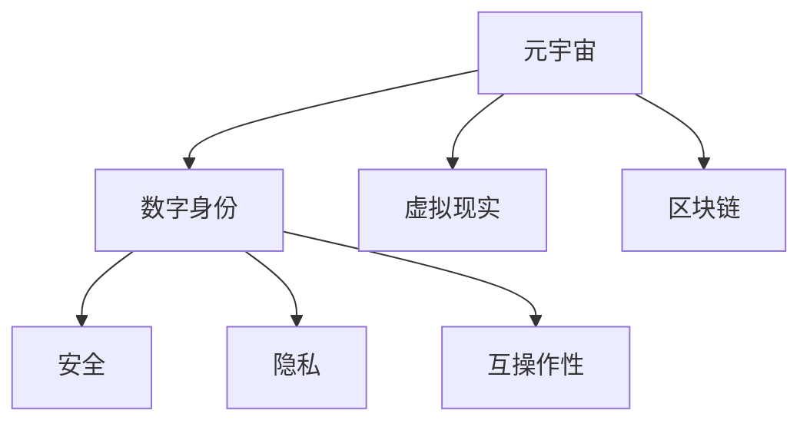

                 

# 《元宇宙中的数字身份：虚拟世界的自我定义》

> 关键词：元宇宙、数字身份、虚拟现实、区块链、身份认证、互操作性、安全与隐私

> 摘要：本文深入探讨了元宇宙中的数字身份概念及其在虚拟世界中的重要性。通过分析元宇宙的发展历程、数字身份的构成要素、安全隐私保护方法以及跨平台互操作性，本文为读者呈现了元宇宙中数字身份的全面解析，同时探讨了其在虚拟现实和区块链领域的应用，以及未来发展趋势。

## 目录大纲

### 第一部分：元宇宙与数字身份概述

#### 第1章：元宇宙的起源与发展

1.1 元宇宙的定义与特点

1.2 元宇宙的发展历程

1.3 元宇宙的核心概念与关键技术

#### 第2章：数字身份的概念与重要性

2.1 数字身份的定义

2.2 数字身份的构成要素

2.3 数字身份的重要性与挑战

### 第二部分：元宇宙中的数字身份管理

#### 第3章：数字身份的安全与隐私

3.1 数字身份安全的风险

3.2 数字身份隐私保护方法

3.3 元宇宙中的身份验证机制

#### 第4章：数字身份的创建与认证

4.1 数字身份创建流程

4.2 身份认证技术

4.3 数字身份的跨平台认证

#### 第5章：数字身份的跨平台互操作性

5.1 数字身份互操作性的挑战

5.2 数字身份互操作标准

5.3 数字身份跨平台的实际应用

### 第三部分：数字身份在元宇宙中的应用

#### 第6章：数字身份在虚拟现实中的应用

6.1 虚拟现实与数字身份

6.2 虚拟现实中的身份管理

6.3 数字身份在虚拟现实中的应用案例

#### 第7章：数字身份在区块链与元宇宙的结合

7.1 区块链与数字身份

7.2 区块链在元宇宙中的应用

7.3 数字身份在区块链中的优势与挑战

#### 第8章：元宇宙中的数字身份的未来发展趋势

8.1 数字身份的未来发展方向

8.2 数字身份在元宇宙中的潜在应用领域

8.3 数字身份在元宇宙中的发展趋势与挑战

### 附录

#### 附录A：元宇宙与数字身份相关术语解释

#### 附录B：元宇宙与数字身份技术发展时间线

#### 附录C：数字身份相关法律法规与政策指南

---

#### Mermaid 流�程图：



#### 核心算法原理讲解：

```pseudo
// 数字身份认证算法伪代码
function AuthenticateIdentity(username, password) {
  // 从数据库中查询用户信息
  user = QueryUserDatabase(username);
  
  // 检查密码是否正确
  if (user.password == password) {
    return "Authentication successful";
  } else {
    return "Authentication failed";
  }
}
```

#### 数学模型和数学公式：

$$
X_{\text{next}} = f(W \cdot X_{\text{current}} + b)
$$

// 其中，$X_{\text{next}}$ 表示下一个状态，$X_{\text{current}}$ 表示当前状态，$W$ 表示权重矩阵，$b$ 表示偏置。

---

#### 项目实战：

```python
# 虚拟现实中的身份管理代码示例
class VirtualIdentityManager:
  def __init__(self):
    self.identities = {}  # 存储所有虚拟身份的字典
  
  def create_identity(self, username, password):
    # 创建新的虚拟身份
    self.identities[username] = password
  
  def authenticate(self, username, password):
    # 认证虚拟身份
    if self.identities.get(username) == password:
      return "Authentication successful"
    else:
      return "Authentication failed"
```

#### 代码解读与分析：

```python
# 虚拟现实中的身份管理代码解读

## 类定义
`VirtualIdentityManager` 类用于管理虚拟现实中的身份。它包含一个字典 `identities`，用于存储所有虚拟身份的名称和密码。

## 创建身份
`create_identity` 方法用于创建一个新的虚拟身份。它接受两个参数：`username`（用户名）和 `password`（密码）。在字典中添加一个新的键值对，键是用户名，值是密码。

## 认证
`authenticate` 方法用于验证用户身份。它接受两个参数：`username` 和 `password`。如果提供的用户名和密码与字典中的匹配，则返回 "Authentication successful"；否则，返回 "Authentication failed"。

这段代码展示了如何使用字典来存储和管理虚拟身份，以及如何进行身份验证。在实际应用中，可能还需要添加更多的功能，如密码加密、用户权限管理等。
```

### 第一部分：元宇宙与数字身份概述

#### 第1章：元宇宙的起源与发展

**1.1 元宇宙的定义与特点**

元宇宙（Metaverse）是一个由虚拟世界组成的空间，它是通过互联网连接的虚拟现实体验，用户可以在其中进行互动、创造和体验。元宇宙不仅仅是虚拟现实（VR）或增强现实（AR）的技术应用，而是一个更加广泛的概念，它包含了虚拟现实、数字身份、社交网络、虚拟经济等多个维度。

元宇宙的特点如下：

- **沉浸式体验**：元宇宙提供了一个沉浸式的虚拟环境，用户可以在其中自由行走、探索和互动。

- **三维空间**：与传统的二维互联网不同，元宇宙是一个三维空间，用户可以在这个空间中进行复杂的操作。

- **高度互动性**：元宇宙中的用户可以与其他用户、虚拟角色以及虚拟环境进行实时互动。

- **经济体系**：元宇宙中存在一个虚拟经济体系，用户可以通过虚拟货币进行交易和购买虚拟商品。

- **多样性**：元宇宙包含各种各样的虚拟世界，从游戏到教育、娱乐、商业等，用户可以根据自己的兴趣选择不同的虚拟世界。

**1.2 元宇宙的发展历程**

元宇宙的概念可以追溯到20世纪90年代，当时虚拟现实技术的萌芽就已经出现。以下是元宇宙发展历程的几个重要阶段：

- **1990年代：虚拟现实技术的萌芽**：这个时期，VR技术开始受到关注，一些早期的虚拟现实游戏和体验出现。

- **2000年代：社交网络的发展**：随着互联网的普及，社交网络成为人们生活中不可或缺的一部分，虚拟社交逐渐成为趋势。

- **2010年代：虚拟现实和增强现实的兴起**：VR和AR技术得到快速发展，各种虚拟现实设备和应用开始涌现。

- **2020年代：元宇宙的概念提出**：在2020年代，元宇宙作为一个整体概念逐渐被提出，并开始引起广泛关注。

- **未来：元宇宙的成熟与应用**：随着技术的进一步成熟，元宇宙有望成为人们生活和工作的重要一部分。

**1.3 元宇宙的核心概念与关键技术**

元宇宙的核心概念包括：

- **虚拟现实（VR）**：通过VR技术，用户可以在一个三维虚拟环境中进行交互。

- **增强现实（AR）**：AR技术将虚拟信息叠加到现实世界中，使用户可以在现实环境中看到虚拟内容。

- **数字身份**：在元宇宙中，用户需要一个数字身份来代表自己，进行社交、交易等活动。

- **社交网络**：元宇宙中的社交网络是用户进行互动的平台，包括虚拟社交、虚拟会议等。

- **虚拟经济**：元宇宙中的虚拟货币和虚拟市场构成了一个虚拟经济体系。

- **云计算与边缘计算**：元宇宙的运行需要强大的云计算和边缘计算支持，以确保数据的存储、处理和传输。

- **人工智能**：人工智能技术在元宇宙中起到重要作用，包括智能代理、虚拟助手、内容生成等。

#### 第2章：数字身份的概念与重要性

**2.1 数字身份的定义**

数字身份是指个人或实体在数字世界中的唯一标识。它不仅包括用户名和密码等基本信息，还涉及个人数据、行为记录、信誉评级等多个维度。在元宇宙中，数字身份是用户参与虚拟活动、进行交易和互动的基础。

**2.2 数字身份的构成要素**

数字身份的构成要素包括：

- **基础信息**：如用户名、密码、电子邮件地址等。

- **个人数据**：包括年龄、性别、教育背景、职业等信息。

- **行为记录**：用户在元宇宙中的行为数据，如浏览记录、交易记录、游戏成绩等。

- **信誉评级**：用户在元宇宙中的信誉等级，影响其在虚拟环境中的信用和地位。

- **虚拟资产**：用户在元宇宙中拥有的虚拟物品和货币。

**2.3 数字身份的重要性与挑战**

数字身份在元宇宙中的重要性体现在以下几个方面：

- **身份认证**：数字身份是用户在元宇宙中进行身份认证的基础，确保只有授权用户可以访问相关资源和进行操作。

- **隐私保护**：数字身份帮助保护用户隐私，防止个人信息被泄露和滥用。

- **社交互动**：数字身份是用户在元宇宙中进行社交互动的媒介，有助于建立人际关系和社区。

- **虚拟经济**：数字身份在虚拟经济中起到关键作用，用户可以通过数字身份进行虚拟交易和投资。

然而，数字身份也面临着一系列挑战：

- **安全风险**：数字身份可能面临黑客攻击、身份盗用等安全风险。

- **隐私泄露**：数字身份可能导致用户隐私泄露，尤其是在跨平台使用时。

- **身份滥用**：数字身份可能被滥用，导致虚拟欺诈和网络犯罪。

- **互操作性**：不同平台和系统之间的数字身份互操作性存在问题，影响用户体验。

#### 第3章：数字身份的安全与隐私

**3.1 数字身份安全的风险**

数字身份安全面临多种风险，包括：

- **黑客攻击**：黑客可能通过暴力破解、钓鱼攻击等手段获取用户密码和身份信息。

- **身份盗用**：用户身份可能被他人盗用，导致账户被盗、隐私泄露等问题。

- **恶意软件**：恶意软件可能窃取用户的数字身份信息，用于非法活动。

- **跨平台威胁**：用户在多个平台使用相同的数字身份，可能导致一处泄露影响多处。

**3.2 数字身份隐私保护方法**

为了保护数字身份隐私，可以采取以下措施：

- **密码安全**：使用强密码，并定期更换密码，避免使用容易被猜测的密码。

- **双重认证**：启用双重认证，增加身份验证的难度，防止未经授权的访问。

- **数据加密**：对敏感数据进行加密存储和传输，确保数据安全。

- **隐私政策**：了解和使用元宇宙平台的隐私政策，限制对个人数据的访问和使用。

- **安全意识**：提高用户的安全意识，避免泄露个人信息和受骗。

**3.3 元宇宙中的身份验证机制**

元宇宙中的身份验证机制包括：

- **单因素认证**：使用用户名和密码进行身份验证，虽然简单但安全性较低。

- **双因素认证**：结合密码和手机验证码、指纹、面部识别等多种方式进行身份验证，提高安全性。

- **零知识证明**：通过数学证明方式验证用户身份，无需泄露任何个人信息。

- **区块链技术**：利用区块链技术实现去中心化的身份验证，提高安全性。

#### 第4章：数字身份的创建与认证

**4.1 数字身份创建流程**

创建数字身份的流程包括：

- **注册账户**：用户在元宇宙平台注册账户，填写基础信息。

- **身份验证**：平台对用户身份进行验证，如发送验证码、人脸识别等。

- **设置密码**：用户设置密码，用于登录和身份认证。

- **绑定手机号或邮箱**：用户绑定手机号或邮箱，用于找回密码和身份验证。

**4.2 身份认证技术**

身份认证技术包括：

- **密码认证**：用户使用密码登录，通过比对存储的密码进行认证。

- **生物识别**：通过指纹、面部识别、虹膜识别等生物特征进行认证。

- **智能卡**：使用智能卡进行身份认证，卡中存储有用户身份信息。

- **证书认证**：通过数字证书进行身份认证，确保认证过程的可信性。

**4.3 数字身份的跨平台认证**

数字身份的跨平台认证挑战包括：

- **认证标准不统一**：不同平台可能有不同的认证标准，导致互操作性困难。

- **认证数据不共享**：平台间可能存在数据壁垒，无法共享认证数据。

- **隐私保护**：跨平台认证可能涉及用户隐私，如何保护隐私是一个挑战。

解决方案包括：

- **开放认证协议**：采用开放认证协议，如OAuth 2.0，实现跨平台认证。

- **分布式身份管理**：利用分布式身份管理系统，实现跨平台身份认证和数据共享。

- **隐私保护机制**：采用隐私保护技术，如差分隐私，确保跨平台认证过程中的用户隐私。

#### 第5章：数字身份的跨平台互操作性

**5.1 数字身份互操作性的挑战**

数字身份互操作性面临以下挑战：

- **认证标准不统一**：不同平台和系统可能有不同的认证标准，导致互操作性困难。

- **数据格式不兼容**：不同平台和系统的数据格式可能不一致，影响互操作性。

- **隐私保护**：跨平台认证和数据共享可能涉及用户隐私，如何保护隐私是一个挑战。

- **技术复杂性**：实现跨平台互操作性需要复杂的技术解决方案，增加开发成本和难度。

**5.2 数字身份互操作标准**

为了实现数字身份的互操作性，可以采用以下标准：

- **开放认证协议**：如OAuth 2.0、OpenID Connect等，提供统一的认证和数据共享机制。

- **数据格式标准**：如JSON、XML等，确保不同平台的数据格式兼容。

- **分布式身份管理系统**：利用区块链等技术，实现分布式身份管理，提高数据共享和互操作性。

**5.3 数字身份跨平台的实际应用**

数字身份跨平台实际应用包括：

- **跨平台社交**：用户可以在不同社交平台上使用同一数字身份，实现账号互通。

- **跨平台支付**：用户可以在不同电商平台使用同一支付账户，简化支付流程。

- **跨平台游戏**：用户可以在不同游戏平台上使用同一游戏账号，享受无缝游戏体验。

- **跨平台工作**：用户可以在不同工作平台上使用同一身份，实现远程办公和数据共享。

#### 第6章：数字身份在虚拟现实中的应用

**6.1 虚拟现实与数字身份**

虚拟现实（VR）是一个沉浸式的三维虚拟环境，用户可以在其中进行互动、探索和体验。在VR中，数字身份是用户参与虚拟活动的基础。数字身份不仅代表用户在虚拟环境中的存在，还承载着用户的行为记录、虚拟资产等信息。

**6.2 虚拟现实中的身份管理**

在虚拟现实中，身份管理包括以下几个方面：

- **账户管理**：用户创建虚拟现实账户，用于登录和参与虚拟活动。

- **角色创建**：用户可以创建虚拟角色，代表自己在虚拟环境中的存在。

- **权限管理**：虚拟现实平台对用户权限进行管理，确保用户只能访问授权资源。

- **隐私保护**：虚拟现实平台需保护用户隐私，防止个人数据泄露。

**6.3 数字身份在虚拟现实中的应用案例**

数字身份在虚拟现实中的应用案例包括：

- **虚拟社交**：用户可以在虚拟环境中与其他用户进行社交互动，建立人际关系。

- **虚拟教育**：用户可以在虚拟环境中进行学习，提高教育体验。

- **虚拟旅游**：用户可以在虚拟环境中体验世界各地，提高旅游乐趣。

- **虚拟医疗**：用户可以在虚拟环境中进行医疗诊断和康复训练。

#### 第7章：数字身份在区块链与元宇宙的结合

**7.1 区块链与数字身份**

区块链是一种分布式账本技术，具有去中心化、不可篡改、透明等特点。区块链技术可以为数字身份提供安全、可信的存储和验证机制，从而解决数字身份的安全和隐私问题。

**7.2 区块链在元宇宙中的应用**

区块链在元宇宙中的应用包括：

- **身份认证**：区块链可以用于数字身份的认证和验证，确保身份的真实性和唯一性。

- **虚拟资产**：区块链可以用于虚拟资产的登记和交易，确保资产的安全性和透明性。

- **智能合约**：区块链可以用于智能合约的实施，自动执行虚拟交易和合约。

- **去中心化身份管理**：区块链可以实现去中心化的身份管理，减少对中心化平台的依赖。

**7.3 数字身份在区块链中的优势与挑战**

数字身份在区块链中的优势包括：

- **安全性**：区块链技术提供安全的存储和验证机制，确保数字身份的安全。

- **隐私保护**：区块链可以实现隐私保护，防止个人数据泄露。

- **去中心化**：区块链去中心化的特性，降低了对中心化平台的依赖。

数字身份在区块链中面临的挑战包括：

- **互操作性**：不同区块链平台之间的互操作性问题，影响数字身份的应用。

- **隐私保护**：如何保护用户隐私，避免隐私泄露是一个挑战。

- **技术成熟度**：区块链技术仍处于发展过程中，其成熟度和稳定性有待提高。

#### 第8章：元宇宙中的数字身份的未来发展趋势

**8.1 数字身份的未来发展方向**

数字身份的未来发展方向包括：

- **安全性与隐私保护**：随着技术的进步，数字身份的安全性和隐私保护将得到进一步提升。

- **互操作性**：实现不同平台和系统之间的数字身份互操作性，提高用户体验。

- **智能身份**：利用人工智能技术，实现智能身份管理和个性化服务。

- **去中心化**：推动数字身份的去中心化，减少对中心化平台的依赖。

**8.2 数字身份在元宇宙中的潜在应用领域**

数字身份在元宇宙中的潜在应用领域包括：

- **虚拟社交**：用户可以在元宇宙中建立虚拟社交关系，实现跨平台互动。

- **虚拟经济**：用户可以在元宇宙中进行虚拟交易和投资，推动虚拟经济发展。

- **虚拟教育**：用户可以在元宇宙中接受虚拟教育，提高学习效果。

- **虚拟医疗**：用户可以在元宇宙中进行虚拟医疗诊断和康复训练。

**8.3 数字身份在元宇宙中的发展趋势与挑战**

数字身份在元宇宙中的发展趋势包括：

- **技术进步**：随着技术的不断发展，数字身份的安全性和互操作性将得到进一步提升。

- **应用场景扩展**：数字身份将在更多领域得到应用，如虚拟旅游、虚拟购物等。

数字身份在元宇宙中面临的挑战包括：

- **隐私保护**：如何保护用户隐私，避免隐私泄露是一个长期挑战。

- **互操作性**：实现不同平台和系统之间的数字身份互操作性，提高用户体验。

- **法律法规**：随着数字身份的发展，相关法律法规也需要不断完善，以保护用户权益。

### 附录

#### 附录A：元宇宙与数字身份相关术语解释

- **元宇宙（Metaverse）**：一个由虚拟世界组成的空间，用户可以在其中进行互动、创造和体验。

- **虚拟现实（VR）**：一种通过计算机技术模拟的三维虚拟环境，用户可以在其中进行沉浸式体验。

- **增强现实（AR）**：一种将虚拟信息叠加到现实世界中的技术，用户可以在现实环境中看到虚拟内容。

- **数字身份（Digital Identity）**：在数字世界中，代表个人或实体的唯一标识。

- **区块链（Blockchain）**：一种分布式账本技术，具有去中心化、不可篡改、透明等特点。

- **智能合约（Smart Contract）**：一种自动执行合同条款的计算机程序，基于区块链技术。

- **互操作性（Interoperability）**：不同系统之间能够相互通信和交换数据的能力。

- **身份认证（Authentication）**：验证用户身份的过程，确保只有授权用户可以访问相关资源和进行操作。

#### 附录B：元宇宙与数字身份技术发展时间线

- **1990年代**：虚拟现实技术的萌芽，元宇宙概念初步提出。

- **2000年代**：社交网络的发展，虚拟社交逐渐兴起。

- **2010年代**：虚拟现实和增强现实技术的快速发展。

- **2020年代**：元宇宙的概念被广泛接受，相关技术开始成熟。

- **未来**：元宇宙和数字身份技术将得到广泛应用，成为人们生活和工作的重要部分。

#### 附录C：数字身份相关法律法规与政策指南

- **《欧盟通用数据保护条例（GDPR）**：规定了个人数据的收集、使用和保护规则，对数字身份的隐私保护有重要影响。

- **《美国消费者隐私保护法案（CCPA）**：规定了消费者数据的权利和保护，对数字身份的隐私保护有重要影响。

- **《中国个人信息保护法（PIPL）**：规定了个人信息的处理和保护规则，对数字身份的隐私保护有重要影响。

### 总结

元宇宙中的数字身份是虚拟世界中的自我定义，它承载着用户在虚拟环境中的身份、行为和资产。随着元宇宙的发展，数字身份的重要性日益凸显，它不仅关系到用户的安全和隐私，也影响着虚拟经济的繁荣和元宇宙的互操作性。未来，数字身份技术将继续发展，为元宇宙带来更多创新和可能性。

作者：AI天才研究院/AI Genius Institute & 禅与计算机程序设计艺术/Zen And The Art of Computer Programming

本文通过详细分析元宇宙与数字身份的概念、重要性、安全隐私保护、跨平台互操作性以及在虚拟现实和区块链领域的应用，全面展示了元宇宙中的数字身份的各个方面。同时，通过对未来发展趋势的探讨，为读者提供了元宇宙数字身份的展望。希望本文能为读者在元宇宙和数字身份领域的研究提供有益的参考。

