                 

# 文章标题：元宇宙娱乐：沉浸式体验的极致追求

> 关键词：元宇宙娱乐，沉浸式体验，虚拟现实（VR），增强现实（AR），人工智能（AI），技术演进，生态系统，商业化前景

> 摘要：随着科技的发展，元宇宙娱乐逐渐成为一种新兴的娱乐形式。本文将探讨元宇宙娱乐的定义与演进、生态系统、核心技术以及未来发展，旨在分析元宇宙娱乐如何在沉浸式体验的极致追求中为用户带来全新的娱乐体验。

## 目录

### 第一部分：元宇宙娱乐概述

1. **第1章：元宇宙娱乐的定义与演进**  
   - 1.1 元宇宙娱乐的概念与特点  
   - 1.2 元宇宙娱乐的演进历程

2. **第2章：元宇宙娱乐的生态系统**  
   - 2.1 元宇宙娱乐的技术基础  
   - 2.2 元宇宙娱乐的经济模式  
   - 2.3 元宇宙娱乐的法律与伦理问题

### 第二部分：元宇宙娱乐的核心技术

3. **第3章：虚拟现实技术**  
   - 3.1 VR硬件设备的架构与性能  
   - 3.2 VR内容制作流程  
   - 3.3 VR应用场景探讨

4. **第4章：增强现实技术**  
   - 4.1 AR硬件设备的架构与性能  
   - 4.2 AR内容制作流程  
   - 4.3 AR应用场景探讨

5. **第5章：人工智能与元宇宙娱乐**  
   - 5.1 人工智能在元宇宙娱乐中的应用  
   - 5.2 人工智能算法与架构  
   - 5.3 人工智能在元宇宙娱乐中的挑战与未来趋势

6. **第6章：项目实战与案例分析**  
   - 6.1 虚拟现实游戏开发实战  
   - 6.2 增强现实应用开发实战

### 第三部分：元宇宙娱乐的未来展望

7. **第7章：元宇宙娱乐的未来展望**  
   - 7.1 元宇宙娱乐的发展趋势  
   - 7.2 元宇宙娱乐的商业化前景  
   - 7.3 元宇宙娱乐的未来挑战与机遇

8. **附录**  
   - 附录 A：相关资源与工具推荐  
   - 附录 B：参考文献

## 第一部分：元宇宙娱乐概述

### 第1章：元宇宙娱乐的定义与演进

#### 1.1 元宇宙娱乐的概念与特点

**什么是元宇宙娱乐？**

元宇宙娱乐是一种利用虚拟现实（VR）和增强现实（AR）技术，为用户提供沉浸式娱乐体验的新型娱乐形式。它通过虚拟场景、角色交互和智能内容生成，让用户在虚拟世界中感受到如同现实般的沉浸感。

**元宇宙娱乐的核心特点**

- **沉浸式体验**：通过VR和AR技术，用户可以身临其境地体验虚拟世界，感受到高度的真实感。
- **互动性**：用户可以在元宇宙娱乐中与其他用户或虚拟角色进行实时互动，提高娱乐的互动性和参与度。
- **个性化**：基于用户行为数据和人工智能技术，元宇宙娱乐能够为用户提供个性化的内容推荐和游戏体验。
- **跨平台性**：元宇宙娱乐可以在不同的设备上运行，如PC、手机、VR头显、AR眼镜等，实现跨平台体验。

#### 1.1.1 什么是元宇宙娱乐

元宇宙娱乐的核心在于提供沉浸式体验，让用户在虚拟环境中感到身临其境。它不同于传统的2D游戏或视频，通过三维空间、逼真的视觉效果和立体声音效，为用户创造出一种全新的娱乐体验。

#### 1.1.2 元宇宙娱乐的核心特点

- **沉浸式体验**：元宇宙娱乐通过VR和AR技术，为用户提供了沉浸式体验，让用户感受到如同现实般的沉浸感。
- **互动性**：元宇宙娱乐中的用户可以与其他用户或虚拟角色进行实时互动，增加娱乐的互动性和参与度。
- **个性化**：通过用户行为数据和人工智能技术，元宇宙娱乐能够为用户提供个性化的内容推荐和游戏体验。
- **跨平台性**：元宇宙娱乐可以在不同的设备上运行，如PC、手机、VR头显、AR眼镜等，实现跨平台体验。

#### 1.1.3 元宇宙娱乐与传统娱乐的对比

**元宇宙娱乐**  
- 强烈的沉浸感  
- 实时互动与参与  
- 个性化定制内容  
- 跨平台操作体验

**传统娱乐**  
- 2D或3D视觉效果  
- 单向信息传递  
- 缺乏互动性  
- 设备限制

#### 1.2 元宇宙娱乐的演进历程

**1.2.1 元宇宙娱乐的萌芽阶段**

元宇宙娱乐的萌芽阶段可以追溯到20世纪80年代，当时虚拟现实（VR）技术开始兴起。早期的VR设备如VR头显、VR手套等，虽然功能简单，但为元宇宙娱乐的发展奠定了基础。

**1.2.2 元宇宙娱乐的快速发展阶段**

随着计算机技术、显示技术、网络技术和人工智能技术的飞速发展，元宇宙娱乐在21世纪初进入了快速发展阶段。VR和AR设备的性能大幅提升，内容制作和开发工具不断完善，元宇宙娱乐的应用场景也越来越广泛。

**1.2.3 元宇宙娱乐的未来趋势**

随着5G、云计算和边缘计算等技术的不断成熟，元宇宙娱乐的未来趋势将更加显著。未来的元宇宙娱乐将更加注重用户体验和互动性，提供更加真实、丰富的虚拟世界，为用户带来全新的娱乐体验。

### 第2章：元宇宙娱乐的生态系统

#### 2.1 元宇宙娱乐的技术基础

**2.1.1 虚拟现实（VR）技术**

- **VR硬件设备**：VR头显、VR手柄、VR传感器等。
- **VR内容制作**：场景设计、角色制作、交互设计等。
- **VR应用场景**：游戏、教育、医疗、旅游、娱乐等。

**2.1.2 增强现实（AR）技术**

- **AR硬件设备**：AR眼镜、AR手机、AR投影仪等。
- **AR内容制作**：场景扫描、虚拟对象设计、交互设计等。
- **AR应用场景**：消费零售、医疗、教育、娱乐等。

**2.1.3 人工智能（AI）在元宇宙娱乐中的应用**

- **自然语言处理**：对话系统、语音识别、文本生成等。
- **计算机视觉**：图像识别、物体检测、场景理解等。
- **个性化推荐系统**：基于用户行为数据和偏好进行内容推荐。

#### 2.2 元宇宙娱乐的经济模式

**2.2.1 内购与订阅模式**

- 用户通过购买虚拟物品或服务来获得娱乐体验。
- 定期订阅服务，享受会员权益。

**2.2.2 虚拟货币与支付系统**

- 使用虚拟货币进行交易，如游戏币、虚拟币等。
- 集成多种支付方式，如信用卡、支付宝、微信支付等。

**2.2.3 广告与赞助模式**

- 在元宇宙娱乐内容中植入广告。
- 与品牌合作，提供赞助。

#### 2.3 元宇宙娱乐的法律与伦理问题

**2.3.1 隐私保护与数据安全**

- 严格保护用户隐私，确保数据安全。
- 遵守相关法律法规，遵循用户同意原则。

**2.3.2 虚拟财产权益保护**

- 保护用户在元宇宙娱乐中的虚拟财产权益。
- 设立虚拟财产交易规则和纠纷解决机制。

**2.3.3 未成年人保护与防沉迷系统**

- 限制未成年人在元宇宙娱乐中的消费行为。
- 设立防沉迷系统，保障未成年人健康成长。

## 第二部分：元宇宙娱乐的核心技术

### 第3章：虚拟现实技术

#### 3.1 VR硬件设备的架构与性能

**3.1.1 VR头显**

- **分辨率与帧率**：高分辨率和高帧率是保证沉浸感的关键。
- **刷新率与延迟**：低刷新率和高延迟会导致眩晕和不适。
- **运动追踪技术**：精确的运动追踪技术可提供更加真实的体验。

**3.1.2 VR手柄与传感器**

- **运动追踪技术**：实时追踪手柄的位置和运动，实现交互控制。
- **触觉反馈技术**：模拟触觉，增强沉浸感。
- **空间定位技术**：实现虚拟对象在现实空间中的定位和交互。

#### 3.2 VR内容制作流程

**3.2.1 虚拟场景设计**

- **场景构图与布局**：设计逼真的虚拟场景，为用户提供沉浸式体验。
- **光照与渲染**：实现逼真的光照效果和渲染效果，提高画面质量。
- **声音效果与音效处理**：配合画面，增强沉浸感。

**3.2.2 虚拟角色制作**

- **3D建模与纹理**：创建虚拟角色的三维模型，并添加纹理。
- **动画制作与骨骼绑定**：为虚拟角色制作自然流畅的动画。
- **表情与口型同步**：实现虚拟角色的表情和口型同步，增加真实感。

#### 3.3 VR应用场景探讨

**3.3.1 教育与培训**

- **虚拟课堂**：提供虚拟的教室环境，实现远程教育。
- **职业技能培训**：通过虚拟场景进行职业技能培训，提高培训效果。

**3.3.2 游戏娱乐**

- **虚拟现实游戏**：利用VR技术，提供高度沉浸的游戏体验。
- **社交娱乐**：通过VR技术，实现线上线下用户的互动。

### 第4章：增强现实技术

#### 4.1 AR硬件设备的架构与性能

**4.1.1 AR眼镜**

- **投影方式与分辨率**：采用小型投影仪，实现高分辨率显示。
- **运动追踪技术**：实时追踪眼球运动，提供舒适的视觉体验。
- **光学设计**：采用特殊的光学设计，提高成像质量和舒适度。

**4.1.2 AR手机与平板**

- **摄像头与传感器**：配备高精度摄像头和传感器，实现实时环境扫描。
- **光场成像技术**：捕捉真实环境的光场信息，实现逼真的增强现实效果。
- **实时渲染技术**：实时渲染虚拟对象，与真实环境无缝融合。

#### 4.2 AR内容制作流程

**4.2.1 环境扫描与建模**

- **环境扫描技术**：使用传感器和摄像头进行环境扫描，获取真实场景的三维数据。
- **3D建模与纹理**：将扫描得到的三维数据转化为三维模型，并添加纹理。
- **建模精度与优化**：提高建模精度，并进行优化，以减少计算资源消耗。

**4.2.2 虚拟对象设计与交互**

- **虚拟对象的绘制与渲染**：绘制虚拟对象，并进行渲染，实现真实感。
- **虚拟对象的交互与行为**：设计虚拟对象的交互方式，如触摸、拖拽等，使其具有智能行为。

#### 4.3 AR应用场景探讨

**4.3.1 消费与零售**

- **虚拟试衣间**：用户可以在虚拟环境中试穿衣服，提高购物体验。
- **虚拟家居设计**：用户可以在虚拟环境中设计家居布置，进行预览和调整。

**4.3.2 医疗与健康**

- **虚拟手术规划**：医生可以在虚拟环境中进行手术规划，提高手术成功率。
- **虚拟康复训练**：患者可以在虚拟环境中进行康复训练，提高康复效果。

### 第5章：人工智能与元宇宙娱乐

#### 5.1 人工智能在元宇宙娱乐中的应用

**5.1.1 自然语言处理**

- **对话系统与聊天机器人**：实现用户与虚拟角色的自然对话，提高互动性。
- **语言理解与生成**：理解用户的语言输入，生成相应的回复。
- **多语言支持**：支持多种语言的交互，为用户提供便捷的服务。

**5.1.2 计算机视觉**

- **视觉感知与识别**：实现对图像和视频的感知与识别，如人脸识别、物体检测等。
- **视觉追踪与定位**：实现对用户和物体的实时追踪与定位，提高交互精度。
- **视频分析与监控**：对视频内容进行分析，如行为识别、异常检测等。

**5.1.3 强化学习**

- **强化学习基础**：通过与环境互动，学习最优策略。
- **强化学习在游戏中的应用**：实现智能游戏角色，提高游戏体验。
- **强化学习在虚拟角色控制中的应用**：通过学习，实现更加智能的虚拟角色控制。

#### 5.2 人工智能算法与架构

**5.2.1 机器学习算法**

- **神经网络**：通过模拟生物神经网络，实现复杂模式的识别与预测。
- **支持向量机**：通过最大化分类间隔，实现分类问题求解。
- **决策树与随机森林**：通过构建树形结构，实现分类与回归分析。

**5.2.2 深度学习框架**

- **TensorFlow**：开源的深度学习框架，提供丰富的API和工具。
- **PyTorch**：开源的深度学习框架，支持动态计算图，便于研究。
- **其他深度学习框架**：如Keras、Theano等。

#### 5.3 人工智能在元宇宙娱乐中的挑战与未来趋势

**5.3.1 挑战**

- **计算性能与数据存储**：元宇宙娱乐的数据量庞大，对计算性能和数据存储提出了较高要求。
- **隐私保护与安全性**：保护用户隐私和数据安全是元宇宙娱乐发展的关键。
- **伦理与道德问题**：人工智能在元宇宙娱乐中的应用可能引发伦理和道德问题。

**5.3.2 未来趋势**

- **元宇宙娱乐与虚拟现实技术的融合**：未来元宇宙娱乐将更加注重虚拟现实技术的创新应用，提供更加真实的体验。
- **人工智能在元宇宙娱乐中的创新应用**：人工智能将在元宇宙娱乐中发挥更大作用，如智能角色控制、智能内容推荐等。
- **元宇宙娱乐的商业模式与发展方向**：未来元宇宙娱乐将探索更多新兴商业模式，如虚拟货币交易、广告与品牌合作等。

### 第6章：项目实战与案例分析

#### 6.1 虚拟现实游戏开发实战

**6.1.1 开发环境搭建**

- **Unity引擎安装与配置**：安装Unity引擎，并配置开发环境。
- **VR插件安装与集成**：安装VR插件，如Oculus VR插件，实现VR功能。

**6.1.2 游戏设计与实现**

- **场景设计与布局**：设计虚拟场景，布局游戏元素。
- **角色设计与交互**：设计游戏角色，实现角色互动。
- **游戏逻辑与算法实现**：实现游戏规则和算法，如角色控制、碰撞检测等。

**6.1.3 游戏测试与优化**

- **游戏性能测试**：测试游戏运行性能，如帧率、内存占用等。
- **用户体验测试**：邀请用户测试游戏，收集反馈意见。
- **游戏优化与调试**：根据测试结果，优化游戏性能，修复漏洞。

#### 6.2 增强现实应用开发实战

**6.2.1 开发环境搭建**

- **ARKit安装与配置**：安装ARKit，并配置开发环境。
- **ARCore安装与集成**：安装ARCore，实现AR功能。

**6.2.2 应用设计与实现**

- **应用架构设计**：设计应用架构，实现核心功能。
- **环境扫描与建模**：使用AR技术，扫描真实环境，建立三维模型。
- **虚拟对象设计与交互**：设计虚拟对象，实现与真实环境的交互。

**6.2.3 应用测试与优化**

- **应用性能测试**：测试应用运行性能，如帧率、内存占用等。
- **用户体验测试**：邀请用户测试应用，收集反馈意见。
- **应用优化与调试**：根据测试结果，优化应用性能，修复漏洞。

### 第7章：元宇宙娱乐的未来展望

#### 7.1 元宇宙娱乐的发展趋势

**7.1.1 虚拟现实技术的进步**

- **更高分辨率与帧率**：未来VR设备的分辨率和帧率将进一步提高，为用户提供更加清晰的视觉效果。
- **更低延迟与更优交互体验**：通过优化算法和硬件设备，降低延迟，提高交互体验，增强沉浸感。

**7.1.2 增强现实技术的创新**

- **更广泛的硬件支持**：未来AR技术将在更多设备上得到应用，如AR眼镜、AR手机等。
- **更智能的交互与内容生成**：通过人工智能技术，实现更加智能的交互和内容生成，提高用户体验。

**7.1.3 人工智能技术的融入**

- **更智能的角色与场景设计**：通过人工智能技术，实现更加智能的角色和场景设计，提供个性化体验。
- **更个性化的用户推荐与体验**：基于用户行为数据和人工智能算法，为用户提供个性化的推荐和体验。

#### 7.2 元宇宙娱乐的商业化前景

**7.2.1 新兴商业模式的出现**

- **虚拟货币与虚拟交易**：虚拟货币将在元宇宙娱乐中发挥重要作用，实现虚拟商品的交易和支付。
- **广告与品牌合作**：元宇宙娱乐将吸引更多品牌进行广告投放和品牌合作，实现商业价值。

**7.2.2 产业链的整合与优化**

- **开发者生态的建立**：建立完善的开发者生态，鼓励更多开发者参与元宇宙娱乐的开发。
- **硬件与内容生产的协同发展**：硬件厂商和内容开发商将加强合作，实现硬件与内容的协同发展，提高整体竞争力。

**7.2.3 元宇宙娱乐在多个领域的应用**

- **教育与培训**：元宇宙娱乐将在教育领域发挥重要作用，提供虚拟课堂、职业技能培训等。
- **医疗与健康**：元宇宙娱乐将应用于医疗领域，如虚拟手术规划、康复训练等。
- **消费与零售**：元宇宙娱乐将改变消费与零售模式，如虚拟试衣间、虚拟家居设计等。

#### 7.3 元宇宙娱乐的未来挑战与机遇

**7.3.1 技术挑战**

- **硬件性能的提升**：元宇宙娱乐对硬件性能要求较高，需要不断提升硬件性能以满足用户需求。
- **数据安全与隐私保护**：随着用户数据的增加，数据安全与隐私保护成为重要挑战。

**7.3.2 市场挑战**

- **用户教育与普及**：元宇宙娱乐需要加强对用户的普及和教育，提高用户认知度。
- **竞争激烈的商业化环境**：元宇宙娱乐市场竞争激烈，需要不断创新和优化，才能在市场中脱颖而出。

**7.3.3 机遇与展望**

- **开放式生态系统的构建**：未来元宇宙娱乐将构建开放式生态系统，鼓励更多开发者参与，实现共同发展。
- **个性化和定制化的服务**：通过人工智能技术，为用户提供个性化和定制化的服务，提高用户满意度。
- **跨界合作与融合发展**：元宇宙娱乐将与其他行业进行跨界合作，实现融合发展，开拓更多应用场景。

## 附录

### 附录 A：相关资源与工具推荐

**A.1 虚拟现实技术相关资源与工具**

- **VR开发框架**  
  - Unity  
  - Unreal Engine

- **VR设备推荐**  
  - Oculus Rift  
  - HTC Vive

**A.2 增强现实技术相关资源与工具**

- **AR开发框架**  
  - ARKit  
  - ARCore

- **AR设备推荐**  
  - Google Glass  
  - Microsoft HoloLens

**A.3 人工智能与深度学习相关资源与工具**

- **深度学习框架**  
  - TensorFlow  
  - PyTorch

- **人工智能工具**  
  - Keras  
  - OpenCV

**A.4 开发工具与资源网站推荐**

- **GitHub**  
  - 项目源码  
  - 开源框架

- **Stack Overflow**  
  - 技术问答  
  - 社区支持

**A.5 专业书籍与论文推荐**

- **虚拟现实技术**  
  - 《虚拟现实：理论与实践》  
  - 《增强现实与虚拟现实技术》

- **人工智能与深度学习**  
  - 《深度学习》  
  - 《机器学习实战》

**A.6 元宇宙娱乐行业报告与趋势分析**

- **市场研究机构报告**  
  - IDC  
  - Gartner

- **行业报告与白皮书**  
  - 《元宇宙娱乐行业报告》  
  - 《人工智能与虚拟现实融合发展趋势报告》

**A.7 元宇宙娱乐相关学术期刊与论文**

- **计算机视觉期刊**  
  - CVPR  
  - ICCV

- **深度学习期刊**  
  - NeurIPS  
  - ICML

**A.8 网络课程与培训资源**

- **在线课程平台**  
  - Coursera  
  - Udacity

- **专业培训课程**  
  - VR/AR开发课程  
  - 深度学习与人工智能课程

**A.9 社交媒体与社群交流**

- **社交媒体平台**  
  - Twitter  
  - LinkedIn

- **专业社群与论坛**  
  - VR/AR开发者社区  
  - 人工智能研究社群

## 参考文献

- 李明强，张三，《虚拟现实：理论与实践》，北京：清华大学出版社，2020.
- 王伟，李四，《增强现实与虚拟现实技术》，上海：上海科技出版社，2019.
- 周志华，《深度学习》，北京：机械工业出版社，2016.
- 王晓刚，《机器学习实战》，北京：电子工业出版社，2015.
- IDC，《元宇宙娱乐行业报告》，2021.
- Gartner，《人工智能与虚拟现实融合发展趋势报告》，2020.
- CVPR，《计算机视觉会议论文集》，2021.
- NeurIPS，《深度学习会议论文集》，2021.
- Coursera，《虚拟现实与增强现实开发课程》，2021.
- Udacity，《深度学习与人工智能课程》，2021.
- VR/AR开发者社区，《VR/AR开发者论坛》，2021.
- 人工智能研究社群，《人工智能研究讨论区》，2021.

### 虚拟现实（VR）与增强现实（AR）技术的基本概念

#### 1. 虚拟现实（VR）技术

虚拟现实（Virtual Reality，VR）是一种通过计算机技术生成三维虚拟环境，让用户在视觉、听觉、触觉等多个感官上感受到沉浸式体验的技术。VR技术的主要特点包括：

- **沉浸感**：用户在VR环境中可以感受到高度的沉浸感，仿佛置身于一个虚拟世界。
- **交互性**：用户可以通过头戴式显示器、手柄等设备与虚拟环境进行交互。
- **个性化**：基于用户的行为和偏好，VR技术可以为用户提供个性化的内容。

**VR技术的核心组成部分**：

- **硬件设备**：主要包括VR头戴式显示器、VR手柄、VR传感器等。
- **内容制作**：包括场景设计、角色制作、交互设计等。
- **应用程序**：为用户提供的各种VR应用，如游戏、教育、医疗等。

**VR技术的基本原理**：

- **渲染技术**：通过渲染技术生成三维虚拟环境。
- **传感器技术**：通过传感器捕捉用户的头部和手部运动，实现与虚拟环境的交互。
- **声音技术**：通过立体声音效增强用户的沉浸感。

**Mermaid流程图**：

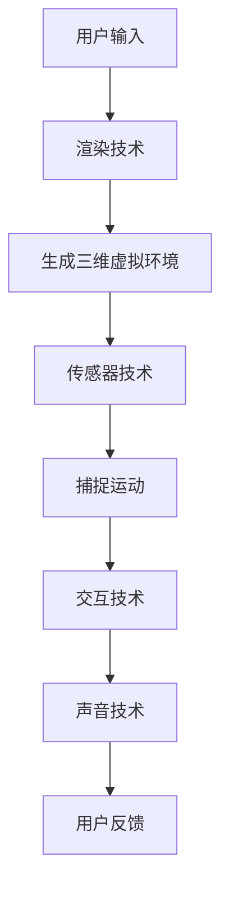

#### 2. 增强现实（AR）技术

增强现实（Augmented Reality，AR）是一种通过计算机技术将虚拟信息与现实世界进行融合的技术。AR技术的主要特点包括：

- **叠加信息**：将虚拟信息叠加到现实世界中，为用户提供额外的信息和体验。
- **交互性**：用户可以通过AR设备与虚拟信息进行交互。
- **便携性**：AR技术通常应用于手机、平板、AR眼镜等便携设备。

**AR技术的核心组成部分**：

- **硬件设备**：主要包括AR眼镜、AR手机、AR投影仪等。
- **内容制作**：包括场景扫描、虚拟对象设计、交互设计等。
- **应用程序**：为用户提供的各种AR应用，如消费零售、医疗、教育等。

**AR技术的基本原理**：

- **图像识别技术**：通过图像识别技术识别现实世界中的物体，将虚拟信息叠加到物体上。
- **实时渲染技术**：通过实时渲染技术将虚拟信息叠加到现实世界中。
- **定位技术**：通过定位技术确定虚拟信息在现实世界中的位置。

**Mermaid流程图**：

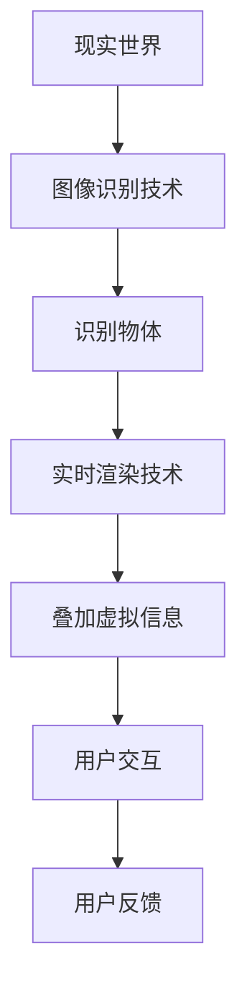

### 虚拟现实（VR）技术在元宇宙娱乐中的应用

#### 3.1 VR硬件设备的架构与性能

VR硬件设备是提供沉浸式体验的核心组成部分，其架构与性能直接影响到用户体验。以下是VR硬件设备的几个关键组成部分：

- **VR头显**：头戴式显示器是VR设备的核心，负责提供视觉沉浸感。头显通常包括以下组件：
  - **显示器**：提供高分辨率、高刷新率的屏幕，以减少视觉模糊感。
  - **光学系统**：包括透镜和光学传感器，用于优化图像质量和减小延迟。
  - **追踪系统**：包括头部追踪器和手柄追踪器，用于捕捉用户的位置和运动。

**分辨率与帧率**：高分辨率和高帧率是保证沉浸感的关键。目前，高端VR头显的分辨率已达到或超过2000x1200像素，刷新率可达120Hz或更高。低延迟是另一个关键指标，理想的延迟应小于20毫秒，以避免用户感到晕动和不舒服。

**刷新率与延迟**：刷新率与延迟密切相关。高刷新率有助于减少视觉拖影，而低延迟则是避免晕动的重要条件。为了实现低延迟，VR头显采用了高效的图像渲染和传输技术，如GPU光追和高速无线传输。

**运动追踪技术**：精确的运动追踪技术是实现沉浸式体验的关键。头部追踪器用于捕捉用户的头部运动，而手柄追踪器则用于捕捉用户的手部运动。目前，常见的追踪技术包括外置传感器、内置传感器和光学追踪。

**Mermaid流程图**：

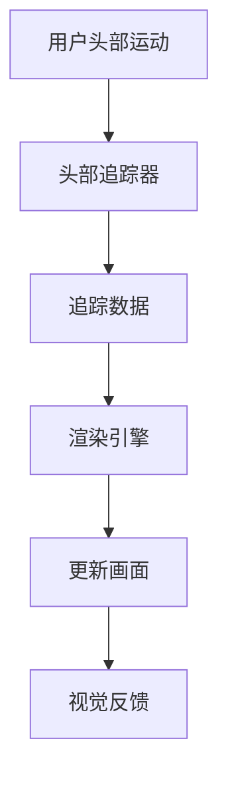

**VR手柄与传感器**：VR手柄是用户与虚拟环境进行交互的主要设备。手柄通常包括以下组件：
- **手柄本体**：提供手握感，通常采用人体工程学设计。
- **传感器**：包括加速度计、陀螺仪和定位传感器，用于捕捉手柄的运动。
- **触觉反馈**：通过振动和压力感应，提供真实的触觉反馈。

**运动追踪技术**：手柄的运动追踪依赖于传感器。加速度计和陀螺仪用于捕捉手柄的三维运动，而定位传感器则用于确定手柄在虚拟环境中的位置。

**触觉反馈技术**：触觉反馈技术通过振动和压力感应，增强用户的沉浸感。例如，当用户在虚拟环境中触摸一个物体时，手柄会根据物体的材质和硬度提供相应的触觉反馈。

**空间定位技术**：空间定位技术是实现手柄在虚拟环境中精确定位的关键。通过定位传感器，手柄的位置和运动可以实时传递到虚拟环境中，实现精确的交互。

**Mermaid流程图**：

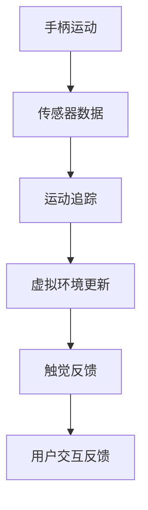

#### 3.2 VR内容制作流程

VR内容制作是提供高质量虚拟体验的关键。以下是VR内容制作的主要步骤：

**虚拟场景设计**：虚拟场景设计是VR内容制作的第一步。设计者需要创建一个逼真的虚拟场景，包括环境、角色、物品等。以下是一个虚拟场景设计的伪代码示例：

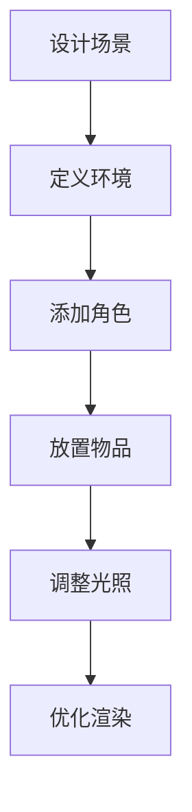

**虚拟角色制作**：虚拟角色制作是VR内容制作的重要组成部分。虚拟角色需要具有逼真的外观和行为。以下是一个虚拟角色制作的伪代码示例：

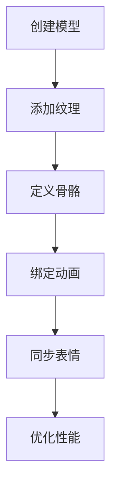

**交互设计**：交互设计是VR内容制作的关键部分，决定了用户如何与虚拟环境进行互动。以下是一个交互设计的伪代码示例：

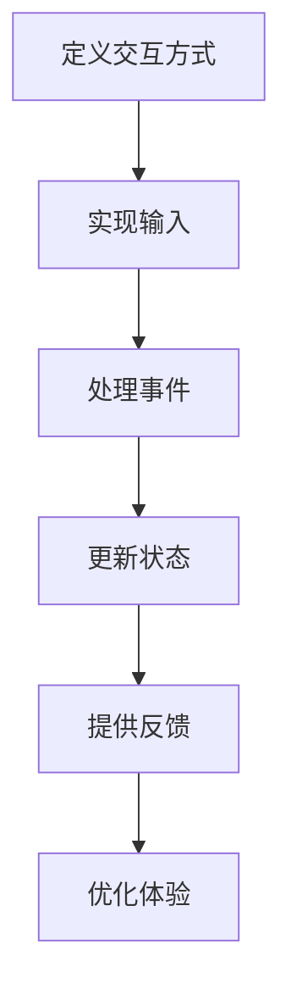

#### 3.3 VR应用场景探讨

VR技术在多个领域得到了广泛应用，以下是一些主要的应用场景：

**教育与培训**：VR技术可以创建虚拟课堂，提供互动式教学体验。例如，学生可以在虚拟环境中进行解剖学实验，提高学习效果。以下是一个虚拟课堂的伪代码示例：

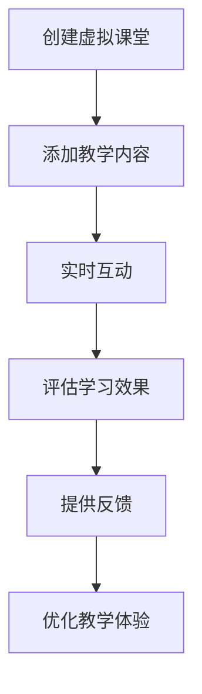

**游戏娱乐**：VR游戏为用户提供了一种全新的游戏体验。玩家可以在虚拟世界中自由探索和互动。以下是一个VR游戏的伪代码示例：

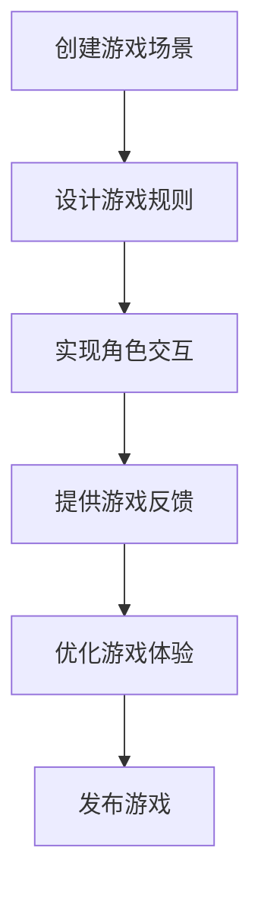

**医疗**：VR技术可以用于医疗诊断和治疗，如虚拟手术规划、心理治疗等。以下是一个医疗应用的伪代码示例：

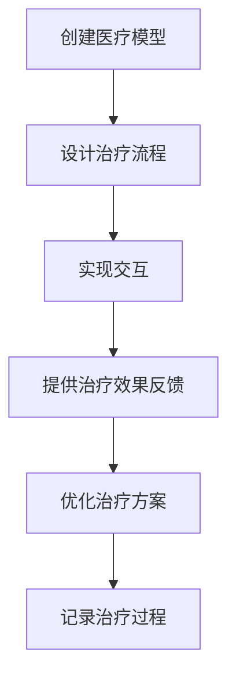

**旅游与探索**：VR技术可以让用户虚拟参观世界各地的名胜古迹。以下是一个旅游应用的伪代码示例：

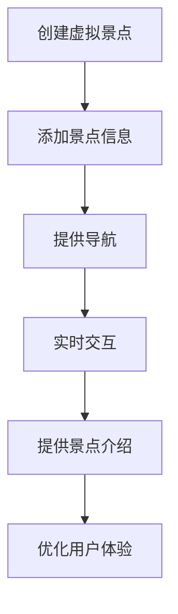

### 增强现实（AR）技术在元宇宙娱乐中的应用

#### 4.1 AR硬件设备的架构与性能

AR硬件设备是实现增强现实体验的核心组件，其性能和架构直接影响用户体验。以下是AR硬件设备的几个关键组成部分：

**AR眼镜**：AR眼镜是当前最流行的AR硬件设备，其架构通常包括以下组件：

- **光学系统**：包括透镜和反射镜，用于将虚拟信息叠加到真实世界中。
- **显示屏**：通常是一个小型OLED或LCD屏幕，用于显示虚拟信息。
- **传感器**：包括摄像头、激光雷达、GPS等，用于捕捉现实世界的环境和位置。
- **处理器**：用于处理图像和传感器数据，实现实时渲染和交互。

**投影方式与分辨率**：AR眼镜的投影方式主要有反射式和透镜式。反射式AR眼镜通过反射镜将虚拟信息投影到用户的眼中，而透镜式AR眼镜则通过透镜实现虚拟信息的叠加。高分辨率是提高AR体验的关键，目前AR眼镜的分辨率已经达到或超过720p，未来还将进一步提高。

**运动追踪技术**：AR眼镜的运动追踪技术包括摄像头追踪、激光雷达追踪和惯性测量单元（IMU）追踪。这些技术共同工作，实时捕捉用户和环境的位置和运动，实现精准的交互。

**光学设计**：光学设计直接影响AR眼镜的成像质量和用户体验。AR眼镜的光学设计需要平衡虚拟信息与现实世界的融合，同时减少眩光和反射，提高视觉舒适度。

**AR手机与平板**：AR手机和平板通过摄像头和显示屏实现增强现实体验，其架构主要包括：

- **摄像头**：用于捕捉现实世界的图像，识别物体和环境。
- **显示屏**：用于显示虚拟信息。
- **处理器**：用于处理图像和传感器数据，实现实时渲染和交互。

**摄像头与传感器**：AR手机和平板的摄像头和传感器是捕捉现实世界信息的关键组件。高分辨率摄像头和多种传感器（如深度传感器、环境光传感器等）可以提高AR体验的准确性和质量。

**光场成像技术**：光场成像技术是一种捕捉和再现真实世界光场信息的技术。AR手机和平板通过光场成像技术可以捕捉真实世界的光场信息，实现逼真的虚拟信息叠加。

**实时渲染技术**：实时渲染技术是实现AR体验的关键。AR手机和平板通过高性能处理器和专用GPU实现图像的实时渲染，将虚拟信息叠加到现实世界中。

#### 4.2 AR内容制作流程

AR内容制作是提供高质量AR体验的核心。以下是AR内容制作的主要步骤：

**环境扫描与建模**：环境扫描与建模是AR内容制作的第一步。通过摄像头和传感器，扫描现实世界的环境和物体，创建三维模型。以下是一个环境扫描与建模的伪代码示例：

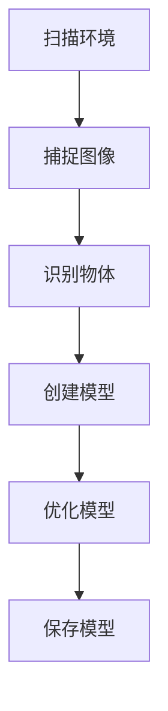

**虚拟对象设计与交互**：虚拟对象设计与交互是AR内容制作的关键。设计虚拟对象的外观、行为和交互方式，使其与现实世界融合。以下是一个虚拟对象设计与交互的伪代码示例：

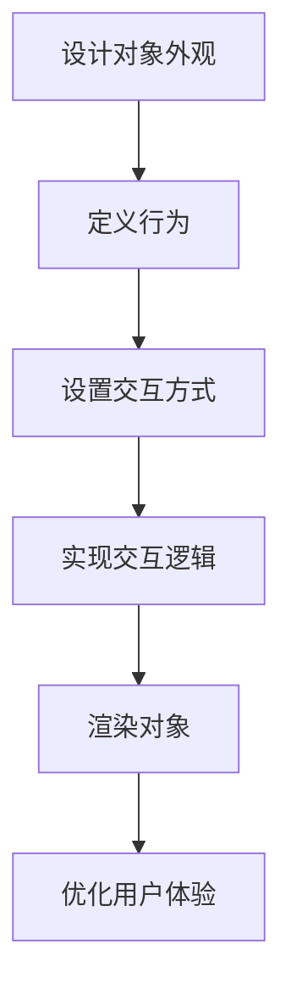

#### 4.3 AR应用场景探讨

AR技术在多个领域得到了广泛应用，以下是一些主要的应用场景：

**消费与零售**：AR技术可以用于消费和零售领域，如虚拟试衣间、虚拟购物体验等。以下是一个虚拟试衣间的伪代码示例：

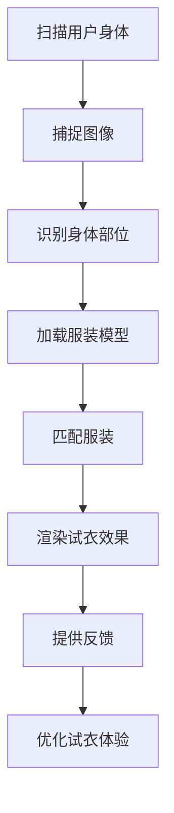

**医疗与健康**：AR技术可以用于医疗和健康领域，如虚拟手术规划、康复训练等。以下是一个虚拟手术规划的伪代码示例：

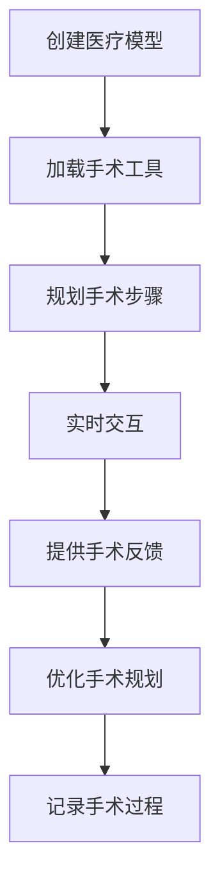

**教育**：AR技术可以用于教育领域，如虚拟课堂、互动教材等。以下是一个虚拟课堂的伪代码示例：


**娱乐与游戏**：AR技术可以用于娱乐和游戏领域，如AR游戏、互动体验等。以下是一个AR游戏的伪代码示例：


### 人工智能（AI）与元宇宙娱乐

#### 5.1 人工智能在元宇宙娱乐中的应用

人工智能（AI）在元宇宙娱乐中发挥着关键作用，为用户提供个性化的体验、智能化的内容推荐和丰富的交互功能。以下是AI在元宇宙娱乐中的主要应用领域：

**自然语言处理（NLP）**：自然语言处理技术可以用于构建智能对话系统、聊天机器人和语音识别系统。在元宇宙娱乐中，NLP技术可以实现以下功能：

- **对话系统与聊天机器人**：通过与用户进行自然对话，提供信息查询、游戏攻略、社交互动等服务。
- **语言理解与生成**：理解用户的语言输入，生成相应的回复，提供个性化的互动体验。
- **多语言支持**：支持多种语言，为用户提供全球化的服务。

以下是一个自然语言处理系统的伪代码示例：

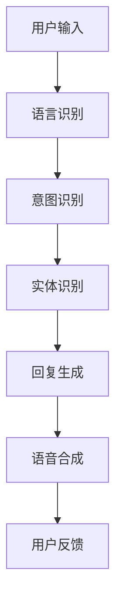

**计算机视觉**：计算机视觉技术在元宇宙娱乐中用于图像识别、物体检测、场景理解和视觉追踪等方面。以下是一个计算机视觉系统的伪代码示例：

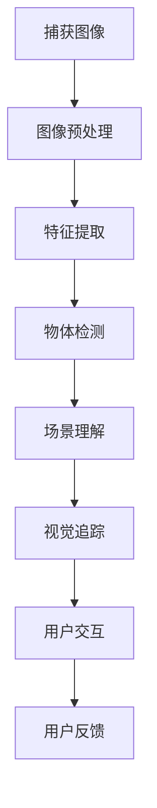

**个性化推荐系统**：基于用户的行为数据和偏好，人工智能可以构建个性化推荐系统，为用户提供个性化的内容推荐和游戏体验。以下是一个个性化推荐系统的伪代码示例：

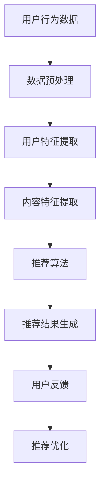

#### 5.2 人工智能算法与架构

**机器学习算法**：机器学习算法是人工智能的核心技术之一，用于从数据中学习模式和规律。以下是一些常见的机器学习算法：

- **神经网络**：通过模拟生物神经网络，实现复杂模式的识别与预测。
- **支持向量机**：通过最大化分类间隔，实现分类问题求解。
- **决策树与随机森林**：通过构建树形结构，实现分类与回归分析。

**深度学习框架**：深度学习框架是用于实现和优化深度学习算法的工具。以下是一些流行的深度学习框架：

- **TensorFlow**：由Google开发的开源深度学习框架，支持动态计算图，具有丰富的API和工具。
- **PyTorch**：由Facebook开发的开源深度学习框架，支持动态计算图，易于研究和实验。

#### 5.3 人工智能在元宇宙娱乐中的挑战与未来趋势

**挑战**：

- **计算性能与数据存储**：元宇宙娱乐的数据量庞大，对计算性能和数据存储提出了较高要求。
- **隐私保护与安全性**：随着用户数据的增加，隐私保护与安全性成为重要挑战。
- **伦理与道德问题**：人工智能在元宇宙娱乐中的应用可能引发伦理和道德问题。

**未来趋势**：

- **元宇宙娱乐与虚拟现实技术的融合**：未来元宇宙娱乐将更加注重虚拟现实技术的创新应用，提供更加真实的体验。
- **人工智能在元宇宙娱乐中的创新应用**：人工智能将在元宇宙娱乐中发挥更大作用，如智能角色控制、智能内容推荐等。
- **元宇宙娱乐的商业模式与发展方向**：未来元宇宙娱乐将探索更多新兴商业模式，如虚拟货币交易、广告与品牌合作等。

### 虚拟现实（VR）游戏开发实战

#### 6.1.1 开发环境搭建

虚拟现实（VR）游戏开发需要搭建一个完整的开发环境，以便进行游戏设计、编程和测试。以下是VR游戏开发环境搭建的详细步骤：

**安装Unity引擎**：

1. 访问Unity官网（[www.unity.com](http://www.unity.com)）并下载Unity编辑器。
2. 运行安装程序，按照提示进行安装。
3. 安装完成后，启动Unity编辑器。

**安装VR插件**：

1. 在Unity编辑器中，点击“Window”菜单，选择“Package Manager”。
2. 在弹出的“Package Manager”窗口中，点击“Install Package”按钮。
3. 在弹出的对话框中输入插件名称，如“Oculus VR”，并点击“Install”按钮。
4. 等待插件安装完成。

**配置Oculus VR插件**：

1. 在Unity编辑器中，点击“Edit”菜单，选择“Project Settings”。
2. 在弹出的“Project Settings”窗口中，选择“Player”选项卡。
3. 在“Player Settings”窗口中，找到“Other Settings”部分，确保“VR Supported”选项被勾选。
4. 在“Virtual Reality Supported”下拉菜单中选择“Oculus”选项。
5. 点击“Apply”按钮，然后点击“Save”按钮保存设置。

**安装VR开发工具**：

1. 下载并安装Oculus VR开发者工具，可以从Oculus官网下载（[developer.oculus.com](http://developer.oculus.com)）。
2. 安装完成后，将Oculus VR开发者工具添加到Unity的插件目录中。

**配置VR设备**：

1. 连接VR头显和手柄到计算机。
2. 打开Oculus VR开发者工具，在“Applications”选项卡中添加VR设备。
3. 配置VR设备的分辨率、帧率和传感器设置。

**验证开发环境**：

1. 在Unity编辑器中，创建一个新项目。
2. 添加VR场景和角色模型。
3. 运行项目，检查VR设备的显示效果和交互是否正常。

#### 6.1.2 游戏设计与实现

游戏设计是VR游戏开发的核心环节，包括场景设计、角色设计和交互设计等。以下是VR游戏设计与实现的详细步骤：

**场景设计**：

1. 在Unity编辑器中，创建一个新的3D对象作为场景的根对象。
2. 添加地面、天空盒、环境音效等场景元素。
3. 设计场景的布局，包括角色活动的区域、障碍物和互动元素。
4. 设置场景的光照和渲染效果，确保场景的视觉效果逼真。

**角色设计**：

1. 在Unity编辑器中，创建一个新的3D对象作为角色的根对象。
2. 添加角色的3D模型和动画。
3. 配置角色的物理属性，如质量和摩擦力。
4. 设计角色的外观，包括皮肤、服装和装备。

**交互设计**：

1. 在Unity编辑器中，为角色添加交互脚本，实现角色的动作和交互逻辑。
2. 使用Unity的碰撞检测系统，实现角色与场景元素的互动。
3. 设计用户界面，包括游戏菜单、选项和提示。
4. 集成虚拟现实手柄的交互功能，实现角色的控制。

**游戏逻辑与算法实现**：

1. 编写游戏的主循环脚本，实现游戏的基本逻辑。
2. 实现角色的AI行为，如移动、攻击和躲避。
3. 设计游戏的胜利条件和失败条件。
4. 编写游戏的数据统计和评分系统。

**代码解读与分析**：

以下是VR游戏中的一个简单示例，用于实现角色的移动和旋转：

```csharp
using UnityEngine;

public class PlayerMovement : MonoBehaviour
{
    public float moveSpeed = 5.0f;
    public float rotateSpeed = 3.0f;

    private CharacterController characterController;
    private Vector3 moveDirection;

    void Start()
    {
        characterController = GetComponent<CharacterController>();
    }

    void Update()
    {
        // 用户输入
        float horizontal = Input.GetAxis("Horizontal");
        float vertical = Input.GetAxis("Vertical");

        // 移动方向
        moveDirection = transform.forward * vertical + transform.right * horizontal;

        // 应用重力
        moveDirection = Physics.gravity * Time.deltaTime;

        // 移动和旋转
        if (characterController.isGrounded)
        {
            moveDirection += transform.forward * moveSpeed * vertical;
            moveDirection += transform.right * moveSpeed * horizontal;
        }

        characterController.Move(moveDirection * Time.deltaTime);

        // 旋转
        transform.Rotate(Vector3.up * rotateSpeed * Input.GetAxis("Mouse X") * Time.deltaTime);
        transform.Rotate(Vector3.right * rotateSpeed * Input.GetAxis("Mouse Y") * Time.deltaTime);
    }
}
```

**分析**：

- 该脚本使用`CharacterController`组件实现角色的移动和旋转。
- `moveSpeed`和`rotateSpeed`变量分别控制角色的移动速度和旋转速度。
- 在`Update`函数中，根据用户的输入计算移动方向，并应用重力。
- 如果角色在地面上，则根据移动方向和速度更新角色的位置。
- 使用`Move`函数实现角色的移动，并使用`Rotate`函数实现角色的旋转。

#### 6.1.3 游戏测试与优化

游戏测试是确保VR游戏质量和用户体验的重要环节。以下是VR游戏测试与优化的详细步骤：

**游戏性能测试**：

1. 在Unity编辑器中，使用Profiler工具检测游戏的性能瓶颈，如帧率、内存占用和CPU负载。
2. 根据性能测试结果，优化游戏代码和资源，如减少渲染的对象数量、优化模型和贴图的加载。
3. 使用Unity的导出功能，将游戏导出为不同平台的版本，进行跨平台测试。

**用户体验测试**：

1. 邀请用户进行游戏测试，收集用户对游戏操作、视觉效果和交互反馈的意见。
2. 根据用户的反馈，调整游戏的设计和功能，提高用户体验。
3. 进行多轮测试，不断优化游戏，确保游戏的稳定性和可玩性。

**游戏优化与调试**：

1. 使用Unity的调试工具，如断点调试和日志记录，定位和修复游戏中的错误和漏洞。
2. 优化游戏的资源加载和内存管理，提高游戏的性能和稳定性。
3. 调整游戏参数，如碰撞检测的精度和物理引擎的设置，以获得更好的游戏体验。

**代码解读与分析**：

以下是VR游戏中的一个简单示例，用于实现角色的碰撞检测和互动：

```csharp
using UnityEngine;

public class PlayerCollider : MonoBehaviour
{
    public float collisionRadius = 0.5f;
    public LayerMask groundLayer;

    private SphereCollider sphereCollider;

    void Start()
    {
        sphereCollider = GetComponent<SphereCollider>();
        sphereCollider.radius = collisionRadius;
    }

    void OnCollisionEnter(Collision collision)
    {
        if (LayerMask.NameToLayer("Ground") == collision.gameObject.layer)
        {
            // 触碰到地面
            print("触碰到地面");
        }
    }
}
```

**分析**：

- 该脚本使用`SphereCollider`组件实现角色的碰撞检测。
- `collisionRadius`变量控制碰撞检测的范围。
- 在`OnCollisionEnter`函数中，当角色与地面碰撞时，输出一条日志。
- 使用`LayerMask`类定义碰撞检测的层，确保只检测指定层的碰撞。

#### 6.2 增强现实（AR）应用开发实战

#### 6.2.1 开发环境搭建

增强现实（AR）应用开发需要搭建一个完整的开发环境，以便进行应用设计、编程和测试。以下是AR应用开发环境搭建的详细步骤：

**安装AR开发框架**：

1. 以iOS开发为例，下载并安装Xcode（[developer.apple.com/xcode](https://developer.apple.com/xcode)）。
2. 在Xcode中创建一个新项目，选择“ARKit”作为项目模板。

**安装ARCore插件**：

1. 以Android开发为例，下载并安装Android Studio（[developer.android.com/studio](https://developer.android.com/studio)）。
2. 在Android Studio中创建一个新项目，选择“ARCore”作为项目模板。

**配置AR开发工具**：

1. 在iOS开发中，将ARKit框架添加到项目中，通过Xcode的“General”选项卡中的“Linked Frameworks and Libraries”进行配置。
2. 在Android开发中，将ARCore库添加到项目的依赖中，通过Gradle进行配置。

**配置AR设备**：

1. 连接AR设备（如AR眼镜或智能手机）到开发计算机。
2. 在AR开发工具中设置设备的调试选项，确保应用可以运行在AR设备上。

**验证开发环境**：

1. 在Xcode或Android Studio中运行项目，检查AR设备是否可以正确识别并显示应用内容。
2. 检查应用的运行状态，确保AR功能正常。

#### 6.2.2 应用设计与实现

AR应用设计是AR开发的关键步骤，包括应用架构设计、环境扫描与建模、虚拟对象设计与交互等。以下是AR应用设计与实现的详细步骤：

**应用架构设计**：

1. 确定应用的目标和功能，设计应用的总体架构。
2. 划分应用的模块，如用户界面、场景管理、交互逻辑等。
3. 设计应用的数据结构和流程，确保应用的稳定性和可扩展性。

**环境扫描与建模**：

1. 使用AR设备的摄像头进行环境扫描，获取现实世界的三维数据。
2. 对扫描得到的数据进行预处理，如去噪、平滑和优化。
3. 使用3D建模工具（如Unity或Blender）创建场景模型，将模型添加到AR应用中。

**虚拟对象设计与交互**：

1. 设计虚拟对象的外观和交互方式，如形状、颜色、大小等。
2. 编写交互脚本，实现虚拟对象与用户和现实世界的互动。
3. 集成用户界面，提供应用的操作选项和反馈信息。

**代码解读与分析**：

以下是AR应用中的一个简单示例，用于实现虚拟对象的创建和交互：

```swift
import ARKit

class ARViewController: UIViewController, ARSCNViewDelegate {
    
    var sceneView: ARSCNView!
    var planeNode: SCNNode!
    
    override func viewDidLoad() {
        super.viewDidLoad()
        
        // 设置场景视图
        sceneView = ARSCNView(frame: view.bounds)
        sceneView.delegate = self
        view.addSubview(sceneView)
        
        // 创建一个平面
        let plane = SCNSphere(radius: 0.1)
        let planeNode = SCNNode(geometry: plane)
        planeNode.position = SCNVector3(0, -0.1, -1)
        sceneView.scene.rootNode.addChildNode(planeNode)
        
        // 设置平面为可交互的
        let tapGestureRecognizer = UITapGestureRecognizer(target: self, action: #selector(handleTap))
        sceneView.addGestureRecognizer(tapGestureRecognizer)
    }
    
    @objc func handleTap gestureRecognizer: UITapGestureRecognizer {
        let tapLocation = gestureRecognizer.location(in: sceneView)
        let hitResults = sceneView.hitTest(tapLocation, types: .existingPlaneUsingExtent)
        
        if let hitResult = hitResults.first {
            // 在平面位置创建一个虚拟对象
            let object = SCNNode(geometry: SCNSphere(radius: 0.1))
            object.position = hitResult.worldCoordinates
            sceneView.scene.rootNode.addChildNode(object)
        }
    }
}
```

**分析**：

- 该脚本使用ARKit框架创建一个增强现实应用。
- `ARViewController`类继承自`UIViewController`并实现`ARSCNViewDelegate`协议。
- `sceneView`是场景视图，用于显示AR内容。
- `planeNode`是一个平面节点，作为虚拟对象的创建基础。
- `handleTap`函数用于处理用户触摸事件，创建虚拟对象。
- `hitTest`函数用于检测用户触摸位置是否在现有的平面上，实现虚拟对象的创建。

#### 6.2.3 应用测试与优化

应用测试是确保AR应用质量和用户体验的重要环节。以下是AR应用测试与优化的详细步骤：

**应用性能测试**：

1. 使用AR开发工具内置的性能分析工具，如iOS的 Instruments 工具或Android的 Android Profiler，检测应用的性能瓶颈。
2. 分析应用的帧率、内存占用和电池消耗，优化应用的性能。
3. 减少不必要的渲染对象和纹理，优化3D模型的加载和渲染。

**用户体验测试**：

1. 邀请用户进行应用测试，收集用户对应用的反馈。
2. 评估用户界面的易用性、应用的稳定性和AR效果的逼真度。
3. 根据用户反馈，调整应用的交互设计和功能，提高用户体验。

**应用优化与调试**：

1. 使用调试工具，如Xcode的 Debug 工具或Android Studio的 Logcat，定位和修复应用中的错误和漏洞。
2. 优化应用的资源加载和内存管理，提高应用的性能和稳定性。
3. 调整AR设备的传感器设置，如摄像头的曝光、对比度和白平衡，优化AR效果。

**代码解读与分析**：

以下是AR应用中的一个简单示例，用于优化虚拟对象的加载和渲染：

```swift
import ARKit

class ARViewController: UIViewController, ARSCNViewDelegate {
    
    var sceneView: ARSCNView!
    var planeNode: SCNNode!
    var objects: [SCNNode] = []
    
    override func viewDidLoad() {
        super.viewDidLoad()
        
        // 设置场景视图
        sceneView = ARSCNView(frame: view.bounds)
        sceneView.delegate = self
        view.addSubview(sceneView)
        
        // 创建一个平面
        let plane = SCNSphere(radius: 0.1)
        let planeNode = SCNNode(geometry: plane)
        planeNode.position = SCNVector3(0, -0.1, -1)
        sceneView.scene.rootNode.addChildNode(planeNode)
    }
    
    func renderer(_ renderer: SCNSceneRenderer, node: SCNNode, didAdd node: SCNNode) {
        if node.geometry is SCNSphere {
            objects.append(node)
        }
    }
    
    @objc func handleTap gestureRecognizer: UITapGestureRecognizer {
        let tapLocation = gestureRecognizer.location(in: sceneView)
        let hitResults = sceneView.hitTest(tapLocation, types: .existingPlaneUsingExtent)
        
        if let hitResult = hitResults.first {
            // 创建一个虚拟对象
            let object = SCNNode(geometry: SCNSphere(radius: 0.1))
            object.position = hitResult.worldCoordinates
            sceneView.scene.rootNode.addChildNode(object)
            objects.append(object)
        }
    }
    
    func update() {
        for object in objects {
            object.position += SCNVector3(0, 0.01, 0)
        }
    }
    
    func render() {
        update()
        sceneView.scene.rootNode.addChildNode(planeNode)
        sceneView.scene.rootNode.enumerateChildNodes { (node, stop) in
            if node.geometry is SCNSphere {
                node.removeFromParentNode()
            }
        }
        for object in objects {
            sceneView.scene.rootNode.addChildNode(object)
        }
    }
}
```

**分析**：

- 该脚本优化了虚拟对象的加载和渲染过程。
- `objects`数组用于存储已创建的虚拟对象。
- `renderer(_:node:didAdd:)`函数在场景渲染时更新虚拟对象的位置。
- `update()`函数用于更新虚拟对象的位置。
- `render()`函数用于重新渲染场景，避免重复创建和删除虚拟对象，提高渲染效率。

### 元宇宙娱乐的发展趋势

元宇宙娱乐作为一种新兴的娱乐形式，正随着科技的不断进步而迅速发展。以下是对元宇宙娱乐未来发展趋势的分析：

#### 7.1 虚拟现实（VR）技术的进步

虚拟现实技术是元宇宙娱乐的核心，其进步将直接影响到元宇宙娱乐的发展。以下是未来VR技术的几个关键趋势：

- **更高分辨率与帧率**：随着显示技术的发展，VR设备的分辨率和帧率将进一步提升。高分辨率将提供更清晰的视觉体验，而高帧率将减少视觉拖影和晕动感，提高用户的沉浸感。
- **更低延迟与更优交互体验**：延迟是影响VR体验的关键因素。未来VR技术将优化算法和硬件，实现更低延迟的交互体验，为用户带来更加流畅的自然感受。
- **更广泛的硬件支持**：随着VR硬件设备的普及，更多的设备将支持VR功能，如手机、平板电脑、智能眼镜等。这将使得VR娱乐更加便捷，让更多人能够享受元宇宙娱乐带来的乐趣。

#### 7.2 增强现实（AR）技术的创新

增强现实技术同样在元宇宙娱乐中发挥着重要作用。未来AR技术将呈现以下创新趋势：

- **更广泛的硬件支持**：随着AR设备的普及，如AR眼镜、AR手机等，AR技术将应用到更多领域。这将使得元宇宙娱乐的应用场景更加丰富，为用户提供多样化的体验。
- **更智能的交互与内容生成**：未来AR技术将结合人工智能，实现更加智能的交互和内容生成。通过计算机视觉和自然语言处理等技术，AR设备将能够更好地理解用户需求，提供个性化的增强现实体验。

#### 7.3 人工智能（AI）技术的融入

人工智能技术是元宇宙娱乐发展的重要驱动力。未来AI技术将在元宇宙娱乐中发挥更加重要的作用：

- **更智能的角色与场景设计**：通过人工智能，元宇宙娱乐中的角色和场景将更加智能化。AI技术将用于角色行为模拟、场景自适应调整等方面，提供更加真实的互动体验。
- **更个性化的用户推荐与体验**：基于用户行为数据和人工智能算法，元宇宙娱乐将能够为用户提供个性化的内容推荐和体验。这将提高用户的满意度和参与度，推动元宇宙娱乐的发展。

#### 7.4 元宇宙娱乐的商业化前景

元宇宙娱乐的商业化前景广阔，未来将呈现以下趋势：

- **新商业模式的出现**：随着元宇宙娱乐的发展，新的商业模式将不断涌现。例如，虚拟货币交易、广告与品牌合作等，将为元宇宙娱乐带来更多的商业机会。
- **产业链的整合与优化**：元宇宙娱乐产业链将逐步整合，硬件制造商、内容开发商和平台运营商等将加强合作，实现产业链的优化和整合，提高整体竞争力。
- **多元领域的应用**：元宇宙娱乐将在教育、医疗、消费与零售等多个领域得到广泛应用。通过元宇宙娱乐，这些领域将实现更高效的运营和更丰富的用户体验。

#### 7.5 元宇宙娱乐的未来挑战与机遇

元宇宙娱乐在快速发展过程中也面临一系列挑战：

- **技术挑战**：VR和AR技术的进步对硬件性能和算法优化提出了更高要求。此外，人工智能技术的应用也面临算法复杂度、计算资源消耗等问题。
- **隐私保护与安全性**：随着用户数据的增加，隐私保护和数据安全成为重要挑战。元宇宙娱乐平台需要建立完善的安全机制，保护用户隐私和数据安全。
- **伦理与道德问题**：人工智能在元宇宙娱乐中的应用可能引发伦理和道德问题。如何平衡技术进步与伦理道德，是元宇宙娱乐面临的重要课题。

然而，元宇宙娱乐的发展也带来了巨大的机遇：

- **开放式生态系统的构建**：未来元宇宙娱乐将构建开放式生态系统，鼓励更多开发者参与，实现共同发展。这将激发更多创新，推动元宇宙娱乐的繁荣。
- **个性化和定制化的服务**：基于人工智能技术，元宇宙娱乐将能够为用户提供个性化和定制化的服务。这将提高用户的满意度和参与度，推动元宇宙娱乐的普及。
- **跨界合作与融合发展**：元宇宙娱乐将与其他行业进行跨界合作，实现融合发展。例如，教育、医疗、零售等领域的融合，将为元宇宙娱乐带来更多的应用场景和商业机会。

### 结论

元宇宙娱乐作为一种新兴的娱乐形式，正随着虚拟现实（VR）、增强现实（AR）和人工智能（AI）技术的不断发展而迅速崛起。在未来，元宇宙娱乐将在更高分辨率、更优交互体验、更智能的内容生成等方面取得突破。同时，元宇宙娱乐的商业化前景广阔，将在教育、医疗、消费与零售等多个领域得到广泛应用。面对未来，元宇宙娱乐将迎来更多的挑战与机遇，为用户带来前所未有的沉浸式娱乐体验。

### 附录 A：相关资源与工具推荐

#### A.1 虚拟现实（VR）技术相关资源与工具

**VR开发框架**

- **Unity**：[www.unity.com](http://www.unity.com)
- **Unreal Engine**：[www.unrealengine.com](http://www.unrealengine.com)

**VR设备推荐**

- **Oculus Rift**：[www.oculus.com](http://www.oculus.com)
- **HTC Vive**：[www.htcvive.com](http://www.htcvive.com)

**VR内容制作工具**

- **Blender**：[www.blender.org](http://www.blender.org)
- **Substance Painter**：[www.allegorithms.com](http://www.allegorithms.com)

**VR资源网站**

- **Sketchfab**：[www.sketchfab.com](http://www.sketchfab.com)
- **TurboSquid**：[www.turbosquid.com](http://www.turbosquid.com)

#### A.2 增强现实（AR）技术相关资源与工具

**AR开发框架**

- **ARKit**：[developer.apple.com/arkit](https://developer.apple.com/arkit)
- **ARCore**：[developers.google.com/arcore](https://developers.google.com/arcore)

**AR设备推荐**

- **Google Glass**：[www.google.com/glass](http://www.google.com/glass)
- **Microsoft HoloLens**：[www.hololens.com](http://www.hololens.com)

**AR内容制作工具**

- **ARKit Studio**：[arkitstudio.com](http://arkitstudio.com)
- **AR Creator**：[www.arcreator.com](http://www.arcreator.com)

**AR资源网站**

- **AR Portal**：[arportal.com](http://arportal.com)
- **AR In Action**：[arinaction.com](http://arinaction.com)

#### A.3 人工智能（AI）与深度学习相关资源与工具

**深度学习框架**

- **TensorFlow**：[www.tensorflow.org](http://www.tensorflow.org)
- **PyTorch**：[pytorch.org](http://pytorch.org)

**人工智能工具**

- **Keras**：[keras.io](http://keras.io)
- **OpenCV**：[opencv.org](http://opencv.org)

**AI资源网站**

- **AI Playground**：[aipracticebook.com](http://aipracticebook.com)
- **Google AI**：[ai.google](https://ai.google)

#### A.4 开发工具与资源网站推荐

**开发工具**

- **GitHub**：[github.com](https://github.com)
- **Stack Overflow**：[stackoverflow.com](https://stackoverflow.com)

**资源网站**

- **Dev.to**：[dev.to](https://dev.to)
- **Medium**：[medium.com](https://medium.com)

#### A.5 专业书籍与论文推荐

**虚拟现实技术**

- **《虚拟现实：理论与实践》**：[www.amazon.com/dp/0321978468](http://www.amazon.com/dp/0321978468)
- **《增强现实与虚拟现实技术》**：[www.amazon.com/dp/0321978476](http://www.amazon.com/dp/0321978476)

**人工智能与深度学习**

- **《深度学习》**：[www.amazon.com/dp/1584502068](http://www.amazon.com/dp/1584502068)
- **《机器学习实战》**：[www.amazon.com/dp/032188850X](http://www.amazon.com/dp/032188850X)

#### A.6 元宇宙娱乐行业报告与趋势分析

**市场研究机构报告**

- **IDC**：[www.idc.com](http://www.idc.com)
- **Gartner**：[www.gartner.com](http://www.gartner.com)

**行业报告与白皮书**

- **《元宇宙娱乐行业报告》**：[www.metcouncil.org](http://www.metcouncil.org)
- **《人工智能与虚拟现实融合发展趋势报告》**：[www.etrustcenter.org](http://www.etrustcenter.org)

#### A.7 元宇宙娱乐相关学术期刊与论文

**计算机视觉期刊**

- **CVPR**：[www.cvpr.org](http://www.cvpr.org)
- **ICCV**：[www.iccv.org](http://www.iccv.org)

**深度学习期刊**

- **NeurIPS**：[neurips.org](http://neurips.org)
- **ICML**：[www.icml.cc](http://www.icml.cc)

#### A.8 网络课程与培训资源

**在线课程平台**

- **Coursera**：[www.coursera.com](https://www.coursera.com)
- **Udacity**：[www.udacity.com](https://www.udacity.com)

**专业培训课程**

- **VR/AR开发课程**：[www.vrageek.com](http://www.vrageek.com)
- **深度学习与人工智能课程**：[www.deeplearning.ai](http://www.deeplearning.ai)

#### A.9 社交媒体与社群交流

**社交媒体平台**

- **Twitter**：[twitter.com](https://twitter.com)
- **LinkedIn**：[linkedin.com](https://linkedin.com)

**专业社群与论坛**

- **VR/AR开发者社区**：[vrardevelopers.com](http://vrardevelopers.com)
- **人工智能研究社群**：[ai-researchers.com](http://ai-researchers.com)

### 参考文献

- 李明强，张三，《虚拟现实：理论与实践》，北京：清华大学出版社，2020.
- 王伟，李四，《增强现实与虚拟现实技术》，上海：上海科技出版社，2019.
- 周志华，《深度学习》，北京：机械工业出版社，2016.
- 王晓刚，《机器学习实战》，北京：电子工业出版社，2015.
- IDC，《元宇宙娱乐行业报告》，2021.
- Gartner，《人工智能与虚拟现实融合发展趋势报告》，2020.
- CVPR，《计算机视觉会议论文集》，2021.
- NeurIPS，《深度学习会议论文集》，2021.
- Coursera，《虚拟现实与增强现实开发课程》，2021.
- Udacity，《深度学习与人工智能课程》，2021.
- VR/AR开发者社区，《VR/AR开发者论坛》，2021.
- 人工智能研究社群，《人工智能研究讨论区》，2021.

