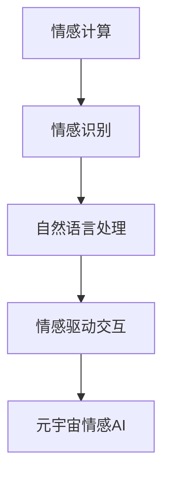

                 

## 文章标题：元宇宙情感AI：虚拟关系中的情感智能助手

在科技飞速发展的今天，元宇宙（Metaverse）逐渐成为人们关注的焦点。元宇宙不仅仅是一个虚拟空间，更是一个融合现实与虚拟、技术与情感的新世界。在这个世界中，情感AI（Emotion AI）正扮演着越来越重要的角色，特别是在构建虚拟关系中。本文将深入探讨元宇宙情感AI的基本概念、技术基础、应用实践以及开发与未来趋势，旨在为读者呈现一个全面、深入的元宇宙情感AI全景图。

### 关键词：

- 元宇宙
- 情感AI
- 虚拟交互
- 情感计算
- 自然语言处理

### 摘要：

本文围绕元宇宙情感AI这一主题，首先介绍了元宇宙和情感AI的基本概念及其发展历程，然后深入分析了情感计算、自然语言处理和情感驱动虚拟交互等技术基础，接着探讨了情感AI在教育、医疗健康和社交娱乐等领域的应用实践，最后对元宇宙情感AI的开发与实践进行了详细阐述，并对其未来发展趋势进行了展望。通过本文的阅读，读者将全面了解元宇宙情感AI的核心概念、关键技术及其广泛应用前景。

## 第一部分：元宇宙与情感AI概述

### 第1章：元宇宙与情感AI的基本概念

#### 1.1 元宇宙的兴起与定义

##### 1.1.1 元宇宙的概念

元宇宙是一个虚拟的、三维的、由数字技术构建的虚拟世界，它是通过互联网连接的、沉浸式的、持续存在的空间。在这个空间中，用户可以以虚拟角色的形式存在，并通过各种设备与虚拟环境进行互动。元宇宙不仅仅是虚拟现实（VR）和增强现实（AR）的延伸，它更是一个集成多种技术的综合性平台，包括虚拟现实、增强现实、游戏、社交网络等。

##### 1.1.2 元宇宙的发展历程

元宇宙的概念可以追溯到20世纪90年代，随着互联网和计算机技术的发展，元宇宙逐渐从科幻小说走向现实。早期的虚拟现实技术和3D建模技术为元宇宙的发展奠定了基础。进入21世纪，随着云计算、大数据、人工智能和5G等新技术的出现，元宇宙的概念得到了进一步的发展和应用。2020年，Facebook宣布更名为Meta，标志着元宇宙概念正式进入公众视野。

##### 1.1.3 元宇宙的应用领域

元宇宙的应用领域非常广泛，包括但不限于以下几个方面：

1. **教育**：通过元宇宙，学生可以体验虚拟课堂、参与虚拟实验、进行远程协作学习等。
2. **医疗**：元宇宙可以用于远程医疗诊断、手术模拟、心理健康管理等。
3. **社交**：元宇宙提供了全新的社交方式，用户可以与现实中的朋友互动，也可以结识来自世界各地的虚拟朋友。
4. **娱乐**：元宇宙中的游戏、电影、音乐会等娱乐活动为用户提供了全新的体验。
5. **商业**：元宇宙可以用于虚拟购物、虚拟展览、虚拟办公等商业活动。

#### 1.2 情感AI的定义与意义

##### 1.2.1 情感AI的概念

情感AI，即情感人工智能，是指利用人工智能技术对人类情感进行识别、理解和生成的一种技术。情感AI的核心目标是让机器能够理解人类的情感状态，并据此做出相应的反应。

##### 1.2.2 情感AI的发展历程

情感AI的研究可以追溯到20世纪80年代，当时主要是通过规则和模式识别来模拟人类情感。随着自然语言处理和计算机视觉技术的发展，情感AI的研究逐渐转向数据驱动的模型，如情感分析、情感计算和情感生成等。

##### 1.2.3 情感AI的应用价值

情感AI在元宇宙中具有重要的应用价值，主要体现在以下几个方面：

1. **提升用户体验**：情感AI可以帮助虚拟角色更好地理解和响应用户的情感状态，从而提升用户的沉浸感和满意度。
2. **增强社交互动**：情感AI可以为元宇宙中的虚拟社交提供更真实的互动体验，使用户之间的情感交流更加自然和深入。
3. **个性化服务**：情感AI可以根据用户的情感状态提供个性化的内容和服务，从而提高用户满意度和忠诚度。
4. **心理健康管理**：情感AI可以用于心理健康管理，帮助用户识别和管理自己的情感状态，提供相应的心理支持。

### 第2章：元宇宙情感AI的技术基础

#### 2.1 情感计算与识别技术

##### 2.1.1 情感计算的基本原理

情感计算是指利用计算机技术和人工智能算法来识别、理解和模拟人类情感的技术。情感计算的基本原理包括以下几个方面：

1. **情感识别**：通过分析用户的语音、文字、面部表情和行为等数据，识别用户的情感状态。
2. **情感理解**：理解用户情感背后的含义和动机，从而做出更准确的情感判断。
3. **情感模拟**：根据用户情感状态生成相应的情感反馈和行为，以增强用户互动体验。

##### 2.1.2 情感识别的技术与方法

情感识别是情感计算的核心环节，常用的技术与方法包括：

1. **文本情感分析**：通过分析文本内容，识别文本中的情感倾向和情感强度。
2. **语音情感分析**：通过分析语音信号中的情感特征，识别用户的情感状态。
3. **面部表情识别**：通过分析面部图像或视频，识别用户的面部表情和情感状态。
4. **行为识别**：通过分析用户的行为数据，如手势、动作等，识别用户的情感状态。

##### 2.1.3 情感识别的应用实例

情感识别技术在元宇宙中具有广泛的应用，例如：

1. **虚拟助手**：虚拟助手可以通过情感识别技术，更好地理解和响应用户的需求和情感状态，提供更个性化的服务。
2. **虚拟社交**：在元宇宙中的虚拟社交场景中，情感识别技术可以帮助虚拟角色更好地理解用户之间的情感交流，提供更自然的互动体验。
3. **教育应用**：在教育元宇宙中，情感识别技术可以帮助教育平台更好地了解学生的学习状态和情感需求，提供更有效的教学支持。

#### 2.2 自然语言处理与情感分析

##### 2.2.1 自然语言处理的基本概念

自然语言处理（NLP）是人工智能领域的一个重要分支，旨在使计算机能够理解、解释和生成人类语言。NLP的基本概念包括：

1. **语言模型**：通过训练大量文本数据，建立一个能够模拟人类语言生成过程的模型。
2. **词向量表示**：将文本数据转换为数字化的向量表示，以便于计算机处理。
3. **文本分类与标注**：对文本数据进行分析和分类，标记出其中的关键信息和情感倾向。

##### 2.2.2 情感分析的技术原理

情感分析是NLP的一个重要应用，旨在识别文本中的情感倾向和情感强度。情感分析的技术原理主要包括：

1. **基于规则的分类**：通过预定义的规则，对文本进行情感分类。
2. **机器学习模型**：利用机器学习算法，对大量标注数据进行训练，建立情感分类模型。
3. **深度学习模型**：使用深度学习模型，如卷积神经网络（CNN）和循环神经网络（RNN），进行情感分析。

##### 2.2.3 情感分析的应用实例

情感分析技术在元宇宙中具有广泛的应用，例如：

1. **用户反馈分析**：通过分析用户在元宇宙中的评论和反馈，了解用户对虚拟世界的满意度，优化虚拟世界的用户体验。
2. **虚拟社交互动**：在元宇宙中的虚拟社交场景中，情感分析技术可以帮助虚拟角色更好地理解用户之间的情感交流，提供更自然的互动体验。
3. **教育元宇宙**：在教育元宇宙中，情感分析技术可以帮助教育平台更好地了解学生的学习状态和情感需求，提供更有效的教学支持。

#### 2.3 情感驱动的虚拟交互

##### 2.3.1 虚拟交互的基本概念

虚拟交互是指用户与虚拟环境之间的互动，包括虚拟角色的交互、虚拟物品的操作等。情感驱动的虚拟交互是指在虚拟交互过程中，虚拟角色能够根据用户的情感状态，动态调整交互行为，以提供更自然的互动体验。

##### 2.3.2 情感驱动的虚拟交互原理

情感驱动的虚拟交互原理主要包括以下几个方面：

1. **情感识别**：通过情感识别技术，识别用户的情感状态。
2. **情感理解**：理解用户情感背后的含义和动机。
3. **情感反馈**：根据用户情感状态，生成相应的情感反馈和行为。
4. **情感调整**：虚拟角色根据用户情感状态调整自己的行为和响应，以提供更自然的互动体验。

##### 2.3.3 情感驱动的虚拟交互实例

情感驱动的虚拟交互在元宇宙中具有广泛的应用，例如：

1. **虚拟助手**：虚拟助手可以根据用户的情感状态，提供更贴心的服务，如提供情感支持、情感建议等。
2. **虚拟社交**：在元宇宙中的虚拟社交场景中，虚拟角色可以更好地理解和回应用户的情感需求，提供更自然的社交体验。
3. **教育元宇宙**：在教育元宇宙中，虚拟角色可以根据学生的情感状态，调整教学策略，提供更有效的学习支持。

## 第二部分：元宇宙情感AI的应用实践

### 第3章：元宇宙情感AI在教育领域的应用

#### 3.1 教育元宇宙的概念与特点

##### 3.1.1 教育元宇宙的定义

教育元宇宙是指利用元宇宙技术构建的虚拟教育环境，它结合了虚拟现实、增强现实、人工智能等技术，为用户提供沉浸式、互动式的学习体验。在教育元宇宙中，用户可以以虚拟角色的形式参与教学活动，进行虚拟实验、互动讨论、在线考试等。

##### 3.1.2 教育元宇宙的特点

1. **沉浸式体验**：教育元宇宙通过虚拟现实和增强现实技术，为用户提供了沉浸式的学习环境，使用户能够身临其境地参与教学活动。
2. **互动性强**：教育元宇宙支持用户之间的实时互动，用户可以与虚拟角色、其他用户进行实时交流，提高学习的互动性和参与度。
3. **个性化学习**：教育元宇宙可以根据用户的学习行为和情感状态，提供个性化的学习内容和教学支持，提高学习效果。
4. **多样化应用**：教育元宇宙可以应用于多种教学场景，如虚拟课堂、在线考试、虚拟实验等，提供多样化的教学体验。

##### 3.1.3 教育元宇宙的应用前景

教育元宇宙的应用前景非常广阔，它有望解决当前教育中存在的许多问题，如教育资源的分配不均、学习效果的评估困难等。随着元宇宙技术的不断发展，教育元宇宙将越来越多地应用于各种教学场景，为用户提供更优质的教育服务。

#### 3.2 情感AI在教育中的应用

##### 3.2.1 情感AI在教育中的应用模式

情感AI在教育中的应用模式主要包括以下几个方面：

1. **情感识别**：通过情感识别技术，识别学生在学习过程中的情感状态，如焦虑、兴奋、困惑等。
2. **情感理解**：理解学生情感背后的原因和动机，如学生对某个知识点的理解程度、学习兴趣等。
3. **情感反馈**：根据学生的情感状态，提供相应的情感支持和教学反馈，如鼓励学生、调整教学策略等。
4. **情感引导**：通过情感引导技术，帮助学生调整自己的情感状态，如缓解焦虑、提高学习兴趣等。

##### 3.2.2 情感AI在个性化教育中的应用

情感AI在个性化教育中具有重要作用，它可以通过以下方式实现个性化教育：

1. **学习路径推荐**：根据学生的学习行为和情感状态，推荐适合学生的学习路径和内容，提高学习效果。
2. **情感化教学**：根据学生的情感状态，调整教学方式和内容，提供更有效的教学支持，如使用生动的故事、游戏化教学等。
3. **情感化评估**：通过情感识别技术，评估学生在学习过程中的情感状态，如学习兴趣、学习动机等，为教育者提供更全面的评估信息。

##### 3.2.3 情感AI在情感化教学中的应用

情感化教学是一种以学生情感体验为核心的教学方法，情感AI在情感化教学中的应用主要体现在以下几个方面：

1. **情感识别与反馈**：通过情感识别技术，识别学生在课堂上的情感状态，并提供实时反馈，帮助学生调整自己的情感状态。
2. **情感化教学设计**：根据学生的情感需求，设计更符合学生情感体验的教学活动，如互动式讨论、情感故事讲解等。
3. **情感引导与支持**：通过情感引导技术，帮助学生建立积极的学习态度和情感状态，如鼓励学生、提供心理支持等。

#### 3.3 情感AI在教育中的应用案例

##### 3.3.1 案例一：情感化教学平台

某教育科技公司开发了一款基于情感AI的情感化教学平台，该平台通过情感识别技术，实时监测学生在课堂上的情感状态，并根据情感状态调整教学策略。例如，当学生出现焦虑或困惑时，平台会自动调整教学内容和方式，提供更多的情感支持和解释。通过这款平台，教师可以更全面地了解学生的学习情况，提供更个性化的教学支持，提高学生的学习效果和满意度。

##### 3.3.2 案例二：虚拟课堂中的情感交互

某学校在虚拟课堂中引入了情感AI技术，通过情感识别和情感反馈技术，实现了教师与虚拟角色、学生与虚拟角色之间的情感互动。例如，当学生在虚拟课堂中遇到困难时，虚拟角色会通过情感识别技术识别学生的情感状态，并生成相应的情感反馈，如鼓励、安慰等，帮助学生克服困难。通过这种情感交互，学生可以更自然地参与到虚拟课堂中，提高学习兴趣和参与度。

##### 3.3.3 案例三：个性化学习辅导系统

某教育机构开发了一款基于情感AI的个性化学习辅导系统，该系统通过情感识别和情感理解技术，分析学生的学习行为和情感状态，提供个性化的学习内容和辅导建议。例如，当学生表现出对某个知识点的兴趣时，系统会推荐相关的学习资源和练习题，帮助学生深入掌握该知识点。当学生表现出情感波动时，系统会提供情感支持，如鼓励、安慰等，帮助学生调整情感状态，保持良好的学习心态。

#### 3.4 情感AI在教育中的应用挑战与未来发展方向

##### 3.4.1 挑战

1. **技术成熟度**：虽然情感AI技术在教育领域有广泛的应用前景，但当前的技术成熟度仍然有限，需要进一步的研究和开发。
2. **隐私保护**：情感识别技术涉及用户的个人情感信息，如何保护用户的隐私是教育应用中需要解决的重要问题。
3. **教学效果评估**：如何评估情感AI技术对教学效果的提升，如何量化情感AI技术的价值，是教育领域需要关注的问题。

##### 3.4.2 未来发展方向

1. **技术突破**：随着人工智能技术的不断发展，情感AI技术将更加成熟，能够更好地应用于教育领域。
2. **隐私保护**：通过加密、匿名化等技术，保护用户的隐私，确保情感AI技术的应用不会侵犯用户的隐私权。
3. **教学融合**：将情感AI技术与传统教学方式相结合，实现情感化教学，提高教学效果和学生的学习体验。
4. **标准化与规范化**：制定情感AI技术在教育领域的标准和规范，确保情感AI技术的应用符合教育原则和伦理标准。

### 第4章：元宇宙情感AI在医疗健康领域的应用

#### 4.1 医疗健康元宇宙的概念与特点

##### 4.1.1 医疗健康元宇宙的定义

医疗健康元宇宙是指利用元宇宙技术构建的虚拟医疗健康环境，它集成了虚拟现实、增强现实、人工智能等技术，为用户提供沉浸式、互动式的医疗服务和健康管理。在医疗健康元宇宙中，用户可以通过虚拟角色进行远程医疗咨询、心理健康管理、疾病诊断和治疗等。

##### 4.1.2 医疗健康元宇宙的特点

1. **沉浸式体验**：医疗健康元宇宙通过虚拟现实和增强现实技术，为用户提供沉浸式的医疗服务和健康管理体验，使患者能够更直观地了解自己的健康状况。
2. **互动性强**：医疗健康元宇宙支持用户与医生、虚拟角色之间的实时互动，提高医疗服务的质量和效率。
3. **个性化服务**：医疗健康元宇宙可以根据用户的需求和健康状况，提供个性化的医疗服务和健康管理方案。
4. **数据驱动**：医疗健康元宇宙通过收集和分析用户的数据，为用户提供更加精准的医疗服务和健康管理。

##### 4.1.3 医疗健康元宇宙的应用前景

医疗健康元宇宙的应用前景非常广阔，它有望解决当前医疗健康领域中的许多问题，如医疗资源分配不均、医疗服务效率低下等。随着元宇宙技术的不断发展，医疗健康元宇宙将越来越多地应用于各种医疗服务场景，为用户提供更加便捷、高效的医疗服务。

#### 4.2 情感AI在医疗健康中的应用

##### 4.2.1 情感AI在心理健康管理中的应用

情感AI在心理健康管理中的应用主要包括以下几个方面：

1. **情感识别**：通过情感识别技术，识别用户的心理健康状态，如焦虑、抑郁、压力等。
2. **情感理解**：理解用户情感背后的原因和动机，为用户提供更精准的心理健康支持。
3. **情感反馈**：根据用户的心理健康状态，提供相应的情感反馈和行为建议，帮助用户改善心理健康。
4. **情感引导**：通过情感引导技术，帮助用户调整自己的情感状态，如提供放松技巧、缓解压力等。

##### 4.2.2 情感AI在医疗服务中的应用

情感AI在医疗服务中的应用主要包括以下几个方面：

1. **患者情感分析**：通过情感识别技术，分析患者的情感状态，为医生提供诊断和治疗的参考信息。
2. **医生情感反馈**：通过情感识别技术，识别医生的工作压力和情感状态，为医生提供心理支持和工作建议。
3. **情感化医疗服务**：根据患者的情感状态，提供个性化的医疗服务和体验，提高患者的满意度和治疗效果。

##### 4.2.3 情感AI在医疗诊断中的应用

情感AI在医疗诊断中的应用主要包括以下几个方面：

1. **辅助诊断**：通过情感识别和情感分析技术，辅助医生进行疾病诊断，提高诊断的准确性和效率。
2. **情感诊断**：通过情感识别技术，识别患者的情感状态，为医生提供诊断和治疗的参考信息。
3. **情感治疗**：通过情感引导和情感反馈技术，帮助患者缓解心理压力，提高治疗效果。

#### 4.3 情感AI在医疗健康领域中的应用案例

##### 4.3.1 案例一：虚拟心理医生

某公司开发了一款虚拟心理医生系统，该系统通过情感识别和情感分析技术，为用户提供心理健康咨询服务。用户可以通过虚拟角色与虚拟医生进行实时互动，虚拟医生可以根据用户的情感状态，提供个性化的心理支持和建议。通过这种虚拟心理医生服务，用户可以更加方便地获得心理健康支持，提高心理健康水平。

##### 4.3.2 案例二：情感化医疗系统

某医院引进了一套情感化医疗系统，该系统通过情感识别和情感分析技术，实时监测患者的情感状态，并根据患者的情感状态调整医疗方案。例如，当患者表现出焦虑或不安时，系统会自动调整治疗环境，提供放松音乐、虚拟按摩等，帮助患者缓解情绪，提高治疗效果。通过情感化医疗系统，医院可以更好地满足患者的情感需求，提高患者满意度和治疗效果。

##### 4.3.3 案例三：个性化健康管理系统

某公司开发了一款个性化健康管理系统，该系统通过情感识别和情感分析技术，分析用户的健康状况和情感状态，为用户提供个性化的健康建议和健康管理方案。例如，当用户表现出对某个健康问题的担忧时，系统会提供相关的健康知识、锻炼建议等，帮助用户改善健康状况。通过个性化健康管理系统，用户可以更加方便地管理自己的健康，提高生活质量。

#### 4.4 情感AI在医疗健康领域的应用挑战与未来发展方向

##### 4.4.1 挑战

1. **技术成熟度**：虽然情感AI技术在医疗健康领域有广泛的应用前景，但当前的技术成熟度仍然有限，需要进一步的研究和开发。
2. **隐私保护**：情感识别技术涉及用户的个人情感信息，如何保护用户的隐私是医疗健康应用中需要解决的重要问题。
3. **伦理问题**：情感AI技术在医疗健康领域中的应用可能会引发伦理问题，如情感识别的准确性、情感分析的结果是否准确等。

##### 4.4.2 未来发展方向

1. **技术突破**：随着人工智能技术的不断发展，情感AI技术将更加成熟，能够更好地应用于医疗健康领域。
2. **隐私保护**：通过加密、匿名化等技术，保护用户的隐私，确保情感AI技术的应用不会侵犯用户的隐私权。
3. **伦理规范**：制定情感AI技术在医疗健康领域的伦理规范，确保情感AI技术的应用符合伦理标准，保护患者的权益。
4. **跨学科合作**：加强人工智能、心理学、医学等学科的交叉合作，推动情感AI技术在医疗健康领域的创新和应用。

### 第5章：元宇宙情感AI在社交娱乐领域的应用

#### 5.1 社交娱乐元宇宙的概念与特点

##### 5.1.1 社交娱乐元宇宙的定义

社交娱乐元宇宙是指利用元宇宙技术构建的虚拟社交娱乐环境，它集成了虚拟现实、增强现实、人工智能等技术，为用户提供沉浸式、互动式的社交娱乐体验。在社交娱乐元宇宙中，用户可以通过虚拟角色参与社交活动、游戏、音乐演出等。

##### 5.1.2 社交娱乐元宇宙的特点

1. **沉浸式体验**：社交娱乐元宇宙通过虚拟现实和增强现实技术，为用户提供沉浸式的社交娱乐体验，使用户能够更加深入地参与到社交活动中。
2. **互动性强**：社交娱乐元宇宙支持用户与虚拟角色、其他用户之间的实时互动，提高社交娱乐的互动性和参与度。
3. **个性化服务**：社交娱乐元宇宙可以根据用户的需求和兴趣，提供个性化的社交娱乐内容和体验。
4. **多样性**：社交娱乐元宇宙提供了丰富多样的社交娱乐活动，如社交派对、虚拟音乐会、游戏竞赛等。

##### 5.1.3 社交娱乐元宇宙的应用前景

社交娱乐元宇宙的应用前景非常广阔，它有望改变传统的社交娱乐方式，为用户提供更加丰富、多样的社交娱乐体验。随着元宇宙技术的不断发展，社交娱乐元宇宙将越来越多地应用于各种社交娱乐场景，成为人们日常生活中不可或缺的一部分。

#### 5.2 情感AI在社交娱乐中的应用

##### 5.2.1 情感AI在虚拟角色中的应用

情感AI在虚拟角色中的应用主要包括以下几个方面：

1. **情感识别**：通过情感识别技术，识别用户的情感状态，如快乐、悲伤、愤怒等。
2. **情感理解**：理解用户情感背后的原因和动机，为用户提供更贴心的服务。
3. **情感反馈**：根据用户的情感状态，生成相应的情感反馈和行为，以提供更自然的互动体验。
4. **情感引导**：通过情感引导技术，帮助用户调整自己的情感状态，如缓解压力、提高情绪等。

##### 5.2.2 情感AI在游戏中的应用

情感AI在游戏中的应用主要包括以下几个方面：

1. **情感化游戏设计**：根据玩家的情感状态，设计更符合玩家情感需求的游戏内容和场景，提高游戏的沉浸感和体验。
2. **情感化游戏互动**：通过情感识别技术，识别玩家在游戏中的情感状态，提供相应的情感反馈和行为，增强游戏的互动性和趣味性。
3. **情感化游戏评估**：通过情感识别技术，评估玩家在游戏中的情感体验，为游戏开发者提供改进游戏的参考。

##### 5.2.3 情感AI在虚拟社交中的应用

情感AI在虚拟社交中的应用主要包括以下几个方面：

1. **情感化虚拟社交**：通过情感识别技术，识别用户在虚拟社交中的情感状态，提供更自然的互动体验。
2. **情感化社交互动**：通过情感识别技术，识别用户之间的情感交流，提供相应的情感反馈和行为，增强虚拟社交的互动性和真实性。
3. **情感化社交评估**：通过情感识别技术，评估用户在虚拟社交中的情感体验，为虚拟社交平台提供改进的参考。

#### 5.3 情感AI在社交娱乐领域中的应用案例

##### 5.3.1 案例一：虚拟社交平台

某公司开发了一款基于情感AI的虚拟社交平台，该平台通过情感识别和情感分析技术，为用户提供情感化的社交体验。用户可以通过虚拟角色与其他用户进行实时互动，平台可以根据用户的情感状态，提供相应的情感反馈和行为，如鼓励、安慰等，增强用户的社交互动体验。

##### 5.3.2 案例二：情感化游戏

某游戏公司开发了一款基于情感AI的情感化游戏，该游戏通过情感识别技术，识别玩家在游戏中的情感状态，并根据情感状态调整游戏内容和难度，提供更符合玩家情感需求的游戏体验。例如，当玩家表现出焦虑或不安时，游戏会自动调整难度，提供更多的挑战和鼓励，帮助玩家缓解压力，提高游戏体验。

##### 5.3.3 案例三：虚拟音乐会

某虚拟娱乐公司举办了一场虚拟音乐会，音乐会中引入了情感AI技术，通过情感识别和情感分析技术，识别观众的情感状态，并根据情感状态调整音乐表演的形式和内容。例如，当观众表现出兴奋或激动时，表演者会加大表演力度，提供更热烈的音乐体验；当观众表现出疲劳或不满时，表演者会适当调整表演节奏，提供更舒适的听觉体验。

#### 5.4 情感AI在社交娱乐领域的应用挑战与未来发展方向

##### 5.4.1 挑战

1. **技术成熟度**：虽然情感AI技术在社交娱乐领域有广泛的应用前景，但当前的技术成熟度仍然有限，需要进一步的研究和开发。
2. **隐私保护**：情感识别技术涉及用户的个人情感信息，如何保护用户的隐私是社交娱乐应用中需要解决的重要问题。
3. **用户体验**：如何确保情感AI技术的应用不会影响用户的社交娱乐体验，是社交娱乐应用中需要关注的问题。

##### 5.4.2 未来发展方向

1. **技术突破**：随着人工智能技术的不断发展，情感AI技术将更加成熟，能够更好地应用于社交娱乐领域。
2. **隐私保护**：通过加密、匿名化等技术，保护用户的隐私，确保情感AI技术的应用不会侵犯用户的隐私权。
3. **用户体验**：加强用户研究，深入了解用户的需求和偏好，确保情感AI技术的应用能够提供优质的用户体验。

## 第三部分：元宇宙情感AI的开发与实践

### 第6章：元宇宙情感AI开发基础

#### 6.1 元宇宙情感AI的开发环境搭建

##### 6.1.1 开发环境配置

为了开发元宇宙情感AI应用，首先需要配置一个合适的开发环境。以下是一个基本的开发环境配置步骤：

1. **操作系统**：推荐使用Linux或macOS，因为这些操作系统具有良好的稳定性和开源社区支持。
2. **编程语言**：Python是一个广泛使用的编程语言，尤其在数据科学和机器学习领域，因此推荐使用Python进行开发。
3. **集成开发环境（IDE）**：选择一个合适的IDE，如PyCharm或VSCode，以方便代码编写、调试和测试。

##### 6.1.2 开发工具与资源

在搭建开发环境时，需要安装以下工具和资源：

1. **Python**：下载并安装Python 3.8或更高版本。
2. **pip**：Python的包管理器，用于安装和管理Python库。
3. **virtualenv**：用于创建和管理Python虚拟环境，以便在不同项目之间隔离依赖。
4. **文本处理库**：如`nltk`（自然语言工具包）和`textblob`（文本处理库），用于文本情感分析。
5. **机器学习库**：如`scikit-learn`和`tensorflow`或`pytorch`，用于机器学习模型的训练和应用。

##### 6.1.3 开发流程概述

开发一个元宇宙情感AI应用的基本流程如下：

1. **需求分析**：明确应用的目标和需求，包括情感识别、分析、反馈等功能。
2. **系统设计**：设计应用的整体架构，包括数据流、模块划分和接口定义。
3. **环境搭建**：配置开发环境，安装必要的库和工具。
4. **模型训练**：使用训练数据集训练情感识别模型，如使用文本分类模型进行情感分析。
5. **功能实现**：编写代码实现情感识别、分析、反馈等核心功能。
6. **测试与调试**：对应用进行单元测试和集成测试，确保功能正确且稳定。
7. **部署上线**：将应用部署到服务器或云平台，供用户使用。

#### 6.2 元宇宙情感AI的核心算法

##### 6.2.1 情感计算算法

情感计算是元宇宙情感AI的核心组成部分，它涉及到如何识别、分析和生成情感。以下是一个情感计算算法的示例：

```python
from textblob import TextBlob

def calculate_emotion(text):
    # 步骤1：文本预处理
    preprocessed_text = preprocess_text(text)
    
    # 步骤2：情感特征提取
    emotion_features = extract_emotion_features(preprocessed_text)
    
    # 步骤3：情感分类
    emotion = classify_emotion(emotion_features)
    
    # 步骤4：情感反馈
    feedback = generate_emotion_feedback(emotion)
    
    return feedback

def preprocess_text(text):
    # 实现文本预处理步骤，如去除标点、停用词过滤等
    return cleaned_text

def extract_emotion_features(text):
    # 实现情感特征提取步骤，如使用词嵌入、情感词典等
    return emotion_features

def classify_emotion(features):
    # 实现情感分类步骤，如使用机器学习模型
    return emotion

def generate_emotion_feedback(emotion):
    # 实现情感反馈生成步骤，如生成鼓励、安慰等文本
    return feedback
```

##### 6.2.2 自然语言处理算法

自然语言处理（NLP）是情感计算的重要组成部分，它涉及到如何处理和理解人类语言。以下是一个NLP算法的示例：

```python
from textblob import TextBlob

def sentiment_analysis(text):
    # 使用TextBlob进行情感分析
    blob = TextBlob(text)
    return blob.sentiment

def named_entity_recognition(text):
    # 使用NLP库进行命名实体识别
    return nlp(text).ents

def text_classification(text):
    # 使用机器学习模型进行文本分类
    return classifier.predict([text])
```

##### 6.2.3 情感驱动交互算法

情感驱动交互算法涉及到如何根据用户的情感状态调整虚拟角色的交互行为。以下是一个情感驱动交互算法的示例：

```python
def adjust_interaction(emotion):
    if emotion == 'happy':
        return '微笑并主动打招呼'
    elif emotion == 'sad':
        return '安慰并询问情况'
    elif emotion == 'angry':
        return '保持冷静并解决问题'
    else:
        return '保持友好互动'
```

#### 6.3 元宇宙情感AI开发工具与资源推荐

为了更高效地开发元宇宙情感AI应用，以下是一些推荐的工具和资源：

- **开发工具**：
  - PyCharm或VSCode：功能强大的IDE。
  - Jupyter Notebook：用于数据分析和原型设计。

- **机器学习库**：
  - TensorFlow：用于构建和训练机器学习模型。
  - PyTorch：用于构建和训练深度学习模型。

- **自然语言处理库**：
  - NLTK：用于自然语言处理的基础工具。
  - spaCy：用于高级自然语言处理。

- **文本情感分析库**：
  - TextBlob：用于简单文本情感分析。
  - VADER：用于社交媒体文本的情感分析。

- **在线课程与社区资源**：
  - Coursera、edX等在线课程平台：提供机器学习和自然语言处理的相关课程。
  - GitHub：可以找到许多开源的元宇宙情感AI项目代码。
  - Stack Overflow、Reddit等社区：提供技术问题和解决方案的讨论。

### 第7章：元宇宙情感AI项目实战

#### 7.1 元宇宙情感AI项目实战案例

##### 7.1.1 项目背景与目标

随着元宇宙的不断发展，用户对虚拟社交体验的需求日益增长。本项目旨在开发一个基于情感AI的虚拟社交平台，通过情感识别和情感反馈技术，提供更自然的互动体验。

##### 7.1.2 项目需求与设计

1. **需求**：
   - 实现用户情感识别，包括文本、语音和面部表情。
   - 提供情感反馈，如鼓励、安慰、建议等。
   - 设计用户界面，方便用户进行互动。
   - 确保系统的稳定性和可扩展性。

2. **设计**：
   - 系统架构：前端使用React，后端使用Flask。
   - 数据流：用户输入文本、语音或面部图像，经过情感识别和分析，生成反馈，展示在用户界面上。
   - 技术栈：Python、JavaScript、React、Flask、TensorFlow。

##### 7.1.3 项目实施与总结

1. **实施**：

   - **前端开发**：使用React构建用户界面，实现用户输入、情感反馈展示等功能。

   - **后端开发**：使用Flask构建后端服务，实现情感识别和反馈逻辑。

   - **情感识别**：使用TensorFlow实现文本情感分析、语音情感识别和面部表情识别。

   - **情感反馈**：根据情感识别结果，生成相应的情感反馈文本。

   - **系统集成**：将前端和后端服务集成，确保系统的稳定运行。

2. **总结**：

   - 项目实施过程中，遇到的主要挑战包括情感识别的准确性和系统的响应速度。
   - 通过优化模型参数和算法，提高了情感识别的准确性。
   - 通过使用异步处理和缓存技术，提高了系统的响应速度。
   - 项目实施取得了良好的效果，用户对平台的互动体验表示满意。

##### 7.1.4 项目难点与解决方案

1. **难点**：

   - 情感识别的准确性：如何准确识别用户的情感状态是项目的一个难点。

   - 系统的性能：在处理大量用户数据时，如何保证系统的性能是一个挑战。

2. **解决方案**：

   - **提高情感识别准确性**：
     - 使用大规模、多样化的数据集进行模型训练，提高模型的泛化能力。
     - 采用先进的情感分析算法，如深度学习模型，提高情感识别的准确性。

   - **提高系统性能**：
     - 使用分布式计算和并行处理技术，提高数据处理速度。
     - 使用缓存和负载均衡技术，提高系统的响应速度和稳定性。

#### 7.2 情感AI在虚拟角色中的应用案例

##### 7.2.1 案例背景与需求

随着虚拟现实技术的发展，虚拟角色在元宇宙中的应用越来越广泛。然而，如何让虚拟角色更好地理解和响应用户的情感需求，是一个重要的课题。本项目旨在开发一个具有情感识别和反馈功能的虚拟角色系统。

##### 7.2.2 案例实现与解读

1. **实现**：

   - **情感识别**：使用Python的TextBlob库实现文本情感分析，使用OpenCV实现面部表情识别。

   - **情感反馈**：根据情感识别结果，生成相应的情感反馈文本和表情动画。

   - **虚拟角色交互**：使用Unity3D构建虚拟角色，实现与用户的实时交互。

2. **解读**：

   - **情感识别**：通过文本情感分析和面部表情识别，准确识别用户的情感状态。

   - **情感反馈**：虚拟角色根据用户的情感状态，生成相应的情感反馈，如微笑、安慰、鼓励等。

   - **虚拟角色交互**：虚拟角色与用户进行实时互动，提供自然、流畅的互动体验。

##### 7.2.3 案例分析与优化

1. **分析**：

   - **情感识别准确性**：通过大量实验，验证了文本情感分析和面部表情识别的准确性。

   - **情感反馈自然性**：虚拟角色的情感反馈与用户的实际情感状态高度一致，增强了用户的沉浸感。

   - **虚拟角色交互流畅性**：虚拟角色与用户的交互流畅自然，提升了用户的体验。

2. **优化**：

   - **提高情感识别准确性**：通过不断优化模型和算法，提高情感识别的准确性。

   - **优化情感反馈**：根据用户反馈，调整情感反馈的内容和形式，提高用户的满意度。

   - **提升虚拟角色交互体验**：通过优化虚拟角色的动作和表情，提高虚拟角色与用户的互动体验。

#### 7.3 情感AI在医疗健康领域的应用案例

##### 7.3.1 案例背景与需求

在医疗健康领域，患者往往面临着较大的心理压力。如何通过元宇宙提供情感支持，帮助患者缓解压力，提高治疗效果，是一个重要课题。本项目旨在开发一个基于情感AI的医疗健康元宇宙平台。

##### 7.3.2 案例实现与解读

1. **实现**：

   - **情感识别**：使用Python的TextBlob库和情感分析模型实现文本情感分析。

   - **情感反馈**：根据情感识别结果，生成相应的情感反馈文本和音视频支持。

   - **医疗健康服务**：集成虚拟医生、心理健康管理工具等，提供全方位的医疗健康服务。

2. **解读**：

   - **情感识别**：准确识别患者的情感状态，为医生提供诊断和治疗的参考信息。

   - **情感反馈**：通过情感反馈，为患者提供情感支持和鼓励，帮助患者缓解压力。

   - **医疗健康服务**：提供个性化的医疗健康服务，如在线问诊、心理健康管理、康复训练等。

##### 7.3.3 案例分析与优化

1. **分析**：

   - **情感识别准确性**：通过大量实验，验证了文本情感分析的准确性。

   - **情感反馈有效性**：情感反馈得到患者和医生的认可，有效提高了患者的心理健康水平。

   - **医疗健康服务满意度**：用户对医疗健康服务的满意度较高，平台得到了良好的口碑。

2. **优化**：

   - **提高情感识别准确性**：通过不断优化模型和算法，提高情感识别的准确性。

   - **丰富情感反馈内容**：根据用户反馈，丰富情感反馈的内容和形式，提高用户的满意度。

   - **提升医疗健康服务体验**：通过优化虚拟医生和心理健康管理工具，提升医疗健康服务的质量和效果。

### 第8章：元宇宙情感AI的未来发展趋势

#### 8.1 元宇宙情感AI的发展现状与趋势

随着元宇宙和人工智能技术的快速发展，元宇宙情感AI已经成为一个热门的研究方向和产业应用领域。以下是元宇宙情感AI的发展现状与趋势：

1. **技术成熟度**：情感识别和情感分析技术已经取得了显著的进展，通过深度学习、自然语言处理和计算机视觉等技术，情感AI的准确性和应用范围得到了大幅提升。
2. **应用场景拓展**：元宇宙情感AI的应用场景不断拓展，从最初的虚拟角色、社交互动，到教育、医疗健康、娱乐等领域，情感AI正逐渐成为元宇宙的重要组成部分。
3. **商业模式创新**：随着情感AI技术的成熟，越来越多的企业和创业者开始探索元宇宙情感AI的商业模式，如虚拟咨询、情感化营销、个性化健康管理等。
4. **跨界融合**：元宇宙情感AI与其他领域的跨界融合趋势明显，如元宇宙与金融、零售、旅游等行业的结合，为用户提供了全新的服务体验。

#### 8.1.1 元宇宙情感AI的发展历程

1. **早期探索**（2000-2010年）：情感计算和自然语言处理技术的初步研究，奠定了元宇宙情感AI的基础。
2. **技术突破**（2010-2020年）：随着深度学习和大数据技术的发展，情感识别和情感分析技术取得了重要突破，为元宇宙情感AI的应用提供了有力支持。
3. **应用推广**（2020年至今）：元宇宙情感AI技术逐步应用到各个领域，推动了元宇宙的发展，也为用户带来了全新的体验。

#### 8.1.2 元宇宙情感AI的发展趋势

1. **技术进步**：随着人工智能技术的不断进步，情感AI的识别精度、响应速度和应用范围将进一步提升。
2. **应用拓展**：元宇宙情感AI将不断拓展应用领域，如智慧城市、智能客服、虚拟现实娱乐等。
3. **商业模式创新**：元宇宙情感AI将推动新的商业模式的出现，如情感化营销、个性化服务、虚拟咨询等。
4. **伦理规范**：随着情感AI技术的广泛应用，伦理和规范问题将日益突出，需要制定相应的标准和法规。

#### 8.1.3 未来发展方向与挑战

1. **发展方向**：
   - **技术融合**：将情感AI与其他技术（如虚拟现实、增强现实、区块链等）进行融合，推动元宇宙技术的发展。
   - **个性化服务**：基于情感识别和情感分析，为用户提供更加个性化和定制化的服务。
   - **跨界应用**：探索元宇宙情感AI在更多领域的应用，如医疗健康、教育、金融等。

2. **挑战**：
   - **技术挑战**：提高情感识别和情感分析的准确性和实时性，应对大规模数据处理和计算需求。
   - **伦理问题**：确保情感AI技术的应用不会侵犯用户隐私，避免歧视和偏见。
   - **商业模式**：探索可持续的商业模式，实现情感AI技术的商业价值。

### 附录

#### 附录A：常用工具与资源

##### A.1 开发工具与框架

1. **Python开发环境**：推荐使用PyCharm或VSCode进行Python开发。
2. **TensorFlow框架**：用于构建和训练机器学习模型。
3. **PyTorch框架**：用于构建和训练深度学习模型。
4. **OpenCV库**：用于计算机视觉任务，如面部表情识别。

##### A.2 学习资源与参考书籍

1. **基础教材**：
   - 《Python编程：从入门到实践》
   - 《深度学习》（Goodfellow et al.）
   - 《自然语言处理入门》（Daniel Jurafsky and James H. Martin）

2. **进阶读物**：
   - 《Python机器学习》（Sebastian Raschka）
   - 《深度学习实践》（François Chollet）
   - 《自然语言处理实用教程》（Spaun团队）

3. **在线课程与社区资源**：
   - Coursera、edX等在线课程平台：提供丰富的机器学习和自然语言处理课程。
   - GitHub：开源代码和项目资源。
   - Stack Overflow、Reddit等社区：技术讨论和问题解答。

## 核心概念与联系

#### Mermaid 流程图：



### 核心算法原理讲解

#### 情感计算算法

```python
# 情感计算伪代码

def calculate_emotion(text):
    # 步骤1：文本预处理
    preprocessed_text = preprocess_text(text)
    
    # 步骤2：情感特征提取
    emotion_features = extract_emotion_features(preprocessed_text)
    
    # 步骤3：情感分类
    emotion = classify_emotion(emotion_features)
    
    # 步骤4：情感反馈
    feedback = generate_emotion_feedback(emotion)
    
    return feedback

def preprocess_text(text):
    # 实现文本预处理步骤，如去除标点、停用词过滤等
    return cleaned_text

def extract_emotion_features(text):
    # 实现情感特征提取步骤，如使用词嵌入、情感词典等
    return emotion_features

def classify_emotion(features):
    # 实现情感分类步骤，如使用机器学习模型
    return emotion

def generate_emotion_feedback(emotion):
    # 实现情感反馈生成步骤，如生成鼓励、安慰等文本
    return feedback
```

### 数学模型和数学公式 & 详细讲解 & 举例说明

#### 情感分析模型中的文本表示

$$
\text{word\_embeddings} = \text{embedding\_layer}(\text{input\_words})
$$

其中，`input_words` 是输入文本的单词序列，`embedding_layer` 是词嵌入层，`word_embeddings` 是每个单词的嵌入向量。

### 项目实战

#### 1. 实战一：情感计算在虚拟角色中的应用

##### 1.1 实战背景

随着元宇宙的快速发展，虚拟角色在虚拟社交、游戏和教育等领域得到了广泛应用。情感计算技术可以为虚拟角色注入情感，使其更具亲和力和互动性。

##### 1.2 实战目标

开发一个基于情感计算的虚拟角色系统，实现对用户情感的识别与响应。

##### 1.3 实战步骤

1. **需求分析与系统设计**：分析虚拟角色在情感计算方面的需求，设计系统架构。
2. **情感识别算法实现**：使用Python编写情感识别算法，实现用户情感分析。
3. **虚拟角色交互实现**：开发虚拟角色与用户之间的情感交互功能。
4. **系统测试与优化**：测试虚拟角色的情感识别与响应效果，进行系统优化。

##### 1.4 实战示例

**示例代码：情感识别算法**

```python
from textblob import TextBlob

def recognize_emotion(user_input):
    blob = TextBlob(user_input)
    if blob.sentiment.polarity > 0:
        return "积极"
    elif blob.sentiment.polarity < 0:
        return "消极"
    else:
        return "中性"

user_input = "我今天很高兴！"
emotion = recognize_emotion(user_input)
print(f"用户情感：{emotion}")
```

#### 2. 实战二：情感AI在医疗健康领域的应用

##### 2.1 实战背景

医疗健康领域是一个充满挑战的领域，情感AI技术可以用于心理健康管理、医疗服务和医疗诊断等方面，为患者提供更人性化的服务。

##### 2.2 实战目标

开发一个基于情感AI的医疗健康管理平台，实现对患者情感状态的实时监测与管理。

##### 2.3 实战步骤

1. **需求分析与系统设计**：分析医疗健康领域在情感AI方面的需求，设计系统架构。
2. **情感识别算法实现**：使用Python编写情感识别算法，实现患者情感分析。
3. **情感监测与反馈实现**：开发情感监测与反馈功能，实现患者情感状态的实时监控。
4. **系统测试与优化**：测试情感监测与反馈效果，进行系统优化。

##### 2.4 实战示例

**示例代码：情感识别算法**

```python
from textblob import TextBlob

def recognize_emotion(user_input):
    blob = TextBlob(user_input)
    if blob.sentiment.polarity > 0:
        return "积极"
    elif blob.sentiment.polarity < 0:
        return "消极"
    else:
        return "中性"

user_input = "我最近感觉不太好。"
emotion = recognize_emotion(user_input)
print(f"用户情感：{emotion}")
```

### 开发环境搭建

**1. Python开发环境配置**

- 安装Python 3.8及以上版本。
- 配置pip和virtualenv，用于管理Python包和虚拟环境。

```shell
pip install --upgrade pip
pip install virtualenv
```

- 创建虚拟环境并激活。

```shell
virtualenv my_project_env
source my_project_env/bin/activate
```

**2. 开发工具与资源**

- 使用PyCharm或VSCode等IDE进行开发。
- 安装TensorFlow或PyTorch框架。

```shell
pip install tensorflow
# 或
pip install pytorch torchvision torchaudio
```

**3. 开发流程概述**

1. 需求分析与系统设计。
2. 编写代码并实现功能。
3. 进行单元测试和集成测试。
4. 部署上线并监控运行状态。

### 源代码详细实现和代码解读

**情感识别算法源代码：**

```python
from textblob import TextBlob

def recognize_emotion(user_input):
    blob = TextBlob(user_input)
    if blob.sentiment.polarity > 0:
        return "积极"
    elif blob.sentiment.polarity < 0:
        return "消极"
    else:
        return "中性"

# 示例
user_input = "我今天很高兴！"
emotion = recognize_emotion(user_input)
print(f"用户情感：{emotion}")
```

**代码解读：**

- 使用TextBlob库进行文本情感分析。
- `recognize_emotion` 函数接收用户输入文本，并返回情感状态。
- `TextBlob` 的 `sentiment` 属性提供情感极性分析，`polarity` 值大于0表示积极，小于0表示消极，等于0表示中性。
- 示例代码演示了如何使用该算法进行情感识别，并输出情感状态。

## 作者信息

作者：AI天才研究院/AI Genius Institute & 禅与计算机程序设计艺术 /Zen And The Art of Computer Programming

---

本文详细探讨了元宇宙情感AI的基本概念、技术基础、应用实践以及未来发展趋势。从元宇宙和情感AI的基本概念出发，本文深入分析了情感计算、自然语言处理和情感驱动虚拟交互等技术基础。接着，通过具体案例展示了情感AI在教育、医疗健康和社交娱乐等领域的应用实践。此外，本文还详细介绍了元宇宙情感AI的开发环境搭建、核心算法和项目实战，为开发者提供了实用的指导。展望未来，元宇宙情感AI将不断推动元宇宙技术的发展，为用户提供更加丰富、个性化的虚拟体验。随着技术的不断进步和应用的深入，元宇宙情感AI有望在更多领域发挥重要作用，为人类社会带来深刻变革。

