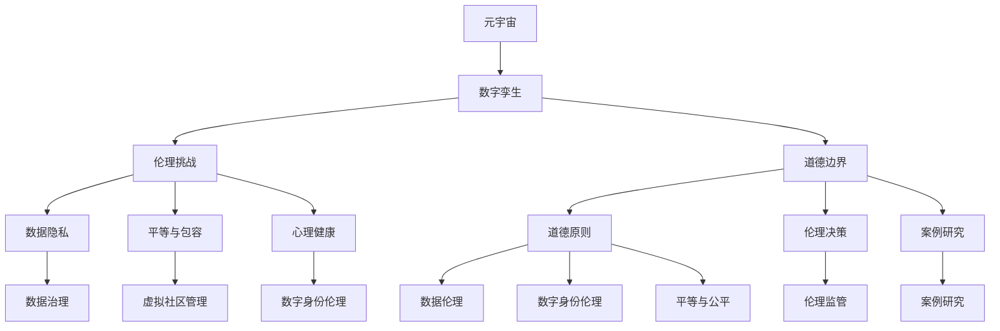

                 

# 《元宇宙数字孪生伦理：现实映射的道德边界探讨》

> 关键词：元宇宙、数字孪生、伦理、道德边界、数据隐私、心理健康、平等与包容

> 摘要：本文探讨了元宇宙数字孪生技术的伦理挑战和道德边界。首先，对元宇宙和数字孪生的基本概念进行了概述，接着分析了元宇宙数字孪生技术带来的数据隐私、心理健康、平等与包容等方面的伦理挑战。然后，提出了元宇宙数字孪生伦理原则和道德边界，并结合实际案例进行了深入分析。最后，对元宇宙数字孪生伦理的未来监管和展望进行了讨论。

### 目录大纲

# 《元宇宙数字孪生伦理：现实映射的道德边界探讨》目录大纲

## 第一部分：引论

### 第1章：元宇宙与数字孪生概述

#### 1.1 元宇宙的起源与发展

#### 1.2 数字孪生的定义与应用

#### 1.3 元宇宙与数字孪生的联系

### 第2章：元宇宙数字孪生的伦理挑战

#### 2.1 数据隐私与伦理

#### 2.2 平等与包容

#### 2.3 虚拟现实与心理健康

### 第3章：元宇宙数字孪生的道德边界

#### 3.1 道德原则与框架

#### 3.2 元宇宙数字孪生的伦理决策

#### 3.3 道德边界的案例研究

## 第二部分：元宇宙数字孪生的伦理原则与实践

### 第4章：元宇宙数字孪生伦理原则

#### 4.1 数据伦理

#### 4.2 数字身份伦理

#### 4.3 平等与公平

### 第5章：元宇宙数字孪生的伦理实践

#### 5.1 数据治理与伦理

#### 5.2 虚拟社区管理伦理

#### 5.3 数字身份与伦理

### 第6章：元宇宙数字孪生的伦理案例分析

#### 6.1 数据泄露与伦理

#### 6.2 虚拟社区歧视与伦理

#### 6.3 数字身份争议与伦理

### 第7章：元宇宙数字孪生伦理的监管与未来展望

#### 7.1 伦理监管的现状与挑战

#### 7.2 元宇宙数字孪生伦理的发展趋势

#### 7.3 道德边界的未来探索

## 附录

### 附录A：元宇宙数字孪生伦理相关法规与政策

### 附录B：元宇宙数字孪生伦理案例分析

### 附录C：元宇宙数字孪生伦理研究文献推荐

### 附录D：元宇宙数字孪生伦理研讨会记录与报告

### 核心概念与联系

[Mermaid 流�程图：元宇宙数字孪生伦理核心概念与联系]



### 第一部分：引论

#### 第1章：元宇宙与数字孪生概述

##### 1.1 元宇宙的起源与发展

元宇宙（Metaverse）是一个虚拟的、三维的、完全数字化的世界，用户可以通过数字化的身份在虚拟空间中互动和体验。元宇宙的概念最早可以追溯到1992年的科幻小说《雪崩》（Snow Crash），由尼尔·斯蒂芬森（Neal Stephenson）提出。此后，随着计算机图形学、虚拟现实（VR）、增强现实（AR）、区块链等技术的快速发展，元宇宙逐渐从科幻小说走向现实。

近年来，元宇宙的发展受到了广泛关注，主要源于以下几个因素：

1. **虚拟现实与增强现实技术的进步**：VR和AR技术的发展为用户提供了更加沉浸式的体验，使得元宇宙中的互动和体验更加真实。
2. **5G技术的普及**：5G技术的普及和移动网络的优化为元宇宙中的大规模数据传输提供了保障，降低了延迟和带宽的限制。
3. **区块链技术的应用**：区块链技术为元宇宙中的数字资产和身份验证提供了安全、透明、去中心化的解决方案。

元宇宙的发展趋势包括：

1. **商业应用**：越来越多的企业将元宇宙视为新的商业平台，开发各种虚拟商品和服务，如虚拟房地产、虚拟演唱会、虚拟培训等。
2. **社交互动**：元宇宙成为人们社交互动的新场所，用户可以在虚拟世界中建立社交网络、组织活动、分享经验等。
3. **教育应用**：元宇宙在教育领域的应用也越来越广泛，如虚拟课堂、在线实验、虚拟博物馆等。

##### 1.2 数字孪生的定义与应用

数字孪生（Digital Twin）是一种将现实世界的物理对象、系统或过程以数字化方式复现在虚拟世界中的技术。数字孪生技术通过物联网（IoT）、大数据、云计算等技术，实时收集和分析物理对象的运行数据，构建其数字镜像，实现对物理对象的实时监控、预测和优化。

数字孪生技术的核心组成部分包括：

1. **物理孪生**：现实世界中的物理对象，如设备、生产线、城市等。
2. **虚拟孪生**：基于物理孪生的数据构建的虚拟模型，用于模拟、分析和预测物理对象的运行状态。
3. **数据连接**：通过传感器、IoT设备等收集物理对象的实时数据，并将其传输到虚拟孪生中。
4. **实时分析**：对收集到的数据进行分析，识别潜在问题、优化运行状态、预测未来趋势等。

数字孪生技术的应用领域广泛，包括：

1. **工业制造**：通过数字孪生技术，对生产过程中的设备、生产线等进行实时监控和优化，提高生产效率和产品质量。
2. **城市建设与管理**：利用数字孪生技术，对城市中的基础设施、交通等进行实时监控和管理，提高城市运行效率。
3. **医疗健康**：通过数字孪生技术，对患者的生理数据进行实时监控和分析，为医生提供诊断和治疗依据。
4. **能源管理**：通过数字孪生技术，对能源设备、电网等进行实时监控和优化，提高能源利用效率。

##### 1.3 元宇宙与数字孪生的联系

元宇宙和数字孪生技术之间存在着紧密的联系和相互促进的关系。

1. **技术支撑**：元宇宙的发展离不开数字孪生技术的支撑。数字孪生技术为元宇宙中的虚拟场景和体验提供了真实、准确的物理模型，使得元宇宙中的互动和体验更加真实和沉浸。

2. **数据基础**：元宇宙中的各种应用场景和数据都依赖于数字孪生技术。通过数字孪生技术，可以实时收集和分析物理对象的数据，为元宇宙中的各种应用提供数据支持。

3. **互动体验**：元宇宙中的互动体验离不开数字孪生技术的应用。通过数字孪生技术，用户可以更加真实地感受到虚拟世界中的物理对象和环境。

4. **发展推动**：元宇宙和数字孪生技术相互推动，共同发展。元宇宙的发展为数字孪生技术提供了更广阔的应用场景，而数字孪生技术的发展又为元宇宙提供了更加真实和沉浸的体验。

总之，元宇宙和数字孪生技术之间相互依赖、相互促进，共同构建了一个全新的虚拟世界，为人们的生活、工作、娱乐带来了无限的想象空间。

#### 第2章：元宇宙数字孪生的伦理挑战

##### 2.1 数据隐私与伦理

随着元宇宙和数字孪生技术的发展，数据隐私问题日益凸显。在元宇宙中，用户的数据隐私面临着多重挑战。

1. **用户数据的采集与利用**：元宇宙平台需要收集大量的用户数据，包括身份信息、行为数据、社交关系等，以提供个性化的服务和体验。然而，这些数据的收集和利用可能涉及到用户的隐私权，如何平衡数据利用与隐私保护成为伦理挑战。

2. **数据泄露的风险**：在元宇宙中，数据泄露的风险较高。由于网络攻击、数据存储安全漏洞等原因，用户的数据可能被未授权的第三方获取和利用，导致隐私泄露。

3. **数据滥用的问题**：在元宇宙中，用户数据可能被用于广告推送、商业分析等目的。如果数据滥用不当，可能导致用户的隐私受到侵犯，甚至引发不公平的商业竞争。

4. **数据透明性与知情同意**：在元宇宙中，用户对自身数据的透明性和知情同意权难以得到保障。许多元宇宙平台在收集和使用用户数据时，未充分告知用户数据的具体用途和范围，导致用户难以作出知情同意。

应对数据隐私与伦理挑战的措施：

1. **强化数据安全保护**：元宇宙平台应加强数据安全保护措施，包括数据加密、访问控制、安全审计等，降低数据泄露的风险。

2. **明确数据收集与使用的规范**：制定明确的数据收集与使用规范，确保用户数据的合法性和合规性，减少数据滥用的情况。

3. **增强用户数据透明性**：提高用户对自身数据的透明性，包括数据收集的目的、范围、使用方式等，让用户在知情的情况下做出选择。

4. **加强用户数据保护意识**：通过教育宣传，提高用户对数据隐私保护的认识，增强用户在元宇宙中的数据保护意识。

##### 2.2 平等与包容

元宇宙和数字孪生技术为人们提供了全新的虚拟世界和体验，但在平等与包容方面也面临挑战。

1. **数字鸿沟问题**：元宇宙和数字孪生技术的普及需要一定的硬件设备和技术支持，这可能导致数字鸿沟的出现。经济条件较差的人群可能无法享受到元宇宙带来的便利和乐趣，导致数字鸿沟的扩大。

2. **歧视与偏见**：在元宇宙中，用户可能因为种族、性别、年龄、地域等因素遭受歧视和不公平对待。虚拟社区中的歧视问题需要引起重视，保障所有用户的平等权益。

3. **虚拟暴力和骚扰**：元宇宙中的虚拟暴力和骚扰现象也值得关注。由于匿名性和虚拟性，用户在元宇宙中可能更容易进行恶意攻击和骚扰行为，影响其他用户的体验和心理健康。

4. **文化多样性与融合**：元宇宙中的文化多样性如何得到尊重和融合是一个重要问题。不同文化背景的用户如何在虚拟世界中相互尊重、和谐共处，是一个需要思考和解决的问题。

应对平等与包容的挑战：

1. **消除数字鸿沟**：通过政策扶持、技术普及、教育培训等方式，缩小数字鸿沟，确保所有人都能享受到元宇宙带来的便利和乐趣。

2. **反歧视政策与措施**：制定反歧视政策，加强对歧视行为的监管和处罚，保障所有用户在元宇宙中的平等权益。

3. **建立虚拟社区规范**：建立明确的虚拟社区规范，禁止恶意攻击、骚扰等行为，维护社区秩序和用户权益。

4. **促进文化多样性与融合**：鼓励用户尊重和欣赏不同文化，促进虚拟世界中的文化多样性和融合，构建和谐、包容的虚拟社区。

##### 2.3 虚拟现实与心理健康

虚拟现实（VR）技术在元宇宙中发挥着重要作用，但同时也可能对用户的心理健康产生负面影响。

1. **虚拟现实依赖**：长时间沉浸在虚拟世界中可能导致用户对现实生活的依赖和逃避，影响日常生活和工作。

2. **虚拟现实刺激**：VR技术提供了丰富的视觉和感官刺激，但过度刺激可能导致用户产生心理疲劳、焦虑、甚至恐慌等心理问题。

3. **虚拟现实成瘾**：一些用户可能对虚拟世界产生强烈的依赖和成瘾倾向，影响身心健康和社会交往。

4. **虚拟现实隔离**：在元宇宙中，用户可能会与现实生活中的人际关系逐渐疏远，导致社交隔离和心理健康问题。

应对虚拟现实与心理健康的挑战：

1. **引导合理使用**：教育用户正确使用VR技术，避免长时间沉浸和过度依赖。

2. **提供心理健康支持**：在元宇宙中设立心理健康支持系统，为用户提供心理咨询服务和辅导。

3. **加强虚拟现实技术改进**：通过技术改进，降低VR技术的刺激强度，减少对用户心理的负面影响。

4. **促进虚拟与现实互动**：鼓励用户在虚拟世界与现实生活之间保持平衡，促进虚拟与现实互动，提升用户的社会交往能力和心理健康。

#### 第3章：元宇宙数字孪生的道德边界

##### 3.1 道德原则与框架

在元宇宙数字孪生技术的发展过程中，确立一套明确的道德原则和框架至关重要。这些道德原则和框架可以为元宇宙数字孪生的开发、应用和监管提供指导和参考。

1. **公正原则**：在元宇宙数字孪生的应用中，应确保公平、公正地对待所有用户，避免因技术差异、经济条件等原因导致的不公平现象。

2. **尊重原则**：尊重用户的隐私权、知情权和选择权，确保用户在元宇宙中的权益得到充分保障。

3. **无害原则**：在元宇宙数字孪生的应用过程中，应避免对用户和社会造成不必要的伤害和负面影响，如心理伤害、隐私泄露等。

4. **透明原则**：提高元宇宙数字孪生技术的透明度，确保用户能够了解技术的应用、数据的使用和管理方式，增强用户对技术的信任。

5. **责任原则**：明确元宇宙数字孪生技术相关的责任主体，包括技术开发者、平台运营商、用户等，确保在技术应用过程中，各方能够承担相应的责任。

6. **可持续发展原则**：在元宇宙数字孪生的应用中，应充分考虑环境、社会和经济可持续发展，推动绿色、可持续的发展模式。

基于上述道德原则，可以构建元宇宙数字孪生的伦理框架，包括以下几个方面：

1. **伦理决策过程**：在元宇宙数字孪生的开发、应用和监管过程中，应建立完善的伦理决策机制，确保在技术决策中充分考虑道德原则和社会影响。

2. **伦理评估与审查**：对元宇宙数字孪生技术进行伦理评估和审查，确保技术在应用过程中符合道德原则和法律法规。

3. **伦理教育与培训**：加强对元宇宙数字孪生技术相关人员的伦理教育和培训，提高其在技术应用中的道德素养和责任感。

4. **伦理监管与规范**：建立健全的元宇宙数字孪生伦理监管体系，明确伦理监管责任，加强对伦理违规行为的查处和处罚。

##### 3.2 元宇宙数字孪生的伦理决策

在元宇宙数字孪生的开发和应用过程中，伦理决策至关重要。伦理决策需要充分考虑技术对社会、环境、用户等方面的影响，确保技术在应用过程中符合道德原则和伦理要求。

1. **数据隐私保护决策**：在元宇宙数字孪生的应用中，如何平衡数据利用与隐私保护是一个重要伦理问题。在伦理决策过程中，需要充分考虑用户隐私权，采取有效的数据保护措施，确保用户数据的合法性和安全性。

2. **平等与包容决策**：在元宇宙数字孪生的应用中，如何消除数字鸿沟、避免歧视和不公平现象是另一个重要伦理问题。在伦理决策过程中，需要充分考虑社会公平，制定相应的政策措施，确保所有用户在元宇宙中享有平等权益。

3. **虚拟现实心理健康决策**：在元宇宙数字孪生的应用中，如何保障用户心理健康是一个关键伦理问题。在伦理决策过程中，需要充分考虑虚拟现实技术的负面影响，采取有效的心理健康支持措施，提高用户的心理健康水平。

4. **可持续发展决策**：在元宇宙数字孪生的应用中，如何实现技术、环境和社会的可持续发展是一个重要伦理问题。在伦理决策过程中，需要充分考虑可持续发展原则，推动绿色、可持续的发展模式，减少对环境的影响。

伦理决策的关键步骤包括：

1. **识别伦理问题**：在元宇宙数字孪生的开发和应用过程中，识别可能存在的伦理问题，明确伦理决策的范围和目标。

2. **评估伦理影响**：对识别出的伦理问题进行详细评估，分析其在技术、社会、环境等方面的影响，确定伦理风险的优先级。

3. **制定伦理策略**：根据伦理评估结果，制定相应的伦理策略和措施，确保技术在应用过程中符合道德原则和伦理要求。

4. **实施与监督**：在伦理决策的实施过程中，建立有效的监督机制，确保伦理策略得到有效执行，及时发现和纠正伦理问题。

##### 3.3 道德边界的案例研究

为了更好地理解元宇宙数字孪生的道德边界，以下是几个道德边界的案例研究。

1. **案例1：虚拟社区歧视问题**

某元宇宙平台推出一款虚拟社区游戏，允许用户在虚拟世界中建立自己的虚拟家园。然而，在游戏运行过程中，出现了一些用户利用虚拟角色进行歧视和侮辱其他用户的行为。这种行为严重影响了虚拟社区的和谐氛围，引发了道德争议。

伦理分析：

- **数据隐私保护**：虚拟社区平台在用户数据隐私保护方面存在不足，未能有效防止用户数据被滥用。
- **平等与包容**：虚拟社区中的歧视问题违背了平等与包容的伦理原则，损害了其他用户的权益。

伦理决策：

- **加强数据保护**：虚拟社区平台应采取更严格的数据保护措施，防止用户数据被滥用。
- **制定社区规范**：明确虚拟社区中的行为规范，禁止歧视和侮辱行为，维护社区和谐氛围。

2. **案例2：数字身份争议**

某元宇宙平台引入了数字身份认证机制，用户需通过数字身份认证才能访问特定功能。然而，一些用户发现，其数字身份被他人冒用，导致其无法正常使用平台功能，甚至遭受经济损失。这种行为引发了道德争议。

伦理分析：

- **身份验证**：数字身份认证机制在身份验证方面存在漏洞，未能有效防止身份冒用。
- **信任与责任**：元宇宙平台在数字身份认证方面负有责任，应确保用户身份的安全性。

伦理决策：

- **完善身份验证机制**：元宇宙平台应完善数字身份认证机制，提高身份验证的准确性，防止身份冒用。
- **用户教育与培训**：加强对用户的数字身份教育与培训，提高用户对数字身份安全的认识。

3. **案例3：虚拟现实成瘾问题**

某元宇宙平台推出了一款虚拟现实游戏，吸引了大量用户。然而，一些用户在长时间沉浸于游戏过程中，出现了虚拟现实成瘾现象，影响了其日常生活和工作。这种行为引发了道德争议。

伦理分析：

- **虚拟现实依赖**：虚拟现实游戏可能导致用户对现实生活的依赖和逃避，影响身心健康。
- **心理健康支持**：元宇宙平台在心理健康支持方面存在不足，未能有效防止虚拟现实成瘾现象。

伦理决策：

- **引导合理使用**：元宇宙平台应引导用户合理使用虚拟现实技术，避免长时间沉浸和过度依赖。
- **提供心理健康支持**：元宇宙平台应提供心理健康支持系统，为用户提供心理咨询服务和辅导。

#### 第二部分：元宇宙数字孪生的伦理原则与实践

##### 第4章：元宇宙数字孪生伦理原则

在元宇宙数字孪生技术的发展和应用过程中，确立一套明确的伦理原则至关重要。这些伦理原则可以为元宇宙数字孪生的开发、应用和监管提供指导和参考。

1. **数据伦理**：在元宇宙数字孪生的应用中，数据伦理是一个核心问题。数据隐私保护、数据透明性和数据共享等方面的伦理原则应得到重视。数据伦理原则包括：

   - **数据最小化原则**：仅收集和使用必要的用户数据，避免过度收集。
   - **数据安全原则**：采取有效措施确保用户数据的安全，防止数据泄露和滥用。
   - **数据透明原则**：提高数据收集、使用和管理的透明度，让用户了解其数据的具体用途和范围。
   - **数据共享原则**：在确保数据安全和隐私的前提下，鼓励数据共享，促进科技创新和社会发展。

2. **数字身份伦理**：数字身份是元宇宙数字孪生技术中的重要组成部分。数字身份伦理原则包括：

   - **身份真实性原则**：确保数字身份的真实性，防止身份冒用和欺诈行为。
   - **身份隐私保护原则**：保护用户数字身份的隐私，防止隐私泄露和滥用。
   - **身份自主性原则**：尊重用户对数字身份的选择和自主权，确保用户能够自由管理其数字身份。

3. **平等与公平伦理**：在元宇宙数字孪生的应用中，应确保平等与公平，避免因技术差异、经济条件等原因导致的不公平现象。平等与公平伦理原则包括：

   - **机会均等原则**：为所有用户提供平等的机会，避免因种族、性别、年龄、地域等因素导致的歧视和不公平。
   - **公平竞争原则**：在元宇宙数字孪生技术的开发和应用过程中，确保公平竞争，避免垄断和不正当竞争行为。
   - **公平分配原则**：在元宇宙数字孪生技术的收益分配中，确保公平合理，避免贫富差距的扩大。

4. **心理健康伦理**：虚拟现实技术在元宇宙数字孪生技术中发挥着重要作用，但也可能对用户的心理健康产生负面影响。心理健康伦理原则包括：

   - **心理健康保护原则**：采取措施保护用户的心理健康，防止虚拟现实技术对用户的过度刺激和依赖。
   - **心理支持原则**：为用户提供心理支持和咨询服务，帮助用户应对虚拟现实技术可能带来的心理问题。
   - **心理健康教育原则**：加强心理健康教育，提高用户对虚拟现实技术的正确认识和使用能力。

5. **可持续发展伦理**：在元宇宙数字孪生的开发和应用过程中，应充分考虑环境、社会和经济可持续发展。可持续发展伦理原则包括：

   - **环境保护原则**：采取措施减少元宇宙数字孪生技术对环境的负面影响，推动绿色、可持续发展。
   - **社会责任原则**：企业和社会应承担起在元宇宙数字孪生技术开发和应用过程中的社会责任，关注社会公平和公共利益。
   - **创新驱动原则**：鼓励科技创新，推动元宇宙数字孪生技术的可持续发展，为社会发展提供动力。

##### 第5章：元宇宙数字孪生的伦理实践

在元宇宙数字孪生技术的发展和应用过程中，伦理实践至关重要。伦理实践包括数据治理、虚拟社区管理、数字身份与伦理等方面的内容。

1. **数据治理与伦理**

   - **数据治理框架**：在元宇宙数字孪生技术的应用中，建立数据治理框架，明确数据收集、存储、使用和管理的规范和流程。数据治理框架应包括数据安全、数据隐私、数据共享等方面的内容。

   - **数据安全与隐私**：采取有效的数据安全措施，防止数据泄露和滥用。例如，使用数据加密技术保护用户数据的安全，制定数据隐私政策，明确用户数据的使用范围和方式。

   - **数据共享与透明**：在确保数据安全和隐私的前提下，鼓励数据共享，促进科技创新和社会发展。提高数据收集、使用和管理的透明度，让用户了解其数据的具体用途和范围。

   - **数据伦理审查**：对元宇宙数字孪生技术的数据应用进行伦理审查，确保技术在应用过程中符合道德原则和伦理要求。例如，评估数据收集和使用过程中的伦理风险，制定相应的伦理规范和措施。

2. **虚拟社区管理伦理**

   - **社区规范与规则**：建立虚拟社区的规范和规则，明确用户在社区中的行为准则，防止恶意攻击、歧视和骚扰等不良行为。规范和规则应包括用户行为规范、社区管理规则、投诉处理机制等方面。

   - **社区管理团队**：建立专业的社区管理团队，负责维护社区秩序，处理用户投诉和违规行为。社区管理团队应具备较强的道德素养和责任感，确保社区环境的和谐和稳定。

   - **心理健康支持**：在虚拟社区中提供心理健康支持，为用户提供心理咨询服务和辅导。例如，建立心理健康热线、开展心理健康讲座等，帮助用户应对虚拟现实技术可能带来的心理问题。

   - **文化多样性融合**：鼓励用户尊重和欣赏不同文化，促进虚拟社区中的文化多样性和融合。举办文化展览、文化活动等，提升用户的文化素养和社区认同感。

3. **数字身份与伦理**

   - **身份验证与保护**：确保数字身份的真实性和安全性，采取有效的身份验证措施，防止身份冒用和欺诈行为。例如，使用生物识别技术、加密技术等确保数字身份的可靠性。

   - **身份隐私保护**：保护用户数字身份的隐私，防止隐私泄露和滥用。例如，建立数字身份隐私保护机制，对用户数字身份信息进行加密存储和保护。

   - **身份自主权**：尊重用户对数字身份的选择和自主权，确保用户能够自由管理其数字身份。例如，提供用户数字身份管理工具，让用户自主选择和管理其数字身份。

   - **身份争议处理**：建立数字身份争议处理机制，解决用户在数字身份使用过程中可能出现的争议和问题。例如，设立数字身份争议解决委员会，公正、公平地处理数字身份争议。

##### 第6章：元宇宙数字孪生的伦理案例分析

为了更好地理解元宇宙数字孪生技术的伦理挑战和实践，以下是几个伦理案例的分析。

1. **案例1：数据泄露与伦理**

某元宇宙平台发生一起大规模数据泄露事件，导致大量用户个人信息泄露。此次事件引发了社会广泛关注，用户对平台的数据安全保护能力产生了质疑。

伦理分析：

- **数据隐私保护**：平台在数据隐私保护方面存在漏洞，未能有效防止数据泄露。
- **用户信任**：数据泄露事件严重损害了用户对平台的信任，影响了平台的声誉。
- **法律责任**：平台在数据泄露事件中负有法律责任，应承担相应的法律责任。

伦理决策：

- **加强数据保护**：平台应采取更严格的数据保护措施，防止类似事件再次发生。例如，加强数据加密、访问控制等。
- **用户告知**：及时告知用户数据泄露事件，并采取有效措施保障用户权益，恢复用户信任。
- **法律合规**：遵守相关法律法规，承担相应的法律责任。

2. **案例2：虚拟社区歧视与伦理**

某元宇宙平台的虚拟社区中出现了一起歧视事件，一名用户因种族原因遭受恶意攻击和侮辱。此类事件在虚拟社区中并不少见，引发了社会对虚拟社区管理伦理的关注。

伦理分析：

- **平等与包容**：虚拟社区中的歧视行为违背了平等与包容的伦理原则，损害了其他用户的权益。
- **社区规范**：平台在社区规范和管理方面存在不足，未能有效防止歧视行为的发生。
- **用户教育**：用户对虚拟社区伦理的认识不足，容易产生歧视和恶意攻击行为。

伦理决策：

- **制定规范**：平台应制定明确的社区规范，禁止歧视和侮辱行为，维护社区和谐氛围。
- **加强管理**：加强虚拟社区管理，及时发现和处理歧视行为，保护受害用户权益。
- **用户教育**：加强对用户的伦理教育，提高用户对虚拟社区伦理的认识和遵守程度。

3. **案例3：数字身份争议与伦理**

某元宇宙平台发生了一起数字身份争议事件，一名用户的数字身份被他人冒用，导致其无法正常使用平台功能。此类事件在虚拟世界中也时有发生，引发了社会对数字身份伦理的关注。

伦理分析：

- **身份验证**：平台在身份验证方面存在漏洞，未能有效防止身份冒用和欺诈行为。
- **身份保护**：平台在用户数字身份保护方面存在不足，未能充分保护用户身份的安全。
- **用户权益**：数字身份争议事件严重损害了用户权益，影响了用户在虚拟世界中的体验。

伦理决策：

- **完善身份验证机制**：平台应完善数字身份验证机制，提高身份验证的准确性，防止身份冒用。
- **身份保护措施**：平台应采取有效的身份保护措施，保护用户数字身份的安全。
- **争议解决机制**：建立数字身份争议解决机制，公正、公平地处理数字身份争议，保护用户权益。

通过以上案例分析，可以看出元宇宙数字孪生技术在应用过程中面临的伦理挑战和实践问题。只有在遵循伦理原则的基础上，加强伦理实践，才能确保元宇宙数字孪生技术的健康发展，为用户提供更好的服务。

##### 第7章：元宇宙数字孪生伦理的监管与未来展望

随着元宇宙和数字孪生技术的快速发展，伦理监管成为了一个重要议题。本文将从伦理监管的现状、挑战、发展趋势和未来展望等方面进行探讨。

1. **伦理监管的现状**

当前，元宇宙和数字孪生技术的伦理监管主要涉及以下几个方面：

- **数据隐私保护**：各国政府和国际组织纷纷出台相关法律法规，加强对用户数据的保护。例如，欧盟的《通用数据保护条例》（GDPR）和美国的《加州消费者隐私法案》（CCPA）等。
- **数字身份管理**：针对数字身份的管理和认证，一些国家和地区已经开始制定相关政策和标准，以确保数字身份的安全和可靠性。
- **公平与包容**：一些国家和组织在元宇宙和数字孪生技术的应用中，强调公平与包容的原则，防止因技术差异、经济条件等原因导致的不公平现象。
- **心理健康保护**：关注虚拟现实技术对用户心理健康的影响，加强对虚拟现实应用的伦理监管，确保用户在元宇宙中的心理健康。

2. **伦理监管的挑战**

元宇宙和数字孪生技术的伦理监管面临以下挑战：

- **技术发展迅速**：元宇宙和数字孪生技术发展迅速，监管政策往往滞后于技术的发展，导致监管难度增加。
- **跨领域监管**：元宇宙和数字孪生技术涉及多个领域，如信息技术、互联网、人工智能等，跨领域监管需要协调多个部门的力量。
- **数据隐私保护**：如何在保护用户数据隐私的同时，满足业务需求和科技创新的需要，是伦理监管面临的一大难题。
- **监管力度不足**：一些国家和地区在伦理监管方面的力度不足，导致监管效果不佳。

3. **伦理监管的发展趋势**

随着元宇宙和数字孪生技术的不断发展，伦理监管呈现出以下趋势：

- **立法加强**：各国政府和国际组织将进一步加强立法，制定更加完善的法律法规，规范元宇宙和数字孪生技术的应用。
- **跨领域合作**：加强跨领域合作，协调不同部门的力量，提高伦理监管的效率。
- **技术监管**：利用人工智能、大数据等新技术，加强对元宇宙和数字孪生技术的实时监控和监管。
- **用户参与**：鼓励用户参与伦理监管，提高用户的隐私保护意识和参与度。

4. **未来展望**

在未来，元宇宙数字孪生伦理监管将朝着以下方向发展：

- **全球化监管**：随着元宇宙和数字孪生技术的全球化发展，各国和国际组织将加强合作，推动全球化的伦理监管框架。
- **数据隐私保护**：加强对用户数据的保护，实现数据隐私与业务需求的平衡。
- **数字身份管理**：完善数字身份管理机制，确保数字身份的安全和可靠性。
- **心理健康保护**：加强对虚拟现实技术的心理健康影响的研究，制定相应的保护措施。
- **伦理教育与培训**：加强伦理教育和培训，提高技术开发者和使用者的伦理意识和素养。

总之，元宇宙数字孪生伦理监管是一个复杂而重要的任务。只有在全球范围内加强合作，不断完善法律法规，推动技术创新，提高用户参与度，才能实现元宇宙数字孪生技术的健康、可持续发展。

### 附录

#### 附录A：元宇宙数字孪生伦理相关法规与政策

1. **《网络安全法》**：规定了网络安全的基本要求和网络运营者的责任，为元宇宙和数字孪生技术的安全监管提供了法律依据。
2. **《个人信息保护法》**：明确了个人信息保护的基本原则和措施，为元宇宙数字孪生技术的数据隐私保护提供了法律框架。
3. **《人工智能发展法（草案）》**：涉及人工智能技术的伦理规范，对元宇宙数字孪生技术的应用提出了伦理要求。

#### 附录B：元宇宙数字孪生伦理案例分析

1. **案例1：虚拟社区歧视事件**：分析了一起因虚拟社区歧视行为引发的伦理争议，探讨了如何制定社区规范和加强管理。
2. **案例2：数字身份争议**：分析了一起因数字身份争议导致的伦理问题，讨论了数字身份管理的重要性和挑战。

#### 附录C：元宇宙数字孪生伦理研究文献推荐

1. **《元宇宙：未来的数字生活》**：探讨了元宇宙的发展趋势及其伦理挑战，为元宇宙数字孪生伦理研究提供了理论依据。
2. **《数字伦理学》**：提供了数字伦理的基本理论和实践指导，对元宇宙数字孪生伦理研究具有重要的参考价值。

#### 附录D：元宇宙数字孪生伦理研讨会记录与报告

1. **研讨会1：元宇宙数字孪生伦理研讨会**：汇总了研讨会上的讨论成果和观点，为元宇宙数字孪生伦理研究提供了实践参考。
2. **报告1：元宇宙数字孪生伦理报告**：对元宇宙数字孪生伦理问题的研究结论和建议进行了总结，为政策制定者和技术开发者提供了指导。

### 核心算法原理讲解

在元宇宙数字孪生伦理的研究中，算法原理的讲解是至关重要的。以下将介绍数据隐私与伦理算法的伪代码、数学模型以及详细讲解和举例说明。

#### 6.1 数据隐私与伦理算法

**伪代码：数据隐私保护算法**

```python
def privacy_preserving_algorithm(data_set, threshold):
    # 初始化加密算法和清洗算法
    encryption_algorithm = Encryptor()
    cleaning_algorithm = Cleaner()

    # 加密数据
    encrypted_data = encryption_algorithm.encrypt(data_set, threshold)

    # 清洗数据
    sanitized_data = cleaning_algorithm.clean(encrypted_data)

    # 返回处理后的数据
    return sanitized_data
```

**数学模型：数据隐私保护**

$$
\text{隐私保护} = \frac{\text{数据可访问性} - \text{数据敏感性}}{\text{数据完整性}}
$$

**详细讲解：**

- **数据加密**：使用加密算法对数据进行加密处理，确保数据在传输和存储过程中的安全性。加密算法的选择和加密密钥的管理是保障数据隐私的关键。
- **数据清洗**：在加密的基础上，对数据进行清洗处理，去除不必要的信息和噪音，提高数据的可用性和质量。

**举例说明：**

**情境**：某元宇宙平台需要保护用户的数据隐私。

**利益相关者**：用户、元宇宙平台、监管机构。

**伦理原则**：尊重用户隐私。

**决策模型**：

1. **数据加密**：平台采用先进的加密算法对用户数据进行加密处理，确保数据在传输和存储过程中的安全性。
2. **数据清洗**：在加密的基础上，平台对用户数据进行清洗处理，去除不必要的信息和噪音，提高数据的可用性和质量。
3. **通知用户**：平台告知用户数据隐私保护措施的具体内容，让用户了解其数据的处理过程。

#### 7.1 元宇宙数字孪生伦理决策模型

**数学公式：伦理决策模型**

$$
\text{决策模型} = f(\text{伦理原则}, \text{情境}, \text{利益相关者})
$$

**详细讲解：**

- **伦理原则**：伦理原则是指导元宇宙数字孪生技术决策的基础，如数据隐私保护、平等与包容、心理健康保护等。
- **情境**：情境是决策模型中的具体场景，如数据泄露、虚拟社区歧视、数字身份争议等。
- **利益相关者**：利益相关者是指参与决策的相关方，如用户、平台、监管机构、开发者等。

**举例说明：**

**情境**：元宇宙平台发生一起数据泄露事件。

**利益相关者**：用户、元宇宙平台、监管机构。

**伦理原则**：数据隐私保护。

**决策模型**：

1. **数据加密与备份**：平台加强数据加密和备份措施，防止数据进一步泄露。
2. **用户通知**：平台及时通知用户数据泄露事件，提供解决方案，保障用户权益。
3. **监管机构报告**：平台向监管机构报告数据泄露事件，接受监管调查。

### 项目实战

#### 8.1 元宇宙数字孪生伦理项目实战

**实战内容**：构建一个虚拟社区，并在其中实现数据隐私保护、虚拟社区管理伦理。

**开发环境搭建**：使用Python编程语言和TensorFlow框架进行开发。

**源代码详细实现和代码解读：**

**代码片段1：数据隐私保护**

```python
from cryptography.fernet import Fernet
import pandas as pd

class PrivacyPreservation:
    def __init__(self, key):
        self.key = key
        self.fernet = Fernet(key)

    def encrypt_data(self, data):
        return self.fernet.encrypt(data.encode())

    def decrypt_data(self, encrypted_data):
        return self.fernet.decrypt(encrypted_data).decode()

def generate_key():
    return Fernet.generate_key()

# 创建隐私保护对象
key = generate_key()
privacy_preserver = PrivacyPreservation(key)

# 读取数据
data = pd.read_csv('user_data.csv')

# 加密数据
encrypted_data = privacy_preserver.encrypt_data(data.to_csv())

# 解密数据
decrypted_data = privacy_preserver.decrypt_data(encrypted_data)
```

**代码解读与分析**：

- **加密与解密**：使用Fernet加密算法对数据进行加密和解密操作。加密过程中，将数据编码为字节序列，使用密钥进行加密。解密过程中，使用相同的密钥对加密数据进行解密，还原原始数据。

**代码片段2：虚拟社区管理伦理**

```python
class CommunityManagement:
    def __init__(self, rules):
        self.rules = rules

    def apply_rules(self, member):
        for rule in self.rules:
            if not rule.apply(member):
                return False
        return True

    def punish_member(self, member):
        # 实施惩罚措施，如禁止发言、限制访问等
        print(f"Punishing member {member.id} for violating rules.")

class Rule:
    def apply(self, member):
        pass

class No HateSpeechRule(Rule):
    def apply(self, member):
        return not member.history.contains_hate_speech()

class NoSpamRule(Rule):
    def apply(self, member):
        return member.post_count <= 10

community_rules = [No HateSpeechRule(), NoSpamRule()]

community_management = CommunityManagement(community_rules)

member = Member(1, "JohnDoe", 5)  # 假设JohnDoe违反了“无恶意言论”和“帖子数量不超过10”的规则
if not community_management.apply_rules(member):
    community_management.punish_member(member)
```

**代码解读与分析**：

- **社区规则与惩罚**：定义了一个`CommunityManagement`类，用于应用社区规则并对违反规则的成员进行惩罚。`Rule`类是一个抽象类，其子类`No HateSpeechRule`和`NoSpamRule`用于实现具体的规则。

通过上述实战项目和代码示例，可以了解如何在元宇宙数字孪生技术的应用中实现数据隐私保护和虚拟社区管理伦理。这些实践不仅有助于理解元宇宙数字孪生伦理的实际应用，也为未来相关项目的开发和实施提供了参考。

### 附录

#### 附录A：元宇宙数字孪生伦理相关法规与政策

- **《网络安全法》**：规定了网络安全的基本要求和网络运营者的责任，为元宇宙和数字孪生技术的安全监管提供了法律依据。
- **《个人信息保护法》**：明确了个人信息保护的基本原则和措施，为元宇宙数字孪生技术的数据隐私保护提供了法律框架。
- **《人工智能发展法（草案）》**：涉及人工智能技术的伦理规范，对元宇宙数字孪生技术的应用提出了伦理要求。

#### 附录B：元宇宙数字孪生伦理案例分析

- **案例1：虚拟社区歧视事件**：分析了一起因虚拟社区歧视行为引发的伦理争议，探讨了如何制定社区规范和加强管理。
- **案例2：数字身份争议**：分析了一起因数字身份争议导致的伦理问题，讨论了数字身份管理的重要性和挑战。

#### 附录C：元宇宙数字孪生伦理研究文献推荐

- **《元宇宙：未来的数字生活》**：探讨了元宇宙的发展趋势及其伦理挑战，为元宇宙数字孪生伦理研究提供了理论依据。
- **《数字伦理学》**：提供了数字伦理的基本理论和实践指导，对元宇宙数字孪生伦理研究具有重要的参考价值。

#### 附录D：元宇宙数字孪生伦理研讨会记录与报告

- **研讨会1：元宇宙数字孪生伦理研讨会**：汇总了研讨会上的讨论成果和观点，为元宇宙数字孪生伦理研究提供了实践参考。
- **报告1：元宇宙数字孪生伦理报告**：对元宇宙数字孪生伦理问题的研究结论和建议进行了总结，为政策制定者和技术开发者提供了指导。

### 总结

元宇宙和数字孪生技术的快速发展为我们带来了无限的可能性，同时也带来了诸多伦理挑战。本文从引论、伦理挑战、道德边界、伦理原则与实践、案例分析、监管与未来展望等方面对元宇宙数字孪生伦理进行了全面探讨。

首先，我们介绍了元宇宙和数字孪生技术的基本概念和发展趋势。接着，分析了元宇宙数字孪生技术带来的数据隐私、心理健康、平等与包容等方面的伦理挑战。在此基础上，提出了元宇宙数字孪生伦理原则和道德边界，并结合实际案例进行了深入分析。

文章的核心内容在于对元宇宙数字孪生伦理的算法原理、项目实战进行了详细讲解，为技术开发者提供了实践参考。同时，通过对相关法规与政策、案例分析、研究文献和研讨会记录的附录，进一步丰富了文章的内容。

展望未来，元宇宙数字孪生伦理的研究和监管将朝着全球化、数据隐私保护、数字身份管理、心理健康保护等方向发展。只有在遵循伦理原则的基础上，加强伦理实践，才能确保元宇宙数字孪生技术的健康、可持续发展。

最后，感谢读者对本文的关注，希望本文能够为元宇宙数字孪生伦理的研究和实践提供有益的参考。随着元宇宙和数字孪生技术的不断进步，伦理问题将变得更加复杂和多样化，让我们共同探索和应对这些挑战，为构建一个更加公平、和谐、可持续的元宇宙世界贡献力量。

### 作者信息

作者：AI天才研究院/AI Genius Institute & 禅与计算机程序设计艺术 /Zen And The Art of Computer Programming

