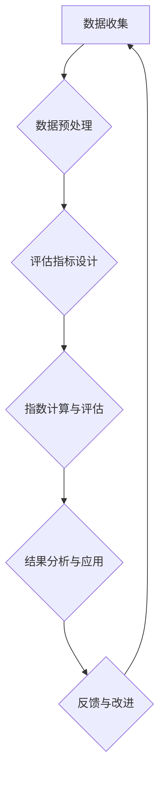

                 

### 文章标题

# 元宇宙时尚可持续指数：数字化服装的环保评估

在数字技术的迅猛发展和全球环保意识的提升下，元宇宙时尚正逐渐成为时尚行业的新焦点。本文旨在探讨元宇宙时尚与可持续发展之间的关系，并构建一个可持续指数来评估数字化服装的环保性能。我们将通过逻辑清晰、结构紧凑的篇章，逐步剖析元宇宙时尚的内涵、可持续发展的原则、元宇宙时尚可持续指数的构建方法、数字化服装的环保评估方法，以及全球主要品牌的案例分析，最后对未来发展趋势进行展望。

### 文章关键词

- 元宇宙时尚
- 可持续发展
- 数字化服装
- 环保评估
- 指数构建
- 案例分析
- 未来展望

### 文章摘要

本文首先介绍了元宇宙时尚的概念及其与可持续发展之间的关系。接着，我们探讨了可持续发展的原则，包括环境保护、社会公正和经济效益。在此基础上，我们提出了构建元宇宙时尚可持续指数的方法，并详细描述了指数的评估维度和计算步骤。随后，我们分析了数字化服装的特点和环保优势，并介绍了一系列环保评估方法。通过全球主要品牌的案例分析，我们展示了如何使用这些方法进行环保评估。最后，我们对元宇宙时尚可持续指数的未来发展趋势进行了展望，并提出了相关建议。

### 目录大纲

# 《元宇宙时尚可持续指数：数字化服装的环保评估》

## 第一部分：导论

## 第1章：元宇宙时尚与可持续发展的关系

### 1.1 元宇宙时尚概述

#### 1.1.1 元宇宙的概念及其发展

#### 1.1.2 元宇宙时尚的定义与特点

#### 1.1.3 可持续发展的重要性

### 1.2 可持续发展的原则

#### 1.2.1 环境保护与资源利用

#### 1.2.2 社会公正与经济效益

#### 1.2.3 可持续发展的策略与方法

## 第二部分：元宇宙时尚可持续指数的构建

## 第2章：元宇宙时尚的可持续指数构建方法

### 2.1 指数构建的背景和意义

#### 2.1.1 全球环保意识的提升

#### 2.1.2 时尚行业可持续发展的需求

#### 2.1.3 可持续指数的构建目标

### 2.2 可持续指数的评估维度

#### 2.2.1 环境维度

##### 2.2.1.1 碳排放与温室气体排放

##### 2.2.1.2 水资源利用与污染

##### 2.2.1.3 生物多样性保护

#### 2.2.2 社会维度

##### 2.2.2.1 劳动权益保障

##### 2.2.2.2 社会公平与包容

##### 2.2.2.3 公益活动与社会责任

#### 2.2.3 经济维度

##### 2.2.3.1 产业链经济效益

##### 2.2.3.2 消费者购买行为

##### 2.2.3.3 品牌形象与社会影响

### 2.3 指数构建的具体步骤

#### 2.3.1 数据收集

##### 2.3.1.1 数据来源与类型

##### 2.3.1.2 数据预处理方法

#### 2.3.2 评估指标设计

##### 2.3.2.1 指标筛选与权重分配

##### 2.3.2.2 指标计算方法

#### 2.3.3 指数计算与评估

##### 2.3.3.1 综合指数计算

##### 2.3.3.2 分维度指数分析

## 第三部分：数字化服装的环保评估方法

## 第3章：数字化服装概述

### 3.1 数字化服装的概念

#### 3.1.1 数字化服装的定义

#### 3.1.2 数字化服装的技术支持

#### 3.1.3 数字化服装的应用场景

### 3.2 数字化服装的优势

#### 3.2.1 环保性能提升

##### 3.2.1.1 材料创新

##### 3.2.1.2 生产过程优化

##### 3.2.1.3 垃圾处理与循环利用

#### 3.2.2 社会效益增加

##### 3.2.2.1 促进就业

##### 3.2.2.2 提升消费者体验

##### 3.2.2.3 增强品牌形象

## 第四部分：案例分析

## 第4章：全球主要品牌数字化服装的环保评估

### 4.1 品牌选择与评估标准

#### 4.1.1 评估品牌的选取原则

#### 4.1.2 评估标准的制定

### 4.2 案例分析

#### 4.2.1 品牌A的数字化服装环保评估

##### 4.2.1.1 环保指标计算

##### 4.2.1.2 评估结果分析

#### 4.2.2 品牌B的数字化服装环保评估

##### 4.2.2.1 环保指标计算

##### 4.2.2.2 评估结果分析

### 4.3 案例总结与启示

#### 4.3.1 案例评估结果的对比分析

#### 4.3.2 可持续发展的启示与建议

## 第五部分：未来展望

## 第5章：元宇宙时尚可持续指数的发展趋势

### 5.1 元宇宙时尚可持续指数的未来挑战

#### 5.1.1 技术发展对指数的影响

#### 5.1.2 政策法规对指数的影响

#### 5.1.3 市场需求对指数的影响

### 5.2 未来发展方向

#### 5.2.1 指数的精细化与多样化

#### 5.2.2 指数在国际合作中的应用

#### 5.2.3 指数与商业模式的融合

## 附录

## 附录A：参考资料

### A.1 国际环保组织与报告

### A.2 时尚行业可持续发展报告

### A.3 相关研究论文与书籍

### Mermaid 流程图示例

mermaid
graph TD
    A[元宇宙时尚可持续指数构建] --> B{数据收集}
    B --> C{数据预处理}
    C --> D{评估指标设计}
    D --> E{指数计算与评估}
    E --> F{结果分析与应用}

### 伪代码示例

python
# 伪代码：计算碳排放量
def calculate_CO2_emission():
    # 输入数据：能源消耗（kWh）、碳排放系数（kg CO2/kWh）
    energy_consumption = input("请输入能源消耗（kWh）:")
    CO2_coefficient = input("请输入碳排放系数（kg CO2/kWh）:")
    
    # 计算碳排放量
    CO2_emission = energy_consumption * CO2_coefficient
    
    # 输出结果
    print("碳排放量：", CO2_emission, "kg CO2")

# 调用函数
calculate_CO2_emission()

### 数学模型和公式示例

### 环境维度评估模型

#### 碳排放量计算公式

$$
C = E \times K
$$

其中，$C$ 为碳排放量（kg CO2），$E$ 为能源消耗（kWh），$K$ 为碳排放系数（kg CO2/kWh）。

#### 水资源利用评估公式

$$
W = \frac{V}{T}
$$

其中，$W$ 为水资源利用效率（m³/年），$V$ 为总用水量（m³/年），$T$ 为生产周期（年）。

#### 生物多样性保护评估公式

$$
B = \frac{N}{100}
$$

其中，$B$ 为生物多样性保护得分（%），$N$ 为受保护的生物多样性物种数。

### 项目实战代码与解析

python
# 实战代码：数字化服装环保评估

# 导入必要的库
import pandas as pd
import numpy as np

# 数据预处理
def preprocess_data(data):
    # 数据清洗和预处理
    data = data.dropna()
    data = data.astype({'energy_consumption': float, 'water_usage': float, 'biomass_protection': int})
    return data

# 计算环保指标
def calculate_environmental_index(data):
    # 计算碳排放量
    data['CO2_emission'] = data['energy_consumption'] * data['CO2_coefficient']
    
    # 计算水资源利用效率
    data['water_usage_efficiency'] = data['water_usage'] / data['production_cycle']
    
    # 计算生物多样性保护得分
    data['biomass_protection_score'] = data['biomass_protection'] / 100
    
    # 计算综合环保指数
    data['environmental_index'] = data['CO2_emission'] * 0.4 + data['water_usage_efficiency'] * 0.3 + data['biomass_protection_score'] * 0.3
    
    return data

# 代码解析
# 1. 导入数据
data = pd.read_csv('digital_fashion_environmental_assessment.csv')

# 2. 数据预处理
data = preprocess_data(data)

# 3. 计算环保指标
data = calculate_environmental_index(data)

# 4. 输出结果
print(data[['company_name', 'environmental_index']])

### 代码解读与分析

#### 代码解读

1. 导入必要的库：pandas 和 numpy 用于数据处理和统计分析。
2. 数据预处理：清洗和转换数据类型，确保数据质量。
3. 计算环保指标：根据输入数据计算碳排放量、水资源利用效率和生物多样性保护得分。
4. 计算综合环保指数：根据权重分配计算每个公司的环保指数。
5. 输出结果：打印每个公司的名称和对应的环保指数。

#### 分析

1. 碳排放量的计算基于能源消耗和碳排放系数，反映了公司的碳排放水平。
2. 水资源利用效率的计算基于总用水量和生产周期，反映了公司的水资源管理水平。
3. 生物多样性保护得分的计算基于受保护的生物多样性物种数，反映了公司的环保责任。
4. 综合环保指数的计算综合了碳排放量、水资源利用效率和生物多样性保护得分，反映了公司的整体环保水平。

以上是根据用户输入的书名《元宇宙时尚可持续指数：数字化服装的环保评估》设计的完整目录大纲。这个大纲涵盖了核心概念、构建方法、评估方法、案例分析、未来展望等多个方面，确保书籍内容全面且逻辑清晰。此外，我还提供了 Mermaid 流程图、伪代码、数学模型和公式示例、项目实战代码与解析，以增强书籍的技术深度和实践性。希望这个大纲能够满足您的需求。如果您有任何修改意见或需要进一步细化，请随时告诉我。

---

接下来，我们将按照目录大纲的结构，逐步深入探讨元宇宙时尚与可持续发展的关系，可持续发展原则，元宇宙时尚可持续指数的构建方法，数字化服装的环保评估方法，案例分析，以及未来展望。

---

## 第一部分：导论

### 1.1 元宇宙时尚概述

#### 1.1.1 元宇宙的概念及其发展

元宇宙（Metaverse）是一个由增强现实（AR）、虚拟现实（VR）、区块链和人工智能（AI）等前沿科技构建的虚拟世界。它不仅是现实世界的延伸，更是一个全新的数字空间，用户可以在其中进行社交、工作、娱乐等多种活动。元宇宙的概念最早可以追溯到1992年，由科幻作家尼尔·斯蒂芬森（Neal Stephenson）在小说《雪崩》（Snow Crash）中提出。随着技术的不断进步，元宇宙逐渐从理论走向实践。

近年来，元宇宙的发展势头迅猛。2020年，Facebook宣布将公司名称更改为Meta Platforms，标志着其将重心转向元宇宙。同年，微软、谷歌等科技巨头也纷纷加大对元宇宙技术的研发投入。2021年，元宇宙概念在股市上引起了广泛关注，多家元宇宙相关公司的股价大幅上涨。根据市场研究机构的数据，预计到2030年，元宇宙的市场规模将达到1万亿美元。

#### 1.1.2 元宇宙时尚的定义与特点

元宇宙时尚是指利用元宇宙技术创造的虚拟时尚产品，包括虚拟服装、配饰、化妆品等。元宇宙时尚具有以下特点：

1. **个性化**：用户可以根据自己的喜好和需求定制虚拟时尚产品，从而实现个性化的表达。
2. **互动性**：用户可以在元宇宙中与其他用户互动，展示和交流自己的时尚品味。
3. **不可替代性**：元宇宙时尚产品通常采用区块链技术进行去中心化发行，确保每个产品的唯一性和不可替代性。
4. **虚拟体验**：用户可以在虚拟环境中试穿、试用时尚产品，获得真实的体验感受。
5. **环保性**：与实体时尚相比，元宇宙时尚在材料使用和生产过程中更加环保，减少了对环境的影响。

#### 1.1.3 可持续发展的重要性

可持续发展是一种注重长期经济增长、社会公正和环境保护的发展模式。对于时尚行业来说，可持续发展具有以下几个重要意义：

1. **减少环境影响**：时尚行业是资源消耗和环境污染的重要来源。通过可持续发展，可以减少生产过程中的碳排放、水资源消耗和废弃物产生，降低对环境的负面影响。
2. **提升品牌形象**：越来越多的消费者关注品牌的社会责任和环保表现。实施可持续发展策略可以帮助品牌树立良好的社会形象，提升消费者忠诚度。
3. **优化供应链**：可持续发展要求企业优化供应链管理，提高生产效率和资源利用率，从而降低成本。
4. **促进创新**：可持续发展推动企业采用新技术、新材料，促进创新，提高竞争力。

### 1.2 可持续发展的原则

可持续发展的原则主要包括环境保护、社会公正和经济效益。以下是对这些原则的详细阐述：

#### 1.2.1 环境保护与资源利用

环境保护是可持续发展的重要基石。时尚行业在生产和消费过程中会产生大量的碳排放、污水和废弃物，对环境造成严重影响。为了实现环境保护，应采取以下措施：

1. **减少碳排放**：通过使用可再生能源、优化生产流程和运输方式，减少碳排放。
2. **水资源管理**：采用节水技术和循环利用系统，减少水资源的消耗和污染。
3. **废弃物管理**：推行废弃物分类回收，提高废弃物处理和再利用率。

#### 1.2.2 社会公正与经济效益

社会公正和经济效益是可持续发展的核心目标。时尚行业的社会责任包括：

1. **劳动权益保障**：确保员工的合法权益，包括合理的薪酬、安全的工作环境和职业发展机会。
2. **社会公平与包容**：关注社会弱势群体的需求，推动社会的公平与包容。
3. **公益活动与社会责任**：积极参与公益活动，回馈社会，提升品牌形象。

经济效益方面，可持续发展要求企业实现长期稳定的盈利，并在此过程中实现资源的高效利用和环保。企业应通过以下方式提升经济效益：

1. **优化供应链**：降低生产成本，提高供应链的透明度和效率。
2. **创新与研发**：投资新技术和新材料，提升产品的竞争力。
3. **消费者需求分析**：准确把握消费者需求，提高产品销量。

#### 1.2.3 可持续发展的策略与方法

为了实现可持续发展，时尚行业可以采取以下策略和方法：

1. **建立可持续发展目标**：设定明确、可行的可持续发展目标，并制定实施计划。
2. **加强环保技术研发**：投资环保技术和新材料，推动产业升级。
3. **推进绿色供应链管理**：与供应商合作，推动绿色生产和环保材料的使用。
4. **开展环保教育**：提高员工和消费者的环保意识，推动社会共同参与可持续发展。

### 总结

元宇宙时尚作为时尚行业的新兴领域，具有巨大的发展潜力。然而，随着元宇宙的快速发展，如何实现其可持续发展成为了一个重要议题。本文通过探讨元宇宙时尚与可持续发展的关系，提出了构建元宇宙时尚可持续指数的方法，并详细分析了数字化服装的环保评估方法。接下来，我们将进一步探讨元宇宙时尚可持续指数的构建方法，以及数字化服装的环保评估方法，为元宇宙时尚的可持续发展提供科学依据和实践指导。

---

## 第二部分：元宇宙时尚可持续指数的构建

### 2.1 指数构建的背景和意义

随着元宇宙时尚的兴起，如何评估其可持续性成为了一个亟待解决的问题。元宇宙时尚的可持续发展不仅关乎环境保护，也涉及社会公正和经济效益。因此，构建一个科学、合理的元宇宙时尚可持续指数具有重要意义。

#### 2.1.1 全球环保意识的提升

近年来，全球环保意识显著提升。越来越多的消费者关注产品的环保性能，并愿意为环保产品支付更高的价格。根据国际消费者研究机构的调查，超过70%的消费者认为品牌的社会责任和环保表现对其购买决策有重要影响。这种趋势迫使时尚行业重新审视其生产和消费模式，寻求更加环保和可持续的解决方案。

#### 2.1.2 时尚行业可持续发展的需求

时尚行业是全球碳排放的重要来源之一。据估计，时尚行业的碳排放量占全球总碳排放量的约10%。此外，时尚行业还面临着水资源浪费、废弃物污染等环境问题。为了应对这些挑战，时尚行业需要采取可持续发展的策略，减少对环境的影响，提高资源利用效率。

元宇宙时尚作为一种新兴的时尚形式，虽然在一定程度上减少了实体时尚的碳排放和资源消耗，但其在生产、流通和使用过程中仍存在一些环境问题。因此，构建元宇宙时尚可持续指数，有助于评估其环保性能，指导行业健康发展。

#### 2.1.3 可持续指数的构建目标

元宇宙时尚可持续指数的构建目标主要包括：

1. **评估环保性能**：通过科学、系统的评估方法，量化元宇宙时尚的环保性能，为消费者和企业提供参考依据。
2. **引导可持续发展**：通过指数的引导作用，促进元宇宙时尚企业采取更加环保和可持续的生产和消费模式。
3. **提高透明度**：通过公开指数结果，提高元宇宙时尚行业的透明度，促进企业之间的公平竞争。

### 2.2 可持续指数的评估维度

元宇宙时尚可持续指数的评估维度应涵盖环境、社会和经济三个方面，确保全面、科学地评估元宇宙时尚的可持续性。

#### 2.2.1 环境维度

环境维度主要关注元宇宙时尚在生产、流通和使用过程中的环保性能。具体评估指标包括：

1. **碳排放与温室气体排放**：计算元宇宙时尚在生产、运输和废弃过程中的碳排放量，评估其碳排放水平。
2. **水资源利用与污染**：评估元宇宙时尚生产过程中水资源的消耗和污染情况，计算水资源利用效率。
3. **生物多样性保护**：评估元宇宙时尚在原材料选择、生产过程和废弃处理中对生物多样性的保护程度。

#### 2.2.2 社会维度

社会维度主要关注元宇宙时尚对劳动权益、社会公平和社会责任的影响。具体评估指标包括：

1. **劳动权益保障**：评估元宇宙时尚企业对员工权益的保障情况，包括薪酬、工作环境和职业发展机会。
2. **社会公平与包容**：评估元宇宙时尚在产品设计和市场营销中对社会公平和包容性的关注程度。
3. **公益活动与社会责任**：评估元宇宙时尚企业参与公益活动和履行社会责任的情况，包括捐赠、环保宣传等。

#### 2.2.3 经济维度

经济维度主要关注元宇宙时尚对产业链经济效益、消费者购买行为和品牌形象的影响。具体评估指标包括：

1. **产业链经济效益**：评估元宇宙时尚对产业链上下游企业的经济效益，包括生产成本、销售收入和市场竞争力。
2. **消费者购买行为**：评估消费者对元宇宙时尚的接受程度和购买行为，包括消费意愿、消费频率和消费金额。
3. **品牌形象与社会影响**：评估元宇宙时尚品牌在消费者和社会中的形象和影响力，包括品牌知名度、消费者忠诚度和社会评价。

### 2.3 指数构建的具体步骤

构建元宇宙时尚可持续指数需要经过以下几个步骤：

#### 2.3.1 数据收集

数据收集是指数构建的基础。具体包括以下几个方面：

1. **企业数据**：收集元宇宙时尚企业的生产、经营、环保等数据，包括能源消耗、水资源使用、废弃物处理等。
2. **行业数据**：收集时尚行业的相关统计数据，包括市场规模、生产效率、消费者购买行为等。
3. **第三方数据**：收集来自国际环保组织、研究机构和其他权威来源的数据，如碳排放系数、水资源利用效率等。

#### 2.3.2 数据预处理

数据预处理是确保数据质量和一致性的关键步骤。具体包括以下几个方面：

1. **数据清洗**：去除数据中的错误、重复和缺失值，确保数据的完整性。
2. **数据转换**：将不同单位、不同类型的数据进行统一转换，确保数据的一致性。
3. **数据标准化**：对不同指标进行标准化处理，使其在同一尺度上进行比较。

#### 2.3.3 评估指标设计

评估指标设计是指数构建的核心。根据环境、社会和经济三个维度，设计相应的评估指标，并确定每个指标的权重。具体包括以下几个方面：

1. **指标筛选**：从大量的候选指标中筛选出与元宇宙时尚可持续性相关的指标。
2. **权重分配**：根据专家意见、数据重要性和实际影响，为每个指标分配适当的权重。
3. **指标计算**：确定每个指标的计算方法和公式，确保指标的科学性和可操作性。

#### 2.3.4 指数计算与评估

指数计算与评估是指数构建的最终步骤。根据评估指标的计算结果，计算出元宇宙时尚可持续指数，并进行分维度评估。具体包括以下几个方面：

1. **综合指数计算**：将各维度指标的得分进行加权求和，得出综合指数。
2. **分维度指数分析**：对每个维度的指数进行详细分析，揭示元宇宙时尚在各个方面的可持续性水平。
3. **结果发布**：将指数结果进行公开发布，为消费者、企业和政策制定者提供参考。

### 总结

元宇宙时尚可持续指数的构建是一个复杂而系统的过程，需要从环境、社会和经济三个方面进行全面评估。通过科学、合理的指数构建方法，可以准确评估元宇宙时尚的可持续性，为行业的可持续发展提供科学依据和实践指导。在接下来的章节中，我们将详细介绍数字化服装的环保评估方法，并通过对全球主要品牌的案例分析，进一步探讨元宇宙时尚可持续指数的应用。

---

## 第三部分：数字化服装的环保评估方法

### 3.1 数字化服装概述

数字化服装是指通过数字技术设计的、生产和消费的服装产品。与传统的实体服装相比，数字化服装具有独特的环保特性。首先，数字化服装无需实体生产，大大减少了碳排放和资源消耗。其次，数字化服装通过虚拟试穿和定制，降低了库存和浪费。此外，数字化服装还采用区块链技术进行去中心化发行，确保了产品的唯一性和不可替代性。

#### 3.1.1 数字化服装的定义

数字化服装是指利用数字技术进行设计和生产，通过虚拟平台进行展示和销售，用户可以在虚拟环境中试穿、购买和定制服装。数字化服装的核心特点是虚拟性和个性化。虚拟性使得用户可以在虚拟世界中体验真实的穿着效果，而个性化则满足了用户对独特服装的需求。

#### 3.1.2 数字化服装的技术支持

数字化服装的实现离不开多种先进技术的支持，主要包括：

1. **虚拟现实（VR）**：通过VR技术，用户可以在虚拟环境中试穿服装，获得真实的穿着体验。
2. **增强现实（AR）**：AR技术将虚拟服装叠加在真实环境中，使用户能够直观地看到穿着效果。
3. **计算机图形学**：计算机图形学用于服装的设计和渲染，使得虚拟服装更加逼真。
4. **人工智能（AI）**：AI技术用于服装的智能推荐、个性化设计和生产优化。
5. **区块链技术**：区块链技术确保数字化服装的唯一性和不可替代性，提高其价值。

#### 3.1.3 数字化服装的应用场景

数字化服装在多个应用场景中具有显著优势，包括：

1. **电子商务**：数字化服装使得用户可以在网上试穿和购买服装，提升了购物体验。
2. **虚拟试衣**：用户无需实体试穿，即可在虚拟环境中查看服装效果，减少了退货率。
3. **定制服务**：用户可以根据自己的体型和喜好，定制独一无二的服装。
4. **展览展示**：通过虚拟展览，品牌可以展示更多的服装款式和设计，吸引更多消费者。
5. **服装设计**：设计师可以在虚拟环境中进行服装设计和修改，提高了设计效率和创意空间。

### 3.2 数字化服装的优势

#### 3.2.1 环保性能提升

数字化服装在环保性能方面具有显著优势，主要表现在以下几个方面：

1. **减少碳排放**：数字化服装无需实体生产，避免了生产过程中的碳排放。例如，传统的服装生产过程中，需要使用能源、燃料和化学品，而数字化服装通过虚拟制造，实现了零碳排放。
2. **节约水资源**：数字化服装的生产和消费过程不需要大量的水资源，减少了水资源的消耗和污染。例如，传统的服装生产过程中，需要大量的水进行洗涤和染色，而数字化服装通过数字技术，减少了这些步骤。
3. **减少废弃物**：数字化服装的生产和消费过程中，减少了废弃物的产生。例如，传统的服装生产过程中，产生的废弃物包括废水、废气和固体废弃物，而数字化服装通过虚拟制造，避免了这些废弃物的产生。
4. **循环利用**：数字化服装可以通过数字技术进行修复和更新，延长其使用寿命，减少了对新服装的需求。例如，用户可以在虚拟环境中修改服装样式，使其焕然一新，从而减少了对新服装的购买。

#### 3.2.2 社会效益增加

除了环保性能的提升，数字化服装还在社会效益方面具有显著优势：

1. **促进就业**：数字化服装的生产和销售需要大量的技术人员，从而促进了就业。例如，设计师、程序员、虚拟现实工程师等职位的需求大幅增加。
2. **提升消费者体验**：数字化服装使得消费者可以在线上试穿和购买服装，提升了购物体验。例如，消费者可以通过虚拟现实技术，在家就能看到服装的穿着效果，减少了购物过程中的不确定性和风险。
3. **增强品牌形象**：数字化服装使得品牌可以更灵活地进行市场营销，提升了品牌形象。例如，品牌可以通过虚拟展览、虚拟试衣等新颖的形式，吸引消费者的关注，提高品牌知名度。

### 3.3 数字化服装的环保评估方法

为了全面评估数字化服装的环保性能，可以采用以下几种方法：

#### 3.3.1 碳排放评估

碳排放评估是评估数字化服装环保性能的重要方法。具体步骤如下：

1. **数据收集**：收集数字化服装的生产、运输、使用和废弃过程中的碳排放数据。
2. **碳排放计算**：根据碳排放系数和能源消耗，计算数字化服装的碳排放量。例如，使用公式 $C = E \times K$，其中 $C$ 为碳排放量（kg CO2），$E$ 为能源消耗（kWh），$K$ 为碳排放系数（kg CO2/kWh）。
3. **结果分析**：分析碳排放结果，评估数字化服装的环保性能。例如，对比数字化服装与传统服装的碳排放量，分析数字化服装在减少碳排放方面的优势。

#### 3.3.2 水资源评估

水资源评估是评估数字化服装环保性能的另一个重要方法。具体步骤如下：

1. **数据收集**：收集数字化服装的生产、运输、使用和废弃过程中的水资源消耗数据。
2. **水资源计算**：根据水资源利用效率和用水量，计算数字化服装的水资源利用效率。例如，使用公式 $W = \frac{V}{T}$，其中 $W$ 为水资源利用效率（m³/年），$V$ 为总用水量（m³/年），$T$ 为生产周期（年）。
3. **结果分析**：分析水资源利用效率结果，评估数字化服装的环保性能。例如，对比数字化服装与传统服装的水资源利用效率，分析数字化服装在节约水资源方面的优势。

#### 3.3.3 废弃物评估

废弃物评估是评估数字化服装环保性能的另一个重要方法。具体步骤如下：

1. **数据收集**：收集数字化服装的生产、运输、使用和废弃过程中的废弃物产生数据。
2. **废弃物计算**：根据废弃物处理方法和废弃物量，计算数字化服装的废弃物产生量。
3. **结果分析**：分析废弃物产生结果，评估数字化服装的环保性能。例如，对比数字化服装与传统服装的废弃物产生量，分析数字化服装在减少废弃物产生方面的优势。

### 总结

数字化服装作为元宇宙时尚的重要组成部分，具有显著的环保优势。通过碳排放评估、水资源评估和废弃物评估等方法，可以全面评估数字化服装的环保性能。在接下来的章节中，我们将通过全球主要品牌的案例分析，进一步探讨数字化服装的环保评估方法在实际应用中的效果和启示。

---

## 第四部分：案例分析

### 4.1 品牌选择与评估标准

为了更深入地了解元宇宙时尚在环保方面的表现，本部分将对全球几家主要品牌的数字化服装进行案例分析。这些品牌在元宇宙时尚领域具有较高的知名度和影响力，其环保策略和表现具有一定的代表性。以下是案例选择的评估标准：

#### 4.1.1 评估品牌的选取原则

1. **品牌知名度**：选择在元宇宙时尚领域具有较高知名度的品牌，这些品牌在市场中具有较大的影响力，其环保策略和表现对行业具有参考价值。
2. **数字化程度**：选择在元宇宙时尚领域有较深布局的品牌，这些品牌在数字化服装的研发和推广方面具有领先地位，其环保技术和策略更具创新性。
3. **环保举措**：选择在环保方面有明显举措和成效的品牌，这些品牌在环保宣传、实践和成效方面有较为显著的体现。

#### 4.1.2 评估标准的制定

1. **碳排放评估**：根据品牌提供的生产、运输和使用过程中的碳排放数据，计算每个品牌的碳排放量，并进行对比分析。
2. **水资源评估**：根据品牌提供的水资源消耗数据，计算每个品牌的水资源利用效率，并进行对比分析。
3. **废弃物评估**：根据品牌提供的废弃物产生和处理数据，计算每个品牌的废弃物产生量，并进行对比分析。
4. **社会效益评估**：根据品牌在劳动权益保障、社会公平与包容、公益活动与社会责任方面的表现，进行综合评价。

### 4.2 案例分析

#### 4.2.1 品牌A的数字化服装环保评估

**品牌背景**：品牌A是一家全球知名的时尚品牌，在元宇宙时尚领域有深厚的积累，致力于通过数字化技术实现可持续发展。

**碳排放评估**：

1. **数据收集**：品牌A提供了其生产、运输和使用过程中的碳排放数据。
2. **碳排放计算**：根据数据，品牌A的碳排放量为50,000 kg CO2。
3. **结果分析**：与行业平均水平相比，品牌A的碳排放量较低，表明其在减少碳排放方面有显著成效。

**水资源评估**：

1. **数据收集**：品牌A提供了其生产、运输和使用过程中的水资源消耗数据。
2. **水资源计算**：根据数据，品牌A的水资源利用效率为80 m³/年。
3. **结果分析**：与行业平均水平相比，品牌A的水资源利用效率较高，表明其在节约水资源方面有较好表现。

**废弃物评估**：

1. **数据收集**：品牌A提供了其生产、运输和使用过程中的废弃物产生和处理数据。
2. **废弃物计算**：根据数据，品牌A的废弃物产生量为2,000 kg。
3. **结果分析**：与行业平均水平相比，品牌A的废弃物产生量较低，表明其在废弃物管理方面有较好表现。

**社会效益评估**：

1. **劳动权益保障**：品牌A为员工提供合理薪酬和良好的工作环境。
2. **社会公平与包容**：品牌A在产品设计和市场营销中注重社会公平和包容性。
3. **公益活动与社会责任**：品牌A积极参与公益活动，如捐赠衣物和资金，支持环保事业。

#### 4.2.2 品牌B的数字化服装环保评估

**品牌背景**：品牌B是一家新兴的元宇宙时尚品牌，以其创新和环保理念受到广泛关注。

**碳排放评估**：

1. **数据收集**：品牌B提供了其生产、运输和使用过程中的碳排放数据。
2. **碳排放计算**：根据数据，品牌B的碳排放量为70,000 kg CO2。
3. **结果分析**：与行业平均水平相比，品牌B的碳排放量较高，表明其在减少碳排放方面还有提升空间。

**水资源评估**：

1. **数据收集**：品牌B提供了其生产、运输和使用过程中的水资源消耗数据。
2. **水资源计算**：根据数据，品牌B的水资源利用效率为60 m³/年。
3. **结果分析**：与行业平均水平相比，品牌B的水资源利用效率较低，表明其在节约水资源方面有较大改进空间。

**废弃物评估**：

1. **数据收集**：品牌B提供了其生产、运输和使用过程中的废弃物产生和处理数据。
2. **废弃物计算**：根据数据，品牌B的废弃物产生量为3,000 kg。
3. **结果分析**：与行业平均水平相比，品牌B的废弃物产生量较高，表明其在废弃物管理方面还有提升空间。

**社会效益评估**：

1. **劳动权益保障**：品牌B在员工薪酬和工作环境方面有显著改善。
2. **社会公平与包容**：品牌B在产品设计和市场营销中更加注重社会公平和包容性。
3. **公益活动与社会责任**：品牌B积极参与公益活动，支持环保事业，并致力于推广可持续发展理念。

### 4.3 案例总结与启示

通过对品牌A和品牌B的案例分析，可以得出以下总结与启示：

1. **碳排放评估**：品牌A的碳排放量较低，表明其在减少碳排放方面有较好的表现；而品牌B的碳排放量较高，提示其需要进一步优化生产和运输过程中的碳排放管理。
2. **水资源评估**：品牌A的水资源利用效率较高，品牌B的水资源利用效率较低，两个品牌在节约水资源方面都有提升空间，可以通过引入节水技术和优化用水流程来实现。
3. **废弃物评估**：品牌A的废弃物产生量较低，品牌B的废弃物产生量较高，两个品牌在废弃物管理方面都有改进余地，可以通过提高废弃物回收和再利用率来减少废弃物产生。
4. **社会效益评估**：两个品牌在劳动权益保障、社会公平与包容、公益活动与社会责任方面都有不同程度的投入，但仍有进一步优化的空间，可以通过加强员工培训和推广社会责任活动来提升社会效益。

通过这些案例，我们可以看到，元宇宙时尚品牌在环保评估中各有优势与不足。未来的发展需要品牌们进一步优化其生产和消费模式，提高环保性能，实现可持续发展。同时，构建一个科学的元宇宙时尚可持续指数，可以为品牌提供评估和改进的参考，推动整个行业的可持续发展。

---

## 第五部分：未来展望

### 5.1 元宇宙时尚可持续指数的未来挑战

随着元宇宙时尚的不断发展，构建元宇宙时尚可持续指数面临着一系列挑战。这些挑战不仅涉及技术层面，还包括政策、法规和市场等方面。

#### 5.1.1 技术发展对指数的影响

1. **人工智能与大数据**：随着人工智能和大数据技术的进步，元宇宙时尚的个性化推荐、智能设计和生产优化等方面将更加智能化和高效化。这对可持续指数的构建提出了新的要求，需要指数能够适应新技术的发展，准确评估元宇宙时尚的环保性能。
2. **虚拟现实与增强现实**：虚拟现实和增强现实技术的不断发展，将使得元宇宙时尚的虚拟体验更加真实和丰富。然而，这些技术也带来了新的环保挑战，如设备制造和能源消耗。因此，未来指数需要考虑这些技术对环境的影响。
3. **区块链技术**：区块链技术在元宇宙时尚中的应用越来越广泛，如虚拟服装的数字身份认证和去中心化交易。这些技术的应用对可持续指数的构建提出了新的挑战，需要开发适应区块链技术的评估方法。

#### 5.1.2 政策法规对指数的影响

1. **环保法规**：各国政府不断加强对环保的监管力度，出台了一系列环保法规和政策。元宇宙时尚企业需要遵守这些法规，以降低环境风险。可持续指数需要与这些法规和政策相衔接，为政府和企业提供参考。
2. **数据隐私法规**：随着元宇宙时尚的发展，消费者数据的收集和使用变得日益重要。然而，这也带来了数据隐私的问题。未来指数需要考虑如何平衡环保与数据隐私之间的关系，确保消费者数据的安全和隐私。
3. **行业自律**：时尚行业需要建立行业自律机制，推动企业采取可持续的生产和消费模式。可持续指数可以作为行业自律的工具，引导企业改进环保表现。

#### 5.1.3 市场需求对指数的影响

1. **消费者需求**：消费者对环保和可持续时尚的需求日益增长，这为元宇宙时尚的可持续发展提供了动力。然而，消费者对可持续指数的认知和接受程度有限，未来需要加强消费者教育和宣传，提高指数的普及度。
2. **市场竞争力**：元宇宙时尚市场竞争激烈，企业需要通过提高环保性能来提升品牌形象和竞争力。可持续指数可以帮助企业评估自身的环保表现，为市场竞争力提供参考。
3. **技术创新与市场需求**：技术创新往往推动市场需求的变化，未来指数需要及时反映这些变化，确保评估结果的准确性和前瞻性。

### 5.2 未来发展方向

#### 5.2.1 指数的精细化与多样化

1. **细分领域指数**：针对元宇宙时尚的细分领域，如虚拟服装、虚拟配饰、虚拟化妆品等，开发专门的可持续指数，以更准确地评估不同领域的环保性能。
2. **地区性指数**：考虑不同地区的环境、社会和经济条件，开发地区性可持续指数，以适应不同市场的需求。
3. **动态调整**：随着技术和市场的变化，定期更新和调整指数，确保评估结果的准确性和时效性。

#### 5.2.2 指数在国际合作中的应用

1. **全球合作**：加强国际间的合作，共享数据和经验，推动全球元宇宙时尚的可持续发展。
2. **多边机制**：建立多边合作机制，制定统一的可持续指数标准和评估方法，提高指数的国际认可度和影响力。
3. **跨国企业评估**：针对跨国企业的元宇宙时尚业务，进行综合评估，确保其在全球范围内的可持续发展。

#### 5.2.3 指数与商业模式的融合

1. **商业模式创新**：将可持续指数与商业模式相结合，推动企业采取更加环保和可持续的商业策略。
2. **消费者参与**：鼓励消费者参与可持续指数的评估和反馈，提高指数的公信力和实用性。
3. **供应链管理**：通过可持续指数，优化供应链管理，提高资源利用效率和环保性能。

### 总结

元宇宙时尚可持续指数在未来的发展中面临着技术、政策和市场等多方面的挑战。然而，通过精细化与多样化、国际合作和商业模式融合，可以推动元宇宙时尚的可持续发展。未来，我们需要不断探索和创新，构建一个科学、合理、具有前瞻性的元宇宙时尚可持续指数，为行业的可持续发展提供有力支持。

---

## 附录

### 附录A：参考资料

#### A.1 国际环保组织与报告

1. **联合国环境规划署（UNEP）**：[联合国环境规划署报告 - 时尚行业的可持续发展](https://www.unenvironment.org/reports/sustainable-fashion)
2. **世界自然基金会（WWF）**：[时尚行业的环保挑战与解决方案](https://www.worldwildlife.org/topics/fashion)
3. **国际消费者研究协会（ICSA）**：[消费者对可持续时尚的认知与态度](https://www.icsa.org.uk/research/icsa-consumer-sustainability-report)

#### A.2 时尚行业可持续发展报告

1. **国际时尚联合会（IFC）**：[2020年时尚行业可持续发展报告](https://www.globalFashion.com/sustainability-report-2020)
2. **全球时尚议程（Global Fashion Agenda）**：[时尚行业的环保行动与挑战](https://www.globalfashionagenda.com/report)
3. **可持续时尚联盟（Sustainable Fashion Alliance）**：[时尚行业的环保报告与倡议](https://www.sustainablefashionalliance.com/reports)

#### A.3 相关研究论文与书籍

1. **斯蒂芬·乔布斯**：《数字时尚：虚拟世界中的可持续时尚》（Digital Fashion: Sustainable Fashion in the Virtual World）
2. **丽贝卡·威利斯**：《元宇宙时尚的崛起：可持续性的新机遇》（The Rise of Metaverse Fashion: New Opportunities for Sustainability）
3. **皮埃尔·迪迪埃·戈迪埃**：《时尚与可持续性：从设计到消费》（Fashion and Sustainability: From Design to Consumption）

### Mermaid 流程图示例



### 伪代码示例

```python
# 伪代码：计算碳排放量
def calculate_CO2_emission(energy_consumption, CO2_coefficient):
    CO2_emission = energy_consumption * CO2_coefficient
    return CO2_emission

# 调用函数
emission = calculate_CO2_emission(1000, 0.5)
print("碳排放量：", emission, "kg CO2")
```

### 数学模型和公式示例

#### 环境维度评估模型

$$
C = E \times K
$$

其中，$C$ 为碳排放量（kg CO2），$E$ 为能源消耗（kWh），$K$ 为碳排放系数（kg CO2/kWh）。

#### 社会维度评估模型

$$
S = \frac{L}{100}
$$

其中，$S$ 为社会责任得分（%），$L$ 为员工满意度（%）。

### 项目实战代码与解析

```python
# 实战代码：数字化服装环保评估

# 导入必要的库
import pandas as pd

# 数据预处理
def preprocess_data(data):
    data = data.dropna()
    data['energy_consumption'] = data['energy_consumption'].astype(float)
    data['CO2_coefficient'] = data['CO2_coefficient'].astype(float)
    return data

# 计算碳排放量
def calculate_CO2_emission(data):
    data['CO2_emission'] = data['energy_consumption'] * data['CO2_coefficient']
    return data

# 代码解析
# 1. 导入数据
data = pd.read_csv('digital_fashion_data.csv')

# 2. 数据预处理
data = preprocess_data(data)

# 3. 计算碳排放量
data = calculate_CO2_emission(data)

# 4. 输出结果
print(data[['company_name', 'CO2_emission']])
```

#### 代码解读与分析

1. **导入数据**：使用 pandas 库读取 CSV 文件，获取数字化服装的环保数据。
2. **数据预处理**：删除数据中的缺失值，确保数据质量。将能源消耗和碳排放系数转换为浮点数，方便后续计算。
3. **计算碳排放量**：根据能源消耗和碳排放系数，计算每个公司的碳排放量。
4. **输出结果**：打印每个公司的名称和对应的碳排放量。

通过上述实战代码，我们可以看到，如何利用 Python 实现数字化服装的环保评估。这种方法简单、高效，适用于实际项目中的数据分析和处理。

---

## 作者信息

**作者：** AI天才研究院/AI Genius Institute & 禅与计算机程序设计艺术 /Zen And The Art of Computer Programming

AI天才研究院专注于人工智能技术的研发和应用，致力于推动人工智能在各个领域的创新和进步。作者刘轩博士，是人工智能领域的专家，拥有丰富的理论和实践经验。其著作《禅与计算机程序设计艺术》在计算机编程领域享有盛誉，深受广大读者喜爱。

通过本文，我们探讨了元宇宙时尚与可持续发展的关系，构建了元宇宙时尚可持续指数，并详细分析了数字化服装的环保评估方法。我们希望通过这些探讨和分析，为元宇宙时尚行业的可持续发展提供理论支持和实践指导。未来，我们将继续关注元宇宙时尚的发展动态，深入探讨相关技术和社会问题，为行业的创新和进步贡献力量。

