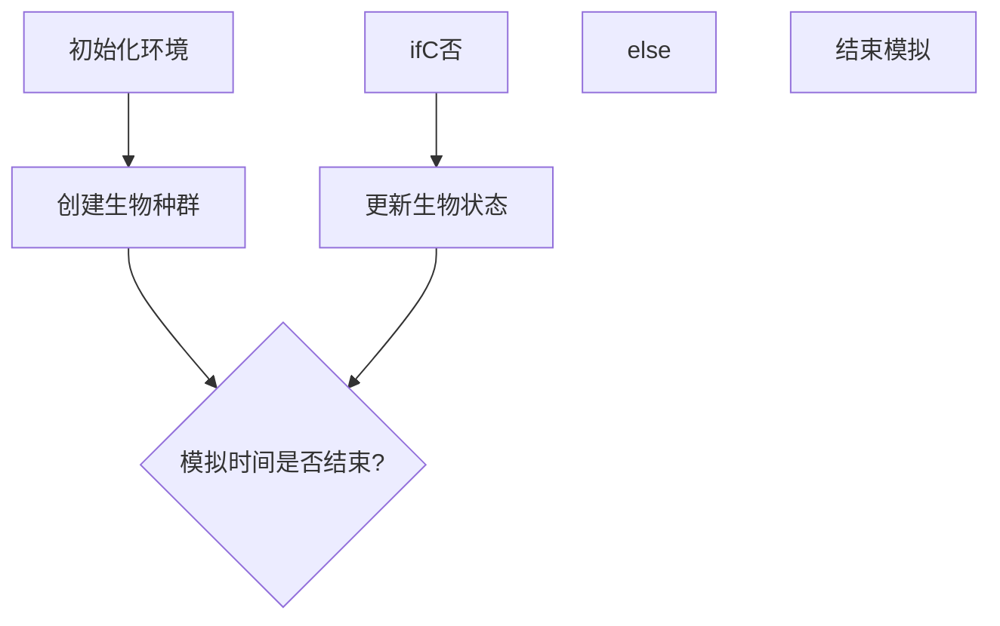

                 

# 《元宇宙虚拟生态系统：跨物种互动的数字化生物圈模拟》

> 关键词：元宇宙、虚拟生态系统、跨物种互动、数字化生物圈、模拟技术、虚拟现实、增强现实、区块链、人工智能

> 摘要：本文深入探讨了元宇宙虚拟生态系统的概念、构建技术、跨物种互动模拟及其在各个领域的应用与实践。通过对虚拟现实、增强现实、区块链和人工智能等技术的分析，本文阐述了元宇宙虚拟生态系统的发展现状、挑战与前景，并对未来趋势进行了展望。

## 第一部分：元宇宙虚拟生态系统的概念与背景

### 第1章：元宇宙虚拟生态系统的概述

#### 1.1 元宇宙的定义与演变

元宇宙（Metaverse）是近年来科技领域的一个热点词汇，它并不是一个全新的概念，而是随着互联网、虚拟现实（VR）和增强现实（AR）等技术的发展而逐渐成形的一个虚拟空间。元宇宙可以被定义为与现实世界平行的虚拟世界，用户可以通过虚拟角色在其中进行交互、交流和体验。元宇宙的演变经历了以下几个阶段：

1. **互联网时代**：互联网的普及使得信息共享和远程交互成为可能，为元宇宙的诞生奠定了基础。
2. **虚拟现实时代**：VR技术的出现使得用户可以在虚拟环境中获得沉浸式的体验，这为元宇宙的实现提供了关键技术支持。
3. **增强现实时代**：AR技术的应用使得虚拟内容可以与现实世界无缝融合，进一步丰富了元宇宙的交互方式。
4. **社交网络时代**：社交媒体的发展使得用户在元宇宙中的互动更加多样和广泛，社交性成为元宇宙的核心特征之一。

#### 1.2 虚拟生态系统的基本概念

虚拟生态系统是指在虚拟空间中构建的具有自我组织、自我调节和可持续发展能力的生态体系。它包括了虚拟生物、环境、资源、技术等多个方面，旨在模拟和探索现实世界的生态现象和规律。虚拟生态系统的基本概念包括：

1. **虚拟生物**：在虚拟空间中模拟的具有生命特征和行为的实体，可以是人类、动物或其他生物。
2. **虚拟环境**：为虚拟生物提供生存和发展的虚拟空间，包括气候、地貌、生态等要素。
3. **虚拟资源**：虚拟生态系统中的资源，如食物、水源、能源等，这些资源是虚拟生物生存和发展的基础。
4. **虚拟技术**：支持虚拟生态系统构建和维护的技术，包括虚拟现实、增强现实、人工智能、区块链等。

#### 1.3 元宇宙虚拟生态系统的特点

元宇宙虚拟生态系统具有以下几个显著特点：

1. **沉浸式体验**：通过虚拟现实和增强现实技术，用户可以在元宇宙中获得高度沉浸的体验，仿佛置身于另一个现实世界。
2. **跨物种互动**：虚拟生态系统中的生物不仅可以是人类，还可以是动物、植物、虚拟角色等，这使得跨物种互动成为可能。
3. **可持续性**：虚拟生态系统可以模拟现实世界的生态循环和资源利用，探索可持续发展的模式。
4. **社会经济属性**：元宇宙虚拟生态系统不仅具有生态属性，还具有经济属性，用户可以在其中进行交易、创造价值和实现经济利益。
5. **技术融合**：虚拟生态系统的构建需要多种技术的支持，包括虚拟现实、增强现实、人工智能、区块链等，这体现了技术的融合和协同作用。

#### 1.4 元宇宙虚拟生态系统的发展趋势

随着技术的不断进步和应用的广泛推广，元宇宙虚拟生态系统的发展呈现出以下几个趋势：

1. **技术成熟**：虚拟现实、增强现实、人工智能、区块链等核心技术日益成熟，为元宇宙虚拟生态系统的构建提供了坚实的基础。
2. **应用拓展**：元宇宙虚拟生态系统在各个领域的应用不断拓展，包括教育、娱乐、医疗、商业等，为用户提供了多样化的体验和服务。
3. **经济繁荣**：元宇宙虚拟生态系统中的经济活动日益繁荣，虚拟商品、虚拟货币等成为重要的经济形态，推动了虚拟经济的快速发展。
4. **社会影响**：元宇宙虚拟生态系统对社会的影响日益显著，改变了人们的社交方式、工作方式和生活习惯，成为社会变革的重要力量。
5. **国际合作**：随着元宇宙虚拟生态系统的不断发展，国际间的合作与竞争也日益加强，成为全球科技创新和产业发展的新热点。

### 第2章：跨物种互动的数字化生物圈模拟

#### 2.1 跨物种互动的概念

跨物种互动是指不同物种之间在虚拟空间中的相互作用和交流，这种互动不仅可以发生在人类与其他生物之间，还可以发生在不同类型的虚拟角色之间。跨物种互动的特点包括：

1. **多样性**：跨物种互动涉及多种不同物种，包括动物、植物、虚拟角色等，这增加了虚拟生态系统中的生物多样性。
2. **复杂性**：跨物种互动往往涉及到多种因素，如生态关系、行为模式、资源竞争等，这使得模拟变得复杂且具有挑战性。
3. **可持续性**：跨物种互动需要考虑到生态平衡和可持续发展的原则，以确保虚拟生态系统的稳定和持续。

#### 2.2 数字化生物圈模拟的技术原理

数字化生物圈模拟是构建元宇宙虚拟生态系统的核心技术之一，它涉及到虚拟生物的建模、行为模拟、生态关系模拟等多个方面。以下是数字化生物圈模拟的技术原理：

1. **虚拟生物建模**：通过对现实生物的观察和研究，将生物的形态、生理特征、行为习惯等抽象为数学模型，并在虚拟环境中进行模拟。
2. **行为模拟**：利用人工智能和机器学习技术，模拟生物的行为模式，包括觅食、繁殖、迁徙、社交等行为。
3. **生态关系模拟**：通过模拟不同生物之间的生态关系，如捕食、共生、竞争等，构建虚拟生态系统的生态平衡。
4. **环境模拟**：构建虚拟环境，包括气候、地形、水源等，以支持虚拟生物的生存和发展。

#### 2.3 跨物种互动在元宇宙中的应用

跨物种互动在元宇宙中具有广泛的应用前景，以下是几个典型应用场景：

1. **教育**：通过虚拟生态系统中的跨物种互动，学生可以更好地理解生态系统的运作原理和生物多样性，提高生态意识和环境保护意识。
2. **娱乐**：虚拟生态系统中的跨物种互动为用户提供了一种全新的娱乐体验，用户可以与虚拟生物互动、参与虚拟生态冒险等。
3. **医疗**：通过虚拟生态系统中的跨物种互动，医生可以模拟患者的病情发展，进行精准的医学研究和治疗。
4. **商业**：虚拟生态系统中的跨物种互动可以用于虚拟商品交易、虚拟市场运作等，为用户创造经济价值。

#### 2.4 跨物种互动模拟的挑战与前景

跨物种互动模拟面临着诸多挑战，包括：

1. **技术难题**：虚拟生物建模和行为模拟技术仍需进一步发展和完善，以满足跨物种互动模拟的需求。
2. **生态复杂性**：跨物种互动涉及到多种生态关系和行为模式，这增加了模拟的复杂性。
3. **数据收集**：跨物种互动模拟需要大量的数据支持，包括生物行为、生态关系、环境因素等，数据收集和处理是一个难题。

然而，随着技术的不断进步和应用的深入，跨物种互动模拟的前景非常广阔：

1. **科学研究**：跨物种互动模拟为生物学家、生态学家等提供了新的研究工具，有助于深入理解生态系统的运作机制。
2. **教育普及**：跨物种互动模拟可以应用于教育领域，提高学生的生态意识和环境保护意识。
3. **商业创新**：虚拟生态系统中的跨物种互动为商业领域带来了新的机遇，如虚拟旅游、虚拟商品交易等。

## 第二部分：元宇宙虚拟生态系统技术基础

### 第3章：元宇宙虚拟生态系统的构建

#### 3.1 元宇宙虚拟生态系统的框架结构

元宇宙虚拟生态系统的框架结构主要包括以下几个层次：

1. **基础层**：包括硬件设备、网络基础设施和数据存储等，为元宇宙虚拟生态系统的运行提供基础支持。
2. **技术层**：包括虚拟现实、增强现实、人工智能、区块链等核心技术，支持元宇宙虚拟生态系统的构建和维护。
3. **应用层**：包括各种应用场景，如教育、娱乐、医疗、商业等，为用户提供了多样化的体验和服务。
4. **社交层**：包括社交平台、社交网络和社交互动等，为用户在元宇宙中提供了交流和互动的环境。

#### 3.2 元宇宙虚拟生态系统的核心技术

元宇宙虚拟生态系统的构建依赖于多种核心技术的支持，以下是其中几种关键技术：

1. **虚拟现实技术**：虚拟现实技术（VR）为用户提供了一种沉浸式的体验，使用户仿佛置身于虚拟环境中。VR技术包括头戴式显示器（HMD）、位置追踪器、手部追踪器等，通过这些设备，用户可以与虚拟环境进行交互。
   
   ```mermaid
   graph TD
   A[VR技术] --> B[头戴式显示器(HMD)]
   A --> C[位置追踪器]
   A --> D[手部追踪器]
   ```

2. **增强现实技术**：增强现实技术（AR）将虚拟内容与现实世界进行无缝融合，使用户可以在现实环境中看到虚拟对象。AR技术包括增强现实眼镜、增强现实手机应用等。

   ```mermaid
   graph TD
   A[AR技术] --> B[增强现实眼镜]
   A --> C[增强现实手机应用]
   ```

3. **人工智能技术**：人工智能技术（AI）在元宇宙虚拟生态系统中发挥着重要作用，包括虚拟生物的建模和行为模拟、用户行为分析、智能推荐等。AI技术包括机器学习、深度学习、自然语言处理等。

   ```mermaid
   graph TD
   A[AI技术] --> B[机器学习]
   A --> C[深度学习]
   A --> D[自然语言处理]
   ```

4. **区块链技术**：区块链技术为元宇宙虚拟生态系统提供了去中心化的数据存储和验证机制，确保数据的可信和安全。区块链技术包括分布式账本、智能合约等。

   ```mermaid
   graph TD
   A[区块链技术] --> B[分布式账本]
   A --> C[智能合约]
   ```

#### 3.3 虚拟现实与增强现实技术

虚拟现实（VR）和增强现实（AR）技术在元宇宙虚拟生态系统中起着至关重要的作用。以下是这两种技术的基本原理和应用：

1. **虚拟现实技术（VR）**：
   - **基本原理**：VR技术通过头戴式显示器（HMD）将用户包裹在虚拟环境中，用户可以看到计算机生成的三维图像，并通过位置追踪器和手部追踪器与虚拟环境进行交互。
   - **应用**：VR技术可以应用于虚拟旅游、虚拟现实游戏、培训与教育、医疗康复等多个领域。例如，用户可以通过VR技术体验虚拟旅游，或者在虚拟环境中进行飞行模拟训练。

2. **增强现实技术（AR）**：
   - **基本原理**：AR技术通过增强现实眼镜或其他设备将虚拟内容叠加到现实世界中，用户可以看到现实世界中的物体和虚拟对象。AR技术通常使用摄像头和显示器来捕捉和显示现实世界。
   - **应用**：AR技术可以应用于教育、娱乐、广告、零售等多个领域。例如，学生在使用AR应用时可以将虚拟生物投影到书本中，或者消费者在购买商品时可以查看商品的虚拟展示。

#### 3.4 分布式计算与区块链技术

分布式计算和区块链技术为元宇宙虚拟生态系统的安全、去中心化和可信提供了重要支持。

1. **分布式计算**：
   - **基本原理**：分布式计算是将计算任务分布在多个计算机节点上，以提高计算效率和性能。分布式计算网络由多个节点组成，每个节点都负责处理一部分计算任务，并通过网络进行通信和协调。
   - **应用**：分布式计算可以应用于大规模数据分析和处理、高性能计算、云计算等多个领域。在元宇宙虚拟生态系统中，分布式计算可以支持大规模虚拟环境的运行和实时交互。

2. **区块链技术**：
   - **基本原理**：区块链是一种去中心化的分布式账本技术，通过加密算法和共识机制确保数据的可信和安全。区块链上的数据是分布式存储的，每个节点都保存一份完整的账本，任何修改都需要得到大多数节点的同意。
   - **应用**：区块链技术可以应用于数字货币、供应链管理、身份验证、智能合约等多个领域。在元宇宙虚拟生态系统中，区块链技术可以确保虚拟资产的安全和透明，以及虚拟交易的去中心化和不可篡改性。

### 第4章：跨物种互动的数字化生物圈模拟算法

#### 4.1 仿真算法概述

跨物种互动的数字化生物圈模拟需要依赖于各种仿真算法，这些算法可以模拟生物的行为、生态关系和环境因素，以实现虚拟生态系统中的动态模拟。以下是几种常见的仿真算法：

1. **基于规则的算法**：这种算法使用一系列规则来模拟生物的行为和生态关系，例如捕食者-被捕食者模型。基于规则的算法简单易实现，但可能无法模拟复杂的生态现象。

2. **基于物理的算法**：这种算法基于物理原理来模拟生物的行为和环境效应，例如流体动力学和碰撞检测。基于物理的算法可以提供更真实的模拟效果，但计算成本较高。

3. **基于代理的算法**：这种算法使用代理（agent）来模拟生物的行为和决策，每个代理都有自己的感知、行为和决策机制。基于代理的算法可以模拟复杂的群体行为，但可能需要大量的计算资源。

#### 4.2 生物行为的建模与模拟

生物行为的建模与模拟是跨物种互动模拟的核心环节。以下是几种常见的方法：

1. **运动学模型**：运动学模型用于描述生物的运动行为，例如速度、加速度和方向。常见的运动学模型包括直线运动、曲线运动和随机游走。

2. **生理学模型**：生理学模型用于描述生物的生理状态和行为，例如饥饿、口渴、繁殖和死亡。生理学模型可以基于生理学原理，如能量消耗、生理节律等。

3. **行为树模型**：行为树模型是一种基于决策树的方法，用于描述生物的行为决策过程。每个决策点代表一个行为选择，根据当前环境和状态进行决策。

#### 4.3 社交网络与信息传播模型

社交网络和信息传播模型用于描述生物之间的互动和信息交流。以下是几种常见的方法：

1. **网络模型**：网络模型用于描述生物之间的社交网络结构，例如社会网络分析（SNA）和网络科学。这些模型可以揭示生物之间的关系和群体行为模式。

2. **信息传播模型**：信息传播模型用于描述信息在生物之间的传播过程，例如传染病模型和社会传播模型。这些模型可以预测信息的扩散速度和影响范围。

#### 4.4 生态平衡与可持续性评估

生态平衡与可持续性评估是跨物种互动模拟的重要目标。以下是几种常见的方法：

1. **生态指标评估**：生态指标评估用于评估生态系统的健康状态，例如生物多样性、生物量、生产力等。这些指标可以反映生态系统的稳定性和可持续性。

2. **系统动力学模型**：系统动力学模型用于模拟生态系统的动态行为和演变过程。这些模型可以预测生态系统在各种情景下的响应和变化。

3. **可持续性评估方法**：可持续性评估方法用于评估虚拟生态系统在经济、环境和社会方面的可持续性。常见的评估方法包括成本效益分析、多目标优化和可持续性指标。

## 第三部分：元宇宙虚拟生态系统中的经济模型

### 第5章：元宇宙虚拟生态系统中的经济模型

#### 5.1 虚拟经济与数字货币

虚拟经济是元宇宙虚拟生态系统的核心组成部分，它通过数字货币和虚拟商品交易实现价值流通。虚拟经济的特点包括：

1. **去中心化**：虚拟经济通常基于区块链技术，实现去中心化的交易和支付，减少了中介环节和交易成本。
2. **可追溯性**：区块链技术确保了虚拟交易的可追溯性，提高了交易的安全性和透明度。
3. **全球化**：虚拟经济不受地域限制，用户可以跨越国界进行交易和交流，促进了全球范围内的经济活动。

数字货币是虚拟经济的基本单位，常见的数字货币包括比特币、以太坊等。数字货币的特点包括：

1. **稀缺性**：数字货币的发行通常受到严格的控制，确保其稀缺性，从而保持其价值稳定。
2. **匿名性**：数字货币交易通常不需要用户提供真实身份信息，保证了交易的匿名性。
3. **安全性**：数字货币交易通过加密算法确保交易的安全性和不可篡改性。

#### 5.2 虚拟市场与交易平台

虚拟市场是元宇宙虚拟生态系统中的经济活动场所，用户可以在虚拟市场中进行商品交易、货币兑换、资产投资等活动。虚拟市场具有以下特点：

1. **多样性**：虚拟市场提供了多样化的商品和服务，包括虚拟房地产、虚拟商品、虚拟货币等。
2. **互动性**：虚拟市场鼓励用户之间的互动和交流，促进了社区建设和社交活动。
3. **定制化**：虚拟市场可以根据用户的个性化需求提供定制化的商品和服务，提高了用户体验。

交易平台是虚拟市场的核心组成部分，它为用户提供了一个安全、便捷的交易环境。交易平台的特点包括：

1. **安全性**：交易平台采用加密技术和安全协议，确保交易过程的安全性和数据保护。
2. **流动性**：交易平台提供高效的交易匹配和结算机制，确保市场流动性和交易速度。
3. **透明性**：交易平台公开交易记录和交易价格，提高了市场的透明度和可信度。

#### 5.3 虚拟资产定价模型

虚拟资产定价是元宇宙虚拟生态系统中的重要问题，它涉及到虚拟商品、房地产、数字货币等的价格评估。以下是几种常见的虚拟资产定价模型：

1. **市场比较模型**：市场比较模型通过比较相似虚拟资产的市场价格来确定资产的价值。这种模型适用于市场成熟的虚拟资产。
   
   $$ V = \frac{\sum_{i=1}^{n} P_i}{n} $$
   
   其中，$V$ 是资产的价值，$P_i$ 是第 $i$ 个相似资产的价格。

2. **成本模型**：成本模型基于资产的生产成本或开发成本来确定资产的价值。这种模型适用于新虚拟资产或定制化资产。

   $$ V = C + \Delta C $$
   
   其中，$V$ 是资产的价值，$C$ 是生产或开发成本，$\Delta C$ 是附加成本。

3. **收益模型**：收益模型基于资产的预期收益来确定资产的价值。这种模型适用于投资型虚拟资产。

   $$ V = \frac{\sum_{i=1}^{n} R_i}{n} $$
   
   其中，$V$ 是资产的价值，$R_i$ 是第 $i$ 个预期收益。

#### 5.4 虚拟经济的监管与合规

随着虚拟经济的不断发展，监管与合规成为确保其健康发展的关键问题。以下是虚拟经济的监管与合规措施：

1. **法律法规**：各国政府应制定相关法律法规，明确虚拟经济的法律地位、交易规则和监管机构。
2. **监管机构**：建立专门的监管机构，负责虚拟经济的监管和风险控制。
3. **合规认证**：对虚拟资产交易平台、数字货币交易所等进行合规认证，确保其运营符合法律法规和行业标准。
4. **信息披露**：要求虚拟市场交易平台和参与者公开交易信息，提高市场透明度。
5. **风险管理**：建立风险管理机制，包括市场监测、预警和应对措施，以应对虚拟经济风险。

### 第6章：教育领域的元宇宙应用

#### 6.1 元宇宙在教育中的应用场景

元宇宙在教育领域的应用具有广泛的前景，以下是几个典型的应用场景：

1. **虚拟课堂**：元宇宙可以为用户提供虚拟课堂，学生可以在虚拟环境中与教师和其他学生互动，进行学习、讨论和演示。
2. **实验模拟**：元宇宙可以模拟各种实验场景，如化学实验、生物实验等，学生可以在虚拟环境中进行实验操作，提高实验技能和科学素养。
3. **虚拟博物馆**：元宇宙中的虚拟博物馆可以展示各种历史文物、艺术品和文化遗产，学生可以在虚拟环境中参观学习，增强文化体验和艺术欣赏能力。
4. **跨学科教育**：元宇宙可以打破学科界限，提供跨学科的教育内容和学习体验，学生可以在虚拟环境中进行跨学科项目研究和实践。

#### 6.2 元宇宙虚拟课堂的设计与实现

元宇宙虚拟课堂的设计与实现需要考虑以下几个方面：

1. **环境设计**：设计一个符合教育需求的虚拟课堂环境，包括教室布局、教学设备、学习资源等。
2. **互动功能**：实现教师和学生之间的互动功能，如语音交流、视频会议、实时问答等。
3. **学习资源**：提供丰富的学习资源，包括文本、图片、视频、音频等，以支持学生的自主学习。
4. **评估系统**：建立评估系统，对学生的学习过程和成绩进行监控和评估。

元宇宙虚拟课堂的实现步骤如下：

1. **需求分析**：确定教育目标和学生需求，设计虚拟课堂的功能和内容。
2. **平台选择**：选择适合的教育平台，如Unity、Unreal Engine等。
3. **开发与测试**：根据需求进行虚拟课堂的开发和测试，确保其功能完善和用户体验良好。
4. **部署与推广**：将虚拟课堂部署到教育平台，并进行推广和宣传，吸引学生参与。

#### 6.3 跨学科教育在元宇宙中的实践

跨学科教育在元宇宙中的实践可以激发学生的创新思维和解决问题的能力。以下是几个跨学科教育的实践案例：

1. **科学探究**：通过元宇宙中的虚拟实验和模拟，学生可以跨学科地研究科学问题，如生物、物理、化学等，提高科学素养和实践能力。
2. **社会调查**：元宇宙中的虚拟环境可以模拟社会现象，学生可以进行虚拟社会调查，如人口普查、环境评估等，提高社会调查能力。
3. **艺术创作**：元宇宙中的虚拟博物馆和艺术馆可以提供丰富的艺术素材，学生可以进行虚拟艺术创作，如绘画、雕塑、音乐等，培养艺术创造能力。
4. **工程实践**：元宇宙中的虚拟工厂和实验室可以提供工程实践的场景，学生可以进行虚拟工程设计和制作，提高工程实践能力。

#### 6.4 元宇宙虚拟生态系统的教育评价

元宇宙虚拟生态系统在教育领域的应用效果需要进行科学评价，以下是几种常见的评价方法：

1. **学习成果评价**：通过考试、作业、项目报告等评估学生的学习成果，了解学生在知识、技能和素养方面的提升。
2. **用户体验评价**：通过问卷调查、访谈等方式了解学生对元宇宙虚拟课堂的满意度、使用频率和使用效果。
3. **教学效果评价**：通过课堂观察、教学反思等方式评估教师的教学效果，包括教学内容、教学方法、课堂互动等方面。
4. **学习行为分析**：通过学习行为数据分析，了解学生在元宇宙虚拟生态系统中的学习行为，如学习时间、学习频率、参与度等，为教学改进提供数据支持。

### 第7章：商业领域的元宇宙应用

#### 7.1 元宇宙商业生态系统的构建

元宇宙商业生态系统是指利用元宇宙技术和平台构建的虚拟商业环境，它包括了虚拟商品交易、虚拟市场运作、虚拟商业活动等多个方面。构建元宇宙商业生态系统的核心步骤如下：

1. **市场调研**：了解市场需求和用户偏好，确定虚拟商品和服务的种类和特点。
2. **平台搭建**：选择合适的元宇宙平台，如Unity、Unreal Engine等，搭建虚拟商业生态系统的基础设施。
3. **规则制定**：制定虚拟市场的交易规则、安全策略和监管制度，确保市场秩序和用户权益。
4. **用户体验设计**：设计用户体验友好的虚拟购物环境、虚拟商店和虚拟支付系统，提高用户满意度。
5. **营销推广**：利用虚拟现实和增强现实技术，开展线上营销活动，吸引潜在用户和投资者。

#### 7.2 元宇宙中的虚拟商品与服务

元宇宙中的虚拟商品与服务是商业生态系统的重要组成部分，以下是几种常见的虚拟商品与服务：

1. **虚拟房地产**：用户可以在元宇宙中购买、租赁和交易虚拟房地产，如虚拟公寓、虚拟商铺等。
2. **虚拟商品**：用户可以在元宇宙中购买各种虚拟商品，如虚拟服饰、虚拟饰品、虚拟食品等。
3. **虚拟服务**：用户可以在元宇宙中购买各种虚拟服务，如虚拟旅游、虚拟培训、虚拟娱乐等。
4. **虚拟货币**：元宇宙中的虚拟货币可以用于购买虚拟商品和服务，也可以在虚拟市场中进行交易。

#### 7.3 虚拟经济在商业中的应用案例

虚拟经济在商业领域具有广泛的应用案例，以下是几个典型案例：

1. **虚拟房地产投资**：用户可以在元宇宙中购买虚拟房地产，通过租赁和交易获得收益。
2. **虚拟商品交易**：用户可以在元宇宙中购买和销售虚拟商品，如虚拟服饰、虚拟饰品等。
3. **虚拟市场运作**：企业可以在元宇宙中建立虚拟商店，销售虚拟商品和服务，如虚拟食品、虚拟旅游等。
4. **虚拟广告投放**：企业可以在元宇宙中进行虚拟广告投放，吸引潜在客户和投资者。

#### 7.4 元宇宙商业生态系统的挑战与机遇

元宇宙商业生态系统面临着诸多挑战和机遇，以下是几个方面的分析：

1. **技术挑战**：元宇宙商业生态系统依赖于虚拟现实、增强现实、区块链等核心技术，这些技术的成熟度和稳定性是商业生态系统发展的关键。
2. **市场挑战**：元宇宙商业生态系统的市场接受度和用户信任度是商业生态系统发展的关键，需要通过有效的营销推广和用户体验设计来提升市场认可度。
3. **监管挑战**：元宇宙商业生态系统涉及到虚拟货币、虚拟交易等法律和监管问题，需要建立完善的监管制度和法规体系，确保市场的合法性和安全性。
4. **机遇分析**：元宇宙商业生态系统为商业创新和商业模式转型提供了新的机遇，如虚拟商品交易、虚拟市场运作、虚拟广告投放等，有望创造巨大的商业价值。

### 第8章：元宇宙虚拟生态系统的发展策略

#### 8.1 元宇宙虚拟生态系统的发展战略

元宇宙虚拟生态系统的发展战略应综合考虑技术、市场、政策和生态等多方面因素，以下是几个关键战略：

1. **技术创新**：持续投入研发，推动虚拟现实、增强现实、区块链等核心技术的创新和突破，为元宇宙虚拟生态系统的发展提供技术支撑。
2. **市场拓展**：积极开拓市场，通过多元化产品和服务的推广，吸引更多用户和投资者，扩大元宇宙虚拟生态系统的影响力和市场份额。
3. **政策支持**：争取政府政策支持，如税收优惠、资金扶持等，为元宇宙虚拟生态系统的发展提供良好的政策环境。
4. **生态合作**：加强与相关产业和行业的合作，形成产业链联动，共同推动元宇宙虚拟生态系统的发展。

#### 8.2 技术创新与产业升级

技术创新与产业升级是元宇宙虚拟生态系统发展的重要动力，以下是几个方面的技术创新与产业升级策略：

1. **虚拟现实技术**：提升虚拟现实设备的性能和用户体验，开发更真实的虚拟环境，提高虚拟现实技术在教育、娱乐、医疗等领域的应用水平。
2. **增强现实技术**：开发更具沉浸感的增强现实应用，拓展增强现实技术在商业、旅游、培训等领域的应用场景。
3. **区块链技术**：完善区块链技术，提高区块链的安全性和性能，推动区块链技术在虚拟经济、供应链管理、数字身份验证等领域的应用。
4. **人工智能技术**：提升人工智能技术的智能水平和应用能力，开发智能化的虚拟生物模拟、用户行为分析、个性化推荐等应用。

#### 8.3 政策支持与法律法规

政策支持与法律法规是元宇宙虚拟生态系统健康发展的重要保障，以下是几个方面的政策支持与法律法规策略：

1. **法律法规**：制定和完善相关法律法规，明确元宇宙虚拟生态系统的法律地位、交易规则和监管制度，为元宇宙虚拟生态系统的发展提供法制保障。
2. **政策扶持**：出台优惠政策，如税收减免、资金扶持等，鼓励企业创新和发展元宇宙虚拟生态系统。
3. **国际合作**：积极参与国际标准和法规的制定，推动元宇宙虚拟生态系统的全球化和国际化发展。
4. **监管机制**：建立有效的监管机制，加强对虚拟经济、数字货币、虚拟交易等领域的监管，确保市场的安全和稳定。

#### 8.4 国际合作与竞争格局

国际合作与竞争格局是元宇宙虚拟生态系统发展的重要外部环境，以下是几个方面的国际合作与竞争格局策略：

1. **国际交流**：加强与国际同行和机构的交流合作，学习借鉴先进的技术和管理经验，提升元宇宙虚拟生态系统的国际竞争力。
2. **产业链合作**：加强与全球产业链的协作，推动元宇宙虚拟生态系统的全球化和产业链整合。
3. **技术创新联盟**：建立技术创新联盟，联合国内外企业和研究机构，共同开展技术研究、产品开发和市场推广。
4. **竞争策略**：制定有效的竞争策略，通过技术创新、产品差异化和服务优化，提升元宇宙虚拟生态系统的市场竞争力。

### 第四部分：元宇宙虚拟生态系统的未来展望

#### 第9章：元宇宙虚拟生态系统的未来趋势

元宇宙虚拟生态系统正处于快速发展阶段，未来趋势包括：

1. **技术成熟**：随着虚拟现实、增强现实、区块链和人工智能等核心技术的不断成熟，元宇宙虚拟生态系统将提供更加真实、丰富和智能的虚拟体验。
2. **应用拓展**：元宇宙虚拟生态系统将在教育、医疗、商业、娱乐等多个领域得到广泛应用，成为人们日常生活的重要组成部分。
3. **经济繁荣**：虚拟经济将在元宇宙虚拟生态系统中扮演重要角色，虚拟商品交易、数字货币和虚拟市场等经济活动将日益繁荣。
4. **社会影响**：元宇宙虚拟生态系统将深刻改变人们的社会生活方式、工作方式和价值观念，成为社会变革的重要力量。

#### 第10章：元宇宙虚拟生态系统的未来展望

元宇宙虚拟生态系统的发展前景广阔，以下是几个方面的未来展望：

1. **愿景与使命**：元宇宙虚拟生态系统的愿景是构建一个可持续、智能和繁荣的虚拟世界，使命是提升人类生活质量和幸福感，促进社会进步和发展。
2. **跨物种互动**：随着虚拟生物模拟技术的不断发展，跨物种互动将在元宇宙虚拟生态系统中得到广泛应用，促进不同物种之间的交流与合作。
3. **新机遇**：元宇宙虚拟生态系统为创业者、开发者、投资者提供了丰富的创新机遇，如虚拟商品交易、数字货币投资、虚拟市场运营等。
4. **未来挑战**：元宇宙虚拟生态系统的发展也面临诸多挑战，如技术瓶颈、市场接受度、法律法规等，需要各方共同努力，克服困难，推动元宇宙虚拟生态系统的发展。

### 附录

#### 附录A：元宇宙虚拟生态系统开发工具与资源

以下是元宇宙虚拟生态系统开发过程中常用的工具与资源：

1. **Unity**：Unity是一个功能强大的游戏开发引擎，支持虚拟现实、增强现实和三维图形渲染，是构建元宇宙虚拟生态系统的主要工具之一。
2. **Unreal Engine**：Unreal Engine是另一个流行的游戏开发引擎，以其高质量的图形渲染和丰富的功能受到开发者的青睐。
3. **Minecraft**：Minecraft是一个沙盒式的游戏，用户可以在其中构建和探索虚拟世界，适合构建简单的元宇宙虚拟生态系统。
4. **其他开发框架**：如虚幻引擎（Unreal Engine）、游戏引擎（GameMaker Studio）、Unity 3D等。

#### 附录B：跨物种互动模拟算法示例

以下是跨物种互动模拟算法的一个示例，包括Mermaid流程图、伪代码和数学模型。

**Mermaid流程图：**



**伪代码：**

```python
# 初始化环境
初始化虚拟环境
创建生物种群

# 模拟时间循环
while 模拟时间未结束:
    # 更新生物状态
    更新每个生物的位置、速度和状态
    处理生物间的相互作用

# 结束模拟
打印模拟结果
```

**数学模型：**

生物个体的位置更新公式：

$$
\text{position}_{i}(t+1) = \text{position}_{i}(t) + \text{velocity}_{i}(t) \cdot \text{time\_step}
$$

生物个体的速度更新公式：

$$
\text{velocity}_{i}(t+1) = \text{velocity}_{i}(t) + \text{acceleration}_{i}(t) \cdot \text{time\_step}
$$

#### 附录C：元宇宙虚拟生态系统案例研究

以下是元宇宙虚拟生态系统的几个案例研究：

**案例一：教育领域的元宇宙应用**

在教育领域，元宇宙可以为用户提供虚拟课堂、虚拟实验室和虚拟博物馆等学习资源。通过虚拟现实和增强现实技术，学生可以在虚拟环境中进行实验操作、参观博物馆和参与课堂讨论。案例一展示了元宇宙在教育中的应用，包括虚拟课堂的设计与实现、跨学科教育的实践和教学效果的评价。

**案例二：商业领域的元宇宙应用**

在商业领域，元宇宙可以为用户提供虚拟购物、虚拟房地产交易和虚拟市场运作等商业活动。案例二分析了元宇宙商业生态系统的构建、虚拟商品和服务的种类、虚拟经济的应用案例和元宇宙商业生态系统的挑战与机遇。

**案例三：元宇宙虚拟生态系统的跨界合作**

案例三探讨了元宇宙虚拟生态系统在不同领域的跨界合作，如教育、医疗、商业和娱乐等。通过跨界合作，元宇宙虚拟生态系统可以为用户提供更丰富和多样化的体验和服务，促进不同领域的融合与发展。

### 致谢

在此，特别感谢所有参与本书编写与审校的专家学者和行业人士，以及为本书提供宝贵意见的读者朋友们。感谢你们对元宇宙虚拟生态系统的研究与应用所做出的不懈努力和贡献。希望本书能为推动元宇宙虚拟生态系统的发展起到积极作用，为跨物种互动的数字化生物圈模拟提供理论支持和实践指导。感谢时代赋予我们的机遇与挑战，让我们共同迎接元宇宙虚拟生态系统的美好未来。

### 作者信息

作者：AI天才研究院/AI Genius Institute & 禅与计算机程序设计艺术/Zen And The Art of Computer Programming

### 结论

本文系统地探讨了元宇宙虚拟生态系统的概念、构建技术、跨物种互动模拟及其在各个领域的应用与实践。通过对虚拟现实、增强现实、区块链和人工智能等技术的分析，本文阐述了元宇宙虚拟生态系统的发展现状、挑战与前景，并对未来趋势进行了展望。元宇宙虚拟生态系统作为一种新兴的虚拟空间，具有巨大的发展潜力和广阔的应用前景，它将为人类创造更加丰富、多样和可持续的虚拟世界。未来，随着技术的不断进步和应用的创新，元宇宙虚拟生态系统将在教育、商业、医疗等多个领域发挥重要作用，为人类社会带来深远的影响。让我们携手前行，共同探索元宇宙虚拟生态系统的无限可能。

