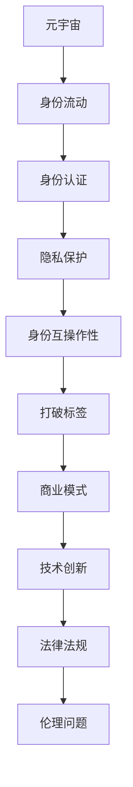
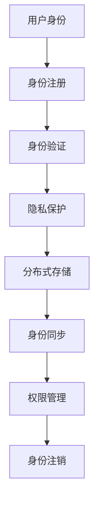

                 

# 元宇宙身份流动：打破现实世界标签的机遇

## 关键词
元宇宙，身份流动，身份认证，隐私保护，互操作性，商业模式，技术创新，法律法规，伦理问题

## 摘要
本文将探讨元宇宙中的身份流动，解析其定义、核心特征以及实现技术。同时，文章将深入分析元宇宙如何打破现实世界中的标签化现象，探讨这一变化带来的机遇与挑战。通过案例研究和未来展望，本文旨在为读者提供一个全面而深入的理解，展示身份流动在元宇宙中的重要作用及其对人类社会的影响。

## 目录大纲

### 第一部分：元宇宙与身份流动基础

1. **元宇宙概述**
   1.1. 元宇宙的定义与历史背景
   1.2. 元宇宙的核心特征与关键技术
   1.3. 元宇宙的产业现状与未来趋势

2. **身份流动概念解析**
   2.1. 身份流动的定义与类型
   2.2. 身份流动的重要性与挑战
   2.3. 身份流动的技术支持与实现

3. **身份流动的生态系统**
   3.1. 元宇宙身份管理框架
   3.2. 身份认证与隐私保护技术
   3.3. 身份互操作性与标准化

4. **现实世界标签的打破**
   4.1. 标签化现象与负面影响
   4.2. 元宇宙中打破标签的机制与策略
   4.3. 打破标签对人类社会的影响

### 第二部分：身份流动的机遇与挑战

5. **商业模式的创新**
   5.1. 身份流动对商业模式的变革
   5.2. 身份流动赋能的新兴行业
   5.3. 商业模式的案例解析

6. **技术创新与解决方案**
   6.1. 区块链技术在身份流动中的应用
   6.2. 分布式身份管理系统的构建
   6.3. 安全与隐私保护技术的进步

7. **法律法规与伦理问题**
   7.1. 身份流动相关的法律法规框架
   7.2. 身份流动的伦理挑战与对策
   7.3. 政策监管与行业自律

8. **案例研究**
   8.1. 成功案例的解析
   8.2. 失败案例的反思
   8.3. 身份流动在不同场景下的应用

9. **未来展望**
   9.1. 身份流动技术的未来发展
   9.2. 身份流动对社会经济的影响
   9.3. 身份流动的长期愿景与挑战

### 附录

10. **参考资料**
    - 元宇宙与身份流动相关文献综述
    - 身份流动技术工具与平台介绍
    - 相关法律法规与政策文件汇编

### 核心概念与联系

#### Mermaid 流程图


### 核心算法原理讲解

#### 分布式身份管理系统



#### 身份注册伪代码

```python
def register_identity(user_info):
    # 生成用户公钥和私钥
    public_key, private_key = generate_keys()
    
    # 存储用户公钥和相关信息
    store_public_key(user_info, public_key)
    
    # 将公钥加密存储
    encrypted_public_key = encrypt_key(public_key, root_key)
    
    # 将加密的公钥上传到分布式身份系统
    upload_public_key(encrypted_public_key)
    
    # 返回注册结果
    return "Identity registered successfully"
```

#### 身份认证协议

$$
\begin{aligned}
&\text{用户请求认证：} \\
&A &= \text{Hash}(P \oplus K) \\
&B &= \text{Timestamp} \\
&C &= A \oplus B \\
&D &= \text{Hash}(C) \\
\\
&\text{认证中心响应：} \\
&E &= \text{Hash}(A \oplus K) \\
&F &= \text{Timestamp} \\
&G &= E \oplus F \\
&H &= \text{Hash}(G) \\
\\
&\text{用户验证：} \\
&\text{比较} D \text{和} H, \text{若相等，认证成功}
\end{aligned}
$$`

### 项目实战

#### 身份认证系统的实现

```python
# 环境搭建
!pip install cryptography

# 导入所需的库
from cryptography.hazmat.backends import default_backend
from cryptography.hazmat.primitives.asymmetric import rsa
from cryptography.hazmat.primitives import hashes, serialization
from cryptography.hazmat.primitives.ciphers import Cipher, algorithms, modes
import base64

# 密钥生成
def generate_keys():
    private_key = rsa.generate_private_key(
        public_exponent=65537,
        key_size=2048,
        backend=default_backend()
    )
    public_key = private_key.public_key()
    return public_key, private_key

# 公钥存储
def store_public_key(user_info, public_key):
    # 存储用户公钥到数据库或其他存储系统
    pass

# 公钥上传
def upload_public_key(encrypted_public_key):
    # 将加密的公钥上传到分布式身份系统
    pass

# 身份注册
def register_identity(user_info):
    public_key, private_key = generate_keys()
    encrypted_public_key = encrypt_key(public_key.public_key(), root_key)
    store_public_key(user_info, public_key)
    upload_public_key(encrypted_public_key)
    return "Identity registered successfully"

# 加密函数
def encrypt_key(key, root_key):
    cipher = Cipher(algorithms.AES(root_key), modes.GCM(), backend=default_backend())
    encryptor = cipher.encryptor()
    encrypted_key = encryptor.update(key.public_bytes(serialization.PublicFormat.PKCS1))
    return encrypted_key

# 解密函数
def decrypt_key(encrypted_key, root_key):
    cipher = Cipher(algorithms.AES(root_key), modes.GCM(), backend=default_backend())
    decryptor = cipher.decryptor()
    decrypted_key = decryptor.update(encrypted_key)
    return decrypted_key
```

### 代码解读与分析

- `generate_keys()` 函数用于生成用户公钥和私钥。
- `store_public_key()` 函数用于将用户公钥和相关信息存储到数据库或其他存储系统。
- `upload_public_key()` 函数用于将加密的公钥上传到分布式身份系统。
- `encrypt_key()` 函数用于加密公钥，使用 AES 算法进行加密。
- `decrypt_key()` 函数用于解密公钥，使用 AES 算法进行解密。

#### A.1 主流深度学习框架对比

- **TensorFlow**：由谷歌开发，是目前最受欢迎的深度学习框架之一，拥有丰富的API和广泛的社区支持。
- **PyTorch**：由Facebook开发，以其动态计算图和易用性著称，尤其在研究和开发新算法时备受青睐。
- **JAX**：由谷歌开发，提供了自动微分功能，适用于大规模科学计算和机器学习应用。

#### A.2 身份流动技术工具与平台介绍

- **Blockchain平台**：例如Ethereum，用于构建去中心化的身份管理系统。
- **分布式身份管理系

