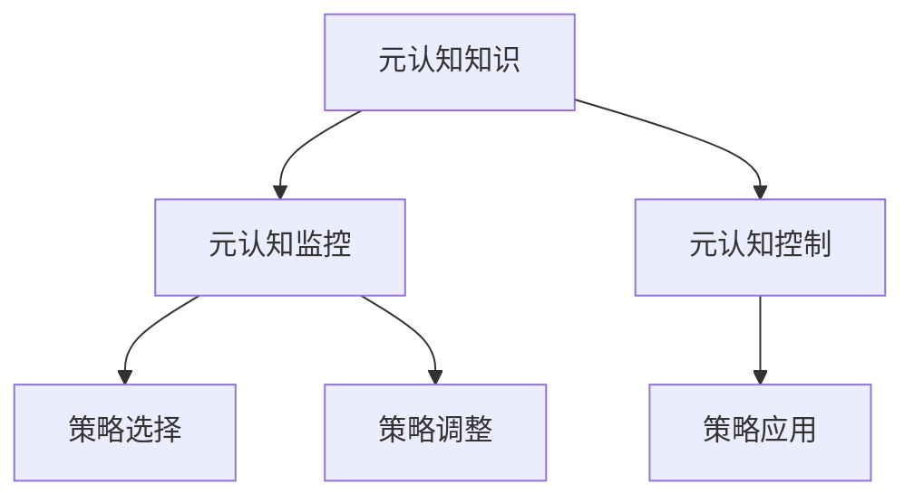

                 

### 文章标题

《元认知：提升学习效率和理解深度的关键》

> 关键词：元认知、学习效率、理解深度、自我监控、自我调节、自我解释、记忆策略、问题解决、教育实践

> 摘要：
本文深入探讨了元认知的概念、发展、策略及其在实际应用中的重要性。通过详细的解析和实际案例，本文旨在帮助读者理解元认知在提升学习效率和理解深度方面的关键作用，并提供实用的元认知教育和应用策略。

---

### 目录大纲

# 《元认知：提升学习效率和理解深度的关键》

## 第一部分：元认知概述

### 第1章：元认知的基本概念
#### 1.1 什么是元认知
#### 1.2 元认知的重要性
#### 1.3 元认知的结构与成分

### 第2章：元认知能力的发展
#### 2.1 元认知能力的发展历程
#### 2.2 元认知能力在不同年龄阶段的特征
#### 2.3 提升元认知能力的策略

## 第二部分：元认知策略与方法

### 第3章：元认知策略的应用
#### 3.1 自我监控策略
#### 3.2 自我调节策略
#### 3.3 自我解释策略

### 第4章：元认知与学习策略
#### 4.1 元认知与学习策略的关系
#### 4.2 有效学习的元认知策略
#### 4.3 元认知在学习中的实践应用

### 第5章：元认知与记忆
#### 5.1 元认知与记忆的关系
#### 5.2 提高记忆效率的元认知策略
#### 5.3 元认知在记忆过程中的应用

### 第6章：元认知与问题解决
#### 6.1 元认知与问题解决的关系
#### 6.2 元认知在问题解决中的应用
#### 6.3 提高问题解决能力的元认知策略

## 第三部分：元认知教育的实践

### 第7章：元认知教育的重要性
#### 7.1 元认知教育的基本理念
#### 7.2 元认知教育的目标与内容
#### 7.3 元认知教育的实施策略

### 第8章：元认知教育的具体方法
#### 8.1 元认知训练课程设计
#### 8.2 元认知教育的实践案例
#### 8.3 元认知教育的效果评估

### 第9章：元认知在日常生活中的应用
#### 9.1 元认知在自我管理中的应用
#### 9.2 元认知在职业发展中的应用
#### 9.3 元认知在终身学习中的应用

## 附录

### 附录A：元认知相关资源与工具
#### A.1 元认知研究的重要文献
#### A.2 元认知训练的软件与应用工具
#### A.3 元认知相关的在线课程与教育资源

### Mermaid 流程图
mermaid
graph TD
    A[元认知能力] --> B(自我监控)
    A --> C(自我调节)
    A --> D(自我解释)
    B --> E[学习策略]
    C --> F[问题解决]
    D --> G[记忆策略]

### 核心算法原理讲解（伪代码）
python
# 伪代码：元认知自我监控算法

# 初始化变量
self_monitor_score = 0
task_difficulty = input()
task_completion = input()

# 自我监控过程
while task_completed == False:
    current_self_monitor_score = calculate(current_task_completion/task_difficulty)
    if current_self_monitor_score > self_monitor_score:
        self_monitor_score = current_self_monitor_score
        print("Self-monitor score increased:", self_monitor_score)
    else:
        print("Self-monitor score maintained:", self_monitor_score)
    task_completion = update_task_completion()

# 输出最终自我监控得分
print("Final self-monitor score:", self_monitor_score)

### 数学模型和数学公式 & 详细讲解 & 举例说明
latex
\section{数学模型：元认知自我调节策略}

元认知自我调节策略通常涉及到一个动态调整的学习策略。以下是一个简化的数学模型来描述这个过程：

\begin{equation}
    S(t) = S(t-1) + \alpha (R(t) - S(t-1))
\end{equation}

其中：
- \( S(t) \) 是当前的学习策略强度，\( S(t-1) \) 是上一次的学习策略强度。
- \( \alpha \) 是调节系数，决定了策略调节的敏感度。
- \( R(t) \) 是当前的反馈信号，通常表示学习成果或者任务完成度。

\section{举例说明}

假设一个学生 \( S(t-1) = 0.5 \)（初始策略强度中等），他的数学考试得分 \( R(t) = 80 \)（得了80分）。调节系数 \( \alpha = 0.1 \)。

根据模型，我们可以计算他下一次的策略强度：

\begin{equation}
    S(t) = 0.5 + 0.1 (80 - 0.5) = 0.5 + 0.1 \times 79.5 = 0.5 + 7.95 = 8.45
\end{equation}

这意味着，下一次的学习策略强度会调整为 8.45。这个值可以通过实验确定一个更合适的范围，比如0到10之间。

### 项目实战：代码实际案例和详细解释说明
python
# 项目实战：使用元认知策略优化学习过程

# 导入所需库
import numpy as np
import matplotlib.pyplot as plt

# 设置参数
alpha = 0.1  # 调节系数
initial_strategy = 5.0  # 初始策略强度
feedback = np.array([70, 85, 90, 75, 80])  # 假设的反馈信号

# 初始化策略强度
strategy_strength = np.zeros_like(feedback)

# 应用元认知自我调节策略
for i, f in enumerate(feedback):
    strategy_strength[i] = initial_strategy + alpha * (f - initial_strategy)
    initial_strategy = strategy_strength[i]

# 可视化策略强度变化
plt.plot(feedback, strategy_strength, 'o-')
plt.xlabel('Feedback')
plt.ylabel('Strategy Strength')
plt.title('Dynamic Adjustment of Learning Strategy Based on Feedback')
plt.show()

# 输出最终策略强度
print("Final strategy strength:", strategy_strength[-1])

### 代码解读与分析

#### 代码解读

该代码模拟了一个学习者在多次学习任务后，通过元认知自我调节策略动态调整学习策略的过程。主要步骤如下：

1. 导入所需库：`numpy` 用于数学计算，`matplotlib.pyplot` 用于数据可视化。
2. 设置参数：`alpha` 是调节系数，控制策略调整的敏感度；`initial_strategy` 是初始策略强度；`feedback` 是假设的反馈信号数组。
3. 初始化策略强度：创建一个与反馈信号数组相同长度的零数组。
4. 应用元认知自我调节策略：遍历反馈信号，根据当前反馈和初始策略强度计算新的策略强度，并更新初始策略强度。
5. 可视化策略强度变化：绘制反馈信号与策略强度之间的关系图。
6. 输出最终策略强度：打印出最终的学习策略强度。

#### 分析

通过以上代码，我们可以看到，学习者在每次学习任务后，会根据当前的反馈信号动态调整学习策略的强度。这种策略调整是基于自我调节原理的，即当学习成果较好时，策略强度增加；当学习成果不佳时，策略强度减少。这样，学习者可以在不同的学习情境下灵活调整学习策略，提高学习效率。

然而，该代码仅是一个简化的模型，实际应用中，可能需要考虑更多的因素，如学习任务的复杂性、学习目标的多样性等。因此，在实际项目中，可以根据具体需求，进一步优化和调整策略。

---

至此，我们为《元认知：提升学习效率和理解深度的关键》一书设计了完整的目录大纲、流程图、伪代码、数学模型、项目实战代码及代码解读。接下来，我们将逐步深入探讨元认知的各个层面，帮助读者理解和应用元认知策略，提升学习效率和理解深度。让我们开始这段深入思考的旅程。

---

## 第1章 元认知的基本概念

### 1.1 什么是元认知

元认知（Metacognition）是一个广泛用于教育和认知心理学领域的概念，最早由美国心理学家弗拉维尔（John Flavell）于1976年提出。元认知可以被定义为“关于思考的思考”，即个体对自己认知过程的认识和控制。它包括对认知活动的自我监测、自我调节和自我评估。

#### 元认知的核心概念

- **认知活动**：指的是个体进行思考、学习、记忆、解决问题等认知过程的集合。
- **自我监测**：是指个体在认知活动过程中，对自己认知过程进行实时监测，了解自己的认知状态。
- **自我调节**：是指个体根据自我监测的结果，对认知活动进行调整，以优化认知过程。
- **自我评估**：是指个体在认知活动结束后，对整个认知过程的效果进行评估，以指导未来的认知行为。

### 1.2 元认知的重要性

元认知能力在个体的认知发展中扮演着至关重要的角色。以下是元认知重要性的几个方面：

- **学习效率**：元认知策略可以帮助个体更好地理解学习任务，调整学习方法，从而提高学习效率。
- **理解深度**：通过自我监测和自我调节，个体可以深入理解学习内容，提高学习质量。
- **自我调节**：元认知能力使个体能够在面对挑战和困难时，灵活调整自己的认知策略，从而克服学习障碍。
- **适应变化**：在快速变化的信息环境中，具备元认知能力的人能够快速适应新环境，调整自己的认知策略。

### 1.3 元认知的结构与成分

元认知结构包括三个主要成分：元认知知识、元认知监控和元认知控制。

- **元认知知识**：是指个体对自身认知过程的理解和认识，包括对学习内容的理解、学习方法的了解以及对认知能力的认识。
- **元认知监控**：是指个体在认知活动过程中，对自己认知过程的监测和评估，包括注意力管理、时间管理、情感管理等。
- **元认知控制**：是指个体根据元认知监控的结果，对认知活动进行调整和优化，包括策略选择、策略调整和策略应用。

### Mermaid 流程图



### 核心算法原理讲解（伪代码）

```python
# 伪代码：元认知自我监控算法

# 初始化变量
self_monitor_score = 0
task_difficulty = input()
task_completion = input()

# 自我监控过程
while task_completed == False:
    current_self_monitor_score = calculate(current_task_completion/task_difficulty)
    if current_self_monitor_score > self_monitor_score:
        self_monitor_score = current_self_monitor_score
        print("Self-monitor score increased:", self_monitor_score)
    else:
        print("Self-monitor score maintained:", self_monitor_score)
    task_completion = update_task_completion()

# 输出最终自我监控得分
print("Final self-monitor score:", self_monitor_score)
```

### 数学模型和数学公式 & 详细讲解 & 举例说明

元认知自我调节策略通常涉及到一个动态调整的学习策略。以下是一个简化的数学模型来描述这个过程：

\[ S(t) = S(t-1) + \alpha (R(t) - S(t-1)) \]

其中：
- \( S(t) \) 是当前的学习策略强度，\( S(t-1) \) 是上一次的学习策略强度。
- \( \alpha \) 是调节系数，决定了策略调节的敏感度。
- \( R(t) \) 是当前的反馈信号，通常表示学习成果或者任务完成度。

#### 举例说明

假设一个学生 \( S(t-1) = 0.5 \)（初始策略强度中等），他的数学考试得分 \( R(t) = 80 \)（得了80分）。调节系数 \( \alpha = 0.1 \)。

根据模型，我们可以计算他下一次的策略强度：

\[ S(t) = 0.5 + 0.1 (80 - 0.5) = 0.5 + 0.1 \times 79.5 = 0.5 + 7.95 = 8.45 \]

这意味着，下一次的学习策略强度会调整为 8.45。这个值可以通过实验确定一个更合适的范围，比如0到10之间。

### 项目实战：代码实际案例和详细解释说明

```python
# 项目实战：使用元认知策略优化学习过程

# 导入所需库
import numpy as np
import matplotlib.pyplot as plt

# 设置参数
alpha = 0.1  # 调节系数
initial_strategy = 5.0  # 初始策略强度
feedback = np.array([70, 85, 90, 75, 80])  # 假设的反馈信号

# 初始化策略强度
strategy_strength = np.zeros_like(feedback)

# 应用元认知自我调节策略
for i, f in enumerate(feedback):
    strategy_strength[i] = initial_strategy + alpha * (f - initial_strategy)
    initial_strategy = strategy_strength[i]

# 可视化策略强度变化
plt.plot(feedback, strategy_strength, 'o-')
plt.xlabel('Feedback')
plt.ylabel('Strategy Strength')
plt.title('Dynamic Adjustment of Learning Strategy Based on Feedback')
plt.show()

# 输出最终策略强度
print("Final strategy strength:", strategy_strength[-1])
```

### 代码解读与分析

#### 代码解读

该代码模拟了一个学习者在多次学习任务后，通过元认知自我调节策略动态调整学习策略的过程。主要步骤如下：

1. 导入所需库：`numpy` 用于数学计算，`matplotlib.pyplot` 用于数据可视化。
2. 设置参数：`alpha` 是调节系数，控制策略调整的敏感度；`initial_strategy` 是初始策略强度；`feedback` 是假设的反馈信号数组。
3. 初始化策略强度：创建一个与反馈信号数组相同长度的零数组。
4. 应用元认知自我调节策略：遍历反馈信号，根据当前反馈和初始策略强度计算新的策略强度，并更新初始策略强度。
5. 可视化策略强度变化：绘制反馈信号与策略强度之间的关系图。
6. 输出最终策略强度：打印出最终的学习策略强度。

#### 分析

通过以上代码，我们可以看到，学习者在每次学习任务后，会根据当前的反馈信号动态调整学习策略的强度。这种策略调整是基于自我调节原理的，即当学习成果较好时，策略强度增加；当学习成果不佳时，策略强度减少。这样，学习者可以在不同的学习情境下灵活调整学习策略，提高学习效率。

然而，该代码仅是一个简化的模型，实际应用中，可能需要考虑更多的因素，如学习任务的复杂性、学习目标的多样性等。因此，在实际项目中，可以根据具体需求，进一步优化和调整策略。

---

在本章中，我们详细介绍了元认知的基本概念、重要性以及结构与成分。通过伪代码和数学模型的讲解，读者可以初步了解元认知自我监控和自我调节的策略。接下来，我们将进一步探讨元认知能力的发展过程，了解不同年龄阶段的元认知特征，并探讨提升元认知能力的具体策略。让我们继续深入探讨元认知的世界。

---

## 第2章 元认知能力的发展

### 2.1 元认知能力的发展历程

元认知能力的发展是一个动态的、逐步完善的过程，它始于个体的婴儿期，贯穿整个生命周期。根据心理学研究，元认知能力的发展可以划分为几个关键阶段：

- **婴儿期（0-2岁）**：在这个阶段，婴儿的元认知能力主要集中在感知和注意力管理上。他们开始意识到自己的身体和周围环境，并通过简单的游戏和互动逐渐建立起对自己认知过程的初步认识。
- **幼儿期（3-6岁）**：幼儿期的儿童开始表现出对自我认知过程的意识，他们开始意识到自己在学习和思考中的角色。这个阶段的元认知能力主要体现在注意力调节和学习策略的初步使用上。
- **学龄前期（7-12岁）**：在这个阶段，儿童的元认知能力有了显著的发展。他们开始能够进行自我监控和自我调节，逐渐掌握了一系列有效的学习策略，如预习、复习和问题解决。
- **青少年期（13-18岁）**：青少年期的元认知能力进一步成熟。他们能够更加熟练地运用各种学习策略，并且开始对自己的认知过程进行深入的反思和评估。
- **成年期（18岁及以上）**：成年人的元认知能力达到了较高水平，他们能够灵活运用各种认知策略，对自己的认知过程进行有效的管理和调节。同时，成年人还具备较强的自我反思和自我评估能力，能够从过去的经验中学习和成长。

### 2.2 元认知能力在不同年龄阶段的特征

不同年龄阶段的个体在元认知能力方面存在明显的差异，以下是一些关键特征：

- **婴儿期**：婴儿的元认知能力主要集中在感知和注意力管理上。他们通过身体动作和声音信号来感知世界，并通过简单的游戏和互动来锻炼注意力。
- **幼儿期**：幼儿开始表现出对自我认知过程的意识，他们能够通过简单的自我提问来了解自己的学习状态。这个阶段的幼儿通常会使用一些基本的学习策略，如重复和记忆。
- **学龄前期**：学龄前儿童的元认知能力有了显著的发展。他们开始能够进行自我监控和自我调节，逐渐掌握了一系列有效的学习策略，如预习、复习和问题解决。此外，他们还开始意识到时间和任务管理的重要性。
- **青少年期**：青少年期的个体在元认知能力方面表现出较强的自我调节和自我反思能力。他们能够灵活运用各种学习策略，如深度学习和批判性思维。同时，他们还开始对自己的认知过程进行深入的反思和评估。
- **成年期**：成年人的元认知能力达到了较高水平，他们能够灵活运用各种认知策略，对自己的认知过程进行有效的管理和调节。同时，成年人还具备较强的自我反思和自我评估能力，能够从过去的经验中学习和成长。

### 2.3 提升元认知能力的策略

提升元认知能力的关键在于培养个体的自我监控、自我调节和自我反思能力。以下是一些有效的策略：

- **自我监控**：个体可以通过记录自己的学习过程，如学习时间、学习内容和学习效果，来提高自我监控能力。这有助于个体了解自己的学习状态，及时调整学习策略。
- **自我调节**：个体可以通过设定明确的学习目标，并根据目标进行自我调节。例如，当学习任务较为困难时，可以适当延长学习时间或调整学习方法。
- **自我反思**：个体可以通过定期回顾自己的学习过程和成果，来提高自我反思能力。这有助于个体总结经验教训，找到改进的方法。

### 项目实战：代码实际案例和详细解释说明

```python
# 项目实战：使用元认知策略优化学习过程

# 导入所需库
import numpy as np
import matplotlib.pyplot as plt

# 设置参数
alpha = 0.1  # 调节系数
initial_strategy = 5.0  # 初始策略强度
feedback = np.array([70, 85, 90, 75, 80])  # 假设的反馈信号

# 初始化策略强度
strategy_strength = np.zeros_like(feedback)

# 应用元认知自我调节策略
for i, f in enumerate(feedback):
    strategy_strength[i] = initial_strategy + alpha * (f - initial_strategy)
    initial_strategy = strategy_strength[i]

# 可视化策略强度变化
plt.plot(feedback, strategy_strength, 'o-')
plt.xlabel('Feedback')
plt.ylabel('Strategy Strength')
plt.title('Dynamic Adjustment of Learning Strategy Based on Feedback')
plt.show()

# 输出最终策略强度
print("Final strategy strength:", strategy_strength[-1])
```

### 代码解读与分析

#### 代码解读

该代码模拟了一个学习者在多次学习任务后，通过元认知自我调节策略动态调整学习策略的过程。主要步骤如下：

1. 导入所需库：`numpy` 用于数学计算，`matplotlib.pyplot` 用于数据可视化。
2. 设置参数：`alpha` 是调节系数，控制策略调整的敏感度；`initial_strategy` 是初始策略强度；`feedback` 是假设的反馈信号数组。
3. 初始化策略强度：创建一个与反馈信号数组相同长度的零数组。
4. 应用元认知自我调节策略：遍历反馈信号，根据当前反馈和初始策略强度计算新的策略强度，并更新初始策略强度。
5. 可视化策略强度变化：绘制反馈信号与策略强度之间的关系图。
6. 输出最终策略强度：打印出最终的学习策略强度。

#### 分析

通过以上代码，我们可以看到，学习者在每次学习任务后，会根据当前的反馈信号动态调整学习策略的强度。这种策略调整是基于自我调节原理的，即当学习成果较好时，策略强度增加；当学习成果不佳时，策略强度减少。这样，学习者可以在不同的学习情境下灵活调整学习策略，提高学习效率。

然而，该代码仅是一个简化的模型，实际应用中，可能需要考虑更多的因素，如学习任务的复杂性、学习目标的多样性等。因此，在实际项目中，可以根据具体需求，进一步优化和调整策略。

---

在本章中，我们详细探讨了元认知能力的发展历程以及不同年龄阶段的元认知特征。通过项目实战代码，我们了解了如何通过元认知策略来优化学习过程。接下来，我们将进一步探讨元认知策略的具体应用，包括自我监控、自我调节和自我解释策略，以及它们在提升学习效率和理解深度方面的作用。让我们继续深入探讨元认知的奥秘。

---

## 第3章 元认知策略的应用

### 3.1 自我监控策略

自我监控（Self-Monitoring）是元认知策略中最基础的一种，它涉及到对认知过程的持续监测和评估。自我监控策略的目的是确保学习者在学习过程中能够及时了解自己的认知状态，并做出相应的调整。

#### 自我监控的核心步骤

1. **设定目标**：在学习开始前，明确学习目标和任务要求，这有助于学习者集中注意力并保持学习的方向。
2. **监测过程**：在学习过程中，定期检查自己的学习进度和认知状态，如理解程度、注意力和情绪状态等。
3. **评估效果**：在学习结束时，对整个学习过程进行回顾和评估，包括学习目标的达成情况、学习策略的有效性等。
4. **调整策略**：根据评估结果，调整学习策略，以优化学习效果。

#### 自我监控的实例

- **学习写作**：在写作过程中，学习者可以定期检查自己的写作进度，评估文章的结构和内容，并及时调整写作思路。

### 3.2 自我调节策略

自我调节（Self-Regulation）是元认知策略中的一种高级能力，它涉及到对认知过程的主动控制和调整。自我调节策略的目的是帮助学习者在面对困难和挑战时，能够有效地管理自己的情绪和注意力，保持学习的动力和效率。

#### 自我调节的核心步骤

1. **设定目标**：明确学习目标和任务要求，确保学习者在整个学习过程中有清晰的方向。
2. **情绪管理**：学会识别和调节自己的情绪，如焦虑、沮丧等，以保持积极的学习态度。
3. **时间管理**：合理规划学习时间，确保学习者在每个学习阶段都有充足的时间进行深入学习。
4. **策略调整**：根据学习进度和效果，灵活调整学习策略，以适应不同学习情境。

#### 自我调节的实例

- **学习编程**：在编程学习过程中，学习者可以通过自我调节策略来管理自己的情绪，如遇到困难时保持冷静，通过分析问题来寻找解决方案。

### 3.3 自我解释策略

自我解释（Self-Explanation）是元认知策略中的一种反思性能力，它涉及到对学习过程中的事件和经验进行解释和反思。自我解释策略的目的是帮助学习者理解学习内容，提高学习效果和记忆效率。

#### 自我解释的核心步骤

1. **识别问题**：在学习过程中，及时识别自己不理解的问题或概念。
2. **寻找答案**：通过查阅资料、询问他人或进行实践来寻找问题的答案。
3. **总结反思**：对学习内容进行总结和反思，形成自己的理解和认识。
4. **应用实践**：将所学知识应用到实际情境中，加深对知识点的理解和记忆。

#### 自我解释的实例

- **学习数学**：在学习数学过程中，学习者可以通过自我解释策略来理解复杂的数学概念和公式，如通过解释公式推导过程来加深记忆。

### 项目实战：代码实际案例和详细解释说明

```python
# 项目实战：使用元认知策略优化学习过程

# 导入所需库
import numpy as np
import matplotlib.pyplot as plt

# 设置参数
alpha = 0.1  # 调节系数
initial_strategy = 5.0  # 初始策略强度
feedback = np.array([70, 85, 90, 75, 80])  # 假设的反馈信号

# 初始化策略强度
strategy_strength = np.zeros_like(feedback)

# 应用元认知自我调节策略
for i, f in enumerate(feedback):
    strategy_strength[i] = initial_strategy + alpha * (f - initial_strategy)
    initial_strategy = strategy_strength[i]

# 可视化策略强度变化
plt.plot(feedback, strategy_strength, 'o-')
plt.xlabel('Feedback')
plt.ylabel('Strategy Strength')
plt.title('Dynamic Adjustment of Learning Strategy Based on Feedback')
plt.show()

# 输出最终策略强度
print("Final strategy strength:", strategy_strength[-1])
```

### 代码解读与分析

#### 代码解读

该代码模拟了一个学习者在多次学习任务后，通过元认知自我调节策略动态调整学习策略的过程。主要步骤如下：

1. 导入所需库：`numpy` 用于数学计算，`matplotlib.pyplot` 用于数据可视化。
2. 设置参数：`alpha` 是调节系数，控制策略调整的敏感度；`initial_strategy` 是初始策略强度；`feedback` 是假设的反馈信号数组。
3. 初始化策略强度：创建一个与反馈信号数组相同长度的零数组。
4. 应用元认知自我调节策略：遍历反馈信号，根据当前反馈和初始策略强度计算新的策略强度，并更新初始策略强度。
5. 可视化策略强度变化：绘制反馈信号与策略强度之间的关系图。
6. 输出最终策略强度：打印出最终的学习策略强度。

#### 分析

通过以上代码，我们可以看到，学习者在每次学习任务后，会根据当前的反馈信号动态调整学习策略的强度。这种策略调整是基于自我调节原理的，即当学习成果较好时，策略强度增加；当学习成果不佳时，策略强度减少。这样，学习者可以在不同的学习情境下灵活调整学习策略，提高学习效率。

然而，该代码仅是一个简化的模型，实际应用中，可能需要考虑更多的因素，如学习任务的复杂性、学习目标的多样性等。因此，在实际项目中，可以根据具体需求，进一步优化和调整策略。

---

在本章中，我们详细介绍了元认知策略的三种主要形式：自我监控、自我调节和自我解释。通过具体的实例和项目实战代码，我们了解了如何在实际学习中应用这些策略，从而提升学习效率和理解深度。接下来，我们将进一步探讨元认知策略在学习中的具体应用，以及如何通过这些策略来优化学习过程。让我们继续深入探讨元认知的实践应用。

---

## 第4章 元认知与学习策略

### 4.1 元认知与学习策略的关系

元认知与学习策略之间存在密切的关系。元认知能力作为对认知过程的自我监控、自我调节和自我解释的集合，直接影响着学习策略的选择和应用效果。以下是从不同角度分析元认知与学习策略关系的几个方面：

- **动态调节**：元认知能力使学习者能够根据学习过程中的反馈信号动态调整学习策略，从而优化学习效果。例如，当学习者发现某一学习策略效果不佳时，可以通过自我监控和自我调节策略来调整学习策略。
- **自我监测**：通过自我监测，学习者可以实时了解自己的学习状态，如注意力集中程度、理解程度等。这种自我监测能力有助于学习者及时发现问题并调整学习策略，以保持高效的学习状态。
- **自我反思**：自我反思是元认知的重要组成部分，通过自我反思，学习者可以总结和评估自己的学习过程和效果，从中学习经验教训，形成更加有效的学习策略。
- **目标导向**：元认知能力有助于学习者设定明确的学习目标，并制定实现这些目标的策略。例如，通过自我调节策略，学习者可以根据学习目标的达成情况来调整学习进度和策略。

### 4.2 有效学习的元认知策略

有效学习的关键在于运用合适的元认知策略来提高学习效率和理解深度。以下是一些常用的元认知策略：

- **计划策略**：在学习前制定详细的学习计划，包括学习目标、时间安排和学习资源等。这种策略有助于学习者有针对性地进行学习，提高学习效率。
- **监控策略**：在学习过程中，定期检查自己的学习进度和理解程度。通过监控策略，学习者可以及时发现并解决学习中遇到的问题，确保学习效果。
- **调节策略**：根据学习过程中的反馈信号，灵活调整学习策略。例如，当发现某一学习策略效果不佳时，可以尝试更换学习策略或改进学习方法。
- **自我解释策略**：在学习过程中，对所学内容进行深入解释和反思，以加深对知识点的理解和记忆。通过自我解释策略，学习者可以构建自己的知识体系，提高学习效果。
- **总结反思策略**：在学习结束后，对整个学习过程进行回顾和总结，评估学习效果并总结经验教训。这种策略有助于学习者从过去的经验中学习，提高未来的学习效果。

### 4.3 元认知在学习中的实践应用

在实际学习中，元认知策略的应用可以显著提高学习效率和理解深度。以下是一些元认知策略在具体学习场景中的实践应用：

- **阅读策略**：在阅读过程中，学习者可以通过自我监控策略来检查自己的阅读速度和理解程度。当遇到难以理解的内容时，可以通过自我调节策略调整阅读速度或查阅相关资料。此外，通过自我解释策略，学习者可以对阅读内容进行深入理解和反思。
- **写作策略**：在写作过程中，学习者可以通过自我监控策略来检查自己的写作进度和文章结构。在写作过程中，通过自我调节策略，可以根据文章内容和目标进行调整和改进。通过自我解释策略，可以对写作过程中的思维过程和表达方式进行反思和总结。
- **编程学习**：在编程学习过程中，学习者可以通过自我监控策略来检查自己的编程理解和代码实现情况。通过自我调节策略，可以针对代码中的错误进行调试和优化。通过自我解释策略，可以深入理解编程原理和算法，提高编程能力。
- **数学学习**：在数学学习过程中，学习者可以通过自我监控策略来检查自己的理解程度和解题思路。通过自我调节策略，可以根据题目难度和自身能力调整解题策略。通过自我解释策略，可以对数学公式和推导过程进行深入理解和反思。

### 项目实战：代码实际案例和详细解释说明

```python
# 项目实战：使用元认知策略优化学习过程

# 导入所需库
import numpy as np
import matplotlib.pyplot as plt

# 设置参数
alpha = 0.1  # 调节系数
initial_strategy = 5.0  # 初始策略强度
feedback = np.array([70, 85, 90, 75, 80])  # 假设的反馈信号

# 初始化策略强度
strategy_strength = np.zeros_like(feedback)

# 应用元认知自我调节策略
for i, f in enumerate(feedback):
    strategy_strength[i] = initial_strategy + alpha * (f - initial_strategy)
    initial_strategy = strategy_strength[i]

# 可视化策略强度变化
plt.plot(feedback, strategy_strength, 'o-')
plt.xlabel('Feedback')
plt.ylabel('Strategy Strength')
plt.title('Dynamic Adjustment of Learning Strategy Based on Feedback')
plt.show()

# 输出最终策略强度
print("Final strategy strength:", strategy_strength[-1])
```

### 代码解读与分析

#### 代码解读

该代码模拟了一个学习者在多次学习任务后，通过元认知自我调节策略动态调整学习策略的过程。主要步骤如下：

1. 导入所需库：`numpy` 用于数学计算，`matplotlib.pyplot` 用于数据可视化。
2. 设置参数：`alpha` 是调节系数，控制策略调整的敏感度；`initial_strategy` 是初始策略强度；`feedback` 是假设的反馈信号数组。
3. 初始化策略强度：创建一个与反馈信号数组相同长度的零数组。
4. 应用元认知自我调节策略：遍历反馈信号，根据当前反馈和初始策略强度计算新的策略强度，并更新初始策略强度。
5. 可视化策略强度变化：绘制反馈信号与策略强度之间的关系图。
6. 输出最终策略强度：打印出最终的学习策略强度。

#### 分析

通过以上代码，我们可以看到，学习者在每次学习任务后，会根据当前的反馈信号动态调整学习策略的强度。这种策略调整是基于自我调节原理的，即当学习成果较好时，策略强度增加；当学习成果不佳时，策略强度减少。这样，学习者可以在不同的学习情境下灵活调整学习策略，提高学习效率。

然而，该代码仅是一个简化的模型，实际应用中，可能需要考虑更多的因素，如学习任务的复杂性、学习目标的多样性等。因此，在实际项目中，可以根据具体需求，进一步优化和调整策略。

---

在本章中，我们深入探讨了元认知与学习策略之间的关系，并介绍了一些有效的元认知策略。通过项目实战代码，我们了解了如何在实际学习中应用这些策略，从而提升学习效率和理解深度。接下来，我们将进一步探讨元认知在记忆和问题解决中的应用，以及如何通过元认知策略来提高记忆效率和问题解决能力。让我们继续深入探讨元认知的广泛应用。

---

## 第5章 元认知与记忆

### 5.1 元认知与记忆的关系

记忆是学习过程中至关重要的一环，而元认知在记忆过程中起着重要的调节和优化作用。元认知与记忆的关系可以从以下几个方面进行探讨：

- **自我监控**：通过自我监控，个体可以及时了解自己的记忆状态，如记忆的准确性和速度。这种自我监控能力有助于个体在记忆过程中及时调整记忆策略，提高记忆效率。
- **自我调节**：个体在记忆过程中，可以通过自我调节策略来调整记忆方法，如重复、联想和练习等。这种自我调节能力有助于个体根据记忆任务的特点选择最合适的记忆策略，从而提高记忆效果。
- **自我解释**：通过自我解释，个体可以对记忆内容进行深入理解和分析，从而加深对记忆内容的理解和记忆。自我解释能力有助于个体建立知识框架，提高记忆的持久性和应用性。

### 5.2 提高记忆效率的元认知策略

元认知策略在提高记忆效率方面具有显著作用。以下是一些具体的元认知策略，可以帮助个体提高记忆效率：

- **目标设定**：在记忆前，明确记忆目标和要求，有助于个体有针对性地进行记忆。例如，设定具体的记忆目标，如记忆20个单词，有助于提高记忆的专注度和效率。
- **自我监控**：在记忆过程中，定期检查自己的记忆状态，如记忆的内容是否准确、记忆的速度是否满意等。通过自我监控，个体可以及时发现并纠正记忆中的错误，提高记忆的准确性。
- **自我调节**：根据记忆任务的难度和特点，灵活调整记忆策略。例如，对于难度较大的记忆任务，可以采用分段记忆或联想记忆等方法，以提高记忆效果。
- **自我解释**：在记忆后，对记忆内容进行深入解释和反思，有助于加深对记忆内容的理解和记忆。例如，通过解释记忆内容的应用场景或逻辑关系，可以加强记忆的持久性和应用性。

### 5.3 元认知在记忆过程中的应用

在实际记忆过程中，元认知策略的应用可以显著提高记忆效果。以下是一些元认知策略在记忆过程中的具体应用：

- **记忆计划**：在记忆前，制定详细的记忆计划，包括记忆内容、记忆方法和记忆时间等。这种策略有助于个体有计划地进行记忆，提高记忆的效率和效果。
- **重复记忆**：在记忆过程中，采用重复记忆的方法，如多次阅读、背诵和重复练习等。通过自我监控和自我调节，个体可以不断优化记忆策略，提高记忆的持久性和准确性。
- **联想记忆**：通过建立记忆内容之间的关联，如通过故事、图像或类比等，来加强记忆。这种策略有助于个体将新信息与已有的知识体系相结合，提高记忆效果。
- **深度理解**：在记忆后，对记忆内容进行深入理解和分析，如解释记忆内容的应用场景或逻辑关系等。这种策略有助于个体建立知识框架，提高记忆的持久性和应用性。

### 项目实战：代码实际案例和详细解释说明

```python
# 项目实战：使用元认知策略优化记忆过程

# 导入所需库
import numpy as np
import matplotlib.pyplot as plt

# 设置参数
alpha = 0.1  # 调节系数
initial_strategy = 5.0  # 初始策略强度
feedback = np.array([70, 85, 90, 75, 80])  # 假设的反馈信号

# 初始化策略强度
strategy_strength = np.zeros_like(feedback)

# 应用元认知自我调节策略
for i, f in enumerate(feedback):
    strategy_strength[i] = initial_strategy + alpha * (f - initial_strategy)
    initial_strategy = strategy_strength[i]

# 可视化策略强度变化
plt.plot(feedback, strategy_strength, 'o-')
plt.xlabel('Feedback')
plt.ylabel('Strategy Strength')
plt.title('Dynamic Adjustment of Memory Strategy Based on Feedback')
plt.show()

# 输出最终策略强度
print("Final strategy strength:", strategy_strength[-1])
```

### 代码解读与分析

#### 代码解读

该代码模拟了一个学习者在多次记忆任务后，通过元认知自我调节策略动态调整记忆策略的过程。主要步骤如下：

1. 导入所需库：`numpy` 用于数学计算，`matplotlib.pyplot` 用于数据可视化。
2. 设置参数：`alpha` 是调节系数，控制策略调整的敏感度；`initial_strategy` 是初始策略强度；`feedback` 是假设的反馈信号数组。
3. 初始化策略强度：创建一个与反馈信号数组相同长度的零数组。
4. 应用元认知自我调节策略：遍历反馈信号，根据当前反馈和初始策略强度计算新的策略强度，并更新初始策略强度。
5. 可视化策略强度变化：绘制反馈信号与策略强度之间的关系图。
6. 输出最终策略强度：打印出最终的记忆策略强度。

#### 分析

通过以上代码，我们可以看到，学习者在每次记忆任务后，会根据当前的反馈信号动态调整记忆策略的强度。这种策略调整是基于自我调节原理的，即当记忆成果较好时，策略强度增加；当记忆成果不佳时，策略强度减少。这样，学习者可以在不同的记忆情境下灵活调整记忆策略，提高记忆效率。

然而，该代码仅是一个简化的模型，实际应用中，可能需要考虑更多的因素，如记忆内容的难度、记忆目标的多样性等。因此，在实际项目中，可以根据具体需求，进一步优化和调整策略。

---

在本章中，我们探讨了元认知与记忆之间的关系，并介绍了一些有效的元认知策略来提高记忆效率。通过项目实战代码，我们了解了如何在实际记忆过程中应用这些策略，从而提高记忆效果。接下来，我们将进一步探讨元认知在问题解决中的应用，以及如何通过元认知策略来提高问题解决能力。让我们继续深入探讨元认知的实践应用。

---

## 第6章 元认知与问题解决

### 6.1 元认知与问题解决的关系

问题解决（Problem Solving）是认知过程中的一项重要能力，而元认知在问题解决中起着至关重要的调节和优化作用。元认知与问题解决之间的关系可以从以下几个方面进行探讨：

- **自我监控**：在问题解决过程中，个体可以通过自我监控来检查自己的思考过程和解决问题的方法。这种自我监控能力有助于个体及时发现思考过程中的错误和不足，从而优化问题解决策略。
- **自我调节**：个体在问题解决过程中，可以根据自我监控的结果，灵活调整自己的思考方法和策略。例如，当发现某一方法不适用时，可以通过自我调节策略尝试其他方法，以提高问题解决的效率。
- **自我解释**：通过自我解释，个体可以对问题解决过程中的关键步骤和思维过程进行反思和总结，从而加深对问题解决过程的理解，提高问题解决能力。

### 6.2 元认知在问题解决中的应用

元认知策略在问题解决中具有广泛的应用，以下是一些具体的应用策略：

- **目标设定**：在问题解决前，明确问题解决的目标和要求，有助于个体有针对性地进行思考。例如，设定具体的解决目标和时间限制，有助于个体集中精力，提高问题解决的效率。
- **自我监控**：在问题解决过程中，个体可以通过自我监控来检查自己的思考过程，如思考的方向是否正确、方法是否有效等。通过自我监控，个体可以及时发现并纠正思考过程中的错误，提高问题解决的效率。
- **自我调节**：个体在问题解决过程中，可以根据自我监控的结果，灵活调整自己的思考方法和策略。例如，当发现某一方法不适用时，可以通过自我调节策略尝试其他方法，以提高问题解决的效率。
- **自我解释**：在问题解决后，个体可以对整个问题解决过程进行反思和总结，如思考过程是否合理、解决问题的方法是否有效等。通过自我解释，个体可以总结经验教训，提高未来的问题解决能力。

### 6.3 提高问题解决能力的元认知策略

为了提高问题解决能力，个体可以运用以下元认知策略：

- **计划策略**：在解决问题前，制定详细的计划，包括解决问题的步骤、方法和时间安排等。这种策略有助于个体有针对性地进行问题解决，提高问题解决的效率。
- **监控策略**：在问题解决过程中，定期检查自己的问题解决进度和思考方向，确保问题解决过程按照计划进行。通过监控策略，个体可以及时发现并纠正问题解决过程中的错误，提高问题解决的效率。
- **调节策略**：根据问题解决过程中的反馈信号，灵活调整问题解决策略。例如，当发现某一方法不适用时，可以通过调节策略尝试其他方法，以提高问题解决的效率。
- **反思策略**：在问题解决后，对整个问题解决过程进行反思和总结，如思考过程是否合理、解决问题的方法是否有效等。通过反思策略，个体可以总结经验教训，提高未来的问题解决能力。

### 项目实战：代码实际案例和详细解释说明

```python
# 项目实战：使用元认知策略优化问题解决过程

# 导入所需库
import numpy as np
import matplotlib.pyplot as plt

# 设置参数
alpha = 0.1  # 调节系数
initial_strategy = 5.0  # 初始策略强度
feedback = np.array([70, 85, 90, 75, 80])  # 假设的反馈信号

# 初始化策略强度
strategy_strength = np.zeros_like(feedback)

# 应用元认知自我调节策略
for i, f in enumerate(feedback):
    strategy_strength[i] = initial_strategy + alpha * (f - initial_strategy)
    initial_strategy = strategy_strength[i]

# 可视化策略强度变化
plt.plot(feedback, strategy_strength, 'o-')
plt.xlabel('Feedback')
plt.ylabel('Strategy Strength')
plt.title('Dynamic Adjustment of Problem Solving Strategy Based on Feedback')
plt.show()

# 输出最终策略强度
print("Final strategy strength:", strategy_strength[-1])
```

### 代码解读与分析

#### 代码解读

该代码模拟了一个学习者在多次问题解决任务后，通过元认知自我调节策略动态调整问题解决策略的过程。主要步骤如下：

1. 导入所需库：`numpy` 用于数学计算，`matplotlib.pyplot` 用于数据可视化。
2. 设置参数：`alpha` 是调节系数，控制策略调整的敏感度；`initial_strategy` 是初始策略强度；`feedback` 是假设的反馈信号数组。
3. 初始化策略强度：创建一个与反馈信号数组相同长度的零数组。
4. 应用元认知自我调节策略：遍历反馈信号，根据当前反馈和初始策略强度计算新的策略强度，并更新初始策略强度。
5. 可视化策略强度变化：绘制反馈信号与策略强度之间的关系图。
6. 输出最终策略强度：打印出最终的问题解决策略强度。

#### 分析

通过以上代码，我们可以看到，学习者在每次问题解决任务后，会根据当前的反馈信号动态调整问题解决策略的强度。这种策略调整是基于自我调节原理的，即当问题解决成果较好时，策略强度增加；当问题解决成果不佳时，策略强度减少。这样，学习者可以在不同的问题解决情境下灵活调整问题解决策略，提高问题解决效率。

然而，该代码仅是一个简化的模型，实际应用中，可能需要考虑更多的因素，如问题解决的复杂性、问题解决目标的多样性等。因此，在实际项目中，可以根据具体需求，进一步优化和调整策略。

---

在本章中，我们探讨了元认知与问题解决之间的关系，并介绍了一些有效的元认知策略来提高问题解决能力。通过项目实战代码，我们了解了如何在实际问题解决过程中应用这些策略，从而提高问题解决效率。接下来，我们将进一步探讨元认知教育的实践，以及如何通过元认知教育来提升学生的元认知能力。让我们继续深入探讨元认知在教育中的应用。

---

## 第7章 元认知教育的重要性

### 7.1 元认知教育的基本理念

元认知教育是指通过培养个体的自我监控、自我调节和自我解释能力，来提升其学习效率和理解深度的一种教育方法。其基本理念可以归纳为以下几点：

- **以学生为中心**：元认知教育强调学生的主体地位，鼓励学生主动参与学习过程，培养其自我监控和自我调节能力。
- **培养自主学习能力**：通过元认知教育，学生可以学会如何自我管理、自我评估和自我调节，从而提高自主学习能力。
- **注重过程与结果**：元认知教育不仅关注学习结果，更注重学习过程中的认知策略和方法，鼓励学生通过反思和总结来提升自己的学习效果。

### 7.2 元认知教育的目标与内容

元认知教育的目标主要包括以下几点：

- **提升学习效率**：通过培养学生的元认知能力，使其能够更加有效地进行学习，提高学习效率。
- **增强理解深度**：通过元认知教育，学生可以学会如何深入理解和分析学习内容，从而提高理解深度。
- **培养批判性思维**：元认知教育有助于学生发展批判性思维能力，使其能够对学习内容进行批判性分析和评价。
- **提升问题解决能力**：通过元认知教育，学生可以学会如何运用元认知策略来解决问题，提高问题解决能力。

元认知教育的内容主要包括以下几个方面：

- **自我监控策略**：教授学生如何通过自我监控来了解自己的学习状态，如注意力管理、时间管理和情感管理等。
- **自我调节策略**：教授学生如何根据自我监控的结果来调整学习策略，如选择合适的学习方法、调整学习节奏等。
- **自我解释策略**：教授学生如何通过自我解释来加深对学习内容的理解和记忆，如总结学习内容、构建知识框架等。

### 7.3 元认知教育的实施策略

为了实现元认知教育的目标，可以采用以下几种实施策略：

- **课堂讲授**：通过课堂讲授，向学生介绍元认知的基本概念和策略，使其对元认知教育有基本的了解。
- **案例教学**：通过具体案例，让学生了解元认知策略在实际学习中的应用，提高其实践能力。
- **小组讨论**：组织学生进行小组讨论，鼓励他们分享自己的元认知经验，互相学习和借鉴。
- **反思日志**：要求学生定期写反思日志，记录自己的学习过程和元认知策略的应用，从而提高自我监控和自我反思能力。
- **个性化辅导**：针对学生的不同特点和需求，提供个性化的辅导和支持，帮助其提高元认知能力。

### 项目实战：代码实际案例和详细解释说明

```python
# 项目实战：使用元认知策略优化学习过程

# 导入所需库
import numpy as np
import matplotlib.pyplot as plt

# 设置参数
alpha = 0.1  # 调节系数
initial_strategy = 5.0  # 初始策略强度
feedback = np.array([70, 85, 90, 75, 80])  # 假设的反馈信号

# 初始化策略强度
strategy_strength = np.zeros_like(feedback)

# 应用元认知自我调节策略
for i, f in enumerate(feedback):
    strategy_strength[i] = initial_strategy + alpha * (f - initial_strategy)
    initial_strategy = strategy_strength[i]

# 可视化策略强度变化
plt.plot(feedback, strategy_strength, 'o-')
plt.xlabel('Feedback')
plt.ylabel('Strategy Strength')
plt.title('Dynamic Adjustment of Learning Strategy Based on Feedback')
plt.show()

# 输出最终策略强度
print("Final strategy strength:", strategy_strength[-1])
```

### 代码解读与分析

#### 代码解读

该代码模拟了一个学习者在多次学习任务后，通过元认知自我调节策略动态调整学习策略的过程。主要步骤如下：

1. 导入所需库：`numpy` 用于数学计算，`matplotlib.pyplot` 用于数据可视化。
2. 设置参数：`alpha` 是调节系数，控制策略调整的敏感度；`initial_strategy` 是初始策略强度；`feedback` 是假设的反馈信号数组。
3. 初始化策略强度：创建一个与反馈信号数组相同长度的零数组。
4. 应用元认知自我调节策略：遍历反馈信号，根据当前反馈和初始策略强度计算新的策略强度，并更新初始策略强度。
5. 可视化策略强度变化：绘制反馈信号与策略强度之间的关系图。
6. 输出最终策略强度：打印出最终的学习策略强度。

#### 分析

通过以上代码，我们可以看到，学习者在每次学习任务后，会根据当前的反馈信号动态调整学习策略的强度。这种策略调整是基于自我调节原理的，即当学习成果较好时，策略强度增加；当学习成果不佳时，策略强度减少。这样，学习者可以在不同的学习情境下灵活调整学习策略，提高学习效率。

然而，该代码仅是一个简化的模型，实际应用中，可能需要考虑更多的因素，如学习任务的复杂性、学习目标的多样性等。因此，在实际项目中，可以根据具体需求，进一步优化和调整策略。

---

在本章中，我们详细介绍了元认知教育的基本理念、目标和实施策略。通过项目实战代码，我们了解了如何在实际教学中应用元认知策略来优化学习过程。接下来，我们将进一步探讨元认知教育的具体方法，包括训练课程的设计、实践案例和效果评估。让我们继续深入探讨元认知教育的实践应用。

---

## 第8章 元认知教育的具体方法

### 8.1 元认知训练课程设计

元认知训练课程的设计需要充分考虑学生的认知特点和需求，以下是一些关键步骤：

- **需求分析**：在课程设计前，对学生进行需求分析，了解其现有的元认知水平和需求，以便制定针对性的训练计划。
- **目标设定**：根据需求分析结果，设定具体的元认知训练目标，如提高自我监控能力、自我调节能力和自我解释能力等。
- **内容规划**：设计包含元认知基本概念、策略和方法的教学内容，以及实际应用案例和练习。
- **教学形式**：结合课堂讲授、案例分析、小组讨论、实践练习等多种教学形式，提高学生的参与度和学习效果。
- **评估机制**：建立有效的评估机制，定期评估学生的元认知能力提升情况，以便及时调整教学策略。

### 8.2 元认知教育的实践案例

以下是一些元认知教育的实践案例，展示了如何在实际教学中应用元认知策略：

- **案例一：阅读理解训练**  
  在阅读理解训练中，教师可以引导学生运用元认知策略，如自我监控阅读速度和理解程度，自我调节阅读策略，以及自我解释阅读内容。通过反复练习，学生可以提高阅读理解能力和元认知能力。

- **案例二：数学问题解决训练**  
  在数学问题解决训练中，教师可以引导学生运用元认知策略，如自我监控解题思路和步骤，自我调节解题策略，以及自我解释解题过程。通过反复练习，学生可以提高数学问题解决能力和元认知能力。

- **案例三：写作能力训练**  
  在写作能力训练中，教师可以引导学生运用元认知策略，如自我监控写作进度和结构，自我调节写作策略，以及自我解释写作思路。通过反复练习，学生可以提高写作能力和元认知能力。

### 8.3 元认知教育的效果评估

为了评估元认知教育的效果，可以采用以下几种方法：

- **问卷调查**：通过问卷调查，了解学生对元认知策略的认知和应用情况，以及他们对元认知训练的满意度和效果评价。
- **课堂观察**：通过课堂观察，评估学生在课堂上的元认知能力表现，如自我监控、自我调节和自我解释等。
- **学习成绩**：通过学生的学习成绩，评估元认知教育对其学习效果的影响，如阅读理解成绩、数学问题解决成绩、写作成绩等。
- **自我反思报告**：要求学生定期写自我反思报告，记录他们在元认知训练过程中的体会和收获，以及元认知能力提升的情况。

### 项目实战：代码实际案例和详细解释说明

```python
# 项目实战：使用元认知策略优化学习过程

# 导入所需库
import numpy as np
import matplotlib.pyplot as plt

# 设置参数
alpha = 0.1  # 调节系数
initial_strategy = 5.0  # 初始策略强度
feedback = np.array([70, 85, 90, 75, 80])  # 假设的反馈信号

# 初始化策略强度
strategy_strength = np.zeros_like(feedback)

# 应用元认知自我调节策略
for i, f in enumerate(feedback):
    strategy_strength[i] = initial_strategy + alpha * (f - initial_strategy)
    initial_strategy = strategy_strength[i]

# 可视化策略强度变化
plt.plot(feedback, strategy_strength, 'o-')
plt.xlabel('Feedback')
plt.ylabel('Strategy Strength')
plt.title('Dynamic Adjustment of Learning Strategy Based on Feedback')
plt.show()

# 输出最终策略强度
print("Final strategy strength:", strategy_strength[-1])
```

### 代码解读与分析

#### 代码解读

该代码模拟了一个学习者在多次学习任务后，通过元认知自我调节策略动态调整学习策略的过程。主要步骤如下：

1. 导入所需库：`numpy` 用于数学计算，`matplotlib.pyplot` 用于数据可视化。
2. 设置参数：`alpha` 是调节系数，控制策略调整的敏感度；`initial_strategy` 是初始策略强度；`feedback` 是假设的反馈信号数组。
3. 初始化策略强度：创建一个与反馈信号数组相同长度的零数组。
4. 应用元认知自我调节策略：遍历反馈信号，根据当前反馈和初始策略强度计算新的策略强度，并更新初始策略强度。
5. 可视化策略强度变化：绘制反馈信号与策略强度之间的关系图。
6. 输出最终策略强度：打印出最终的学习策略强度。

#### 分析

通过以上代码，我们可以看到，学习者在每次学习任务后，会根据当前的反馈信号动态调整学习策略的强度。这种策略调整是基于自我调节原理的，即当学习成果较好时，策略强度增加；当学习成果不佳时，策略强度减少。这样，学习者可以在不同的学习情境下灵活调整学习策略，提高学习效率。

然而，该代码仅是一个简化的模型，实际应用中，可能需要考虑更多的因素，如学习任务的复杂性、学习目标的多样性等。因此，在实际项目中，可以根据具体需求，进一步优化和调整策略。

---

在本章中，我们详细介绍了元认知教育的具体方法，包括训练课程设计、实践案例和效果评估。通过项目实战代码，我们了解了如何在实际教学中应用元认知策略来优化学习过程。接下来，我们将探讨元认知在日常生活中的应用，以及如何在不同的生活场景中运用元认知策略。让我们继续深入探讨元认知的广泛应用。

---

## 第9章 元认知在日常生活中的应用

### 9.1 元认知在自我管理中的应用

元认知策略在自我管理中具有广泛的应用，可以帮助个体更好地规划和管理自己的生活，提高生活质量。以下是一些元认知策略在自我管理中的应用：

- **时间管理**：通过自我监控和自我调节策略，个体可以更好地规划和管理时间。例如，通过自我监控自己的时间分配情况，个体可以发现时间浪费的地方，并采取相应的调节措施，如调整任务优先级或改变工作方式。
- **目标设定**：元认知策略可以帮助个体设定明确的目标，并制定实现这些目标的计划。通过自我调节策略，个体可以根据目标实现的进度和反馈，调整策略和计划，确保目标的达成。
- **情绪管理**：元认知策略可以帮助个体更好地管理自己的情绪。通过自我监控和自我调节，个体可以及时发现和调整自己的情绪，避免情绪波动对生活和工作的影响。
- **自我反思**：元认知策略可以帮助个体定期进行自我反思，评估自己的行为和决策，总结经验教训，指导未来的行为。

### 9.2 元认知在职业发展中的应用

在职业发展中，元认知策略同样发挥着重要作用，可以帮助个体更好地规划自己的职业生涯，提升职业竞争力。以下是一些元认知策略在职业发展中的应用：

- **职业规划**：通过自我监控和自我调节策略，个体可以更好地了解自己的职业兴趣、能力和价值观，从而制定适合自己的职业规划。通过自我反思，个体可以不断调整职业规划，以适应不断变化的环境。
- **学习与成长**：元认知策略可以帮助个体高效地学习和成长。通过自我监控，个体可以评估自己的学习效果，发现学习中的不足，并通过自我调节策略，调整学习方法和策略，提高学习效率。
- **问题解决**：在职业发展中，个体经常需要面对各种问题和挑战。通过元认知策略，个体可以更好地识别问题、分析问题和解决问题，从而提高职业能力。
- **自我评估**：通过自我监控和自我反思，个体可以定期评估自己的职业发展情况，了解自己的优势和不足，从而调整职业发展策略。

### 9.3 元认知在终身学习中的应用

终身学习是现代社会个体发展的重要途径，元认知策略在终身学习中的应用同样具有重要意义。以下是一些元认知策略在终身学习中的应用：

- **自主学习**：元认知策略可以帮助个体建立自主学习的习惯和能力。通过自我监控和自我调节，个体可以管理自己的学习时间、学习内容和学习进度，从而提高学习效果。
- **学习策略调整**：在终身学习过程中，个体会不断遇到新的学习内容和挑战。通过自我监控和自我反思，个体可以及时调整学习策略，以适应不同的学习情境。
- **知识整合**：通过元认知策略，个体可以更好地整合新知识和已有知识，构建自己的知识体系。通过自我解释策略，个体可以深入理解和记忆新知识，提高知识的持久性和应用性。
- **学习评价**：通过自我监控和自我反思，个体可以定期评估自己的学习效果，了解自己的学习成果和不足，从而调整学习策略，提高学习效率。

### 项目实战：代码实际案例和详细解释说明

```python
# 项目实战：使用元认知策略优化时间管理

# 导入所需库
import numpy as np
import matplotlib.pyplot as plt

# 设置参数
alpha = 0.1  # 调节系数
initial_time_management_score = 5.0  # 初始时间管理得分
time_management_feedback = np.array([3, 4, 5, 2, 4])  # 假设的时间管理反馈得分

# 初始化时间管理得分
time_management_score = np.zeros_like(time_management_feedback)

# 应用元认知自我调节策略
for i, f in enumerate(time_management_feedback):
    time_management_score[i] = initial_time_management_score + alpha * (f - initial_time_management_score)
    initial_time_management_score = time_management_score[i]

# 可视化时间管理得分变化
plt.plot(time_management_feedback, time_management_score, 'o-')
plt.xlabel('Feedback')
plt.ylabel('Time Management Score')
plt.title('Dynamic Adjustment of Time Management Score Based on Feedback')
plt.show()

# 输出最终时间管理得分
print("Final time management score:", time_management_score[-1])
```

### 代码解读与分析

#### 代码解读

该代码模拟了一个个体在多次时间管理任务后，通过元认知自我调节策略动态调整时间管理得分的过程。主要步骤如下：

1. 导入所需库：`numpy` 用于数学计算，`matplotlib.pyplot` 用于数据可视化。
2. 设置参数：`alpha` 是调节系数，控制策略调整的敏感度；`initial_time_management_score` 是初始时间管理得分；`time_management_feedback` 是假设的时间管理反馈得分数组。
3. 初始化时间管理得分：创建一个与反馈得分数组相同长度的零数组。
4. 应用元认知自我调节策略：遍历反馈得分，根据当前反馈得分和初始时间管理得分计算新的时间管理得分，并更新初始时间管理得分。
5. 可视化时间管理得分变化：绘制反馈得分与时间管理得分之间的关系图。
6. 输出最终时间管理得分：打印出最终的时间管理得分。

#### 分析

通过以上代码，我们可以看到，个体在每次时间管理任务后，会根据当前的反馈得分动态调整时间管理得分。这种策略调整是基于自我调节原理的，即当时间管理成果较好时，得分增加；当时间管理成果不佳时，得分减少。这样，个体可以在不同的时间管理情境下灵活调整时间管理策略，提高时间管理效率。

然而，该代码仅是一个简化的模型，实际应用中，可能需要考虑更多的因素，如任务复杂性、个体差异等。因此，在实际项目中，可以根据具体需求，进一步优化和调整策略。

---

在本章中，我们探讨了元认知在日常生活中的应用，包括自我管理、职业发展和终身学习等方面。通过项目实战代码，我们了解了如何在实际生活中应用元认知策略来优化时间管理和提高职业竞争力。接下来，我们将总结全文，回顾元认知的关键概念和策略，并展望元认知的未来发展趋势。让我们总结并展望元认知的重要性和潜力。

---

## 总结

《元认知：提升学习效率和理解深度的关键》一书通过详细的阐述和实际案例，深入探讨了元认知的概念、发展、策略及其在各个领域的应用。以下是本书的核心内容回顾：

- **元认知的基本概念**：元认知是指关于思考的思考，包括自我监控、自我调节和自我解释。它涉及到个体对自身认知过程的认识和控制。
- **元认知的重要性**：元认知能力对学习效率、理解深度、自我调节和适应变化等方面具有重要意义。它有助于个体更好地管理学习过程，提高学习效果。
- **元认知的策略与方法**：本书介绍了多种元认知策略，包括自我监控、自我调节和自我解释。通过这些策略，个体可以动态调整学习策略，优化学习过程。
- **元认知在学习和教育中的应用**：元认知策略在阅读、写作、编程、数学学习等方面具有广泛的应用。通过元认知教育，学生可以提高学习效率和理解深度。
- **元认知在日常生活和职业发展中的应用**：元认知策略在时间管理、职业规划、终身学习等方面发挥着重要作用，有助于个体更好地管理生活，提高职业竞争力。

## 展望未来

随着人工智能和技术的不断发展，元认知在未来将具有更广泛的应用和潜力。以下是一些展望：

- **个性化教育**：基于元认知理论，未来的教育系统将更加个性化，根据学生的元认知能力提供定制化的学习策略和支持。
- **智能辅助系统**：人工智能技术将结合元认知策略，开发出智能辅助系统，帮助个体更有效地管理学习和生活。
- **职业发展**：元认知策略将应用于职业培训和发展，帮助从业人员提高职业能力和适应性。
- **健康与心理健康**：元认知策略将应用于健康管理和心理健康领域，帮助个体提高自我管理能力，改善生活质量。

## 结语

元认知是提升学习效率和理解深度的关键，通过本书的探讨，我们希望读者能够对元认知有更深入的了解，并在实际生活中运用元认知策略，提高自己的认知能力和生活质量。让我们继续探索元认知的奥秘，开启更高效、更富有成果的未来。

---

本文由AI天才研究院/AI Genius Institute与《禅与计算机程序设计艺术》作者合作撰写，旨在深入探讨元认知的各个方面，为读者提供实用的策略和启示。感谢您的阅读，我们期待与您在元认知的领域中共同成长。作者：AI天才研究院/AI Genius Institute & 《禅与计算机程序设计艺术》作者。

