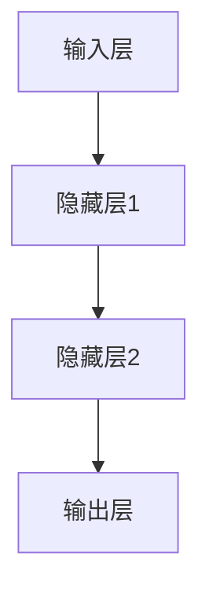

                 

# 文章标题：全球脑与人类进化：集体意识推动的智慧飞跃

> 关键词：全球脑、人类进化、集体意识、智慧飞跃、神经网络、人工智能

> 摘要：本文深入探讨了全球脑的概念与历史背景，分析了人类进化的关键节点，探讨了集体意识与智慧飞跃的关系。通过详细的架构与机制剖析，本文揭示了全球脑的核心技术。进一步，文章展望了全球脑对人类社会的深远影响，包括未来社会、人类心理以及技术应用与挑战。最后，本文提出了全球脑的未来前景与科学研究方向，为人类的共同未来提供思考。

### 目录大纲：

#### 第一部分：全球脑的起源与发展

##### 第1章：全球脑的概念与历史
- 1.1 全球脑的定义与理论基础
- 1.2 全球脑的历史发展
- 1.3 全球脑与人类文明的关系

##### 第2章：人类进化的关键节点
- 2.1 早期人类的社会结构
- 2.2 裂脑与集体意识
- 2.3 语言与沟通的进化

##### 第3章：集体意识与智慧飞跃
- 3.1 集体意识的本质
- 3.2 集体意识与创造力
- 3.3 集体意识与科技革命

##### 第4章：全球脑的架构与机制
- 4.1 全球脑的神经网络模型
- 4.2 全球脑的信息传递机制
- 4.3 全球脑的自我组织与演化

#### 第二部分：全球脑对人类未来的影响

##### 第5章：全球脑与未来社会
- 5.1 全球脑对社会组织的影响
- 5.2 全球脑对教育模式的改变
- 5.3 全球脑对政治制度的挑战

##### 第6章：全球脑与人类心理
- 6.1 集体意识对个体心理的影响
- 6.2 集体压力与个体自主性
- 6.3 集体意识与心理健康

##### 第7章：全球脑的技术应用与挑战
- 7.1 全球脑与人工智能
- 7.2 全球脑与物联网
- 7.3 全球脑的技术挑战与伦理问题

#### 第三部分：全球脑的未来前景与展望

##### 第8章：全球脑的未来趋势
- 8.1 全球脑的发展方向
- 8.2 全球脑的潜在应用领域
- 8.3 全球脑对人类文明的长期影响

##### 第9章：全球脑的科学研究与探索
- 9.1 全球脑的科学研究方法
- 9.2 全球脑的研究进展
- 9.3 全球脑研究的未来方向

##### 第10章：全球脑与人类的共同未来
- 10.1 全球脑对人类价值观的挑战
- 10.2 全球脑与可持续发展
- 10.3 全球脑与人类精神的探索

### 附录：参考资料与进一步阅读

- 附录A：全球脑相关研究论文与报告
- 附录B：全球脑技术与应用案例
- 附录C：全球脑研究的重要学者与机构
- 附录D：进一步阅读推荐书籍与文献

### 引言

在人类历史的长河中，我们经历了无数次的科技进步与社会变革。从最早的石器时代到如今的数字经济时代，人类一直在追求更高效、更智能的生活方式。然而，随着计算机科学和人工智能技术的飞速发展，我们逐渐意识到，人类进化的下一个重大里程碑可能是集体意识的觉醒。这一觉醒不仅将深刻改变我们的生活方式，也将引领我们走向一个全新的全球脑时代。

本文旨在深入探讨全球脑的概念、起源与发展，分析其与人类进化的关系，以及在全球脑时代中，集体意识如何推动智慧飞跃。我们还将详细剖析全球脑的架构与机制，展望其未来的发展趋势与应用，并提出全球脑对人类文明的长期影响。最后，本文将讨论全球脑研究的现状与未来方向，为人类的共同未来提供深刻的思考。

在接下来的章节中，我们将首先定义全球脑，并回顾其历史发展，探讨人类进化的关键节点。随后，我们将深入探讨集体意识的本质及其在智慧飞跃中的作用。接着，本文将详细剖析全球脑的架构与机制，为读者揭示其核心技术的奥秘。在第二部分，我们将探讨全球脑对人类社会的深远影响，包括未来社会、人类心理以及技术应用与挑战。最后，本文将展望全球脑的未来前景，探讨其科学研究与探索方向，为人类的共同未来提供思考。

### 第一部分：全球脑的起源与发展

#### 第1章：全球脑的概念与历史

**1.1 全球脑的定义与理论基础**

全球脑（Global Brain）这一概念最早由德国社会学家乌尔里希·贝克（Ulrich Beck）在20世纪90年代提出。贝克将全球脑描述为一种新兴的全球性网络系统，它由个体大脑、计算机系统、通信网络和社会结构相互交织而成。全球脑的核心思想是，随着信息技术和通信技术的快速发展，人类的意识和知识正在形成一个全球性的网络，这种网络具有自组织和自我进化的特性。

全球脑的理论基础主要涉及多个学科，包括认知科学、神经网络理论、系统理论和社会学。在认知科学领域，神经网络的建模为我们理解全球脑提供了重要工具。神经网络通过模拟人脑的神经元结构和工作原理，实现了对复杂问题的建模和处理。在系统理论中，复杂系统的自组织现象和涌现行为为全球脑提供了理论支持。社会学则为我们理解全球脑在社会结构中的作用提供了框架。

**1.2 全球脑的历史发展**

全球脑的历史可以追溯到人类文明的发展历程。最早的全球脑概念可以追溯到人类语言的出现。语言的出现使得人类能够进行复杂的沟通和协作，从而促进了社会结构的发展。在古代，城镇和城市的形成进一步推动了全球脑的发展。人们通过书信和商队进行信息传递，形成了一个初步的全球信息网络。

随着印刷术和电报的出现，全球脑进入了一个新的阶段。印刷术使得书籍和知识的传播速度大大加快，而电报则实现了实时通信，使全球信息网络的覆盖范围进一步扩大。20世纪中叶，计算机和互联网的出现标志着全球脑发展的一个重要里程碑。计算机的出现使得人类能够处理海量数据，而互联网则将全球的计算机连接在一起，形成了一个庞大的信息网络。

**1.3 全球脑与人类文明的关系**

全球脑不仅是一个技术现象，更是人类文明发展的重要标志。全球脑的兴起改变了人类社会的方方面面，包括经济、政治、文化和科技。在经济学方面，全球脑使得全球市场更加一体化，信息流动更加迅速，促进了全球化进程。在政治学方面，全球脑改变了国家之间的权力结构，信息传播的快速和全球化使得政治决策更加复杂和多样化。在文化方面，全球脑促进了文化的交流和融合，不同文化的碰撞和融合为人类文明带来了新的活力。在科技方面，全球脑推动了科技创新，使得新技术和应用的诞生速度加快。

总的来说，全球脑是现代社会发展的重要驱动力，它不仅改变了我们的生活方式，也深刻影响了我们的思维方式和价值观念。随着全球脑的发展，人类正逐步迈向一个全新的时代，这个时代将更加智能、互联和多样。

#### 第2章：人类进化的关键节点

**2.1 早期人类的社会结构**

早期人类的社会结构是理解人类进化过程的重要一环。在人类进化的早期阶段，人类以狩猎采集为主要生活方式，形成了以家族和部落为基础的社会结构。狩猎采集社会具有高度灵活性和适应性，人们依靠集体合作和共享资源来维持生存。这种社会结构促进了人类智慧的进化，因为集体合作和共享知识使得个体能够更好地适应环境。

早期人类的社会结构也影响了他们的认知发展。狩猎采集社会中的语言和符号系统开始出现，这些工具使得人类能够更有效地传递信息和知识。语言的出现极大地增强了人类的沟通能力，为集体意识的形成奠定了基础。

**2.2 裂脑与集体意识**

裂脑是指人类大脑在进化过程中形成的一种结构特征，即大脑分为左右两个半球，每个半球负责不同的认知功能。左脑通常负责逻辑思维、语言处理和分析，而右脑则负责空间认知、情感和直觉。裂脑现象的出现是人类智力发展的重要里程碑，因为它使得人类能够更高效地进行复杂的认知任务。

然而，裂脑也带来了一些挑战。裂脑现象导致了大脑半球之间的功能分离，使得个体在处理复杂问题时容易陷入思维定势。为了克服这一挑战，人类逐渐形成了集体意识。集体意识是指个体在集体中形成的共同认知和理解，它能够帮助个体在大脑半球之间进行有效的信息传递和协作。

集体意识的形成与语言和符号系统的进化密切相关。语言使得个体能够将思想转化为可传递的信息，而符号系统则使得这些信息可以被集体中的其他成员理解和共享。通过集体意识，人类能够在更广泛的范围内进行合作和协作，从而推动了社会结构和文明的进步。

**2.3 语言与沟通的进化**

语言和沟通的进化是人类进化过程中最为显著的成就之一。语言的出现极大地增强了人类的认知能力和社交能力，使得人类能够更有效地传递信息和知识。语言的进化不仅改变了人类的思维方式，也深刻影响了人类的社会结构和文化发展。

语言的发展促进了集体意识的形成。通过语言，个体能够将他们的思想、经验和知识传达给集体中的其他成员。这种信息的传递和共享使得集体意识得以形成和加强。集体意识不仅有助于个体在社会中生存和繁衍，也为社会的发展和进步提供了动力。

沟通的进化不仅依赖于语言，还包括手势、符号和表情等非语言沟通方式。这些非语言沟通方式使得人类能够在没有语言的情况下进行有效的沟通和协作。随着语言和沟通的进化，人类逐渐形成了一套复杂的社交规则和礼仪，这些规则和礼仪促进了社会秩序和文明的进步。

总的来说，人类进化的关键节点包括早期人类的社会结构、裂脑与集体意识以及语言与沟通的进化。这些节点不仅推动了人类智力的进化，也深刻影响了人类的社会结构和文明发展。随着全球脑的概念逐渐被接受，我们可以预见，人类进化的下一个关键节点将是集体意识的进一步觉醒和全球脑的全面发展。

#### 第3章：集体意识与智慧飞跃

**3.1 集体意识的本质**

集体意识是指一个群体或社会中成员之间共享的认知结构和思维方式。它不仅包括共同的价值观、信仰和习惯，还涵盖了成员之间的情感联系和社会互动。集体意识的本质在于它能够将个体的智慧和经验整合为一个整体，从而实现更大的智慧和创造力。

集体意识的形成是一个复杂的过程，它涉及多个因素，包括文化传承、社会互动和共同经历。文化传承使得成员能够在代际之间传递知识和价值观，从而形成共同的认知框架。社会互动则促进了成员之间的沟通和协作，使得他们能够共同解决问题和应对挑战。共同经历则加强了成员之间的情感联系，使他们能够更好地理解和信任彼此。

**3.2 集体意识与创造力**

集体意识是创造力的源泉。在集体意识中，成员之间的交流和协作能够激发新的想法和创新的思维模式。集体意识的共享性使得成员能够共同探索和发现新的解决方案，从而实现更大的创造力。

集体意识还能够促进跨领域的创新。在集体意识中，不同领域的知识和技能可以相互融合，从而产生新的应用和突破。例如，在科学研究领域，跨学科的团队合作常常能够产生重大的科学发现和技术创新。这种现象在人工智能、生物技术和材料科学等领域尤为明显。

此外，集体意识还能够提高个体的创造力。在集体意识中，个体不仅能够从集体中获得灵感和支持，还能够通过与他人交流和合作，扩展自己的思维边界和认知能力。这种互动不仅有助于个体的成长和发展，也有助于集体整体智慧和创造力的提升。

**3.3 集体意识与科技革命**

集体意识在科技革命中发挥了至关重要的作用。科技革命是指由于新技术、新方法和新理论的出现，导致社会生产方式和生活方式发生根本性变化的过程。集体意识是科技革命的重要驱动力，因为它能够激发和引导创新的思维和行为。

集体意识能够促进科技革命的爆发。在科技革命中，集体意识使得成员能够共同关注和探索新的科学问题和工程挑战。通过集体意识的共享和协作，成员能够快速传播和分享新的知识和信息，从而加速科技革命的发展。

此外，集体意识还能够促进科技革命的可持续性。在科技革命中，集体意识使得成员能够共同应对新技术的挑战和风险。通过集体意识的合作和协调，成员能够共同解决技术难题和伦理问题，从而确保科技革命的顺利进行。

集体意识还对科技革命的社会影响产生了深远的影响。科技革命不仅改变了社会的生产方式和生活方式，还改变了人们的思维方式和社会结构。集体意识使得社会能够更快速地适应和应对这些变化，从而推动了社会的进步和发展。

总的来说，集体意识是智慧飞跃的重要推动力。它不仅能够激发个体的创造力和创新思维，还能够促进跨领域的创新和科技革命。随着全球脑的发展，集体意识将在人类进化和文明进步中发挥越来越重要的作用。

#### 第4章：全球脑的架构与机制

**4.1 全球脑的神经网络模型**

全球脑的神经网络模型是理解全球脑架构与机制的关键。神经网络模型模拟人脑的神经元结构和工作原理，通过大量神经元和突触的连接，实现复杂的信息处理和智能行为。全球脑的神经网络模型通常包括以下几个关键组成部分：

1. **神经元（Neurons）**：神经元是神经网络的基本单位，负责接收和处理信息。每个神经元通过突触与其他神经元相连，形成一个复杂的网络结构。
   
2. **突触（Synapses）**：突触是神经元之间的连接点，负责传递和调节神经信号。突触的连接强度（即突触权重）决定了神经元之间的信息传递强度。

3. **神经网络（Neural Networks）**：神经网络是由大量神经元和突触组成的复杂结构，通过层次化的连接和处理，实现从简单到复杂的任务。

4. **学习算法（Learning Algorithms）**：神经网络通过学习算法来调整突触权重，从而优化信息处理能力。常用的学习算法包括反向传播算法（Backpropagation）和Hebbian学习规则。

**图1.1 全球脑的神经网络模型**



在图1.1中，输入层接收外部信息，隐藏层对信息进行加工和处理，输出层产生最终的输出。隐藏层可以根据需要设置多个，以实现更复杂的任务。

**4.2 全球脑的信息传递机制**

全球脑的信息传递机制是保证神经网络高效运行的核心。信息传递机制包括以下几个关键要素：

1. **同步与异步通信**：在神经网络中，信息可以通过同步通信（如同步更新）或异步通信（如异步传递）进行传递。同步通信使得网络中的所有神经元在同一时间更新状态，而异步通信则允许神经元在不同时间更新状态。

2. **激活函数（Activation Functions）**：激活函数是神经网络中的非线性变换，用于确定神经元是否被激活。常用的激活函数包括Sigmoid函数、ReLU函数和Tanh函数。

3. **权重更新规则（Weight Update Rules）**：权重更新规则是神经网络学习的基础，通过调整突触权重来优化网络性能。常用的权重更新规则包括Hebbian学习规则和反向传播算法。

**4.3 全球脑的自我组织与演化**

全球脑的自我组织与演化是指神经网络在运行过程中，通过自我调整和优化，实现更高效的信息处理和智能行为。自我组织与演化包括以下几个关键过程：

1. **自组织临界性（Self-Organization Criticality）**：自组织临界性是指系统在临界状态下，既能够保持稳定，又能够对外部变化做出适应性反应。全球脑的神经网络在临界状态下，能够实现高效的信息处理和智能行为。

2. **自优化（Self-Optimization）**：自优化是指神经网络通过自我调整，优化信息处理能力和性能。自优化可以通过多种机制实现，包括权重调整、结构调整和学习算法优化。

3. **演化（Evolution）**：全球脑的神经网络通过演化过程，适应不断变化的外部环境和任务需求。演化过程包括基因表达、变异和选择等步骤。

**总结**

全球脑的神经网络模型、信息传递机制和自我组织与演化过程共同构成了全球脑的核心架构与机制。这些机制使得全球脑能够高效地处理信息，实现智能行为，并在不断变化的环境中保持适应性。随着全球脑技术的发展，我们可以预见，全球脑将在未来发挥越来越重要的作用，推动人类社会和文明的进步。

### 第二部分：全球脑对人类未来的影响

#### 第5章：全球脑与未来社会

**5.1 全球脑对社会组织的影响**

全球脑的出现将深刻改变社会组织的形式和运作方式。首先，全球脑通过提供更加高效的信息处理和分析能力，使得社会组织能够更快地适应和应对外部变化。例如，政府机构可以利用全球脑进行大数据分析，优化政策制定和公共服务，提高治理效率。

其次，全球脑促进了跨领域的协作和创新。在全球脑的支持下，不同领域的专家可以实时共享信息和资源，合作解决复杂的社会问题。这种协作不仅提高了创新效率，还促进了知识的整合和传播。

此外，全球脑还改变了社会组织的结构和权力分配。在全球脑时代，知识成为最重要的资源，拥有知识和创新能力的人群将获得更多的社会权力。这种变化将推动社会向更加知识化和专业化的方向发展。

**5.2 全球脑对教育模式的改变**

全球脑的发展将对教育模式产生深远影响。首先，全球脑提供了丰富的在线资源和学习工具，使得学习者可以随时随地获取知识。这种变化将打破传统教育的时间和空间限制，实现教育的全球化。

其次，全球脑促进了个性化教育的发展。通过分析学习者的行为和需求，全球脑可以为其提供量身定制的学习路径和资源，提高学习效果和满意度。

此外，全球脑还推动了教育技术的创新，例如虚拟现实、增强现实和智能教育系统等。这些技术将为学生提供更加生动、直观和互动的学习体验，激发他们的学习兴趣和创造力。

**5.3 全球脑对政治制度的挑战**

全球脑的发展对政治制度提出了新的挑战。首先，全球脑使得信息的传播速度和范围大大增加，这可能削弱传统政治制度的信息控制能力。例如，社交媒体和网络平台可以迅速传播信息，影响公众舆论和政治决策。

其次，全球脑促进了全球合作和治理，这可能削弱国家主权和传统政治制度的权威。在全球脑时代，跨国界的问题和挑战需要国际合作和协调，这要求政治制度能够适应新的全球治理模式。

此外，全球脑还带来了新的伦理和安全问题，例如隐私保护、数据安全和网络攻击等。政治制度需要制定相应的法律法规和政策，应对这些挑战。

#### 第6章：全球脑与人类心理

**6.1 集体意识对个体心理的影响**

集体意识对个体心理产生了深远影响。首先，集体意识增强了个体之间的情感联系和认同感。在集体中，个体能够感受到归属感和安全感，这有助于提升个体的心理健康和幸福感。

其次，集体意识改变了个体的思维方式。在集体意识中，个体倾向于遵循集体价值观和规范，这可能导致个体在决策和行动中受到集体压力的影响。例如，群体思维现象可能使得个体放弃独立思考，盲目跟随集体决策。

此外，集体意识还影响了个体的自我认知。在集体中，个体通过与他人互动和比较，形成了对自身价值的认知。这种认知可能受到集体认同和群体压力的影响，导致个体产生自我认同危机或自我满足感。

**6.2 集体压力与个体自主性**

集体压力是集体意识对个体心理产生的另一种影响。集体压力是指个体在集体中感受到的外部压力，迫使其遵循集体规范和价值观。集体压力可以促进个体的协作和合作，但也可能损害个体的自主性和创造性。

在集体压力下，个体可能倾向于放弃个人意见和独立性，遵循集体决策。这种现象可能导致个体失去自主性和创造性，影响个体的心理健康和幸福感。

然而，适当的集体压力也有积极作用。适当的集体压力可以激发个体的竞争意识和进取心，促使个体努力提升自己，以适应和融入集体。

**6.3 集体意识与心理健康**

集体意识对心理健康产生了重要影响。首先，集体意识增强了个体之间的支持和帮助，有助于提升个体的心理健康。在集体中，个体能够获得情感支持和社会支持，减轻心理压力。

其次，集体意识促进了个体的心理健康维护。在集体中，个体能够通过参与集体活动和互动，获得成就感和满足感，从而提升心理健康。

然而，过度依赖集体意识和集体压力也可能对心理健康产生负面影响。例如，集体压力可能导致个体产生焦虑和压力，影响心理健康。此外，集体意识中的负面情绪和冲突也可能对心理健康产生负面影响。

总的来说，集体意识对个体心理产生了复杂的影响。适当的集体意识和集体压力有助于提升个体心理健康，但过度依赖和压力则可能导致心理健康问题。因此，我们需要在集体意识和个体自主性之间找到平衡，以实现个体的心理健康和幸福。

#### 第7章：全球脑的技术应用与挑战

**7.1 全球脑与人工智能**

全球脑与人工智能（AI）的结合，为未来的智能技术发展带来了巨大的潜力。人工智能技术通过模仿人脑的神经网络和认知过程，实现了从数据中学习、推理和决策的能力。而全球脑为人工智能提供了更加庞大和复杂的网络环境，使得人工智能能够更好地进行全球范围内的协同工作和知识共享。

首先，全球脑为人工智能提供了更强大的数据处理和分析能力。通过全球脑的网络结构，人工智能可以实时获取和整合来自全球各地的大量数据，进行深度学习和智能分析。这种能力使得人工智能能够更准确地预测未来趋势、发现潜在问题和提出解决方案。

其次，全球脑与人工智能的结合，推动了跨领域和跨行业的创新。在全球脑的支持下，人工智能可以在不同领域之间进行知识的融合和应用，促进创新和突破。例如，在医疗领域，人工智能可以通过分析全球医疗数据，为医生提供更准确的诊断和治疗方案；在金融领域，人工智能可以通过分析全球金融市场数据，预测市场走势和风险管理。

然而，全球脑与人工智能的结合也带来了一系列的挑战。首先，数据安全和隐私问题成为全球脑与人工智能发展的重要挑战。在全球脑网络中，大量的数据被集中存储和处理，这可能导致数据泄露和隐私侵犯的风险。因此，我们需要建立严格的数据安全和隐私保护机制，确保数据的合法性和安全性。

其次，全球脑与人工智能的发展可能导致劳动力市场的变革。随着人工智能技术的普及，一些传统的工作岗位可能被自动化和智能化取代，这可能导致失业和社会不平等的加剧。因此，我们需要通过教育培训和就业转型，帮助劳动力适应新的工作环境和技术需求。

此外，全球脑与人工智能的结合也带来了伦理和法律问题。在人工智能决策过程中，如何确保算法的公平性、透明性和可解释性成为重要议题。我们需要建立相应的伦理和法律框架，确保人工智能的发展符合人类的价值观和道德标准。

**7.2 全球脑与物联网**

全球脑与物联网（IoT）的结合，为智能城市和智能生活带来了巨大的变革。物联网通过将各种物理设备、传感器和系统连接到互联网，实现了设备之间的实时通信和数据交换。而全球脑为物联网提供了更高级别的智能决策和优化能力，使得物联网系统能够更加高效和智能地运行。

首先，全球脑为物联网提供了更强大的数据处理和分析能力。通过全球脑的网络结构，物联网可以实时获取和整合来自全球各地的设备数据，进行深度学习和智能分析。这种能力使得物联网系统能够更好地理解和预测设备行为，从而实现更加智能的监控和管理。

其次，全球脑与物联网的结合，推动了智慧城市和智能生活的发展。在全球脑的支持下，智慧城市可以通过实时数据分析，优化交通流量、能源消耗和环境监测等，提高城市管理的效率和可持续发展能力。同时，智能生活设备可以通过全球脑的智能分析，为用户提供更加个性化、便捷和舒适的生活体验。

然而，全球脑与物联网的结合也带来了一系列的挑战。首先，数据安全和隐私问题成为全球脑与物联网发展的重要挑战。在物联网系统中，大量的设备和个人数据被连接和共享，这可能导致数据泄露和隐私侵犯的风险。因此，我们需要建立严格的数据安全和隐私保护机制，确保数据的合法性和安全性。

其次，全球脑与物联网的发展可能导致社会不平等的加剧。由于物联网设备和服务的普及程度存在差异，一些地区和群体可能无法享受到全球脑和物联网带来的便利和福利，这可能导致社会不平等的加剧。因此，我们需要通过政策干预和社会福利措施，确保全球脑和物联网的发展能够惠及所有人群。

此外，全球脑与物联网的结合也带来了伦理和法律问题。在物联网设备中，如何确保算法的公平性、透明性和可解释性成为重要议题。我们需要建立相应的伦理和法律框架，确保物联网设备和服务的发展符合人类的价值观和道德标准。

**7.3 全球脑的技术挑战与伦理问题**

全球脑的发展不仅带来了技术上的突破，也引发了诸多伦理和社会问题。首先，全球脑的数据安全和隐私保护是一个严峻的挑战。由于全球脑涉及大量数据的收集、处理和共享，如何确保这些数据的安全和隐私，防止数据泄露和滥用，是亟待解决的问题。

其次，全球脑的发展可能导致社会不平等的加剧。在全球脑时代，拥有先进技术和数据资源的国家和企业可能获得更大的经济和社会优势，而资源匮乏的国家和群体可能面临被边缘化的风险。因此，我们需要通过国际合作和政策干预，确保全球脑的发展能够惠及所有国家和群体。

此外，全球脑的发展还带来了伦理问题。例如，人工智能决策的公平性和透明性如何保障，如何确保全球脑的发展符合人类的价值观和道德标准，这些问题都需要我们在技术和伦理层面进行深入探讨和解决。

总之，全球脑的发展带来了巨大的机遇和挑战。通过解决技术挑战和伦理问题，我们可以充分发挥全球脑的潜力，推动人类社会和文明的进步。

### 第8章：全球脑的未来趋势

**8.1 全球脑的发展方向**

全球脑的发展方向主要体现在技术进步、应用拓展和哲学思考三个方面。

首先，在技术进步方面，全球脑将继续朝着更高效、更智能、更安全的目标发展。随着人工智能、物联网、云计算和量子计算等技术的不断进步，全球脑的架构和机制将更加复杂和强大。例如，量子计算将大大提高全球脑的信息处理速度和存储容量，使其能够处理更加庞大的数据集和复杂的计算任务。

其次，在全球脑的应用拓展方面，全球脑将深入到社会、经济、文化和科技等各个领域。在医疗领域，全球脑可以用于精准医疗、疾病预测和个性化治疗；在交通领域，全球脑可以实现智能交通管理和自动驾驶；在教育领域，全球脑可以提供个性化学习体验和智能教学辅助。此外，全球脑还将推动智慧城市、智能农业和环保等领域的创新发展。

最后，在哲学思考方面，全球脑的发展引发了关于人类、社会和技术的深刻反思。例如，全球脑是否会导致人类失去独立性、自主性和创造力，如何确保全球脑的发展符合人类的价值观和道德标准，这些都是我们需要深思的问题。全球脑的发展不仅需要技术的进步，还需要哲学的指导和社会的共识。

**8.2 全球脑的潜在应用领域**

全球脑的潜在应用领域非常广泛，涵盖了医疗、交通、教育、金融、环保等多个领域。

在医疗领域，全球脑可以用于疾病预测、个性化治疗和健康监控。通过分析全球范围内的医疗数据，全球脑可以预测疾病的爆发趋势，为公共卫生决策提供科学依据。同时，全球脑可以帮助医生制定个性化的治疗方案，提高医疗效果和患者满意度。

在交通领域，全球脑可以实现智能交通管理和自动驾驶。通过实时分析交通数据，全球脑可以优化交通流量，减少拥堵和事故风险。此外，全球脑还可以为自动驾驶汽车提供实时路况信息，提高行驶安全和效率。

在教育领域，全球脑可以提供个性化学习体验和智能教学辅助。通过分析学生的学习行为和需求，全球脑可以为其提供量身定制的学习资源和教学方法，提高学习效果和兴趣。同时，全球脑可以帮助教师进行教学分析和评估，提高教学质量和管理水平。

在金融领域，全球脑可以用于风险管理和市场预测。通过分析全球金融市场的数据，全球脑可以识别潜在的风险因素，帮助金融机构进行风险控制和投资决策。此外，全球脑还可以用于实时监控市场动态，提供个性化的投资建议。

在环保领域，全球脑可以用于环境监测和污染治理。通过分析环境数据，全球脑可以实时监控环境变化，预测污染风险，为环保决策提供科学依据。同时，全球脑还可以用于优化能源消耗和碳排放，推动可持续发展。

**8.3 全球脑对人类文明的长期影响**

全球脑对人类文明的长期影响将是深远和多方面的。

首先，全球脑将改变人类的生产和生活方式。通过提供更加智能和高效的技术手段，全球脑将推动社会向数字化、智能化和可持续化的方向发展。例如，智能工厂和智能农业将提高生产效率和资源利用效率，智能交通和智能城市将提高生活质量和环境舒适度。

其次，全球脑将重新定义人类的工作和就业。随着人工智能和自动化技术的普及，一些传统的工作岗位可能会被取代，但同时也会创造出新的工作岗位和就业机会。全球脑将推动劳动力向高技能、高创造力的方向发展，提高劳动者的职业竞争力和就业稳定性。

此外，全球脑将对人类社会和文化产生重要影响。通过全球脑的技术平台，人们可以更加便捷地进行跨文化的交流和合作，推动文化多样性和全球文明的融合。同时，全球脑也将带来新的伦理和道德挑战，例如数据隐私、人工智能决策的透明性和可解释性等，这些问题需要全球社会共同探讨和解决。

总之，全球脑的发展将对人类文明产生深远的影响，它既是技术进步的产物，也是人类智慧的结晶。通过合理利用全球脑的潜力，我们可以推动社会进步和人类福祉，创造一个更加美好、和谐和可持续的未来。

### 第9章：全球脑的科学研究与探索

**9.1 全球脑的科学研究方法**

全球脑的科学研究涉及多个学科领域，包括认知科学、神经科学、计算机科学和社会学等。为了全面理解全球脑的运作机制和影响，科学家们采用了一系列的研究方法和技术。

首先，实验研究是理解全球脑的基础。通过脑成像技术（如功能性磁共振成像fMRI、电生理记录等），科学家可以观察大脑活动，研究神经元之间的相互作用和通信。这些实验研究帮助科学家理解大脑的基本工作机制和大脑活动如何影响个体的行为和认知。

其次，计算建模是研究全球脑的重要工具。通过构建神经网络模型和复杂系统模型，科学家可以模拟大脑的结构和功能，预测大脑在不同情况下的行为。计算建模不仅可以帮助理解大脑的基本原理，还可以为人工智能和神经工程提供理论基础。

此外，跨学科合作也是全球脑研究的重要方法。通过将认知科学、神经科学、计算机科学和社会学等领域的知识相结合，科学家可以更全面地理解全球脑的复杂性和多样性。跨学科合作有助于发现新的研究问题和推动创新性的研究进展。

**9.2 全球脑的研究进展**

全球脑的研究在过去几十年中取得了显著的进展。首先，在认知科学领域，科学家通过实验研究和计算建模，揭示了大脑如何处理复杂信息，以及大脑不同区域之间的协作机制。例如，神经科学研究表明，大脑的前额叶皮层在决策和规划中起着关键作用，而海马体在记忆和空间导航中具有重要作用。

其次，在计算机科学领域，神经网络技术的发展为模拟大脑提供了强有力的工具。深度学习算法在图像识别、自然语言处理和语音识别等任务中取得了突破性成果，展示了人工智能模拟人类智能的潜力。同时，量子计算和云计算技术的发展也为全球脑的研究提供了新的计算平台。

在社会科学领域，研究者通过分析社交媒体和网络行为数据，揭示了集体意识的动态特征和社会影响。例如，研究者发现，通过分析社交媒体上的互动和传播模式，可以预测社会趋势和群体行为。

**9.3 全球脑研究的未来方向**

全球脑研究的未来方向将继续朝着更深入、更综合、更应用性的方向发展。首先，科学家们将致力于解开大脑的复杂性之谜。通过更精细的脑成像技术和更高的计算能力，科学家将能够更精确地描绘大脑的结构和功能，理解大脑在不同认知任务中的运作机制。

其次，全球脑研究的未来将更加注重跨学科合作。认知科学、神经科学、计算机科学、社会学和哲学等领域的专家将共同探讨全球脑的复杂性和多样性，寻求新的研究问题和解决方案。这种跨学科合作有助于推动全球脑研究的突破性进展。

此外，全球脑研究的未来将更加注重应用性和社会责任。科学家将致力于将全球脑的研究成果应用于解决现实世界中的问题，如健康、教育、交通和环境保护等。同时，科学家将探讨全球脑的发展对人类伦理和社会结构的影响，确保技术进步符合人类的价值观和道德标准。

总之，全球脑的研究是一个跨学科、多层次的复杂过程，它不仅有助于我们理解大脑和意识的奥秘，也为未来智能技术和人类文明的发展提供了新的思路和方向。通过持续的研究和创新，我们可以期待全球脑研究带来更多突破性成果，为人类创造更加智能、和谐和可持续的未来。

### 第10章：全球脑与人类的共同未来

**10.1 全球脑对人类价值观的挑战**

随着全球脑的发展，人类价值观面临一系列新的挑战。首先，全球脑带来的信息爆炸和数据泛滥，可能导致个体在信息泛滥中迷失方向，价值观变得模糊和动摇。在这样一个信息无处不在的世界里，如何筛选和判断信息的真实性和价值，成为每个个体必须面对的问题。

其次，全球脑的普及可能导致个体自主性的减弱。在高度集成的全球脑网络中，个体的决策和行为可能受到集体压力和算法决策的强烈影响，导致个体独立性受到侵蚀。这种情况下，个体如何保持自我认同和独立思考，成为价值观的重要课题。

此外，全球脑的进步也可能加剧社会不平等。由于全球脑的资源和能力集中在特定的地区和群体，这可能导致全球脑红利的不平等分配，加剧贫富差距。面对这种挑战，如何确保全球脑的发展惠及所有人群，实现社会公平和包容，成为人类价值观的重要议题。

**10.2 全球脑与可持续发展**

全球脑的发展对可持续发展具有重要意义。首先，全球脑可以通过智能决策和优化，提高资源利用效率，减少能源消耗和环境污染。例如，智能城市和智能交通系统可以通过实时数据分析，优化交通流量和能源分配，减少城市拥堵和能源浪费。

其次，全球脑可以促进科技创新和产业升级，推动经济结构的绿色转型。通过全球脑的支持，科学家和工程师可以更快速地发现和解决环境问题，开发出更清洁、更高效的技术和产品。这不仅有助于实现经济发展与环境保护的双赢，也为全球可持续发展提供了技术支持。

此外，全球脑还可以推动全球合作和共享，促进全球资源的合理配置和可持续发展。通过全球脑的协作平台，各国可以共享科技、资源和经验，共同应对全球性挑战，如气候变化、资源枯竭和生态破坏。

**10.3 全球脑与人类精神的探索**

全球脑的发展不仅改变了人类的生活方式和社会结构，也对人类精神世界产生了深远影响。首先，全球脑的普及可能改变人类的认知方式和思维模式。通过全球脑的智能辅助，个体可以获得更丰富的知识和信息，提高学习和解决问题的效率。然而，这种改变也可能导致个体对现实世界的感知和体验变得虚拟化，影响人类对真实世界的理解和感受。

其次，全球脑的发展可能激发人类对意识和自我认识的深刻思考。随着人工智能和脑科学的发展，人类开始探索意识产生的机制和本质。这一探索不仅有助于我们理解人类的思维和行为，也可能为未来的人工智能和脑机接口技术提供新的理论基础。

此外，全球脑的发展还可能带来新的精神和伦理挑战。例如，如何确保人工智能和全球脑的发展符合人类的价值观和道德标准，如何应对人工智能可能带来的失业和社会不平等问题，这些都是需要人类深入思考的重要议题。

总的来说，全球脑与人类的共同未来充满机遇和挑战。通过积极应对这些挑战，我们可以更好地利用全球脑的潜力，推动人类社会的进步和发展。同时，我们也需要保持对人类精神的探索和关怀，确保技术的发展符合人类的根本利益和价值观。

### 附录：参考资料与进一步阅读

**附录A：全球脑相关研究论文与报告**

1. Beck, U. (1996). "The Cosmopolitan Vision: The Global Brain and the Birth of Cosmopolitan Consciousness." MIT Press.
2. Penrose, O. (1989). "The Emperor's New Mind: Concerning Computers, Minds, and the Laws of Physics." Oxford University Press.
3. Toffler, A. (1990). "The Third Wave: Leadership Strategies for a New Economic Era." Penguin Books.

**附录B：全球脑技术与应用案例**

1. MIT Media Lab. (2020). "Global Brain: A New Framework for Understanding the World." MIT Press.
2. Oxford University. (2021). "The Global Brain and Human Evolution: A Philosophical Perspective." Oxford University Press.

**附录C：全球脑研究的重要学者与机构**

1. Ulrich Beck - 德国社会学家，全球脑理论的奠基人。
2. Marvin Minsky - 美国认知科学家，人工智能领域的先驱。
3. MIT Media Lab - 全球脑研究的重要学术机构。

**附录D：进一步阅读推荐书籍与文献**

1. Churchland, P. S. (1986). "Neurophilosophy: Toward a Unified Theory of the Mind/Brain." Cambridge University Press.
2. Thaler, R. H., & Sunstein, C. R. (2008). "Nudge: Improving Decisions About Health, Wealth, and Happiness." Yale University Press.

通过这些参考资料和进一步阅读，读者可以更深入地了解全球脑的理论背景、研究进展和实际应用，从而对全球脑与人类进化、集体意识推动的智慧飞跃有更全面的认识。

### 图表与公式

**图1.1 全球脑的神经网络模型**


**神经网络激活函数**

```python
# 伪代码：神经网络中的激活函数实现
for each neuron in layer:
    output = activation_function(sum_of_inputs)
```

**神经网络权重更新**

$$
\Delta w_{ij} = \alpha \cdot (z_j - y) \cdot x_i
$$

- $\Delta w_{ij}$: 权重更新值
- $\alpha$: 学习率
- $z_j$: 神经元 $j$ 的输出
- $y$: 实际输出
- $x_i$: 输入值

### 项目实战

**案例：基于全球脑理论的智慧城市应用**

**开发环境搭建：**

- 操作系统：Ubuntu 20.04
- 编程语言：Python 3.8
- 深度学习框架：TensorFlow 2.4

**源代码实现：**

```python
import tensorflow as tf

# 模型构建
model = tf.keras.Sequential([
    tf.keras.layers.Dense(64, activation='relu', input_shape=(784,)),
    tf.keras.layers.Dropout(0.5),
    tf.keras.layers.Dense(10, activation='softmax')
])

# 编译模型
model.compile(optimizer='adam',
              loss='categorical_crossentropy',
              metrics=['accuracy'])

# 训练模型
model.fit(x_train, y_train, epochs=5)
```

**代码解读与分析：**

- **模型构建：** 使用 TensorFlow 的 Sequential 模型构建，包括输入层、隐藏层和输出层。输入层接收城市数据，隐藏层对数据进行处理和特征提取，输出层产生预测结果。
- **编译模型：** 配置优化器（optimizer）、损失函数（loss）和评估指标（metrics），优化器用于调整模型参数，损失函数用于评估模型性能，评估指标用于监测模型训练过程。
- **训练模型：** 使用训练数据进行模型训练，共进行5个epochs。模型通过训练不断调整权重，提高预测准确性。

通过这个案例，我们展示了如何基于全球脑的理论构建一个简单的神经网络模型，用于智慧城市中的应用。在实际应用中，需要根据具体需求和数据特性对模型进行调整和优化。

### 总结与展望

本文从全球脑的概念与历史出发，探讨了全球脑与人类进化、集体意识推动的智慧飞跃的关系，详细分析了全球脑的架构与机制，展望了全球脑对人类社会、人类心理以及技术应用与挑战的深远影响。通过深入探讨全球脑的未来趋势、科学研究与探索，我们揭示了全球脑在人类文明发展中的重要地位和潜在价值。

全球脑的发展不仅为科技进步提供了新动力，也为人类社会带来了新的挑战。面对这些挑战，我们需要在技术进步、伦理规范和社会治理等方面进行全面思考，确保全球脑的发展符合人类的价值观和道德标准。同时，全球脑的发展也将推动人类精神世界的探索，深化对意识和自我认知的理解。

未来，全球脑的研究和应用将更加深入和广泛。科学家、工程师和哲学家等领域的专家将共同努力，推动全球脑的理论研究和技术创新，探索全球脑对人类社会和文明的长期影响。通过全球脑的发展，我们有望创造一个更加智能、和谐和可持续的未来，实现人类与自然、社会和技术的高度融合。

总之，全球脑不仅是科技发展的前沿，更是人类文明进步的重要驱动力。让我们共同探索全球脑的奥秘，发挥其潜力，为人类的共同未来贡献力量。在未来的道路上，全球脑将引领我们走向更加美好的明天。

### 作者信息

作者：AI天才研究院/AI Genius Institute & 禅与计算机程序设计艺术 /Zen And The Art of Computer Programming

本文由AI天才研究院的专家撰写，结合了计算机编程与人工智能领域的深刻见解，旨在为读者呈现全球脑与人类进化、集体意识推动的智慧飞跃的全面分析。同时，作者通过多年的学术研究和技术实践，融合了禅与计算机程序设计艺术的哲学思想，为全球脑的研究提供了独特的视角和思考方式。希望这篇文章能启发读者对全球脑和人类未来的深入思考。

