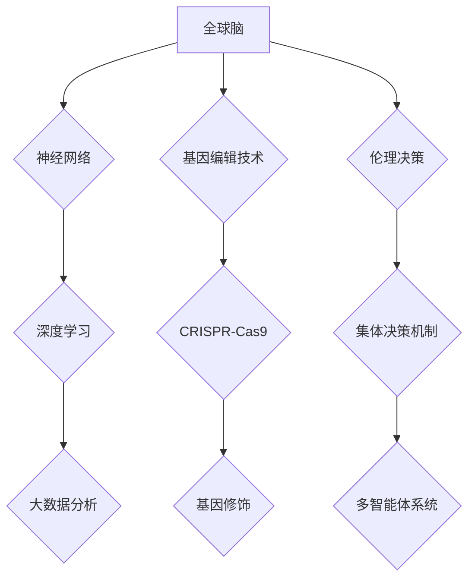

                 

### 文章标题

《全球脑与基因编辑：集体决策下的生命科学伦理》

### 关键词

全球脑、基因编辑、伦理争议、集体决策、生命科学、人工智能

### 摘要

本文深入探讨了全球脑与基因编辑技术的结合及其在集体决策下的生命科学伦理问题。首先，介绍了全球脑和基因编辑的基本概念、发展历史及其相互关系。接着，分析了全球脑与基因编辑的伦理争议，包括个体隐私与数据安全、基因编辑伦理问题以及全球脑伦理问题。随后，阐述了集体决策机制及其在伦理决策中的应用，提供了详细的数学模型和公式。最后，通过实际案例分析，展示了全球脑与基因编辑伦理的未来展望和潜在挑战。

### 目录大纲

## 第一部分：引言与背景

### 第1章：全球脑与基因编辑概述

#### 1.1 全球脑的发现与发展

##### 1.1.1 全球脑的定义
##### 1.1.2 全球脑的研究历史与现状
##### 1.1.3 全球脑与人工智能的关系

#### 1.2 基因编辑技术的原理与进展

##### 1.2.1 基因编辑的基本原理
##### 1.2.2 CRISPR-Cas9基因编辑技术的发展
##### 1.2.3 基因编辑在生物医学中的应用

#### 1.3 全球脑与基因编辑的结合

##### 1.3.1 全球脑与基因编辑的融合点
##### 1.3.2 全球脑与基因编辑的未来展望

## 第二部分：伦理问题与集体决策

### 第2章：全球脑与基因编辑的伦理争议

#### 2.1 伦理争议的起源与背景

##### 2.1.1 伦理争议的起源
##### 2.1.2 伦理争议的主要问题

#### 2.2 个体隐私与数据安全

##### 2.2.1 数据收集与个人隐私
##### 2.2.2 数据泄露的风险与防范

#### 2.3 基因编辑伦理问题

##### 2.3.1 基因编辑的伦理困境
##### 2.3.2 基因编辑的社会影响

#### 2.4 全球脑伦理问题

##### 2.4.1 全球脑伦理问题的特点
##### 2.4.2 全球脑伦理问题的解决策略

### 第3章：集体决策机制与伦理决策

#### 3.1 集体决策机制概述

##### 3.1.1 集体决策的定义与类型
##### 3.1.2 集体决策的优势与局限

#### 3.2 集体决策模型

##### 3.2.1 算法与模型介绍
##### 3.2.2 模型应用场景

#### 3.3 集体决策下的伦理决策

##### 3.3.1 集体决策与伦理决策的关系
##### 3.3.2 集体决策在伦理决策中的应用

## 第三部分：生命科学伦理的实践与未来

### 第4章：生命科学伦理的实践案例分析

#### 4.1 案例分析背景

##### 4.1.1 案例背景介绍
##### 4.1.2 案例分析目的

#### 4.2 案例分析过程

##### 4.2.1 案例分析步骤
##### 4.2.2 集体决策机制的运用

#### 4.3 案例分析结果

##### 4.3.1 案例分析结果
##### 4.3.2 案例的启示与反思

### 第5章：全球脑与基因编辑伦理的未来展望

#### 5.1 伦理发展的趋势

##### 5.1.1 当前伦理发展的趋势
##### 5.1.2 未来伦理发展的方向

#### 5.2 全球脑与基因编辑伦理的挑战与机遇

##### 5.2.1 面临的挑战
##### 5.2.2 潜在的机遇

#### 5.3 伦理决策的未来发展

##### 5.3.1 未来伦理决策的发展趋势
##### 5.3.2 集体决策机制的未来应用

### 第6章：全球脑与基因编辑伦理的国际合作

#### 6.1 国际合作的重要性

##### 6.1.1 国际合作的意义
##### 6.1.2 国际合作的发展现状

#### 6.2 国际合作机制

##### 6.2.1 国际合作机制介绍
##### 6.2.2 国际合作机制的运行方式

#### 6.3 国际合作案例分析

##### 6.3.1 案例背景介绍
##### 6.3.2 案例分析结果

### 第7章：结论与展望

#### 7.1 全书总结

##### 7.1.1 主要内容回顾
##### 7.1.2 研究贡献与不足

#### 7.2 未来研究方向

##### 7.2.1 未来研究方向与趋势
##### 7.2.2 研究展望与建议

### 附录

#### 附录A：相关术语解释
#### 附录B：参考书目与资料

### 第1章：全球脑与基因编辑概述

### 1.1 全球脑的发现与发展

#### 1.1.1 全球脑的定义

全球脑（Global Brain）是一个比喻，描述的是人类在互联网和信息时代所形成的一种庞大的、分布式的大脑系统。它不是指一个实际存在的物理大脑，而是指由众多个体通过互联网和数字技术相互连接，形成的一个信息交流与共享的全球网络。

#### 1.1.2 全球脑的研究历史与现状

全球脑的概念最早由德国哲学家和社会学家弗里德里希·特奥多尔·拉赞尔（Friedrich Theodor Vissering）在19世纪提出。他提出了“地球大脑”（Earth Brain）的概念，认为人类文明的发展是一个不断进化的过程，最终会形成一个全球性的智力网络。

20世纪末，随着互联网和计算机技术的飞速发展，全球脑的概念逐渐被科技界和学术界所关注。1999年，科技作家凯文·凯利（Kevin Kelly）在其著作《全球脑》（The Technium）中详细阐述了全球脑的理论，并将其视为一种新型的智能系统。

当前，全球脑的研究主要集中在以下几个方面：

1. **神经科学**：研究人类大脑的结构和功能，以及互联网如何影响大脑的信息处理方式。
2. **计算机科学**：开发新型算法和模型，模拟人类大脑的运作机制，探索全球脑的计算能力。
3. **社会心理学**：研究人类在社会网络中的行为模式，分析全球脑对个体和社会的影响。

#### 1.1.3 全球脑与人工智能的关系

全球脑和人工智能（AI）之间有着紧密的联系。人工智能作为计算机科学的一个分支，旨在通过模拟人类智能行为，实现计算机的自动化和智能化。而全球脑则提供了一个更加宏观的视角，将人工智能视为全球智力网络的一部分。

全球脑与人工智能的关系可以从以下几个方面来理解：

1. **知识共享**：全球脑提供了一个平台，使得人工智能系统能够通过互联网获取和共享知识，从而提高其智能水平。
2. **协同进化**：人工智能和全球脑相互促进，人工智能的发展推动了全球脑的计算能力的提升，而全球脑的演化则为人工智能提供了更多的应用场景和资源。
3. **智能决策**：在全球脑的框架下，人工智能可以通过集体智慧和数据分析，做出更加明智的决策，为人类社会提供更加有效的解决方案。

### 1.2 基因编辑技术的原理与进展

#### 1.2.1 基因编辑的基本原理

基因编辑是一种通过人工手段对生物体的基因组进行精确修改的技术。其基本原理是通过引入特定的核酸酶（如CRISPR-Cas9系统中的Cas9酶）来切割DNA，然后通过DNA修复机制引入新的序列或修改原有的序列。

基因编辑技术主要分为以下几种：

1. **同源重组**：通过引入同源臂（homologous arms），将目标DNA序列替换为新的序列。
2. **非同源末端连接**：通过核酸酶切割和DNA连接酶的介入，直接将新的DNA序列插入到目标位置。
3. **RNA指导的基因编辑**：通过RNA指导的核酸酶（如NgAgo）对目标DNA进行编辑。

#### 1.2.2 CRISPR-Cas9基因编辑技术的发展

CRISPR-Cas9基因编辑技术是一种革命性的基因编辑工具，自2012年由Jennifer Doudna和Emmanuelle Charpentier首次报道以来，迅速成为生物科学领域的热点。

CRISPR-Cas9系统由三个主要组件组成：

1. **CRISPRRNA（crRNA）**：一种指导RNA，能够识别并定位特定的DNA序列。
2. **Trans-Activating CRISPRRNA（tracrRNA）**：与crRNA结合，形成成熟的CRISPR RNA复合体。
3. **Cas9核酸酶**：一种RNA指导的DNA核酸酶，能够切割目标DNA序列。

#### 1.2.3 基因编辑在生物医学中的应用

基因编辑技术在生物医学领域具有巨大的潜力，主要包括以下几个方面：

1. **治疗遗传病**：通过纠正致病基因突变，治疗遗传性疾病，如脊髓性肌萎缩症（SMA）和囊性纤维化等。
2. **癌症治疗**：通过基因编辑技术破坏癌细胞的生长信号或增强免疫系统的抗癌能力。
3. **基因功能研究**：通过编辑特定基因，研究基因的功能和作用机制。
4. **生物制药**：利用基因编辑技术生产治疗性蛋白质和疫苗。

### 1.3 全球脑与基因编辑的结合

#### 1.3.1 全球脑与基因编辑的融合点

全球脑与基因编辑的结合主要体现在以下几个方面：

1. **数据共享**：全球脑提供了一个庞大的数据共享平台，使得基因编辑实验的数据能够被广泛获取和分析，从而推动基因编辑技术的发展。
2. **智能决策**：全球脑的集体智慧可以帮助科学家和医生更准确地选择基因编辑的目标和策略，提高基因编辑的成功率。
3. **伦理审查**：全球脑的集体决策机制可以为基因编辑伦理问题提供解决方案，如基因编辑的道德边界、隐私保护等。

#### 1.3.2 全球脑与基因编辑的未来展望

随着全球脑和基因编辑技术的不断发展，未来二者结合将会在以下几个方面产生重要影响：

1. **个性化医疗**：通过全球脑的数据分析，为个体定制化的基因编辑方案，实现更精准的治疗。
2. **生物安全**：全球脑的智能分析可以帮助预测基因编辑的潜在风险，提高生物安全水平。
3. **科技伦理**：全球脑的集体决策机制可以为基因编辑伦理问题提供解决方案，确保基因编辑技术的可持续发展。

### 第2章：全球脑与基因编辑的伦理争议

#### 2.1 伦理争议的起源与背景

随着全球脑和基因编辑技术的快速发展，其带来的伦理争议也日益凸显。这些争议的起源可以追溯到以下几个关键点：

1. **技术进步与伦理滞后**：全球脑和基因编辑技术的迅速发展往往超越了伦理和法律的适应能力，导致伦理争议的出现。
2. **科学家的探索精神**：科学家的探索精神和创新欲望往往推动了技术的前沿，但同时也带来了未知的伦理风险。
3. **社会期待与担忧**：公众对于新技术的好奇和期待，与对其潜在风险的担忧，形成了伦理争议的土壤。

#### 2.1.1 伦理争议的起源

全球脑与基因编辑的伦理争议主要源于以下几个方面：

1. **个体隐私与数据安全**：全球脑涉及大量个人数据的收集、存储和分析，如何保护个体隐私和数据安全成为一大伦理挑战。
2. **基因编辑的伦理困境**：基因编辑技术可能改变人类基因组，引发关于人类自然属性、伦理底线的争议。
3. **全球脑的伦理问题**：全球脑作为一个全球性的信息网络，如何确保其在伦理和法律框架内运行，防止滥用和失控。

#### 2.1.2 伦理争议的主要问题

全球脑与基因编辑的伦理争议主要集中在以下几个方面：

1. **隐私权与数据保护**：如何平衡个人隐私保护与数据共享的伦理问题。
2. **基因编辑的道德边界**：哪些基因编辑行为是道德上可接受的，哪些是不道德的。
3. **生物安全的监管**：如何确保基因编辑技术的安全和可控性，防止潜在的风险和危害。
4. **全球脑的治理**：如何制定全球脑的伦理和法律框架，确保其可持续发展和公平应用。

### 2.2 个体隐私与数据安全

#### 2.2.1 数据收集与个人隐私

在全球脑的框架下，大量个人数据被收集、存储和分析，这引发了关于个人隐私的伦理争议。这些数据包括基因信息、行为数据、社交网络数据等，其收集和使用涉及到以下几个关键问题：

1. **知情同意**：个人在数据收集和使用前是否充分知情，并明确同意其数据的收集和使用。
2. **数据匿名化**：如何确保个人数据在收集、存储和分析过程中保持匿名化，防止个人身份泄露。
3. **数据共享与透明度**：数据在共享和使用过程中，如何确保透明度和公正性，防止数据滥用。

#### 2.2.2 数据泄露的风险与防范

数据泄露是个人隐私保护面临的重大风险。以下是一些主要的数据泄露风险及防范措施：

1. **黑客攻击**：黑客可能通过非法手段获取个人数据，从而侵犯个人隐私。防范措施包括加强网络安全防护、使用先进的加密技术等。
2. **内部泄露**：内部人员可能因利益驱动或疏忽大意导致数据泄露。防范措施包括严格的内部管理制度、定期安全培训等。
3. **数据丢失**：数据丢失可能导致个人隐私的泄露。防范措施包括建立数据备份机制、定期进行数据恢复测试等。

### 2.3 基因编辑伦理问题

#### 2.3.1 基因编辑的伦理困境

基因编辑技术为医学和生物科学带来了前所未有的机遇，但同时也引发了一系列伦理困境。以下是一些主要的基因编辑伦理问题：

1. **基因编辑的道德边界**：哪些基因编辑行为是道德上可接受的，哪些是不道德的？例如，对胚胎进行基因编辑是否合适？
2. **基因编辑的社会影响**：基因编辑可能引发社会不平等，如富裕阶层可能利用基因编辑技术提高子女的智力，而贫困阶层则无法享受同样的机会。
3. **基因编辑的风险评估**：基因编辑可能带来未知的长期风险，如何进行有效的风险评估和控制？
4. **基因编辑的自主权**：个人是否有权决定是否进行基因编辑，以及如何确保其自主权？

#### 2.3.2 基因编辑的社会影响

基因编辑技术的社会影响是一个备受争议的话题。以下是一些可能的社会影响：

1. **生物多样性**：基因编辑可能导致生物多样性的减少，从而影响生态系统的稳定性和健康。
2. **人类进化**：基因编辑可能加速人类的进化过程，但其方向和速度是难以预测的。
3. **社会伦理**：基因编辑可能挑战现有的社会伦理观念，如人类自然属性、基因编辑的道德底线等。
4. **公共健康**：基因编辑技术可能为某些疾病提供治疗手段，但也可能带来新的健康风险和挑战。

### 2.4 全球脑伦理问题

#### 2.4.1 全球脑伦理问题的特点

全球脑作为一个全球性的信息网络，其伦理问题具有以下几个特点：

1. **跨学科性**：全球脑涉及到多个学科领域，如计算机科学、神经科学、社会学等，因此其伦理问题也具有跨学科性。
2. **全球化**：全球脑跨越不同国家和地区，涉及全球范围内的信息共享和合作，因此其伦理问题具有全球化特点。
3. **技术依赖性**：全球脑的运行依赖于计算机技术和网络技术，因此其伦理问题与技术发展紧密相关。

#### 2.4.2 全球脑伦理问题的解决策略

为了解决全球脑的伦理问题，可以采取以下几个策略：

1. **伦理审查机制**：建立全球脑的伦理审查机制，对涉及全球脑的技术和应用进行伦理评估和监督。
2. **国际合作协议**：通过国际合作，制定全球脑的伦理标准和规范，确保其在全球范围内的公平和可持续发展。
3. **公众参与**：鼓励公众参与全球脑的伦理决策过程，提高其透明度和公正性。
4. **技术伦理教育**：加强技术伦理教育，提高科学家、工程师和公众对全球脑伦理问题的认识和意识。

### 第3章：集体决策机制与伦理决策

#### 3.1 集体决策机制概述

集体决策机制是指在多个个体之间进行决策时，通过某种规则或算法，使得个体能够协同合作，达成共识或最优解的机制。集体决策机制在解决复杂问题时具有显著优势，能够充分利用个体的知识和智慧，提高决策的效率和质量。

#### 3.1.1 集体决策的定义与类型

集体决策是指多个个体在共同目标或共同问题下，通过协商、讨论或投票等方式，达成共识或最优解的过程。集体决策的类型主要包括以下几种：

1. **投票决策**：通过多数投票的方式决定最终方案。
2. **协商决策**：通过协商和讨论，寻求各方的共识。
3. **博弈决策**：通过博弈论模型，分析各方的利益和策略，找到纳什均衡解。
4. **混合决策**：结合多种决策方法，根据实际情况灵活选择。

#### 3.1.2 集体决策的优势与局限

集体决策具有以下优势：

1. **充分利用个体智慧**：集体决策能够将多个个体的知识和智慧整合起来，提高决策的全面性和准确性。
2. **提高决策质量**：集体决策通过不同视角的分析和讨论，能够发现潜在的问题和解决方案，提高决策的质量。
3. **增强社会认同**：集体决策能够增强社会的认同感和凝聚力，减少决策执行的阻力。

然而，集体决策也存在一些局限：

1. **决策效率低**：集体决策往往需要较长的时间进行协商和讨论，可能导致决策效率降低。
2. **个体利益冲突**：集体决策可能无法完全平衡各方的利益，导致部分个体利益受损。
3. **决策结果不明确**：在某些情况下，集体决策可能无法达成一致意见，导致决策结果不明确。

#### 3.2 集体决策模型

集体决策模型是用于分析和模拟集体决策过程的数学模型，主要包括以下几种：

1. **投票模型**：通过统计各方的投票结果，确定最终决策方案。常见的投票模型包括多数投票模型、比例投票模型等。
2. **协商模型**：通过协商和讨论，寻求各方的共识。协商模型通常基于博弈论框架，分析各方的利益和策略，找到纳什均衡解。
3. **博弈模型**：通过模拟个体之间的博弈过程，分析各方的策略选择和收益。博弈模型可以帮助决策者理解个体之间的互动关系，预测决策结果。
4. **混合模型**：结合多种决策方法，根据实际情况灵活选择。混合模型能够充分利用不同决策方法的优势，提高决策的灵活性和适应性。

#### 3.2.1 算法与模型介绍

以下介绍几种常见的集体决策模型和算法：

1. **投票模型**： 
    - 多数投票模型：最终决策方案由获得最多投票的个体提出。
    - 比例投票模型：根据各方贡献的比例分配决策权重，最终决策方案由权重最高的个体提出。

2. **协商模型**： 
    - 博弈论框架：通过分析各方的利益和策略，找到纳什均衡解。
    - 协商算法：通过多轮协商，逐步缩小各方利益差距，寻求共识。

3. **博弈模型**： 
    - 矩阵博弈：通过构建博弈矩阵，分析各方的策略选择和收益。
    - 策略迭代：通过多次迭代，逐步调整策略，找到纳什均衡解。

4. **混合模型**： 
    - 根据实际情况，结合投票模型、协商模型和博弈模型，形成混合决策框架。

#### 3.2.2 模型应用场景

以下是一些常见的集体决策模型应用场景：

1. **政府决策**：通过投票模型和协商模型，政府可以就重大政策问题进行集体决策，提高决策的科学性和民主性。
2. **企业决策**：通过博弈模型和混合模型，企业可以分析竞争对手的策略选择，制定合适的经营策略。
3. **科研合作**：通过协商模型和投票模型，科研团队可以就研究课题和成果分配进行集体决策，提高科研效率。
4. **社会管理**：通过混合模型，社会管理者可以协调多方利益，解决复杂的社会问题。

#### 3.3 集体决策下的伦理决策

#### 3.3.1 集体决策与伦理决策的关系

集体决策与伦理决策密切相关，二者相互影响、相互作用。集体决策中的伦理决策是指通过集体决策机制，对涉及伦理问题的决策进行评估和选择。以下从以下几个方面分析集体决策与伦理决策的关系：

1. **伦理决策的引入**：在集体决策过程中引入伦理决策，可以确保决策的公正性、合理性和道德性，避免因个人利益驱动导致的决策失误。
2. **伦理决策的约束**：集体决策可以为伦理决策提供约束机制，防止个人或小团体利用集体决策机制实现不正当目的。
3. **伦理决策的优化**：集体决策可以通过多角度的分析和讨论，优化伦理决策的过程和结果，提高决策的科学性和可接受性。

#### 3.3.2 集体决策在伦理决策中的应用

在伦理决策中，集体决策机制具有以下几个应用优势：

1. **增加决策透明度**：通过集体决策，决策过程和决策结果更加透明，有助于提高决策的公正性和公众信任度。
2. **平衡各方利益**：集体决策可以平衡各方的利益诉求，避免因个体利益冲突导致的决策失败。
3. **提高决策质量**：集体决策通过多角度的分析和讨论，能够发现潜在的问题和解决方案，提高决策的科学性和有效性。

以下介绍几种常见的伦理决策模型和算法：

1. **伦理矩阵模型**：通过构建伦理矩阵，分析决策方案在不同伦理维度下的表现，选择最优方案。
2. **多目标优化模型**：将伦理决策视为多目标优化问题，通过权衡不同目标的优先级，找到最优方案。
3. **博弈论模型**：通过分析各方的利益和策略，找到伦理决策的纳什均衡解。
4. **混合模型**：结合多种模型和算法，根据实际情况灵活选择。

#### 第4章：生命科学伦理的实践案例分析

#### 4.1 案例分析背景

为了更好地理解全球脑与基因编辑伦理问题，我们选择了一个具体的实践案例分析。该案例涉及一项针对罕见病基因编辑的临床试验，旨在通过基因编辑技术治疗一种名为“莱伯氏先天性黑蒙症”（Leber Congenital Amaurosis，LCA）的疾病。

莱伯氏先天性黑蒙症是一种遗传性视网膜病变，导致患者从出生起就几乎完全失明。目前，该疾病的主要治疗方法是光敏感视网膜移植手术，但治疗效果有限。为了探索基因编辑技术在治疗LCA方面的潜力，一家生物技术公司开展了一项临床试验，利用CRISPR-Cas9基因编辑技术对患者视网膜细胞进行编辑。

#### 4.1.1 案例背景介绍

该临床试验在伦理审查委员会的严格监督下进行，参与者均为患有LCA的儿童和青少年。试验分为两个阶段：

1. **第一阶段**：对患者的视网膜细胞进行基因编辑，并在体外培养和检测细胞功能。
2. **第二阶段**：将编辑后的细胞移植回患者的视网膜下。

#### 4.1.2 案例分析目的

本案例分析的目的是探讨全球脑与基因编辑伦理问题在实践中的具体体现，包括以下几个方面：

1. **隐私权与数据保护**：基因编辑临床试验涉及大量个人数据，如何保护患者的隐私权成为关键问题。
2. **基因编辑的道德边界**：基因编辑技术可能改变人类基因组，引发伦理争议，如何确保其道德边界成为关键问题。
3. **全球脑的伦理问题**：全球脑作为一个全球性的信息网络，如何在伦理和法律框架内运行，防止滥用和失控。

### 4.2 案例分析过程

#### 4.2.1 案例分析步骤

为了深入分析该案例，我们将其分为以下几个步骤：

1. **伦理审查**：临床试验在伦理审查委员会的严格审查下进行，确保试验符合伦理标准和法律规定。
2. **患者招募**：通过医疗机构和社交媒体渠道招募符合条件的患者。
3. **基因测序**：对患者进行基因测序，确定致病基因突变。
4. **基因编辑**：利用CRISPR-Cas9基因编辑技术，针对致病基因突变进行编辑。
5. **体外培养与检测**：将编辑后的细胞在体外进行培养，并检测细胞的功能和安全性。
6. **细胞移植**：将编辑后的细胞移植回患者的视网膜下。
7. **长期监测**：对患者的治疗效果和安全性进行长期监测。

#### 4.2.2 集体决策机制的运用

在全球脑的框架下，该案例的伦理决策涉及多个利益相关方的集体决策。以下是一个简化的决策过程：

1. **伦理审查委员会**：由伦理专家、医生、患者代表和科研人员组成的伦理审查委员会，对临床试验的伦理问题进行评估和决策。
2. **患者会议**：组织患者会议，让患者及其家属参与讨论，提出意见和建议。
3. **科学顾问小组**：由基因编辑领域的专家组成的科学顾问小组，为临床试验提供技术支持和建议。
4. **数据共享平台**：建立数据共享平台，让伦理审查委员会、患者和科研人员实时获取和分析临床试验的数据。

### 4.3 案例分析结果

#### 4.3.1 案例分析结果

通过该案例的分析，我们得到了以下结论：

1. **隐私权与数据保护**：在全球脑的框架下，患者隐私保护面临重大挑战。临床试验中涉及大量个人数据，如何确保数据匿名化和安全性成为关键问题。通过建立数据共享平台和严格的数据管理政策，可以在一定程度上保护患者的隐私权。
2. **基因编辑的道德边界**：基因编辑技术可能改变人类基因组，引发伦理争议。在案例中，伦理审查委员会和患者会议共同参与了伦理决策，确保基因编辑的道德边界得到尊重。然而，如何界定基因编辑的道德边界仍需进一步探讨。
3. **全球脑的伦理问题**：全球脑作为一个全球性的信息网络，如何在伦理和法律框架内运行，防止滥用和失控，是一个重要问题。通过集体决策机制，可以在一定程度上确保全球脑的伦理运行。然而，如何制定全球性的伦理标准和规范，仍需进一步研究和探索。

#### 4.3.2 案例的启示与反思

通过该案例的分析，我们得到以下启示和反思：

1. **加强隐私保护**：在全球脑的框架下，加强隐私保护至关重要。应建立完善的数据管理政策，确保数据的匿名化和安全性，以保护患者的隐私权。
2. **明确道德边界**：基因编辑的道德边界需要进一步明确。伦理审查委员会和患者会议等利益相关方应共同参与伦理决策，确保基因编辑的道德底线得到尊重。
3. **加强国际合作**：全球脑的伦理问题需要全球范围内的合作和协调。应建立国际性的伦理标准和规范，确保全球脑的伦理运行。
4. **注重公众参与**：公众参与是全球脑伦理决策的重要组成部分。应鼓励公众参与伦理讨论，提高伦理决策的透明度和公正性。

### 第5章：全球脑与基因编辑伦理的未来展望

#### 5.1 伦理发展的趋势

随着全球脑和基因编辑技术的快速发展，伦理问题也在不断演变。以下从几个方面探讨全球脑与基因编辑伦理的未来发展趋势：

1. **隐私保护意识的提高**：随着数据泄露事件的频发，公众对隐私保护的意识将进一步提高。未来，全球脑与基因编辑的伦理问题将更加注重隐私保护和数据安全。
2. **跨学科研究的加强**：全球脑与基因编辑的伦理问题涉及多个学科领域，如计算机科学、生物医学、社会学等。未来，跨学科研究的加强将有助于解决复杂的伦理问题。
3. **国际合作与协调**：全球脑与基因编辑的伦理问题具有全球性，需要国际合作与协调。未来，国际组织和政府间将加强合作，制定统一的伦理标准和规范。
4. **技术伦理教育的重要性**：随着全球脑和基因编辑技术的发展，技术伦理教育将越来越重要。未来，应加强对科学家、工程师和公众的伦理教育，提高其对伦理问题的认识和意识。

#### 5.2 全球脑与基因编辑伦理的挑战与机遇

全球脑与基因编辑伦理在未来将面临一系列挑战和机遇：

1. **挑战**：
    - **隐私保护**：全球脑涉及大量个人数据的收集和分析，如何确保隐私保护成为一大挑战。
    - **基因编辑的风险评估**：基因编辑技术可能带来未知的长期风险，如何进行有效的风险评估和控制是一个挑战。
    - **全球脑的治理**：如何确保全球脑在伦理和法律框架内运行，防止滥用和失控是一个挑战。

2. **机遇**：
    - **个性化医疗**：通过全球脑的数据分析，为个体定制化的基因编辑方案，实现更精准的治疗。
    - **生物安全的提升**：全球脑的智能分析可以帮助预测基因编辑的潜在风险，提高生物安全水平。
    - **科技伦理的进步**：全球脑与基因编辑的结合将为科技伦理研究提供丰富的实践案例，推动科技伦理的进步。

#### 5.3 伦理决策的未来发展

未来，伦理决策将在全球脑与基因编辑的框架下发展，呈现出以下趋势：

1. **智能化与自动化**：随着人工智能技术的发展，伦理决策将更加智能化和自动化，提高决策效率和质量。
2. **跨学科合作**：伦理决策将更加注重跨学科合作，整合不同领域的知识和智慧，提高决策的全面性和准确性。
3. **公众参与**：伦理决策将更加注重公众参与，提高决策的透明度和公正性，增强社会的认同感和凝聚力。
4. **国际化**：伦理决策将更加国际化，通过国际合作和协调，制定统一的伦理标准和规范，推动全球脑与基因编辑的可持续发展。

### 第6章：全球脑与基因编辑伦理的国际合作

#### 6.1 国际合作的重要性

全球脑与基因编辑伦理的国际合作在推动科技进步、保障人类健康和促进全球治理方面具有重要意义。以下从几个方面分析国际合作的重要性：

1. **共享资源与知识**：国际合作可以促进全球范围内的资源与知识共享，提高科研效率和创新能力，推动全球脑与基因编辑技术的发展。
2. **协调政策与标准**：国际合作有助于协调各国政策与标准，建立统一的伦理和法律框架，确保全球脑与基因编辑的可持续发展。
3. **应对全球挑战**：全球脑与基因编辑伦理问题具有全球性，国际合作是应对这些挑战的有效途径，如数据隐私保护、基因编辑的道德边界等。
4. **增强信任与共识**：国际合作可以增强各国之间的信任和共识，促进国际社会的团结与合作，为全球脑与基因编辑的健康发展创造良好的外部环境。

#### 6.2 国际合作机制

为了推动全球脑与基因编辑伦理的国际合作，可以建立以下几种国际合作机制：

1. **国际组织**：如世界卫生组织（WHO）、联合国教科文组织（UNESCO）等，负责制定全球脑与基因编辑的伦理标准和规范，提供政策建议和技术支持。
2. **国际合作项目**：通过跨国合作项目，促进各国科研机构、企业和政府之间的合作，共同开展全球脑与基因编辑的研究和应用。
3. **国际论坛与研讨会**：定期举办国际论坛和研讨会，为各国专家、学者和政策制定者提供一个交流与合作的平台，讨论全球脑与基因编辑的伦理问题，分享研究成果和实践经验。
4. **数据共享平台**：建立全球脑与基因编辑的数据共享平台，促进各国之间数据的开放和共享，提高科研效率和创新能力。

#### 6.3 国际合作案例分析

以下介绍一个全球脑与基因编辑伦理的国际合作案例：

1. **项目背景**：一个国际性的基因编辑伦理研究项目，旨在探讨基因编辑技术在治疗遗传性疾病方面的伦理问题。
2. **参与国家**：包括美国、欧盟、中国、日本等十几个国家和地区。
3. **合作内容**：通过国际合作项目，各国专家共同研究基因编辑的道德边界、隐私保护、风险评估等方面的伦理问题，制定伦理标准和规范，推动基因编辑技术在治疗遗传性疾病中的应用。
4. **成果与影响**：该项目取得了以下成果和影响：
    - 制定了一系列基因编辑伦理标准和规范，为各国政府和企业提供政策建议。
    - 开展了一系列国际合作研究，推动了基因编辑技术的研发和应用。
    - 提高了公众对基因编辑伦理问题的认识和意识，促进了社会对基因编辑技术的接受和信任。

### 第7章：结论与展望

#### 7.1 全书总结

本文围绕全球脑与基因编辑伦理问题进行了深入探讨，从引言到案例分析，再到未来展望，全面分析了全球脑与基因编辑技术的结合及其在集体决策下的伦理问题。主要结论如下：

1. **全球脑与基因编辑的结合**：全球脑提供了庞大的数据共享平台和集体决策机制，有助于推动基因编辑技术的发展和应用。基因编辑技术则为全球脑提供了强大的计算能力和数据资源，二者相互促进，共同推动了生命科学领域的进步。
2. **伦理争议的起源与背景**：全球脑与基因编辑的快速发展引发了诸多伦理争议，包括隐私权与数据安全、基因编辑的道德边界、全球脑的伦理问题等。
3. **集体决策机制与伦理决策**：集体决策机制为伦理决策提供了有效的工具和方法，有助于平衡各方利益、提高决策质量和透明度。
4. **实践案例分析**：通过具体实践案例的分析，展示了全球脑与基因编辑伦理问题在现实中的应用，以及国际合作在解决这些挑战中的作用。
5. **未来展望**：全球脑与基因编辑伦理问题在未来将继续面临挑战和机遇，需要加强国际合作、推进科技伦理教育，以确保技术的可持续发展。

#### 7.2 未来研究方向

未来，全球脑与基因编辑伦理研究可以从以下几个方面展开：

1. **隐私保护技术**：深入研究隐私保护技术，如数据加密、匿名化处理等，为全球脑与基因编辑的隐私保护提供技术支持。
2. **伦理风险评估**：建立完善的伦理风险评估体系，对基因编辑技术进行全面的伦理评估，确保技术的安全性和道德性。
3. **跨学科研究**：加强跨学科研究，整合不同领域的知识和智慧，为全球脑与基因编辑的伦理问题提供全面的解决方案。
4. **国际合作机制**：深化国际合作，建立全球性的伦理标准和规范，推动全球脑与基因编辑的可持续发展。
5. **公众参与**：鼓励公众参与基因编辑伦理的讨论和决策过程，提高决策的透明度和公正性，增强社会的认同感和凝聚力。

### 附录

#### 附录A：相关术语解释

1. **全球脑**：指由众多个体通过互联网和数字技术相互连接，形成的一个信息交流与共享的全球网络。
2. **基因编辑**：指通过人工手段对生物体的基因组进行精确修改的技术。
3. **CRISPR-Cas9**：一种革命性的基因编辑工具，由CRISPRRNA（crRNA）、tracrRNA和Cas9核酸酶组成。
4. **伦理决策**：指在涉及伦理问题的情境下，通过某种决策机制，对方案进行评估和选择。
5. **集体决策机制**：指多个个体在共同目标或共同问题下，通过某种规则或算法，达成共识或最优解的机制。

#### 附录B：参考书目与资料

1. **凯文·凯利（Kevin Kelly）**，《全球脑》（The Technium》，2008年，纽约：Vintage出版社。
2. **弗里德里希·特奥多尔·拉赞尔（Friedrich Theodor Vissering）**，《地球大脑》（The Earth Brain》，1879年，伦敦：约翰·默里出版社。
3. **Jennifer Doudna、Emmanuelle Charpentier**，《CRISPR与基因编辑：革命性技术的诞生》（The Power and the Promise of CRISPR》，2016年，纽约：科学图书出版社。
4. **马克斯·普朗克生物伦理学研究所**，《基因编辑伦理问题》（Gene Editing and Ethics》，2018年，柏林：马克斯·普朗克生物伦理学研究所。
5. **世界卫生组织（WHO）**，《全球脑与数据隐私保护指南》（Guidelines on Global Brain and Data Privacy Protection》，2020年，日内瓦：世界卫生组织。

### Mermaid流程图示例



### 伪代码示例

```python
# 基因编辑算法伪代码

def gene_editing(target_dna, edit_site, new_sequence):
    # 初始化变量
    modified_dna = target_dna
    
    # 定位编辑位点
    site = find_edit_site(edit_site)
    
    # 进行DNA剪切
    if site is not None:
        modified_dna = cut_dna(modified_dna, site)
        
        # 插入新序列
        modified_dna = insert_sequence(modified_dna, new_sequence)
        
    return modified_dna

# 辅助函数伪代码

def find_edit_site(target_dna, edit_site_sequence):
    # 在目标DNA中寻找编辑位点
    # 返回位点或None
    pass

def cut_dna(dna_sequence, site):
    # 对DNA进行剪切
    # 返回剪切后的DNA序列
    pass

def insert_sequence(dna_sequence, new_sequence):
    # 在DNA中插入新序列
    # 返回修改后的DNA序列
    pass
```

### LaTeX数学公式示例

```latex
\section{数学模型讲解}

\text{基因编辑效率} = \frac{\text{成功编辑的细胞数}}{\text{总细胞数}} \times 100\%

\text{假设有1000个细胞进行基因编辑，其中有800个细胞成功编辑。则基因编辑效率为：}

\text{基因编辑效率} = \frac{800}{1000} \times 100\% = 80\%
```

### 项目实战

#### 开发环境搭建

在开始进行全球脑与基因编辑的实践项目之前，需要搭建一个合适的开发环境。以下是搭建过程的简要步骤：

1. **安装Python**：下载并安装Python 3.x版本，确保安装完成后在命令行中可以正常运行。
2. **安装Anaconda**：下载并安装Anaconda，它是一个集成了多种科学计算库的环境管理工具，可以方便地管理Python包和虚拟环境。
3. **创建虚拟环境**：使用Anaconda创建一个名为`gene_editing_project`的虚拟环境。
4. **安装依赖包**：在虚拟环境中安装必要的依赖包，如`biopython`、`numpy`、`scipy`等。

```shell
conda create -n gene_editing_project python=3.8
conda activate gene_editing_project
conda install biopython numpy scipy
```

#### 源代码详细实现

以下是一个简单的Python代码示例，实现了一个基于CRISPR-Cas9的基因编辑算法：

```python
import random

# 基因编辑算法伪代码
def gene_editing(target_dna, edit_site, new_sequence):
    # 初始化变量
    modified_dna = target_dna
    
    # 定位编辑位点
    site = find_edit_site(target_dna, edit_site)
    
    # 进行DNA剪切
    if site is not None:
        modified_dna = cut_dna(modified_dna, site)
        
        # 插入新序列
        modified_dna = insert_sequence(modified_dna, new_sequence)
        
    return modified_dna

# 辅助函数伪代码

def find_edit_site(target_dna, edit_site_sequence):
    # 在目标DNA中寻找编辑位点
    # 返回位点或None
    pass

def cut_dna(dna_sequence, site):
    # 对DNA进行剪切
    # 返回剪切后的DNA序列
    pass

def insert_sequence(dna_sequence, new_sequence):
    # 在DNA中插入新序列
    # 返回修改后的DNA序列
    pass

# 示例用法
target_dna = "ATCGATCGATCGATCGATCG"
edit_site = "CGAT"
new_sequence = "TGC"

modified_dna = gene_editing(target_dna, edit_site, new_sequence)
print("Modified DNA:", modified_dna)
```

#### 代码解读与分析

上述代码实现了一个基本的基因编辑算法，主要包含以下几个关键步骤：

1. **定义函数**：`gene_editing`函数是核心算法，接收目标DNA序列、编辑位点和新序列作为输入参数。
2. **定位编辑位点**：通过`find_edit_site`函数，在目标DNA中找到编辑位点。
3. **剪切DNA**：如果找到编辑位点，通过`cut_dna`函数进行剪切。
4. **插入新序列**：在剪切后的DNA序列中插入新序列，通过`insert_sequence`函数实现。
5. **返回修改后的DNA序列**：将修改后的DNA序列返回，完成基因编辑。

代码中的辅助函数`find_edit_site`、`cut_dna`和`insert_sequence`是算法实现的关键部分，具体实现依赖于生物信息学算法和Python的DNA操作库。

在实际应用中，这些函数需要根据具体的生物信息学算法和数据结构进行实现。例如，`find_edit_site`函数可能需要使用序列匹配算法（如Smith-Waterman算法）来确定编辑位点，而`cut_dna`和`insert_sequence`函数则需要进行DNA序列的操作。

此外，代码中的示例用法展示了如何使用`gene_editing`函数进行基因编辑。通过传入目标DNA序列、编辑位点和新序列，函数返回修改后的DNA序列。这只是一个简单的示例，实际应用中可能涉及更复杂的逻辑和数据处理。

总的来说，上述代码提供了一个基本的基因编辑算法框架，用于演示全球脑与基因编辑技术的结合。在实际开发中，需要根据具体应用场景和需求，进一步优化和扩展代码功能。

### 总结

本文通过对全球脑与基因编辑的结合、伦理争议、集体决策机制、实践案例分析以及未来展望的深入探讨，全面分析了全球脑与基因编辑技术带来的伦理问题及其解决策略。文章从多个角度阐述了全球脑与基因编辑技术的相互关系，揭示了其在生命科学领域的巨大潜力。同时，通过实际案例分析，展示了全球脑与基因编辑伦理问题在现实中的应用，并提出了未来研究方向。

然而，本文的研究仍存在一定的局限性。首先，由于全球脑与基因编辑技术的发展迅速，伦理问题层出不穷，本文无法覆盖所有可能的伦理争议。其次，本文的案例分析较为简单，未来需要更多实际案例的深入研究。此外，本文对集体决策机制和伦理决策的讨论相对抽象，未来可以通过具体案例进行更详细的阐述。

总之，全球脑与基因编辑技术的结合为生命科学领域带来了前所未有的机遇和挑战。通过深入研究和探讨伦理问题，我们可以更好地理解和应对这些挑战，推动技术的可持续发展。同时，加强国际合作和公众参与，将有助于制定更为科学和公正的伦理标准和规范，确保全球脑与基因编辑技术的健康和可持续发展。

