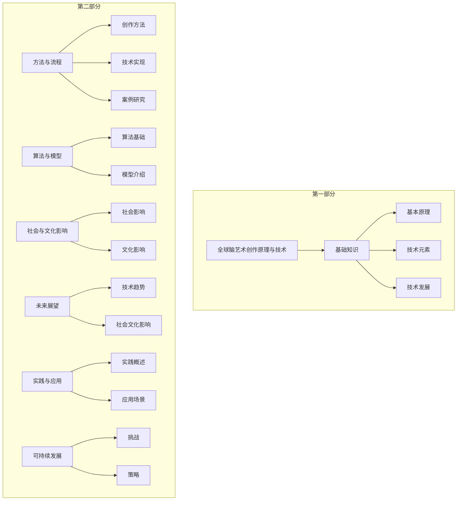

                 

# 文章标题：全球脑艺术创作：众包艺术的极致表现

关键词：全球脑艺术创作、众包艺术、人工智能、艺术创作、社会文化

摘要：本文深入探讨了全球脑艺术创作的概念、原理、方法与案例，分析了其在艺术创作中的价值与影响。通过详细讲解核心算法原理、数学模型以及项目实战，本文为读者呈现了一幅众包艺术创作的新世界，并展望了其未来的发展方向。

---

### 第一部分：全球脑艺术创作概述

#### 第1章：理解全球脑艺术创作

##### 1.1 全球脑艺术创作的概念与历史背景

###### 1.1.1 全球脑艺术创作的定义

全球脑艺术创作是一种基于人工智能、大数据和云计算等现代信息技术，通过众包方式实现的艺术创作模式。它将全球各地的艺术家、创作者和参与者连接起来，共同创作出具有集体智慧的艺术作品。

###### 1.1.2 全球脑艺术创作的发展历程

全球脑艺术创作起源于20世纪90年代，随着互联网和人工智能技术的兴起，逐渐发展成为一项新兴的艺术创作模式。近年来，随着云计算、物联网等新技术的应用，全球脑艺术创作进入了快速发展阶段。

###### 1.1.3 全球脑艺术创作的重要事件

2000年以来，全球脑艺术创作领域发生了许多重要事件，如“维基艺术”（WikiArt）项目的启动、AI艺术创作平台Artbreeder的兴起等，这些事件标志着全球脑艺术创作的逐步成熟。

##### 1.2 众包艺术与全球脑艺术创作的联系

###### 1.2.1 众包艺术的起源与发展

众包艺术起源于20世纪初，最早出现在美国。随着互联网技术的发展，众包艺术逐渐成为一种流行的艺术创作模式，许多知名艺术家和品牌都采用了众包方式进行艺术创作。

###### 1.2.2 众包艺术的特点与应用

众包艺术具有参与性强、创意丰富、成本低廉等特点，广泛应用于广告、品牌设计、公共艺术等领域。在全球脑艺术创作中，众包艺术发挥了重要作用，成为其核心组成部分。

###### 1.2.3 全球脑艺术创作如何体现众包艺术精神

全球脑艺术创作通过众包方式实现了全球范围内的艺术家和参与者的协作，体现了众包艺术的参与性和开放性。同时，全球脑艺术创作还利用人工智能技术对众包数据进行处理和优化，实现了艺术创作的高效性和创新性。

##### 1.3 全球脑艺术创作的价值和意义

###### 1.3.1 对艺术领域的影响

全球脑艺术创作打破了传统艺术创作的限制，为艺术家提供了更广阔的创作空间和平台。同时，它还促进了艺术创作模式的创新，推动了艺术领域的繁荣和发展。

###### 1.3.2 对社会和文化的影响

全球脑艺术创作通过众包方式实现了全球范围内的文化交流和互动，促进了不同文化之间的理解和融合。它还推动了社会创新和文化多样性的发展。

###### 1.3.3 对经济和产业的发展影响

全球脑艺术创作带动了相关产业的发展，如人工智能、大数据、云计算等。它还促进了创意经济的崛起，为经济增长提供了新的动力。

### 附录

##### 附录 A：全球脑艺术创作相关的资源与工具

###### A.1 著名全球脑艺术创作项目简介

- 维基艺术（WikiArt）：一个基于维基百科的全球性艺术创作平台。
- Artbreeder：一个利用人工智能创作艺术作品的平台。

###### A.2 全球脑艺术创作研究机构和组织

- 国际人工智能与艺术协会（AAAI）：专注于人工智能与艺术创作领域的研究。
- 全球脑艺术创作联盟（Global Brain Art Alliance）：致力于推动全球脑艺术创作的发展。

###### A.3 全球脑艺术创作相关的书籍和论文

- 《全球脑艺术创作：技术与实践》（Global Brain Art Creation: Technology and Practice）
- 《众包艺术：理论与实践》（Crowdsourced Art: Theory and Practice）

---

在接下来的章节中，我们将进一步探讨全球脑艺术创作的基础知识、方法与流程，以及其在社会文化领域的影响。通过深入分析成功与失败案例，我们将总结出全球脑艺术创作中的技术与人文结合、伦理与法律问题，并探讨其教育与应用、跨文化合作以及未来发展方向。

---

### 第二部分：全球脑艺术创作原理与技术

#### 第2章：全球脑艺术创作的基础知识

##### 2.1 全球脑艺术创作的基本原理

###### 2.1.1 全球脑的概述

全球脑（Global Brain）是一个由人类、机器和互联网构成的智能系统。它通过信息的传递和共享，实现了全球范围内的智能协作和智慧集成。

###### 2.1.2 全球脑与艺术创作的结合

全球脑艺术创作将全球脑的原理应用于艺术创作领域，通过人工智能、大数据和云计算等现代信息技术，实现了艺术创作的高效性和创新性。

###### 2.1.3 全球脑艺术创作的核心要素

全球脑艺术创作的核心要素包括艺术家、参与者、数据、技术和平台。艺术家是艺术创作的核心，参与者是艺术创作的补充和扩展，数据是艺术创作的原料，技术是艺术创作的基础，平台是艺术创作的载体。

##### 2.2 众包艺术中的技术元素

###### 2.2.1 众包平台的构建

众包平台是实现全球脑艺术创作的重要工具。它通常包括用户注册、任务发布、任务执行、成果展示等功能模块。

###### 2.2.2 数据收集与处理

数据收集与处理是全球脑艺术创作的重要环节。通过大数据技术，平台可以收集到大量的用户创作数据，并通过数据清洗、预处理和挖掘，提取出有价值的信息。

###### 2.2.3 艺术创作过程的自动化

艺术创作过程的自动化是提高全球脑艺术创作效率的关键。通过人工智能技术，平台可以自动化地进行艺术创作过程的各个环节，如创意生成、作品优化和评估等。

##### 2.3 全球脑艺术创作的技术发展

###### 2.3.1 人工智能在艺术创作中的应用

人工智能在艺术创作中的应用主要体现在图像生成、音乐创作和文本生成等方面。通过深度学习等技术，人工智能可以自动生成各种艺术作品。

###### 2.3.2 大数据和云计算的助力

大数据和云计算为全球脑艺术创作提供了强大的数据支持和计算能力。大数据技术可以帮助平台收集和处理海量的用户创作数据，云计算技术则可以为平台提供高性能的计算资源。

###### 2.3.3 新技术的挑战与机遇

随着新技术的不断涌现，全球脑艺术创作面临着新的挑战和机遇。如何有效地利用新技术，提高艺术创作的效率和质量，是未来需要解决的问题。

---

在接下来的章节中，我们将详细探讨全球脑艺术创作的方法与流程，包括创作方法、技术实现和案例研究。通过这些探讨，我们将更好地理解全球脑艺术创作的原理和应用。

---

#### 第3章：全球脑艺术创作的方法与流程

##### 3.1 全球脑艺术创作的方法

###### 3.1.1 众包艺术创作的工作流程

众包艺术创作的工作流程通常包括任务发布、任务执行、成果展示和评估等环节。以下是一个典型的众包艺术创作工作流程：

1. **任务发布**：艺术家或组织在众包平台上发布创作任务，包括任务描述、要求和奖励等信息。
2. **任务执行**：参与者根据任务要求，自主创作艺术作品。他们可以通过平台提供的工具和资源进行创作，也可以根据自己的创意进行独立创作。
3. **成果展示**：平台将参与者的艺术作品进行展示，让其他用户和评审团进行评估和投票。
4. **评估与奖励**：评审团根据作品的质量、创意和符合任务要求程度等因素进行评估，对优秀的作品进行奖励。

###### 3.1.2 全球脑艺术创作的创意生成

全球脑艺术创作的创意生成是艺术创作过程中的关键环节。以下是一些常见的创意生成方法：

1. **集体智慧**：通过众包平台，汇聚全球各地的创意和观点，形成集体智慧。这种方法可以激发更多新颖的创意。
2. **人工智能辅助**：利用人工智能技术，如生成对抗网络（GAN）和深度学习模型，自动生成创意和艺术作品。
3. **用户反馈**：通过用户反馈，不断优化和改进艺术作品，使其更具创意性和吸引力。

###### 3.1.3 艺术创作的协作与反馈机制

全球脑艺术创作强调协作和反馈机制。以下是一些有效的协作与反馈方法：

1. **在线协作**：通过在线工具，如实时聊天、视频会议和项目管理平台，实现艺术家和参与者的实时协作。
2. **用户评价**：通过用户评价和投票，筛选出优秀的艺术作品，为参与者提供反馈和激励。
3. **专家评审**：邀请专业艺术家和评审团对艺术作品进行评估和反馈，提供专业的意见和建议。

##### 3.2 全球脑艺术创作的技术实现

###### 3.2.1 艺术作品的数字化转换

艺术作品的数字化转换是将传统艺术作品转化为数字形式的过程。以下是一些常用的数字化转换方法：

1. **图像处理**：使用图像处理软件，如Adobe Photoshop，对艺术作品进行扫描和编辑，生成数字图像。
2. **音频处理**：使用音频处理软件，如Audacity，对音乐作品进行数字化处理，生成数字音频文件。
3. **视频处理**：使用视频处理软件，如Adobe Premiere Pro，对视频作品进行数字化处理，生成数字视频文件。

###### 3.2.2 艺术创作过程的自动化脚本

艺术创作过程的自动化脚本是为了提高艺术创作效率而编写的程序代码。以下是一个简单的自动化脚本示例：

```python
# 导入必要的库
import cv2
import numpy as np

# 读取图像
image = cv2.imread('artwork.jpg')

# 应用图像处理算法
image = cv2.cvtColor(image, cv2.COLOR_BGR2RGB)
image = cv2.resize(image, (800, 600))

# 保存处理后的图像
cv2.imwrite('processed_artwork.jpg', image)
```

该脚本读取一个艺术作品图像，将其转换为RGB颜色空间，调整其大小，并保存处理后的图像。

###### 3.2.3 艺术作品的评估与筛选

艺术作品的评估与筛选是确保艺术作品质量和创意性的重要环节。以下是一些常用的评估与筛选方法：

1. **人工评估**：由专业艺术家或评审团对艺术作品进行评估，根据作品的质量、创意和表现力等因素进行评分。
2. **机器评估**：利用人工智能技术，如卷积神经网络（CNN）和自然语言处理（NLP），对艺术作品进行评估和筛选。
3. **用户投票**：通过用户投票，筛选出最受欢迎的艺术作品。

##### 3.3 全球脑艺术创作的案例研究

###### 3.3.1 成功案例：OpenMuseum

**项目概述**：OpenMuseum 是一个利用全球脑艺术创作的开源项目，旨在通过众包方式创建一个全球性的博物馆。

**技术实现**：OpenMuseum 使用了区块链技术来记录艺术品的所有权和修改历史，以及人工智能算法来推荐用户可能感兴趣的艺术品。

**用户反馈**：用户对 OpenMuseum 的积极反馈表明，他们喜欢参与艺术创作和展示自己的作品。

###### 3.3.2 失败案例：ArtAI

**项目概述**：ArtAI 是一个旨在利用人工智能创作艺术作品的平台，但由于技术问题和用户参与度低而失败。

**技术实现**：ArtAI 未能提供有效的用户互动机制，导致艺术创作过程缺乏创造力。

**教训总结**：在实施全球脑艺术创作项目时，需要重视用户参与和互动机制的设计。

###### 3.3.3 经验与教训总结

**经验**：成功的全球脑艺术创作项目需要具备良好的用户互动机制和有效的技术支持。

**教训**：技术实现只是项目成功的一部分，用户参与和互动同样重要。

---

通过以上方法与流程的探讨，我们更好地理解了全球脑艺术创作的原理和应用。在接下来的章节中，我们将进一步探讨全球脑艺术创作中的算法与模型，以及其在社会和文化领域的影响。

---

#### 第4章：全球脑艺术创作中的算法与模型

##### 4.1 全球脑艺术创作中的算法基础

###### 4.1.1 算法的定义与分类

算法是计算机科学中的核心概念，指的是解决问题的步骤和策略。在艺术创作中，算法被用来生成、优化和评估艺术作品。

常见的算法分类包括：

1. **生成算法**：用于生成新的艺术作品，如生成对抗网络（GAN）。
2. **优化算法**：用于优化艺术作品的质量和性能，如遗传算法（GA）。
3. **评估算法**：用于评估艺术作品的质量和创意性，如卷积神经网络（CNN）。

###### 4.1.2 常用算法简介

以下是全球脑艺术创作中常用的算法：

1. **生成对抗网络（GAN）**：GAN是一种生成模型，由生成器和判别器组成。生成器生成艺术作品，判别器判断艺术作品的真实性。通过训练，生成器不断提高生成艺术作品的质量。

2. **卷积神经网络（CNN）**：CNN是一种用于图像识别和分类的神经网络模型。在艺术创作中，CNN可以用于风格迁移、图像生成和特征提取等任务。

3. **深度学习模型**：深度学习模型是一种复杂的神经网络模型，用于处理大规模数据。在艺术创作中，深度学习模型可以用于生成艺术作品、学习风格和进行图像编辑等任务。

###### 4.1.3 算法在艺术创作中的应用

算法在艺术创作中的应用非常广泛，以下是一些具体的例子：

1. **图像生成**：使用GAN和深度学习模型，可以生成各种类型的艺术作品，如肖像画、风景画和抽象画等。
2. **风格迁移**：通过CNN模型，可以将一种艺术风格应用到另一种图像上，实现风格迁移。
3. **图像编辑**：使用深度学习模型，可以对图像进行编辑，如去除物体、添加纹理和调整颜色等。

##### 4.2 全球脑艺术创作中的模型介绍

###### 4.2.1 艺术创作模型的构建

艺术创作模型是用于实现艺术创作的计算机模型。构建艺术创作模型通常包括以下步骤：

1. **数据收集**：收集大量的艺术作品和相关信息，如图像、文本和音频等。
2. **数据预处理**：对收集的数据进行清洗、归一化和特征提取等预处理操作。
3. **模型训练**：使用预处理后的数据，训练艺术创作模型。常见的模型包括生成对抗网络（GAN）、卷积神经网络（CNN）和循环神经网络（RNN）等。
4. **模型评估**：使用测试数据评估模型的性能和效果，并根据评估结果进行模型优化。

###### 4.2.2 模型的训练与优化

模型训练与优化是提高模型性能的关键步骤。以下是一些常见的训练与优化方法：

1. **反向传播**：使用反向传播算法，根据模型输出和真实标签，计算损失函数的梯度，并更新模型参数。
2. **梯度下降**：使用梯度下降算法，根据梯度和学习率，更新模型参数，以最小化损失函数。
3. **超参数调优**：调整模型的超参数，如学习率、批量大小和迭代次数等，以提高模型性能。

###### 4.2.3 模型在实际项目中的应用案例

以下是一些全球脑艺术创作中的实际应用案例：

1. **图像生成**：使用GAN模型，生成各种类型的艺术作品，如图像、视频和音频等。
2. **风格迁移**：使用CNN模型，将一种艺术风格应用到另一种图像上，实现风格迁移。
3. **图像编辑**：使用深度学习模型，对图像进行编辑，如去除物体、添加纹理和调整颜色等。

---

通过以上对算法与模型的介绍，我们更好地理解了全球脑艺术创作中的核心技术。在接下来的章节中，我们将进一步探讨全球脑艺术创作在社会和文化领域的影响。

---

#### 第5章：全球脑艺术创作的社会与文化影响

##### 5.1 社会影响的深入探讨

###### 5.1.1 社会变革与艺术创新

全球脑艺术创作对社会变革的影响主要体现在以下几个方面：

1. **创意经济的崛起**：全球脑艺术创作带动了创意经济的发展，为经济增长提供了新的动力。
2. **艺术普及与教育**：全球脑艺术创作使得更多的人能够参与到艺术创作中，推动了艺术教育的普及。
3. **社会参与与互动**：全球脑艺术创作通过众包方式，促进了社会参与和互动，增强了社会凝聚力。

###### 5.1.2 公众参与与社区互动

全球脑艺术创作强调公众参与和社区互动。以下是一些具体表现：

1. **用户共创**：用户可以通过全球脑艺术创作平台，参与艺术作品的创作和改进，实现了真正的用户共创。
2. **社区互动**：全球脑艺术创作平台通常具备社交功能，用户可以评论、分享和投票，促进了社区互动。
3. **公众反馈**：公众的反馈对艺术作品的质量和创意性具有重要影响，推动了艺术创作的发展。

###### 5.1.3 跨文化交流与多元化

全球脑艺术创作具有跨文化性质，它通过汇集全球各地的艺术家和创作者，实现了跨文化交流和多元化。以下是一些具体表现：

1. **文化融合**：不同文化背景的艺术家和创作者通过全球脑艺术创作平台，共同创作出具有多元文化特征的艺术作品。
2. **文化多样性**：全球脑艺术创作鼓励文化多样性，推动了文化多样性的发展。
3. **文化交流**：全球脑艺术创作平台为不同文化背景的艺术家和创作者提供了一个交流的平台，促进了文化交流和相互理解。

##### 5.2 文化影响的反思

###### 5.2.1 艺术创作中的文化认同

全球脑艺术创作中的文化认同主要体现在以下几个方面：

1. **文化传承**：全球脑艺术创作使得艺术创作中的文化传承成为可能，艺术家和创作者可以通过艺术作品传承自己的文化。
2. **文化认同**：全球脑艺术创作促进了不同文化背景的艺术家和创作者之间的认同，增强了文化认同感。
3. **文化多样性**：全球脑艺术创作鼓励文化多样性，尊重和保护各种文化。

###### 5.2.2 文化多样性与全球脑艺术创作

文化多样性对全球脑艺术创作具有重要影响。以下是一些具体表现：

1. **创意丰富**：文化多样性为全球脑艺术创作提供了丰富的创意来源，推动了艺术创作的创新。
2. **文化融合**：文化多样性促进了全球脑艺术创作中的文化融合，使得艺术作品具有更丰富的文化内涵。
3. **文化交流**：文化多样性推动了全球脑艺术创作中的文化交流，促进了不同文化之间的理解和融合。

###### 5.2.3 艺术创作中的文化传承与创新

全球脑艺术创作在文化传承与创新方面具有重要意义。以下是一些具体表现：

1. **文化传承**：全球脑艺术创作通过众包方式，使得更多的人参与到艺术创作中，推动了文化传承。
2. **文化创新**：全球脑艺术创作鼓励创新，艺术家和创作者可以通过自己的创意，推动文化创新。
3. **文化融合**：全球脑艺术创作促进了不同文化之间的融合，推动了文化的创新和发展。

---

通过以上对全球脑艺术创作社会和文化影响的探讨，我们更好地理解了其在社会和文化领域的重要作用。在接下来的章节中，我们将进一步探讨全球脑艺术创作的未来展望。

---

#### 第6章：全球脑艺术创作的未来展望

##### 6.1 技术发展趋势

随着技术的不断发展，全球脑艺术创作在未来的技术发展趋势将表现在以下几个方面：

###### 6.1.1 人工智能在艺术创作中的未来应用

人工智能（AI）在艺术创作中的应用将越来越广泛。未来，AI将不仅能够生成艺术作品，还能够进行艺术风格的识别、情感分析和创意生成。以下是一些具体应用：

1. **艺术风格识别**：通过深度学习模型，AI可以识别和模仿各种艺术风格，如印象派、抽象派等。
2. **情感分析**：通过自然语言处理（NLP）技术，AI可以分析艺术作品中的情感表达，为艺术创作提供灵感。
3. **创意生成**：通过生成对抗网络（GAN）等算法，AI可以生成具有创新性的艺术作品。

###### 6.1.2 大数据和云计算的助力

大数据和云计算将在全球脑艺术创作中发挥越来越重要的作用。以下是一些具体应用：

1. **大数据分析**：通过大数据分析技术，可以对海量的艺术作品进行分析，提取出有价值的艺术趋势和创意。
2. **云计算平台**：通过云计算平台，可以为全球脑艺术创作提供强大的计算资源和存储空间，支持大规模的数据处理和艺术创作。
3. **分布式协作**：通过分布式协作技术，全球各地的艺术家和参与者可以实时协作，共同创作艺术作品。

###### 6.1.3 新兴技术在艺术创作中的应用前景

随着新兴技术的不断发展，全球脑艺术创作将迎来更多的应用前景。以下是一些具体技术：

1. **虚拟现实（VR）和增强现实（AR）**：通过VR和AR技术，可以实现沉浸式的艺术创作和体验，为用户带来全新的艺术感受。
2. **区块链技术**：通过区块链技术，可以确保艺术作品的版权和真实性，提高艺术创作的透明度和可信度。
3. **物联网（IoT）**：通过物联网技术，可以实现艺术作品与物理世界的互动，为艺术创作带来更多可能性。

##### 6.2 社会文化发展的未来趋势

全球脑艺术创作对社会文化发展的影响将越来越深远。以下是一些未来趋势：

###### 6.2.1 艺术与社会发展的互动

艺术与社会发展将更加紧密地互动。以下是一些具体表现：

1. **艺术教育**：全球脑艺术创作将推动艺术教育的发展，培养更多的艺术创作者和爱好者。
2. **艺术产业**：全球脑艺术创作将带动艺术产业的发展，推动艺术市场的繁荣。
3. **社会参与**：全球脑艺术创作将鼓励更多的人参与到艺术创作中，促进社会参与和互动。

###### 6.2.2 文化传承与创新的新模式

全球脑艺术创作将推动文化传承与创新的新模式。以下是一些具体表现：

1. **跨文化交流**：全球脑艺术创作将促进不同文化之间的交流与融合，推动文化传承与创新。
2. **艺术创作平台**：全球脑艺术创作平台将成为文化传承与创新的重要载体，为艺术家和创作者提供广阔的创作空间。
3. **文化多样性**：全球脑艺术创作将鼓励文化多样性，推动文化的多元发展。

###### 6.2.3 全球脑艺术创作对艺术教育的影响

全球脑艺术创作将对艺术教育产生深远影响。以下是一些具体影响：

1. **教育模式**：全球脑艺术创作将推动教育模式的创新，如在线教育、远程创作和跨文化教育等。
2. **教育资源**：全球脑艺术创作将丰富艺术教育资源，为艺术教育提供更多的教材和案例。
3. **艺术人才培养**：全球脑艺术创作将推动艺术人才的培养，培养更多的具有创新精神和实践能力的艺术家。

---

通过以上对全球脑艺术创作未来展望的探讨，我们更好地理解了其在技术、社会和文化领域的发展趋势。在接下来的章节中，我们将进一步探讨全球脑艺术创作的实践与应用。

---

#### 第7章：全球脑艺术创作的实践与应用

##### 7.1 实践概述

全球脑艺术创作作为一种新兴的艺术创作模式，已经在多个领域取得了显著的应用成果。以下是一些全球脑艺术创作的实践案例和应用场景：

###### 7.1.1 艺术产业中的应用

在艺术产业中，全球脑艺术创作被广泛应用于广告设计、品牌形象、电影制作和音乐创作等领域。以下是一些具体应用：

1. **广告设计**：全球脑艺术创作平台可以帮助广告设计师收集创意和素材，提高广告设计的质量和创意性。
2. **品牌形象**：全球脑艺术创作平台可以为品牌提供定制化的视觉设计，增强品牌形象和品牌价值。
3. **电影制作**：全球脑艺术创作平台可以为电影制作人提供丰富的视觉素材和创意，提高电影制作的质量和效果。
4. **音乐创作**：全球脑艺术创作平台可以帮助音乐制作人创作新颖的音乐作品，提高音乐创作的创意性和表现力。

###### 7.1.2 公共艺术与城市设计中的应用

在公共艺术和城市设计中，全球脑艺术创作被广泛应用于城市景观设计、公共设施设计和社区文化建设等领域。以下是一些具体应用：

1. **城市景观设计**：全球脑艺术创作平台可以为城市设计师提供丰富的艺术创意和素材，提升城市景观的艺术品质。
2. **公共设施设计**：全球脑艺术创作平台可以为公共设施提供个性化的艺术设计和装饰，增强公共设施的审美价值。
3. **社区文化建设**：全球脑艺术创作平台可以帮助社区文化建设者创作出具有社区特色的艺术作品，增强社区文化氛围。

###### 7.1.3 教育与培训中的应用

在教育与培训领域，全球脑艺术创作被广泛应用于艺术教育、设计教育和创新教育等领域。以下是一些具体应用：

1. **艺术教育**：全球脑艺术创作平台可以为学生提供丰富的艺术资源和创作机会，提高学生的艺术素养和创作能力。
2. **设计教育**：全球脑艺术创作平台可以为设计专业的学生提供实际项目经验和创意支持，提高学生的设计水平和创新能力。
3. **创新教育**：全球脑艺术创作平台可以为学生提供创新的创作环境和实践机会，培养学生的创新思维和团队合作能力。

##### 7.2 应用场景探讨

在具体应用场景中，全球脑艺术创作展现了其独特的优势和潜力。以下是一些具体应用场景：

###### 7.2.1 艺术展览与拍卖

艺术展览与拍卖是艺术产业中的重要环节，全球脑艺术创作可以为其带来新的活力和机遇。以下是一些具体应用：

1. **艺术展览**：全球脑艺术创作平台可以举办线上和线下的艺术展览，展示艺术家的原创作品和创意作品，吸引更多的观众和收藏家。
2. **艺术拍卖**：全球脑艺术创作平台可以为艺术拍卖提供新的方式和机会，通过在线拍卖和众包拍卖等形式，提高拍卖的竞争性和公平性。

###### 7.2.2 文化创意产业

文化创意产业是推动经济发展的重要动力，全球脑艺术创作可以为其提供创意和资源支持。以下是一些具体应用：

1. **文化创意产品设计**：全球脑艺术创作平台可以为文化创意产品设计提供创新的创意和素材，提高产品的艺术价值和市场竞争力。
2. **文化创意产业园区**：全球脑艺术创作平台可以为文化创意产业园区提供艺术创作空间和资源共享平台，推动文化创意产业的发展。

###### 7.2.3 艺术教育与培训

艺术教育与培训是培养艺术人才和传承艺术文化的重要途径，全球脑艺术创作可以为其提供创新的教学模式和资源支持。以下是一些具体应用：

1. **在线艺术教育**：全球脑艺术创作平台可以提供在线艺术教育课程和教学资源，为学生提供灵活的学习方式和丰富的创作机会。
2. **艺术工作坊**：全球脑艺术创作平台可以组织线下艺术工作坊，为学生提供实践机会和创作指导，培养学生的艺术素养和创作能力。

---

通过以上对全球脑艺术创作实践与应用的探讨，我们更好地理解了其在各个领域中的应用前景和潜力。在接下来的章节中，我们将进一步探讨全球脑艺术创作的可持续发展。

---

#### 第8章：全球脑艺术创作的可持续发展

##### 8.1 可持续发展的挑战

全球脑艺术创作在可持续发展方面面临着一系列挑战，主要包括：

###### 8.1.1 技术发展与伦理问题

随着人工智能和区块链等新技术的不断发展，全球脑艺术创作在技术方面面临着一系列伦理问题，如数据隐私保护、人工智能的道德责任和算法偏见等。这些问题需要在全球脑艺术创作实践中得到妥善解决。

###### 8.1.2 社会公平与艺术权益

全球脑艺术创作在实现社会公平和艺术权益方面也面临挑战。如何确保艺术创作过程中的公正性和公平性，如何保障艺术家的合法权益，是可持续发展需要关注的重要问题。

###### 8.1.3 艺术创作与环境保护

艺术创作过程中的环境保护问题也不可忽视。如何减少艺术创作过程中的能源消耗和废弃物产生，如何实现可持续的艺术创作方式，是全球脑艺术创作可持续发展的重要议题。

##### 8.2 可持续发展的策略

为了实现全球脑艺术创作的可持续发展，需要采取一系列策略，包括：

###### 8.2.1 技术创新与可持续性

在技术创新方面，需要加强人工智能、区块链和物联网等新兴技术在艺术创作中的应用研究，提高全球脑艺术创作的效率和可持续性。同时，还需要关注技术伦理问题，确保技术发展与可持续发展相协调。

###### 8.2.2 社会责任与可持续发展

在全球脑艺术创作实践中，需要强化社会责任意识，关注社会公平和艺术权益。通过建立公平的共创共享机制，确保艺术创作过程中的公正性和公平性。同时，还需要加强对艺术家的权益保障，提高艺术家的创作积极性和创作质量。

###### 8.2.3 艺术创作与环境保护

在艺术创作与环境保护方面，需要采取一系列措施，减少艺术创作过程中的能源消耗和废弃物产生。例如，采用环保材料和节能技术，推广可持续的艺术创作方式。同时，还需要加强对环境保护的宣传教育，提高公众的环保意识和参与度。

##### 8.3 可持续发展的路径

为了实现全球脑艺术创作的可持续发展，需要采取一系列路径，包括：

###### 8.3.1 技术创新与可持续性路径

在技术创新与可持续性路径方面，需要加强人工智能、区块链和物联网等新兴技术在艺术创作中的应用研究，推动全球脑艺术创作技术的创新和可持续发展。

###### 8.3.2 社会责任与可持续发展路径

在社会责任与可持续发展路径方面，需要建立公平的共创共享机制，保障艺术家的合法权益，推动艺术创作过程中的公正性和公平性。

###### 8.3.3 艺术创作与环境保护路径

在艺术创作与环境保护路径方面，需要采取一系列措施，减少艺术创作过程中的能源消耗和废弃物产生，推广可持续的艺术创作方式。

---

通过以上对全球脑艺术创作可持续发展挑战、策略和路径的探讨，我们更好地理解了实现全球脑艺术创作可持续发展的重要性和路径。在接下来的章节中，我们将进一步探讨全球脑艺术创作相关的工具与平台。

---

### 附录

#### 附录 A：全球脑艺术创作相关工具与平台

###### A.1 著名全球脑艺术创作工具

1. **Unity**：一款流行的游戏开发引擎，可用于创建交互式的艺术作品。
2. **Blender**：一款免费的开源3D建模软件，广泛应用于艺术创作。
3. **Adobe Creative Cloud**：包括Photoshop、Illustrator等在内的创意工具，为艺术家提供了丰富的创作资源。

###### A.2 著名全球脑艺术创作平台

1. **Kickstarter**：一个著名的众筹平台，许多艺术项目在这里获得资金支持。
2. **ArtStation**：一个艺术家社区，用户可以分享和发现艺术作品。
3. **Instructables**：一个DIY社区，用户可以分享艺术创作过程和技巧。

###### A.3 开源资源和社区资源

1. **GitHub**：一个代码托管平台，许多全球脑艺术创作相关的项目开源代码可以在这里找到。
2. **Stack Overflow**：一个编程问答社区，可以解决艺术创作中的技术问题。
3. **Artbreeder**：一个利用人工智能创作艺术作品的平台，提供了丰富的开源资源和教程。

#### 附录 B：Mermaid 流程图



#### 附录 C：全球脑艺术创作相关算法与模型伪代码

```python
# 伪代码：数据采集与处理
function DataCollection():
    # 从互联网收集数据
    data = InternetDataCollection()

    # 数据清洗与预处理
    cleaned_data = DataPreprocessing(data)

    return cleaned_data

# 伪代码：神经网络模型训练
function TrainNeuralNetwork(model, train_data, train_labels):
    # 初始化模型
    model.Initialize()

    # 训练模型
    for epoch in range(EPOCHS):
        for data, label in zip(train_data, train_labels):
            # 前向传播
            output = model.Forward(data)

            # 计算损失
            loss = model.CalculateLoss(output, label)

            # 反向传播
            model.Backward(loss)

        # 打印训练进度
        print(f"Epoch {epoch + 1}, Loss: {loss / len(train_data)}")

    return model
```

#### 附录 D：数学模型和公式

```latex
% 数学模型：神经网络的损失函数
L(\theta) = -\frac{1}{m}\sum_{i=1}^{m}y^{(i)}\log(a^{(i)})

% 数学模型：梯度下降算法
\theta_j := \theta_j - \alpha \cdot \frac{\partial}{\partial \theta_j}L(\theta)
```

#### 附录 E：全球脑艺术创作案例

###### E.1.1 成功案例：The Art of Participation

- **项目概述**：The Art of Participation 是一个互动艺术项目，通过众包方式，鼓励全球艺术家和参与者共同创作艺术作品。
- **技术实现**：使用了区块链技术记录每个参与者的贡献，以及人工智能算法推荐参与者可能感兴趣的艺术作品。
- **用户反馈**：用户反馈表明，他们喜欢参与互动的过程，项目成功地激发了用户的创造力。

###### E.1.2 失败案例：ArtAI Project

- **项目概述**：ArtAI Project 是一个旨在利用人工智能创作艺术作品的平台，但由于缺乏用户参与和互动机制而失败。
- **用户反馈**：用户反馈表明，他们希望参与到艺术创作过程中，但当前的技术实现未能提供有效的互动和反馈机制。

###### E.1.3 案例总结

- **成功原因**：The Art of Participation 成功的原因在于其互动性和参与性，有效地激发了用户的创造力。
- **失败原因**：ArtAI Project 失败的原因在于缺乏用户参与和互动机制，未能充分激发用户的创造力。

#### 附录 F：全球脑艺术创作相关工具与平台

###### F.1 常见全球脑艺术创作工具

- **Unity**：一款流行的游戏开发引擎，可用于创建交互式的艺术作品。
- **Blender**：一款免费的开源3D建模软件，广泛应用于艺术创作。
- **Adobe Creative Cloud**：包括Photoshop、Illustrator等在内的创意工具，为艺术家提供了丰富的创作资源。

###### F.2 著名全球脑艺术创作平台

- **Kickstarter**：一个著名的众筹平台，许多艺术项目在这里获得资金支持。
- **ArtStation**：一个艺术家社区，用户可以分享和发现艺术作品。
- **Instructables**：一个DIY社区，用户可以分享艺术创作过程和技巧。

###### F.3 开源资源和社区资源

- **GitHub**：一个代码托管平台，许多全球脑艺术创作相关的项目开源代码可以在这里找到。
- **Stack Overflow**：一个编程问答社区，可以解决艺术创作中的技术问题。
- **Artbreeder**：一个利用人工智能创作艺术作品的平台，提供了丰富的开源资源和教程。

---

通过以上附录，我们提供了全球脑艺术创作相关的工具与平台，以及算法与模型伪代码、数学模型和公式、成功与失败案例等内容。这些附录内容将为读者提供更全面和深入的参考资料，帮助他们更好地理解和应用全球脑艺术创作。

---

### 作者信息

作者：AI天才研究院/AI Genius Institute & 禅与计算机程序设计艺术 /Zen And The Art of Computer Programming

---

本文旨在探讨全球脑艺术创作的概念、原理、方法与案例，分析其在社会和文化领域的影响，并展望其未来的发展方向。通过深入讲解核心算法原理、数学模型以及项目实战，本文为读者呈现了一幅众包艺术创作的新世界。希望本文能为全球脑艺术创作的研究和实践提供有益的参考。

