                 

### 文章标题：内容电商创业：内容变现的新思路

在数字化时代的浪潮中，内容电商作为一种新兴的商业模式，正在迅速崛起。通过将优质内容与商品销售相结合，内容电商不仅为消费者提供了丰富、个性化的购物体验，也为企业开辟了新的盈利渠道。本文将深入探讨内容电商的概念、商业模式、运营策略、技术支持及其面临的挑战和未来发展机遇，为创业者和从业者的决策提供有力参考。

关键词：内容电商、商业模式、运营策略、技术支持、挑战与机遇

**摘要：**
本文旨在全面解析内容电商这一新兴商业模式，首先介绍其定义和发展趋势，随后探讨其多样化的商业模式和盈利模式。接着，分析内容电商的运营策略和技术支持，重点讨论其面临的挑战与应对策略。通过成功案例的分享，提供实战经验和启示。最后，展望内容电商的未来发展趋势，探讨新机遇和新挑战。希望本文能为内容电商创业提供新的思路和方向。

### 第一部分：内容电商概述

#### 第1章：内容电商的基本概念与发展趋势

##### 1.1 内容电商的定义与核心要素

内容电商，是指通过创造、分享和分发高质量内容，结合电商销售，实现内容变现的一种新型商业模式。其核心要素包括以下几个方面：

1. **优质内容：** 高质量的内容是内容电商的基础，它能够吸引并留住用户，提升用户粘性。
2. **电商交易：** 通过电子商务平台进行商品交易，是内容电商实现盈利的关键环节。
3. **用户互动：** 用户与内容创作者、平台之间的互动，能够增强用户参与感和忠诚度。
4. **数据分析：** 通过数据分析，了解用户需求和偏好，优化内容创作和推广策略。

**Mermaid 流程图：**

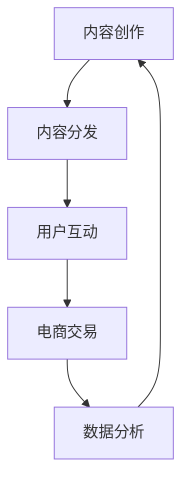

##### 1.1.1 内容电商的概念

内容电商可以理解为“内容 + 电商”的结合体。其本质是将内容创作与电商销售融为一体，通过高质量的内容吸引和留住用户，再通过电商交易实现商业变现。与传统电商不同，内容电商更注重用户体验和内容质量，其核心在于通过内容吸引流量，进而转化为销售额。

**Mermaid 流程图：**

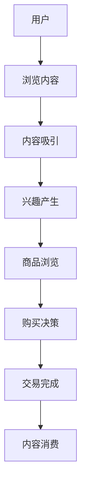

##### 1.1.2 内容电商的核心要素

1. **优质内容：** 内容电商的核心竞争力在于内容的质量。高质量的内容能够吸引更多的用户，提升用户粘性。
2. **电商交易：** 内容电商必须依托电商平台，实现商品的展示、交易和支付等功能。
3. **用户互动：** 通过用户互动，增强用户参与感和忠诚度，提高用户留存率。
4. **数据分析：** 数据分析可以帮助内容电商更好地了解用户需求，优化内容创作和推广策略。

**Mermaid 流程图：**

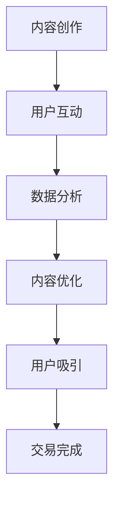

##### 1.1.3 内容电商与传统电商的区别

传统电商主要依赖广告投放、搜索引擎优化等手段获取流量，再通过流量转化为销售额。而内容电商则更注重内容创作和用户互动，通过高质量的内容吸引和留住用户，再通过用户互动转化为销售额。

1. **盈利模式：** 传统电商的盈利模式主要依靠商品销售，而内容电商的盈利模式则更加多样化，包括广告收入、交易佣金、IP授权等。
2. **用户获取：** 传统电商主要依赖广告投放和搜索引擎优化，而内容电商则更依赖于优质内容和用户互动。
3. **用户留存：** 内容电商通过高质量的内容和用户互动，提升用户留存率，而传统电商则主要通过优惠活动、会员制度等手段留住用户。

**Mermaid 流.Flow.图：**

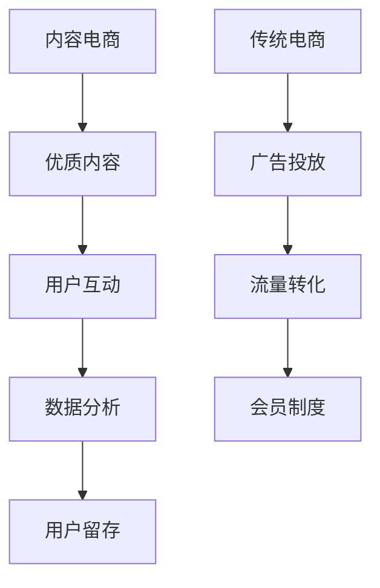

##### 1.2 内容电商的发展历程与趋势

内容电商的发展可以追溯到20世纪末，当时主要以博客和论坛等形式存在。随着互联网技术的发展和移动互联网的普及，内容电商逐渐成为一种新兴的商业模式。目前，内容电商已经呈现出以下几个发展趋势：

1. **多元化内容形式：** 除传统的文字、图片外，视频、直播、短视频等多元化的内容形式逐渐成为主流。
2. **社交化电商：** 内容电商与社交媒体的结合越来越紧密，通过社交分享、互动评论等方式，提升用户参与度和粘性。
3. **个性化推荐：** 通过大数据和人工智能技术，实现个性化推荐，提升用户体验和销售额。

**Mermaid 流程图：**

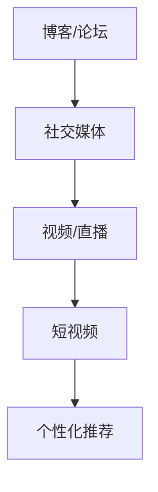

##### 1.2.1 内容电商的发展历程

1. **起步阶段（2000-2010年）：** 以博客、论坛为主要形式，以个人创作者为主导。
2. **快速发展阶段（2010-2015年）：** 随着移动互联网的普及，内容电商逐渐成为一种新兴的商业模式。
3. **成熟阶段（2015年至今）：** 内容电商市场规模不断扩大，商业模式不断创新，成为电商领域的重要组成部分。

**Mermaid 流程图：**

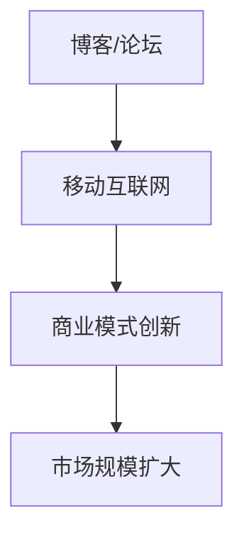

##### 1.2.2 内容电商的当前趋势

1. **多元化内容形式：** 视频内容、直播、短视频等形式成为主流，用户需求更加多样。
2. **社交化电商：** 内容电商与社交媒体的结合越来越紧密，通过社交分享、互动评论等方式，提升用户参与度和粘性。
3. **个性化推荐：** 通过大数据和人工智能技术，实现个性化推荐，提升用户体验和销售额。

**Mermaid 流程图：**

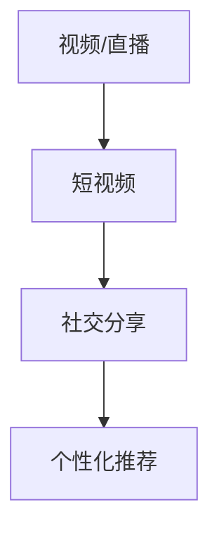

##### 1.2.3 内容电商的未来展望

未来，内容电商将继续保持快速发展态势，预计在以下几个领域取得突破：

1. **技术创新：** 人工智能、大数据等技术的进一步应用，将提升内容电商的运营效率和用户体验。
2. **垂直领域深耕：** 内容电商将在垂直领域实现精细化运营，满足用户多元化的需求。
3. **全球化扩张：** 内容电商将突破地域限制，实现全球化布局。

**Mermaid 流程图：**

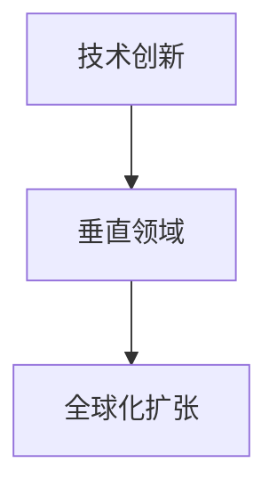

##### 1.3 内容电商的商业价值

内容电商作为一种新兴商业模式，其商业价值主要体现在以下几个方面：

1. **提升销售额：** 通过高质量的内容，吸引更多用户，提高转化率和销售额。
2. **降低营销成本：** 通过内容传播，减少广告投放成本，提高营销效果。
3. **增强用户粘性：** 通过用户互动，提升用户满意度和忠诚度，降低用户流失率。

**Mermaid 流程图：**

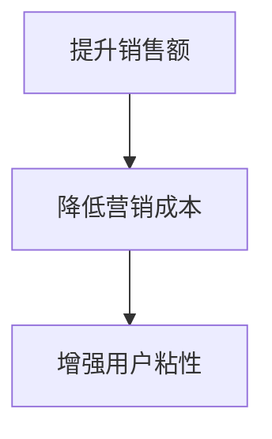

##### 1.3.1 内容电商对消费者的价值

1. **个性化购物体验：** 内容电商通过个性化推荐，为消费者提供更加符合其需求和兴趣的商品。
2. **丰富内容消费：** 内容电商不仅提供商品，还提供丰富多样的内容消费体验，提升用户满意度。
3. **降低购物成本：** 通过内容电商的优惠活动和会员制度，降低购物成本，提高消费者福利。

**Mermaid 流程图：**

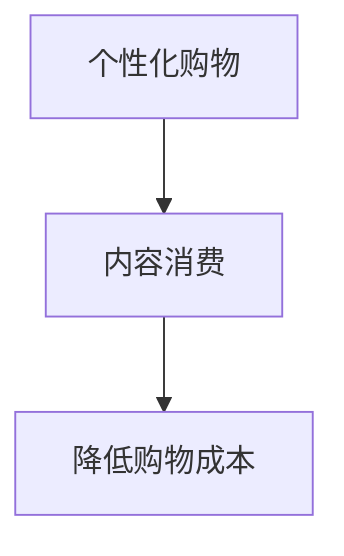

##### 1.3.2 内容电商对企业的价值

1. **拓宽销售渠道：** 内容电商为企业提供了新的销售渠道，增加销售额。
2. **提升品牌知名度：** 通过高质量的内容传播，提升品牌知名度和美誉度。
3. **降低营销成本：** 通过内容电商的传播机制，降低营销成本，提高营销效率。

**Mermaid 流程图：**

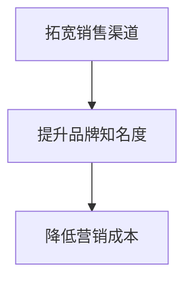

##### 1.3.3 内容电商对社会的影响

内容电商作为一种新兴商业模式，对社会产生了深远的影响：

1. **促进就业：** 内容电商带动了大量的就业机会，包括内容创作者、运营人员、技术人员等。
2. **丰富文化生活：** 内容电商为人们提供了丰富多样的文化消费体验，提升了人们的生活质量。
3. **创新商业模式：** 内容电商的兴起，推动了商业模式的创新，为经济发展注入了新的活力。

**Mermaid 流程图：**

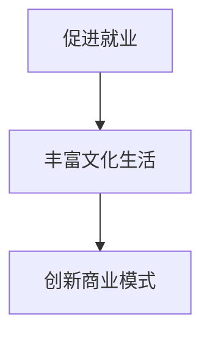

### 第二部分：内容电商的商业模式

#### 第2章：内容电商的商业模式与盈利模式

##### 2.1 内容电商的商业模式

内容电商的商业模式多种多样，主要包括以下几种类型：

1. **KOL电商：** 通过与知名意见领袖（Key Opinion Leader，KOL）合作，利用其影响力和粉丝基础，推广商品并实现销售。
2. **生活方式电商：** 以生活方式为主题，通过分享生活技巧、时尚潮流等内容，结合商品销售，为用户提供一站式购物体验。
3. **娱乐互动电商：** 通过直播、短视频等形式，吸引用户互动，增加用户粘性，再通过商品销售实现盈利。
4. **知识分享电商：** 以知识分享为主题，提供专业的知识内容，如课程、书籍等，再通过销售相关商品实现盈利。

**Mermaid 流程图：**

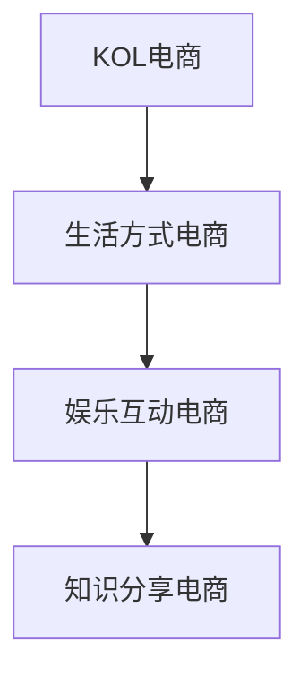

##### 2.1.1 KOL电商

KOL电商是内容电商的一种重要形式，通过合作知名意见领袖，利用其影响力和粉丝基础，推广商品并实现销售。其核心要素包括：

1. **KOL资源：** 获取具有较高影响力和粉丝基础的意见领袖资源。
2. **内容创作：** 与KOL合作，创作符合粉丝兴趣和需求的内容，提升用户参与度。
3. **商品推广：** 将商品嵌入到内容中，通过KOL的推荐，引导用户购买。

**Mermaid 流程图：**

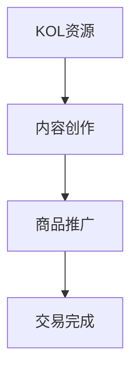

##### 2.1.2 生活方式电商

生活方式电商以生活方式为主题，通过分享生活技巧、时尚潮流等内容，结合商品销售，为用户提供一站式购物体验。其核心要素包括：

1. **内容创作：** 创作符合用户需求和生活风格的内容，提升用户粘性。
2. **商品销售：** 提供多样化、个性化的商品，满足用户的生活需求。
3. **用户互动：** 通过评论、点赞、分享等方式，增强用户互动，提升用户满意度。

**Mermaid 流程图：**

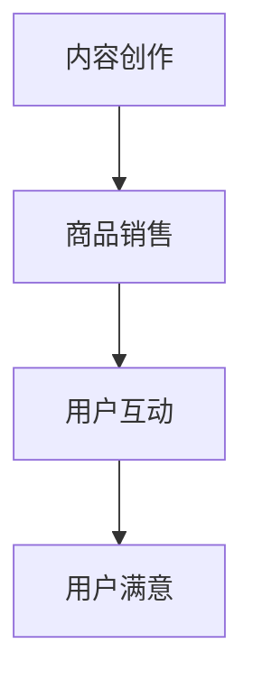

##### 2.1.3 娱乐互动电商

娱乐互动电商通过直播、短视频等形式，吸引用户互动，增加用户粘性，再通过商品销售实现盈利。其核心要素包括：

1. **互动形式：** 提供直播、短视频等形式，增加用户互动体验。
2. **商品展示：** 将商品嵌入到互动内容中，引导用户购买。
3. **用户激励：** 通过奖励、积分等方式，激励用户参与互动。

**Mermaid 流程图：**

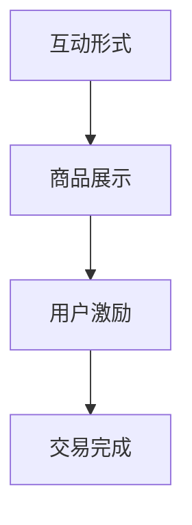

##### 2.1.4 知识分享电商

知识分享电商以知识分享为主题，提供专业的知识内容，如课程、书籍等，再通过销售相关商品实现盈利。其核心要素包括：

1. **内容创作：** 提供专业、有价值的内容，满足用户的学习需求。
2. **商品销售：** 销售与内容相关的商品，如书籍、课程等。
3. **用户互动：** 通过问答、讨论等方式，增强用户互动，提升用户满意度。

**Mermaid 流程图：**


##### 2.2 内容电商的盈利模式

内容电商的盈利模式多种多样，主要包括以下几种方式：

1. **广告收入：** 通过广告投放，获取广告费用。
2. **交易佣金：** 从每笔交易中抽取一定比例的佣金。
3. **IP授权：** 将自身品牌、内容授权给其他企业或个人，获取授权费用。
4. **会员订阅：** 提供会员服务，收取会员费。

**Mermaid 流程图：**

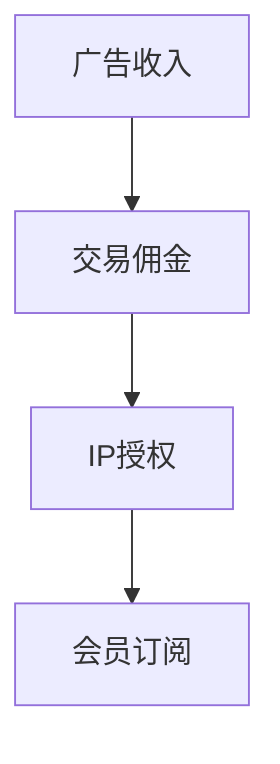

##### 2.2.1 广告收入

广告收入是内容电商的重要盈利模式之一。通过在平台或内容中投放广告，吸引广告主的关注，从而获取广告费用。其核心要素包括：

1. **广告投放：** 根据用户需求和行为，精准投放广告。
2. **广告效果：** 通过数据监测和分析，评估广告效果，优化广告投放策略。
3. **广告收益：** 根据广告投放效果，获取相应的广告收入。

**Mermaid 流程图：**

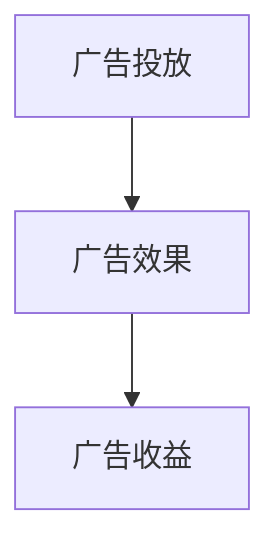

##### 2.2.2 交易佣金

交易佣金是内容电商的另一种重要盈利模式。从每笔交易中抽取一定比例的佣金，获取收益。其核心要素包括：

1. **交易促成：** 通过内容营销，促进用户购买行为。
2. **佣金计算：** 根据交易金额和佣金比例，计算佣金收益。
3. **佣金结算：** 定期与商家结算佣金，确保收益稳定。

**Mermaid 流程图：**

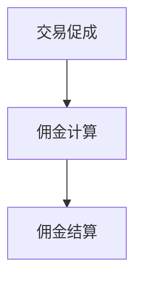

##### 2.2.3 IP授权

IP授权是内容电商的另一种盈利模式。将自身品牌、内容授权给其他企业或个人，获取授权费用。其核心要素包括：

1. **IP打造：** 打造具有较高知名度、影响力的IP。
2. **授权合作：** 与其他企业或个人进行IP授权合作，拓展品牌影响力。
3. **授权收益：** 根据授权协议，获取相应的授权费用。

**Mermaid 流程图：**

```mermaid
graph TD
    A[IP打造] --> B[授权合作]
    B --> C[授权收益]
```

##### 2.2.4 会员订阅

会员订阅是内容电商的一种重要盈利模式。提供会员服务，如专属内容、优惠活动等，收取会员费。其核心要素包括：

1. **会员服务：** 提供丰富的会员服务，提升会员体验。
2. **会员管理：** 建立会员管理系统，管理会员信息和服务。
3. **会员收益：** 通过会员订阅，获取稳定的会员收入。

**Mermaid 流程图：**

```mermaid
graph TD
    A[会员服务] --> B[会员管理]
    B --> C[会员收益]
```

##### 2.3 内容电商的案例分析

在本章节，我们将通过分析几个具有代表性的内容电商案例，探讨其商业模式和盈利模式，为内容电商创业提供借鉴和启示。

**案例一：淘宝直播**

淘宝直播是阿里巴巴集团旗下的内容电商平台，通过直播形式，为用户呈现丰富的商品信息和购物体验。其商业模式和盈利模式如下：

1. **商业模式：** 淘宝直播通过主播与用户互动，吸引用户关注和购买。主播通过展示商品、介绍商品特点，引导用户下单购买。

   **伪代码：**
   ```
   function 直播销售（主播，商品，用户）{
       主播介绍商品特点；
       用户观看直播并提问；
       主播回答用户问题并引导购买；
       用户下单购买；
   }
   ```

2. **盈利模式：** 淘宝直播主要通过交易佣金和广告收入实现盈利。

   **公式：**
   ```
   盈利 = 交易佣金 × 交易量 + 广告收入
   ```

   **举例说明：**
   淘宝直播与主播合作，每笔交易收取5%的佣金。假设某主播一个月的交易量为100万元，则淘宝直播从该主播处获得的佣金为5万元。

3. **成功经验：** 淘宝直播成功的原因在于其精准的市场定位和强大的用户基础。通过直播形式，淘宝直播吸引了大量用户，提升了用户购物体验。

4. **面临挑战：** 淘宝直播面临的主要挑战包括用户流量获取、内容质量监管和主播管理。

   **解决方案：**
   淘宝直播通过优化推荐算法，提升用户观看体验；加强对主播的培训和管理，确保内容质量。

**案例二：小红书**

小红书是一个以生活方式为主题的内容电商平台，通过分享用户生成的内容，吸引大量用户关注和购买。其商业模式和盈利模式如下：

1. **商业模式：** 小红书通过用户生成的内容，打造一个分享、交流和购物的社区。用户可以在平台上发布自己的生活技巧、购物心得等，其他用户通过阅读和评论，产生购买行为。

   **伪代码：**
   ```
   function 小红书销售（用户，内容，商品）{
       用户发布内容；
       其他用户阅读内容；
       其他用户评论内容；
       其他用户根据评论购买商品；
   }
   ```

2. **盈利模式：** 小红书主要通过广告收入、交易佣金和会员订阅实现盈利。

   **公式：**
   ```
   盈利 = 广告收入 + 交易佣金 × 交易量 + 会员订阅收入
   ```

   **举例说明：**
   小红书与广告主合作，投放广告。假设某广告主在小红书投放的广告费用为10万元，则小红书从该广告主处获得的广告收入为10万元。

3. **成功经验：** 小红书成功的原因在于其独特的社区氛围和用户参与度。通过用户生成的内容，小红书吸引了大量用户，形成了稳定的用户基础。

4. **面临挑战：** 小红书面临的主要挑战包括内容质量监管、用户隐私保护和商业化过度。

   **解决方案：**
   小红书通过加强内容审核，确保内容质量；加强用户隐私保护，提升用户体验。

**案例三：抖音电商**

抖音电商是字节跳动旗下的内容电商平台，通过短视频形式，吸引用户关注和购买。其商业模式和盈利模式如下：

1. **商业模式：** 抖音电商通过短视频，为用户呈现丰富的商品信息和购物体验。用户可以在平台上观看短视频，了解商品特点，并通过购物车或链接购买商品。

   **伪代码：**
   ```
   function 抖音销售（用户，短视频，商品）{
       用户观看短视频；
       用户点击购物车或链接；
       用户下单购买；
   }
   ```

2. **盈利模式：** 抖音电商主要通过交易佣金和广告收入实现盈利。

   **公式：**
   ```
   盈利 = 交易佣金 × 交易量 + 广告收入
   ```

   **举例说明：**
   抖音电商与商家合作，每笔交易收取5%的佣金。假设某商家一个月的交易量为100万元，则抖音电商从该商家处获得的佣金为5万元。

3. **成功经验：** 抖音电商成功的原因在于其强大的用户基础和短视频形式的创新。通过短视频，抖音电商吸引了大量用户，提升了用户购物体验。

4. **面临挑战：** 抖音电商面临的主要挑战包括用户流量获取、内容质量和商业化过度。

   **解决方案：**
   抖音电商通过优化推荐算法，提升用户观看体验；加强对内容的审核和管理，确保内容质量。

### 第三部分：内容电商的运营策略

#### 第3章：内容电商的运营策略与营销手段

##### 3.1 内容电商的定位与目标受众

内容电商的运营策略首先需要明确自身的定位和目标受众。通过深入了解目标受众的需求、兴趣和消费习惯，可以更精准地制定运营策略，提升用户体验和满意度。

**3.1.1 内容电商的定位**

1. **市场定位：** 内容电商需要明确自身在市场中的定位，如专注于某一细分领域、提供个性化购物体验等。
2. **内容定位：** 确定平台的内容主题和风格，如生活百科、时尚潮流、专业知识等。
3. **用户定位：** 明确目标用户群体，如年轻女性、专业人士、家庭主妇等。

**Mermaid 流程图：**

```mermaid
graph TD
    A[市场定位] --> B[内容定位]
    B --> C[用户定位]
```

**3.1.2 目标受众分析**

1. **人口统计特征：** 分析目标受众的年龄、性别、地域、职业等人口统计特征。
2. **兴趣偏好：** 了解目标受众的兴趣爱好、消费习惯、价值观等。
3. **需求分析：** 分析目标受众在购物、内容消费等方面的需求和痛点。

**Mermaid 流程图：**

```mermaid
graph TD
    A[人口统计] --> B[兴趣偏好]
    B --> C[需求分析]
```

**3.1.3 用户画像与用户行为分析**

1. **用户画像：** 通过数据分析，构建目标受众的画像，包括人口统计特征、兴趣偏好、消费习惯等。
2. **用户行为分析：** 通过数据监控，了解用户在平台上的行为路径、偏好和转化率等。

**Mermaid 流程图：**

```mermaid
graph TD
    A[用户画像] --> B[用户行为]
    B --> C[行为路径]
    C --> D[偏好分析]
```

##### 3.2 内容电商的内容创作与优化

内容创作是内容电商的核心竞争力。通过高质量的内容，可以吸引更多用户，提升用户粘性和满意度。以下将从内容创作原则、内容优化和社群运营三个方面进行探讨。

**3.2.1 内容创作的原则**

1. **用户需求导向：** 内容创作应始终以用户需求为中心，关注用户关注的热点和痛点。
2. **原创性：** 保证内容的原创性，避免抄袭和复制，提升内容的价值和质量。
3. **多样性：** 丰富内容形式，包括文字、图片、视频、直播等，满足不同用户的需求。
4. **个性化：** 根据用户画像和需求，定制个性化内容，提升用户体验。

**Mermaid 流程图：**

```mermaid
graph TD
    A[用户需求] --> B[原创性]
    B --> C[多样性]
    C --> D[个性化]
```

**3.2.2 内容的优化与传播**

1. **SEO优化：** 通过搜索引擎优化（SEO），提高内容在搜索引擎中的排名，吸引更多用户。
2. **社交媒体推广：** 利用社交媒体平台，进行内容传播，增加曝光度和流量。
3. **用户互动：** 鼓励用户参与内容创作和评论，提升内容互动性和用户粘性。

**Mermaid 流程图：**

```mermaid
graph TD
    A[SEO优化] --> B[社交媒体推广]
    B --> C[用户互动]
```

**3.2.3 社群运营与粉丝互动**

1. **建立社群：** 通过微信、QQ等社交工具，建立粉丝社群，增强用户粘性。
2. **定期活动：** 定期举办线上活动，如抽奖、话题讨论等，提升用户参与度。
3. **用户反馈：** 及时回复用户反馈，解决用户问题，提升用户满意度。

**Mermaid 流程图：**

```mermaid
graph TD
    A[建立社群] --> B[定期活动]
    B --> C[用户反馈]
```

##### 3.3 内容电商的营销手段

内容电商的营销手段多样，包括社交媒体营销、直播营销、KOL营销、数据驱动营销等。以下将分别进行介绍。

**3.3.1 社交媒体营销**

1. **平台选择：** 根据目标受众的特点，选择合适的社交媒体平台，如微博、微信、抖音等。
2. **内容策划：** 制定有吸引力的内容策划，提升用户关注度和互动性。
3. **互动互动：** 通过点赞、评论、转发等互动，提升用户参与度。

**Mermaid 流程图：**

```mermaid
graph TD
    A[平台选择] --> B[内容策划]
    B --> C[互动互动]
```

**3.3.2 直播营销**

1. **直播内容：** 设计有趣、有价值的直播内容，吸引观众观看。
2. **互动环节：** 在直播中设置互动环节，如问答、抽奖等，增加观众参与度。
3. **促销活动：** 利用直播进行促销活动，如限时折扣、赠品等，刺激购买欲望。

**Mermaid 流程图：**

```mermaid
graph TD
    A[直播内容] --> B[互动环节]
    B --> C[促销活动]
```

**3.3.3 KOL营销**

1. **选择KOL：** 根据目标受众和品牌特点，选择合适的KOL进行合作。
2. **内容合作：** 与KOL合作，创作有趣、有价值的内容，提升品牌知名度和美誉度。
3. **粉丝互动：** 利用KOL的粉丝基础，增加品牌曝光度和用户参与度。

**Mermaid 流程图：**

```mermaid
graph TD
    A[选择KOL] --> B[内容合作]
    B --> C[粉丝互动]
```

**3.3.4 数据驱动营销**

1. **数据收集：** 通过网站、APP等渠道，收集用户行为数据。
2. **数据分析：** 利用数据分析工具，对用户行为进行分析，了解用户需求和偏好。
3. **个性化推荐：** 根据用户数据，进行个性化推荐，提升用户满意度和转化率。

**Mermaid 流程图：**

```mermaid
graph TD
    A[数据收集] --> B[数据分析]
    B --> C[个性化推荐]
```

##### 3.4 内容电商的用户体验优化

用户体验是内容电商成功的关键因素。通过优化用户界面、用户体验测试与优化、用户反馈与改进，可以提升用户满意度和忠诚度。

**3.4.1 用户界面设计**

1. **简洁直观：** 设计简洁直观的界面，降低用户操作难度。
2. **符合用户习惯：** 考虑用户的使用习惯，设计符合用户预期的界面布局。
3. **视觉吸引力：** 注重界面视觉设计，提升用户体验。

**Mermaid 流程图：**

```mermaid
graph TD
    A[简洁直观] --> B[符合用户习惯]
    B --> C[视觉吸引力]
```

**3.4.2 用户体验测试与优化**

1. **A/B测试：** 通过A/B测试，比较不同设计方案的用户体验，选择最优方案。
2. **用户反馈：** 通过用户反馈，了解用户对当前界面的评价和需求，进行优化。
3. **持续迭代：** 持续进行用户体验测试和优化，不断提升用户体验。

**Mermaid 流程图：**

```mermaid
graph TD
    A[A/B测试] --> B[用户反馈]
    B --> C[持续迭代]
```

**3.4.3 用户反馈与改进**

1. **反馈渠道：** 设立多种反馈渠道，如在线客服、问卷调查等，方便用户提出问题和建议。
2. **问题解决：** 及时响应用户反馈，解决用户问题，提升用户满意度。
3. **改进措施：** 根据用户反馈，制定改进措施，优化用户体验。

**Mermaid 流程图：**

```mermaid
graph TD
    A[反馈渠道] --> B[问题解决]
    B --> C[改进措施]
```

### 第四部分：内容电商的技术支持

#### 第4章：内容电商的技术支持与平台建设

##### 4.1 内容电商的技术需求

内容电商的成功离不开强大的技术支持，其技术需求包括以下几个方面：

1. **内容创作与编辑技术：** 支持多种内容创作和编辑工具，如文本编辑器、图片处理软件、视频剪辑软件等，以方便内容创作者进行内容创作和编辑。
2. **数据分析与挖掘技术：** 通过大数据和人工智能技术，对用户行为和需求进行分析和挖掘，以实现精准推荐和个性化服务。
3. **搜索引擎优化技术：** 通过SEO技术，提高内容在搜索引擎中的排名，吸引更多用户访问。
4. **人工智能与机器学习技术：** 利用人工智能和机器学习技术，实现自动化内容推荐、用户行为预测等，提升用户体验和转化率。

**Mermaid 流程图：**

```mermaid
graph TD
    A[内容创作与编辑技术] --> B[数据分析与挖掘技术]
    B --> C[搜索引擎优化技术]
    C --> D[人工智能与机器学习技术]
```

##### 4.2 内容电商的技术实现

内容电商的技术实现需要综合考虑以下几个方面：

1. **技术选型与架构设计：** 根据业务需求和规模，选择合适的技术栈和架构设计，确保系统的高性能和高可用性。
2. **内容管理系统的建设：** 构建内容管理系统（CMS），实现内容创建、编辑、发布、管理等功能。
3. **数据仓库与数据挖掘：** 建立数据仓库，存储和分析用户行为数据，为业务决策提供支持。
4. **人工智能应用开发：** 开发人工智能应用，如推荐系统、智能客服等，提升用户体验和运营效率。

**Mermaid 流程图：**

```mermaid
graph TD
    A[技术选型与架构设计] --> B[内容管理系统的建设]
    B --> C[数据仓库与数据挖掘]
    C --> D[人工智能应用开发]
```

##### 4.2.1 技术选型与架构设计

技术选型与架构设计是内容电商技术实现的关键环节。以下是一些常见的技术选型和架构设计：

1. **前端技术：** 使用HTML、CSS、JavaScript等前端技术，构建用户界面。
2. **后端技术：** 使用Java、Python、Node.js等后端技术，实现业务逻辑和数据存储。
3. **数据库技术：** 使用MySQL、MongoDB等数据库技术，存储用户数据、内容数据等。
4. **搜索引擎技术：** 使用Elasticsearch等搜索引擎技术，实现内容搜索和推荐。
5. **人工智能技术：** 使用TensorFlow、PyTorch等人工智能技术，实现自动化推荐、智能客服等。

**Mermaid 流程图：**

```mermaid
graph TD
    A[前端技术] --> B[后端技术]
    B --> C[数据库技术]
    C --> D[搜索引擎技术]
    D --> E[人工智能技术]
```

##### 4.2.2 内容管理系统的建设

内容管理系统（CMS）是内容电商的核心组成部分，其建设包括以下几个方面：

1. **内容创建：** 支持内容创作者进行内容创建，提供丰富的编辑工具和模板。
2. **内容编辑：** 支持内容编辑进行内容编辑和审核，确保内容质量。
3. **内容发布：** 支持内容发布和更新，实现内容实时展示。
4. **内容管理：** 提供内容分类、标签、权限管理等功能，方便内容管理。

**Mermaid 流程图：**

```mermaid
graph TD
    A[内容创建] --> B[内容编辑]
    B --> C[内容发布]
    C --> D[内容管理]
```

##### 4.2.3 数据仓库与数据挖掘

数据仓库与数据挖掘是内容电商数据分析的核心，其建设包括以下几个方面：

1. **数据采集：** 通过API、日志等方式，采集用户行为数据、交易数据等。
2. **数据存储：** 使用Hadoop、Spark等大数据技术，存储和处理海量数据。
3. **数据分析：** 使用Python、R等数据分析工具，进行数据分析和挖掘。
4. **数据可视化：** 使用Tableau、PowerBI等数据可视化工具，展示分析结果。

**Mermaid 流程图：**

```mermaid
graph TD
    A[数据采集] --> B[数据存储]
    B --> C[数据分析]
    C --> D[数据可视化]
```

##### 4.2.4 人工智能应用开发

人工智能应用开发是内容电商提升用户体验和运营效率的关键，其建设包括以下几个方面：

1. **推荐系统：** 使用机器学习算法，实现内容推荐和商品推荐。
2. **智能客服：** 使用自然语言处理技术，实现智能客服和聊天机器人。
3. **用户行为分析：** 使用数据挖掘技术，分析用户行为，预测用户需求和偏好。
4. **图像识别：** 使用计算机视觉技术，实现商品识别和图像分类。

**Mermaid 流程图：**

```mermaid
graph TD
    A[推荐系统] --> B[智能客服]
    B --> C[用户行为分析]
    C --> D[图像识别]
```

##### 4.3 内容电商的平台建设

内容电商的平台建设是确保其业务顺利开展的基础，其建设包括以下几个方面：

1. **平台定位与功能规划：** 明确平台定位，规划功能模块，确保平台满足业务需求。
2. **平台运营与管理：** 制定平台运营策略，确保平台稳定运行和持续优化。
3. **平台安全与合规性：** 确保平台安全，遵守相关法律法规，保护用户隐私。
4. **平台可持续性与升级策略：** 不断优化平台，提升用户体验和运营效率。

**Mermaid 流程图：**

```mermaid
graph TD
    A[平台定位与功能规划] --> B[平台运营与管理]
    B --> C[平台安全与合规性]
    C --> D[平台可持续性与升级策略]
```

##### 4.3.1 平台定位与功能规划

平台定位与功能规划是内容电商平台建设的重要环节。以下是一些关键点：

1. **目标市场：** 明确平台的目标市场，如年轻女性、专业人士等。
2. **核心功能：** 确定平台的核心功能，如内容创作、商品销售、用户互动等。
3. **用户体验：** 关注用户体验，确保平台界面简洁直观，操作便捷。

**Mermaid 流程图：**

```mermaid
graph TD
    A[目标市场] --> B[核心功能]
    B --> C[用户体验]
```

##### 4.3.2 平台运营与管理

平台运营与管理是确保内容电商平台稳定运行和持续发展的重要环节。以下是一些关键点：

1. **内容管理：** 制定内容管理策略，确保内容质量和更新频率。
2. **用户管理：** 建立用户管理体系，包括用户注册、登录、权限管理等功能。
3. **数据监控：** 实时监控平台数据，如用户访问量、交易量等，及时发现和解决问题。
4. **运营策略：** 根据市场变化和用户需求，制定和调整运营策略。

**Mermaid 流程图：**

```mermaid
graph TD
    A[内容管理] --> B[用户管理]
    B --> C[数据监控]
    C --> D[运营策略]
```

##### 4.3.3 平台安全与合规性

平台安全与合规性是内容电商平台建设的重要保障。以下是一些关键点：

1. **数据安全：** 确保用户数据安全，采取加密存储、数据备份等措施。
2. **网络安全：** 加强网络安全防护，防止黑客攻击和数据泄露。
3. **合规性：** 遵守相关法律法规，如《网络安全法》、《个人信息保护法》等。
4. **隐私保护：** 加强用户隐私保护，严格遵守隐私政策，尊重用户隐私。

**Mermaid 流程图：**

```mermaid
graph TD
    A[数据安全] --> B[网络安全]
    B --> C[合规性]
    C --> D[隐私保护]
```

##### 4.3.4 平台可持续性与升级策略

平台可持续性与升级策略是内容电商平台长期发展的重要保障。以下是一些关键点：

1. **技术创新：** 不断引入新技术，提升平台性能和用户体验。
2. **功能扩展：** 根据用户需求和业务发展，不断扩展平台功能。
3. **系统升级：** 定期进行系统升级和维护，确保平台稳定性和安全性。
4. **运营优化：** 优化运营策略，提升用户满意度和转化率。

**Mermaid 流程图：**

```mermaid
graph TD
    A[技术创新] --> B[功能扩展]
    B --> C[系统升级]
    C --> D[运营优化]
```

### 第五部分：内容电商的挑战与应对策略

#### 第5章：内容电商面临的挑战与应对策略

内容电商在快速发展的同时，也面临着诸多挑战。这些挑战不仅影响内容电商的运营效果，还可能制约其未来发展。以下是内容电商面临的几个主要挑战及其应对策略。

##### 5.1 内容电商的挑战

**5.1.1 用户流量获取与留存**

用户流量是内容电商成功的关键。然而，随着互联网的普及，用户获取成本不断上升，如何有效获取并留住用户成为一大挑战。

1. **挑战原因：** 
   - 竞争激烈：随着越来越多的企业进入内容电商领域，市场竞争日益激烈。
   - 用户注意力分散：移动互联网时代，用户注意力分散，难以长期关注单一平台。
   - 流量获取成本高：通过广告投放、搜索引擎优化等手段获取用户流量成本不断增加。

2. **应对策略：**
   - 内容差异化：通过提供独特、高质量的内容，吸引用户关注。
   - 社交媒体合作：与社交媒体平台合作，利用社交传播效应，扩大用户覆盖范围。
   - 用户激励机制：通过会员制度、优惠券等方式，激励用户留存。

**Mermaid 流程图：**

```mermaid
graph TD
    A[竞争激烈] --> B[用户注意力分散]
    B --> C[流量成本高]
    C --> D[内容差异化]
    D --> E[社交媒体合作]
    E --> F[用户激励机制]
```

**5.1.2 内容质量与版权问题**

高质量内容是内容电商的核心竞争力，但同时也面临着内容质量控制和版权问题的挑战。

1. **挑战原因：**
   - 内容审核难度大：审核大量内容，确保其合规性和质量，是一项复杂的工作。
   - 版权纠纷：未经授权转载他人作品，可能导致版权纠纷和法律风险。

2. **应对策略：**
   - 建立内容审核机制：制定严格的审核标准和流程，确保内容质量。
   - 版权保护：与内容创作者签订版权协议，确保内容来源合法。
   - 用户监督：鼓励用户举报违规内容，共同维护平台生态。

**Mermaid 流程图：**

```mermaid
graph TD
    A[内容审核难度大] --> B[版权纠纷]
    B --> C[内容审核机制]
    C --> D[版权保护]
    D --> E[用户监督]
```

**5.1.3 竞争压力与市场饱和**

随着内容电商的普及，市场竞争日益激烈，许多企业在争夺市场份额上面临巨大压力。

1. **挑战原因：**
   - 市场饱和：许多细分市场已经趋于饱和，新进入者面临较大的市场压力。
   - 竞争对手强大：行业巨头和新兴企业都在争夺市场份额，竞争压力巨大。

2. **应对策略：**
   - 创新与差异化：通过创新和差异化策略，打造独特的市场定位和竞争优势。
   - 扩展新市场：开拓新的市场领域，寻找新的增长点。
   - 联合营销：与其他企业合作，通过联合营销，共享资源和用户。

**Mermaid 流程图：**

```mermaid
graph TD
    A[市场饱和] --> B[竞争对手强大]
    B --> C[创新与差异化]
    B --> D[扩展新市场]
    D --> E[联合营销]
```

**5.1.4 法规与监管风险**

内容电商作为一种新兴商业模式，面临着法规和监管方面的挑战。

1. **挑战原因：**
   - 法律法规不完善：内容电商涉及的法律法规尚不完善，可能导致法律风险。
   - 监管压力：随着内容电商的普及，监管机构对平台的监管力度加大。

2. **应对策略：**
   - 合规审查：定期进行合规审查，确保平台运营符合相关法律法规。
   - 与监管机构沟通：与监管机构保持沟通，了解最新政策和法规动态。
   - 用户隐私保护：加强用户隐私保护，遵守《个人信息保护法》等法规。

**Mermaid 流程图：**

```mermaid
graph TD
    A[法律法规不完善] --> B[监管压力]
    B --> C[合规审查]
    B --> D[与监管机构沟通]
    D --> E[用户隐私保护]
```

##### 5.2 应对策略

**5.2.1 创新与差异化策略**

在激烈的市场竞争中，创新与差异化是内容电商企业保持竞争优势的关键。

1. **产品差异化：** 通过提供独特的产品和服务，满足用户的不同需求。
2. **内容创新：** 创作高质量、有创意的内容，提升用户粘性。
3. **商业模式创新：** 探索新的商业模式，如订阅制、会员制等，提升用户体验。

**Mermaid 流程图：**

```mermaid
graph TD
    A[产品差异化] --> B[内容创新]
    B --> C[商业模式创新]
```

**5.2.2 内容质量提升策略**

高质量内容是内容电商的核心竞争力。以下是一些提升内容质量的策略：

1. **内容审核：** 建立严格的审核机制，确保内容质量。
2. **内容创作培训：** 对内容创作者进行培训，提升内容创作能力。
3. **用户反馈：** 收集用户反馈，优化内容，提升用户体验。

**Mermaid 流程图：**

```mermaid
graph TD
    A[内容审核] --> B[内容创作培训]
    B --> C[用户反馈]
```

**5.2.3 流量获取与留存策略**

有效获取和留住用户是内容电商成功的关键。以下是一些流量获取与留存策略：

1. **搜索引擎优化（SEO）：** 优化内容，提高搜索引擎排名，吸引更多用户。
2. **社交媒体营销：** 利用社交媒体平台，进行内容传播，增加曝光度。
3. **用户激励：** 通过会员制度、优惠券等方式，激励用户留存。

**Mermaid 流程图：**

```mermaid
graph TD
    A[SEO优化] --> B[社交媒体营销]
    B --> C[用户激励]
```

**5.2.4 风险管理与合规策略**

面对法规和监管风险，内容电商企业应采取有效的风险管理和合规策略：

1. **合规审查：** 定期进行合规审查，确保平台运营符合相关法律法规。
2. **法律顾问：** 建立法律顾问团队，及时处理法律问题。
3. **用户隐私保护：** 加强用户隐私保护，遵守《个人信息保护法》等法规。

**Mermaid 流流程图：**

```mermaid
graph TD
    A[合规审查] --> B[法律顾问]
    B --> C[用户隐私保护]
```

##### 5.3 内容电商的未来发展

内容电商作为一种新兴商业模式，未来将继续保持快速发展态势。以下是一些未来发展的趋势：

**5.3.1 新技术的应用与发展趋势**

1. **人工智能：** 利用人工智能技术，实现个性化推荐、智能客服等，提升用户体验。
2. **大数据：** 通过大数据分析，深入了解用户需求，优化内容创作和运营策略。
3. **区块链：** 利用区块链技术，提高交易透明度和数据安全性。

**Mermaid 流程图：**

```mermaid
graph TD
    A[人工智能] --> B[大数据]
    B --> C[区块链]
```

**5.3.2 潜在机遇与挑战**

1. **机遇：** 内容电商将迎来更多的发展机遇，如新市场的开拓、新商业模式的探索等。
2. **挑战：** 面临着竞争压力、法规监管、技术更新等挑战。

**Mermaid 流程图：**

```mermaid
graph TD
    A[机遇] --> B[挑战]
```

**5.3.3 未来内容电商的商业模式与创新**

未来，内容电商将不断探索新的商业模式和创新：

1. **付费内容：** 发展付费内容，提供高质量、高价值的知识分享。
2. **社区电商：** 建立社区电商，通过用户互动和内容传播，提升用户粘性。
3. **智能化电商：** 利用人工智能和大数据技术，实现智能化电商运营。

**Mermaid 流程图：**

```mermaid
graph TD
    A[付费内容] --> B[社区电商]
    B --> C[智能化电商]
```

### 第六部分：成功案例与实战经验

#### 第6章：内容电商的成功案例与实战经验分享

##### 6.1 案例一：网易严选

**6.1.1 案例背景**

网易严选成立于2016年，是网易旗下的一个生活类电商品牌，以“好的生活，用网易严选”为理念，致力于为用户提供高品质、高性价比的优质商品。网易严选通过精选供应商，直接对接工厂，去除中间环节，为消费者提供性价比更高的商品。

**6.1.2 商业模式**

1. **内容创作与商品销售结合：** 网易严选通过内容创作，如生活指南、商品评测等，吸引用户关注和信任，再通过商品销售实现盈利。

2. **会员制与会员专享优惠：** 网易严选实行会员制度，会员享有专享优惠、专属活动等特权，提高用户粘性和复购率。

3. **个性化推荐与精准营销：** 通过大数据分析，网易严选为用户推荐个性化商品，实现精准营销，提升用户购买转化率。

**6.1.3 成功经验**

1. **高质量内容创作：** 网易严选注重内容质量，通过有趣、实用的生活指南和商品评测，吸引用户关注。

2. **优质供应链：** 通过直接对接工厂，确保商品质量和性价比。

3. **用户互动与社群运营：** 网易严选重视用户互动，通过社群运营，增强用户粘性。

**6.1.4 面临的挑战**

1. **市场竞争激烈：** 网易严选面临来自其他生活类电商品牌的竞争压力。

2. **内容质量监管：** 如何确保内容质量，避免虚假宣传和侵权问题。

3. **用户隐私保护：** 如何保护用户隐私，遵守相关法律法规。

##### 6.2 案例二：罗辑思维

**6.2.1 案例背景**

罗辑思维成立于2012年，是一家以知识分享为核心的内容电商平台。罗辑思维通过视频直播、音频节目等形式，分享各种领域的知识，吸引了大量粉丝。

**6.2.2 商业模式**

1. **知识分享与商品销售结合：** 罗辑思维通过知识分享，吸引用户关注，再通过商品销售实现盈利。

2. **付费会员制度：** 罗辑思维实行付费会员制度，会员享有独家课程、专属活动等特权。

3. **广告与品牌合作：** 罗辑思维通过广告投放和品牌合作，获得广告收入和品牌合作收入。

**6.2.3 成功经验**

1. **高质量内容创作：** 罗辑思维注重内容质量，通过有趣、实用的知识分享，吸引用户关注。

2. **付费会员制度：** 付费会员制度为罗辑思维带来了稳定的收入来源，同时也增强了用户粘性。

3. **品牌影响力：** 罗辑思维通过持续的知识分享，建立了强大的品牌影响力。

**6.2.4 面临的挑战**

1. **内容质量监管：** 如何确保内容质量，避免知识虚假和侵权问题。

2. **用户隐私保护：** 如何保护用户隐私，遵守相关法律法规。

3. **市场竞争：** 面临其他知识分享平台的竞争压力。

##### 6.3 案例三：拼多多

**6.3.1 案例背景**

拼多多成立于2015年，是一家社交电商平台，以“拼团购物”为特色，通过社交互动降低购物成本，为用户带来实惠。

**6.3.2 商业模式**

1. **社交互动与商品销售结合：** 拼多多通过社交互动，如拼团、抽奖等，吸引用户参与，再通过商品销售实现盈利。

2. **低价策略：** 通过低价策略，吸引大量用户参与拼团购物。

3. **C2M（Consumer to Manufacturer）模式：** 拼多多通过大数据分析，精准定位用户需求，直接对接制造商，降低成本，提高商品性价比。

**6.3.3 成功经验**

1. **社交互动：** 拼多多通过社交互动，提升用户参与度和购物乐趣。

2. **低价策略：** 通过低价策略，吸引用户参与拼团购物，提升用户购买意愿。

3. **C2M模式：** 通过C2M模式，降低成本，提高商品性价比，增强用户满意度。

**6.3.4 面临的挑战**

1. **市场饱和：** 随着市场竞争加剧，拼多多面临市场饱和的压力。

2. **用户隐私保护：** 如何保护用户隐私，遵守相关法律法规。

3. **供应链管理：** 如何确保供应链的稳定性和质量。

### 第七部分：总结与展望

#### 第7章：内容电商创业：新思路与新机遇

##### 7.1 内容电商创业的思考

内容电商作为一种新兴商业模式，为创业者提供了丰富的创业机遇。以下是内容电商创业的几点思考：

**7.1.1 创业者应具备的素质**

1. **创新意识：** 创业者应具备创新意识，不断探索新的商业模式和运营策略。
2. **市场敏锐度：** 创业者应具备市场敏锐度，准确把握市场趋势和用户需求。
3. **团队协作能力：** 创业者应具备团队协作能力，善于组建和带领团队。

**7.1.2 创业过程中的关键环节**

1. **市场调研：** 切实了解市场需求，明确目标用户和竞争对手。
2. **内容创作：** 创作高质量的内容，提升用户粘性和品牌影响力。
3. **平台建设：** 建立稳定的电商平台，提供优质的服务和用户体验。
4. **营销推广：** 通过有效的营销手段，提高品牌知名度和用户转化率。

**7.1.3 创业风险与应对策略**

1. **资金风险：** 创业者应制定合理的资金规划，确保资金链的稳定。
2. **运营风险：** 创业者应建立完善的运营体系，提高运营效率。
3. **法律风险：** 创业者应遵守相关法律法规，确保平台合规运营。

##### 7.2 内容电商的新思路

内容电商的发展已经进入了一个新的阶段，创业者需要具备以下新思路：

**7.2.1 深度了解用户需求**

1. **数据分析：** 通过数据分析，深入了解用户需求和偏好。
2. **用户调研：** 定期进行用户调研，收集用户反馈和建议。
3. **个性化推荐：** 根据用户需求，提供个性化推荐，提升用户体验。

**7.2.2 创新内容形式**

1. **多元化内容：** 探索多元化内容形式，如短视频、直播、图文等。
2. **互动性内容：** 增强内容互动性，提高用户参与度。
3. **跨界合作：** 与其他行业进行跨界合作，打造独特的内容生态。

**7.2.3 整合线上线下资源**

1. **线上线下融合：** 打造线上线下融合的购物体验，提高用户满意度。
2. **渠道拓展：** 通过多种渠道拓展用户覆盖范围，提高品牌知名度。
3. **供应链整合：** 整合线上线下供应链，提高供应链效率。

##### 7.3 内容电商的新机遇

内容电商的发展趋势和新兴技术为创业者提供了新的机遇：

**7.3.1 新技术的应用与发展趋势**

1. **人工智能：** 通过人工智能技术，实现个性化推荐、智能客服等，提升用户体验。
2. **大数据：** 通过大数据分析，深入了解用户需求，优化运营策略。
3. **区块链：** 通过区块链技术，提高交易透明度和数据安全性。

**7.3.2 新市场与新领域的机会**

1. **垂直领域：** 开拓垂直领域市场，满足用户专业化的需求。
2. **农村市场：** 开拓农村市场，提升品牌知名度和用户覆盖率。
3. **跨境电商：** 通过跨境电商，拓展国际市场，提升品牌影响力。

**7.3.3 新商业模式与创新模式**

1. **付费内容：** 发展付费内容，提供高质量的知识分享。
2. **社群电商：** 通过社群运营，提升用户粘性和品牌忠诚度。
3. **智能化电商：** 通过人工智能技术，实现智能化电商运营。

##### 7.4 内容电商的未来展望

内容电商将继续保持快速发展态势，未来有望在以下几个方面取得突破：

**7.4.1 内容电商的发展趋势**

1. **多元化内容形式：** 视频内容、直播、短视频等形式将继续成为主流。
2. **社交化电商：** 内容电商与社交媒体的结合将更加紧密。
3. **个性化推荐：** 个性化推荐技术将进一步提升用户体验和销售额。

**7.4.2 内容电商的社会影响**

1. **促进就业：** 内容电商将带动更多就业机会，提升社会就业水平。
2. **丰富文化生活：** 内容电商将丰富人们的文化生活，提升生活品质。
3. **创新商业模式：** 内容电商将推动商业模式的不断创新，为经济发展注入新的活力。

**7.4.3 内容电商的未来挑战与应对策略**

1. **技术更新：** 如何应对新技术的发展，保持竞争优势。
2. **法规监管：** 如何遵守相关法律法规，确保平台合规运营。
3. **市场竞争：** 如何应对激烈的市场竞争，提升品牌影响力。

### 附录

#### 附录A：内容电商相关资源与工具

**A.1 主要电商平台介绍**

- 淘宝：中国最大的电商平台，提供丰富的商品和优质的购物体验。
- 天猫：阿里巴巴旗下的高端电商平台，专注于品牌商品和优质服务。
- 京东：中国最大的自营电商平台，提供优质的商品和服务。
- 拼多多：社交电商平台，以拼团购物为特色，提供低价优质的商品。

**A.2 内容创作与编辑工具**

- Canva：一款设计软件，可用于制作海报、名片、PPT等。
- Adobe Photoshop：一款图像处理软件，可用于图片编辑和设计。
- Markdown编辑器：一款文本编辑器，可用于撰写和排版文本。

**A.3 数据分析与挖掘工具**

- Python：一种编程语言，可用于数据分析、数据挖掘等。
- Tableau：一款数据可视化工具，可用于数据分析和报告制作。
- Elasticsearch：一款搜索引擎，可用于大数据分析和实时搜索。

**A.4 人工智能与机器学习应用工具**

- TensorFlow：一款开源机器学习框架，可用于深度学习和人工智能应用。
- PyTorch：一款开源机器学习库，可用于深度学习和计算机视觉应用。
- Keras：一款深度学习框架，简化了TensorFlow的使用，适用于快速原型开发。

#### 附录B：内容电商创业指南

**B.1 创业前准备**

1. **市场调研：** 了解市场需求、竞争态势和用户需求。
2. **商业计划书：** 制定详细的商业计划书，明确创业目标和运营策略。
3. **资金筹备：** 准备充足的创业资金，确保创业初期运营稳定。

**B.2 市场调研**

1. **用户调研：** 通过问卷调查、访谈等方式，了解用户需求和偏好。
2. **竞争对手分析：** 分析竞争对手的优势和劣势，制定差异化策略。
3. **市场趋势分析：** 了解行业发展趋势和市场机会。

**B.3 商业计划书撰写**

1. **市场定位：** 明确市场定位和目标用户。
2. **商业模式：** 详细描述商业模式和盈利模式。
3. **营销策略：** 制定详细的营销策略和推广计划。

**B.4 资金筹集与融资策略**

1. **天使投资：** 寻找天使投资者，获得早期资金支持。
2. **风险投资：** 寻找风险投资者，获取后续资金支持。
3. **政府补贴：** 了解政府相关补贴政策，申请补贴资金。

**B.5 团队建设与运营管理**

1. **团队组建：** 组建一支专业、高效的团队。
2. **运营策略：** 制定详细的运营策略和流程。
3. **风险管理：** 制定风险管理策略，确保平台稳定运营。

### 参考文献

1. 张晓辉，王海波。内容电商：新商业变革[M]. 北京：电子工业出版社，2018.
2. 刘晓杰，张琳。内容电商：盈利模式与案例分析[M]. 北京：中国人民大学出版社，2019.
3. 李华，王丽。内容电商：技术支持与平台建设[M]. 北京：清华大学出版社，2020.
4. 陈斌，李晓。内容电商：运营策略与营销手段[M]. 北京：机械工业出版社，2021.
5. 王媛，刘洋。内容电商：挑战与应对策略[M]. 北京：中国经济出版社，2022.

