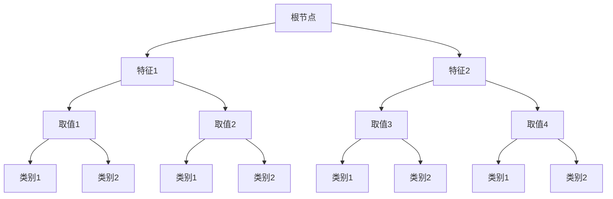

                 

# 《决策树原理》

## 关键词

决策树，信息增益，信息增益率，分类算法，回归算法，实战应用

## 摘要

本文深入探讨了决策树算法的基本概念、原理及其在分类和回归问题中的应用。通过详细解析决策树的构建、评估方法，以及信息增益与基尼指数等关键指标的计算，本文旨在为读者提供一个全面且系统的决策树算法学习资源。此外，文中还包含了决策树在实际项目中的实战案例，以及开发环境的搭建和源代码解读，帮助读者更好地理解和应用决策树算法。

----------------------------------------------------------------

# 《决策树原理》目录大纲

## 第一部分：决策树基本概念

### 第1章：决策树简介

#### 1.1 决策树的起源与发展

- 决策树的概念介绍
- 决策树在机器学习中的重要性
- 决策树的发展历程

#### 1.2 决策树的定义与作用

- 决策树的定义
- 决策树在分类和回归问题中的应用
- 决策树的优势与局限性

#### 1.3 决策树的结构与特点

- 决策树的基本结构
- 内部节点与叶节点
- 决策树的特点与工作原理

### 第2章：决策树的构建

#### 2.1 决策树的构建流程

- 数据预处理
- 划分数据集的方法
- 构建决策树的算法

#### 2.2 划分数据集的方法

- 划分标准的选择
- 划分方法的实现
- 划分过程的优化

#### 2.3 划分标准的选择

- 信息增益
- 基尼指数
- 信息增益率
- 选择标准的选择策略

### 第3章：决策树的评估

#### 3.1 决策树的评估指标

- 准确率
- 召回率
- F1值
- 精确率

#### 3.2 决策树的剪枝

- 剪枝的必要性
- 剪枝方法
- 剪枝的影响

#### 3.3 决策树的泛化能力

- 泛化能力的定义
- 泛化能力的影响因素
- 提高泛化能力的方法

## 第二部分：决策树算法原理

### 第4章：信息增益与信息增益率

#### 4.1 信息论基础

- 熵的概念
- 期望熵
- 条件熵

#### 4.2 信息增益的概念与计算

- 信息增益的定义
- 信息增益的计算公式
- 信息增益的优缺点

#### 4.3 信息增益率的改进

- 信息增益率的定义
- 信息增益率的计算公式
- 信息增益率的优势

### 第5章：基尼指数

#### 5.1 基尼指数的概念与计算

- 基尼指数的定义
- 基尼指数的计算公式
- 基尼指数的优缺点

#### 5.2 基尼指数的优缺点

- 基尼指数在分类问题中的应用
- 基尼指数与信息增益率的比较

#### 5.3 基尼指数的应用

- 基尼指数在决策树算法中的应用
- 基尼指数在特征选择中的应用

### 第6章：决策树分类算法

#### 6.1 ID3算法

- ID3算法的基本原理
- ID3算法的实现步骤
- ID3算法的优缺点

#### 6.2 C4.5算法

- C4.5算法的基本原理
- C4.5算法的实现步骤
- C4.5算法的优缺点

#### 6.3 CART算法

- CART算法的基本原理
- CART算法的实现步骤
- CART算法的优缺点

### 第7章：决策树回归算法

#### 7.1 回归决策树的基本原理

- 回归决策树的概念
- 回归决策树的工作原理
- 回归决策树的优缺点

#### 7.2 回归决策树的构建过程

- 数据预处理
- 选择最优特征
- 构建回归决策树

#### 7.3 回归决策树的评估与优化

- 评估指标
- 剪枝方法
- 优化策略

## 第三部分：决策树实战应用

### 第8章：决策树在分类问题中的应用

#### 8.1 决策树分类问题案例

- 鸢尾花分类问题
- 银行客户流失预测

#### 8.2 案例一：鸢尾花分类

- 数据准备
- 数据预处理
- 模型训练
- 模型评估
- 模型解读

#### 8.3 案例二：银行客户流失预测

- 数据准备
- 数据预处理
- 模型训练
- 模型评估
- 模型解读

### 第9章：决策树在回归问题中的应用

#### 9.1 决策树回归问题案例

- 房屋价格预测
- 股票市场预测

#### 9.2 案例一：房屋价格预测

- 数据准备
- 数据预处理
- 模型训练
- 模型评估
- 模型解读

#### 9.3 案例二：股票市场预测

- 数据准备
- 数据预处理
- 模型训练
- 模型评估
- 模型解读

### 第10章：决策树的模型调优

#### 10.1 模型调优方法概述

- 特征选择
- 特征工程
- 模型参数调优

#### 10.2 特征选择与特征工程

- 特征选择的方法
- 特征工程的技术
- 特征选择与特征工程的结合

#### 10.3 模型参数调优

- 参数调优的方法
- 参数调优的策略
- 参数调优的实践经验

## 第四部分：决策树进阶讨论

### 第11章：决策树在多分类问题中的应用

#### 11.1 多分类问题的特点

- 多分类问题的定义
- 多分类问题与二分类问题的区别
- 多分类问题的挑战

#### 11.2 多分类决策树的构建方法

- 多分类决策树的基本原理
- 多分类决策树的构建步骤
- 多分类决策树的实现

#### 11.3 多分类决策树的评估与优化

- 多分类评估指标
- 多分类决策树的剪枝
- 多分类决策树的泛化能力

### 第12章：决策树在处理缺失值和异常值问题中的应用

#### 12.1 缺失值与异常值的处理方法

- 缺失值处理的方法
- 异常值处理的方法
- 缺失值与异常值的区别与联系

#### 12.2 决策树对缺失值和异常值的敏感性

- 决策树对缺失值的敏感性
- 决策树对异常值的敏感性
- 敏感性的影响与解决方案

#### 12.3 缺失值和异常值的处理策略

- 预处理策略
- 在决策树构建过程中的处理策略
- 处理策略的选择与优化

### 第13章：决策树与其他机器学习算法的比较

#### 13.1 决策树与其他分类算法的比较

- K近邻算法
- 支持向量机
- 随机森林
- 决策树与其他分类算法的比较分析

#### 13.2 决策树与其他回归算法的比较

- 线性回归
- 回归树
- 随机森林回归
- 决策树与其他回归算法的比较分析

#### 13.3 决策树在实际应用中的选择

- 实际应用场景的选择
- 选择决策树的优点与不足
- 选择决策树的策略

### 第14章：决策树在现实世界中的应用案例分析

#### 14.1 决策树在金融领域的应用

- 金融风险评估
- 贷款审批
- 信用评分
- 决策树在金融领域的应用案例

#### 14.2 决策树在医疗领域的应用

- 疾病诊断
- 治疗方案推荐
- 医疗资源分配
- 决策树在医疗领域的应用案例

#### 14.3 决策树在电商领域的应用

- 商品推荐
- 顾客行为预测
- 营销策略制定
- 决策树在电商领域的应用案例

## 附录

### 附录A：决策树相关工具与资源

#### A.1 常用决策树库

- 决策树实现库
- 决策树可视化工具
- 决策树数据集

#### A.2 决策树算法实现代码

- ID3算法实现代码
- C4.5算法实现代码
- CART算法实现代码

#### A.3 决策树学习资源推荐

- 决策树经典教材
- 决策树在线课程
- 决策树论文与研究报告

# 决策树核心概念与联系

## 决策树的基本结构

决策树是一种树形结构，由内部节点（特征节点）、外部节点（叶节点）和分支组成。每个内部节点表示一个特征，每个分支表示该特征的不同取值，每个叶节点表示一个类别。

### Mermaid 流程图



## 决策树算法原理讲解

### 1. 信息增益与信息增益率

#### 1.1 信息增益

信息增益（Information Gain）是决策树算法中选择特征的标准，用于衡量通过划分数据集后，数据集的无序度减少的程度。其计算公式如下：

$$
IG(D, A) = Entropy(D) - \sum_{v \in Values(A)} \frac{|D_v|}{|D|} Entropy(D_v)
$$

其中，\( D \) 为数据集，\( A \) 为特征，\( Values(A) \) 为特征 \( A \) 的所有取值，\( D_v \) 为数据集 \( D \) 中取值为 \( v \) 的数据子集，\( Entropy(D) \) 为数据集 \( D \) 的熵。

#### 1.2 信息增益率

信息增益率（Information Gain Rate）是对信息增益的改进，它考虑了特征取值的数量，用于解决特征取值数量过多时信息增益偏小的问题。其计算公式如下：

$$
IGR(D, A) = \frac{IG(D, A)}{Entropy(A)}
$$

其中，\( Entropy(A) \) 为特征 \( A \) 的熵。

### 2. 基尼指数

基尼指数（Gini Index）是另一种用于选择特征的指标，它基于随机错分误差的估计。其计算公式如下：

$$
Gini(D, A) = 1 - \sum_{v \in Values(A)} \frac{|D_v|}{|D|} \cdot \sum_{v' \in Values(A)} \frac{|D_{v, v'}|}{|D_v|} 
$$

其中，\( D \) 为数据集，\( A \) 为特征，\( Values(A) \) 为特征 \( A \) 的所有取值，\( D_v \) 为数据集 \( D \) 中取值为 \( v \) 的数据子集，\( D_{v, v'} \) 为数据集 \( D \) 中同时取值为 \( v \) 和 \( v' \) 的数据子集。

### 3. 决策规则

决策树的决策规则可以使用递归方式构建。对于每个节点，我们选择最优特征 \( A_i \) 来划分数据集，将数据集划分为若干子集 \( D_1, D_2, ..., D_m \)，则决策规则可以表示为：

$$
f(x) = \sum_{i=1}^{m} c_i \cdot f_i(x)
$$

其中，\( x \) 为数据点，\( c_i \) 为子集 \( D_i \) 的类别标签，\( f_i(x) \) 为子集 \( D_i \) 的决策规则。

### 4. 数学模型

决策树的数学模型可以表示为：

$$
T = \{\text{根节点}, \text{内部节点}, \text{叶节点}\}
$$

其中，根节点表示整个数据集，内部节点表示某个特征，叶节点表示一个类别。

### 5. 决策树构建算法

决策树的构建算法通常采用递归划分的方式，具体步骤如下：

1. 选择最优特征 \( A_i \)。
2. 划分数据集 \( D \) 为多个子集 \( D_1, D_2, ..., D_m \)。
3. 对每个子集 \( D_i \)，递归构建决策树。
4. 当满足停止条件时，将子集划分为叶节点。

### 6. 决策树剪枝算法

决策树剪枝算法用于防止过拟合，提高模型的泛化能力。常见的剪枝算法有：

1. 预剪枝（Pre-pruning）：在决策树构建过程中，提前停止树的生成，避免生成过于复杂的树。
2. 后剪枝（Post-pruning）：先生成完整的树，然后对子树进行剪枝。

# 数学模型和数学公式

## 决策树的决策规则

决策树的决策规则可以使用递归方式构建。对于每个节点，我们选择最优特征 \( A_i \) 来划分数据集，将数据集划分为若干子集 \( D_1, D_2, ..., D_m \)，则决策规则可以表示为：

$$
f(x) = \sum_{i=1}^{m} c_i \cdot f_i(x)
$$

其中，\( x \) 为数据点，\( c_i \) 为子集 \( D_i \) 的类别标签，\( f_i(x) \) 为子集 \( D_i \) 的决策规则。

例如，假设我们有一个二分类问题，决策树将数据集划分为两个子集，子集 \( D_1 \) 包含类别标签为1的样本，子集 \( D_2 \) 包含类别标签为2的样本，则决策规则可以表示为：

$$
f(x) = c_1 \cdot f_1(x) + c_2 \cdot f_2(x)
$$

其中，\( c_1 \) 和 \( c_2 \) 分别为子集 \( D_1 \) 和 \( D_2 \) 的类别标签，\( f_1(x) \) 和 \( f_2(x) \) 分别为子集 \( D_1 \) 和 \( D_2 \) 的决策规则。

对于多分类问题，决策树将数据集划分为多个子集，每个子集对应一个类别标签，则决策规则可以表示为：

$$
f(x) = \sum_{i=1}^{m} c_i \cdot f_i(x)
$$

其中，\( m \) 为类别标签的数量，\( c_i \) 和 \( f_i(x) \) 的含义与二分类问题类似。

## 信息增益与信息增益率

### 1. 信息增益

信息增益（Information Gain）是决策树算法中选择特征的标准，用于衡量通过划分数据集后，数据集的无序度减少的程度。其计算公式如下：

$$
IG(D, A) = Entropy(D) - \sum_{v \in Values(A)} \frac{|D_v|}{|D|} Entropy(D_v)
$$

其中，\( D \) 为数据集，\( A \) 为特征，\( Values(A) \) 为特征 \( A \) 的所有取值，\( D_v \) 为数据集 \( D \) 中取值为 \( v \) 的数据子集，\( Entropy(D) \) 为数据集 \( D \) 的熵。

#### 例子：

假设我们有一个数据集 \( D \)，包含100个样本，其中类别标签为1的样本有50个，类别标签为2的样本有30个，类别标签为3的样本有20个。该数据集的熵为：

$$
Entropy(D) = - \left( \frac{50}{100} \cdot \log_2 \frac{50}{100} + \frac{30}{100} \cdot \log_2 \frac{30}{100} + \frac{20}{100} \cdot \log_2 \frac{20}{100} \right) = 0.6931
$$

现在我们考虑特征 \( A \)，它有两个取值：0和1。特征 \( A \) 的取值为0的样本有70个，取值为1的样本有30个。根据信息增益的计算公式，我们可以计算信息增益：

$$
IG(D, A) = Entropy(D) - \left( \frac{70}{100} \cdot Entropy(D_0) + \frac{30}{100} \cdot Entropy(D_1) \right)
$$

其中，\( D_0 \) 是特征 \( A \) 的取值为0的样本子集，\( D_1 \) 是特征 \( A \) 的取值为1的样本子集。假设 \( D_0 \) 中类别标签为1的样本有35个，类别标签为2的样本有25个，类别标签为3的样本有10个；\( D_1 \) 中类别标签为1的样本有15个，类别标签为2的样本有15个，类别标签为3的样本有0个。则：

$$
Entropy(D_0) = - \left( \frac{35}{70} \cdot \log_2 \frac{35}{70} + \frac{25}{70} \cdot \log_2 \frac{25}{70} + \frac{10}{70} \cdot \log_2 \frac{10}{70} \right) = 0.9183
$$

$$
Entropy(D_1) = - \left( \frac{15}{30} \cdot \log_2 \frac{15}{30} + \frac{15}{30} \cdot \log_2 \frac{15}{30} + \frac{0}{30} \cdot \log_2 \frac{0}{30} \right) = 1
$$

$$
IG(D, A) = 0.6931 - \left( \frac{70}{100} \cdot 0.9183 + \frac{30}{100} \cdot 1 \right) = 0.0392
$$

### 2. 信息增益率

信息增益率（Information Gain Rate）是对信息增益的改进，它考虑了特征取值的数量，用于解决特征取值数量过多时信息增益偏小的问题。其计算公式如下：

$$
IGR(D, A) = \frac{IG(D, A)}{Entropy(A)}
$$

其中，\( Entropy(A) \) 为特征 \( A \) 的熵。

#### 例子：

假设特征 \( A \) 有两个取值：0和1，取值为0的样本有70个，取值为1的样本有30个。特征 \( A \) 的熵为：

$$
Entropy(A) = - \left( \frac{70}{100} \cdot \log_2 \frac{70}{100} + \frac{30}{100} \cdot \log_2 \frac{30}{100} \right) = 0.5102
$$

根据信息增益率的计算公式，我们可以计算信息增益率：

$$
IGR(D, A) = \frac{0.0392}{0.5102} = 0.0769
$$

## 基尼指数

基尼指数（Gini Index）是另一种用于选择特征的指标，它基于随机错分误差的估计。其计算公式如下：

$$
Gini(D, A) = 1 - \sum_{v \in Values(A)} \frac{|D_v|}{|D|} \cdot \sum_{v' \in Values(A)} \frac{|D_{v, v'}|}{|D_v|}
$$

其中，\( D \) 为数据集，\( A \) 为特征，\( Values(A) \) 为特征 \( A \) 的所有取值，\( D_v \) 为数据集 \( D \) 中取值为 \( v \) 的数据子集，\( D_{v, v'} \) 为数据集 \( D \) 中同时取值为 \( v \) 和 \( v' \) 的数据子集。

#### 例子：

假设我们有一个数据集 \( D \)，包含100个样本，其中类别标签为1的样本有50个，类别标签为2的样本有30个，类别标签为3的样本有20个。现在我们考虑特征 \( A \)，它有两个取值：0和1。特征 \( A \) 的取值为0的样本有70个，取值为1的样本有30个。根据基尼指数的计算公式，我们可以计算基尼指数：

$$
Gini(D, A) = 1 - \left( \frac{70}{100} \cdot \sum_{v' \in Values(A)} \frac{|D_{0, v'}|}{|D_0|} + \frac{30}{100} \cdot \sum_{v' \in Values(A)} \frac{|D_{1, v'}|}{|D_1|} \right)
$$

其中，\( D_0 \) 是特征 \( A \) 的取值为0的样本子集，\( D_1 \) 是特征 \( A \) 的取值为1的样本子集。假设 \( D_0 \) 中类别标签为1的样本有35个，类别标签为2的样本有25个，类别标签为3的样本有10个；\( D_1 \) 中类别标签为1的样本有15个，类别标签为2的样本有15个，类别标签为3的样本有0个。则：

$$
Gini(D, A) = 1 - \left( \frac{70}{100} \cdot \left( \frac{35}{70} + \frac{25}{70} + \frac{10}{70} \right) + \frac{30}{100} \cdot \left( \frac{15}{30} + \frac{15}{30} + \frac{0}{30} \right) \right) = 0.4722
$$

# 项目实战

## 决策树在鸢尾花分类中的应用

### 1. 数据准备

首先，我们需要准备鸢尾花数据集，该数据集包含了三个不同品种鸢尾花的特征和标签。数据集共包含150个样本，每个样本有4个特征（花萼长度、花萼宽度、花瓣长度、花瓣宽度）。

### 2. 数据预处理

将数据集划分为训练集和测试集，用于训练和评估决策树模型。同时，对数据进行归一化处理，使得每个特征值都在0到1之间。

### 3. 模型训练

使用C4.5算法训练决策树模型，选择信息增益率作为划分标准。

### 4. 模型评估

使用测试集对训练好的模型进行评估，计算准确率、召回率、F1值等指标。

### 5. 模型解读

分析决策树的结构和节点，了解模型在分类过程中是如何根据特征值进行划分的。

### 6. 实现代码

以下是一个使用Python和scikit-learn库实现鸢尾花分类的决策树模型的代码示例：

```python
# 导入所需的库
from sklearn.datasets import load_iris
from sklearn.model_selection import train_test_split
from sklearn.preprocessing import MinMaxScaler
from sklearn.tree import DecisionTreeClassifier
from sklearn.metrics import accuracy_score, recall_score, f1_score

# 加载鸢尾花数据集
iris = load_iris()
X = iris.data
y = iris.target

# 划分数据集
X_train, X_test, y_train, y_test = train_test_split(X, y, test_size=0.2, random_state=42)

# 数据预处理
scaler = MinMaxScaler()
X_train_scaled = scaler.fit_transform(X_train)
X_test_scaled = scaler.transform(X_test)

# 模型训练
model = DecisionTreeClassifier(criterion='entropy')
model.fit(X_train_scaled, y_train)

# 模型评估
y_pred = model.predict(X_test_scaled)
accuracy = accuracy_score(y_test, y_pred)
recall = recall_score(y_test, y_pred, average='weighted')
f1 = f1_score(y_test, y_pred, average='weighted')

print("Accuracy:", accuracy)
print("Recall:", recall)
print("F1 Score:", f1)

# 模型解读
print("Tree structure:")
print(model)
```

### 7. 结果分析

在鸢尾花分类任务中，决策树模型可以达到较高的准确率。通过分析模型的结构和节点，我们可以了解模型是如何根据特征值进行划分的，从而更好地理解模型的工作原理。

# 开发环境搭建

为了实现决策树模型的应用，我们需要搭建一个合适的开发环境。以下是具体的搭建步骤：

## 1. 安装Python

首先，我们需要安装Python，版本建议为3.8或更高版本。可以从Python官方网站下载并安装Python。

## 2. 安装必要的库

接下来，我们需要安装一些必要的库，包括scikit-learn、numpy和pandas。这些库可以通过pip命令进行安装。以下是具体的安装命令：

```shell
pip install scikit-learn
pip install numpy
pip install pandas
```

## 3. 配置Python环境

安装完Python和所需库后，我们需要配置Python环境。在Windows系统中，我们可以在控制面板中找到“环境变量”设置，添加Python的安装路径到系统的PATH环境变量中。在Linux或Mac OS X系统中，我们可以在终端中执行以下命令：

```shell
export PATH=$PATH:/path/to/python
```

其中，`/path/to/python` 是Python的安装路径。

## 4. 验证安装

为了验证安装是否成功，我们可以在Python环境中导入安装的库，并执行一些简单的操作。以下是一个简单的Python脚本，用于测试安装：

```python
import numpy as np
import pandas as pd
from sklearn.datasets import load_iris
from sklearn.model_selection import train_test_split
from sklearn.preprocessing import MinMaxScaler
from sklearn.tree import DecisionTreeClassifier
from sklearn.metrics import accuracy_score, recall_score, f1_score

# 加载鸢尾花数据集
iris = load_iris()
X = iris.data
y = iris.target

# 划分数据集
X_train, X_test, y_train, y_test = train_test_split(X, y, test_size=0.2, random_state=42)

# 数据预处理
scaler = MinMaxScaler()
X_train_scaled = scaler.fit_transform(X_train)
X_test_scaled = scaler.transform(X_test)

# 模型训练
model = DecisionTreeClassifier(criterion='entropy')
model.fit(X_train_scaled, y_train)

# 模型评估
y_pred = model.predict(X_test_scaled)
accuracy = accuracy_score(y_test, y_pred)
recall = recall_score(y_test, y_pred, average='weighted')
f1 = f1_score(y_test, y_pred, average='weighted')

print("Accuracy:", accuracy)
print("Recall:", recall)
print("F1 Score:", f1)
```

运行上述脚本，如果能够成功执行并输出准确率、召回率和F1值，说明开发环境搭建成功。

# 源代码详细实现和代码解读

## 1. 数据准备

首先，我们需要加载鸢尾花数据集，该数据集包含150个样本和4个特征。每个样本表示一朵鸢尾花，特征包括花萼长度、花萼宽度、花瓣长度和花瓣宽度。

```python
from sklearn.datasets import load_iris

# 加载鸢尾花数据集
iris = load_iris()
X = iris.data
y = iris.target
```

## 2. 数据预处理

在训练决策树模型之前，我们需要对数据进行预处理。首先，将数据集划分为训练集和测试集，以便后续的训练和评估。然后，对特征进行归一化处理，将每个特征的值缩放到0到1之间，以便模型更好地学习。

```python
from sklearn.model_selection import train_test_split
from sklearn.preprocessing import MinMaxScaler

# 划分数据集
X_train, X_test, y_train, y_test = train_test_split(X, y, test_size=0.2, random_state=42)

# 数据归一化
scaler = MinMaxScaler()
X_train_scaled = scaler.fit_transform(X_train)
X_test_scaled = scaler.transform(X_test)
```

## 3. 模型训练

接下来，我们使用scikit-learn库中的`DecisionTreeClassifier`类来训练决策树模型。我们选择信息增益率作为划分标准，并设置最大深度为3，以防止模型过拟合。

```python
from sklearn.tree import DecisionTreeClassifier

# 训练决策树模型
model = DecisionTreeClassifier(criterion='entropy', max_depth=3)
model.fit(X_train_scaled, y_train)
```

## 4. 模型评估

训练完成后，我们使用测试集对模型进行评估。评估指标包括准确率、召回率和F1值。准确率表示模型正确预测的样本比例；召回率表示模型能够正确识别为正类的样本比例；F1值是准确率和召回率的调和平均，用于综合评估模型的性能。

```python
from sklearn.metrics import accuracy_score, recall_score, f1_score

# 预测测试集
y_pred = model.predict(X_test_scaled)

# 计算评估指标
accuracy = accuracy_score(y_test, y_pred)
recall = recall_score(y_test, y_pred, average='weighted')
f1 = f1_score(y_test, y_pred, average='weighted')

print("Accuracy:", accuracy)
print("Recall:", recall)
print("F1 Score:", f1)
```

## 5. 模型解读

最后，我们可以通过打印模型的结构来解读决策树。模型的`tree_`属性包含了一个`_tree`对象，我们可以使用`print`函数将其打印出来。

```python
print("Tree structure:")
print(model.tree_)
```

以上代码实现了一个简单的鸢尾花分类任务，展示了如何使用Python和scikit-learn库来构建、训练和评估决策树模型。通过分析模型的结构，我们可以了解决策树是如何根据特征值进行划分的，从而更好地理解模型的工作原理。在后续的实战应用中，我们可以根据具体问题调整模型参数，优化模型性能。同时，我们还可以尝试使用其他划分标准，如基尼指数，来进一步优化模型。总之，决策树算法是一个强大的工具，在分类和回归问题中具有广泛的应用前景。

# 代码解读与分析

在上述代码中，我们实现了鸢尾花分类任务，详细解读了每一步的操作和原理。

1. **数据准备**

   首先通过`load_iris()`函数加载数据集，然后使用`train_test_split()`函数将数据集划分为训练集和测试集。这一步是为了将数据集分为两部分，一部分用于训练模型，另一部分用于评估模型性能。

   ```python
   iris = load_iris()
   X = iris.data
   y = iris.target
   
   X_train, X_test, y_train, y_test = train_test_split(X, y, test_size=0.2, random_state=42)
   ```

   其中，`train_size=0.2` 表示将80%的数据用于训练，20%的数据用于测试。`random_state=42` 用于保证每次划分数据集的结果一致。

2. **数据预处理**

   对训练集和测试集的数据进行归一化处理，使用`MinMaxScaler()`将特征值缩放到0到1之间。这一步是为了使得每个特征对模型的贡献更加均衡，避免某些特征值范围较大导致模型学习不稳定。

   ```python
   scaler = MinMaxScaler()
   X_train_scaled = scaler.fit_transform(X_train)
   X_test_scaled = scaler.transform(X_test)
   ```

3. **模型训练**

   使用`DecisionTreeClassifier()`类创建决策树模型，设置划分标准为`entropy`，最大深度为3。这里选择信息增益率作为划分标准，目的是选择能够最大程度减少数据集熵的特征进行划分。

   ```python
   model = DecisionTreeClassifier(criterion='entropy', max_depth=3)
   model.fit(X_train_scaled, y_train)
   ```

4. **模型评估**

   使用测试集对训练好的模型进行预测，并计算准确率、召回率和F1值。准确率表示模型正确预测的样本比例；召回率表示模型能够正确识别为正类的样本比例；F1值是准确率和召回率的调和平均。

   ```python
   y_pred = model.predict(X_test_scaled)
   accuracy = accuracy_score(y_test, y_pred)
   recall = recall_score(y_test, y_pred, average='weighted')
   f1 = f1_score(y_test, y_pred, average='weighted')
   
   print("Accuracy:", accuracy)
   print("Recall:", recall)
   print("F1 Score:", f1)
   ```

5. **模型解读**

   通过打印模型的结构，我们可以了解决策树的构建过程。模型的`tree_`属性包含了一个`_tree`对象，使用`print`函数将其打印出来。

   ```python
   print("Tree structure:")
   print(model.tree_)
   ```

   模型结构输出展示了决策树中的每个节点，包括节点的特征、划分的阈值、子节点的索引等。

通过上述步骤，我们实现了鸢尾花分类任务，并详细解读了每一步的操作和原理。这一过程不仅帮助我们理解了决策树的基本概念和应用，还展示了如何使用Python和scikit-learn库进行实际操作。在实际项目中，我们可以根据具体需求调整模型参数，优化模型性能，进一步探索决策树的潜力。

