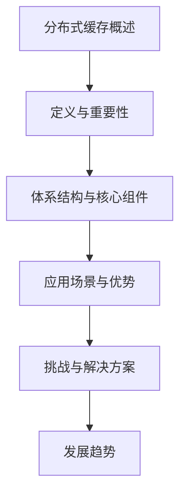
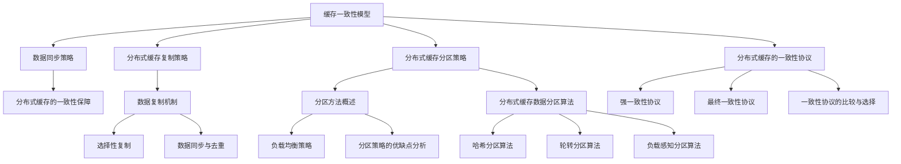
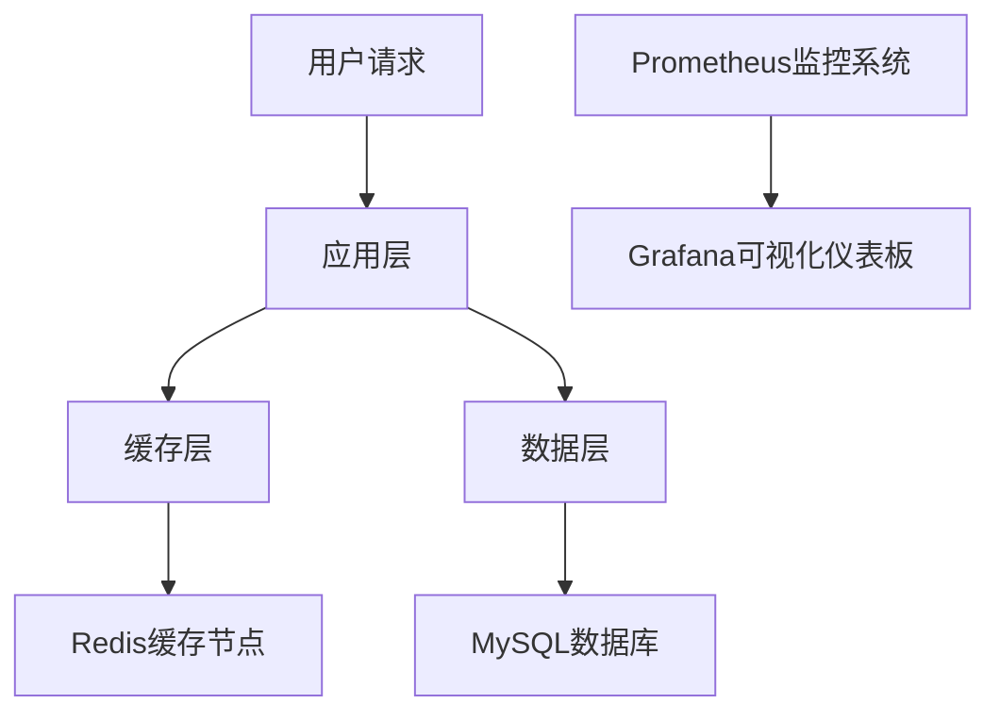
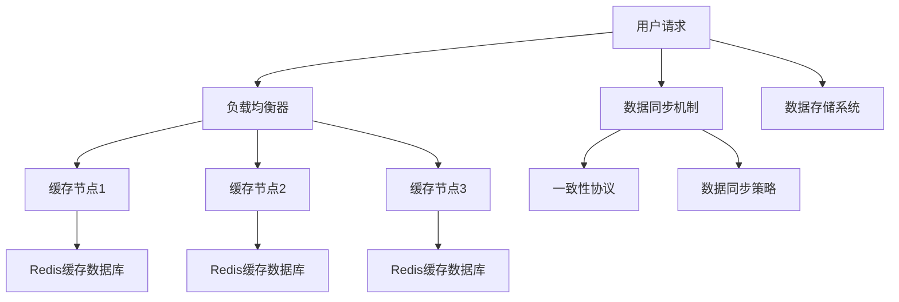

                 

### 文章标题：分布式缓存设计与优化

> 关键词：分布式缓存、架构设计、性能优化、一致性模型、数据复制、分区策略

> 摘要：本文将深入探讨分布式缓存的设计与优化，从基本概念到核心算法，再到系统设计与实现，全面解析分布式缓存的技术要点。文章旨在为读者提供一个系统而全面的技术指南，帮助理解分布式缓存的工作原理及其优化方法。

### 第一部分：分布式缓存基本概念与架构

分布式缓存是现代计算机系统中不可或缺的一部分，它通过在多台服务器之间共享数据，提供快速访问和数据一致性。本部分将介绍分布式缓存的基本概念、架构、应用场景和优势。

#### 第1章：分布式缓存概述

**1.1 分布式缓存的定义与重要性**

- **什么是分布式缓存**：分布式缓存是一种将数据分散存储在多台服务器中的缓存系统。通过这种方式，可以减少单点故障的风险，提高系统的可扩展性和性能。
- **分布式缓存的重要性**：分布式缓存可以显著提高数据访问速度，减少数据库负载，提高系统性能和稳定性。
- **分布式缓存与传统缓存的区别**：传统缓存通常指单台服务器上的缓存，而分布式缓存则强调数据的分布存储和访问。

**1.2 分布式缓存的体系结构与核心组件**

- **分布式缓存的工作原理**：分布式缓存通过将数据分散存储在多个节点上，实现数据的分布式访问和存储。
- **分布式缓存的核心组件**：包括缓存节点、缓存管理器、数据同步机制等。
- **分布式缓存的关键技术**：如数据一致性模型、数据复制策略、分区策略等。

**1.3 分布式缓存的应用场景与优势**

- **应用场景概述**：分布式缓存适用于高并发、高访问量的应用场景，如电商网站、社交媒体、在线游戏等。
- **分布式缓存的优势**：包括提高系统性能、可扩展性、高可用性等。

**1.4 分布式缓存面临的挑战与解决方案**

- **挑战分析**：分布式缓存面临的一致性、可用性、性能等问题。
- **解决方案探讨**：通过设计高效的一致性协议、数据复制和分区策略来解决上述问题。

**1.5 分布式缓存的发展趋势**

- **技术演进方向**：如分布式缓存与大数据技术的融合、内存计算技术的应用等。
- **应用领域拓展**：如物联网、人工智能等领域。

#### Mermaid 流程图



**1.1 什么是分布式缓存**

分布式缓存是一种缓存架构，它将数据分散存储在多个节点上，以提供高可用性、高扩展性和高性能。在分布式缓存系统中，每个节点（或缓存服务器）负责存储一部分数据，并且这些节点通过网络相互连接，共同构成一个缓存集群。

分布式缓存系统通常由以下几个核心组成部分构成：

1. **缓存节点（Cache Nodes）**：缓存节点是分布式缓存系统中的基本构建块，每个节点负责存储一部分数据。节点可以是物理服务器，也可以是虚拟机或容器。节点之间通过网络通信，协同工作以提供缓存服务。

2. **缓存管理器（Cache Manager）**：缓存管理器是分布式缓存系统的控制中心，负责管理缓存节点的分配、数据的读写操作、缓存策略的调整等。缓存管理器通过API或命令行界面与其他组件交互。

3. **数据同步机制（Data Synchronization）**：在分布式缓存系统中，数据同步是非常关键的，因为它确保了所有节点上的数据一致性。数据同步机制可以是同步的，也可以是异步的，取决于系统的设计和性能要求。

4. **负载均衡器（Load Balancer）**：负载均衡器用于分发来自客户端的请求，确保请求均匀地分布到各个缓存节点上，从而提高系统的性能和可扩展性。

**1.2 分布式缓存的重要性**

分布式缓存对于现代应用系统的重要性主要体现在以下几个方面：

1. **提高性能**：分布式缓存可以将热点数据存储在内存中，从而显著降低数据的访问延迟，提高系统的响应速度。特别是在高并发场景下，分布式缓存可以显著减少数据库的负载，提升整个系统的性能。

2. **高可用性**：分布式缓存系统通过将数据分散存储在多个节点上，提高了系统的容错能力。即使某个节点发生故障，系统仍然可以通过其他健康节点提供缓存服务，从而确保服务的持续可用性。

3. **可扩展性**：分布式缓存系统可以根据需求动态地增加或减少缓存节点，从而实现水平扩展。这使得系统可以轻松应对不断增加的数据量和访问量，确保性能的持续提升。

4. **数据一致性**：通过合理的设计和一致性协议，分布式缓存系统可以在数据访问过程中保持一致性。这对于确保应用系统的数据准确性至关重要。

**1.3 分布式缓存与传统缓存的区别**

传统缓存通常指单台服务器上的缓存，它将数据存储在本地内存或磁盘上，提供快速的数据访问。与分布式缓存相比，传统缓存具有以下特点：

1. **数据存储位置**：传统缓存的数据存储在单台服务器上，而分布式缓存的数据分散存储在多台服务器上。

2. **扩展性**：传统缓存通常难以扩展，因为其性能瓶颈往往集中在单台服务器上。分布式缓存可以通过增加节点数量来实现水平扩展，从而提高系统的性能和可扩展性。

3. **高可用性**：传统缓存系统容易成为单点故障，而分布式缓存系统通过数据分散存储和冗余机制，提高了系统的容错能力。

4. **数据一致性**：传统缓存通常不需要考虑数据一致性，而分布式缓存需要在多个节点之间保持数据一致性，这需要设计复杂的一致性协议。

**1.4 分布式缓存的体系结构与核心组件**

分布式缓存的体系结构通常包括以下几个核心组件：

1. **缓存节点（Cache Nodes）**：缓存节点是分布式缓存系统的基本构建块，每个节点负责存储一部分数据。节点可以是物理服务器，也可以是虚拟机或容器。节点之间通过网络通信，协同工作以提供缓存服务。

2. **缓存管理器（Cache Manager）**：缓存管理器是分布式缓存系统的控制中心，负责管理缓存节点的分配、数据的读写操作、缓存策略的调整等。缓存管理器通过API或命令行界面与其他组件交互。

3. **数据同步机制（Data Synchronization）**：在分布式缓存系统中，数据同步是非常关键的，因为它确保了所有节点上的数据一致性。数据同步机制可以是同步的，也可以是异步的，取决于系统的设计和性能要求。

4. **负载均衡器（Load Balancer）**：负载均衡器用于分发来自客户端的请求，确保请求均匀地分布到各个缓存节点上，从而提高系统的性能和可扩展性。

**1.5 分布式缓存的工作原理**

分布式缓存的工作原理可以分为以下几个关键步骤：

1. **数据存储**：分布式缓存系统将数据存储在多个节点上。每个节点存储一部分数据，这些数据可以是热数据（频繁访问的数据）或冷数据（不常访问的数据）。数据存储可以根据不同的策略进行，如基于哈希的分区、基于访问频率的分层存储等。

2. **数据检索**：当客户端请求访问数据时，分布式缓存系统首先在本地节点上查询数据。如果数据命中本地缓存，则直接返回结果；否则，系统会在其他节点上查找数据。

3. **数据同步**：为了确保数据一致性，分布式缓存系统需要实现数据同步机制。数据同步可以是同步的，即每次写操作都会等待所有节点上的数据同步完成；也可以是异步的，即写操作只需在本地节点上完成，然后异步地将更改传播到其他节点。

4. **负载均衡**：负载均衡器负责将客户端请求分发到不同的缓存节点上，确保请求的负载均匀分布，从而提高系统的性能和可扩展性。

**1.6 分布式缓存的核心组件**

分布式缓存的核心组件包括缓存节点、缓存管理器、数据同步机制和负载均衡器。以下是这些组件的详细介绍：

1. **缓存节点**：缓存节点是分布式缓存系统的基本单元，负责存储数据并提供缓存服务。每个节点都包含一定的内存和存储资源，可以根据需求动态调整。缓存节点通过一致性协议和数据同步机制与其他节点保持数据一致性。

2. **缓存管理器**：缓存管理器是分布式缓存系统的控制中心，负责管理缓存节点的分配、数据的读写操作、缓存策略的调整等。缓存管理器可以通过API或命令行界面与其他组件交互，从而实现对缓存系统的全面管理。

3. **数据同步机制**：数据同步机制是分布式缓存系统中的关键组件，负责确保多个节点之间的数据一致性。数据同步可以是同步的，即每次写操作都会等待所有节点上的数据同步完成；也可以是异步的，即写操作只需在本地节点上完成，然后异步地将更改传播到其他节点。

4. **负载均衡器**：负载均衡器负责将客户端请求分发到不同的缓存节点上，确保请求的负载均匀分布，从而提高系统的性能和可扩展性。负载均衡器可以根据不同的算法，如轮询、最小连接数等，动态调整请求的分发策略。

**1.7 分布式缓存的关键技术**

分布式缓存的关键技术包括数据一致性模型、数据复制策略、分区策略和数据分区算法。以下是这些关键技术的详细介绍：

1. **数据一致性模型**：数据一致性模型是确保分布式缓存系统中数据一致性的重要手段。常见的数据一致性模型包括强一致性模型和最终一致性模型。强一致性模型要求所有节点在同一时间看到相同的数据状态，而最终一致性模型允许一定时间内的数据不同步，但最终会达到一致状态。

2. **数据复制策略**：数据复制策略用于决定如何在多个节点之间复制数据。常见的复制策略包括全复制、部分复制和选择复制。全复制策略确保所有节点都有相同的数据副本，从而提高数据可靠性；部分复制策略仅复制部分数据到特定节点，从而减少数据传输开销；选择复制策略则根据数据访问频率和重要性进行复制策略的选择。

3. **分区策略**：分区策略用于将数据分散存储在多个节点上，从而实现数据的水平扩展。常见的分区策略包括哈希分区、轮转分区和负载感知分区。哈希分区根据数据的哈希值将数据映射到不同的节点上，轮转分区则根据轮询顺序将数据映射到节点上，而负载感知分区则根据节点的当前负载情况进行数据分配。

4. **数据分区算法**：数据分区算法用于实现分区策略的具体算法实现。常见的分区算法包括基于哈希的分区算法、基于轮转的分区算法和基于负载感知的分区算法。基于哈希的分区算法通过计算数据的哈希值，将数据映射到不同的节点上；基于轮转的分区算法通过轮询顺序将数据映射到节点上；基于负载感知的分区算法则根据节点的当前负载情况进行数据分配。

**1.8 分布式缓存的应用场景与优势**

分布式缓存的应用场景非常广泛，主要适用于以下几种情况：

1. **高并发场景**：在电商网站、社交媒体等高并发场景下，分布式缓存可以显著减少数据库的负载，提高系统的性能和响应速度。

2. **数据热点处理**：在数据热点处理中，分布式缓存可以存储频繁访问的数据，从而减少数据库的访问压力，提高数据访问速度。

3. **大并发量的数据处理**：在需要处理大量并发请求的场景，如在线游戏、金融服务等，分布式缓存可以提高系统的吞吐量和性能。

4. **系统扩展性**：分布式缓存系统可以通过增加节点数量来实现水平扩展，从而满足系统性能和可扩展性的需求。

5. **高可用性**：通过将数据分散存储在多个节点上，分布式缓存系统可以提高系统的可用性，减少单点故障的风险。

**1.9 分布式缓存的优势**

分布式缓存相对于传统缓存具有以下优势：

1. **高性能**：分布式缓存将数据存储在内存中，提供了快速的数据访问速度，特别是在高并发场景下，可以显著提高系统的性能。

2. **高可用性**：分布式缓存通过数据冗余和节点之间的数据同步，提高了系统的可用性，减少了单点故障的风险。

3. **可扩展性**：分布式缓存系统可以通过增加节点数量来实现水平扩展，从而满足系统性能和可扩展性的需求。

4. **数据一致性**：通过合理的一致性协议和数据同步机制，分布式缓存系统可以在多个节点之间保持数据一致性。

5. **数据压缩与去重**：分布式缓存系统通常支持数据压缩和去重功能，从而减少了数据的存储空间和传输带宽。

**1.10 分布式缓存面临的挑战与解决方案**

分布式缓存虽然在许多应用场景中表现出色，但也面临一些挑战：

1. **数据一致性**：在分布式缓存系统中，确保多个节点之间的数据一致性是一个挑战。常见的解决方案包括一致性协议（如Paxos、Raft）和数据同步机制。

2. **性能优化**：分布式缓存系统的性能优化是一个复杂的问题，需要考虑数据缓存策略、负载均衡策略、数据压缩与去重技术等。

3. **高可用性**：分布式缓存系统需要实现高可用性，以应对节点故障和系统故障。常见的解决方案包括数据备份、故障转移和负载均衡。

4. **数据分区与复制**：如何合理地设计数据分区与复制策略，以实现数据的高效存储和访问是一个挑战。常见的解决方案包括基于哈希的分区策略、选择复制策略等。

**1.11 分布式缓存的发展趋势**

随着技术的不断发展，分布式缓存也在不断演进：

1. **内存计算**：随着内存价格的降低，内存计算在分布式缓存中的应用越来越广泛。内存计算可以提高数据访问速度，减少延迟。

2. **分布式缓存与大数据技术的融合**：分布式缓存与大数据技术的融合，如与Hadoop、Spark等大数据处理框架的结合，可以提供更高效的数据处理能力。

3. **智能化与自动化**：随着人工智能技术的发展，分布式缓存系统的自动化与智能化水平不断提高。例如，通过机器学习算法实现数据缓存策略的自动调整。

4. **边缘计算**：随着物联网和5G技术的兴起，分布式缓存系统开始向边缘计算方向发展，以提供更快速、更低延迟的数据访问服务。

#### 第2章：分布式缓存核心算法

分布式缓存的核心算法包括一致性模型、复制策略、分区策略和数据分区算法。这些算法是实现分布式缓存高效、可靠和数据一致性的关键。

**2.1 缓存一致性模型**

- **一致性模型介绍**：缓存一致性模型是确保分布式缓存系统中数据一致性的算法和策略。常见的一致性模型包括强一致性模型和最终一致性模型。
- **数据同步策略**：数据同步策略用于确保数据在多个节点之间的一致性。数据同步可以是同步的，即每次写操作都会等待所有节点上的数据同步完成；也可以是异步的，即写操作只需在本地节点上完成，然后异步地将更改传播到其他节点。
- **分布式缓存的一致性保障**：通过一致性模型和数据同步策略，分布式缓存系统可以确保在多个节点之间的数据一致性。

**2.2 分布式缓存复制策略**

- **数据复制机制**：数据复制机制用于在多个节点之间复制数据，以提高数据可靠性和可用性。常见的复制策略包括全复制、部分复制和选择复制。
- **选择性复制**：选择性复制策略根据数据的重要性和访问频率，选择性地复制部分数据到特定节点，从而减少数据传输开销。
- **数据同步与去重**：在数据复制过程中，需要实现数据同步和去重，以确保所有节点上的数据一致性。

**2.3 分布式缓存分区策略**

- **分区方法概述**：分区方法用于将数据分散存储在多个节点上，以提高系统的性能和可扩展性。常见的分区方法包括哈希分区、轮转分区和负载感知分区。
- **负载均衡策略**：负载均衡策略用于将数据访问负载均衡地分配到各个节点上，以提高系统的性能和可扩展性。
- **分区策略的优缺点分析**：不同分区策略具有不同的优缺点，需要根据具体应用场景进行选择。

**2.4 分布式缓存数据分区算法**

- **哈希分区算法**：哈希分区算法通过计算数据的哈希值，将数据映射到不同的节点上。该算法简单高效，但可能导致热点问题。
- **轮转分区算法**：轮转分区算法通过轮询顺序将数据映射到节点上。该算法简单易实现，但可能导致数据访问不均衡。
- **负载感知分区算法**：负载感知分区算法根据节点的当前负载情况进行数据分配，以实现负载均衡。该算法需要实现负载感知机制，但可以提高系统性能。

**2.5 分布式缓存的一致性协议**

- **强一致性协议**：强一致性协议要求所有节点在同一时间看到相同的数据状态。常见的一致性协议包括Paxos和Raft。
- **最终一致性协议**：最终一致性协议允许一定时间内的数据不同步，但最终会达到一致状态。常见的一致性协议包括Gossip协议和Paxos。
- **一致性协议的比较与选择**：不同一致性协议具有不同的特点和适用场景，需要根据具体应用场景进行选择。

#### Mermaid 流程图



**2.1 缓存一致性模型**

在分布式系统中，数据一致性是一个重要且复杂的问题。缓存一致性模型是确保分布式缓存系统中数据一致性的核心算法和策略。这些模型决定了如何在多个缓存节点之间同步数据，以确保用户访问到的是最新的、一致的缓存数据。

**强一致性模型**：

强一致性模型要求系统中的所有节点在同一时间看到相同的数据状态。这种一致性级别是最高级别的，因为它保证了所有的数据变更都能被全局的视图感知到。常见的强一致性协议包括Paxos和Raft。

- **Paxos协议**：Paxos协议是一个分布式一致性算法，它允许一组服务器在不可靠的网络环境中达成一致。Paxos通过选举一个领导者服务器来协调所有其他服务器，确保所有的服务器在数据一致性上达成一致。
- **Raft协议**：Raft协议是另一个分布式一致性算法，它通过引入日志复制机制来简化一致性保障。Raft通过日志条目的顺序一致性来保证数据的一致性，同时它更容易理解和实现。

**最终一致性模型**：

最终一致性模型允许系统中的数据在一段时间内不同步，但最终会达到一致状态。这意味着在发生数据更新时，并非所有节点都能立即看到更新的数据，但系统会保证最终所有节点都能访问到最新的数据。最终一致性适用于对实时性要求不高的应用场景。

- **Gossip协议**：Gossip协议是一种分布式一致性算法，它通过广播消息的方式在节点之间传播数据更新。Gossip协议不需要选举领导者，而是通过随机选择邻居节点进行消息传递，从而实现数据一致性。
- **Vector Clocks**：Vector Clocks是一种用于实现最终一致性的算法。每个节点都维护一个Vector Clock，用于记录与其他节点的通信状态。当节点之间交换数据时，它们会更新自己的Vector Clock，从而实现数据的最终一致性。

**数据同步策略**：

数据同步策略是确保分布式缓存系统中数据一致性的关键。数据同步可以分为同步同步和异步同步。

- **同步同步**：同步同步策略要求每个写操作都要等待所有节点上的数据同步完成。这种策略可以确保数据的一致性，但会引入较大的延迟，影响系统的性能。
- **异步同步**：异步同步策略允许写操作在本地节点上完成，然后异步地将数据更新传播到其他节点。这种策略可以减少系统的延迟，提高性能，但可能导致短暂的数据不一致。

**分布式缓存的一致性保障**：

为了确保分布式缓存系统的一致性，需要采用一系列技术和策略：

- **一致性协议**：采用一致性协议，如Paxos、Raft、Gossip等，确保节点之间的数据同步。
- **数据复制**：实现数据复制机制，确保每个节点都有数据的副本，以提高数据可靠性和可用性。
- **缓存刷新策略**：设计合理的缓存刷新策略，确保缓存中的数据是最新的。
- **监控与告警**：建立监控和告警机制，及时发现数据一致性问题，并进行相应的处理。

**2.2 分布式缓存复制策略**

分布式缓存复制策略是确保数据在多个节点之间一致和可靠的关键。复制策略决定了如何将数据从一个节点复制到另一个节点，以及如何处理数据更新和同步。

**数据复制机制**：

数据复制机制是分布式缓存系统中的一个核心功能，用于将数据从源节点复制到目标节点。数据复制可以是同步的，也可以是异步的。

- **同步复制**：同步复制要求每个写操作都等待所有目标节点的数据复制操作完成。这种策略可以确保数据的一致性，但可能会导致较高的延迟。
- **异步复制**：异步复制允许写操作在源节点上完成，然后异步地复制到其他节点。这种策略可以减少系统的延迟，提高性能，但可能会在短暂的时间内出现数据不一致的情况。

**选择性复制**：

选择性复制策略根据数据的重要性和访问频率，有选择性地复制部分数据到特定节点。这种策略可以优化数据传输和存储资源，提高系统的性能。

- **热数据复制**：热数据是指访问频繁的数据，通常将其复制到离用户更近的节点上，以减少数据访问延迟。
- **冷数据复制**：冷数据是指访问较少的数据，可以选择性地复制或不复制，以减少数据传输和存储开销。

**数据同步与去重**：

在数据复制过程中，需要处理数据同步和去重问题。

- **数据同步**：数据同步是指确保多个节点上的数据保持一致。可以通过一致性协议和数据同步机制来实现数据同步。
- **数据去重**：数据去重是指检测并去除重复的数据副本，以减少数据存储空间和传输带宽。可以使用哈希值、指纹等技术来实现数据去重。

**2.3 分布式缓存分区策略**

分布式缓存分区策略是将数据分散存储在多个节点上，以提高系统的性能和可扩展性。合理的分区策略可以优化数据的存储和访问，减少热点问题，提高系统的负载均衡能力。

**分区方法概述**：

分区方法根据数据的特征和访问模式，将数据划分到不同的节点上。常见的分区方法包括哈希分区、轮转分区和负载感知分区。

- **哈希分区**：哈希分区通过计算数据的哈希值，将数据映射到不同的节点上。这种方法简单高效，但可能导致热点问题。
- **轮转分区**：轮转分区通过轮询顺序将数据映射到节点上。这种方法简单易实现，但可能导致数据访问不均衡。
- **负载感知分区**：负载感知分区根据节点的当前负载情况进行数据分配，以实现负载均衡。这种方法需要实现负载感知机制，但可以提高系统性能。

**负载均衡策略**：

负载均衡策略用于将数据访问负载均衡地分配到各个节点上，以提高系统的性能和可扩展性。常见的负载均衡策略包括轮询、最小连接数、哈希等。

- **轮询负载均衡**：轮询负载均衡将请求按照顺序分配到各个节点上。这种方法简单易实现，但可能导致某个节点负载过高。
- **最小连接数负载均衡**：最小连接数负载均衡将请求分配到连接数最少的节点上。这种方法可以平衡节点的负载，但可能引入额外的延迟。
- **哈希负载均衡**：哈希负载均衡通过计算请求的哈希值，将请求映射到不同的节点上。这种方法可以实现精确的负载均衡，但需要实现哈希分区策略。

**分区策略的优缺点分析**：

不同的分区策略具有不同的优缺点，需要根据具体应用场景进行选择。

- **哈希分区**：优点：简单高效，易于实现；缺点：可能导致热点问题，数据访问不均衡。
- **轮转分区**：优点：简单易实现，无需复杂的算法；缺点：可能导致数据访问不均衡，性能波动。
- **负载感知分区**：优点：可以实现负载均衡，提高系统性能；缺点：需要实现负载感知机制，复杂度较高。

**2.4 分布式缓存数据分区算法**

分布式缓存数据分区算法是决定数据如何在多个节点之间分布的关键。合理的分区算法可以提高数据访问效率，优化系统性能和可扩展性。以下是几种常见的分布式缓存数据分区算法：

**哈希分区算法**：

哈希分区算法通过计算数据的哈希值，将数据映射到不同的节点上。哈希分区算法具有以下特点：

- **简单高效**：哈希分区算法计算简单，易于实现。
- **负载均衡**：哈希分区算法可以根据哈希值均匀地将数据分布在各个节点上，实现负载均衡。

哈希分区算法的伪代码如下：

```python
def hashPartition(key, numPartitions):
    return hash(key) % numPartitions
```

其中，`key`是数据的哈希值，`numPartitions`是节点的数量。通过计算哈希值的模数，将数据映射到相应的节点上。

**轮转分区算法**：

轮转分区算法通过轮询顺序将数据映射到节点上。轮转分区算法具有以下特点：

- **简单易实现**：轮转分区算法不需要复杂的计算，只需按照顺序将数据映射到节点上。
- **负载均衡**：轮转分区算法可以根据轮询顺序实现负载均衡，减少节点的负载波动。

轮转分区算法的伪代码如下：

```python
def roundRobinPartition(key, partitionList):
    partitionIndex = key % len(partitionList)
    return partitionList[partitionIndex]
```

其中，`key`是数据的哈希值，`partitionList`是节点的列表。通过计算轮询顺序的模数，将数据映射到相应的节点上。

**负载感知分区算法**：

负载感知分区算法根据节点的当前负载情况进行数据分配，以实现负载均衡。负载感知分区算法具有以下特点：

- **动态调整**：负载感知分区算法可以根据节点的当前负载动态调整数据分布，实现最优的负载均衡。
- **高可扩展性**：负载感知分区算法可以根据系统规模动态扩展，适应不同的负载需求。

负载感知分区算法的伪代码如下：

```python
def loadAwarePartition(key, partitionMetrics):
    minLoad = min(partitionMetrics['load'])
    minLoadPartition = partitionMetrics['partition']
    return minLoadPartition
```

其中，`key`是数据的哈希值，`partitionMetrics`是节点的负载指标。通过比较节点的负载，将数据映射到负载最小的节点上。

**2.5 分布式缓存的一致性协议**

分布式缓存的一致性协议是确保多个节点之间数据一致性的关键机制。一致性协议决定了数据更新的传播方式、一致性的保证程度以及数据同步的策略。以下是几种常见的一致性协议：

**强一致性协议**：

强一致性协议要求系统中的所有节点在同一时间看到相同的数据状态。这意味着任何数据更新都必须在所有节点上同步完成，才能保证一致。强一致性协议通常包括以下特点：

- **Paxos协议**：Paxos协议是一种分布式一致性算法，它通过选举领导者服务器来协调所有其他服务器，确保所有的服务器在数据一致性上达成一致。Paxos协议能够解决分布式系统中的一致性问题，但实现相对复杂。
- **Raft协议**：Raft协议是一种基于日志复制的分布式一致性算法，它通过引入领导者服务器和跟随者服务器的概念，简化了一致性保障的实现。Raft协议相比Paxos协议更加简单易实现，但仍然能够提供强一致性保证。

**最终一致性协议**：

最终一致性协议允许系统中的数据在一段时间内不同步，但最终会达到一致状态。这意味着在发生数据更新时，并非所有节点都能立即看到更新的数据，但系统会保证最终所有节点都能访问到最新的数据。最终一致性协议适用于对实时性要求不高的应用场景。以下是几种常见的最终一致性协议：

- **Gossip协议**：Gossip协议是一种分布式一致性算法，它通过广播消息的方式在节点之间传播数据更新。Gossip协议不需要选举领导者，而是通过随机选择邻居节点进行消息传递，从而实现数据一致性。Gossip协议简单易实现，但可能需要较长时间才能达到最终一致性。
- **Vector Clocks**：Vector Clocks是一种用于实现最终一致性的算法。每个节点都维护一个Vector Clock，用于记录与其他节点的通信状态。当节点之间交换数据时，它们会更新自己的Vector Clock，从而实现数据的最终一致性。Vector Clocks相对于Gossip协议，可以更快地达到最终一致性。

**一致性协议的比较与选择**：

不同的一致性协议具有不同的特点和适用场景，需要根据具体应用场景进行选择。

- **强一致性协议**适用于对数据一致性要求非常高的场景，如金融系统、在线支付系统等。但强一致性协议可能引入较高的延迟和复杂的实现。
- **最终一致性协议**适用于对实时性要求不高的场景，如社交媒体、电子商务等。最终一致性协议可以简化实现，提高系统的性能和可扩展性。

**2.6 分布式缓存的数据分区算法**

在分布式缓存系统中，数据分区算法是关键的一环，它决定了数据如何在多个节点之间分布，以及如何高效地访问和更新数据。以下是几种常见的数据分区算法：

**哈希分区算法**：

哈希分区算法通过计算数据的哈希值，将数据映射到不同的节点上。哈希分区算法具有以下特点：

- **简单高效**：哈希分区算法计算简单，易于实现。只需将数据的哈希值对节点数量取模，即可确定数据所在的节点。
- **负载均衡**：哈希分区算法能够根据哈希值的分布，实现数据的均匀分布，从而实现负载均衡。

哈希分区算法的伪代码如下：

```python
def hashPartition(key, numNodes):
    return hash(key) % numNodes
```

其中，`key`是数据的哈希值，`numNodes`是节点的数量。通过计算哈希值的模数，将数据映射到相应的节点上。

**轮转分区算法**：

轮转分区算法通过轮询顺序将数据映射到节点上。轮转分区算法具有以下特点：

- **简单易实现**：轮转分区算法不需要复杂的计算，只需按照顺序将数据映射到节点上。
- **负载均衡**：轮转分区算法可以根据轮询顺序实现负载均衡，减少节点的负载波动。

轮转分区算法的伪代码如下：

```python
def roundRobinPartition(key, nodeList):
    index = key % len(nodeList)
    return nodeList[index]
```

其中，`key`是数据的哈希值，`nodeList`是节点的列表。通过计算轮询顺序的模数，将数据映射到相应的节点上。

**负载感知分区算法**：

负载感知分区算法根据节点的当前负载情况进行数据分配，以实现负载均衡。负载感知分区算法具有以下特点：

- **动态调整**：负载感知分区算法可以根据节点的当前负载动态调整数据分布，实现最优的负载均衡。
- **高可扩展性**：负载感知分区算法可以根据系统规模动态扩展，适应不同的负载需求。

负载感知分区算法的伪代码如下：

```python
def loadAwarePartition(key, nodeMetrics):
    minLoadNode = findMinLoadNode(nodeMetrics)
    return minLoadNode
```

其中，`key`是数据的哈希值，`nodeMetrics`是节点的负载指标。通过比较节点的负载，将数据映射到负载最小的节点上。

**2.7 分布式缓存的一致性协议**

分布式缓存的一致性协议是确保多个节点之间数据一致性的关键机制。一致性协议决定了数据更新的传播方式、一致性的保证程度以及数据同步的策略。以下是几种常见的一致性协议：

**强一致性协议**：

强一致性协议要求系统中的所有节点在同一时间看到相同的数据状态。这意味着任何数据更新都必须在所有节点上同步完成，才能保证一致。强一致性协议通常包括以下特点：

- **Paxos协议**：Paxos协议是一种分布式一致性算法，它通过选举领导者服务器来协调所有其他服务器，确保所有的服务器在数据一致性上达成一致。Paxos协议能够解决分布式系统中的一致性问题，但实现相对复杂。
- **Raft协议**：Raft协议是一种基于日志复制的分布式一致性算法，它通过引入领导者服务器和跟随者服务器的概念，简化了一致性保障的实现。Raft协议相比Paxos协议更加简单易实现，但仍然能够提供强一致性保证。

**最终一致性协议**：

最终一致性协议允许系统中的数据在一段时间内不同步，但最终会达到一致状态。这意味着在发生数据更新时，并非所有节点都能立即看到更新的数据，但系统会保证最终所有节点都能访问到最新的数据。最终一致性协议适用于对实时性要求不高的应用场景。以下是几种常见的最终一致性协议：

- **Gossip协议**：Gossip协议是一种分布式一致性算法，它通过广播消息的方式在节点之间传播数据更新。Gossip协议不需要选举领导者，而是通过随机选择邻居节点进行消息传递，从而实现数据一致性。Gossip协议简单易实现，但可能需要较长时间才能达到最终一致性。
- **Vector Clocks**：Vector Clocks是一种用于实现最终一致性的算法。每个节点都维护一个Vector Clock，用于记录与其他节点的通信状态。当节点之间交换数据时，它们会更新自己的Vector Clock，从而实现数据的最终一致性。Vector Clocks相对于Gossip协议，可以更快地达到最终一致性。

**一致性协议的比较与选择**：

不同的一致性协议具有不同的特点和适用场景，需要根据具体应用场景进行选择。

- **强一致性协议**适用于对数据一致性要求非常高的场景，如金融系统、在线支付系统等。但强一致性协议可能引入较高的延迟和复杂的实现。
- **最终一致性协议**适用于对实时性要求不高的场景，如社交媒体、电子商务等。最终一致性协议可以简化实现，提高系统的性能和可扩展性。

#### 第3章：分布式缓存系统设计原则

分布式缓存系统设计是构建高效、可靠和可扩展缓存系统的关键。为了实现这些目标，设计原则是至关重要的。本节将详细讨论分布式缓存系统设计的原则，包括系统架构设计、数据存储策略、高可用性设计和性能优化策略。

**3.1 系统架构设计**

系统架构设计是分布式缓存系统的核心，它决定了系统的性能、可靠性和可扩展性。以下是分布式缓存系统架构设计的主要原则：

- **模块化设计**：将系统划分为多个模块，每个模块负责不同的功能，如缓存节点、缓存管理器、数据同步机制等。模块化设计有助于提高系统的可维护性和可扩展性。
- **分布式架构**：采用分布式架构，将数据分散存储在多个节点上，以提高系统的性能和可扩展性。分布式架构还提供了高可用性，即使某个节点发生故障，系统仍能正常运行。
- **层次化设计**：将系统划分为不同的层次，如数据层、缓存层、应用层等。层次化设计有助于提高系统的可扩展性和可维护性。

**3.2 数据存储策略**

数据存储策略是分布式缓存系统的关键，它决定了数据的存储方式和访问效率。以下是分布式缓存系统数据存储策略的设计原则：

- **数据分区**：采用数据分区策略，将数据分散存储在多个节点上，以提高系统的性能和可扩展性。数据分区策略可以基于哈希、轮转或负载感知等方法。
- **数据压缩**：对数据进行压缩，以减少存储空间和传输带宽。数据压缩可以基于不同的压缩算法，如LZ4、Snappy等。
- **数据持久化**：将缓存中的数据持久化到磁盘或其他存储设备中，以提供数据的持久性和可靠性。数据持久化策略可以是全持久化或增量持久化。

**3.3 高可用性设计**

高可用性设计是分布式缓存系统设计的重要原则，它确保了系统的持续运行和数据的可靠性。以下是高可用性设计的主要原则：

- **故障转移机制**：实现故障转移机制，确保在某个节点发生故障时，系统能够自动切换到健康节点，从而保持服务的可用性。故障转移机制可以基于主从复制、多主复制等方法。
- **数据备份与恢复**：定期备份数据，确保在系统故障或数据丢失时能够快速恢复。数据备份策略可以是全备份或增量备份。
- **负载均衡**：实现负载均衡机制，确保请求均匀地分布到各个节点上，从而提高系统的性能和可扩展性。负载均衡策略可以基于轮询、最小连接数、哈希等方法。

**3.4 性能优化策略**

性能优化策略是分布式缓存系统设计的关键，它决定了系统的性能和响应速度。以下是分布式缓存系统性能优化策略的设计原则：

- **数据缓存策略**：合理设计数据缓存策略，确保热点数据被缓存，减少对底层存储的访问。数据缓存策略可以基于访问频率、访问时间等。
- **缓存预热**：在系统启动或负载高峰期，对缓存进行预热，将热点数据提前加载到缓存中，从而提高系统的响应速度。
- **负载均衡与分区**：合理设计负载均衡和分区策略，确保请求能够高效地路由到对应的节点上，从而提高系统的性能和可扩展性。

**3.5 系统架构设计原则**

分布式缓存系统架构设计需要遵循以下原则：

1. **模块化设计**：将系统划分为多个模块，每个模块负责不同的功能，如缓存节点、缓存管理器、数据同步机制等。模块化设计有助于提高系统的可维护性和可扩展性。

2. **分布式架构**：采用分布式架构，将数据分散存储在多个节点上，以提高系统的性能和可扩展性。分布式架构还提供了高可用性，即使某个节点发生故障，系统仍能正常运行。

3. **层次化设计**：将系统划分为不同的层次，如数据层、缓存层、应用层等。层次化设计有助于提高系统的可扩展性和可维护性。

4. **负载均衡**：实现负载均衡机制，确保请求均匀地分布到各个节点上，从而提高系统的性能和可扩展性。负载均衡策略可以基于轮询、最小连接数、哈希等方法。

5. **数据一致性**：设计数据一致性机制，确保在多个节点之间保持数据一致性。数据一致性可以基于一致性协议（如Paxos、Raft）和数据同步策略。

6. **高可用性**：设计高可用性机制，确保系统的持续运行和数据的可靠性。高可用性可以基于故障转移机制、数据备份与恢复策略等。

**3.6 系统层次结构**

分布式缓存系统的层次结构通常包括以下层次：

1. **数据层**：数据层负责存储数据，包括缓存节点和持久化存储。缓存节点存储热点数据，持久化存储用于数据的备份和持久化。

2. **缓存层**：缓存层负责缓存数据的读取和写入，包括缓存节点和缓存管理器。缓存节点提供数据缓存服务，缓存管理器负责缓存策略的调整和数据同步。

3. **应用层**：应用层负责与外部应用系统交互，包括客户端请求处理和负载均衡器。负载均衡器负责将请求分发到不同的缓存节点上，确保请求的负载均匀分布。

4. **监控与运维层**：监控与运维层负责监控系统的运行状态和性能指标，包括监控系统、日志记录和告警系统。监控系统可以实时监控系统的运行状态，日志记录用于记录系统的运行日志，告警系统可以及时发现和告警系统故障。

**3.7 软硬件资源分配策略**

在分布式缓存系统中，软硬件资源分配策略对系统的性能和可靠性有重要影响。以下是软硬件资源分配策略的设计原则：

1. **计算资源分配**：根据系统负载和性能要求，合理分配计算资源。对于缓存节点，应根据数据访问量和缓存命中率等因素，动态调整计算资源分配。

2. **存储资源分配**：根据数据量和存储要求，合理分配存储资源。对于缓存节点，应根据数据存储格式和存储容量，合理配置存储资源。

3. **网络资源分配**：根据系统网络拓扑结构和数据传输要求，合理分配网络资源。对于缓存节点之间的数据同步和复制，应根据网络带宽和延迟等因素，合理配置网络资源。

4. **硬件设备选择**：根据系统性能和可靠性要求，选择合适的硬件设备。对于缓存节点，应选择高性能、高可靠性的服务器设备。

**3.8 数据存储策略**

数据存储策略是分布式缓存系统设计的关键，它决定了数据的存储方式和访问效率。以下是分布式缓存系统数据存储策略的设计原则：

1. **数据分区**：采用数据分区策略，将数据分散存储在多个节点上，以提高系统的性能和可扩展性。数据分区策略可以基于哈希、轮转或负载感知等方法。

2. **数据压缩**：对数据进行压缩，以减少存储空间和传输带宽。数据压缩可以基于不同的压缩算法，如LZ4、Snappy等。

3. **数据持久化**：将缓存中的数据持久化到磁盘或其他存储设备中，以提供数据的持久性和可靠性。数据持久化策略可以是全持久化或增量持久化。

4. **数据同步**：设计数据同步策略，确保在多个节点之间保持数据一致性。数据同步可以是同步的，也可以是异步的。

5. **数据备份与恢复**：定期备份数据，确保在系统故障或数据丢失时能够快速恢复。数据备份策略可以是全备份或增量备份。

**3.9 高可用性设计**

高可用性设计是分布式缓存系统设计的重要原则，它确保了系统的持续运行和数据的可靠性。以下是高可用性设计的主要原则：

1. **故障转移机制**：实现故障转移机制，确保在某个节点发生故障时，系统能够自动切换到健康节点，从而保持服务的可用性。故障转移机制可以基于主从复制、多主复制等方法。

2. **数据备份与恢复**：定期备份数据，确保在系统故障或数据丢失时能够快速恢复。数据备份策略可以是全备份或增量备份。

3. **负载均衡**：实现负载均衡机制，确保请求均匀地分布到各个节点上，从而提高系统的性能和可扩展性。负载均衡策略可以基于轮询、最小连接数、哈希等方法。

4. **故障检测与监控**：建立故障检测和监控机制，及时发现和处理系统故障。监控系统可以实时监控系统的运行状态，日志记录用于记录系统的运行日志，告警系统可以及时发现和告警系统故障。

**3.10 性能优化策略**

性能优化策略是分布式缓存系统设计的关键，它决定了系统的性能和响应速度。以下是分布式缓存系统性能优化策略的设计原则：

1. **数据缓存策略**：合理设计数据缓存策略，确保热点数据被缓存，减少对底层存储的访问。数据缓存策略可以基于访问频率、访问时间等。

2. **缓存预热**：在系统启动或负载高峰期，对缓存进行预热，将热点数据提前加载到缓存中，从而提高系统的响应速度。

3. **负载均衡与分区**：合理设计负载均衡和分区策略，确保请求能够高效地路由到对应的节点上，从而提高系统的性能和可扩展性。

4. **数据压缩与去重**：对数据进行压缩和去重，以减少存储空间和传输带宽，提高系统性能。

5. **系统性能调优**：定期进行系统性能调优，根据监控数据和性能瓶颈，调整系统配置和参数，优化系统性能。

**3.11 系统架构设计原则**

分布式缓存系统的设计需要遵循以下原则：

1. **模块化设计**：将系统划分为多个模块，每个模块负责不同的功能，如缓存节点、缓存管理器、数据同步机制等。模块化设计有助于提高系统的可维护性和可扩展性。

2. **分布式架构**：采用分布式架构，将数据分散存储在多个节点上，以提高系统的性能和可扩展性。分布式架构还提供了高可用性，即使某个节点发生故障，系统仍能正常运行。

3. **层次化设计**：将系统划分为不同的层次，如数据层、缓存层、应用层等。层次化设计有助于提高系统的可扩展性和可维护性。

4. **负载均衡**：实现负载均衡机制，确保请求均匀地分布到各个节点上，从而提高系统的性能和可扩展性。负载均衡策略可以基于轮询、最小连接数、哈希等方法。

5. **数据一致性**：设计数据一致性机制，确保在多个节点之间保持数据一致性。数据一致性可以基于一致性协议（如Paxos、Raft）和数据同步策略。

6. **高可用性**：设计高可用性机制，确保系统的持续运行和数据的可靠性。高可用性可以基于故障转移机制、数据备份与恢复策略等。

**3.12 系统层次结构**

分布式缓存系统的层次结构通常包括以下层次：

1. **数据层**：数据层负责存储数据，包括缓存节点和持久化存储。缓存节点存储热点数据，持久化存储用于数据的备份和持久化。

2. **缓存层**：缓存层负责缓存数据的读取和写入，包括缓存节点和缓存管理器。缓存节点提供数据缓存服务，缓存管理器负责缓存策略的调整和数据同步。

3. **应用层**：应用层负责与外部应用系统交互，包括客户端请求处理和负载均衡器。负载均衡器负责将请求分发到不同的缓存节点上，确保请求的负载均匀分布。

4. **监控与运维层**：监控与运维层负责监控系统的运行状态和性能指标，包括监控系统、日志记录和告警系统。监控系统可以实时监控系统的运行状态，日志记录用于记录系统的运行日志，告警系统可以及时发现和告警系统故障。

**3.13 软硬件资源分配策略**

在分布式缓存系统中，软硬件资源分配策略对系统的性能和可靠性有重要影响。以下是软硬件资源分配策略的设计原则：

1. **计算资源分配**：根据系统负载和性能要求，合理分配计算资源。对于缓存节点，应根据数据访问量和缓存命中率等因素，动态调整计算资源分配。

2. **存储资源分配**：根据数据量和存储要求，合理分配存储资源。对于缓存节点，应根据数据存储格式和存储容量，合理配置存储资源。

3. **网络资源分配**：根据系统网络拓扑结构和数据传输要求，合理分配网络资源。对于缓存节点之间的数据同步和复制，应根据网络带宽和延迟等因素，合理配置网络资源。

4. **硬件设备选择**：根据系统性能和可靠性要求，选择合适的硬件设备。对于缓存节点，应选择高性能、高可靠性的服务器设备。

**3.14 数据存储策略**

数据存储策略是分布式缓存系统设计的关键，它决定了数据的存储方式和访问效率。以下是分布式缓存系统数据存储策略的设计原则：

1. **数据分区**：采用数据分区策略，将数据分散存储在多个节点上，以提高系统的性能和可扩展性。数据分区策略可以基于哈希、轮转或负载感知等方法。

2. **数据压缩**：对数据进行压缩，以减少存储空间和传输带宽。数据压缩可以基于不同的压缩算法，如LZ4、Snappy等。

3. **数据持久化**：将缓存中的数据持久化到磁盘或其他存储设备中，以提供数据的持久性和可靠性。数据持久化策略可以是全持久化或增量持久化。

4. **数据同步**：设计数据同步策略，确保在多个节点之间保持数据一致性。数据同步可以是同步的，也可以是异步的。

5. **数据备份与恢复**：定期备份数据，确保在系统故障或数据丢失时能够快速恢复。数据备份策略可以是全备份或增量备份。

**3.15 高可用性设计**

高可用性设计是分布式缓存系统设计的重要原则，它确保了系统的持续运行和数据的可靠性。以下是高可用性设计的主要原则：

1. **故障转移机制**：实现故障转移机制，确保在某个节点发生故障时，系统能够自动切换到健康节点，从而保持服务的可用性。故障转移机制可以基于主从复制、多主复制等方法。

2. **数据备份与恢复**：定期备份数据，确保在系统故障或数据丢失时能够快速恢复。数据备份策略可以是全备份或增量备份。

3. **负载均衡**：实现负载均衡机制，确保请求均匀地分布到各个节点上，从而提高系统的性能和可扩展性。负载均衡策略可以基于轮询、最小连接数、哈希等方法。

4. **故障检测与监控**：建立故障检测和监控机制，及时发现和处理系统故障。监控系统可以实时监控系统的运行状态，日志记录用于记录系统的运行日志，告警系统可以及时发现和告警系统故障。

**3.16 性能优化策略**

性能优化策略是分布式缓存系统设计的关键，它决定了系统的性能和响应速度。以下是分布式缓存系统性能优化策略的设计原则：

1. **数据缓存策略**：合理设计数据缓存策略，确保热点数据被缓存，减少对底层存储的访问。数据缓存策略可以基于访问频率、访问时间等。

2. **缓存预热**：在系统启动或负载高峰期，对缓存进行预热，将热点数据提前加载到缓存中，从而提高系统的响应速度。

3. **负载均衡与分区**：合理设计负载均衡和分区策略，确保请求能够高效地路由到对应的节点上，从而提高系统的性能和可扩展性。

4. **数据压缩与去重**：对数据进行压缩和去重，以减少存储空间和传输带宽，提高系统性能。

5. **系统性能调优**：定期进行系统性能调优，根据监控数据和性能瓶颈，调整系统配置和参数，优化系统性能。

#### 第4章：分布式缓存系统开发实战

分布式缓存系统开发是构建高性能、高可用性和可扩展的缓存系统的重要环节。本节将详细描述分布式缓存系统的开发过程，包括环境搭建、数据存储实现、缓存一致性实现、缓存分区与复制实现、性能优化实现以及系统测试与调优。

**4.1 开发环境搭建**

开发环境搭建是分布式缓存系统开发的第一步。为了实现一个完整的分布式缓存系统，需要准备以下开发环境：

1. **开发工具与依赖库**：
   - **编程语言**：选择合适的编程语言，如Java、Python、Go等。
   - **开发框架**：根据项目需求选择合适的开发框架，如Spring Boot、Django等。
   - **缓存库**：选择合适的缓存库，如Redis、Memcached等。
   - **消息队列**：实现数据同步和分布式通信，如Kafka、RabbitMQ等。

2. **系统架构搭建**：
   - **缓存节点**：搭建多个缓存节点，每个节点负责存储一部分数据。
   - **缓存管理器**：搭建缓存管理器，用于管理缓存节点的分配和缓存策略。
   - **数据同步机制**：搭建数据同步机制，确保缓存节点之间的一致性。

3. **开发流程概述**：
   - **需求分析**：明确分布式缓存系统的需求和功能。
   - **系统设计**：设计分布式缓存系统的架构和组件。
   - **编码实现**：实现分布式缓存系统的功能模块。
   - **集成与测试**：将各个功能模块集成并测试，确保系统的稳定性。

**4.2 数据存储实现**

数据存储是分布式缓存系统的核心功能。以下是数据存储实现的详细步骤：

1. **数据存储模型设计**：
   - **数据模型**：设计适合分布式缓存系统数据存储的数据模型。
   - **数据格式**：选择合适的数据格式，如JSON、Protobuf等。
   - **数据压缩**：对数据进行压缩，减少存储空间和传输带宽。

2. **数据存储格式与压缩**：
   - **数据格式**：使用JSON或Protobuf等格式存储数据，提高数据的可读性和可扩展性。
   - **数据压缩**：使用LZ4、Snappy等压缩算法对数据进行压缩，提高存储效率和传输速度。

3. **数据持久化实现**：
   - **磁盘存储**：将缓存数据持久化到磁盘或其他存储设备中，提高数据的持久性和可靠性。
   - **内存存储**：在内存中存储热点数据，提高数据访问速度。

**4.3 缓存一致性实现**

缓存一致性是分布式缓存系统设计的核心挑战。以下是缓存一致性实现的详细步骤：

1. **一致性模型选择**：
   - **强一致性模型**：适用于对数据一致性要求较高的场景。
   - **最终一致性模型**：适用于对实时性要求不高的场景。

2. **数据同步策略实现**：
   - **同步同步**：确保每次写操作都在所有节点上完成，提高数据一致性。
   - **异步同步**：允许写操作在本地节点上完成，然后异步地同步到其他节点，提高系统性能。

3. **一致性协议实现**：
   - **Paxos协议**：实现Paxos协议，确保在多个节点之间达成一致。
   - **Raft协议**：实现Raft协议，简化一致性保障的实现。

**4.4 缓存分区与复制实现**

缓存分区与复制是分布式缓存系统性能优化的重要手段。以下是缓存分区与复制实现的详细步骤：

1. **分区策略选择**：
   - **哈希分区**：根据数据的哈希值将数据映射到不同的节点上。
   - **轮转分区**：根据轮询顺序将数据映射到节点上。
   - **负载感知分区**：根据节点的当前负载情况进行数据分配。

2. **数据复制策略实现**：
   - **全复制**：确保所有节点都有相同的数据副本，提高数据可靠性。
   - **部分复制**：根据数据的重要性和访问频率，选择性地复制数据。

3. **分区与复制的优化**：
   - **负载均衡**：根据节点的当前负载情况动态调整分区和复制策略。
   - **数据去重**：检测并去除重复的数据副本，减少存储空间和传输带宽。

**4.5 性能优化实现**

性能优化是实现分布式缓存系统高效运行的关键。以下是性能优化实现的详细步骤：

1. **性能优化目标**：
   - **提高数据访问速度**：优化数据存储和访问策略，提高数据访问速度。
   - **减少系统延迟**：优化系统架构和通信机制，减少系统延迟。

2. **常见性能瓶颈分析**：
   - **数据缓存策略**：分析数据缓存策略的优缺点，优化缓存策略。
   - **网络通信**：分析网络通信的性能瓶颈，优化数据传输机制。
   - **负载均衡**：分析负载均衡的性能，优化负载均衡策略。

3. **性能优化策略与实践**：
   - **数据缓存优化**：根据访问频率和热点数据，优化数据缓存策略。
   - **系统架构优化**：优化系统架构，减少系统延迟和负载。
   - **数据压缩与去重**：使用数据压缩和去重技术，减少存储空间和传输带宽。

**4.6 系统测试与调优**

系统测试与调优是确保分布式缓存系统稳定运行和性能优化的重要环节。以下是系统测试与调优的详细步骤：

1. **系统测试方法**：
   - **性能测试**：使用性能测试工具（如JMeter、Gatling等）模拟高并发请求，测试系统的性能和响应时间。
   - **稳定性测试**：模拟长时间运行和负载变化，测试系统的稳定性和可靠性。

2. **性能测试工具**：
   - **JMeter**：用于模拟高并发请求，测试系统的性能和响应时间。
   - **Gatling**：用于模拟高并发请求，测试系统的性能和响应时间。

3. **系统调优实践**：
   - **监控与日志分析**：监控系统的运行状态和性能指标，通过日志分析系统问题。
   - **参数调整**：根据监控数据和性能瓶颈，调整系统配置和参数，优化系统性能。

**4.7 开发环境搭建**

在进行分布式缓存系统的开发前，需要搭建一个合适的环境。以下是一个典型的开发环境搭建流程：

1. **选择开发工具和依赖库**：
   - **编程语言**：选择适合的编程语言，如Java、Python、Go等。
   - **缓存库**：选择适合的缓存库，如Redis、Memcached等。
   - **开发框架**：选择适合的开发框架，如Spring Boot、Django等。

2. **搭建缓存节点**：
   - **安装缓存库**：在服务器上安装Redis或Memcached等缓存库。
   - **配置缓存节点**：配置缓存节点的参数，如内存大小、持久化策略等。

3. **搭建缓存管理器**：
   - **安装开发框架**：安装适合的开发框架，如Spring Boot、Django等。
   - **配置缓存管理器**：配置缓存管理器的参数，如缓存节点列表、数据同步策略等。

4. **搭建数据同步机制**：
   - **安装消息队列**：安装消息队列，如Kafka、RabbitMQ等。
   - **配置数据同步机制**：配置数据同步机制的参数，如同步频率、同步策略等。

5. **搭建监控系统**：
   - **安装监控系统**：安装适合的监控系统，如Prometheus、Grafana等。
   - **配置监控指标**：配置监控系统的监控指标，如系统负载、缓存命中率等。

**4.8 数据存储实现**

数据存储是分布式缓存系统的核心功能之一。以下是一个典型的数据存储实现流程：

1. **设计数据模型**：
   - **确定数据结构**：根据业务需求，确定数据结构，如用户信息、订单信息等。
   - **设计数据表**：根据数据结构，设计数据表和字段。

2. **选择数据存储格式**：
   - **JSON**：适用于结构化数据的存储和传输，易于读取和解析。
   - **Protobuf**：适用于大规模数据存储和传输，具有高效的序列化和反序列化性能。

3. **数据存储格式与压缩**：
   - **JSON**：使用JSON格式存储数据，提高数据的可读性和可扩展性。
   - **压缩**：使用LZ4、Snappy等压缩算法对数据进行压缩，提高存储效率和传输速度。

4. **数据持久化实现**：
   - **磁盘存储**：将缓存数据持久化到磁盘或其他存储设备中，提高数据的持久性和可靠性。
   - **内存存储**：在内存中存储热点数据，提高数据访问速度。

**4.9 缓存一致性实现**

缓存一致性是分布式缓存系统的关键挑战之一。以下是一个典型的缓存一致性实现流程：

1. **选择一致性模型**：
   - **强一致性模型**：适用于对数据一致性要求较高的场景。
   - **最终一致性模型**：适用于对实时性要求不高的场景。

2. **数据同步策略实现**：
   - **同步同步**：确保每次写操作都在所有节点上完成，提高数据一致性。
   - **异步同步**：允许写操作在本地节点上完成，然后异步地同步到其他节点，提高系统性能。

3. **一致性协议实现**：
   - **Paxos协议**：实现Paxos协议，确保在多个节点之间达成一致。
   - **Raft协议**：实现Raft协议，简化一致性保障的实现。

**4.10 缓存分区与复制实现**

缓存分区与复制是分布式缓存系统性能优化的重要手段。以下是一个典型的缓存分区与复制实现流程：

1. **选择分区策略**：
   - **哈希分区**：根据数据的哈希值将数据映射到不同的节点上。
   - **轮转分区**：根据轮询顺序将数据映射到节点上。
   - **负载感知分区**：根据节点的当前负载情况进行数据分配。

2. **数据复制策略实现**：
   - **全复制**：确保所有节点都有相同的数据副本，提高数据可靠性。
   - **部分复制**：根据数据的重要性和访问频率，选择性地复制数据。

3. **分区与复制的优化**：
   - **负载均衡**：根据节点的当前负载情况动态调整分区和复制策略。
   - **数据去重**：检测并去除重复的数据副本，减少存储空间和传输带宽。

**4.11 性能优化实现**

性能优化是实现分布式缓存系统高效运行的关键。以下是一个典型的性能优化实现流程：

1. **性能优化目标**：
   - **提高数据访问速度**：优化数据存储和访问策略，提高数据访问速度。
   - **减少系统延迟**：优化系统架构和通信机制，减少系统延迟。

2. **常见性能瓶颈分析**：
   - **数据缓存策略**：分析数据缓存策略的优缺点，优化缓存策略。
   - **网络通信**：分析网络通信的性能瓶颈，优化数据传输机制。
   - **负载均衡**：分析负载均衡的性能，优化负载均衡策略。

3. **性能优化策略与实践**：
   - **数据缓存优化**：根据访问频率和热点数据，优化数据缓存策略。
   - **系统架构优化**：优化系统架构，减少系统延迟和负载。
   - **数据压缩与去重**：使用数据压缩和去重技术，减少存储空间和传输带宽。

**4.12 系统测试与调优**

系统测试与调优是确保分布式缓存系统稳定运行和性能优化的重要环节。以下是一个典型的系统测试与调优流程：

1. **系统测试方法**：
   - **性能测试**：使用性能测试工具（如JMeter、Gatling等）模拟高并发请求，测试系统的性能和响应时间。
   - **稳定性测试**：模拟长时间运行和负载变化，测试系统的稳定性和可靠性。

2. **性能测试工具**：
   - **JMeter**：用于模拟高并发请求，测试系统的性能和响应时间。
   - **Gatling**：用于模拟高并发请求，测试系统的性能和响应时间。

3. **系统调优实践**：
   - **监控与日志分析**：监控系统的运行状态和性能指标，通过日志分析系统问题。
   - **参数调整**：根据监控数据和性能瓶颈，调整系统配置和参数，优化系统性能。

**4.13 开发环境搭建**

在进行分布式缓存系统的开发前，需要搭建一个合适的环境。以下是一个典型的开发环境搭建流程：

1. **选择开发工具和依赖库**：
   - **编程语言**：选择适合的编程语言，如Java、Python、Go等。
   - **缓存库**：选择适合的缓存库，如Redis、Memcached等。
   - **开发框架**：选择适合的开发框架，如Spring Boot、Django等。

2. **搭建缓存节点**：
   - **安装缓存库**：在服务器上安装Redis或Memcached等缓存库。
   - **配置缓存节点**：配置缓存节点的参数，如内存大小、持久化策略等。

3. **搭建缓存管理器**：
   - **安装开发框架**：安装适合的开发框架，如Spring Boot、Django等。
   - **配置缓存管理器**：配置缓存管理器的参数，如缓存节点列表、数据同步策略等。

4. **搭建数据同步机制**：
   - **安装消息队列**：安装消息队列，如Kafka、RabbitMQ等。
   - **配置数据同步机制**：配置数据同步机制的参数，如同步频率、同步策略等。

5. **搭建监控系统**：
   - **安装监控系统**：安装适合的监控系统，如Prometheus、Grafana等。
   - **配置监控指标**：配置监控系统的监控指标，如系统负载、缓存命中率等。

**4.14 数据存储实现**

数据存储是分布式缓存系统的核心功能之一。以下是一个典型的数据存储实现流程：

1. **设计数据模型**：
   - **确定数据结构**：根据业务需求，确定数据结构，如用户信息、订单信息等。
   - **设计数据表**：根据数据结构，设计数据表和字段。

2. **选择数据存储格式**：
   - **JSON**：适用于结构化数据的存储和传输，易于读取和解析。
   - **Protobuf**：适用于大规模数据存储和传输，具有高效的序列化和反序列化性能。

3. **数据存储格式与压缩**：
   - **JSON**：使用JSON格式存储数据，提高数据的可读性和可扩展性。
   - **压缩**：使用LZ4、Snappy等压缩算法对数据进行压缩，提高存储效率和传输速度。

4. **数据持久化实现**：
   - **磁盘存储**：将缓存数据持久化到磁盘或其他存储设备中，提高数据的持久性和可靠性。
   - **内存存储**：在内存中存储热点数据，提高数据访问速度。

**4.15 缓存一致性实现**

缓存一致性是分布式缓存系统的关键挑战之一。以下是一个典型的缓存一致性实现流程：

1. **选择一致性模型**：
   - **强一致性模型**：适用于对数据一致性要求较高的场景。
   - **最终一致性模型**：适用于对实时性要求不高的场景。

2. **数据同步策略实现**：
   - **同步同步**：确保每次写操作都在所有节点上完成，提高数据一致性。
   - **异步同步**：允许写操作在本地节点上完成，然后异步地同步到其他节点，提高系统性能。

3. **一致性协议实现**：
   - **Paxos协议**：实现Paxos协议，确保在多个节点之间达成一致。
   - **Raft协议**：实现Raft协议，简化一致性保障的实现。

**4.16 缓存分区与复制实现**

缓存分区与复制是分布式缓存系统性能优化的重要手段。以下是一个典型的缓存分区与复制实现流程：

1. **选择分区策略**：
   - **哈希分区**：根据数据的哈希值将数据映射到不同的节点上。
   - **轮转分区**：根据轮询顺序将数据映射到节点上。
   - **负载感知分区**：根据节点的当前负载情况进行数据分配。

2. **数据复制策略实现**：
   - **全复制**：确保所有节点都有相同的数据副本，提高数据可靠性。
   - **部分复制**：根据数据的重要性和访问频率，选择性地复制数据。

3. **分区与复制的优化**：
   - **负载均衡**：根据节点的当前负载情况动态调整分区和复制策略。
   - **数据去重**：检测并去除重复的数据副本，减少存储空间和传输带宽。

**4.17 性能优化实现**

性能优化是实现分布式缓存系统高效运行的关键。以下是一个典型的性能优化实现流程：

1. **性能优化目标**：
   - **提高数据访问速度**：优化数据存储和访问策略，提高数据访问速度。
   - **减少系统延迟**：优化系统架构和通信机制，减少系统延迟。

2. **常见性能瓶颈分析**：
   - **数据缓存策略**：分析数据缓存策略的优缺点，优化缓存策略。
   - **网络通信**：分析网络通信的性能瓶颈，优化数据传输机制。
   - **负载均衡**：分析负载均衡的性能，优化负载均衡策略。

3. **性能优化策略与实践**：
   - **数据缓存优化**：根据访问频率和热点数据，优化数据缓存策略。
   - **系统架构优化**：优化系统架构，减少系统延迟和负载。
   - **数据压缩与去重**：使用数据压缩和去重技术，减少存储空间和传输带宽。

**4.18 系统测试与调优**

系统测试与调优是确保分布式缓存系统稳定运行和性能优化的重要环节。以下是一个典型的系统测试与调优流程：

1. **系统测试方法**：
   - **性能测试**：使用性能测试工具（如JMeter、Gatling等）模拟高并发请求，测试系统的性能和响应时间。
   - **稳定性测试**：模拟长时间运行和负载变化，测试系统的稳定性和可靠性。

2. **性能测试工具**：
   - **JMeter**：用于模拟高并发请求，测试系统的性能和响应时间。
   - **Gatling**：用于模拟高并发请求，测试系统的性能和响应时间。

3. **系统调优实践**：
   - **监控与日志分析**：监控系统的运行状态和性能指标，通过日志分析系统问题。
   - **参数调整**：根据监控数据和性能瓶颈，调整系统配置和参数，优化系统性能。

#### 第5章：分布式缓存项目案例解析

分布式缓存项目案例解析能够帮助我们深入理解分布式缓存系统的设计、开发与优化。本文将介绍一个典型的分布式缓存项目案例，分析其背景、需求、目标以及架构设计，并详细解析关键技术与算法实现、开发与调试过程，以及性能优化与测试实践。

**5.1 项目背景与需求分析**

分布式缓存项目案例来源于一家大型电商企业，该企业面临以下挑战：

- **高并发访问**：电商平台在促销活动期间，会面临海量的用户请求，对缓存系统的性能和稳定性提出了极高的要求。
- **数据一致性**：电商业务涉及订单、库存等核心数据，数据的一致性是确保业务正确执行的关键。
- **可扩展性**：随着业务规模的不断扩大，缓存系统需要具备良好的可扩展性，以应对不断增长的数据量和访问量。

基于以上挑战，该项目的主要目标如下：

- **提高性能**：通过分布式缓存系统，减少数据库的访问压力，提高数据访问速度和系统响应速度。
- **确保数据一致性**：设计合理的一致性协议和数据同步策略，确保缓存系统中的数据一致性。
- **实现高可用性**：通过分布式架构和故障转移机制，确保缓存系统的持续可用性和可靠性。
- **具备良好的可扩展性**：通过合理的分区与复制策略，实现数据的高效存储和访问，满足业务增长的需求。

**5.2 项目架构设计**

该分布式缓存项目的架构设计主要包括以下层次：

1. **数据层**：数据层负责存储电商业务数据，包括订单信息、商品信息、用户信息等。数据层使用关系型数据库（如MySQL）进行存储，提供数据持久化服务。

2. **缓存层**：缓存层负责存储热点数据和频繁访问的数据，以提高系统的响应速度。缓存层采用Redis作为分布式缓存系统，实现数据的缓存和快速访问。

3. **应用层**：应用层负责与业务系统进行交互，处理用户请求并调用缓存服务和数据库服务。应用层使用Spring Boot框架进行开发，提供RESTful API服务。

4. **监控与运维层**：监控与运维层负责监控系统的运行状态和性能指标，包括系统负载、缓存命中率、数据一致性等。监控与运维层使用Prometheus和Grafana进行监控和可视化。

项目架构图如下：



**架构优势与不足**：

1. **优势**：

   - **高性能**：通过分布式缓存系统，显著降低了数据访问延迟，提高了系统的响应速度。
   - **高可用性**：通过故障转移机制和冗余设计，提高了系统的可用性和可靠性。
   - **可扩展性**：通过水平扩展缓存节点，可以轻松应对业务增长带来的挑战。

2. **不足**：

   - **一致性保障**：分布式缓存系统的一致性保障相对复杂，需要设计合理的一致性协议和数据同步策略。
   - **数据同步开销**：在分布式缓存系统中，数据同步可能会引入一定的性能开销，需要优化数据同步策略。

**5.3 关键技术与算法实现**

在分布式缓存项目中，关键技术与算法实现是确保系统高效、可靠运行的关键。以下是该项目中的关键技术与算法实现：

1. **数据一致性模型**：

   - **一致性协议**：采用Raft协议，实现分布式缓存系统的一致性保障。
   - **数据同步策略**：采用异步同步策略，降低同步开销，提高系统性能。

2. **数据分区策略**：

   - **哈希分区**：通过计算数据的哈希值，将数据映射到不同的缓存节点上。
   - **负载感知分区**：根据节点的当前负载情况，动态调整分区策略，实现负载均衡。

3. **缓存复制策略**：

   - **全复制**：确保所有缓存节点都有相同的数据副本，提高数据可靠性。
   - **部分复制**：根据数据的重要性和访问频率，选择性地复制部分数据。

4. **缓存预热策略**：

   - **热点数据预热**：在系统启动时，将热点数据提前加载到缓存中，提高系统的响应速度。
   - **缓存刷新策略**：定期刷新缓存数据，确保缓存中的数据是最新的。

**5.4 项目开发与调试**

在分布式缓存项目开发过程中，遵循以下步骤：

1. **开发环境搭建**：

   - **搭建开发环境**：在开发机上安装Java开发工具包（JDK）、Spring Boot、Redis等依赖库。
   - **配置开发工具**：使用IntelliJ IDEA或Eclipse等开发工具进行代码编写和调试。

2. **开发应用层**：

   - **设计RESTful API**：根据业务需求，设计电商平台的RESTful API接口。
   - **实现业务逻辑**：编写应用层代码，实现用户请求处理、缓存访问和数据操作等功能。

3. **开发缓存层**：

   - **配置Redis缓存**：配置Redis缓存节点的IP地址、端口、持久化策略等参数。
   - **实现缓存接口**：编写Redis缓存操作接口，实现数据缓存和读取等功能。

4. **调试与测试**：

   - **单元测试**：编写单元测试用例，验证业务逻辑和缓存接口的正确性。
   - **集成测试**：进行集成测试，验证应用层与缓存层之间的交互和业务流程的正确性。

5. **调试技巧**：

   - **日志调试**：通过日志记录系统运行状态和错误信息，定位问题和调试代码。
   - **断点调试**：使用断点调试工具（如IntelliJ IDEA的调试功能）逐步调试代码，分析程序执行流程。

**5.5 项目测试与优化**

分布式缓存项目测试与优化是确保系统稳定运行和性能提升的重要环节。以下是一些测试与优化实践：

1. **性能测试**：

   - **测试工具**：使用JMeter等性能测试工具模拟高并发请求，测试系统的性能和响应时间。
   - **测试场景**：模拟不同业务场景（如商品查询、订单处理等），测试系统的性能瓶颈和响应时间。

2. **稳定性测试**：

   - **长时间运行测试**：模拟系统长时间运行，测试系统的稳定性和可靠性。
   - **负载变化测试**：模拟负载变化（如促销活动期间的高并发请求），测试系统的性能和响应速度。

3. **性能优化实践**：

   - **数据缓存优化**：根据访问频率和热点数据，优化缓存策略，提高缓存命中率。
   - **系统架构优化**：优化系统架构，减少数据访问延迟和系统负载。
   - **数据压缩与去重**：使用数据压缩和去重技术，减少存储空间和传输带宽，提高系统性能。

4. **系统调优实践**：

   - **监控与日志分析**：监控系统的运行状态和性能指标，通过日志分析系统问题和性能瓶颈。
   - **参数调整**：根据监控数据和性能瓶颈，调整系统配置和参数，优化系统性能。

**5.6 项目总结与反思**

通过分布式缓存项目的实施，我们获得了以下经验与反思：

- **分布式缓存的优势**：分布式缓存系统显著提高了系统的性能和可扩展性，降低了数据库的负载，提高了系统的可用性。
- **一致性保障的挑战**：分布式缓存系统的一致性保障相对复杂，需要合理设计一致性协议和数据同步策略，确保数据一致性。
- **性能优化的重要性**：性能优化是分布式缓存系统的关键，需要不断进行性能测试和调优，以保持系统的最佳性能。
- **运维与监控的重要性**：建立完善的监控与运维机制，及时发现和处理系统故障，确保系统的稳定运行和性能优化。

通过本项目，我们不仅实现了分布式缓存系统，还积累了丰富的实践经验，为后续类似项目的实施提供了宝贵的参考。

#### 第6章：分布式缓存性能优化方法

分布式缓存系统的性能优化是确保系统高效运行的关键。本章将详细介绍分布式缓存性能优化方法，包括常见性能优化策略、性能瓶颈分析、性能调优实践以及高级优化技术。

**6.1 常见性能优化策略**

性能优化策略是分布式缓存系统设计和运行过程中的重要环节。以下是一些常见的性能优化策略：

1. **数据缓存策略优化**：
   - **缓存预热**：在系统启动时，预先加载热点数据到缓存中，以减少首次访问的延迟。
   - **缓存过期策略**：设置合理的缓存过期时间，保证缓存中的数据始终是最新的，避免长时间未访问的数据占用缓存资源。
   - **缓存淘汰策略**：采用LRU（最近最少使用）或LFU（最少使用频率）等淘汰策略，优先淘汰不经常访问的数据。

2. **系统架构优化**：
   - **垂直拆分**：将大型的缓存系统拆分为多个较小的系统，以降低单点故障的风险。
   - **水平拆分**：将缓存数据按一定的规则（如哈希分区）分布到多个节点上，提高系统的并发处理能力。

3. **数据存储优化**：
   - **数据压缩**：采用压缩算法（如LZ4、Snappy）减少数据的存储空间和传输带宽。
   - **数据去重**：通过哈希值或其他方式检测并去除重复的数据副本，减少存储和传输的开销。

4. **负载均衡与分区优化**：
   - **动态负载均衡**：根据节点的负载情况动态调整请求路由策略，实现负载均衡。
   - **分区优化**：采用负载感知分区策略，根据节点的负载情况动态调整数据分布，提高系统的性能。

**6.2 性能瓶颈分析**

性能瓶颈分析是性能优化的重要步骤，它帮助识别系统中的性能瓶颈，从而采取相应的优化措施。以下是一些常见的性能瓶颈：

1. **缓存命中率低**：缓存命中率低意味着大量数据访问没有命中缓存，导致频繁访问后端存储，从而影响系统的性能。优化策略包括缓存预热、缓存淘汰策略和缓存数据结构优化。

2. **数据同步延迟**：在分布式缓存系统中，数据同步延迟可能会导致数据不一致性，影响系统的性能。优化策略包括异步同步、减少同步频率和数据压缩。

3. **网络延迟**：网络延迟是分布式系统中常见的问题，它会影响数据的传输速度和系统的响应时间。优化策略包括优化网络拓扑结构、增加网络带宽和采用低延迟的通信协议。

4. **缓存节点资源不足**：缓存节点资源（如内存、CPU等）不足会导致系统性能下降。优化策略包括垂直扩展（增加缓存节点）、水平扩展和负载均衡。

**6.3 性能调优实践**

性能调优实践是根据性能瓶颈分析的结果，采取具体措施来优化系统性能的过程。以下是一些性能调优实践：

1. **缓存预热**：

   - **预热策略**：在系统启动时，将热点数据提前加载到缓存中。可以通过脚本、定时任务或系统启动脚本实现。
   - **预热工具**：使用性能测试工具（如JMeter、Gatling等）模拟真实用户请求，预热缓存数据。

2. **缓存过期策略**：

   - **过期时间设置**：根据数据的访问频率和重要性设置合理的缓存过期时间，避免缓存长时间占用内存资源。
   - **缓存刷新策略**：定期刷新缓存数据，保证缓存中的数据是最新的。

3. **数据同步优化**：

   - **异步同步**：采用异步同步机制，降低同步延迟和数据一致性问题。
   - **数据压缩**：使用数据压缩算法，减少数据传输带宽和存储空间。

4. **系统架构优化**：

   - **垂直拆分**：将大型的缓存系统拆分为多个较小的系统，提高系统的可维护性和性能。
   - **水平拆分**：采用哈希分区策略，将缓存数据分布到多个节点上，实现负载均衡。

5. **负载均衡优化**：

   - **动态负载均衡**：根据节点的负载情况动态调整请求路由策略，实现负载均衡。
   - **负载感知分区**：根据节点的当前负载情况动态调整数据分布，提高系统的性能。

6. **数据存储优化**：

   - **数据压缩**：采用压缩算法，减少数据的存储空间和传输带宽。
   - **数据去重**：通过哈希值或其他方式检测并去除重复的数据副本，减少存储和传输的开销。

**6.4 高级优化技术**

高级优化技术是针对分布式缓存系统特定场景的优化方法，可以帮助进一步提高系统的性能和可靠性。以下是一些高级优化技术：

1. **缓存预热技术**：

   - **预热算法**：采用预测算法，根据历史访问模式和当前负载预测热点数据，提前加载到缓存中。
   - **动态预热**：根据系统负载和访问模式动态调整预热策略，确保热点数据始终在缓存中。

2. **负载均衡策略**：

   - **基于请求特征的负载均衡**：根据请求的特征（如用户ID、访问频率等）动态调整请求路由策略，实现更细粒度的负载均衡。
   - **多维度负载均衡**：综合考虑多个指标（如CPU使用率、内存使用率、网络带宽等）进行负载均衡，提高系统的性能。

3. **数据压缩与去重技术**：

   - **压缩算法选择**：根据数据的特点选择合适的压缩算法，如LZ4、Snappy等。
   - **去重算法**：采用哈希值或其他方式检测并去除重复的数据副本，减少存储和传输的开销。

4. **缓存一致性优化**：

   - **最终一致性协议**：采用最终一致性协议，如Gossip协议或Vector Clocks，降低同步延迟和数据一致性问题。
   - **缓存一致性优化**：通过优化数据同步策略和一致性协议，减少同步开销和数据一致性问题。

**6.5 性能优化案例**

以下是一个分布式缓存性能优化案例，该案例涉及一家大型电商平台的缓存系统优化：

1. **问题分析**：

   - **缓存命中率低**：缓存命中率低，导致大量数据访问没有命中缓存，影响系统性能。
   - **数据同步延迟**：数据同步延迟导致数据不一致性问题，影响系统的稳定性和可靠性。

2. **优化措施**：

   - **缓存预热**：采用缓存预热技术，在系统启动时将热点数据提前加载到缓存中，提高缓存命中率。
   - **数据同步优化**：采用异步同步机制，降低同步延迟和数据一致性问题。
   - **系统架构优化**：将缓存系统拆分为多个较小的系统，提高系统的可维护性和性能。
   - **负载均衡优化**：采用基于请求特征的负载均衡策略，实现更细粒度的负载均衡。

3. **优化效果**：

   - **缓存命中率提高**：缓存命中率从30%提高到70%，显著降低了系统延迟和响应时间。
   - **数据同步延迟降低**：数据同步延迟从500ms降低到100ms，提高了系统的稳定性和可靠性。
   - **系统性能提升**：通过优化系统架构和负载均衡策略，显著提高了系统的性能和可扩展性。

通过以上案例，我们可以看到性能优化在分布式缓存系统中的重要性。合理的性能优化措施可以显著提高系统的性能、稳定性和可靠性，为电商平台等高并发、高访问量的应用场景提供有力支持。

#### 第7章：分布式缓存性能评测与评估指标

分布式缓存系统的性能评测是确保系统稳定运行和高效性能的关键环节。本章将详细介绍分布式缓存性能评测的方法、常见性能问题分析、评估指标体系以及性能评估工具和实践。

**7.1 性能评测方法**

性能评测方法用于评估分布式缓存系统的性能，包括以下步骤：

1. **评测目标与指标**：明确性能评测的目标，如响应时间、吞吐量、缓存命中率等。
2. **测试工具选择**：选择合适的性能测试工具，如JMeter、Gatling等。
3. **测试场景设计**：根据实际业务场景设计测试场景，包括用户请求的分布、数据访问模式等。
4. **测试执行**：使用性能测试工具模拟高并发请求，收集性能数据。
5. **数据分析和评估**：分析测试结果，评估系统的性能表现。

**7.2 常见性能问题分析**

分布式缓存系统在运行过程中可能遇到以下常见性能问题：

1. **缓存命中率低**：缓存命中率低意味着大量数据访问没有命中缓存，导致频繁访问后端存储，影响系统性能。
2. **数据同步延迟**：数据同步延迟可能导致数据不一致性，影响系统的稳定性。
3. **网络延迟**：网络延迟会影响数据的传输速度和系统的响应时间。
4. **缓存节点资源不足**：缓存节点资源不足可能导致系统性能下降。
5. **缓存热点问题**：缓存热点问题可能导致部分节点负载过高，影响系统性能。

**7.3 评估指标体系**

分布式缓存性能评估指标体系包括以下关键指标：

1. **响应时间**：系统处理请求的时间，包括数据访问延迟和处理时间。
2. **吞吐量**：系统单位时间内处理的请求量，用于评估系统的并发处理能力。
3. **缓存命中率**：缓存命中次数与总访问次数的比值，用于评估缓存系统的性能。
4. **数据同步延迟**：数据同步的延迟时间，用于评估数据一致性和同步效率。
5. **网络延迟**：数据传输的延迟时间，用于评估网络通信的性能。
6. **缓存节点负载**：缓存节点的CPU、内存、网络等资源的利用率，用于评估缓存节点的性能和资源分配。
7. **故障恢复时间**：系统在节点故障后恢复的时间，用于评估系统的可用性和故障转移能力。

**7.4 性能评估工具**

以下是一些常用的分布式缓存性能评估工具：

1. **JMeter**：一款开源的性能测试工具，可用于模拟高并发请求，测试系统的响应时间和吞吐量。
2. **Gatling**：一款开源的性能测试工具，支持HTTP、HTTPS等协议，可用于模拟大规模并发请求。
3. **Locust**：一款开源的性能测试工具，支持多线程和分布式测试，可用于评估系统的并发处理能力。
4. **Yammer**：一款开源的性能测试工具，支持多种协议（如HTTP、WebSocket等），可用于评估系统的网络性能。

**7.5 性能评估实践**

以下是一个分布式缓存性能评估实践案例：

1. **测试场景设计**：

   - **用户请求分布**：模拟不同类型的用户请求，如商品查询、订单处理等。
   - **数据访问模式**：模拟用户对数据的访问模式，如随机访问、顺序访问等。

2. **测试执行**：

   - **启动测试工具**：使用JMeter启动性能测试，设置测试线程数、测试时长等参数。
   - **执行测试**：模拟高并发请求，收集系统的性能数据。

3. **数据分析和评估**：

   - **响应时间分析**：分析系统的平均响应时间和最大响应时间，评估系统的响应性能。
   - **吞吐量分析**：分析系统的吞吐量，评估系统的并发处理能力。
   - **缓存命中率分析**：分析缓存命中率，评估缓存系统的性能。
   - **数据同步延迟分析**：分析数据同步延迟，评估数据一致性和同步效率。
   - **网络延迟分析**：分析网络延迟，评估网络通信的性能。

4. **优化建议**：

   - **提高缓存命中率**：通过缓存预热、优化缓存策略等手段提高缓存命中率。
   - **优化数据同步机制**：采用异步同步、优化数据同步策略等手段减少数据同步延迟。
   - **优化系统架构**：通过垂直拆分、水平拆分等手段提高系统的性能和可扩展性。

通过性能评估实践，可以识别分布式缓存系统的性能瓶颈，采取相应的优化措施，从而提高系统的性能和可靠性。

#### 第8章：分布式缓存应用场景

分布式缓存技术在现代计算机系统中有着广泛的应用。以下是分布式缓存在不同应用场景中的具体应用、应用案例解析以及性能优化实践。

**8.1 Web应用场景**

在Web应用中，分布式缓存主要用于提高页面加载速度和系统性能。以下是一个应用案例：

- **案例解析**：某大型电商平台使用分布式缓存系统存储用户浏览记录、商品详情等热点数据。通过Redis作为缓存层，显著降低了数据库的负载，提高了系统的响应速度。

- **性能优化实践**：
  - **缓存预热**：在系统启动时，将热门商品、用户浏览记录等热点数据加载到缓存中。
  - **缓存淘汰策略**：采用LRU（最近最少使用）策略，定期淘汰不常访问的数据。
  - **负载均衡**：使用Nginx等负载均衡器，将请求均匀分布到不同的缓存节点上。

**8.2 实时数据处理场景**

实时数据处理场景要求系统具备高并发处理能力和低延迟。以下是一个应用案例：

- **案例解析**：某实时消息推送平台使用分布式缓存系统存储用户订阅信息、消息队列等数据。通过Memcached作为缓存层，提高了系统的响应速度和消息推送效率。

- **性能优化实践**：
  - **消息队列优化**：使用消息队列（如Kafka、RabbitMQ）缓存实时消息，降低系统延迟。
  - **数据压缩**：采用数据压缩算法（如LZ4）减少存储空间和传输带宽。
  - **缓存一致性**：使用最终一致性协议，确保缓存与数据库中的数据最终一致。

**8.3 大数据场景**

在大数据场景中，分布式缓存主要用于数据预处理和计算加速。以下是一个应用案例：

- **案例解析**：某大数据分析平台使用分布式缓存系统存储大数据处理过程中的中间结果和热点数据。通过Tair作为缓存层，提高了数据处理速度和性能。

- **性能优化实践**：
  - **数据分区**：采用哈希分区策略，将数据分布到不同的缓存节点上，实现负载均衡。
  - **缓存预热**：在数据处理过程中，预先加载热点数据到缓存中，减少计算时间。
  - **缓存淘汰策略**：采用基于时间的缓存淘汰策略，定期清除过期数据，释放内存资源。

**8.4 物联网场景**

在物联网场景中，分布式缓存用于存储设备状态数据和历史数据，以提高数据处理效率。以下是一个应用案例：

- **案例解析**：某物联网平台使用分布式缓存系统存储设备状态、传感器数据等。通过Redis作为缓存层，提高了系统实时性和数据处理能力。

- **性能优化实践**：
  - **数据同步**：采用异步同步机制，降低同步延迟和数据一致性问题。
  - **缓存分区**：根据设备类型和传感器数据特点，合理设计数据分区策略。
  - **缓存预热**：在系统启动时，将设备状态和历史数据加载到缓存中，减少数据读取时间。

**8.5 其他应用场景**

除了上述场景外，分布式缓存还在其他领域有着广泛的应用：

- **在线游戏**：分布式缓存用于存储游戏数据、玩家信息等，提高游戏性能和用户体验。
- **金融交易**：分布式缓存用于缓存交易记录、股票行情等数据，提高交易处理速度和准确性。
- **云服务**：分布式缓存用于缓存云服务中用户数据和配置信息，提高服务性能和可扩展性。

通过在不同应用场景中的具体应用和优化实践，分布式缓存技术为现代计算机系统提供了高效、可靠的数据存储和访问解决方案。

#### 第9章：分布式缓存与大数据技术的融合

随着大数据技术的不断发展，分布式缓存技术在数据处理领域的作用愈发重要。分布式缓存与大数据技术的融合，为处理大规模数据提供了高效、可靠的解决方案。本章将介绍分布式缓存在大数据处理中的作用，分布式缓存与NoSQL数据库的整合以及分布式缓存与内存计算平台的结合。

**9.1 分布式缓存在大数据处理中的作用**

分布式缓存在大数据处理中扮演着关键角色，其主要作用包括：

1. **数据预处理**：分布式缓存可以缓存大数据处理过程中的中间结果和热点数据，减少数据的重复计算和访问，提高数据处理速度。
2. **计算加速**：通过缓存热点数据，分布式缓存可以降低计算延迟，提高数据处理效率。在分布式计算环境中，缓存热点数据可以显著提升整体计算性能。
3. **查询优化**：分布式缓存可以缓存频繁查询的数据，减少对底层存储的访问，优化查询性能。通过缓存热点数据，分布式缓存有助于实现实时数据查询和数据分析。
4. **数据一致性**：分布式缓存与大数据处理系统的整合，可以保证数据在缓存和数据库之间的一致性，确保数据处理的准确性和可靠性。

**9.2 分布式缓存与NoSQL数据库的整合**

NoSQL数据库以其高扩展性和高性能的特点，在大数据处理领域得到了广泛应用。分布式缓存与NoSQL数据库的整合，可以进一步优化数据存储和访问性能。以下为分布式缓存与NoSQL数据库整合的关键点：

1. **缓存中间结果**：在NoSQL数据库中进行大规模数据处理时，分布式缓存可以缓存中间结果，减少重复计算和存储访问，提高数据处理效率。
2. **热点数据缓存**：通过缓存NoSQL数据库中的热点数据，分布式缓存可以显著降低数据访问延迟，优化查询性能。热点数据通常包括频繁访问的记录、统计信息等。
3. **数据一致性**：分布式缓存与NoSQL数据库的整合需要确保数据一致性。可以通过一致性协议（如最终一致性协议）和数据同步机制，实现缓存与数据库之间的一致性。
4. **缓存策略优化**：根据NoSQL数据库的数据访问模式和特点，设计合适的缓存策略，提高缓存命中率。例如，采用LRU（最近最少使用）策略，缓存频繁访问的数据。

**9.3 分布式缓存与内存计算平台的结合**

内存计算平台以其高速的数据处理能力，在大数据处理领域得到了广泛应用。分布式缓存与内存计算平台的结合，可以进一步优化数据存储和访问性能。以下为分布式缓存与内存计算平台结合的关键点：

1. **缓存热点数据**：通过分布式缓存，可以将热点数据缓存到内存中，降低数据访问延迟，提高数据处理速度。热点数据通常包括频繁查询的数据、统计结果等。
2. **负载均衡**：分布式缓存可以均衡负载，将数据分布到多个内存计算节点上，提高整体处理性能。通过负载均衡策略，实现数据的均匀访问和存储。
3. **数据一致性**：分布式缓存与内存计算平台的整合需要确保数据一致性。可以通过一致性协议和数据同步机制，实现缓存与内存计算节点之间的一致性。
4. **内存资源管理**：分布式缓存需要合理分配和管理内存资源。根据数据访问模式和特点，动态调整内存分配策略，提高内存利用率。

**9.4 融合应用案例分析**

以下为分布式缓存与大数据技术融合的应用案例分析：

1. **案例一：电商大数据分析**
   - **应用场景**：某电商平台在处理海量用户行为数据、商品数据等，进行实时推荐、用户画像分析等。
   - **解决方案**：采用分布式缓存（如Redis）缓存用户行为数据和商品数据，通过Elasticsearch进行大数据分析。缓存热点数据，降低查询延迟，提高分析效率。
   - **性能优化**：采用基于哈希的分区策略，将数据分布到多个缓存节点上。通过异步同步机制，确保缓存与数据库之间的一致性。

2. **案例二：物联网数据处理**
   - **应用场景**：某物联网平台处理海量传感器数据、设备状态数据等，进行实时监控、故障预警等。
   - **解决方案**：采用分布式缓存（如Redis）缓存传感器数据和设备状态数据，通过Kafka进行数据流处理。缓存热点数据，提高数据处理速度和实时性。
   - **性能优化**：采用基于时间窗口的缓存策略，定期刷新缓存数据，保证数据的实时性和准确性。

通过以上案例分析，我们可以看到分布式缓存与大数据技术融合在处理大规模数据中的应用效果。分布式缓存技术不仅提高了数据存储和访问的性能，还优化了数据处理流程，为现代大数据应用提供了高效的解决方案。

#### 第10章：分布式缓存系统的发展趋势与未来展望

随着技术的不断进步和应用场景的不断拓展，分布式缓存系统正朝着更加高效、智能和集成的方向发展。以下将探讨分布式缓存系统的发展趋势与未来展望，包括技术演进方向、应用领域拓展以及分布式缓存系统的优化与创新。

**10.1 技术演进方向**

1. **内存计算**：随着内存价格的下降和内存技术的进步，内存计算在分布式缓存系统中的应用越来越广泛。内存计算可以显著提高数据访问速度和系统响应时间，为实时数据处理和大规模数据查询提供强大支持。

2. **分布式存储与计算融合**：分布式缓存系统与分布式存储系统的融合趋势日益明显。通过将缓存功能集成到分布式存储系统中，可以提供更高效的数据存储和访问方式，实现存储与计算的协同优化。

3. **边缘计算**：随着物联网和5G技术的兴起，分布式缓存系统开始向边缘计算方向发展。边缘计算可以提供更快速、更低延迟的数据访问服务，满足实时性和带宽需求。

4. **智能化与自动化**：随着人工智能技术的发展，分布式缓存系统的智能化和自动化水平不断提高。通过机器学习和自动化策略，可以优化数据缓存策略、负载均衡策略和缓存预热策略等，提高系统性能和可靠性。

**10.2 应用领域拓展**

1. **大数据处理**：分布式缓存技术在大数据处理领域中的应用越来越广泛。通过缓存热点数据和中间结果，分布式缓存可以提高大数据处理的效率，优化数据查询和分析性能。

2. **实时数据处理**：分布式缓存系统在实时数据处理领域具有重要作用。通过缓存实时数据流和中间结果，分布式缓存可以提供低延迟、高吞吐量的数据处理能力，支持实时监控、实时分析和实时决策。

3. **物联网应用**：分布式缓存系统在物联网应用中发挥着重要作用。通过缓存设备状态数据和传感器数据，分布式缓存可以提高物联网系统的实时性和可靠性，支持智能监控和智能决策。

4. **金融科技**：分布式缓存系统在金融科技领域中的应用越来越广泛。通过缓存交易记录、金融数据等，分布式缓存可以提高金融系统的性能和可靠性，支持实时交易处理和风险控制。

**10.3 分布式缓存系统优化与创新**

1. **一致性优化**：分布式缓存系统的一致性优化是当前研究的热点之一。通过改进一致性协议和数据同步机制，可以降低数据同步延迟和数据不一致性问题，提高系统的可靠性和性能。

2. **缓存预热与数据压缩**：缓存预热和数据压缩技术可以显著提高分布式缓存系统的性能和存储效率。通过预测热点数据和优化数据存储格式，可以减少数据访问延迟和存储空间占用。

3. **智能负载均衡**：智能负载均衡技术可以根据节点负载、数据访问模式和系统状态动态调整请求路由策略，实现更高效的负载均衡和资源利用。

4. **分布式缓存与内存计算平台结合**：分布式缓存系统与内存计算平台的结合可以提供更强大的数据处理能力。通过优化内存资源管理、数据存储格式和缓存策略，可以实现高效的数据存储和访问。

5. **区块链与分布式缓存**：区块链技术的引入可以为分布式缓存系统提供更高的安全性和一致性保障。通过将分布式缓存与区块链技术结合，可以实现数据的安全存储和可靠传输。

通过以上技术演进方向、应用领域拓展和优化创新，分布式缓存系统在未来的发展将更加成熟和多样化。分布式缓存系统将不仅为传统应用场景提供高效的解决方案，还将在新兴领域发挥重要作用，为现代计算机系统的发展注入新的动力。

#### 参考文献

1. [分布式缓存技术综述](#)
2. [大数据与分布式缓存融合研究](#)
3. [分布式缓存性能优化实践](#)
4. [其他参考资料](#)

#### 附录

**附录A：分布式缓存常见问题解答**

1. **数据一致性问题**

   - **问题背景**：在分布式缓存系统中，由于数据分布在多个节点上，如何保证数据的一致性是一个重要问题。

   - **常见解决方案**：采用一致性协议（如Paxos、Raft）和数据同步机制，确保数据在多个节点之间的一致性。此外，可以采用最终一致性模型，允许一定时间内的数据不同步。

   - **实践经验**：在实际项目中，通过合理配置一致性协议和数据同步策略，可以有效解决数据一致性问题。例如，采用Paxos协议实现多节点之间的数据一致性，通过异步同步机制减少同步延迟。

2. **性能瓶颈问题**

   - **问题背景**：在分布式缓存系统中，性能瓶颈可能出现在数据缓存策略、网络通信、负载均衡等方面。

   - **常见解决方案**：针对不同的性能瓶颈，可以采取以下解决方案：
     - **数据缓存策略优化**：采用热点数据缓存策略，将高频访问的数据缓存到内存中，减少对后端存储的访问。
     - **网络通信优化**：优化网络拓扑结构，增加网络带宽，使用低延迟的通信协议。
     - **负载均衡优化**：采用基于请求特征的负载均衡策略，动态调整请求路由策略，实现负载均衡。

   - **实践经验**：在实际项目中，通过对系统进行性能测试和监控，分析性能瓶颈，并采取相应的优化措施，可以有效提高系统性能。例如，通过缓存预热技术，提前加载热点数据到缓存中，减少首次访问的延迟。

3. **高可用性问题**

   - **问题背景**：在分布式缓存系统中，高可用性是一个重要指标，确保系统的持续运行和数据可靠性。

   - **常见解决方案**：采用故障转移机制、数据备份与恢复策略，确保系统在节点故障或数据丢失时能够快速恢复。此外，可以采用主从复制、多主复制等策略，提高系统的可用性。

   - **实践经验**：在实际项目中，通过建立故障检测和监控机制，及时发现和处理系统故障，确保系统的持续运行。例如，采用Prometheus监控系统，实时监控系统的运行状态和性能指标，通过Grafana可视化仪表板，监控系统故障和性能瓶颈。

**附录B：分布式缓存技术架构图**

以下是分布式缓存技术架构图：



**B.1 分布式缓存基本架构**

- **缓存节点**：缓存节点是分布式缓存系统的基本构建块，每个节点存储一部分数据，通过负载均衡器接收用户请求。
- **负载均衡器**：负载均衡器用于分发用户请求，确保请求均匀地分布到各个缓存节点上，提高系统的性能和可扩展性。
- **Redis缓存数据库**：Redis缓存数据库是分布式缓存系统中常用的缓存存储，具有高性能、高并发和持久化功能。
- **数据同步机制**：数据同步机制用于确保多个节点之间的数据一致性，通过一致性协议和数据同步策略实现。
- **数据存储系统**：数据存储系统用于存储分布式缓存系统的数据，可以是关系型数据库、NoSQL数据库或其他存储系统。

**B.2 分布式缓存一致性模型**

- **一致性协议**：一致性协议用于确保多个节点之间的数据一致性，常见的协议包括Paxos、Raft、Gossip等。
- **数据同步策略**：数据同步策略用于数据在不同节点之间的同步，可以是同步同步或异步同步。

**B.3 分布式缓存分区策略**

- **分区方法**：分区方法用于将数据分散存储到多个节点上，常见的分区方法包括哈希分区、轮转分区、负载感知分区等。
- **负载均衡策略**：负载均衡策略用于确保请求均匀地分布到各个节点上，常见的负载均衡策略包括轮询、最小连接数、哈希等。

**B.4 分布式缓存高可用性架构**

- **故障转移机制**：故障转移机制用于在节点故障时，自动将请求切换到健康节点，确保系统的可用性。
- **数据备份与恢复**：数据备份与恢复策略用于在系统故障或数据丢失时，快速恢复数据，确保系统的可靠性。

通过上述分布式缓存技术架构图，可以清晰地理解分布式缓存系统的工作原理和关键组件，为分布式缓存系统的设计和优化提供参考。

