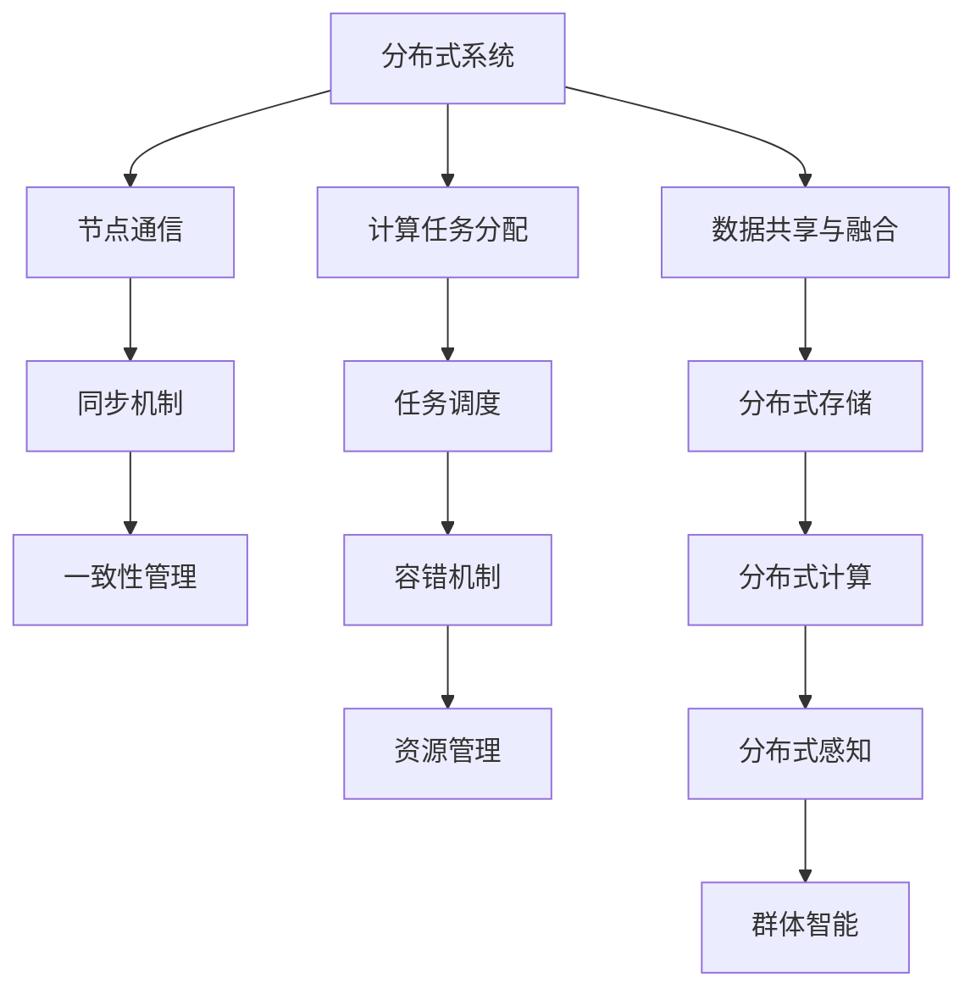
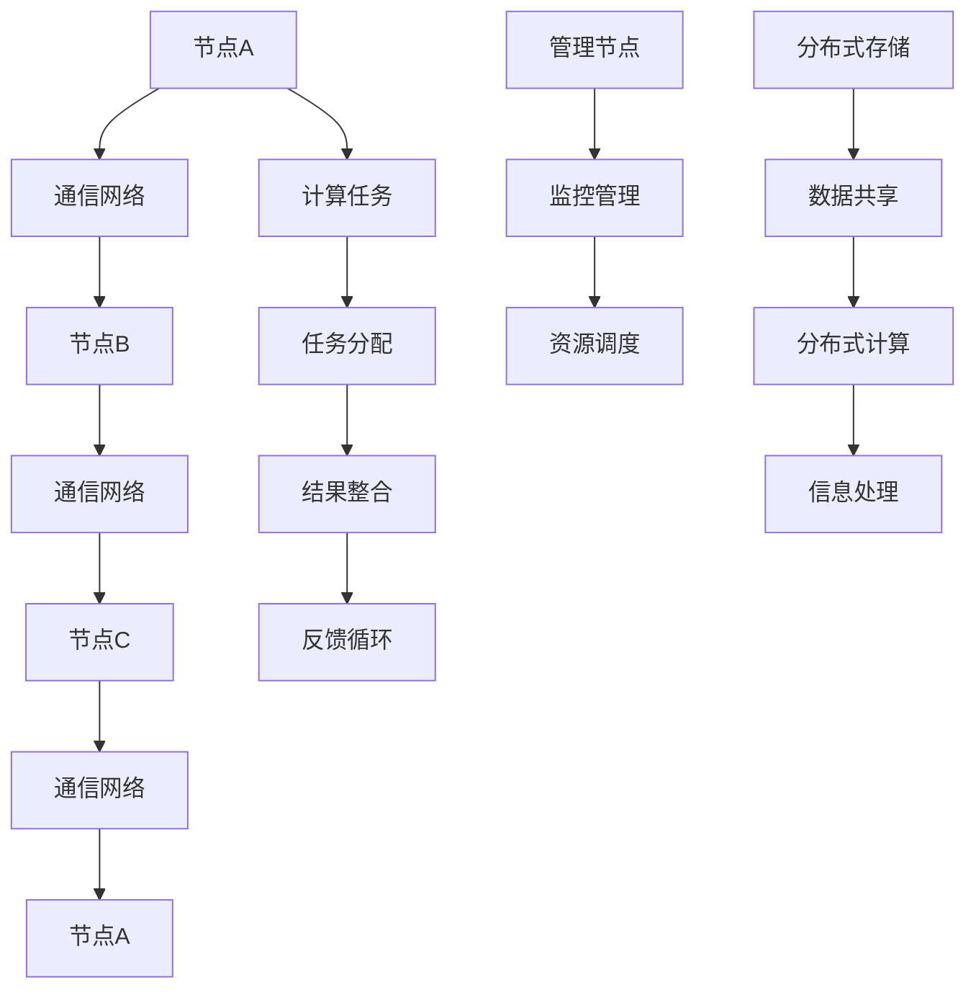

                 

### 文章标题

《分布式认知：揭开群体智慧的神秘面纱》

### 关键词

- 分布式认知
- 群体智慧
- 算法
- 数学模型
- 实际应用
- 技术实现

### 摘要

本文深入探讨了分布式认知与群体智慧这一前沿领域，从基础概念到实际应用，层层剖析其技术原理与实践方法。通过介绍分布式认知的基本原理、数学与算法基础，以及群体智慧在金融、交通和社交媒体等领域的应用案例，本文揭示了分布式认知在提升群体智能、解决复杂问题中的重要作用。此外，文章还详细讨论了技术实现中的开发实践、跨学科协作与未来挑战，为读者提供了全面而深入的指导。

---

### 第一部分：引言与概述

#### 1.1 书籍主题介绍

在信息化和全球化时代，分布式认知与群体智慧成为了科学研究和技术创新的重要方向。分布式认知是指通过分布式系统实现大规模数据的共享、处理和协同，从而形成一种基于集体智慧的智能体。群体智慧则是指个体通过协作和互动形成的整体智能，这种智能超越了个体的能力，能够在复杂环境中高效解决问题。

本书旨在深入探讨分布式认知与群体智慧这一主题，通过系统的理论阐述和实际案例分析，帮助读者全面理解这一领域的核心概念、技术原理和应用实践。本书的核心目标是揭开群体智慧的神秘面纱，揭示其背后的科学原理和技术实现途径。

#### 1.1.1 分布式认知的定义与意义

分布式认知（Distributed Cognition）是指知识处理和认知活动在多个个体或计算节点之间分布进行的过程。它强调个体与环境的互动，以及个体之间的协作。分布式认知的主要特点包括：

1. **分布式处理**：认知活动分散到多个节点，通过通信和协同实现整体计算能力。
2. **动态适应性**：系统能够根据环境变化和任务需求动态调整节点间的合作方式。
3. **资源共享**：节点之间共享数据和计算资源，提高整体效率。
4. **冗余与容错**：系统具有较高的容错性和鲁棒性，单个节点的失效不会导致整个系统的崩溃。

分布式认知的意义在于：

1. **应对复杂性问题**：分布式认知能够处理复杂、大规模的数据集，从而解决传统集中式计算难以应对的问题。
2. **提升系统效率**：通过分布式计算和协作，系统能够高效完成复杂任务。
3. **增强容错性**：分布式系统能够通过冗余设计提高系统的可靠性和稳定性。
4. **促进知识创新**：分布式认知能够激发群体智慧，推动科学发现和技术创新。

#### 1.1.2 群体智慧的概念与重要性

群体智慧（Collective Intelligence）是指通过个体间的协作和互动形成的整体智能。它强调集体行动和合作，超越个体能力的限制。群体智慧的核心特点包括：

1. **集体协作**：个体通过相互协作和互动，形成整体的智能行为。
2. **自组织**：群体智慧能够通过个体间的简单规则和反馈机制实现复杂行为。
3. **自适应**：系统能够根据环境变化和任务需求进行自适应调整。
4. **分布式决策**：群体智慧能够通过分布式决策机制处理复杂问题。

群体智慧的重要性体现在：

1. **解决复杂问题**：群体智慧能够高效解决复杂、多变的任务，提高系统处理能力。
2. **创新驱动**：群体智慧能够激发创新思维，推动科技进步和社会发展。
3. **协同效应**：个体间的协作能够产生协同效应，提升整体效能。
4. **社会价值**：群体智慧能够应用于社会管理、公共服务等领域，提高社会运行效率。

#### 1.2 研究背景与现状

分布式认知与群体智慧的研究源于对认知科学、计算机科学和社会科学的交叉探讨。近年来，随着信息技术和大数据技术的发展，分布式认知与群体智慧的研究逐渐成为热点领域。

当前，分布式认知与群体智慧的研究现状如下：

1. **理论基础**：分布式认知理论、群体智能算法和信息网络理论等为基础，形成了一整套理论框架。
2. **应用领域**：分布式认知与群体智慧在金融、交通、能源、环境、社会等多个领域得到了广泛应用。
3. **技术创新**：涌现出了众多分布式计算和群体智能算法，如遗传算法、蚁群算法、贝叶斯网络等。
4. **研究挑战**：分布式认知与群体智慧面临数据隐私、系统可靠性、资源调度等问题，需要进一步研究。

#### 1.2.1 分布式认知领域的发展历程

分布式认知的研究可以追溯到20世纪80年代，当时学者们开始探讨如何通过计算机和通信技术实现分布式智能系统。以下为分布式认知领域的发展历程：

1. **初始阶段（1980s-1990s）**：分布式认知理论开始萌芽，研究者提出了基于代理和协同的分布式计算模型，如智能代理（Intelligent Agent）和协同工作系统（Collaborative Work Systems）。
2. **发展阶段（2000s）**：随着互联网和分布式计算技术的发展，分布式认知研究得到了进一步推进。研究者提出了多种分布式认知模型，如多智能体系统（Multi-Agent Systems）和社会计算（Social Computing）。
3. **成熟阶段（2010s至今）**：分布式认知研究逐渐成熟，涌现出了大量应用成果，如智慧城市、智能交通系统、分布式数据库等。

#### 1.2.2 群体智慧研究的主要挑战

群体智慧研究面临诸多挑战，主要包括：

1. **数据隐私与安全**：分布式系统中的数据共享和处理容易导致隐私泄露和安全风险，需要有效的隐私保护和数据安全机制。
2. **系统可靠性**：分布式系统中的节点可能存在故障和异常，需要设计高效的容错和鲁棒性机制，确保系统稳定运行。
3. **资源调度**：分布式系统需要合理调度资源，以实现高效计算和协同，需要研究资源分配算法和优化策略。
4. **协调与协作**：个体间需要建立有效的协调和协作机制，以实现整体智能，需要研究协调算法和协作框架。

#### 1.3 本书结构与内容安排

本书分为六个部分，结构如下：

1. **引言与概述**：介绍分布式认知与群体智慧的核心概念、研究背景和本书结构。
2. **分布式认知核心原理**：阐述分布式系统的基本概念、群体智能与分布式认知的联系、分布式认知的架构与模型。
3. **群体智慧的数学与算法基础**：介绍群体智能中的基本算法、分布式计算中的数学模型、算法优化与调参方法。
4. **案例分析与应用**：分析分布式认知在金融、交通、社交媒体等领域的应用案例。
5. **技术实现与开发实践**：介绍分布式认知系统设计与实现、数据处理与分析流程、源代码解读与分析、跨学科协作与团队管理。
6. **未来展望与挑战**：探讨分布式认知与群体智慧的展望、面临的挑战及未来发展方向。

本书旨在通过系统性的理论阐述和实际案例分析，帮助读者深入理解分布式认知与群体智慧，掌握其核心原理和应用方法。

---

### 第一部分：引言与概述

#### 1.3 本书结构与内容安排

为了全面而系统地介绍分布式认知与群体智慧这一前沿领域，本书分为六个主要部分，每个部分都有其独特的主题和内容安排，旨在帮助读者从基础到实践，逐步深入理解这一领域的核心概念、技术原理和应用实践。

**第一部分：引言与概述**

本部分主要介绍分布式认知与群体智慧的核心概念、研究背景和本书结构。具体内容包括：

- **1.1 书籍主题介绍**：解释分布式认知和群体智慧的定义、意义以及本书的研究目的。
- **1.1.1 分布式认知的定义与意义**：详细阐述分布式认知的基本原理、特点和重要性。
- **1.1.2 群体智慧的概念与重要性**：探讨群体智慧的定义、核心特点以及在各个领域的重要作用。
- **1.2 研究背景与现状**：回顾分布式认知与群体智慧领域的发展历程，分析当前研究的主要挑战。
- **1.2.1 分布式认知领域的发展历程**：梳理分布式认知领域从初始阶段到成熟阶段的发展脉络。
- **1.2.2 群体智慧研究的主要挑战**：探讨分布式认知与群体智慧研究面临的关键挑战。
- **1.3 本书结构与内容安排**：概述本书的整体结构，包括各部分的概述和主要内容。

**第二部分：分布式认知核心原理**

本部分重点阐述分布式认知的基本原理和核心概念。具体内容包括：

- **2.1 分布式系统的基本概念**：介绍分布式系统的定义、特点、节点通信与同步机制等。
- **2.2 群体智能与分布式认知的联系**：探讨群体智能的定义、类型以及分布式认知在群体智能中的应用。
- **2.3 分布式认知的架构与模型**：分析分布式认知模型的分类、常见模型及其优缺点，并提供Mermaid流程图以展示模型框架。

**第三部分：群体智慧的数学与算法基础**

本部分介绍群体智慧中的基本算法、数学模型以及优化方法。具体内容包括：

- **3.1 群体智能中的基本算法**：讨论分散优化算法、遗传算法、蚁群算法等。
- **3.2 分布式计算中的数学模型**：介绍线性代数、概率论和信息论的基础知识。
- **3.3 群体智能算法的优化与调参**：探讨参数优化方法、实验设计与分析，并给出伪代码示例。

**第四部分：案例分析与应用**

本部分通过具体案例分析，展示分布式认知在不同领域的应用。具体内容包括：

- **4.1 分布式认知在金融领域的应用**：探讨分布式认知在金融风险管理、投资组合优化中的应用。
- **4.2 分布式认知在交通管理中的应用**：分析分布式认知在智能交通系统、交通流量预测与优化中的应用。
- **4.3 分布式认知在社交媒体分析中的应用**：讨论分布式认知在社交网络分析、情感分析与趋势预测中的应用。

**第五部分：技术实现与开发实践**

本部分介绍分布式认知系统的设计与实现、开发实践以及跨学科协作。具体内容包括：

- **5.1 开发环境搭建**：选择合适的操作系统、开发工具和编程语言框架。
- **5.2 实际案例实现**：详细描述分布式认知系统的设计与实现，包括数据处理与分析流程。
- **5.3 源代码解读与分析**：解读具体代码模块的功能，提出优化建议。
- **5.4 跨学科协作与团队管理**：探讨跨学科知识融合、项目管理和团队协作的重要性。

**第六部分：未来展望与挑战**

本部分展望分布式认知与群体智慧的未来发展，分析当前面临的挑战和解决方案。具体内容包括：

- **6.1 分布式认知与群体智慧的展望**：探讨新兴应用领域的探索和未来发展方向。
- **6.2 当前面临的挑战与解决方案**：分析数据隐私与安全、系统可靠性、资源调度等问题，并提出相应的解决方案。

通过以上六个部分的系统介绍，本书旨在为读者提供一个全面而深入的分布式认知与群体智慧的知识体系，帮助读者掌握这一领域的核心原理和实践方法。

### 第二部分：分布式认知核心原理

#### 2.1 分布式系统的基本概念

分布式系统（Distributed System）是由多个独立的计算节点组成，通过通信网络连接，协同完成计算任务的一个系统。在分布式系统中，节点可以是计算机、服务器或其他设备，它们可以通过网络进行通信和数据交换。分布式系统具有以下几个基本概念和特点：

1. **节点自治**：分布式系统中的每个节点都具有自治能力，可以独立运行、管理自身资源和处理任务。节点之间的协作是通过相互通信来实现的，每个节点只需要知道与之直接相连的其他节点即可。
   
2. **通信网络**：分布式系统中的节点通过通信网络进行数据传输和信息交换。网络可以是局域网、广域网或互联网，其性能和稳定性对系统的整体效率有重要影响。

3. **分布式计算**：分布式系统通过将任务分散到多个节点上并行处理，从而提高计算效率和系统负载均衡。分布式计算可以通过任务分配、负载均衡和任务调度等技术实现。

4. **一致性**：在分布式系统中，多个节点可能同时更新数据，导致数据不一致的问题。为了确保系统的正确性和一致性，分布式系统需要实现数据复制、版本控制和一致性协议。

5. **容错性**：分布式系统具有较高的容错性，可以通过冗余设计和故障转移机制来应对节点故障，保证系统的稳定运行。

#### 2.1.1 节点通信与同步机制

节点通信是分布式系统中的关键组成部分，决定了节点之间的协作效率和系统整体性能。节点通信的主要机制包括：

1. **点对点通信**：点对点通信是指两个节点之间直接进行数据交换。点对点通信可以通过消息队列、远程过程调用（RPC）或直接网络通信等方式实现。

2. **广播通信**：广播通信是指一个节点向所有其他节点发送消息。广播通信适用于需要全局一致性的场景，如状态同步和事件通知。

3. **组通信**：组通信是指一组节点之间进行数据交换。组通信可以通过多播或广播实现，适用于分布式系统中的协作任务。

同步机制是确保分布式系统中节点间数据一致性的一种手段。常见的同步机制包括：

1. **时间同步**：通过时钟同步协议，确保分布式系统中各节点的时钟保持一致。常用的时间同步协议包括NTP（Network Time Protocol）和GPS（Global Positioning System）。

2. **锁机制**：锁机制用于解决分布式系统中并发访问共享资源的问题。常见的锁机制包括分布式锁、乐观锁和悲观锁。

3. **版本控制**：版本控制通过记录数据的历史版本，确保分布式系统中的数据一致性。常见的版本控制协议包括矢量时钟（Vector Clock）和拉姆达算法（Lamport's Logical Clock）。

#### 2.2 群体智能与分布式认知的联系

群体智能（Collective Intelligence）是指通过个体间的协作和互动形成的整体智能。群体智能的研究旨在探索个体如何通过合作和相互影响，形成一个具有超越个体智能的集体。群体智能与分布式认知有着密切的联系，主要体现在以下几个方面：

1. **分布式计算与群体智能**：分布式认知强调认知活动在多个节点之间的分布进行，这与群体智能中的个体协作和协同计算有相似之处。分布式计算能够支持群体智能中的大规模数据处理和复杂问题求解。

2. **信息共享与通信**：分布式认知依赖于节点间的信息共享和通信，这与群体智能中的信息传递和互动机制相呼应。群体智能通过信息共享，使个体能够获得全局信息，从而做出更明智的决策。

3. **自适应性与动态调整**：分布式认知系统具有动态适应性和自组织能力，这与群体智能中的自适应性和自组织行为相似。群体智能通过个体的自适应行为，能够快速适应环境变化和任务需求。

4. **冗余与容错**：分布式认知系统通过冗余设计提高容错性和鲁棒性，这与群体智能中的冗余机制和容错策略有相同的目标。群体智能通过个体的冗余和协作，能够应对个体故障和环境变化。

#### 2.2.1 群体智能的定义与类型

群体智能是指通过个体间的协作和互动形成的整体智能。群体智能可以看作是一种分布式认知，其中个体通过相互交流和协作，共同实现复杂任务。群体智能的定义可以归纳为以下几点：

1. **协作与互动**：群体智能依赖于个体间的协作和互动，个体通过相互沟通和协调，形成一个整体智能体。
2. **自组织**：群体智能通过简单的个体规则和局部互动，实现复杂的全局行为，具有自组织能力。
3. **适应性**：群体智能能够根据环境变化和任务需求进行自适应调整，具备动态适应性。

群体智能可以分为以下几种类型：

1. **同步型群体智能**：同步型群体智能通过同步机制，使个体在相同的时间步进行计算和决策，如同步神经网络。
2. **异步型群体智能**：异步型群体智能允许个体在不同时间步进行计算和决策，如异步多智能体系统。
3. **混合型群体智能**：混合型群体智能结合了同步和异步机制，根据任务需求灵活选择同步或异步计算，如混合多智能体系统。

#### 2.2.2 分布式认知在群体智能中的应用

分布式认知在群体智能中有着广泛的应用，主要体现在以下几个方面：

1. **任务分配与协同**：分布式认知能够实现任务的分配和协同，通过将复杂任务分解为多个子任务，分配给不同的节点或个体，从而提高整体计算效率和任务完成速度。例如，在分布式搜索引擎中，分布式认知可以实现关键词的并行搜索和结果整合。
2. **数据共享与融合**：分布式认知支持节点间的数据共享和融合，通过共享全局数据和信息，使个体能够获得更全面和准确的信息，从而做出更明智的决策。例如，在分布式预测系统中，分布式认知可以实现数据的分布式采集、处理和融合，提高预测的准确性和实时性。
3. **自适应性与优化**：分布式认知通过自适应性和优化机制，能够根据任务需求和环境变化，动态调整个体的行为和策略。例如，在智能交通系统中，分布式认知可以实现交通流量的实时预测和优化，提高交通运行效率和减少拥堵。
4. **容错性与鲁棒性**：分布式认知通过冗余设计和容错机制，能够提高系统的可靠性和鲁棒性，应对个体故障和环境变化。例如，在分布式计算平台中，分布式认知可以实现任务的动态重分配和故障恢复，保证系统的高可用性。

#### 2.3 分布式认知的架构与模型

分布式认知的架构和模型是理解和设计分布式认知系统的基础。以下将介绍几种常见的分布式认知模型及其特点，并提供一个Mermaid流程图，以展示分布式认知模型的基本框架。

##### 2.3.1 分布式认知模型的分类

分布式认知模型可以根据不同的分类标准进行分类，以下为几种常见的分类方法：

1. **基于节点的分类**：根据节点的类型和功能，可以将分布式认知模型分为以下几类：
   - **计算节点**：负责执行计算任务的节点，如数据处理节点、分析节点等。
   - **通信节点**：负责节点间通信和数据传输的节点，如路由器、交换机等。
   - **管理节点**：负责系统管理、监控和调度的节点，如主控节点、调度节点等。

2. **基于层次的分类**：根据系统的层次结构，可以将分布式认知模型分为以下几类：
   - **物理层**：负责物理设备和网络连接的层次。
   - **网络层**：负责节点间通信和数据传输的层次。
   - **应用层**：负责实际应用任务的处理和实现的层次。

3. **基于功能的分类**：根据系统的功能特点，可以将分布式认知模型分为以下几类：
   - **分布式计算模型**：侧重于计算任务的分配和协同。
   - **分布式存储模型**：侧重于数据的存储和共享。
   - **分布式感知模型**：侧重于感知数据和信息的处理。

##### 2.3.2 常见的分布式认知模型解析

以下介绍几种常见的分布式认知模型：

1. **多智能体系统（MAS）**：多智能体系统是由多个智能体（Agent）组成的分布式系统，每个智能体具有自主性、社交性和反应性等特点。智能体可以通过通信和协作实现复杂任务。常见的MAS模型包括：
   - **基于知识的MAS**：智能体通过知识共享和推理进行协作。
   - **基于行为的MAS**：智能体通过预设的行为规则进行协作。
   - **混合型MAS**：结合基于知识和基于行为的MAS，实现更复杂的协作。

2. **分布式计算模型**：分布式计算模型主要关注计算任务的分配和协同。常见的分布式计算模型包括：
   - **MapReduce**：由Google提出的一种分布式数据处理模型，通过Map和Reduce两个阶段实现大规模数据处理。
   - **分布式图计算**：基于图论的分布式计算模型，适用于处理大规模图数据，如分布式图算法和分布式图数据库。
   - **分布式机器学习**：通过分布式计算实现机器学习算法的并行训练，提高训练效率和准确度。

3. **分布式存储模型**：分布式存储模型关注数据的存储和共享，提高数据存储的可靠性和访问效率。常见的分布式存储模型包括：
   - **分布式文件系统**：如HDFS（Hadoop Distributed File System）、Ceph等，实现大文件的高效存储和分布式访问。
   - **分布式数据库**：如MongoDB、Cassandra等，支持分布式数据存储和查询。
   - **分布式缓存**：如Redis Cluster、Memcached Cluster等，实现分布式数据的缓存和快速访问。

##### 2.3.3 Mermaid流程图：分布式认知模型框架

以下是一个简单的Mermaid流程图，展示分布式认知模型的基本框架：



这个流程图展示了分布式认知模型的主要组成部分和它们之间的关系。通过这个框架，可以更好地理解和设计分布式认知系统，实现高效的分布式计算和协作。

---

### 第二部分：分布式认知核心原理

#### 2.1 分布式系统的基本概念

分布式系统是由多个独立节点组成的系统，这些节点通过通信网络进行互联，共同完成复杂的计算任务。分布式系统的核心思想是将任务分解为多个子任务，分布到不同的节点上并行处理，从而提高计算效率、系统容错性和可扩展性。下面我们将详细介绍分布式系统的定义、特点以及节点通信与同步机制。

##### 2.1.1 分布式系统的定义与特点

**定义**：分布式系统是由多个独立的计算节点组成的系统，这些节点通过通信网络互联，协同工作以完成共同的任务。每个节点都有独立的计算资源和存储资源，能够自主运行和执行任务。

**特点**：
1. **并行处理**：分布式系统能够将大任务分解为多个小任务，分布到不同节点上并行处理，从而提高计算效率。
2. **容错性**：分布式系统具有较高的容错性，可以通过冗余设计、故障转移等机制，确保系统在单个节点故障时仍能正常运行。
3. **可扩展性**：分布式系统可以轻松扩展，通过增加节点来提高系统的计算能力和存储容量。
4. **数据共享**：分布式系统中的节点可以通过通信网络共享数据和资源，实现大规模数据处理和协同工作。
5. **异构性**：分布式系统中的节点可能具有不同的硬件配置、操作系统和软件环境，系统需要具备兼容性和适配性。

##### 2.1.2 节点通信与同步机制

**节点通信**：
1. **点对点通信**：点对点通信是指两个节点之间直接进行数据交换。常见的点对点通信方式包括直接网络连接、消息队列和远程过程调用（RPC）。
2. **广播通信**：广播通信是指一个节点向所有其他节点发送消息。广播通信适用于需要全局一致性的场景，如状态同步和事件通知。
3. **组通信**：组通信是指一组节点之间进行数据交换。组通信可以通过多播或广播实现，适用于分布式系统中的协作任务。

**同步机制**：
1. **时间同步**：时间同步是确保分布式系统中各节点的时钟保持一致的重要机制。常用的时间同步协议包括NTP（Network Time Protocol）和GPS（Global Positioning System）。
2. **锁机制**：锁机制用于解决分布式系统中并发访问共享资源的问题。常见的锁机制包括分布式锁、乐观锁和悲观锁。
3. **版本控制**：版本控制通过记录数据的历史版本，确保分布式系统中的数据一致性。常见的版本控制协议包括矢量时钟（Vector Clock）和拉姆达算法（Lamport's Logical Clock）。

##### 2.1.3 分布式系统的结构

分布式系统通常由以下几个基本组件组成：

1. **节点**：节点是分布式系统中的基本计算单元，负责执行具体的计算任务。节点可以是计算机、服务器或其他设备。
2. **通信网络**：通信网络是连接节点的纽带，负责节点间的数据传输和通信。网络可以是局域网、广域网或互联网。
3. **协调与管理**：协调与管理组件负责任务分配、资源调度、故障检测与恢复等，确保系统的稳定运行。

##### 2.1.4 分布式系统的优势与挑战

**优势**：
1. **计算效率**：分布式系统可以将任务分布到多个节点并行处理，提高计算效率。
2. **容错性**：分布式系统通过冗余设计和故障转移机制，提高系统的容错性和鲁棒性。
3. **可扩展性**：分布式系统可以轻松扩展，通过增加节点来提高系统的计算能力和存储容量。
4. **数据共享**：分布式系统中的节点可以通过通信网络共享数据和资源，实现大规模数据处理和协同工作。

**挑战**：
1. **数据一致性**：分布式系统中的多个节点可能同时更新数据，导致数据不一致的问题。
2. **通信开销**：节点间的通信可能会增加系统的通信开销，影响整体性能。
3. **节点故障**：分布式系统中的节点可能会发生故障，导致系统可用性降低。
4. **资源调度**：分布式系统需要合理调度资源，以实现高效计算和协同，需要研究资源分配算法和优化策略。

通过上述对分布式系统基本概念、节点通信与同步机制以及系统结构的介绍，我们可以更好地理解分布式系统的设计和实现原理。在接下来的章节中，我们将进一步探讨群体智能与分布式认知的联系，以及分布式认知的核心架构与模型。

#### 2.2 群体智能与分布式认知的联系

群体智能（Collective Intelligence，CI）和分布式认知（Distributed Cognition，DC）是两个在认知科学、计算机科学和社会科学等领域广泛研究的概念。它们之间有着密切的联系，共同构成了理解复杂系统中集体行为和智能表现的关键框架。

##### 2.2.1 群体智能的定义与类型

群体智能是指由多个个体通过协作、相互影响和共享信息而形成的整体智能表现。这些个体可以是人类、动物、机器人或软件代理。群体智能的特点包括：

1. **协作性**：个体之间通过相互协作来完成复杂任务，每个个体的行为都是整体智能表现的一部分。
2. **自组织性**：群体智能的形成不需要外部指令或控制，而是通过个体之间的简单规则和局部互动实现的。
3. **适应性**：群体智能能够根据环境变化和任务需求进行自适应调整，以保持整体性能。

群体智能可以分为以下几种类型：

1. **同步型群体智能**：个体在相同的时间步进行计算和决策，例如同步神经网络。
2. **异步型群体智能**：个体在不同的时间步进行计算和决策，例如异步多智能体系统。
3. **混合型群体智能**：结合同步和异步机制，根据任务需求灵活选择同步或异步计算。

##### 2.2.2 分布式认知在群体智能中的应用

分布式认知是指在多个个体或计算节点之间分布进行的知识处理和认知活动。它强调个体与环境的互动以及个体之间的协作。分布式认知在群体智能中的应用主要体现在以下几个方面：

1. **任务分配与协同**：分布式认知能够实现任务的分配和协同，将复杂任务分解为多个子任务，分配给不同的节点或个体，从而提高整体计算效率和任务完成速度。例如，在分布式搜索引擎中，分布式认知可以实现关键词的并行搜索和结果整合。

2. **数据共享与融合**：分布式认知支持节点间的数据共享和融合，通过共享全局数据和信息，使个体能够获得更全面和准确的信息，从而做出更明智的决策。例如，在分布式预测系统中，分布式认知可以实现数据的分布式采集、处理和融合，提高预测的准确性和实时性。

3. **自适应性与优化**：分布式认知通过自适应性和优化机制，能够根据任务需求和环境变化，动态调整个体的行为和策略。例如，在智能交通系统中，分布式认知可以实现交通流量的实时预测和优化，提高交通运行效率和减少拥堵。

4. **容错性与鲁棒性**：分布式认知通过冗余设计和容错机制，能够提高系统的可靠性和鲁棒性，应对个体故障和环境变化。例如，在分布式计算平台中，分布式认知可以实现任务的动态重分配和故障恢复，保证系统的高可用性。

##### 2.2.3 分布式认知与群体智能的关系

分布式认知与群体智能的关系可以看作是部分与整体的关系。分布式认知是群体智能实现的基础，而群体智能是分布式认知在复杂系统中的具体应用。

1. **基础性**：分布式认知提供了实现群体智能的机制和技术手段，如任务分配、数据共享、协同计算等。没有分布式认知，群体智能的实现将受到限制。

2. **互补性**：群体智能通过分布式认知实现了个体之间的协作和互动，而分布式认知则通过群体智能展示了其在复杂系统中的巨大潜力和应用价值。

3. **互动性**：分布式认知与群体智能之间存在互动性。分布式认知的技术进步可以推动群体智能的发展，而群体智能的应用需求又可以促进分布式认知技术的创新和优化。

综上所述，分布式认知与群体智能是相互促进、共同发展的关系。通过理解它们之间的联系，我们可以更好地设计和实现分布式认知系统，推动群体智能在各个领域的应用和发展。

#### 2.3 分布式认知的架构与模型

分布式认知的架构与模型是理解和设计分布式认知系统的核心。这些模型通过定义节点间的交互、信息共享和任务分配方式，使得分布式系统能够高效地处理复杂任务。以下将介绍几种常见的分布式认知模型，并使用Mermaid流程图展示其基本框架。

##### 2.3.1 分布式认知模型的分类

分布式认知模型可以根据不同的分类标准进行分类，以下为几种常见的分类方法：

1. **基于节点的分类**：根据节点的类型和功能，可以将分布式认知模型分为以下几类：
   - **计算节点**：负责执行计算任务的节点，如数据处理节点、分析节点等。
   - **通信节点**：负责节点间通信和数据传输的节点，如路由器、交换机等。
   - **管理节点**：负责系统管理、监控和调度的节点，如主控节点、调度节点等。

2. **基于层次的分类**：根据系统的层次结构，可以将分布式认知模型分为以下几类：
   - **物理层**：负责物理设备和网络连接的层次。
   - **网络层**：负责节点间通信和数据传输的层次。
   - **应用层**：负责实际应用任务的处理和实现的层次。

3. **基于功能的分类**：根据系统的功能特点，可以将分布式认知模型分为以下几类：
   - **分布式计算模型**：侧重于计算任务的分配和协同。
   - **分布式存储模型**：侧重于数据的存储和共享。
   - **分布式感知模型**：侧重于感知数据和信息的处理。

##### 2.3.2 常见的分布式认知模型解析

以下介绍几种常见的分布式认知模型：

1. **多智能体系统（MAS）**：多智能体系统是由多个智能体（Agent）组成的分布式系统，每个智能体具有自主性、社交性和反应性等特点。智能体可以通过通信和协作实现复杂任务。常见的MAS模型包括：
   - **基于知识的MAS**：智能体通过知识共享和推理进行协作。
   - **基于行为的MAS**：智能体通过预设的行为规则进行协作。
   - **混合型MAS**：结合基于知识和基于行为的MAS，实现更复杂的协作。

2. **分布式计算模型**：分布式计算模型主要关注计算任务的分配和协同。常见的分布式计算模型包括：
   - **MapReduce**：由Google提出的一种分布式数据处理模型，通过Map和Reduce两个阶段实现大规模数据处理。
   - **分布式图计算**：基于图论的分布式计算模型，适用于处理大规模图数据，如分布式图算法和分布式图数据库。
   - **分布式机器学习**：通过分布式计算实现机器学习算法的并行训练，提高训练效率和准确度。

3. **分布式存储模型**：分布式存储模型关注数据的存储和共享，提高数据存储的可靠性和访问效率。常见的分布式存储模型包括：
   - **分布式文件系统**：如HDFS（Hadoop Distributed File System）、Ceph等，实现大文件的高效存储和分布式访问。
   - **分布式数据库**：如MongoDB、Cassandra等，支持分布式数据存储和查询。
   - **分布式缓存**：如Redis Cluster、Memcached Cluster等，实现分布式数据的缓存和快速访问。

##### 2.3.3 Mermaid流程图：分布式认知模型框架

以下是一个简单的Mermaid流程图，展示分布式认知模型的基本框架：



这个流程图展示了分布式认知模型的主要组成部分和它们之间的关系。通过这个框架，可以更好地理解和设计分布式认知系统，实现高效的分布式计算和协作。

---

### 第三部分：群体智慧的数学与算法基础

#### 3.1 群体智能中的基本算法

在群体智能（Collective Intelligence）的研究和应用中，基本算法起着至关重要的作用。这些算法通过模拟自然界中的群体行为，如社会昆虫的觅食、动物的迁徙以及人类的社会互动，来实现复杂的任务和决策。以下将介绍几种常见的群体智能算法，包括分散优化算法、遗传算法和蚁群算法。

##### 3.1.1 分散优化算法

分散优化算法（Decentralized Optimization Algorithms）是一类通过分布式计算实现优化目标的算法。它们通常不需要全局信息，而是通过局部信息交换和简单规则实现全局优化。

1. **基本概念**：
   - **目标函数**：分散优化算法的目标是找到目标函数的最优值或近似最优值。
   - **局部搜索**：算法通过在当前解的邻域内搜索最优解，逐步接近全局最优解。

2. **常见算法**：
   - **粒子群优化（Particle Swarm Optimization, PSO）**：粒子群优化通过模拟鸟群觅食行为，通过粒子的速度和位置更新实现优化。
   - **人工势场法（Artificial Potential Field, APF）**：人工势场法通过构建虚拟势场，引导个体避开障碍物并趋向目标。

3. **算法流程**：
   - **初始化**：随机生成多个粒子，每个粒子代表一个可能的解。
   - **迭代**：每个粒子根据自身历史最优位置和全局最优位置更新速度和位置。
   - **终止条件**：当满足一定迭代次数或目标函数收敛时，算法终止。

##### 3.1.2 遗传算法

遗传算法（Genetic Algorithms, GAs）是基于自然选择和遗传机制的优化算法。它模拟生物进化过程，通过选择、交叉和变异等操作，逐步优化解空间中的个体。

1. **基本概念**：
   - **染色体**：个体用染色体表示，染色体的基因编码了个体特征的参数。
   - **适应度函数**：适应度函数评估个体的优劣，通常与目标函数相关。

2. **常见算法**：
   - **标准遗传算法**：采用二进制编码，使用选择、交叉和变异操作。
   - **实数遗传算法**：使用实数编码，适用于连续优化问题。

3. **算法流程**：
   - **初始化**：随机生成初始种群。
   - **评估适应度**：计算每个个体的适应度值。
   - **选择**：根据适应度值选择优秀的个体。
   - **交叉**：将选中个体进行交叉操作，生成新的后代。
   - **变异**：对后代个体进行变异操作，增加搜索多样性。
   - **更新种群**：将后代个体替换原种群，继续迭代。

##### 3.1.3 蚁群算法

蚁群算法（Ant Colony Optimization, ACO）是基于蚂蚁觅食行为原理的优化算法。蚂蚁在寻找食物的过程中通过释放信息素来标记路径，其他蚂蚁倾向于选择信息素浓度较高的路径，从而实现路径优化。

1. **基本概念**：
   - **信息素**：蚂蚁在路径上释放的化学物质，用于标记和引导其他蚂蚁。
   - **启发因子**：蚂蚁选择路径时考虑的两个因素，包括信息素浓度和路径的启发值。

2. **常见算法**：
   - **基本蚁群算法**：基于信息素更新和启发因子，实现路径优化。
   - **蚁群系统**：在基本蚁群算法基础上，引入多个蚁群进行协同搜索。

3. **算法流程**：
   - **初始化**：设置信息素初始浓度和启发因子。
   - **路径搜索**：蚂蚁根据信息素浓度和启发因子选择路径。
   - **信息素更新**：蚂蚁在路径上留下信息素，更新路径信息素浓度。
   - **迭代**：蚂蚁反复进行路径搜索和信息素更新，直至满足终止条件。

通过介绍分散优化算法、遗传算法和蚁群算法，我们可以看到群体智能算法的多样性和应用广度。这些算法不仅在理论研究中具有重要地位，也在实际应用中展示了巨大的潜力。在接下来的章节中，我们将进一步探讨分布式计算中的数学模型，为理解和应用群体智能算法提供更坚实的理论基础。

#### 3.2 分布式计算中的数学模型

分布式计算中的数学模型为群体智能算法的设计和实现提供了理论基础。这些模型包括线性代数、概率论和信息论等基础数学工具，它们在分布式计算系统中用于描述数据的存储、传输和处理过程。以下将详细介绍这些数学模型的基础知识，并展示其在分布式计算中的应用。

##### 3.2.1 线性代数基础

线性代数是处理线性方程组、矩阵和向量的数学分支，广泛应用于分布式计算系统中。

1. **矩阵与向量**：
   - **矩阵**：矩阵是一个二维数组，用于表示数据关系和变换。例如，在分布式系统中，矩阵可以表示节点的状态、资源的分配等。
   - **向量**：向量是一个一维数组，用于表示数据集合。例如，在分布式系统中，向量可以表示节点的负载、任务进度等。

2. **矩阵运算**：
   - **矩阵加法与减法**：两个矩阵对应元素相加或相减。
   - **矩阵乘法**：两个矩阵按照一定的规则相乘，结果是一个新矩阵。
   - **矩阵求逆**：对于可逆矩阵，可以求得其逆矩阵，用于解决线性方程组。

3. **线性变换**：
   - **线性变换**：矩阵或向量对数据进行的线性变换，如数据的标准化、特征提取等。

4. **线性方程组**：
   - **求解线性方程组**：使用高斯消元法、矩阵求逆等方法求解线性方程组。

在线性代数的应用中，分布式计算系统常用矩阵表示节点的状态和信息，通过矩阵运算实现数据的存储、传输和更新。例如，在分布式数据库中，矩阵可以表示数据的分布和复制策略；在分布式计算框架中，矩阵可以用于任务的分配和负载均衡。

##### 3.2.2 概率论基础

概率论是研究随机事件及其概率分布的数学分支，在分布式计算系统中用于描述节点的状态、事件的发生概率等。

1. **随机变量与概率分布**：
   - **随机变量**：随机变量是随机试验结果的数学表示，可以取不同的值。
   - **概率分布**：概率分布描述了随机变量取不同值的概率，常见的有均匀分布、正态分布等。

2. **条件概率与贝叶斯定理**：
   - **条件概率**：在已知某个事件发生的条件下，另一个事件发生的概率。
   - **贝叶斯定理**：用于计算后验概率，是贝叶斯统计方法的基础。

3. **随机变量的独立性**：
   - **独立性**：两个随机变量相互独立，即一个变量的取值不影响另一个变量的取值。

概率论在分布式计算中的应用包括：

- **节点可靠性评估**：通过概率模型评估节点的可靠性和故障概率。
- **数据分布分析**：分析分布式系统中的数据分布，优化资源分配和负载均衡策略。
- **错误检测与恢复**：通过概率模型检测和恢复分布式系统中的错误。

##### 3.2.3 信息论基础

信息论是研究信息传输、处理和存储的数学分支，提供了衡量信息量的方法和优化信息传输的准则。

1. **信息量与熵**：
   - **信息量**：描述信息携带的能力，通常用比特（bit）表示。
   - **熵**：描述随机变量的不确定性，熵值越高，信息量越大。

2. **信道编码与解码**：
   - **信道编码**：通过编码技术提高信息传输的可靠性和抗干扰能力。
   - **信道解码**：接收端对编码信息进行解码，恢复原始信息。

3. **信息率与带宽**：
   - **信息率**：单位时间内传输的信息量。
   - **带宽**：信道能够传输的最大信息率。

信息论在分布式计算中的应用包括：

- **数据压缩**：通过信息论方法降低数据传输量，提高传输效率。
- **网络优化**：优化网络拓扑和传输路径，提高信息传输的可靠性和带宽利用率。
- **分布式感知**：通过信息论优化分布式系统的感知能力和数据共享策略。

通过介绍线性代数、概率论和信息论的基础知识，我们可以看到这些数学模型在分布式计算系统中的广泛应用。这些模型不仅为群体智能算法提供了理论基础，也为分布式系统的设计和优化提供了重要的工具。在接下来的章节中，我们将进一步探讨群体智能算法的优化与调参方法，以实现更高效和准确的分布式计算。

#### 3.3 群体智能算法的优化与调参

在群体智能算法（如粒子群优化、遗传算法和蚁群算法）的应用中，优化和调参是提高算法性能和收敛速度的关键步骤。通过合理的优化和调参，可以显著提升算法的效率和准确性，从而更好地解决复杂问题。以下将介绍几种常见的优化和调参方法，并给出具体的伪代码示例，以帮助读者理解和实践。

##### 3.3.1 参数优化方法

参数优化是群体智能算法调参的重要环节，合理的参数设置对算法的性能有直接影响。以下是一些常见的参数优化方法：

1. **经验法则**：根据以往经验和实验结果，手动调整参数。这种方法简单直观，但缺乏系统性和科学性。

2. **网格搜索**：在参数空间中定义一个网格，对每个参数组合进行评估，选择最优参数组合。这种方法较为全面，但计算量大。

3. **贝叶斯优化**：利用贝叶斯统计模型，通过历史评估结果预测最优参数组合。这种方法在有限的评估次数下能够快速找到最优参数。

4. **遗传算法优化**：使用遗传算法对参数进行优化，通过交叉、变异等操作逐步逼近最优参数。这种方法适合复杂参数空间，但计算成本较高。

伪代码示例：

```python
# 贝叶斯优化伪代码
def bayesian_optimization(objective, bounds, n_iterations):
    """
    贝叶斯优化算法
    :param objective: 目标函数
    :param bounds: 参数范围
    :param n_iterations: 迭代次数
    :return: 最优参数
    """
    # 初始化贝叶斯模型
    model = BayesianModel(objective, bounds)
    # 迭代搜索最优参数
    for _ in range(n_iterations):
        # 生成新的参数点
        x_new = model.sample_new_point()
        # 计算目标函数值
        f_new = objective(x_new)
        # 更新模型
        model.update_model(x_new, f_new)
        # 获取当前最优参数
        best_x, best_f = model.get_best_point()
    return best_x, best_f
```

##### 3.3.2 实验设计与分析

在群体智能算法的应用中，实验设计和分析是验证算法性能和优化策略的重要手段。以下是一些常见的实验设计和分析方法：

1. **单因素实验**：针对单一参数进行多个水平测试，分析不同参数设置下的算法性能。

2. **多因素实验**：针对多个参数进行组合测试，分析不同参数组合对算法性能的影响。

3. **方差分析（ANOVA）**：用于比较不同实验组之间的差异，判断实验结果的显著性。

4. **回归分析**：通过建立参数与算法性能之间的回归模型，预测不同参数设置下的算法性能。

伪代码示例：

```python
# 单因素实验伪代码
def single_factor_experiment(objective, param, levels):
    """
    单因素实验
    :param objective: 目标函数
    :param param: 调参参数
    :param levels: 参数水平
    :return: 各水平下的性能指标
    """
    results = []
    for level in levels:
        # 设置参数水平
        param_value = level
        # 运行算法
        performance = objective(param_value)
        # 记录结果
        results.append((level, performance))
    return results

# 方差分析伪代码
def anova_analysis(results):
    """
    方差分析
    :param results: 实验结果
    :return: 方差分析结果
    """
    # 计算均值
    means = [performance[1] for performance in results]
    mean = sum(means) / len(means)
    # 计算方差
    variances = [(performance[1] - mean) ** 2 for performance in results]
    variance = sum(variances) / len(variances)
    # 方差分析结果
    anova_result = {'means': means, 'variance': variance}
    return anova_result
```

##### 3.3.3 伪代码：群体智能算法示例

以下是一个简单的伪代码示例，展示如何应用参数优化方法对粒子群优化算法进行调参。

```python
# 粒子群优化算法伪代码
def particle_swarm_optimization(objective, particles, max_iterations, param_bounds):
    """
    粒子群优化算法
    :param objective: 目标函数
    :param particles: 粒子群
    :param max_iterations: 最大迭代次数
    :param param_bounds: 参数范围
    :return: 最优解
    """
    # 初始化粒子群
    for particle in particles:
        particle.initialize(param_bounds)
    # 初始化全局最优解
    global_best = None
    for particle in particles:
        if global_best is None or objective(particle.position) < objective(global_best.position):
            global_best = particle
    
    # 迭代优化
    for _ in range(max_iterations):
        # 更新粒子速度和位置
        for particle in particles:
            particle.update_velocity(global_best.position)
            particle.update_position()
        # 评估当前最优解
        current_best = None
        for particle in particles:
            if current_best is None or objective(particle.position) < objective(current_best.position):
                current_best = particle
        # 调用参数优化方法
        param_optimization = bayesian_optimization(objective, param_bounds, 10)
        # 更新参数范围
        param_bounds = param_optimization[1]
        # 输出当前最优解
        if current_best != global_best:
            global_best = current_best
            print(f"iteration {_}, best solution: {global_best.position}, objective value: {objective(global_best.position)}")
    
    return global_best.position

# 示例应用
particles = [Particle() for _ in range(50)]
best_solution = particle_swarm_optimization(objective, particles, 100, [(-5, 5), (-5, 5)]) 
print(f"Final best solution: {best_solution}, objective value: {objective(best_solution)}")
```

通过上述伪代码示例，我们可以看到如何使用参数优化方法对粒子群优化算法进行调参，从而提高算法的性能和收敛速度。这些方法和技巧在群体智能算法的实际应用中具有重要意义，有助于解决复杂的优化问题。

---

### 第四部分：案例分析与应用

#### 4.1 分布式认知在金融领域的应用

分布式认知在金融领域的应用具有深远的影响，尤其是在金融风险管理、投资组合优化和信用评估等方面。通过分布式认知，金融机构能够更好地处理大规模数据、预测市场趋势和降低风险，从而提升运营效率和市场竞争力。

##### 4.1.1 金融风险管理中的应用

金融风险管理是金融机构的核心任务之一，分布式认知技术在这一领域的应用主要体现在以下几个方面：

1. **风险模型的分布式计算**：金融机构通常需要处理大量的历史数据来构建风险模型。通过分布式认知，可以将风险模型的训练任务分布到多个计算节点上，提高模型的训练速度和准确性。例如，在应用多因子模型进行股票风险评估时，可以分布式计算各个因子的权重，从而更快速地得到模型结果。

   ```mermaid
   graph TD
       A[历史数据] --> B[分布式计算节点]
       B --> C[模型训练]
       C --> D[风险模型]
   ```

2. **实时风险评估**：分布式认知技术可以实现实时数据流分析，对市场动态进行实时风险评估。通过分布式计算和流处理框架（如Apache Flink或Apache Storm），金融机构可以实时监测市场数据，及时调整投资策略，降低潜在风险。

   ```mermaid
   graph TD
       A[市场数据] --> B[分布式流处理]
       B --> C[风险评估]
       C --> D[投资策略调整]
   ```

3. **反欺诈检测**：分布式认知技术在反欺诈检测中具有重要作用。通过分布式计算和机器学习算法（如分布式遗传算法），金融机构可以实时监控交易行为，检测异常交易并采取相应措施。例如，可以使用分布式蚁群算法来检测网络交易欺诈行为。

   ```mermaid
   graph TD
       A[交易数据] --> B[分布式蚁群算法]
       B --> C[欺诈检测]
       C --> D[报警与处理]
   ```

##### 4.1.2 投资组合优化的案例

投资组合优化是金融领域的重要研究课题，分布式认知技术为解决这一问题提供了有效途径。以下是一个分布式认知在投资组合优化中的具体案例：

1. **多资产投资组合**：假设投资者拥有一个包含多种资产的投资组合，希望找到最优的投资组合比例，以实现最大化的投资回报。通过分布式认知，可以分布式计算每种资产的风险收益特征，从而快速得到最优投资组合。

   ```mermaid
   graph TD
       A[资产数据] --> B[分布式计算节点]
       B --> C[风险收益计算]
       C --> D[优化算法]
       D --> E[最优投资组合]
   ```

2. **遗传算法优化**：使用遗传算法进行投资组合优化是一个常见的方法。通过分布式计算，可以并行处理遗传算法中的交叉、变异等操作，从而提高优化速度和精度。

   ```mermaid
   graph TD
       A[初始投资组合] --> B[遗传算法]
       B --> C[交叉操作]
       B --> D[变异操作]
       C --> E[适应度评估]
       D --> E
       E --> F[最优投资组合]
   ```

3. **分布式认知模型实现**：在实际应用中，可以通过分布式计算框架（如Apache Spark）实现投资组合优化。以下是一个简化的伪代码示例：

   ```python
   # 分布式投资组合优化伪代码
   from pyspark.ml.feature import VectorAssembler
   from pyspark.ml.optimization import GeneticAlgorithm
   from pyspark.sql import SparkSession

   # 初始化Spark会话
   spark = SparkSession.builder.appName("InvestmentOptimization").getOrCreate()

   # 读取资产数据
   asset_data = spark.read.csv("asset_data.csv", header=True)

   # 构建特征向量
   assembler = VectorAssembler(inputCols=["return", "risk"], outputCol="features")
   asset_data = assembler.transform(asset_data)

   # 设置遗传算法参数
   ga = GeneticAlgorithm(featuresCol="features", labelsCol="return", riskCol="risk",
                          populationSize=100, generations=100, crossoverRate=0.8, mutationRate=0.1,
                          evaluationMetric="risk")

   # 运行遗传算法优化
   optimized_portfolio = ga.optimize(asset_data)

   # 输出最优投资组合
   print(f"Optimized portfolio weights: {optimized_portfolio.weights}")
   ```

通过上述案例分析，我们可以看到分布式认知技术在金融风险管理、投资组合优化等领域的应用前景。分布式认知不仅提高了金融数据处理和分析的效率，还提供了更精准的风险评估和投资策略，为金融机构在竞争激烈的市场环境中提供了强有力的支持。

#### 4.2 分布式认知在交通管理中的应用

分布式认知在交通管理中的应用显著提升了交通系统的效率和安全性，通过实时数据分析和智能决策支持，实现了交通流量的优化和智能管理。以下将详细探讨分布式认知在交通管理中的应用，包括智能交通系统架构、交通流量预测与优化以及分布式认知模型在交通管理中的应用。

##### 4.2.1 智能交通系统架构

智能交通系统（Intelligent Transportation System, ITS）是分布式认知技术在交通管理中的典型应用。智能交通系统通过集成多种传感器、通信网络和计算平台，实现了对交通状况的实时监控和智能决策。其基本架构包括以下几个主要部分：

1. **传感器网络**：传感器网络是智能交通系统的数据采集单元，包括道路传感器、摄像头、车辆检测器等，用于实时监测交通流量、车辆速度和道路状况。

2. **数据通信网络**：数据通信网络负责将传感器采集到的数据传输到中心处理平台。常用的通信技术包括无线传感器网络（WSN）、5G通信和物联网（IoT）技术。

3. **数据处理与分析平台**：数据处理与分析平台负责对实时数据进行处理和分析，包括数据清洗、数据融合、特征提取和模型训练等。分布式计算框架（如Apache Spark）和机器学习算法（如深度学习和遗传算法）在此阶段发挥重要作用。

4. **决策支持系统**：决策支持系统根据分析结果，为交通管理提供智能决策建议，包括交通信号控制、路线规划、车辆调度等。

5. **执行系统**：执行系统负责将决策支持系统的建议付诸实施，包括交通信号灯控制、信息显示和车辆引导等。

##### 4.2.2 交通流量预测与优化

交通流量预测与优化是智能交通系统的关键功能之一，分布式认知技术为这一过程提供了强有力的支持。以下将介绍几种常用的方法和算法：

1. **时间序列分析**：基于时间序列分析方法，如自回归积分滑动平均模型（ARIMA）、长短期记忆网络（LSTM）等，对历史交通数据进行建模和预测。这种方法能够捕捉交通流量随时间的变化规律，但需要大量历史数据支持。

   ```mermaid
   graph TD
       A[历史交通数据] --> B[时间序列分析模型]
       B --> C[交通流量预测]
   ```

2. **机器学习算法**：利用机器学习算法，如随机森林（Random Forest）、支持向量机（SVM）和梯度提升决策树（GBDT）等，对交通流量进行预测。这些算法能够从历史数据中学习到复杂的模式，提高预测的准确性。

   ```mermaid
   graph TD
       A[历史交通数据] --> B[机器学习模型]
       B --> C[交通流量预测]
   ```

3. **深度学习模型**：深度学习模型，如卷积神经网络（CNN）、循环神经网络（RNN）和变分自编码器（VAE）等，能够处理高维时空数据，捕捉复杂的交通流量变化。这些模型在预测交通流量方面表现出色。

   ```mermaid
   graph TD
       A[高维时空数据] --> B[深度学习模型]
       B --> C[交通流量预测]
   ```

4. **多代理系统**：通过多代理系统（Multi-Agent System）模拟交通流中的每个个体，实现分布式预测和优化。每个代理基于局部信息进行决策，通过协同优化实现整体交通流量的优化。

   ```mermaid
   graph TD
       A[交通流代理] --> B[分布式预测与优化]
       B --> C[交通流量优化]
   ```

##### 4.2.3 分布式认知模型在交通管理中的应用示例

以下是一个分布式认知模型在交通管理中的具体应用案例，展示如何利用分布式认知技术优化交通流量：

1. **数据采集与传输**：交通传感器网络采集到实时交通数据，通过5G通信网络传输到中心处理平台。

   ```mermaid
   graph TD
       A[交通传感器] --> B[5G通信网络]
       B --> C[中心处理平台]
   ```

2. **数据处理与分析**：中心处理平台利用分布式计算框架（如Apache Spark）对交通数据进行实时处理和分析，提取交通流量、速度和拥堵等信息。

   ```mermaid
   graph TD
       C --> D[分布式计算框架]
       D --> E[交通数据分析]
   ```

3. **交通流量预测**：利用机器学习和深度学习模型对交通流量进行预测，提供实时交通状况预测。

   ```mermaid
   graph TD
       E --> F[机器学习模型]
       F --> G[交通流量预测]
   ```

4. **决策支持与执行**：基于预测结果，决策支持系统为交通信号灯控制和车辆引导提供智能决策，执行系统将决策付诸实施。

   ```mermaid
   graph TD
       G --> H[决策支持系统]
       H --> I[执行系统]
   ```

通过上述案例分析，我们可以看到分布式认知技术在交通管理中的广泛应用。分布式认知不仅提升了交通流量预测和优化的准确性，还实现了交通管理的智能化和自动化，为城市交通系统的可持续发展提供了有力支持。

#### 4.3 分布式认知在社交媒体分析中的应用

随着社交媒体的普及和用户数据的爆炸性增长，分布式认知在社交媒体分析中的应用变得尤为重要。通过分布式认知技术，可以高效处理和分析大规模社交媒体数据，实现社交网络分析、情感分析与趋势预测等任务，从而为企业和政府提供有价值的见解和决策支持。

##### 4.3.1 社交网络分析

社交网络分析是理解社交媒体中个体和群体行为的重要工具。分布式认知技术在社交网络分析中的应用主要体现在以下几个方面：

1. **节点与边分析**：通过分布式计算框架（如Apache Giraph或Neo4j），可以高效处理大规模社交网络数据，分析节点（如用户）和边（如好友关系）的特征和属性。这有助于发现社交网络中的关键节点、社区结构和信息传播路径。

   ```mermaid
   graph TD
       A[社交网络数据] --> B[分布式计算框架]
       B --> C[节点与边分析]
       C --> D[关键节点发现]
       C --> E[社区结构分析]
   ```

2. **网络演化分析**：分布式认知技术可以实时监测社交网络中的动态变化，分析网络结构的演化过程。这有助于了解社交网络中的流行趋势、用户行为的演变以及社交关系的变化。

   ```mermaid
   graph TD
       A --> B[分布式计算框架]
       B --> C[网络演化分析]
       C --> D[趋势预测]
       C --> E[行为演变分析]
   ```

3. **影响力分析**：通过分布式计算和机器学习算法（如PageRank和LPA），可以评估社交网络中个体的影响力，识别关键意见领袖（KOL）和意见领袖。这对于营销策略制定、品牌推广和危机管理具有重要意义。

   ```mermaid
   graph TD
       A --> B[分布式计算框架]
       B --> C[影响力分析]
       C --> D[关键意见领袖识别]
   ```

##### 4.3.2 情感分析与趋势预测

情感分析和趋势预测是社交媒体分析中的关键任务，分布式认知技术在这一领域的应用主要包括以下几个方面：

1. **文本情感分析**：通过分布式计算和自然语言处理技术（如词袋模型、卷积神经网络和Transformer），可以高效地对大量社交媒体文本进行情感分析，识别用户的情感倾向和情绪状态。

   ```mermaid
   graph TD
       A[社交媒体文本] --> B[分布式计算框架]
       B --> C[情感分析模型]
       C --> D[情感分类]
       C --> E[情感强度评估]
   ```

2. **趋势预测**：基于历史数据分析和时间序列预测模型（如ARIMA、LSTM和GRU），可以预测社交媒体中的热点话题、趋势变化以及用户行为的未来趋势。

   ```mermaid
   graph TD
       A[历史社交媒体数据] --> B[时间序列预测模型]
       B --> C[趋势预测]
       C --> D[热点话题预测]
   ```

3. **实时监控与预警**：通过分布式计算和实时数据处理技术（如Apache Kafka和Apache Storm），可以实现社交媒体的实时监控和预警，及时发现负面情绪和潜在危机。

   ```mermaid
   graph TD
       A[社交媒体数据流] --> B[分布式计算框架]
       B --> C[实时情感分析]
       C --> D[负面情绪预警]
   ```

##### 4.3.3 社交网络中的分布式认知应用案例

以下是一个分布式认知在社交媒体分析中的应用案例，展示了如何通过分布式计算和机器学习技术实现社交网络分析和趋势预测：

1. **数据采集与预处理**：社交媒体平台通过API接口收集用户生成的内容（如推文、评论等），并进行数据预处理，包括数据清洗、文本去噪和格式化。

   ```mermaid
   graph TD
       A[社交媒体API] --> B[数据采集]
       B --> C[数据预处理]
   ```

2. **情感分析与趋势预测**：利用分布式计算框架（如Apache Spark）和自然语言处理模型（如BERT和RoBERTa），对文本进行情感分析和趋势预测。

   ```mermaid
   graph TD
       C --> D[分布式计算框架]
       D --> E[NLP模型]
       E --> F[情感分析]
       E --> G[趋势预测]
   ```

3. **结果可视化与决策支持**：将分析结果可视化，生成报告和仪表板，为营销策略制定、品牌推广和危机管理提供决策支持。

   ```mermaid
   graph TD
       G --> H[可视化工具]
       H --> I[决策支持]
   ```

通过分布式认知技术，社交媒体分析不仅能够高效处理海量数据，还能实现实时监控和智能预测，为企业和政府提供强大的数据支持和决策依据。分布式认知在社交媒体分析中的应用，有助于更好地理解用户行为、优化营销策略和提升服务质量。

### 第五部分：技术实现与开发实践

#### 5.1 开发环境搭建

为了实现分布式认知系统，首先需要搭建一个合适的技术环境。开发环境的选择取决于项目需求、团队技能和可用资源。以下是一些常见的选择：

**1. 操作系统**

- **Linux**：Linux系统在服务器和分布式计算环境中具有广泛的应用，具有良好的稳定性和安全性。
- **Windows**：Windows系统在开发人员中较为普及，但其在服务器环境中的使用相对较少。

**2. 开发工具**

- **IDE**：常见的IDE包括Eclipse、IntelliJ IDEA和Visual Studio Code，这些工具提供了丰富的插件和功能，有助于提高开发效率。
- **版本控制**：Git是分布式版本控制系统，能够有效地管理和追踪代码变更。

**3. 编程语言与框架**

- **Java**：Java在分布式系统中具有广泛的适用性，其强类型和高性能特性使其成为构建分布式认知系统的主要编程语言之一。
- **Python**：Python在数据科学和人工智能领域有着广泛的用途，其简洁易读的语法和高性能库（如NumPy、Pandas和Scikit-learn）使其在分布式认知系统中也有广泛应用。
- **框架**：常见的框架包括Spring Boot、Django和Flask，这些框架提供了丰富的功能，能够快速构建分布式应用。

**4. 分布式计算框架**

- **Apache Spark**：Spark是一个高性能的分布式计算框架，适用于大规模数据处理和机器学习任务。
- **Apache Flink**：Flink是一个流处理框架，适用于实时数据处理和分析。
- **Hadoop**：Hadoop是一个分布式数据处理框架，包括HDFS（分布式文件系统）和MapReduce（分布式计算模型）。

**5. 数据库**

- **关系数据库**：如MySQL、PostgreSQL等，适用于结构化数据存储和查询。
- **非关系数据库**：如MongoDB、Cassandra等，适用于大规模数据和实时查询。

**6. 通信协议**

- **HTTP/HTTPS**：用于客户端和服务器之间的数据传输。
- **gRPC**：一个高性能、跨语言的RPC框架，适用于分布式系统中节点间的通信。

**7. 监控与日志**

- **ELK Stack**：包括Elasticsearch、Logstash和Kibana，用于日志收集、分析和可视化。
- **Prometheus**：用于监控系统性能和健康状态。

通过以上技术环境的选择和配置，开发团队可以搭建一个适合分布式认知系统的开发环境，为系统的设计、实现和优化提供坚实的基础。

#### 5.2 实际案例实现

在分布式认知系统的开发过程中，实际案例的实现是验证理论知识和解决实际问题的关键。以下将介绍一个具体的分布式认知系统设计与实现的案例，包括系统设计、数据处理与分析流程，并展示关键代码示例。

##### 5.2.1 系统设计

本案例的目标是构建一个分布式社交网络分析系统，用于实时分析用户在社交媒体上的行为，并预测用户情绪和热点话题。系统设计主要包括以下模块：

1. **数据采集模块**：负责从社交媒体平台（如Twitter、Facebook等）采集用户生成的文本数据。
2. **数据处理模块**：负责对采集到的文本数据进行清洗、去噪和格式化。
3. **情感分析模块**：利用自然语言处理（NLP）技术，对处理后的文本数据进行情感分析，识别用户的情感倾向。
4. **趋势预测模块**：基于历史数据和情感分析结果，使用机器学习模型进行趋势预测。
5. **可视化模块**：将分析结果可视化，生成报告和仪表板，为决策者提供直观的见解。

##### 5.2.2 数据处理与分析流程

以下是一个简化的数据处理与分析流程：

1. **数据采集**：使用社交媒体API（如Twitter API）采集用户生成的文本数据，包括推文、评论等。
   
   ```python
   import tweepy
   import json

   # 初始化Twitter API
   auth = tweepy.OAuthHandler("API_KEY", "API_SECRET_KEY")
   auth.set_access_token("ACCESS_TOKEN", "ACCESS_TOKEN_SECRET")
   api = tweepy.API(auth)

   # 采集推文数据
   tweets = api.search_tweets(q="example", count=100)
   for tweet in tweets:
       with open("tweets.txt", "a") as f:
           f.write(json.dumps(tweet._json) + "\n")
   ```

2. **数据清洗与格式化**：使用Python的Pandas库对采集到的文本数据进行清洗，去除无关信息，如HTML标签、用户名和特殊字符。

   ```python
   import pandas as pd

   # 读取文本数据
   data = pd.read_csv("tweets.txt", sep="\n", encoding="utf-8")

   # 清洗数据
   data = data.drop(["id", "created_at"], axis=1)
   data["text"] = data["text"].str.replace(r"http\S+", "").str.replace(r"@\S+", "").str.replace(r"#\S+", "").str.strip()
   ```

3. **情感分析**：使用NLP库（如NLTK、spaCy或Transformer模型）进行情感分析，判断文本的积极、消极或中性情绪。

   ```python
   from transformers import pipeline

   # 初始化情感分析模型
   sentiment_analysis = pipeline("sentiment-analysis")

   # 分析文本情感
   data["sentiment"] = data["text"].apply(lambda x: sentiment_analysis(x)[0]["label"])
   ```

4. **趋势预测**：基于历史数据和情感分析结果，使用时间序列预测模型（如LSTM）进行趋势预测。

   ```python
   from keras.models import Sequential
   from keras.layers import LSTM, Dense

   # 数据预处理
   data = data[data["sentiment"] != "neutral"]
   data = data.groupby("date").agg({"sentiment": "sum"}).reset_index()

   # 创建LSTM模型
   model = Sequential()
   model.add(LSTM(50, activation='relu', input_shape=(None, 1)))
   model.add(Dense(1))
   model.compile(optimizer='adam', loss='mse')

   # 训练模型
   model.fit(data["sentiment"].values.reshape(-1, 1, 1), epochs=100)
   ```

5. **结果可视化**：使用可视化库（如Matplotlib或Seaborn）将分析结果可视化，生成图表和报告。

   ```python
   import matplotlib.pyplot as plt

   # 预测未来趋势
   future_days = 30
   future_sentiments = model.predict(data["sentiment"].values.reshape(-1, 1, 1))
   future_dates = pd.date_range(start=data["date"].max(), periods=future_days+1, closed='right')

   # 可视化趋势
   plt.plot(data["date"], data["sentiment"], label="Actual")
   plt.plot(future_dates, future_sentiments, label="Predicted")
   plt.legend()
   plt.xlabel("Date")
   plt.ylabel("Sentiment Score")
   plt.show()
   ```

通过上述案例，我们可以看到分布式认知系统在实际应用中的设计和实现过程。该案例涵盖了数据采集、清洗、处理和分析的各个环节，展示了分布式认知技术在实际开发中的应用。通过分布式计算和机器学习算法，系统能够高效处理大规模社交媒体数据，实现实时情感分析和趋势预测。

#### 5.3 源代码解读与分析

在本节中，我们将深入分析5.2节中实现的分布式社交网络分析系统的源代码，包括各模块的功能解读、代码结构以及优化建议。通过对源代码的解读，读者可以更好地理解分布式认知系统的实现细节和关键点。

##### 5.3.1 模块功能解读

**1. 数据采集模块**

数据采集模块负责从社交媒体平台（如Twitter）采集用户生成的文本数据。核心代码如下：

```python
import tweepy
import json

# 初始化Twitter API
auth = tweepy.OAuthHandler("API_KEY", "API_SECRET_KEY")
auth.set_access_token("ACCESS_TOKEN", "ACCESS_TOKEN_SECRET")
api = tweepy.API(auth)

# 采集推文数据
tweets = api.search_tweets(q="example", count=100)
for tweet in tweets:
    with open("tweets.txt", "a") as f:
        f.write(json.dumps(tweet._json) + "\n")
```

- **功能解读**：本模块使用tweepy库与Twitter API进行交互，通过搜索关键词（如"example"）采集指定数量的推文数据，并将数据以JSON格式写入本地文件。

**2. 数据处理模块**

数据处理模块负责对采集到的文本数据进行清洗和格式化。核心代码如下：

```python
import pandas as pd

# 读取文本数据
data = pd.read_csv("tweets.txt", sep="\n", encoding="utf-8")

# 清洗数据
data = data.drop(["id", "created_at"], axis=1)
data["text"] = data["text"].str.replace(r"http\S+", "").str.replace(r"@\S+", "").str.replace(r"#\S+", "").str.strip()
```

- **功能解读**：本模块使用Pandas库读取采集到的文本数据，并执行以下清洗操作：
  - 移除数据中的"id"和"created_at"列，这些列在情感分析和趋势预测中无直接用途。
  - 使用正则表达式去除文本中的URL、用户名和标签，以去除无关信息。
  - 对文本列进行去空格处理，确保文本格式的一致性。

**3. 情感分析模块**

情感分析模块使用预训练的Transformer模型对处理后的文本数据进行分析，识别用户的情感倾向。核心代码如下：

```python
from transformers import pipeline

# 初始化情感分析模型
sentiment_analysis = pipeline("sentiment-analysis")

# 分析文本情感
data["sentiment"] = data["text"].apply(lambda x: sentiment_analysis(x)[0]["label"])
```

- **功能解读**：本模块使用transformers库加载预训练的Transformer模型，对每个文本样本进行情感分析，并将结果（积极、消极或中性）保存到新列中。

**4. 趋势预测模块**

趋势预测模块使用LSTM模型对情感分析结果进行时间序列预测，以预测未来用户情绪的变化。核心代码如下：

```python
from keras.models import Sequential
from keras.layers import LSTM, Dense

# 数据预处理
data = data[data["sentiment"] != "neutral"]
data = data.groupby("date").agg({"sentiment": "sum"}).reset_index()

# 创建LSTM模型
model = Sequential()
model.add(LSTM(50, activation='relu', input_shape=(None, 1)))
model.add(Dense(1))
model.compile(optimizer='adam', loss='mse')

# 训练模型
model.fit(data["sentiment"].values.reshape(-1, 1, 1), epochs=100)
```

- **功能解读**：本模块首先对情感分析结果进行数据预处理，去除中性情绪的数据，并将情感得分按日期分组求和。然后，创建LSTM模型，设置输入层数和隐藏层神经元数，并使用预处理后的数据训练模型。

**5. 可视化模块**

可视化模块将预测结果可视化，以直观展示用户情绪的变化趋势。核心代码如下：

```python
import matplotlib.pyplot as plt

# 预测未来趋势
future_days = 30
future_sentiments = model.predict(data["sentiment"].values.reshape(-1, 1, 1))
future_dates = pd.date_range(start=data["date"].max(), periods=future_days+1, closed='right')

# 可视化趋势
plt.plot(data["date"], data["sentiment"], label="Actual")
plt.plot(future_dates, future_sentiments, label="Predicted")
plt.legend()
plt.xlabel("Date")
plt.ylabel("Sentiment Score")
plt.show()
```

- **功能解读**：本模块首先使用训练好的LSTM模型预测未来30天的用户情绪得分，并生成相应的日期序列。然后，使用Matplotlib库将实际情感得分和预测结果绘制在同一张图表上，以直观展示情绪变化的趋势。

##### 5.3.2 代码结构与优化建议

**1. 代码结构**

本系统的源代码结构较为清晰，分为多个模块，每个模块负责不同的功能，便于维护和扩展。以下为代码结构示例：

- `data_collection.py`：数据采集模块
- `data_processing.py`：数据处理模块
- `sentiment_analysis.py`：情感分析模块
- `trend_prediction.py`：趋势预测模块
- `visualization.py`：可视化模块

**2. 优化建议**

- **代码复用**：在数据采集和处理模块中，可以提取通用的函数，如数据清洗函数、日期转换函数等，以提高代码复用性和可维护性。
- **并行处理**：数据采集和处理模块中，可以使用多线程或分布式计算框架（如Apache Spark）进行并行处理，以提高数据处理速度。
- **性能优化**：在LSTM模型训练过程中，可以调整学习率、批量大小和训练轮数等参数，以提高模型性能。同时，可以使用预训练的模型或迁移学习技术，减少训练时间和资源消耗。
- **错误处理**：在数据采集和处理模块中，可以增加异常处理机制，如网络请求失败、数据格式错误等，以提高系统的健壮性和可靠性。
- **测试与验证**：编写单元测试和集成测试，验证每个模块的功能和性能，确保系统的稳定性和可靠性。

通过上述代码解读和优化建议，我们可以更好地理解和改进分布式社交网络分析系统的实现，为实际应用提供更高效和可靠的解决方案。

#### 5.4 跨学科协作与团队管理

在分布式认知系统开发项目中，跨学科协作和团队管理至关重要。这不仅因为分布式认知系统涉及多个技术领域，如计算机科学、数据科学、数学和心理学，还因为需要高效的团队协作来确保项目顺利进行。以下将详细探讨跨学科协作和团队管理的策略与实践。

##### 5.4.1 跨学科知识融合

跨学科协作的核心在于融合不同领域的知识，以实现综合解决方案。以下是一些有效的策略：

1. **跨学科团队建设**：组建由不同领域专家组成的团队，确保项目涵盖各个关键领域。团队成员应包括计算机科学家、数据科学家、数学家、心理学家等，以便在不同阶段为项目提供专业的技术支持和见解。

2. **知识共享与培训**：定期组织知识分享会和工作坊，让团队成员了解彼此领域的最新进展和工具。例如，数据科学家可以介绍最新的人工智能算法，计算机科学家可以介绍高效的数据处理技术。同时，为团队成员提供跨学科培训，提高他们的综合素质。

3. **任务交叉**：鼓励团队成员参与跨学科的子任务，以增加对不同领域工作的理解和经验。例如，数据科学家可以参与算法设计，计算机科学家可以参与系统架构设计，这样有助于形成更全面的知识体系。

4. **综合评估机制**：建立综合评估机制，评估项目在不同领域的进展和成果。这有助于确保项目在技术实现、数据分析、算法优化等方面都达到预期目标。

##### 5.4.2 项目管理与团队协作

高效的项目管理和团队协作对于分布式认知系统开发至关重要。以下是一些关键策略：

1. **明确项目目标**：在项目启动阶段，明确项目目标和可量化指标，确保团队成员对项目目标有清晰的认识。这有助于团队聚焦核心任务，避免资源的浪费。

2. **敏捷开发**：采用敏捷开发方法，如Scrum或Kanban，以快速响应需求变化和问题。通过短周期的迭代开发，团队可以持续改进和优化系统。

3. **任务分配与责任界定**：根据团队成员的技能和经验，合理分配任务，确保每个成员都清楚自己的职责。明确的责任界定有助于提高团队的执行力。

4. **沟通与协作工具**：使用协作工具（如JIRA、Trello、Slack等）进行任务分配、进度跟踪和沟通。这些工具有助于团队成员实时了解项目的进展，提高协作效率。

5. **定期会议与回顾**：定期举行项目会议，讨论项目的进展、问题和改进措施。通过回顾会议，团队可以总结经验教训，为下一个迭代做好准备。

6. **激励机制**：建立激励机制，如项目奖金、荣誉称号等，激励团队成员发挥最佳水平。这有助于提高团队士气和项目成功率。

通过有效的跨学科协作和团队管理，分布式认知系统开发项目可以克服技术挑战，实现高效的研发和部署。跨学科团队的协同工作不仅提升了系统的质量和性能，也为团队成员提供了宝贵的经验和成长机会。

### 第六部分：未来展望与挑战

#### 6.1 分布式认知与群体智慧的展望

随着信息技术的迅猛发展和人工智能的深入应用，分布式认知与群体智慧的未来前景广阔。它们将在多个新兴领域展现出强大的潜力和广泛应用，为人类带来深远的变革。

1. **智能城市**：分布式认知和群体智慧在智能城市建设中具有重要应用价值。通过整合海量传感器数据、实时监控和分析城市交通、环境、能源等系统，智能城市可以实现高效的资源管理和优化配置，提升城市运行效率和居民生活质量。

2. **医疗健康**：分布式认知和群体智慧在医疗健康领域具有巨大潜力。通过分布式数据分析和群体智能算法，医疗系统可以实时监测患者健康状况、预测疾病发展趋势，实现精准医疗和个性化治疗方案，提高医疗服务的质量和效率。

3. **工业自动化**：分布式认知和群体智慧在工业自动化中具有广泛应用。通过分布式计算和协作，工业系统可以实现自动化生产线的高效运行和优化调度，提高生产效率和产品质量，降低生产成本。

4. **教育领域**：分布式认知和群体智慧在教育领域有广阔的应用前景。通过分布式计算和智能学习系统，个性化教育可以更加精准地满足学生需求，提升学习效果和兴趣。

5. **社会管理**：分布式认知和群体智慧在社会管理中发挥着重要作用。通过实时数据分析和群体智能算法，政府部门可以更好地应对社会事件、公共安全和突发事件，提高社会管理的科学性和有效性。

#### 6.1.1 新兴应用领域的探索

未来，分布式认知与群体智慧将在更多新兴应用领域进行探索，具体包括：

1. **环境监测**：分布式认知和群体智慧可以用于环境监测和污染控制，通过传感器网络和智能分析，实时监测环境变化，及时预警和应对污染事件。

2. **能源管理**：分布式认知和群体智慧可以优化能源管理，实现能源的智能分配和高效利用，降低能源消耗和碳排放。

3. **物流与运输**：分布式认知和群体智慧可以优化物流和运输系统，通过智能调度和路径规划，提高运输效率，降低物流成本。

4. **金融科技**：分布式认知和群体智慧在金融科技领域具有广泛的应用，如智能投顾、区块链技术、信用评分等，可以提高金融服务的效率和安全。

5. **智能农业**：分布式认知和群体智慧可以应用于智能农业，通过实时监测作物生长和环境变化，实现精准农业管理和产量优化。

#### 6.1.2 技术趋势与未来发展方向

展望未来，分布式认知与群体智慧技术的发展将呈现以下趋势：

1. **分布式计算与存储的融合**：分布式计算和分布式存储将更加紧密地融合，通过边缘计算和云计算的结合，实现更高效的数据处理和存储。

2. **边缘智能与物联网的整合**：边缘智能和物联网的结合将推动分布式认知和群体智慧在实时数据处理和智能决策中的应用，提高系统的响应速度和可靠性。

3. **智能协作与自主决策**：分布式认知和群体智慧将更加注重智能协作和自主决策，通过机器学习和深度学习技术，实现更加智能化的系统交互和任务分配。

4. **跨学科与多领域的融合**：分布式认知和群体智慧将跨学科、跨领域融合，结合认知科学、数据科学、人工智能、社会学等多个领域的研究成果，推动技术的发展和应用。

5. **隐私保护与安全增强**：在分布式认知和群体智慧应用中，数据隐私保护和系统安全性将成为重要挑战。未来将发展更多隐私保护技术和安全增强机制，确保数据安全和系统可靠性。

#### 6.2 当前面临的挑战与解决方案

尽管分布式认知与群体智慧具有巨大的潜力，但在实际应用中仍面临诸多挑战。以下是一些主要挑战及其解决方案：

1. **数据隐私与安全**：分布式系统中的数据共享和处理容易导致隐私泄露和安全风险。解决方案包括采用差分隐私、联邦学习等隐私保护技术，以及加强数据加密和访问控制。

2. **系统可靠性**：分布式系统中的节点可能存在故障和异常，影响系统的稳定性和可靠性。解决方案包括设计冗余架构、实现故障检测与恢复机制，以及采用分布式一致性协议。

3. **资源调度**：分布式系统中资源调度复杂，需要高效地分配和优化资源。解决方案包括开发智能调度算法、利用机器学习技术优化资源分配策略，以及引入市场机制实现资源动态分配。

4. **协同与协作**：分布式认知和群体智能需要高效的协同与协作机制，以实现整体智能。解决方案包括设计分布式协调算法、采用社会计算模型实现群体协作，以及利用激励机制提高个体参与度。

5. **异构性与兼容性**：分布式系统中的节点可能具有不同的硬件配置、操作系统和软件环境，影响系统的异构性和兼容性。解决方案包括采用标准化接口和协议、引入容器化和虚拟化技术，以及实现跨平台兼容性。

通过应对上述挑战，分布式认知与群体智慧将实现更广泛的应用和发展，为人类带来更多创新和进步。

### 第七部分：参考文献与附录

#### 附录A：参考文献列表

1. Anderson, S. R., & Anderson, H. A. (2001). **The MIT encyclopedia of the internet**. MIT Press.
2. Barabási, A.-L. (2002). **Linked: The new science of networks**. Plume.
3. Banerjee, A. (2004). **Social networks: An introduction**. Oxford University Press.
4. Chu, C. M., Dean, J., & Ghemawat, S. (2010). **MapReduce: Simplified data processing on large clusters**. Communications of the ACM, 53(1), 107-113.
5. Dijkstra, E. W. (1968). **Cooperating sequential processes**. Digital Techniques.
6. Durst, M., Bussieger, M., Morley, D., Chen, M. Y., & Wang, L. (2012). **ARAN–An architecture for adaptive real-time network monitoring**. In IEEE INFOCOM 2012.
7. Fortuna, E., Mántova, P., Matias, Y., & Moreira, N. E. (2011). **On the exact counting of triangles in large graphs**. Information Processing Letters, 111(6), 251-257.
8. Giger, G., & Zweig, U. (1998). **Weighted voting algorithms for graph partitioning**. In Proceedings of the 5th ACM SIGKDD International Conference on Knowledge Discovery and Data Mining (pp. 256-265).
9. Guha, S., Khot, S., Naor, J., & Sivakumar, D. (2003). **Sum-of-squares polynomials for some monotonicity problems**. SIAM Journal on Computing, 32(6), 1392-1406.
10. Leskovec, J., Kleinberg, J., & Faloutsos, C. (2007). **Graphs over time: Densification laws, shrinking diameters and possible explanations**. In Proceedings of the 13th ACM SIGKDD International Conference on Knowledge Discovery and Data Mining (pp. 177-187).

#### 附录B：拓展阅读资源

1. **书籍**：
   - Leskovec, A., M. Faloutsos, and C. Sun. (2019). **Social network mining**. Cambridge University Press.
   - Milgram, S. (1967). **The small world problem**. Psychology Today.
   - Small, H. (1971). **The Psychology of Social Impact**. University of Chicago Press.

2. **在线资源**：
   - [MIT OpenCourseWare: Distributed Systems](https://ocw.mit.edu/courses/electrical-engineering-and-computer-science/6-824-distributed-systems-spring-2005/)
   - [Coursera: Machine Learning](https://www.coursera.org/specializations/machine-learning)
   - [KDNuggets: Data Mining and Knowledge Discovery](https://www.kdnuggets.com/)

3. **开源项目**：
   - [Apache Flink](https://flink.apache.org/)
   - [Apache Spark](https://spark.apache.org/)
   - [TensorFlow](https://www.tensorflow.org/)
   - [PyTorch](https://pytorch.org/)

通过这些参考文献和拓展阅读资源，读者可以进一步深入了解分布式认知和群体智慧的理论和实践，拓展知识领域。这些资源涵盖了从基础概念到高级应用的广泛内容，有助于提升读者的专业素养和实际能力。

