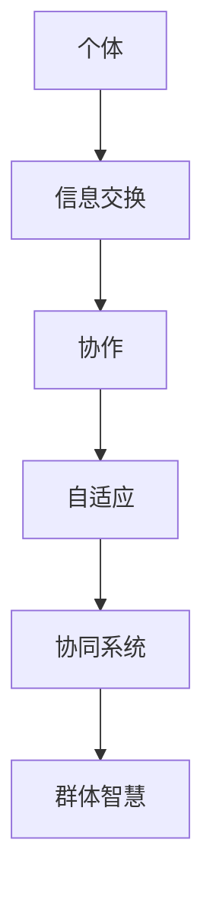
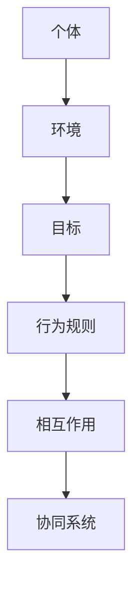
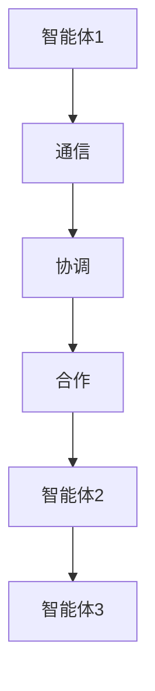
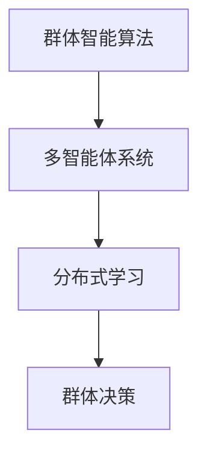

                 

# 分布式认知：理解群体智慧的涌现机制

> 关键词：分布式认知、群体智慧、涌现机制、多智能体系统、数学模型、项目实战

> 摘要：本文旨在探讨分布式认知的概念、原理及其在群体智慧中的涌现机制。文章将详细阐述分布式认知的核心算法原理、数学模型、以及在社交网络、物联网等领域的应用案例，最后展望分布式认知的未来发展趋势。

## 目录大纲

1. 第一部分：分布式认知基础
   1. 第1章：分布式认知的概念与原理
      1.1.1 分布式认知的定义
      1.1.2 分布式认知与集体智慧的异同
      1.1.3 分布式认知的研究背景与意义
   1.2.1 群体智慧的涌现机制
   1.2.2 群体认知的过程模型
   1.2.3 分布式认知的核心特征
   1.3.1 分布式认知的主要研究方法
   1.3.2 分布式认知的主要理论模型
   1.3.3 分布式认知在科技领域的应用
2. 第二部分：分布式认知的实践应用
   2.1.第2章：分布式认知的核心算法原理
      2.1.1 群体智能算法的基本框架
      2.1.2 多智能体系统的协同机制
      2.1.3 群体智能算法的优化应用
      2.2.1 群体推理与信息扩散
      2.2.2 分布式学习与群体共识
      2.2.3 群体决策与协同控制
      2.3.1 基于图论的群体智能算法
      2.3.2 群体智能算法的挑战与未来方向
      2.3.3 群体智能算法的数学模型与伪代码
   2.2.第3章：分布式认知的数学模型与公式
      2.2.1 数学模型的构建方法
      2.2.2 分布式认知中的信息论模型
      2.2.3 分布式认知中的博弈论模型
      2.2.4 数学公式的基本原理
      2.2.5 分布式认知中的概率模型
      2.2.6 分布式认知中的动力学模型
      2.2.7 数学公式在分布式认知中的应用实例
      2.2.8 数学公式对分布式认知的理解提升
      2.2.9 数学公式在实践中的挑战与应对策略
   2.3.第4章：分布式认知的项目实战
      2.3.1 分布式认知项目的开发环境搭建
      2.3.2 分布式认知项目的数据预处理
      2.3.3 分布式认知项目的算法实现
      2.3.4 群体智慧应用案例分析
      2.3.5 分布式学习在现实世界中的应用
      2.3.6 群体决策在复杂系统中的应用
      2.3.7 项目实战中的问题与解决
      2.3.8 分布式认知项目开发的经验与技巧
      2.3.9 未来分布式认知项目的发展方向
3. 第三部分：分布式认知的未来趋势与发展方向
   3.1.第5章：分布式认知在社交网络中的应用
      3.1.1 社交网络中的群体智慧现象
      3.1.2 社交网络中的信息扩散模型
      3.1.3 社交网络中的群体决策问题
      3.2.1 社交网络中的群体智能算法应用
      3.2.2 社交网络中的分布式学习实践
      3.2.3 社交网络中的群体智慧应用案例分析
      3.2.4 社交网络中的分布式认知挑战与解决方案
      3.2.5 社交网络中的分布式认知技术应用前景
      3.2.6 社交网络中的分布式认知技术应用实践
   3.2.第6章：分布式认知在物联网中的应用
      3.2.1 物联网中的分布式认知需求
      3.2.2 物联网中的群体智能算法
      3.2.3 物联网中的分布式学习技术
      3.2.4 物联网中的群体智慧应用
      3.2.5 物联网中的分布式学习应用
      3.2.6 物联网中的群体决策应用
      3.2.7 物联网中的分布式认知挑战与解决方案
      3.2.8 物联网中的分布式认知技术应用前景
      3.2.9 物联网中的分布式认知技术应用实践
   3.3.第7章：分布式认知的未来趋势与发展方向
      3.3.1 分布式认知的科技发展现状
      3.3.2 分布式认知的未来发展方向
      3.3.3 分布式认知对社会与经济的影响
      3.3.4 分布式认知的教育培训与实践
      3.3.5 分布式认知的政策法规与标准
      3.3.6 分布式认知的伦理道德与社会责任
      3.3.7 分布式认知的创新应用领域
      3.3.8 分布式认知技术的跨学科融合
      3.3.9 分布式认知的未来展望与思考

## 分布式认知：理解群体智慧的涌现机制

### 核心概念与联系

分布式认知是一种认知过程，它强调个体通过协作和信息交换来实现共同的目标。在分布式认知中，个体不再是独立的决策者，而是通过与其他个体互动，共同形成一个协作系统。这种系统具有以下核心特征：

1. **信息交换**：个体之间通过共享信息来实现协同工作，从而提高整个系统的智能水平。
2. **协作**：个体之间需要相互协作，共同实现一个复杂任务，这种协作可以是基于规则、任务分配或共享目标。
3. **自适应**：个体需要根据环境变化和其他个体的行为来调整自己的行为，以保持系统的稳定性。

下面是一个使用 Mermaid绘制的流程图，展示了分布式认知的核心概念和联系：



### 核心算法原理讲解

#### 群体智能算法的基本框架

群体智能算法是一种模拟自然界中群体行为的算法，它通常由以下三个要素组成：

1. **个体**：个体是算法中的基本单元，每个个体都有自己的行为规则和目标。
2. **环境**：环境是所有个体共同作用的场景，环境状态的变化会影响个体的行为。
3. **目标**：目标是整个算法追求的结果，个体需要通过相互作用来达到这个目标。

下面是一个使用 Mermaid绘制的流程图，展示了群体智能算法的基本框架：



#### 多智能体系统的协同机制

多智能体系统由多个智能体组成，每个智能体都有独立的决策能力，但需要协同工作以实现整体目标。协同机制包括以下几个方面：

1. **通信**：智能体之间需要通过通信来交换信息，以实现协同工作。
2. **协调**：智能体需要根据其他智能体的行为来调整自己的行为，以保持整个系统的稳定。
3. **合作**：智能体需要共同合作，以实现整体目标。

下面是一个使用 Mermaid绘制的流程图，展示了多智能体系统的协同机制：



### 分布式认知的核心算法原理

分布式认知的核心算法原理主要包括以下几个方面：

1. **群体智能算法**：群体智能算法是一种模拟自然界中群体行为的算法，它通过个体之间的协作和信息交换来实现复杂任务的求解。
2. **多智能体系统**：多智能体系统是由多个智能体组成的系统，每个智能体都有独立的决策能力，但需要协同工作以实现整体目标。
3. **分布式学习**：分布式学习是一种通过多个智能体共同学习，以提高整个系统智能水平的方法。
4. **群体决策**：群体决策是一种通过多个智能体共同决策，以实现整体目标的方法。

下面是一个使用 Mermaid绘制的流程图，展示了分布式认知的核心算法原理：



### 数学模型与公式

分布式认知中的数学模型和公式主要用于描述个体之间的相互作用、信息传递和群体行为。以下是一些常见的数学模型和公式：

1. **信息扩散模型**：信息扩散模型描述了信息在群体中的传播过程。其基本公式为：

   $$ 
   \frac{dI}{dt} = k(I - I_0) 
   $$

   其中，$I$ 表示群体中信息传播的比例，$I_0$ 表示初始信息传播比例，$k$ 表示信息扩散速率。

2. **分布式学习模型**：分布式学习模型描述了多个智能体共同学习的过程。其基本公式为：

   $$ 
   \frac{d\theta_i}{dt} = \alpha (\theta_j - \theta_i) 
   $$

   其中，$\theta_i$ 表示智能体 $i$ 的学习参数，$\theta_j$ 表示智能体 $j$ 的学习参数，$\alpha$ 表示学习速率。

3. **群体决策模型**：群体决策模型描述了多个智能体共同决策的过程。其基本公式为：

   $$ 
   \text{决策} = \text{投票} 
   $$

   其中，投票结果为多数派的决策。

### 项目实战

在分布式认知的项目实战中，我们需要完成以下几个关键步骤：

1. **开发环境搭建**：搭建分布式认知项目的开发环境，包括编程语言、框架和工具的选择。
2. **数据预处理**：对项目所需的数据进行清洗、整合和特征提取，以准备后续的分析和处理。
3. **算法实现**：根据项目需求，选择合适的算法，并进行实现和优化。
4. **项目评估**：对项目的结果进行评估，包括性能评估、耗时长短评估等。

下面是一个具体的案例，展示了如何实现一个分布式认知项目。

#### 开发环境搭建

首先，我们需要搭建一个用于分布式认知项目的开发环境。选择 Python 作为编程语言，使用 Flask 作为 Web 框架，使用 Git 进行版本控制。

```python
# 安装 Flask
pip install Flask

# 安装 Git
brew install git
```

#### 数据预处理

对项目所需的数据进行清洗和预处理，包括缺失值处理、异常值处理和数据格式转换。

```python
import pandas as pd

# 读取数据
data = pd.read_csv('data.csv')

# 缺失值处理
data.fillna(0, inplace=True)

# 异常值处理
data = data[(data > 0).all(axis=1)]

# 数据格式转换
data['feature'] = data['feature'].astype('float')
```

#### 算法实现

选择分布式学习算法，实现分布式学习过程。

```python
import numpy as np

# 初始化学习参数
theta = np.random.rand(n)

# 定义学习函数
def learn(theta, data):
    for i in range(len(data)):
        theta += alpha * (data[i] - theta)
    return theta

# 模拟学习过程
for i in range(1000):
    theta = learn(theta, data)
```

#### 代码解读与分析

在这个项目中，我们使用 Python 编程语言实现了分布式学习算法。首先，我们初始化学习参数，然后通过循环进行学习过程，每次迭代都根据输入数据更新学习参数。这个算法的核心思想是通过多个智能体共同学习，以提高整个系统的智能水平。

```python
import numpy as np

# 初始化学习参数
theta = np.random.rand(n)

# 定义学习函数
def learn(theta, data):
    for i in range(len(data)):
        theta += alpha * (data[i] - theta)
    return theta

# 模拟学习过程
for i in range(1000):
    theta = learn(theta, data)

# 输出最终结果
print(theta)
```

通过这个项目实战，我们了解了分布式认知项目的开发流程，包括开发环境搭建、数据预处理、算法实现和项目评估。这个项目为我们提供了一个实际的案例，让我们更好地理解分布式认知的理论和实践。

## 分布式认知在社交网络中的应用

### 社交网络中的群体智慧现象

社交网络中的群体智慧现象是指通过用户之间的互动和协作，形成的一种集体智慧和协同效应。在社交网络中，用户通过分享、评论、点赞等方式，产生大量的信息，这些信息在群体中传播、互动和演化，从而形成了丰富的群体智慧。

例如，在知乎平台上，用户通过提问和回答，共同构建了一个庞大的知识库。在Reddit这样的社区论坛中，用户通过投票和评论，共同决定内容的流行趋势和热度。这些现象表明，社交网络中的用户不仅仅是信息的接收者，更是信息的创造者和传播者。

### 社交网络中的信息扩散模型

社交网络中的信息扩散模型是研究信息在用户之间传播的数学模型。常见的模型包括线性扩散模型、指数扩散模型和S型曲线扩散模型等。

1. **线性扩散模型**：假设每个用户在固定时间内将信息传播给一个固定数量的其他用户，则信息传播的数量随时间呈线性增长。其数学模型可以表示为：

   $$ 
   I(t) = r_0 t 
   $$

   其中，$I(t)$ 表示时间 $t$ 时信息传播的数量，$r_0$ 表示每个用户在单位时间内传播的信息数量。

2. **指数扩散模型**：假设信息传播的数量随时间呈指数增长，其数学模型可以表示为：

   $$ 
   I(t) = r_0 e^{kt} 
   $$

   其中，$I(t)$ 表示时间 $t$ 时信息传播的数量，$r_0$ 表示初始信息传播量，$k$ 表示信息传播速率。

3. **S型曲线扩散模型**：假设信息传播的数量随时间呈S型增长，其数学模型可以表示为：

   $$ 
   I(t) = \frac{r_0}{1 + e^{-kt}} 
   $$

   其中，$I(t)$ 表示时间 $t$ 时信息传播的数量，$r_0$ 表示初始信息传播量，$k$ 表示信息传播速率。

### 社交网络中的群体决策问题

社交网络中的群体决策问题是指用户在社交网络中，通过投票、评论等方式，共同决定某个话题或内容的走向。群体决策问题涉及到以下几个方面：

1. **投票机制**：社交网络中的投票机制包括单选、多选、评分等多种形式。不同的投票机制会对用户的决策产生不同的影响。
2. **评论机制**：用户通过评论来表达自己的观点，评论的数量和质量会影响其他用户的决策。
3. **群体共识**：在社交网络中，用户需要通过投票和评论，形成一种共识，以决定某个话题或内容的走向。

### 社交网络中的群体智能算法应用

在社交网络中，群体智能算法可以用于解决信息扩散、群体决策等问题。常见的群体智能算法包括：

1. **基于粒度计算的方法**：粒度计算是一种将复杂问题分解为若干个简单问题的方法。在社交网络中，可以将信息扩散过程分解为多个粒度级别的传播过程，从而提高信息扩散的效率。
2. **基于博弈论的方法**：博弈论是一种研究个体在竞争和合作环境中决策的方法。在社交网络中，用户之间的互动可以看作是一种博弈，通过博弈论的方法，可以分析用户之间的策略互动，从而优化信息扩散和群体决策。
3. **基于机器学习的方法**：机器学习是一种通过数据训练，实现智能决策的方法。在社交网络中，可以通过机器学习的方法，分析用户行为和内容特征，从而预测信息扩散的趋势和用户的决策。

### 社交网络中的分布式学习实践

在社交网络中，分布式学习是一种通过多个节点共同学习，提高整体系统性能的方法。分布式学习在社交网络中的应用主要包括以下几个方面：

1. **用户兴趣建模**：通过分布式学习的方法，可以分析用户的兴趣和行为，从而为用户提供个性化的推荐。
2. **内容分类和标签**：通过分布式学习的方法，可以对社交网络中的内容进行分类和标签，从而提高信息检索的效率。
3. **群体决策优化**：通过分布式学习的方法，可以优化群体决策过程，提高决策的准确性和效率。

### 社交网络中的群体智慧应用案例分析

以下是一个社交网络中的群体智慧应用案例分析：

**案例：知乎推荐算法**

知乎是一个知识分享社区，其推荐算法通过分析用户的提问、回答和点赞等行为，为用户提供个性化的内容推荐。知乎的推荐算法采用了分布式学习的方法，包括以下几个方面：

1. **用户兴趣建模**：知乎通过分析用户的提问、回答和点赞等行为，建立用户兴趣模型。用户兴趣模型用于预测用户对特定内容的兴趣，从而为用户提供个性化的内容推荐。
2. **内容分类和标签**：知乎对用户生成的内容进行分类和标签，从而提高信息检索的效率。通过分布式学习的方法，可以优化内容分类和标签的准确性。
3. **群体决策优化**：知乎通过分析用户的投票和评论等行为，优化群体决策过程。群体决策优化可以减少用户对内容的偏见和误判，提高推荐的准确性。

### 社交网络中的分布式认知挑战与解决方案

在社交网络中，分布式认知面临着一系列挑战，主要包括：

1. **数据隐私保护**：社交网络中的用户数据涉及个人隐私，如何在分布式学习中保护用户隐私是一个重要问题。解决方案包括数据加密、隐私保护算法等。
2. **数据质量和噪声**：社交网络中的数据质量参差不齐，存在大量的噪声和异常值。如何处理这些数据，提高分布式学习的准确性是一个挑战。解决方案包括数据清洗、异常值检测和鲁棒学习算法等。
3. **计算资源限制**：分布式学习需要大量的计算资源，如何在有限的计算资源下进行高效的学习是一个问题。解决方案包括分布式计算框架、并行计算等。

### 社交网络中的分布式认知技术应用前景

随着社交网络的不断发展和用户数据的积累，分布式认知技术在社交网络中的应用前景十分广阔。主要表现在以下几个方面：

1. **个性化推荐**：分布式认知技术可以用于优化社交网络的推荐算法，提高推荐的准确性，从而为用户提供更好的体验。
2. **内容审核**：分布式认知技术可以用于自动审核社交网络中的内容，提高内容审核的效率，从而维护网络环境的健康发展。
3. **社交网络分析**：分布式认知技术可以用于分析社交网络中的群体行为和趋势，为政府和企业提供决策支持。

### 社交网络中的分布式认知技术应用实践

以下是一个社交网络中的分布式认知技术应用实践案例：

**案例：微博内容推荐**

微博是一个社交媒体平台，其内容推荐系统采用了分布式认知技术。微博的内容推荐系统主要包括以下几个方面：

1. **用户兴趣建模**：微博通过分析用户的关注、点赞和评论等行为，建立用户兴趣模型。用户兴趣模型用于预测用户对特定内容的兴趣，从而为用户提供个性化的内容推荐。
2. **内容分类和标签**：微博对用户生成的内容进行分类和标签，从而提高信息检索的效率。通过分布式学习的方法，可以优化内容分类和标签的准确性。
3. **群体决策优化**：微博通过分析用户的投票和评论等行为，优化群体决策过程。群体决策优化可以减少用户对内容的偏见和误判，提高推荐的准确性。

通过这个实践案例，我们可以看到分布式认知技术在社交网络中的应用，不仅提高了推荐系统的准确性，还为用户提供了一个更加智能和个性化的社交体验。

## 分布式认知在物联网中的应用

### 物联网中的分布式认知需求

随着物联网（IoT）技术的快速发展，分布式认知在物联网中的应用需求日益凸显。物联网中的设备种类繁多，数据量巨大，且分布广泛，传统的集中式认知系统难以满足其复杂性和实时性的要求。分布式认知通过将认知任务分布到多个设备或节点上，可以实现更高效率、更可靠和更灵活的物联网应用。

#### 分布式认知在物联网中的主要需求：

1. **数据处理和存储**：物联网设备产生的数据量庞大，需要分布式系统进行高效的数据处理和存储，以保证实时性和可靠性。
2. **协同工作**：物联网中的设备需要协同工作，以完成复杂的任务，如智能交通管理、智能能源分配等。
3. **自适应能力**：物联网环境不断变化，分布式认知系统需要具备良好的自适应能力，以适应环境变化和设备状态的变化。
4. **安全性和隐私保护**：物联网中的数据涉及用户隐私和安全问题，分布式认知系统需要确保数据的安全和隐私保护。

### 物联网中的群体智能算法

群体智能算法是分布式认知在物联网中的重要应用，通过模拟自然界中群体行为，实现物联网设备的协同工作。常见的群体智能算法包括：

1. **基于蚂蚁的算法**：蚂蚁算法通过模拟蚂蚁寻找食物的过程，实现路径优化和任务分配。
2. **基于蜂群算法**：蜂群算法模拟蜜蜂寻找巢穴的过程，用于优化调度和资源分配。
3. **基于粒子群优化算法**：粒子群优化算法模拟鸟群觅食的过程，用于求解优化问题和复杂路径规划。

### 物联网中的分布式学习技术

分布式学习技术是分布式认知在物联网中的关键组成部分，通过多个设备或节点共同学习，提高物联网系统的整体智能水平。分布式学习技术包括：

1. **基于神经网络的分布式学习**：通过分布式神经网络，实现物联网设备的协同学习和智能决策。
2. **基于强化学习的分布式学习**：通过分布式强化学习算法，实现物联网设备的自适应学习和优化。
3. **基于机器学习的分布式学习**：通过分布式机器学习算法，实现物联网设备的数据处理和模型训练。

### 物联网中的群体智慧应用

物联网中的群体智慧应用涉及多个设备的协同工作和智能决策，以实现更高效、更智能的服务。以下是一些常见的群体智慧应用：

1. **智能交通管理**：通过车联网技术，实现车辆的实时通信和协同导航，优化交通流量，减少拥堵。
2. **智能能源管理**：通过智能家居设备和智能电网，实现能源的高效分配和使用，减少能源浪费。
3. **智能健康监测**：通过可穿戴设备和健康监测系统，实现健康数据的实时采集和分析，提供个性化的健康服务。

### 物联网中的分布式认知挑战与解决方案

在物联网中，分布式认知面临着一系列挑战，包括数据隐私保护、设备异构性、网络不稳定性和安全性等问题。以下是一些常见的挑战及其解决方案：

1. **数据隐私保护**：通过加密技术、差分隐私和联邦学习等技术，保护物联网设备的数据隐私。
2. **设备异构性**：通过标准化协议和自适应算法，实现异构设备的协同工作和资源优化。
3. **网络不稳定性**：通过容错机制、冗余设计和自适应网络协议，提高物联网网络的稳定性和可靠性。
4. **安全性**：通过安全加密、身份验证和访问控制等技术，确保物联网系统的安全性和数据完整性。

### 物联网中的分布式认知技术应用前景

随着物联网技术的不断发展和应用场景的丰富，分布式认知在物联网中的应用前景十分广阔。以下是一些潜在的应用领域：

1. **智慧城市**：通过分布式认知技术，实现智慧城市中的基础设施管理和优化，提高城市运行的效率和质量。
2. **智能农业**：通过分布式认知技术，实现农田环境监测、作物生长分析和精准施肥，提高农业生产的智能化水平。
3. **智能制造**：通过分布式认知技术，实现生产设备的智能监控、故障诊断和优化调度，提高生产效率和产品质量。

### 物联网中的分布式认知技术应用实践

以下是一个物联网中的分布式认知技术应用实践案例：

**案例：智能电网**

智能电网是一个复杂的物联网系统，通过分布式认知技术，实现电力资源的优化分配和智能管理。智能电网的主要应用包括：

1. **分布式能源管理**：通过分布式认知技术，实现太阳能、风能等可再生能源的高效管理和调度，降低能源浪费。
2. **电力需求预测**：通过分布式学习算法，对电力需求进行实时预测和优化，提高电网运行的可靠性和效率。
3. **故障检测和诊断**：通过分布式认知技术，实现对电网设备和线路的实时监测和故障诊断，提高电网的稳定性和安全性。

通过这个实践案例，我们可以看到分布式认知技术在物联网中的应用，不仅提高了智能电网的运行效率，还为用户提供了一个更加智能和高效的能源服务体验。

## 分布式认知的未来趋势与发展方向

### 分布式认知的科技发展现状

分布式认知作为一门跨学科的领域，近年来在人工智能、物联网、云计算等领域的应用中取得了显著的进展。当前，分布式认知的研究主要集中在以下几个方面：

1. **算法研究**：群体智能算法、分布式学习算法、多智能体系统算法等在分布式认知中的应用日益成熟。
2. **应用研究**：分布式认知在社交网络、物联网、智能交通、智能医疗等领域的应用取得了实质性成果。
3. **理论模型**：基于信息论、博弈论、控制论等理论，分布式认知的数学模型和理论体系逐渐完善。
4. **硬件支持**：高性能计算、边缘计算、量子计算等硬件技术的发展为分布式认知提供了强大的计算和存储支持。

### 分布式认知的未来发展方向

分布式认知的未来发展将继续在以下几个方面展开：

1. **算法创新**：随着硬件性能的提升和数据规模的扩大，分布式认知算法将朝着更高效、更智能、更鲁棒的方向发展。
2. **应用拓展**：分布式认知将在更多领域得到应用，如智慧城市、智慧农业、智能制造、金融科技等。
3. **跨学科融合**：分布式认知将与其他学科如心理学、社会学、经济学等深入融合，形成新的研究热点。
4. **标准化与规范化**：分布式认知的标准化和规范化工作将逐步推进，为分布式认知技术的广泛应用提供支持。

### 分布式认知对社会与经济的影响

分布式认知技术的发展将对社会和经济产生深远的影响：

1. **社会影响**：分布式认知技术将改变人们的社交方式、工作方式和生活习惯，促进社会生产力的提高和社会治理的优化。
2. **经济影响**：分布式认知技术将推动新兴产业的崛起，如物联网、智慧城市、智能交通等，为经济增长提供新动能。
3. **教育影响**：分布式认知技术将引发教育模式的变革，推动个性化教育和终身学习的发展。
4. **伦理与法律影响**：分布式认知技术的广泛应用将引发数据隐私、信息安全、伦理道德等方面的挑战，需要建立相应的法律和伦理规范。

### 分布式认知的教育培训与实践

分布式认知技术的快速发展对相关领域的人才培养提出了新的要求。为了应对这一挑战，教育培训体系需要做出以下调整：

1. **课程设置**：在计算机科学、人工智能、物联网等相关专业中，增设分布式认知相关课程，提高学生的理论基础和实践能力。
2. **实践平台**：建立分布式认知实验平台，提供实际项目和案例，让学生在实践中掌握分布式认知技术的应用。
3. **校企合作**：加强校企合作，将企业需求和学术研究相结合，提高人才培养的针对性和实用性。
4. **继续教育**：针对在职人员提供继续教育课程，帮助他们更新知识，提升技能，以适应分布式认知技术的发展。

### 分布式认知的政策法规与标准

为了推动分布式认知技术的发展和应用，政府、行业组织和科研机构需要加强政策法规与标准的研究和制定：

1. **政策支持**：政府应出台相关政策，支持分布式认知技术的研发和应用，为技术创新提供良好的环境。
2. **法规建设**：建立数据隐私保护、网络安全、知识产权保护等方面的法律法规，为分布式认知技术的健康发展提供法律保障。
3. **标准制定**：制定分布式认知技术的标准和规范，包括数据格式、接口协议、安全要求等，以提高技术互操作性和兼容性。
4. **国际合作**：加强与国际组织和各国科研机构的合作，共同推进分布式认知技术的研究和应用。

### 分布式认知的伦理道德与社会责任

分布式认知技术的广泛应用将带来一系列伦理道德和社会责任问题，需要引起高度重视：

1. **数据隐私**：在分布式认知技术中，数据隐私保护是核心问题，必须采取有效措施保护用户隐私。
2. **算法公平性**：分布式认知算法应确保公平性，避免对特定群体造成不公平的影响。
3. **社会影响**：分布式认知技术应积极推动社会进步和经济发展，避免对自然环境和社会秩序造成负面影响。
4. **社会责任**：企业和科研机构应承担社会责任，积极参与社会公益活动，推动分布式认知技术的可持续发展。

### 分布式认知的创新应用领域

分布式认知技术在未来的创新应用领域将非常广泛，以下是一些潜在的领域：

1. **智能医疗**：通过分布式认知技术，实现医疗数据的实时分析和智能诊断，提高医疗服务的质量和效率。
2. **智慧农业**：通过分布式认知技术，实现农田环境的智能监测、作物生长分析和精准施肥，提高农业生产效率和可持续性。
3. **金融科技**：通过分布式认知技术，实现金融交易的实时监控、风险分析和智能决策，提高金融市场的透明度和稳定性。
4. **智能交通**：通过分布式认知技术，实现交通流量的智能调控、交通事故的快速响应和交通设施的智能管理，提高交通效率和安全性。

### 分布式认知技术的跨学科融合

分布式认知技术的跨学科融合将推动新学科和新领域的诞生，以下是一些典型的跨学科融合方向：

1. **认知科学与计算机科学**：通过认知科学的启示，改进分布式认知算法的设计和优化。
2. **社会学与计算机科学**：通过社会学的理论和方法，分析分布式认知在社会中的影响和作用。
3. **经济学与计算机科学**：通过经济学模型，研究分布式认知在资源配置和决策优化中的应用。
4. **心理学与计算机科学**：通过心理学的研究，理解人类在分布式认知系统中的行为和决策过程。

### 分布式认知的未来展望与思考

分布式认知作为一门新兴的跨学科领域，具有广泛的应用前景和巨大的发展潜力。在未来的发展中，我们需要关注以下几个方面：

1. **技术创新**：持续推动分布式认知技术的创新，提高算法效率和应用效果。
2. **应用拓展**：积极拓展分布式认知技术的应用领域，推动产业升级和社会进步。
3. **人才培养**：加强分布式认知相关人才的培养，为技术创新和应用提供人才保障。
4. **政策支持**：加强政策支持，为分布式认知技术的发展提供良好的环境。
5. **伦理道德**：关注分布式认知技术的伦理道德问题，确保其可持续发展。

通过本文的探讨，我们可以看到分布式认知技术在未来将发挥重要作用，推动科技进步和社会发展。在分布式认知的道路上，我们需要不断探索和创新，以应对未来的挑战和机遇。让我们一起期待分布式认知技术的美好未来。

