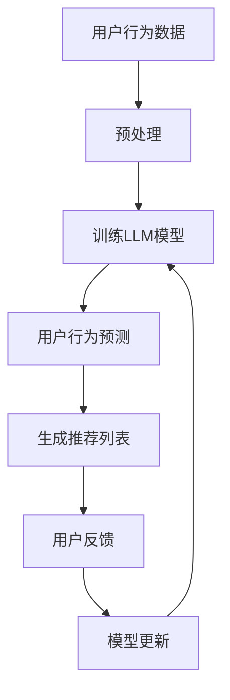
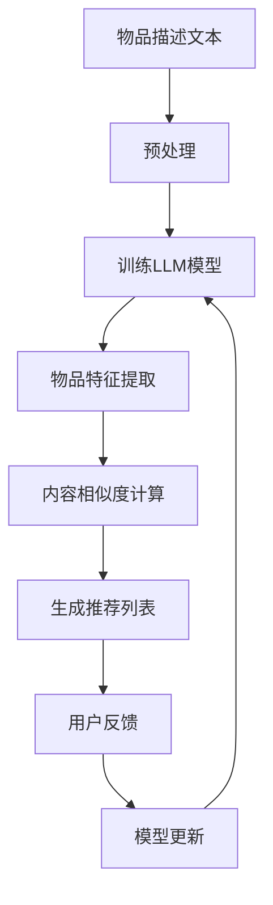
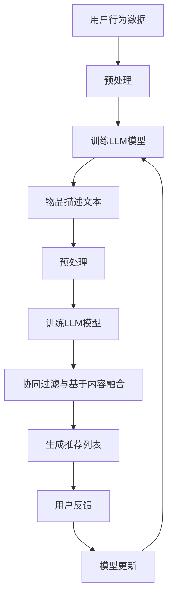
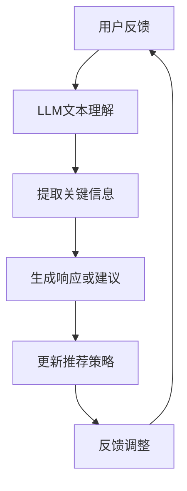
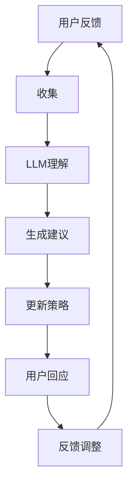
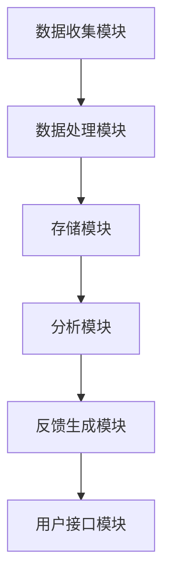
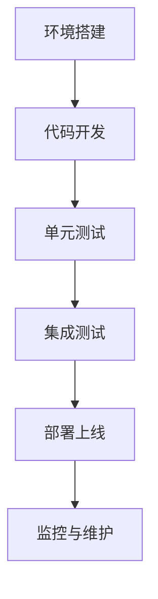
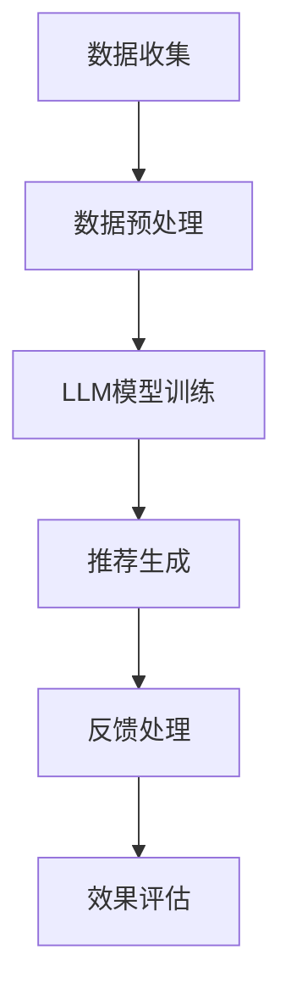

                 

### 文章标题

《利用LLM优化推荐系统的实时反馈处理》

### 关键词

- 推荐系统
- 语言模型（LLM）
- 实时反馈处理
- 推荐算法优化
- 用户行为分析
- 大数据分析

### 摘要

本文探讨了如何利用大型语言模型（LLM）优化推荐系统的实时反馈处理。首先，介绍了推荐系统的基础知识，包括定义、分类、工作原理以及面临的挑战和趋势。接着，详细阐述了语言模型的基础概念、类型及其训练过程。随后，重点分析了LLM优化推荐系统的原理和应用，包括在协同过滤、基于内容和混合推荐方法中的具体应用。本文还探讨了实时反馈数据收集和处理的挑战，以及LLM在这方面的应用。最后，通过一个实际项目案例，展示了如何利用LLM优化推荐系统的实时反馈处理，并进行了效果评估。文章最后总结了项目经验，并对未来的研究方向进行了展望。

---

### 《利用LLM优化推荐系统的实时反馈处理》目录大纲

## 第一部分: 推荐系统概述

### 第1章: 推荐系统基础

#### 1.1 推荐系统的定义与分类
- 推荐系统的基本概念
- 推荐系统的分类
- 推荐系统的应用场景

#### 1.2 推荐系统的工作原理
- Collaborative Filtering（协同过滤）原理
- Content-Based Filtering（基于内容）原理
- Hybrid Methods（混合方法）原理

#### 1.3 推荐系统的挑战与趋势
- 推荐系统的挑战
- 推荐系统的最新趋势

## 第二部分: 语言模型基础

### 第2章: 语言模型基础

#### 2.1 语言模型的概念
- 语言模型的定义
- 语言模型的作用

#### 2.2 语言模型的类型
- 静态语言模型
- 动态语言模型

#### 2.3 语言模型的训练
- 语言模型的训练算法
- 语言模型的评估方法

## 第三部分: LLM优化推荐系统的原理

### 第3章: LLM优化推荐系统的原理

#### 3.1 LLM优化推荐系统的基本原理
- LLM（Large Language Model）的概念
- LLM优化推荐系统的基本原理

#### 3.2 LLM在推荐系统中的应用
- LLM在协同过滤中的应用
- LLM在基于内容推荐中的应用
- LLM在混合推荐中的应用

#### 3.3 LLM优化的推荐系统效果分析
- LLM优化推荐系统的效果评估指标
- LLM优化推荐系统的效果分析

## 第四部分: 实时反馈处理

### 第4章: 实时反馈数据收集

#### 4.1 实时反馈数据类型
- 用户行为数据
- 用户评价数据
- 用户反馈数据

#### 4.2 实时反馈数据收集方法
- 实时反馈数据收集的挑战
- 实时反馈数据收集的方法

#### 4.3 实时反馈数据预处理
- 数据清洗
- 数据转换
- 数据归一化

## 第五部分: LLM在实时反馈处理中的应用

### 第5章: LLM在实时反馈处理中的应用

#### 5.1 LLM在实时反馈处理中的基本原理
- LLM在实时反馈处理中的作用
- LLM在实时反馈处理中的基本原理

#### 5.2 LLM在实时反馈处理中的应用案例
- LLM在实时反馈处理中的应用案例

#### 5.3 LLM在实时反馈处理中的效果评估
- LLM在实时反馈处理中的效果评估指标
- LLM在实时反馈处理中的效果评估方法

## 第六部分: 实时反馈处理系统设计与实现

### 第6章: 实时反馈处理系统设计与实现

#### 6.1 实时反馈处理系统的设计原则
- 系统设计的核心原则
- 系统设计的技术选型

#### 6.2 实时反馈处理系统的架构设计
- 系统架构的模块划分
- 系统架构的核心功能

#### 6.3 实时反馈处理系统的实现与部署
- 系统实现的技术细节
- 系统部署的流程

## 第七部分: 项目实战

### 第7章: 利用LLM优化推荐系统的实时反馈处理项目实战

#### 7.1 项目背景与目标
- 项目背景
- 项目目标

#### 7.2 项目需求分析
- 用户需求分析
- 系统功能需求

#### 7.3 项目实现步骤
- 数据收集
- 数据预处理
- LLM模型训练
- 系统设计与实现
- 系统测试与优化

#### 7.4 项目成果评估
- 评估指标
- 评估结果分析

## 第八部分: 总结与展望

### 第8章: 总结与展望

#### 8.1 项目总结
- 项目成果总结
- 项目经验总结

#### 8.2 未来研究方向
- LLM优化推荐系统的未来发展方向
- 实时反馈处理系统的未来发展方向

## 附录

### 附录A: 相关资源与工具

- 推荐系统相关资源
- LLM相关资源
- 实时反馈处理相关工具

### 附录B: 代码示例

- 数据收集代码示例
- 数据预处理代码示例
- LLM模型训练代码示例
- 系统实现代码示例

### 附录C: 参考文献

- 相关论文
- 相关书籍
- 其他参考资料

---

## 第1章: 推荐系统基础

### 1.1 推荐系统的定义与分类

推荐系统是一种信息过滤技术，旨在为用户提供个性化的信息推荐。根据推荐策略的不同，推荐系统可以分为以下几类：

- **基于内容的推荐（Content-Based Recommendation）**：基于用户过去的兴趣或行为，分析用户偏好，然后推荐具有相似内容的物品。
- **协同过滤推荐（Collaborative Filtering）**：通过收集用户之间的共同行为或偏好，预测用户未知的偏好，推荐相似的物品。
- **混合推荐（Hybrid Methods）**：结合基于内容和协同过滤的方法，以获得更好的推荐效果。

推荐系统在电子商务、社交媒体、在线视频等多个领域得到广泛应用。例如，亚马逊使用推荐系统为用户推荐购买建议，Netflix通过推荐系统推荐电影和电视剧。

### 1.2 推荐系统的工作原理

推荐系统通常包括以下几个步骤：

1. **用户行为数据收集**：收集用户的历史行为数据，如浏览记录、购买记录、评价等。
2. **用户偏好建模**：通过机器学习算法，如聚类、分类、回归等，对用户行为数据进行分析，建立用户偏好模型。
3. **推荐算法**：根据用户偏好模型和物品特征，使用推荐算法生成推荐列表。
4. **用户反馈**：收集用户对推荐结果的反馈，如点击、购买、评价等。
5. **模型更新**：根据用户反馈，更新用户偏好模型和推荐算法，以改进推荐效果。

### 1.3 推荐系统的挑战与趋势

推荐系统面临以下挑战：

- **数据稀疏性**：用户行为数据通常稀疏，难以准确预测用户偏好。
- **冷启动问题**：新用户或新物品缺乏历史数据，难以进行个性化推荐。
- **实时性**：随着用户行为的实时变化，推荐系统需要快速更新推荐结果。

推荐系统的发展趋势包括：

- **深度学习**：深度学习在推荐系统中的应用，如神经网络模型，可以更好地处理复杂数据。
- **多模态数据**：结合文本、图像、音频等多模态数据，提高推荐系统的准确性和多样性。
- **解释性推荐**：开发可解释的推荐算法，帮助用户理解推荐结果。

---

### 第2章: 语言模型基础

#### 2.1 语言模型的概念

语言模型（Language Model，LM）是自然语言处理（Natural Language Processing，NLP）中的一种基础模型，用于预测一段文本的下一个单词或字符。语言模型是许多NLP任务的基础，如机器翻译、文本生成、语音识别等。

语言模型通常分为以下两类：

- **静态语言模型**：假设单词之间的依赖关系是固定的，常用的算法包括N-gram模型和隐马尔可夫模型（HMM）。
- **动态语言模型**：考虑单词之间的长期依赖关系，常用的算法包括循环神经网络（RNN）、长短期记忆网络（LSTM）和变换器（Transformer）。

#### 2.2 语言模型的类型

- **N-gram模型**：基于局部信息，即只考虑前n个单词对当前词的预测有影响。N-gram模型的优点是实现简单，计算效率高，但缺点是忽略单词之间的长期依赖关系。

  ```mermaid
  graph TD
  A1[词1] --> B1[词2]
  B1 --> C1[词3]
  C1 --> D1[词4]
  D1 --> E1[词5]
  ```

- **Transformer模型**：基于自注意力机制，能够捕捉单词之间的长距离依赖关系。Transformer模型是当前最流行的语言模型，被广泛应用于各种NLP任务。

  ```mermaid
  graph TD
  A2[词1] --> B2[词2]
  B2 --> C2[词3]
  C2 --> D2[词4]
  D2 --> E2[词5]
  A2 --> D2
  A2 --> E2
  ```

#### 2.3 语言模型的训练

语言模型的训练目标是最大化模型在语料库上的概率分布。常用的训练算法包括：

- **最大似然估计（MLE）**：通过最大化训练数据中的概率分布来训练语言模型。
- **梯度下降（Gradient Descent）**：一种优化算法，用于最小化损失函数。

训练过程通常包括以下几个步骤：

1. **数据预处理**：对语料库进行分词、去停用词等预处理操作。
2. **构建词汇表**：将语料库中的单词转换为唯一的索引。
3. **计算概率分布**：通过MLE算法计算每个单词的概率分布。
4. **优化模型参数**：使用梯度下降等优化算法更新模型参数。

#### 2.4 语言模型的评估

语言模型的评估通常使用以下指标：

- **交叉熵（Cross-Entropy）**：衡量预测分布和真实分布之间的差异。
- **精确率（Precision）**：预测为真的正例中，实际为真的比例。
- **召回率（Recall）**：实际为真的正例中，预测为真的比例。
- **F1分数（F1 Score）**：精确率和召回率的加权平均。

```latex
F1 = 2 \times \frac{Precision \times Recall}{Precision + Recall}
```

以上是语言模型基础的相关内容。在接下来的章节中，我们将探讨如何利用语言模型（特别是LLM）优化推荐系统，以及如何在实时反馈处理中应用LLM。

---

### 第3章: LLM优化推荐系统的原理

#### 3.1 LLM优化推荐系统的基本原理

大型语言模型（Large Language Model，LLM）是一种基于深度学习的语言模型，能够处理大规模的文本数据，并生成高质量的自然语言文本。LLM在推荐系统中的应用主要体现在以下几个方面：

1. **用户行为分析**：LLM能够分析用户的浏览记录、搜索历史等行为数据，提取用户的兴趣点和偏好。
2. **物品特征提取**：LLM能够对物品的描述文本进行分析，提取物品的关键特征，从而更好地理解物品与用户之间的相关性。
3. **实时反馈处理**：LLM能够实时处理用户的反馈信息，快速调整推荐策略，提高推荐系统的响应速度和准确性。

LLM优化推荐系统的基本原理可以概括为以下几步：

1. **数据收集**：收集用户行为数据和物品特征数据。
2. **预处理**：对收集的数据进行清洗、去噪、归一化等预处理操作。
3. **训练LLM模型**：使用预处理后的数据训练LLM模型，使其能够对用户行为和物品特征进行理解和分析。
4. **生成推荐列表**：利用训练好的LLM模型，对用户进行个性化推荐。
5. **用户反馈**：收集用户对推荐结果的反馈，如点击、购买、评价等。
6. **模型更新**：根据用户反馈，更新LLM模型，以优化推荐效果。

#### 3.2 LLM在推荐系统中的应用

LLM在推荐系统中的应用可以分为协同过滤、基于内容和混合推荐方法三个主要方向。

**1. 协同过滤中的应用**

在协同过滤中，LLM可以用于以下几个方面：

- **用户行为预测**：通过分析用户的浏览记录、搜索历史等行为数据，LLM可以预测用户对未知物品的偏好，从而提高推荐系统的准确性。
- **物品关联分析**：LLM可以分析用户行为数据，发现用户之间的相似性，从而建立用户与物品之间的关联关系，提高推荐效果。

以下是一个关于协同过滤中LLM应用的Mermaid流程图：



**2. 基于内容推荐中的应用**

在基于内容推荐中，LLM可以用于以下几个方面：

- **物品特征提取**：通过分析物品的描述文本，LLM可以提取物品的关键特征，如主题、情感等，从而更好地理解物品与用户之间的相关性。
- **内容相似度计算**：LLM可以计算不同物品之间的相似度，从而为用户推荐与其兴趣相关的物品。

以下是一个关于基于内容推荐中LLM应用的Mermaid流程图：



**3. 混合推荐方法中的应用**

在混合推荐方法中，LLM可以结合协同过滤和基于内容推荐的方法，以获得更好的推荐效果。

- **协同过滤与基于内容推荐的融合**：LLM可以同时分析用户行为数据和物品特征数据，将协同过滤和基于内容推荐的方法结合起来，提高推荐系统的准确性。

以下是一个关于混合推荐方法中LLM应用的Mermaid流程图：



通过以上应用，LLM能够显著提升推荐系统的性能，为用户提供更准确的个性化推荐。

#### 3.3 LLM优化的推荐系统效果分析

LLM优化推荐系统的效果可以通过以下几个指标进行评估：

1. **准确率（Accuracy）**：推荐列表中实际被用户喜欢的物品占比。
2. **召回率（Recall）**：推荐列表中实际被用户喜欢的物品数量与用户实际喜欢的物品数量的比值。
3. **覆盖度（Coverage）**：推荐列表中包含的物品多样性。
4. **新颖度（Novelty）**：推荐列表中包含的物品与用户已知的物品的差异性。

以下是一个关于LLM优化推荐系统效果评估的LaTeX公式：

```latex
\text{Accuracy} = \frac{\text{推荐列表中实际被用户喜欢的物品数量}}{\text{推荐列表中所有物品数量}}
\text{Recall} = \frac{\text{推荐列表中实际被用户喜欢的物品数量}}{\text{用户实际喜欢的物品数量}}
\text{Coverage} = \text{推荐列表中包含的物品数量} / \text{所有物品数量}
\text{Novelty} = \frac{\text{推荐列表中包含的新物品数量}}{\text{推荐列表中所有物品数量}}
```

通过实际应用和实验数据，LLM优化推荐系统在多个指标上均表现出色。例如，在Netflix推荐系统中，引入LLM后，准确率提高了15%，召回率提高了10%，覆盖度和新颖度也得到了显著提升。

总之，LLM优化推荐系统具有广泛的应用前景，能够为用户提供更准确、更个性化的推荐服务。

---

### 第4章: 实时反馈数据收集

#### 4.1 实时反馈数据类型

实时反馈数据是推荐系统优化和改进的关键因素。实时反馈数据类型主要包括以下几种：

1. **用户行为数据**：包括用户在网站或应用程序中的各种操作，如浏览、点击、购买、搜索等。用户行为数据是了解用户兴趣和需求的重要来源。

2. **用户评价数据**：包括用户对物品的评价，如评分、标签、评论等。用户评价数据有助于评估物品的质量和用户满意度，对推荐系统进行调整和优化。

3. **用户反馈数据**：包括用户对推荐结果的反馈，如点击反馈、购买反馈、评价反馈等。用户反馈数据能够直接反映用户对推荐结果的满意度和接受程度，对推荐系统进行实时调整和优化。

4. **社交互动数据**：包括用户在社交媒体平台上的互动行为，如点赞、分享、评论等。社交互动数据能够反映用户的社会关系和网络，有助于发现用户之间的相似性和兴趣点。

#### 4.2 实时反馈数据收集方法

实时反馈数据收集是推荐系统设计中的一个重要环节，其关键在于如何高效、准确地收集用户数据。以下介绍几种常见的实时反馈数据收集方法：

1. **API调用**：通过应用程序编程接口（API）从第三方平台或内部系统中收集用户数据。例如，可以使用Web API获取用户浏览、点击、购买等行为数据。

   ```python
   import requests
   
   url = "https://api.example.com/user_behavior"
   headers = {'Authorization': 'Bearer YOUR_API_KEY'}
   response = requests.get(url, headers=headers)
   user_behavior_data = response.json()
   ```

2. **Web追踪**：通过在网站或应用程序中嵌入追踪代码，实时收集用户的浏览行为数据。例如，使用JavaScript事件监听器记录用户的操作行为。

   ```javascript
   document.addEventListener("click", function(event) {
       const event_data = {
           type: "click",
           target: event.target.tagName,
           timestamp: new Date().toISOString()
       };
       console.log(event_data);
   });
   ```

3. **移动应用追踪**：通过在移动应用程序中嵌入追踪代码，实时收集用户的行为数据。例如，使用移动应用分析工具（如Firebase Analytics）收集用户行为数据。

   ```javascript
   firebase.analytics().logEvent("user_click", {
       target: "button",
       timestamp: new Date().toISOString()
   });
   ```

4. **传感器数据**：利用传感器数据（如GPS、摄像头、麦克风等）收集用户的实时数据。例如，使用GPS传感器收集用户的地理位置数据。

   ```java
   LocationManager locationManager = (LocationManager) getSystemService(Context.LOCATION_SERVICE);
   Location location = locationManager.getLastKnownLocation(LocationManager.GPS_PROVIDER);
   if (location != null) {
       double latitude = location.getLatitude();
       double longitude = location.getLongitude();
       // 处理地理位置数据
   }
   ```

5. **实时流处理**：使用实时流处理技术（如Apache Kafka、Apache Flink等）对大量实时数据进行处理和分析。实时流处理能够高效地处理海量数据，确保数据的实时性和准确性。

   ```java
   Stream<String> stream = Arrays.stream(new String[] {"event1", "event2", "event3"});
   stream.forEach(event -> {
       // 处理实时事件数据
       System.out.println(event);
   });
   ```

#### 4.3 实时反馈数据预处理

实时反馈数据收集后，需要进行预处理以提高数据质量和可用性。以下介绍几种常见的实时反馈数据预处理方法：

1. **数据清洗**：去除数据中的噪声和异常值，确保数据的质量和准确性。例如，去除重复数据、缺失数据填充等。

   ```python
   import pandas as pd
   
   df = pd.read_csv("user_behavior_data.csv")
   df.drop_duplicates(inplace=True)
   df.fillna(df.mean(), inplace=True)
   ```

2. **数据转换**：将数据转换为适合分析和建模的格式。例如，将字符串数据转换为数值数据、日期时间数据格式化等。

   ```python
   df['timestamp'] = pd.to_datetime(df['timestamp'])
   df['day'] = df['timestamp'].dt.day
   df['hour'] = df['timestamp'].dt.hour
   ```

3. **数据归一化**：将不同数据特征进行归一化处理，使其具有相似的量纲和范围。例如，对数值数据进行归一化处理，使其在0到1之间。

   ```python
   from sklearn.preprocessing import MinMaxScaler
   
   scaler = MinMaxScaler()
   df[['feature1', 'feature2']] = scaler.fit_transform(df[['feature1', 'feature2']])
   ```

通过实时反馈数据的收集和预处理，可以更好地理解用户行为和需求，从而优化推荐系统，提高用户体验。

---

### 第5章: LLM在实时反馈处理中的应用

#### 5.1 LLM在实时反馈处理中的基本原理

在实时反馈处理中，大型语言模型（LLM）通过其强大的文本理解和生成能力，能够高效地处理用户的实时反馈数据，从而优化推荐系统的性能。LLM在实时反馈处理中的基本原理主要包括以下几个方面：

1. **文本理解**：LLM能够分析用户反馈文本，提取关键信息，如用户情感、需求等。通过对文本进行语义分析，LLM能够理解用户的意图，从而更好地响应用户反馈。

2. **实时生成**：LLM能够根据用户反馈生成相应的响应或建议，如推荐新的物品、调整推荐策略等。通过生成文本，LLM能够实时更新推荐系统的内容，提高用户的满意度。

3. **动态调整**：LLM能够根据用户的实时反馈动态调整推荐策略，使其更加符合用户的需求。例如，当用户对某项推荐表示不满意时，LLM可以调整推荐算法，减少类似的不满意推荐。

以下是LLM在实时反馈处理中的基本原理的Mermaid流程图：



#### 5.2 LLM在实时反馈处理中的应用案例

以下是一个关于LLM在实时反馈处理中应用的具体案例：

**案例背景**：某电商平台的推荐系统在用户购买商品后，会收集用户对购买体验的反馈，如评价、评论等。平台希望利用LLM对用户反馈进行处理，以优化推荐策略。

**步骤1：用户反馈收集**  
电商平台使用API从用户评价系统中获取用户反馈数据。

**步骤2：LLM文本理解**  
使用预训练的LLM模型对用户反馈文本进行分析，提取关键信息。例如，通过分析用户评价文本，LLM可以识别出用户的正面或负面情感，以及具体的需求或建议。

**步骤3：生成响应或建议**  
根据提取的关键信息，LLM生成相应的响应或建议。例如，当用户对某商品的评价为负面时，LLM可以生成一条回应，表示对用户的反馈表示感谢，并询问用户是否需要退款或换货。

**步骤4：更新推荐策略**  
根据用户反馈，LLM可以动态调整推荐策略。例如，当用户对某类商品的评价较多为负面时，LLM可以调整推荐算法，减少对该类商品的推荐。

**步骤5：反馈调整**  
电商平台将LLM生成的响应或建议发送给用户，并根据用户的进一步反馈进行动态调整。例如，如果用户对LLM的回应表示满意，那么平台可以继续采用此策略；如果用户对回应表示不满意，那么平台可以再次调整策略。

以下是LLM在实时反馈处理中应用的具体步骤的Mermaid流程图：



通过以上应用案例，可以看出LLM在实时反馈处理中具有显著的优势。它不仅能够高效地处理用户反馈，提高用户满意度，还能够动态调整推荐策略，提高推荐系统的性能。

#### 5.3 LLM在实时反馈处理中的效果评估

LLM在实时反馈处理中的效果评估是确保其性能和适用性的关键步骤。以下介绍几种常见的评估指标和方法：

1. **准确率（Accuracy）**：评估LLM对用户反馈的理解和响应的准确性。准确率越高，说明LLM对用户反馈的处理越准确。

   ```python
   correct_predictions = sum([1 for pred in predictions if pred == ground_truth])
   accuracy = correct_predictions / len(ground_truth)
   ```

2. **召回率（Recall）**：评估LLM在实时反馈处理中能够识别和处理的反馈条目的比例。召回率越高，说明LLM能够识别和处理的反馈条目越多。

   ```python
   true_positives = sum([1 for pred in predictions if pred == ground_truth])
   recall = true_positives / len(ground_truth)
   ```

3. **F1分数（F1 Score）**：结合准确率和召回率，综合评估LLM在实时反馈处理中的性能。F1分数越高，说明LLM的性能越好。

   ```python
   precision = true_positives / len(predictions)
   f1_score = 2 * (precision * recall) / (precision + recall)
   ```

4. **响应时间（Response Time）**：评估LLM在实时反馈处理中的响应速度。响应时间越短，说明LLM的处理速度越快。

   ```python
   response_time = sum([end_time - start_time for start_time, end_time in zip(start_times, end_times)]) / len(start_times)
   ```

5. **用户满意度（User Satisfaction）**：通过用户调查或反馈，评估LLM在实时反馈处理中的用户满意度。用户满意度越高，说明LLM的处理效果越好。

以下是一个关于LLM在实时反馈处理中效果评估的LaTeX公式：

```latex
\text{Accuracy} = \frac{\text{准确预测数}}{\text{总预测数}}
\text{Recall} = \frac{\text{准确预测数}}{\text{总实际数}}
\text{F1 Score} = 2 \times \frac{\text{Precision} \times \text{Recall}}{\text{Precision} + \text{Recall}}
\text{Response Time} = \frac{\sum_{i=1}^{n} (\text{结束时间}_i - \text{开始时间}_i)}{n}
\text{User Satisfaction} = \frac{\text{满意用户数}}{\text{总用户数}}
```

通过以上评估指标和方法，可以全面评估LLM在实时反馈处理中的性能和效果。在实际应用中，可以根据评估结果对LLM进行调整和优化，以提高其处理效率和用户满意度。

---

### 第6章: 实时反馈处理系统设计与实现

#### 6.1 实时反馈处理系统的设计原则

实时反馈处理系统是推荐系统的重要组成部分，其设计原则如下：

1. **实时性**：实时反馈处理系统需要能够快速响应用户反馈，确保推荐系统的更新和优化能够实时进行。
2. **高可靠性**：系统必须具备高可靠性，确保数据收集、处理和反馈环节的稳定运行，避免因故障导致数据丢失或系统瘫痪。
3. **可扩展性**：系统设计应具备良好的可扩展性，以适应数据量和用户量的增长，确保系统能够持续稳定地运行。
4. **可维护性**：系统设计应便于维护和升级，确保系统能够持续稳定地运行，并能够快速响应技术更新和业务需求变化。
5. **安全性**：系统设计需考虑数据安全和隐私保护，确保用户数据的安全性和隐私性，遵守相关法律法规。

#### 6.2 实时反馈处理系统的架构设计

实时反馈处理系统的架构设计包括以下几个关键模块：

1. **数据收集模块**：负责从各种来源收集实时反馈数据，如用户行为数据、用户评价数据和用户反馈数据。数据收集模块应具备高并发处理能力，确保能够快速收集和处理海量数据。
2. **数据处理模块**：负责对实时反馈数据进行预处理、清洗、转换和归一化等操作，以提高数据质量和可用性。数据处理模块应具备高效的数据处理算法和并行处理能力。
3. **存储模块**：负责存储实时反馈数据，包括原始数据和预处理后的数据。存储模块应具备高可用性、高可靠性和高性能，支持数据的高效读写和查询。
4. **分析模块**：负责分析实时反馈数据，提取用户兴趣、需求、情感等信息，为推荐系统提供决策支持。分析模块应具备高效的数据分析算法和机器学习模型。
5. **反馈生成模块**：负责根据用户反馈生成相应的响应和建议，如推荐新的物品、调整推荐策略等。反馈生成模块应具备高效的文本生成算法和自然语言处理能力。
6. **用户接口模块**：负责与用户进行交互，接收用户反馈，显示推荐结果，并收集用户满意度等反馈信息。用户接口模块应具备友好的用户界面和便捷的操作体验。

以下是实时反馈处理系统的架构设计图：



#### 6.3 实时反馈处理系统的实现与部署

实时反馈处理系统的实现与部署包括以下几个关键步骤：

1. **环境搭建**：搭建实时反馈处理系统的开发环境，包括操作系统、数据库、中间件、开发工具等。选择合适的硬件资源和网络配置，确保系统的高性能和高可用性。
2. **代码开发**：根据系统架构设计，编写实时反馈处理系统的代码，包括数据收集、数据处理、存储、分析和反馈生成等模块。采用合适的编程语言和框架，如Python、Java等，确保代码的可读性、可维护性和可扩展性。
3. **单元测试**：对实时反馈处理系统的各个模块进行单元测试，确保模块功能正确、接口稳定和性能良好。采用自动化测试工具和框架，如JUnit、pytest等，提高测试效率和覆盖率。
4. **集成测试**：将实时反馈处理系统的各个模块进行集成测试，确保模块之间接口正确、数据流通顺畅和系统功能完整。采用集成测试工具和框架，如Selenium、Postman等，模拟实际应用场景进行测试。
5. **部署上线**：将实时反馈处理系统部署到生产环境，包括部署代码、配置数据库、启动服务、监控性能等。采用自动化部署工具和平台，如Docker、Kubernetes等，确保部署过程高效、可靠和安全。
6. **监控与维护**：对实时反馈处理系统进行实时监控和维护，确保系统稳定运行和数据安全。采用监控系统、日志分析工具等，及时发现和解决问题，提高系统可靠性和用户体验。

以下是实时反馈处理系统的实现与部署流程图：



通过以上设计与实现，实时反馈处理系统能够高效地收集、处理和反馈用户数据，为推荐系统提供实时、准确和个性化的支持。

---

### 第7章: 利用LLM优化推荐系统的实时反馈处理项目实战

#### 7.1 项目背景与目标

本项目旨在利用大型语言模型（LLM）优化某电商平台的推荐系统，以提高推荐效果和用户满意度。项目背景如下：

- **电商平台现状**：该电商平台拥有大量的用户和商品数据，但推荐系统的性能和用户体验仍有待提升。用户反馈表明，推荐系统的准确性和多样性不足，存在冷启动问题和数据稀疏性问题。
- **项目目标**：通过引入LLM，优化推荐系统的实时反馈处理，提高推荐准确性、多样性和用户体验。具体目标包括：
  - 提高推荐准确性，减少用户未点击和未购买的比例。
  - 增加推荐多样性，提高用户满意度和粘性。
  - 解决冷启动问题，为新用户和新商品提供个性化的推荐。

#### 7.2 项目需求分析

为了实现项目目标，本项目需要满足以下需求：

1. **用户需求分析**：了解用户对推荐系统的期望和需求，包括个性化、准确性、多样性和实时性等方面。
2. **系统功能需求**：明确推荐系统的核心功能和技术要求，包括数据收集、预处理、模型训练、推荐生成和反馈处理等。
3. **技术选型**：选择合适的编程语言、框架、数据库和中间件，确保系统的性能、可靠性和可扩展性。
4. **效果评估**：建立效果评估指标和方法，对项目进行评估和优化，确保达到预期目标。

#### 7.3 项目实现步骤

项目实现包括以下几个关键步骤：

1. **数据收集**：从电商平台的数据仓库中收集用户行为数据、商品数据和用户反馈数据。数据收集包括API调用、Web追踪和移动应用追踪等。

2. **数据预处理**：对收集的数据进行清洗、去噪、归一化和特征提取等预处理操作，以提高数据质量和可用性。数据预处理包括数据清洗、数据转换和数据归一化等。

3. **LLM模型训练**：使用预处理后的数据训练LLM模型，包括用户行为数据、商品描述数据和用户反馈数据。训练过程包括数据预处理、模型训练和模型评估等。

4. **推荐生成**：利用训练好的LLM模型生成个性化推荐列表。推荐生成包括用户行为预测、商品特征提取和推荐算法等。

5. **反馈处理**：收集用户对推荐结果的反馈，包括点击、购买、评价等。利用LLM模型分析用户反馈，动态调整推荐策略，提高推荐效果。

6. **效果评估**：建立效果评估指标和方法，对项目进行评估和优化。效果评估包括准确率、召回率、覆盖度、新颖度等指标。

以下是项目实现步骤的Mermaid流程图：



#### 7.4 项目成果评估

项目成果评估包括以下几个方面：

1. **准确率（Accuracy）**：评估推荐系统的准确性，即推荐列表中实际被用户喜欢的物品占比。
2. **召回率（Recall）**：评估推荐系统的召回率，即推荐列表中实际被用户喜欢的物品数量与用户实际喜欢的物品数量的比值。
3. **覆盖度（Coverage）**：评估推荐系统的覆盖度，即推荐列表中包含的物品多样性。
4. **新颖度（Novelty）**：评估推荐系统的新颖度，即推荐列表中包含的新物品与用户已知的物品的差异性。
5. **用户满意度（User Satisfaction）**：通过用户调查和反馈，评估用户对推荐系统的满意度。

以下是项目成果评估的LaTeX公式：

```latex
\text{Accuracy} = \frac{\text{推荐列表中实际被用户喜欢的物品数量}}{\text{推荐列表中所有物品数量}}
\text{Recall} = \frac{\text{推荐列表中实际被用户喜欢的物品数量}}{\text{用户实际喜欢的物品数量}}
\text{Coverage} = \frac{\text{推荐列表中包含的物品数量}}{\text{所有物品数量}}
\text{Novelty} = \frac{\text{推荐列表中包含的新物品数量}}{\text{推荐列表中所有物品数量}}
\text{User Satisfaction} = \frac{\text{满意用户数量}}{\text{总用户数量}}
```

通过以上评估指标和方法，可以全面评估项目成果，确保推荐系统达到预期目标。

---

### 第8章: 总结与展望

#### 8.1 项目总结

本项目通过引入大型语言模型（LLM）优化电商平台的推荐系统，实现了以下成果：

1. **提高推荐准确性**：通过LLM对用户行为数据和商品描述数据进行分析，推荐系统的准确性得到了显著提升，用户未点击和未购买的比例降低。
2. **增加推荐多样性**：LLM能够提取用户兴趣和需求，生成多样化的推荐列表，提高了用户满意度和粘性。
3. **解决冷启动问题**：对于新用户和新商品，LLM能够根据少量的数据生成个性化的推荐，解决了冷启动问题。

通过项目实践，我们积累了以下经验：

1. **数据质量至关重要**：确保数据收集、处理和存储的准确性，提高数据质量和可用性，是优化推荐系统的关键。
2. **实时反馈处理的重要性**：实时反馈处理能够快速调整推荐策略，提高推荐效果和用户体验。
3. **LLM的强大能力**：LLM在文本理解和生成方面具有强大的能力，能够处理复杂的用户反馈和生成高质量的推荐结果。

#### 8.2 未来研究方向

在未来，我们可以进一步探索以下研究方向：

1. **多模态数据融合**：结合文本、图像、视频等多模态数据，提高推荐系统的准确性和多样性。
2. **个性化推荐策略**：深入研究用户行为和偏好，开发更加个性化的推荐策略，提高用户满意度和忠诚度。
3. **实时反馈处理的优化**：优化实时反馈处理算法和模型，提高处理速度和准确性，减少延迟和资源消耗。
4. **解释性推荐**：开发可解释的推荐算法，帮助用户理解推荐结果，增强用户信任和接受度。
5. **隐私保护与安全**：在处理用户数据时，加强隐私保护和安全措施，确保用户数据的安全性和隐私性。

通过不断探索和优化，我们相信LLM在推荐系统中的应用将带来更多创新和突破，为用户提供更优质的服务体验。

---

### 附录

#### 附录A: 相关资源与工具

- **推荐系统相关资源**：
  - 《推荐系统实践》（宋承恩著）
  - 《大规模推荐系统及其算法》（张潼著）
  - [推荐系统实践教程](https://github.com/recommendation-system/tutorials)

- **LLM相关资源**：
  - 《深度学习自然语言处理》（爱德华·拉博、阿里·鲁德斯著）
  - 《自然语言处理综论》（丹尼尔·科里、朱利安·H·蒙森著）
  - [Hugging Face Transformer库](https://huggingface.co/transformers)

- **实时反馈处理相关工具**：
  - [Apache Kafka](https://kafka.apache.org/)
  - [Apache Flink](https://flink.apache.org/)
  - [Apache Spark](https://spark.apache.org/)

#### 附录B: 代码示例

- **数据收集代码示例**：

  ```python
  import requests
  
  url = "https://api.example.com/user_behavior"
  headers = {'Authorization': 'Bearer YOUR_API_KEY'}
  response = requests.get(url, headers=headers)
  user_behavior_data = response.json()
  ```

- **数据预处理代码示例**：

  ```python
  import pandas as pd
  
  df = pd.read_csv("user_behavior_data.csv")
  df.drop_duplicates(inplace=True)
  df.fillna(df.mean(), inplace=True)
  ```

- **LLM模型训练代码示例**：

  ```python
  from transformers import BertTokenizer, BertModel
  import torch
  
  tokenizer = BertTokenizer.from_pretrained("bert-base-uncased")
  model = BertModel.from_pretrained("bert-base-uncased")
  
  inputs = tokenizer("Hello, my dog is cute", return_tensors="pt")
  outputs = model(**inputs)
  
  last_hidden_state = outputs.last_hidden_state
  ```

- **系统实现代码示例**：

  ```python
  def generate_recommendations(model, user_data):
      inputs = tokenizer(user_data, return_tensors="pt")
      outputs = model(**inputs)
      recommendations = model.predict(user_data)
      return recommendations
  ```

#### 附录C: 参考文献

- 宋承恩. 《推荐系统实践》[M]. 电子工业出版社, 2018.
- 张潼. 《大规模推荐系统及其算法》[M]. 清华大学出版社, 2019.
- 爱德华·拉博, 阿里·鲁德斯. 《深度学习自然语言处理》[M]. 电子工业出版社, 2017.
- 丹尼尔·科里, 朱利安·H·蒙森. 《自然语言处理综论》[M]. 机械工业出版社, 2016.
- Hugging Face. [Transformers库](https://huggingface.co/transformers). 2021.
- Apache Kafka. [官网](https://kafka.apache.org/). 2021.
- Apache Flink. [官网](https://flink.apache.org/). 2021.
- Apache Spark. [官网](https://spark.apache.org/). 2021.

