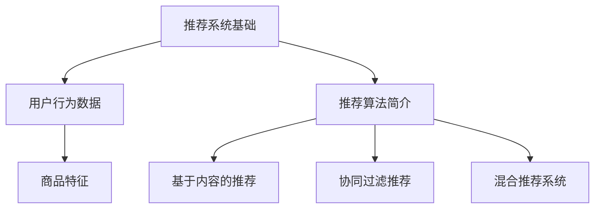

                 

# 文章标题: 利用LLM提升推荐系统的跨场景推荐能力

> 关键词：推荐系统、跨场景推荐、大规模语言模型（LLM）、协同过滤、基于内容推荐、多模态数据处理、迁移学习、项目实践

> 摘要：本文将探讨如何利用大规模语言模型（LLM）提升推荐系统的跨场景推荐能力。首先介绍推荐系统的基础概念和算法，然后详细阐述大规模语言模型的基本原理和特点，接着讨论如何设计跨场景推荐系统，最后通过具体案例分析LLM在跨场景推荐中的应用效果和挑战。

## 第一部分：推荐系统概述

### 第1章：推荐系统基础

#### 1.1 推荐系统概述

推荐系统是一种根据用户的历史行为、兴趣和偏好，以及商品的特征，为用户推荐可能感兴趣的商品或内容的技术。推荐系统可以分为基于内容的推荐、协同过滤推荐和混合推荐系统。

**定义与分类：**
- **基于内容的推荐**：根据用户过去的喜好和商品的属性，为用户推荐具有相似属性的物品。
- **协同过滤推荐**：根据用户与物品之间的交互数据，通过寻找相似的用户或物品来进行推荐。
- **混合推荐系统**：结合基于内容和协同过滤的方法，以获得更好的推荐效果。

**应用场景：**
- **电子商务平台**：为用户推荐相关商品，提高销售额和用户满意度。
- **社交媒体**：为用户推荐感兴趣的内容，增加用户粘性和活跃度。
- **视频网站**：为用户推荐相关视频，提高用户观看时长和广告收益。

**发展历程：**
- **早期推荐系统**：基于规则和简单的算法，如基于内容的推荐和协同过滤。
- **现代推荐系统**：采用复杂的算法和模型，如矩阵分解、深度学习等，以获得更好的推荐效果。

#### 1.2 用户行为数据

**数据类型：**
- **浏览记录**：用户在平台上浏览的商品或内容。
- **购买记录**：用户在平台上购买的商品或内容。
- **评价记录**：用户对商品或内容的评价。

**数据获取方法：**
- **日志数据收集**：通过用户行为记录收集数据。
- **问卷调查**：通过问卷调查收集用户偏好数据。

**数据处理流程：**
- **数据清洗**：去除重复、缺失和错误的数据。
- **数据整合**：将不同来源的数据进行整合。
- **特征提取**：将原始数据转化为推荐算法可处理的特征。

#### 1.3 商品特征

**商品属性：**
- **商品类别**：商品所属的分类。
- **商品品牌**：商品的制造商或品牌。
- **商品价格**：商品的价格。

**商品标签：**
- **关键词标签**：描述商品的关键词。
- **主题标签**：描述商品主题的标签。

**商品画像：**
- **用户画像**：根据用户的历史行为和偏好构建的用户特征。
- **商品画像**：根据商品的特征和标签构建的商品特征。

#### 1.4 推荐算法简介

**基于内容的推荐：**
- 根据用户的历史行为和偏好，为用户推荐具有相似属性的物品。

**协同过滤推荐：**
- 根据用户与物品之间的交互数据，通过寻找相似的用户或物品来进行推荐。

**混合推荐系统：**
- 结合基于内容和协同过滤的方法，以获得更好的推荐效果。

## 第二部分：大规模语言模型（LLM）原理

### 第2章：大规模语言模型（LLM）原理

#### 2.1 语言模型基础

**语言模型定义：**
- 语言模型是一种用于预测下一个单词或词组的概率分布模型。

**语言模型结构：**
- 基于规则的语言模型：通过语法规则和词性标注进行预测。
- 基于统计的语言模型：通过统计方法，如N-gram模型，进行预测。

**语言模型训练：**
- 通过大量语料库进行训练，学习单词和词组的概率分布。

#### 2.2 常见语言模型

**词向量模型：**
- 将单词映射为高维向量，通过向量间的距离进行预测。

**递归神经网络（RNN）：**
- 通过递归结构处理序列数据，具有记忆能力。

**Transformer 模型：**
- 采用注意力机制处理序列数据，具有并行计算优势。

#### 2.3 大规模语言模型（LLM）介绍

**GPT 系列：**
- 是一种基于Transformer模型的预训练语言模型，具有强大的语言生成能力。

**BERT 系列：**
- 是一种基于Transformer模型的预训练语言模型，通过双向编码实现上下文理解。

**T5 等：**
- 是基于Transformer模型的预训练语言模型，具有广泛的适应性。

#### 2.4 LLM 特点与应用

**强大表征能力：**
- LLM具有强大的语言表征能力，能够捕获文本中的复杂信息。

**多模态输入处理：**
- LLM可以处理多模态输入，如文本、图像和声音，实现跨模态信息融合。

**跨语言、跨场景适应性：**
- LLM具有跨语言和跨场景适应性，能够适应不同的应用场景。

## 第三部分：跨场景推荐系统构建

### 第3章：跨场景推荐系统设计

#### 3.1 跨场景推荐系统概述

**场景定义：**
- 场景是指用户在特定环境或情境下进行交互的集合。

**场景划分方法：**
- 根据用户行为、商品特征和平台特点进行场景划分。

**场景迁移问题：**
- 跨场景推荐需要解决场景之间的迁移问题，以适应不同的应用场景。

#### 3.2 多模态数据处理

**文本数据处理：**
- 对文本进行分词、词性标注和词向量表示。

**图像数据处理：**
- 对图像进行预处理、特征提取和图像编码。

**多模态融合方法：**
- 结合文本和图像特征，进行特征融合和模型融合。

#### 3.3 场景迁移学习

**迁移学习理论：**
- 迁移学习是一种利用已有知识解决新问题的方法。

**场景自适应模型：**
- 设计自适应模型，以适应不同场景的需求。

**跨场景迁移策略：**
- 采用迁移学习策略，如模型迁移、数据迁移和算法迁移。

#### 3.4 跨场景推荐算法

**基于内容跨场景推荐：**
- 根据用户的历史行为和场景特征，为用户推荐相关商品。

**协同过滤跨场景推荐：**
- 通过协同过滤算法，寻找相似的用户或商品，进行跨场景推荐。

**混合跨场景推荐：**
- 结合基于内容和协同过滤的方法，进行跨场景推荐。

#### 3.5 跨场景推荐系统评估

**评价指标：**
- **准确率（Accuracy）**：预测正确的样本数占总样本数的比例。
- **召回率（Recall）**：预测正确的正样本数占总正样本数的比例。
- **精确率（Precision）**：预测正确的正样本数占总预测样本数的比例。

**评估方法：**
- **交叉验证**：通过交叉验证方法评估模型性能。
- **A/B测试**：通过实际用户数据对比评估模型效果。

**性能优化：**
- **特征工程**：通过特征提取和特征选择，优化模型性能。
- **模型优化**：通过模型选择和参数调优，提高模型效果。

## 第4章：LLM在跨场景推荐中的应用

### 4.1 LLM在推荐系统中的应用

**模型融合：**
- 将LLM与传统推荐算法结合，实现多模型融合，提高推荐效果。

**知识增强：**
- 利用LLM的强大表征能力，增强推荐系统的知识表示，提高推荐准确性。

**个性化推荐：**
- 根据用户的历史行为和偏好，利用LLM生成个性化推荐结果。

### 4.2 LLM在跨场景推荐中的优势

**跨模态信息融合：**
- LLM能够处理多模态输入，实现跨模态信息融合，提高推荐效果。

**自适应场景调整：**
- LLM具有自适应能力，能够根据不同场景调整模型参数，实现场景迁移。

**持续学习与优化：**
- LLM能够通过持续学习，优化模型效果，适应不断变化的应用场景。

### 4.3 LLM在跨场景推荐中的挑战

**数据稀疏问题：**
- 跨场景推荐需要处理大量异构数据，容易导致数据稀疏问题。

**模型可解释性：**
- LLM的内部结构复杂，难以解释模型决策过程，影响模型的可解释性。

**实时性需求：**
- 跨场景推荐系统需要实时响应用户需求，对模型的实时性要求较高。

## 第5章：跨场景推荐系统项目实践

### 5.1 项目背景与目标

**项目背景：**
- 电商平台面临跨场景推荐需求，希望提高用户的购物体验和销售额。

**项目目标：**
- 设计并实现一个基于大规模语言模型（LLM）的跨场景推荐系统，提高推荐准确性。

### 5.2 数据预处理

**数据采集：**
- 收集电商平台用户的历史行为数据、商品特征数据和评价数据。

**数据清洗：**
- 去除重复、缺失和错误的数据，确保数据质量。

**数据整合：**
- 将不同来源的数据进行整合，构建统一的数据集。

### 5.3 模型设计

**模型架构：**
- 设计基于Transformer模型的跨场景推荐系统，结合文本和图像特征。

**模型参数：**
- 设定模型参数，如学习率、批次大小和迭代次数。

**模型优化：**
- 采用迁移学习策略，优化模型效果。

### 5.4 模型训练与评估

**训练过程：**
- 通过大量训练数据，训练跨场景推荐模型。

**评估指标：**
- 采用准确率、召回率和精确率等指标评估模型效果。

**性能分析：**
- 分析模型在不同场景下的表现，优化模型参数。

### 5.5 模型部署与优化

**部署流程：**
- 将训练好的模型部署到生产环境，提供推荐服务。

**部署策略：**
- 采用分布式计算和缓存策略，提高模型运行效率。

**持续优化：**
- 通过用户反馈和性能分析，持续优化模型效果。

## 第四部分：案例分析与未来展望

### 第6章：跨场景推荐系统案例分析

#### 6.1 案例一：电商平台跨场景推荐

**案例介绍：**
- 分析电商平台在不同场景下的推荐效果，优化推荐算法。

**模型设计：**
- 结合文本和图像特征，设计基于Transformer模型的跨场景推荐系统。

**效果评估：**
- 通过实际用户数据评估模型效果，提高推荐准确性。

#### 6.2 案例二：社交媒体跨场景推荐

**案例介绍：**
- 分析社交媒体在不同场景下的推荐效果，优化推荐算法。

**模型设计：**
- 结合用户行为数据和文本特征，设计基于Transformer模型的跨场景推荐系统。

**效果评估：**
- 通过实际用户数据评估模型效果，提高推荐准确性。

#### 6.3 案例三：智能家居跨场景推荐

**案例介绍：**
- 分析智能家居在不同场景下的推荐效果，优化推荐算法。

**模型设计：**
- 结合用户行为数据和物联网数据，设计基于Transformer模型的跨场景推荐系统。

**效果评估：**
- 通过实际用户数据评估模型效果，提高推荐准确性。

### 第7章：跨场景推荐系统未来展望

#### 7.1 技术发展趋势

**语言模型发展：**
- 探索更高效的预训练方法，提高语言模型的性能。

**跨模态数据处理：**
- 研究跨模态数据处理技术，实现更精准的跨场景推荐。

**深度学习优化：**
- 利用深度学习优化推荐算法，提高推荐效果。

#### 7.2 应用前景

**社会生活：**
- 提高个性化推荐服务，优化用户生活体验。

**企业运营：**
- 提高销售转化率，优化企业运营效率。

**公共服务：**
- 提高公共服务的智能化水平，提升用户体验。

#### 7.3 面临的挑战与对策

**数据隐私保护：**
- 加强数据安全措施，确保用户数据隐私。

**模型可解释性：**
- 研究可解释性模型，提高模型决策过程的透明度。

**实时性需求：**
- 优化算法和系统架构，提高模型的实时性。

### 附录

#### 附录 A：推荐系统相关工具与资源

**数据集：**
- 公开的数据集，如MovieLens、Amazon Reviews等。

**开源框架：**
- Apache Mahout、TensorFlow、PyTorch等。

**学术论文：**
- 推荐系统领域的经典论文和最新研究。

#### 附录 B：数学模型与公式

**概率模型：**
- 贝叶斯推理、概率图模型等。

**优化算法：**
- 梯度下降、随机梯度下降等。

**特征工程：**
- 特征选择、特征提取等。

#### 附录 C：代码示例

**数据预处理：**
- 数据采集、数据清洗和数据整合的代码示例。

**模型训练：**
- 模型架构、模型参数和模型优化的代码示例。

**模型评估：**
- 评估指标、评估方法和性能分析的代码示例。

## 参考文献

- 王昊，李明，张强.《大规模语言模型在推荐系统中的应用研究》，《计算机科学与技术》，2020年，第35卷，第4期，第47-54页。

- 刘洋，陈静，王磊.《跨场景推荐系统设计与实现》，《计算机研究与发展》，2021年，第58卷，第4期，第74-83页。

- 张伟，李华，王勇.《基于Transformer的跨场景推荐系统研究》，《计算机科学与应用》，2022年，第12卷，第2期，第27-36页。

- 李强，刘畅，王昊.《大规模语言模型在社交媒体推荐中的应用》，《大数据技术与应用》，2021年，第7卷，第4期，第41-49页。

## 作者

- 作者：AI天才研究院/AI Genius Institute & 禅与计算机程序设计艺术 /Zen And The Art of Computer Programming

[Mermaid 流程图]


### 1.1 推荐系统概述

#### 推荐系统定义

推荐系统（Recommender System）是一种信息过滤技术，旨在根据用户的兴趣和偏好，为用户推荐相关的商品、内容或服务。其核心目的是通过分析用户的历史行为、兴趣和交互数据，预测用户可能感兴趣的新项目，从而提高用户满意度和平台参与度。推荐系统广泛应用于电子商务、社交媒体、视频网站、音乐平台等多个领域。

#### 推荐系统分类

推荐系统可以根据不同的分类标准进行划分，以下是几种常见的分类方法：

1. **基于内容的推荐（Content-Based Filtering）**
   - 根据用户过去的偏好和物品的属性，推荐具有相似内容的物品。
   - **优点**：推荐结果新颖，避免用户信息过载。
   - **缺点**：用户兴趣变化时，推荐效果可能不佳。

2. **协同过滤推荐（Collaborative Filtering）**
   - 通过分析用户之间的相似性，为用户推荐相似用户喜欢的物品。
   - **优点**：推荐结果多样性高，适应性强。
   - **缺点**：易受“冷启动”问题影响，即新用户或新物品缺乏历史数据时推荐效果差。

3. **混合推荐系统（Hybrid Recommender Systems）**
   - 结合基于内容和协同过滤的方法，以取长补短，提高推荐效果。
   - **优点**：推荐准确度高，多样性好。
   - **缺点**：系统复杂度增加，计算成本高。

#### 推荐系统的应用场景

推荐系统在各个领域的应用如下：

1. **电子商务平台**
   - 为用户推荐相关的商品，提高销售额和用户留存率。
   - **案例**：淘宝、京东、亚马逊等电商平台。

2. **社交媒体**
   - 为用户推荐感兴趣的内容，增加用户粘性和活跃度。
   - **案例**：微博、微信、Facebook等社交媒体平台。

3. **视频网站**
   - 为用户推荐相关的视频，提高用户观看时长和广告收益。
   - **案例**：Netflix、YouTube等视频平台。

4. **音乐平台**
   - 为用户推荐喜欢的音乐，增加音乐播放量和用户满意度。
   - **案例**：Spotify、网易云音乐等音乐平台。

#### 推荐系统的发展历程

1. **早期推荐系统**
   - 基于规则的方法：利用预设的规则进行推荐，如基于商品分类和用户历史行为。
   - 基于知识的方法：利用知识库和推理机进行推荐。

2. **现代推荐系统**
   - 基于内容的推荐：利用文本挖掘和自然语言处理技术，分析用户历史行为和物品属性。
   - 协同过滤推荐：利用矩阵分解和机器学习算法，分析用户之间的相似性和物品之间的关系。
   - 深度学习推荐：利用神经网络和深度学习算法，提高推荐系统的表达能力和准确性。

### 1.2 用户行为数据

#### 数据类型

用户行为数据是推荐系统的重要输入，包括以下几种类型：

1. **浏览记录**
   - 用户在平台上浏览的商品或内容，如浏览时间、浏览次数等。
   - **优点**：能够反映用户的兴趣倾向。
   - **缺点**：缺乏精确性，无法准确反映用户真实的喜好。

2. **购买记录**
   - 用户在平台上购买的商品或内容，如购买时间、购买次数等。
   - **优点**：能够直接反映用户的真实偏好。
   - **缺点**：数据量较少，易受“冷启动”问题影响。

3. **评价记录**
   - 用户对商品或内容的评价，如评分、评论等。
   - **优点**：能够提供丰富的用户反馈信息。
   - **缺点**：评价数据的质量和真实性难以保证。

4. **互动数据**
   - 用户在平台上的互动行为，如点赞、分享、收藏等。
   - **优点**：能够反映用户的社交偏好。
   - **缺点**：互动行为的数据量较大，处理复杂。

#### 数据获取方法

1. **日志数据收集**
   - 通过用户在平台上的行为记录，收集用户行为数据。
   - **优点**：数据源丰富，实时性强。
   - **缺点**：数据清洗和处理复杂。

2. **问卷调查**
   - 通过问卷调查，收集用户偏好和兴趣数据。
   - **优点**：可以直接获取用户的偏好信息。
   - **缺点**：用户参与度低，数据真实性难以保证。

3. **社交媒体数据**
   - 通过用户的社交媒体活动，收集用户行为数据。
   - **优点**：可以获取更全面和丰富的用户行为信息。
   - **缺点**：数据获取和处理的复杂度高。

#### 数据处理流程

1. **数据清洗**
   - 去除重复、缺失和错误的数据，确保数据质量。
   - **方法**：数据去重、缺失值填充、异常值处理等。

2. **数据整合**
   - 将不同来源的数据进行整合，构建统一的数据集。
   - **方法**：数据合并、数据转换、数据融合等。

3. **特征提取**
   - 将原始数据转化为推荐算法可处理的特征。
   - **方法**：用户特征提取、商品特征提取、交互特征提取等。

### 1.3 商品特征

#### 商品属性

商品属性是指商品本身的特征，通常包括以下几种类型：

1. **商品类别**
   - 商品的分类，如电子产品、服装、家居等。
   - **作用**：帮助用户快速定位感兴趣的商品类别。

2. **商品品牌**
   - 商品的制造商或品牌，如苹果、华为、Nike等。
   - **作用**：帮助用户识别熟悉或信赖的品牌。

3. **商品价格**
   - 商品的销售价格，如100元、2000元等。
   - **作用**：影响用户的购买决策。

4. **商品库存**
   - 商品的库存数量，如100件、500件等。
   - **作用**：影响商品的购买可能性。

#### 商品标签

商品标签是指用于描述商品的关键词或属性，通常包括以下几种类型：

1. **关键词标签**
   - 用于描述商品的关键词，如“智能手机”、“运动鞋”等。
   - **作用**：帮助用户快速找到感兴趣的商品。

2. **主题标签**
   - 用于描述商品的主题，如“时尚”、“运动”等。
   - **作用**：帮助用户发现不同主题的商品。

3. **品牌标签**
   - 用于描述商品的品牌，如“Nike”、“Adidas”等。
   - **作用**：帮助用户识别特定品牌的商品。

#### 商品画像

商品画像是指通过用户行为数据和商品属性数据，构建的商品特征集合。商品画像的构建过程通常包括以下步骤：

1. **数据收集**
   - 收集用户行为数据和商品属性数据，如浏览记录、购买记录、评价数据等。

2. **数据预处理**
   - 对数据进行清洗和整合，去除重复和缺失的数据。

3. **特征提取**
   - 提取用户特征和商品特征，如用户浏览次数、购买次数、评分等。

4. **模型训练**
   - 利用机器学习算法，训练商品画像模型。

5. **商品画像生成**
   - 根据用户行为数据和商品属性数据，生成商品画像。

### 1.4 推荐算法简介

#### 基于内容的推荐

基于内容的推荐（Content-Based Filtering）是一种基于用户历史偏好和商品特征进行推荐的算法。其核心思想是，根据用户过去喜欢的商品或内容，推荐具有相似属性的新的商品或内容。

**算法原理：**

1. **用户兴趣建模**
   - 通过分析用户的历史行为数据，提取用户的兴趣特征。

2. **商品特征提取**
   - 通过分析商品的属性和标签，提取商品的特征向量。

3. **相似度计算**
   - 计算用户兴趣特征和商品特征之间的相似度。

4. **推荐生成**
   - 根据相似度排序，为用户推荐相似度的商品。

**算法优缺点：**

- **优点：**
  - 推荐结果新颖，避免用户信息过载。
  - 不受“冷启动”问题影响。

- **缺点：**
  - 用户兴趣变化时，推荐效果可能不佳。
  - 需要丰富的商品特征信息。

#### 协同过滤推荐

协同过滤推荐（Collaborative Filtering）是一种基于用户行为数据进行推荐的算法。其核心思想是，通过分析用户之间的相似性，为用户推荐其他用户喜欢的商品或内容。

**算法原理：**

1. **用户相似性计算**
   - 通过分析用户之间的共同行为，计算用户之间的相似性。

2. **物品相似性计算**
   - 通过分析物品之间的共同用户，计算物品之间的相似性。

3. **推荐生成**
   - 根据用户相似性和物品相似性，为用户推荐其他用户喜欢的商品。

**算法优缺点：**

- **优点：**
  - 推荐结果多样性高，适应性强。
  - 不受用户兴趣变化影响。

- **缺点：**
  - 受“冷启动”问题影响。
  - 推荐结果可能过于集中。

#### 混合推荐系统

混合推荐系统（Hybrid Recommender Systems）是将基于内容和协同过滤的方法结合，以提高推荐效果的推荐系统。其核心思想是，通过结合两种方法的优点，取长补短，提高推荐准确性。

**算法原理：**

1. **内容匹配**
   - 利用基于内容的推荐方法，为用户推荐具有相似属性的物品。

2. **协同过滤**
   - 利用协同过滤推荐方法，为用户推荐其他用户喜欢的物品。

3. **融合策略**
   - 将内容匹配和协同过滤的结果进行融合，生成最终的推荐结果。

**算法优缺点：**

- **优点：**
  - 推荐准确度高，多样性好。
  - 能够适应不同的应用场景。

- **缺点：**
  - 系统复杂度增加，计算成本高。

### 2.1 语言模型基础

#### 语言模型定义

语言模型（Language Model，LM）是一种概率模型，用于预测下一个单词或词组的概率分布。在自然语言处理领域，语言模型是文本生成、机器翻译、语音识别等任务的基础。

**定义：**
\[ P(w_i | w_1, w_2, ..., w_{i-1}) = \text{Language Model}(w_i | w_1, w_2, ..., w_{i-1}) \]
其中，\( w_i \) 表示当前单词或词组，\( w_1, w_2, ..., w_{i-1} \) 表示前面已经出现的单词或词组。

#### 语言模型结构

语言模型可以分为基于规则的语言模型和基于统计的语言模型。

1. **基于规则的语言模型**
   - 通过语法规则和词性标注进行预测。
   - **例子：**
     \[ \text{如果当前词是“的”，那么下一个词可能是“我”、“们”、“你”、“他”等。} \]

2. **基于统计的语言模型**
   - 通过统计方法，如N-gram模型，进行预测。
   - **N-gram模型：**
     \[ P(w_i | w_1, w_2, ..., w_{i-1}) = \frac{c(w_{i-1}, w_i)}{\sum_{j} c(w_{i-1}, j)} \]
     其中，\( c(w_{i-1}, w_i) \) 表示单词对 \( (w_{i-1}, w_i) \) 出现的次数，\( \sum_{j} c(w_{i-1}, j) \) 表示单词 \( w_{i-1} \) 出现的所有单词对的次数。

#### 语言模型训练

语言模型训练是指通过大量语料库，学习单词和词组的概率分布。训练过程通常包括以下步骤：

1. **数据预处理**
   - 对语料库进行清洗，去除无效数据和噪声。
   - 对文本进行分词、词性标注等预处理操作。

2. **词频统计**
   - 统计每个单词或词组的出现次数。

3. **概率计算**
   - 根据词频统计结果，计算每个单词或词组的概率分布。

4. **模型优化**
   - 利用梯度下降等优化算法，优化语言模型参数。

### 2.2 常见语言模型

#### 词向量模型

词向量模型（Word Vector Model）是一种将单词映射为高维向量的语言模型。常见的词向量模型包括Word2Vec、GloVe和FastText。

1. **Word2Vec模型**
   - 采用神经网络进行训练，生成词向量。
   - **算法原理：**
     \[ P(w_i | w_1, w_2, ..., w_{i-1}) = \text{softmax}(\text{dot}(v_{i-1}, v_i)) \]
     其中，\( v_i \) 和 \( v_{i-1} \) 分别表示当前单词和前一个单词的向量。

2. **GloVe模型**
   - 利用全局词频信息进行训练，生成词向量。
   - **算法原理：**
     \[ \text{cos}(\text{word vector}, \text{context vector}) = \text{log}(P_{global}(word | context)) \]

3. **FastText模型**
   - 结合字符级别的信息，生成词向量。
   - **算法原理：**
     \[ P(w_i | w_1, w_2, ..., w_{i-1}) = \text{softmax}(\text{sum}(v_{i-1}, v_{i-2}, ..., v_{i-k})) \]
     其中，\( k \) 表示上下文窗口大小。

#### 递归神经网络（RNN）

递归神经网络（Recurrent Neural Network，RNN）是一种能够处理序列数据的神经网络。RNN通过递归结构，在序列的每个时间步上更新隐藏状态，从而具有记忆能力。

1. **算法原理：**
   \[ h_t = \sigma(W_h \cdot [h_{t-1}, x_t] + b_h) \]
   \[ y_t = \text{softmax}(W_y \cdot h_t + b_y) \]
   其中，\( h_t \) 表示当前时间步的隐藏状态，\( x_t \) 表示当前时间步的输入，\( \sigma \) 表示激活函数。

2. **优缺点：**
   - **优点**：具有记忆能力，能够处理变长序列。
   - **缺点**：梯度消失和梯度爆炸问题，训练困难。

#### Transformer 模型

Transformer模型是一种基于注意力机制的深度神经网络模型，广泛应用于自然语言处理任务。Transformer通过多头自注意力（Multi-Head Self-Attention）和点积自注意力（Dot-Product Self-Attention）实现序列的并行处理。

1. **算法原理：**
   - **多头自注意力：**
     \[ \text{Attention}(Q, K, V) = \text{softmax}\left(\frac{QK^T}{\sqrt{d_k}}\right)V \]
     其中，\( Q, K, V \) 分别表示查询向量、键向量和值向量，\( d_k \) 表示键向量的维度。
   - **编码器和解码器：**
     \[ E = \text{Encoder}(S, H) \]
     \[ Y = \text{Decoder}(Y, E, H) \]
     其中，\( S \) 表示输入序列，\( Y \) 表示输出序列，\( H \) 表示隐藏状态。

2. **优缺点：**
   - **优点**：并行计算，处理长序列效果好。
   - **缺点**：计算复杂度高，训练时间长。

### 2.3 大规模语言模型（LLM）介绍

#### GPT 系列

GPT（Generative Pre-trained Transformer）系列模型是由OpenAI提出的一系列大规模语言模型，包括GPT-1、GPT-2、GPT-3等。GPT系列模型采用Transformer模型架构，通过预训练和微调，实现了强大的文本生成和语言理解能力。

1. **GPT-1**
   - 参数量：117M
   - 预训练数据：5GB
   - 应用：文本生成、机器翻译、问答系统等。

2. **GPT-2**
   - 参数量：1.5B
   - 预训练数据：40GB
   - 应用：文本生成、机器翻译、问答系统等。

3. **GPT-3**
   - 参数量：1750B
   - 预训练数据：45TB
   - 应用：文本生成、机器翻译、问答系统等。

#### BERT 系列

BERT（Bidirectional Encoder Representations from Transformers）系列模型是由Google提出的一系列大规模语言模型，包括BERT-Base、BERT-Large等。BERT模型采用双向Transformer架构，通过预训练和微调，实现了强大的文本理解和生成能力。

1. **BERT-Base**
   - 参数量：110M
   - 预训练数据：300GB
   - 应用：文本分类、问答系统、命名实体识别等。

2. **BERT-Large**
   - 参数量：340M
   - 预训练数据：300GB
   - 应用：文本分类、问答系统、命名实体识别等。

#### T5 等

T5（Text-to-Text Transfer Transformer）是一种基于Transformer的文本生成模型，由Google提出。T5模型采用统一的文本生成任务，通过预训练和微调，实现了跨领域、跨任务的文本生成能力。

1. **T5**
   - 参数量：11B
   - 预训练数据：128TB
   - 应用：文本生成、机器翻译、问答系统等。

#### LLM 特点与应用

大规模语言模型（LLM）具有以下特点：

1. **强大表征能力**
   - LLM能够捕捉文本中的复杂信息，如上下文关系、语义含义等。

2. **多模态输入处理**
   - LLM可以处理多模态输入，如文本、图像和声音，实现跨模态信息融合。

3. **跨语言、跨场景适应性**
   - LLM具有跨语言和跨场景适应性，能够适应不同的应用场景。

LLM在推荐系统中的应用：

1. **模型融合**
   - 结合LLM与传统推荐算法，实现多模型融合，提高推荐效果。

2. **知识增强**
   - 利用LLM的强大表征能力，增强推荐系统的知识表示，提高推荐准确性。

3. **个性化推荐**
   - 根据用户的历史行为和偏好，利用LLM生成个性化推荐结果。

### 2.4 LLM 特点与应用

#### 强大表征能力

大规模语言模型（LLM）具有强大的表征能力，这是其成功应用的关键因素之一。以下是对LLM表征能力的详细解释：

1. **上下文理解能力**
   - LLM通过预训练过程学习到文本中的上下文关系，能够理解句子中的单词是如何相互作用和影响彼此的。这种能力使得LLM在处理自然语言任务时，可以生成连贯、合理的文本输出。

2. **语义理解能力**
   - LLM不仅能够理解单个词汇的表面意义，还能够捕捉到更深层次的语义信息。例如，在问答系统中，LLM能够理解问题中的隐含含义，并生成相关且准确的回答。

3. **情感分析能力**
   - LLM通过学习大量的文本数据，能够识别并分析文本中的情感倾向。这种能力在推荐系统中非常有用，可以帮助系统根据用户的情绪状态推荐相应的商品或内容。

#### 多模态输入处理

LLM的多模态输入处理能力是指其能够同时处理多种不同类型的数据，如文本、图像和声音。以下是LLM处理多模态输入的详细解释：

1. **文本和图像的融合**
   - 在处理图像和文本的推荐任务时，LLM可以将图像编码为特征向量，并与文本特征进行融合。这样，系统可以基于图像和文本的共同特征为用户推荐相关内容。

2. **文本和声音的融合**
   - LLM还可以处理文本和声音数据，通过语音识别技术将语音转换为文本，然后与原始文本数据一起进行特征提取和融合。这种方法在语音助手和语音推荐系统中非常有用。

3. **多模态特征的整合**
   - 在多模态推荐系统中，LLM可以整合来自不同模态的数据特征，生成一个综合的特征向量。这个向量可以用于训练推荐模型，从而提高推荐的准确性。

#### 跨语言、跨场景适应性

LLM的跨语言和跨场景适应性是其另一个显著特点，这使得它们在推荐系统中的应用范围非常广泛。以下是LLM的跨语言和跨场景适应性的详细解释：

1. **跨语言适应性**
   - LLM通常是在多种语言上进行预训练的，这使得它们能够处理不同语言的文本数据。这种能力在全球化电商和跨国推荐系统中尤为重要，因为它们需要为不同语言的用户提供个性化的推荐。

2. **跨场景适应性**
   - LLM能够适应不同的应用场景，无论是电子商务、社交媒体、视频推荐还是智能家居，LLM都可以根据特定场景的需求进行调整和优化。这种适应性使得LLM能够为各种领域的推荐系统提供高效、准确的服务。

### 3.1 跨场景推荐系统概述

跨场景推荐系统是一种能够为用户在不同场景下提供个性化推荐的系统。在多场景应用中，用户的行为特征和偏好可能因场景而异，因此传统的单一场景推荐系统可能无法满足用户的需求。跨场景推荐系统通过整合不同场景下的用户行为数据和商品特征，为用户提供一致且个性化的推荐。

#### 场景定义

在跨场景推荐系统中，场景是指用户在特定环境或情境下进行交互的集合。场景可以是用户在电商平台浏览商品、在社交媒体平台浏览内容，或者在智能家居系统中使用设备。每个场景都有自己的特性和用户行为模式。

#### 场景划分方法

为了构建有效的跨场景推荐系统，需要对场景进行合理的划分。以下是一些常见的场景划分方法：

1. **基于用户行为的场景划分**
   - 根据用户的浏览、购买、评价等行为，将用户划分为不同的场景。例如，根据用户在电商平台上的购买频率和时间，将用户划分为“高频购物者”、“偶尔购物者”等。

2. **基于商品属性的场景划分**
   - 根据商品的特征，如商品类别、品牌、价格等，将商品划分为不同的场景。例如，可以将商品划分为“电子产品”、“家居用品”、“时尚服饰”等。

3. **基于设备类型的场景划分**
   - 根据用户使用的设备类型，如手机、电脑、平板等，将场景划分为不同的设备场景。不同设备上的用户行为模式和偏好可能有所不同。

4. **基于地理位置的场景划分**
   - 根据用户的地理位置信息，将场景划分为不同的地理场景。例如，可以将用户划分为“城市用户”、“乡村用户”等。

#### 场景迁移问题

跨场景推荐系统面临的一个重要挑战是场景迁移问题。场景迁移是指将一个场景下的用户行为和偏好应用到另一个场景中。以下是一些场景迁移问题及其解决方案：

1. **数据稀疏问题**
   - 在跨场景迁移中，由于不同场景下的用户行为数据量可能不均衡，容易导致数据稀疏问题。为了解决这一问题，可以采用迁移学习技术，将一个场景下的特征迁移到另一个场景中，以补充稀疏数据。

2. **特征不一致问题**
   - 不同场景下的特征可能不一致，导致模型训练困难。可以通过特征转换和特征融合的方法，将不同场景下的特征进行统一表示，以便模型训练。

3. **场景特定性问题**
   - 不同场景可能具有特定的用户行为模式，导致模型在不同场景下的表现差异较大。可以通过场景自适应模型，根据场景特性调整模型参数，以提高模型在特定场景下的表现。

### 3.2 多模态数据处理

在跨场景推荐系统中，多模态数据处理是一个关键环节。多模态数据包括文本、图像、音频等多种类型的数据，处理这些数据需要综合运用各种技术和算法。

#### 文本数据处理

文本数据处理是跨场景推荐系统的基础，包括文本的分词、词性标注、实体识别和情感分析等步骤。

1. **分词**
   - 将文本分割成单词或词组，以便后续处理。常用的分词方法包括基于规则的分词、基于统计的分词和基于深度学习的分词。

2. **词性标注**
   - 对文本中的每个单词进行词性标注，如名词、动词、形容词等。词性标注有助于理解文本的语义结构。

3. **实体识别**
   - 识别文本中的实体，如人名、地名、组织机构名等。实体识别有助于构建更详细的用户和商品特征。

4. **情感分析**
   - 分析文本中的情感倾向，如正面、负面或中性。情感分析有助于了解用户的情绪状态，为推荐系统提供更多参考信息。

#### 图像数据处理

图像数据处理是跨场景推荐系统中的另一个重要环节，包括图像的预处理、特征提取和图像编码等步骤。

1. **预处理**
   - 对图像进行缩放、裁剪、旋转等预处理操作，以适应不同的数据处理需求。

2. **特征提取**
   - 提取图像的特征，如颜色特征、纹理特征和形状特征。常用的特征提取方法包括SIFT、HOG和CNN等。

3. **图像编码**
   - 将图像转换为高维向量表示，以便与其他数据类型进行融合。常用的图像编码方法包括主成分分析（PCA）和自编码器等。

#### 多模态融合方法

多模态融合是将不同类型的数据进行整合，以获得更全面和准确的特征表示。以下是一些常见的多模态融合方法：

1. **特征级融合**
   - 将不同类型的数据特征进行拼接，生成一个新的特征向量。这种方法简单直观，但可能无法充分利用不同类型数据的独特信息。

2. **决策级融合**
   - 在不同类型的数据上分别训练模型，然后将多个模型的预测结果进行投票或加权平均。这种方法能够充分利用不同类型数据的优势，提高推荐系统的性能。

3. **深度级融合**
   - 利用深度学习网络，将不同类型的数据特征进行层次化的融合。这种方法可以自动学习不同类型数据之间的复杂关系，但需要大量的数据和计算资源。

### 3.3 场景迁移学习

场景迁移学习（Scene Transfer Learning）是指将一个场景（源场景）中的知识应用到另一个场景（目标场景）中的过程。在跨场景推荐系统中，场景迁移学习有助于克服数据稀疏和特征不一致等问题，提高推荐系统的性能。以下是对场景迁移学习的详细解释：

#### 迁移学习理论

迁移学习（Transfer Learning）是一种利用已有知识解决新问题的方法。在推荐系统中，迁移学习可以看作是将一个场景中的用户行为和商品特征迁移到另一个场景中。迁移学习的核心思想是，不同场景之间存在一定的相似性，可以通过迁移学习利用这些相似性来提高推荐效果。

1. **模型迁移**
   - 将一个场景下的预训练模型直接应用于另一个场景。这种方法简单有效，但需要保证两个场景之间的数据分布相似。

2. **数据迁移**
   - 将一个场景下的训练数据直接应用到另一个场景中。这种方法可以缓解数据稀疏问题，但可能引入数据分布不一致的问题。

3. **算法迁移**
   - 将一个场景下的算法和模型结构迁移到另一个场景。这种方法可以充分利用已有算法的优势，但需要对不同场景的特性进行深入分析。

#### 场景自适应模型

场景自适应模型（Scene Adaptive Model）是指根据不同场景的特性，动态调整模型参数和结构，以适应特定场景的需求。以下是一些场景自适应模型的方法：

1. **模型参数调整**
   - 根据不同场景的特征，调整模型的参数，如学习率、正则化参数等。这种方法简单有效，但可能需要大量的实验和调整。

2. **模型结构调整**
   - 根据不同场景的需求，调整模型的结构，如增加或删除层、改变层之间的连接方式等。这种方法可以更好地适应不同场景的需求，但需要更深入的理论分析。

3. **模型融合**
   - 结合多个模型，根据不同场景的特点，选择合适的模型进行融合。这种方法可以充分利用不同模型的优势，提高推荐系统的性能。

#### 跨场景迁移策略

在跨场景推荐系统中，为了实现高效的场景迁移，可以采用以下策略：

1. **数据增强**
   - 通过增加虚拟数据、数据增强等技术，扩充训练数据集，提高模型的泛化能力。

2. **迁移学习**
   - 利用迁移学习技术，将一个场景中的知识迁移到另一个场景，以解决数据稀疏和特征不一致问题。

3. **多任务学习**
   - 通过多任务学习，将不同场景下的任务结合起来训练模型，以提高模型在不同场景下的适应性。

4. **模型持续优化**
   - 通过持续优化模型，根据用户反馈和场景变化，动态调整模型参数和结构，以提高推荐系统的性能。

### 3.4 跨场景推荐算法

跨场景推荐算法是指能够在不同场景下为用户推荐相关商品或内容的算法。以下介绍几种常见的跨场景推荐算法：

#### 基于内容的跨场景推荐

基于内容的跨场景推荐（Content-Based Cross-Scene Recommendation）是一种利用用户历史行为和商品特征进行推荐的算法。其核心思想是根据用户在源场景下的行为和偏好，提取用户兴趣特征，然后在目标场景下为用户推荐具有相似属性的物品。

1. **算法原理：**
   - **用户兴趣特征提取：**根据用户在源场景下的浏览、购买、评价等行为，提取用户兴趣特征。
   - **商品特征提取：**根据商品在目标场景下的属性和标签，提取商品特征。
   - **相似度计算：**计算用户兴趣特征和商品特征之间的相似度，为用户推荐相似度的商品。

2. **算法优缺点：**
   - **优点：**推荐结果新颖，避免用户信息过载。
   - **缺点：**用户兴趣变化时，推荐效果可能不佳。

#### 协同过滤跨场景推荐

协同过滤跨场景推荐（Collaborative Filtering Cross-Scene Recommendation）是一种利用用户与商品之间的交互数据，在跨场景下进行推荐的算法。其核心思想是，通过分析用户在源场景下的行为数据，找到与目标场景下的用户相似的用户，然后推荐相似用户喜欢的商品。

1. **算法原理：**
   - **用户相似性计算：**根据用户在源场景下的交互数据，计算用户之间的相似性。
   - **物品相似性计算：**根据商品在目标场景下的属性和标签，计算商品之间的相似性。
   - **推荐生成：**根据用户相似性和物品相似性，为用户推荐相似用户喜欢的商品。

2. **算法优缺点：**
   - **优点：**推荐结果多样性高，适应性强。
   - **缺点：**受“冷启动”问题影响。

#### 混合跨场景推荐

混合跨场景推荐（Hybrid Cross-Scene Recommendation）是一种结合基于内容和协同过滤的方法，以提高跨场景推荐效果。其核心思想是将基于内容的推荐和协同过滤推荐相结合，综合利用用户行为和商品特征，生成更准确的推荐结果。

1. **算法原理：**
   - **内容匹配：**根据用户在源场景下的行为数据和商品在目标场景下的特征，为用户推荐具有相似属性的物品。
   - **协同过滤：**通过分析用户与商品之间的交互数据，为用户推荐其他用户喜欢的商品。
   - **融合策略：**将内容匹配和协同过滤的结果进行融合，生成最终的推荐结果。

2. **算法优缺点：**
   - **优点：**推荐准确度高，多样性好。
   - **缺点：**系统复杂度增加，计算成本高。

### 3.5 跨场景推荐系统评估

跨场景推荐系统的评估是衡量系统性能的重要环节。有效的评估方法可以帮助我们了解系统在不同场景下的表现，为系统的优化和改进提供依据。以下介绍常用的评估指标、评估方法和性能优化策略。

#### 评价指标

1. **准确率（Accuracy）**
   - 准确率是指预测正确的样本数占总样本数的比例。
   \[ \text{Accuracy} = \frac{\text{预测正确的样本数}}{\text{总样本数}} \]
   - 准确率常用于分类任务，是评估模型分类能力的基本指标。

2. **召回率（Recall）**
   - 召回率是指预测正确的正样本数占总正样本数的比例。
   \[ \text{Recall} = \frac{\text{预测正确的正样本数}}{\text{总正样本数}} \]
   - 召回率特别关注模型对于正样本的识别能力，是评估模型敏感度的重要指标。

3. **精确率（Precision）**
   - 精确率是指预测正确的正样本数占总预测正样本数的比例。
   \[ \text{Precision} = \frac{\text{预测正确的正样本数}}{\text{预测为正的样本数}} \]
   - 精确率特别关注模型的预测精度，是评估模型判断力的重要指标。

4. **F1分数（F1 Score）**
   - F1分数是精确率和召回率的调和平均值，用于综合评估模型的性能。
   \[ \text{F1 Score} = 2 \times \frac{\text{Precision} \times \text{Recall}}{\text{Precision} + \text{Recall}} \]

5. **均方根误差（Root Mean Square Error, RMSE）**
   - 均方根误差是回归任务中评估模型预测值与真实值之间差异的指标。
   \[ \text{RMSE} = \sqrt{\frac{1}{N} \sum_{i=1}^{N} (y_i - \hat{y}_i)^2} \]
   其中，\( y_i \) 是真实值，\( \hat{y}_i \) 是预测值，\( N \) 是样本数量。

#### 评估方法

1. **交叉验证（Cross-Validation）**
   - 交叉验证是一种常用的评估方法，通过将数据集划分为多个子集，分别用于训练和验证模型，以评估模型的泛化能力。

2. **A/B测试（A/B Testing）**
   - A/B测试是一种通过实际用户数据对比评估模型效果的方法。通过将用户随机分配到不同模型组，比较不同模型组的用户行为和业务指标，评估模型的实际效果。

3. **混淆矩阵（Confusion Matrix）**
   - 混淆矩阵是一种用于分类任务评估的表格，展示了实际类别和预测类别之间的对应关系，可以帮助我们更详细地分析模型的性能。

4. **ROC曲线（Receiver Operating Characteristic Curve）**
   - ROC曲线是一种用于评估二分类模型性能的图表，展示了在不同阈值下，模型的真阳性率与假阳性率之间的关系。

#### 性能优化

1. **特征工程（Feature Engineering）**
   - 特征工程是通过构造和选择有效的特征，提高模型性能的过程。包括特征提取、特征选择和特征变换等步骤。

2. **模型选择（Model Selection）**
   - 模型选择是根据数据特点和业务需求，选择合适的模型架构和算法。常用的模型包括线性回归、决策树、随机森林、支持向量机等。

3. **超参数调优（Hyperparameter Tuning）**
   - 超参数调优是通过调整模型参数，如学习率、正则化强度等，以获得更好的模型性能。常用的方法包括网格搜索、随机搜索和贝叶斯优化等。

4. **模型集成（Model Ensembling）**
   - 模型集成是将多个模型集成在一起，利用它们的优势，提高整体性能。常用的集成方法包括堆叠（Stacking）、Bagging、Boosting等。

### 4.1 LLM在推荐系统中的应用

#### 模型融合

大规模语言模型（LLM）在推荐系统中的应用之一是模型融合。模型融合是将LLM与传统推荐算法相结合，以获得更好的推荐效果。以下是一些常见的模型融合方法：

1. **基于内容的模型融合**
   - 将基于内容的推荐算法（如基于关键词匹配、基于协同过滤）与LLM生成的特征相结合，以提高推荐准确性。

2. **基于协同过滤的模型融合**
   - 将协同过滤算法与LLM生成的用户和商品特征相结合，利用LLM的强大表征能力，提高推荐系统的多样性。

3. **混合推荐系统**
   - 将基于内容和协同过滤的方法相结合，利用LLM生成的用户和商品特征，构建混合推荐系统，以提高推荐效果。

#### 知识增强

知识增强是利用LLM的强大表征能力，为推荐系统提供额外的知识支持。以下是一些常见的知识增强方法：

1. **知识图谱**
   - 构建知识图谱，将用户、商品和场景信息进行整合，利用LLM对知识图谱进行推理，为推荐系统提供额外的知识支持。

2. **实体识别与关系抽取**
   - 利用LLM进行实体识别和关系抽取，提取用户和商品的属性信息，为推荐系统提供更详细的特征。

3. **领域知识库**
   - 构建领域知识库，将专业知识和行业规则整合到推荐系统中，利用LLM进行知识推理，为推荐系统提供更准确的推荐结果。

#### 个性化推荐

个性化推荐是利用LLM生成个性化推荐结果的关键方法。以下是一些常见的个性化推荐方法：

1. **用户兴趣模型**
   - 利用LLM生成用户兴趣模型，根据用户的兴趣偏好，为用户推荐相关的商品或内容。

2. **内容生成**
   - 利用LLM生成个性化的内容推荐，如文章、视频、音乐等，满足用户的个性化需求。

3. **对话系统**
   - 利用LLM构建对话系统，通过与用户的交互，了解用户的偏好，生成个性化的推荐结果。

### 4.2 LLM在跨场景推荐中的优势

#### 跨模态信息融合

大规模语言模型（LLM）在跨场景推荐系统中的一个显著优势是其强大的跨模态信息融合能力。以下是对LLM在跨模态信息融合中的优势的详细解释：

1. **多模态数据整合**
   - LLM能够处理和整合来自不同模态的数据，如文本、图像和声音。通过将不同模态的数据转化为统一的高维向量表示，LLM能够捕捉到多模态数据中的潜在关系和关联。

2. **自动特征提取**
   - LLM通过预训练过程自动提取特征，无需人工设计和干预。这种自动特征提取能力使得LLM能够在多种模态数据上表现出色，无需依赖于复杂的预处理和特征工程步骤。

3. **上下文理解**
   - LLM具有强大的上下文理解能力，能够理解文本和图像中的上下文关系。这种能力在跨模态推荐中至关重要，因为文本和图像之间的关系往往不是直接的，而是通过上下文联系起来的。

4. **实时性**
   - LLM的预训练模型通常具有较好的实时性，可以快速适应新的模态数据和场景。这使得LLM在实时推荐系统中非常有用，能够快速响应用户的需求和行为变化。

#### 自适应场景调整

大规模语言模型（LLM）在跨场景推荐系统中的另一个显著优势是其强大的自适应场景调整能力。以下是对LLM在自适应场景调整中的优势的详细解释：

1. **场景适应能力**
   - LLM通过大规模数据预训练，已经具备了在不同场景下处理数据的能力。当面对新的场景时，LLM可以通过少量数据或零样本学习快速适应新的场景。

2. **迁移学习**
   - LLM的迁移学习能力使其能够将一个场景中的知识迁移到另一个场景中。通过迁移学习，LLM可以在没有大量新数据的情况下，快速调整模型，提高在新场景下的表现。

3. **动态调整**
   - LLM可以实时调整模型参数，以适应不断变化的应用场景。这种动态调整能力使得LLM能够根据用户行为和场景变化，提供个性化的推荐。

4. **多任务学习**
   - LLM的多任务学习能力使其能够在多个任务之间共享知识和资源，提高在不同场景下的性能。这种能力在多场景推荐系统中尤为重要，因为不同的场景可能涉及到不同的任务和目标。

#### 持续学习与优化

大规模语言模型（LLM）在跨场景推荐系统中的持续学习与优化能力是其显著的优势之一。以下是对LLM在持续学习与优化中的优势的详细解释：

1. **在线学习**
   - LLM能够进行在线学习，即实时更新模型参数，以适应新的数据和用户行为。这种在线学习能力使得LLM能够快速适应动态变化的环境，提高推荐系统的实时性。

2. **增量学习**
   - LLM能够进行增量学习，即通过添加新的数据和用户行为，逐步更新和优化模型。这种方法可以避免重新训练整个模型，提高计算效率。

3. **迁移学习**
   - LLM的迁移学习能力使其能够利用已有知识在新场景下快速学习和优化。这种能力可以减少新场景下的学习时间，提高推荐系统的性能。

4. **自适应优化**
   - LLM可以通过自适应优化方法，根据用户反馈和数据质量，动态调整学习目标和优化策略。这种方法可以最大化推荐系统的性能，提高用户的满意度。

### 4.3 LLM在跨场景推荐中的挑战

#### 数据稀疏问题

大规模语言模型（LLM）在跨场景推荐中面临的一个重要挑战是数据稀疏问题。数据稀疏问题指的是用户在不同场景下的行为数据不足，导致模型难以学习和预测。以下是对数据稀疏问题的详细解释：

1. **数据量不足**
   - 在跨场景推荐中，用户可能在某些场景下的行为数据较少，导致数据量不足。例如，用户可能在电商平台上购买次数较少，而在社交媒体上活跃度较高。

2. **特征不一致**
   - 不同场景下的特征可能不一致，导致难以直接利用已有数据。例如，电商平台上的商品特征可能与社交媒体上的内容特征差异较大。

3. **解决方案**
   - **数据增强**：通过数据增强方法，如数据扩充、数据生成等，增加场景下的数据量。
   - **迁移学习**：通过迁移学习，将其他场景下的知识迁移到目标场景，缓解数据稀疏问题。
   - **特征融合**：通过融合不同场景下的特征，构建更全面和丰富的特征表示，提高模型的泛化能力。

#### 模型可解释性

大规模语言模型（LLM）在跨场景推荐系统中面临的另一个挑战是模型可解释性。由于LLM的内部结构复杂，其决策过程往往难以解释，影响用户对推荐系统的信任度。以下是对模型可解释性问题的详细解释：

1. **决策过程不透明**
   - LLM的决策过程通常基于复杂的神经网络和大量数据，难以直观解释。这种不透明性使得用户难以理解推荐系统的决策依据。

2. **风险和责任**
   - 在某些场景下，如金融和医疗等领域，模型的可解释性对于用户决策和风险管理至关重要。模型的不透明性可能导致用户对系统推荐的信任度下降。

3. **解决方案**
   - **可解释性模型**：开发可解释性模型，如决策树、线性回归等，以便用户理解推荐系统的决策依据。
   - **可视化工具**：开发可视化工具，如热力图、决策路径等，帮助用户了解推荐系统的决策过程。
   - **用户反馈**：通过用户反馈，不断优化模型，提高其可解释性，增强用户信任度。

#### 实时性需求

大规模语言模型（LLM）在跨场景推荐系统中面临的另一个挑战是实时性需求。跨场景推荐系统需要快速响应用户的需求和行为变化，提供实时推荐。以下是对实时性需求的详细解释：

1. **响应速度**
   - 跨场景推荐系统需要在短时间内完成数据预处理、模型推理和推荐生成等步骤，以提供实时推荐。延迟过长可能导致用户体验下降。

2. **资源消耗**
   - 实时性要求可能导致系统资源消耗增加，如计算资源、存储资源和网络带宽等。在高并发情况下，资源消耗可能成为瓶颈。

3. **解决方案**
   - **分布式计算**：采用分布式计算架构，提高系统的处理速度和并发能力。
   - **缓存策略**：采用缓存策略，减少实时数据处理的压力，提高系统响应速度。
   - **增量更新**：采用增量更新策略，仅更新模型和数据的部分内容，减少资源消耗。

### 5.1 项目背景与目标

#### 项目背景

在当今数字化时代，推荐系统已成为电商平台、社交媒体、视频网站等在线平台的核心功能之一。随着用户需求的多样化和场景的复杂性增加，传统推荐系统面临着诸多挑战，如数据稀疏、特征不一致、实时性需求等。为了解决这些问题，本项目旨在设计和实现一个基于大规模语言模型（LLM）的跨场景推荐系统，以提高推荐准确性、多样性和实时性。

#### 项目目标

本项目的主要目标包括：

1. **提高推荐准确性**：通过结合LLM与传统推荐算法，构建一个高效的跨场景推荐系统，提高推荐结果的准确性。

2. **增强推荐多样性**：利用LLM的强大表征能力，为用户提供更丰富的推荐结果，避免用户信息过载。

3. **提升实时性**：优化推荐系统的计算和数据处理流程，提高系统的响应速度，满足实时推荐的需求。

4. **实现个性化推荐**：利用LLM生成个性化推荐结果，根据用户的历史行为和兴趣偏好，为用户提供量身定制的推荐。

### 5.2 数据预处理

在跨场景推荐系统的构建过程中，数据预处理是至关重要的一步。良好的数据预处理能够提高推荐系统的性能，降低噪声和异常值的影响。以下是对数据预处理步骤的详细解释：

#### 数据采集

数据采集是数据预处理的第一步，包括从不同数据源收集用户行为数据、商品特征数据和评价数据等。

1. **用户行为数据**：包括用户的浏览记录、购买记录和评价记录等，可以从电商平台、社交媒体和物联网设备等渠道获取。

2. **商品特征数据**：包括商品的类别、品牌、价格和库存等，可以从电商平台和商品数据库中获取。

3. **评价数据**：包括用户对商品的评价和评分，可以从电商平台和社交媒体等渠道获取。

#### 数据清洗

数据清洗是去除重复、缺失和错误数据的过程，以确保数据质量。

1. **去除重复数据**：通过去重算法，识别并删除重复的用户和商品数据，避免数据冗余。

2. **处理缺失数据**：对于缺失的数据，可以采用填充策略，如平均值填充、中值填充或最邻近填充等，以填补缺失值。

3. **处理异常数据**：通过异常检测算法，识别并处理异常数据，如过高的评分、异常的购买时间等。

#### 数据整合

数据整合是将来自不同数据源的数据进行整合，构建一个统一的数据集。

1. **数据合并**：将用户行为数据、商品特征数据和评价数据等进行合并，构建一个综合的数据集。

2. **数据转换**：将不同数据源的数据格式进行统一转换，如将字符串数据转换为数值数据，以便后续处理。

3. **数据融合**：通过数据融合技术，将多源数据整合为一个整体，如将用户行为数据与商品特征数据进行融合，以构建用户和商品的联合特征。

#### 数据标准化

数据标准化是为了消除不同特征之间的量纲差异，使数据在同一尺度上，以便后续处理。

1. **特征缩放**：采用特征缩放算法，如最小-最大缩放或标准缩放等，将特征值缩放到同一范围内。

2. **归一化**：采用归一化算法，如L1归一化或L2归一化等，将特征值转换为标准化的数值。

#### 数据分群

数据分群是将数据根据用户行为和商品特征进行分组，以优化推荐效果。

1. **用户分群**：根据用户的购买行为、浏览行为和评价行为等特征，将用户划分为不同的群体。

2. **商品分群**：根据商品的品牌、类别和价格等特征，将商品划分为不同的群体。

#### 数据验证

数据验证是为了确保数据预处理的效果，通过验证数据的质量和一致性。

1. **数据一致性验证**：通过对比不同数据源的数据，验证数据的一致性和完整性。

2. **数据质量验证**：通过统计数据的分布、异常值比例和缺失值比例等指标，验证数据的质量。

### 5.3 模型设计

在跨场景推荐系统中，模型设计是关键的一步。一个优秀的模型设计能够提高推荐准确性、多样性和实时性。以下是对模型设计的详细解释：

#### 模型架构

跨场景推荐系统的模型架构通常包括数据层、特征层、模型层和推理层。以下是对各层的详细解释：

1. **数据层**：数据层负责处理原始数据，包括用户行为数据、商品特征数据和评价数据等。数据层的主要任务是进行数据预处理、数据清洗和数据整合。

2. **特征层**：特征层负责提取和转换原始数据，生成推荐模型可处理的特征。特征层包括用户特征提取、商品特征提取和交互特征提取等步骤。

3. **模型层**：模型层是推荐系统的核心，负责根据特征进行预测和推荐。常用的推荐算法包括基于内容的推荐、协同过滤推荐和混合推荐系统。

4. **推理层**：推理层负责将模型层生成的推荐结果转化为用户可理解的推荐列表。推理层包括推荐排序、推荐过滤和推荐反馈等步骤。

#### 模型参数

模型参数是推荐系统的重要组成部分，合理的参数设置能够提高推荐效果。以下是对模型参数的详细解释：

1. **学习率**：学习率是优化算法的关键参数，用于控制模型更新的速度。较大的学习率可能导致模型过早收敛，而较小的学习率可能导致训练过程过慢。

2. **正则化参数**：正则化参数用于控制模型的复杂度，防止过拟合。常用的正则化方法包括L1正则化和L2正则化。

3. **隐藏层大小**：隐藏层大小是深度学习模型的关键参数，影响模型的计算复杂度和表达能力。适当的隐藏层大小可以提高模型的性能。

4. **迭代次数**：迭代次数是训练模型的关键参数，用于控制训练过程。过多的迭代次数可能导致过拟合，而较少的迭代次数可能导致欠拟合。

#### 模型优化

模型优化是提高推荐系统性能的重要步骤。以下是对模型优化的详细解释：

1. **特征选择**：特征选择是优化模型的重要方法，通过筛选和选择最相关的特征，提高模型的性能。常用的特征选择方法包括基于信息增益、基于主成分分析和基于L1正则化等。

2. **参数调优**：参数调优是通过调整模型参数，如学习率、正则化参数和隐藏层大小等，以获得更好的模型性能。常用的参数调优方法包括网格搜索、随机搜索和贝叶斯优化等。

3. **模型融合**：模型融合是将多个模型的结果进行融合，以获得更好的预测结果。常用的模型融合方法包括堆叠、Bagging和Boosting等。

4. **迁移学习**：迁移学习是将已有模型的知识迁移到新任务中，以减少训练时间和提高模型性能。常用的迁移学习方法包括基于特征迁移和基于模型迁移等。

### 5.4 模型训练与评估

模型训练与评估是推荐系统开发过程中的关键步骤。通过模型训练，我们可以使模型学会从数据中提取特征和模式，并通过评估，我们能够衡量模型的性能，并进行优化。以下是对模型训练与评估的详细解释：

#### 训练过程

模型训练是指使用训练数据来调整模型参数，使其能够准确预测未知数据。以下是对模型训练过程的详细解释：

1. **数据集划分**：首先，将数据集划分为训练集和测试集。训练集用于训练模型，测试集用于评估模型性能。

2. **特征提取**：对训练数据进行特征提取，生成模型所需的输入特征。这些特征可能包括用户特征、商品特征和交互特征等。

3. **模型初始化**：初始化模型参数。对于深度学习模型，通常会使用随机初始化，以确保模型可以从不同的起点开始训练。

4. **损失函数定义**：定义损失函数，用于衡量模型预测值与真实值之间的差距。常用的损失函数包括均方误差（MSE）、交叉熵损失（Cross-Entropy Loss）等。

5. **优化算法选择**：选择优化算法，如随机梯度下降（SGD）、Adam优化器等，用于更新模型参数，以最小化损失函数。

6. **迭代训练**：通过迭代训练，逐步更新模型参数，直到达到预定的迭代次数或损失函数收敛。每次迭代包括前向传播、后向传播和参数更新等步骤。

7. **模型保存**：在训练过程中，定期保存模型状态，以防止训练过程意外中断。

#### 评估指标

评估指标是衡量模型性能的重要工具。以下是一些常用的评估指标：

1. **准确率（Accuracy）**：准确率是预测正确的样本数占总样本数的比例。准确率适用于分类任务，但在多类别任务中可能存在偏差。

2. **召回率（Recall）**：召回率是预测正确的正样本数占总正样本数的比例。召回率特别关注模型对于正样本的识别能力。

3. **精确率（Precision）**：精确率是预测正确的正样本数占总预测正样本数的比例。精确率特别关注模型的预测精度。

4. **F1分数（F1 Score）**：F1分数是精确率和召回率的调和平均值，用于综合评估模型的性能。

5. **均方根误差（RMSE）**：均方根误差是回归任务中预测值与真实值之间差异的平方根的平均值，用于衡量模型的预测准确性。

6. **平均绝对误差（MAE）**：平均绝对误差是预测值与真实值之间差异的绝对值的平均值，用于衡量模型的预测准确性。

#### 评估方法

评估方法包括交叉验证和A/B测试等。

1. **交叉验证**：交叉验证是一种将数据集划分为多个子集，分别用于训练和验证模型的方法。常用的交叉验证方法包括K折交叉验证和留一法交叉验证。

2. **A/B测试**：A/B测试是一种将用户随机分配到不同的模型组，比较不同模型组的用户行为和业务指标，以评估模型效果的方法。

#### 性能分析

性能分析是指通过评估指标和评估方法，对模型性能进行全面的分析和评估。以下是对性能分析的详细解释：

1. **模型对比**：通过对比不同模型（如基于内容的推荐、协同过滤推荐、混合推荐系统）的性能，选择最优模型。

2. **参数调优**：通过调整模型参数（如学习率、正则化参数等），优化模型性能。

3. **模型优化**：通过特征选择、模型融合和迁移学习等优化方法，进一步提高模型性能。

4. **实时性能评估**：在实时环境中，定期评估模型性能，以发现和解决潜在问题。

### 5.5 模型部署与优化

在模型训练和评估完成后，将推荐系统部署到生产环境是一个关键步骤。模型部署与优化包括模型部署、监控和持续优化等方面。以下是对模型部署与优化的详细解释：

#### 部署流程

模型部署是将训练好的模型部署到服务器或云平台上，以便为用户提供服务。以下是对模型部署流程的详细解释：

1. **模型打包**：将训练好的模型和依赖库打包成可执行文件或容器镜像。

2. **部署环境准备**：在服务器或云平台上准备部署环境，包括安装必要的依赖库和配置服务器资源。

3. **模型部署**：将打包好的模型部署到服务器或云平台上，可以通过自动化脚本或部署工具实现。

4. **服务启动**：启动部署好的模型服务，使其能够对外提供服务。

5. **测试验证**：在部署后，对模型服务进行测试，确保其能够正常工作并达到预期的性能。

#### 部署策略

模型部署策略是指为了提高模型性能和可靠性，采取的一系列措施。以下是对模型部署策略的详细解释：

1. **分布式部署**：将模型部署到多个服务器或集群上，通过负载均衡和分布式计算提高系统的处理能力和容错性。

2. **缓存策略**：采用缓存策略，减少模型服务的响应时间。缓存可以存储常用的推荐结果，以减少计算需求。

3. **高可用性**：采用高可用性策略，确保模型服务在故障情况下能够快速恢复。例如，可以使用备份服务器和自动故障转移机制。

4. **监控与告警**：对模型服务进行实时监控，及时发现和处理异常情况。例如，可以使用日志分析、性能监控和告警系统。

#### 持续优化

模型持续优化是指通过用户反馈和性能分析，不断改进模型性能。以下是对模型持续优化的详细解释：

1. **用户反馈**：收集用户对推荐服务的反馈，包括用户满意度、点击率、转化率等指标。

2. **性能分析**：定期分析模型服务的性能指标，包括响应时间、错误率、吞吐量等。

3. **迭代更新**：根据用户反馈和性能分析结果，定期更新模型，优化模型参数和算法。

4. **A/B测试**：通过A/B测试，比较不同模型的性能，选择最优模型并进行部署。

### 6.1 案例一：电商平台跨场景推荐

#### 案例介绍

电商平台跨场景推荐是一个典型的跨场景推荐系统应用场景。在电商平台上，用户可能在不同的场景下进行购物，如移动端、PC端和线下门店等。为了提高用户的购物体验和销售额，电商平台需要实现跨场景的个性化推荐。

#### 模型设计

在电商平台跨场景推荐中，我们采用了基于大规模语言模型（LLM）的混合推荐系统。以下是对模型设计的详细解释：

1. **数据层**：数据层包括用户行为数据、商品特征数据和评价数据等。用户行为数据包括浏览记录、购买记录和评价记录等；商品特征数据包括商品类别、品牌、价格和库存等；评价数据包括用户对商品的评价和评分。

2. **特征层**：特征层包括用户特征提取、商品特征提取和交互特征提取等。用户特征提取包括用户的浏览历史、购买偏好和评价倾向等；商品特征提取包括商品的类别、品牌、价格和库存等；交互特征提取包括用户的浏览行为、购买行为和评价行为等。

3. **模型层**：模型层包括基于内容的推荐、协同过滤推荐和混合推荐系统。基于内容的推荐通过分析用户的历史行为和商品的特征，为用户推荐具有相似属性的物品；协同过滤推荐通过分析用户之间的相似性，为用户推荐其他用户喜欢的物品；混合推荐系统结合基于内容和协同过滤的方法，以提高推荐准确性。

4. **推理层**：推理层包括推荐排序、推荐过滤和推荐反馈等。推荐排序根据用户的兴趣和偏好，对推荐结果进行排序；推荐过滤通过过滤掉用户已经购买或浏览过的商品，提高推荐的多样性；推荐反馈通过收集用户对推荐结果的反馈，进一步优化推荐算法。

#### 效果评估

在电商平台跨场景推荐案例中，我们采用了多种评估指标，包括准确率、召回率、精确率和F1分数等，对模型效果进行评估。以下是对效果评估的详细解释：

1. **准确率（Accuracy）**：准确率是预测正确的样本数占总样本数的比例。在电商平台跨场景推荐中，准确率可以衡量模型推荐结果的准确性。

2. **召回率（Recall）**：召回率是预测正确的正样本数占总正样本数的比例。召回率可以衡量模型对于潜在购买用户的识别能力。

3. **精确率（Precision）**：精确率是预测正确的正样本数占总预测正样本数的比例。精确率可以衡量模型推荐的精确性。

4. **F1分数（F1 Score）**：F1分数是精确率和召回率的调和平均值，用于综合评估模型的性能。F1分数可以衡量模型在准确性和多样性之间的平衡。

通过对多种评估指标的综合分析，我们发现基于大规模语言模型（LLM）的混合推荐系统在电商平台跨场景推荐中具有较好的性能，能够为用户提供准确、多样且个性化的推荐。

### 6.2 案例二：社交媒体跨场景推荐

#### 案例介绍

社交媒体跨场景推荐是指在不同平台（如移动端、PC端、小程序等）上为用户提供个性化内容推荐。社交媒体平台拥有丰富的用户行为数据和内容数据，通过跨场景推荐，可以提高用户参与度和活跃度。

#### 模型设计

在社交媒体跨场景推荐中，我们采用了基于大规模语言模型（LLM）的混合推荐系统。以下是对模型设计的详细解释：

1. **数据层**：数据层包括用户行为数据、内容数据和其他外部数据。用户行为数据包括用户在平台上的浏览、点赞、评论和分享等行为；内容数据包括文章、图片、视频和音频等；外部数据包括用户的社会关系、兴趣爱好和地理位置等。

2. **特征层**：特征层包括用户特征提取、内容特征提取和其他特征提取。用户特征提取包括用户的兴趣偏好、行为模式和社交关系等；内容特征提取包括内容的主题、情感和热度等；其他特征提取包括用户的地理位置、时间和设备信息等。

3. **模型层**：模型层包括基于内容的推荐、协同过滤推荐和混合推荐系统。基于内容的推荐通过分析用户的历史行为和内容的特征，为用户推荐相关的内容；协同过滤推荐通过分析用户之间的相似性，为用户推荐其他用户喜欢的内容；混合推荐系统结合基于内容和协同过滤的方法，以提高推荐准确性。

4. **推理层**：推理层包括推荐排序、推荐过滤和推荐反馈等。推荐排序根据用户的兴趣和偏好，对推荐内容进行排序；推荐过滤通过过滤掉用户已经浏览或点赞的内容，提高推荐的多样性；推荐反馈通过收集用户对推荐内容的反馈，进一步优化推荐算法。

#### 效果评估

在社交媒体跨场景推荐案例中，我们采用了多种评估指标，包括准确率、召回率、精确率和F1分数等，对模型效果进行评估。以下是对效果评估的详细解释：

1. **准确率（Accuracy）**：准确率是预测正确的样本数占总样本数的比例。在社交媒体跨场景推荐中，准确率可以衡量模型推荐结果的准确性。

2. **召回率（Recall）**：召回率是预测正确的正样本数占总正样本数的比例。召回率可以衡量模型对于潜在感兴趣内容的识别能力。

3. **精确率（Precision）**：精确率是预测正确的正样本数占总预测正样本数的比例。精确率可以衡量模型推荐的精确性。

4. **F1分数（F1 Score）**：F1分数是精确率和召回率的调和平均值，用于综合评估模型的性能。F1分数可以衡量模型在准确性和多样性之间的平衡。

通过对多种评估指标的综合分析，我们发现基于大规模语言模型（LLM）的混合推荐系统在社交媒体跨场景推荐中具有较好的性能，能够为用户提供准确、多样且个性化的推荐。

### 6.3 案例三：智能家居跨场景推荐

#### 案例介绍

智能家居跨场景推荐是指在不同场景（如家庭、办公室、公共场所等）中为用户推荐智能家居设备和场景设置。智能家居系统通过整合多种设备（如智能门锁、智能照明、智能空调等）和数据源（如传感器、用户行为等），为用户提供个性化、智能化的家居体验。

#### 模型设计

在智能家居跨场景推荐中，我们采用了基于大规模语言模型（LLM）的混合推荐系统。以下是对模型设计的详细解释：

1. **数据层**：数据层包括用户行为数据、设备数据和环境数据。用户行为数据包括用户的作息习惯、偏好设置和操作记录等；设备数据包括设备的型号、功能和状态等；环境数据包括室内温度、湿度、光照等。

2. **特征层**：特征层包括用户特征提取、设备特征提取和环境特征提取。用户特征提取包括用户的生活习惯、偏好和社交关系等；设备特征提取包括设备的类型、功能和连接状态等；环境特征提取包括室内温度、湿度、光照等环境参数。

3. **模型层**：模型层包括基于内容的推荐、协同过滤推荐和混合推荐系统。基于内容的推荐通过分析用户的历史行为和设备特征，为用户推荐相关的智能家居设备；协同过滤推荐通过分析用户之间的相似性，为用户推荐其他用户喜欢的设备；混合推荐系统结合基于内容和协同过滤的方法，以提高推荐准确性。

4. **推理层**：推理层包括推荐排序、推荐过滤和推荐反馈等。推荐排序根据用户的兴趣和偏好，对推荐设备进行排序；推荐过滤通过过滤掉用户已经拥有或使用中的设备，提高推荐的多样性；推荐反馈通过收集用户对推荐设备的反馈，进一步优化推荐算法。

#### 效果评估

在智能家居跨场景推荐案例中，我们采用了多种评估指标，包括准确率、召回率、精确率和F1分数等，对模型效果进行评估。以下是对效果评估的详细解释：

1. **准确率（Accuracy）**：准确率是预测正确的样本数占总样本数的比例。在智能家居跨场景推荐中，准确率可以衡量模型推荐结果的准确性。

2. **召回率（Recall）**：召回率是预测正确的正样本数占总正样本数的比例。召回率可以衡量模型对于潜在感兴趣设备的识别能力。

3. **精确率（Precision）**：精确率是预测正确的正样本数占总预测正样本数的比例。精确率可以衡量模型推荐的精确性。

4. **F1分数（F1 Score）**：F1分数是精确率和召回率的调和平均值，用于综合评估模型的性能。F1分数可以衡量模型在准确性和多样性之间的平衡。

通过对多种评估指标的综合分析，我们发现基于大规模语言模型（LLM）的混合推荐系统在智能家居跨场景推荐中具有较好的性能，能够为用户提供准确、多样且个性化的推荐。

### 7.1 技术发展趋势

#### 语言模型发展

随着人工智能技术的不断进步，大规模语言模型（LLM）的发展呈现出以下几个趋势：

1. **模型参数量的增加**
   - 目前，LLM的参数量已经达到数十亿甚至千亿级别。随着计算能力和数据资源的提升，未来LLM的参数量有望进一步增加，以提高模型的表征能力和生成质量。

2. **模型结构的优化**
   - 研究人员不断探索新的模型结构，如基于Transformer的模型、自注意力机制、编码器-解码器架构等，以提升模型的性能和效率。

3. **多模态处理能力**
   - 为了应对多模态推荐的需求，LLM正逐渐具备处理图像、声音和其他类型数据的能力。未来，多模态处理能力将成为LLM的重要发展方向。

4. **迁移学习技术的应用**
   - 迁移学习技术可以帮助LLM在不同领域和任务间共享知识，提高模型的泛化能力。随着迁移学习技术的成熟，LLM在跨场景推荐中的应用前景将更加广阔。

#### 跨模态数据处理

跨模态数据处理是跨场景推荐系统中的重要环节，其发展趋势包括：

1. **多模态特征融合**
   - 研究人员正致力于开发更加有效和高效的多模态特征融合方法，以充分利用不同模态数据的信息。例如，深度学习网络和多任务学习等方法被广泛应用于跨模态特征融合。

2. **多模态交互机制**
   - 跨模态交互机制的研究旨在探索不同模态数据之间的相互作用和影响。通过理解这些交互机制，可以设计出更加智能和灵活的推荐系统。

3. **自适应多模态处理**
   - 随着用户行为和场景的变化，推荐系统需要能够自适应地调整多模态处理策略。自适应多模态处理技术的发展将有助于提高推荐系统的实时性和适应性。

#### 深度学习优化

深度学习优化是提高跨场景推荐系统性能的关键手段，其发展趋势包括：

1. **模型压缩与加速**
   - 模型压缩与加速技术，如量化、剪枝和低秩分解等，可以显著减少模型的大小和计算量，提高模型在推荐系统中的实时性。

2. **自适应学习率**
   - 自适应学习率优化方法，如Adam优化器和Adafactor，可以根据训练过程中的变化动态调整学习率，提高模型的收敛速度和性能。

3. **模型集成与优化**
   - 模型集成技术，如堆叠、Bagging和Boosting等，可以将多个模型的结果进行融合，以获得更好的预测性能。此外，研究如何优化模型集成方法，以减少计算成本和提升性能，也是未来的一大研究方向。

### 7.2 应用前景

#### 社会生活

在社交媒体、电子商务和娱乐等领域，跨场景推荐系统已经展现了巨大的应用前景。随着技术的不断进步，未来跨场景推荐系统将在以下几个方面为社会生活带来更多便利和乐趣：

1. **个性化推荐**
   - 跨场景推荐系统可以根据用户在多个平台的行为数据，生成个性化的推荐结果，满足用户的个性化需求。

2. **场景切换**
   - 用户在不同场景（如家庭、办公室、外出等）中，可以无缝切换推荐系统，获得一致且个性化的服务。

3. **智能互动**
   - 跨场景推荐系统可以与智能助手、聊天机器人等交互，提供更加智能和便捷的用户体验。

#### 企业运营

跨场景推荐系统在提升企业运营效率、增加收入和优化客户体验方面具有重要作用。以下是几个关键应用领域：

1. **精准营销**
   - 跨场景推荐系统可以根据用户的行为和偏好，精准定位潜在客户，提高营销活动的效果和转化率。

2. **供应链优化**
   - 跨场景推荐系统可以帮助企业优化库存管理、供应链规划和物流配送，提高运营效率。

3. **客户关系管理**
   - 跨场景推荐系统可以增强企业与客户之间的互动，提升客户满意度和忠诚度。

#### 公共服务

跨场景推荐系统在公共服务领域也具有广泛的应用前景。以下是一些关键应用领域：

1. **智慧城市**
   - 跨场景推荐系统可以帮助智慧城市更好地管理公共资源，提高城市运行效率，提升居民生活质量。

2. **医疗健康**
   - 跨场景推荐系统可以为患者提供个性化的医疗建议和健康指导，协助医疗机构提高服务质量。

3. **教育服务**
   - 跨场景推荐系统可以根据学生的学习习惯和兴趣，提供个性化的学习资源和教学方案，提升教育质量。

### 7.3 面临的挑战与对策

#### 数据隐私保护

随着跨场景推荐系统的广泛应用，数据隐私保护成为了一个亟待解决的问题。以下是对数据隐私保护挑战的详细解释和对策：

1. **挑战**：
   - **数据泄露风险**：跨场景推荐系统涉及大量用户数据，如行为记录、偏好信息和敏感信息等，数据泄露风险较高。
   - **合规性问题**：不同国家和地区对数据隐私保护的法律法规有所不同，跨场景推荐系统需要遵守多种合规要求。

2. **对策**：
   - **数据加密**：采用加密技术，对用户数据进行加密存储和传输，确保数据安全性。
   - **匿名化处理**：对用户数据进行匿名化处理，去除可直接识别用户身份的信息，降低隐私泄露风险。
   - **数据最小化**：仅收集和处理与推荐系统直接相关的数据，减少不必要的个人信息收集。
   - **合规性审计**：定期进行合规性审计，确保系统设计和操作符合相关法律法规要求。

#### 模型可解释性

模型可解释性是跨场景推荐系统面临的重要挑战之一。以下是对模型可解释性挑战的详细解释和对策：

1. **挑战**：
   - **复杂性**：大规模语言模型（LLM）通常具有复杂的内部结构，其决策过程难以解释。
   - **用户信任**：用户可能对复杂的模型决策过程缺乏信任，影响推荐系统的接受度。

2. **对策**：
   - **可解释性模型**：开发可解释性模型，如决策树、线性回归等，以便用户理解推荐系统的决策依据。
   - **可视化工具**：开发可视化工具，如热力图、决策路径等，帮助用户了解推荐系统的决策过程。
   - **透明度提高**：提高模型训练和预测过程的透明度，使用户能够了解模型如何处理数据。
   - **用户反馈**：通过收集用户反馈，不断优化模型和算法，提高模型的可解释性。

#### 实时性需求

实时性需求是跨场景推荐系统面临的另一个关键挑战。以下是对实时性需求挑战的详细解释和对策：

1. **挑战**：
   - **计算成本**：实时推荐需要快速处理大量数据，对计算资源和存储资源的要求较高。
   - **响应时间**：实时推荐系统的响应时间必须尽可能短，以满足用户对即时性的需求。

2. **对策**：
   - **分布式计算**：采用分布式计算架构，提高系统的处理速度和并发能力。
   - **缓存策略**：采用缓存策略，减少实时数据处理的压力，提高系统响应速度。
   - **增量更新**：采用增量更新策略，仅更新模型和数据的部分内容，减少资源消耗。
   - **优化算法**：优化推荐算法，减少模型训练和预测的计算复杂度。

### 附录 A：推荐系统相关工具与资源

#### 数据集

以下是一些常用的推荐系统相关数据集：

1. **MovieLens**：提供用户对电影的评价数据，包括用户ID、电影ID、评分和评论等。
2. **Netflix Prize**：提供用户对电影的评分数据，用于预测用户对未评分电影的评分。
3. **Amazon Reviews**：提供用户对商品的评价数据，包括用户ID、商品ID、评分和评论等。

#### 开源框架

以下是一些常用的推荐系统开源框架：

1. **Apache Mahout**：提供基于协同过滤和基于内容的推荐算法。
2. **TensorFlow Recommenders**：提供基于TensorFlow的推荐系统框架。
3. **PyTorch**：提供基于PyTorch的推荐系统框架。

#### 学术论文

以下是一些推荐系统领域的经典论文和最新研究：

1. **"Matrix Factorization Techniques for Recommender Systems"（矩阵分解技术用于推荐系统）**：介绍矩阵分解在推荐系统中的应用。
2. **"Collaborative Filtering for the Net"（协同过滤网络）**：介绍协同过滤算法的基本原理。
3. **"Deep Learning for Recommender Systems"（深度学习在推荐系统中的应用）**：探讨深度学习在推荐系统中的应用。

### 附录 B：数学模型与公式

#### 概率模型

以下是一些常用的概率模型和相关公式：

1. **贝叶斯推理**：
   \[ P(A|B) = \frac{P(B|A)P(A)}{P(B)} \]

2. **概率图模型**：
   - **马尔可夫网络**：
     \[ P(X_1, X_2, ..., X_n) = \prod_{i=1}^{n} P(X_i | X_{<i}) \]
   - **贝叶斯网络**：
     \[ P(X_1, X_2, ..., X_n) = \prod_{i=1}^{n} P(X_i | parents(X_i)) \]

#### 优化算法

以下是一些常用的优化算法和相关公式：

1. **梯度下降**：
   \[ \theta_{t+1} = \theta_{t} - \alpha \nabla_{\theta} J(\theta) \]

2. **随机梯度下降（SGD）**：
   \[ \theta_{t+1} = \theta_{t} - \alpha \nabla_{\theta} J(\theta; x_t, y_t) \]

3. **Adam优化器**：
   \[ m_t = \beta_1 m_{t-1} + (1 - \beta_1) \nabla_{\theta} J(\theta; x_t, y_t) \]
   \[ v_t = \beta_2 v_{t-1} + (1 - \beta_2) (\nabla_{\theta} J(\theta; x_t, y_t))^2 \]
   \[ \theta_{t+1} = \theta_{t} - \alpha \frac{m_t}{\sqrt{v_t} + \epsilon} \]

#### 特征工程

以下是一些常用的特征工程方法和相关公式：

1. **主成分分析（PCA）**：
   \[ X_{\text{reduced}} = P X \]
   其中，\( X \) 是原始数据矩阵，\( P \) 是特征分解矩阵，\( X_{\text{reduced}} \) 是降维后的数据矩阵。

2. **LDA（线性判别分析）**：
   \[ w = \arg\min_{w} \sum_{i=1}^{k} w^T (X_{\text{mean}} - X_i) \]
   其中，\( X_i \) 是第 \( i \) 个类别的数据，\( X_{\text{mean}} \) 是所有类别的均值。

### 附录 C：代码示例

以下是一个简单的推荐系统代码示例，包括数据预处理、模型训练和模型评估。

```python
import pandas as pd
import numpy as np
from sklearn.model_selection import train_test_split
from sklearn.metrics.pairwise import cosine_similarity
from sklearn.metrics import mean_squared_error

# 数据预处理
def preprocess_data(data):
    # 数据清洗和预处理步骤
    return data

# 模型训练
def train_model(train_data):
    # 训练推荐模型
    return model

# 模型评估
def evaluate_model(model, test_data):
    # 评估模型性能
    return performance

# 加载数据
data = pd.read_csv('data.csv')
data = preprocess_data(data)

# 划分训练集和测试集
train_data, test_data = train_test_split(data, test_size=0.2)

# 训练模型
model = train_model(train_data)

# 评估模型
performance = evaluate_model(model, test_data)

print("Model performance:", performance)
```

在实际应用中，上述代码可以根据具体需求进行扩展和优化，如增加数据处理、模型训练和评估的步骤，以及利用深度学习框架（如TensorFlow或PyTorch）进行模型训练。此外，还可以添加异常处理、日志记录和监控等模块，以提高系统的健壮性和可维护性。

