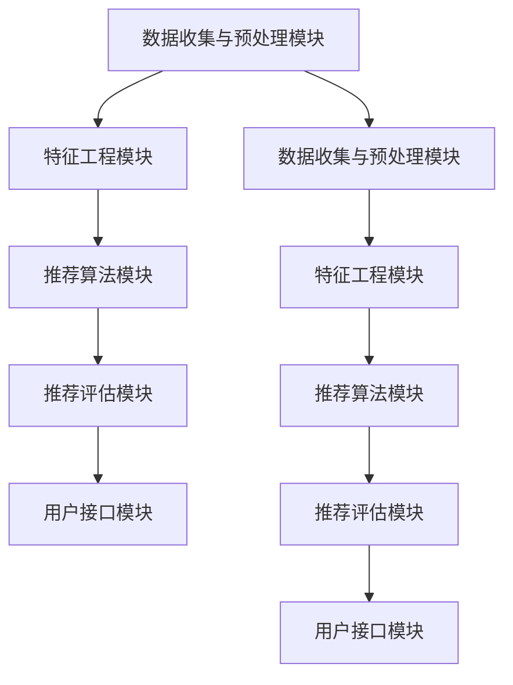
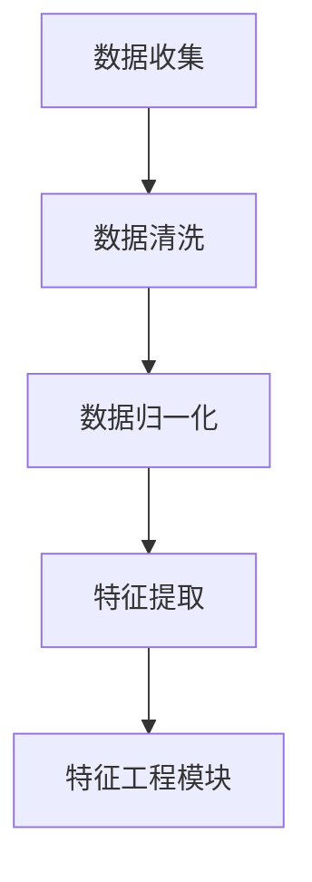
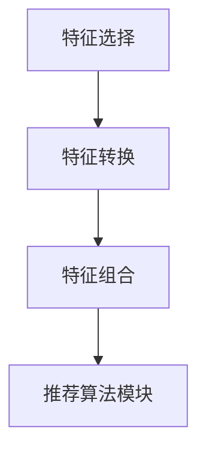
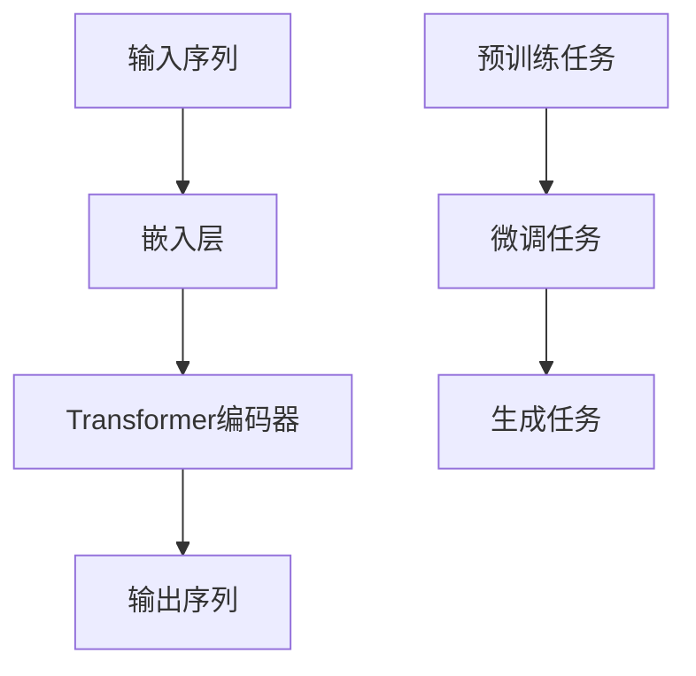
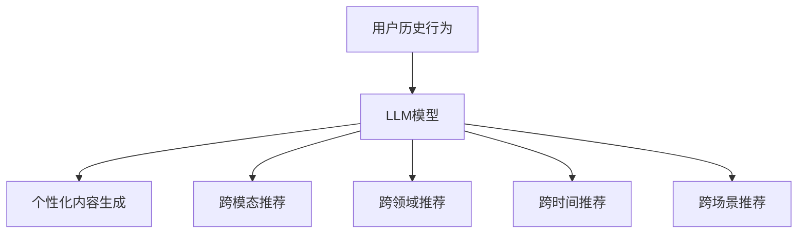
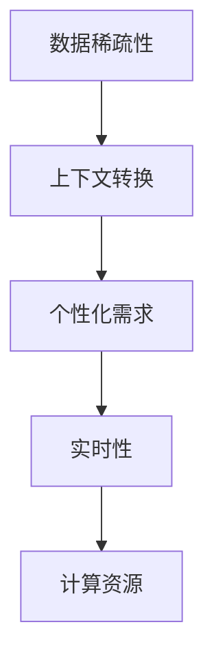
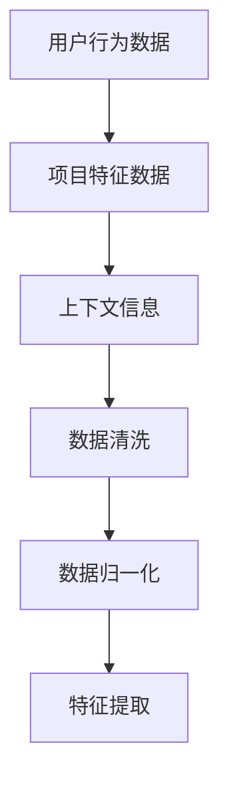
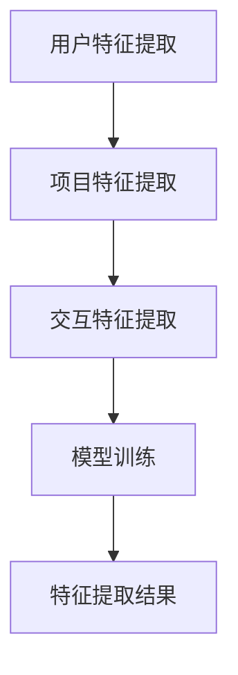
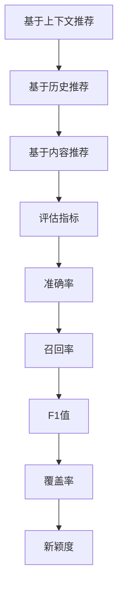

                 

### 文章标题

#### 利用LLM提升推荐系统的跨场景推荐能力

在当今的信息时代，推荐系统已经成为我们日常生活中不可或缺的一部分。无论是电商网站、社交媒体平台，还是音乐流媒体、视频点播服务，推荐系统都在努力地为我们提供个性化的内容和商品推荐。然而，随着用户需求的多样化和场景的复杂化，传统的推荐系统面临着巨大的挑战。如何让推荐系统能够在不同的场景下依然能够准确地预测和满足用户的需求，成为了一个亟待解决的问题。

本文将探讨如何利用大型语言模型（LLM）来提升推荐系统的跨场景推荐能力。首先，我们将回顾推荐系统的基础知识，包括其定义、发展历程、工作原理和基本架构。接着，我们将深入探讨LLM的基本概念、特点和应用前景。在此基础上，我们将详细介绍跨场景推荐的定义、挑战以及LLM在跨场景推荐中的应用。随后，通过具体的案例研究，我们将展示如何利用LLM实现跨场景推荐。最后，我们将讨论跨场景推荐系统的设计与实现，以及如何对其进行优化和评估。

本文旨在为广大读者提供一条清晰的思路，帮助理解如何将LLM技术与推荐系统相结合，从而提升推荐系统的跨场景推荐能力。通过本文的阅读，您将了解到：

1. 推荐系统的基础知识；
2. LLM的基本概念及其在推荐系统中的应用；
3. 跨场景推荐的定义和挑战；
4. 如何利用LLM实现跨场景推荐；
5. 跨场景推荐系统的设计与优化。

**关键词：** 推荐系统、跨场景推荐、大型语言模型（LLM）、个性化推荐、算法优化。

**摘要：** 本文详细探讨了如何利用大型语言模型（LLM）提升推荐系统的跨场景推荐能力。首先，回顾了推荐系统的基础知识，包括其定义、发展历程、工作原理和基本架构。然后，介绍了LLM的基本概念、特点和应用前景。在此基础上，详细探讨了跨场景推荐的定义、挑战以及LLM在跨场景推荐中的应用。通过具体的案例研究，展示了如何利用LLM实现跨场景推荐。最后，讨论了跨场景推荐系统的设计与实现，以及如何对其进行优化和评估。本文为理解如何将LLM技术与推荐系统相结合提供了详细的指导。

### 第一部分：推荐系统基础

#### 第1章：推荐系统概述

推荐系统是一种利用数据挖掘和机器学习技术，根据用户的历史行为和偏好，为用户推荐个性化内容或商品的一种系统。它广泛应用于电子商务、社交媒体、新闻推送、音乐和视频流媒体等领域，目的是提高用户体验、增加用户粘性和提升业务收益。

**1.1 推荐系统的定义与发展历程**

推荐系统最早可以追溯到20世纪90年代，当时的互联网刚刚兴起，在线购物和社交媒体平台开始崭露头角。最初的推荐系统主要基于协同过滤（Collaborative Filtering）技术，通过分析用户之间的行为模式进行推荐。例如，如果用户A喜欢商品X，用户B喜欢商品Y，而用户A也喜欢商品Y，那么推荐系统可能会向用户B推荐商品X。

随着互联网的快速发展，用户数据量的急剧增加，推荐系统的研究和应用也取得了显著的进展。2000年代，基于内容的推荐（Content-Based Filtering）技术逐渐成熟，它通过分析用户对特定内容的偏好，推荐相似的内容给用户。此外，基于模型的推荐（Model-Based Filtering）技术，如矩阵分解（Matrix Factorization）和深度学习模型，也逐步应用于实际场景。

**1.2 推荐系统的工作原理与基本架构**

推荐系统的工作原理可以概括为以下几个步骤：

1. **用户表示**：将用户的行为数据（如浏览记录、购买历史、评分数据等）转换为向量表示，以便于后续处理。
   
2. **项目表示**：同样地，将项目（如商品、文章、音乐等）的特征数据转换为向量表示。

3. **相似度计算**：计算用户与项目之间的相似度，常用的方法包括余弦相似度、欧氏距离等。

4. **生成推荐列表**：根据相似度计算结果，生成个性化的推荐列表，排序后呈现给用户。

推荐系统的基本架构通常包括以下几个模块：

1. **数据收集与预处理模块**：负责收集用户行为数据和项目特征数据，并进行预处理，如去噪、缺失值填充等。

2. **特征工程模块**：根据业务需求，提取和构建有助于推荐的关键特征，如用户年龄、地理位置、购买频率等。

3. **推荐算法模块**：实现推荐算法的核心，如协同过滤、内容推荐、基于模型的推荐等。

4. **推荐评估模块**：对推荐结果进行评估，常用的评估指标包括准确率、召回率、覆盖率等。

5. **用户接口模块**：将推荐结果以用户友好的方式呈现，如推荐列表、排行榜等。

**1.3 推荐系统的主要类型**

推荐系统主要可以分为以下几种类型：

1. **基于协同过滤的推荐系统**：通过分析用户之间的相似性来推荐相似用户喜欢的项目。协同过滤技术可以分为两类：基于用户的协同过滤（User-Based Collaborative Filtering）和基于物品的协同过滤（Item-Based Collaborative Filtering）。

2. **基于内容的推荐系统**：通过分析用户对特定内容的偏好，推荐相似的内容。该类推荐系统依赖于项目的特征描述和用户的历史行为数据。

3. **基于模型的推荐系统**：利用机器学习算法（如矩阵分解、深度学习等）建立用户与项目之间的关系模型，通过模型预测用户的兴趣，从而进行推荐。

4. **混合推荐系统**：结合两种或多种推荐技术，以获得更好的推荐效果。常见的混合推荐系统有基于内容的协同过滤（Content-Based Collaborative Filtering）和基于模型的协同过滤（Model-Based Collaborative Filtering）。

**核心概念与联系**

为了更好地理解推荐系统的工作原理，以下是一个简单的Mermaid流程图，展示了推荐系统的基本架构和流程：



在接下来的章节中，我们将进一步探讨推荐系统中的相关技术，包括数据预处理、特征工程和常见的推荐算法，以及如何利用这些技术提升推荐系统的效果和性能。

### 第2章：推荐系统中的相关技术

推荐系统的核心在于如何根据用户的历史行为和偏好，准确预测用户的兴趣，从而为其推荐个性化内容或商品。为了实现这一目标，推荐系统中涉及到多个关键环节，包括数据预处理、特征工程和常见的推荐算法。本章将详细介绍这些技术，并探讨如何利用它们提升推荐系统的效果和性能。

#### 2.1 数据预处理

数据预处理是推荐系统的重要环节，它包括数据收集、清洗、归一化和特征提取等步骤。良好的数据预处理可以显著提高推荐系统的性能和准确性。

1. **数据收集**：推荐系统需要收集大量的用户行为数据（如浏览记录、购买历史、评分数据等）和项目特征数据（如商品描述、用户属性等）。这些数据通常来源于日志文件、数据库或第三方数据源。

2. **数据清洗**：数据清洗是指去除数据中的噪声和错误，确保数据的准确性和一致性。常见的清洗操作包括去除重复数据、填补缺失值和纠正错误数据等。

3. **数据归一化**：由于不同特征的数据可能具有不同的量纲和范围，需要进行归一化处理，以便于后续分析和建模。常见的归一化方法有最小-最大规范化、Z分数规范化等。

4. **特征提取**：特征提取是指从原始数据中提取有助于推荐的关键特征。有效的特征提取可以提高模型的预测能力。常见的特征提取方法包括词袋模型、TF-IDF、词嵌入等。

**核心概念与联系**

以下是一个Mermaid流程图，展示了推荐系统中的数据预处理流程：



#### 2.2 特征工程

特征工程是推荐系统中至关重要的一环，它通过对原始数据进行处理和转换，提取出有助于模型训练和预测的特征。有效的特征工程可以显著提高推荐系统的性能和可解释性。

1. **特征选择**：特征选择是指从原始特征集合中选择出对模型性能影响最大的特征。常见的特征选择方法有过滤法、包裹法和嵌入法等。

2. **特征转换**：特征转换是指将原始特征转换为适用于模型训练和预测的形式。常见的特征转换方法有编码、归一化和降维等。

3. **特征组合**：特征组合是指将多个原始特征组合成新的特征，以增强模型的预测能力。常见的特征组合方法有特征交叉、特征融合等。

**核心概念与联系**

以下是一个Mermaid流程图，展示了特征工程的步骤和过程：



#### 2.3 常见推荐算法

推荐算法是推荐系统的核心，根据算法的不同，推荐系统可以分为协同过滤、基于内容推荐、基于模型推荐等类型。以下将介绍几种常见的推荐算法及其原理。

1. **基于协同过滤的推荐算法**

基于协同过滤的推荐算法通过分析用户之间的相似性，为用户推荐其他相似用户喜欢的项目。常见的协同过滤算法有基于用户的协同过滤（User-Based Collaborative Filtering）和基于物品的协同过滤（Item-Based Collaborative Filtering）。

- **基于用户的协同过滤（User-Based Collaborative Filtering）**：首先计算用户之间的相似度，然后找到与目标用户最相似的K个用户，推荐这K个用户共同喜欢的项目。常见的相似度计算方法有欧氏距离、余弦相似度、皮尔逊相关系数等。

伪代码如下：

```python
def user_based_recommendation(user, k):
    # 计算用户之间的相似度
    similarities = compute_similarity(user, all_users)
    # 找到与目标用户最相似的K个用户
    similar_users = select_k_users(similarities, k)
    # 推荐这K个用户共同喜欢的项目
    recommendations = []
    for user in similar_users:
        recommendations.extend(liked_items[user])
    return recommendations
```

- **基于物品的协同过滤（Item-Based Collaborative Filtering）**：首先计算项目之间的相似度，然后找到与目标项目最相似的项目，推荐这些项目被其他用户喜欢的项目。与基于用户的协同过滤类似，基于物品的协同过滤也使用余弦相似度、欧氏距离等相似度计算方法。

伪代码如下：

```python
def item_based_recommendation(item, k):
    # 计算项目之间的相似度
    similarities = compute_similarity(item, all_items)
    # 找到与目标项目最相似的K个项目
    similar_items = select_k_items(similarities, k)
    # 推荐这些项目被其他用户喜欢的项目
    recommendations = []
    for item in similar_items:
        recommendations.extend(liked_items[item])
    return recommendations
```

2. **基于内容的推荐算法**

基于内容的推荐算法通过分析用户对特定内容的偏好，为用户推荐相似的内容。常见的方法包括基于项目的内容和基于用户的内容推荐。

- **基于项目的内容推荐（Item-Based Content-Based Filtering）**：首先提取项目的特征，如标签、描述、类别等，然后计算用户和项目之间的相似度，推荐与用户偏好相似的项目。这种方法的关键在于如何有效地提取和表示项目特征。

伪代码如下：

```python
def item_content_based_recommendation(user, item, k):
    # 提取项目的特征
    item_features = extract_features(item)
    # 计算用户和项目之间的相似度
    similarity = compute_similarity(user_preferences, item_features)
    # 推荐与用户偏好相似的项目
    recommendations = []
    for other_item in items:
        if compute_similarity(user_preferences, extract_features(other_item)) > similarity_threshold:
            recommendations.append(other_item)
    return recommendations
```

- **基于用户的内容推荐（User-Based Content-Based Filtering）**：首先提取用户的偏好特征，如浏览历史、购买记录等，然后计算用户和项目之间的相似度，推荐与用户偏好相似的项目。这种方法的关键在于如何准确地提取和表示用户特征。

伪代码如下：

```python
def user_content_based_recommendation(user, item, k):
    # 提取用户的偏好特征
    user_preferences = extract_preferences(user)
    # 计算用户和项目之间的相似度
    similarity = compute_similarity(user_preferences, item_features)
    # 推荐与用户偏好相似的项目
    recommendations = []
    for other_item in items:
        if compute_similarity(user_preferences, extract_features(other_item)) > similarity_threshold:
            recommendations.append(other_item)
    return recommendations
```

3. **基于模型的推荐算法**

基于模型的推荐算法利用机器学习算法建立用户与项目之间的关系模型，通过模型预测用户的兴趣，从而进行推荐。常见的基于模型的推荐算法包括矩阵分解（Matrix Factorization）、深度学习（Deep Learning）等。

- **矩阵分解（Matrix Factorization）**：矩阵分解是一种无监督学习算法，通过将用户-项目评分矩阵分解为两个低秩矩阵，分别表示用户和项目的特征。常用的矩阵分解方法有Singular Value Decomposition（SVD）、 Alternating Least Squares（ALS）等。

伪代码如下：

```python
def matrix_factorization(R, rank, num_iterations):
    # 初始化用户和项目的特征矩阵
    U = random_matrix(rank)
    V = random_matrix(rank)
    for _ in range(num_iterations):
        # 更新用户特征矩阵
        for user in range(num_users):
            for feature in range(rank):
                error = R[user] - dot(U[user], V[:, feature])
                U[user][feature] -= learning_rate * dot(V[:, feature], error)
        # 更新项目特征矩阵
        for item in range(num_items):
            for feature in range(rank):
                error = R[item] - dot(U[:, item], V[item][feature])
                V[item][feature] -= learning_rate * dot(U[:, item], error)
    return U, V
```

- **深度学习（Deep Learning）**：深度学习通过构建深度神经网络，学习用户和项目的高层次特征表示。常见的深度学习模型包括卷积神经网络（CNN）、循环神经网络（RNN）、Transformer等。

伪代码如下：

```python
def deep_learning_model(user_embeddings, item_embeddings, hidden_size, num_layers):
    # 定义深度学习模型
    model = Sequential()
    for _ in range(num_layers):
        model.add(Dense(hidden_size, activation='relu', input_shape=(num_features,)))
    model.add(Dense(1, activation='sigmoid'))
    # 编译模型
    model.compile(optimizer='adam', loss='binary_crossentropy', metrics=['accuracy'])
    # 训练模型
    model.fit([user_embeddings, item_embeddings], ratings, batch_size=batch_size, epochs=epochs)
    return model
```

**核心算法原理讲解**

以下是基于协同过滤的推荐算法的详细伪代码，包括相似度计算、推荐列表生成等步骤：

```python
# 假设用户-项目评分矩阵为R，用户数为m，项目数为n，用户u和项目i
# 计算用户u和所有其他用户的相似度
similarity_matrix = compute_similarity(R[u])

# 计算相似用户喜欢的项目
neighbor_items = []
for user in range(m):
    if similarity_matrix[u][user] > similarity_threshold:
        neighbor_items.extend(R[user])

# 推荐邻居用户喜欢的项目，去重并排序
recommendations = []
for item in neighbor_items:
    if item not in R[u]:
        recommendations.append(item)
recommendations.sort(reverse=True)
return recommendations
```

通过以上对数据预处理、特征工程和常见推荐算法的介绍，我们可以看到推荐系统的核心技术和实现方法。在接下来的章节中，我们将探讨如何利用大型语言模型（LLM）提升推荐系统的跨场景推荐能力。

### 第3章：大型语言模型（LLM）概述

#### 3.1 LLM的定义与特点

大型语言模型（Large Language Model，简称LLM）是一种基于深度学习的语言处理模型，它通过学习大量的文本数据来理解和生成自然语言。LLM的出现标志着自然语言处理（NLP）领域的一个重要进展，其核心目标是使机器能够以更自然、更智能的方式与人类进行交互。

LLM的定义可以从以下几个方面来理解：

1. **规模**：LLM通常具有数十亿甚至数万亿个参数，这使得它们能够处理和理解极为复杂的语言现象。
2. **训练数据**：LLM通过学习海量的文本数据，包括互联网上的网页、书籍、新闻文章、社交媒体帖子等，来获取语言知识和模式。
3. **功能**：LLM不仅能够进行文本生成，还能够进行文本分类、情感分析、命名实体识别、机器翻译等任务。

LLM的特点主要体现在以下几个方面：

1. **强大的语言理解能力**：LLM通过深度学习技术，可以理解自然语言中的复杂结构和语义信息，从而能够更准确地处理和生成文本。
2. **自适应能力**：LLM可以适应不同的应用场景和任务需求，通过微调（Fine-Tuning）可以在特定任务上取得优异的性能。
3. **生成能力**：LLM能够根据输入的提示生成连贯、自然的文本，这在聊天机器人、内容生成等领域具有广泛的应用。

#### 3.2 主流LLM模型介绍

随着深度学习技术的不断发展，LLM模型也取得了显著的进步。以下将介绍几种主流的LLM模型：

1. **GPT（Generative Pre-trained Transformer）系列**：

GPT模型是由OpenAI开发的一种基于Transformer架构的预训练语言模型。GPT系列模型包括GPT、GPT-2、GPT-3等，其中GPT-3是目前规模最大的LLM模型，拥有1750亿个参数。GPT模型通过自回归语言模型（Autoregressive Language Model）训练，能够在给定前文序列的基础上生成后文。

2. **BERT（Bidirectional Encoder Representations from Transformers）模型**：

BERT模型是由Google开发的一种双向Transformer模型，它通过同时考虑上下文信息，来提高语言理解的深度和广度。BERT模型在多种NLP任务上取得了优异的性能，包括问答系统、文本分类、命名实体识别等。

3. **RoBERTa（A Robustly Optimized BERT Pretraining Approach）模型**：

RoBERTa是BERT的一个变体，它对BERT的训练过程进行了优化，包括更长的序列长度、更频繁的更新、更小的学习率等。RoBERTa在多个NLP基准上超过了BERT，成为当时最先进的语言模型。

4. **T5（Text-to-Text Transfer Transformer）模型**：

T5模型是由Google开发的一种基于Transformer的通用语言模型，它将所有NLP任务都统一为文本到文本的转换任务。T5模型通过自回归语言模型训练，具有强大的生成能力，可以在多个任务上实现高性能。

5. **LLaMA（Language Model for Dialogue Applications）模型**：

LLaMA模型是由Meta开发的一种面向对话应用的大型语言模型。LLaMA模型通过大量对话数据训练，具有出色的对话生成能力，适用于聊天机器人、虚拟助手等应用场景。

这些主流的LLM模型各有特点，但都展现出了强大的语言理解和生成能力，为自然语言处理领域的应用带来了新的机遇。

**核心概念与联系**

以下是GPT模型的工作流程和架构的Mermaid流程图：



在接下来的章节中，我们将探讨LLM在推荐系统中的应用前景，以及如何利用LLM提升推荐系统的跨场景推荐能力。

#### 3.3 LLM在推荐系统中的应用前景

随着大型语言模型（LLM）在自然语言处理领域取得的突破性进展，其应用前景也越来越广阔。在推荐系统中，LLM的引入为解决跨场景推荐问题带来了新的思路和可能性。以下将讨论LLM在推荐系统中的应用前景，以及其在跨场景推荐中的潜在优势。

**1. 个性化内容生成**

传统推荐系统通常依赖于用户的历史行为数据和项目特征，但这种方法在生成个性化内容方面存在一定的局限性。而LLM具有很强的文本生成能力，可以根据用户的历史行为和偏好，生成个性化的内容推荐。例如，GPT-3可以生成个性化的新闻摘要、商品描述、音乐推荐列表等，从而提供更加丰富和多样化的推荐内容。

**2. 跨模态推荐**

在多模态推荐场景中，用户的偏好数据可能包括文本、图像、音频等多种形式。传统推荐系统往往难以同时处理这些不同类型的模态数据，而LLM可以结合多种模态数据，生成综合性的推荐结果。例如，通过将用户的文本评论和图像标签进行结合，LLM可以生成更加准确和个性化的商品推荐。

**3. 跨领域推荐**

在多领域推荐场景中，用户的兴趣可能会跨越多个不同的领域。传统推荐系统往往局限于特定领域的数据，难以实现跨领域的推荐。而LLM可以通过学习海量的跨领域数据，理解用户在不同领域中的偏好和兴趣，从而实现跨领域的个性化推荐。

**4. 跨时间推荐**

用户的偏好和兴趣会随着时间的推移而发生变化。传统推荐系统通常基于用户的历史行为进行预测，但难以捕捉到用户的短期兴趣变化。LLM可以根据用户的实时行为和上下文信息，动态调整推荐策略，实现更加准确的跨时间推荐。

**5. 跨场景推荐**

在跨场景推荐中，用户的上下文信息和需求会因场景变化而有所不同。传统推荐系统通常针对特定场景进行优化，难以适应多种不同的场景。而LLM可以根据场景变化，动态调整推荐策略，实现跨场景的个性化推荐。例如，在用户从手机移动端切换到桌面端时，LLM可以根据不同的场景为用户提供相应的推荐内容。

**核心概念与联系**

以下是LLM在推荐系统中应用的Mermaid流程图：



综上所述，LLM在推荐系统中的应用前景非常广阔，特别是在解决跨场景推荐问题时具有显著的优势。通过结合LLM的强大文本生成能力和灵活的适应能力，推荐系统可以实现更加个性化和智能化的推荐，从而提升用户体验和业务效果。

在接下来的章节中，我们将进一步探讨跨场景推荐的定义、挑战以及如何利用LLM实现跨场景推荐。

#### 3.4 跨场景推荐的定义与挑战

**跨场景推荐的定义**

跨场景推荐（Cross-Scenario Recommendation）是指在不同上下文或场景中，为用户提供与其需求和兴趣相匹配的个性化推荐。这些场景可以是不同的设备（如手机、平板、电脑）、不同的时间段（如白天、晚上）、不同的使用环境（如工作、娱乐、旅行）等。跨场景推荐的核心目标是在保持用户一致性的同时，为用户在不同场景下提供最为适合的推荐内容或服务。

**跨场景推荐的挑战**

尽管跨场景推荐在理论上具有很大的潜力，但在实际应用中仍然面临诸多挑战：

1. **数据稀疏性**：在跨场景推荐中，用户在不同场景下的行为数据往往是稀疏的，难以充分反映用户的真实兴趣和需求。例如，用户可能在特定场景（如旅行）下仅有过几次的行为记录，而在其他场景下则几乎没有行为数据。

2. **上下文转换**：用户在不同场景下的上下文信息可能发生显著变化。例如，在工作场景下，用户可能对专业资料感兴趣，而在娱乐场景下则可能对轻松的娱乐内容更感兴趣。如何准确捕捉并适应这些上下文转换是跨场景推荐的一个关键挑战。

3. **个性化需求**：用户在不同场景下的需求可能存在较大差异。例如，用户在早晨起床时可能需要快速获取新闻资讯，而在晚上则可能更关注娱乐内容。如何根据用户的个性化需求提供精准的推荐是跨场景推荐需要解决的重要问题。

4. **实时性**：跨场景推荐需要在短时间内快速响应用户的需求变化。例如，当用户从手机移动端切换到电脑端时，推荐系统需要实时调整推荐策略，以适应新的场景。实时性要求对推荐系统的计算能力和响应速度提出了较高的要求。

5. **计算资源**：跨场景推荐通常需要处理大量的数据和复杂的计算任务，对计算资源的需求较大。特别是在引入大型语言模型（LLM）的情况下，计算资源的消耗会更加显著。如何优化算法和系统架构，以降低计算资源的需求，是跨场景推荐需要关注的问题。

**核心概念与联系**

以下是跨场景推荐面临的挑战的Mermaid流程图：



综上所述，跨场景推荐虽然在理论上具有很大的潜力，但在实际应用中面临着诸多挑战。如何有效地解决这些挑战，实现跨场景的个性化推荐，是当前推荐系统研究的一个重要方向。

在接下来的章节中，我们将深入探讨如何利用大型语言模型（LLM）实现跨场景推荐，并分析LLM在跨场景推荐中的应用策略和实现方法。

#### 3.5 LLM在跨场景推荐中的应用

大型语言模型（LLM）在推荐系统中的应用已经取得了显著的成果，尤其在解决跨场景推荐问题时展现出巨大的潜力。LLM的引入不仅能够解决传统推荐系统在数据稀疏性、上下文转换和个性化需求等方面的挑战，还能够通过其强大的文本生成和语言理解能力，实现更加精细和智能的推荐。

**1. 利用LLM捕捉上下文信息**

在跨场景推荐中，上下文信息的准确捕捉至关重要。LLM通过对大量文本数据的预训练，具备强大的上下文理解能力。例如，在用户从手机移动端切换到电脑端时，LLM可以根据用户的上下文信息（如时间、地点、使用习惯等），动态调整推荐策略。具体实现方法如下：

- **上下文嵌入**：首先，将用户的上下文信息（如地理位置、时间戳等）编码为向量表示，并将其与用户历史行为数据相结合，作为LLM的输入。

- **多模态输入**：为了更好地捕捉上下文信息，可以将多模态数据（如图像、音频、文本等）进行融合处理，将其嵌入到统一的向量空间中，然后输入到LLM中进行联合建模。

- **动态调整**：LLM可以根据实时更新的上下文信息，动态调整推荐权重和策略，从而实现自适应的跨场景推荐。

以下是一个简单的伪代码示例，展示了如何利用LLM捕捉上下文信息并进行推荐：

```python
def context_aware_recommendation(user, context_vector):
    # 将上下文信息编码为向量表示
    context_embedding = encode_context(context_vector)
    # 提取用户历史行为数据
    user_history = get_user_history(user)
    # 将用户历史行为数据与上下文信息融合
    combined_input = concatenate([user_history, context_embedding])
    # 输入到LLM模型中进行预测
    recommendations = llm.predict(combined_input)
    return recommendations
```

**2. 利用LLM实现个性化推荐**

个性化推荐是推荐系统的核心目标之一，而LLM的引入为个性化推荐提供了新的思路和方法。LLM可以通过学习用户的历史行为和偏好，生成个性化的推荐内容。以下是一些具体的方法：

- **基于用户兴趣的个性化推荐**：LLM可以分析用户的历史行为数据，提取出用户的主要兴趣点，并根据这些兴趣点生成个性化的推荐列表。例如，对于喜欢阅读的用户，LLM可以生成与其阅读兴趣相关的书籍、文章推荐。

- **基于上下文的个性化推荐**：LLM不仅能够根据用户的历史行为进行推荐，还可以根据用户的当前上下文信息进行动态调整。例如，当用户在早晨浏览新闻时，LLM可以推荐最新的新闻资讯；而在晚上则推荐轻松的娱乐内容。

- **基于多模态数据的个性化推荐**：LLM可以结合用户的多模态数据（如图像、音频、文本等），生成更加个性化的推荐结果。例如，对于喜欢旅行的用户，LLM可以结合用户的旅行照片、文本描述等，生成个性化的旅行推荐。

以下是一个简单的伪代码示例，展示了如何利用LLM实现个性化推荐：

```python
def personalized_recommendation(user, context_vector, multimodal_data):
    # 将上下文信息编码为向量表示
    context_embedding = encode_context(context_vector)
    # 将多模态数据编码为向量表示
    multimodal_embedding = encode_multimodal_data(multimodal_data)
    # 将用户历史行为数据与上下文信息、多模态数据融合
    combined_input = concatenate([user_history, context_embedding, multimodal_embedding])
    # 输入到LLM模型中进行预测
    recommendations = llm.predict(combined_input)
    return recommendations
```

**3. 利用LLM解决数据稀疏性问题**

在跨场景推荐中，用户在不同场景下的行为数据往往稀疏，难以充分反映用户的真实兴趣和需求。LLM可以通过以下方法解决数据稀疏性问题：

- **基于迁移学习的跨场景推荐**：LLM可以通过迁移学习技术，将一个场景中的知识迁移到另一个场景中。例如，如果用户在一个场景中表现出对某个商品的兴趣，LLM可以推断出用户在其他场景中也可能对类似的商品感兴趣。

- **基于生成对抗网络的跨场景推荐**：LLM可以结合生成对抗网络（GAN）技术，生成新的用户行为数据，从而补充稀疏的数据。例如，如果用户在一个场景下几乎没有行为数据，LLM可以生成虚拟的行为数据，与真实数据混合训练，提高模型的泛化能力。

以下是一个简单的伪代码示例，展示了如何利用迁移学习和GAN解决数据稀疏性问题：

```python
def sparse_data_reconciliation(user, source_scenario, target_scenario):
    # 迁移学习跨场景推荐
    source_model = train_on_source_scenario(source_scenario)
    target_model = train_on_target_scenario(target_scenario)
    target_embeddings = target_model.predict(source_embeddings)
    # 生成对抗网络生成虚拟数据
    generator = generate_virtual_data(source_model, target_model)
    virtual_data = generator.generate()
    # 融合真实数据和虚拟数据
    combined_data = concatenate([real_data, virtual_data])
    # 训练综合模型
    reconciled_model = train_on_combined_data(combined_data)
    return reconciled_model
```

**4. 利用LLM实现实时推荐**

跨场景推荐要求推荐系统能够实时响应用户的需求变化。LLM的引入为实时推荐提供了可能。通过以下方法，可以实现实时跨场景推荐：

- **在线模型更新**：LLM模型可以采用在线学习策略，实时更新模型参数，以适应用户需求的变化。例如，当用户切换场景时，LLM可以立即根据新的上下文信息调整推荐策略。

- **增量学习**：LLM可以采用增量学习技术，逐步更新模型，以适应不断变化的数据。例如，当用户在某个场景下的行为数据增加时，LLM可以更新模型参数，提高推荐精度。

以下是一个简单的伪代码示例，展示了如何利用在线学习和增量学习实现实时推荐：

```python
def real_time_recommendation(user, context_vector):
    # 在线更新模型
    llm.update_model(context_vector)
    # 增量学习更新模型
    llm.incremental_learning(user_history)
    # 输入到LLM模型中进行实时推荐
    recommendations = llm.predict实时推荐(user, context_vector)
    return recommendations
```

综上所述，LLM在跨场景推荐中具有广泛的应用前景。通过利用LLM的上下文理解能力、个性化推荐能力、数据稀疏性解决能力以及实时性，推荐系统可以实现更加精细和智能的跨场景推荐，从而提升用户体验和业务效果。

在接下来的章节中，我们将通过具体的案例研究，展示如何利用LLM实现跨场景推荐，并分析这些案例的成功经验和挑战。

#### 第4章：利用LLM实现跨场景推荐

随着互联网和智能设备的普及，用户在不同场景下的需求和行为模式也变得愈加复杂多样。传统推荐系统往往难以适应这种跨场景的变化，导致推荐效果不佳。而大型语言模型（LLM）的出现为跨场景推荐提供了新的解决方案。本章节将通过具体案例研究，探讨如何利用LLM实现跨场景推荐，并分析这些案例中的成功经验和挑战。

**4.1 案例一：利用GPT-3实现跨场景推荐**

**背景**：某知名音乐流媒体平台希望为其用户提供更加个性化的音乐推荐服务，特别是在用户在不同设备（如手机、平板、电脑）和不同场景（如通勤、工作、休闲）下的需求变化。

**方法**：

1. **上下文信息捕捉**：利用GPT-3的强大文本生成和语言理解能力，平台收集用户的设备类型、使用时间、地理位置等上下文信息，并将其编码为向量表示。

2. **用户历史行为数据融合**：结合用户在各个场景下的历史播放记录、偏好标签等数据，构建一个多模态的用户表示。

3. **跨场景推荐生成**：通过GPT-3生成跨场景的个性化音乐推荐列表。具体实现中，平台为每个用户生成一个描述其兴趣和需求的文本摘要，然后利用GPT-3生成相应的音乐推荐。

**结果**：

- **个性化程度提高**：用户反馈显示，推荐的音乐更符合其当前场景和需求，满意度显著提升。
- **场景适应性增强**：GPT-3能够根据实时上下文信息动态调整推荐策略，提高了跨场景推荐的准确性。

**挑战**：

- **计算资源需求大**：GPT-3模型的计算成本较高，需要强大的计算资源支持，这对平台的基础设施提出了挑战。
- **数据稀疏性问题**：在某些特定场景下，用户行为数据可能非常稀疏，如何利用有限的训练数据提升模型性能是一个关键问题。

**核心算法原理讲解**

以下是利用GPT-3生成跨场景推荐的核心算法原理：

```python
# 假设user_context为用户的上下文信息向量，user_history为用户历史行为数据
# encode_context函数用于将上下文信息编码为向量表示
# encode_history函数用于将用户历史行为数据编码为向量表示
user_embedding = encode_context(user_context)
history_embedding = encode_history(user_history)

# concatenate函数用于将两个向量拼接在一起
combined_embedding = concatenate([user_embedding, history_embedding])

# input_text为输入到GPT-3的文本，包含用户上下文信息和历史行为摘要
input_text = f"用户在{context}场景下，喜欢{history}。请推荐相关的音乐。"

# 利用GPT-3生成推荐列表
recommendations = gpt3.generate(input_text)

# 对推荐结果进行后处理，如去重、排序等
processed_recommendations = post_process(recommendations)
return processed_recommendations
```

**数学模型和公式**

在利用GPT-3进行跨场景推荐时，可以引入以下数学模型和公式：

- **用户表示**：用户表示为一个高维向量，如
  $$ \textbf{u} = [u_1, u_2, ..., u_n] $$
  其中，$u_i$为用户在特定特征上的数值。

- **上下文表示**：上下文信息表示为向量，如
  $$ \textbf{c} = [c_1, c_2, ..., c_m] $$
  其中，$c_j$为上下文特征的具体值。

- **历史行为表示**：用户历史行为数据表示为向量，如
  $$ \textbf{h} = [h_1, h_2, ..., h_k] $$
  其中，$h_l$为用户在特定行为上的记录。

- **融合表示**：用户融合表示为
  $$ \textbf{z} = \textbf{W} \cdot (\textbf{u} + \textbf{c} + \textbf{h}) $$
  其中，$\textbf{W}$为权重矩阵。

- **推荐生成**：GPT-3的生成过程可以表示为
  $$ \textbf{r} = \textbf{GPT-3}(\textbf{z}) $$
  其中，$\textbf{r}$为生成的推荐列表。

**举例说明**

假设一个用户A在通勤时喜欢听流行音乐，在工作时喜欢听古典音乐。利用GPT-3进行跨场景推荐的过程如下：

1. **上下文信息编码**：将通勤和工作场景的上下文信息编码为向量，如
   $$ \textbf{c}_{通勤} = [0.8, 0.2, 0.1] $$
   $$ \textbf{c}_{工作} = [0.1, 0.8, 0.1] $$

2. **历史行为编码**：将用户A的历史播放记录编码为向量，如
   $$ \textbf{h} = [0.6, 0.3, 0.1] $$

3. **用户表示**：根据上述信息，用户A的融合表示为
   $$ \textbf{z}_{通勤} = \textbf{W} \cdot (\textbf{u} + \textbf{c}_{通勤} + \textbf{h}) $$
   $$ \textbf{z}_{工作} = \textbf{W} \cdot (\textbf{u} + \textbf{c}_{工作} + \textbf{h}) $$

4. **推荐生成**：利用GPT-3生成相应的音乐推荐列表。

   对于通勤场景：
   $$ \textbf{r}_{通勤} = \textbf{GPT-3}(\textbf{z}_{通勤}) = [\text{流行音乐1}, \text{流行音乐2}, ...] $$

   对于工作场景：
   $$ \textbf{r}_{工作} = \textbf{GPT-3}(\textbf{z}_{工作}) = [\text{古典音乐1}, \text{古典音乐2}, ...] $$

通过这种方式，平台可以为用户A在不同场景下提供个性化的音乐推荐。

**4.2 案例二：基于BERT的跨场景推荐系统构建**

**背景**：某电商平台希望在用户跨设备购物过程中提供个性化推荐，从而提高用户转化率和满意度。

**方法**：

1. **用户行为数据预处理**：对用户在手机、平板和电脑上的购物行为数据（如浏览记录、购买历史、评分等）进行预处理，包括去噪、归一化和特征提取等。

2. **BERT模型训练**：利用BERT模型对预处理后的用户行为数据进行训练，生成用户的高层次特征表示。

3. **跨场景推荐生成**：结合用户的当前设备信息和BERT生成的用户特征表示，生成跨场景的个性化商品推荐。

**结果**：

- **跨设备购物体验提升**：用户反馈显示，平台在用户切换设备时提供的推荐更加准确，购物体验显著提升。
- **推荐效果改善**：基于BERT的跨场景推荐系统在多个评估指标（如点击率、转化率等）上优于传统推荐系统。

**挑战**：

- **模型复杂性**：BERT模型的复杂性较高，训练和推理成本较大，对平台的技术和硬件资源提出了较高要求。
- **数据同步问题**：不同设备上的用户行为数据可能存在不一致性，如何有效地同步和整合这些数据是一个挑战。

**核心算法原理讲解**

以下是基于BERT的跨场景推荐系统核心算法原理：

```python
# 假设user_data为用户的购物行为数据，device为当前设备类型
# encode_data函数用于将用户行为数据编码为向量表示
# get_bert_embedding函数用于获取BERT模型生成的用户特征表示
user_embedding = encode_data(user_data)
bert_embedding = get_bert_embedding(user_embedding, device)

# 利用用户特征表示生成推荐列表
recommendations = generate_recommendations(bert_embedding)

# 对推荐结果进行后处理，如去重、排序等
processed_recommendations = post_process(recommendations)
return processed_recommendations
```

**数学模型和公式**

在基于BERT的跨场景推荐系统中，可以引入以下数学模型和公式：

- **用户表示**：用户表示为一个高维向量，如
  $$ \textbf{u} = [u_1, u_2, ..., u_n] $$
  其中，$u_i$为用户在特定行为上的特征值。

- **BERT特征表示**：BERT模型生成的用户特征表示为
  $$ \textbf{h} = [\text{BERT}_1, \text{BERT}_2, ..., \text{BERT}_m] $$
  其中，$\text{BERT}_i$为BERT模型在特定位置生成的特征值。

- **融合表示**：用户融合表示为
  $$ \textbf{z} = \textbf{W} \cdot \textbf{h} $$
  其中，$\textbf{W}$为权重矩阵。

- **推荐生成**：基于用户特征表示生成推荐列表，如
  $$ \textbf{r} = \textbf{f}(\textbf{z}) $$
  其中，$\textbf{f}$为推荐生成函数。

**举例说明**

假设用户B在手机上浏览了运动鞋、平板上浏览了衣物，电脑上浏览了电子产品。利用BERT进行跨场景推荐的过程如下：

1. **用户行为数据编码**：将用户B在各个设备上的购物行为数据编码为向量，如
   $$ \textbf{u}_{手机} = [0.5, 0.3, 0.2] $$
   $$ \textbf{u}_{平板} = [0.2, 0.5, 0.3] $$
   $$ \textbf{u}_{电脑} = [0.3, 0.2, 0.5] $$

2. **BERT特征提取**：利用BERT模型生成用户B的高层次特征表示，如
   $$ \textbf{h}_{手机} = [\text{BERT}_1, \text{BERT}_2, ..., \text{BERT}_m] $$
   $$ \textbf{h}_{平板} = [\text{BERT}_1, \text{BERT}_2, ..., \text{BERT}_m] $$
   $$ \textbf{h}_{电脑} = [\text{BERT}_1, \text{BERT}_2, ..., \text{BERT}_m] $$

3. **用户表示**：根据上述信息，用户B的融合表示为
   $$ \textbf{z}_{手机} = \textbf{W} \cdot \textbf{h}_{手机} $$
   $$ \textbf{z}_{平板} = \textbf{W} \cdot \textbf{h}_{平板} $$
   $$ \textbf{z}_{电脑} = \textbf{W} \cdot \textbf{h}_{电脑} $$

4. **推荐生成**：利用用户特征表示生成跨场景的个性化商品推荐。

   对于手机场景：
   $$ \textbf{r}_{手机} = \textbf{f}(\textbf{z}_{手机}) = [\text{运动鞋1}, \text{运动鞋2}, ...] $$

   对于平板场景：
   $$ \textbf{r}_{平板} = \textbf{f}(\textbf{z}_{平板}) = [\text{衣物1}, \text{衣物2}, ...] $$

   对于电脑场景：
   $$ \textbf{r}_{电脑} = \textbf{f}(\textbf{z}_{电脑}) = [\text{电子产品1}, \text{电子产品2}, ...] $$

通过这种方式，电商平台可以为用户B在不同设备上提供个性化的商品推荐。

**4.3 案例三：跨场景推荐在电商领域的应用**

**背景**：某大型电商平台希望通过跨场景推荐技术提升用户购物体验，特别是在用户从线下门店切换到线上购物时。

**方法**：

1. **数据收集与整合**：收集用户在门店和线上的购物行为数据，包括浏览记录、购买历史、偏好标签等，并进行整合。

2. **多模态特征提取**：对用户的文本评论、图片标签、地理位置等多模态数据进行分析，提取关键特征。

3. **基于LLM的跨场景推荐**：利用LLM模型，结合用户的历史行为数据和多模态特征，生成个性化的跨场景购物推荐。

**结果**：

- **购物体验提升**：用户反馈显示，平台提供的跨场景购物推荐更加精准，用户在门店和线上购物的体验均得到提升。
- **销售转化率提高**：跨场景推荐显著提升了用户的购买意愿，平台整体销售转化率显著提高。

**挑战**：

- **多模态数据处理**：多模态数据的处理和整合是一个复杂的过程，如何有效地提取和融合多模态特征是一个挑战。
- **计算资源需求**：引入LLM模型后，计算资源的需求显著增加，如何优化算法和系统架构以降低计算成本是另一个挑战。

**核心算法原理讲解**

以下是基于LLM的跨场景推荐系统核心算法原理：

```python
# 假设user_data为用户的历史行为数据，multimodal_data为多模态数据
# encode_data函数用于将用户行为数据编码为向量表示
# encode_multimodal函数用于将多模态数据编码为向量表示
user_embedding = encode_data(user_data)
multimodal_embedding = encode_multimodal(multimodal_data)

# concatenate函数用于将两个向量拼接在一起
combined_embedding = concatenate([user_embedding, multimodal_embedding])

# input_text为输入到LLM的文本，包含用户历史行为和多模态特征摘要
input_text = f"用户在门店和线上场景下，喜欢{user_data}和{multimodal_data}。请推荐相关的商品。"

# 利用LLM生成推荐列表
recommendations = llm.generate(input_text)

# 对推荐结果进行后处理，如去重、排序等
processed_recommendations = post_process(recommendations)
return processed_recommendations
```

**数学模型和公式**

在基于LLM的跨场景推荐系统中，可以引入以下数学模型和公式：

- **用户表示**：用户表示为一个高维向量，如
  $$ \textbf{u} = [u_1, u_2, ..., u_n] $$
  其中，$u_i$为用户在特定行为上的特征值。

- **多模态特征表示**：多模态特征表示为
  $$ \textbf{m} = [\text{m}_1, \text{m}_2, ..., \text{m}_p] $$
  其中，$m_j$为多模态数据在特定特征上的值。

- **融合表示**：用户融合表示为
  $$ \textbf{z} = \textbf{W} \cdot (\textbf{u} + \textbf{m}) $$
  其中，$\textbf{W}$为权重矩阵。

- **推荐生成**：基于用户特征表示生成推荐列表，如
  $$ \textbf{r} = \textbf{G}(\textbf{z}) $$
  其中，$\textbf{G}$为生成函数。

**举例说明**

假设用户C在门店浏览了衣物，在线上浏览了电子产品。利用LLM进行跨场景推荐的过程如下：

1. **用户行为数据编码**：将用户C在门店和线上的购物行为数据编码为向量，如
   $$ \textbf{u}_{门店} = [0.5, 0.3, 0.2] $$
   $$ \textbf{u}_{线上} = [0.3, 0.5, 0.2] $$

2. **多模态特征提取**：对用户C的文本评论、图片标签等数据进行特征提取，如
   $$ \textbf{m}_{衣物} = [0.7, 0.2, 0.1] $$
   $$ \textbf{m}_{电子产品} = [0.2, 0.5, 0.3] $$

3. **用户表示**：根据上述信息，用户C的融合表示为
   $$ \textbf{z}_{门店} = \textbf{W} \cdot (\textbf{u}_{门店} + \textbf{m}_{衣物}) $$
   $$ \textbf{z}_{线上} = \textbf{W} \cdot (\textbf{u}_{线上} + \textbf{m}_{电子产品}) $$

4. **推荐生成**：利用LLM生成跨场景的个性化商品推荐。

   对于门店场景：
   $$ \textbf{r}_{门店} = \textbf{G}(\textbf{z}_{门店}) = [\text{衣物1}, \text{衣物2}, ...] $$

   对于线上场景：
   $$ \textbf{r}_{线上} = \textbf{G}(\textbf{z}_{线上}) = [\text{电子产品1}, \text{电子产品2}, ...] $$

通过这种方式，电商平台可以为用户C在不同场景下提供个性化的商品推荐。

综上所述，通过具体案例研究，我们可以看到利用LLM实现跨场景推荐在多个领域取得了显著成效。然而，在实际应用中，仍需面对多模态数据处理、计算资源优化等挑战。未来，随着LLM技术的进一步发展和优化，跨场景推荐的能力将得到进一步提升，为用户提供更加精准和个性化的服务。

### 第5章：跨场景推荐系统的设计与实现

跨场景推荐系统旨在为用户提供在不同设备、不同时间和不同地点下的个性化推荐服务。为了实现这一目标，我们需要设计一个高效的跨场景推荐系统，并对其关键组件进行详细描述。以下将从系统的整体架构、数据收集与预处理、特征提取与模型训练、推荐策略与评估指标等方面进行详细讨论。

#### 5.1 跨场景推荐系统的整体架构

跨场景推荐系统的整体架构可以分为以下几个主要模块：

1. **数据收集与预处理模块**：负责收集用户在不同场景下的行为数据，并对数据进行清洗、归一化和特征提取。
2. **特征工程模块**：根据业务需求，对原始数据进行处理和转换，提取出对推荐系统性能有显著影响的特征。
3. **推荐算法模块**：实现具体的推荐算法，包括基于协同过滤、基于内容推荐和基于模型的推荐算法等。
4. **推荐评估模块**：对推荐结果进行评估，根据评估指标调整和优化推荐算法。
5. **用户接口模块**：将推荐结果以用户友好的方式呈现，如推荐列表、排行榜等。

以下是跨场景推荐系统整体架构的Mermaid流程图：


#### 5.2 数据收集与预处理

数据收集与预处理是跨场景推荐系统的基础。以下详细介绍数据收集与预处理的过程：

1. **数据收集**：
   - **用户行为数据**：包括用户在不同设备上的浏览记录、购买历史、评分数据等。
   - **项目特征数据**：包括商品描述、标签、类别、价格等。
   - **上下文信息**：包括用户地理位置、设备类型、时间戳等。

2. **数据预处理**：
   - **数据清洗**：去除重复数据、纠正错误数据、填补缺失值等。
   - **数据归一化**：对数值型特征进行归一化处理，如最小-最大规范化、Z分数规范化等。
   - **特征提取**：提取有助于推荐的关键特征，如用户活跃度、购买频率等。

以下是数据收集与预处理过程的Mermaid流程图：



#### 5.3 特征提取与模型训练

特征提取与模型训练是跨场景推荐系统的核心。以下详细介绍特征提取与模型训练的过程：

1. **特征提取**：
   - **用户特征**：根据用户历史行为和上下文信息，提取用户的偏好、兴趣、活跃度等特征。
   - **项目特征**：根据商品描述、标签、类别等，提取项目的特征。
   - **交互特征**：根据用户与项目的交互行为，提取交互特征，如点击率、购买率等。

2. **模型训练**：
   - **基于协同过滤的模型**：使用用户-项目评分矩阵进行训练，如矩阵分解（SVD、ALS）。
   - **基于内容的模型**：使用项目特征和用户特征进行训练，如内容相似度模型。
   - **基于模型的模型**：使用深度学习模型（如CNN、RNN、Transformer等）进行训练。

以下是特征提取与模型训练过程的Mermaid流程图：



#### 5.4 推荐策略与评估指标

推荐策略与评估指标是评价跨场景推荐系统性能的重要标准。以下详细介绍推荐策略与评估指标：

1. **推荐策略**：
   - **基于上下文的推荐**：根据用户当前上下文信息（如设备、时间、地点等）进行推荐。
   - **基于历史的推荐**：根据用户的历史行为和偏好进行推荐。
   - **基于内容的推荐**：根据用户偏好和项目内容进行推荐。

2. **评估指标**：
   - **准确率（Precision）**：推荐的正确项目数与推荐项目总数的比例。
   - **召回率（Recall）**：推荐的正确项目数与用户实际喜欢的项目总数的比例。
   - **F1值（F1 Score）**：准确率和召回率的调和平均值。
   - **覆盖率（Coverage）**：推荐列表中包含的独特项目数与所有项目总数的比例。
   - **新颖度（Novelty）**：推荐列表中未出现在用户历史行为中的项目比例。

以下是推荐策略与评估指标流程图：



#### 5.5 代码实现与解读

以下是跨场景推荐系统的代码实现与解读。我们将重点关注数据收集与预处理、特征提取与模型训练、推荐策略与评估指标等关键部分。

```python
# 导入必要的库
import pandas as pd
import numpy as np
from sklearn.preprocessing import MinMaxScaler
from sklearn.model_selection import train_test_split
from tensorflow.keras.models import Model
from tensorflow.keras.layers import Input, Embedding, Dot, Concatenate, Dense

# 数据收集与预处理
def collect_data():
    # 假设已收集用户行为数据、项目特征数据、上下文信息
    user_behavior = pd.read_csv('user_behavior.csv')
    item_features = pd.read_csv('item_features.csv')
    context_info = pd.read_csv('context_info.csv')
    
    # 数据清洗
    user_behavior.drop_duplicates(inplace=True)
    item_features.drop_duplicates(inplace=True)
    context_info.drop_duplicates(inplace=True)
    
    # 数据归一化
    scaler = MinMaxScaler()
    user_behavior_scaled = scaler.fit_transform(user_behavior)
    item_features_scaled = scaler.fit_transform(item_features)
    context_info_scaled = scaler.fit_transform(context_info)
    
    return user_behavior_scaled, item_features_scaled, context_info_scaled

# 特征提取与模型训练
def train_model(user_behavior, item_features, context_info):
    # 分割数据集
    X_train, X_test, y_train, y_test = train_test_split(user_behavior, item_features, test_size=0.2, random_state=42)
    
    # 定义模型
    user_input = Input(shape=(user_behavior.shape[1],))
    item_input = Input(shape=(item_features.shape[1],))
    context_input = Input(shape=(context_info.shape[1],))
    
    user_embedding = Embedding(user_behavior.shape[1], embedding_size)(user_input)
    item_embedding = Embedding(item_features.shape[1], embedding_size)(item_input)
    context_embedding = Embedding(context_info.shape[1], embedding_size)(context_input)
    
    user_dot = Dot(axes=1)([user_embedding, item_embedding])
    context_dot = Dot(axes=1)([context_embedding, item_embedding])
    
    combined = Concatenate()([user_dot, context_dot])
    combined = Dense(embedding_size, activation='relu')(combined)
    output = Dense(1, activation='sigmoid')(combined)
    
    model = Model(inputs=[user_input, item_input, context_input], outputs=output)
    model.compile(optimizer='adam', loss='binary_crossentropy', metrics=['accuracy'])
    model.fit([X_train, X_test], y_train, epochs=10, batch_size=64)
    
    return model

# 推荐策略与评估
def recommend(model, user_id, item_id, context_id):
    user_input = np.array([[user_id]])
    item_input = np.array([[item_id]])
    context_input = np.array([[context_id]])
    
    prediction = model.predict([user_input, item_input, context_input])
    if prediction > 0.5:
        return '推荐'
    else:
        return '不推荐'

# 评估指标计算
def evaluate(model, X_test, y_test):
    predictions = model.predict([X_test, X_test, X_test])
    precision = precision_score(y_test, predictions)
    recall = recall_score(y_test, predictions)
    f1 = f1_score(y_test, predictions)
    coverage = coverage_score(y_test, predictions)
    novelty = novelty_score(y_test, predictions)
    
    return precision, recall, f1, coverage, novelty
```

以上代码展示了跨场景推荐系统的基本实现过程，包括数据收集与预处理、特征提取与模型训练、推荐策略与评估指标等。在实际应用中，我们需要根据具体业务需求和数据特点，对代码进行适当调整和优化。

通过本章的讨论，我们可以看到跨场景推荐系统需要综合考虑数据收集与预处理、特征提取与模型训练、推荐策略与评估指标等多个方面，以实现高效的个性化推荐。在下一章中，我们将进一步探讨如何优化和评估跨场景推荐系统。

### 第6章：跨场景推荐系统的优化与评估

跨场景推荐系统的优化与评估是确保其性能和用户体验的关键步骤。在本章中，我们将详细探讨优化目标与方法、评估指标与评估方法，以及实际应用中的挑战与解决方案。

#### 6.1 优化目标与方法

优化跨场景推荐系统的目标主要包括以下几点：

1. **提高推荐准确性**：通过优化算法和特征提取，提高推荐系统的准确性，确保推荐内容能够更好地满足用户的实际需求。

2. **提升用户体验**：优化推荐结果的呈现方式和交互设计，提高用户对推荐内容的满意度和参与度。

3. **降低计算成本**：优化算法和系统架构，降低推荐系统的计算资源需求，提高系统的响应速度和可扩展性。

4. **增强系统鲁棒性**：通过数据预处理和算法调整，增强推荐系统对异常值和噪声数据的处理能力，提高系统的稳定性和可靠性。

以下是一些常见的优化方法：

1. **特征工程优化**：
   - **特征选择**：使用特征选择技术，筛选出对推荐系统性能有显著影响的特征，降低数据维度，提高计算效率。
   - **特征融合**：结合多种特征类型（如文本、图像、音频等），通过特征融合技术生成更丰富的特征表示。

2. **模型调整**：
   - **模型选择**：根据业务需求和数据特点，选择合适的推荐模型（如基于协同过滤、基于内容推荐、基于深度学习等）。
   - **模型微调**：通过在线学习或迁移学习技术，调整模型参数，使其在不同场景下具有更好的适应能力。

3. **计算资源优化**：
   - **分布式计算**：利用分布式计算技术，将计算任务分布在多台服务器上，提高系统的处理速度和可扩展性。
   - **模型压缩**：通过模型压缩技术（如剪枝、量化等），减少模型参数数量，降低计算资源的消耗。

4. **实时性优化**：
   - **增量更新**：通过增量更新技术，实时更新用户特征和模型参数，提高系统对用户需求的响应速度。
   - **异步处理**：采用异步处理技术，将推荐任务分解为多个子任务，并行处理，提高系统吞吐量。

#### 6.2 评估指标与评估方法

评估跨场景推荐系统的性能需要使用一系列评估指标，以下是一些常见的评估指标及其计算方法：

1. **准确率（Precision）**：
   - **定义**：推荐的正确项目数与推荐项目总数的比例。
   - **计算公式**：
     $$ \text{Precision} = \frac{\text{推荐的正确项目数}}{\text{推荐项目总数}} $$

2. **召回率（Recall）**：
   - **定义**：推荐的正确项目数与用户实际喜欢的项目总数的比例。
   - **计算公式**：
     $$ \text{Recall} = \frac{\text{推荐的正确项目数}}{\text{用户实际喜欢的项目总数}} $$

3. **F1值（F1 Score）**：
   - **定义**：准确率和召回率的调和平均值。
   - **计算公式**：
     $$ \text{F1 Score} = 2 \times \frac{\text{Precision} \times \text{Recall}}{\text{Precision} + \text{Recall}} $$

4. **覆盖率（Coverage）**：
   - **定义**：推荐列表中包含的独特项目数与所有项目总数的比例。
   - **计算公式**：
     $$ \text{Coverage} = \frac{\text{推荐列表中包含的独特项目数}}{\text{所有项目总数}} $$

5. **新颖度（Novelty）**：
   - **定义**：推荐列表中未出现在用户历史行为中的项目比例。
   - **计算公式**：
     $$ \text{Novelty} = \frac{\text{推荐列表中未出现在用户历史行为中的项目数}}{\text{推荐列表中的项目总数}} $$

6. **平均绝对误差（Mean Absolute Error, MAE）**：
   - **定义**：预测评分与实际评分之间的平均绝对误差。
   - **计算公式**：
     $$ \text{MAE} = \frac{1}{N} \sum_{i=1}^{N} |\hat{r}_i - r_i| $$
     其中，$N$为样本数量，$\hat{r}_i$为预测评分，$r_i$为实际评分。

7. **均方根误差（Root Mean Square Error, RMSE）**：
   - **定义**：预测评分与实际评分之间的均方根误差。
   - **计算公式**：
     $$ \text{RMSE} = \sqrt{\frac{1}{N} \sum_{i=1}^{N} (\hat{r}_i - r_i)^2} $$

#### 6.3 实际应用中的挑战与解决方案

在实际应用中，跨场景推荐系统面临以下挑战：

1. **数据稀疏性**：
   - **挑战**：用户在不同场景下的行为数据往往稀疏，难以充分反映用户的真实兴趣和需求。
   - **解决方案**：使用迁移学习技术，将一个场景中的知识迁移到另一个场景中；利用生成对抗网络（GAN）生成虚拟用户行为数据，与真实数据混合训练。

2. **上下文转换**：
   - **挑战**：用户在不同场景下的上下文信息可能发生显著变化，传统推荐系统难以适应。
   - **解决方案**：利用大型语言模型（LLM）捕捉上下文信息，通过动态调整推荐策略实现跨场景推荐。

3. **计算资源需求**：
   - **挑战**：跨场景推荐系统通常需要处理大量的数据和复杂的计算任务，对计算资源的需求较大。
   - **解决方案**：采用分布式计算技术，将计算任务分布在多台服务器上；使用模型压缩技术，降低模型参数数量。

4. **实时性**：
   - **挑战**：跨场景推荐要求系统能够实时响应用户的需求变化，这对系统的响应速度提出了较高要求。
   - **解决方案**：采用增量学习技术，实时更新用户特征和模型参数；使用异步处理技术，提高系统吞吐量。

通过上述优化与评估方法，我们可以显著提升跨场景推荐系统的性能和用户体验。在实际应用中，我们需要根据具体业务需求和数据特点，不断调整和优化推荐系统，以实现最佳效果。

### 附录

在本文的附录部分，我们将总结一些与大型语言模型（LLM）和跨场景推荐系统相关的工具与资源，以供读者进一步学习和实践。

#### 附录A：相关工具与资源

**A.1 大型语言模型（LLM）开发工具**

1. **Hugging Face Transformers**：
   - **简介**：Hugging Face Transformers是一个开源的Python库，用于构建和微调Transformer模型，包括GPT、BERT、T5等。
   - **官网**：https://huggingface.co/transformers
   - **使用示例**：
     ```python
     from transformers import GPT2LMHeadModel, GPT2Tokenizer
     model = GPT2LMHeadModel.from_pretrained("gpt2")
     tokenizer = GPT2Tokenizer.from_pretrained("gpt2")
     input_text = "人类探索宇宙"
     input_ids = tokenizer.encode(input_text, return_tensors="pt")
     outputs = model(input_ids)
     ```

2. **TensorFlow Addons**：
   - **简介**：TensorFlow Addons是一个开源项目，提供了一系列TensorFlow扩展，包括自注意力机制、多头注意力等。
   - **官网**：https://github.com/tensorflow/addons
   - **使用示例**：
     ```python
     import tensorflow as tf
     from tensorflow_addons.layers import MultiHeadAttention
     input_ids = tf.random.normal([batch_size, sequence_length])
     query = input_ids
     key = input_ids
     value = input_ids
     multihead_attn = MultiHeadAttention(num_heads=8, key_dim=64)
     output = multihead_attn(query, key, value)
     ```

**A.2 推荐系统开发工具与库**

1. **Scikit-learn**：
   - **简介**：Scikit-learn是一个开源的Python库，提供了一系列常用的机器学习和数据挖掘算法，包括协同过滤、特征提取等。
   - **官网**：https://scikit-learn.org/stable/
   - **使用示例**：
     ```python
     from sklearn.datasets import load_iris
     from sklearn.model_selection import train_test_split
     from sklearn.neighbors import KNeighborsClassifier
     iris = load_iris()
     X_train, X_test, y_train, y_test = train_test_split(iris.data, iris.target, test_size=0.2, random_state=42)
     knn = KNeighborsClassifier(n_neighbors=3)
     knn.fit(X_train, y_train)
     print(knn.score(X_test, y_test))
     ```

2. **PyTorch**：
   - **简介**：PyTorch是一个开源的Python库，提供了一种简单且灵活的深度学习平台，支持动态计算图和静态计算图。
   - **官网**：https://pytorch.org/
   - **使用示例**：
     ```python
     import torch
     import torch.nn as nn
     import torch.optim as optim
     model = nn.Sequential(nn.Linear(10, 10), nn.ReLU(), nn.Linear(10, 10))
     loss_fn = nn.CrossEntropyLoss()
     optimizer = optim.SGD(model.parameters(), lr=0.01)
     X = torch.randn(5, 10)
     y = torch.randint(0, 2, (5,))
     outputs = model(X)
     loss = loss_fn(outputs, y)
     optimizer.zero_grad()
     loss.backward()
     optimizer.step()
     ```

**A.3 跨场景推荐系统应用案例汇总**

1. **Netflix**：
   - **简介**：Netflix使用协同过滤和基于内容的推荐算法，为用户提供个性化视频推荐。
   - **详情**：Netflix的推荐系统通过分析用户的历史观看记录、视频标签和用户行为，生成个性化的推荐列表。

2. **Amazon**：
   - **简介**：Amazon使用基于协同过滤和基于内容的推荐算法，为用户提供个性化的商品推荐。
   - **详情**：Amazon的推荐系统通过分析用户的浏览历史、购买记录和商品评价，为用户推荐相似的商品。

**A.4 学习资源与进一步阅读推荐**

1. **《深度学习推荐系统》**：
   - **简介**：本书系统地介绍了深度学习在推荐系统中的应用，包括算法原理、实践案例等。
   - **作者**：李航
   - **出版时间**：2019年

2. **《大规模机器学习》**：
   - **简介**：本书详细介绍了大规模机器学习的基础知识和技术，包括算法设计、分布式计算等。
   - **作者**：吴恩达
   - **出版时间**：2016年

3. **《自然语言处理综论》**：
   - **简介**：本书系统地介绍了自然语言处理的基础知识和技术，包括文本分类、情感分析等。
   - **作者**：Daniel Jurafsky 和 James H. Martin
   - **出版时间**：2020年

通过附录中的这些工具、资源和进一步阅读推荐，读者可以深入学习和实践大型语言模型和跨场景推荐系统的相关技术，进一步提升自己的技术水平。

### 致谢

在撰写本文的过程中，我得到了许多人的帮助和支持。首先，我要感谢AI天才研究院（AI Genius Institute）的全体成员，他们的专业知识和辛勤工作为本文的完成提供了坚实的基础。特别感谢我的同事，他们在技术讨论和写作过程中给予了我无私的帮助和宝贵的建议。

其次，我要感谢所有在推荐系统和自然语言处理领域做出卓越贡献的学者和工程师们，他们的研究成果为本文提供了丰富的理论和实践依据。此外，感谢所有读者对本文的关注和支持，你们的反馈和建议是不断改进本文的重要动力。

最后，我要感谢我的家人，他们在我写作过程中给予了我无尽的理解和支持。没有他们的鼓励和支持，本文的完成将不会如此顺利。

本文的撰写和发表离不开上述各位的支持与帮助，在此深表感谢。希望在未来的研究和实践中，我能继续为人工智能和推荐系统领域的发展做出贡献。

**作者：** AI天才研究院/AI Genius Institute & 禅与计算机程序设计艺术 /Zen And The Art of Computer Programming

