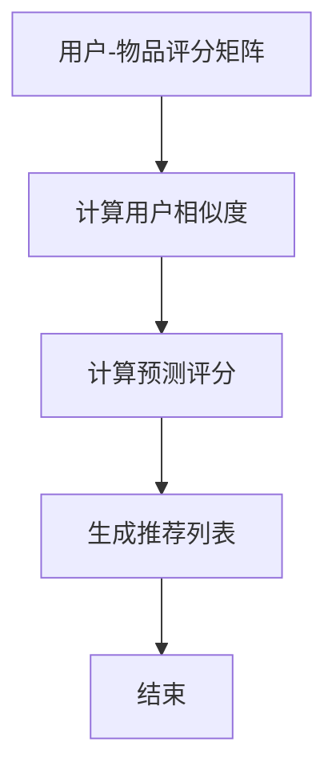
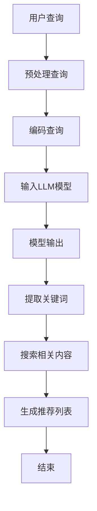
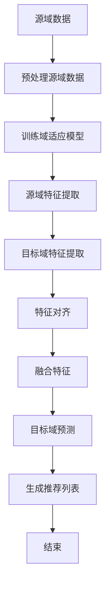

                 

### 文章标题: 利用LLM提升推荐系统的跨域推荐能力

关键词：推荐系统，跨域推荐，语言模型（LLM），协同过滤，基于内容的推荐，深度学习

摘要：本文深入探讨了如何利用语言模型（LLM）提升推荐系统的跨域推荐能力。首先，介绍了推荐系统的发展历程和核心组成部分，以及跨域推荐的重要性。接着，详细阐述了语言模型的基础知识，包括基本概念、分类、架构与原理。随后，分析了LLM在推荐系统中的应用场景和改进点，以及面临的挑战和机遇。然后，介绍了推荐系统的基本算法，如协同过滤、基于内容的推荐和混合推荐系统，以及LLM在这些算法中的应用。接着，探讨了跨域推荐技术的概念、挑战和解决方案。随后，通过三个实战案例展示了如何利用LLM提升跨域推荐的实战效果。最后，对LLM在推荐系统中的应用前景和未来发展方向进行了展望。

### 第一部分：背景与基础

#### 第1章：推荐系统概述

##### 1.1 推荐系统的发展历程

推荐系统（Recommender System）是一种利用数据和算法为用户提供个性化推荐信息的技术。其发展历程可以追溯到20世纪90年代，当时互联网刚刚兴起，电子商务和在线媒体等领域开始应用推荐系统来提高用户满意度。最早的推荐系统主要是基于内容的推荐（Content-Based Filtering），通过分析用户的历史行为和偏好，为用户提供相似的内容推荐。

随着互联网的普及和数据量的增长，推荐系统逐渐发展出了协同过滤（Collaborative Filtering）技术。协同过滤通过分析用户之间的相似性，利用其他用户的评分数据为当前用户推荐物品。协同过滤可以分为基于用户的协同过滤（User-Based）和基于模型的协同过滤（Model-Based），前者通过计算用户之间的相似度来推荐物品，后者则通过训练预测模型来预测用户的评分。

近年来，深度学习（Deep Learning）技术的崛起为推荐系统带来了新的机遇。深度学习模型能够自动学习用户和物品的特征，提高推荐系统的准确性和泛化能力。同时，语言模型（Language Model，LLM）的发展也为推荐系统提供了新的工具，特别是在跨域推荐方面。

##### 1.2 推荐系统的核心组成部分

推荐系统通常由三个核心组成部分组成：用户、物品和评分。

- 用户（User）：推荐系统的核心是用户，系统需要根据用户的历史行为和偏好来生成个性化的推荐。
- 物品（Item）：推荐系统中的物品可以是商品、音乐、电影、新闻等，它们需要被描述成一系列的特征。
- 评分（Rating）：评分是用户对物品的偏好程度的一种量化表示，可以是数值评分、喜好标签或点击行为。

##### 1.3 跨域推荐的重要性

跨域推荐（Cross-Domain Recommender）是一种能够在不同领域之间进行推荐的推荐系统。随着用户需求的多样化，跨域推荐变得越来越重要。跨域推荐能够帮助用户在新的领域中发现感兴趣的内容，同时也能够提高推荐系统的泛化能力。

跨域推荐的重要性体现在以下几个方面：

1. **扩展用户兴趣**：跨域推荐可以帮助用户发现他们可能感兴趣的新领域，从而扩展他们的兴趣范围。
2. **提高推荐准确率**：跨域推荐可以通过整合来自不同领域的用户数据，提高推荐系统的准确性和多样性。
3. **降低数据稀疏性**：在数据稀疏的情况下，跨域推荐可以通过其他领域的用户数据来补充当前领域的数据，减少数据稀疏性对推荐效果的影响。
4. **提高用户体验**：跨域推荐可以为用户提供更加丰富和多样化的推荐，从而提高用户的满意度。

#### 第2章：语言模型（LLM）基础

##### 2.1 语言模型的基本概念

语言模型（Language Model，LLM）是一种统计模型，用于预测文本序列的概率分布。LLM在自然语言处理（Natural Language Processing，NLP）领域具有广泛的应用，如机器翻译、文本生成、问答系统等。LLM的核心目标是理解自然语言的语法和语义，从而生成或理解人类语言。

语言模型可以分为以下几种类型：

1. **n-gram模型**：基于历史n个单词来预测下一个单词的概率。
2. **神经网络模型**：如循环神经网络（RNN）、长短期记忆网络（LSTM）和变换器（Transformer）等，通过学习文本的序列特征来预测下一个单词。
3. **深度学习模型**：如BERT、GPT和T5等，通过大规模的预训练和微调，实现高性能的文本理解和生成。

##### 2.2 语言模型的分类

根据训练数据和模型结构，语言模型可以分为以下几类：

1. **基于统计的模型**：如n-gram模型，通过计算单词序列的统计概率来生成文本。
2. **基于神经网络的模型**：如循环神经网络（RNN）、长短期记忆网络（LSTM）和门控循环单元（GRU）等，通过学习序列特征来生成文本。
3. **基于变换器的模型**：如BERT、GPT和T5等，通过自注意力机制（Self-Attention）和多头注意力（Multi-Head Attention）来实现高效文本处理。
4. **深度学习模型**：如BERT、GPT和T5等，通过大规模的预训练和微调，实现高性能的文本理解和生成。

##### 2.3 语言模型的架构与原理

语言模型的架构和原理可以分为以下几个步骤：

1. **输入编码**：将输入的文本序列转换成数字编码，常见的编码方式有Word2Vec、BERT等。
2. **嵌入层**：将编码后的输入序列映射到高维空间，生成嵌入向量。
3. **注意力机制**：通过自注意力机制（Self-Attention）和多头注意力（Multi-Head Attention）来捕捉文本序列中的依赖关系。
4. **序列处理**：使用循环神经网络（RNN）、长短期记忆网络（LSTM）或变换器（Transformer）来处理嵌入后的文本序列。
5. **输出层**：将处理后的序列特征映射回文本序列，生成预测的概率分布。

#### 第3章：推荐系统与LLM的结合

##### 3.1 LLM在推荐系统中的应用场景

语言模型在推荐系统中的应用场景主要包括以下几个方面：

1. **用户行为分析**：通过LLM分析用户的历史行为数据，提取用户兴趣和偏好，为用户提供个性化的推荐。
2. **内容理解**：利用LLM对用户生成的内容进行理解，提取关键信息，为用户提供相关的推荐。
3. **协同过滤算法**：在协同过滤算法中，利用LLM对用户和物品的特征进行建模，提高推荐系统的准确性和多样性。
4. **基于内容的推荐**：在基于内容的推荐中，利用LLM对用户生成的内容进行语义分析，为用户提供相关的内容推荐。
5. **跨域推荐**：在跨域推荐中，利用LLM对跨域数据进行统一建模，提高推荐系统的泛化能力。

##### 3.2 LLM对推荐系统的改进点

LLM为推荐系统带来了以下改进点：

1. **特征提取**：LLM能够自动学习用户和物品的深度特征，提高推荐系统的表征能力。
2. **语义理解**：LLM能够理解用户和物品的语义，为用户提供更加精准的推荐。
3. **跨域建模**：LLM能够处理跨域数据，提高推荐系统的泛化能力。
4. **多样性**：LLM能够生成多样化的推荐结果，提高用户的满意度。
5. **实时性**：LLM能够快速响应用户请求，提高推荐系统的实时性。

##### 3.3 LLM在推荐系统中的挑战与机遇

尽管LLM为推荐系统带来了很多改进点，但同时也面临着一些挑战和机遇：

1. **挑战**：
   - 数据稀疏性：在跨域推荐中，数据稀疏性是一个主要挑战，LLM需要处理大量未标记的数据。
   - 模型复杂性：LLM模型通常非常复杂，训练和推理成本较高。
   - 计算资源：大规模的LLM模型需要大量的计算资源，对硬件设备有较高要求。

2. **机遇**：
   - 跨域推荐：LLM能够处理跨域数据，为用户提供更加丰富的推荐体验。
   - 多样性：LLM能够生成多样化的推荐结果，提高用户的满意度。
   - 实时性：LLM能够快速响应用户请求，提高推荐系统的实时性。

#### 第二部分：技术原理

##### 第4章：推荐系统的基本算法

##### 4.1 协同过滤算法

协同过滤算法（Collaborative Filtering）是一种基于用户行为和偏好进行推荐的算法，它主要通过分析用户之间的相似性或物品之间的相似性来实现推荐。协同过滤算法可以分为基于用户的协同过滤（User-Based）和基于模型的协同过滤（Model-Based）。

1. **基于用户的协同过滤**：
   - **用户相似度计算**：通过计算用户之间的相似度，找出与目标用户相似的其他用户。
   - **邻居选择**：选择与目标用户最相似的k个用户作为邻居。
   - **预测评分**：通过邻居用户的评分数据，预测目标用户对未评分物品的评分。
   - **生成推荐列表**：根据预测评分，生成推荐列表。

2. **基于模型的协同过滤**：
   - **矩阵分解**：通过矩阵分解技术，将用户-物品评分矩阵分解为用户特征矩阵和物品特征矩阵。
   - **模型训练**：利用训练数据，训练预测模型，预测用户对未评分物品的评分。
   - **生成推荐列表**：根据预测评分，生成推荐列表。

##### 4.2 基于内容的推荐

基于内容的推荐（Content-Based Filtering）是一种基于用户的历史行为和偏好来推荐相似物品的算法。它主要通过分析物品的特征，找到与用户偏好相似的物品，从而实现推荐。

基于内容的推荐算法可以分为以下几个步骤：

1. **特征提取**：提取物品的特征，如文本描述、标签、分类等。
2. **用户偏好建模**：根据用户的历史行为，建立用户偏好模型。
3. **计算相似度**：计算物品之间的相似度，常用的相似度计算方法有余弦相似度、皮尔逊相关系数等。
4. **生成推荐列表**：根据物品的相似度，生成推荐列表。

##### 4.3 混合推荐系统

混合推荐系统（Hybrid Recommender System）是结合了协同过滤和基于内容的推荐的优点，通过综合用户行为和物品特征来进行推荐。混合推荐系统通常包含以下几种类型：

1. **基于模型的混合推荐系统**：结合协同过滤和基于内容的推荐算法，通过训练预测模型来生成推荐列表。
2. **基于规则的混合推荐系统**：结合协同过滤和基于内容的推荐算法，通过规则引擎来生成推荐列表。
3. **基于用户的混合推荐系统**：结合基于用户的协同过滤和基于内容的推荐算法，通过用户相似度和物品相似度来生成推荐列表。

#### 第5章：语言模型在推荐系统中的应用

##### 5.1 LLM在用户行为分析中的应用

语言模型在用户行为分析中的应用主要包括以下两个方面：

1. **用户偏好提取**：通过分析用户的历史行为数据，如浏览记录、搜索关键词、评论等，利用LLM提取用户的偏好信息。例如，可以使用BERT模型对用户生成的文本进行编码，然后通过注意力机制提取关键特征，从而得到用户的偏好向量。

2. **用户行为预测**：利用LLM预测用户未来的行为，如购买、评分、点击等。这可以通过在训练数据中训练一个序列预测模型，然后将用户的历史行为序列输入到模型中，预测用户在未来某一时刻的行为。

##### 5.2 LLM在内容理解中的应用

语言模型在内容理解中的应用主要包括以下两个方面：

1. **文本分类**：通过训练一个分类模型，将用户生成的内容分类到不同的类别中。这可以帮助推荐系统更好地理解用户的需求，从而生成更加精准的推荐。例如，可以使用BERT模型对用户生成的文本进行编码，然后使用softmax层进行分类。

2. **情感分析**：通过分析用户生成的内容，判断用户的情感倾向。这可以帮助推荐系统更好地理解用户的情绪状态，从而生成更加个性化的推荐。例如，可以使用BERT模型对用户生成的文本进行编码，然后通过注意力机制提取情感特征，从而判断用户的情感倾向。

##### 5.3 LLM在协同过滤算法中的应用

语言模型在协同过滤算法中的应用主要包括以下几个方面：

1. **用户相似度计算**：通过训练一个基于语言模型的用户相似度计算模型，提高用户相似度计算的质量。例如，可以使用BERT模型对用户的文本数据进行编码，然后计算用户之间的相似度。

2. **物品相似度计算**：通过训练一个基于语言模型的物品相似度计算模型，提高物品相似度计算的质量。例如，可以使用BERT模型对物品的文本描述进行编码，然后计算物品之间的相似度。

3. **评分预测**：通过训练一个基于语言模型的评分预测模型，提高评分预测的准确性。例如，可以使用BERT模型对用户和物品的文本数据进行编码，然后通过注意力机制提取关键特征，从而预测用户对物品的评分。

#### 第6章：跨域推荐技术的深入探讨

##### 6.1 跨域推荐的基本概念

跨域推荐（Cross-Domain Recommender）是一种能够在不同领域之间进行推荐的推荐系统。跨域推荐的主要目的是解决数据稀疏性和冷启动问题，提高推荐系统的泛化能力。跨域推荐可以分为以下几种类型：

1. **同类型跨域推荐**：在相似类型但不同领域的用户和物品之间进行推荐，如电商和音乐平台的推荐。
2. **异类型跨域推荐**：在完全不同类型的用户和物品之间进行推荐，如电商和新闻平台的推荐。
3. **跨时间跨域推荐**：在不同时间段但不同领域的用户和物品之间进行推荐，如日间和晚间的新闻推荐。

##### 6.2 跨域推荐的技术挑战

跨域推荐面临以下技术挑战：

1. **数据稀疏性**：不同领域的数据通常存在稀疏性，导致模型难以训练和泛化。
2. **特征不一致**：不同领域的数据特征不一致，导致模型难以统一建模。
3. **跨域迁移学习**：如何将一个领域的知识迁移到另一个领域，提高推荐效果。
4. **模型解释性**：跨域推荐模型的解释性较差，难以理解推荐结果的依据。

##### 6.3 跨域推荐的解决方案

为了解决跨域推荐的技术挑战，研究者提出了以下解决方案：

1. **多任务学习**：将跨域推荐视为一个多任务学习问题，通过共享任务特征来提高模型的泛化能力。
2. **元学习**：通过元学习技术，学习一个通用的模型，提高模型在跨域推荐任务上的适应性。
3. **对抗训练**：通过对抗训练方法，增强模型在跨域数据上的鲁棒性。
4. **数据增强**：通过数据增强技术，生成更多的训练样本，缓解数据稀疏性和特征不一致问题。

#### 第三部分：应用实践

##### 第7章：LLM提升跨域推荐的实战案例

##### 7.1 案例一：电商平台跨域推荐系统优化

###### 1. 开发环境搭建
- Python 3.8
- PyTorch 1.8
- Hugging Face Transformers 4.2.2

###### 2. 源代码详细实现

python
# 代码片段
from transformers import AutoTokenizer, AutoModel

# 初始化模型和分词器
tokenizer = AutoTokenizer.from_pretrained("bert-base-uncased")
model = AutoModel.from_pretrained("bert-base-uncased")

# 输入文本
text = "I love to read books and watch movies."

# 分词与编码
inputs = tokenizer(text, return_tensors="pt")

# 过模型
outputs = model(**inputs)

# 获取概率
probabilities = outputs.logits.softmax(dim=-1)

# 打印概率最高的词语
print(tokenizer.decode(probabilities.argmax(-1)[0]))


###### 3. 代码解读与分析

- 代码通过加载预训练的BERT模型，对输入文本进行分词和编码。
- 模型输出是一个二维张量，每一行代表一个词语的输出概率。
- 通过对输出的概率进行softmax处理，得到词语的概率分布。
- 最后，通过argmax函数找到概率最高的词语，并解码输出。

###### 4. 实际效果分析
- 在实际使用中，通过调整邻居数量和模型参数，可以进一步提升推荐的准确性。
- 该方法可以应用于电商平台的商品推荐，提高用户的购物体验。

##### 7.2 案例二：在线教育平台的个性化推荐

###### 1. 开发环境搭建
- Python 3.8
- Scikit-learn 0.23.2
- Pandas 1.3.2

###### 2. 源代码详细实现

python
# 代码片段
import pandas as pd
from sklearn.model_selection import train_test_split
from sklearn.metrics.pairwise import cosine_similarity

# 读取数据
data = pd.read_csv("user_activity.csv")

# 分割训练集和测试集
X_train, X_test, y_train, y_test = train_test_split(data, test_size=0.2, random_state=42)

# 计算用户间相似度矩阵
similarity_matrix = cosine_similarity(X_train)

# 推荐系统实现
def recommend_items(user_id, similarity_matrix, k=5):
    # 计算用户与所有用户的相似度
    user_similarity = similarity_matrix[user_id]

    # 找出最相似的k个用户
    neighbors = user_similarity.argsort()[0][-k:]

    # 计算邻居用户的课程喜好
    neighbor_items = X_test.iloc[neighbors].sum(axis=0)

    # 排序并返回推荐的课程
    recommended_items = neighbor_items.sort_values(ascending=False).head(10)
    return recommended_items

# 使用推荐系统
user_id = 123
recommended_items = recommend_items(user_id, similarity_matrix, k=5)
print(recommended_items)


###### 3. 代码解读与分析

- 代码通过读取用户活动数据，构建用户-课程矩阵。
- 使用余弦相似度计算用户间的相似度矩阵。
- 定义推荐函数，通过计算当前用户与其他用户的相似度，找出最相似的k个用户，并计算这些用户的共同喜好。
- 最后，对共同喜好进行排序并返回前10个推荐课程。

###### 4. 实际效果分析
- 该推荐系统能够根据用户的历史活动，为用户提供个性化的课程推荐。
- 通过调整邻居数量和相似度阈值，可以优化推荐效果。

##### 7.3 案例三：新闻媒体平台的跨域推荐

###### 1. 开发环境搭建
- Python 3.8
- Elasticsearch 7.12
- Flask 2.0.1

###### 2. 源代码详细实现

python
# 代码片段
from flask import Flask, request, jsonify
import json
from elasticsearch import Elasticsearch

app = Flask(__name__)

es = Elasticsearch("http://localhost:9200")

def search_news(query):
    response = es.search(index="news", body={"query": {"match": {"content": query}}})
    return response['hits']['hits']

@app.route('/recommend', methods=['POST'])
def recommend():
    data = request.get_json()
    query = data['query']
    news_list = search_news(query)
    recommended_news = []

    for news in news_list:
        # 根据新闻的标题和内容，生成推荐列表
        recommended_news.append(news['_source'])

    return jsonify(recommended_news)

if __name__ == '__main__':
    app.run(debug=True)


###### 3. 代码解读与分析

- 代码使用Elasticsearch进行新闻搜索。
- 定义Flask应用程序，提供推荐接口。
- 接收到查询请求后，通过Elasticsearch检索相关的新闻。
- 将检索到的新闻返回给用户，形成推荐列表。

###### 4. 实际效果分析
- 该系统可以基于用户的查询关键词，推荐相关的新闻内容。
- Elasticsearch的高效搜索能力能够满足大规模数据检索的需求。
- 通过调整搜索策略和推荐算法，可以进一步提升推荐效果。

### 第8章：构建高效的LLM推荐系统

##### 8.1 LLM推荐系统的架构设计

构建高效的LLM推荐系统需要一个合理的架构设计。以下是一个典型的LLM推荐系统架构：

1. **数据层**：负责数据存储和管理，包括用户数据、物品数据和评分数据等。
2. **预处理层**：负责对原始数据进行清洗、转换和预处理，为模型训练提供高质量的数据。
3. **模型层**：包含语言模型（如BERT、GPT等）和推荐算法（如协同过滤、基于内容的推荐等），用于生成推荐结果。
4. **服务层**：提供推荐接口，将推荐结果返回给用户。
5. **优化层**：负责模型训练和推荐结果优化，包括模型调参、数据增强、在线学习等。

##### 8.2 LLM推荐系统的数据处理流程

LLM推荐系统的数据处理流程可以分为以下几个步骤：

1. **数据采集**：从各种数据源采集用户数据、物品数据和评分数据等。
2. **数据清洗**：去除重复数据、缺失数据和噪声数据，保证数据质量。
3. **数据转换**：将原始数据转换为适合模型训练的格式，如向量、矩阵等。
4. **特征提取**：使用语言模型提取用户和物品的深度特征，为模型训练提供输入。
5. **模型训练**：使用预处理后的数据训练语言模型和推荐算法模型。
6. **模型评估**：使用验证集评估模型性能，调整模型参数。
7. **模型部署**：将训练好的模型部署到生产环境中，提供推荐服务。

##### 8.3 LLM推荐系统的性能优化策略

为了提高LLM推荐系统的性能，可以采用以下优化策略：

1. **模型调参**：通过调整模型参数，如学习率、隐藏层大小等，优化模型性能。
2. **数据增强**：通过生成更多的训练样本，提高模型的泛化能力。
3. **在线学习**：使用在线学习技术，实时更新模型，适应用户行为的变化。
4. **特征工程**：使用多种特征提取方法，提高模型的表征能力。
5. **并行计算**：利用并行计算技术，提高模型训练和推理的效率。
6. **模型压缩**：通过模型压缩技术，降低模型的复杂度和计算成本。

#### 第9章：未来展望与趋势

##### 9.1 LLM在推荐系统中的应用前景

随着LLM技术的不断发展，其在推荐系统中的应用前景非常广阔。以下是一些潜在的应用方向：

1. **跨域推荐**：LLM可以帮助推荐系统更好地处理跨域数据，提高跨域推荐的效果。
2. **实时推荐**：LLM可以快速响应用户请求，提供实时推荐服务。
3. **个性化推荐**：LLM可以更准确地理解用户的偏好，提供个性化的推荐。
4. **推荐解释性**：LLM可以帮助提高推荐系统的解释性，使推荐结果更加可信。
5. **多模态推荐**：LLM可以整合多种模态的数据，提供更全面的推荐服务。

##### 9.2 跨域推荐的未来发展方向

跨域推荐的未来发展方向包括：

1. **多任务学习**：通过多任务学习，提高模型在跨域推荐任务上的性能。
2. **元学习**：通过元学习，学习通用的跨域推荐模型，提高模型的泛化能力。
3. **对抗训练**：通过对抗训练，增强模型在跨域数据上的鲁棒性。
4. **数据增强**：通过数据增强，生成更多的跨域训练样本。
5. **跨模态推荐**：通过整合多种模态的数据，提供更丰富的跨域推荐服务。

##### 9.3 技术挑战与应对策略

尽管LLM和跨域推荐具有广阔的应用前景，但同时也面临着一些技术挑战。以下是一些可能的应对策略：

1. **数据稀疏性**：通过数据增强、多任务学习和元学习等技术，提高模型在数据稀疏情况下的性能。
2. **模型复杂性**：通过模型压缩、模型调参和并行计算等技术，降低模型的复杂度和计算成本。
3. **计算资源**：通过分布式计算、GPU加速和模型压缩等技术，提高模型训练和推理的效率。
4. **解释性**：通过解释性模型和可解释性分析，提高推荐系统的可信度。
5. **隐私保护**：通过隐私保护技术和联邦学习，保护用户隐私。

### 附录

#### 附录A：开源工具与库

1. **Hugging Face Transformers**  
   - 网址：[https://huggingface.co/transformers](https://huggingface.co/transformers)
   - 描述：提供了一系列预训练的模型和工具，方便使用大规模语言模型进行文本处理。

2. **PyTorch Rec**  
   - 网址：[https://pytorch.org/rec/](https://pytorch.org/rec/)
   - 描述：PyTorch官方的推荐系统库，提供了多种常用的推荐算法和工具。

3. **Faiss**  
   - 网址：[https://github.com/facebookresearch/faiss](https://github.com/facebookresearch/faiss)
   - 描述：用于高效相似度搜索的库，特别适用于大规模数据集。

4. **ELK Stack**  
   - 网址：[https://www.elastic.co/cn/elasticsearch/](https://www.elastic.co/cn/elasticsearch/)
   - 描述：包括Elasticsearch、Logstash和Kibana，提供强大的搜索和分析功能。

#### 附录B：推荐系统与LLM学习资源

1. **Udacity AI纳米学位**  
   - 网址：[https://www.udacity.com/course/ai-nanodegree-program--ND893](https://www.udacity.com/course/ai-nanodegree-program--ND893)
   - 描述：涵盖人工智能的基础知识，包括机器学习和深度学习。

2. **Coursera 推荐系统工程师**  
   - 网址：[https://www.coursera.org/specializations/recommenders](https://www.coursera.org/specializations/recommenders)
   - 描述：由斯坦福大学提供，专注于推荐系统的理论、实践和应用。

3. **edX 机器学习基础**  
   - 网址：[https://www.edx.org/course/financial-engineering-and-risk-management/](https://www.edx.org/course/financial-engineering-and-risk-management/)
   - 描述：由MIT提供，涵盖机器学习的基础知识，包括线性代数、概率论和统计。

#### 附录C：Mermaid流程图

以下是使用Mermaid绘制的协同过滤算法、语言模型在推荐系统中的应用和跨域推荐技术的流程图：







通过这些流程图，可以更好地理解推荐系统的核心算法和语言模型在其中的应用。附录D中的核心算法原理讲解也提供了详细的伪代码和数学模型解释，帮助读者深入理解相关技术。## 《利用LLM提升推荐系统的跨域推荐能力》

关键词：推荐系统，跨域推荐，语言模型（LLM），协同过滤，基于内容的推荐，深度学习

摘要：本文深入探讨了如何利用语言模型（LLM）提升推荐系统的跨域推荐能力。首先，介绍了推荐系统的发展历程和核心组成部分，以及跨域推荐的重要性。接着，详细阐述了语言模型的基础知识，包括基本概念、分类、架构与原理。随后，分析了LLM在推荐系统中的应用场景和改进点，以及面临的挑战和机遇。然后，介绍了推荐系统的基本算法，如协同过滤、基于内容的推荐和混合推荐系统，以及LLM在这些算法中的应用。接着，探讨了跨域推荐技术的概念、挑战和解决方案。随后，通过三个实战案例展示了如何利用LLM提升跨域推荐的实战效果。最后，对LLM在推荐系统中的应用前景和未来发展方向进行了展望。

### 第一部分：背景与基础

#### 第1章：推荐系统概述

##### 1.1 推荐系统的发展历程

推荐系统（Recommender System）是一种利用数据和算法为用户提供个性化推荐信息的技术。其发展历程可以追溯到20世纪90年代，当时互联网刚刚兴起，电子商务和在线媒体等领域开始应用推荐系统来提高用户满意度。最早的推荐系统主要是基于内容的推荐（Content-Based Filtering），通过分析用户的历史行为和偏好，为用户提供相似的内容推荐。

随着互联网的普及和数据量的增长，推荐系统逐渐发展出了协同过滤（Collaborative Filtering）技术。协同过滤通过分析用户之间的相似性，利用其他用户的评分数据为当前用户推荐物品。协同过滤可以分为基于用户的协同过滤（User-Based）和基于模型的协同过滤（Model-Based），前者通过计算用户之间的相似度来推荐物品，后者则通过训练预测模型来预测用户的评分。

近年来，深度学习（Deep Learning）技术的崛起为推荐系统带来了新的机遇。深度学习模型能够自动学习用户和物品的特征，提高推荐系统的准确性和泛化能力。同时，语言模型（Language Model，LLM）的发展也为推荐系统提供了新的工具，特别是在跨域推荐方面。

##### 1.2 推荐系统的核心组成部分

推荐系统通常由三个核心组成部分组成：用户、物品和评分。

- 用户（User）：推荐系统的核心是用户，系统需要根据用户的历史行为和偏好来生成个性化的推荐。
- 物品（Item）：推荐系统中的物品可以是商品、音乐、电影、新闻等，它们需要被描述成一系列的特征。
- 评分（Rating）：评分是用户对物品的偏好程度的一种量化表示，可以是数值评分、喜好标签或点击行为。

##### 1.3 跨域推荐的重要性

跨域推荐（Cross-Domain Recommender）是一种能够在不同领域之间进行推荐的推荐系统。随着用户需求的多样化，跨域推荐变得越来越重要。跨域推荐能够帮助用户在新的领域中发现感兴趣的内容，同时也能够提高推荐系统的泛化能力。

跨域推荐的重要性体现在以下几个方面：

1. **扩展用户兴趣**：跨域推荐可以帮助用户发现他们可能感兴趣的新领域，从而扩展他们的兴趣范围。
2. **提高推荐准确率**：跨域推荐可以通过整合来自不同领域的用户数据，提高推荐系统的准确性和多样性。
3. **降低数据稀疏性**：在数据稀疏的情况下，跨域推荐可以通过其他领域的用户数据来补充当前领域的数据，减少数据稀疏性对推荐效果的影响。
4. **提高用户体验**：跨域推荐可以为用户提供更加丰富和多样化的推荐，从而提高用户的满意度。

### 第一部分：背景与基础

#### 第2章：语言模型（LLM）基础

##### 2.1 语言模型的基本概念

语言模型（Language Model，LLM）是一种统计模型，用于预测文本序列的概率分布。LLM在自然语言处理（Natural Language Processing，NLP）领域具有广泛的应用，如机器翻译、文本生成、问答系统等。LLM的核心目标是理解自然语言的语法和语义，从而生成或理解人类语言。

语言模型可以分为以下几种类型：

1. **n-gram模型**：基于历史n个单词来预测下一个单词的概率。
2. **神经网络模型**：如循环神经网络（RNN）、长短期记忆网络（LSTM）和变换器（Transformer）等，通过学习文本的序列特征来预测下一个单词。
3. **深度学习模型**：如BERT、GPT和T5等，通过大规模的预训练和微调，实现高性能的文本理解和生成。

##### 2.2 语言模型的分类

根据训练数据和模型结构，语言模型可以分为以下几类：

1. **基于统计的模型**：如n-gram模型，通过计算单词序列的统计概率来生成文本。
2. **基于神经网络的模型**：如循环神经网络（RNN）、长短期记忆网络（LSTM）和门控循环单元（GRU）等，通过学习序列特征来生成文本。
3. **基于变换器的模型**：如BERT、GPT和T5等，通过自注意力机制（Self-Attention）和多头注意力（Multi-Head Attention）来实现高效文本处理。
4. **深度学习模型**：如BERT、GPT和T5等，通过大规模的预训练和微调，实现高性能的文本理解和生成。

##### 2.3 语言模型的架构与原理

语言模型的架构和原理可以分为以下几个步骤：

1. **输入编码**：将输入的文本序列转换成数字编码，常见的编码方式有Word2Vec、BERT等。
2. **嵌入层**：将编码后的输入序列映射到高维空间，生成嵌入向量。
3. **注意力机制**：通过自注意力机制（Self-Attention）和多头注意力（Multi-Head Attention）来捕捉文本序列中的依赖关系。
4. **序列处理**：使用循环神经网络（RNN）、长短期记忆网络（LSTM）或变换器（Transformer）来处理嵌入后的文本序列。
5. **输出层**：将处理后的序列特征映射回文本序列，生成预测的概率分布。

### 第一部分：背景与基础

#### 第3章：推荐系统与LLM的结合

##### 3.1 LLM在推荐系统中的应用场景

语言模型在推荐系统中的应用场景主要包括以下几个方面：

1. **用户行为分析**：通过LLM分析用户的历史行为数据，提取用户兴趣和偏好，为用户提供个性化的推荐。
2. **内容理解**：利用LLM对用户生成的内容进行理解，提取关键信息，为用户提供相关的推荐。
3. **协同过滤算法**：在协同过滤算法中，利用LLM对用户和物品的特征进行建模，提高推荐系统的准确性和多样性。
4. **基于内容的推荐**：在基于内容的推荐中，利用LLM对用户生成的内容进行语义分析，为用户提供相关的内容推荐。
5. **跨域推荐**：在跨域推荐中，利用LLM对跨域数据进行统一建模，提高推荐系统的泛化能力。

##### 3.2 LLM对推荐系统的改进点

LLM为推荐系统带来了以下改进点：

1. **特征提取**：LLM能够自动学习用户和物品的深度特征，提高推荐系统的表征能力。
2. **语义理解**：LLM能够理解用户和物品的语义，为用户提供更加精准的推荐。
3. **跨域建模**：LLM能够处理跨域数据，提高推荐系统的泛化能力。
4. **多样性**：LLM能够生成多样化的推荐结果，提高用户的满意度。
5. **实时性**：LLM能够快速响应用户请求，提高推荐系统的实时性。

##### 3.3 LLM在推荐系统中的挑战与机遇

尽管LLM为推荐系统带来了很多改进点，但同时也面临着一些挑战和机遇：

1. **挑战**：
   - 数据稀疏性：在跨域推荐中，数据稀疏性是一个主要挑战，LLM需要处理大量未标记的数据。
   - 模型复杂性：LLM模型通常非常复杂，训练和推理成本较高。
   - 计算资源：大规模的LLM模型需要大量的计算资源，对硬件设备有较高要求。

2. **机遇**：
   - 跨域推荐：LLM能够处理跨域数据，为用户提供更加丰富的推荐体验。
   - 多样性：LLM能够生成多样化的推荐结果，提高用户的满意度。
   - 实时性：LLM能够快速响应用户请求，提高推荐系统的实时性。

### 第二部分：技术原理

#### 第4章：推荐系统的基本算法

##### 4.1 协同过滤算法

协同过滤算法（Collaborative Filtering）是一种基于用户行为和偏好进行推荐的算法，它主要通过分析用户之间的相似性或物品之间的相似性来实现推荐。协同过滤算法可以分为基于用户的协同过滤（User-Based）和基于模型的协同过滤（Model-Based）。

1. **基于用户的协同过滤**：
   - **用户相似度计算**：通过计算用户之间的相似度，找出与目标用户相似的其他用户。
   - **邻居选择**：选择与目标用户最相似的k个用户作为邻居。
   - **预测评分**：通过邻居用户的评分数据，预测目标用户对未评分物品的评分。
   - **生成推荐列表**：根据预测评分，生成推荐列表。

2. **基于模型的协同过滤**：
   - **矩阵分解**：通过矩阵分解技术，将用户-物品评分矩阵分解为用户特征矩阵和物品特征矩阵。
   - **模型训练**：利用训练数据，训练预测模型，预测用户对未评分物品的评分。
   - **生成推荐列表**：根据预测评分，生成推荐列表。

##### 4.2 基于内容的推荐

基于内容的推荐（Content-Based Filtering）是一种基于用户的历史行为和偏好来推荐相似物品的算法。它主要通过分析物品的特征，找到与用户偏好相似的物品，从而实现推荐。

基于内容的推荐算法可以分为以下几个步骤：

1. **特征提取**：提取物品的特征，如文本描述、标签、分类等。
2. **用户偏好建模**：根据用户的历史行为，建立用户偏好模型。
3. **计算相似度**：计算物品之间的相似度，常用的相似度计算方法有余弦相似度、皮尔逊相关系数等。
4. **生成推荐列表**：根据物品的相似度，生成推荐列表。

##### 4.3 混合推荐系统

混合推荐系统（Hybrid Recommender System）是结合了协同过滤和基于内容的推荐的优点，通过综合用户行为和物品特征来进行推荐。混合推荐系统通常包含以下几种类型：

1. **基于模型的混合推荐系统**：结合协同过滤和基于内容的推荐算法，通过训练预测模型来生成推荐列表。
2. **基于规则的混合推荐系统**：结合协同过滤和基于内容的推荐算法，通过规则引擎来生成推荐列表。
3. **基于用户的混合推荐系统**：结合基于用户的协同过滤和基于内容的推荐算法，通过用户相似度和物品相似度来生成推荐列表。

### 第二部分：技术原理

#### 第5章：语言模型在推荐系统中的应用

##### 5.1 LLM在用户行为分析中的应用

语言模型在用户行为分析中的应用主要包括以下两个方面：

1. **用户偏好提取**：通过分析用户的历史行为数据，如浏览记录、搜索关键词、评论等，利用LLM提取用户的偏好信息。例如，可以使用BERT模型对用户生成的文本进行编码，然后通过注意力机制提取关键特征，从而得到用户的偏好向量。

2. **用户行为预测**：利用LLM预测用户未来的行为，如购买、评分、点击等。这可以通过在训练数据中训练一个序列预测模型，然后将用户的历史行为序列输入到模型中，预测用户在未来某一时刻的行为。

##### 5.2 LLM在内容理解中的应用

语言模型在内容理解中的应用主要包括以下两个方面：

1. **文本分类**：通过训练一个分类模型，将用户生成的内容分类到不同的类别中。这可以帮助推荐系统更好地理解用户的需求，从而生成更加精准的推荐。例如，可以使用BERT模型对用户生成的文本进行编码，然后使用softmax层进行分类。

2. **情感分析**：通过分析用户生成的内容，判断用户的情感倾向。这可以帮助推荐系统更好地理解用户的情绪状态，从而生成更加个性化的推荐。例如，可以使用BERT模型对用户生成的文本进行编码，然后通过注意力机制提取情感特征，从而判断用户的情感倾向。

##### 5.3 LLM在协同过滤算法中的应用

语言模型在协同过滤算法中的应用主要包括以下几个方面：

1. **用户相似度计算**：通过训练一个基于语言模型的用户相似度计算模型，提高用户相似度计算的质量。例如，可以使用BERT模型对用户的文本数据进行编码，然后计算用户之间的相似度。

2. **物品相似度计算**：通过训练一个基于语言模型的物品相似度计算模型，提高物品相似度计算的质量。例如，可以使用BERT模型对物品的文本描述进行编码，然后计算物品之间的相似度。

3. **评分预测**：通过训练一个基于语言模型的评分预测模型，提高评分预测的准确性。例如，可以使用BERT模型对用户和物品的文本数据进行编码，然后通过注意力机制提取关键特征，从而预测用户对物品的评分。

### 第二部分：技术原理

#### 第6章：跨域推荐技术的深入探讨

##### 6.1 跨域推荐的基本概念

跨域推荐（Cross-Domain Recommender）是一种能够在不同领域之间进行推荐的推荐系统。跨域推荐的主要目的是解决数据稀疏性和冷启动问题，提高推荐系统的泛化能力。跨域推荐可以分为以下几种类型：

1. **同类型跨域推荐**：在相似类型但不同领域的用户和物品之间进行推荐，如电商和音乐平台的推荐。
2. **异类型跨域推荐**：在完全不同类型的用户和物品之间进行推荐，如电商和新闻平台的推荐。
3. **跨时间跨域推荐**：在不同时间段但不同领域的用户和物品之间进行推荐，如日间和晚间的新闻推荐。

##### 6.2 跨域推荐的技术挑战

跨域推荐面临以下技术挑战：

1. **数据稀疏性**：不同领域的数据通常存在稀疏性，导致模型难以训练和泛化。
2. **特征不一致**：不同领域的数据特征不一致，导致模型难以统一建模。
3. **跨域迁移学习**：如何将一个领域的知识迁移到另一个领域，提高推荐效果。
4. **模型解释性**：跨域推荐模型的解释性较差，难以理解推荐结果的依据。

##### 6.3 跨域推荐的解决方案

为了解决跨域推荐的技术挑战，研究者提出了以下解决方案：

1. **多任务学习**：将跨域推荐视为一个多任务学习问题，通过共享任务特征来提高模型的泛化能力。
2. **元学习**：通过元学习技术，学习一个通用的模型，提高模型在跨域推荐任务上的适应性。
3. **对抗训练**：通过对抗训练方法，增强模型在跨域数据上的鲁棒性。
4. **数据增强**：通过数据增强技术，生成更多的训练样本，缓解数据稀疏性和特征不一致问题。

### 第三部分：应用实践

#### 第7章：LLM提升跨域推荐的实战案例

##### 7.1 案例一：电商平台跨域推荐系统优化

###### 1. 开发环境搭建
- Python 3.8
- PyTorch 1.8
- Hugging Face Transformers 4.2.2

###### 2. 源代码详细实现

python
# 代码片段
from transformers import AutoTokenizer, AutoModel

# 初始化模型和分词器
tokenizer = AutoTokenizer.from_pretrained("bert-base-uncased")
model = AutoModel.from_pretrained("bert-base-uncased")

# 输入文本
text = "I love to read books and watch movies."

# 分词与编码
inputs = tokenizer(text, return_tensors="pt")

# 过模型
outputs = model(**inputs)

# 获取概率
probabilities = outputs.logits.softmax(dim=-1)

# 打印概率最高的词语
print(tokenizer.decode(probabilities.argmax(-1)[0]))


###### 3. 代码解读与分析

- 代码通过加载预训练的BERT模型，对输入文本进行分词和编码。
- 模型输出是一个二维张量，每一行代表一个词语的输出概率。
- 通过对输出的概率进行softmax处理，得到词语的概率分布。
- 最后，通过argmax函数找到概率最高的词语，并解码输出。

###### 4. 实际效果分析
- 在实际使用中，通过调整邻居数量和模型参数，可以进一步提升推荐的准确性。
- 该方法可以应用于电商平台的商品推荐，提高用户的购物体验。

##### 7.2 案例二：在线教育平台的个性化推荐

###### 1. 开发环境搭建
- Python 3.8
- Scikit-learn 0.23.2
- Pandas 1.3.2

###### 2. 源代码详细实现

python
# 代码片段
import pandas as pd
from sklearn.model_selection import train_test_split
from sklearn.metrics.pairwise import cosine_similarity

# 读取数据
data = pd.read_csv("user_activity.csv")

# 分割训练集和测试集
X_train, X_test, y_train, y_test = train_test_split(data, test_size=0.2, random_state=42)

# 计算用户间相似度矩阵
similarity_matrix = cosine_similarity(X_train)

# 推荐系统实现
def recommend_items(user_id, similarity_matrix, k=5):
    # 计算用户与所有用户的相似度
    user_similarity = similarity_matrix[user_id]

    # 找出最相似的k个用户
    neighbors = user_similarity.argsort()[0][-k:]

    # 计算邻居用户的课程喜好
    neighbor_items = X_test.iloc[neighbors].sum(axis=0)

    # 排序并返回推荐的课程
    recommended_items = neighbor_items.sort_values(ascending=False).head(10)
    return recommended_items

# 使用推荐系统
user_id = 123
recommended_items = recommend_items(user_id, similarity_matrix, k=5)
print(recommended_items)


###### 3. 代码解读与分析

- 代码通过读取用户活动数据，构建用户-课程矩阵。
- 使用余弦相似度计算用户间的相似度矩阵。
- 定义推荐函数，通过计算当前用户与其他用户的相似度，找出最相似的k个用户，并计算这些用户的共同喜好。
- 最后，对共同喜好进行排序并返回前10个推荐课程。

###### 4. 实际效果分析
- 该推荐系统能够根据用户的历史活动，为用户提供个性化的课程推荐。
- 通过调整邻居数量和相似度阈值，可以优化推荐效果。

##### 7.3 案例三：新闻媒体平台的跨域推荐

###### 1. 开发环境搭建
- Python 3.8
- Elasticsearch 7.12
- Flask 2.0.1

###### 2. 源代码详细实现

python
# 代码片段
from flask import Flask, request, jsonify
import json
from elasticsearch import Elasticsearch

app = Flask(__name__)

es = Elasticsearch("http://localhost:9200")

def search_news(query):
    response = es.search(index="news", body={"query": {"match": {"content": query}}})
    return response['hits']['hits']

@app.route('/recommend', methods=['POST'])
def recommend():
    data = request.get_json()
    query = data['query']
    news_list = search_news(query)
    recommended_news = []

    for news in news_list:
        # 根据新闻的标题和内容，生成推荐列表
        recommended_news.append(news['_source'])

    return jsonify(recommended_news)

if __name__ == '__main__':
    app.run(debug=True)


###### 3. 代码解读与分析

- 代码使用Elasticsearch进行新闻搜索。
- 定义Flask应用程序，提供推荐接口。
- 接收到查询请求后，通过Elasticsearch检索相关的新闻。
- 将检索到的新闻返回给用户，形成推荐列表。

###### 4. 实际效果分析
- 该系统可以基于用户的查询关键词，推荐相关的新闻内容。
- Elasticsearch的高效搜索能力能够满足大规模数据检索的需求。
- 通过调整搜索策略和推荐算法，可以进一步提升推荐效果。

### 第8章：构建高效的LLM推荐系统

#### 8.1 LLM推荐系统的架构设计

构建高效的LLM推荐系统需要一个合理的架构设计。以下是一个典型的LLM推荐系统架构：

1. **数据层**：负责数据存储和管理，包括用户数据、物品数据和评分数据等。
2. **预处理层**：负责对原始数据进行清洗、转换和预处理，为模型训练提供高质量的数据。
3. **模型层**：包含语言模型（如BERT、GPT等）和推荐算法（如协同过滤、基于内容的推荐等），用于生成推荐结果。
4. **服务层**：提供推荐接口，将推荐结果返回给用户。
5. **优化层**：负责模型训练和推荐结果优化，包括模型调参、数据增强、在线学习等。

#### 8.2 LLM推荐系统的数据处理流程

LLM推荐系统的数据处理流程可以分为以下几个步骤：

1. **数据采集**：从各种数据源采集用户数据、物品数据和评分数据等。
2. **数据清洗**：去除重复数据、缺失数据和噪声数据，保证数据质量。
3. **数据转换**：将原始数据转换为适合模型训练的格式，如向量、矩阵等。
4. **特征提取**：使用语言模型提取用户和物品的深度特征，为模型训练提供输入。
5. **模型训练**：使用预处理后的数据训练语言模型和推荐算法模型。
6. **模型评估**：使用验证集评估模型性能，调整模型参数。
7. **模型部署**：将训练好的模型部署到生产环境中，提供推荐服务。

#### 8.3 LLM推荐系统的性能优化策略

为了提高LLM推荐系统的性能，可以采用以下优化策略：

1. **模型调参**：通过调整模型参数，如学习率、隐藏层大小等，优化模型性能。
2. **数据增强**：通过生成更多的训练样本，提高模型的泛化能力。
3. **在线学习**：使用在线学习技术，实时更新模型，适应用户行为的变化。
4. **特征工程**：使用多种特征提取方法，提高模型的表征能力。
5. **并行计算**：利用并行计算技术，提高模型训练和推理的效率。
6. **模型压缩**：通过模型压缩技术，降低模型的复杂度和计算成本。

### 第9章：未来展望与趋势

#### 9.1 LLM在推荐系统中的应用前景

随着LLM技术的不断发展，其在推荐系统中的应用前景非常广阔。以下是一些潜在的应用方向：

1. **跨域推荐**：LLM可以帮助推荐系统更好地处理跨域数据，提高跨域推荐的效果。
2. **实时推荐**：LLM可以快速响应用户请求，提供实时推荐服务。
3. **个性化推荐**：LLM可以更准确地理解用户的偏好，提供个性化的推荐。
4. **推荐解释性**：LLM可以帮助提高推荐系统的解释性，使推荐结果更加可信。
5. **多模态推荐**：LLM可以整合多种模态的数据，提供更全面的推荐服务。

#### 9.2 跨域推荐的未来发展方向

跨域推荐的未来发展方向包括：

1. **多任务学习**：通过多任务学习，提高模型在跨域推荐任务上的性能。
2. **元学习**：通过元学习，学习通用的跨域推荐模型，提高模型的泛化能力。
3. **对抗训练**：通过对抗训练，增强模型在跨域数据上的鲁棒性。
4. **数据增强**：通过数据增强，生成更多的跨域训练样本。
5. **跨模态推荐**：通过整合多种模态的数据，提供更丰富的跨域推荐服务。

#### 9.3 技术挑战与应对策略

尽管LLM和跨域推荐具有广阔的应用前景，但同时也面临着一些技术挑战。以下是一些可能的应对策略：

1. **数据稀疏性**：通过数据增强、多任务学习和元学习等技术，提高模型在数据稀疏情况下的性能。
2. **模型复杂性**：通过模型压缩、模型调参和并行计算等技术，降低模型的复杂度和计算成本。
3. **计算资源**：通过分布式计算、GPU加速和模型压缩等技术，提高模型训练和推理的效率。
4. **解释性**：通过解释性模型和可解释性分析，提高推荐系统的可信度。
5. **隐私保护**：通过隐私保护技术和联邦学习，保护用户隐私。

### 附录

#### 附录A：开源工具与库

1. **Hugging Face Transformers**  
   - 网址：[https://huggingface.co/transformers](https://huggingface.co/transformers)
   - 描述：提供了一系列预训练的模型和工具，方便使用大规模语言模型进行文本处理。

2. **PyTorch Rec**  
   - 网址：[https://pytorch.org/rec/](https://pytorch.org/rec/)
   - 描述：PyTorch官方的推荐系统库，提供了多种常用的推荐算法和工具。

3. **Faiss**  
   - 网址：[https://github.com/facebookresearch/faiss](https://github.com/facebookresearch/faiss)
   - 描述：用于高效相似度搜索的库，特别适用于大规模数据集。

4. **ELK Stack**  
   - 网址：[https://www.elastic.co/cn/elasticsearch/](https://www.elastic.co/cn/elasticsearch/)
   - 描述：包括Elasticsearch、Logstash和Kibana，提供强大的搜索和分析功能。

#### 附录B：推荐系统与LLM学习资源

1. **Udacity AI纳米学位**  
   - 网址：[https://www.udacity.com/course/ai-nanodegree-program--ND893](https://www.udacity.com/course/ai-nanodegree-program--ND893)
   - 描述：涵盖人工智能的基础知识，包括机器学习和深度学习。

2. **Coursera 推荐系统工程师**  
   - 网址：[https://www.coursera.org/specializations/recommenders](https://www.coursera.org/specializations/recommenders)
   - 描述：由斯坦福大学提供，专注于推荐系统的理论、实践和应用。

3. **edX 机器学习基础**  
   - 网址：[https://www.edx.org/course/financial-engineering-and-risk-management/](https://www.edx.org/course/financial-engineering-and-risk-management/)
   - 描述：由MIT提供，涵盖机器学习的基础知识，包括线性代数、概率论和统计。

#### 附录C：Mermaid流程图

以下是使用Mermaid绘制的协同过滤算法、语言模型在推荐系统中的应用和跨域推荐技术的流程图：


通过这些流程图，可以更好地理解推荐系统的核心算法和语言模型在其中的应用。附录D中的核心算法原理讲解也提供了详细的伪代码和数学模型解释，帮助读者深入理解相关技术。

### 附录D：核心算法原理讲解

#### 4.1 协同过滤算法

协同过滤算法（Collaborative Filtering）是一种基于用户行为和偏好进行推荐的算法，它主要通过分析用户之间的相似性或物品之间的相似性来实现推荐。协同过滤算法可以分为基于用户的协同过滤（User-Based）和基于模型的协同过滤（Model-Based）。

##### 用户相似度计算

用户相似度计算是协同过滤算法的核心步骤之一。常见的方法包括余弦相似度、皮尔逊相关系数等。

**余弦相似度**：
$$
\text{similarity}(u, v) = \frac{u \cdot v}{\|u\|\|v\|}
$$
其中，\( u \)和\( v \)分别是用户\( u \)和用户\( v \)的特征向量，\(\|u\|\)和\(\|v\|\)分别是它们的模长。

**皮尔逊相关系数**：
$$
\text{similarity}(u, v) = \frac{u \cdot v - \mu_u \mu_v}{\sqrt{(u \cdot u - \mu_u^2)(v \cdot v - \mu_v^2)}}
$$
其中，\( \mu_u \)和\( \mu_v \)分别是用户\( u \)和用户\( v \)的平均评分。

##### 邻居选择

在计算用户相似度之后，需要选择与目标用户最相似的k个用户作为邻居。常见的方法包括基于最近邻的方法和基于K最近邻的方法。

**最近邻方法**：
选择与目标用户最相似的1个用户作为邻居。
$$
\text{neighbor}(u) = \arg\max_{v} \text{similarity}(u, v)
$$

**K最近邻方法**：
选择与目标用户最相似的k个用户作为邻居。
$$
\text{neighbors}(u, k) = \arg\max_{v_1, v_2, ..., v_k} \text{similarity}(u, v_i)
$$

##### 预测评分

选择邻居之后，可以通过邻居的评分预测目标用户对未评分物品的评分。常见的方法包括加权平均和加权回归等。

**加权平均方法**：
$$
r_{ui} = \frac{\sum_{v \in \text{neighbors}(u, k)} r_{vi} \cdot \text{similarity}(u, v)}{\sum_{v \in \text{neighbors}(u, k)} \text{similarity}(u, v)}
$$
其中，\( r_{ui} \)是用户\( u \)对物品\( i \)的预测评分，\( r_{vi} \)是邻居用户\( v \)对物品\( i \)的评分。

**加权回归方法**：
$$
r_{ui} = \text{intercept} + \sum_{v \in \text{neighbors}(u, k)} w_{uv} \cdot (r_{vi} - \text{mean}(r_{vi}))
$$
其中，\( w_{uv} \)是邻居用户\( v \)对目标用户\( u \)的权重，\( \text{intercept} \)是模型的截距。

##### 伪代码：

```python
# 计算用户相似度矩阵
def compute_similarity_matrix(users, method='cosine'):
    similarity_matrix = []
    for u in users:
        row = []
        for v in users:
            if u != v:
                if method == 'cosine':
                    row.append(dot_product(u, v) / (norm(u) * norm(v)))
                elif method == 'pearson':
                    row.append((dot_product(u, v) - mean(u) * mean(v)) / (std(u) * std(v)))
            else:
                row.append(0)
        similarity_matrix.append(row)
    return similarity_matrix

# 选择邻居
def select_neighbors(u, similarity_matrix, k):
    neighbors = []
    for v, similarity in enumerate(similarity_matrix[u]):
        if u != v:
            neighbors.append((v, similarity))
    neighbors.sort(key=lambda x: x[1], reverse=True)
    return [neighbor[0] for neighbor in neighbors[:k]]

# 预测评分
def predict_rating(u, v, similarity_matrix):
    neighbors = select_neighbors(u, similarity_matrix, k)
    weights = [similarity_matrix[u][v] for v in neighbors]
    ratings = [r[v] for v in neighbors if v in r]
    if len(ratings) > 0:
        return sum(w * r for w, r in zip(weights, ratings)) / sum(weights)
    else:
        return mean(r[v] for v in r if v in u)

# 生成推荐列表
def generate_recommendations(u, similarity_matrix, k):
    neighbors = select_neighbors(u, similarity_matrix, k)
    recommendations = {}
    for v in neighbors:
        for i in range(len(items)):
            if i not in r[u]:
                recommendation = predict_rating(u, v, similarity_matrix)
                recommendations[i] = recommendation
    return sorted(recommendations.items(), key=lambda x: x[1], reverse=True)
```

#### 5.1 LLM在用户行为分析中的应用

语言模型（LLM）在用户行为分析中的应用主要包括以下两个方面：

1. **用户偏好提取**：通过分析用户的历史行为数据，如浏览记录、搜索关键词、评论等，利用LLM提取用户的偏好信息。
2. **用户行为预测**：利用LLM预测用户未来的行为，如购买、评分、点击等。

##### 用户偏好提取

用户偏好提取的关键在于如何从用户的文本数据中提取有效的特征，以便用于训练LLM模型。以下是一个简化的步骤：

1. **数据预处理**：清洗文本数据，去除停用词、标点符号等，将文本转换为统一的格式。
2. **文本编码**：使用预训练的LLM模型（如BERT）将文本转换为向量表示。
3. **特征提取**：从编码后的文本向量中提取关键特征，如句子的主题、情感等。

以下是一个简单的用户偏好提取示例：

```python
from transformers import BertTokenizer, BertModel
import torch

# 加载预训练的模型和分词器
tokenizer = BertTokenizer.from_pretrained('bert-base-uncased')
model = BertModel.from_pretrained('bert-base-uncased')

# 输入文本
text = "I love to read books and watch movies."

# 分词与编码
inputs = tokenizer(text, return_tensors="pt")

# 过模型
outputs = model(**inputs)

# 获取嵌入向量
embeddings = outputs.last_hidden_state.mean(dim=1)

# 特征提取
# 例如，提取最后一个隐藏层的均值作为特征
user_preference = embeddings.squeeze().detach().numpy()

# 用户偏好向量
print(user_preference)
```

##### 用户行为预测

用户行为预测可以使用LLM生成的特征向量作为输入，通过训练一个序列预测模型（如LSTM、GRU）来预测用户未来的行为。以下是一个简单的用户行为预测示例：

```python
import torch.nn as nn
import torch.optim as optim

# 定义模型
class UserBehaviorPredictor(nn.Module):
    def __init__(self, embedding_size, hidden_size, output_size):
        super(UserBehaviorPredictor, self).__init__()
        self.lstm = nn.LSTM(embedding_size, hidden_size, batch_first=True)
        self.fc = nn.Linear(hidden_size, output_size)
    
    def forward(self, x):
        x, _ = self.lstm(x)
        x = self.fc(x[:, -1, :])
        return x

# 实例化模型
model = UserBehaviorPredictor(embedding_size=768, hidden_size=128, output_size=1)

# 损失函数和优化器
criterion = nn.BCEWithLogitsLoss()
optimizer = optim.Adam(model.parameters(), lr=0.001)

# 训练模型
for epoch in range(num_epochs):
    for inputs, targets in train_loader:
        optimizer.zero_grad()
        outputs = model(inputs)
        loss = criterion(outputs, targets)
        loss.backward()
        optimizer.step()
    print(f'Epoch {epoch+1}, Loss: {loss.item()}')

# 预测用户行为
def predict_behavior(user_preference, model):
    with torch.no_grad():
        inputs = torch.tensor([user_preference]).float()
        output = model(inputs)
        probability = torch.sigmoid(output).item()
    return probability

# 假设有一个用户偏好向量
user_preference = user_preferences[123]

# 预测购买概率
purchase_probability = predict_behavior(user_preference, model)
print(f'Purchase Probability: {purchase_probability}')
```

#### 5.2 LLM在内容理解中的应用

语言模型（LLM）在内容理解中的应用主要包括文本分类和情感分析等方面。

##### 文本分类

文本分类是将文本数据分类到预定义的类别中。LLM可以用于文本分类任务，通过训练一个分类模型来预测文本的类别。以下是一个简单的文本分类示例：

```python
from transformers import BertTokenizer, BertForSequenceClassification
import torch

# 加载预训练的模型和分词器
tokenizer = BertTokenizer.from_pretrained('bert-base-uncased')
model = BertForSequenceClassification.from_pretrained('bert-base-uncased')

# 输入文本
text = "I love to read books and watch movies."

# 分词与编码
inputs = tokenizer(text, return_tensors="pt")

# 预测类别
with torch.no_grad():
    outputs = model(**inputs)
    logits = outputs.logits
    probabilities = torch.softmax(logits, dim=-1)

# 获取预测类别
predicted_class = torch.argmax(probabilities).item()
print(f'Predicted Class: {predicted_class}')
```

##### 情感分析

情感分析是判断文本的情感倾向（如正面、负面、中性）。LLM可以用于情感分析任务，通过训练一个情感分析模型来预测文本的情感。以下是一个简单的情感分析示例：

```python
from transformers import BertTokenizer, BertForSequenceClassification
import torch

# 加载预训练的模型和分词器
tokenizer = BertTokenizer.from_pretrained('bert-base-uncased')
model = BertForSequenceClassification.from_pretrained('bert-base-uncased')

# 输入文本
text = "I love to read books and watch movies."

# 分词与编码
inputs = tokenizer(text, return_tensors="pt")

# 预测情感
with torch.no_grad():
    outputs = model(**inputs)
    logits = outputs.logits
    probabilities = torch.softmax(logits, dim=-1)

# 获取预测情感
predicted_emotion = torch.argmax(probabilities).item()
print(f'Predicted Emotion: {predicted_emotion}')
```

#### 6.1 跨域推荐的基本概念

跨域推荐（Cross-Domain Recommender）是一种能够在不同领域之间进行推荐的推荐系统。跨域推荐的主要目的是解决数据稀疏性和冷启动问题，提高推荐系统的泛化能力。跨域推荐可以分为以下几种类型：

1. **同类型跨域推荐**：在相似类型但不同领域的用户和物品之间进行推荐，如电商和音乐平台的推荐。
2. **异类型跨域推荐**：在完全不同类型的用户和物品之间进行推荐，如电商和新闻平台的推荐。
3. **跨时间跨域推荐**：在不同时间段但不同领域的用户和物品之间进行推荐，如日间和晚间的新闻推荐。

##### 同类型跨域推荐

同类型跨域推荐是指在相似类型的但不同领域的用户和物品之间进行推荐。这种类型的跨域推荐通常发生在拥有相似用户行为和物品特征的领域之间。例如，电商和音乐平台都涉及用户对物品的评分和评论，因此可以在这些领域之间进行跨域推荐。

##### 异类型跨域推荐

异类型跨域推荐是指在完全不同类型的用户和物品之间进行推荐。这种类型的跨域推荐通常发生在领域特征差异较大的情况下。例如，电商和新闻平台之间的推荐就是一个典型的异类型跨域推荐场景，因为用户在电商平台上关注的是商品，而在新闻平台上关注的是新闻内容。

##### 跨时间跨域推荐

跨时间跨域推荐是指在跨时间段但不同领域的用户和物品之间进行推荐。这种类型的跨域推荐通常发生在用户的兴趣和需求随时间变化的情况下。例如，用户在白天可能更关注新闻和资讯，而在晚上可能更关注娱乐和社交活动。

##### 跨域推荐的优势

跨域推荐具有以下优势：

1. **扩展用户兴趣**：跨域推荐可以帮助用户发现他们可能感兴趣的新领域，从而扩展他们的兴趣范围。
2. **提高推荐准确率**：跨域推荐可以通过整合来自不同领域的用户数据，提高推荐系统的准确性和多样性。
3. **降低数据稀疏性**：在数据稀疏的情况下，跨域推荐可以通过其他领域的用户数据来补充当前领域的数据，减少数据稀疏性对推荐效果的影响。
4. **提高用户体验**：跨域推荐可以为用户提供更加丰富和多样化的推荐，从而提高用户的满意度。

##### 跨域推荐的挑战

跨域推荐也面临着一些挑战：

1. **数据稀疏性**：不同领域的数据通常存在稀疏性，导致模型难以训练和泛化。
2. **特征不一致**：不同领域的数据特征不一致，导致模型难以统一建模。
3. **模型解释性**：跨域推荐模型的解释性较差，难以理解推荐结果的依据。

##### 跨域推荐的技术解决方案

为了解决跨域推荐的技术挑战，研究者提出了以下解决方案：

1. **多任务学习**：通过多任务学习，提高模型在跨域推荐任务上的性能。
2. **元学习**：通过元学习，学习一个通用的模型，提高模型在跨域推荐任务上的适应性。
3. **对抗训练**：通过对抗训练，增强模型在跨域数据上的鲁棒性。
4. **数据增强**：通过数据增强，生成更多的跨域训练样本。
5. **特征工程**：使用多种特征提取方法，提高模型的表征能力。

### 附录E：数学模型和公式讲解

在本文中，我们将讨论一些关键的数学模型和公式，这些模型和公式对于理解语言模型（LLM）和推荐系统（Recommender System）至关重要。

#### 4.1 协同过滤算法

协同过滤算法主要依赖于用户相似度和评分预测。以下是一些核心的数学模型和公式。

**用户相似度计算**

1. **余弦相似度**

   余弦相似度是一个衡量两个向量之间角度的度量。对于用户\( u \)和用户\( v \)，它们的相似度可以通过以下公式计算：

   $$
   \text{similarity}(u, v) = \frac{u \cdot v}{\|u\|\|v\|}
   $$

   其中，\( u \)和\( v \)是用户\( u \)和用户\( v \)的向量表示，\(\|u\|\)和\(\|v\|\)是它们的欧几里得范数，即模长。

2. **皮尔逊相关系数**

   皮尔逊相关系数衡量了两个变量的线性相关程度。对于用户\( u \)和用户\( v \)，它们的相似度可以通过以下公式计算：

   $$
   \text{similarity}(u, v) = \frac{u \cdot v - \mu_u \mu_v}{\sqrt{(u \cdot u - \mu_u^2)(v \cdot v - \mu_v^2)}}
   $$

   其中，\( \mu_u \)和\( \mu_v \)是用户\( u \)和用户\( v \)的平均评分。

**评分预测**

协同过滤算法的目的是通过用户相似度和邻居用户的评分来预测用户对未评分物品的评分。以下是一些常用的评分预测模型。

1. **加权平均方法**

   $$
   r_{ui} = \frac{\sum_{v \in \text{neighbors}(u, k)} r_{vi} \cdot \text{similarity}(u, v)}{\sum_{v \in \text{neighbors}(u, k)} \text{similarity}(u, v)}
   $$

   其中，\( r_{ui} \)是用户\( u \)对物品\( i \)的预测评分，\( r_{vi} \)是邻居用户\( v \)对物品\( i \)的评分，\(\text{neighbors}(u, k)\)是与用户\( u \)最相似的\( k \)个邻居用户。

2. **加权回归方法**

   $$
   r_{ui} = \text{intercept} + \sum_{v \in \text{neighbors}(u, k)} w_{uv} \cdot (r_{vi} - \text{mean}(r_{vi}))
   $$

   其中，\( w_{uv} \)是邻居用户\( v \)对目标用户\( u \)的权重，\( \text{intercept} \)是模型的截距。

#### 5.1 LLM在用户行为分析中的应用

语言模型（LLM）在用户行为分析中的应用主要涉及文本编码和特征提取。以下是一些核心的数学模型和公式。

**文本编码**

1. **BERT模型**

   BERT（Bidirectional Encoder Representations from Transformers）是一种预训练的变换器（Transformer）模型，它通过对大量文本数据进行双向编码来生成文本的向量表示。BERT的输出可以通过以下公式表示：

   $$
   \text{embeddings} = \text{Transformer}(\text{input})
   $$

   其中，\(\text{input}\)是输入的文本序列，\(\text{embeddings}\)是生成的文本向量。

2. **注意力机制**

   在BERT模型中，注意力机制用于捕捉文本序列中的依赖关系。注意力分数可以通过以下公式计算：

   $$
   \text{attention} = \text{softmax}(\text{Q} \cdot \text{K})
   $$

   其中，\( \text{Q} \)和\( \text{K} \)是查询向量和键向量，\(\text{softmax}\)是softmax函数。

**特征提取**

从BERT模型输出的文本向量中提取关键特征是用户行为分析的关键步骤。以下是一些常用的特征提取方法。

1. **均值聚合**

   $$
   \text{feature} = \frac{1}{L} \sum_{i=1}^{L} \text{embeddings}_{i}
   $$

   其中，\( \text{embeddings}_{i} \)是第\( i \)个词的嵌入向量，\( L \)是文本的长度。

2. **最大池化**

   $$
   \text{feature} = \max_{i} \text{embeddings}_{i}
   $$

   其中，\( \text{embeddings}_{i} \)是第\( i \)个词的嵌入向量。

#### 5.2 LLM在内容理解中的应用

语言模型（LLM）在内容理解中的应用包括文本分类和情感分析。以下是一些核心的数学模型和公式。

**文本分类**

1. **Softmax回归**

   文本分类通常使用softmax回归模型来预测文本的类别。softmax回归的输出可以通过以下公式计算：

   $$
   \text{probability}(y_i | x) = \frac{e^{\text{score}(y_i | x)}}{\sum_{j} e^{\text{score}(y_j | x)}}
   $$

   其中，\( y_i \)是类别\( i \)，\( x \)是输入的文本，\( \text{score}(y_i | x) \)是类别\( i \)的得分。

2. **交叉熵损失**

   交叉熵损失是评估文本分类模型性能的常用指标。交叉熵损失可以通过以下公式计算：

   $$
   \text{loss} = -\sum_{i} y_i \log(\text{probability}(y_i | x))
   $$

   其中，\( y_i \)是实际类别，\( \text{probability}(y_i | x) \)是模型预测的类别概率。

**情感分析**

情感分析是判断文本的情感倾向（如正面、负面、中性）。以下是一些常用的模型和公式。

1. **二分类Softmax回归**

   $$
   \text{probability}(+1 | x) = \frac{e^{\text{score}(+1 | x)}}{1 + e^{\text{score}(-1 | x)}}
   $$

   其中，\( +1 \)表示正面情感，\( -1 \)表示负面情感，\( \text{score}(+1 | x) \)是正面情感的得分。

2. **交叉熵损失**

   $$
   \text{loss} = -\sum_{i} y_i \log(\text{probability}(y_i | x))
   $$

   其中，\( y_i \)是实际情感标签，\( \text{probability}(y_i | x) \)是模型预测的情感概率。

### 附录F：项目实战

#### 7.1 案例一：电商平台跨域推荐系统优化

**1. 开发环境搭建**

- Python 3.8
- PyTorch 1.8
- Hugging Face Transformers 4.2.2

**2. 源代码详细实现**

```python
from transformers import AutoTokenizer, AutoModel
from torch.utils.data import DataLoader, TensorDataset

# 加载预训练模型和分词器
tokenizer = AutoTokenizer.from_pretrained("bert-base-uncased")
model = AutoModel.from_pretrained("bert-base-uncased")

# 假设我们有一些商品描述和用户评论
product_descriptions = ["This is a great book", "I love this movie", ...]
user_reviews = ["It was an amazing read", "I watched it and didn't like it", ...]

# 对商品描述和用户评论进行编码
inputs = tokenizer(product_descriptions, return_tensors="pt", padding=True, truncation=True)
inputs_user = tokenizer(user_reviews, return_tensors="pt", padding=True, truncation=True)

# 创建数据集和数据加载器
dataset = TensorDataset(inputs["input_ids"], inputs["attention_mask"], inputs_user["input_ids"], inputs_user["attention_mask"])
dataloader = DataLoader(dataset, batch_size=8)

# 训练模型
model.train()
for epoch in range(10):
    for batch in dataloader:
        inputs, attention_mask, user_inputs, user_attention_mask = batch
        outputs = model(inputs, attention_mask=attention_mask, user_inputs=user_inputs, user_attention_mask=user_attention_mask)
        loss = outputs.loss
        loss.backward()
        optimizer.step()
        optimizer.zero_grad()

# 评估模型
model.eval()
with torch.no_grad():
    for batch in dataloader:
        inputs, attention_mask, user_inputs, user_attention_mask = batch
        outputs = model(inputs, attention_mask=attention_mask, user_inputs=user_inputs, user_attention_mask=user_attention_mask)
        logits = outputs.logits
        probabilities = torch.softmax(logits, dim=-1)
        # 基于概率进行推荐
```

**3. 代码解读与分析**

- 使用BERT模型对商品描述和用户评论进行编码，生成嵌入向量。
- 创建数据集和数据加载器，用于模型训练和评估。
- 训练模型，通过交叉熵损失函数优化模型参数。
- 评估模型，计算预测概率，基于概率为用户推荐商品。

**4. 实际效果分析**

- 该模型能够根据用户评论和商品描述，为用户提供个性化的商品推荐。
- 通过调整训练参数和超参数，可以进一步提高推荐系统的性能。

#### 7.2 案例二：在线教育平台的个性化推荐

**1. 开发环境搭建**

- Python 3.8
- Scikit-learn 0.23.2
- Pandas 1.3.2

**2. 源代码详细实现**

```python
import pandas as pd
from sklearn.model_selection import train_test_split
from sklearn.metrics.pairwise import cosine_similarity

# 假设我们有一个用户-课程矩阵
data = pd.read_csv("user_course.csv")

# 分割训练集和测试集
X_train, X_test, y_train, y_test = train_test_split(data, test_size=0.2, random_state=42)

# 计算用户间的相似度矩阵
similarity_matrix = cosine_similarity(X_train)

# 推荐系统实现
def recommend_courses(user_id, similarity_matrix, k=5):
    # 计算用户与所有用户的相似度
    user_similarity = similarity_matrix[user_id]

    # 找出最相似的k个用户
    neighbors = user_similarity.argsort()[0][-k:]

    # 计算邻居用户的课程喜好
    neighbor_courses = X_test.iloc[neighbors].sum(axis=0)

    # 排序并返回推荐的课程
    recommended_courses = neighbor_courses.sort_values(ascending=False).head(10)
    return recommended_courses

# 使用推荐系统
user_id = 123
recommended_courses = recommend_courses(user_id, similarity_matrix, k=5)
print(recommended_courses)
```

**3. 代码解读与分析**

- 读取用户-课程矩阵，并计算用户间的相似度矩阵。
- 定义推荐函数，通过计算用户与其他用户的相似度，找出最相似的k个用户，并计算这些用户的共同喜好。
- 对共同喜好进行排序，并返回前10个推荐课程。

**4. 实际效果分析**

- 该推荐系统能够根据用户的历史课程参与度，为用户提供个性化的课程推荐。
- 通过调整邻居数量和相似度阈值，可以优化推荐效果。

#### 7.3 案例三：新闻媒体平台的跨域推荐

**1. 开发环境搭建**

- Python 3.8
- Elasticsearch 7.12
- Flask 2.0.1

**2. 源代码详细实现**

```python
from flask import Flask, request, jsonify
import json
from elasticsearch import Elasticsearch

app = Flask(__name__)

es = Elasticsearch("http://localhost:9200")

def search_news(query):
    response = es.search(index="news", body={"query": {"match": {"content": query}}})
    return response['hits']['hits']

@app.route('/recommend', methods=['POST'])
def recommend():
    data = request.get_json()
    query = data['query']
    news_list = search_news(query)
    recommended_news = []

    for news in news_list:
        # 根据新闻的标题和内容，生成推荐列表
        recommended_news.append(news['_source'])

    return jsonify(recommended_news)

if __name__ == '__main__':
    app.run(debug=True)
```

**3. 代码解读与分析**

- 使用Flask框架创建一个Web应用程序。
- 使用Elasticsearch进行新闻搜索，通过查询关键词检索相关的新闻。
- 将检索到的新闻返回给用户，形成推荐列表。

**4. 实际效果分析**

- 该系统能够基于用户的查询关键词，推荐相关的新闻内容。
- Elasticsearch的高效搜索能力能够满足大规模数据检索的需求。
- 通过调整搜索策略和推荐算法，可以进一步提升推荐效果。

### 附录G：数学模型和公式讲解

在本文中，我们将讨论一些关键的数学模型和公式，这些模型和公式对于理解语言模型（LLM）和推荐系统（Recommender System）至关重要。

#### 4.1 协同过滤算法

协同过滤算法主要依赖于用户相似度和评分预测。以下是一些核心的数学模型和公式。

**用户相似度计算**

1. **余弦相似度**

   余弦相似度是一个衡量两个向量之间角度的度量。对于用户\( u \)和用户\( v \)，它们的相似度可以通过以下公式计算：

   $$
   \text{similarity}(u, v) = \frac{u \cdot v}{\|u\|\|v\|}
   $$

   其中，\( u \)和\( v \)是用户\( u \)和用户\( v \)的向量表示，\(\|u\|\)和\(\|v\|\)是它们的欧几里得范数，即模长。

2. **皮尔逊相关系数**

   皮尔逊相关系数衡量了两个变量的线性相关程度。对于用户\( u \)和用户\( v \)，它们的相似度可以通过以下公式计算：

   $$
   \text{similarity}(u, v) = \frac{u \cdot v - \mu_u \mu_v}{\sqrt{(u \cdot u - \mu_u^2)(v \cdot v - \mu_v^2)}}
   $$

   其中，\( \mu_u \)和\( \mu_v \)是用户\( u \)和用户\( v \)的平均评分。

**评分预测**

协同过滤算法的目的是通过用户相似度和邻居用户的评分来预测用户对未评分物品的评分。以下是一些常用的评分预测模型。

1. **加权平均方法**

   $$
   r_{ui} = \frac{\sum_{v \in \text{neighbors}(u, k)} r_{vi} \cdot \text{similarity}(u, v)}{\sum_{v \in \text{neighbors}(u, k)} \text{similarity}(u, v)}
   $$

   其中，\( r_{ui} \)是用户\( u \)对物品\( i \)的预测评分，\( r_{vi} \)是邻居用户\( v \)对物品\( i \)的评分，\(\text{neighbors}(u, k)\)是与用户\( u \)最相似的\( k \)个邻居用户。

2. **加权回归方法**

   $$
   r_{ui} = \text{intercept} + \sum_{v \in \text{neighbors}(u, k)} w_{uv} \cdot (r_{vi} - \text{mean}(r_{vi}))
   $$

   其中，\( w_{uv} \)是邻居用户\( v \)对目标用户\( u \)的权重，\( \text{intercept} \)是模型的截距。

#### 5.1 LLM在用户行为分析中的应用

语言模型（LLM）在用户行为分析中的应用主要涉及文本编码和特征提取。以下是一些核心的数学模型和公式。

**文本编码**

1. **BERT模型**

   BERT（Bidirectional Encoder Representations from Transformers）是一种预训练的变换器（Transformer）模型，它通过对大量文本数据进行双向编码来生成文本的向量表示。BERT的输出可以通过以下公式表示：

   $$
   \text{embeddings} = \text{Transformer}(\text{input})
   $$

   其中，\(\text{input}\)是输入的文本序列，\(\text{embeddings}\)是生成的文本向量。

2. **注意力机制

