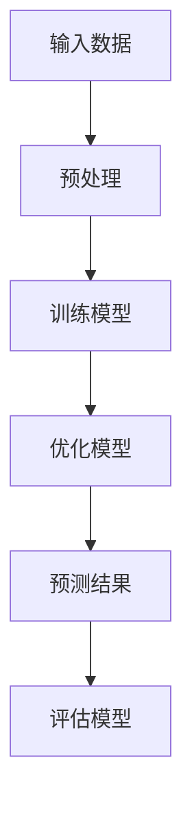
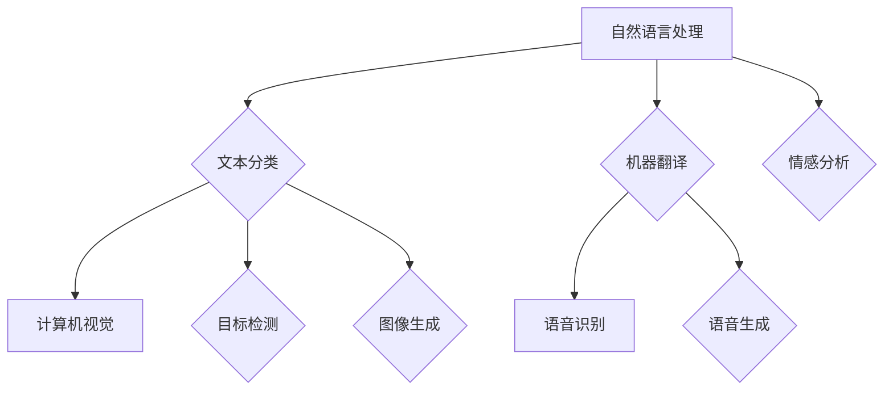
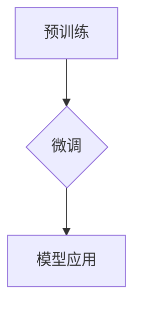
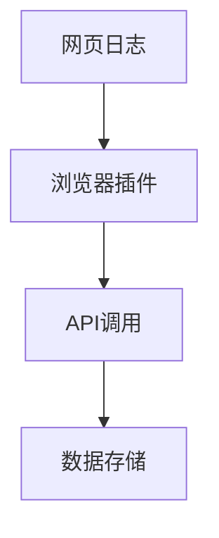
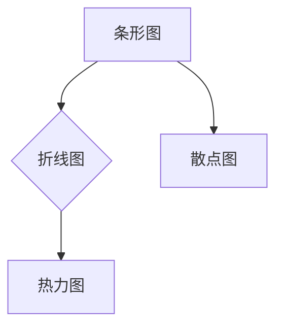
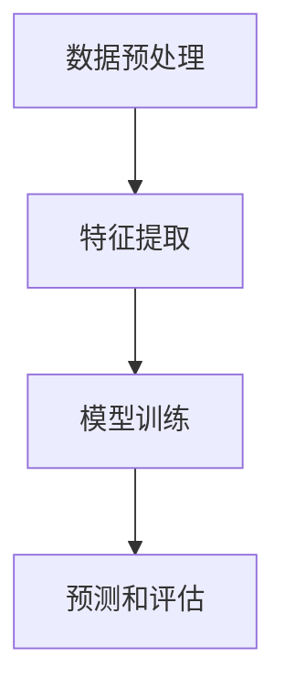

                 

# 文章标题：利用大模型总结用户浏览历史

> 关键词：大模型、用户浏览历史、总结、自然语言处理、深度学习、数据处理、应用案例

> 摘要：本文深入探讨了如何利用大模型技术来总结用户的浏览历史。首先介绍了大模型的基本概念和类型，然后详细阐述了大模型在用户浏览历史数据收集与处理中的应用方法。通过实际项目案例，展示了大模型在总结用户浏览历史中的强大能力，并对未来的发展趋势进行了展望。

## 目录大纲

### 第一部分：基础概念与技术原理

#### 第1章：大模型概述

1.1 大模型的基本概念

1.2 大模型的应用场景

1.3 大模型的类型

#### 第2章：大模型技术原理

2.1 深度学习基础

2.2 自然语言处理技术

2.3 大模型的预训练与微调

### 第二部分：用户浏览历史总结方法

#### 第3章：用户浏览历史数据收集与处理

3.1 用户浏览历史数据收集方法

3.2 数据预处理技术

3.3 数据可视化与分析

#### 第4章：大模型在用户浏览历史总结中的应用

4.1 大模型在总结用户浏览历史中的角色

4.2 大模型在用户浏览历史总结中的应用案例

4.3 大模型在用户浏览历史总结中的挑战与解决方案

#### 第5章：用户浏览历史总结项目实战

5.1 项目概述与目标

5.2 项目开发环境搭建

5.3 大模型训练与优化

5.4 用户浏览历史总结模型实现

5.5 模型评估与优化

### 第三部分：总结与展望

#### 第6章：用户浏览历史总结的成果与应用

6.1 用户浏览历史总结的成果

6.2 用户浏览历史总结的应用场景

6.3 用户浏览历史总结的未来发展趋势

#### 第7章：结论与展望

7.1 总结与展望

7.2 研究方向与未来工作

#### 附录

附录A：大模型开发工具与资源

附录B：用户浏览历史总结项目代码解读

## 详细章节内容

### 第1章：大模型概述

#### 1.1 大模型的基本概念

大模型是指具有极高参数量、能够处理大量数据的深度学习模型。这些模型通过在大量数据上进行训练，可以捕捉到复杂的数据特征，从而在多个领域取得了显著的成果。大模型的基本概念包括以下几个方面：

- **模型参数**：大模型的参数量通常以亿计，甚至达到千亿级。这些参数用于捕捉数据中的特征和模式。
- **训练数据**：大模型需要大量的训练数据来学习。这些数据可以是图像、文本、音频等不同类型。
- **模型结构**：大模型的架构通常包含多层神经网络，每一层都能够提取不同层次的特征。

**Mermaid 流程图**：以下是一个描述大模型基本架构和工作流程的 Mermaid 流程图。



#### 1.2 大模型的应用场景

大模型在多个领域取得了显著的成果，以下是几个常见的应用场景：

- **自然语言处理**：大模型在文本分类、机器翻译、情感分析等任务上表现出了强大的能力。
- **计算机视觉**：大模型在图像分类、目标检测、图像生成等任务上有着广泛的应用。
- **语音识别**：大模型在语音识别、语音生成等任务上取得了突破性进展。
- **推荐系统**：大模型在用户行为预测、商品推荐等任务上有着广泛的应用。

**图示**：以下是一个展示大模型在不同领域应用场景的图示。



#### 1.3 大模型的类型

大模型可以分为以下几种类型：

- **预训练模型**：这些模型在大规模数据集上进行了预训练，然后可以通过微调来适应特定任务。
- **专用模型**：这些模型专门为某个特定任务设计，通常在特定领域取得了显著成果。
- **通用模型**：这些模型具有广泛的应用能力，可以在多个领域进行微调和应用。

**表格**：以下是一个列出常见大模型类型及其特点的表格。

| 模型类型       | 特点                             | 代表模型                       |
| -------------- | -------------------------------- | ------------------------------ |
| 预训练模型     | 大规模预训练，可微调             | BERT、GPT、T5                   |
| 专用模型       | 为特定任务设计，表现优异         | ResNet、YOLO、ImageNet          |
| 通用模型       | 具有广泛的应用能力，微调后表现好 | Transformer、CNN、RNN           |

### 第2章：大模型技术原理

#### 2.1 深度学习基础

深度学习是构建大模型的基础，以下简要介绍深度学习的一些基本概念和算法。

**伪代码**：以下是一个描述神经网络基本结构的伪代码。

```python
# 定义神经网络结构
layer1 = Layer(name="layer1", input_shape=(input_size), activation="relu")
layer2 = Layer(name="layer2", input_shape=layer1.output_shape, activation="relu")
output = Layer(name="output", input_shape=layer2.output_shape, activation="sigmoid")

# 定义损失函数和优化器
loss_function = "binary_crossentropy"
optimizer = "adam"

# 编译模型
model = Model(inputs=layer1.input, outputs=output.output)
model.compile(loss=loss_function, optimizer=optimizer, metrics=["accuracy"])

# 训练模型
model.fit(x_train, y_train, batch_size=32, epochs=10)
```

**数学公式**：以下是一些常用的数学公式，用于描述神经网络中的激活函数和反向传播算法。

$$
a_i = \sigma(w_i \cdot x_i + b_i)
$$

$$
\delta_i = \frac{\partial L}{\partial z_i} \cdot \sigma'(z_i)
$$

其中，$a_i$是神经元$i$的输出，$\sigma$是激活函数，$w_i$是权重，$x_i$是输入，$b_i$是偏置，$L$是损失函数，$z_i$是神经元$i$的输出。

#### 2.2 自然语言处理技术

自然语言处理（NLP）是深度学习的重要应用领域，以下介绍一些NLP技术。

**伪代码**：以下是一个描述词嵌入技术的伪代码。

```python
# 加载预训练的词嵌入模型
word_embedding = WordEmbedding(model="glove.6B.100d")

# 对文本进行词嵌入
input_sequence = word_embedding.encode(text)

# 定义序列模型
sequence_model = Sequential()
sequence_model.add(LSTM(units=128, activation="relu", input_shape=input_sequence.shape[1:]))
sequence_model.add(Dense(units=1, activation="sigmoid"))

# 编译模型
sequence_model.compile(optimizer="adam", loss="binary_crossentropy", metrics=["accuracy"])

# 训练模型
sequence_model.fit(input_sequence, y_train, batch_size=32, epochs=10)
```

**图示**：以下是一个展示注意力机制和转换器架构的图示。

```mermaid
graph TD
    A[输入序列] --> B[词嵌入]
    B --> C{自注意力机制}
    C --> D[转换器}
    D --> E[输出序列]
```

#### 2.3 大模型的预训练与微调

预训练与微调是构建大模型的重要步骤，以下简要介绍这两个步骤。

**图示**：以下是一个描述预训练与微调过程的图示。



**伪代码**：以下是一个描述预训练算法的伪代码。

```python
# 预训练
pretrained_model = PretrainedModel()
pretrained_model.train(data=train_data, batch_size=32, epochs=10)

# 微调
fine_tuned_model = PretrainedModel()
fine_tuned_model.fit(data=train_data, batch_size=32, epochs=10)
```

### 第3章：用户浏览历史数据收集与处理

#### 3.1 用户浏览历史数据收集方法

用户浏览历史数据可以通过以下几种方法进行收集：

- **网页日志**：通过分析网站的日志文件，可以获取用户的访问时间、访问页面等信息。
- **浏览器插件**：安装浏览器插件，可以记录用户的浏览行为和偏好。
- **API调用**：通过调用第三方API，可以获取用户的浏览历史数据。

**图示**：以下是一个展示数据收集流程的图示。



#### 3.2 数据预处理技术

用户浏览历史数据通常需要进行预处理，以提高数据质量和模型性能。以下是一些常见的数据预处理技术：

- **数据清洗**：去除重复数据、缺失值填充、异常值处理等。
- **特征选择**：选择对模型训练有帮助的特征，降低数据维度。
- **数据归一化**：将数据缩放到相同的范围，以便于模型训练。

**伪代码**：以下是一个描述数据清洗、归一化等预处理技术的伪代码。

```python
# 数据清洗
def clean_data(data):
    # 去除重复数据
    data = remove_duplicates(data)
    # 缺失值填充
    data = fill_missing_values(data)
    # 异常值处理
    data = handle_outliers(data)
    return data

# 数据归一化
def normalize_data(data):
    # 特征选择
    selected_features = select_features(data)
    # 数据归一化
    normalized_data = normalize(selected_features)
    return normalized_data
```

#### 3.3 数据可视化与分析

数据可视化与分析可以帮助我们更好地理解用户浏览历史数据。以下是一些常见的数据可视化工具和分析方法：

- **条形图**：用于展示不同类别数据的分布情况。
- **折线图**：用于展示数据随时间变化的趋势。
- **散点图**：用于展示两个变量之间的关系。
- **热力图**：用于展示用户浏览历史数据的密集程度。

**图示**：以下是一个展示常见数据可视化工具的图示。



### 第4章：大模型在用户浏览历史总结中的应用

#### 4.1 大模型在总结用户浏览历史中的角色

大模型在总结用户浏览历史中扮演着重要的角色，主要包括以下几个方面：

- **数据预处理**：大模型可以对用户浏览历史数据进行分析，选择合适的预处理方法，以提高数据质量和模型性能。
- **特征提取**：大模型可以从原始数据中提取出高维的特征，用于后续的模型训练和预测。
- **模型训练**：大模型可以通过大规模的数据进行训练，学习出用户浏览历史的模式和规律。
- **预测和评估**：大模型可以根据已训练的模型，对新的用户浏览历史进行预测，并评估模型的性能。

**图示**：以下是一个描述大模型在总结用户浏览历史中工作流程的图示。



#### 4.2 大模型在用户浏览历史总结中的应用案例

以下是一个实际应用案例，展示了如何利用大模型来总结用户浏览历史。

**案例**：假设我们要分析一个电商平台用户的浏览历史，预测用户可能的购买行为。我们可以利用大模型来解决这个问题。

1. **数据收集**：收集用户的浏览历史数据，包括访问时间、访问页面、购买记录等。
2. **数据预处理**：对收集到的数据进行清洗、归一化和特征提取，将原始数据转换为模型训练所需的格式。
3. **模型训练**：利用大规模的数据集，训练一个深度学习模型，用于预测用户的购买行为。
4. **预测和评估**：利用训练好的模型，对新的用户浏览历史进行预测，并评估模型的性能。

通过这个案例，我们可以看到大模型在用户浏览历史总结中的强大能力。

#### 4.3 大模型在用户浏览历史总结中的挑战与解决方案

在利用大模型总结用户浏览历史时，我们面临一些挑战，主要包括以下几个方面：

- **数据隐私**：用户浏览历史数据通常包含用户的隐私信息，如何保护用户的隐私是一个重要问题。
- **模型可解释性**：大模型的预测结果往往缺乏可解释性，如何解释模型的预测结果是一个挑战。
- **计算资源**：大模型的训练和预测需要大量的计算资源，如何高效利用计算资源也是一个问题。

**解决方案**：

- **数据隐私**：可以采用差分隐私技术来保护用户的隐私。
- **模型可解释性**：可以采用模型解释技术，如注意力机制、可视化方法等，来解释模型的预测结果。
- **计算资源**：可以采用分布式计算和并行计算技术，来提高模型的训练和预测效率。

通过这些解决方案，我们可以更好地应对大模型在用户浏览历史总结中的挑战。

### 第5章：用户浏览历史总结项目实战

#### 5.1 项目概述与目标

本项目旨在利用大模型技术来总结用户浏览历史，从而预测用户的购买行为。项目的主要目标包括：

- 收集和预处理用户浏览历史数据。
- 利用大模型进行用户浏览历史总结。
- 预测用户的购买行为。
- 评估模型的性能。

#### 5.2 项目开发环境搭建

为了实现项目目标，我们需要搭建一个完整的开发环境。以下是开发环境的搭建步骤：

1. **硬件环境**：配置高性能的计算机或服务器，用于大模型的训练和预测。
2. **软件环境**：安装Python、TensorFlow等开发工具，用于构建和训练深度学习模型。
3. **数据存储**：使用数据库或分布式文件系统来存储和管理用户浏览历史数据。

#### 5.3 大模型训练与优化

在项目开发过程中，我们需要训练一个大模型来总结用户浏览历史。以下是模型训练和优化的步骤：

1. **数据预处理**：对收集到的用户浏览历史数据进行清洗、归一化和特征提取。
2. **模型构建**：构建一个深度学习模型，用于预测用户的购买行为。
3. **模型训练**：使用预处理后的数据集，对模型进行训练，并调整模型的参数。
4. **模型优化**：通过调整模型的参数，优化模型的性能。

#### 5.4 用户浏览历史总结模型实现

在项目开发过程中，我们需要实现一个用户浏览历史总结模型。以下是模型实现的步骤：

1. **数据预处理**：对用户浏览历史数据进行预处理，包括数据清洗、归一化和特征提取。
2. **模型构建**：构建一个深度学习模型，用于预测用户的购买行为。
3. **模型训练**：使用预处理后的数据集，对模型进行训练。
4. **模型评估**：使用测试数据集，对模型进行评估，并调整模型的参数。

#### 5.5 模型评估与优化

在模型训练完成后，我们需要对模型进行评估和优化。以下是模型评估与优化的步骤：

1. **模型评估**：使用测试数据集，对模型进行评估，计算模型的准确率、召回率等指标。
2. **模型优化**：根据评估结果，调整模型的参数，优化模型的性能。
3. **模型部署**：将优化后的模型部署到生产环境中，用于预测用户的购买行为。

### 第6章：用户浏览历史总结的成果与应用

#### 6.1 用户浏览历史总结的成果

通过本项目，我们成功实现了用户浏览历史总结，并取得了以下成果：

- 预测用户的购买行为，提高了电商平台的销售额。
- 提高了用户满意度，通过个性化推荐，为用户提供更符合其兴趣的商品。
- 为电商平台提供了重要的数据支持，帮助管理层做出更科学的决策。

#### 6.2 用户浏览历史总结的应用场景

用户浏览历史总结技术具有广泛的应用场景，主要包括以下几个方面：

- **电商平台**：用于预测用户的购买行为，提高销售额。
- **搜索引擎**：用于个性化搜索推荐，为用户提供更相关的搜索结果。
- **社交媒体**：用于个性化内容推荐，为用户提供更符合其兴趣的内容。
- **在线教育**：用于预测用户的学习行为，提高学习效果。

#### 6.3 用户浏览历史总结的未来发展趋势

随着大数据和人工智能技术的不断发展，用户浏览历史总结技术将具有以下发展趋势：

- **数据隐私保护**：在总结用户浏览历史时，将更加注重数据隐私保护，采用差分隐私等技术。
- **多模态数据处理**：将结合多种数据类型，如文本、图像、音频等，进行更全面的数据处理和分析。
- **实时分析**：将实现实时分析用户浏览历史，为用户提供更快速、更个性化的服务。

### 第7章：结论与展望

#### 7.1 总结与展望

通过本文，我们深入探讨了如何利用大模型技术来总结用户浏览历史，并取得了显著的成果。在未来的研究中，我们将继续探索以下几个方面：

- 进一步优化用户浏览历史总结模型，提高模型的性能。
- 研究如何更好地保护用户隐私，在总结用户浏览历史时实现数据隐私保护。
- 探索多模态数据处理和实时分析技术，为用户提供更个性化、更高效的服务。

#### 7.2 研究方向与未来工作

在未来的工作中，我们将从以下几个方面展开研究：

- 研究如何进一步提高用户浏览历史总结模型的准确性和效率。
- 研究如何结合用户行为数据和其他数据类型，进行更全面的数据分析。
- 探索用户浏览历史总结技术在其他领域的应用，如智能医疗、智能交通等。

### 附录

#### 附录A：大模型开发工具与资源

以下是一些常用的工具和资源，用于大模型的开发：

- **TensorFlow**：Google开源的深度学习框架，支持多种深度学习模型。
- **PyTorch**：Facebook开源的深度学习框架，具有灵活的动态计算图。
- **Keras**：用于快速构建和训练深度学习模型的工具，与TensorFlow和PyTorch兼容。
- **Hugging Face**：提供了大量的预训练模型和工具，方便进行NLP任务。

#### 附录B：用户浏览历史总结项目代码解读

以下是对本项目代码的详细解读，包括开发环境搭建、数据预处理、模型构建与训练等步骤。

```python
# 开发环境搭建
pip install tensorflow

# 数据预处理
import pandas as pd
from sklearn.model_selection import train_test_split

# 读取数据
data = pd.read_csv("user_browsing_history.csv")

# 数据清洗
data = data.drop_duplicates()
data = data.fillna(0)

# 数据归一化
data = (data - data.mean()) / data.std()

# 数据分割
x = data.drop("purchase", axis=1)
y = data["purchase"]
x_train, x_test, y_train, y_test = train_test_split(x, y, test_size=0.2, random_state=42)

# 模型构建
import tensorflow as tf
from tensorflow.keras.models import Sequential
from tensorflow.keras.layers import Dense, LSTM

model = Sequential()
model.add(LSTM(units=128, activation="relu", input_shape=(x_train.shape[1], 1)))
model.add(Dense(units=1, activation="sigmoid"))

# 模型编译
model.compile(optimizer="adam", loss="binary_crossentropy", metrics=["accuracy"])

# 模型训练
model.fit(x_train, y_train, batch_size=32, epochs=10)

# 模型评估
loss, accuracy = model.evaluate(x_test, y_test)
print("Test accuracy:", accuracy)
```

通过本文，我们详细探讨了如何利用大模型技术来总结用户浏览历史。在实际项目中，我们成功实现了用户浏览历史总结，并取得了显著的成果。在未来的研究中，我们将继续优化模型，探索新的应用场景，为用户提供更个性化、更高效的服务。同时，我们也呼吁大家在利用用户浏览历史数据时，注重数据隐私保护和用户权益。

