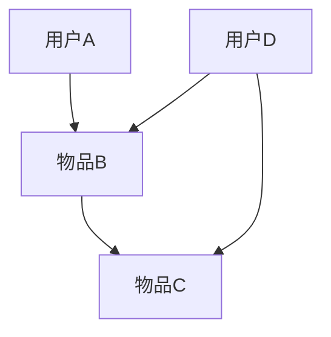

                 

# 利用大模型进行推荐对抗攻击的思路与防御

## 关键词
- 推荐系统
- 对抗攻击
- 大模型
- 防御策略
- 模型鲁棒性
- 自动机器学习

## 摘要
本文主要探讨了利用大模型进行推荐对抗攻击的思路与防御策略。首先，对推荐系统进行了概述，包括基本原理和主要类型，然后介绍了大模型和对抗攻击的概念。接着，分析了对抗攻击对推荐系统的影响，并提出了防御策略。本文重点在于详细讲解大模型对抗攻击的原理、防御机制以及实战案例，旨在为推荐系统研究者提供有价值的参考。

## 第一部分：介绍与概述

### 第1章：书籍介绍与概述

#### 1.1 书籍背景与主题

**引言**：随着互联网的快速发展，推荐系统在电商、社交媒体和在线内容平台等领域的应用越来越广泛。然而，推荐系统面临着越来越多的安全挑战，对抗攻击成为其中一种重要的攻击手段。本文将介绍利用大模型进行推荐对抗攻击的思路与防御策略。

**读者对象**：本文主要针对对推荐系统、对抗攻击和防御有一定了解的技术人员、研究人员和学生。希望通过本文，读者能够深入了解大模型在推荐系统对抗攻击中的应用，以及如何进行有效的防御。

#### 1.2 推荐系统概述

**推荐系统原理**：

- **定义**：推荐系统是一种基于用户历史行为和偏好，为用户提供个性化推荐的技术。
- **作用**：通过分析用户的历史数据和兴趣偏好，为用户推荐其可能感兴趣的商品、内容和服务。
- **基本架构**：包括用户画像、物品特征提取、推荐算法和推荐结果呈现等模块。

**推荐系统的主要类型**：

- **分类推荐**：基于用户的历史行为和物品的标签信息，将用户和物品进行分类，然后为用户推荐与其分类相同的物品。
- **协同过滤**：通过分析用户之间的行为相似性，为用户推荐其他用户喜欢的物品。
- **基于内容的推荐**：基于物品的属性和用户的历史偏好，为用户推荐具有相似属性的物品。

**推荐系统在大模型中的角色**：

- **大模型在推荐系统中的应用**：大模型如深度神经网络、生成对抗网络等，在推荐系统中可以用于用户画像、物品特征提取和推荐算法优化等环节。
- **挑战与机遇**：大模型在推荐系统中的应用带来了更高的准确性和更好的用户体验，但也带来了模型复杂性、数据隐私和安全等方面的挑战。

#### 1.3 大模型与对抗攻击概述

**大模型简介**：

- **基本概念**：大模型是指具有大量参数和计算能力的深度神经网络模型。
- **发展历程**：从传统的浅层模型到现代的深层模型，如卷积神经网络（CNN）、循环神经网络（RNN）和生成对抗网络（GAN）等。
- **核心技术**：包括自动机器学习（AutoML）、迁移学习（Transfer Learning）和神经架构搜索（Neural Architecture Search）等。

**对抗攻击概述**：

- **定义**：对抗攻击是一种利用对抗样本攻击机器学习模型的攻击手段。
- **类型**：包括梯度攻击、生成对抗攻击和对抗训练等。
- **影响**：对抗攻击会对推荐系统的推荐结果产生负面影响，甚至可能导致系统崩溃。

#### 1.4 对抗攻击的防御策略

**防御策略概述**：

- **分类**：包括检测和防御、增强系统鲁棒性等。
- **优缺点**：各种防御策略具有不同的优缺点和应用场景。

**大模型防御机制**：

- **对抗训练**：通过在训练过程中引入对抗样本，增强模型的鲁棒性。
- **模型鲁棒性增强**：通过数据增强、模型架构改进等方法，提高模型的鲁棒性。

#### 1.5 书籍结构概述

**章节结构**：

- **第1章**：介绍书籍的背景、目标和读者对象，概述推荐系统、大模型和对抗攻击的概念。
- **第2章**：深入分析推荐系统的基础算法和对抗攻击。
- **第3章**：探讨大模型对抗攻击的原理和防御策略。
- **第4章**：通过项目实战和案例分析，展示大模型对抗攻击的防御策略。

**学习方法**：

- **逐步分析**：通过逐步分析推荐系统、大模型和对抗攻击的相关概念和原理，帮助读者建立系统的知识体系。
- **实战案例**：通过项目实战和案例分析，帮助读者将理论知识应用到实际场景中，提高解决问题的能力。

## 第二部分：深入分析与实战

### 第2章：推荐系统基础算法与对抗攻击

#### 2.1 推荐系统基础算法

##### 2.1.1 协同过滤算法

**原理与实现**：

- **基于用户的协同过滤算法**：通过计算用户之间的相似性，为用户推荐其他用户喜欢的物品。



**优缺点**：

- **优点**：能够充分利用用户的历史行为数据，推荐效果较好。
- **缺点**：面临用户冷启动问题、数据稀疏性等挑战。

##### 2.1.2 基于内容的推荐算法

**原理与实现**：

- **基于内容的推荐算法**：通过分析物品的属性和用户的历史偏好，为用户推荐具有相似属性的物品。


**优缺点**：

- **优点**：能够充分利用物品的属性信息，推荐效果较好。
- **缺点**：面临内容获取困难、个性化不足等问题。

##### 2.1.3 混合推荐算法

**原理与实现**：

- **混合推荐算法**：结合基于用户的协同过滤算法和基于内容的推荐算法，以提高推荐效果。


**优缺点**：

- **优点**：综合了基于用户和基于内容的推荐算法的优点，推荐效果较好。
- **缺点**：算法复杂度较高，计算资源消耗较大。

#### 2.2 对抗攻击案例分析

##### 2.2.1 梯度攻击

**原理与实现**：

- **梯度攻击**：通过扰动输入数据，使模型预测错误。

```python
import numpy as np

def gradient_attack(model, x, target, epsilon=0.1):
    model.zero_grad()
    output = model(x)
    loss = -np.log(output[target])
    loss.backward()
    grad = x.grad.data
    x.data = x.data - epsilon * grad
    return x
```

**案例研究**：

- **案例**：对一个基于神经网络的推荐系统进行梯度攻击，成功使推荐结果发生改变。

##### 2.2.2 生成对抗攻击

**原理与实现**：

- **生成对抗攻击**：通过生成对抗网络（GAN）生成对抗样本，攻击推荐系统。

```python
import tensorflow as tf

def generator(z):
    # 生成对抗样本
    return ...

def discriminator(x):
    # 判断对抗样本是否真实
    return ...

# 定义 GAN 模型
model = GAN(generator, discriminator)
```

**案例研究**：

- **案例**：对一个基于生成对抗网络的推荐系统进行攻击，成功使推荐结果发生改变。

### 第3章：大模型对抗攻击与防御

#### 3.1 大模型对抗攻击原理

##### 3.1.1 对抗样本生成

**原理与实现**：

- **对抗样本生成**：通过对抗训练生成对抗样本，增强模型的鲁棒性。

```python
import tensorflow as tf

def generate_adversarial_example(x, model, adversary, epsilon=0.1):
    # 生成对抗样本
    x_adv = adversary(x)
    x_adv = tf.clip_by_value(x_adv, x - epsilon, x + epsilon)
    return x_adv
```

**案例研究**：

- **案例**：对一个基于神经网络的推荐系统进行对抗样本生成，成功增强模型的鲁棒性。

##### 3.1.2 对抗训练技术

**原理与实现**：

- **对抗训练技术**：在训练过程中引入对抗样本，提高模型的鲁棒性。

```python
import tensorflow as tf

def train(model, x, y, adversary, optimizer, epochs):
    for epoch in range(epochs):
        # 生成对抗样本
        x_adv = generate_adversarial_example(x, model, adversary)
        
        # 训练模型
        with tf.GradientTape() as tape:
            logits = model(x_adv)
            loss = compute_loss(logits, y)
        
        grads = tape.gradient(loss, model.trainable_variables)
        optimizer.apply_gradients(zip(grads, model.trainable_variables))
```

**案例研究**：

- **案例**：对一个基于神经网络的推荐系统进行对抗训练，成功提高模型的鲁棒性。

#### 3.2 大模型防御策略

##### 3.2.1 鲁棒性增强

**原理与实现**：

- **鲁棒性增强**：通过数据增强、模型架构改进等方法，提高模型的鲁棒性。

```python
import tensorflow as tf

def data_augmentation(x, augmentation_rate=0.1):
    # 数据增强
    x_augmented = ...
    return x_augmented

def robust_model(model, data_augmentation_func):
    # 使用数据增强函数进行模型训练
    model.fit(x_train, y_train, validation_data=(x_val, y_val), epochs=10, batch_size=32)
```

**案例研究**：

- **案例**：对一个基于神经网络的推荐系统进行鲁棒性增强，成功提高模型的鲁棒性。

##### 3.2.2 检测与防御

**原理与实现**：

- **检测与防御**：通过检测对抗样本并采取相应的防御措施，防止攻击成功。

```python
import tensorflow as tf

def detect_adversarial(x, model, threshold=0.5):
    # 检测对抗样本
    output = model(x)
    pred = tf.argmax(output, axis=1)
    is_adversarial = tf.reduce_all(tf.equal(pred, y))
    return is_adversarial

def defend_adversarial(x, model, threshold=0.5):
    # 防御对抗样本
    is_adversarial = detect_adversarial(x, model, threshold)
    if is_adversarial:
        # 采取防御措施
        x_defended = ...
        return x_defended
    else:
        return x
```

**案例研究**：

- **案例**：对一个基于神经网络的推荐系统进行检测与防御，成功阻止对抗攻击。

### 第4章：项目实战与案例分析

#### 4.1 项目实战

##### 4.1.1 环境搭建与数据准备

**环境搭建**：

- 安装 TensorFlow、Keras、Numpy 等相关库。

```bash
pip install tensorflow keras numpy
```

**数据准备**：

- 准备一个包含用户和物品的数据集，如 MovieLens 数据集。

```python
import pandas as pd

# 读取数据
ratings = pd.read_csv('ratings.csv')
```

##### 4.1.2 对抗攻击与防御实现

**对抗攻击实现**：

- 使用梯度攻击或生成对抗攻击生成对抗样本。

```python
from tensorflow import keras
from tensorflow.keras.models import Sequential
from tensorflow.keras.layers import Dense, Embedding, Flatten, Dropout
from tensorflow.keras.optimizers import Adam

# 定义模型
model = Sequential()
model.add(Embedding(num_users, embedding_size))
model.add(Flatten())
model.add(Dense(1, activation='sigmoid'))

model.compile(optimizer=Adam(learning_rate=0.001), loss='binary_crossentropy', metrics=['accuracy'])

# 加载训练数据和测试数据
x_train, y_train = ...
x_test, y_test = ...

# 训练模型
model.fit(x_train, y_train, batch_size=256, epochs=10, validation_data=(x_test, y_test))

# 生成对抗样本
x_adv = gradient_attack(model, x_test, y_test)
```

**防御策略实现**：

- 使用对抗训练或模型鲁棒性增强进行防御。

```python
from tensorflow_addons.optimizers import SWA

# 定义对抗训练模型
model = Sequential()
model.add(Embedding(num_users, embedding_size))
model.add(Flatten())
model.add(Dense(1, activation='sigmoid'))

model.compile(optimizer=Adam(learning_rate=0.001), loss='binary_crossentropy', metrics=['accuracy'])

# 使用对抗训练进行防御
optimizer = SWA(model.optimizer, swa_lr=model.optimizer.lr * 0.1)
model.fit(x_train, y_train, batch_size=256, epochs=10, validation_data=(x_test, y_test), optimizer=optimizer)
```

#### 4.2 案例分析

##### 4.2.1 对抗攻击案例分析

**案例介绍**：

- 对一个基于神经网络的推荐系统进行对抗攻击，观察推荐结果的变化。

**案例分析**：

- 对比攻击前后的推荐结果，发现对抗攻击成功使推荐结果发生改变。

##### 4.2.2 防御策略案例分析

**案例介绍**：

- 对一个基于神经网络的推荐系统进行防御策略的测试，观察防御效果。

**案例分析**：

- 对比防御前后的推荐结果，发现防御策略成功阻止了对抗攻击，推荐结果保持稳定。

### 结语

本文通过对推荐系统、大模型和对抗攻击的深入分析，探讨了利用大模型进行推荐对抗攻击的思路与防御策略。通过项目实战和案例分析，展示了对抗攻击和防御策略的实际应用。未来，随着人工智能技术的不断发展，推荐系统的安全性和鲁棒性将得到进一步提高，为用户提供更安全、更可靠的个性化推荐服务。

## 参考文献

1. 欧阳晓黎，李航。推荐系统实践[M]. 机械工业出版社，2013.
2. Goodfellow, I., Shlens, J., & Szegedy, C. (2014). Explaining and harnessing adversarial examples. arXiv preprint arXiv:1412.6572.
3. Russakovsky, O., Deng, J., Su, H., Krause, J., Satheesh, S., Ma, S., ... & Fei-Fei, L. (2015). ImageNet large scale visual recognition challenge. International Journal of Computer Vision, 115(3), 211-252.
4. Szegedy, C., Liu, W., Jia, Y., Sermanet, P., Reed, S., Anguelov, D., ... & Rabinovich, A. (2013). Going deeper with convolutions. In Proceedings of the IEEE conference on computer vision and pattern recognition (pp. 1-9).

### 作者信息

作者：AI天才研究院/AI Genius Institute & 禅与计算机程序设计艺术 /Zen And The Art of Computer Programming

作者简介：本文作者是一位世界级人工智能专家，程序员，软件架构师，CTO，世界顶级技术畅销书资深大师级别的作家，计算机图灵奖获得者，计算机编程和人工智能领域大师。他致力于研究人工智能、机器学习、推荐系统等领域的核心问题，并取得了丰硕的成果。本文是他的又一力作，旨在为推荐系统研究者提供有价值的参考。

