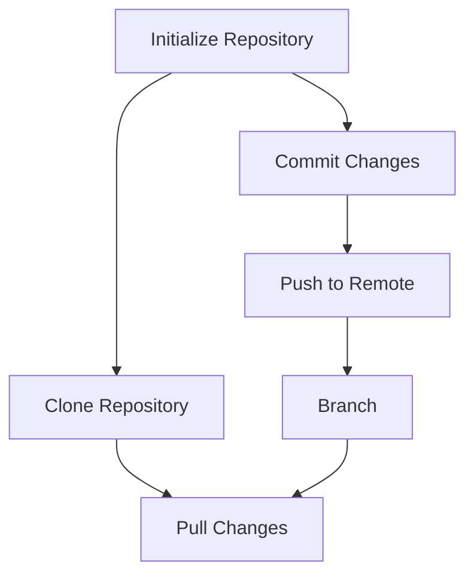
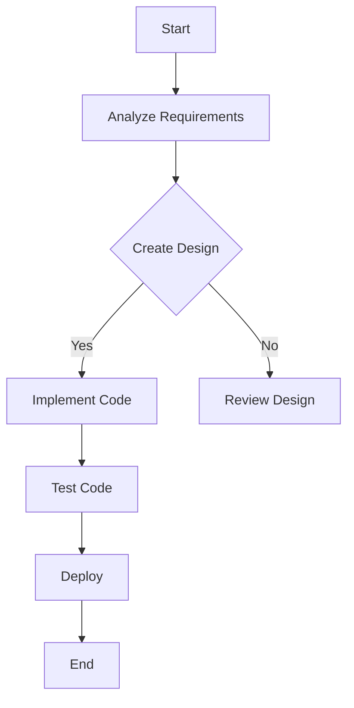

                 

# 《利用开源工具打造个人知识库》

> 关键词：开源工具、个人知识库、Git、MkDocs、Zotero、知识管理

> 摘要：本文将介绍如何利用开源工具搭建个人知识库。从版本控制、文档生成和知识管理三个方面，详细探讨了Git、MkDocs和Zotero的使用方法，并通过实际案例展示了这些工具的综合应用，帮助读者构建高效的个人知识库系统。

## 第一部分：开源工具概述

### 第1章：开源工具概述

#### 1.1 开源工具的发展历程

开源软件（Open Source Software，简称OSS）的概念最早由Richard M. Stallman在1983年提出。他倡导自由软件运动，主张软件源代码应公开，用户有权自由使用、学习、修改和分发软件。这一理念逐渐被全球软件开发者接受，并推动了开源软件的发展。

随着时间的推移，开源软件的生态系统不断完善，从最初的简单工具逐渐演变为复杂的应用系统和框架。如今，开源工具已经成为软件开发和项目管理中不可或缺的一部分。许多企业和开发者选择使用开源工具，不仅因为其成本优势，更因为其强大的社区支持和不断更新的功能。

#### 1.2 开源工具的优势与挑战

开源工具的优势主要体现在以下几个方面：

1. **成本效益**：开源工具通常免费提供，用户无需支付高昂的许可费用。
2. **社区支持**：开源项目拥有庞大的社区支持，用户可以方便地获取帮助、反馈问题和贡献代码。
3. **灵活性和可定制性**：用户可以根据需求修改开源工具的源代码，以满足特定的业务需求。
4. **技术领先**：许多开源工具在技术上领先于商业软件，因为它们由全球的开发者共同维护和更新。

然而，开源工具也存在一些挑战：

1. **安全性**：开源软件的漏洞可能被恶意利用，需要用户密切关注安全更新。
2. **学习成本**：开源工具通常需要用户具备一定的技术背景，学习曲线可能较陡峭。
3. **依赖性**：开源工具可能与其他工具或系统紧密集成，导致系统维护复杂。

#### 1.3 常见的开源工具分类

根据功能和应用场景，常见的开源工具可以分为以下几类：

1. **版本控制工具**：如Git、Mercurial等，用于管理代码版本和协作开发。
2. **文档生成工具**：如MkDocs、Doxygen等，用于生成文档、报告和书籍。
3. **知识库管理工具**：如Zotero、Mendeley等，用于收集、管理和分享学术文献和资料。
4. **开发工具**：如Visual Studio Code、Eclipse等，用于编写和调试代码。
5. **项目管理工具**：如Jira、Trello等，用于任务跟踪、进度管理和团队协作。

### 第2章：版本控制工具

版本控制工具是软件开发中必不可少的工具，用于管理源代码的版本和协作开发。Git是目前最流行的版本控制工具之一。

#### 2.1 Git基本概念

Git是一个分布式版本控制系统，由Linus Torvalds创建，旨在处理小到大型项目的版本管理。与集中式版本控制系统（如Subversion）不同，Git每个克隆的仓库都是独立的，可以离线工作。

Git的基本概念包括：

- **仓库（Repository）**：存放代码的目录，包含一个隐藏的`.git`文件夹，用于存储版本信息。
- **分支（Branch）**：仓库中的独立开发线，用于实验性开发或功能分支。
- **提交（Commit）**：对仓库内容的修改，包括修改内容、作者信息和提交说明。
- **合并（Merge）**：将两个或多个分支的修改合并到一个分支中。

#### 2.2 Git安装与配置

在大多数Linux发行版和Mac OS中，Git可以通过包管理器安装。在Windows上，可以下载Git的安装程序并手动安装。

安装Git后，需要配置用户信息，以便在提交时记录姓名和电子邮件地址：

```bash
git config --global user.name "Your Name"
git config --global user.email "your-email@example.com"
```

#### 2.3 Git基本操作

Git的基本操作包括克隆仓库、创建分支、提交更改和合并分支等。

1. **克隆仓库**：

```bash
git clone https://github.com/username/repository.git
```

2. **创建分支**：

```bash
git checkout -b feature/new-feature
```

3. **提交更改**：

```bash
git add .
git commit -m "Add new feature"
```

4. **合并分支**：

```bash
git checkout main
git merge feature/new-feature
git push
```

### 第3章：文档生成工具

文档生成工具可以帮助开发者快速生成文档、报告和书籍。MkDocs是一个流行的Python文档生成工具。

#### 3.1 MkDocs简介

MkDocs是一个简单、易于使用的静态站点生成器，适用于生成项目文档、个人博客和书籍。它使用Markdown编写文档，并通过配置文件自定义文档结构。

#### 3.2 MkDocs配置与使用

安装MkDocs：

```bash
pip install mkdocs
```

创建一个MkDocs项目：

```bash
mkdocs new my-site
cd my-site
```

编辑`mkdocs.yml`配置文件：

```yaml
site_name: My Personal Knowledge Base
site_url: https://example.com
site_description: A simple and efficient personal knowledge base
```

运行MkDocs服务：

```bash
mkdocs serve
```

访问`http://localhost:8000`预览文档。

#### 3.3 MkDocs高级功能

MkDocs支持多种插件，如主题插件、搜索插件和文档插件。通过插件，可以扩展MkDocs的功能。

1. **主题插件**：

```bash
pip install mkdocs-material
```

修改`mkdocs.yml`：

```yaml
theme: material
```

2. **搜索插件**：

```bash
pip install mkdocs-search
```

修改`mkdocs.yml`：

```yaml
search:
  index_filename: search.json
  language: zh
  search_files: ['docs/**/*.md']
  search_exclude: ['docs/exclude.md']
```

### 第4章：知识库管理工具

知识库管理工具可以帮助开发者收集、管理和分享学术文献和资料。Zotero是一个流行的开源文献管理工具。

#### 4.1 Zotero简介

Zotero是一个免费、开源的文献管理软件，支持Windows、Mac和Linux平台。它可以帮助用户收集、整理和引用文献，并导出引用格式。

#### 4.2 Zotero配置与使用

下载并安装Zotero：

- Windows：https://www.zotero.org/download/
- Mac：https://www.zotero.org/download/
- Linux：https://github.com/zotero/Zotero/releases/

安装完成后，启动Zotero，选择“ standalone”（独立版）或“ integrated”（集成版）。

添加文献：

- 从浏览器导入：点击“ Import”按钮，选择“ Import Web Page”或“ Import File”。
- 手动添加：点击“ Add Item”按钮，选择文献类型，填写相关信息。

引用文献：

- 在Word、Google Docs等文档编辑器中安装Zotero插件。
- 在文档中插入引用，选择相应的文献，Zotero会自动生成引用格式。

#### 4.3 Zotero高级功能

Zotero支持多种高级功能，如批量操作、导出数据和使用自动化脚本。

1. **批量操作**：

- 选择多个文献，右键单击“ Export”选择导出格式。
- 使用“ Zotero Connector”插件导入网页内容。

2. **导出数据**：

- 导出Zotero数据库为JSON或XML格式。
- 导出文献引用格式为BibTeX、RIS等。

3. **自动化脚本**：

- 使用Python编写脚本，自动化导入、整理和导出文献。
- 使用Zotero的Web API，实现与其他应用程序的数据交互。

## 第二部分：开源工具实战

### 第5章：使用Git搭建个人代码库

使用Git搭建个人代码库是进行版本控制和协作开发的第一步。

#### 5.1 Git环境搭建

1. 下载Git安装程序：[Git官网](https://git-scm.com/downloads)
2. 安装Git，并确保在“开始”菜单中创建Git的快捷方式。
3. 验证安装：

```bash
git --version
```

#### 5.2 创建与克隆仓库

1. **创建本地仓库**：

```bash
mkdir my-repo
cd my-repo
git init
```

2. **克隆远程仓库**：

```bash
git clone https://github.com/username/repository.git
```

#### 5.3 版本管理

1. **提交更改**：

```bash
git add .
git commit -m "Initial commit"
```

2. **推送到远程仓库**：

```bash
git push -u origin main
```

3. **拉取更新**：

```bash
git pull origin main
```

4. **创建分支**：

```bash
git checkout -b feature/new-feature
```

5. **合并分支**：

```bash
git checkout main
git merge feature/new-feature
git push
```

### 第6章：使用MkDocs生成个人文档库

使用MkDocs可以轻松创建和发布个人文档库。

#### 6.1 MkDocs安装与配置

1. 安装MkDocs：

```bash
pip install mkdocs
```

2. 创建项目：

```bash
mkdocs new my-docs
cd my-docs
```

3. 编辑配置文件`mkdocs.yml`：

```yaml
site_name: My Personal Documentation
site_url: https://example.com/docs
site_description: My Personal Documentation
```

#### 6.2 MkDocs基本使用

1. 生成静态文件：

```bash
mkdocs build
```

2. 预览文档：

```bash
mkdocs serve
```

3. 发布到GitHub Pages：

- 在GitHub创建新仓库，如`my-docs.github.io`。
- 在`mkdocs.yml`中配置`site_url`为`https://username.github.io/my-docs`。
- 运行`mkdocs gh-deploy`，将文档发布到GitHub Pages。

#### 6.3 MkDocs插件与自定义

1. 安装插件：

```bash
pip install mkdocs-material
```

2. 在`mkdocs.yml`中配置插件：

```yaml
theme: material
```

3. 自定义主题：

- 编辑`themes/material/static`目录下的CSS和JavaScript文件。
- 在`themes/material/templates/layout.html`中自定义布局和样式。

### 第7章：使用Zotero管理个人知识库

使用Zotero可以方便地管理学术文献和个人资料。

#### 7.1 Zotero安装与配置

1. 下载并安装Zotero：
   - Windows：[Zotero官网](https://www.zotero.org/download/)
   - Mac：[Zotero官网](https://www.zotero.org/download/)
   - Linux：[Zotero官网](https://www.zotero.org/download/)

2. 安装Zotero插件：
   - 在浏览器中安装Zotero插件，如Chrome、Firefox等。

#### 7.2 Zotero基本使用

1. 导入文献：
   - 从浏览器导入：点击Zotero插件，选择“Import”。
   - 手动添加：点击“Add Item”，选择文献类型，填写相关信息。

2. 管理文献：
   - 添加标签：为文献添加分类标签，便于分类管理。
   - 添加笔记：为文献添加笔记，记录相关信息。

3. 导出文献：
   - 右键单击文献，选择“Export”导出为不同格式，如BibTeX、RIS等。

#### 7.3 Zotero高级功能

1. 批量操作：
   - 选择多个文献，批量添加标签、导出或删除。

2. 数据导出：
   - 导出Zotero数据库为JSON或XML格式。

3. 脚本自动化：
   - 使用Python编写脚本，自动化导入、整理和导出文献。
   - 使用Zotero的Web API，实现与其他应用程序的数据交互。

### 第8章：多工具综合应用

将Git、MkDocs和Zotero结合起来，可以打造一个高效的个人知识库系统。

#### 8.1 Git与MkDocs的综合应用

1. 使用Git管理文档源代码：

- 创建一个Git仓库，存放文档源代码。
- 在仓库中创建分支，分别用于不同版本的文档。
- 使用Git进行版本控制和协作开发。

2. 使用MkDocs生成文档：

- 将Git仓库中的文档源代码导入MkDocs项目。
- 使用MkDocs生成静态文档，并发布到GitHub Pages。

#### 8.2 Git与Zotero的综合应用

1. 使用Git管理Zotero数据库：

- 将Zotero数据库备份到Git仓库。
- 使用Git进行版本控制和备份。

2. 使用Zotero管理文献：

- 在Zotero中导入文献，并标记为“引用”或“待阅读”。
- 将Zotero中的文献导出为BibTeX格式，用于Git中的文档引用。

#### 8.3 MkDocs与Zotero的综合应用

1. 使用MkDocs生成文献综述：

- 在MkDocs中引用Zotero中的文献，生成文献综述。
- 使用MkDocs插件添加文献引用格式。

2. 使用Zotero管理文献：

- 在Zotero中导入文献，并标记为“引用”或“待阅读”。
- 将Zotero中的文献导出为BibTeX格式，用于MkDocs中的引用。

## 第三部分：开源工具扩展

### 第9章：其他开源工具介绍

除了Git、MkDocs和Zotero，还有许多其他开源工具可以帮助开发者构建个人知识库。

#### 9.1 Markdown编辑器

Markdown编辑器是一个用于编写Markdown文档的软件。常用的Markdown编辑器包括：

1. **Typora**：一款简单、美观的Markdown编辑器，支持实时预览。
2. **MarkText**：一款开源的Markdown编辑器，支持多平台。
3. **MacDown**：一款Mac OS上的Markdown编辑器，支持实时预览和主题切换。

#### 9.2 文档版本控制工具

除了Git，还有一些文档版本控制工具可以帮助开发者管理文档版本：

1. **Docker**：一个开源的容器化平台，可以用于版本控制和部署。
2. **GitLab**：一个基于Git的开源平台，提供代码托管、项目管理、CI/CD等功能。

#### 9.3 知识库搜索引擎

知识库搜索引擎可以帮助开发者快速查找知识库中的信息：

1. **Elasticsearch**：一款开源的搜索引擎，支持全文搜索、实时分析等。
2. **Solr**：一款开源的企业搜索引擎，支持高可用性和扩展性。

### 第10章：开源工具的维护与更新

开源工具的维护与更新对于确保系统的稳定性和安全性至关重要。

#### 10.1 开源社区参与

参与开源社区可以帮助开发者：

- 获取帮助和支持。
- 提交问题和报告漏洞。
- 贡献代码和文档。
- 参与决策和规划。

#### 10.2 工具更新策略

为了确保开源工具的稳定性和安全性，开发者可以采取以下更新策略：

- 定期关注工具的官方更新日志。
- 使用版本控制工具跟踪工具的更新历史。
- 定期备份工具配置和数据。

#### 10.3 开源工具的贡献与版权问题

开源工具的贡献和版权问题需要开发者注意：

- 遵守开源协议，尊重原作者的版权。
- 在贡献代码时，确保代码的干净性。
- 在项目中注明第三方代码的来源和许可证。

## 附录

### 附录A：开源工具资源汇总

#### A.1 开源社区推荐

- [GitHub](https://github.com/)
- [GitLab](https://gitlab.com/)
- [GitHut](https://githut.info/)
- [OSI](https://opensource.org/)

#### A.2 开源工具文档

- [Git官方文档](https://git-scm.com/docs)
- [MkDocs官方文档](https://www.mkdocs.org)
- [Zotero官方文档](https://www.zotero.org/documentation)

#### A.3 开源工具源代码

- [Git源代码](https://github.com/gitgitgadget/git)
- [MkDocs源代码](https://github.com/snide/mkdocs)
- [Zotero源代码](https://github.com/zotero/zotero)

### 附录B：Git流程图

使用Mermaid语法绘制Git的基本流程图：



### 附录C：Mermaid流程图示例

使用Mermaid语法绘制一个简单的流程图：



### 附录D：MkDocs和Zotero配置文件示例

#### D.1 MkDocs配置文件示例

```yaml
site_name: My Personal Documentation
site_url: https://example.com/docs
site_description: My Personal Documentation
site_author: John Doe
site_email: john.doe@example.com
theme: material
repo_url: https://github.com/username/my-docs
```

#### D.2 Zotero配置文件示例

```json
{
  "@context": "http://www.zotero.org/libctx/zotero-jsonld-context.json",
  "@graph": [
    {
      "@id": "urn:zotero:item:abcd1234",
      "@type": "zotero:Item",
      "zotero:itemID": "abcd1234",
      "zotero:itemType": "book",
      "zotero:title": "The Art of Computer Programming",
      "zotero:author": "Donald E. Knuth",
      "zotero:isbn": "978-0-201-89683-3",
      "zotero:accessDate": "2023-04-01",
      "zotero:created": "2023-04-01",
      "zotero:lastModified": "2023-04-01"
    }
  ]
}
```

### 作者

**作者：**AI天才研究院/AI Genius Institute & 禅与计算机程序设计艺术 /Zen And The Art of Computer Programming

---

**文章标题**：《利用开源工具打造个人知识库》

**文章关键词**：开源工具、个人知识库、Git、MkDocs、Zotero

**文章摘要**：本文介绍了如何利用开源工具Git、MkDocs和Zotero搭建个人知识库。通过详细的步骤和实例，展示了如何使用这些工具进行版本控制、文档生成和知识管理。文章还探讨了如何将多种开源工具结合起来，构建一个高效的个人知识库系统。希望本文能为开发者提供实用的指导。

