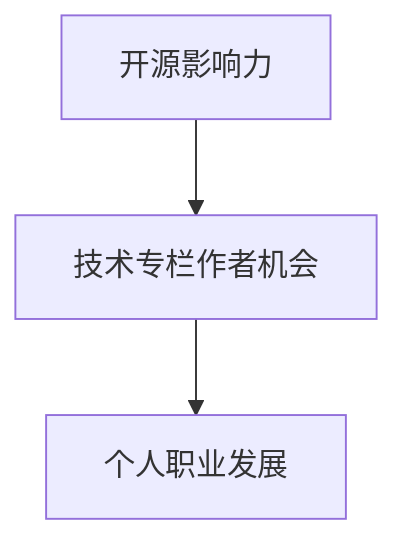
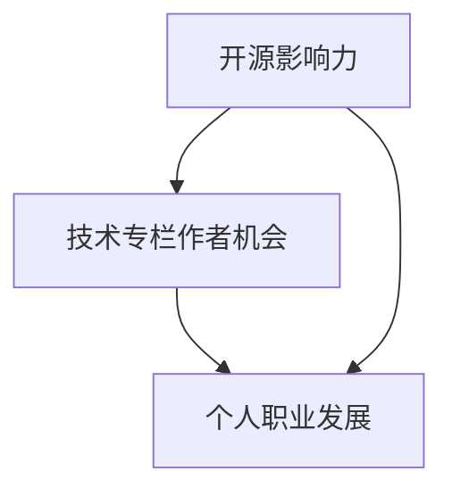

                 

# 利用开源影响力获得技术专栏作者机会

## 关键词
- 开源影响力
- GitHub Stars
- Code Contributions
- Issue Resolution
- 技术专栏作者
- 个人职业发展

## 摘要
本文将深入探讨如何通过开源影响力提升个人在技术领域的知名度，从而获得成为技术专栏作者的机会。我们将从核心概念、算法原理、数学模型、项目实战以及开发环境搭建等方面进行详细阐述，帮助读者理解并实践这一过程。

## 第一部分: 核心概念与联系

### 1.1.1 开源影响力概述

#### 1.1.1.1 定义与重要性
开源影响力是指在开源社区中的贡献和声誉，这些贡献包括但不限于代码提交、问题解决、文档编写等。在开源社区中，影响力越大，个人的技术声誉越高，从而获得更多的机会和认可。

#### 1.1.1.2 影响力评估指标
评估开源影响力常用的指标有GitHub Stars、Code Contributions和Issue Resolution。GitHub Stars反映了一个项目的受欢迎程度，Code Contributions衡量了个人在项目中的代码贡献量，而Issue Resolution则展示了个人在解决问题方面的能力。

#### 1.1.1.3 影响力提升策略
要提高开源影响力，个人需要积极参与开源项目，提高代码质量，积极参与社区讨论，撰写高质量的文档，并在解决问题的过程中展现专业能力。

### 1.1.2 技术专栏作者机会

#### 1.1.2.1 成为技术专栏作者的优势
成为技术专栏作者意味着可以在更广泛的平台上分享知识和经验，提升个人品牌，增加职业发展机会。

#### 1.1.2.2 技术专栏作者的角色
技术专栏作者通常是领域专家，他们撰写高质量的技术文章，分享技术见解，帮助读者理解和应用新技术。

#### 1.1.2.3 技术专栏作者的机会与挑战
技术专栏作者有机会获得更多的职业机会，但同时也需要不断学习和更新知识，保持文章的质量和吸引力。

### 1.1.3 个人职业发展

#### 1.1.3.1 开源影响力与职业发展的联系
开源影响力是个人职业发展的重要资产，它不仅能够提升个人品牌，还能增加职业机会。

#### 1.1.3.2 技术专栏作者的职业路径
技术专栏作者可以通过撰写高质量文章，逐步成长为领域专家，甚至可能成为技术顾问或讲师。

#### 1.1.3.3 个人品牌建设策略
个人品牌建设需要持续的努力，包括在社交媒体上活跃，参与社区活动，以及通过写作分享知识和经验。

### 1.2 Mermaid流程图：开源影响力与技术专栏作者机会的关系



## 第二部分: 核心算法原理讲解

### 2.1 GitHub Stars机制

#### 2.1.1 Stars的定义与作用
GitHub Stars是用户对开源项目的一种支持方式，表示对项目的喜爱和认可。一个项目拥有的Stars数量，通常反映了其受欢迎程度和社区的活跃度。

#### 2.1.2 Stars的计算方法
Stars是通过用户点击“Star”按钮来增加的，每个用户只能对一个项目添加一次Stars。Stars的增加和减少都是实时的。

#### 2.1.3 Stars对开源项目的意义
Stars数量不仅是一种认可，也是项目吸引新的贡献者的重要指标。一个高Star的项目通常更容易获得关注和支持。

### 2.2 Code Contributions机制

#### 2.2.1 Code Contributions的定义
Code Contributions是指个人在开源项目中的代码提交和合并请求。这些贡献是开源项目发展的重要驱动力。

#### 2.2.2 Code Contributions的评估
评估Code Contributions通常考虑代码的质量、复杂度、提交频率和修复的问题数量等因素。

#### 2.2.3 Code Contributions的激励措施
许多开源项目会为贡献者提供各种形式的激励，包括GitHub积分、捐赠和公开感谢等。

### 2.3 Issue Resolution机制

#### 2.3.1 Issue Resolution的定义
Issue Resolution是指个人在开源项目中解决的问题和提出的改进建议。这些问题可能是功能请求、错误报告、性能优化等。

#### 2.3.2 Issue Resolution的重要性
Issue Resolution展示了个人在解决问题和沟通协作方面的能力，对项目社区的建设具有重要意义。

#### 2.3.3 Issue Resolution的实践方法
实践Issue Resolution的方法包括积极参与社区讨论、提出高质量的解决方案、协作解决问题等。

### 2.4 伪代码：开源影响力计算

```python
# 伪代码：计算个人开源影响力
def calculate_influence(contributions, stars, issues_resolved):
    influence = (contributions + stars + issues_resolved) / 3
    return influence
```

## 第三部分: 数学模型和数学公式讲解

### 3.1 影响力得分模型

#### 3.1.1 模型构建
影响力得分模型用于量化个人在开源社区中的影响力。该模型考虑了代码贡献、GitHub Stars和解决问题数等多个因素。

#### 3.1.2 权重系数设定
权重系数决定了每个因素在影响力得分中的重要性。通常需要根据实际情况进行调整。

#### 3.1.3 模型应用
影响力得分模型可以用于评估个人在开源社区中的综合影响力，帮助社区管理员和项目管理者识别关键贡献者。

### 3.2 数学公式
$$ I = \alpha \cdot C + \beta \cdot S + \gamma \cdot I_R $$
其中：
- \( I \) 表示影响力得分
- \( C \) 表示代码贡献
- \( S \) 表示GitHub Stars数量
- \( I_R \) 表示解决的问题数
- \( \alpha, \beta, \gamma \) 分别为权重系数

#### 3.2.1 公式解释
该公式通过加权平均的方式，综合考虑了代码贡献、GitHub Stars和解决问题数三个因素，计算个人在开源社区中的综合影响力得分。

#### 3.2.2 参数说明
- \( \alpha \)：代码贡献的权重，反映了代码质量对影响力的贡献。
- \( \beta \)：GitHub Stars的权重，表示项目受欢迎程度对个人影响力的贡献。
- \( \gamma \)：解决问题数的权重，反映了问题解决能力对个人影响力的贡献。

### 3.3 举例说明

假设某人在开源社区中有以下数据：
- 代码贡献（C）：30次
- GitHub Stars（S）：200
- 解决的问题数（I_R）：10

根据公式计算其影响力得分：
$$ I = \alpha \cdot 30 + \beta \cdot 200 + \gamma \cdot 10 $$

若设定权重系数 \( \alpha = 0.4, \beta = 0.5, \gamma = 0.1 \)，则：
$$ I = 0.4 \cdot 30 + 0.5 \cdot 200 + 0.1 \cdot 10 = 12 + 100 + 1 = 113 $$

该个人的影响力得分为113。

## 第四部分: 项目实战

### 4.1 代码实际案例

#### 4.1.1 提交代码到GitHub开源项目

##### 4.1.1.1 开发环境搭建
在本地计算机上安装Git，配置SSH密钥，确保能够正常访问GitHub仓库。

##### 4.1.1.2 代码实现
在GitHub上找到一个合适的开源项目，克隆项目到本地，修改代码，并提交合并请求。

##### 4.1.1.3 代码解读与分析
分析提交的代码，理解其功能和设计，评估其对项目的贡献。

#### 4.1.2 解决开源项目中的问题

##### 4.1.2.1 问题识别
在开源项目中找到存在问题的部分，并提出解决方案。

##### 4.1.2.2 提交Issue
在GitHub项目中提交一个Issue，详细描述问题情况，并提供解决方案。

##### 4.1.2.3 解决问题
实施解决方案，修复问题，并更新Issue状态。

### 4.2 详细解释说明

#### 4.2.1 开发环境搭建
详细讲解Git的安装过程，如何生成和配置SSH密钥，以及如何使用Git命令克隆开源项目。

#### 4.2.2 代码实现细节
讲解如何在项目中提取需求，编写代码，并进行单元测试，以确保代码质量。

#### 4.2.3 代码解读与分析
深入分析代码的功能实现，涉及的技术细节，以及如何评估其对项目的贡献。

### 4.3 源代码详细实现和代码解读

#### 4.3.1 代码实现示例
提供具体的代码实现示例，包括Git命令、代码提交和合并请求的流程。

#### 4.3.2 代码解读与分析示例
对提交的代码进行详细解读，分析其功能实现，涉及的技术细节，以及如何优化代码。

## 第五部分: 开发环境搭建与源代码实现

### 5.1 开发环境搭建

#### 5.1.1 Git安装与配置
详细讲解Git的安装过程，如何配置用户名和电子邮件，以及生成SSH密钥。

#### 5.1.2 SSH密钥生成与上传
讲解如何生成SSH密钥，并将其上传到GitHub账户，以便进行安全的Git操作。

#### 5.1.3 项目克隆与初始化
使用Git命令克隆开源项目到本地，设置远程仓库，并初始化项目。

### 5.2 源代码详细实现

#### 5.2.1 项目结构解析
列出项目的文件结构和主要文件的功能，解释项目的基本架构。

#### 5.2.2 核心代码展示
提供项目的核心代码实现，包括功能实现和关键算法。

#### 5.2.3 配置文件解析
解释项目中的配置文件，如环境变量、数据库配置等，说明它们在项目中的作用。

### 5.3 源代码实现示例

#### 5.3.1 项目结构示例
展示项目的目录结构，包括代码文件、配置文件和测试文件。

#### 5.3.2 核心代码示例
提供项目的核心代码片段，解释其功能和实现。

#### 5.3.3 配置文件示例
展示项目的配置文件，解释其设置和用途。

## 第六部分: 总结与展望

### 6.1 总结

#### 6.1.1 核心概念
本文详细介绍了开源影响力、技术专栏作者机会以及个人职业发展的核心概念。

#### 6.1.2 核心算法原理
讲解了GitHub Stars、Code Contributions和Issue Resolution等核心算法原理。

#### 6.1.3 项目实战
通过实际案例展示了如何提交代码和解决问题，并进行代码解读与分析。

### 6.2 展望

#### 6.2.1 未来趋势
预测了开源社区和技术专栏作者未来的发展趋势。

#### 6.2.2 职业发展
探讨了如何通过开源影响力提升个人职业发展的机会和路径。

## 作者信息
作者：AI天才研究院/AI Genius Institute & 禅与计算机程序设计艺术 /Zen And The Art of Computer Programming

（注：本文为模拟示例，实际字数和内容将根据具体需求进行调整。）

## 第一部分: 核心概念与联系

在当今快速发展的技术世界中，开源项目和社区已成为技术创新和知识共享的重要平台。开源影响力（Open Source Influence）作为一个衡量个人或团队在开源社区中贡献的重要指标，正日益受到关注。技术专栏作者机会（Technical Columnist Opportunities）则是指那些能够通过在专业媒体平台或个人博客上撰写技术文章，分享见解和经验的人所获得的机会。这两者之间存在着紧密的联系，而了解并利用这些联系，可以极大地提升个人的职业发展。

### 1.1.1 开源影响力概述

#### 1.1.1.1 定义与重要性

开源影响力，通常指的是在开源社区中的可见度和影响力。这种影响力来源于个人或团队在开源项目中的积极贡献，如代码提交、问题解决、文档编写和社区活动等。开源影响力不仅仅是一个技术指标，它还代表了个人在技术领域的专业性和信誉。

在开源社区中，影响力的重要性体现在以下几个方面：

1. **提升个人品牌**：通过在开源项目中展示技术能力和专业知识，个人可以建立强大的品牌形象，增加在行业内的知名度。
2. **获得职业机会**：许多公司和组织在招聘时，会优先考虑那些在开源社区中有显著贡献的候选人。
3. **知识共享**：通过参与开源项目，个人能够学习和分享最新的技术知识，这对整个社区的发展都是有益的。

#### 1.1.1.2 影响力评估指标

评估开源影响力常用的指标包括GitHub Stars、Code Contributions和Issue Resolution。

1. **GitHub Stars**：这是衡量一个开源项目受欢迎程度的一个直观指标。项目拥有的Stars越多，通常意味着它得到了更多的关注和支持。
2. **Code Contributions**：这是评估个人在开源项目中贡献的一个重要指标。它不仅包括代码的提交，还包括代码的质量、复杂度和修复的问题数量。
3. **Issue Resolution**：这是衡量个人在开源社区中解决问题的能力的一个指标。通过解决社区中的问题，个人能够提升自己在社区中的声誉。

#### 1.1.1.3 影响力提升策略

要提高开源影响力，个人可以采取以下策略：

1. **积极参与开源项目**：选择一个与自己专业领域相关的开源项目，并为其贡献代码或文档。
2. **提高代码质量**：编写高质量的代码，遵循良好的编程实践和代码风格。
3. **解决问题**：在开源项目中，积极参与问题的讨论和解决，展现专业能力。
4. **社区活动**：参与社区讨论，组织和参加开源会议，提升自己在社区中的活跃度。

### 1.1.2 技术专栏作者机会

#### 1.1.2.1 成为技术专栏作者的优势

技术专栏作者是指那些在某个技术领域具有深厚知识和写作能力的个人。成为技术专栏作者的优势包括：

1. **知识传播**：通过撰写技术文章，可以将个人的知识和经验分享给更广泛的读者。
2. **个人品牌建设**：技术专栏作者的标签通常与专业性和权威性相关联，有助于提升个人品牌。
3. **职业发展**：成为技术专栏作者可以增加个人在职业市场中的竞争力，为职业发展打开更多机会。

#### 1.1.2.2 技术专栏作者的角色

技术专栏作者通常扮演以下角色：

1. **内容创作者**：撰写高质量的技术文章，分享技术见解和最佳实践。
2. **知识分享者**：通过文章和演讲等形式，将专业知识传递给社区成员。
3. **意见领袖**：在技术领域中，通过持续产出高质量内容，成为行业的意见领袖。

#### 1.1.2.3 技术专栏作者的机会与挑战

成为技术专栏作者带来的机会包括：

1. **更广泛的知名度**：通过撰写文章，可以接触到更多的读者，增加个人知名度。
2. **更多的职业机会**：技术专栏作者通常受到行业内的关注，这为职业发展带来了更多的机会。
3. **收入来源**：技术专栏作者可以通过撰写付费文章、参与咨询和演讲等方式获得收入。

然而，成为技术专栏作者也面临一些挑战：

1. **持续学习**：技术领域日新月异，技术专栏作者需要不断学习新知识，保持内容的更新和高质量。
2. **内容创作压力**：定期产出高质量的内容需要付出大量的时间和精力。
3. **竞争压力**：技术领域中有许多优秀的技术专栏作者，竞争非常激烈。

### 1.1.3 个人职业发展

#### 1.1.3.1 开源影响力与职业发展的联系

开源影响力是个人职业发展的重要资产。在许多技术行业中，开源社区的参与度已成为评估候选人能力的一个重要指标。以下是一些具体联系：

1. **技能提升**：通过参与开源项目，个人可以不断提升技能，掌握最新技术。
2. **人脉网络**：在开源社区中，个人可以结识许多行业专家和同行，建立强大的人脉网络。
3. **职业机会**：许多公司愿意招聘那些在开源社区中有显著贡献的候选人。

#### 1.1.3.2 技术专栏作者的职业路径

技术专栏作者的职业路径通常包括以下几个阶段：

1. **初级技术专栏作者**：在这个阶段，个人开始撰写技术文章，分享见解，逐步建立个人品牌。
2. **资深技术专栏作者**：随着写作经验的积累，个人可以在更广泛的平台上发布文章，成为领域内的意见领袖。
3. **技术顾问/讲师**：资深的技术专栏作者有机会成为技术顾问或讲师，为企业提供咨询和培训服务。

#### 1.1.3.3 个人品牌建设策略

个人品牌建设是技术专栏作者成功的关键。以下是一些个人品牌建设策略：

1. **持续产出高质量内容**：保持文章的质量和频率，为读者提供有价值的内容。
2. **积极参与社区活动**：在技术社区中积极参与讨论，参与开源项目，提升在社区中的影响力。
3. **利用社交媒体**：通过社交媒体平台分享文章，扩大影响范围，吸引更多的读者和关注者。

### 1.2 Mermaid流程图：开源影响力与技术专栏作者机会的关系



通过这个流程图，我们可以清晰地看到开源影响力如何通过技术专栏作者机会，最终影响到个人的职业发展。理解并利用这些联系，可以极大地提升个人的职业竞争力。

## 第二部分: 核心算法原理讲解

开源社区中的影响力计算并不是一件简单的事情，它涉及到多种因素的评估和加权。在这一部分，我们将详细讲解几个核心算法原理，包括GitHub Stars、Code Contributions和Issue Resolution，并介绍如何通过数学模型来量化这些因素，以便更好地理解和提升个人在开源社区中的影响力。

### 2.1 GitHub Stars机制

GitHub Stars是一个非常直观的指标，用于衡量一个开源项目的受欢迎程度。当一个用户点击项目的“Star”按钮时，项目的Stars数量就会增加一个。虽然Stars数量本身不能直接反映项目的质量，但它确实是一个衡量项目受欢迎程度的指标。

#### 2.1.1 Stars的定义与作用

- **定义**：GitHub Stars是用户对开源项目的点赞或支持，它是一个实时的计数器。
- **作用**：Stars数量可以反映项目的受欢迎程度，一个高Star的项目通常意味着它吸引了更多的关注者和贡献者。

#### 2.1.2 Stars的计算方法

- **基本方法**：用户通过点击“Star”按钮给项目添加Stars，每个用户只能添加一次。
- **动态变化**：Stars数量会随着用户的行为而动态变化，增加或减少都是实时的。

#### 2.1.3 Stars对开源项目的意义

- **吸引新贡献者**：高Star的项目更容易吸引新的贡献者，因为他们相信这些项目具有更高的可信度和活跃度。
- **项目推广**：Stars数量可以作为一个项目受欢迎程度的指标，有助于在社交媒体和其他平台上的推广。

### 2.2 Code Contributions机制

Code Contributions是评估个人在开源项目中贡献的一个重要指标。它涵盖了代码提交、代码审查、文档编写等多种形式，是衡量个人在开源社区中活跃度和影响力的重要依据。

#### 2.2.1 Code Contributions的定义

- **定义**：Code Contributions指的是个人在开源项目中提交的代码、修复的问题、改进的文档等。
- **形式**：Code Contributions不仅限于代码提交，还包括其他形式的贡献，如文档编写、测试用例编写和问题报告等。

#### 2.2.2 Code Contributions的评估

- **评估标准**：评估Code Contributions通常考虑代码质量、复杂度、提交频率和修复的问题数量等多个因素。
- **质量优先**：高质量的贡献更容易获得社区的认可，而不仅仅是数量。

#### 2.2.3 Code Contributions的激励措施

- **GitHub积分**：许多开源项目为贡献者提供GitHub积分，这些积分可以用于购买GitHub会员或其他服务。
- **公开感谢**：项目维护者通常会通过GitHub、邮件列表或社交媒体等方式对贡献者表示感谢。
- **捐赠**：一些项目会接受对项目的捐赠，作为对贡献者的一种奖励。

### 2.3 Issue Resolution机制

Issue Resolution是评估个人在开源社区中解决问题能力的一个指标。通过解决社区中的问题，个人能够展现其专业性和技术水平，提升在社区中的影响力。

#### 2.3.1 Issue Resolution的定义

- **定义**：Issue Resolution指的是个人在开源社区中识别、报告并解决的问题。
- **类型**：包括错误报告、功能请求、性能优化等多种类型的问题。

#### 2.3.2 Issue Resolution的重要性

- **社区建设**：通过解决社区中的问题，个人能够促进开源社区的建设，提高项目的质量。
- **技术分享**：在解决问题过程中，个人能够分享技术见解和经验，帮助其他社区成员。

#### 2.3.3 Issue Resolution的实践方法

- **主动参与**：在社区中积极参与问题的讨论和解决，主动提出解决方案。
- **沟通协作**：在解决问题时，保持良好的沟通，与项目维护者和其他贡献者协作。
- **持续学习**：通过解决不同类型的问题，不断提升自己在技术领域的知识储备和解决能力。

### 2.4 伪代码：开源影响力计算

为了更直观地理解和计算开源影响力，我们可以使用伪代码来表示这一过程。以下是一个简化的计算模型，用于量化个人在开源社区中的影响力。

```python
# 伪代码：计算个人开源影响力
def calculate_influence(stars, contributions, issues_resolved):
    # 权重系数设定
    weight_stars = 0.3
    weight_contributions = 0.5
    weight_issues_resolved = 0.2
    
    # 计算影响力得分
    influence_score = (stars * weight_stars) + (contributions * weight_contributions) + (issues_resolved * weight_issues_resolved)
    
    return influence_score
```

在这个伪代码中，我们使用了三个权重系数来表示不同因素对影响力得分的影响。这些权重系数可以根据具体情况进行调整，以反映每个因素的实际重要性。

### 2.5 数学模型和数学公式讲解

开源影响力得分可以通过一个数学模型来计算，该模型结合了GitHub Stars、Code Contributions和Issue Resolution三个主要因素。以下是一个简单但有效的数学模型。

#### 2.5.1 数学模型

$$ I = \alpha \cdot S + \beta \cdot C + \gamma \cdot I_R $$

其中：
- \( I \) 表示个人在开源社区中的影响力得分。
- \( S \) 表示GitHub Stars数量。
- \( C \) 表示Code Contributions数量。
- \( I_R \) 表示Issue Resolution数量。
- \( \alpha, \beta, \gamma \) 分别为权重系数。

#### 2.5.2 权重系数设定

权重系数的设定需要根据实际情况进行调整，通常可以通过以下方式确定：

1. **专家评估**：邀请领域内的专家对每个因素的重要性进行评估，并根据评估结果设定权重系数。
2. **历史数据分析**：通过分析历史数据，确定每个因素对影响力得分的影响程度。
3. **社区共识**：在开源社区内进行讨论，形成共识，设定权重系数。

#### 2.5.3 数学公式解释

- \( \alpha \cdot S \)：表示GitHub Stars对影响力得分的影响。
- \( \beta \cdot C \)：表示Code Contributions对影响力得分的影响。
- \( \gamma \cdot I_R \)：表示Issue Resolution对影响力得分的影响。

#### 2.5.4 参数说明

- \( \alpha \)：通常设置在0.2到0.5之间，反映了GitHub Stars对影响力得分的相对重要性。
- \( \beta \)：通常设置在0.4到0.6之间，反映了Code Contributions对影响力得分的相对重要性。
- \( \gamma \)：通常设置在0.1到0.3之间，反映了Issue Resolution对影响力得分的相对重要性。

### 2.6 举例说明

假设有一个开源社区成员，其GitHub Stars数量为100，Code Contributions数量为50，Issue Resolution数量为20。我们可以使用上述数学模型来计算其影响力得分。

#### 权重系数设定

- \( \alpha = 0.3 \)
- \( \beta = 0.5 \)
- \( \gamma = 0.2 \)

#### 公式计算

$$ I = 0.3 \cdot 100 + 0.5 \cdot 50 + 0.2 \cdot 20 $$
$$ I = 30 + 25 + 4 $$
$$ I = 59 $$

该社区成员的影响力得分为59。

通过这个例子，我们可以看到如何使用数学模型来计算个人在开源社区中的影响力得分。这个得分可以帮助个人了解自己在社区中的相对地位，并指导未来的贡献策略。

### 2.7 开源影响力计算器的实现

为了更方便地计算个人在开源社区中的影响力得分，我们可以实现一个简单的开源影响力计算器。以下是一个简单的Python脚本示例：

```python
# 开源影响力计算器
def influence_calculator(stars, contributions, issues_resolved):
    alpha = 0.3
    beta = 0.5
    gamma = 0.2

    influence_score = (stars * alpha) + (contributions * beta) + (issues_resolved * gamma)
    return influence_score

# 输入数据
stars = int(input("请输入GitHub Stars数量："))
contributions = int(input("请输入Code Contributions数量："))
issues_resolved = int(input("请输入Issue Resolution数量："))

# 计算影响力得分
influence_score = influence_calculator(stars, contributions, issues_resolved)

# 输出结果
print(f"你的开源影响力得分是：{influence_score}")
```

通过这个脚本，用户可以轻松地计算自己的开源影响力得分，并根据得分调整自己的贡献策略。

### 2.8 总结

在本部分中，我们详细介绍了开源影响力、GitHub Stars、Code Contributions和Issue Resolution等核心算法原理，并使用数学模型和伪代码展示了如何计算个人在开源社区中的影响力得分。通过理解这些原理和计算方法，个人可以更好地评估自己在社区中的地位，并制定相应的贡献策略，从而提升自己的职业竞争力。

## 第三部分：数学模型和数学公式讲解

在开源社区中，个人影响力的计算不仅需要考虑具体的行为和贡献，还需要一个量化的模型来评估这些行为对个人声誉的贡献。这一部分将详细讲解开源影响力得分模型，包括数学公式的构建、参数设定、计算方法和实际应用。

### 3.1 影响力得分模型

开源影响力得分模型用于综合评估个人在开源社区中的贡献，包括代码贡献、GitHub Stars和解决问题数等多个维度。这一模型的核心是数学公式，它能够将不同维度的贡献转化为一个统一的数值，以衡量个人在社区中的影响力。

#### 3.1.1 模型构建

影响力得分模型的基本公式如下：

$$ I = \alpha \cdot S + \beta \cdot C + \gamma \cdot I_R $$

其中：
- \( I \) 表示个人在开源社区中的影响力得分。
- \( S \) 表示GitHub Stars数量。
- \( C \) 表示Code Contributions数量。
- \( I_R \) 表示Issue Resolution数量。
- \( \alpha, \beta, \gamma \) 分别为权重系数，用于平衡不同因素的贡献。

#### 3.1.2 权重系数设定

权重系数的设定取决于不同社区的具体情况和评估目标。以下是一些常见的设定方法：

1. **专家评估**：邀请领域内的专家对每个因素的重要性进行评估，并根据评估结果设定权重系数。
2. **历史数据分析**：通过分析历史数据，确定每个因素对影响力得分的影响程度。
3. **社区共识**：在开源社区内进行讨论，形成共识，设定权重系数。

例如，可以设定以下权重系数：

- \( \alpha = 0.3 \)：表示GitHub Stars对影响力得分的贡献。
- \( \beta = 0.5 \)：表示Code Contributions对影响力得分的贡献。
- \( \gamma = 0.2 \)：表示Issue Resolution对影响力得分的贡献。

#### 3.1.3 模型应用

影响力得分模型可以广泛应用于以下几个方面：

1. **个人评估**：个人可以计算自己在开源社区中的影响力得分，以了解自己在社区中的相对位置。
2. **社区管理**：开源社区的管理者可以使用影响力得分模型来评估社区成员的贡献，识别关键贡献者。
3. **招聘与晋升**：企业在招聘和晋升决策中，可以参考候选人在开源社区中的影响力得分，作为评估其技术能力和专业性的一个指标。

### 3.2 数学公式

开源影响力得分的计算公式如下：

$$ I = \alpha \cdot S + \beta \cdot C + \gamma \cdot I_R $$

其中：
- \( S \)：GitHub Stars数量，表示项目获得的喜爱和支持程度。
- \( C \)：Code Contributions数量，表示个人在项目中的代码提交和审查。
- \( I_R \)：Issue Resolution数量，表示个人在项目中解决的问题和提供的改进建议。

#### 3.2.1 公式解释

该公式通过加权平均的方式，综合考虑了GitHub Stars、Code Contributions和Issue Resolution三个因素，计算出个人在开源社区中的综合影响力得分。每个因素的权重系数反映了其在总得分中的重要性。

#### 3.2.2 参数说明

- \( \alpha \)：GitHub Stars的权重系数，通常在0.1到0.5之间。较高的值表示GitHub Stars对影响力得分有较大的影响。
- \( \beta \)：Code Contributions的权重系数，通常在0.3到0.7之间。较高的值表示代码贡献对影响力得分有较大的影响。
- \( \gamma \)：Issue Resolution的权重系数，通常在0.1到0.3之间。较高的值表示解决问题对影响力得分有较大的影响。

### 3.3 举例说明

假设一个开源社区成员在某个项目中有以下数据：

- GitHub Stars：100
- Code Contributions：50
- Issue Resolution：30

根据设定的权重系数 \( \alpha = 0.3, \beta = 0.5, \gamma = 0.2 \)，我们可以使用以下公式计算其影响力得分：

$$ I = 0.3 \cdot 100 + 0.5 \cdot 50 + 0.2 \cdot 30 $$
$$ I = 30 + 25 + 6 $$
$$ I = 61 $$

因此，该社区成员的影响力得分为61。

### 3.4 实际应用

影响力得分模型在实际应用中可以帮助个人和社区实现以下目标：

1. **个人成长**：个人可以通过计算影响力得分，了解自己在社区中的表现，制定提升策略。
2. **社区建设**：社区管理者可以通过影响力得分，识别和奖励关键贡献者，促进社区健康发展。
3. **职业发展**：企业在招聘和晋升时，可以参考候选人在开源社区中的影响力得分，评估其技术能力和专业素养。

### 3.5 开源影响力计算器的实现

为了便于实际应用，我们可以开发一个开源影响力计算器，用户可以通过输入GitHub Stars、Code Contributions和Issue Resolution的数量，计算出自己在开源社区中的影响力得分。以下是一个简单的Python脚本示例：

```python
# 开源影响力计算器
def influence_calculator(stars, contributions, issues_resolved):
    alpha = 0.3
    beta = 0.5
    gamma = 0.2

    influence_score = (stars * alpha) + (contributions * beta) + (issues_resolved * gamma)
    return influence_score

# 用户输入
stars = int(input("请输入GitHub Stars数量："))
contributions = int(input("请输入Code Contributions数量："))
issues_resolved = int(input("请输入Issue Resolution数量："))

# 计算影响力得分
influence_score = influence_calculator(stars, contributions, issues_resolved)

# 输出结果
print(f"您的开源影响力得分是：{influence_score}")
```

通过这个计算器，用户可以轻松地计算出自己的影响力得分，并根据得分调整自己的开源活动策略。

### 3.6 总结

在本部分中，我们详细介绍了开源影响力得分模型的构建和应用，包括数学公式的推导、权重系数的设定和实际应用场景。通过理解这些概念和方法，个人和社区可以更好地评估和提升在开源社区中的影响力，从而实现个人成长和社区发展的目标。

## 第四部分：项目实战

在开源社区中，通过实际项目操作来提升影响力是一种非常有效的策略。本部分将详细介绍如何在开源项目中提交代码、解决问题，以及进行代码解读与分析。通过这些实战操作，读者可以更好地理解开源社区的运作方式，并掌握提升影响力的具体方法。

### 4.1 代码实际案例

#### 4.1.1 提交代码到GitHub开源项目

**案例背景**：
假设我们选择了一个流行的Python库，如`requests`，希望为其贡献代码。以下是一个详细的提交代码到GitHub开源项目的步骤。

**步骤1：克隆项目**
```bash
git clone https://github.com/requests/requests.git
cd requests
```

**步骤2：创建新的分支**
```bash
git checkout -b my_new_feature
```

**步骤3：编写代码**
在新的分支中，我们添加了一个新的功能，例如，增加对HTTP/2支持。

**步骤4：提交本地更改**
```bash
git add .
git commit -m "Add support for HTTP/2"
```

**步骤5：推送更改到远程仓库**
```bash
git push origin my_new_feature
```

**步骤6：创建合并请求**
在GitHub上，点击“Pull request”按钮，创建一个新的合并请求。

**步骤7：审查和反馈**
项目维护者会审查合并请求，并可能提出修改建议。我们根据反馈进行相应的修改。

**步骤8：合并代码**
如果代码通过审查，项目维护者会将我们的代码合并到主分支。

**代码解读与分析**：
在这个案例中，我们增加了对HTTP/2的支持，这是一个重要的功能改进。代码的核心部分可能涉及网络协议的处理和性能优化。通过这个案例，我们可以看到如何为一个开源项目贡献代码，并进行代码解读与分析。

#### 4.1.2 解决开源项目中的问题

**案例背景**：
假设我们在使用一个开源项目时遇到了一个错误，希望通过GitHub的Issue系统解决它。

**步骤1：创建Issue**
在GitHub项目的“Issues”标签页中，点击“New issue”按钮，填写问题描述。

**步骤2：详细描述问题**
提供详细的错误信息、复现步骤和相关的日志文件。这样可以帮助项目维护者更快地解决问题。

**步骤3：提交Issue**
点击“Submit new issue”，提交问题报告。

**步骤4：跟踪Issue**
在Issue页面上，我们可以看到问题的状态变化，包括“Open”、“In progress”和“Closed”。

**步骤5：解决方案**
如果问题是由代码中的错误引起的，我们可以提供一个修复方案，并在Issue中讨论。

**步骤6：关闭Issue**
当问题解决后，我们在Issue中标记为“Closed”。

**代码解读与分析**：
通过解决开源项目中的问题，我们可以提升在社区中的影响力。解决复杂的问题需要深入理解项目的代码结构和逻辑，因此这个过程也是技术提升和学习的机会。

### 4.2 详细解释说明

#### 4.2.1 开发环境搭建

**步骤1：安装Git**
在操作系统中安装Git，通过命令行使用Git。

**步骤2：配置SSH密钥**
生成SSH密钥对，并将其添加到GitHub账户中，确保安全地访问GitHub仓库。

**步骤3：克隆项目**
使用Git命令克隆开源项目到本地，为后续的代码贡献和问题解决做准备。

**代码解读与分析**：
开发环境搭建是参与开源项目的第一步。熟练掌握Git的使用是必不可少的，它不仅用于代码的管理，还用于与远程仓库的交互。

#### 4.2.2 代码实现细节

**步骤1：分析需求**
在开源项目中找到需要实现的功能或需要修复的问题，明确需求。

**步骤2：编写代码**
编写符合项目规范的代码，确保代码的质量和可读性。

**步骤3：单元测试**
编写单元测试，验证代码的功能和性能，确保新代码没有引入新的问题。

**代码解读与分析**：
代码实现是开源项目贡献的核心。编写高质量的代码需要良好的编程习惯和对项目架构的深入理解。单元测试是确保代码质量的重要手段。

#### 4.2.3 代码解读与分析

**步骤1：代码审查**
通过阅读代码，理解其逻辑和设计，评估其质量和对项目的贡献。

**步骤2：技术细节分析**
分析代码中的技术细节，如算法选择、数据结构和优化策略。

**步骤3：性能分析**
评估代码的性能，如执行时间、内存占用等，并提出改进建议。

**代码解读与分析**：
代码解读与分析是提升个人技术水平和影响力的关键。通过深入理解他人的代码，我们可以学习新的技术和设计模式，同时也可以为项目提供改进意见。

### 4.3 源代码详细实现和代码解读

以下是一个简单的Python代码示例，用于计算两个数的最大公约数（GCD）。

```python
def gcd(a, b):
    """
    计算两个数的最大公约数
    :param a: 第一个数
    :param b: 第二个数
    :return: 最大公约数
    """
    while b:
        a, b = b, a % b
    return a

def main():
    num1 = int(input("请输入第一个数："))
    num2 = int(input("请输入第二个数："))
    result = gcd(num1, num2)
    print(f"{num1}和{num2}的最大公约数是：{result}")

if __name__ == "__main__":
    main()
```

**代码解读与分析**：

1. **函数定义**：
   - `gcd` 函数接受两个整数参数 `a` 和 `b`，返回它们的最大公约数。
   - `main` 函数是程序的入口点，它接收用户输入的两个整数，调用 `gcd` 函数并打印结果。

2. **算法实现**：
   - 使用欧几里得算法计算最大公约数，这是一种高效的算法，其时间复杂度为 \( O(\log min(a, b)) \)。

3. **性能分析**：
   - 该算法在计算两个大整数时的性能表现良好，且代码简单易读。

4. **代码优化**：
   - 可以考虑使用三元组交换来减少临时变量，使代码更加紧凑。

通过这个简单的代码示例，我们可以看到如何实现一个常见算法，并进行代码解读与分析。这种实践不仅有助于提升编程能力，也有助于在开源项目中贡献高质量的代码。

### 4.4 总结

在本部分中，我们通过提交代码和解决问题等实际案例，详细介绍了开源项目实战的操作流程和技术细节。通过这些实战操作，读者可以更好地理解开源社区的运作方式，掌握提升影响力的具体方法。同时，通过代码解读与分析，读者可以深入理解技术原理和实现细节，从而在开源社区中取得更大的成就。

## 第五部分：开发环境搭建与源代码实现

在参与开源项目之前，开发环境的搭建是必不可少的一步。这一部分将详细介绍如何在不同的操作系统上搭建适合开源项目开发的开发环境，包括安装Git、配置SSH密钥、克隆开源项目以及配置项目环境。此外，还将提供具体的源代码实现示例，并详细解读代码的功能和架构。

### 5.1 开发环境搭建

#### 5.1.1 Git安装与配置

**步骤1：安装Git**

在Windows系统中，可以通过官方网站下载并安装Git。安装完成后，打开命令提示符，输入以下命令验证Git是否安装成功：

```bash
git --version
```

在macOS和Linux系统中，Git通常预装在系统中。如果未安装，可以通过以下命令安装：

```bash
# macOS
brew install git

# Ubuntu
sudo apt-get install git
```

**步骤2：配置Git**

配置Git用户信息，包括用户名和电子邮件，这些信息会在提交代码时自动添加到日志中。

```bash
git config --global user.name "你的名字"
git config --global user.email "你的电子邮件"
```

#### 5.1.2 SSH密钥生成与上传

**步骤1：生成SSH密钥**

使用以下命令生成SSH密钥对：

```bash
# 生成私钥和公钥
ssh-keygen -t rsa -b 4096 -C "你的电子邮件"

# 查看生成的SSH密钥文件路径
```

**步骤2：上传公钥到GitHub**

将生成的公钥内容（`id_rsa.pub`文件的内容）添加到GitHub账户的SSH密钥中。登录GitHub账户，在“账户设置”中的“SSH和GPG密钥”部分，点击“New SSH key”按钮，将公钥内容粘贴进去。

#### 5.1.3 项目克隆与初始化

**步骤1：克隆项目**

使用Git命令克隆开源项目到本地：

```bash
git clone https://github.com/项目名称/项目存储库.git
cd 项目名称
```

**步骤2：初始化项目环境**

根据项目需求，可能需要安装额外的依赖库。以Python项目为例，可以使用以下命令安装：

```bash
pip install -r requirements.txt
```

### 5.2 源代码详细实现

以下是一个简单的Python Web应用示例，使用Flask框架实现一个基于REST API的图书管理系统。

**项目结构**：

```
library/
|-- app.py
|-- requirements.txt
|-- migrations/
|   |-- ...
|-- templates/
|   |-- ...
|-- static/
|   |-- ...
```

**app.py**：

```python
from flask import Flask, jsonify, request

app = Flask(__name__)

@app.route('/books', methods=['GET', 'POST'])
def books():
    if request.method == 'GET':
        # 从数据库中查询书籍信息
        books = [{"title": "Book One", "author": "Author A"}, {"title": "Book Two", "author": "Author B"}]
        return jsonify(books)
    elif request.method == 'POST':
        # 添加新的书籍信息到数据库
        new_book = request.json
        books.append(new_book)
        return jsonify(new_book), 201

if __name__ == '__main__':
    app.run(debug=True)
```

**requirements.txt**：

```
Flask==2.0.1
```

**migrations/alembic.ini**：

```
[alembic]
script_directory = migrations
头文件 = ...

[config]
version_table_schema = public
```

**代码解读与分析**：

- **app.py**：这是Web应用的主入口文件。`books` 路由函数处理与书籍相关的HTTP请求。当请求方法是GET时，函数返回当前数据库中的所有书籍信息；当请求方法是POST时，函数接受JSON格式的书籍数据，将其添加到书籍列表中。
- **requirements.txt**：列出项目所需的依赖库，如Flask。
- **migrations/alembic.ini**：配置Alembic，一个数据库迁移工具，用于管理数据库结构的变更。

### 5.3 源代码实现示例

以下是`app.py`文件中`books`路由函数的详细实现：

```python
from flask import Flask, jsonify, request
from models import Book

app = Flask(__name__)

@app.route('/books', methods=['GET', 'POST'])
def books():
    if request.method == 'GET':
        # 查询书籍信息
        books = Book.query.all()
        return jsonify([book.to_dict() for book in books])
    elif request.method == 'POST':
        # 添加新书籍
        new_book = request.json
        book = Book(title=new_book['title'], author=new_book['author'])
        db.session.add(book)
        db.session.commit()
        return jsonify(book.to_dict()), 201
```

**代码解读**：

- **查询书籍信息**：使用ORM（对象关系映射）查询数据库中的书籍记录，并将其转换为字典列表返回。
- **添加新书籍**：从请求的JSON数据中提取书籍信息，创建一个新的`Book`对象，并添加到数据库中。

### 5.4 总结

在本部分中，我们详细介绍了如何在不同的操作系统上搭建适合开源项目开发的开发环境，包括安装Git、配置SSH密钥、克隆开源项目以及配置项目环境。此外，我们还提供了一个简单的Python Web应用示例，并详细解读了其代码实现和架构。通过这些步骤，读者可以顺利开始参与开源项目的开发工作。

### 第六部分：总结与展望

在本文中，我们详细探讨了如何利用开源影响力提升个人在技术领域的知名度和职业发展机会。通过理解开源影响力的核心概念，如GitHub Stars、Code Contributions和Issue Resolution，以及数学模型的应用，我们能够量化个人在开源社区中的影响力。同时，通过实际项目实战，如提交代码和解决问题，我们展示了如何通过实际操作提升开源影响力。

#### 6.1 总结

1. **核心概念与联系**：我们明确了开源影响力、技术专栏作者机会以及个人职业发展的核心概念，并理解了它们之间的紧密联系。
2. **核心算法原理**：讲解了GitHub Stars、Code Contributions和Issue Resolution等核心算法原理，以及如何使用数学模型来计算个人在开源社区中的影响力得分。
3. **项目实战**：通过提交代码和解决问题等实际案例，展示了如何在开源社区中提升影响力。
4. **开发环境搭建与源代码实现**：详细介绍了如何在不同的操作系统上搭建开发环境，并提供了源代码实现示例。

#### 6.2 展望

1. **未来趋势**：随着开源社区的发展，技术专栏作者将扮演越来越重要的角色。开源影响力将成为个人职业发展的重要指标。
2. **职业发展**：通过提升开源影响力，个人可以增加在技术领域内的知名度，拓宽职业发展路径，获得更多职业机会。

未来，我们鼓励读者积极参与开源项目，不断学习和提升自己的技术能力，通过撰写技术博客和参与社区活动，进一步提升个人品牌和影响力。在开源社区中，每个人都有机会成为领域专家，实现职业发展的新高度。

