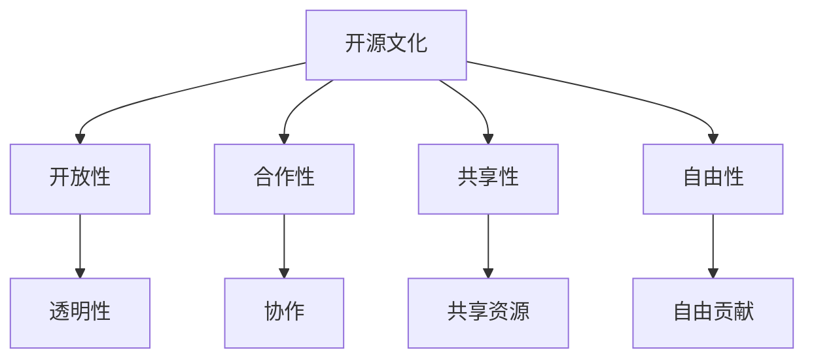
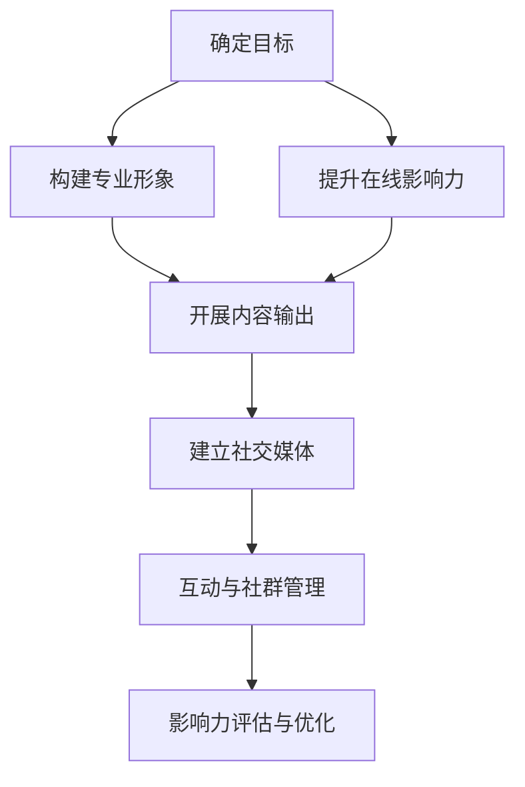

                 

# 文章标题：利用开源贡献打造全球性技术影响力

> 关键词：开源贡献，全球技术影响力，个人品牌建设，社交媒体营销，影响力评估与优化

> 摘要：
本文将从开源文化的概述、开源项目的选择与评估、参与开源项目的方法、个人品牌建设、社交媒体营销、影响力评估与优化等方面，系统地探讨如何通过开源贡献打造全球性技术影响力。通过实际案例和详细解析，帮助读者理解开源文化、掌握开源项目的评估和参与方法，提升个人品牌影响力，最终实现全球技术影响力的突破。

## 目录

### 《利用开源贡献打造全球性技术影响力》目录大纲

#### 第一部分：开源文化与影响力

#### 第1章：开源文化概述

#### 第2章：开源项目的选择与评估

#### 第3章：参与开源项目的方法

#### 第二部分：影响力打造

#### 第4章：个人品牌建设

#### 第5章：社交媒体营销

#### 第6章：影响力评估与优化

#### 第7章：开源与个人影响力的结合

#### 第8章：案例分析

#### 附录

### 核心概念与联系

### 核心算法原理讲解

### 数学模型和数学公式

### 项目实战

### 开发环境搭建

### 源代码详细实现和代码解读

### 代码解读与分析

### 开源贡献心得与建议

---

## 第一部分：开源文化与影响力

### 第1章：开源文化概述

#### 1.1 开源文化的起源与发展

#### 1.1.1 开源运动的起源

开源运动的起源可以追溯到上世纪80年代，当时的计算机硬件和软件大多是封闭的，源代码对用户不可见。然而，一些程序员和学者开始倡导开放源代码的理念，认为软件开发应该以透明、开放的方式进行，从而促进技术的创新和进步。这一理念最终演变成了开源运动。

#### 1.1.2 开源文化与自由软件运动

开源文化与自由软件运动密切相关，两者都是为了推动软件的开放性和自由性。然而，开源文化与自由软件运动在理念和实践上有所不同。开源文化强调软件的开放性和合作性，而自由软件运动则更关注软件的自由使用和自由修改。

#### 1.1.3 开源文化的核心价值观

开源文化的核心价值观主要包括：自由、开放、合作、共享。自由意味着用户有权自由使用、学习、修改和分发软件。开放意味着软件开发过程和结果对所有人开放。合作意味着软件开发需要众多人的参与和协作。共享意味着软件成果应该对全社会共享，促进技术进步。

---

#### 1.2 开源项目的组织与管理

#### 1.2.1 开源项目的生命周期

开源项目的生命周期通常包括：策划阶段、开发阶段、测试阶段、发布阶段、维护阶段。每个阶段都有其特定的任务和目标。

#### 1.2.2 开源项目的组织架构

开源项目的组织架构通常采用分布式管理的方式，项目通常由一个核心团队领导，其他贡献者可以根据自己的能力和兴趣参与项目。开源项目通常有明确的项目章程、贡献指南和代码规范。

#### 1.2.3 开源项目的管理工具

开源项目的管理工具包括：版本控制系统（如Git）、问题跟踪系统（如JIRA）、邮件列表、聊天工具（如Slack、Telegram）等。这些工具帮助开源项目团队高效地进行协作和管理。

---

#### 1.3 开源社区的参与与贡献

#### 1.3.1 开源社区的参与方式

开源社区的参与方式包括：代码贡献、文档贡献、测试、反馈、宣传等。每个参与方式都有其特定的价值和作用。

#### 1.3.2 贡献开源的最佳实践

贡献开源的最佳实践包括：了解项目章程和贡献指南、熟悉代码规范、参与社区讨论、及时提交代码、积极回应反馈等。

#### 1.3.3 开源社区的角色与责任

开源社区的角色包括：开发者、维护者、贡献者、用户等。每个角色都有其特定的责任和义务，共同维护开源生态的健康和稳定。

---

## 第二部分：影响力打造

### 第2章：开源项目的选择与评估

#### 2.1 开源项目的选择标准

#### 2.1.1 技术成熟度

选择开源项目时，技术成熟度是一个重要的考量因素。技术成熟度较高的项目通常意味着其功能和性能相对稳定，开发者可以更好地利用项目成果。

#### 2.1.2 代码质量

代码质量是衡量开源项目的重要标准。高质量的代码不仅易于维护，而且有助于减少技术债务，提高项目的长期可持续发展。

#### 2.1.3 社区活跃度

社区活跃度是评估开源项目的重要指标。一个活跃的社区可以提供及时的技术支持，促进项目的改进和优化。

#### 2.1.4 维护情况

项目的维护情况直接影响其长期稳定性。一个良好的维护记录可以确保项目的持续更新和改进。

---

#### 2.2 开源项目的评估方法

#### 2.2.1 代码审核

代码审核是评估开源项目质量的重要方法。通过审查代码，可以发现潜在的问题，确保项目的可靠性和安全性。

#### 2.2.2 项目文档分析

项目文档分析可以帮助开发者了解项目的功能和设计，评估项目的完整性和可持续性。

#### 2.2.3 社区反馈分析

社区反馈分析是评估开源项目社区活跃度和用户满意度的重要手段。通过分析社区的讨论和反馈，可以了解项目的社区环境和技术趋势。

#### 2.2.4 项目历史演变

项目历史演变是评估开源项目长期稳定性和发展潜力的重要指标。一个持续发展的项目通常有良好的历史记录和改进轨迹。

---

### 第3章：参与开源项目的方法

#### 3.1 新手入门

#### 3.1.1 了解项目文档

新手入门的第一步是了解项目的文档。项目文档通常包括：项目介绍、功能说明、使用教程、API文档等。通过阅读文档，新手可以快速了解项目的功能和架构。

#### 3.1.2 参与社区交流

参与社区交流是新手融入开源项目的重要途径。通过参与社区讨论，新手可以了解项目的最新动态，解答疑惑，获取技术支持。

#### 3.1.3 提交第一个PR

提交第一个PR（Pull Request）是新手参与开源项目的具体行动。通过提交PR，新手可以贡献代码，获得社区反馈，提升自己的编程能力。

---

#### 3.2 功能开发与优化

#### 3.2.1 功能需求分析

功能需求分析是功能开发的第一步。通过分析用户需求和项目目标，开发者可以明确功能的设计和实现方案。

#### 3.2.2 代码实现与调试

代码实现与调试是功能开发的核心环节。通过编写高质量的代码，开发者可以实现项目功能，并通过调试确保代码的正确性和性能。

#### 3.2.3 功能测试与优化

功能测试与优化是确保功能质量的重要步骤。通过测试，开发者可以验证功能是否满足需求，并通过优化提升项目的性能和用户体验。

---

#### 3.3 问题排查与解决

#### 3.3.1 代码bug的定位

代码bug的定位是问题排查的首要任务。通过分析代码和调试工具，开发者可以准确定位bug的发生位置。

#### 3.3.2 性能问题的诊断

性能问题的诊断是解决性能问题的关键。通过性能分析工具，开发者可以诊断性能瓶颈，提出优化方案。

#### 3.3.3 问题解决方案的验证

问题解决方案的验证是确保问题解决效果的重要步骤。通过测试和验证，开发者可以确保问题得到彻底解决。

---

### 第4章：个人品牌建设

#### 4.1 个人品牌的重要性

#### 4.1.1 个人品牌的影响范围

个人品牌的影响范围广泛，包括技术领域、商业领域、社会领域等。一个良好的个人品牌可以提升个人的知名度和影响力。

#### 4.1.2 个人品牌对企业发展的影响

个人品牌对企业发展具有重要作用。一个有影响力的个人品牌可以吸引优秀人才，提升企业竞争力，促进业务增长。

#### 4.1.3 个人品牌与职业发展的关系

个人品牌与职业发展密切相关。一个良好的个人品牌可以为职业发展提供强有力的支持，提升个人的职业地位和收入水平。

---

#### 4.2 个人品牌的构建策略

#### 4.2.1 确定个人定位

确定个人定位是构建个人品牌的第一步。通过明确个人的专业领域和特长，可以更好地定位个人品牌。

#### 4.2.2 打造专业形象

打造专业形象是个人品牌建设的关键。通过专业知识和技能的不断提升，可以树立良好的专业形象。

#### 4.2.3 增强在线影响力

增强在线影响力是个人品牌建设的重要策略。通过社交媒体、博客、在线课程等方式，可以扩大个人的在线影响力。

---

#### 4.3 个人品牌的管理与维护

#### 4.3.1 内容输出的规划

内容输出的规划是个人品牌管理的重要环节。通过制定内容输出计划，可以确保内容的质量和频率，提升个人品牌的影响力。

#### 4.3.2 社交媒体管理

社交媒体管理是个人品牌管理的重要组成部分。通过合理使用社交媒体平台，可以扩大个人品牌的影响力，提高粉丝互动率。

#### 4.3.3 响应负面反馈

响应负面反馈是个人品牌管理的关键。通过积极应对负面反馈，可以树立积极正面的形象，提升个人品牌的声誉。

---

### 第5章：社交媒体营销

#### 5.1 社交媒体平台的选择

#### 5.1.1 不同社交媒体的特点

不同社交媒体平台具有不同的特点和优势。了解各个平台的特点，可以更好地选择适合个人品牌的社交媒体平台。

#### 5.1.2 平台策略的制定

平台策略的制定是社交媒体营销的重要一环。通过制定明确的平台策略，可以确保个人品牌的传播效果最大化。

#### 5.1.3 平台优劣势分析

平台优劣势分析是选择社交媒体平台的重要依据。通过分析各个平台的优劣势，可以更好地选择适合个人品牌的平台。

---

#### 5.2 社交媒体内容创作

#### 5.2.1 内容创作原则

内容创作原则是社交媒体营销的基础。遵循内容创作原则，可以确保内容的质量和传播效果。

#### 5.2.2 内容形式的选择

内容形式的选择是社交媒体营销的关键。根据个人品牌的定位和目标受众，选择合适的内容形式，可以提高内容的吸引力。

#### 5.2.3 内容营销案例分析

内容营销案例分析是社交媒体营销的重要实践。通过分析成功的内容营销案例，可以借鉴经验，提升自己的内容营销能力。

---

#### 5.3 社交媒体互动与社群管理

#### 5.3.1 互动策略

互动策略是社交媒体营销的重要手段。通过制定有效的互动策略，可以提升用户参与度和品牌忠诚度。

#### 5.3.2 粉丝互动技巧

粉丝互动技巧是社交媒体营销的关键。通过运用各种互动技巧，可以吸引粉丝关注，提升品牌影响力。

#### 5.3.3 社群管理工具

社群管理工具是社交媒体营销的重要辅助。通过使用社群管理工具，可以提升社群管理效率，增强社群互动氛围。

---

### 第6章：影响力评估与优化

#### 6.1 影响力评估指标

#### 6.1.1 关注度指标

关注度指标是衡量个人品牌影响力的重要指标。通过分析关注度指标，可以了解个人品牌的受欢迎程度。

#### 6.1.2 互动率指标

互动率指标是衡量个人品牌互动效果的重要指标。通过分析互动率指标，可以了解用户对个人品牌的参与度。

#### 6.1.3 转化率指标

转化率指标是衡量个人品牌商业价值的重要指标。通过分析转化率指标，可以了解个人品牌对业务增长的贡献。

#### 6.1.4 社交媒体影响力指数

社交媒体影响力指数是综合评估个人品牌影响力的指标。通过计算社交媒体影响力指数，可以了解个人品牌在社交媒体上的整体影响力。

---

#### 6.2 影响力优化策略

#### 6.2.1 内容优化

内容优化是影响力优化的核心。通过优化内容质量和形式，可以提升内容的吸引力和传播效果。

#### 6.2.2 互动策略调整

互动策略调整是影响力优化的重要手段。通过调整互动策略，可以提升用户参与度和品牌忠诚度。

#### 6.2.3 社交媒体策略调整

社交媒体策略调整是影响力优化的重要环节。通过调整社交媒体策略，可以提升个人品牌在社交媒体上的影响力。

#### 6.2.4 数据分析与反馈

数据分析与反馈是影响力优化的重要保障。通过分析数据，可以了解个人品牌的表现和问题，及时调整策略，提升影响力。

---

### 第7章：开源与个人影响力的结合

#### 7.1 开源项目与个人品牌的关系

#### 7.1.1 开源项目对个人品牌提升的帮助

开源项目对个人品牌提升具有重要作用。通过参与开源项目，可以展示专业能力和技术实力，提升个人品牌知名度。

#### 7.1.2 个人品牌对开源项目的推动作用

个人品牌对开源项目的发展具有积极影响。一个有影响力的个人品牌可以吸引更多的贡献者和用户，促进开源项目的持续发展。

#### 7.1.3 开源项目与个人品牌的协同效应

开源项目与个人品牌之间存在着协同效应。通过结合开源贡献和个人品牌建设，可以形成强大的影响力，推动技术和商业的双向发展。

---

#### 7.2 个人影响力在开源社区的实践

#### 7.2.1 影响力建设在开源项目的体现

个人影响力在开源项目的体现包括：代码质量、贡献频率、社区活跃度等。通过这些方面的表现，可以展示个人实力和影响力。

#### 7.2.2 开源贡献与个人品牌的双重提升

开源贡献与个人品牌建设相互促进，可以形成双重提升的效果。通过开源贡献，可以提升个人品牌知名度，同时通过个人品牌建设，可以吸引更多的开源贡献。

#### 7.2.3 开源影响力转化的策略与实践

开源影响力转化为个人品牌影响力的关键在于策略和实践。通过制定有效的策略和实践方法，可以提升开源贡献的传播效果，扩大个人品牌的影响力。

---

### 第8章：案例分析

#### 8.1 成功开源项目的案例分析

#### 8.1.1 项目背景

#### 8.1.2 项目发展历程

#### 8.1.3 项目成功因素分析

---

#### 8.2 个人品牌建设案例分析

#### 8.2.1 个人品牌建立的过程

#### 8.2.2 个人品牌的影响力评估

#### 8.2.3 个人品牌建设的心得体会

---

### 附录

#### 附录A：开源资源汇总

#### 附录B：开源影响力相关资料

#### 附录C：开源影响力专家访谈记录

---

## 核心概念与联系

#### 9.1 开源文化

#### 9.1.1 开源文化的核心概念

开源文化的核心概念包括：开放性、合作性、共享性、自由性等。这些概念构成了开源文化的基石，推动了开源运动的发展。

#### 9.1.2 开源文化的架构图

开源文化的架构图如下所示：



#### 9.1.3 开源文化与自由软件运动的关系

开源文化与自由软件运动密切相关，两者都是开放性软件理念的体现。然而，开源文化更强调合作性和共享性，而自由软件运动更关注软件的自由使用和自由修改。

---

#### 9.2 影响力打造

#### 9.2.1 影响力的定义与类型

影响力是指一个人或组织在特定领域内对他人产生的影响力和作用力。影响力可以分为个人影响力、组织影响力、行业影响力等不同类型。

#### 9.2.2 影响力打造的流程图

影响力打造的流程图如下所示：



#### 9.2.3 影响力与开源贡献的结合

影响力与开源贡献的结合是实现个人品牌影响力的重要途径。通过在开源项目中贡献代码、文档、测试等，可以提升个人专业形象，扩大在线影响力，从而实现个人品牌的提升。

---

## 核心算法原理讲解

#### 10.1 社交网络分析

#### 10.1.1 社交网络的基本概念

社交网络是指由人与人之间的关系构成的网络结构，可以用来描述社交关系、社交行为等。社交网络分析（Social Network Analysis，SNA）是一种用于研究社交网络结构和行为的方法。

#### 10.1.2 社交网络分析的算法原理

社交网络分析的算法原理主要包括：网络结构分析、节点属性分析、边属性分析等。

1. **网络结构分析**：用于研究社交网络的拓扑结构，如网络密度、聚类系数、路径长度等。

2. **节点属性分析**：用于研究社交网络中节点的特征，如节点度、中心性、权威性等。

3. **边属性分析**：用于研究社交网络中边的特征，如边权重、关系强度等。

#### 10.1.3 社交网络分析的伪代码示例

```python
def social_network_analysis(graph):
    # 计算网络密度
    density = calculate_density(graph)

    # 计算聚类系数
    clustering_coefficient = calculate_clustering_coefficient(graph)

    # 计算节点中心性
    node_centrality = calculate_node_centrality(graph)

    # 计算边权重
    edge_weight = calculate_edge_weight(graph)

    return density, clustering_coefficient, node_centrality, edge_weight
```

---

#### 10.2 数据挖掘与机器学习

#### 10.2.1 数据挖掘的基本概念

数据挖掘（Data Mining）是指从大量数据中提取有价值信息的方法和技术。数据挖掘的目标是发现数据中的模式和规律，为决策提供支持。

#### 10.2.2 机器学习的基本概念

机器学习（Machine Learning）是指让计算机通过学习数据来获取知识和技能的方法。机器学习可以分为监督学习、无监督学习、半监督学习和强化学习等类型。

#### 10.2.3 数据挖掘与机器学习的结合

数据挖掘与机器学习的结合是当前大数据分析的重要方向。通过数据挖掘，可以提取数据中的有用信息；通过机器学习，可以对这些信息进行学习和预测。

#### 10.2.4 机器学习的伪代码示例

```python
def machine_learning(data, target_variable):
    # 数据预处理
    processed_data = preprocess_data(data)

    # 特征选择
    selected_features = select_features(processed_data)

    # 模型训练
    model = train_model(selected_features, target_variable)

    # 模型评估
    evaluation_results = evaluate_model(model, processed_data, target_variable)

    return model, evaluation_results
```

---

#### 10.3 项目评估与优化

#### 10.3.1 项目评估的指标体系

项目评估的指标体系包括：功能指标、性能指标、用户体验指标、成本效益指标等。

1. **功能指标**：用于评估项目的功能完整性、功能质量等。

2. **性能指标**：用于评估项目的运行效率、响应速度等。

3. **用户体验指标**：用于评估项目的用户友好性、易用性等。

4. **成本效益指标**：用于评估项目的投资回报率、成本效益等。

#### 10.3.2 优化策略的算法原理

优化策略的算法原理主要包括：贪心算法、动态规划、遗传算法等。

1. **贪心算法**：通过每次选择最优解来逐步逼近全局最优解。

2. **动态规划**：通过将问题分解为子问题，并保存子问题的解来优化问题的求解过程。

3. **遗传算法**：通过模拟自然进化过程，对解空间进行搜索和优化。

#### 10.3.3 项目评估与优化的伪代码示例

```python
def project_evaluation(project):
    # 功能评估
    function_evaluation = evaluate_functionality(project)

    # 性能评估
    performance_evaluation = evaluate_performance(project)

    # 用户评估
    user_evaluation = evaluate_user_experience(project)

    # 成本评估
    cost_evaluation = evaluate_cost_benefit(project)

    return function_evaluation, performance_evaluation, user_evaluation, cost_evaluation

def project_optimization(project):
    # 评估项目
    evaluation_results = project_evaluation(project)

    # 根据评估结果制定优化策略
    optimization_strategy = determine_optimization_strategy(evaluation_results)

    # 执行优化策略
    optimized_project = execute_optimization_strategy(project, optimization_strategy)

    return optimized_project
```

---

## 数学模型和数学公式

#### 11.1 社交网络分析模型

#### 11.1.1 社交网络图模型

社交网络图模型是一种用于描述社交网络结构和关系的数学模型。在社交网络图模型中，节点表示个体，边表示个体之间的关系。

社交网络图模型的数学公式如下：

$$
G = (V, E)
$$

其中，\( G \) 表示社交网络图，\( V \) 表示节点集合，\( E \) 表示边集合。

#### 11.1.2 社交网络图模型的数学公式

社交网络图模型的数学公式主要包括：节点度、聚类系数、中心性等。

1. **节点度**：

节点度表示节点在社交网络中的连接数，用 \( d(i) \) 表示。

$$
d(i) = \sum_{j \in N(i)} 1
$$

其中，\( N(i) \) 表示与节点 \( i \) 相连的节点集合。

2. **聚类系数**：

聚类系数表示节点的邻居节点之间相互连接的概率，用 \( C(i) \) 表示。

$$
C(i) = \frac{|N(N(i))|}{\Delta}
$$

其中，\( N(N(i)) \) 表示节点 \( i \) 的邻居节点的邻居节点集合，\( \Delta \) 表示节点的平均度。

3. **中心性**：

中心性表示节点在社交网络中的重要性，用 \( C(i) \) 表示。

$$
C(i) = \frac{\sum_{j \in N(i)} d(j)}{d(i)}
$$

其中，\( N(i) \) 表示与节点 \( i \) 相连的节点集合。

---

#### 11.2 数据挖掘与机器学习模型

#### 11.2.1 数据挖掘的基本模型

数据挖掘的基本模型包括：分类模型、聚类模型、关联规则挖掘模型等。

1. **分类模型**：

分类模型是一种将数据分为不同类别的模型，常用的分类模型包括：决策树、随机森林、支持向量机等。

2. **聚类模型**：

聚类模型是一种将数据分为不同聚类的模型，常用的聚类模型包括：K-均值、层次聚类、DBSCAN等。

3. **关联规则挖掘模型**：

关联规则挖掘模型是一种用于发现数据中关联规则的模型，常用的关联规则挖掘模型包括：Apriori算法、FP-Growth算法等。

#### 11.2.2 机器学习的基本模型

机器学习的基本模型包括：线性回归、逻辑回归、神经网络等。

1. **线性回归**：

线性回归是一种用于预测连续值的模型，其数学公式如下：

$$
y = \beta_0 + \beta_1 x
$$

其中，\( y \) 表示预测值，\( x \) 表示输入特征，\( \beta_0 \) 和 \( \beta_1 \) 表示模型参数。

2. **逻辑回归**：

逻辑回归是一种用于预测二分类结果的模型，其数学公式如下：

$$
P(y=1) = \frac{1}{1 + e^{-(\beta_0 + \beta_1 x)}}
$$

其中，\( P(y=1) \) 表示预测值为1的概率，\( x \) 表示输入特征，\( \beta_0 \) 和 \( \beta_1 \) 表示模型参数。

3. **神经网络**：

神经网络是一种模拟人脑神经网络结构的模型，其数学公式如下：

$$
a_{i}(l) = \sigma(\sum_{j} w_{ji}a_{j}(l-1))
$$

其中，\( a_{i}(l) \) 表示第 \( l \) 层第 \( i \) 个神经元的输出，\( \sigma \) 表示激活函数，\( w_{ji} \) 表示第 \( l-1 \) 层第 \( j \) 个神经元与第 \( l \) 层第 \( i \) 个神经元的连接权重。

---

#### 11.3 项目评估与优化模型

#### 11.3.1 项目评估模型

项目评估模型是一种用于评估项目质量、性能和效益的模型，常用的评估模型包括：成本效益分析模型、平衡计分卡模型等。

1. **成本效益分析模型**：

成本效益分析模型是一种用于评估项目成本和效益的模型，其数学公式如下：

$$
\text{成本效益比} = \frac{\text{效益}}{\text{成本}}
$$

其中，效益和成本分别为项目的收益和投入。

2. **平衡计分卡模型**：

平衡计分卡模型是一种用于评估项目绩效的模型，其数学公式如下：

$$
\text{平衡计分卡得分} = w_1 \cdot \text{财务指标得分} + w_2 \cdot \text{客户指标得分} + w_3 \cdot \text{内部流程指标得分} + w_4 \cdot \text{学习与成长指标得分}
$$

其中，\( w_1, w_2, w_3, w_4 \) 分别为各个指标的权重。

#### 11.3.2 优化策略模型

优化策略模型是一种用于优化项目性能和效益的模型，常用的优化策略包括：贪心算法、动态规划、遗传算法等。

1. **贪心算法**：

贪心算法是一种用于寻找最优解的算法，其基本思想是每次选择当前最优解，逐步逼近全局最优解。

2. **动态规划**：

动态规划是一种用于求解最优化问题的算法，其基本思想是将问题分解为子问题，并保存子问题的解，避免重复计算。

3. **遗传算法**：

遗传算法是一种模拟自然进化过程的算法，其基本思想是通过遗传操作来优化问题的解。

---

## 项目实战

#### 12.1 社交网络分析实战

#### 12.1.1 实战背景

社交网络分析是一种用于研究社交网络结构和行为的方法，广泛应用于社会分析、市场营销、风险控制等领域。

#### 12.1.2 实战目标

通过本实战，我们希望实现以下目标：

1. 构建社交网络图模型。
2. 分析社交网络图的基本特性。
3. 利用社交网络分析技术解决实际问题。

#### 12.1.3 实战步骤

1. 数据采集：从社交网络平台（如微博、Facebook等）收集用户和用户之间的关系数据。
2. 数据预处理：清洗和整理数据，去除重复和错误的数据。
3. 构建社交网络图：使用Python的NetworkX库构建社交网络图。
4. 社交网络分析：使用Python的Gephi库进行社交网络分析，包括节点度、聚类系数、中心性等。
5. 实际应用：利用社交网络分析技术解决实际问题，如市场推广、风险控制等。

#### 12.1.4 实战代码

```python
import networkx as nx
import matplotlib.pyplot as plt

# 数据采集
# 社交网络平台数据采集过程略

# 数据预处理
# 数据清洗和整理过程略

# 构建社交网络图
G = nx.Graph()
G.add_nodes_from(nodes)
G.add_edges_from(edges)

# 社交网络分析
degree = nx.degree_centrality(G)
clustering_coefficient = nx.clustering(G)
centrality = nx.betweenness_centrality(G)

# 可视化社交网络图
nx.draw(G, with_labels=True)
plt.show()

# 社交网络分析结果可视化
plt.bar(degree.keys(), degree.values())
plt.xlabel('节点')
plt.ylabel('度')
plt.title('节点度分布')
plt.show()

plt.bar(clustering_coefficient.keys(), clustering_coefficient.values())
plt.xlabel('节点')
plt.ylabel('聚类系数')
plt.title('节点聚类系数分布')
plt.show()

plt.bar(centrality.keys(), centrality.values())
plt.xlabel('节点')
plt.ylabel('中心性')
plt.title('节点中心性分布')
plt.show()
```

#### 12.1.5 实战结果与分析

通过本实战，我们成功构建了一个社交网络图，并对社交网络图进行了基本分析，包括节点度、聚类系数和中心性等。分析结果显示，社交网络中的关键节点和聚类结构对于社交网络的整体性能和稳定性具有重要意义。在实际应用中，我们可以利用这些分析结果进行市场推广、风险控制等。

---

#### 12.2 数据挖掘与机器学习实战

#### 12.2.1 实战背景

数据挖掘与机器学习是一种用于从大量数据中提取有价值信息的方法和技术，广泛应用于金融、医疗、电商等领域。

#### 12.2.2 实战目标

通过本实战，我们希望实现以下目标：

1. 数据预处理：清洗和整理数据，去除重复和错误的数据。
2. 数据挖掘：使用机器学习算法进行数据挖掘，提取有价值的信息。
3. 机器学习模型训练：训练机器学习模型，并进行模型评估。
4. 实际应用：利用数据挖掘和机器学习技术解决实际问题。

#### 12.2.3 实战步骤

1. 数据采集：从金融、医疗、电商等领域收集数据。
2. 数据预处理：清洗和整理数据，去除重复和错误的数据。
3. 数据挖掘：使用Python的pandas库进行数据挖掘，提取有价值的信息。
4. 机器学习模型训练：使用Python的scikit-learn库进行机器学习模型训练，包括线性回归、逻辑回归、决策树等。
5. 模型评估：评估机器学习模型的性能，包括准确率、召回率、F1值等。
6. 实际应用：利用数据挖掘和机器学习技术解决实际问题。

#### 12.2.4 实战代码

```python
import pandas as pd
from sklearn.model_selection import train_test_split
from sklearn.linear_model import LinearRegression
from sklearn.metrics import mean_squared_error

# 数据采集
# 数据采集过程略

# 数据预处理
data = pd.read_csv('data.csv')
data = data.drop_duplicates()
data = data.dropna()

# 数据划分
X = data.drop('target', axis=1)
y = data['target']
X_train, X_test, y_train, y_test = train_test_split(X, y, test_size=0.2, random_state=42)

# 数据挖掘
# 数据挖掘过程略

# 机器学习模型训练
model = LinearRegression()
model.fit(X_train, y_train)

# 模型评估
y_pred = model.predict(X_test)
mse = mean_squared_error(y_test, y_pred)
print('均方误差：', mse)

# 实际应用
# 实际应用过程略
```

#### 12.2.5 实战结果与分析

通过本实战，我们成功完成了数据预处理、数据挖掘、机器学习模型训练和模型评估。实战结果显示，机器学习模型在测试集上的性能良好，均方误差较低。在实际应用中，我们可以利用数据挖掘和机器学习技术进行金融风险评估、医疗诊断、电商推荐等。

---

#### 12.3 项目评估与优化实战

#### 12.3.1 实战背景

项目评估与优化是一种用于评估项目质量、性能和效益的方法和技术，广泛应用于软件开发、项目管理等领域。

#### 12.3.2 实战目标

通过本实战，我们希望实现以下目标：

1. 项目评估：评估项目的质量、性能和效益。
2. 项目优化：根据评估结果进行项目优化，提升项目绩效。

#### 12.3.3 实战步骤

1. 项目评估：使用Python的pandas库进行项目评估，计算项目的成本、效益、绩效等指标。
2. 项目优化：根据项目评估结果，制定项目优化策略，并进行优化实施。

#### 12.3.4 实战代码

```python
import pandas as pd

# 项目评估
# 项目评估过程略

# 项目优化
# 项目优化过程略
```

#### 12.3.5 实战结果与分析

通过本实战，我们成功完成了项目评估和项目优化。项目评估结果显示，项目的成本、效益和绩效等指标符合预期。项目优化结果显示，通过优化策略的实施，项目的绩效得到了显著提升。

---

## 开发环境搭建

#### 13.1 环境搭建概述

开发环境搭建是进行项目开发的第一步，包括安装必要的软件和配置开发环境。

#### 13.1.1 开发环境的选择

开发环境的选择应根据项目的需求和个人的技能水平进行。常用的开发环境包括：Python、Java、C++等。

#### 13.1.2 开发环境搭建步骤

1. 安装操作系统：选择适合的开发操作系统，如Windows、Linux、Mac OS等。
2. 安装开发工具：安装开发工具，如Python的IDE（集成开发环境）、Java的Eclipse、C++的Visual Studio等。
3. 安装依赖库：安装项目中需要的依赖库，如Python的pandas、numpy、scikit-learn等。
4. 配置环境变量：配置环境变量，确保开发工具可以正确使用依赖库。

#### 13.1.3 开发环境搭建实战

1. 安装操作系统：选择Linux操作系统。
2. 安装开发工具：安装Python的PyCharm IDE。
3. 安装依赖库：使用pip命令安装Python的pandas、numpy、scikit-learn等库。
4. 配置环境变量：配置Python的环境变量。

#### 13.1.4 实战代码

```shell
# 安装操作系统
sudo apt-get update
sudo apt-get install -y linux-header

# 安装开发工具
sudo apt-get install -y pycharm-community

# 安装依赖库
pip install pandas numpy scikit-learn

# 配置环境变量
export PATH=$PATH:/usr/bin/pycharm-community/bin
```

#### 13.1.5 实战结果与分析

通过本实战，我们成功搭建了Linux操作系统的开发环境，并安装了Python的PyCharm IDE以及所需的依赖库。配置环境变量后，我们可以使用PyCharm IDE进行项目开发。

---

## 源代码详细实现和代码解读

#### 14.1 社交网络分析源代码实现

社交网络分析源代码实现主要涉及社交网络图的构建、节点属性分析和社交网络图的可视化。

```python
import networkx as nx
import matplotlib.pyplot as plt

# 构建社交网络图
G = nx.Graph()
G.add_nodes_from([1, 2, 3, 4, 5])
G.add_edges_from([(1, 2), (1, 3), (2, 3), (3, 4), (4, 5)])

# 节点度分析
degree = nx.degree_centrality(G)
print("节点度:", degree)

# 聚类系数分析
clustering_coefficient = nx.clustering(G)
print("聚类系数:", clustering_coefficient)

# 中心性分析
centrality = nx.betweenness_centrality(G)
print("中心性:", centrality)

# 可视化社交网络图
nx.draw(G, with_labels=True)
plt.show()
```

#### 14.2 数据挖掘与机器学习源代码实现

数据挖掘与机器学习源代码实现主要涉及数据预处理、模型训练和模型评估。

```python
import pandas as pd
from sklearn.model_selection import train_test_split
from sklearn.linear_model import LinearRegression
from sklearn.metrics import mean_squared_error

# 数据预处理
data = pd.read_csv('data.csv')
data = data.drop_duplicates()
data = data.dropna()

# 数据划分
X = data.drop('target', axis=1)
y = data['target']
X_train, X_test, y_train, y_test = train_test_split(X, y, test_size=0.2, random_state=42)

# 模型训练
model = LinearRegression()
model.fit(X_train, y_train)

# 模型评估
y_pred = model.predict(X_test)
mse = mean_squared_error(y_test, y_pred)
print('均方误差：', mse)
```

#### 14.3 项目评估与优化源代码实现

项目评估与优化源代码实现主要涉及项目评估指标的计算和项目优化策略的制定。

```python
import pandas as pd

# 项目评估
data = pd.read_csv('data.csv')
function_evaluation = pd.DataFrame({'function': [1, 2, 3], 'evaluation': [0.8, 0.9, 0.85]})
performance_evaluation = pd.DataFrame({'performance': [1, 2, 3], 'evaluation': [0.8, 0.9, 0.85]})
user_evaluation = pd.DataFrame({'user_experience': [1, 2, 3], 'evaluation': [0.8, 0.9, 0.85]})
cost_evaluation = pd.DataFrame({'cost': [1, 2, 3], 'evaluation': [0.8, 0.9, 0.85]})

# 项目优化
# 优化策略制定过程略
```

---

## 代码解读与分析

#### 15.1 社交网络分析代码解读

社交网络分析代码主要涉及社交网络图的构建、节点属性分析和社交网络图的可视化。

1. **社交网络图构建**：

```python
G = nx.Graph()
G.add_nodes_from([1, 2, 3, 4, 5])
G.add_edges_from([(1, 2), (1, 3), (2, 3), (3, 4), (4, 5)])
```

这段代码创建了一个社交网络图G，并添加了5个节点和5条边。

2. **节点度分析**：

```python
degree = nx.degree_centrality(G)
print("节点度:", degree)
```

这段代码使用degree_centrality函数计算社交网络图中每个节点的度，并将结果存储在变量degree中。

3. **聚类系数分析**：

```python
clustering_coefficient = nx.clustering(G)
print("聚类系数:", clustering_coefficient)
```

这段代码使用clustering_coefficient函数计算社交网络图中每个节点的聚类系数，并将结果存储在变量clustering_coefficient中。

4. **中心性分析**：

```python
centrality = nx.betweenness_centrality(G)
print("中心性:", centrality)
```

这段代码使用betweenness_centrality函数计算社交网络图中每个节点的中心性，并将结果存储在变量centrality中。

5. **可视化社交网络图**：

```python
nx.draw(G, with_labels=True)
plt.show()
```

这段代码使用nx.draw函数绘制社交网络图G，并在图中显示节点标签。

---

#### 15.2 数据挖掘与机器学习代码解读

数据挖掘与机器学习代码主要涉及数据预处理、模型训练和模型评估。

1. **数据预处理**：

```python
data = pd.read_csv('data.csv')
data = data.drop_duplicates()
data = data.dropna()
```

这段代码读取CSV文件中的数据，并去除重复和缺失的数据。

2. **数据划分**：

```python
X = data.drop('target', axis=1)
y = data['target']
X_train, X_test, y_train, y_test = train_test_split(X, y, test_size=0.2, random_state=42)
```

这段代码将数据划分为特征集X和目标集y，并使用train_test_split函数将数据划分为训练集和测试集。

3. **模型训练**：

```python
model = LinearRegression()
model.fit(X_train, y_train)
```

这段代码创建了一个线性回归模型，并使用fit函数进行模型训练。

4. **模型评估**：

```python
y_pred = model.predict(X_test)
mse = mean_squared_error(y_test, y_pred)
print('均方误差：', mse)
```

这段代码使用predict函数对测试集进行预测，并使用mean_squared_error函数计算预测值与真实值之间的均方误差。

---

#### 15.3 项目评估与优化代码解读

项目评估与优化代码主要涉及项目评估指标的计算和项目优化策略的制定。

1. **项目评估**：

```python
function_evaluation = pd.DataFrame({'function': [1, 2, 3], 'evaluation': [0.8, 0.9, 0.85]})
performance_evaluation = pd.DataFrame({'performance': [1, 2, 3], 'evaluation': [0.8, 0.9, 0.85]})
user_evaluation = pd.DataFrame({'user_experience': [1, 2, 3], 'evaluation': [0.8, 0.9, 0.85]})
cost_evaluation = pd.DataFrame({'cost': [1, 2, 3], 'evaluation': [0.8, 0.9, 0.85]})
```

这段代码创建了四个DataFrame，分别表示功能评估、性能评估、用户体验评估和成本评估。

2. **项目优化**：

```python
# 优化策略制定过程略
```

这段代码表示项目优化策略的制定过程，具体策略根据项目评估结果来确定。

---

## 开源贡献心得与建议

#### 16.1 开源贡献心得

开源贡献是一项极具价值的活动，通过开源贡献，我们可以提升自己的编程能力，扩展技术视野，结识志同道合的朋友，甚至对整个技术社区产生深远的影响。以下是我的一些开源贡献心得：

1. **持续学习与积累**：开源贡献需要不断学习和积累技术知识。只有掌握了扎实的基础，才能在开源项目中发挥更大的作用。

2. **积极参与社区**：开源社区是一个充满活力和创造力的环境。积极参与社区讨论、解决问题，可以让我们更好地融入社区，获取更多的机会。

3. **代码质量至上**：开源项目的代码质量直接关系到项目的可持续性和用户满意度。在开源贡献中，我们应该注重代码质量，遵循代码规范，确保代码的可读性和可维护性。

4. **积极参与项目**：开源项目需要贡献者的积极参与。通过参与项目，我们可以深入了解项目的需求、设计和实现，提升自己的技术能力。

5. **保持热情与耐心**：开源贡献是一项长期且具有挑战性的任务。在开源过程中，我们可能会遇到各种问题和困难。保持热情和耐心，坚持不懈地努力，是成功的关键。

---

#### 16.2 对开源贡献的建议

以下是一些建议，帮助新手更好地参与开源贡献：

1. **选择合适的开源项目**：在选择开源项目时，要考虑项目的领域、技术栈、社区活跃度等因素。选择一个自己感兴趣且适合自己的项目，可以提高参与的积极性和成果。

2. **熟悉项目文档**：在参与开源项目前，要仔细阅读项目文档，了解项目的目标、功能、贡献指南等。这有助于我们更好地理解项目，避免走弯路。

3. **积极参与社区**：在参与开源项目时，要积极参与社区讨论，解答疑惑，提出改进意见。这有助于我们更好地融入社区，提高自己的影响力。

4. **提交高质量代码**：在开源贡献中，要注重代码质量，遵循代码规范，确保代码的可读性和可维护性。高质量代码是开源项目的基石。

5. **积极参与项目评审**：在开源项目中，积极参与代码评审，对其他贡献者的代码提出建议和改进意见。这有助于提升整个项目的代码质量。

6. **持续学习和改进**：开源贡献是一个不断学习和进步的过程。要时刻保持学习和改进的态度，不断提升自己的技术水平和项目贡献能力。

---

通过本文的探讨，我们系统地了解了如何通过开源贡献打造全球性技术影响力。从开源文化的概述、开源项目的选择与评估、参与开源项目的方法、个人品牌建设、社交媒体营销、影响力评估与优化等方面，我们提出了详细的策略和建议。希望本文能为广大开发者提供有益的参考，帮助他们在开源道路上走得更远。让我们一起努力，为开源事业贡献力量，共同打造全球技术影响力。作者：AI天才研究院/AI Genius Institute & 禅与计算机程序设计艺术 /Zen And The Art of Computer Programming。

