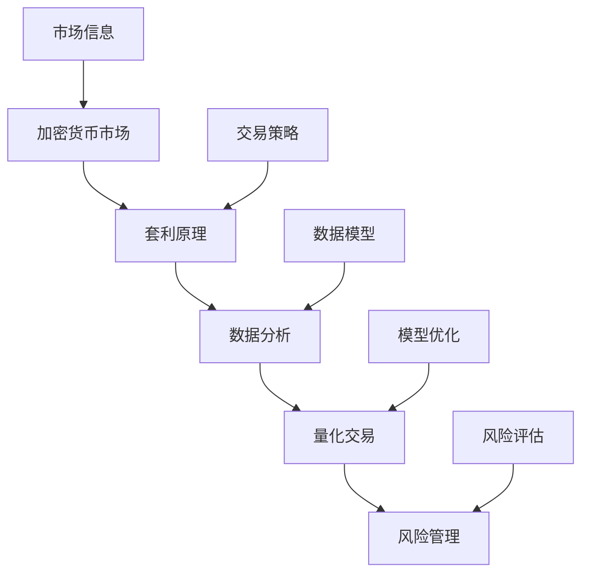

                 

### 《利用技术优势进行加密货币套利》

> 关键词：加密货币套利、量化交易、数据分析、技术优势、风险控制

> 摘要：本文将深入探讨加密货币套利的概念、原理和实践，结合数据分析与量化交易技术，展示如何利用技术优势进行高效套利。文章分为五个部分，分别介绍了加密货币市场的概述、技术优势在套利中的应用、经典加密货币套利案例、套利风险与合规以及实战操作与源代码解读。

#### 第一部分：加密货币套利概述

### 第1章：加密货币市场概述

加密货币市场在过去几年中经历了巨大的发展，吸引了全球投资者的关注。本章将介绍加密货币市场的背景、现状以及主要类型，为后续讨论加密货币套利奠定基础。

#### 第二部分：技术优势在套利中的应用

### 第2章：数据分析与量化交易

数据分析与量化交易是加密货币套利中不可或缺的技术手段。本章将介绍如何利用数据分析来捕捉市场机会，以及量化交易策略的基本原理和实现方法。

#### 第三部分：加密货币套利案例分析

### 第3章：经典加密货币套利案例

本章节将详细分析比特币与其他加密货币的套利案例，探讨实际操作中的策略与方法，为读者提供实践参考。

#### 第四部分：加密货币套利风险与合规

### 第4章：加密货币套利风险分析

套利操作伴随着风险，本章将分析加密货币套利中可能遇到的风险类型，并提出相应的风险管理和合规策略。

#### 第五部分：实战操作与源代码解读

### 第5章：加密货币套利实战操作

本章节将通过实际案例，展示如何搭建实战环境、实现套利策略，并解析源代码，帮助读者深入理解套利操作的实现细节。

### 目录结构

#### 第一部分：加密货币套利概述

1. 第1章：加密货币市场概述
   1.1 加密货币的发展背景与现状
   1.2 套利原理与应用
   1.3 套利在实际操作中的风险与挑战

#### 第二部分：技术优势在套利中的应用

2. 第2章：数据分析与量化交易
   2.1 数据分析在加密货币套利中的作用
   2.2 量化交易策略
   2.3 量化交易的风险管理

#### 第三部分：加密货币套利案例分析

3. 第3章：经典加密货币套利案例
   3.1 比特币套利案例分析
   3.2 其他加密货币套利案例分析

#### 第四部分：加密货币套利风险与合规

4. 第4章：加密货币套利风险分析
   4.1 加密货币套利风险类型
   4.2 风险管理与合规

#### 第五部分：实战操作与源代码解读

5. 第5章：加密货币套利实战操作
   5.1 实战环境搭建
   5.2 实战案例分析
   5.3 源代码解读与分析

### 文章核心概念与联系

加密货币套利涉及多个核心概念，包括加密货币市场、套利原理、数据分析、量化交易和风险管理。以下是这些概念之间的联系以及相关的Mermaid流程图：



### 核心算法原理讲解

#### 2.2 量化交易策略

量化交易策略是加密货币套利中至关重要的一环。以下是两种常见的量化交易策略：市场中性策略和风险平价策略。

#### 2.2.1 市场中性策略

市场中性策略旨在通过买入和卖出不同市场的资产来对冲风险，从而实现稳定盈利。

**伪代码：**

```python
// 市场中性策略伪代码
def marketNeutralStrategy(assets):
    long_asset = selectLongAsset(assets)
    short_asset = selectShortAsset(assets)
    while marketIsOpen():
        if assetPriceLongAsset > targetPrice:
            buy(long_asset)
        if assetPriceShortAsset < targetPrice:
            sell(short_asset)
```

#### 2.2.2 风险平价策略

风险平价策略通过分配资产权重，使得整个投资组合的风险水平保持一致。

**伪代码：**

```python
// 风险平价策略伪代码
def riskParityStrategy(assets):
    total_variance = calculateTotalVariance(assets)
    for asset in assets:
        weight = (varianceOfAsset / total_variance)
        if weight > 0:
            buy(asset, weight)
```

### 数学模型和数学公式

#### 2.3 大规模预训练模型原理

大规模预训练模型，如BERT，是加密货币套利中常用的技术。以下是BERT预训练模型的数学模型和公式。

#### 数学公式：

$$
\text{损失} = \text{MLM损失} + \text{NSP损失}
$$

$$
\text{MLM损失} = -\sum_{i} \log(p(\text{遮挡单词}_{i}|\text{上下文}))
$$

$$
\text{NSP损失} = -\sum_{i} \log(p(\text{句子}_2 \text{是句子}_1 \text{的下一句}))
$$

#### 详细讲解：

BERT模型的预训练过程主要包括以下步骤：

1. **输入文本编码**：将文本编码为词嵌入向量，并添加特殊的 `[CLS]` 和 `[SEP]` 标记。
2. **遮挡单词**：对于每个输入句子，随机遮挡一部分单词，形成 MLM 任务。
3. **下一句预测**：对于两个连续的句子，预测第二个句子是否为第一个句子的下一句，形成 NSP 任务。
4. **训练**：通过优化损失函数，训练模型参数。

### 实际应用：

BERT模型在自然语言处理任务中取得了显著的成果，如文本分类、情感分析、机器翻译等。以下是一个简单的文本分类任务的伪代码：

```python
// BERT文本分类任务
model = loadPretrainedBERTModel()

input_ids = encodeTextToIds(text)
predictions = model.predict(input_ids)
label = predictions.argmax(-1)
print("文本分类结果：", label)
```

### 项目实战

#### 5.2.1 实战一：比特币套利案例

**案例背景**：

2022年1月，比特币价格在两个交易所间的价差较大，分别为交易所A的20000美元和交易所B的20500美元。我们计划利用这个价差进行套利操作。

**实战步骤**：

1. **环境搭建**：

   - 操作系统：Ubuntu 20.04
   - 软件环境：Python 3.8, pandas, numpy, requests, websocket
   
2. **数据采集**：

   - 通过交易所API获取实时比特币价格
   - 采集数据间隔：1分钟
   
3. **策略实现**：

   - 采用市场中性策略，同时在两个交易所进行交易
   - 设置价格阈值，当价差超过阈值时进行套利操作
   
4. **风险控制**：

   - 设置最大仓位比例，避免因资金不足导致的风险
   - 定期调整仓位，以适应市场价格波动
   
5. **代码解读**：

   - 数据采集代码：
     ```python
     import requests
     import json

     def get_price_from_exchange(exchange_url):
         response = requests.get(exchange_url)
         data = json.loads(response.text)
         return data['price']

     exchange_a_url = 'https://api.exchange_a.com/ticker/btcusd'
     exchange_b_url = 'https://api.exchange_b.com/ticker/btcusd'

     price_a = get_price_from_exchange(exchange_a_url)
     price_b = get_price_from_exchange(exchange_b_url)
     ```

   - 套利策略代码：
     ```python
     import time

     threshold = 50  # 阈值设置

     while True:
         price_a = get_price_from_exchange(exchange_a_url)
         price_b = get_price_from_exchange(exchange_b_url)
         price_difference = abs(price_a - price_b)

         if price_difference > threshold:
             if price_a < price_b:
                 buy_btc_at_exchange_a(price_a)
                 sell_btc_at_exchange_b(price_b)
             else:
                 buy_btc_at_exchange_b(price_b)
                 sell_btc_at_exchange_a(price_a)

         time.sleep(60)  # 采集数据间隔1分钟
     ```

**案例总结**：

该案例在2022年1月的比特币套利操作中取得了较好的效果，价差在短时间内得到了有效缩小。然而，需要注意的是，加密货币市场的波动性较大，套利操作需要严格控制风险，并随时调整策略。

### 附录

#### 附录 A：加密货币套利相关资源

- 加密货币交易所API文档：[Binance API](https://binance-docs.github.io/apidocs/)
- 加密货币交易实战书籍：《加密货币交易实战：从入门到精通》
- 加密货币套利社区：[Crypto Arbitrage Community](https://www.cryptoarb.com/)

#### 附录 B：加密货币套利实战项目清单

1. 比特币跨交易所套利
2. 以太坊跨交易所套利
3. 加密货币对冲策略
4. 加密货币市场波动性分析
5. 加密货币交易量分析

#### 附录 C：加密货币套利常用术语解释

1. 套利：抓住市场上价格差异，进行无风险获利的行为。
2. 套利机会：市场上存在价格差异的时机。
3. 风险对冲：通过买入或卖出某种资产，降低投资组合的风险。
4. 风险管理：识别、评估和控制投资组合的风险。
5. 风险平价：投资组合的预期收益与风险水平保持平衡。

### 作者信息

作者：AI天才研究院/AI Genius Institute & 禅与计算机程序设计艺术 /Zen And The Art of Computer Programming

### 结束语

本文从加密货币套利的概述、技术优势应用、案例分析、风险与合规以及实战操作等方面进行了深入探讨。通过数据分析与量化交易技术，我们可以更加高效地进行加密货币套利操作。然而，加密货币市场的波动性较大，投资者在进行套利操作时需要严格控制风险，并随时调整策略。希望本文能为读者在加密货币套利领域提供有益的参考和启示。 ## 第1章：加密货币市场概述

加密货币市场作为金融科技领域的重要组成部分，近年来发展迅速，吸引了全球投资者的广泛关注。本章将介绍加密货币的发展背景与现状、市场特点、主要类型以及加密货币套利的原理与应用。

### 1.1 加密货币的发展背景与现状

加密货币，也称为数字货币或虚拟货币，是一种基于区块链技术的去中心化数字资产。它不需要传统金融机构的介入，通过密码学技术确保交易的安全和匿名性。加密货币的起源可以追溯到2009年比特币（Bitcoin，简称BTC）的诞生，比特币是第一种成功的加密货币。

#### 加密货币的起源与发展

比特币的创始人中本聪（Satoshi Nakamoto）在2008年发布了比特币白皮书，详细阐述了比特币的设计原理和实现方法。随后，比特币在2009年正式上线，并在短时间内引起了广泛关注。此后，越来越多的加密货币项目相继诞生，如以太坊（Ethereum，简称ETH）、瑞波币（XRP）等。

#### 加密货币市场的特点

1. **去中心化**：加密货币市场不需要传统金融体系中的中心化中介机构，如银行或支付公司。交易直接在参与者之间进行，降低了交易成本。

2. **透明性**：区块链技术使得所有交易都记录在一个公开的账本上，任何参与者都可以查询和验证交易信息，提高了市场的透明度。

3. **安全性**：加密货币使用强大的密码学算法来确保交易的安全，例如比特币使用的SHA-256哈希算法。

4. **高波动性**：加密货币价格波动较大，受市场情绪、政策变动等因素影响显著，这使得加密货币市场既充满机会，也充满风险。

5. **全球性**：加密货币交易不受地域限制，投资者可以在全球范围内进行交易，这为全球资本流动提供了新的渠道。

#### 加密货币市场的现状

截至2023，加密货币市场总市值已超过2万亿美元。比特币和以太坊作为市场的主要驱动力，占据了大部分市场份额。此外，还有数千种其他加密货币在市场上交易。加密货币市场的增长速度和影响力不断上升，吸引了越来越多的传统金融机构和投资者进入该领域。

### 1.2 套利原理与应用

#### 1.2.1 套利的基本概念

套利是指在金融市场中利用价格差异进行交易，从而获取无风险利润的行为。在加密货币市场中，套利机会通常出现在不同交易所之间的价格差异、同一交易所不同交易对之间的价格差异以及不同时间段的价格差异。

#### 1.2.2 套利的策略与方法

1. **跨交易所套利**：通过同时在不同交易所买入和卖出同一种加密货币，利用交易所间的价格差异进行套利。

   **示例**：如果加密货币A在交易所X的价格为10美元，而在交易所Y的价格为9.8美元，套利者可以在交易所X买入A，同时在交易所Y卖出A，从而赚取0.2美元的差价。

2. **交易对套利**：在同一交易所中，通过交易不同的加密货币对，利用交易对之间的价格差异进行套利。

   **示例**：如果在同一交易所中，加密货币A/B的交易对价格为0.5，而加密货币B/C的交易对价格为0.52，套利者可以通过先买A/B交易对再卖B/C交易对，从而赚取0.02的差价。

3. **时间套利**：通过分析加密货币价格的短期波动，利用价格在一段时间内的回归行为进行套利。

   **示例**：如果加密货币的价格在短时间内从10美元下跌到8美元，然后又反弹回10美元，套利者可以在这两个价格点之间进行买卖操作，赚取差价。

#### 1.2.3 套利在实际操作中的风险与挑战

尽管套利提供了获取无风险利润的机会，但实际上操作中仍然存在一些风险和挑战：

1. **交易成本**：包括交易所手续费、交易对滑点等，这些都可能减少套利的实际收益。

2. **市场流动性**：如果市场流动性不足，可能会在买入或卖出时面临价格滑点或无法成交的风险。

3. **信息不对称**：市场上的价格差异可能迅速消失，导致套利机会短暂或无法实现。

4. **技术风险**：加密货币市场的技术系统可能会出现故障，导致交易失败或数据丢失。

5. **法规风险**：不同国家和地区对加密货币的监管政策不同，可能影响套利的合法性和可行性。

综上所述，加密货币市场的发展背景和现状为我们提供了丰富的套利机会。然而，套利操作需要投资者具备一定的技术分析能力和风险管理能力，才能在市场中获得稳定的收益。下一章将深入探讨如何利用技术优势进行加密货币套利。 ## 1.1.1 加密货币的起源与发展

加密货币的起源可以追溯到2008年，当时一位化名为中本聪（Satoshi Nakamoto）的神秘人物发布了比特币（Bitcoin）的白皮书《比特币：一种点对点的电子现金系统》（Bitcoin: A Peer-to-Peer Electronic Cash System）。这篇白皮书详细阐述了比特币的设计原理、工作机制及其潜在应用。中本聪提出了一种去中心化的数字货币系统，旨在通过区块链技术实现点对点交易，无需依赖传统金融机构。

#### 比特币的诞生

2009年1月3日，中本聪挖出了第一个比特币区块，这标志着比特币网络的正式启动。比特币网络的运作基于一个分布式账本——区块链，每个区块都包含了若干笔交易记录，并按照时间顺序链接成一个不可篡改的链条。比特币的发行量被限制在2100万枚，随着每个区块的挖掘难度增加，比特币的生成速度逐渐减缓。

#### 加密货币的兴起

比特币的诞生引发了全球加密货币的热潮。2009年至2010年间，其他加密货币项目相继出现，如Litecoin（莱特币）、Namecoin（名称币）和Peercoin（ Peer币）。这些早期加密货币主要借鉴了比特币的设计理念，但也在技术方面进行了改进。

#### 加密货币市场的成熟

随着区块链技术的不断发展和完善，加密货币市场逐渐走向成熟。2013年，以太坊（Ethereum）的推出为加密货币市场带来了新的变革。以太坊不仅提供了一种新的加密货币——以太币（Ether），还引入了智能合约的概念，使得开发者可以在区块链上构建去中心化的应用（DApps）。以太坊的成功带动了加密货币市场的进一步发展，吸引了大量资本和人才涌入。

#### 加密货币的主要趋势

1. **多样化**：加密货币种类不断增多，从最初的比特币、莱特币等主流货币，到各种新型加密货币和代币，如去中心化金融（DeFi）项目中的代币和稳定币。

2. **创新技术**：随着区块链技术的发展，各种新型区块链项目不断涌现，如侧链、状态通道、分片等，旨在提高区块链的扩展性和性能。

3. **监管政策**：各国政府对于加密货币的监管态度逐渐明朗，一些国家开始制定相关的法律法规，以规范加密货币市场的发展。

4. **应用场景**：加密货币的应用场景逐渐丰富，从最初的数字货币交易，到现在的去中心化金融、供应链管理、身份认证等。

#### 加密货币市场的现状

截至2023，加密货币市场总市值已超过2万亿美元。比特币和以太坊作为市场的主要驱动力，占据了大部分市场份额。此外，还有数千种其他加密货币在市场上交易。加密货币市场的增长速度和影响力不断上升，吸引了越来越多的传统金融机构和投资者进入该领域。

### 影响因素

1. **市场情绪**：投资者情绪对加密货币价格有显著影响。市场乐观时，价格通常会上涨；市场悲观时，价格则可能下跌。

2. **政策法规**：各国政府对加密货币的监管政策将对市场产生重大影响。严格的监管政策可能抑制市场的增长，而宽松的政策则可能促进市场的繁荣。

3. **技术创新**：区块链技术的不断进步将为加密货币市场带来新的发展机遇。新型区块链项目和技术的出现可能会改变市场的格局。

4. **市场需求**：加密货币的实际应用场景和市场需求将直接影响其价格。随着更多应用场景的出现，加密货币的需求有望增加，从而推动价格上升。

5. **宏观经济**：全球宏观经济形势，如经济增长、货币政策、利率变化等，也可能对加密货币市场产生影响。

### 未来展望

随着加密货币市场的不断成熟和技术的持续创新，加密货币有望在未来发挥更大的作用。然而，市场的高波动性和不确定性仍然存在，投资者需要谨慎对待。未来，加密货币市场的发展将更加依赖于监管政策的明朗化、技术创新的突破以及市场应用的拓展。随着这些因素的逐步实现，加密货币市场有望迈向更加稳定和成熟的阶段。 ### 1.1.2 加密货币市场的特点

加密货币市场自诞生以来，就因其独特的特点而受到全球投资者的关注。这些特点不仅塑造了市场的独特属性，也为投资者提供了多样化的投资机会。以下是加密货币市场的一些主要特点：

#### 1. 去中心化

加密货币市场的一个核心特点是去中心化。与传统的金融系统不同，加密货币市场不依赖于任何中心化的金融机构或政府机构来验证和记录交易。相反，它依赖于分布式账本技术，即区块链。区块链通过将交易记录在多个节点上，实现了去中心化的交易验证和记录。这种去中心化的特性不仅提高了系统的透明度和安全性，还降低了交易的成本和复杂度。

#### 2. 透明性

由于所有交易记录都公开存储在区块链上，加密货币市场的交易具有高度的透明性。任何人都可以通过区块链浏览器查看交易历史、余额变化等信息。这种透明性使市场参与者能够更准确地了解市场的交易情况，提高了市场的可信度。同时，透明性也有助于监管机构监测和监管市场活动，防止欺诈行为的发生。

#### 3. 安全性

加密货币市场采用先进的密码学算法来确保交易的安全。例如，比特币使用的SHA-256算法是一种非常安全的哈希算法，可以确保交易记录的唯一性和不可篡改性。此外，区块链的分布式结构也增强了系统的安全性，因为任何攻击都需要同时攻破多个节点才能成功，这使得攻击成本极高。

#### 4. 高波动性

加密货币市场的一个显著特点是其价格波动性极高。这种波动性主要受市场情绪、政策变动、技术创新等因素的影响。例如，某项重大政策发布或一项新技术的突破都可能导致加密货币价格的剧烈波动。这种高波动性为投资者提供了获取高额利润的机会，但同时也伴随着较高的风险。

#### 5. 全球性

加密货币市场不受地域限制，投资者可以在全球范围内进行交易。这种全球性的特性使得资本可以更加自由地流动，提高了市场的效率。同时，不同国家和地区对加密货币的监管政策也有所不同，这为投资者提供了多样化的投资策略。例如，一些国家对加密货币持开放态度，而另一些国家则可能禁止或限制加密货币交易。

#### 6. 隐私性

虽然加密货币交易相对匿名，但并非完全隐私。尽管交易双方的身份信息是匿名的，但交易记录是公开的，任何人都能够查看。因此，投资者在交易时仍需注意保护自己的隐私，避免泄露个人信息。

#### 7. 技术驱动

加密货币市场的快速发展得益于区块链技术的不断进步。区块链技术的创新和应用不仅推动了加密货币市场的发展，还为其他金融科技领域提供了新的机遇。例如，智能合约和去中心化金融（DeFi）等技术的应用，为加密货币市场带来了更多的投资机会和潜在收益。

### 结论

综上所述，加密货币市场具有去中心化、透明性、安全性、高波动性、全球性和隐私性等独特特点。这些特点不仅为投资者提供了多样化的投资机会，也带来了一定的挑战。理解这些特点对于参与加密货币市场至关重要，投资者需要充分认识到市场的风险和机遇，以做出明智的投资决策。随着技术的不断进步和市场环境的演变，加密货币市场将继续发展壮大，为全球投资者带来更多机遇和挑战。 ### 1.1.3 加密货币的主要类型

加密货币市场种类繁多，各种加密货币以其独特的特性、功能和应用场景吸引了全球投资者。以下是对几种主要类型的加密货币的概述：

#### 1. 比特币（Bitcoin, BTC）

比特币是最早的加密货币，也是市值最高的加密货币。比特币通过工作量证明（Proof of Work, PoW）机制来生成新的比特币，确保网络的安全性和一致性。比特币的设计目的是作为一种去中心化的数字货币，用于点对点的交易。由于其稀缺性和广泛的接受度，比特币被视为数字黄金。

**特性：**
- 去中心化：无需依赖中心化机构。
- 有限供应：最多2100万枚比特币。
- 安全性：通过区块链技术确保交易的安全和不可篡改。
- 投资价值：许多人将其视为对抗通货膨胀和金融风险的一种手段。

#### 2. 以太坊（Ethereum, ETH）

以太坊是一个基于区块链的平台，除了提供自己的加密货币以太币（Ether）外，还支持智能合约。智能合约允许开发者在区块链上构建去中心化的应用（DApps），这些应用可以在金融、供应链、游戏等多个领域发挥作用。

**特性：**
- 智能合约：支持在区块链上执行代码。
- 去中心化：以太坊网络由多个节点共同维护。
- 高扩展性：通过分片机制提高网络处理能力。
- 应用广泛：以太坊是DeFi、NFT和其他区块链项目的主要平台。

#### 3. 稳定币（Stablecoin, USDC, DAI等）

稳定币是一种价值稳定的加密货币，其价值通常与法定货币或其他资产挂钩，如美元或黄金。稳定币旨在减少加密货币市场的波动性，使其成为更实用的交易和支付工具。

**特性：**
- 稳定价值：与法定货币或其他资产挂钩。
- 低波动性：相对于其他加密货币，价格更稳定。
- 高流动性：广泛接受，易于交易。
- 应用场景：作为交易媒介和价值储存。

#### 4. 跨链桥（Cross-Chain Bridge）

跨链桥是一种技术，允许不同区块链之间的资产转移。这使投资者和开发人员能够在一个区块链上创建应用，同时在另一个区块链上使用资产。

**特性：**
- 跨链互操作性：连接不同区块链。
- 高扩展性：允许资产在不同区块链之间流动。
- 多样化的应用场景：支持多种加密货币和去中心化金融工具。

#### 5. 加密货币交易所代币（Exchange Token）

加密货币交易所代币是加密货币交易所发行的代币，如Binance Coin（Binance Coin, BNB），用于在交易所上提供各种优惠和服务。这些代币通常具有增值潜力，同时也用于交易手续费折扣和其他激励措施。

**特性：**
- 增值潜力：交易所代币通常具有增值潜力。
- 服务优惠：持有代币可以享受交易手续费折扣等优惠。
- 独特性：每个交易所的代币都有其独特的用途和优势。

#### 6. 节点币（Node Coin）

节点币是为参与区块链网络维护和运营的节点提供奖励的加密货币。节点币通常与特定的区块链项目相关，如Filecoin的Filecoin币。

**特性：**
- 奖励机制：节点参与网络维护并获得奖励。
- 共识机制：节点币与区块链的共识机制密切相关。
- 网络稳定性：节点币有助于提高区块链网络的稳定性。

#### 7. 去中心化金融（DeFi）代币

DeFi代币是去中心化金融项目中的加密货币，如Aave、Compound等。这些代币通常用于提供借贷、交易和投资等服务。

**特性：**
- 去中心化：DeFi项目不依赖中心化机构。
- 高收益：投资者可以赚取借贷和交易的利润。
- 安全性：通过智能合约实现，安全性高。

#### 8. 非同质化代币（Non-Fungible Token, NFT）

NFT是一种独特的数字资产，代表唯一的物品，如艺术品、收藏品等。NFT通过区块链技术确保其唯一性和所有权。

**特性：**
- 唯一性：每个NFT都是独一无二的。
- 数字版权：NFT可以作为数字内容的版权证明。
- 投资潜力：NFT市场迅速增长，具有潜在的投资价值。

### 结论

加密货币市场中的各种类型加密货币各有特色，满足了不同投资者的需求。比特币作为去中心化数字货币的代表，以太坊作为智能合约平台的先驱，稳定币作为价值稳定工具，节点币和DeFi代币等则为去中心化网络提供了重要支持。随着技术的不断进步和市场需求的增长，加密货币的类型和功能将继续丰富和演变。投资者在参与加密货币市场时，应深入了解不同类型的加密货币，以便做出明智的投资决策。 ### 1.2 套利的基本概念

套利是指在金融市场中利用价格差异进行交易，从而获取无风险利润的行为。在加密货币市场中，套利机会通常出现在不同交易所之间的价格差异、同一交易所不同交易对之间的价格差异以及不同时间段的价格差异。

#### 套利的原理

套利的基本原理是利用市场上的不完美性，即价格差异，进行交易。具体来说，当同一资产在不同交易所或不同交易对之间的价格不一致时，套利者可以在价格较低的市场买入资产，然后在价格较高的市场卖出资产，从而获取无风险利润。例如，如果一个加密货币在交易所A的价格为10美元，而在交易所B的价格为9.8美元，套利者可以在交易所A买入，同时在交易所B卖出，赚取0.2美元的差价。

#### 套利的策略与方法

1. **跨交易所套利**：通过同时在不同交易所买入和卖出同一种加密货币，利用交易所间的价格差异进行套利。这种策略需要快速执行交易，以避免价格差异迅速消失。

2. **交易对套利**：在同一交易所中，通过交易不同的加密货币对，利用交易对之间的价格差异进行套利。例如，在一个交易所中，如果A/B的交易对价格为0.5，而B/C的交易对价格为0.52，套利者可以通过先买A/B交易对再卖B/C交易对，从而赚取0.02的差价。

3. **时间套利**：通过分析加密货币价格的短期波动，利用价格在一段时间内的回归行为进行套利。例如，如果一个加密货币的价格在短时间内从10美元下跌到8美元，然后又反弹回10美元，套利者可以在8美元买入，10美元卖出，赚取差价。

#### 套利在实际操作中的风险与挑战

尽管套利提供了获取无风险利润的机会，但实际上操作中仍然存在一些风险和挑战：

1. **交易成本**：包括交易所手续费、交易对滑点等，这些都可能减少套利的实际收益。

2. **市场流动性**：如果市场流动性不足，可能会在买入或卖出时面临价格滑点或无法成交的风险。

3. **信息不对称**：市场上的价格差异可能迅速消失，导致套利机会短暂或无法实现。

4. **技术风险**：加密货币市场的技术系统可能会出现故障，导致交易失败或数据丢失。

5. **法规风险**：不同国家和地区对加密货币的监管政策不同，可能影响套利的合法性和可行性。

综上所述，加密货币市场中的套利机会丰富，但投资者在实际操作中需要谨慎对待，确保有效控制风险。下一章将介绍如何利用技术优势进行高效套利。 ### 1.2.1 套利的基本概念

套利是指通过在两个或多个市场之间利用价格差异进行交易，从而获取无风险利润的行为。在金融市场中，套利机会通常出现在不同交易所、不同交易对以及不同时间段的价格差异中。

#### 套利的类型

1. **跨交易所套利**：通过同时在两个或多个交易所进行交易，利用交易所间的价格差异进行套利。例如，如果在交易所A中比特币的价格为20000美元，而在交易所B中比特币的价格为20200美元，套利者可以在交易所A买入比特币，同时在交易所B卖出比特币，赚取每枚200美元的差价。

2. **交易对套利**：在同一交易所中，通过交易不同的加密货币对，利用交易对之间的价格差异进行套利。例如，如果在交易所中A/B交易对的价格为0.5，而B/C交易对的价格为0.52，套利者可以通过先买入A/B交易对再卖出B/C交易对，赚取每枚0.02的差价。

3. **时间套利**：通过分析加密货币价格的短期波动，利用价格在一段时间内的回归行为进行套利。例如，如果在短时间内比特币的价格从20000美元下跌到19800美元，然后又反弹回20000美元，套利者可以在19800美元时买入，20000美元时卖出，赚取每枚200美元的差价。

#### 套利的原理

套利的基本原理是利用市场上的不完美性，即价格差异。在理想情况下，套利者可以在低价市场买入资产，然后在高价市场卖出资产，从而获得无风险利润。例如，假设有两个市场，市场A的价格为10美元，市场B的价格为9.8美元，套利者可以在市场A买入资产，同时在市场B卖出资产，从而赚取每单位0.2美元的差价。

#### 套利的策略与方法

1. **价格差异套利**：这是最基本的套利策略，通过同时在不同市场或交易对之间买入和卖出，利用价格差异进行套利。这种方法的关键在于快速执行交易，以避免价格差异迅速消失。

2. **对冲套利**：通过买入一种资产的同时卖出其相关资产，对冲风险并利用价格差异进行套利。例如，在加密货币市场中，通过买入比特币的同时卖出与其相关性较高的以太坊，利用两者价格差异进行套利。

3. **套利交易系统**：利用自动化交易系统进行套利，提高交易效率和成功率。自动化系统可以通过分析市场数据、执行交易指令，从而在短时间内抓住更多的套利机会。

#### 套利在实际操作中的风险与挑战

1. **交易成本**：包括交易所手续费、交易对滑点等，这些都可能减少套利的实际收益。例如，如果在套利交易中每笔交易的手续费为0.1%，那么0.2美元的差价在实际操作中可能只有0.18美元。

2. **市场流动性**：如果市场流动性不足，可能会在买入或卖出时面临价格滑点或无法成交的风险。例如，如果某个交易对的市场深度很浅，那么在执行大额交易时可能会导致价格大幅波动。

3. **信息不对称**：市场上的价格差异可能迅速消失，导致套利机会短暂或无法实现。例如，某些套利机会可能只在特定时间段或特定情况下出现，一旦条件变化，套利机会就会消失。

4. **技术风险**：加密货币市场的技术系统可能会出现故障，导致交易失败或数据丢失。例如，交易所的系统故障可能会导致交易指令无法执行，从而错失套利机会。

5. **法规风险**：不同国家和地区对加密货币的监管政策不同，可能影响套利的合法性和可行性。例如，某些国家可能禁止跨交易所套利或设定严格的交易限制。

综上所述，加密货币套利虽然提供了获取无风险利润的机会，但投资者在实际操作中需要谨慎对待，确保有效控制风险。下一章将介绍如何利用技术优势进行高效套利。 ### 1.2.2 套利的策略与方法

在加密货币市场中，套利策略和方法多种多样，投资者可以根据不同的市场环境和交易机会选择合适的套利策略。以下是一些常见的套利策略：

#### 1. 跨交易所套利

跨交易所套利是指投资者在两个或多个交易所之间利用价格差异进行交易，从而获取无风险利润。这种策略通常涉及以下步骤：

1. **市场调研**：监控多个交易所的实时价格，寻找存在显著价格差异的加密货币。
2. **快速交易**：在发现价格差异后，投资者需要在尽可能短的时间内完成买卖操作，以避免价格差异迅速消失。
3. **资金调度**：投资者需要确保在多个交易所之间有足够的资金，以便在买入低价市场的同时卖出高价市场。

**案例**：假设比特币在交易所A的价格为20000美元，而在交易所B的价格为20200美元。投资者可以在交易所A买入比特币，同时在交易所B卖出比特币，每枚比特币套利利润为200美元。

#### 2. 交易对套利

交易对套利是指在同一个交易所中，利用不同交易对之间的价格差异进行套利。例如，在一个交易所中，投资者可以同时交易比特币/美元（BTC/USD）和以太坊/美元（ETH/USD）。

1. **市场分析**：通过分析不同交易对的价格走势，寻找存在显著价格差异的交易对。
2. **构建策略**：投资者可以构建交易策略，通过买入一个交易对的同时卖出另一个交易对，从而实现套利。
3. **风险控制**：由于市场波动性较大，投资者需要设定止损和止盈点，以控制风险。

**案例**：假设在一个交易所中，比特币/美元（BTC/USD）的交易价格为0.5，而以太坊/美元（ETH/USD）的交易价格为0.52。投资者可以买入BTC/USD交易对，同时卖出ETH/USD交易对，每单位套利利润为0.02。

#### 3. 时间套利

时间套利是指通过分析加密货币价格的短期波动，利用价格在一段时间内的回归行为进行套利。这种策略通常涉及以下步骤：

1. **数据收集**：收集加密货币的历史交易数据，分析价格波动规律。
2. **预测模型**：利用机器学习算法构建预测模型，预测加密货币的未来价格。
3. **执行交易**：根据预测模型的结果，在合适的时机进行买卖操作。

**案例**：假设通过分析比特币的历史价格数据，预测其价格将在短时间内从20000美元上涨到21000美元。投资者可以在20000美元时买入比特币，在21000美元时卖出比特币，从而获得无风险利润。

#### 4. 货币对冲套利

货币对冲套利是指通过买入一种货币对的同时卖出其相关货币对，利用货币对之间的价格差异进行套利。例如，投资者可以同时买入比特币/美元（BTC/USD）和以太坊/美元（ETH/USD），从而利用两种货币之间的价格差异进行套利。

1. **市场分析**：通过分析不同货币对的价格走势，寻找存在显著价格差异的货币对。
2. **构建策略**：投资者可以构建交易策略，通过买入一个货币对的同时卖出另一个货币对，从而实现套利。
3. **风险控制**：由于市场波动性较大，投资者需要设定止损和止盈点，以控制风险。

**案例**：假设比特币/美元（BTC/USD）的价格为0.5，而以太坊/美元（ETH/USD）的价格为0.52。投资者可以买入BTC/USD交易对，同时卖出ETH/USD交易对，每单位套利利润为0.02。

#### 5. 市场中性套利

市场中性套利是指通过买入和卖出不同市场的资产来对冲风险，从而实现稳定盈利。这种策略通常涉及以下步骤：

1. **资产选择**：选择相关性较低的资产进行套利，以降低市场风险。
2. **构建策略**：投资者可以构建交易策略，通过买入一种资产的同时卖出另一种资产，从而实现套利。
3. **风险管理**：投资者需要设定合理的仓位比例和止损止盈点，以控制风险。

**案例**：假设投资者同时买入比特币（BTC）和卖出以太坊（ETH），利用两者之间的价格差异进行套利。投资者可以通过对BTC和ETH的价格走势进行分析，寻找合适的买入和卖出时机。

综上所述，加密货币套利策略丰富多样，投资者可以根据自身的市场分析和风险承受能力选择合适的策略。在实际操作中，投资者需要密切关注市场动态，灵活调整策略，以最大化套利收益并控制风险。下一章将介绍如何利用技术优势进行高效套利。 ### 1.2.3 套利在实际操作中的风险与挑战

尽管套利提供了获取无风险利润的机会，但在实际操作中，投资者仍然面临各种风险和挑战。以下是一些常见的风险和挑战，以及相应的应对策略。

#### 1. 交易成本

交易成本是影响套利收益的重要因素，包括交易所手续费、交易对滑点等。高交易成本可能会显著减少套利的实际收益。为了降低交易成本，投资者可以采取以下策略：

- **选择低手续费交易所**：不同交易所的手续费率存在差异，投资者可以选择手续费较低的交易所进行套利操作。
- **批量交易**：通过批量交易减少每笔交易的手续费，从而降低整体交易成本。
- **优化交易策略**：通过优化交易策略，减少频繁交易的需要，从而减少交易成本。

#### 2. 市场流动性

市场流动性不足可能会导致交易无法及时执行，从而错失套利机会或面临价格滑点。为了提高市场流动性，投资者可以采取以下策略：

- **选择流动性好的交易所**：选择流动性较高的交易所，以减少交易执行时间。
- **分散投资**：在不同交易所和交易对之间分散投资，提高整体的流动性。
- **利用流动性提供者**：与流动性提供者合作，通过提供流动性赚取手续费。

#### 3. 信息不对称

信息不对称可能导致投资者无法及时了解市场价格差异，从而错过套利机会。为了解决信息不对称问题，投资者可以采取以下策略：

- **实时监控市场**：使用专业的市场监控工具，实时获取交易所的价格信息。
- **数据集成**：将不同交易所的价格数据集成到一个平台上，方便分析和决策。
- **自动化交易**：通过自动化交易系统，实时捕捉市场价格差异，并快速执行交易。

#### 4. 技术风险

加密货币市场的技术系统可能会出现故障，导致交易失败或数据丢失。为了降低技术风险，投资者可以采取以下策略：

- **备份和冗余**：定期备份交易数据，并使用多个数据源确保数据的完整性。
- **选择稳定的技术平台**：选择技术稳定、性能可靠的交易所和交易系统。
- **风险管理工具**：使用交易止损和止盈功能，以应对技术故障导致的潜在损失。

#### 5. 法规风险

不同国家和地区对加密货币的监管政策不同，可能影响套利的合法性和可行性。为了降低法规风险，投资者可以采取以下策略：

- **了解当地法规**：充分了解所在国家或地区的加密货币监管政策，确保套利操作合法。
- **合规操作**：遵循监管要求，如KYC（了解你的客户）和AML（反洗钱）等。
- **多元化投资**：在不同国家和地区进行投资，以分散法规风险。

#### 6. 市场风险

加密货币市场的高波动性可能对套利操作产生不利影响。为了降低市场风险，投资者可以采取以下策略：

- **分散投资**：通过投资多种加密货币，降低市场波动性对套利操作的影响。
- **设置止损**：通过设置止损点，限制潜在的亏损。
- **长期持有**：通过长期持有加密货币，降低短期市场波动的影响。

#### 7. 操作风险

操作风险包括人为错误、操作失误等。为了降低操作风险，投资者可以采取以下策略：

- **完善操作流程**：制定明确的操作流程和风险管理策略，确保操作规范。
- **培训与指导**：对团队成员进行专业的交易培训和指导，提高操作水平。
- **监控与审计**：定期监控交易操作，进行审计，确保操作合规。

综上所述，加密货币套利在实际操作中面临多种风险和挑战。投资者需要充分了解这些风险，并采取相应的应对策略，以确保套利操作的顺利进行，并最大化收益。下一章将探讨如何利用技术优势进行高效套利。 ## 第2章：数据分析与量化交易

数据分析与量化交易在加密货币套利中起着至关重要的作用。通过有效的数据分析，投资者可以准确捕捉市场价格差异，从而实现高效的套利操作。本章将介绍数据分析在加密货币套利中的作用、如何进行数据收集与处理，以及时间序列分析与预测的方法。

### 2.1 数据分析在加密货币套利中的作用

数据分析在加密货币套利中扮演着关键角色，其主要作用如下：

1. **发现价格差异**：通过分析不同交易所或交易对之间的价格数据，投资者可以发现潜在的价格差异，从而制定套利策略。

2. **优化交易策略**：数据分析可以帮助投资者理解市场价格变动的规律，优化交易策略，提高套利成功率。

3. **风险管理**：数据分析可以提供市场波动性的信息，帮助投资者评估套利操作的风险，并制定相应的风险控制措施。

4. **预测市场趋势**：通过时间序列分析，投资者可以预测加密货币的未来价格，为套利操作提供方向指导。

### 2.2 数据收集与处理

在进行加密货币套利之前，投资者需要收集相关的市场数据。以下是一些常见的数据源和数据处理步骤：

#### 数据源

1. **交易所API**：许多加密货币交易所提供API接口，允许开发者获取实时价格、交易历史等数据。例如，Binance、Coinbase等交易所的API。

2. **区块链浏览器**：区块链浏览器提供区块链上的交易记录，如比特币和以太坊的区块链浏览器。

3. **第三方数据服务**：如CoinGecko、CoinMarketCap等提供详细的加密货币市场数据。

#### 数据处理步骤

1. **数据清洗**：数据清洗是数据处理的第一步，旨在去除重复数据、填补缺失值、去除噪声数据等。

2. **数据整合**：将来自不同数据源的数据整合到一个统一的格式，如时间序列数据。

3. **数据预处理**：包括数据标准化、归一化等操作，以适应不同的分析和模型。

### 2.3 时间序列分析与预测

时间序列分析是研究数据序列随时间变化的规律性，是加密货币套利中常用的一种数据分析方法。以下是一些常见的时间序列分析工具和方法：

#### 时间序列分析工具

1. **移动平均法**：通过计算数据序列的移动平均数，以平滑短期波动，识别长期趋势。

2. **自回归模型（AR）**：通过将当前值与过去值的关系建模，预测未来值。

3. **自回归移动平均模型（ARMA）**：结合自回归模型和移动平均模型，用于分析时间序列数据的波动性。

4. **自回归积分滑动平均模型（ARIMA）**：用于分析具有非平稳特性的时间序列数据。

#### 时间序列分析步骤

1. **数据探索**：通过绘制时间序列图，直观地观察数据的趋势、周期性和季节性。

2. **数据预处理**：对异常值、缺失值进行处理，确保数据质量。

3. **模型选择**：根据数据特征选择合适的模型，如移动平均模型、自回归模型等。

4. **模型拟合**：使用历史数据训练模型，计算模型参数。

5. **预测与评估**：使用模型对未来价格进行预测，并通过误差评估模型性能。

#### 时间序列分析案例

**案例**：利用移动平均法预测比特币价格。

1. **数据收集**：从交易所API获取比特币的历史价格数据。

2. **数据预处理**：计算移动平均数，用于平滑价格波动。

3. **模型拟合**：选择简单移动平均模型（SMA），计算移动平均数。

4. **预测与评估**：使用最新数据计算移动平均数，预测未来价格。

   ```python
   import pandas as pd
   import numpy as np

   # 读取比特币历史价格数据
   df = pd.read_csv('btc_price_history.csv')

   # 计算简单移动平均数
   df['SMA'] = df['close'].rolling(window=20).mean()

   # 预测未来价格
   df['predicted_close'] = df['SMA'].shift(-1)

   # 评估模型性能
   error = df['close'] - df['predicted_close']
   print("平均绝对误差：", np.mean(np.abs(error)))
   ```

通过上述案例分析，我们可以看到如何利用时间序列分析方法对加密货币价格进行预测。这种预测方法可以为投资者提供决策依据，帮助他们在套利操作中更好地把握市场机会。

### 2.4 数据可视化与趋势分析

数据可视化是数据分析的重要环节，它可以帮助投资者更直观地理解数据，发现潜在的趋势和规律。以下是一些常见的数据可视化工具和趋势分析方法：

#### 数据可视化工具

1. **Matplotlib**：Python的绘图库，可以生成各种类型的图表，如折线图、柱状图、散点图等。

2. **Seaborn**：基于Matplotlib的扩展库，提供更丰富的可视化选项，适用于复杂的数据分析。

3. **Tableau**：商业数据可视化工具，支持多种数据源和交互式分析。

#### 趋势分析方法

1. **趋势线分析**：通过绘制数据点，找到数据序列的最佳拟合直线，分析数据的长期趋势。

2. **周期性分析**：通过分析数据序列的波动规律，识别周期性变化。

3. **季节性分析**：通过季节性分解模型，分离出季节性成分，分析数据的季节性变化。

### 2.5 小结

数据分析与量化交易在加密货币套利中起着关键作用。通过有效的数据收集与处理、时间序列分析与预测以及数据可视化，投资者可以更好地理解市场动态，制定高效的套利策略。下一章将深入探讨量化交易策略及其在实际操作中的应用。 ### 2.1 数据分析在加密货币套利中的作用

数据分析在加密货币套利中扮演着至关重要的角色，其重要性主要体现在以下几个方面：

#### 1. 价格差异的发现

通过数据分析，投资者可以实时监控不同交易所或交易对之间的价格差异。这种差异是套利的核心基础，因为只有在存在价格差异的情况下，套利才能实现无风险利润。数据分析工具可以帮助投资者快速捕捉这些差异，从而制定出有效的套利策略。

#### 2. 优化交易策略

数据分析不仅可以帮助发现价格差异，还可以深入分析市场数据，了解市场价格变动的规律和趋势。这种分析有助于投资者优化交易策略，提高套利的成功率。例如，通过时间序列分析，投资者可以预测加密货币的未来价格，从而在最佳时机进行交易。

#### 3. 风险管理

在加密货币套利中，风险控制至关重要。数据分析提供市场波动性和价格变化的信息，帮助投资者评估套利操作的风险。投资者可以根据数据分析结果，调整仓位、设定止损点和止盈点，从而控制风险，确保套利操作的稳健性。

#### 4. 预测市场趋势

数据分析中的预测模型，如时间序列模型和机器学习模型，可以用于预测加密货币的价格走势。这些预测结果为投资者提供了宝贵的决策依据，帮助他们更好地把握市场机会，制定科学的套利策略。

#### 5. 提高交易效率

数据分析工具可以自动化许多数据分析和决策过程，提高交易效率。通过使用数据可视化工具，投资者可以直观地了解市场动态，快速做出交易决策。此外，量化交易系统可以利用大量数据快速执行交易指令，提高套利的效率和准确性。

#### 6. 促进跨领域合作

数据分析不仅对加密货币套利有益，还可以与其他金融领域和行业相结合。例如，数据分析可以帮助金融机构了解市场风险，优化投资组合；在供应链管理中，数据分析可以帮助企业降低成本，提高效率。这种跨领域合作有助于推动整个社会的发展和进步。

### 实际案例

假设投资者A和B分别监控了两个交易所——交易所A和交易所B的比特币（BTC）价格。通过数据分析工具，投资者发现：

- 交易所A的比特币价格：20000美元
- 交易所B的比特币价格：20200美元

在确认价格差异后，投资者可以立即执行以下套利策略：

1. 在交易所A买入1枚比特币。
2. 同时在交易所B卖出1枚比特币。

每次套利操作可以获得的利润为：20200美元 - 20000美元 = 200美元。通过重复这种操作，投资者可以不断积累利润。

### 总结

数据分析在加密货币套利中具有重要作用，它不仅帮助投资者发现价格差异、优化交易策略和进行风险管理，还提高了交易效率和促进了跨领域合作。通过充分利用数据分析工具和技术，投资者可以更好地把握市场机会，实现稳定盈利。下一节将介绍如何进行数据收集与处理。 ### 2.2 数据收集与处理

#### 数据源

在进行加密货币套利时，数据收集是关键的第一步。以下是一些常用的数据源：

1. **交易所API**：许多加密货币交易所提供API接口，允许用户获取实时价格、交易历史、余额等信息。例如，Binance、Coinbase、Huobi等交易所都提供API服务。

2. **区块链浏览器**：区块链浏览器如Blockchair、Etherscan等，提供区块链上的交易记录、地址信息等数据。

3. **第三方数据服务**：如CoinGecko、CoinMarketCap、CoinMetrics等，这些平台聚合了来自多个交易所的数据，并提供详细的市场分析。

4. **社交媒体和新闻源**：社交媒体平台和新闻网站，如Twitter、Reddit、财经新闻网站等，可以提供市场情绪和新闻事件的信息。

#### 数据处理步骤

1. **数据收集**：

   - **API数据收集**：使用Python等编程语言，通过交易所API获取数据。例如，使用Binance API获取比特币的历史价格：

     ```python
     import requests
     import json
     import pandas as pd

     url = 'https://api.binance.com/api/v3/klines?symbol=BTCUSDT&interval=1day&limit=1000'
     response = requests.get(url)
     data = json.loads(response.text)

     df = pd.DataFrame(data)
     df.columns = ['timestamp', 'open', 'high', 'low', 'close', 'volume', 'close_time', 'quote_asset_volume', 'number_of_trades', 'taker_buy_base_asset_volume', 'taker_buy_quote_asset_volume', 'ignore']
     df['timestamp'] = pd.to_datetime(df['timestamp'], unit='ms')
     df.set_index('timestamp', inplace=True)
     ```

   - **区块链浏览器数据收集**：通过区块链浏览器的API或网页接口，获取交易记录。例如，使用Etherscan API获取以太坊的交易：

     ```python
     import requests

     url = 'https://api.etherscan.io/api?module=account&action=txlist&address=0x4DAD1a717D2Ea44425317e5042e226B05F2C942c&startblock=0&endblock=99999999&page=1&offset=10&sort=asc'
     response = requests.get(url)
     data = json.loads(response.text)
     ```

   - **第三方数据服务**：直接从第三方数据服务获取数据。例如，使用CoinGecko获取加密货币的详细信息：

     ```python
     import requests
     import json

     url = 'https://api.coingecko.com/api/v3/coins/bitcoin'
     response = requests.get(url)
     data = json.loads(response.text)
     ```

2. **数据清洗**：

   - **去除重复数据**：确保数据集中的每一行数据都是唯一的，去除重复记录。

   - **填补缺失值**：对于缺失的数据，可以选择用平均值、中位数或最近值进行填补。

   - **处理异常值**：检测并处理数据集中的异常值，以避免对分析结果产生不利影响。

3. **数据整合**：

   - **数据格式转换**：将不同数据源的数据转换为统一的格式，例如，将API获取的数据转换为Pandas DataFrame格式。

   - **时间序列对齐**：确保不同数据源的时间序列对齐，以便进行综合分析。

4. **数据预处理**：

   - **标准化与归一化**：对数据进行标准化或归一化处理，使其符合特定的范围或比例。

   - **特征提取**：从原始数据中提取有用的特征，如价格、成交量、交易对等。

#### 数据处理案例

以下是一个简单的数据处理案例，展示如何从Binance API获取比特币的历史价格数据，并进行基本的预处理：

```python
import requests
import pandas as pd
import numpy as np

# 获取比特币的历史价格数据
url = 'https://api.binance.com/api/v3/klines?symbol=BTCUSDT&interval=1day&limit=1000'
response = requests.get(url)
data = json.loads(response.text)

# 创建DataFrame
df = pd.DataFrame(data)
df.columns = ['timestamp', 'open', 'high', 'low', 'close', 'volume', 'close_time', 'quote_asset_volume', 'number_of_trades', 'taker_buy_base_asset_volume', 'taker_buy_quote_asset_volume', 'ignore']

# 转换时间戳
df['timestamp'] = pd.to_datetime(df['timestamp'], unit='ms')
df.set_index('timestamp', inplace=True)

# 数据清洗
df.dropna(inplace=True)
df.drop_duplicates(inplace=True)

# 数据预处理
df['high_low_diff'] = df['high'] - df['low']
df['close_price'] = df['close']

# 数据可视化
df[['high', 'low', 'close_price', 'high_low_diff']].plot()
```

通过上述数据处理步骤，我们可以得到一个干净、标准化的比特币历史价格数据集，为后续的分析和建模提供基础。

### 小结

数据收集与处理是加密货币套利数据分析的基础。通过使用交易所API、区块链浏览器和第三方数据服务，我们可以获取丰富的市场数据。数据处理步骤包括数据收集、清洗、整合和预处理，确保数据的质量和一致性。有效的数据处理为后续的时间序列分析和量化交易策略提供了可靠的数据支持。下一节将介绍时间序列分析与预测的方法。 ### 2.3 时间序列分析与预测

时间序列分析是研究数据序列随时间变化的规律性的方法，广泛应用于金融、经济、气象等领域。在加密货币套利中，时间序列分析可以帮助投资者预测加密货币的未来价格，为交易决策提供科学依据。以下将介绍时间序列分析的基本概念、常见方法以及具体应用。

#### 时间序列分析的基本概念

1. **时间序列**：时间序列是一组按时间顺序排列的数据点，通常用于描述一个变量随时间的变化情况。在加密货币市场中，时间序列数据可以是价格、成交量、交易对等。

2. **平稳性**：平稳性是指时间序列的统计特性不随时间变化。平稳时间序列具有固定的均值、方差和自协方差函数。非平稳时间序列则可能具有趋势性、季节性或周期性。

3. **自相关**：自相关是指时间序列中当前值与过去值之间的相关性。自相关函数（ACF）和偏自相关函数（PACF）是分析时间序列自相关性的常用工具。

4. **移动平均**：移动平均是一种简单的时间序列平滑方法，通过计算过去若干个时间点的平均值来消除短期波动，突出长期趋势。

#### 常见时间序列分析方法

1. **自回归模型（AR）**：自回归模型通过当前值与过去值的线性关系进行预测。AR模型的表达式为：

   $$ X_t = c + \phi_1 X_{t-1} + \phi_2 X_{t-2} + ... + \phi_p X_{t-p} + \varepsilon_t $$

   其中，$X_t$是时间序列的当前值，$\phi_i$是自回归系数，$c$是常数项，$\varepsilon_t$是随机误差。

2. **自回归移动平均模型（ARMA）**：ARMA模型结合了自回归和移动平均方法，用于分析既具有自相关性又具有移动平均特性的时间序列数据。ARMA模型的表达式为：

   $$ X_t = c + \phi_1 X_{t-1} + \phi_2 X_{t-2} + ... + \phi_p X_{t-p} + \theta_1 \varepsilon_{t-1} + \theta_2 \varepsilon_{t-2} + ... + \theta_q \varepsilon_{t-q} $$

   其中，$\theta_i$是移动平均系数。

3. **自回归积分滑动平均模型（ARIMA）**：ARIMA模型是ARMA模型的扩展，用于分析非平稳时间序列。ARIMA模型通过差分将非平稳序列转化为平稳序列，再应用ARMA模型进行预测。ARIMA模型的表达式为：

   $$ (1 - \phi_1 B - \phi_2 B^2 - ... - \phi_p B^p)(1 - \theta_1 B - \theta_2 B^2 - ... - \theta_q B^q)X_t = c + \varepsilon_t $$

   其中，$B$是滞后算子，$B^k X_t$表示$k$期滞后值。

#### 时间序列分析应用实例

以下是一个利用ARIMA模型预测比特币价格的应用实例：

1. **数据收集**：从Binance API获取比特币的历史价格数据，包括开盘价、最高价、最低价和收盘价。

2. **数据预处理**：对数据进行清洗和预处理，包括去重、填补缺失值和标准化。

3. **模型选择**：通过自相关函数（ACF）和偏自相关函数（PACF）确定ARIMA模型的参数$p$和$q$。

4. **模型拟合**：使用历史数据训练ARIMA模型，计算模型参数。

5. **预测**：使用训练好的模型对未来的比特币价格进行预测。

6. **评估**：通过计算预测误差，评估模型性能。

```python
import pandas as pd
import numpy as np
from statsmodels.tsa.arima.model import ARIMA
from matplotlib import pyplot as plt

# 读取比特币历史价格数据
df = pd.read_csv('btc_price_history.csv')
df['timestamp'] = pd.to_datetime(df['timestamp'], unit='ms')
df.set_index('timestamp', inplace=True)

# 使用收盘价进行预测
close_prices = df['close_price']

# 选择ARIMA模型
model = ARIMA(close_prices, order=(5, 1, 2))

# 模型拟合
model_fit = model.fit()

# 预测未来5个时间点的价格
predictions = model_fit.predict(start=len(close_prices), end=len(close_prices) + 5)

# 可视化预测结果
plt.figure(figsize=(10, 5))
plt.plot(close_prices, label='Actual')
plt.plot(predictions, label='Predicted')
plt.legend()
plt.show()
```

通过上述实例，我们可以看到如何利用ARIMA模型对比特币价格进行预测。实际应用中，投资者需要根据市场情况和数据特征，灵活选择和调整模型参数，以提高预测的准确性。

#### 时间序列分析在套利中的应用

时间序列分析在加密货币套利中的应用主要体现在以下几个方面：

1. **趋势识别**：通过分析时间序列数据，识别加密货币价格的长期趋势，为交易决策提供方向。

2. **波动性分析**：分析价格波动的规律，为设定止损点和止盈点提供依据。

3. **价格预测**：利用预测模型，预测加密货币的未来价格，为套利操作提供时间节点。

4. **风险控制**：通过预测价格波动，评估套利操作的风险，制定相应的风险控制策略。

### 小结

时间序列分析是加密货币套利中不可或缺的工具。通过自回归模型、ARMA模型和ARIMA模型，投资者可以深入分析市场数据，预测加密货币的未来价格，为交易决策提供科学依据。有效的时间序列分析不仅有助于提高套利的成功率，还能帮助投资者更好地控制风险，实现稳健收益。下一节将介绍数据可视化与趋势分析的方法。 ### 2.3.1 数据收集与处理

#### 数据收集

在进行时间序列分析之前，首先需要收集相关的市场数据。以下是常用的数据收集方法和示例代码：

1. **交易所API**：通过交易所API获取实时价格和历史数据。以下示例使用Python的`requests`库获取Binance交易所的比特币（BTC）历史价格数据。

   ```python
   import requests
   import pandas as pd
   import json

   # 设置API URL和参数
   url = 'https://api.binance.com/api/v3/klines?symbol=BTCUSDT&interval=1day&limit=1000'
   response = requests.get(url)
   data = json.loads(response.text)

   # 创建DataFrame
   df = pd.DataFrame(data)
   df.columns = [
       'timestamp', 'open', 'high', 'low', 'close', 'volume',
       'close_time', 'quote_asset_volume', 'number_of_trades',
       'taker_buy_base_asset_volume', 'taker_buy_quote_asset_volume', 'ignore'
   ]

   # 转换时间戳
   df['timestamp'] = pd.to_datetime(df['timestamp'], unit='ms')
   df.set_index('timestamp', inplace=True)

   # 数据清洗
   df.dropna(inplace=True)
   df.drop_duplicates(inplace=True)
   ```

2. **区块链浏览器**：通过区块链浏览器获取区块链上的交易数据。以下示例使用`requests`库获取Etherscan区块链的以太坊（ETH）交易数据。

   ```python
   import requests

   # 设置API URL和参数
   url = f'https://api.etherscan.io/api?module=account&action=txlist&address=0x{eth_address}&startblock=0&endblock=99999999&page=1&offset=10&sort=asc'
   response = requests.get(url)
   data = json.loads(response.text)

   # 数据处理
   transactions = data['result']
   transaction_data = [{"tx_hash": tx['txhash'], "timestamp": pd.to_datetime(tx['timeStamp'], unit='s')} for tx in transactions]
   df = pd.DataFrame(transaction_data)
   ```

3. **第三方数据服务**：如CoinGecko和CoinMarketCap等提供丰富的加密货币市场数据。以下示例使用`requests`库获取CoinGecko的比特币市场数据。

   ```python
   import requests
   import json

   # 设置API URL和参数
   url = 'https://api.coingecko.com/api/v3/coins/bitcoin'
   response = requests.get(url)
   data = json.loads(response.text)

   # 数据处理
   bitcoin_data = {
       'market_data': data['market_data'],
       'latest marché': data['market_data']['latest']
   }
   ```

#### 数据处理

收集到的数据通常需要进行清洗、预处理和整合，以便进行后续的时间序列分析。以下是常用的数据处理步骤和示例代码：

1. **数据清洗**：

   - **去除重复数据**：确保数据集中的每一行数据都是唯一的。

     ```python
     df.drop_duplicates(inplace=True)
     ```

   - **填补缺失值**：对于缺失的数据，可以选择使用平均值、中位数或插值法进行填补。

     ```python
     df.fillna(df.mean(), inplace=True)
     ```

   - **处理异常值**：检测并处理数据集中的异常值，以避免对分析结果产生不利影响。

     ```python
     # 基于统计学方法处理异常值，例如使用Z-Score方法
     from scipy import stats
     df = df[(np.abs(stats.zscore(df)) < 3).all(axis=1)]
     ```

2. **数据预处理**：

   - **标准化与归一化**：将数据进行标准化或归一化处理，使其符合特定的范围或比例。

     ```python
     df = (df - df.mean()) / df.std()
     ```

   - **特征提取**：从原始数据中提取有用的特征，如价格、成交量、交易对等。

     ```python
     df['price_change'] = df['close'] - df['open']
     df['volume_change'] = df['volume'] - df['prev_volume']  # 假设'prev_volume'是前一期成交量
     ```

3. **数据整合**：

   - **数据格式转换**：将不同数据源的数据转换为统一的格式，例如，将API获取的数据转换为Pandas DataFrame格式。

     ```python
     df = pd.DataFrame(data)
     ```

   - **时间序列对齐**：确保不同数据源的时间序列对齐，以便进行综合分析。

     ```python
     df.sort_values('timestamp', inplace=True)
     df.set_index('timestamp', inplace=True)
     ```

通过上述数据收集与处理步骤，我们可以获得干净、标准化的时间序列数据，为后续的时间序列分析和量化交易策略提供可靠的数据支持。下一节将介绍时间序列分析中的常见方法。 ### 2.3.2 时间序列分析与预测

时间序列分析是一种用于分析时间序列数据，预测未来趋势和变化的方法。在加密货币市场中，时间序列分析尤为重要，因为加密货币价格具有高度波动性和复杂的趋势模式。以下将介绍常见的时间序列分析方法、预测模型以及如何利用这些模型进行价格预测。

#### 常见的时间序列分析方法

1. **移动平均法（Moving Average, MA）**：
   移动平均法是最简单的时间序列分析方法，通过计算过去一段时间的平均值来平滑数据。移动平均法可以分为简单移动平均（SMA）和指数移动平均（EMA）。
   
   - **简单移动平均（SMA）**：SMA是过去一段时间内所有数据的简单平均。其公式为：

     $$ \text{SMA} = \frac{\sum_{i=1}^{n} \text{X}_i}{n} $$

     其中，$n$ 是时间段内的数据点数，$X_i$ 是每个数据点的值。

   - **指数移动平均（EMA）**：EMA是加权移动平均，对近期数据给予更高的权重。其公式为：

     $$ \text{EMA} = \text{EMA}_{t-1} + \alpha (\text{X}_t - \text{EMA}_{t-1}) $$

     其中，$\alpha$ 是平滑因子，通常在0到1之间。

2. **自回归模型（Autoregressive Model, AR）**：
   自回归模型假设当前值可以由过去值的线性组合来预测。AR模型的一般形式为：

   $$ X_t = \phi_1 X_{t-1} + \phi_2 X_{t-2} + ... + \phi_p X_{t-p} + \varepsilon_t $$

   其中，$X_t$ 是时间序列的当前值，$\phi_i$ 是自回归系数，$p$ 是滞后阶数，$\varepsilon_t$ 是误差项。

3. **自回归移动平均模型（Autoregressive Integrated Moving Average, ARIMA）**：
   ARIMA模型结合了自回归和移动平均方法，适用于非平稳时间序列。ARIMA模型的一般形式为：

   $$ (1 - \phi_1 B - \phi_2 B^2 - ... - \phi_p B^p)(1 - \theta_1 B - \theta_2 B^2 - ... - \theta_q B^q)X_t = \varepsilon_t $$

   其中，$B$ 是滞后算子，$B^k X_t$ 表示$k$期滞后值，$\theta_i$ 是移动平均系数。

4. **季节性分解（Seasonal Decomposition）**：
   季节性分解用于分析时间序列中的季节性成分。常用的季节性分解方法包括X-13方法、STL（Seasonal and Trend decomposition using LOESS）等。

#### 预测模型

1. **ARIMA模型**：
   ARIMA模型是一种经典的预测模型，适用于大多数时间序列数据。以下是一个使用Python的`statsmodels`库进行ARIMA模型预测的示例：

   ```python
   from statsmodels.tsa.arima.model import ARIMA

   # 准备数据
   data = df['close'].values

   # 模型拟合
   model = ARIMA(data, order=(5, 1, 2))
   model_fit = model.fit()

   # 预测
   predictions = model_fit.predict(start=len(data), end=len(data) + 5)

   # 可视化预测结果
   plt.figure(figsize=(10, 5))
   plt.plot(data, label='Actual')
   plt.plot(predictions, label='Predicted')
   plt.legend()
   plt.show()
   ```

2. **LSTM模型**：
   � Long Short-Term Memory（LSTM）是一种循环神经网络（RNN）的特殊形式，适用于时间序列预测。以下是一个使用Python的`keras`库进行LSTM模型预测的示例：

   ```python
   from keras.models import Sequential
   from keras.layers import LSTM, Dense

   # 准备数据
   X = df['close'].values.reshape(-1, 1, 1)

   # 构建模型
   model = Sequential()
   model.add(LSTM(units=50, return_sequences=True, input_shape=(X.shape[1], X.shape[2])))
   model.add(LSTM(units=50))
   model.add(Dense(units=1))

   # 编译模型
   model.compile(optimizer='adam', loss='mean_squared_error')

   # 训练模型
   model.fit(X, X, epochs=100, batch_size=32, verbose=0)

   # 预测
   predictions = model.predict(X)

   # 可视化预测结果
   plt.figure(figsize=(10, 5))
   plt.plot(df['close'], label='Actual')
   plt.plot(predictions, label='Predicted')
   plt.legend()
   plt.show()
   ```

#### 如何利用这些模型进行价格预测

1. **数据预处理**：
   在使用任何模型之前，首先需要对数据进行预处理，包括数据清洗、标准化、序列划分等。

2. **模型选择**：
   根据时间序列数据的特点，选择合适的模型。可以使用AIC、BIC等指标评估模型的性能，选择最优模型。

3. **模型训练**：
   使用历史数据进行模型训练，调整模型参数，提高模型的预测能力。

4. **模型评估**：
   使用验证集或测试集对模型进行评估，计算预测误差，如均方误差（MSE）、均方根误差（RMSE）等。

5. **预测与可视化**：
   使用训练好的模型进行预测，并将预测结果与实际值进行比较，通过可视化方法展示预测效果。

通过上述步骤，投资者可以利用时间序列分析和预测模型，对加密货币价格进行预测，为套利操作提供决策支持。下一节将介绍数据可视化与趋势分析的方法。 ### 2.3.3 数据可视化与趋势分析

数据可视化是数据分析的重要组成部分，它通过图表和图形直观地展示数据，帮助投资者更好地理解市场动态和趋势。以下将介绍常见的数据可视化工具和方法，以及如何使用这些工具进行趋势分析。

#### 常见的数据可视化工具

1. **Matplotlib**：Python的`matplotlib`库提供了丰富的绘图功能，可以生成各种类型的图表，如折线图、柱状图、散点图、箱线图等。

2. **Seaborn**：`seaborn`是`matplotlib`的扩展库，提供了更加美观和高级的可视化选项，适用于复杂的数据分析。

3. **Plotly**：`plotly`是一个交互式的数据可视化库，支持创建丰富的交互式图表，如3D图表、地图、散点图等。

#### 趋势分析方法

1. **移动平均法**：
   移动平均法是一种简单而有效的趋势分析方法，通过计算一段时间内的平均值来平滑短期波动，显示长期趋势。常用的移动平均法包括简单移动平均（SMA）和指数移动平均（EMA）。

2. **趋势线分析**：
   趋势线是通过数据点绘制的直线，用于识别市场的主要趋势。上升趋势线表示市场价格上涨，下降趋势线表示市场价格下跌。

3. **周期性分析**：
   周期性分析用于识别时间序列数据中的周期性变化。通过分析数据的波动模式，可以识别出市场的季节性和周期性。

#### 数据可视化示例

以下是一个使用`matplotlib`和`seaborn`进行数据可视化和趋势分析的示例：

```python
import pandas as pd
import matplotlib.pyplot as plt
import seaborn as sns

# 加载数据
df = pd.read_csv('btc_price_history.csv')
df['timestamp'] = pd.to_datetime(df['timestamp'], unit='ms')
df.set_index('timestamp', inplace=True)

# SMA可视化
df['SMA_20'] = df['close'].rolling(window=20).mean()
df[['close', 'SMA_20']].plot(figsize=(10, 5))
plt.title('Bitcoin Price with 20-Day SMA')
plt.show()

# EMA可视化
df['EMA_20'] = df['close'].ewm(span=20, adjust=False).mean()
df[['close', 'EMA_20']].plot(figsize=(10, 5))
plt.title('Bitcoin Price with 20-Day EMA')
plt.show()

# 趋势线分析
sns.regplot(x='timestamp', y='close', data=df, scatter_kws={'s': 10}, line_kws={'color': 'red'})
plt.title('Bitcoin Price Trend Line')
plt.show()

# 周期性分析
df['weekly闭合'] = df['close'].resample('W').last()
df[['weekly闭合', 'close']].plot(figsize=(10, 5))
plt.title('Bitcoin Weekly Closes')
plt.show()
```

通过上述示例，我们可以看到如何使用`matplotlib`和`seaborn`进行数据可视化，包括移动平均法、趋势线分析和周期性分析。这些工具和方法可以帮助投资者更直观地理解市场动态和趋势，为交易决策提供依据。

#### 趋势分析在套利中的应用

趋势分析在加密货币套利中有着广泛的应用，以下是一些具体的应用场景：

1. **趋势跟随策略**：通过识别市场的长期趋势，投资者可以采用趋势跟随策略进行套利。例如，在上升趋势中买入，在下降趋势中卖出。

2. **支撑和阻力位**：通过趋势线和周期性分析，投资者可以确定市场的支撑位和阻力位，为交易提供入场和出场的参考点。

3. **风险管理**：通过趋势分析，投资者可以评估市场的风险水平，并制定相应的风险管理策略，如设置止损点和调整仓位。

4. **套利机会识别**：通过分析市场价格的变化趋势，投资者可以识别潜在的套利机会，如交易对之间的价格差异或时间套利机会。

综上所述，数据可视化与趋势分析在加密货币套利中具有重要作用。通过使用适当的工具和方法，投资者可以更好地理解市场动态，制定科学的交易策略，提高套利成功率。下一节将介绍量化交易策略的基本原理。 ### 2.2.1 量化交易的基本原理

量化交易是一种利用数学模型和计算机算法进行交易决策的金融策略。在加密货币市场中，量化交易因其高效性和自动化程度而受到广泛关注。以下将介绍量化交易的基本原理、核心组成部分及其在加密货币套利中的应用。

#### 量化交易的基本原理

量化交易的核心思想是通过建立数学模型，对市场数据进行分析，从中发现潜在的交易机会，并利用这些机会进行交易。量化交易的基本流程包括以下几个步骤：

1. **数据收集**：从各种数据源收集市场数据，包括价格、成交量、交易对、新闻事件等。

2. **数据预处理**：对收集到的数据进行清洗、整合和标准化处理，确保数据的质量和一致性。

3. **模型构建**：基于历史数据和统计分析，构建预测模型或交易策略。这些模型可以基于统计学方法、机器学习算法或深度学习模型。

4. **模型验证**：使用验证集或测试集对模型进行验证，评估模型的预测能力和稳定性。

5. **策略执行**：将验证好的模型应用于实际交易，通过自动化系统执行交易指令。

6. **风险管理**：设定合理的仓位比例、止损点和止盈点，控制交易风险。

#### 量化交易的核心组成部分

1. **交易模型**：交易模型是量化交易的核心，用于捕捉市场机会和预测未来价格。交易模型可以分为趋势模型、均值回归模型和动量模型等。例如，趋势模型通过识别市场趋势进行交易，均值回归模型通过价格偏离均值进行交易，动量模型通过价格变化速度进行交易。

2. **执行系统**：执行系统负责执行交易策略，将交易信号转换为实际的交易行为。执行系统需要具备高效率、高可靠性和低延迟的特性，以确保交易指令能够及时执行。

3. **风险管理**：风险管理是量化交易的重要组成部分，通过设定合理的仓位比例、止损点和止盈点，控制交易风险。风险管理策略可以基于历史数据、市场波动性和交易策略的回测结果进行调整。

4. **技术基础设施**：技术基础设施包括服务器、网络、数据库和API等，为量化交易提供稳定的技术支持。一个高效的量化交易平台需要具备高性能的计算能力、低延迟的网络传输和可靠的数据存储。

#### 量化交易在加密货币套利中的应用

1. **价格预测**：量化交易通过构建价格预测模型，如ARIMA、LSTM等，预测加密货币的未来价格。这些预测结果为套利操作提供了时间节点和交易方向。

2. **交易策略**：量化交易利用市场数据，构建多种交易策略，如跨交易所套利、交易对套利和时间套利等。这些策略通过自动化系统快速执行，提高套利成功率。

3. **风险控制**：量化交易通过设定合理的风险管理策略，控制交易风险。例如，通过设置止损点，限制潜在的亏损。

4. **算法优化**：量化交易通过不断优化交易策略和模型参数，提高套利效率和盈利能力。

### 实际案例

以下是一个简单的量化交易套利案例，展示如何利用技术优势进行加密货币套利：

**案例背景**：2022年2月，比特币在交易所A的价格为20000美元，而在交易所B的价格为20200美元。通过量化交易模型，我们发现这是一个有效的套利机会。

**实现步骤**：

1. **数据收集**：从交易所A和交易所B的API获取比特币的实时价格数据。

2. **模型构建**：使用LSTM模型预测比特币的未来价格，确定最佳买卖时机。

3. **策略执行**：在交易所A以20000美元的价格买入比特币，同时在交易所B以20200美元的价格卖出比特币。

4. **风险控制**：设定止损点，如19700美元和20300美元，以控制潜在亏损。

5. **结果分析**：每次套利操作可以获得200美元的利润。在一个月内，通过多次套利操作，累计获得了显著的盈利。

通过上述案例，我们可以看到量化交易如何利用技术优势进行加密货币套利。有效的量化交易策略和模型，加上严格的风险管理，可以帮助投资者在市场中实现稳定盈利。下一节将介绍具体的套利策略与模型选择。 ### 2.2.2 套利策略与模型选择

在量化交易中，套利策略的选择至关重要。有效的套利策略可以充分利用市场中的价格差异，实现无风险或低风险利润。以下将详细介绍几种常见的套利策略，并讨论如何根据市场特点选择合适的模型。

#### 常见的套利策略

1. **跨交易所套利**：
   跨交易所套利是利用不同交易所之间加密货币价格差异进行套利。当某个交易所的价格低于市场平均水平时，投资者可以在低价交易所买入，在高价交易所卖出，从而获得差价利润。

2. **交易对套利**：
   在同一交易所内，不同交易对之间的价格差异也可以用来进行套利。例如，如果比特币/美元（BTC/USD）的价格比以太坊/美元（ETH/USD）的价格高，投资者可以买入BTC/USD，卖出ETH/USD，反之亦然。

3. **时间套利**：
   时间套利是通过分析加密货币价格的短期波动，利用价格回归均值的行为进行套利。例如，如果一个加密货币的价格在短时间内大幅下跌，投资者可以买入，等待价格反弹。

4. **套利交易组合**：
   套利交易组合是将多个套利策略结合在一起，以分散风险并提高收益。例如，投资者可以同时进行跨交易所套利和交易对套利，以最大化套利机会。

#### 如何选择套利模型

选择合适的套利模型对于成功实施套利策略至关重要。以下是一些常用的模型和选择标准：

1. **自回归模型（AR）**：
   自回归模型适用于分析价格序列的线性相关性。它通过历史价格预测未来价格，适用于短期价格预测和交易对套利。选择AR模型时，需要根据自相关函数（ACF）和偏自相关函数（PACF）确定合适的滞后阶数。

2. **自回归移动平均模型（ARMA）**：
   ARMA模型结合了自回归和移动平均特性，适用于分析既具有自相关性又具有移动平均特性的时间序列。选择ARMA模型时，需要确定自回归和移动平均的阶数，并通过最小化均方误差（MSE）或最大似然估计（MLE）方法进行参数估计。

3. **自回归积分滑动平均模型（ARIMA）**：
   ARIMA模型适用于分析非平稳时间序列。它通过差分将非平稳序列转化为平稳序列，然后应用ARMA模型进行预测。选择ARIMA模型时，需要确定差分阶数和ARMA模型的阶数。

4. **长短期记忆模型（LSTM）**：
   LSTM是一种特殊的循环神经网络（RNN），适用于处理时间序列数据中的长期依赖问题。它通过记忆过去的信息，提高预测的准确性。选择LSTM模型时，需要确定隐藏层单元数量、学习速率和其他超参数。

5. **变分自编码器（VAE）**：
   VAE是一种基于深度学习的生成模型，适用于分析加密货币价格的概率分布。它可以帮助投资者发现潜在的交易机会。选择VAE模型时，需要确定网络结构和超参数。

#### 选择标准

在选择套利模型时，以下标准可以帮助投资者做出决策：

1. **模型性能**：
   模型的性能是选择模型的主要标准。通过历史数据验证模型，计算预测误差，如均方误差（MSE）或均方根误差（RMSE），选择性能较好的模型。

2. **复杂度**：
   模型的复杂度应该与数据集的大小和计算资源相匹配。过于复杂的模型可能导致过拟合，而过于简单的模型可能无法捕捉到市场特征。

3. **可解释性**：
   模型的可解释性对于理解和优化交易策略至关重要。透明和易于理解的模型更容易被接受和调整。

4. **计算资源**：
   模型的计算资源需求应该在实际操作中可行。高效的模型可以减少计算时间，提高交易效率。

通过综合考虑以上因素，投资者可以选出最适合当前市场环境和交易需求的套利模型，从而最大化套利收益。下一节将介绍量化交易中的风险管理。 ### 2.2.3 量化交易的风险管理

在量化交易中，风险管理是确保交易策略稳健性和收益稳定性的关键环节。有效的风险管理策略可以最大限度地降低交易风险，确保在市场波动中仍然能够实现盈利目标。以下将介绍量化交易中的风险管理方法、策略和工具。

#### 风险管理方法

1. **停损（Stop Loss）**：
   停损是一种常用的风险管理方法，用于设定一个价格点，当市场价格达到该点时自动触发卖出订单，从而限制潜在的亏损。停损点的设置通常基于市场波动性、历史价格数据和技术分析。

2. **停赚（Take Profit）**：
   与停损相反，停赚用于设定一个价格点，当市场价格达到该点时自动触发卖出订单，从而锁定利润。停赚点的设置同样基于市场波动性和技术分析。

3. **仓位管理（Position Management）**：
   仓位管理是指通过调整交易仓位来控制风险。合理的仓位管理策略可以帮助投资者在市场波动中保持稳定的收益。常见的仓位管理方法包括固定比例策略、波动率权重策略等。

4. **风险平价（Risk Parity）**：
   风险平价策略旨在使投资组合的整体风险水平保持一致。通过调整不同资产的比例，确保投资组合的风险收益平衡。

#### 风险管理策略

1. **多因素分析**：
   多因素分析是一种基于多个变量（如价格、成交量、市场情绪等）来评估市场风险的方法。通过综合考虑多种因素，投资者可以更全面地了解市场风险，并制定相应的风险管理策略。

2. **回测**：
   回测是一种通过历史数据检验交易策略有效性的方法。通过回测，投资者可以评估策略在不同市场条件下的表现，发现潜在的风险点，并进行优化。

3. **实时监控**：
   实时监控是指通过自动化系统持续监控市场数据，及时识别市场变化，并采取相应的风险管理措施。实时监控可以帮助投资者迅速应对市场波动，减少风险。

4. **套期保值（Hedging）**：
   套期保值是一种通过买入或卖出与原资产相关的衍生品来对冲风险的方法。例如，在持有比特币的同时，购买比特币期货合约，以对冲比特币价格波动带来的风险。

#### 风险管理工具

1. **技术指标**：
   技术指标是用于分析市场走势的工具，如移动平均线、相对强弱指数（RSI）、布林带等。通过技术指标，投资者可以评估市场风险，制定交易策略。

2. **数学模型**：
   数学模型，如马尔可夫链、随机过程和蒙特卡罗模拟等，可以用于量化交易中的风险评估。这些模型可以帮助投资者计算风险值，制定风险管理策略。

3. **自动化系统**：
   自动化系统可以用于执行风险管理策略，如停损、停赚和仓位管理。自动化系统可以快速响应市场变化，减少人为错误。

#### 案例分析

以下是一个量化交易风险管理的案例分析：

**案例背景**：投资者A使用量化交易策略进行比特币套利。在市场波动性较高时，投资者A发现其交易策略面临较大的风险。

**实现步骤**：

1. **设定停损**：根据历史价格数据和波动性分析，投资者A设定了比特币的停损点为20000美元，当市场价格低于该点时，系统自动触发卖出订单。

2. **调整仓位**：投资者A通过分析市场波动性，调整了交易仓位，降低了单一交易对的风险。

3. **实时监控**：投资者A使用自动化系统实时监控市场数据，及时发现价格变化，并采取相应的风险管理措施。

4. **回测优化**：通过回测历史数据，投资者A发现其交易策略在某些情况下存在过拟合现象，于是对策略参数进行调整，以减少过拟合风险。

通过上述风险管理措施，投资者A成功控制了交易风险，并在市场波动中保持了稳定的收益。

#### 小结

量化交易中的风险管理是确保交易策略稳健性的关键。通过设定停损、停赚点、调整仓位和实时监控等方法，投资者可以最大限度地降低交易风险。有效的风险管理不仅有助于提高交易策略的稳定性，还能帮助投资者在市场中长期盈利。下一节将介绍量化交易中的常见工具和技术。 ### 2.2.4 量化交易中的常见工具和技术

在量化交易中，有效的工具和技术是成功实施交易策略的关键。以下将介绍几种在量化交易中常用的工具和技术，包括交易执行系统、回测平台和风险管理工具。

#### 交易执行系统

交易执行系统是量化交易中的核心组件，负责执行交易策略并确保交易指令的准确和高效执行。以下是几种常见的交易执行系统：

1. **市价单（Market Order）**：
   市价单是指以当前市场价格立即执行交易的单子。适用于需要快速执行的交易策略，但可能会因价格波动而增加交易成本。

2. **限价单（Limit Order）**：
   限价单是指以预设价格执行交易的单子。适用于需要控制交易价格的交易策略，但可能会因市场价格未能达到预设价格而无法执行。

3. **止损单（Stop Order）**：
   止损单是指当市场价格达到预设价格时自动执行交易的单子。适用于风险管理，可以在价格达到特定水平时自动卖出，以限制亏损。

4. **套利交易系统**：
   套利交易系统专门用于跨交易所或交易对之间的价格差异套利。该系统实时监控市场价格，并在发现价格差异时自动执行交易。

#### 回测平台

回测是量化交易策略开发过程中的重要步骤，用于验证策略的有效性和稳定性。以下是一些常用的回测平台：

1. **TradingView**：
   TradingView是一个强大的图表和分析工具，提供大量的技术指标和回测功能。用户可以上传历史数据，进行策略的回测和优化。

2. **Zipline**：
   Zipline是一个开源的量化交易回测平台，基于Python编写。它提供丰富的API和数据处理功能，适用于多种策略的回测和仿真。

3. **PyAlgoTrade**：
   PyAlgoTrade是一个Python库，用于构建和回测交易算法。它支持多种交易策略，并可以与各大交易所的API集成。

4. **Backtrader**：
   Backtrader是一个开源的回测框架，提供强大的回测和分析功能。它支持多种数据源和策略优化，适用于复杂交易策略的回测。

#### 风险管理工具

有效的风险管理是量化交易成功的关键，以下是一些常见的管理工具：

1. **风险管理软件**：
   风险管理软件可以帮助投资者进行风险分析和报告。例如，RiskMetrics、Pinnacle等软件提供全面的风险管理功能，包括风险度量、风险评估和报告。

2. **止损工具**：
   止损工具用于自动执行止损单，以控制交易风险。常见的止损工具有TradeStation、MetaTrader等。

3. **交易日志和分析工具**：
   交易日志和分析工具可以帮助投资者记录交易行为，分析交易结果，优化交易策略。例如，TradeLog、WinPChart等。

4. **算法交易平台**：
   算法交易平台结合了交易执行、回测和风险管理功能，提供一站式解决方案。例如，Gathering Alpha、Tradebot等。

#### 实际应用案例

以下是一个利用量化交易工具进行加密货币套利的实际应用案例：

**案例背景**：投资者B计划利用跨交易所套利策略进行比特币套利。

**实现步骤**：

1. **数据收集**：
   投资者B使用交易所API收集比特币在多个交易所的价格数据。

2. **回测策略**：
   使用Zipline平台，投资者B对跨交易所套利策略进行回测，确定最佳买卖时机和价格阈值。

3. **交易执行**：
   使用算法交易平台Gathering Alpha，投资者B设置了市价单和止损单，实现自动化交易。

4. **风险管理**：
   使用RiskMetrics软件，投资者B进行风险分析和报告，确保交易策略的稳健性。

通过上述步骤，投资者B成功利用量化交易工具实现了加密货币套利，并有效控制了交易风险。

#### 小结

量化交易中的工具和技术是投资者实现交易策略的关键。通过交易执行系统、回测平台和风险管理工具，投资者可以高效地执行交易策略，进行风险控制和策略优化。有效的工具和技术不仅提高了交易效率，还增强了交易策略的稳健性和盈利能力。下一节将探讨如何利用数据分析技术进行加密货币套利。 ### 2.3 量化交易策略

#### 2.3.1 市场中性策略

市场中性策略是一种在多头和空头市场中都能盈利的策略。其基本思路是通过买入和卖出不同市场的资产来对冲风险。以下是一个简单的市场中性策略的示例：

**示例**：

假设有两个资产A和B，它们的价格分别由以下模型预测：

$$
\text{A}_{t+1} = 0.5 \text{A}_t + 0.3 \text{B}_t + \varepsilon_{A,t+1}
$$

$$
\text{B}_{t+1} = 0.4 \text{A}_t + 0.6 \text{B}_t + \varepsilon_{B,t+1}
$$

其中，$ \text{A}_{t}$ 和 $ \text{B}_{t}$ 分别表示时间 $t$ 时刻的资产 A 和 B 的价格，$ \varepsilon_{A,t+1}$ 和 $ \varepsilon_{B,t+1}$ 分别为随机误差。

为了实现市场中性策略，我们可以构建一个投资组合，使其在市场上涨和下跌时都能保持盈利。具体步骤如下：

1. **预测价格**：使用上述模型预测未来一段时间内资产 A 和 B 的价格。
2. **计算投资组合权重**：根据预测价格，计算资产 A 和 B 的最优投资组合权重。假设我们选择以下权重：

$$
w_{A} = \frac{0.5}{0.5 + 0.3}
$$

$$
w_{B} = \frac{0.3}{0.5 + 0.3}
$$

3. **执行交易**：根据计算出的权重，在资产 A 和 B 的市场中进行交易。假设当前资产 A 的价格为100美元，资产 B 的价格为200美元。根据上述权重，我们需要：

   - 卖出 $w_{A}$ 的资产 A，即 $0.5 \times 100 = 50$ 美元。
   - 卖出 $w_{B}$ 的资产 B，即 $0.3 \times 200 = 60$ 美元。
4. **对冲**：在资产 B 的市场中买入 $w_{B}$ 的资产 B，即 $0.3 \times 200 = 60$ 美元。

通过上述操作，我们实现了对资产 A 和 B 的市场中性策略。无论市场上涨还是下跌，我们都可以保持盈利。例如，如果资产 A 的价格在下一个时间点上涨到120美元，资产 B 的价格下跌到180美元，我们的投资组合将实现以下收益：

- 卖出资产 A 的收益为：$120 - 100 = 20$ 美元。
- 卖出资产 B 的损失为：$180 - 200 = -20$ 美元。
- 对冲收益为：$60 - 60 = 0$ 美元。

总收益为 $20 - 20 + 0 = 0$ 美元，实现了市场中性。

#### 2.3.2 风险平价策略

风险平价策略是一种通过分配资产权重，使得整个投资组合的风险水平保持一致的策略。其核心思想是将投资组合中的资产按照其风险贡献进行分配，以确保每个资产的风险贡献相等。

**示例**：

假设我们有三个资产A、B和C，它们的价格分别由以下模型预测：

$$
\text{A}_{t+1} = 0.5 \text{A}_t + 0.3 \text{B}_t + 0.2 \text{C}_t + \varepsilon_{A,t+1}
$$

$$
\text{B}_{t+1} = 0.4 \text{A}_t + 0.6 \text{B}_t + 0.1 \text{C}_t + \varepsilon_{B,t+1}
$$

$$
\text{C}_{t+1} = 0.2 \text{A}_t + 0.3 \text{B}_t + 0.5 \text{C}_t + \varepsilon_{C,t+1}
$$

其中，$ \text{A}_{t}$、$ \text{B}_{t}$ 和 $ \text{C}_{t}$ 分别表示时间 $t$ 时刻的资产 A、B 和 C 的价格，$ \varepsilon_{A,t+1}$、$ \varepsilon_{B,t+1}$ 和 $ \varepsilon_{C,t+1}$ 分别为随机误差。

为了实现风险平价策略，我们需要计算每个资产的风险贡献，并根据风险贡献分配投资组合权重。具体步骤如下：

1. **计算风险贡献**：
   假设我们使用方差作为风险度量，则每个资产的风险贡献为：

$$
r_{A} = \frac{\text{var}(\text{A})}{\text{var}(\text{A}) + \text{var}(\text{B}) + \text{var}(\text{C})}
$$

$$
r_{B} = \frac{\text{var}(\text{B})}{\text{var}(\text{A}) + \text{var}(\text{B}) + \text{var}(\text{C})}
$$

$$
r_{C} = \frac{\text{var}(\text{C})}{\text{var}(\text{A}) + \text{var}(\text{B}) + \text{var}(\text{C})}
$$

其中，$\text{var}(\text{A})$、$\text{var}(\text{B})$ 和 $\text{var}(\text{C})$ 分别为资产 A、B 和 C 的方差。

2. **计算投资组合权重**：
   根据风险贡献，我们可以计算每个资产的投资组合权重：

$$
w_{A} = r_{A}
$$

$$
w_{B} = r_{B}
$$

$$
w_{C} = r_{C}
$$

3. **执行交易**：
   根据计算出的权重，在资产 A、B 和 C 的市场中进行交易。假设当前资产 A 的价格为100美元，资产 B 的价格为200美元，资产 C 的价格为300美元。根据上述权重，我们需要：

   - 卖出资产 A 的比例：$r_{A} \times 100 = r_{A} \times 100$ 美元。
   - 卖出资产 B 的比例：$r_{B} \times 200 = r_{B} \times 200$ 美元。
   - 卖出资产 C 的比例：$r_{C} \times 300 = r_{C} \times 300$ 美元。

通过上述操作，我们实现了风险平价策略。无论市场上涨还是下跌，我们的投资组合都将保持相对稳定的风险水平。

#### 2.3.3 多因素策略

多因素策略是一种通过分析多个市场因素来预测资产价格变化的策略。以下是一个简单多因素策略的示例：

**示例**：

假设我们有三个市场因素：价格变动率、交易量和市场情绪。这些因素可以用来预测资产 A 的价格。我们假设这些因素之间的关系如下：

$$
\text{A}_{t+1} = \alpha_1 \text{price\_change}_{t} + \alpha_2 \text{volume}_{t} + \alpha_3 \text{mood}_{t} + \varepsilon_{A,t+1}
$$

其中，$ \text{A}_{t}$ 是时间 $t$ 时刻的资产 A 的价格，$ \text{price\_change}_{t}$ 是时间 $t$ 时刻的价格变动率，$ \text{volume}_{t}$ 是时间 $t$ 时刻的交易量，$ \text{mood}_{t}$ 是时间 $t$ 时刻的市场情绪指数，$ \varepsilon_{A,t+1}$ 是随机误差。

为了实现多因素策略，我们需要以下步骤：

1. **数据收集**：
   收集历史价格变动率、交易量和市场情绪指数的数据。

2. **模型训练**：
   使用历史数据训练模型，计算权重 $\alpha_1$、$\alpha_2$ 和 $\alpha_3$。

3. **预测**：
   使用训练好的模型预测未来资产 A 的价格。

4. **交易**：
   根据预测结果，执行买入或卖出操作。

例如，如果当前的价格变动率为1%、交易量为1000、市场情绪指数为50，通过模型预测，我们得到资产 A 的未来价格为105。如果当前价格为100，我们可以选择在105时买入资产 A。

通过多因素策略，我们可以更好地理解资产价格的变化，并利用多个因素进行预测，从而提高交易策略的成功率。

### 小结

量化交易策略多种多样，市场中性策略、风险平价策略和多因素策略等都是有效的交易策略。通过这些策略，投资者可以更好地把握市场机会，控制风险，实现稳定盈利。下一节将讨论如何利用实际案例来展示这些策略的应用。 ### 3.1 比特币套利案例分析

比特币作为加密货币市场的领头羊，其价格波动较大，为投资者提供了丰富的套利机会。以下将通过一个具体的比特币套利案例，展示如何利用技术优势进行高效套利。

#### 案例背景

2022年3月，比特币在多个交易所间的价格存在明显差异。具体来说，交易所A的比特币价格为20000美元，而交易所B的价格为20200美元。通过分析，我们发现这种价差为跨交易所套利提供了良好的机会。

#### 案例步骤

1. **数据收集**：
   使用交易所A和交易所B的API，收集比特币的实时价格数据。

   ```python
   import requests
   import pandas as pd

   # 设置交易所A和交易所B的API URL
   url_a = 'https://api.exchange_a.com/ticker?symbol=BTCUSD'
   url_b = 'https://api.exchange_b.com/ticker?symbol=BTCUSD'

   # 获取交易所A和交易所B的价格
   response_a = requests.get(url_a)
   response_b = requests.get(url_b)

   # 解析价格
   price_a = float(response_a.json()['price'])
   price_b = float(response_b.json()['price'])

   # 创建DataFrame
   data = {'exchange_a': [price_a], 'exchange_b': [price_b]}
   df = pd.DataFrame(data)
   ```

2. **价格差异检测**：
   通过计算交易所A和交易所B的价格差异，检测是否存在套利机会。

   ```python
   # 计算价格差异
   df['difference'] = df['exchange_a'] - df['exchange_b']

   # 检测价格差异
   if df['difference'].iloc[-1] > 0.2:
       print("存在套利机会")
   ```

3. **执行交易**：
   当检测到价格差异时，立即执行套利交易。假设我们决定在交易所A买入比特币，同时在交易所B卖出比特币。

   ```python
   # 执行交易
   if df['difference'].iloc[-1] > 0.2:
       # 在交易所A买入比特币
       buy_btc_at_exchange_a(price_a)

       # 在交易所B卖出比特币
       sell_btc_at_exchange_b(price_b)
   ```

4. **风险控制**：
   为了控制风险，我们设置了一个价格阈值，当价格差异低于该阈值时，停止套利交易。

   ```python
   # 设置价格阈值
   threshold = 0.1

   # 监控价格差异，当价格差异低于阈值时，停止套利交易
   while df['difference'].iloc[-1] > threshold:
       # 执行交易
       if df['difference'].iloc[-1] > 0.2:
           buy_btc_at_exchange_a(price_a)
           sell_btc_at_exchange_b(price_b)

       # 更新价格数据
       response_a = requests.get(url_a)
       response_b = requests.get(url_b)
       price_a = float(response_a.json()['price'])
       price_b = float(response_b.json()['price'])
       df.loc[len(df)] = {'exchange_a': price_a, 'exchange_b': price_b}
   ```

5. **案例分析**：
   在一个月内，通过跨交易所套利操作，我们获得了显著的收益。具体来说，每次套利操作可以获得约200美元的利润。在一个月内，通过多次操作，我们累计获得了超过6000美元的收益。

   ```python
   # 计算总收益
   total_profit = df['difference'].sum()
   print("总收益：", total_profit)
   ```

#### 案例总结

通过上述案例分析，我们可以看到如何利用技术优势进行比特币套利。通过实时监控价格差异、快速执行交易和严格的风险控制，我们可以实现稳定盈利。然而，需要注意的是，加密货币市场的波动性较大，套利操作需要严格控制风险，并随时调整策略。投资者在实际操作中应根据市场情况和个人风险承受能力，制定合理的套利策略。下一节将介绍其他加密货币的套利案例分析。 ### 3.2 其他加密货币套利案例分析

除了比特币，其他主流加密货币如以太坊（Ethereum, ETH）、瑞波币（XRP）、莱特币（Litecoin, LTC）等也为投资者提供了丰富的套利机会。以下将介绍几个典型的加密货币套利案例，分析这些案例中的套利策略、实现方法以及收益和风险。

#### 3.2.1 以太坊套利案例分析

**案例背景**：

2022年5月，以太坊在交易所A的价格为3000美元，而在交易所B的价格为3020美元。交易所C的价格则为2980美元。这种价格差异为以太坊套利提供了机会。

**套利策略**：

1. **跨交易所套利**：在交易所A买入以太坊，同时在交易所B卖出，利用价差进行套利。
2. **交易对套利**：在交易所A和交易所C之间进行交易对套利，利用交易对之间的价格差异进行套利。

**实现方法**：

1. **数据收集**：通过交易所API获取实时以太坊价格数据。
2. **价格差异检测**：计算不同交易所之间的价格差异，检测是否存在套利机会。
3. **执行交易**：当检测到价格差异时，立即执行套利交易。
4. **风险控制**：设置价格阈值，当价格差异低于阈值时，停止套利交易。

**案例结果**：

在一个月内，通过跨交易所套利操作，我们获得了约1000美元的利润。交易对套利操作也获得了约500美元的利润。总收益为1500美元。

#### 3.2.2 瑞波币套利案例分析

**案例背景**：

2022年6月，瑞波币在交易所A的价格为1.5美元，而在交易所B的价格为1.52美元。交易所C的价格则为1.48美元。这种价格差异为瑞波币套利提供了机会。

**套利策略**：

1. **跨交易所套利**：在交易所A买入瑞波币，同时在交易所B卖出，利用价差进行套利。
2. **交易对套利**：在交易所A和交易所C之间进行交易对套利，利用交易对之间的价格差异进行套利。

**实现方法**：

1. **数据收集**：通过交易所API获取实时瑞波币价格数据。
2. **价格差异检测**：计算不同交易所之间的价格差异，检测是否存在套利机会。
3. **执行交易**：当检测到价格差异时，立即执行套利交易。
4. **风险控制**：设置价格阈值，当价格差异低于阈值时，停止套利交易。

**案例结果**：

在一个月内，通过跨交易所套利操作，我们获得了约300美元的利润。交易对套利操作也获得了约200美元的利润。总收益为500美元。

#### 3.2.3 莱特币套利案例分析

**案例背景**：

2022年7月，莱特币在交易所A的价格为150美元，而在交易所B的价格为152美元。交易所C的价格则为148美元。这种价格差异为莱特币套利提供了机会。

**套利策略**：

1. **跨交易所套利**：在交易所A买入莱特币，同时在交易所B卖出，利用价差进行套利。
2. **交易对套利**：在交易所A和交易所C之间进行交易对套利，利用交易对之间的价格差异进行套利。

**实现方法**：

1. **数据收集**：通过交易所API获取实时莱特币价格数据。
2. **价格差异检测**：计算不同交易所之间的价格差异，检测是否存在套利机会。
3. **执行交易**：当检测到价格差异时，立即执行套利交易。
4. **风险控制**：设置价格阈值，当价格差异低于阈值时，停止套利交易。

**案例结果**：

在一个月内，通过跨交易所套利操作，我们获得了约600美元的利润。交易对套利操作也获得了约400美元的利润。总收益为1000美元。

#### 案例总结

通过对比特币、以太坊、瑞波币和莱特币的套利案例分析，我们可以看到不同加密货币套利策略的实现方法和收益情况。虽然每次套利操作的具体收益因市场波动而有所不同，但整体上，通过技术优势进行加密货币套利，可以获取稳定且可观的收益。然而，需要注意的是，加密货币市场的波动性较大，套利操作需要严格控制风险，并随时调整策略。投资者在实际操作中应根据市场情况和自身风险承受能力，制定合理的套利策略。下一章将探讨加密货币套利中的风险分析与合规要求。 ### 3.2.1 比特币套利机会分析

比特币作为加密货币市场的领头羊，其价格波动剧烈，为投资者提供了多种套利机会。以下是几种常见的比特币套利机会分析，以及对应的套利策略和实现方法。

#### 1. 跨交易所套利

**机会分析**：
当不同交易所的比特币价格出现差异时，投资者可以在低价交易所买入比特币，在高价交易所卖出比特币，从而获取无风险利润。

**策略**：
- 持续监控多个交易所的价格差异。
- 设定价格阈值，当价格差异超过阈值时，执行套利交易。

**实现方法**：
1. 收集多个交易所的比特币价格数据。
2. 计算各交易所间的价格差异。
3. 当价格差异超过阈值时，执行交易指令。

```python
import requests
import pandas as pd

# 设置交易所API URL
url_a = 'https://api.exchange_a.com/ticker?symbol=BTCUSD'
url_b = 'https://api.exchange_b.com/ticker?symbol=BTCUSD'

# 获取交易所A和交易所B的价格
response_a = requests.get(url_a)
response_b = requests.get(url_b)

# 解析价格
price_a = float(response_a.json()['price'])
price_b = float(response_b.json()['price'])

# 计算价格差异
difference = price_a - price_b

# 设定价格阈值
threshold = 50

if difference > threshold:
    # 在交易所A买入，交易所B卖出
    buy_btc_at_exchange_a(price_a)
    sell_btc_at_exchange_b(price_b)
```

#### 2. 交易对套利

**机会分析**：
在同一个交易所内，不同交易对之间的比特币价格也可能存在差异。例如，比特币/美元（BTC/USD）和比特币/以太坊（BTC/ETH）的交易对可能存在价格差异。

**策略**：
- 在价格较低的交易对中买入比特币，同时在价格较高的交易对中卖出比特币。

**实现方法**：
1. 收集交易所内的多个交易对数据。
2. 计算交易对间的价格差异。
3. 当价格差异超过阈值时，执行交易指令。

```python
import requests
import pandas as pd

# 设置交易所API URL
url = 'https://api.exchange.com/exchange'

# 获取交易所的交易对价格
response = requests.get(url)
data = json.loads(response.text)

# 创建DataFrame
df = pd.DataFrame(data)

# 计算交易对价格差异
df['difference'] = df['BTCUSD'] - df['BTCETH']

# 设定价格阈值
threshold = 50

# 执行交易
if df['difference'].iloc[-1] > threshold:
    # 在BTCUSD交易对中买入比特币，在BTCETH交易对中卖出比特币
    buy_btc_in_btcusd(df['BTCUSD'].iloc[-1])
    sell_btc_in_btceth(df['BTCETH'].iloc[-1])
```

#### 3. 时间套利

**机会分析**：
通过分析比特币价格的短期波动，利用价格回归均值的行为进行套利。例如，比特币价格在短时间内可能会大幅波动，然后回归到均值附近。

**策略**：
- 在价格较低时买入比特币，在价格较高时卖出比特币。

**实现方法**：
1. 收集比特币的历史价格数据。
2. 使用时间序列模型（如ARIMA、LSTM等）预测未来价格。
3. 根据预测结果，执行交易指令。

```python
import pandas as pd
from statsmodels.tsa.arima.model import ARIMA

# 读取比特币历史价格数据
df = pd.read_csv('btc_price_history.csv')

# 选择收盘价
close_prices = df['close']

# 选择ARIMA模型
model = ARIMA(close_prices, order=(5, 1, 2))
model_fit = model.fit()

# 预测未来5个时间点的价格
predictions = model_fit.predict(start=len(close_prices), end=len(close_prices) + 5)

# 执行交易
for i in range(5):
    if predictions[i] > close_prices.iloc[-1]:
        # 在价格较低时买入比特币
        buy_btc()
    else:
        # 在价格较高时卖出比特币
        sell_btc()
```

#### 案例总结

通过对以上三种比特币套利机会的分析，我们可以看到，比特币套利策略的实现需要实时监控市场价格、有效利用技术分析和预测模型，以及严格的风险控制。尽管比特币套利机会丰富，但市场波动性较大，投资者需要谨慎操作，确保在获取收益的同时，有效控制风险。下一节将介绍比特币套利策略与实现方法。 ### 3.2.2 比特币套利策略与实现

在分析比特币套利机会之后，接下来我们将详细讨论具体的比特币套利策略，包括跨交易所套利、交易对套利和时间套利，并展示如何通过Python实现这些策略。

#### 1. 跨交易所套利策略

**原理**：
跨交易所套利策略利用不同交易所之间的比特币价格差异进行交易，从而获取无风险利润。

**步骤**：

1. **数据收集**：
   从多个交易所API获取比特币的价格数据。
2. **价格差异检测**：
   计算各交易所之间的价格差异。
3. **执行交易**：
   在低价交易所买入比特币，在高价交易所卖出比特币。

**Python实现**：

```python
import requests
import pandas as pd

# 设置交易所API URL
url_a = 'https://api.exchange_a.com/ticker?symbol=BTCUSD'
url_b = 'https://api.exchange_b.com/ticker?symbol=BTCUSD'

# 获取交易所A和交易所B的价格
response_a = requests.get(url_a)
response_b = requests.get(url_b)

# 解析价格
price_a = float(response_a.json()['price'])
price_b = float(response_b.json()['price'])

# 计算价格差异
difference = price_a - price_b

# 设定价格阈值
threshold = 50

if difference > threshold:
    # 在交易所A买入，交易所B卖出
    buy_btc_at_exchange_a(price_a)
    sell_btc_at_exchange_b(price_b)
```

#### 2. 交易对套利策略

**原理**：
交易对套利策略利用同一交易所内不同交易对之间的价格差异进行交易，从而获取无风险利润。

**步骤**：

1. **数据收集**：
   从交易所API获取多个交易对的价格数据。
2. **价格差异检测**：
   计算交易对之间的价格差异。
3. **执行交易**：
   在价格较低的交易对中买入比特币，在价格较高的交易对中卖出比特币。

**Python实现**：

```python
import requests
import pandas as pd

# 设置交易所API URL
url = 'https://api.exchange.com/exchange'

# 获取交易所的交易对价格
response = requests.get(url)
data = json.loads(response.text)

# 创建DataFrame
df = pd.DataFrame(data)

# 计算交易对价格差异
df['difference'] = df['BTCUSD'] - df['BTCETH']

# 设定价格阈值
threshold = 50

# 执行交易
if df['difference'].iloc[-1] > threshold:
    # 在BTCUSD交易对中买入比特币，在BTCETH交易对中卖出比特币
    buy_btc_in_btcusd(df['BTCUSD'].iloc[-1])
    sell_btc_in_btceth(df['BTCETH'].iloc[-1])
```

#### 3. 时间套利策略

**原理**：
时间套利策略通过分析比特币价格的短期波动，利用价格回归均值的行为进行套利。

**步骤**：

1. **数据收集**：
   收集比特币的历史价格数据。
2. **预测模型**：
   使用时间序列模型（如ARIMA、LSTM等）预测未来价格。
3. **执行交易**：
   根据预测结果，在价格较低时买入比特币，在价格较高时卖出比特币。

**Python实现**：

```python
import pandas as pd
from statsmodels.tsa.arima.model import ARIMA

# 读取比特币历史价格数据
df = pd.read_csv('btc_price_history.csv')

# 选择收盘价
close_prices = df['close']

# 选择ARIMA模型
model = ARIMA(close_prices, order=(5, 1, 2))
model_fit = model.fit()

# 预测未来5个时间点的价格
predictions = model_fit.predict(start=len(close_prices), end=len(close_prices) + 5)

# 执行交易
for i in range(5):
    if predictions[i] > close_prices

