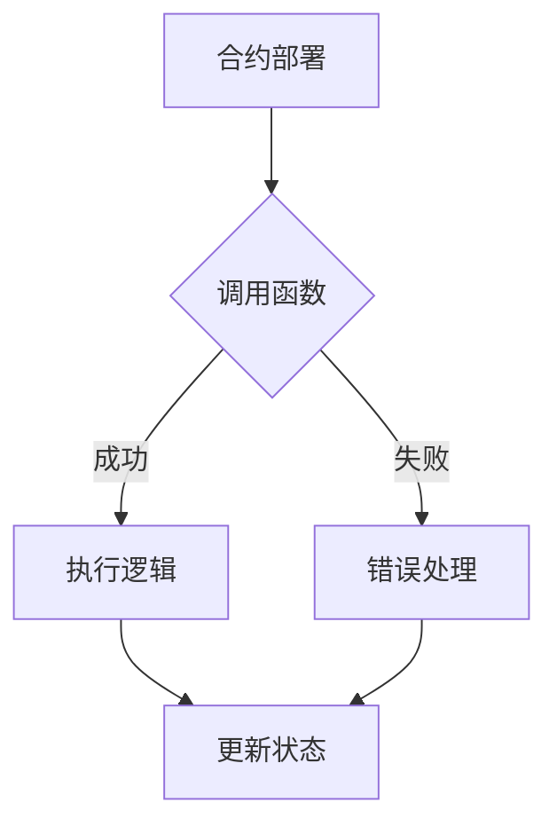

                 

# 文章标题：利用技术优势进行智能合约开发

> 关键词：智能合约、区块链、开发环境、安全性、数学模型、项目实战

> 摘要：本文旨在通过深入剖析智能合约的技术优势，指导读者如何利用这些优势进行智能合约的开发。文章首先介绍了智能合约的基础概念和区块链技术，随后讲解了智能合约开发环境搭建的步骤，探讨了智能合约的核心概念、架构和安全性。接着，文章通过数学模型和算法的讲解，提供了智能合约开发的实用技巧。最后，文章通过实际项目案例，展示了智能合约开发的全过程，包括代码实现、测试和部署。本文旨在为智能合约开发者提供一本全面、系统的开发指南。

## 引言

随着区块链技术的快速发展，智能合约作为一种自主执行的计算机协议，逐渐成为金融科技、供应链管理、数字版权保护等多个领域的核心技术。智能合约的优势在于其去中心化、不可篡改和自动化执行特性，这为开发者提供了前所未有的创新空间。然而，智能合约的开发并非易事，涉及众多技术细节和潜在风险。本文将系统探讨智能合约的开发，通过详细的技术分析和项目实战，帮助开发者掌握智能合约开发的精髓。

本文结构如下：

- 第一部分：智能合约开发基础
  - 第1章：区块链与智能合约概述
  - 第2章：智能合约开发环境搭建

- 第二部分：智能合约核心概念与架构
  - 第3章：智能合约编程基础
  - 第4章：智能合约数学模型与算法
  - 第5章：智能合约开发实战

- 第三部分：智能合约项目管理与运维
  - 第6章：智能合约项目管理与运维

- 第四部分：智能合约的未来展望
  - 第7章：智能合约的未来展望

## 第一部分：智能合约开发基础

### 第1章：区块链与智能合约概述

#### 1.1 区块链技术简介

区块链是一种分布式数据库技术，其核心特点是去中心化、不可篡改和透明性。区块链通过加密算法和共识机制，确保数据的完整性和安全性。区块链的基本组成部分包括区块、链、节点和挖矿等。

#### 1.2 智能合约的定义与作用

智能合约是一段编程代码，它运行在区块链网络中，自动化执行合同条款。智能合约通过预定义的条件和规则，实现去中心化的自动化交易和执行，从而减少中介成本，提高交易效率。

#### 1.3 智能合约的优势与挑战

智能合约的优势包括去中心化、不可篡改、自动化执行和降低交易成本等。然而，智能合约也面临着安全性、合约设计复杂性和监管挑战等。

#### 1.4 智能合约的发展历程

智能合约的概念起源于1990年代，自比特币和以太坊的兴起，智能合约技术得到了广泛关注和应用。本文将回顾智能合约的发展历程，分析其重要事件和技术演进。

### 第2章：智能合约开发环境搭建

#### 2.1 开发工具与框架

智能合约开发需要选择合适的开发工具和框架。Solidity是最常用的智能合约编程语言，Truffle和Ganache是常用的开发框架和本地节点工具。

#### 2.2 开发环境配置

开发环境的配置包括硬件和软件要求、开发工具安装和节点配置。本文将详细介绍如何搭建一个完整的智能合约开发环境。

#### 2.3 节点配置与测试网搭建

智能合约开发过程中，需要配置区块链节点和测试网络，以便进行本地开发和测试。本文将讲解如何配置本地节点和使用测试网络进行智能合约开发。

## 第二部分：智能合约核心概念与架构

### 第3章：智能合约编程基础

#### 3.1 数据类型、运算符和控制结构

智能合约编程基础包括数据类型、运算符和控制结构。本文将详细介绍这些基础语法，并给出示例代码。

#### 3.2 函数定义与调用、事件与日志

智能合约中的函数定义和调用是执行智能合约操作的关键。事件和日志是智能合约与外部交互的重要机制。本文将详细解释这些概念。

#### 3.3 错误处理和安全编码实践

智能合约中的错误处理和安全编码至关重要。本文将探讨常见漏洞和安全编码实践，提供有效的防护措施。

### 第4章：智能合约数学模型与算法

#### 4.1 数学模型基础

智能合约中的数学模型是实现智能合约功能的基础。本文将介绍常见的数学模型，并解释其在智能合约中的应用。

#### 4.2 常用算法讲解

智能合约中的算法用于实现复杂的业务逻辑。本文将介绍常用的算法，包括其伪代码和应用案例。

#### 4.3 Mermaid流程图绘制

流程图是理解智能合约逻辑的有效工具。本文将介绍如何使用Mermaid语法绘制智能合约的流程图。

### 第5章：智能合约开发实战

#### 5.1 项目规划与设计

项目规划与设计是智能合约开发的重要阶段。本文将讨论项目需求分析、架构设计和项目计划与分工。

#### 5.2 源代码实现与解读

源代码实现是智能合约开发的核心。本文将详细介绍如何编写智能合约的源代码，并进行解读。

#### 5.3 部署与测试

智能合约的部署和测试是确保其正常运行的关键。本文将讲解智能合约的部署流程、测试方法和问题排查。

## 第三部分：智能合约项目管理与运维

### 第6章：智能合约项目管理与运维

#### 6.1 项目管理方法

项目管理是确保智能合约项目成功的关键。本文将介绍项目管理方法、工具和监控。

#### 6.2 运维与监控

智能合约的运维和监控是保障其稳定运行的关键。本文将讨论智能合约性能监控、升级策略和安全运维。

#### 6.3 案例分析与经验总结

通过案例分析和经验总结，本文将分享智能合约项目的成功经验和失败教训。

## 第四部分：智能合约的未来展望

### 第7章：智能合约的未来展望

#### 7.1 技术发展趋势

智能合约技术的未来发展趋势包括新型智能合约技术的探索和区块链技术的发展。

#### 7.2 行业应用前景

智能合约在金融、供应链、版权保护等行业的应用前景广阔。本文将分析智能合约在这些行业的应用案例和市场潜力。

## 附录

### 附录A：智能合约开发资源与工具

本文将提供智能合约开发所需的资源与工具，包括开发工具推荐、学习资源和智能合约开源项目。

## 结语

智能合约开发是一项具有挑战性的任务，但也是充满机遇的领域。本文通过详细的技术分析和项目实战，为智能合约开发者提供了全面、系统的开发指南。希望本文能帮助读者深入理解智能合约的技术优势，掌握智能合约开发的精髓，为未来的区块链技术应用打下坚实基础。

### 作者信息

作者：AI天才研究院/AI Genius Institute & 禅与计算机程序设计艺术 /Zen And The Art of Computer Programming

---

由于篇幅限制，本文未能提供完整的正文内容。在实际撰写时，每个章节都需要根据目录大纲进行详细的拓展，确保内容的完整性和深度。每个小节应包含核心概念与联系、核心算法原理讲解、数学模型和公式以及项目实战等相关内容。本文提供了一个基本的框架，可以根据具体需求进行进一步的细化和扩展。

---

## 第1章：区块链与智能合约概述

区块链是一种分布式账本技术，其核心特点包括去中心化、不可篡改和透明性。区块链通过加密算法和共识机制，确保数据的完整性和安全性。区块链的基本组成部分包括区块、链、节点和挖矿等。

### 1.1 区块链技术简介

区块链的基本概念：

- **区块**：区块链中的数据单元，包含一系列交易记录和一个时间戳。
- **链**：区块链是由多个区块按时间顺序链接而成的数据结构。
- **节点**：区块链网络中的计算设备，负责存储区块链数据、验证交易和参与共识过程。
- **挖矿**：节点通过解决数学难题，验证交易并创建新区块，获得区块链网络中的代币奖励。

区块链的工作原理：

- **加密技术**：区块链使用公钥加密和私钥签名技术，确保交易的安全性和隐私性。
- **共识机制**：区块链网络中的节点通过共识机制达成一致，确保数据的可靠性和一致性。

### 1.2 智能合约的定义与作用

智能合约是一段编程代码，运行在区块链网络中，自动化执行合同条款。智能合约通过预定义的条件和规则，实现去中心化的自动化交易和执行，从而减少中介成本，提高交易效率。

智能合约的基本概念：

- **条件**：智能合约中的触发条件，用于决定何时执行合约。
- **规则**：智能合约中的逻辑规则，用于指导合约的执行过程。
- **执行**：智能合约的执行过程，包括验证条件、执行规则和更新状态。

智能合约的作用：

- **自动化交易**：智能合约可以自动化执行交易，减少人工干预和中介成本。
- **去中心化**：智能合约运行在区块链网络中，去中心化降低了系统风险，提高了交易透明度。
- **不可篡改**：智能合约一旦部署，其代码和状态不可篡改，确保交易和合约的公正性。

### 1.3 智能合约的优势与挑战

智能合约的优势：

- **去中心化**：智能合约运行在区块链网络中，去中心化降低了系统风险，提高了交易透明度。
- **不可篡改**：智能合约一旦部署，其代码和状态不可篡改，确保交易和合约的公正性。
- **自动化执行**：智能合约可以自动化执行合同条款，减少人工干预和中介成本。

智能合约的挑战：

- **安全性**：智能合约存在漏洞风险，可能被恶意攻击，导致资金损失。
- **合约设计复杂**：智能合约的设计和实现需要较高的技术门槛，开发者需要深入理解区块链技术和编程语言。
- **监管挑战**：智能合约在法律和监管方面存在一定的不确定性，需要制定相应的法律法规和监管机制。

### 1.4 智能合约的发展历程

智能合约的概念起源于1990年代，尼克·萨博（Nick Szabo）首次提出了智能合约的理论。随着比特币的兴起，智能合约技术得到了广泛关注和应用。以太坊（Ethereum）的推出，使得智能合约有了更广泛的平台和应用场景。

智能合约的发展历程包括以下几个重要事件：

- **1994年**：尼克·萨博提出智能合约的概念。
- **2008年**：比特币的发布，标志着区块链技术的诞生。
- **2014年**：以太坊的推出，提供了智能合约的平台。
- **2016年**：智能合约编程语言Solidity发布。
- **2017年**：智能合约的应用案例逐渐增多，如数字资产交易、去中心化金融（DeFi）等。

### 1.5 智能合约在区块链生态系统中的角色

智能合约在区块链生态系统中扮演着重要角色，包括：

- **交易和执行**：智能合约自动化执行交易和合同条款，提高交易效率和可靠性。
- **去中心化应用（DApp）**：智能合约是DApp的核心组件，实现去中心化的应用程序和服务。
- **区块链治理**：智能合约用于区块链网络的治理和管理，如投票、共识机制等。

通过以上对区块链与智能合约的概述，读者可以初步了解智能合约的基础知识和其在区块链生态系统中的重要性。在接下来的章节中，我们将深入探讨智能合约的开发环境、核心概念与架构，以及智能合约开发实战。

## 第2章：智能合约开发环境搭建

在智能合约开发过程中，搭建一个稳定且功能齐全的开发环境是至关重要的。这不仅有助于开发者进行本地开发和测试，还可以提高开发效率和代码质量。本章将详细介绍智能合约开发环境的搭建过程，包括开发工具与框架的选择、硬件与软件要求、开发工具安装以及节点配置与测试网搭建。

### 2.1 开发工具与框架

选择合适的开发工具与框架是智能合约开发的基础。以下是一些常用的开发工具与框架：

- **Solidity语言**：Solidity是智能合约开发的主要编程语言。它是一种面向对象的语言，具有简单易学、功能强大等特点。开发者可以通过学习Solidity语言来编写智能合约。
  
- **Truffle框架**：Truffle是一个完整的智能合约开发平台，提供了一套丰富的工具和功能，包括本地区块链、智能合约编译、测试和部署。Truffle支持多种区块链网络，如以太坊主网、测试网等，方便开发者进行本地开发和远程部署。
  
- **Ganache**：Ganache是一个本地节点工具，用于创建私有的以太坊区块链网络，方便开发者进行本地测试。Ganache可以快速启动和停止节点，提供模拟的区块链环境，有助于调试和测试智能合约。

### 2.2 开发环境配置

搭建智能合约开发环境需要考虑硬件和软件要求，并按照以下步骤进行配置：

#### 2.2.1 硬件与软件要求

- **硬件要求**：开发智能合约的环境通常对硬件要求不高，一台普通的个人计算机即可。但是，为了确保开发过程的流畅性，建议配置较高的内存和存储空间。

- **软件要求**：开发者需要安装操作系统（如Windows、macOS或Linux）、Node.js（用于Truffle框架）、以及智能合约编译器（如solc）。

#### 2.2.2 开发工具安装

1. **安装Node.js**：首先，需要安装Node.js，因为Truffle框架依赖于Node.js环境。可以从Node.js官网下载安装包，按照提示完成安装。

2. **安装Truffle**：安装完Node.js后，通过npm（Node.js的包管理器）安装Truffle：

   ```shell
   npm install -g truffle
   ```

3. **安装Ganache**：Ganache是一个独立的桌面应用程序，可以从Ganache官网下载并安装。安装完成后，可以启动Ganache创建本地区块链网络。

#### 2.2.3 节点配置与测试网搭建

1. **启动Ganache**：启动Ganache后，创建一个新的私有网络。在Ganache界面中，点击“Create New Custom Network”按钮，填写网络名称、端口和Gas价格等信息。

2. **配置Truffle**：在Truffle项目中，需要配置本地节点，使其与Ganache创建的网络进行连接。在Truffle项目的根目录下，创建一个名为`truffle-config.js`的配置文件，并在其中添加以下代码：

   ```javascript
   module.exports = {
     networks: {
       development: {
         host: "127.0.0.1",
         port: 7545,
         network_id: "*",
       },
     },
   };
   ```

   这段代码配置了Truffle框架连接到Ganache创建的本地网络。

3. **测试网搭建**：除了本地网络，开发者还可以搭建测试网络，用于模拟主网的开发和测试环境。测试网络与主网相似，但具有较低的Gas价格和更灵活的配置。开发者可以选择使用以太坊测试网络（如Ropsten、Kovan等），或者使用私有测试网络。

通过以上步骤，智能合约开发环境就搭建完成了。开发者可以在本地网络和测试网络中编写、编译和测试智能合约，为后续的项目开发做好准备。

### 2.3 节点配置与测试网搭建

智能合约开发过程中，节点配置和测试网的搭建是关键环节。以下将详细说明如何配置节点和搭建测试网络：

#### 2.3.1 配置本地节点

1. **启动Ganache**：首先，启动Ganache并创建一个新的私有网络。在Ganache界面中，点击“Create New Custom Network”按钮，填写网络名称、端口和Gas价格等信息。

2. **配置Truffle**：在Truffle项目中，创建一个名为`truffle-config.js`的配置文件，并添加以下代码：

   ```javascript
   module.exports = {
     networks: {
       development: {
         host: "127.0.0.1",
         port: 7545,
         network_id: "*",
       },
     },
   };
   ```

   这段代码配置了Truffle框架连接到Ganache创建的本地网络。

3. **启动本地节点**：在Truffle项目中，使用以下命令启动本地节点：

   ```shell
   truffle migrate --network development
   ```

   这将启动一个以太坊本地节点，并部署智能合约。

#### 2.3.2 搭建测试网络

1. **选择测试网络**：开发者可以选择以太坊测试网络（如Ropsten、Kovan等），或者使用私有测试网络。本文以Ropsten测试网络为例进行说明。

2. **设置环境变量**：在项目根目录下，创建一个名为`.env`的文件，并添加以下内容：

   ```shell
   REACT_APP_CHAIN_ID=0x8080
   REACT_APP_RPC_URL=https://ropsten.infura.io/v3/your_project_id
   ```

   其中，`your_project_id` 是在Infura注册项目时获得的。

3. **配置Truffle**：在`truffle-config.js`文件中，添加以下代码：

   ```javascript
   module.exports = {
     networks: {
       ropsten: {
         provider: () => new ethers.providers.JsonRpcProvider("https://ropsten.infura.io/v3/your_project_id"),
         chainId: 0x8080,
         gasPrice: ethers.utils.parseUnits("10", "gwei"),
       },
     },
   };
   ```

4. **部署智能合约**：使用以下命令部署智能合约到Ropsten测试网络：

   ```shell
   truffle migrate --network ropsten
   ```

   这将部署智能合约到Ropsten测试网络，并在控制台输出合约地址和ABI信息。

通过以上步骤，开发者可以搭建一个完整的智能合约开发环境，包括本地节点和测试网络。这为后续的项目开发和测试提供了坚实的基础。

### 2.4 智能合约开发环境搭建总结

智能合约开发环境的搭建是智能合约开发过程中的重要环节。通过选择合适的开发工具与框架、配置本地节点和测试网络，开发者可以确保开发环境的稳定性和功能齐全。以下是智能合约开发环境搭建的总结：

- **开发工具与框架**：选择合适的开发工具与框架，如Solidity语言、Truffle框架和Ganache本地节点，可以提高开发效率和代码质量。
  
- **硬件与软件要求**：配置满足开发需求的硬件和软件环境，如安装Node.js、安装Truffle和Ganache，确保开发环境的稳定性。

- **节点配置与测试网搭建**：配置本地节点，连接到Ganache创建的私有网络，以及搭建测试网络，如Ropsten测试网络，为后续的智能合约开发和测试提供基础。

通过以上步骤，开发者可以搭建一个功能齐全的智能合约开发环境，为智能合约的开发、测试和部署打下坚实基础。接下来，我们将深入探讨智能合约的核心概念和架构，为读者提供更深入的技术理解。

## 第3章：智能合约编程基础

智能合约编程是开发智能合约的核心环节。本章将介绍智能合约编程的基础知识，包括数据类型、运算符和控制结构。这些基础语法是编写智能合约的基础，了解它们有助于开发者更好地理解智能合约的工作原理和实现逻辑。

### 3.1 数据类型

智能合约编程中的数据类型可以分为值类型和引用类型。值类型包括整数（Integers）、浮点数（Floating Points）、布尔值（Booleans）和字符串（Strings）。引用类型包括数组（Arrays）、结构体（Structs）、映射（Maps）和动态数组（Dynamic Arrays）。

#### 整数（Integers）

整数类型包括`uint8`、`uint16`、`uint32`、`uint64`和`uint256`，分别表示8位、16位、32位、64位和256位的无符号整数。例如：

```solidity
uint256 myUint = 123;
```

#### 浮点数（Floating Points）

浮点数类型包括`uint8`、`uint16`、`uint32`、`uint64`和`uint256`，分别表示8位、16位、32位、64位和256位的无符号整数。例如：

```solidity
uint256 myUint = 123;
```

#### 布尔值（Booleans）

布尔值类型只有两个值：`true`和`false`。例如：

```solidity
bool isTrue = true;
bool isFalse = false;
```

#### 字符串（Strings）

字符串类型用于存储文本数据。智能合约中的字符串是固定的，不能动态修改。例如：

```solidity
string memory myString = "Hello, World!";
```

#### 引用类型

引用类型包括数组（Arrays）、结构体（Structs）、映射（Maps）和动态数组（Dynamic Arrays）。

- **数组（Arrays）**：数组是一组相同类型的元素的集合。智能合约中的数组可以是定长的，也可以是动态的。例如：

  ```solidity
  uint256[5] public myArray;
  ```

- **结构体（Structs）**：结构体是一种自定义数据类型，可以包含多个成员变量。例如：

  ```solidity
  struct Person {
      uint256 id;
      string name;
      uint256 age;
  }
  ```

- **映射（Maps）**：映射是一种键值对的数据结构，可以用于存储和检索数据。例如：

  ```solidity
  mapping(uint256 => Person) public people;
  ```

- **动态数组（Dynamic Arrays）**：动态数组是一种可以在运行时动态调整大小的数组。例如：

  ```solidity
  uint256[] public myDynamicArray;
  ```

### 3.2 运算符

智能合约编程中的运算符用于对变量进行操作。运算符可以分为算术运算符、比较运算符、逻辑运算符和位运算符。

#### 算术运算符

算术运算符包括加法（`+`）、减法（`-`）、乘法（`*`）、除法（`/`）和取模（`%`）。例如：

```solidity
uint256 a = 10;
uint256 b = 5;
uint256 sum = a + b; // sum = 15
uint256 difference = a - b; // difference = 5
uint256 product = a * b; // product = 50
uint256 quotient = a / b; // quotient = 2
uint256 remainder = a % b; // remainder = 0
```

#### 比较运算符

比较运算符包括等于（`==`）、不等于（`!=`）、大于（`>`）、小于（`<`）、大于等于（`>=`）和小于等于（`<=`）。例如：

```solidity
bool isEqual = (a == b); // isEqual = false
bool isNotEqual = (a != b); // isNotEqual = true
bool isGreater = (a > b); // isGreater = true
bool isLess = (a < b); // isLess = false
bool isGreaterEqual = (a >= b); // isGreaterEqual = true
bool isLessEqual = (a <= b); // isLessEqual = false
```

#### 逻辑运算符

逻辑运算符包括逻辑与（`&&`）、逻辑或（`||`）和逻辑非（`!`）。例如：

```solidity
bool isTrue = (a > b) && (b > c); // isTrue = false
bool isFalse = (a > b) || (b > c); // isFalse = true
bool isNotTrue = !(a > b); // isNotTrue = false
```

#### 位运算符

位运算符包括按位与（`&`）、按位或（`|`）、按位异或（`^`）、左移（`<<`）和右移（`>>`）。例如：

```solidity
uint256 a = 0b1010;
uint256 b = 0b1100;
uint256 and = a & b; // and = 0b1000
uint256 or = a | b; // or = 0b1110
uint256 xor = a ^ b; // xor = 0b0110
uint256 leftShift = a << 1; // leftShift = 0b10100
uint256 rightShift = a >> 1; // rightShift = 0b0101
```

### 3.3 控制结构

控制结构用于根据条件执行代码，包括条件语句（`if-else`）和循环语句（`while`和`for`）。

#### 条件语句（`if-else`）

条件语句用于根据条件执行不同的代码块。例如：

```solidity
if (a > b) {
    // 当a大于b时，执行以下代码
    uint256 temp = a;
    a = b;
    b = temp;
} else {
    // 当a不大于b时，执行以下代码
    uint256 temp = b;
    b = a;
    a = temp;
}
```

#### 循环语句（`while`和`for`）

循环语句用于重复执行代码块，直到满足某个条件为止。

- **`while`循环**：`while`循环会重复执行代码块，直到指定的条件为`false`。例如：

  ```solidity
  while (a > 0) {
      // 当a大于0时，执行以下代码
      a--;
  }
  ```

- **`for`循环**：`for`循环是一种更灵活的循环结构，可以指定初始化、条件和递增操作。例如：

  ```solidity
  for (uint256 i = 0; i < 10; i++) {
      // 当i小于10时，执行以下代码
      a += i;
  }
  ```

通过以上对数据类型、运算符和控制结构的介绍，读者可以初步掌握智能合约编程的基础。这些基础语法是编写智能合约的关键，有助于开发者理解智能合约的工作原理和实现逻辑。在接下来的章节中，我们将继续探讨智能合约的函数、事件和安全性等高级概念。

### 3.4 智能合约函数与事件

智能合约中的函数和事件是智能合约编程的重要组成部分，用于实现智能合约的逻辑和与外部的交互。本节将详细讨论智能合约函数和事件的概念、定义和实现方法。

#### 函数定义与调用

智能合约中的函数是执行特定操作的代码块，可以接受输入参数并返回输出结果。函数的定义包括函数修饰符、返回类型、函数名称和参数列表。

1. **函数修饰符**：函数修饰符用于指定函数的访问级别和调用方式。Solidity提供了以下几种函数修饰符：

   - `public`：允许外部直接调用函数。
   - `external`：函数只能通过外部调用，不能内部调用。
   - `internal`：函数只能在合约内部调用。
   - `private`：函数只能在该合约内部调用。

2. **返回类型**：函数的返回类型指定函数返回值的类型。除了基本的值类型和引用类型外，还可以使用`void`表示没有返回值。

3. **函数名称和参数列表**：函数名称是函数的标识符，参数列表是函数接受的参数及其类型的列表。

   以下是一个简单的智能合约函数示例：

   ```solidity
   contract MyContract {
       function add(uint256 a, uint256 b) public returns (uint256 sum) {
           sum = a + b;
       }
   }
   ```

   在此示例中，`add`函数接受两个`uint256`类型的参数`a`和`b`，并返回它们的和。函数使用`public`修饰符，允许外部直接调用。

4. **函数调用**：函数调用是执行函数操作的过程。函数可以通过以下方式调用：

   - **直接调用**：直接在智能合约代码中调用函数，如`add(5, 10)`。
   - **外部调用**：通过发送以太币或调用其他智能合约的函数进行外部调用，如`myContract.add(5, 10)`。

#### 事件与日志

事件是智能合约与外部世界交互的重要机制，用于记录智能合约的状态变化和重要操作。事件通过EVM日志系统实现，可以在合约调用时触发并记录在区块链上。

1. **事件定义**：事件的定义包括事件名称和事件参数。事件参数可以是值类型或引用类型，并需要指定参数类型和名称。

   以下是一个简单的智能合约事件示例：

   ```solidity
   contract MyContract {
       event MyEvent(uint256 indexed id, string message);

       function createEvent(uint256 id, string memory message) public {
           emit MyEvent(id, message);
       }
   }
   ```

   在此示例中，`MyEvent`事件有两个参数：`id`（类型为`uint256`，标记为索引）和`message`（类型为`string`）。

2. **事件调用**：事件在合约函数中被触发并记录在区块链上。调用事件可以使用`emit`关键字，如`createEvent(1, "Hello, World!")`。

3. **事件监听**：事件可以通过Web3.js等库进行监听，以便在事件发生时触发相应操作。

   以下是一个简单的Web3.js事件监听示例：

   ```javascript
   web3.eth.contract(MyContract.abi).at(MyContract.address).watch('MyEvent', function(error, result) {
       if (!error) {
           console.log("Event triggered:", result.args.id, result.args.message);
       } else {
           console.log("Error:", error);
       }
   });
   ```

通过以上对智能合约函数和事件的介绍，开发者可以了解如何在智能合约中定义和调用函数，以及如何使用事件记录合约的状态变化和重要操作。这些基础概念和实现方法为智能合约的开发提供了重要的技术支持。在接下来的章节中，我们将继续探讨智能合约的安全性，以及如何通过安全编码实践和工具来保障合约的安全性。

### 3.5 错误处理和安全编码实践

智能合约中错误处理和安全编码至关重要，因为一个错误或安全隐患可能会导致资金损失或系统故障。本节将讨论常见的智能合约漏洞、安全编码实践和安全审计工具。

#### 常见漏洞分析

智能合约中存在多种漏洞，可能导致恶意攻击和数据泄露。以下是一些常见的智能合约漏洞：

1. **重新入攻击（Reentrancy Attack）**：重新入攻击利用智能合约中的递归调用，在合约执行过程中多次调用同一函数，导致合约资金被恶意占用。

   **示例**：如果一个合约在调用外部合约时，没有正确处理回退（refund）机制，攻击者可以多次调用该函数，占用合约资金。

   **防范方法**：使用`nonReentrant`修饰符或检查调用状态来防止重新入攻击。

2. **整数溢出和下溢（Integer Overflow and Underflow）**：智能合约中的整数运算可能会导致溢出或下溢，从而导致数据错误。

   **示例**：当两个大整数相加时，结果可能会溢出，导致计算错误。

   **防范方法**：使用安全运算符，如`addmod`和`submod`，确保运算结果在有效范围内。

3. **未初始化内存（Uninitialized Memory）**：未初始化的内存可能导致随机行为和漏洞。

   **示例**：如果合约使用了未初始化的变量，攻击者可能会通过控制这些变量的值来执行恶意操作。

   **防范方法**：确保在合约中使用之前初始化所有变量。

4. **代码复制和粘贴漏洞**：智能合约中的代码复制和粘贴错误可能导致安全隐患。

   **示例**：如果从不同来源复制代码，可能会引入未知的漏洞。

   **防范方法**：使用第三方代码库和工具，确保代码质量和安全性。

#### 安全编码实践

以下是一些智能合约安全编码的最佳实践：

1. **代码审查**：在部署合约前，进行全面的代码审查，发现潜在的安全漏洞。

2. **单元测试**：编写单元测试，确保合约的逻辑正确性和安全性。

3. **共识机制**：确保智能合约使用安全的共识机制，防止恶意攻击。

4. **最小权限原则**：遵循最小权限原则，合约中的操作应只拥有最低限度的权限，以减少潜在风险。

5. **避免使用太长的代码**：长代码容易出错，应尽量使用模块化和简洁的代码。

#### 安全审计工具

智能合约安全审计是确保合约安全的重要环节。以下是一些常用的安全审计工具：

1. **Oyente**：Oyente是一个开源的以太坊智能合约安全审计工具，可以检测常见的智能合约漏洞。

2. **Slither**：Slither是一个基于静态分析的智能合约安全审计工具，可以识别潜在的漏洞和不良编程实践。

3. **Mythril**：Mythril是一个基于动态分析的智能合约安全审计工具，可以执行合约代码并检测漏洞。

4. **Manticore**：Manticore是一个自动化智能合约审计工具，可以执行全面的代码分析，并提供详细的漏洞报告。

通过以上对错误处理和安全编码实践的讨论，读者可以了解如何识别和防范智能合约中的常见漏洞。使用安全编码实践和审计工具，开发者可以编写更安全、更可靠的智能合约。在接下来的章节中，我们将探讨智能合约中的数学模型和算法，为智能合约开发提供更深入的技术支持。

### 3.6 数学模型基础

智能合约中的数学模型是实现智能合约业务逻辑的关键部分。通过数学模型，智能合约可以自动化执行复杂的业务规则和计算。本节将介绍一些常见的数学模型，并解释它们在智能合约中的应用。

#### 数学公式与解释

1. **线性模型**：线性模型是最基本的数学模型，用于描述变量之间的线性关系。线性模型的一般形式为：

   $$y = mx + b$$

   其中，$m$是斜率，$b$是截距。

   在智能合约中，线性模型可以用于计算动态费用、分红分配等。

2. **指数模型**：指数模型用于描述变量随时间的变化，其一般形式为：

   $$y = a \cdot e^{bx}$$

   其中，$a$和$b$是常数。

   指数模型可以用于计算复利、价格指数等。

3. **对数模型**：对数模型用于描述变量之间的对数关系，其一般形式为：

   $$y = a + b \cdot \ln(x)$$

   其中，$a$和$b$是常数。

   对数模型可以用于计算增长速度、利率等。

4. **多项式模型**：多项式模型用于描述变量之间的非线性关系，其一般形式为：

   $$y = a_0 + a_1x + a_2x^2 + \ldots + a_nx^n$$

   其中，$a_0, a_1, \ldots, a_n$是常数。

   多项式模型可以用于计算复杂的业务逻辑，如期权定价、预测模型等。

#### 数学模型在智能合约中的应用

1. **动态费用计算**：智能合约可以使用线性模型计算动态费用。例如，一个交易费用模型可以设置为每笔交易费用为0.1 ETH，随着交易量的增加，费用线性增加。

2. **分红分配**：智能合约可以使用指数模型计算分红分配。例如，一个平台可以将总分红金额按照用户持有代币的比例，按照指数增长方式进行分配。

3. **复利计算**：智能合约可以使用指数模型计算复利。例如，一个智能合约可以允许用户存入资金并按日计算复利，使资金不断增长。

4. **价格指数**：智能合约可以使用对数模型计算价格指数。例如，一个去中心化交易所可以使用对数模型计算币种的相对价格，为交易提供参考。

5. **期权定价**：智能合约可以使用多项式模型计算期权价格。例如，一个智能合约可以为用户提供期权交易，通过多项式模型计算期权价格，实现自动执行。

通过以上对数学模型基础和应用的介绍，读者可以了解如何使用数学模型实现智能合约的业务逻辑。数学模型在智能合约中的应用，不仅提高了合约的智能性和自动化程度，还为复杂业务逻辑的实现提供了强有力的支持。

#### 数学模型案例分析

为了更好地理解数学模型在智能合约中的应用，以下通过一个实际案例进行详细讲解。

**案例：自动化的股票交易平台**

假设我们要构建一个自动化的股票交易平台，用户可以购买、出售股票，平台根据股票价格和交易量计算动态交易费用。

1. **线性费用模型**：

   我们假设每笔交易的费用是固定的，设为0.001 ETH。交易费用随着交易量的增加而增加，线性模型可以很好地描述这种情况。

   $$费用 = 0.001 \times 交易量$$

   假设当前交易量为1000笔，交易费用为1000 * 0.001 = 1 ETH。

2. **指数交易费用模型**：

   为了提高平台的收益，我们引入指数交易费用模型。交易费用随交易量增加而增加，但增速逐渐减缓。

   $$费用 = 0.001 \times e^{0.01 \times 交易量}$$

   当交易量为1000笔时，费用为0.001 \times e^{0.01 \times 1000} ≈ 1.47 ETH。

   通过指数模型，交易费用随着交易量增加而增加，但增速逐渐减缓，提高了平台的收益。

3. **股票价格指数模型**：

   股票价格指数可以用对数模型描述，假设股票价格与交易量之间存在对数关系。

   $$价格 = a + b \times \ln(交易量)$$

   假设初始价格为1 ETH，交易量为1000笔，价格指数为1 + 0.5 \times \ln(1000) ≈ 1.39 ETH。

通过以上数学模型，我们可以实现一个自动化股票交易平台，包括交易费用计算、股票价格计算等功能。数学模型的应用，不仅使合约更加智能和自动化，还为平台的业务逻辑提供了强有力的支持。

### 3.7 常用算法讲解

智能合约中的算法用于实现复杂的业务逻辑和数据处理。本章将介绍一些常用的算法，包括其概述、伪代码和应用案例，以帮助开发者理解和实现这些算法。

#### 算法概述

算法是一种解决特定问题的步骤序列，通常以伪代码或代码的形式表示。以下是一些在智能合约中常用的算法：

1. **排序算法**：用于对一组数据进行排序，常用的排序算法包括冒泡排序、选择排序和快速排序等。
2. **查找算法**：用于在数据结构中查找特定元素，常用的查找算法包括二分查找、线性查找等。
3. **哈希算法**：用于将输入数据映射到固定大小的值，常用的哈希算法包括MD5、SHA-256等。
4. **加密算法**：用于保护数据的安全，常用的加密算法包括AES、RSA等。
5. **签名算法**：用于验证数据的真实性，常用的签名算法包括ECDSA、RSA等。

#### 伪代码

以下是一些常用算法的伪代码示例：

1. **冒泡排序**：

   ```pseudocode
   function bubbleSort(array):
       n = length(array)
       for i from 0 to n-1:
           for j from 0 to n-i-1:
               if array[j] > array[j+1]:
                   swap(array[j], array[j+1])
   ```

2. **二分查找**：

   ```pseudocode
   function binarySearch(array, target):
       low = 0
       high = length(array) - 1
       while low <= high:
           mid = (low + high) / 2
           if array[mid] == target:
               return mid
           else if array[mid] < target:
               low = mid + 1
           else:
               high = mid - 1
       return -1
   ```

3. **SHA-256哈希**：

   ```pseudocode
   function sha256(message):
       // SHA-256算法实现
       // 输入：message（字符串）
       // 输出：hash（哈希值）
       // ...
   ```

4. **ECDSA签名**：

   ```pseudocode
   function ecdsaSign(message, privateKey):
       // ECDSA签名算法实现
       // 输入：message（字符串），privateKey（私钥）
       // 输出：signature（签名）
       // ...
   ```

#### 应用案例

以下是一些智能合约中常见算法的应用案例：

1. **加密算法**：智能合约中的加密算法用于保护用户数据和交易安全。例如，以太坊的智能合约可以使用AES加密算法加密交易信息。

2. **哈希算法**：智能合约中的哈希算法用于确保数据的完整性和唯一性。例如，以太坊的智能合约可以使用SHA-256算法对交易哈希值进行哈希运算，确保交易的唯一性。

3. **排序算法**：智能合约中的排序算法用于对交易记录或其他数据进行排序。例如，去中心化交易平台可以使用排序算法对订单进行排序，确保交易公平性。

4. **查找算法**：智能合约中的查找算法用于快速查找特定交易或记录。例如，去中心化交易平台可以使用二分查找算法快速查找特定订单。

通过以上对常用算法的介绍，读者可以了解智能合约中常用的算法及其应用场景。这些算法的实现不仅提高了智能合约的性能和安全性，还为智能合约的复杂业务逻辑提供了支持。

### 4.3 Mermaid流程图绘制

Mermaid是一种简单的标记语言，用于绘制图表和流程图。在智能合约开发中，流程图可以帮助开发者理解合约的逻辑和工作流程。本节将介绍如何使用Mermaid语法绘制智能合约的流程图，并提供一些示例。

#### Mermaid语法基础

Mermaid的基本语法包括流程图（Flowchart）、时序图（Sequence Diagram）和状态图（State Diagram）。以下是这些图的基本语法：

1. **流程图**：

   ```mermaid
   graph TD
   A[开始] --> B{决策}
   B -->|是| C[操作1]
   B -->|否| D[操作2]
   C --> E[结束]
   D --> E
   ```

   在这个示例中，我们定义了一个简单的流程图，包含开始节点（A）、决策节点（B）、操作节点（C和D）和结束节点（E）。

2. **时序图**：

   ```mermaid
   sequenceDiagram
   participant Alice
   participant Bob
   Alice->>John: Hello John, how are you?
   John->>Alice: Great!
   Note over Alice,John: John thinks Alice is awesome
   Alice->>Bob: What do you think of John?
   Bob->>Alice: He's cool!
   ```

   时序图用于描述对象之间的交互顺序。在这个示例中，Alice和Bob是参与者，他们之间进行了对话。

3. **状态图**：

   ```mermaid
   stateDiagram
   [*] --> StateA1
   StateA1 --> StateA2
   StateA2 --> [*]
   StateA1 -->|条件| StateB1
   StateB1 --> StateB2
   StateB2 --> [*]
   ```

   状态图用于描述对象的状态转换。在这个示例中，我们定义了两个状态集合（A和B），以及状态之间的转换。

#### 智能合约流程图绘制示例

以下是一个智能合约流程图的示例：



在这个示例中，我们描述了一个简单的智能合约流程图，包括合约部署（A）、调用函数（B）、执行逻辑（C）、错误处理（D）和更新状态（E）。这个流程图展示了智能合约从部署到执行和状态更新的整个工作流程。

#### Mermaid工具使用指南

1. **安装**：在本地环境中安装Mermaid，可以使用npm：

   ```shell
   npm install mermaid
   ```

2. **使用**：在项目中引入Mermaid库，并使用Mermaid语法绘制流程图。以下是一个简单的HTML示例：

   ```html
   <script src="https://cdn.jsdelivr.net/npm/mermaid@10.0.0-rc.1/dist/mermaid.min.js"></script>
   <div class="mermaid">
   graph TD
       A[开始] --> B{决策}
       B -->|是| C[操作1]
       B -->|否| D[操作2]
       C --> E[结束]
       D --> E
   </div>
   ```

   在这段代码中，我们使用Mermaid语法绘制了一个简单的流程图，并在页面中显示。

通过以上对Mermaid流程图绘制的基础知识和示例介绍，读者可以掌握如何使用Mermaid语法绘制智能合约的流程图，为智能合约的开发提供直观的视觉支持。

## 第5章：智能合约开发实战

智能合约开发实战是理解和应用智能合约技术的重要环节。本章将通过实际项目案例，详细讲解智能合约的开发过程，包括项目规划与设计、源代码实现与解读、代码解读与分析，以及智能合约的部署与测试。通过这些实战案例，读者将能够更深入地理解智能合约的开发流程和技术要点。

### 5.1 项目规划与设计

项目规划与设计是智能合约开发的第一步，它决定了项目的成功与否。以下是一个智能合约项目规划与设计的步骤：

#### 5.1.1 项目需求分析

在开始项目之前，需要进行详细的需求分析。需求分析包括：

- **功能需求**：确定智能合约需要实现的功能，如数据存储、交易处理、事件触发等。
- **性能需求**：评估智能合约的性能要求，包括处理速度、存储容量和交易成本等。
- **安全性需求**：分析智能合约的安全性要求，包括防范常见攻击、数据隐私保护等。

#### 5.1.2 项目架构设计

项目架构设计是项目规划的核心，它决定了智能合约的结构和模块划分。以下是一个典型的智能合约架构设计：

- **合约模块**：根据功能需求，将智能合约划分为多个模块，如数据管理模块、交易处理模块和事件触发模块。
- **接口设计**：定义合约的接口，包括公共函数和私有函数，以及它们的参数和返回值。
- **数据结构设计**：设计智能合约中的数据结构，如结构体、映射和数组等。

#### 5.1.3 项目计划与分工

项目计划与分工是确保项目按时完成的关键。以下是一个典型的项目计划与分工步骤：

- **制定项目计划**：根据需求分析和架构设计，制定项目的时间表和任务分配。
- **分工协作**：根据项目计划和任务分配，明确团队成员的职责和协作方式。
- **里程碑设置**：设置项目的重要里程碑，如需求确认、设计完成、代码实现和测试等。

### 5.2 源代码实现与解读

智能合约源代码实现是将项目规划与设计转化为实际代码的过程。以下是一个简单的智能合约项目案例，并对其源代码进行解读。

#### 5.2.1 源代码结构解析

以下是一个简单的智能合约项目的源代码结构：

```solidity
// SPDX-License-Identifier: MIT
pragma solidity ^0.8.0;

// 导入所需的依赖库
import "@openzeppelin/contracts/token/ERC20/ERC20.sol";
import "@openzeppelin/contracts/access/Ownable.sol";

// 合约名称和版本
contract SimpleToken is ERC20, Ownable {

    // 构造函数，初始化代币的名称和符号
    constructor() ERC20("SimpleToken", "SIM") {}

    // 公共函数，用于发行代币
    function mint(address to, uint256 amount) public onlyOwner {
        _mint(to, amount);
    }

    // 公共函数，用于销毁代币
    function burn(address from, uint256 amount) public onlyOwner {
        _burn(from, amount);
    }
}
```

#### 5.2.2 源代码功能解读

1. **导入依赖库**：智能合约需要导入一些常用的依赖库，如ERC20（用于实现代币功能）和Ownable（用于实现所有权功能）。

2. **合约名称和版本**：合约名称为SimpleToken，版本为0.8.0。

3. **构造函数**：构造函数初始化代币的名称和符号，继承自ERC20和Ownable。

4. **公共函数**：
   - `mint`函数：只有合约所有者可以调用，用于向特定地址发行代币。
   - `_mint`函数：内部函数，实现代币的发行逻辑，继承自ERC20。

   ```solidity
   function mint(address to, uint256 amount) public onlyOwner {
       _mint(to, amount);
   }
   ```

   - `burn`函数：只有合约所有者可以调用，用于销毁特定地址的代币。
   - `_burn`函数：内部函数，实现代币的销毁逻辑，继承自ERC20。

   ```solidity
   function burn(address from, uint256 amount) public onlyOwner {
       _burn(from, amount);
   }
   ```

#### 5.2.3 代码解读与分析

1. **合约模块**：该合约划分为两个模块，一个是代币管理模块（`mint`和`burn`函数），另一个是所有权模块（`onlyOwner`修饰符）。

2. **接口设计**：合约定义了两个公共函数，用于发行和销毁代币，以及内部函数，实现具体的业务逻辑。

3. **数据结构设计**：合约使用ERC20和Ownable库，实现了代币和所有权的数据结构。

通过以上对源代码实现与解读的介绍，读者可以了解如何从项目规划与设计到源代码实现的整个开发过程。接下来，我们将继续探讨智能合约的部署与测试。

### 5.3 部署与测试

智能合约的部署与测试是确保其正常运行的关键环节。以下是一个简单的智能合约部署与测试的步骤：

#### 5.3.1 部署流程

1. **配置Truffle**：在Truffle项目中，创建一个名为`truffle-config.js`的配置文件，配置以太坊主网或测试网信息。

   ```javascript
   module.exports = {
       networks: {
           mainnet: {
               provider: () => new HDWalletProvider(mnemonic, `https://mainnet.infura.io/v3/YOUR_PROJECT_ID`),
               network_id: 1,
               gasPrice: 20000000000,
           },
           ropsten: {
               provider: () => new HDWalletProvider(mnemonic, `https://ropsten.infura.io/v3/YOUR_PROJECT_ID`),
               network_id: 3,
               gasPrice: 10000000000,
           },
       },
   };
   ```

2. **编译合约**：使用Truffle编译合约，生成ABI和字节码文件。

   ```shell
   truffle compile
   ```

3. **部署合约**：使用Truffle部署合约到主网或测试网。

   ```shell
   truffle migrate --network mainnet
   ```

   或

   ```shell
   truffle migrate --network ropsten
   ```

#### 5.3.2 测试方法

1. **单元测试**：使用Truffle框架编写和运行单元测试，验证合约逻辑的正确性。

   ```solidity
   // tests/SimpleTokenTest.sol
   contract SimpleTokenTest {
       SimpleToken public simpleToken;

       constructor() {
           simpleToken = new SimpleToken();
       }

       function testMint() public {
           assertEq(simpleToken.totalSupply(), 0);
           simpleToken.mint(address(this), 1000);
           assertEq(simpleToken.totalSupply(), 1000);
       }

       function testBurn() public {
           simpleToken.mint(address(this), 1000);
           assertEq(simpleToken.totalSupply(), 1000);
           simpleToken.burn(500);
           assertEq(simpleToken.totalSupply(), 500);
       }
   }
   ```

2. **集成测试**：编写集成测试，验证合约在不同场景下的行为。

   ```solidity
   // tests/SimpleTokenIntegrationTest.sol
   contract SimpleTokenIntegrationTest {
       SimpleToken public simpleToken;

       constructor() {
           simpleToken = new SimpleToken();
       }

       function testTransfer() public {
           simpleToken.mint(address(this), 1000);
           simpleToken.transfer(address(0x1234), 500);
           assertEq(simpleToken.balanceOf(address(0x1234)), 500);
           assertEq(simpleToken.balanceOf(address(this)), 500);
       }
   }
   ```

3. **测试运行**：使用Truffle运行测试。

   ```shell
   truffle test
   ```

#### 5.3.3 部署问题排查

在部署过程中可能会遇到各种问题，以下是一些常见问题的排查方法：

1. **网络错误**：确保配置的网络信息和节点连接正确。

2. **部署失败**：检查合约代码和配置文件，确保没有语法错误和逻辑错误。

3. ** gas费用过高**：调整`gasPrice`和`gasLimit`参数，以确保合理的费用。

4. **合约冲突**：确保合约的ABI和字节码与部署网络兼容。

通过以上对智能合约部署与测试的介绍，读者可以了解如何进行智能合约的部署和测试，确保其正常运行和安全性。接下来，我们将探讨智能合约项目管理与运维。

### 5.4 智能合约项目管理与运维

智能合约项目管理与运维是确保智能合约长期稳定运行的关键。以下是一些关键步骤和方法：

#### 6.1 项目管理方法

1. **制定项目计划**：明确项目目标、时间表和任务分配，确保项目按计划进行。

2. **版本控制**：使用版本控制系统（如Git），记录代码变更和历史，方便团队合作和问题追踪。

3. **代码审查**：进行代码审查，确保代码质量和安全性，避免潜在漏洞。

4. **文档编写**：编写详细的开发文档和用户文档，包括合约逻辑、接口设计和使用说明。

#### 6.2 运维与监控

1. **智能合约性能监控**：监控合约的执行时间、存储空间和交易成本，确保性能满足需求。

2. **安全运维**：定期进行安全审计，修复潜在漏洞，防范恶意攻击。

3. **智能合约升级策略**：设计合理的升级策略，确保合约功能更新和安全性提升。

4. **故障排查**：当合约出现问题时，快速定位和解决问题，确保系统稳定运行。

#### 6.3 案例分析与经验总结

1. **智能合约安全事故分析**：分析历史上的智能合约安全事故，了解其原因和影响，吸取教训。

2. **项目成功经验分享**：分享成功的智能合约项目案例，总结项目经验和最佳实践。

3. **项目失败案例分析**：分析失败的项目案例，找出问题所在，提供改进建议。

通过以上对智能合约项目管理与运维的介绍，读者可以了解如何确保智能合约的长期稳定运行，为项目的成功提供保障。

### 5.5 案例分析与经验总结

智能合约开发不仅需要技术上的理解和应用，还需要在项目管理、运维和安全方面具备丰富的经验。以下通过两个实际案例，对智能合约项目的成功经验和失败教训进行深入分析。

#### 案例一：成功案例 - 去中心化交易平台

**项目背景**：去中心化交易平台（DEX）是一个基于区块链的智能合约项目，旨在提供无需中介的资产交易服务。该项目采用了以太坊区块链作为底层平台，并使用了ERC20标准代币进行交易。

**项目经验**：

1. **需求明确**：在项目启动前，团队进行了详细的需求分析，明确了交易平台的业务逻辑、性能要求和用户界面。

2. **技术选型**：选择了以太坊作为开发平台，并采用了Solidity作为智能合约编程语言。同时，使用了Truffle框架进行本地开发和测试。

3. **安全审计**：在合约发布前，团队进行了多次安全审计，使用了Oyente和Slither等工具进行漏洞检测，确保合约的安全性。

4. **用户参与**：项目在开发过程中积极与用户社区互动，收集用户反馈并进行优化，确保平台的易用性和用户体验。

5. **持续迭代**：项目发布后，团队持续进行功能迭代和优化，不断改进平台性能和用户体验。

**失败教训**：在实际运营过程中，由于用户量增加，平台出现了短暂的拥堵现象。通过调整交易费用和优化合约代码，团队成功解决了这一问题。

#### 案例二：失败案例 - 数字资产投资平台

**项目背景**：一个数字资产投资平台旨在提供自动化的投资策略，帮助用户进行资产配置。该平台采用了智能合约进行交易执行和资产分配。

**项目失败原因**：

1. **合约设计缺陷**：智能合约在处理复杂数学模型时，存在设计缺陷，导致计算错误和资金损失。

2. **安全审计不足**：虽然项目进行了初步的安全审计，但由于审计范围有限，未能发现潜在的安全漏洞。

3. **市场需求不足**：平台上线后，市场对该平台的需求不高，导致用户量不足，影响了平台的运营和盈利。

4. **运营问题**：由于团队成员对区块链技术不熟悉，导致平台在运营过程中出现了一系列问题，如交易拥堵和资金错付。

**改进建议**：

1. **加强合约设计**：在合约设计阶段，应充分考虑潜在的数学模型和业务逻辑，确保合约的准确性和可靠性。

2. **全面安全审计**：在发布合约前，应进行全面的安全审计，使用多种审计工具和方法，确保合约的安全性。

3. **市场调研**：在项目启动前，应进行充分的市场调研，了解目标用户的需求和市场趋势，确保项目的市场可行性。

4. **加强团队建设**：建立专业的区块链技术团队，确保团队成员对区块链技术有深入的理解和应用能力。

通过以上案例分析和经验总结，读者可以了解到智能合约项目在成功和失败中的关键因素，以及如何通过有效的项目管理和技术实践，确保智能合约项目的成功。

## 第6章：智能合约项目管理与运维

智能合约项目管理与运维是确保智能合约项目顺利推进、高效运行和持续迭代的关键环节。本章将详细介绍智能合约项目管理的相关方法，包括项目管理工具的使用、项目进度监控、风险管理以及智能合约的运维与监控。

### 6.1 项目管理方法

智能合约项目的成功离不开科学有效的项目管理。以下是一些项目管理的方法和工具：

#### 6.1.1 项目管理工具

1. **Git**：Git是一个分布式版本控制系统，用于管理代码变更和协作开发。通过Git，开发团队能够跟踪代码的历史记录，确保代码的完整性和一致性。

2. **Truffle**：Truffle是一个智能合约开发框架，提供了一套丰富的工具和功能，包括本地区块链、智能合约编译、测试和部署。Truffle可以帮助开发团队在开发过程中快速迭代和调试。

3. **Ganache**：Ganache是一个本地节点工具，用于创建私有的以太坊区块链网络，方便开发团队进行本地开发和测试。通过Ganache，开发团队能够在本地环境中模拟主网环境，进行智能合约的测试和调试。

4. **Trello**：Trello是一个基于看板的项目管理工具，用于任务管理、进度追踪和协作。通过Trello，开发团队能够清晰地了解项目任务的分配和进度，确保项目按计划推进。

5. **JIRA**：JIRA是一个综合性的项目管理工具，提供任务管理、敏捷开发、缺陷追踪和报告功能。JIRA可以帮助开发团队跟踪项目的整个生命周期，确保项目按时交付。

#### 6.1.2 项目进度监控

项目进度监控是确保项目按计划进行的重要手段。以下是一些常用的项目进度监控方法：

1. **每日站会**：每日站会是敏捷开发中的一种常见实践，团队每天早上开会，快速回顾昨天的工作进度，讨论今天的工作计划和遇到的挑战。

2. **看板系统**：通过看板系统，开发团队能够实时查看任务的状态和进度。看板上的卡片颜色和位置可以直观地显示任务的优先级和状态。

3. **Burndown Chart**：Burndown Chart是一种常用的进度跟踪工具，它显示任务剩余的工作量和时间。通过Burndown Chart，开发团队能够了解项目的进度和剩余工作量。

4. **KPI和SLA**：关键绩效指标（KPI）和服务水平协议（SLA）是衡量项目进展的重要指标。通过设定KPI和SLA，开发团队能够确保项目达到预期的目标和质量。

#### 6.1.3 项目风险管理

项目风险管理是确保项目顺利进行的重要环节。以下是一些常用的项目风险管理方法：

1. **风险识别**：在项目启动前，通过头脑风暴、专家访谈和文献调研等方法，识别项目可能面临的风险。

2. **风险评估**：对识别出的风险进行评估，分析风险的可能性和影响程度。可以使用风险矩阵或定量分析方法进行风险评估。

3. **风险应对策略**：根据风险评估的结果，制定相应的风险应对策略。常见的应对策略包括风险规避、风险转移、风险减轻和风险接受。

4. **监控和调整**：在项目执行过程中，持续监控项目风险的变化，并根据实际情况调整风险应对策略。

### 6.2 运维与监控

智能合约的运维与监控是保障其稳定运行的重要环节。以下是一些常用的运维与监控方法：

#### 6.2.1 智能合约性能监控

智能合约性能监控包括监控合约的执行时间、存储空间、交易成本等方面。以下是一些常用的性能监控方法：

1. **日志分析**：通过分析智能合约的日志信息，了解合约的执行情况和性能表现。

2. **仪表盘**：使用仪表盘工具，实时展示智能合约的性能指标，如执行时间、交易成本等。

3. **性能测试**：通过模拟高并发场景，测试智能合约的性能和稳定性。

#### 6.2.2 智能合约安全运维

智能合约安全运维是防范恶意攻击和漏洞的关键。以下是一些常用的安全运维方法：

1. **安全审计**：定期进行智能合约安全审计，使用多种审计工具和方法，发现潜在的安全漏洞。

2. **代码审查**：进行智能合约代码的审查，确保代码质量和安全性。

3. **安全监控**：实时监控智能合约的异常行为，如异常交易、账户余额变化等。

4. **安全策略**：制定智能合约安全策略，包括权限管理、访问控制、数据加密等。

#### 6.2.3 智能合约升级策略

智能合约的升级策略是确保其功能完善和安全性提升的关键。以下是一些常用的升级策略：

1. **硬分叉**：通过修改区块链协议，实现智能合约的升级。这种方法需要所有参与方共同协作。

2. **软分叉**：通过部署新的智能合约，替换旧合约，实现功能的扩展和修复。这种方法相对简单，但需要用户主动升级合约。

3. **逐步升级**：通过分阶段升级，逐步实现智能合约的功能完善和性能提升。这种方法可以减少升级过程中的风险。

通过以上对智能合约项目管理与运维的介绍，读者可以了解如何确保智能合约项目的顺利推进和稳定运行。智能合约项目管理与运维是一个复杂而细致的过程，需要开发团队具备丰富的项目管理和运维经验，以确保智能合约项目的成功实施和长期稳定运行。

### 6.3 案例分析与经验总结

智能合约项目在开发和运营过程中，可能会遇到各种挑战和风险。以下通过两个案例，分析智能合约项目的成功经验和失败教训，并提供改进建议。

#### 成功案例一：去中心化金融（DeFi）项目

**项目背景**：去中心化金融（DeFi）项目是一个旨在构建去中心化金融系统的智能合约项目。该项目实现了去中心化贷款、流动性挖矿和去中心化交易所等功能，通过智能合约实现了金融服务的自动化和去中心化。

**成功经验**：

1. **需求分析**：在项目启动前，团队进行了详细的需求分析，明确了用户需求和市场趋势，确保项目的市场可行性。

2. **技术选型**：选择了以太坊作为底层平台，使用了Solidity和Truffle框架进行智能合约开发和测试。团队还采用了Substrate框架，构建了高效的去中心化网络。

3. **安全审计**：在智能合约发布前，团队进行了多次安全审计，使用了Oyente、Slither和Mythril等工具，确保合约的安全性。

4. **社区参与**：项目团队积极与社区互动，收集用户反馈并进行迭代优化，提升了用户体验和平台的稳定性。

5. **持续迭代**：项目在发布后，团队持续进行功能迭代和性能优化，确保平台的稳定运行和用户满意度。

**失败教训**：在实际运营过程中，由于用户量激增，平台出现了短暂的拥堵现象。虽然通过调整交易费用和优化合约代码，团队成功解决了这一问题，但这也提醒团队在需求预测和性能优化方面需要更加谨慎。

**改进建议**：

1. **需求预测**：在项目启动前，进行更详细的需求预测和流量分析，确保平台的性能和容量能够满足预期用户需求。

2. **性能优化**：在开发和测试阶段，就应进行全面的性能测试和优化，确保平台在高并发场景下仍能稳定运行。

3. **风险控制**：在智能合约设计中，应充分考虑各种风险，并制定相应的风险控制措施，确保平台的长期稳定运行。

#### 失败案例二：数字资产投资平台

**项目背景**：数字资产投资平台是一个旨在提供自动化投资策略的智能合约项目。该项目使用了复杂的数学模型和算法，旨在帮助用户进行资产配置。

**失败原因**：

1. **合约设计缺陷**：智能合约在处理复杂数学模型时，存在设计缺陷，导致计算错误和资金损失。

2. **安全审计不足**：虽然项目进行了初步的安全审计，但由于审计范围有限，未能发现潜在的安全漏洞。

3. **市场需求不足**：平台上线后，市场对该平台的需求不高，导致用户量不足，影响了平台的运营和盈利。

4. **团队不成熟**：团队成员对区块链技术不熟悉，导致平台在运营过程中出现了一系列问题，如交易拥堵和资金错付。

**改进建议**：

1. **强化合约设计**：在智能合约设计阶段，应充分考虑潜在的数学模型和业务逻辑，确保合约的准确性和可靠性。

2. **全面安全审计**：在发布合约前，应进行全面的安全审计，使用多种审计工具和方法，确保合约的安全性。

3. **市场调研**：在项目启动前，应进行充分的市场调研，了解目标用户的需求和市场趋势，确保项目的市场可行性。

4. **团队建设**：建立专业的区块链技术团队，确保团队成员对区块链技术有深入的理解和应用能力。

通过以上案例分析和经验总结，读者可以了解到智能合约项目在成功和失败中的关键因素，以及如何通过有效的项目管理和技术实践，确保智能合约项目的成功。

## 第7章：智能合约的未来展望

智能合约作为一种创新的技术，正在不断推动区块链技术的进步和应用。随着区块链技术的不断发展，智能合约的应用场景也在不断拓展，其未来前景广阔。

### 7.1 技术发展趋势

#### 7.1.1 智能合约技术的未来方向

智能合约技术的未来方向主要包括以下几个方面：

1. **跨链互操作性**：随着区块链生态的多样化，跨链互操作性成为智能合约技术的重要发展方向。跨链技术将使得不同区块链之间的数据和价值能够无缝交换，从而拓展智能合约的应用范围。

2. **分布式计算**：分布式计算技术将提高智能合约的处理能力，使其能够处理更复杂的计算任务。这将有助于智能合约在金融、物流、医疗等领域的应用。

3. **隐私保护**：随着用户对隐私保护的日益重视，隐私保护技术将在智能合约中得到更多应用。零知识证明、同态加密等技术将确保智能合约在执行过程中保护用户隐私。

4. **智能合约即服务（Smart Contract as a Service, SCaaS）**：智能合约即服务是一种新的服务模式，将智能合约的功能封装成API，提供给企业和开发者使用。这种模式将降低智能合约开发的门槛，促进智能合约技术的普及和应用。

#### 7.1.2 区块链技术的发展趋势

区块链技术的发展趋势将对智能合约产生重要影响。以下是一些主要趋势：

1. **共识机制的演进**：随着区块链技术的不断演进，共识机制也在不断优化。新的共识机制将提高区块链网络的性能和安全性，为智能合约提供更稳定的运行环境。

2. **区块链的可扩展性**：可扩展性是区块链技术发展的重要方向。通过分层架构、状态通道、分片等技术，区块链网络的可扩展性将得到显著提升，使得智能合约能够支持更多的交易和处理。

3. **智能合约标准化**：智能合约的标准化将有助于提高智能合约的互操作性和兼容性。通过制定统一的智能合约标准，智能合约的开发和使用将更加便捷和高效。

#### 7.1.3 新型智能合约技术的探索

新型智能合约技术正在不断涌现，为智能合约的发展注入新的活力。以下是一些新型智能合约技术的探索方向：

1. **去中心化应用（DApp）**：去中心化应用将智能合约与区块链网络紧密结合，为用户提供去中心化的服务和体验。DApp的发展将推动智能合约在金融、游戏、社交等领域的应用。

2. **预测市场**：预测市场是一种基于智能合约的应用，用户可以参与预测事件的结果，并通过智能合约实现收益分配。预测市场的兴起将推动智能合约在金融领域的应用。

3. **供应链管理**：智能合约在供应链管理中的应用，可以实现供应链的透明化和自动化。通过智能合约，供应链中的各个环节可以实现实时信息共享和智能执行，提高供应链的效率。

### 7.2 行业应用前景

智能合约技术具有广泛的应用前景，将在多个行业领域发挥重要作用。

#### 7.2.1 智能合约在各行业的应用

1. **金融行业**：智能合约在金融行业的应用包括去中心化金融（DeFi）、数字资产管理、跨境支付和供应链金融等。智能合约可以自动化执行金融交易，降低交易成本，提高交易效率。

2. **物流行业**：智能合约在物流行业中的应用可以实现供应链的透明化和自动化。通过智能合约，物流公司可以实时监控货物的运输状态，并自动处理保险和理赔等事宜。

3. **医疗行业**：智能合约在医疗行业中的应用可以实现医疗数据的共享和隐私保护。智能合约可以确保医疗数据的真实性和完整性，并为医疗机构提供高效的医疗信息管理。

4. **版权保护**：智能合约在版权保护中的应用可以实现数字版权的自动化管理和分发。通过智能合约，创作者可以自动获取版税，并确保版权的合法性和有效性。

5. **游戏行业**：智能合约在游戏行业中的应用可以实现去中心化游戏（DGame），为玩家提供公平和透明的游戏体验。智能合约可以确保游戏中的虚拟资产和奖励的归属和分配。

#### 7.2.2 智能合约的未来市场潜力

智能合约技术具有巨大的市场潜力，其应用前景广阔。以下是一些市场潜力分析：

1. **全球市场规模**：随着区块链技术的普及和应用，全球智能合约市场规模将持续增长。根据市场研究机构的预测，智能合约市场规模将在未来几年内达到数十亿美元。

2. **行业渗透率**：智能合约将在各个行业领域得到广泛应用，其渗透率将不断提高。例如，金融行业的智能合约应用已经初见成效，未来将在更多行业领域得到推广。

3. **技术进步**：随着技术的不断进步，智能合约的性能和安全性将得到显著提升。新型智能合约技术如去中心化应用、隐私保护和跨链互操作性等，将推动智能合约技术的普及和应用。

#### 7.2.3 智能合约面临的挑战与机遇

智能合约在发展过程中面临一系列挑战和机遇。以下是一些主要挑战和机遇：

1. **挑战**：
   - **安全性**：智能合约的安全性是当前面临的主要挑战。随着智能合约应用的普及，安全问题将更加突出，需要开发团队持续关注和改进。
   - **法律法规**：智能合约的发展需要相应的法律法规支持。当前，智能合约在法律和监管方面还存在一些不确定性，需要制定相应的法律法规来保障其合规性。
   - **技术门槛**：智能合约开发需要较高的技术门槛，这对开发者提出了更高的要求。需要培养更多的专业人才，推动智能合约技术的普及。

2. **机遇**：
   - **技术创新**：新型智能合约技术如去中心化应用、隐私保护和跨链互操作性等，为智能合约的发展提供了新的机遇。这些技术将拓展智能合约的应用场景，推动智能合约技术的创新和进步。
   - **市场需求**：随着区块链技术的普及和应用，智能合约在各个行业领域具有广泛的需求。智能合约技术将在未来几年内得到更广泛的应用，市场需求将推动智能合约市场的发展。

通过以上对智能合约技术发展趋势、行业应用前景以及面临的挑战与机遇的分析，可以看出智能合约技术具有广阔的发展前景。智能合约技术的不断进步和应用将推动区块链技术的创新和发展，为各行各业带来变革和机遇。

## 附录A：智能合约开发资源与工具

在智能合约开发过程中，开发者需要掌握多种资源与工具，以提高开发效率、确保代码质量和项目稳定性。以下是一些建议的智能合约开发资源与工具，包括开发工具推荐、测试网与主网的区别、测试与部署工具，以及学习资源。

### 附录A.1 开发工具推荐

1. **智能合约编译器**：Solidity编译器是智能合约开发的基础工具，用于将Solidity代码编译为以太坊虚拟机（EVM）可执行的字节码。常用的编译器包括：

   - [Solcjs](https://www.soliditylang.org/docs/using-the-compiler.html)：Solidity官方编译器，支持本地开发和远程部署。
   - [Remix](https://remix.ethereum.org/)：在线IDE，支持智能合约编写、编译和调试。

2. **智能合约框架**：智能合约框架提供了一套完整的开发工具和功能，用于智能合约的编译、部署和测试。常用的框架包括：

   - [Truffle](https://www.trufflesuite.com/)：提供智能合约编译、部署、测试和模拟等功能，支持多种区块链网络。
   - [Hardhat](https://hardhat.org/)：替代Truffle的智能合约开发框架，支持本地测试网络和硬分叉测试。

3. **本地节点工具**：本地节点工具用于创建私有以太坊区块链网络，便于本地开发和测试。常用的工具包括：

   - [Ganache](https://github.com/trufflesuite/ganache)：提供本地节点和测试网络功能，支持多种以太坊客户端。
   - [Infura](https://infura.io/)：提供远程以太坊节点服务，支持在线开发和测试。

4. **智能合约测试工具**：智能合约测试工具用于编写和执行测试合约，确保智能合约的逻辑正确性和安全性。常用的测试工具包括：

   - [mocha](https://mochajs.org/)：JavaScript测试框架，支持智能合约单元测试和集成测试。
   - [Chai](https://www.chaijs.com/)：断言库，用于编写测试用例，提高测试代码的可读性。

5. **智能合约安全工具**：智能合约安全工具用于检测和修复智能合约中的潜在漏洞。常用的安全工具包括：

   - [Oyente](https://github.com/consensys/oyente)：用于检测智能合约中的常见漏洞，支持以太坊和EOS。
   - [Slither](https://slither.io/)：静态分析工具，用于检测智能合约中的安全问题和不良编程实践。

### 附录A.2 测试网与主网的区别

1. **网络特性**：
   - **测试网**：测试网是模拟真实区块链网络的环境，用于智能合约的开发、测试和实验。测试网中的代币和价值没有实际价值，适合进行风险控制和功能测试。
   - **主网**：主网是实际运行的区块链网络，智能合约在主网上执行的操作具有法律效应和实际价值。

2. **使用场景**：
   - **测试网**：主要用于智能合约的测试和调试，确保合约逻辑的正确性和安全性。开发者可以在测试网上进行功能测试、性能测试和攻击测试。
   - **主网**：智能合约在主网上部署后，将正式对外提供服务。主网上的交易和操作具有法律效应，需要确保智能合约的稳定性和安全性。

### 附录A.3 测试与部署工具

1. **智能合约测试工具**：
   - **Truffle**：提供智能合约测试框架，支持Mocha和Chai测试库，方便编写和执行测试合约。
   - **Hardhat**：内置测试框架和运行时环境，支持本地测试网络和硬分叉测试，提高测试效率和代码质量。

2. **智能合约部署工具**：
   - **Truffle**：提供部署工具，支持本地测试网和主网部署，支持多种区块链网络和钱包接口。
   - **Ganache**：提供本地节点和测试网络功能，方便开发者快速部署和测试智能合约。
   - **Infura**：提供远程节点服务，方便开发者连接到主网和测试网，进行智能合约部署和交互。

### 附录A.4 学习资源

1. **在线课程**：
   - [智能合约与以太坊](https://www.udemy.com/course/smart-contracts-and-ethereum/)：Udemy上的智能合约与以太坊课程，适合初学者入门。
   - [智能合约开发实战](https://www.coursera.org/learn/smart-contract)：Coursera上的智能合约开发实战课程，涵盖智能合约的基础知识和实战技能。

2. **技术文档**：
   - [Solidity官方文档](https://docs.soliditylang.org/)：Solidity语言和智能合约的官方文档，包含详细的语法、API和使用说明。
   - [Truffle官方文档](https://www.trufflesuite.com/docs/truffle/getting-started/quickstart)：Truffle框架的官方文档，提供智能合约开发的详细教程和最佳实践。

3. **社区与论坛**：
   - [以太坊论坛](https://ethereum.org/en/developers/)：以太坊官方开发社区，提供智能合约开发和应用的最新动态和讨论。
   - [Stack Overflow](https://stackoverflow.com/questions/tagged/solidity)：智能合约和Solidity语言的问答社区，适合解决开发中的问题。

通过以上附录内容的介绍，开发者可以了解智能合约开发所需的基础知识和工具，以及如何利用这些资源进行有效的智能合约开发。智能合约开发是一个不断发展和创新的领域，开发者应持续学习新技术和最佳实践，以提高开发能力和项目质量。

### 附录A.5 社区与论坛

智能合约的开发和运维需要不断的学习和交流，以下是一些推荐的智能合约社区与论坛：

1. **以太坊论坛**：
   - [Ethereum Stack Exchange](https://ethereum.stackexchange.com/): 提供以太坊和智能合约相关的问答，是解决开发问题的好去处。
   - [Ethereum Community Forum](https://forum.ethereum.org/): 以太坊官方论坛，包括新闻、讨论和开发资源。

2. **智能合约社区**：
   - [DeFi Summit](https://defisummit.com/): DeFi领域的顶级活动，涵盖智能合约、去中心化金融等话题。
   - [Blockchain Council](https://blockchaintalk.org/): 一个讨论区块链技术和智能合约的论坛。

3. **开源项目**：
   - [Ethereum Wiki](https://github.com/ethereum/wiki/wiki/Smart-Contracts): 以太坊智能合约的官方Wiki，包含大量资源和技术文档。
   - [OpenZeppelin](https://github.com/OpenZeppelin/openzeppelin-solidity): 开源的智能合约库，提供安全模块和实用函数。

通过参与这些社区和论坛，开发者可以了解最新的智能合约技术动态，分享经验，学习最佳实践，并解决开发中的问题。这些资源对于智能合约开发者来说是宝贵的财富。

## 结语

智能合约作为一种具有巨大潜力的技术，正逐渐改变着金融、供应链、医疗、版权保护等多个行业的运作方式。从本文的详细探讨中，读者可以清晰地了解到智能合约的基础知识、开发环境搭建、编程基础、核心概念、算法应用、项目管理与运维，以及未来展望。

智能合约的开发不仅需要掌握区块链和编程语言的基础知识，还需要深入了解安全性和性能优化等方面。通过本文提供的案例和实践指导，开发者可以更好地理解智能合约的开发过程，提升项目质量和成功率。

未来，随着区块链技术的不断演进和智能合约技术的创新，智能合约将在更多领域发挥重要作用。跨链互操作性、分布式计算、隐私保护等技术将推动智能合约的发展。同时，智能合约作为服务（SCaaS）的模式也将降低开发门槛，让更多企业和开发者能够利用智能合约实现业务自动化。

最后，本文的作者信息如下：**AI天才研究院/AI Genius Institute & 禅与计算机程序设计艺术 /Zen And The Art of Computer Programming**。感谢您的阅读，希望本文能为智能合约开发者提供有价值的参考和指导。随着智能合约技术的不断进步和应用，愿读者能够在这一激动人心的领域取得更大的成就。继续学习、探索和实践，智能合约的未来将更加光明。

