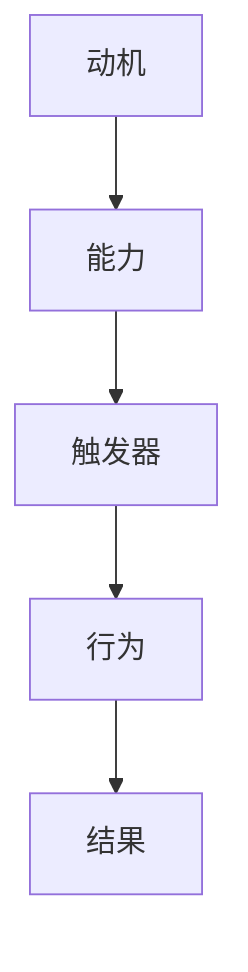

                 

### 《利用福格行为模型改善团队习惯》

> **关键词：福格行为模型、团队习惯、动机、能力、触发器、行为干预**

> **摘要：本文将深入探讨福格行为模型及其在团队习惯改善中的应用。通过分析动机、能力和触发器这三个关键要素，本文旨在提供一个实用的框架，帮助团队识别不良习惯、制定有效的干预策略，并最终培养积极的团队习惯。**

#### 第一部分：福格行为模型概述

##### 第1章：行为科学入门

**1.1 行为科学的起源与历史**

行为科学作为一个跨学科领域，其历史可以追溯到20世纪初。行为科学的诞生源于对人类行为的兴趣，旨在通过实证研究来理解行为背后的动机、环境因素和生理机制。行为科学的主要目标是提供一种综合的方法来研究人类行为，从而为心理学、社会学、经济学、管理学等多个领域提供理论基础和实践指导。

在20世纪初，行为主义的兴起标志着行为科学的开端。行为主义主张通过客观的、可量化的方法来研究行为，而不是关注内在的心理过程。著名行为主义心理学家约翰·华生（John B. Watson）提出了“行为塑造”的概念，即通过正强化和负强化来改变行为。

随着时间的推移，行为科学逐渐发展出多种理论框架和方法，如认知行为理论、社会认知理论等。这些理论不仅在心理学领域得到了广泛应用，也在管理学、教育学、医学等多个领域发挥了重要作用。

**1.2 行为驱动因素：动机、能力与触发器**

行为的发生是由多种因素共同驱动的。在福格行为模型中，动机、能力和触发器是三个关键的行为驱动因素。理解这些因素有助于我们更深入地了解行为背后的机制。

- **动机（Motivation）**：动机是行为发生的第一步，它指的是个体内部的心理状态，驱动个体采取特定行动。动机可以分为内在动机和外在动机。内在动机与个体对活动的兴趣、价值和满意度相关，而外在动机则与外部奖励和惩罚相关。

- **能力（Ability）**：能力是指个体完成特定任务所需的技能和资源。能力是行为发生的必要条件，但并非充分条件。即使个体有强烈的动机，如果缺乏必要的能力，行为也难以实现。

- **触发器（Trigger）**：触发器是指促使个体采取行动的刺激或提示。触发器可以是内部或外部的。例如，一个外部触发器可以是工作日程上的提醒，而内部触发器可以是内心的紧迫感。

**1.3 福格行为模型的概念与理论框架**

福格行为模型（Fogg Behavior Model，简称F-B模型）是由斯坦福大学行为科学家BJ福格（BJ Fogg）提出的，用于解释行为如何发生。F-B模型的核心是三个要素的相互作用：动机（Motivation）、能力（Ability）和触发器（Trigger）。

在F-B模型中，如果动机、能力和触发器同时存在且相互作用，行为就会发生。这个模型不仅适用于个体行为，也可以应用于团队和组织行为。

- **动机（Motivation）**：在团队中，动机可能来自内在的兴趣、对团队目标的认同感、外部奖励（如绩效奖金）等。了解团队成员的动机类型有助于设计激励措施，提升团队的整体动力。

- **能力（Ability）**：团队的能力包括成员的专业技能、资源、协作能力等。通过培训和团队建设活动，可以提高团队的整体能力，从而促进团队行为的改善。

- **触发器（Trigger）**：触发器可以是日常的工作任务、定期的团队会议、团队目标的设定等。设计有效的触发器，可以帮助团队及时采取行动，确保团队目标的实现。

**1.4 福格行为模型在团队中的应用潜力**

福格行为模型为团队习惯的改善提供了理论框架和实际操作指南。通过应用F-B模型，团队可以：

- **识别不良习惯**：通过分析动机、能力和触发器，团队可以识别出导致不良习惯的关键因素，从而有针对性地制定干预策略。

- **制定行为干预策略**：根据F-B模型，团队可以设计动机增强策略、能力提升策略和触发器设计策略，以改善团队习惯。

- **培养积极习惯**：通过持续应用F-B模型，团队可以培养积极的行为习惯，提高工作效率和团队协作水平。

总之，福格行为模型为团队习惯的改善提供了一种系统性、结构化的方法。通过理解行为背后的动机、能力和触发器，团队可以更有效地识别、干预和培养积极的行为习惯。

##### 第2章：福格行为模型的原理与机制

**2.1 动机的心理学基础**

动机是行为科学中的核心概念之一，它解释了个体为何采取特定行动。动机通常可以分为内在动机和外在动机。

- **内在动机**：内在动机来源于个体内心的需求和欲望，与个体对活动的兴趣、价值和满意度相关。例如，一个人因为对编程的兴趣而主动学习新技能，这就是内在动机的体现。内在动机通常具有持久性和自主性，不易受到外界干扰。

- **外在动机**：外在动机则与外部奖励和惩罚相关，例如绩效奖金、表扬或批评等。外在动机通常较为直接，能够迅速影响个体的行为，但持久性较差，一旦外部奖励消失，个体的动机可能会随之减弱。

在团队中，了解成员的动机类型对于制定有效的激励措施至关重要。例如，对于一个注重内在动机的成员，给予自主性和创造性的工作环境可能比物质奖励更能激发其工作热情；而对于一个更注重外在动机的成员，定期的绩效评估和奖励制度可能更为有效。

**2.1.2 动机如何影响行为**

动机是行为发生的驱动力，它通过影响个体的注意力和决策过程来发挥作用。具体来说，动机对行为的影响主要体现在以下几个方面：

- **注意力**：动机会影响个体的注意力分配。当个体有强烈的动机时，他们更容易注意到与目标相关的信息和线索，而忽视与目标无关的信息。例如，一个对项目成功有高度动机的团队成员，可能会更加专注于项目任务，而忽视与任务无关的社交媒体通知。

- **决策过程**：动机还会影响个体的决策过程。高动机的个体更倾向于选择能够实现目标的行为，而低动机的个体则可能更容易被干扰或选择低效的行为。例如，一个对完成任务有高度动机的程序员，可能会优先选择能够高效解决问题的编程方法，而不是选择更容易但效率较低的方法。

- **行为持续性**：动机也影响行为的持续性。具有内在动机的个体通常能够更持久地坚持行为，因为他们对行为本身感兴趣，而不仅仅是为了获得外部奖励。相反，依赖外在动机的个体在面临外部奖励消失时，可能会减少行为的发生频率。

在团队管理中，理解动机如何影响行为有助于制定有效的激励策略。例如，通过设计具有内在激励的工作任务，可以增强团队成员的动机，从而提高工作效率和满意度。

**2.1.3 动机调节策略**

为了提升团队整体动机，可以采用以下几种动机调节策略：

- **内在动机增强**：通过赋予团队成员更多的自主权和责任感，可以增强他们的内在动机。例如，可以给予团队成员项目选择权，让他们能够自主决定项目的方向和目标。

- **外在动机设计**：尽管外在动机不如内在动机持久，但合理的外在动机设计可以迅速提升团队动机。例如，可以通过绩效奖金、奖励休假等方式来激励团队成员。

- **目标设定**：明确且具有挑战性的目标能够提升团队成员的动机。目标应具有具体性、可实现性和时效性，以激发团队成员的积极性和动力。

- **反馈与认可**：及时的反馈和认可能够增强团队成员的动机。管理者应关注团队成员的工作表现，并提供正面的反馈和认可，以增强他们的工作动力。

- **团队文化建设**：通过建立积极向上的团队文化，可以提升团队成员的整体动机。团队文化应强调合作、共享和共同目标，以增强团队成员的归属感和工作热情。

**2.2 能力的心理学基础**

能力是指个体完成特定任务所需的技能和资源。在福格行为模型中，能力是行为发生的必要条件，但并非充分条件。能力可以分为技能和能力。

- **技能（Skill）**：技能是指个体通过学习和实践获得的具体操作能力，例如编程技能、沟通技能等。技能通常可以通过培训、学习和实践经验来提升。

- **能力（Capacity）**：能力则是指个体在心理、生理和情绪等方面具备的完成任务的潜力。能力不仅取决于个体的技能，还受到个性、态度和资源等多种因素的影响。

在团队中，能力是确保任务顺利完成的关键因素。了解团队成员的能力水平，可以更好地分配任务和资源，提高团队整体效率。

**2.2.2 提升能力的策略**

为了提升团队整体能力，可以采用以下几种能力提升策略：

- **培训与学习**：定期组织培训和学习活动，帮助团队成员提升专业技能和知识水平。培训可以采用内部培训和外部培训相结合的方式，以满足团队成员的不同学习需求。

- **经验分享**：鼓励团队成员分享经验和最佳实践，通过知识共享和团队协作来提升整体能力。经验分享可以通过团队会议、内部论坛和小组讨论等形式进行。

- **实践与反馈**：提供实际操作机会，让团队成员在实践中学习和成长。同时，及时给予反馈，帮助团队成员了解自己的优势和不足，进一步改进。

- **资源支持**：确保团队成员能够获得必要的工作资源和支持，包括硬件设备、软件工具和人力资源等。资源支持能够提高团队的工作效率和质量。

- **激励与认可**：通过激励和认可，鼓励团队成员不断提升自身能力。例如，可以设立能力提升奖励计划，对在能力提升方面表现出色的团队成员进行奖励。

**2.2.3 能力在团队习惯改善中的角色**

能力在团队习惯改善中扮演着重要角色。具体来说，能力对团队习惯改善的影响体现在以下几个方面：

- **任务完成质量**：团队整体能力的高低直接影响任务的完成质量。高能力的团队成员能够更高效地完成任务，减少错误和返工，从而提升团队的整体绩效。

- **协作与沟通**：能力均衡的团队更易形成有效的协作和沟通。团队成员之间能力互补，可以更好地分担任务和分享资源，提高团队协作效率。

- **创新能力**：能力提升有助于增强团队的创新能力。团队成员具备更高的技能和知识水平，能够提出更有创意和创新的解决方案，推动团队不断进步。

- **适应变化**：随着环境和任务的变化，团队需要具备快速适应和调整的能力。高能力的团队能够更迅速地适应新情况，应对挑战和变化。

因此，通过提升团队整体能力，可以有效改善团队习惯，提高团队绩效和创新能力。

**2.3 触发器的心理学基础**

触发器是指促使个体采取行动的刺激或提示。在福格行为模型中，触发器是行为发生的直接动因。触发器可以是内部或外部的，具体可以分为以下几种类型：

- **内部触发器**：内部触发器来源于个体内心的需求和欲望，例如自我激励、内心的紧迫感等。内部触发器通常与个体的内在动机相关，可以激发个体的自发性行为。

- **外部触发器**：外部触发器来源于外部环境，例如工作任务、提醒通知、他人期待等。外部触发器通常与个体外在动机相关，可以促使个体按照外部要求采取行动。

了解不同类型的触发器有助于设计有效的行为干预策略，从而推动团队行为的改善。

**2.3.2 如何设计有效的触发器**

设计有效的触发器是行为干预策略的关键步骤。以下是一些设计有效触发器的策略：

- **明确目标与任务**：明确团队的目标和任务，确保触发器与团队目标紧密相关。通过设置具体的任务和目标，可以增强触发器的针对性。

- **利用技术工具**：利用现代技术工具，如提醒软件、任务管理工具等，设计自动化的触发器。这些工具可以根据预设的时间或条件自动发送提醒，帮助团队成员及时采取行动。

- **外部激励**：利用外部激励，如奖励、表扬等，设计激励性的触发器。这些触发器可以激发团队成员的积极性，促进他们完成任务。

- **建立习惯**：通过重复和规律性的行为设计触发器，使其成为团队成员的习惯。例如，定期举行团队会议或项目评估，可以形成稳定的触发器，确保团队定期进行重要的活动和讨论。

**2.3.3 触发器在习惯养成中的作用**

触发器在习惯养成中起着至关重要的作用。有效的触发器能够帮助个体在特定情境下自动执行预定行为，从而逐渐养成良好习惯。

- **增强行为频率**：触发器能够增加个体执行特定行为的频率。通过重复触发，个体可以在短时间内多次执行目标行为，从而加速习惯的养成。

- **减少认知负荷**：触发器简化了行为的执行过程，减少了个体在行为选择上的认知负荷。当触发器与目标行为紧密相关时，个体可以无需思考就采取行动，从而提高行为的持续性。

- **提高行为效率**：有效的触发器能够提高行为的执行效率。例如，定时的提醒通知可以帮助团队成员及时完成任务，减少拖延和时间浪费。

在团队习惯养成中，设计合适的触发器可以起到关键作用。通过明确目标、利用技术工具、提供外部激励和建立习惯，团队可以逐步培养积极的习惯，提高整体绩效。

##### 第3章：福格行为模型的核心概念与联系

**3.1 福格行为模型的 Mermaid 流程图**

为了更直观地展示福格行为模型的核心概念与联系，我们使用Mermaid流程图进行描述。以下是一个简化的福格行为模型Mermaid流程图：

- **A[动机]**：表示个体内部的驱动力量，包括内在动机和外在动机。
- **B[能力]**：表示个体完成特定任务所需的技能和资源。
- **C[触发器]**：表示促使个体采取行动的刺激或提示。
- **D[行为]**：表示个体在动机、能力和触发器共同作用下采取的具体行动。
- **E[结果]**：表示行为带来的结果，可以是积极的结果（如完成任务）或消极的结果（如错误发生）。

**3.2 福格行为模型的应用范围与限制**

福格行为模型在多个领域具有广泛的应用潜力，包括企业管理、健康促进、教育改革等。以下是一些具体应用领域和模型限制：

- **企业管理**：福格行为模型可以用于改善团队管理和提升工作效率。通过分析团队成员的动机、能力和触发器，企业可以设计有效的激励机制、任务分配和项目管理策略，从而提升团队整体绩效。

- **健康促进**：福格行为模型可以用于健康行为干预和疾病预防。例如，通过设计适当的触发器和激励措施，鼓励个体养成健康的饮食习惯、定期锻炼等行为，从而降低患病风险。

- **教育改革**：福格行为模型可以用于提升学生的学习动机和学习效果。通过分析学生的学习动机、能力和触发器，教师可以设计更具吸引力和针对性的教学策略，提高学生的学习积极性和成绩。

然而，福格行为模型也存在一些局限性。首先，模型主要关注行为层面的因素，而忽视了深层次的心理机制和社会环境的影响。其次，模型的应用效果受到个体差异和环境因素的制约，不同个体和情境下的行为表现可能存在较大差异。因此，在实际应用中，需要结合具体情境和个体特点，灵活运用福格行为模型。

总之，福格行为模型提供了一个简洁但实用的框架，用于解释和干预行为。通过深入理解模型的核心概念与联系，可以更好地应用于各种实际场景，提升个体和团队的行为表现。

#### 第二部分：团队习惯改善实践

##### 第4章：识别与评估团队行为习惯

**4.1 团队行为习惯的类型与识别方法**

团队行为习惯是指团队在长期实践中形成的相对稳定的行为模式，这些习惯可能对团队绩效产生显著影响。团队行为习惯可以分为以下几种类型：

- **高效协作习惯**：如定期召开团队会议、共享资源和信息、共同解决问题等。
- **低效协作习惯**：如任务分配不均、信息孤岛、沟通不畅、缺乏明确目标等。
- **积极心态习惯**：如乐观、合作、积极反馈、持续学习等。
- **消极心态习惯**：如悲观、竞争、批评、缺乏目标、逃避责任等。

为了识别和评估团队行为习惯，可以采用以下几种方法：

- **观察法**：通过直接观察团队成员的行为，了解团队在实际工作中的表现。这种方法可以提供直观的反馈，帮助识别不良行为习惯。
- **访谈法**：通过与团队成员进行一对一或小组访谈，收集他们对团队行为习惯的看法和建议。访谈法可以深入了解成员的感受和意见，发现潜在的问题。
- **问卷调查法**：设计问卷，针对团队成员的行为习惯进行量化评估。问卷调查法可以收集大量数据，帮助全面了解团队的行为现状。
- **行为记录法**：记录团队成员在工作中的具体行为，如会议时间、任务完成情况、沟通频率等。这种方法可以提供详细的数据支持，为评估团队行为习惯提供依据。

**4.2 使用福格行为模型评估团队行为习惯**

福格行为模型为评估团队行为习惯提供了一个系统性的方法。通过分析动机、能力和触发器，可以更深入地理解团队行为习惯的形成和影响。

- **动机分析**：了解团队成员的动机类型，是评估团队行为习惯的第一步。通过问卷调查、访谈等方法，收集团队成员的内在动机和外在动机数据。例如，可以通过问卷了解团队成员对工作目标的认同感、对奖励机制的期望等。
- **能力分析**：评估团队成员的能力水平，是分析团队行为习惯的关键。通过技能评估、项目评估等方法，了解团队成员在具体任务中的表现和潜力。例如，可以通过项目评估了解团队成员的沟通能力、协作能力等。
- **触发器分析**：识别和设计触发器，是改善团队行为习惯的重要环节。通过分析团队成员的行为触发因素，可以设计出更有效的触发器，促进积极行为的形成。例如，通过观察团队成员的工作习惯，可以设计出定期的团队会议、任务提醒等触发器。

**4.3 常见团队不良习惯案例分析**

以下是一些常见团队不良习惯及其案例分析：

- **案例一：任务分配不均**

现象：团队中部分成员承担了过多的任务，而其他成员的任务相对较少，导致工作负担不均。

动机分析：部分成员可能因为工作能力和责任心较强，而承担了更多任务；其他成员可能因为能力不足或缺乏动力，导致任务分配不均。

能力分析：承担过多任务的成员可能具备较强的工作能力和责任感，但其他成员可能缺乏相关技能或工作动力。

触发器分析：任务分配不均的触发器可能包括团队成员的沟通不畅、任务分配标准不明确等。

改善策略：通过明确任务分配标准、加强团队成员之间的沟通和协作，可以改善任务分配不均的问题。例如，可以定期召开任务分配会议，确保每个成员都了解任务的具体要求和完成情况。

- **案例二：信息孤岛**

现象：团队内部信息共享不畅，导致信息孤岛现象严重，影响团队协作效率。

动机分析：部分成员可能因为对信息保密或个人利益考虑，不愿意共享信息。

能力分析：团队可能缺乏有效的信息共享机制和工具，导致信息无法及时传达和利用。

触发器分析：信息孤岛的触发器可能包括缺乏定期的团队会议、沟通渠道不畅等。

改善策略：通过建立有效的信息共享机制，如定期的团队会议、共享文档和即时通讯工具等，可以改善信息孤岛现象。例如，可以每周举行一次团队会议，确保所有成员都能够分享最新的信息和进展。

- **案例三：沟通不畅**

现象：团队内部沟通不畅，导致误解和冲突频发，影响团队协作和士气。

动机分析：部分成员可能因为沟通能力不足或对沟通结果的不确定，导致不愿主动沟通。

能力分析：团队可能缺乏有效的沟通培训和工具，导致沟通效率低下。

触发器分析：沟通不畅的触发器可能包括缺乏明确的沟通目标和标准、沟通渠道不畅等。

改善策略：通过加强沟通培训和提供有效的沟通工具，可以改善团队内部的沟通问题。例如，可以定期组织沟通技巧培训，确保团队成员掌握有效的沟通方法；同时，利用即时通讯工具和协作平台，提高沟通效率。

通过以上案例分析，可以看出，团队行为习惯的改善需要从动机、能力和触发器等多个方面进行综合分析。只有深入理解团队行为习惯的成因，才能设计出有效的干预策略，促进团队行为的改善。

##### 第5章：设计有效的行为干预策略

**5.1 确定团队行为干预的目标**

在制定行为干预策略之前，明确干预目标是非常重要的。干预目标应具体、明确，并符合团队的实际需求。以下是一些制定干预目标的方法：

- **目标具体化**：将抽象的目标转化为具体的、可衡量的指标。例如，将“提高团队协作效率”具体化为“每月召开两次团队会议，每次会议讨论关键问题，确保所有成员参与讨论”。
- **目标与团队目标一致**：确保干预目标与团队的整体目标和战略相符。例如，如果团队的目标是“在三个月内完成项目A”，干预目标可以设定为“提高团队成员的项目协作能力和沟通效率，确保项目按时完成”。
- **目标具有可行性**：干预目标应具备实际可行性，考虑到团队资源、时间和能力等因素。例如，如果团队人力资源紧张，设定“每天进行一次团队反思会议”可能过于理想化。

**5.2 制定团队行为干预计划**

制定团队行为干预计划是行为干预策略的核心。一个有效的干预计划应包括以下关键要素：

- **动机增强策略**：通过设计激励措施，提高团队成员的内在和外在动机。具体策略包括：
  - **内在激励**：赋予团队成员更多的自主权和责任感，让他们感受到自己的工作对团队的重要性。例如，可以设立项目主管角色，让成员自主管理项目进度和资源。
  - **外在激励**：提供物质奖励和荣誉表彰，激发团队成员的外在动机。例如，可以设立绩效奖金制度，对在项目中有突出贡献的团队成员进行奖励。

- **能力提升策略**：通过培训和指导，提高团队成员的专业技能和综合能力。具体策略包括：
  - **技能培训**：定期组织技能培训，帮助团队成员提升专业知识和技能。例如，可以邀请外部专家进行编程技巧培训，提高团队的技术水平。
  - **经验分享**：鼓励团队成员分享经验和最佳实践，通过知识共享和团队协作，提高整体能力。例如，可以设立内部论坛，团队成员可以在此分享工作心得和解决方案。

- **触发器设计策略**：设计有效的触发器，促使团队成员采取预定行为。具体策略包括：
  - **目标设定**：明确团队目标和个人目标，制定具体的行动计划。例如，可以设立每月的任务清单，确保团队成员了解自己的工作重点和目标。
  - **提醒机制**：利用技术工具，如提醒软件和任务管理工具，设计自动化的提醒机制。例如，可以使用电子邮件或即时通讯工具，定期发送任务提醒和会议通知。
  - **反馈与激励**：建立反馈和激励机制，鼓励团队成员持续采取积极行为。例如，可以定期进行团队绩效评估，对表现出色的成员给予奖励和表彰。

**5.2.1 动机增强策略**

动机增强策略的核心是提高团队成员的内在和外在动机，从而激发他们的工作热情和积极性。以下是一些具体的动机增强策略：

- **内在激励**：
  - **赋予自主权**：让团队成员参与决策过程，赋予他们自主权。例如，在项目开发中，可以设立产品经理角色，让团队成员参与产品设计和决策。
  - **提供成就感**：确保团队成员能够感受到自己的工作对团队的贡献，提供正面的反馈和认可。例如，可以通过团队会议和内部邮件，表彰成员在工作中的优秀表现。
  - **培养归属感**：通过团队建设和社交活动，增强团队成员的团队归属感。例如，可以定期组织团建活动，加强团队成员之间的沟通和合作。

- **外在激励**：
  - **物质奖励**：提供物质奖励，如奖金、奖品等，激发团队成员的外在动机。例如，可以设立项目奖金制度，对项目成功的关键成员进行奖励。
  - **荣誉表彰**：通过公开表彰和荣誉授予，提高团队成员的荣誉感。例如，可以在公司年会上，对年度优秀员工进行表彰。
  - **职业发展**：提供职业发展机会，如晋升机会、培训机会等，激励团队成员不断提升自己。例如，可以为团队成员提供内部晋升通道，鼓励他们积极参与公司内部培训和项目。

**5.2.2 能力提升策略**

能力提升策略的核心是提高团队成员的专业技能和综合能力，从而提升团队的整体绩效。以下是一些具体的能力提升策略：

- **培训与学习**：
  - **内部培训**：定期组织内部培训，帮助团队成员提升专业技能。例如，可以邀请公司内部有经验的同事进行技术分享和培训。
  - **外部培训**：安排团队成员参加外部培训课程，如行业会议、技术研讨会等。这些课程可以帮助团队成员了解行业最新动态和技术趋势。

- **经验分享**：
  - **内部论坛**：设立内部论坛，鼓励团队成员分享工作心得和最佳实践。例如，可以设立一个在线平台，团队成员可以随时发布自己的经验和见解。
  - **小组讨论**：定期组织小组讨论，鼓励团队成员交流经验，共同解决问题。例如，可以设立每周一次的小组讨论会，讨论项目中的难点和挑战。

- **实践与反馈**：
  - **项目实践**：通过实际项目实践，提升团队成员的实战能力。例如，可以设立项目小组，让团队成员参与具体项目，锻炼他们的项目管理、沟通协作能力。
  - **反馈机制**：建立反馈机制，及时给予团队成员反馈和指导。例如，可以设立项目经理或导师角色，对团队成员的工作进行定期评估和指导。

**5.2.3 触发器设计策略**

触发器设计策略的核心是设计有效的触发器，促使团队成员采取预定行为。以下是一些具体的触发器设计策略：

- **目标设定**：
  - **明确目标**：确保团队成员明确自己的工作目标和任务要求。例如，可以设立项目目标和任务清单，让团队成员了解自己的职责和目标。
  - **定期回顾**：定期回顾团队目标和工作进度，确保团队成员始终保持目标导向。例如，可以设立每月一次的团队会议，回顾项目进展和任务完成情况。

- **提醒机制**：
  - **自动提醒**：利用技术工具，设置自动提醒功能，确保团队成员及时完成任务。例如，可以使用任务管理软件，设置任务提醒和截止日期。
  - **定期通知**：通过定期发送通知和邮件，提醒团队成员关注重要任务和会议。例如，可以设立每周一次的任务通知邮件，提醒团队成员关注本周的重要任务。

- **反馈与激励**：
  - **即时反馈**：及时给予团队成员反馈和指导，帮助他们改进工作。例如，可以通过即时通讯工具，与团队成员实时沟通，解决他们在工作中遇到的问题。
  - **奖励机制**：建立奖励机制，对表现出色的团队成员进行表彰和奖励。例如，可以设立季度优秀员工奖，对在项目中表现突出的成员进行表彰和奖励。

通过以上动机增强策略、能力提升策略和触发器设计策略，团队可以逐步培养积极的习惯，提高整体绩效和协作效率。

##### 第6章：培养积极团队习惯的实践案例

**6.1 案例一：通过奖励机制改善团队会议习惯**

在一个大型软件开发团队中，团队成员经常因为会议时间过长和缺乏实质性讨论而感到疲惫和不满。为了改善团队会议习惯，团队决定引入奖励机制。

**目标**：提高会议效率，确保每个成员都能积极参与并贡献意见。

**策略**：
1. **明确会议目标**：在每次会议开始前，主持人明确会议目标和议程，确保每个成员都清楚会议的目的和所需时间。
2. **设定时间限制**：为会议设定严格的时间限制，如每次会议不得超过60分钟，以防止会议拖延。
3. **奖励机制**：设立“最佳会议参与者”奖项，每月评选出表现最佳的成员，并在团队会议上公开表彰，并提供小额奖金。

**效果**：
通过明确的会议目标和时间限制，团队成员的参与度和讨论质量显著提高。每月的奖励机制激励了成员更加积极地参与会议，确保会议内容充实、高效。

**6.2 案例二：利用团队建设活动提升团队协作能力**

在一支国际化的市场营销团队中，由于团队成员来自不同国家和文化，沟通和协作成为了一大挑战。为了提升团队协作能力，团队决定定期组织团队建设活动。

**目标**：增强团队成员之间的沟通和协作，建立信任和团结。

**策略**：
1. **多样化活动**：组织多样化的团队建设活动，如团队合作游戏、文化交流活动、户外拓展等，以适应不同成员的兴趣和需求。
2. **鼓励分享**：在活动中鼓励成员分享个人经验和观点，增强团队成员之间的了解和信任。
3. **定期反馈**：活动后，组织反馈会议，让成员分享活动感受和收获，评估活动的效果，并持续改进。

**效果**：
通过多样化的团队建设活动，团队成员之间的沟通障碍得到了有效缓解。团队成员之间的信任和协作能力显著提升，团队整体绩效和士气也随之提高。

**6.3 案例三：利用可视化工具强化日常任务跟踪习惯**

在一个IT支持团队中，由于任务量庞大且复杂，团队成员经常忘记或混淆任务的优先级和截止日期。为了改善任务跟踪习惯，团队决定引入可视化工具。

**目标**：提高任务管理的透明度，确保每个成员都了解任务的优先级和进度。

**策略**：
1. **使用看板工具**：引入看板工具（如Trello、JIRA等），将任务可视化，让团队成员能够直观地看到任务的进度和优先级。
2. **设定任务截止日期**：为每个任务设定明确的截止日期，并在看板上标注，提醒团队成员及时完成任务。
3. **定期更新任务状态**：鼓励团队成员定期更新任务状态，确保任务进展实时可见。

**效果**：
通过使用可视化工具，团队成员的任务管理能力得到了显著提升。任务优先级更加明确，任务进展实时可见，团队的整体工作效率和任务完成质量也得到了显著改善。

以上实践案例表明，通过合理的策略设计和持续的努力，团队可以有效改善不良习惯，培养积极的团队习惯，从而提高整体绩效和团队士气。

##### 第7章：团队习惯改善的持续策略与挑战

**7.1 团队习惯改善的持续动力**

团队习惯的改善是一个持续的过程，需要团队成员保持持续的动力和积极性。以下是一些策略，可以帮助团队在习惯改善过程中保持动力：

- **明确目标与愿景**：确保团队成员了解团队的目标和愿景，使他们认识到习惯改善对团队和个人的重要性。明确的愿景和目标可以激发团队成员的内在动机，推动他们持续努力。
- **持续反馈与认可**：通过定期的反馈和认可，鼓励团队成员在习惯改善过程中取得的进步。及时的认可和奖励可以增强团队成员的自信心和动力，使他们更加积极地参与团队活动。
- **团队参与与自治**：鼓励团队成员参与决策和习惯改善的制定过程，赋予他们更多的自治权。当团队成员感到自己有责任和参与感时，他们更愿意主动改善习惯，并保持持续的动力。

**7.2 团队习惯改善中的常见挑战**

在团队习惯改善过程中，可能会遇到以下一些挑战：

- **成员抵触情绪**：部分成员可能对习惯改善持有抵触情绪，认为这是额外的负担或对个人自由的限制。这需要通过沟通和解释，让成员了解习惯改善对团队和个人利益的积极影响，从而消除抵触情绪。
- **时间管理问题**：习惯改善可能需要额外的时间和精力，这对团队成员的时间管理提出了更高要求。团队需要合理规划时间和任务，确保成员在习惯改善过程中仍有足够的时间和精力处理其他工作。
- **资源不足**：习惯改善可能需要一定的资源和投入，如培训、工具等。团队需要提前规划资源需求，确保有足够的资源支持习惯改善的进行。

**7.3 解决策略与建议**

为了克服团队习惯改善中的挑战，可以采取以下策略和建议：

- **增强沟通与协作**：通过定期的团队会议和沟通，确保团队成员对习惯改善的进展和目标有清晰的认识。鼓励团队成员之间相互支持和协作，共同应对挑战。
- **制定详细的行动计划**：制定详细的行动计划，明确每个阶段的目标、任务和责任。通过分阶段实施，逐步推动习惯改善的进程。
- **利用技术工具**：利用现代技术工具，如看板工具、任务管理软件等，提高团队的工作效率和管理水平。技术工具可以帮助团队更好地跟踪任务进度和问题，提供及时的支持和反馈。

通过持续的动力、合理的解决策略和有效的沟通协作，团队可以克服习惯改善过程中的挑战，最终实现团队习惯的积极转变。

#### 第三部分：附录

##### 第8章：福格行为模型应用工具与资源

**8.1 福格行为模型应用工具介绍**

为了更好地应用福格行为模型，以下介绍几种常用的工具和资源：

- **自我评估工具**：
  - **动机评估问卷**：用于评估团队成员的内在和外在动机。问卷可以设计成量表形式，包含一系列与动机相关的问题，如“我对当前工作的兴趣程度”和“我因奖励而工作”等。
  - **能力评估问卷**：用于评估团队成员的技能水平和能力。问卷可以包括技术能力、沟通能力、团队协作能力等多个方面。

- **团队行为分析工具**：
  - **行为观察记录表**：用于记录团队成员在工作中的具体行为表现。观察记录表可以设计成表格形式，包含行为描述、发生频率、影响程度等栏目。
  - **行为反馈问卷**：用于收集团队成员对彼此行为的反馈。反馈问卷可以设计成多选题或开放式问题，如“你认为团队成员在沟通方面有哪些优点和改进空间”。

- **行为干预计划模板**：
  - **行为干预计划模板**：提供一个结构化的模板，用于制定团队行为干预计划。模板包括目标设定、干预策略、实施步骤、评估方法等部分。

**8.2 福格行为模型相关书籍与论文推荐**

- **书籍**：
  - **《福格行为模型：行为设计指南》**（BJ Fogg著）：这本书详细介绍了福格行为模型的理论和应用，是了解和掌握模型的重要资源。
  - **《习惯的力量》**（Charles Duhigg著）：这本书通过丰富的案例，探讨了习惯的形成和改变，为团队习惯改善提供了启示。

- **论文**：
  - **“The Fogg Behavior Model: A Practical Guide to Behavior Change”**（BJ Fogg）：这篇论文是福格行为模型的原始文献，详细阐述了模型的理论基础和应用方法。
  - **“Motivation and Behavior”**（Richard M. Ryan和Edward L. Deci著）：这篇论文探讨了动机和行为之间的关系，为理解团队行为提供了心理学基础。

通过利用这些工具和资源，团队可以更有效地应用福格行为模型，实现团队行为的改善和提升。

#### 附录 B：福格行为模型数学公式详解

**B.1 动机公式：动机 = 需要 × 能力**

动机（Motivation）是指个体内部的心理状态，驱动个体采取特定行动。在福格行为模型中，动机的计算公式为：

\[ \text{动机} = \text{需要} \times \text{能力} \]

- **需要（Need）**：表示个体对特定行为的内在需求，可以是内在动机（如兴趣、好奇心）或外在动机（如奖励、惩罚）。
- **能力（Ability）**：表示个体完成特定行为所需的技能和资源。

这个公式表明，动机是内在需求和外在能力的乘积。当个体的内在需求（需要）与完成行为的能力相匹配时，动机会达到最高水平。如果个体对行为没有需求或缺乏能力，动机将降低。

**B.2 触发器公式：触发器 = 需要触发 × 触发强度**

触发器（Trigger）是指促使个体采取行动的刺激或提示。在福格行为模型中，触发器的计算公式为：

\[ \text{触发器} = \text{需要触发} \times \text{触发强度} \]

- **需要触发（Need Trigger）**：表示个体对触发行为的内在需求。
- **触发强度（Trigger Strength）**：表示触发器对个体的吸引力程度，可以是对特定事件的关注、提醒或奖励。

这个公式表明，触发器的强度取决于个体对触发行为的内在需求和触发器的吸引力。当个体对触发行为有较高需求，并且触发器具有较强的吸引力时，触发器的效果最佳。

**B.3 行为公式：行为 = 动机 × 触发器**

行为（Behavior）是指个体在动机和触发器的共同作用下采取的具体行动。在福格行为模型中，行为的计算公式为：

\[ \text{行为} = \text{动机} \times \text{触发器} \]

- **动机（Motivation）**：如前所述，表示个体内部的心理状态，驱动个体采取特定行动。
- **触发器（Trigger）**：如前所述，表示促使个体采取行动的刺激或提示。

这个公式表明，行为是动机和触发器的乘积。当动机和触发器同时存在且相互作用时，行为发生的可能性最大。如果动机或触发器中的一个因素缺失，行为发生的可能性将降低。

通过理解和应用这些数学公式，团队可以更精确地计算和预测个体和团队的行为，从而设计更有效的干预策略，改善团队习惯。

