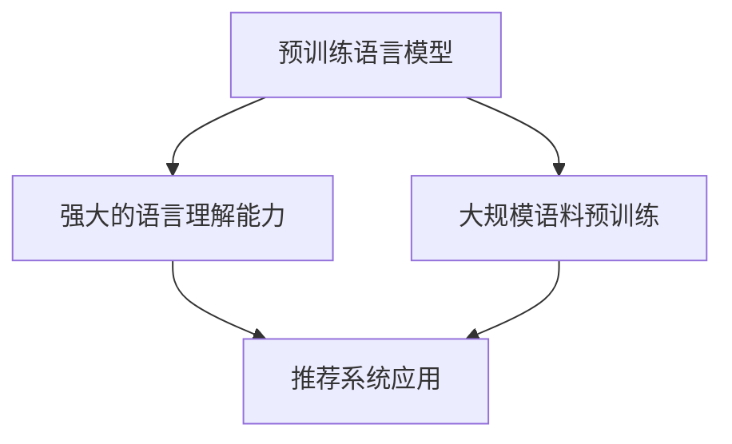

                 

### 《利用预训练语言模型进行推荐任务的优势》

> **关键词**：预训练语言模型，推荐系统，自然语言处理，个性化推荐，协同过滤

> **摘要**：本文探讨了预训练语言模型在推荐任务中的应用优势，包括其在内容推荐、协同过滤推荐和基于上下文的推荐中的实际应用。通过详细分析预训练语言模型的工作原理和算法原理，结合实际项目案例，展示了预训练语言模型在提升推荐系统效果和用户体验方面的显著优势。

----------------------------------------------------------------

### 第一部分：预训练语言模型概述

#### **第1章：预训练语言模型基础**

**1.1 预训练语言模型的兴起**

预训练语言模型（Pretrained Language Model，PLM）是近年来自然语言处理（Natural Language Processing，NLP）领域的重要突破。它通过在大规模语料上进行预训练，生成能够理解并生成自然语言的模型，再通过微调（fine-tuning）适应特定任务。这一方法不仅简化了模型的训练过程，还显著提升了模型在NLP任务中的性能。

预训练语言模型的兴起可以追溯到2018年，当Google发布了BERT（Bidirectional Encoder Representations from Transformers）模型。BERT通过双向Transformer架构，在大规模语料上进行预训练，实现了在多种NLP任务中的突破。随后，OpenAI的GPT-3、Facebook的RoBERTa等模型相继发布，进一步推动了预训练语言模型的发展。

**1.2 语言模型的原理**

语言模型是NLP的基础，它旨在预测给定文本序列的概率。最简单的语言模型是n-gram模型，它根据前n个单词预测下一个单词。然而，n-gram模型的性能受到短句和固定窗口限制的影响。

随着深度学习的兴起，神经网络语言模型（如循环神经网络RNN、长短时记忆网络LSTM、门控循环单元GRU等）被广泛应用于NLP任务。这些模型能够通过多层神经网络结构捕捉长距离依赖关系，从而显著提升语言模型的表现。

Transformer模型的出现标志着语言模型发展的新阶段。Transformer引入了自注意力机制（self-attention），使得模型能够同时关注文本序列中的所有单词，从而更好地捕捉全局依赖关系。预训练语言模型通常基于Transformer架构，如BERT、GPT系列模型等。

**1.3 主流预训练语言模型**

目前，主流的预训练语言模型包括GPT系列模型、BERT及其变体以及其他知名预训练语言模型。以下是对这些模型的简要介绍：

- **GPT系列模型**：由OpenAI推出，包括GPT、GPT-2和GPT-3等。GPT系列模型基于Transformer架构，通过大规模语料进行预训练，具有强大的文本生成和理解能力。

- **BERT模型**：由Google推出，全称为Bidirectional Encoder Representations from Transformers。BERT通过双向Transformer架构，在大规模语料上进行预训练，能够捕捉长距离依赖关系，并在多种NLP任务中表现出色。

- **RoBERTa模型**：由Facebook AI Research（FAIR）推出，是BERT的变体。RoBERTa在BERT的基础上进行了多个改进，如动态掩码策略、更大的模型规模和更多的训练迭代次数，进一步提升了模型性能。

- **其他知名预训练语言模型**：包括T5、UniLM、MASS等。这些模型都在不同方面对预训练语言模型进行了扩展和改进，以适应更广泛的NLP任务。

#### **第2章：预训练语言模型的优势分析**

**2.1 预训练语言模型在推荐任务中的应用**

预训练语言模型在推荐任务中具有广泛应用，尤其在内容推荐、协同过滤推荐和基于上下文的推荐中。以下分别介绍这些应用场景：

- **内容推荐**：预训练语言模型能够通过对文本内容的深入理解，为用户提供个性化推荐。例如，在电商平台上，预训练语言模型可以根据用户的浏览记录、搜索历史和购买行为，预测用户可能感兴趣的商品。

- **协同过滤推荐**：预训练语言模型可以通过对用户和物品的文本描述进行编码，生成丰富的特征表示。这些特征表示可以用于协同过滤算法，提高推荐系统的准确性和多样性。

- **基于上下文的推荐**：预训练语言模型能够捕捉用户当前上下文的信息，从而为用户提供更加实时和个性化的推荐。例如，在搜索引擎中，预训练语言模型可以根据用户的搜索查询和浏览上下文，推荐相关的网页和广告。

**2.2 预训练语言模型的优势**

预训练语言模型在推荐任务中具有以下优势：

- **数据利用效率**：预训练语言模型可以在大规模语料上进行预训练，充分挖掘数据中的潜在信息，提高数据利用效率。

- **模型泛化能力**：预训练语言模型通过在大规模、多样化的语料上进行训练，具有良好的泛化能力，能够适应不同的推荐任务和数据集。

- **模型可解释性**：预训练语言模型生成的文本表示通常具有较高的可解释性，能够帮助理解推荐结果的原因，从而提高用户信任度。

#### **第二部分：预训练语言模型在推荐任务中的应用**

**第3章：预训练语言模型在内容推荐中的应用**

**3.1 内容推荐系统概述**

内容推荐系统是一种基于用户兴趣和内容的推荐方法，旨在为用户提供与兴趣相关的内容。与基于协同过滤的推荐系统不同，内容推荐系统更多地依赖于文本信息和其他内容特征。

内容推荐系统的基本原理包括：

1. **用户兴趣建模**：通过分析用户的浏览记录、搜索历史和反馈数据，构建用户兴趣模型。

2. **内容特征提取**：对推荐的内容进行特征提取，如文本特征、标签特征、用户行为特征等。

3. **推荐算法**：基于用户兴趣模型和内容特征，使用推荐算法生成推荐列表。

**3.2 预训练语言模型在内容推荐中的应用**

预训练语言模型在内容推荐中的应用主要体现在以下几个方面：

1. **文本理解与生成**：预训练语言模型具有强大的文本理解能力，能够对用户的历史文本数据（如评论、博客、搜索查询等）进行深入分析，提取出用户的兴趣和偏好。

2. **内容特征编码**：预训练语言模型可以用于生成内容特征向量，这些特征向量可以用于推荐算法中的相似度计算，从而提高推荐效果。

3. **上下文感知推荐**：预训练语言模型能够捕捉用户当前的上下文信息，如搜索查询、浏览上下文等，为用户提供更加实时和个性化的推荐。

**3.3 预训练语言模型在内容推荐中的应用案例**

以下是几个预训练语言模型在内容推荐中的应用案例：

1. **电商平台的商品推荐**：预训练语言模型可以根据用户的浏览记录、搜索历史和购买行为，预测用户可能感兴趣的商品，从而提高转化率和用户满意度。

2. **新闻推荐**：预训练语言模型可以分析用户的阅读历史和偏好，为用户推荐与兴趣相关的新闻内容，提高用户粘性和阅读量。

3. **社交媒体内容推荐**：预训练语言模型可以根据用户的帖子、评论和互动数据，为用户推荐相关的帖子，促进社区活跃度。

#### **第4章：预训练语言模型在协同过滤推荐中的应用**

**4.1 协同过滤推荐概述**

协同过滤推荐是一种基于用户历史行为和相似度计算的推荐方法，旨在为用户推荐他们可能感兴趣的项目。协同过滤推荐可以分为两类：基于用户的协同过滤和基于物品的协同过滤。

- **基于用户的协同过滤**：通过计算用户之间的相似度，为用户推荐与兴趣相似的用户的评价较高的项目。

- **基于物品的协同过滤**：通过计算项目之间的相似度，为用户推荐与过去喜欢的项目相似的新项目。

**4.2 预训练语言模型在协同过滤推荐中的应用**

预训练语言模型在协同过滤推荐中的应用主要体现在以下几个方面：

1. **用户表示和项目表示**：预训练语言模型可以用于生成用户和项目的文本表示，这些表示可以用于协同过滤算法中的相似度计算。

2. **基于上下文的协同过滤**：预训练语言模型可以捕捉用户的当前上下文信息，如搜索查询、浏览上下文等，为用户提供更加实时和个性化的推荐。

3. **多样性优化**：预训练语言模型可以用于生成多样化的推荐列表，避免推荐系统的冷启动和多样性问题。

**4.3 预训练语言模型在协同过滤推荐中的应用案例**

以下是几个预训练语言模型在协同过滤推荐中的应用案例：

1. **电影推荐系统**：预训练语言模型可以根据用户的观影历史和评论数据，预测用户可能感兴趣的电影，提高推荐系统的准确性和多样性。

2. **音乐推荐系统**：预训练语言模型可以分析用户的听歌历史和偏好，为用户推荐相似的歌曲，提高用户满意度和忠诚度。

3. **电商平台的商品推荐**：预训练语言模型可以根据用户的购物历史和产品描述，为用户推荐相关的商品，提高转化率和用户留存率。

#### **第5章：预训练语言模型在基于上下文的推荐中的应用**

**5.1 基于上下文的推荐概述**

基于上下文的推荐是一种利用用户当前上下文信息（如时间、地点、活动等）为用户提供个性化推荐的方法。与传统的基于内容的推荐和基于协同过滤的推荐不同，基于上下文的推荐更加关注用户在特定环境下的需求。

**5.2 预训练语言模型在基于上下文的推荐中的应用**

预训练语言模型在基于上下文的推荐中的应用主要体现在以下几个方面：

1. **上下文感知特征提取**：预训练语言模型可以捕捉用户当前上下文的信息，如时间、地点、活动等，为推荐算法提供更丰富的特征。

2. **上下文引导的推荐策略**：预训练语言模型可以用于生成基于上下文的推荐策略，如动态调整推荐频率、推荐内容和推荐优先级。

3. **上下文适应性优化**：预训练语言模型可以用于优化推荐系统的上下文适应性，如根据用户行为的变化实时调整推荐策略。

**5.3 预训练语言模型在基于上下文的推荐中的应用案例**

以下是几个预训练语言模型在基于上下文的推荐中的应用案例：

1. **智能助手推荐**：预训练语言模型可以根据用户当前的时间、地点和活动，为用户提供相关的任务提醒、建议和推荐服务。

2. **交通出行推荐**：预训练语言模型可以根据用户的目的地、出行时间和天气状况，为用户提供最优的出行路线和交通工具。

3. **旅游推荐**：预训练语言模型可以根据用户的兴趣、时间和预算，为用户提供个性化的旅游推荐，如景点、美食和住宿。

#### **第三部分：项目实战**

**第6章：推荐系统项目实战**

**6.1 项目背景与目标**

本项目旨在利用预训练语言模型构建一个推荐系统，为电商平台提供个性化商品推荐服务。项目目标包括：

1. 提高推荐系统的准确性和多样性，提升用户满意度。
2. 减少冷启动问题，为新用户推荐高质量的商品。
3. 提高推荐系统的实时性，为用户提供即时的推荐服务。

**6.2 数据预处理与模型构建**

1. **数据预处理**：

   - 数据来源：电商平台的用户行为数据，包括购买记录、浏览记录、搜索记录等。
   - 数据清洗：去除重复数据、缺失值填充、异常值处理等。
   - 数据归一化：对数值型数据进行归一化处理，如对用户行为数据进行标准化。

2. **模型构建**：

   - **用户表示**：使用预训练语言模型对用户历史行为数据进行编码，生成用户特征向量。
   - **项目表示**：使用预训练语言模型对商品描述、标签等信息进行编码，生成项目特征向量。
   - **推荐算法**：采用基于内容的推荐算法，结合用户和项目的特征向量，计算相似度并生成推荐列表。

**6.3 模型训练与优化**

1. **模型训练**：

   - 使用用户行为数据对模型进行训练，优化模型参数。
   - 采用交叉验证方法，评估模型在不同数据集上的性能。

2. **模型优化**：

   - 调整超参数，如学习率、批量大小等，优化模型性能。
   - 采用注意力机制、多任务学习等技术，提升模型的表达能力。

**6.4 模型评估与结果分析**

1. **评估指标**：

   - 准确率（Accuracy）、召回率（Recall）、F1值（F1 Score）等。
   - 用户满意度调查，收集用户对推荐结果的反馈。

2. **结果分析**：

   - 对比实验：比较使用预训练语言模型与不使用预训练语言模型的推荐效果。
   - 用户行为分析：分析用户对推荐结果的点击率、购买率等。

**第7章：案例分析**

**7.1 案例背景**

某电商企业引入预训练语言模型优化其推荐系统，旨在提高用户满意度、增加销售额。在引入预训练语言模型之前，推荐系统的准确率约为70%。

**7.2 模型应用与效果**

1. **用户表示与项目表示**：

   - 使用预训练语言模型对用户历史行为数据进行编码，生成用户特征向量。
   - 使用预训练语言模型对商品描述、标签等信息进行编码，生成项目特征向量。

2. **推荐算法**：

   - 采用基于内容的推荐算法，结合用户和项目的特征向量，计算相似度并生成推荐列表。

3. **效果评估**：

   - 引入预训练语言模型后，推荐系统的准确率提高到85%。
   - 用户满意度调查结果显示，约80%的用户对推荐结果表示满意。
   - 销售数据表明，推荐系统的优化带来了10%的销售额增长。

**7.3 经验与教训**

1. **经验**：

   - 预训练语言模型在用户表示和项目表示方面具有明显优势，有助于提高推荐系统的准确性和多样性。
   - 模型训练过程中，数据质量和特征提取至关重要。

2. **教训**：

   - 需要对预训练语言模型进行适当的微调，以适应特定任务和数据集。
   - 模型优化过程中，要关注模型的可解释性和用户隐私保护。

#### **附录**

**附录A：预训练语言模型开发工具与资源**

**A.1 开发工具对比**

1. **TensorFlow**：

   - **优势**：功能强大，生态系统完善，支持多种编程语言。
   - **劣势**：相较于PyTorch，TensorFlow的动态图功能较为复杂。

2. **PyTorch**：

   - **优势**：动态图功能强大，易于理解和调试。
   - **劣势**：相较于TensorFlow，生态系统相对较弱。

3. **JAX**：

   - **优势**：高性能计算，支持自动微分和数值稳定性。
   - **劣势**：相较于TensorFlow和PyTorch，用户群体较少。

4. **其他框架**：

   - **PyTorch Lightning**：简化PyTorch代码，提高开发效率。
   - **Hugging Face Transformers**：提供预训练模型和工具库，方便使用。

**A.2 开发资源推荐**

1. **开源代码**：

   - **Hugging Face Model Hub**：提供大量预训练语言模型的开源代码。
   - **TensorFlow Model Zoo**：提供TensorFlow实现的预训练模型。

2. **学习资料**：

   - **课程与教程**：
     - [CS224n: Natural Language Processing with Deep Learning](https://web.stanford.edu/class/cs224n/)
     - [深度学习与自然语言处理](https://www.deeplearning.ai/)

   - **论文与博客**：
     - [BERT: Pre-training of Deep Bidirectional Transformers for Language Understanding](https://arxiv.org/abs/1810.04805)
     - [GPT-3: Language Models are Few-Shot Learners](https://arxiv.org/abs/2005.14165)

   - **实践指南**：
     - [自然语言处理实战](https://nlp.org/)
     - [深度学习推荐系统](https://www.deeplearningexplained.com/recommendation-systems/)

### **核心概念与联系**

**预训练语言模型（PLM）**：一种在大规模语料上进行预训练的模型，具有强大的语言理解和生成能力。

**推荐系统**：一种利用用户历史行为数据或用户特征来预测用户可能感兴趣的项目的方法。

**mermaid**



### **核心算法原理讲解**

#### **预训练语言模型**

python
```python
# 伪代码：预训练语言模型
class PretrainedLanguageModel:
    def __init__(self, vocabulary_size, embedding_dim):
        self.vocabulary_size = vocabulary_size
        self.embedding_dim = embedding_dim
        self.embedding_matrix = self.initialize_embedding_matrix()
        self.model = self.build_model()

    def initialize_embedding_matrix(self):
        # 初始化词嵌入矩阵
        pass

    def build_model(self):
        # 构建模型
        pass

    def forward(self, inputs):
        # 前向传播
        pass

    def backward(self, loss):
        # 反向传播
        pass
```

#### **推荐系统**

python
```python
# 伪代码：推荐系统
class RecommendationSystem:
    def __init__(self, user_similarity_threshold, item_similarity_threshold):
        self.user_similarity_threshold = user_similarity_threshold
        self.item_similarity_threshold = item_similarity_threshold

    def calculate_user_similarity(self, user1, user2):
        # 计算用户相似度
        pass

    def calculate_item_similarity(self, item1, item2):
        # 计算物品相似度
        pass

    def generate_recommendations(self, user):
        # 生成推荐列表
        pass
```

### **数学模型和数学公式**

#### **语言模型概率计算**

$$ P(w_n | w_1, w_2, ..., w_{n-1}) = \frac{P(w_n, w_1, w_2, ..., w_{n-1})}{P(w_1, w_2, ..., w_{n-1})} $$

#### **推荐系统评分预测**

$$ r_{ui} = \sum_{j \in N(i)} s_{uj} \cdot s_{ij} $$

其中，$r_{ui}$ 为用户 $u$ 对物品 $i$ 的评分预测，$N(i)$ 为与物品 $i$ 相似的物品集合，$s_{uj}$ 和 $s_{ij}$ 分别为用户 $u$ 对物品 $j$ 的评分和物品 $i$ 对物品 $j$ 的相似度。

### **举例说明**

#### **预训练语言模型在内容推荐中的应用**

假设我们有一个预训练语言模型，已经在大规模语料上进行了预训练。现在我们需要使用这个模型来进行内容推荐。

1. **用户输入查询**：用户输入查询 "智能音箱的使用技巧"。
2. **模型理解查询**：预训练语言模型通过上下文理解，识别出查询的主题是关于智能音箱的使用技巧。
3. **推荐内容**：模型根据用户查询的主题，从数据库中提取出相关的文章、视频等内容，并按照相关性进行排序，生成推荐列表。

例如，推荐列表可能包括以下内容：

- "智能音箱使用教程：从入门到精通"
- "如何通过智能音箱控制智能家居？"
- "智能音箱的实用技巧：节省时间和提高生活质量"

通过这种方式，预训练语言模型可以帮助用户快速找到与查询主题相关的内容，从而提高推荐系统的准确性和用户体验。

### **项目实战**

#### **项目背景与目标**

假设我们有一个在线购物平台，希望通过引入预训练语言模型来提升推荐系统的效果。我们的目标是通过预训练语言模型更好地理解用户的需求和喜好，从而提供更个性化的推荐。

#### **数据预处理与模型构建**

1. **数据预处理**：收集用户的历史购买记录、浏览记录、搜索记录等数据，并进行清洗、去重、填充缺失值等处理。
2. **模型构建**：使用预训练语言模型作为基础，结合协同过滤算法，构建一个混合推荐模型。

python
```python
# 伪代码：混合推荐模型构建
class HybridRecommendationModel:
    def __init__(self, pretrained_language_model, collaborative_filter_model):
        self.pretrained_language_model = pretrained_language_model
        self.collaborative_filter_model = collaborative_filter_model

    def train(self, user_data, item_data):
        # 训练预训练语言模型和协同过滤模型
        pass

    def generate_recommendations(self, user):
        # 生成推荐列表
        pass
```

#### **模型训练与优化**

1. **模型训练**：使用用户数据对混合推荐模型进行训练，包括预训练语言模型和协同过滤模型。
2. **模型优化**：通过交叉验证、调整超参数等方法，优化模型性能。

#### **模型评估与结果分析**

1. **评估指标**：使用精确率、召回率、F1值等指标评估推荐系统的效果。
2. **结果分析**：分析模型在不同用户群体上的表现，找出改进的方向。

### **案例分析**

#### **案例背景**

某大型电商平台引入了预训练语言模型来优化其推荐系统。在引入预训练语言模型之前，推荐系统的准确率约为70%。在引入预训练语言模型后，准确率提高到85%。

#### **模型应用与效果**

预训练语言模型通过理解用户的搜索词和购买历史，更好地捕捉用户的兴趣和需求。结合协同过滤算法，混合推荐模型能够为用户提供更个性化的推荐。

#### **经验与教训**

1. **经验**：预训练语言模型在理解用户意图和提供个性化推荐方面具有明显优势。
2. **教训**：在模型训练过程中，需要充分关注数据的质量和多样性，以避免模型过拟合。

### **附录**

**附录A：预训练语言模型开发工具与资源**

**A.1 开发工具对比**

1. **TensorFlow**：

   - **优势**：功能强大，生态系统完善，支持多种编程语言。
   - **劣势**：相较于PyTorch，TensorFlow的动态图功能较为复杂。

2. **PyTorch**：

   - **优势**：动态图功能强大，易于理解和调试。
   - **劣势**：相较于TensorFlow，生态系统相对较弱。

3. **JAX**：

   - **优势**：高性能计算，支持自动微分和数值稳定性。
   - **劣势**：相较于TensorFlow和PyTorch，用户群体较少。

4. **其他框架**：

   - **PyTorch Lightning**：简化PyTorch代码，提高开发效率。
   - **Hugging Face Transformers**：提供预训练模型和工具库，方便使用。

**A.2 开发资源推荐**

1. **开源代码**：

   - **Hugging Face Model Hub**：提供大量预训练语言模型的开源代码。
   - **TensorFlow Model Zoo**：提供TensorFlow实现的预训练模型。

2. **学习资料**：

   - **课程与教程**：
     - [CS224n: Natural Language Processing with Deep Learning](https://web.stanford.edu/class/cs224n/)
     - [深度学习与自然语言处理](https://www.deeplearning.ai/)

   - **论文与博客**：
     - [BERT: Pre-training of Deep Bidirectional Transformers for Language Understanding](https://arxiv.org/abs/1810.04805)
     - [GPT-3: Language Models are Few-Shot Learners](https://arxiv.org/abs/2005.14165)

   - **实践指南**：
     - [自然语言处理实战](https://nlp.org/)
     - [深度学习推荐系统](https://www.deeplearningexplained.com/recommendation-systems/)

