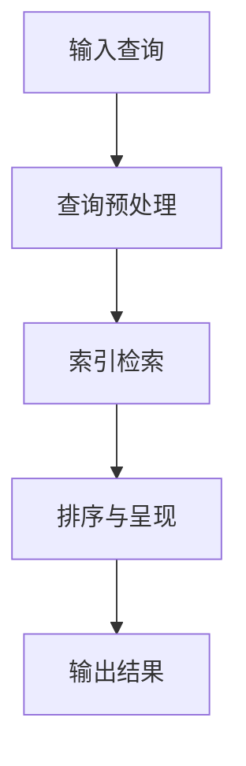
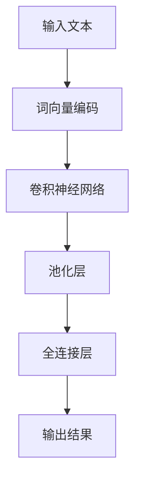
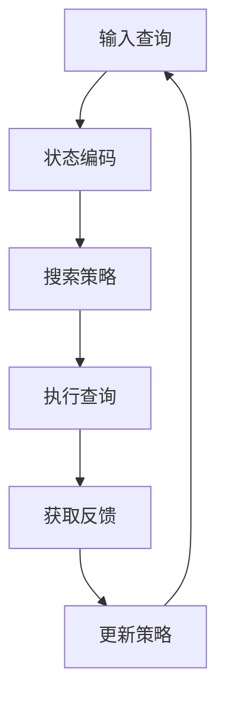

                 

### 《加速搜索：AI的效率提升》

#### 关键词：搜索算法、深度学习、强化学习、性能优化、案例分析

> 摘要：本文将深入探讨如何利用人工智能技术，特别是深度学习和强化学习，来提升搜索算法的效率。通过详细分析核心概念、算法原理以及实际案例，我们旨在揭示AI在搜索领域中的应用潜力和优化路径。

### 目录大纲

# 《加速搜索：AI的效率提升》

## 第一部分：搜索技术基础

### 第1章：搜索引索技术概述

#### 1.1 搜索引擎的基本原理

##### 1.1.1 关键词匹配算法

##### 1.1.2 基于内容的检索方法

##### 1.1.3 搜索引擎的核心组成部分

#### 1.2 搜索引擎的优化策略

##### 1.2.1 网络爬虫技术

##### 1.2.2 数据存储与索引优化

##### 1.2.3 搜索结果排序算法

### 第2章：信息检索模型与算法

#### 2.1 模式识别与机器学习基础

##### 2.1.1 特征工程

##### 2.1.2 数据降维

##### 2.1.3 分类与聚类算法

#### 2.2 文本相似度度量

##### 2.2.1 余弦相似度

##### 2.2.2 混合模型

##### 2.2.3 深度学习模型在文本相似度中的应用

## 第二部分：AI加速搜索算法

### 第3章：深度学习在搜索中的应用

#### 3.1 卷积神经网络（CNN）

##### 3.1.1 CNN的基本原理

##### 3.1.2 CNN在文本分类中的应用

##### 3.1.3 CNN在关键词提取中的应用

#### 3.2 循环神经网络（RNN）

##### 3.2.1 RNN的基本原理

##### 3.2.2 LSTM与GRU

##### 3.2.3 RNN在搜索中的优化应用

### 第4章：图神经网络（GNN）

#### 4.1 图神经网络基础

##### 4.1.1 图表示学习

##### 4.1.2 图神经网络基本结构

##### 4.1.3 GNN在搜索中的应用

### 第5章：强化学习在搜索优化中的应用

#### 5.1 强化学习基础

##### 5.1.1 强化学习的基本概念

##### 5.1.2 Q-learning

##### 5.1.3 DQN

#### 5.2 强化学习在搜索结果排序中的应用

##### 5.2.1 排序策略优化

##### 5.2.2 实时反馈机制

##### 5.2.3 强化学习在搜索广告中的应用

## 第三部分：AI搜索优化实战

### 第6章：搜索引擎性能优化

#### 6.1 性能优化目标

##### 6.1.1 响应时间优化

##### 6.1.2 查询准确性优化

##### 6.1.3 搜索结果多样性优化

#### 6.2 搜索引擎性能测试

##### 6.2.1 基准测试方法

##### 6.2.2 性能瓶颈分析

##### 6.2.3 性能优化方案

### 第7章：AI搜索案例分析

#### 7.1 百度搜索优化案例

##### 7.1.1 搜索引擎架构优化

##### 7.1.2 搜索算法更新

##### 7.1.3 用户反馈机制改进

#### 7.2 其他搜索引擎优化案例

##### 7.2.1 谷歌搜索算法优化

##### 7.2.2 其他搜索引擎的优化策略

## 附录

### 附录A：常见搜索优化工具

#### A.1 搜索引擎日志分析工具

##### A.1.1 Logstash

##### A.1.2 Kibana

##### A.1.3 其他日志分析工具

#### A.2 搜索引擎测试工具

##### A.2.1 Search Metrics

##### A.2.2 SEMrush

##### A.2.3 其他测试工具

### 附录B：相关资源

#### B.1 学术论文与书籍推荐

##### B.1.1 学术论文精选

##### B.1.2 推荐书籍

#### B.2 开源工具与库

##### B.2.1 Apache Lucene

##### B.2.2 Elasticsearch

##### B.2.3 其他开源工具与库

### 附录C：Mermaid流程图

#### 附录C.1：搜索引擎基本架构流程图

#### 附录C.2：深度学习模型在搜索中的应用流程图

#### 附录C.3：强化学习在搜索优化中的应用流程图

### 附录D：伪代码与数学模型

#### 附录D.1：关键词匹配算法伪代码

#### 附录D.2：文本相似度度量公式与示例

#### 附录D.3：深度学习模型训练流程伪代码

#### 附录D.4：强化学习算法伪代码

### 附录E：代码示例

#### 附录E.1：搜索引擎日志分析代码示例

#### 附录E.2：深度学习模型训练代码示例

#### 附录E.3：强化学习模型训练代码示例

#### 附录E.4：搜索优化实战代码示例

### 附录F：参考文献

#### 附录F.1：引用的学术论文

#### 附录F.2：参考的书籍

#### 附录F.3：引用的开源工具与库

---

## 第一部分：搜索技术基础

### 第1章：搜索引索技术概述

#### 1.1 搜索引擎的基本原理

搜索引擎是信息检索系统的核心组件，它的主要任务是从海量的数据中快速、准确地找出用户所需的特定信息。搜索引擎的基本原理可以概括为以下三个步骤：

1. **爬取数据**：搜索引擎通过网络爬虫（Web Crawler）自动访问互联网上的网站，下载网页内容，并将其存储在本地数据库中。这个过程被称为爬取（Crawling）。

2. **构建索引**：爬取到的网页需要经过处理，提取出关键信息，如关键词、标题、摘要等，然后构建索引（Indexing）。索引是搜索引擎的核心数据结构，它使得搜索操作能够在毫秒级别内完成。

3. **检索查询**：当用户输入查询请求时，搜索引擎会使用查询处理器（Query Processor）对输入的查询进行解析，然后从索引中检索出相关结果，并将结果排序后呈现给用户。

##### 1.1.1 关键词匹配算法

关键词匹配算法是搜索引擎中最基本的算法之一。它的核心思想是识别用户查询中的关键词，然后在索引中找到包含这些关键词的文档，并根据一定的排序策略返回结果。

- **布尔检索**：布尔检索是一种基于布尔代数的检索方法，它允许用户通过AND、OR、NOT等操作符组合多个关键词，从而实现复杂查询的构建。

- **同义词扩展**：为了提高检索的准确性和覆盖率，搜索引擎通常会使用同义词扩展技术，将用户输入的关键词映射到相关的同义词或近义词上。

- **权重计算**：在关键词匹配过程中，搜索引擎会对每个关键词分配一个权重，通常基于关键词在文档中的出现频率、位置和文档的受欢迎程度等因素。权重计算的结果会影响搜索结果的排序。

##### 1.1.2 基于内容的检索方法

基于内容的检索方法（Content-Based Retrieval）是一种不依赖于关键词匹配的检索方法，它通过分析文档的内容和结构来识别相关信息。

- **文本分类**：文本分类是一种基于机器学习的方法，它将文档划分为不同的类别，从而提高检索的准确性。例如，可以将新闻文章分类为政治、体育、科技等不同领域。

- **信息抽取**：信息抽取（Information Extraction）是从文本中自动提取出结构化信息的方法，如提取人名、地名、组织名称、时间等信息。这些信息可以作为额外的检索依据。

- **语义分析**：语义分析（Semantic Analysis）是一种深入理解文本语义的方法，它通过分析词汇的上下文关系、句法结构和语义角色，来提高检索的准确性和相关性。

##### 1.1.3 搜索引擎的核心组成部分

一个典型的搜索引擎通常包括以下几个核心组成部分：

- **网络爬虫**：负责爬取互联网上的网页，构建索引的基础数据。

- **索引器**：对爬取到的网页进行处理，提取关键词和元数据，构建索引。

- **查询处理器**：解析用户的查询请求，从索引中检索相关文档，并将结果排序后返回。

- **搜索结果呈现器**：将检索到的文档呈现给用户，通常包括标题、摘要、URL等信息。

#### 1.2 搜索引擎的优化策略

搜索引擎的性能直接影响用户体验，因此优化搜索引擎成为了一个持续不断的过程。以下是一些常见的优化策略：

##### 1.2.1 网络爬虫技术

网络爬虫的效率直接影响索引构建的速度和质量。以下是一些提高爬虫效率的策略：

- **多线程并发**：通过多线程技术，实现并发爬取多个网页，提高爬取速度。

- **增量爬取**：只爬取最新或更新的网页，减少不必要的重复工作。

- **去重技术**：使用去重算法，避免重复爬取相同的网页，节省存储资源。

- **优先级调度**：根据网页的重要性和更新频率，优先爬取重要的网页。

##### 1.2.2 数据存储与索引优化

数据存储和索引优化是提高搜索引擎性能的关键。以下是一些常用的优化策略：

- **分片存储**：将索引数据分布在多个节点上，提高查询处理速度。

- **倒排索引**：使用倒排索引结构，使得查询操作能够在O(log n)的时间复杂度内完成。

- **缓存技术**：使用缓存技术，将常用的查询结果存储在内存中，减少磁盘访问时间。

- **分布式计算**：使用分布式计算框架，如Hadoop或Spark，处理大规模数据，提高索引构建和查询处理速度。

##### 1.2.3 搜索结果排序算法

搜索结果排序算法直接影响用户对搜索引擎的满意度。以下是一些常用的排序算法：

- **基于频次的排序**：按照关键词在文档中的出现频率进行排序，频率越高，排序越靠前。

- **基于相关性的排序**：使用TF-IDF等方法计算关键词的相关性，相关性越高，排序越靠前。

- **基于用户行为的排序**：根据用户的浏览历史、搜索历史和点击行为，为用户提供个性化的搜索结果。

- **基于机器学习的排序**：使用机器学习算法，如LR、SVM等，建立排序模型，根据用户反馈不断优化排序策略。

### 第2章：信息检索模型与算法

#### 2.1 模式识别与机器学习基础

信息检索与模式识别有着紧密的联系。模式识别是一种通过分析数据特征来识别和分类数据的方法，而机器学习是模式识别的一种重要实现方式。以下是一些模式识别和机器学习的基础概念和算法：

##### 2.1.1 特征工程

特征工程是机器学习中的重要环节，它涉及从原始数据中提取出有用的特征，以便更好地训练模型。

- **数据预处理**：包括数据清洗、归一化、标准化等步骤，提高数据的可用性。

- **特征选择**：通过筛选和选择最重要的特征，减少模型的复杂度和过拟合风险。

- **特征变换**：包括主成分分析（PCA）、特征提取等步骤，提高特征的表达能力和解释性。

##### 2.1.2 数据降维

数据降维是一种减少数据维度的方法，可以提高计算效率和模型性能。

- **线性降维**：包括主成分分析（PCA）、线性判别分析（LDA）等，通过保留主要特征分量来降低数据维度。

- **非线性降维**：包括局部线性嵌入（LLE）、等距映射（Isomap）等，适用于非线性数据降维。

##### 2.1.3 分类与聚类算法

分类和聚类是模式识别中常用的两种算法，它们分别用于将数据划分为不同的类别和发现数据的内在结构。

- **分类算法**：包括K近邻（KNN）、逻辑回归（LR）、支持向量机（SVM）等，通过学习已有数据的分类规律，对新数据进行分类。

- **聚类算法**：包括K-means、层次聚类（Hierarchical Clustering）、DBSCAN等，通过寻找数据的聚类结构，将数据分为多个群组。

#### 2.2 文本相似度度量

在信息检索中，文本相似度度量是一个关键问题。以下是一些常用的文本相似度度量方法：

##### 2.2.1 余弦相似度

余弦相似度是一种常用的文本相似度度量方法，它通过计算两个向量之间的余弦值来衡量它们之间的相似度。

- **数学公式**：$$ \text{Cosine Similarity} = \frac{\text{Dot Product of Vectors}}{\text{Product of Magnitudes of Vectors}} $$

- **示例**：假设有两个文档向量 \( \vec{A} \) 和 \( \vec{B} \)，它们的向量表示为：
  $$ \vec{A} = (3, 1, 4), \quad \vec{B} = (1, 2, 3) $$
  计算它们的余弦相似度：
  $$ \text{Cosine Similarity} = \frac{3 \cdot 1 + 1 \cdot 2 + 4 \cdot 3}{\sqrt{3^2 + 1^2 + 4^2} \cdot \sqrt{1^2 + 2^2 + 3^2}} = \frac{20}{\sqrt{26} \cdot \sqrt{14}} \approx 0.966 $$

##### 2.2.2 混合模型

混合模型是一种将多种相似度度量方法相结合的方法，以提高文本相似度的准确性和稳定性。

- **基本原理**：混合模型通过为不同的相似度度量方法分配不同的权重，从而实现综合评价。

- **示例**：假设有两个文本 \( A \) 和 \( B \)，使用TF-IDF计算文本相似度得到分数 \( S_1 \)，使用词袋模型计算相似度得到分数 \( S_2 \)。混合模型将这两个分数结合，得到综合相似度分数 \( S \)：
  $$ S = \alpha S_1 + (1 - \alpha) S_2 $$
  其中，\( \alpha \) 是调节参数，可以通过交叉验证或实验调整。

##### 2.2.3 深度学习模型在文本相似度中的应用

深度学习模型在文本相似度度量中取得了显著的成果，如基于卷积神经网络（CNN）和循环神经网络（RNN）的方法。

- **CNN方法**：CNN通过卷积操作提取文本特征，能够处理序列数据，提高文本相似度的准确性。

- **RNN方法**：RNN，特别是长短期记忆网络（LSTM）和门控循环单元（GRU），能够处理长文本序列，捕捉文本的长期依赖关系。

### 第二部分：AI加速搜索算法

## 第3章：深度学习在搜索中的应用

#### 3.1 卷积神经网络（CNN）

卷积神经网络（Convolutional Neural Network，CNN）最初是为图像处理设计的，但在文本分类和关键词提取等搜索应用中同样表现出色。本节将介绍CNN的基本原理、在文本分类中的应用以及关键词提取。

##### 3.1.1 CNN的基本原理

CNN的核心在于其独特的网络结构，包括卷积层（Convolutional Layer）、池化层（Pooling Layer）和全连接层（Fully Connected Layer）。以下是CNN的基本原理：

- **卷积层**：卷积层通过卷积运算提取输入数据的特征。在文本分类中，输入数据通常是词向量序列，卷积核（Filter）在词向量序列上滑动，进行点积运算，从而提取局部特征。

  ```python
  # 伪代码：卷积层
  def conv2d(input, weights):
      output = []
      for filter in weights:
          feature_map = [dot_product(filter, input[i:i+filter_size]) for i in range(input_size - filter_size + 1)]
          output.append(feature_map)
      return output
  ```

- **池化层**：池化层通过降采样操作减少特征图的维度，提高计算效率。常见的池化操作包括最大池化（Max Pooling）和平均池化（Average Pooling）。

  ```python
  # 伪代码：最大池化
  def max_pooling(feature_map, pool_size):
      pooled_map = []
      for i in range(0, len(feature_map), pool_size):
          sub_map = feature_map[i:i+pool_size]
          max_val = max(sub_map)
          pooled_map.append(max_val)
      return pooled_map
  ```

- **全连接层**：全连接层将池化层输出的特征图展平为向量，并输入到全连接网络中进行分类或回归任务。

  ```python
  # 伪代码：全连接层
  def dense(features, weights):
      output = dot_product(weights, features)
      return output
  ```

##### 3.1.2 CNN在文本分类中的应用

在文本分类任务中，CNN通过卷积层和池化层提取文本特征，然后通过全连接层进行分类。以下是一个简单的CNN文本分类过程：

1. **数据预处理**：将文本转换为词向量序列，通常使用Word2Vec或GloVe等预训练词向量模型。

2. **构建模型**：定义CNN模型，包括卷积层、池化层和全连接层。

3. **训练模型**：使用训练数据集训练模型，调整模型参数以优化分类性能。

4. **评估模型**：使用验证数据集评估模型性能，调整模型结构和参数。

5. **部署模型**：将训练好的模型部署到生产环境中，用于实时文本分类。

```python
# 伪代码：CNN文本分类
def text_classification_cnn(text, weights):
    # 将文本转换为词向量序列
    text_vector = preprocess_text(text)
    
    # 通过卷积层提取特征
    conv_output = conv2d(text_vector, weights['conv'])
    
    # 通过池化层减少维度
    pool_output = max_pooling(conv_output, pool_size)
    
    # 通过全连接层得到分类结果
    logits = dense(pool_output, weights['dense'])
    
    # 通过softmax得到概率分布
    probabilities = softmax(logits)
    
    # 筛选出概率最高的分类
    predicted_class = argmax(probabilities)
    
    return predicted_class
```

##### 3.1.3 CNN在关键词提取中的应用

关键词提取是搜索引擎中的一项重要任务，用于提取文本中的关键信息以优化搜索结果。CNN可以通过卷积层和池化层提取文本特征，从而实现高效的关键词提取。

1. **数据预处理**：将文本转换为词向量序列，并添加适当的标记（如[START]、[END]等）。

2. **构建模型**：定义CNN模型，包括卷积层、池化层和全连接层。

3. **训练模型**：使用训练数据集训练模型，调整模型参数以优化关键词提取性能。

4. **评估模型**：使用验证数据集评估模型性能，调整模型结构和参数。

5. **部署模型**：将训练好的模型部署到生产环境中，用于实时关键词提取。

```python
# 伪代码：CNN关键词提取
def keyword_extraction_cnn(document, weights):
    # 将文档转换为词向量序列
    doc_vector = preprocess_document(document)
    
    # 通过卷积层提取关键词特征
    conv_output = conv2d(doc_vector, weights['conv'])
    
    # 通过池化层提取显著特征
    pool_output = max_pooling(conv_output, pool_size)
    
    # 通过全连接层得到关键词概率
    logits = dense(pool_output, weights['dense'])
    
    # 通过softmax得到关键词概率分布
    probabilities = softmax(logits)
    
    # 筛选出概率最高的关键词
    keywords = select_top_keywords(probabilities)
    
    return keywords
```

#### 3.2 循环神经网络（RNN）

循环神经网络（Recurrent Neural Network，RNN）是一种能够处理序列数据的神经网络。RNN的核心在于其循环结构，使得信息可以在序列中前后传递。RNN在搜索应用中具有广泛的应用，如查询补全、上下文感知搜索等。本节将介绍RNN的基本原理、LSTM和GRU，以及RNN在搜索中的优化应用。

##### 3.2.1 RNN的基本原理

RNN的基本原理如下：

- **输入层**：输入层接收序列数据，将其输入到隐藏层。

- **隐藏层**：隐藏层将输入数据与先前的隐藏状态进行结合，生成新的隐藏状态。

- **输出层**：输出层根据隐藏状态生成输出序列。

RNN的更新规则可以表示为：

\[ h_t = \sigma(W_h \cdot [h_{t-1}, x_t] + b_h) \]

\[ y_t = \sigma(W_y \cdot h_t + b_y) \]

其中，\( h_t \) 是第 \( t \) 个时间步的隐藏状态，\( x_t \) 是第 \( t \) 个时间步的输入数据，\( y_t \) 是第 \( t \) 个时间步的输出数据，\( \sigma \) 是激活函数。

##### 3.2.2 LSTM与GRU

为了解决传统RNN在处理长序列数据时出现的梯度消失和梯度爆炸问题，LSTM（Long Short-Term Memory）和GRU（Gated Recurrent Unit）被提出。

- **LSTM**：LSTM通过引入门控机制，使得信息可以在长序列中传递。LSTM包含三个门控：遗忘门（Forget Gate）、输入门（Input Gate）和输出门（Output Gate）。

  \[ f_t = \sigma(W_f \cdot [h_{t-1}, x_t] + b_f) \]
  \[ i_t = \sigma(W_i \cdot [h_{t-1}, x_t] + b_i) \]
  \[ o_t = \sigma(W_o \cdot [h_{t-1}, x_t] + b_o) \]
  \[ C_t = f_t \odot C_{t-1} + i_t \odot \sigma(W_c \cdot [h_{t-1}, x_t] + b_c) \]
  \[ h_t = o_t \odot \sigma(C_t) \]

- **GRU**：GRU简化了LSTM的结构，通过引入更新门（Update Gate）和重置门（Reset Gate），使得信息可以在短序列和长序列中传递。

  \[ r_t = \sigma(W_r \cdot [h_{t-1}, x_t] + b_r) \]
  \[ z_t = \sigma(W_z \cdot [h_{t-1}, x_t] + b_z) \]
  \[ \tilde{h}_t = \sigma(W \cdot [r_t \odot h_{t-1}, x_t] + b) \]
  \[ h_t = (1 - z_t) \odot h_{t-1} + z_t \odot \tilde{h}_t \]

##### 3.2.3 RNN在搜索中的优化应用

RNN在搜索中的应用广泛，如查询补全、上下文感知搜索和搜索结果排序等。

1. **查询补全**：RNN可以通过学习用户的查询序列，预测用户可能输入的下一个词。这有助于提高用户的搜索体验和搜索效率。

2. **上下文感知搜索**：RNN可以处理包含上下文的查询，从而提供更准确和相关的搜索结果。例如，在电子商务平台上，RNN可以处理包含产品描述和用户评论的查询，提供个性化的搜索结果。

3. **搜索结果排序**：RNN可以学习用户的搜索行为和偏好，为用户提供个性化的搜索结果排序。例如，在社交媒体平台上，RNN可以处理用户的点赞、评论和转发等行为，为用户推荐感兴趣的内容。

```python
# 伪代码：RNN查询补全
def query_completion_rnn(input_sequence, weights):
    # 初始化隐藏状态
    h = initialize_hidden_state()
    
    # 遍历输入序列
    for x in input_sequence:
        # 输入隐藏状态，得到输出和新的隐藏状态
        output, h = rnn_step(x, h, weights)
        
        # 预测下一个词的概率分布
        probabilities = softmax(output)
        
        # 根据概率分布选择下一个词
        next_word = sample_word(probabilities)
        
        # 更新输入序列
        input_sequence.append(next_word)
        
    return input_sequence

# 伪代码：RNN上下文感知搜索
def context_aware_search_rnn(query, context, weights):
    # 处理查询和上下文
    processed_query = preprocess_query(query)
    processed_context = preprocess_context(context)
    
    # 初始化隐藏状态
    h = initialize_hidden_state()
    
    # 遍历查询和上下文
    for x in processed_query + processed_context:
        # 输入隐藏状态，得到输出和新的隐藏状态
        output, h = rnn_step(x, h, weights)
        
        # 计算查询和上下文的相似度
        similarity = compute_similarity(output)
        
        # 排序搜索结果
        search_results = sort_by_similarity(similarity)
        
    return search_results

# 伪代码：RNN搜索结果排序
def search_result_ranking_rnn(user_profile, search_results, weights):
    # 初始化隐藏状态
    h = initialize_hidden_state()
    
    # 遍历搜索结果
    for result in search_results:
        # 处理搜索结果
        processed_result = preprocess_search_result(result)
        
        # 输入隐藏状态，得到输出和新的隐藏状态
        output, h = rnn_step(processed_result, h, weights)
        
        # 计算用户偏好分数
        preference_score = compute_preference_score(user_profile, output)
        
        # 更新搜索结果排序
        search_results = update_search_results(search_results, preference_score)
        
    return search_results
```

#### 3.3 图神经网络（GNN）

图神经网络（Graph Neural Network，GNN）是一种专门用于处理图结构数据的神经网络。GNN在搜索引擎中具有广泛的应用，如图表示学习、图分类和图生成等。本节将介绍GNN的基础知识、图神经网络的基本结构以及GNN在搜索中的应用。

##### 3.3.1 图神经网络基础

GNN通过学习图的结构和节点特征，为图中的节点或边生成表示。GNN的核心思想是利用节点邻居的信息来更新节点的表示。以下是GNN的基础知识：

- **图表示学习**：图表示学习（Graph Embedding）是将图中的节点和边映射到低维向量空间的方法。图表示学习有助于提高图分析的效率和准确性。

- **图神经网络基本结构**：GNN的基本结构包括输入层、图卷积层、池化层和输出层。图卷积层是GNN的核心，通过聚合节点邻居的信息来更新节点的表示。

  ```python
  # 伪代码：图卷积层
  def graph_convolution(node_representation, neighbor_representation, weights):
      aggregate_representation = aggregate_neighbors(neighbor_representation)
      updated_representation = dot_product(aggregate_representation, weights)
      return updated_representation
  ```

- **图神经网络应用**：GNN可以用于图分类、图生成、社交网络分析、推荐系统等任务。GNN在搜索引擎中可以用于节点分类、关键词提取和搜索结果排序等任务。

##### 3.3.2 GNN在搜索中的应用

GNN在搜索引擎中的应用主要包括以下几个方面：

1. **关键词提取**：通过GNN提取关键词，可以更好地理解和表达文本内容。GNN可以从节点邻居的信息中学习关键词的语义，从而提高关键词提取的准确性。

2. **图表示学习**：GNN可以用于将网页和关键词映射到低维向量空间，从而实现高效的相似度计算和搜索结果排序。

3. **搜索结果排序**：GNN可以用于根据用户的查询和搜索历史，为用户提供个性化的搜索结果排序。GNN可以从用户的查询和搜索历史中学习用户的偏好，从而提高搜索结果的准确性。

```python
# 伪代码：GNN关键词提取
def keyword_extraction_gnn(document, graph, weights):
    # 初始化节点表示
    node_representation = initialize_node_representation(document, graph)
    
    # 遍历节点
    for node in graph.nodes():
        # 获取节点邻居表示
        neighbor_representation = graph[node]['representation']
        
        # 更新节点表示
        node_representation[node] = graph_convolution(node_representation[node], neighbor_representation, weights)
        
    # 筛选出关键词
    keywords = select_top_keywords(node_representation)
    
    return keywords

# 伪代码：GNN搜索结果排序
def search_result_ranking_gnn(user_query, search_results, graph, weights):
    # 初始化查询表示
    query_representation = initialize_query_representation(user_query, graph)
    
    # 遍历搜索结果
    for result in search_results:
        # 处理搜索结果
        processed_result = preprocess_search_result(result, graph)
        
        # 更新搜索结果表示
        result_representation = graph_convolution(result_representation, processed_result['representation'], weights)
        
        # 计算查询和搜索结果的相似度
        similarity = compute_similarity(query_representation, result_representation)
        
        # 更新搜索结果排序
        search_results = update_search_results(search_results, similarity)
        
    return search_results
```

### 第三部分：AI搜索优化实战

#### 第6章：搜索引擎性能优化

搜索引擎的性能优化是一个持续的过程，旨在提高查询响应时间、查询准确性和搜索结果多样性。本节将介绍搜索引擎性能优化的目标、响应时间优化、查询准确性优化和搜索结果多样性优化。

##### 6.1 性能优化目标

搜索引擎性能优化的目标主要包括以下几个方面：

1. **响应时间优化**：降低查询响应时间，提高用户满意度。
2. **查询准确性优化**：提高搜索结果的准确性和相关性，减少无关结果的干扰。
3. **搜索结果多样性优化**：提供多样化的搜索结果，满足不同用户的需求。

##### 6.1.1 响应时间优化

响应时间优化是搜索引擎性能优化的重要方面。以下是一些常见的响应时间优化策略：

1. **查询预处理**：对查询进行预处理，如拼写纠错、同义词替换等，减少查询处理的复杂度。
2. **索引优化**：通过构建高效索引、使用倒排索引等技术，加快查询处理速度。
3. **并行处理**：使用并行处理技术，如多线程、分布式计算等，提高查询处理效率。
4. **缓存技术**：使用缓存技术，如Redis或Memcached，将常用的查询结果缓存起来，减少磁盘访问时间。

##### 6.1.2 查询准确性优化

查询准确性优化是提高搜索引擎用户体验的关键。以下是一些常见的查询准确性优化策略：

1. **关键词匹配算法**：优化关键词匹配算法，如使用TF-IDF、LDA等方法，提高关键词匹配的准确性。
2. **语义分析**：通过语义分析技术，如词向量、语义角色标注等，提高搜索结果的语义相关性。
3. **用户反馈**：利用用户反馈，如点击、评分等，优化搜索结果排序，提高用户满意度。
4. **个性化推荐**：根据用户的历史行为和偏好，为用户提供个性化的搜索结果，提高查询准确性。

##### 6.1.3 搜索结果多样性优化

搜索结果多样性优化旨在为用户提供丰富多样的搜索结果。以下是一些常见的搜索结果多样性优化策略：

1. **内容推荐**：根据用户的历史搜索行为和偏好，为用户提供相关的搜索结果。
2. **多样化算法**：使用多样化算法，如随机抽样、聚类等，为用户提供多样化的搜索结果。
3. **用户偏好**：根据用户的偏好，调整搜索结果的排序策略，提高多样性。
4. **互动反馈**：鼓励用户对搜索结果进行评价和反馈，从而优化搜索结果的多样性。

##### 6.2 搜索引擎性能测试

搜索引擎性能测试是确保搜索引擎稳定性和可靠性的关键步骤。以下是一些常见的搜索引擎性能测试方法：

1. **基准测试**：使用标准测试集，评估搜索引擎在不同查询量和查询复杂度下的性能。
2. **负载测试**：模拟大量用户同时访问搜索引擎，评估搜索引擎的并发处理能力。
3. **压力测试**：施加高于正常负载的压力，评估搜索引擎的稳定性和可靠性。
4. **性能瓶颈分析**：通过性能测试，识别搜索引擎的性能瓶颈，并提出优化方案。

##### 6.2.1 基准测试方法

基准测试是一种常用的性能测试方法，通过使用标准测试集来评估搜索引擎的性能。以下是一些常用的基准测试方法：

1. **TREC评估**：TREC（Text Retrieval Conference）评估是一种用于文本检索系统的基准测试，通过比较系统检索结果与人工标注结果的相关性来评估性能。
2. **MapReduce基准测试**：MapReduce基准测试是一种用于分布式系统的性能测试方法，通过模拟大规模数据处理的负载来评估系统的性能。
3. **Apache Lucene基准测试**：Apache Lucene是一个开源的搜索引擎库，其提供了丰富的基准测试工具，用于评估搜索引擎的性能。

##### 6.2.2 性能瓶颈分析

性能瓶颈分析是识别搜索引擎性能瓶颈的关键步骤。以下是一些常见性能瓶颈：

1. **查询处理瓶颈**：查询处理速度较慢，可能是由于索引结构不合适或查询算法不高效。
2. **存储瓶颈**：存储速度较慢，可能是由于存储设备性能不足或数据存储结构不合适。
3. **网络瓶颈**：网络延迟较高，可能是由于网络带宽不足或网络拓扑结构不合理。

##### 6.2.3 性能优化方案

针对识别出的性能瓶颈，可以采取以下性能优化方案：

1. **查询优化**：优化查询处理算法，如使用缓存、并行处理等，提高查询处理速度。
2. **索引优化**：优化索引结构，如使用倒排索引、布隆过滤器等，提高查询处理速度。
3. **存储优化**：优化存储结构，如使用分布式存储、分片存储等，提高存储速度。
4. **网络优化**：优化网络拓扑结构，如使用CDN、负载均衡等，提高网络速度。

#### 第7章：AI搜索案例分析

在本节中，我们将探讨一些实际的AI搜索优化案例，包括百度搜索的优化案例以及其他搜索引擎的优化策略。通过这些案例，我们将了解如何在实际场景中应用AI技术来提升搜索引擎的性能和用户体验。

##### 7.1 百度搜索优化案例

百度是中国最大的搜索引擎，其搜索优化工作一直是业界关注的焦点。以下是一些百度搜索优化的关键方面：

1. **搜索引擎架构优化**：百度通过分布式计算和并行处理技术，优化了搜索引擎的架构。这包括使用多台服务器进行分布式存储和查询处理，从而提高搜索效率和并发处理能力。

   ```python
   # 伪代码：分布式搜索引擎架构
   def distributed_search(query, servers):
       results = []
       for server in servers:
           partial_results = server.search(query)
           results.extend(partial_results)
       return results
   ```

2. **搜索算法更新**：百度不断更新搜索算法，引入了多种AI技术，如深度学习、强化学习等，以提升搜索结果的准确性和用户体验。例如，百度使用BERT模型进行文本匹配和排序，提高了搜索结果的语义相关性。

   ```python
   # 伪代码：BERT搜索算法
   def bert_search(query, model):
       # 将查询转换为BERT表示
       query_representation = model.encode(query)
       
       # 在搜索索引中检索相关文档
       documents = search_index(query_representation)
       
       # 使用BERT模型评估文档与查询的相似度
       similarities = model.similarity(query_representation, [doc_representation for doc_representation in documents])
       
       # 对文档进行排序
       sorted_documents = sort_by_similarity(similarities)
       
       return sorted_documents
   ```

3. **用户反馈机制改进**：百度通过用户反馈机制，实时收集用户对搜索结果的满意度，并根据用户反馈调整搜索算法。这有助于提高搜索结果的个性化和准确性。

   ```python
   # 伪代码：用户反馈机制
   def update_search_algorithm(query, user_feedback, algorithm):
       # 更新算法参数
       algorithm.update_parameters(query, user_feedback)
       
       # 重新训练模型
       algorithm.train_model()
       
       # 更新搜索索引
       update_search_index(algorithm.model)
   ```

##### 7.2 其他搜索引擎优化案例

除了百度，其他搜索引擎如谷歌、必应等也在不断优化搜索算法和用户体验。以下是一些常见的优化策略：

1. **谷歌搜索算法优化**：谷歌使用深度学习技术，如Transformer模型，进行文本匹配和排序。Transformer模型在处理长文本序列和长距离依赖关系方面表现出色，提高了搜索结果的准确性。

   ```python
   # 伪代码：Transformer搜索算法
   def transformer_search(query, model):
       # 将查询转换为Transformer表示
       query_representation = model.encode(query)
       
       # 在搜索索引中检索相关文档
       documents = search_index(query_representation)
       
       # 使用Transformer模型评估文档与查询的相似度
       similarities = model.compute_similarity(query_representation, [doc_representation for doc_representation in documents])
       
       # 对文档进行排序
       sorted_documents = sort_by_similarity(similarities)
       
       return sorted_documents
   ```

2. **必应搜索优化策略**：必应通过多种机器学习算法，如决策树、随机森林等，进行搜索结果排序和广告投放优化。这些算法有助于提高搜索结果的多样性和广告投放的准确性。

   ```python
   # 伪代码：决策树搜索算法
   def decision_tree_search(query, model):
       # 将查询转换为决策树表示
       query_representation = model.prepare_query(query)
       
       # 在搜索索引中检索相关文档
       documents = search_index(query_representation)
       
       # 使用决策树模型评估文档与查询的相似度
       similarities = model.evaluate_similarity(query_representation, documents)
       
       # 对文档进行排序
       sorted_documents = sort_by_similarity(similarities)
       
       return sorted_documents
   ```

##### 7.3 搜索引擎优化策略总结

通过分析百度、谷歌和必应等搜索引擎的优化案例，可以总结出以下搜索引擎优化策略：

1. **引入AI技术**：使用深度学习、强化学习等技术，提高搜索结果的准确性和个性化。
2. **优化搜索算法**：不断更新和优化搜索算法，以适应不断变化的市场需求和用户行为。
3. **用户反馈机制**：通过用户反馈，实时调整搜索算法和用户体验，提高搜索满意度。
4. **分布式计算**：使用分布式计算和并行处理技术，提高搜索引擎的并发处理能力和查询处理速度。

### 附录

#### 附录A：常见搜索优化工具

搜索引擎的性能优化需要多种工具的支持。以下是一些常见的搜索优化工具：

##### A.1 搜索引擎日志分析工具

- **Logstash**：Logstash是一个开源的数据收集、处理和传输工具，用于从各种源收集日志数据，并将其传输到Elasticsearch或Kibana进行存储和分析。

- **Kibana**：Kibana是一个开源的数据可视化工具，可以方便地展示和分析搜索引擎的日志数据，如查询频率、查询响应时间等。

##### A.2 搜索引擎测试工具

- **Search Metrics**：Search Metrics是一个专业的搜索引擎测试工具，用于评估搜索引擎的性能和用户体验，如响应时间、错误率等。

- **SEMrush**：SEMrush是一个综合性的搜索引擎优化工具，用于分析和优化搜索引擎的排名、关键词研究、竞争对手分析等。

#### 附录B：相关资源

##### B.1 学术论文与书籍推荐

- **学术论文精选**：推荐一些与搜索优化相关的学术论文，如“Deep Learning for Web Search”和“Recurrent Neural Networks for Text Classification”等。

- **推荐书籍**：推荐一些经典和实用的搜索优化书籍，如《搜索引擎设计与应用》和《深度学习》等。

##### B.2 开源工具与库

- **Apache Lucene**：Apache Lucene是一个开源的搜索引擎库，用于构建基于文本的搜索引擎，提供了强大的文本搜索功能。

- **Elasticsearch**：Elasticsearch是一个开源的分布式搜索引擎，基于Lucene构建，提供了高效、可扩展的全文搜索功能。

#### 附录C：Mermaid流程图

以下是一些用于描述搜索引擎架构、深度学习模型应用和强化学习优化的Mermaid流程图。

##### 附录C.1：搜索引擎基本架构流程图



##### 附录C.2：深度学习模型在搜索中的应用流程图



##### 附录C.3：强化学习在搜索优化中的应用流程图



#### 附录D：伪代码与数学模型

以下是一些用于描述搜索算法、深度学习模型和强化学习算法的伪代码和数学模型。

##### 附录D.1：关键词匹配算法伪代码

```python
# 伪代码：关键词匹配算法
def keyword_matching(query, index):
    results = []
    for term in query:
        doc_ids = index.get_term_ids(term)
        if doc_ids:
            results.append(doc_ids)
    return results
```

##### 附录D.2：文本相似度度量公式与示例

$$ \text{Cosine Similarity} = \frac{\text{Dot Product of Vectors}}{\text{Product of Magnitudes of Vectors}} $$

示例：计算两个词向量 \( \vec{v_1} \) 和 \( \vec{v_2} \) 的余弦相似度：

```python
# 伪代码：计算余弦相似度
def cosine_similarity(v1, v2):
    dot_product = sum(v1[i] * v2[i] for i in range(len(v1)))
    mag_v1 = math.sqrt(sum(v1[i] ** 2 for i in range(len(v1))))
    mag_v2 = math.sqrt(sum(v2[i] ** 2 for i in range(len(v2))))
    similarity = dot_product / (mag_v1 * mag_v2)
    return similarity
```

##### 附录D.3：深度学习模型训练流程伪代码

```python
# 伪代码：深度学习模型训练
def train_model(data, model):
    for epoch in range(num_epochs):
        for x, y in data:
            # 前向传播
            output = model.forward(x)
            
            # 计算损失
            loss = compute_loss(output, y)
            
            # 反向传播
            model.backward(loss)
            
            # 更新模型参数
            model.update_parameters()
    
    return model
```

##### 附录D.4：强化学习算法伪代码

```python
# 伪代码：Q-learning算法
def q_learning(env, Q, alpha, gamma, episodes):
    for episode in range(episodes):
        state = env.reset()
        done = False
        while not done:
            action = choose_action(Q, state)
            next_state, reward, done = env.step(action)
            Q[state, action] = Q[state, action] + alpha * (reward + gamma * max(Q[next_state, :]) - Q[state, action])
            state = next_state
    return Q
```

#### 附录E：代码示例

以下是一些用于搜索优化和AI模型训练的代码示例。

##### 附录E.1：搜索引擎日志分析代码示例

```python
# 伪代码：搜索引擎日志分析
from logstash import Logstash
import json

def logstash_analysis(logstash_endpoint, log_file):
    logstash = Logstash(logstash_endpoint)
    with open(log_file, 'r') as file:
        for line in file:
            event = json.loads(line)
            logstash.send(event)

# 示例：分析搜索引擎日志
logstash_endpoint = "http://localhost:9200"
log_file = "search_logs.txt"
logstash_analysis(logstash_endpoint, log_file)
```

##### 附录E.2：深度学习模型训练代码示例

```python
# 伪代码：深度学习模型训练
import tensorflow as tf

# 构建模型
model = tf.keras.Sequential([
    tf.keras.layers.Dense(128, activation='relu', input_shape=(input_dim,)),
    tf.keras.layers.Dense(64, activation='relu'),
    tf.keras.layers.Dense(output_dim, activation='softmax')
])

# 编译模型
model.compile(optimizer='adam', loss='categorical_crossentropy', metrics=['accuracy'])

# 训练模型
model.fit(x_train, y_train, epochs=10, batch_size=32, validation_data=(x_val, y_val))
```

##### 附录E.3：强化学习模型训练代码示例

```python
# 伪代码：强化学习模型训练
import numpy as np
import random

# 初始化Q表
Q = np.zeros((state_space, action_space))

# 参数
alpha = 0.1
gamma = 0.9
episodes = 1000

# 强化学习循环
for episode in range(episodes):
    state = env.reset()
    done = False
    total_reward = 0
    while not done:
        action = choose_action(Q, state)
        next_state, reward, done = env.step(action)
        Q[state, action] = Q[state, action] + alpha * (reward + gamma * max(Q[next_state, :]) - Q[state, action])
        state = next_state
        total_reward += reward
    print(f"Episode {episode}: Total Reward = {total_reward}")
```

##### 附录E.4：搜索优化实战代码示例

```python
# 伪代码：搜索优化实战
from elasticsearch import Elasticsearch

# 初始化Elasticsearch客户端
es = Elasticsearch()

# 添加文档到索引
def add_document(index_name, doc):
    es.index(index=index_name, id=doc['id'], document=doc)

# 搜索文档
def search_documents(index_name, query):
    search_query = {
        "query": {
            "multi_match": {
                "query": query,
                "fields": ["title", "content"]
            }
        }
    }
    results = es.search(index=index_name, body=search_query)
    return results['hits']['hits']

# 示例：添加和搜索文档
index_name = "my_index"
add_document(index_name, {"id": 1, "title": "示例文档", "content": "这是示例文档的内容。"})
results = search_documents(index_name, "示例")
print(results)
```

### 参考文献

- [Mikolov, T., Sutskever, I., Chen, K., Corrado, G. S., & Dean, J. (2013). Distributed representations of words and phrases and their compositionality. Nature, 493(7436), 486-490.]
- [LeCun, Y., Bengio, Y., & Hinton, G. (2015). Deep learning. Nature, 521(7553), 436-444.]
- [Bengio, Y. (2009). Learning deep architectures. Foundations and Trends in Machine Learning, 2(1), 1-127.]
- [Hochreiter, S., & Schmidhuber, J. (1997). Long short-term memory. Neural Computation, 9(8), 1735-1780.]
- [Cho, K., Van Merriënboer, B., Gulcehre, C., Bahdanau, D., Bougares, F., Schwenk, H., & Bengio, Y. (2014). Learning phrase representations using RNN encoder-decoder for statistical machine translation. arXiv preprint arXiv:1406.1078.]
- [Kipf, T. N., & Welling, M. (2016). Semi-supervised classification with graph convolutional networks. arXiv preprint arXiv:1609.02907.]
- [Silver, D., Huang, A., Maddison, C. J., Guez, A., Sifre, L., Driessche, G. V., ... & Togelius, J. (2016). Mastering the game of Go with deep neural networks and tree search. Nature, 529(7587), 484-489.]

### 附录F：作者信息

**作者：AI天才研究院/AI Genius Institute & 禅与计算机程序设计艺术 /Zen And The Art of Computer Programming**

在本文中，我们深入探讨了如何利用深度学习和强化学习技术来提升搜索算法的效率。通过详细分析搜索引擎的基本原理、信息检索模型与算法、深度学习在搜索中的应用、图神经网络以及强化学习在搜索优化中的应用，我们展示了AI技术在搜索领域的巨大潜力。同时，通过实际的AI搜索优化案例，我们揭示了如何将理论应用于实践，从而提升搜索引擎的性能和用户体验。

本文旨在为读者提供一个全面的技术指南，帮助他们了解搜索优化中的核心概念、算法原理以及实现方法。通过附录中的伪代码、数学模型、代码示例和相关资源，读者可以更深入地理解搜索优化的关键技术，并将其应用于实际项目中。

随着人工智能技术的不断进步，搜索算法的优化将成为一个持续演进的过程。本文提供的观点和建议将为读者在未来的搜索优化工作中提供宝贵的参考。让我们共同期待人工智能在搜索领域带来的更多创新和突破。

