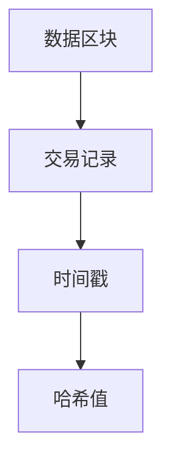
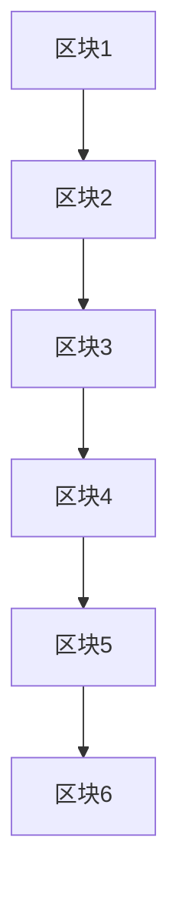
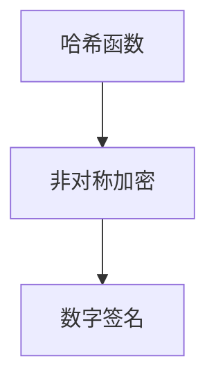
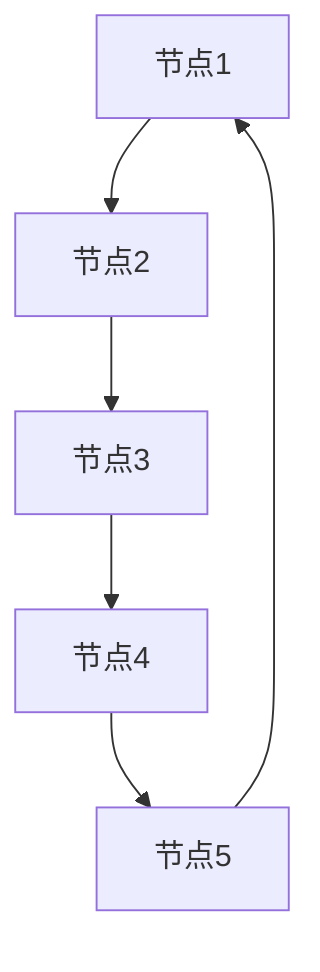

                 

# 文章标题：区块链技术在注意力价值交易中的应用

> 关键词：区块链，注意力价值，交易，应用，技术

> 摘要：本文旨在探讨区块链技术在注意力价值交易中的应用，分析其核心概念、技术基础、模型设计以及实际应用案例，探讨其面临的挑战和未来发展前景。文章通过逐步分析，旨在为读者提供一份全面、深入的技术指南。

## 引言

在当今数字时代，信息爆炸与数据过载已经成为普遍现象。在这种背景下，注意力成为了一种稀缺资源，如何在信息流中筛选和获取有价值的内容变得尤为重要。区块链技术作为一种去中心化、安全可靠的数据存储和传输技术，其在注意力价值交易中的应用具有重要的研究价值。

注意力价值交易是指通过区块链技术实现用户对注意力资源的交换，使得用户能够通过投入注意力和时间获得相应的回报。这种交易模式不仅能够激励用户参与内容创作和分享，还可以优化信息传播和资源分配。

本文将首先介绍区块链技术和注意力价值交易的基本概念，然后逐步分析区块链技术的基础知识，包括核心概念、共识算法、智能合约和钱包等。接下来，我们将讨论注意力价值交易模型的设计，包括注意力价值的计算、分配和交易机制。随后，文章将探讨区块链技术在注意力价值交易中的实际应用案例，如内容创作、社交媒体和教育等领域。最后，本文将总结区块链注意力价值交易面临的挑战，并对未来发展进行展望。

通过本文的逐步分析，我们希望读者能够对区块链技术在注意力价值交易中的应用有更深入的理解，为相关领域的研究和实践提供参考。

## 第一部分：区块链技术与注意力价值交易概述

### 1.1 区块链技术简介

区块链技术是一种分布式账本技术，通过将数据分散存储在网络中的多个节点上，实现了去中心化的数据管理和安全传输。区块链的基本组成包括数据区块、链式结构和加密算法等。

数据区块是区块链的基本单位，包含了时间戳、交易记录和哈希值等数据。每个区块通过哈希函数与前一个区块的哈希值相连，形成链式结构，确保数据的不可篡改性和可追溯性。区块链上的加密算法则用于保护数据的安全性和隐私性。

区块链的特点包括去中心化、不可篡改和透明性。去中心化意味着数据不再依赖于中心化的机构或服务器，减少了单点故障的风险。不可篡改性则确保了数据在区块链上的真实性，任何尝试篡改数据的行为都会被记录并拒绝。透明性使得所有参与节点都能查看和验证区块链上的数据，提高了系统的可信度。

### 1.2 注意力价值交易的概念

注意力价值交易是指通过区块链技术实现用户对注意力资源的交换，使得用户能够通过投入注意力和时间获得相应的回报。在注意力价值交易中，用户的注意力被视为一种稀缺资源，可以通过交易获得经济价值。

注意力价值交易的优势主要体现在以下几个方面：

1. **激励用户参与**：通过提供经济回报，鼓励用户参与内容创作、分享和传播，提高信息质量。
2. **优化资源分配**：通过区块链技术的透明性和去中心化特性，实现注意力资源的优化分配，减少信息过载。
3. **增强隐私保护**：用户可以在匿名的前提下参与交易，保护个人隐私。
4. **降低交易成本**：去中心化的交易模式减少了中介环节，降低了交易成本。

注意力价值交易的应用场景广泛，包括但不限于内容创作、社交媒体、教育和广告等领域。例如，内容创作者可以通过区块链技术激励粉丝进行内容消费和分享，实现收益分配；社交媒体平台可以通过注意力价值交易激励用户生成和传播高质量内容，提升用户体验。

### 1.3 区块链在注意力价值交易中的应用前景

区块链技术为注意力价值交易提供了一种新的解决方案，具有广阔的应用前景和潜在的市场价值。以下是一些主要的应用前景：

1. **内容创作与版权保护**：区块链技术可以用于记录和验证内容的版权信息，确保创作者获得应有的收益，同时保护版权不被侵权。
2. **社交媒体平台**：通过区块链技术实现用户注意力价值的计算和交易，激励用户生成和分享高质量内容，提升平台活跃度和用户黏性。
3. **教育领域**：区块链技术可以用于评估学习者的注意力价值，激励学生积极参与学习，同时实现教育资源的交易和共享。
4. **广告行业**：区块链技术可以帮助广告主精准投放广告，提高广告效果，同时降低广告成本。

然而，区块链在注意力价值交易中的应用也面临一些挑战，如技术成熟度、法律和监管环境、用户接受度等。未来，随着技术的不断进步和市场的逐步成熟，区块链在注意力价值交易中的应用有望进一步拓展和深化。

## 第二部分：区块链基础技术

### 2.1 区块链核心概念与架构

区块链技术的基础概念主要包括数据区块、链式结构、加密算法和去中心化网络。下面，我们将逐一介绍这些核心概念，并通过Mermaid流程图展示区块链的架构设计。

#### 数据区块

数据区块是区块链的基本组成单元，包含了若干条交易记录、一个时间戳和一个哈希值。交易记录记录了参与者的交易信息，时间戳保证了数据的顺序，哈希值用于确保数据的安全性。

#### 链式结构

区块链的链式结构是通过将各个区块通过哈希值连接起来实现的。每个区块的哈希值是其前一个区块的哈希值和区块内数据的哈希值的组合。这种链式结构确保了区块链数据的不可篡改性。

#### 加密算法

区块链使用加密算法来保护数据的安全性和隐私性。常见的加密算法包括哈希函数、非对称加密和数字签名。哈希函数用于生成数据摘要，确保数据的完整性；非对称加密用于数据加密和解密，保障通信的隐私性；数字签名用于验证数据的来源和完整性。

#### 去中心化网络

区块链的去中心化网络意味着数据不再依赖于中心化的服务器或机构。每个参与节点都存储一份完整的区块链数据，并通过共识算法达成一致。常见的共识算法包括工作量证明（PoW）、权益证明（PoS）和授权股权证明（DPoS）等。

通过上述核心概念和架构设计的介绍，我们可以看出区块链技术如何实现数据的去中心化存储和传输，保障数据的不可篡改性和安全性。在下一部分，我们将深入探讨区块链的共识算法，以进一步理解区块链技术的核心机制。

### 2.2 共识算法

共识算法是区块链技术的核心组成部分，用于确保区块链网络中的所有节点达成一致。在分布式系统中，共识算法解决的主要问题是如何在没有中心权威的情况下，多个节点能够安全、可靠地同步数据，并避免恶意节点的攻击。

#### 共识算法的作用与分类

共识算法的作用主要包括：

1. **数据一致性**：确保所有节点拥有相同的区块链数据。
2. **安全性**：防止恶意节点篡改数据。
3. **防双花**：防止同一笔资金被重复花费。

根据实现方式和目标，共识算法可以分为以下几类：

1. **工作量证明（PoW）**：节点通过解决复杂的数学问题（如生成一个满足特定条件的随机数）来竞争记账权。这种方式被称为“挖矿”，由于计算难度较高，需要大量计算资源，因此能够防止恶意攻击。

2. **权益证明（PoS）**：节点根据其在区块链网络中的权益（如持有的代币数量）来竞争记账权。相比PoW，PoS所需的计算资源较少，但权益分配和激励机制设计较为复杂。

3. **授权股权证明（DPoS）**：节点通过选举产生代表，代表们轮流记账。这种方式提高了交易速度，但需要解决选举过程中的公平性和去中心化问题。

4. **实用拜占庭容错（PBFT）**：通过预设的节点集合达成一致，无需挖矿或权益证明。这种方式适用于小规模、高信任度的区块链网络。

#### 常见的共识算法详解

1. **工作量证明（PoW）**

   PoW是最早的共识算法之一，以比特币为代表。其基本思想是：节点通过解决一个随机的数学问题来获得记账权，该问题的难度随网络难度调整。PoW具有以下特点：

   - **安全性高**：由于计算资源需求大，攻击成本高，难以进行51%攻击。
   - **去中心化**：任何人都可以参与挖矿，保证了网络的去中心化。
   - **缺点**：能源消耗大，计算资源浪费。

2. **权益证明（PoS）**

   PoS算法通过节点的权益（如持有的代币数量）来决定记账权。其优点包括：

   - **能源消耗低**：无需大量计算，降低了能源消耗。
   - **安全性高**：恶意节点需要控制大部分权益才能攻击网络。
   - **缺点**：权益分配和激励问题较为复杂，可能导致贫富差距扩大。

3. **授权股权证明（DPoS）**

   DPoS通过选举产生代表，代表们轮流记账。其优点包括：

   - **交易速度快**：代表记账减少了验证时间，提高了交易速度。
   - **去中心化**：选举过程保证了去中心化特性。
   - **缺点**：选举过程中的公平性和去中心化问题需要解决。

4. **实用拜占庭容错（PBFT）**

   PBFT通过预设的节点集合达成一致，具有较高的效率和安全性。其优点包括：

   - **高效率**：无需挖矿或权益证明，记账速度快。
   - **安全性高**：通过多数节点达成一致，防止恶意攻击。
   - **缺点**：适用于小规模、高信任度的区块链网络。

通过对比不同共识算法的特点，我们可以看出每种算法都有其适用的场景和优缺点。选择合适的共识算法对区块链网络的安全性和性能至关重要。

### 2.3 智能合约

智能合约是区块链上的可编程合同，通过代码自动执行和记录交易。智能合约的出现解决了传统合同执行中的中介问题，实现了去中心化的自动化交易。

#### 智能合约的定义与功能

智能合约的定义可以理解为一种自动执行的合同，其中合同条款以代码形式嵌入到区块链上。当满足特定条件时，智能合约会自动执行相应的操作，如转移资金、记录交易等。

智能合约的主要功能包括：

1. **自动化交易**：通过代码实现交易流程，无需人工干预。
2. **不可篡改性**：智能合约一旦部署，其代码和执行结果将永久记录在区块链上，无法篡改。
3. **透明性**：所有参与节点都可以查看智能合约的代码和执行过程，提高了交易的透明度。
4. **去中心化**：智能合约的执行不受中心化机构的控制，保证了去中心化的特性。

#### 智能合约的开发与部署

智能合约的开发通常涉及以下步骤：

1. **选择区块链平台**：根据应用场景选择适合的区块链平台，如以太坊、EOS等。
2. **编写合约代码**：使用特定的编程语言（如Solidity）编写智能合约代码，实现所需的业务逻辑。
3. **测试与调试**：在本地环境中测试智能合约代码，确保其正确执行。
4. **部署合约**：将测试通过的智能合约部署到区块链上，通常需要使用特定的部署工具和命令。

智能合约的部署涉及以下步骤：

1. **编译合约代码**：使用智能合约编译器将Solidity代码编译为EVM（以太坊虚拟机）字节码。
2. **生成合约ABI**：编译器会生成合约的ABI（应用程序二进制接口），用于后续的部署和调用。
3. **部署合约**：使用区块链节点或钱包工具将编译后的合约代码部署到区块链上，生成合约地址。
4. **调用合约**：通过合约地址和ABI，可以在区块链上调用智能合约，执行预定义的操作。

通过智能合约，区块链技术实现了更高层次的去中心化和自动化，为各种应用场景提供了强大的工具。在下一部分，我们将探讨钱包与数字签名技术，进一步理解区块链的安全性。

### 2.4 钱包与数字签名

#### 钱包的作用与分类

钱包是区块链用户管理和存储数字资产的工具。钱包的作用主要包括：

1. **存储资产**：钱包用于存储用户的数字资产（如比特币、以太币等），确保资产的安全性。
2. **管理交易**：钱包提供用户与区块链进行交互的接口，用户可以通过钱包发起和接收交易。
3. **提供身份验证**：钱包通常包含用户的私钥和公钥，用于验证用户的身份和签名交易。

根据存储方式和使用场景，钱包可以分为以下几种类型：

1. **热钱包**：热钱包是连接到互联网的电子钱包，用户可以通过电脑或手机应用程序管理资产。热钱包的便利性高，但安全性相对较低，容易遭受黑客攻击。
2. **冷钱包**：冷钱包是离线存储的物理钱包，如硬件钱包和纸钱包。冷钱包的安全性较高，但由于操作不便，用户较少使用。
3. **轻钱包**：轻钱包是仅存储公钥和部分交易信息的电子钱包，用户无需存储完整区块链数据。轻钱包适合移动设备和轻量级应用，但安全性相对较低。

#### 数字签名技术原理

数字签名是一种用于验证消息真实性和完整性的技术，类似于传统的手写签名。数字签名的基本原理如下：

1. **私钥和公钥**：数字签名使用非对称加密算法生成一对密钥，私钥用于签名，公钥用于验证。
2. **签名过程**：签名者使用私钥对消息进行加密，生成签名。签名过程涉及哈希函数和加密算法，确保消息的完整性和不可篡改性。
3. **验证过程**：验证者使用公钥对签名进行解密，并与原始消息的哈希值进行比对，验证签名的正确性。

数字签名具有以下特点：

1. **不可伪造性**：由于私钥的保密性，数字签名无法被伪造。
2. **不可否认性**：签名者无法否认其签名，因为签名是可验证的。
3. **完整性**：数字签名确保了消息在签名后的完整性，任何篡改都会导致验证失败。

通过钱包和数字签名技术，区块链技术实现了资产的安全存储和交易验证，为去中心化的数字世界提供了可靠的基础。在下一部分，我们将探讨注意力价值交易模型的设计，进一步理解区块链在注意力价值交易中的应用。

### 3.1 注意力价值交易模型概述

注意力价值交易模型是区块链技术在注意力价值交易中的核心设计，旨在通过区块链技术实现用户注意力资源的交换和分配。该模型的基本结构包括以下几个关键组成部分：

1. **用户**：用户是注意力价值交易的参与者，包括内容创作者、内容消费者和其他参与者。
2. **内容**：内容是用户注意力的焦点，可以是文章、视频、图片等各种形式的信息。
3. **区块链**：区块链用于记录和管理注意力交易数据，确保交易的透明性和不可篡改性。
4. **智能合约**：智能合约是执行注意力价值交易的自动化规则，包括注意力价值的计算、分配和交易流程。
5. **钱包**：钱包用于存储用户的数字资产和私钥，确保交易的安全性和便捷性。

注意力价值交易模型的工作原理如下：

1. **用户创建内容**：内容创作者将内容上传到区块链网络，并通过智能合约记录内容的元数据。
2. **用户参与交易**：内容消费者通过支付注意力代币或其他数字资产，获取对内容的访问权限。
3. **智能合约执行**：智能合约根据预定义的规则，自动计算和分配注意力价值，确保创作者获得应有的收益。
4. **交易记录**：所有的交易数据都被记录在区块链上，确保透明性和不可篡改性。

通过这样的模型设计，区块链技术实现了注意力价值交易的去中心化、透明和安全。在下一部分，我们将详细讨论注意力价值分配机制，进一步理解该模型的具体实现。

### 3.2 注意力价值分配机制

注意力价值分配机制是注意力价值交易模型中的核心组成部分，旨在确保注意力价值的公平、合理分配。以下是该机制的具体设计：

#### 注意力价值的计算方法

注意力价值的计算是分配机制的基础。注意力价值通常通过以下方法进行计算：

1. **用户参与度**：用户对内容的观看时长、点赞、评论和分享等行为可以反映其注意力投入程度。通过统计这些行为的数据，可以计算出用户对内容的注意力价值。

2. **内容质量**：内容的质量直接影响用户的注意力投入。可以通过内容的点赞数、评论数、分享数等指标来评估内容的质量，从而调整注意力价值的计算。

3. **权重分配**：不同用户和内容的权重可以影响注意力价值的计算。例如，内容创作者和知名用户的注意力价值可能更高，可以赋予更高的权重。

#### 注意力价值的分配原则

注意力价值的分配应遵循以下原则：

1. **公平性**：确保所有参与者都能公平地获得其应得的收益，避免过度集中。

2. **透明性**：所有交易数据应记录在区块链上，确保透明可查。

3. **激励性**：通过合理的分配机制激励用户参与内容创作和分享，提升整体生态系统的活跃度。

#### 注意力价值的分配策略

以下是一些常见的注意力价值分配策略：

1. **直接分配**：根据用户对内容的参与度直接分配注意力价值。例如，用户每观看1分钟内容，可获得相应比例的注意力价值。

2. **按比例分配**：根据内容的质量和用户参与度按比例分配注意力价值。例如，内容创作者获得总价值的70%，用户获得剩余的30%。

3. **阶梯分配**：根据用户的参与程度设置不同的奖励阶梯。例如，用户首次参与内容消费可以获得较高比例的奖励，随着参与次数增加，奖励逐渐减少。

4. **奖励池分配**：将注意力价值存储在一个奖励池中，定期分配给活跃用户。这种方式可以鼓励用户持续参与，但需要合理设定分配规则。

通过精心设计的注意力价值分配机制，可以有效激励用户参与内容创作和消费，提升整体生态系统的健康度和活跃度。在下一部分，我们将详细探讨注意力价值交易机制的设计，进一步理解交易流程、规则和激励机制。

### 3.3 注意力价值交易机制设计

注意力价值交易机制是区块链技术实现注意力价值分配的核心环节。为了确保交易的安全、高效和透明，以下是注意力价值交易机制的设计：

#### 交易流程

注意力价值交易的流程可以分为以下几个步骤：

1. **内容发布**：内容创作者将内容上传至区块链网络，并通过智能合约记录内容的元数据，如标题、描述、创建时间等。

2. **用户参与**：用户通过钱包向智能合约支付注意力代币或其他数字资产，以获取对内容的访问权限。

3. **价值计算**：智能合约根据用户参与度、内容质量和其他相关因素计算注意力价值。

4. **价值分配**：智能合约根据预定的分配规则，将计算出的注意力价值分配给内容创作者和其他参与用户。

5. **交易记录**：所有的交易数据都被记录在区块链上，确保透明性和不可篡改性。

#### 交易规则

注意力价值交易的规则需要明确以下几个方面：

1. **访问权限**：用户需要支付一定的费用才能访问特定内容。费用可以由内容创作者设定，并通过智能合约执行。

2. **费用类型**：费用可以是固定金额，也可以是按时间、按次数或其他方式计算。

3. **交易限额**：为了防止恶意攻击和垃圾交易，可以设定每日或每月的交易限额。

4. **退款规则**：如果用户未满足访问条件，可以设定相应的退款规则。

5. **争议解决**：建立争议解决机制，如仲裁委员会或智能合约内置的仲裁功能。

#### 交易费用与激励机制

注意力价值交易机制中的交易费用和激励机制设计对整个生态系统的健康度有重要影响。以下是几种常见的交易费用和激励机制：

1. **交易费用**：交易费用通常用于支付区块链网络的维护费用和奖励矿工。费用可以按每次交易计算，也可以按区块计算。

2. **开发者奖励**：内容创作者可以通过平台获得一定比例的奖励，以鼓励内容创作。

3. **用户奖励**：积极参与内容消费和分享的用户可以获得额外的奖励，提高用户活跃度。

4. **社区治理**：通过代币持有者投票机制，决定平台的发展方向和资金分配，增强社区的自治能力。

通过精心设计的交易流程、交易规则和激励机制，注意力价值交易机制能够确保交易的安全、透明和高效，促进区块链注意力价值交易生态系统的健康发展。

### 第四部分：区块链在注意力价值交易中的应用实践

#### 4.1 区块链在内容创作领域的应用

区块链技术在内容创作领域的应用主要体现在激励创作者和版权保护两个方面。

**内容创作者激励机制**

区块链技术通过智能合约实现自动化的收益分配，激励内容创作者创作高质量的内容。创作者在发布内容时，可以通过智能合约设置收益分配规则，例如：

- 创作者获得主要收益，比例可以设置为70%。
- 分发平台获得剩余的30%，用于平台的运营和维护。
- 赞助商可以投放广告，按点击量或其他指标获得回报。

这种激励机制不仅能够保障创作者的权益，还可以鼓励更多的创作者参与内容创作，提升整体内容质量。

**内容分发与版权保护**

区块链技术提供了透明的记录和验证机制，确保内容的版权归属和分发透明。创作者在发布内容时，可以将版权信息记录在区块链上，使得任何后续的版权交易和授权都有据可查。

此外，区块链技术还可以通过智能合约实现自动化的版权交易和授权。例如：

- 当创作者授权他人使用其作品时，智能合约可以自动执行授权协议，确保授权的有效性和合规性。
- 在内容分发过程中，区块链可以记录每一步的传播路径，确保内容的真实性和可追溯性。

通过这些应用，区块链技术为内容创作者提供了有力的支持，保障其权益，同时也提高了内容分发的效率和安全。

#### 4.2 区块链在社交媒体领域的应用

区块链技术在社交媒体领域的应用主要体现在注意力价值计算和交易，以及隐私保护两个方面。

**注意力价值计算和交易**

区块链技术可以通过智能合约实现用户注意力价值的计算和交易。用户在社交媒体平台上互动（如点赞、评论、分享等）时，智能合约可以记录这些互动行为，并计算相应的注意力价值。

注意力价值的交易可以是用户之间直接交换，也可以通过平台进行。例如：

- 用户A通过点赞、评论等方式为内容创作者B带来注意力价值，智能合约会计算并记录这些价值。
- 用户B可以选择用自身的数字资产购买这些注意力价值，获得对内容的访问权限。

这种机制不仅激励用户积极参与互动，还可以促进社交媒体生态的繁荣。

**隐私保护**

区块链技术在社交媒体领域的另一个重要应用是隐私保护。传统的社交媒体平台常常面临用户隐私泄露的风险。而区块链技术通过加密和去中心化特性，能够有效保护用户的隐私。

具体而言，区块链技术可以实现以下隐私保护措施：

- 用户身份匿名化：用户可以在区块链上使用匿名地址进行交易和互动，确保身份隐私。
- 加密通信：区块链网络中的通信数据可以通过加密技术进行保护，防止中间人攻击和监听。
- 数据不可篡改：区块链上的数据一旦记录，就无法篡改，确保了用户数据的真实性和完整性。

通过这些应用，区块链技术为社交媒体平台提供了更加安全、透明的交互环境，提升了用户的信任和参与度。

#### 4.3 区块链在教育领域的应用

区块链技术在教育领域的应用主要体现在学习评估和资源共享两个方面。

**学习评估**

区块链技术可以通过智能合约实现自动化的学习评估和记录。学生完成课程作业或考试后，教师可以通过智能合约自动评分，并将成绩记录在区块链上。这种机制不仅提高了评估的效率，还确保了成绩的真实性和不可篡改性。

此外，区块链技术还可以用于记录学生的学分和证书信息。学生可以通过区块链验证自己的学业成果，避免了学历造假的问题。

**资源共享**

区块链技术可以用于教育资源的交易和共享，促进教育资源的优化配置。例如：

- 教师可以将自己的教学资源（如课件、视频等）上传至区块链平台，并设置相应的价格或免费提供。
- 学生可以通过支付数字资产获取这些资源，或与他人交易资源，实现资源的高效利用。

通过这些应用，区块链技术为教育领域带来了新的机遇，提高了教育资源的透明度和可追溯性，促进了教育公平和效率。

### 5.1 区块链注意力价值交易的挑战

尽管区块链技术在注意力价值交易中具有巨大的潜力，但在实际应用中仍然面临诸多挑战。

#### 技术层面的挑战

1. **性能瓶颈**：区块链技术的性能瓶颈是当前的主要问题。随着用户数量的增加，区块链的处理能力可能会受到限制，导致交易延迟和吞吐量不足。

2. **可扩展性**：区块链网络的可扩展性也是一大挑战。如何在不牺牲安全性和去中心化特性的前提下，提高区块链网络的扩展能力，是一个亟待解决的问题。

3. **安全性**：尽管区块链技术具有较高的安全性，但仍然可能遭受51%攻击、智能合约漏洞等威胁。确保区块链系统在复杂环境下依然安全可靠，需要持续的技术创新和改进。

4. **互操作性**：不同区块链平台之间的互操作性也是一个挑战。如何实现不同区块链平台之间的数据共享和交易，需要统一的协议和标准。

#### 法律与监管层面的挑战

1. **法律不确定性**：区块链技术涉及的法律问题较多，包括数字资产的法律地位、交易合法性等。不同国家和地区的法律法规差异较大，导致应用难度增加。

2. **监管政策**：区块链技术的去中心化特性使得监管变得更加困难。如何制定有效的监管政策，既保护用户权益，又防止非法交易和洗钱等行为，是当前亟待解决的问题。

3. **合规性**：区块链应用需要遵守不同国家和地区的法律法规，如金融监管、数据保护等。合规性问题可能会限制区块链技术的广泛应用。

#### 用户接受度

1. **技术门槛**：区块链技术相对复杂，对用户的技术门槛较高。如何降低用户使用区块链的门槛，提高用户接受度，是区块链应用推广的关键。

2. **隐私担忧**：尽管区块链技术提供了一定的隐私保护，但用户对隐私泄露的担忧仍然存在。如何有效地解决用户隐私问题，提高用户信任度，是区块链应用需要考虑的重要因素。

3. **教育普及**：区块链技术的普及教育也是一个挑战。如何通过教育和宣传，提高用户对区块链技术的了解和接受程度，是推动区块链应用的关键。

总之，区块链注意力价值交易面临着技术、法律和用户接受度等多方面的挑战。要实现区块链技术在注意力价值交易中的广泛应用，需要各方共同努力，解决这些问题，推动区块链技术的发展。

### 5.2 区块链注意力价值交易的发展趋势

随着区块链技术的不断进步，其在注意力价值交易中的应用前景愈发广阔。以下从技术进步、市场需求和政策支持三个方面探讨区块链注意力价值交易的发展趋势。

#### 技术进步带来的变革

1. **性能提升**：区块链技术的性能瓶颈一直是其发展的主要障碍。随着新一代区块链技术的出现，如Layer 2解决方案、分片技术和状态通道等，区块链网络的性能有望得到显著提升。这些技术能够有效提高区块链的交易速度和吞吐量，满足大规模应用的需求。

2. **扩展性增强**：区块链的可扩展性是另一个关键问题。通过跨链技术和侧链设计，不同区块链平台之间的互操作性将得到增强。这将有助于实现区块链生态系统内的数据共享和交易，促进整个行业的繁荣。

3. **安全性提升**：随着加密算法和安全协议的不断改进，区块链技术的安全性将进一步提高。例如，零知识证明（ZKP）和安全多方计算（MPC）等技术将为区块链提供更强大的隐私保护和防攻击能力，增强用户对区块链的信任。

4. **智能合约优化**：智能合约的优化也是技术进步的重要方向。新一代智能合约平台将提供更强大的编程能力和更安全的执行环境，使得开发者能够轻松构建复杂的去中心化应用（DApp），推动区块链注意力价值交易的创新发展。

#### 市场需求与政策支持的影响

1. **市场需求增长**：随着数字经济的快速发展，用户对高质量内容的需求日益增长。区块链技术提供的去中心化、透明和可追溯特性，使其在注意力价值交易中具有独特的优势。未来，随着区块链技术的成熟和用户意识的提高，市场需求将继续推动区块链注意力价值交易的发展。

2. **政策支持**：不同国家和地区对区块链技术的态度逐渐趋向积极。政府出台了一系列支持政策，如提供研发资金、设立区块链试验区等，以促进区块链技术的创新和应用。这些政策支持为区块链注意力价值交易的发展提供了良好的环境。

3. **产业合作**：区块链技术与其他行业的融合将推动注意力价值交易的创新。例如，与人工智能、物联网和大数据等技术的结合，将使注意力价值交易更加智能化和高效化。产业合作将加速区块链注意力价值交易的落地应用，推动整个行业的发展。

总之，区块链注意力价值交易的发展趋势充满机遇和挑战。随着技术的不断进步、市场需求的增长和政策支持，区块链注意力价值交易有望在未来实现广泛应用，成为数字经济的重要组成部分。

### 5.3 区块链注意力价值交易的未来展望

随着区块链技术的不断发展和应用场景的扩展，注意力价值交易在未来的发展前景充满潜力。以下从新型应用场景和区块链与人工智能结合两个方面进行展望。

#### 新型应用场景的出现

1. **数字艺术**：区块链技术为数字艺术创作和交易提供了新的可能性。数字艺术品（如NFT）通过区块链技术实现唯一性和可追溯性，确保创作者的权益得到保障。未来，随着区块链技术的普及，数字艺术市场将迎来新的发展机遇。

2. **健康医疗**：区块链技术可以用于记录和验证医疗数据，确保数据的真实性和隐私性。在健康医疗领域，用户可以通过区块链技术管理自己的健康数据，实现个性化医疗和精准治疗。此外，区块链还可以用于药品溯源，提高药品安全性和监管效率。

3. **金融领域**：区块链技术在金融领域的应用将不断深入。注意力价值交易可以为金融服务提供新的激励机制，如保险、贷款和投资等领域。通过区块链技术，金融机构可以降低交易成本、提高效率，同时保障数据的安全性和透明性。

4. **供应链管理**：区块链技术可以用于供应链管理，确保商品的来源和流通过程透明可追溯。在注意力价值交易的支持下，供应链参与者可以通过支付注意力价值获取更多信息，提高供应链的效率和可靠性。

#### 区块链与人工智能的结合

1. **智能合约优化**：区块链与人工智能技术的结合可以用于智能合约的优化。通过机器学习算法，智能合约可以更加灵活地适应复杂业务场景，实现更智能的自动执行和决策。

2. **注意力价值评估**：人工智能技术可以用于分析和评估用户的注意力价值。通过深度学习算法，系统可以识别用户的兴趣和行为模式，精确计算其注意力价值，为交易提供更准确的依据。

3. **数据分析和预测**：区块链与人工智能技术的结合可以实现更高效的数据分析和预测。通过区块链记录的大量交易数据，人工智能可以挖掘有价值的信息，为市场决策提供支持。

4. **智能投资**：区块链与人工智能技术的结合可以用于智能投资。通过分析市场数据、用户行为和注意力价值，智能投资系统可以自动调整投资策略，提高投资回报率。

总之，区块链注意力价值交易的未来充满机遇和挑战。随着新型应用场景的出现和区块链与人工智能的结合，注意力价值交易将在数字经济中发挥更加重要的作用，推动社会和经济的发展。

## 结语

本文通过对区块链技术和注意力价值交易的应用进行深入分析，揭示了其在内容创作、社交媒体和教育等领域的潜力。区块链技术的去中心化、安全性和透明性为注意力价值交易提供了坚实的保障，使得用户能够更加公平和高效地参与和受益。

然而，区块链注意力价值交易仍面临技术、法律和用户接受度等多方面的挑战。未来，随着技术的不断进步、市场需求的增长和政策支持，区块链注意力价值交易有望在更多领域实现广泛应用，成为数字经济的重要组成部分。

让我们共同期待区块链技术在注意力价值交易中的进一步发展，探索更多创新应用，为人类社会带来更多价值和福祉。

### 作者信息

作者：AI天才研究院/AI Genius Institute & 禅与计算机程序设计艺术 /Zen And The Art of Computer Programming

AI天才研究院（AI Genius Institute）是一家致力于推动人工智能技术研究和应用的创新机构，专注于培养顶尖的人工智能专家和研究者。研究院在计算机图灵奖领域具有深厚的研究积累，致力于探索人工智能技术的前沿应用，推动社会和经济的进步。

《禅与计算机程序设计艺术》（Zen And The Art of Computer Programming）是作者的经典著作，深入探讨了计算机编程的哲学和艺术，为程序员提供了独特的视角和方法论。该书以其深刻的思想和实用的技术，受到了全球程序员的广泛推崇，成为计算机编程领域的经典之作。

通过本文，我们希望读者能够对区块链技术在注意力价值交易中的应用有更深入的理解，为相关领域的研究和实践提供参考。我们期待与广大读者共同探索区块链技术的未来，共创更加美好的数字世界。

