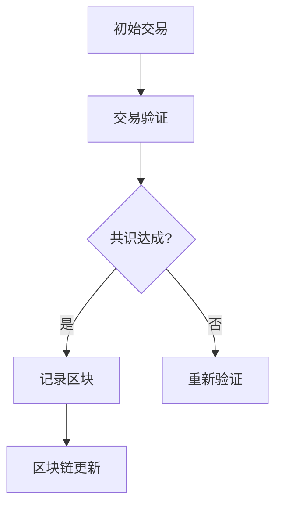

                 

### 文章标题

《区块链技术在注意力经济中的应用前景》

> 关键词：区块链、注意力经济、内容创作、版权保护、智能合约

> 摘要：本文将深入探讨区块链技术在注意力经济中的潜在应用前景。首先，我们将介绍区块链技术的基础知识，并分析其与注意力经济的关联。随后，文章将详细探讨区块链在内容创作、版权保护和内容付费模式中的应用。此外，我们将解析区块链技术的核心算法与原理，并通过实际案例展示其在社交媒体、广告网络和游戏领域的应用。最后，本文将讨论区块链技术面临的挑战与未来发展趋势，为读者提供全面而深入的见解。

### 第一部分：区块链技术与注意力经济概述

#### 第1章：区块链技术基础

##### 1.1 区块链的定义与原理

区块链技术是一种分布式数据库技术，通过加密算法和数据块链结构实现了信息的不可篡改性和安全性。区块链的基本架构包括数据层、网络层、共识层、激励层和应用层。

- **数据层**：数据层主要涉及数据的存储和管理。区块链通过将交易数据分组为数据块，并将这些数据块按时间顺序链接成链式数据结构，确保数据的完整性和安全性。
- **网络层**：网络层负责网络通信和数据的传播。区块链采用点对点（P2P）网络结构，使得每个节点都可以直接与其他节点进行通信，提高了系统的去中心化和容错能力。
- **共识层**：共识层确保了区块链网络中的所有节点对于数据的一致性和正确性。通过共识算法（如工作量证明、权益证明等），节点之间达成共识，验证和确认交易的有效性。
- **激励层**：激励层提供激励机制，鼓励节点参与区块链网络的维护和运营。通过代币奖励，节点可以获得经济利益，从而增加网络的安全性和稳定性。
- **应用层**：应用层是区块链技术与实际应用场景的结合，包括各种去中心化应用（DApp）和服务。通过智能合约，应用层可以实现自动化、可信的合约执行和管理。

##### 1.2 区块链与注意力经济的关系

注意力经济是指通过吸引和留住用户的注意力来创造经济价值的一种经济模式。区块链技术在注意力经济中具有独特的优势和应用前景。

- **内容创作者权益保障**：区块链技术可以为内容创作者提供透明、公正的权益保障。通过智能合约，创作者可以精确地追踪和管理自己的内容版权，确保其权益得到合法保护和合理分配。
- **去中心化的内容分发**：区块链技术可以实现去中心化的内容分发，使得内容创作者可以直接与用户进行互动和交易，减少中间环节，提高内容的传播效率和价值。
- **粉丝经济与粉丝互动**：区块链技术可以构建粉丝经济体系，通过代币和积分等方式激励粉丝参与内容创作和传播，建立更加紧密的粉丝关系，提升用户忠诚度和品牌价值。

##### 1.3 区块链技术发展的现状与趋势

区块链技术自2008年比特币问世以来，已经经历了快速发展。目前，区块链技术在各个领域取得了显著的应用成果，并在未来有着广阔的发展前景。

- **发展现状**：区块链技术已经在金融、供应链管理、物联网、医疗健康等领域得到广泛应用。例如，金融领域中的跨境支付、供应链管理中的溯源防伪、物联网中的设备管理等都取得了积极进展。
- **发展趋势**：随着技术的不断进步和应用的深入，区块链技术将朝着以下方向发展：
  - **高性能区块链平台**：随着交易量的增加，区块链平台需要提高性能和扩展性。高性能区块链平台如Ethereum 2.0、Solana等正逐渐成为主流选择。
  - **跨链与层链技术**：跨链技术可以实现不同区块链之间的互操作性和数据共享，提高整个区块链生态系统的效率。层链技术则通过将计算和存储分离，提高区块链的可扩展性。
  - **去中心化应用（DApp）**：去中心化应用将继续成为区块链技术的重要发展方向。通过智能合约和区块链网络，DApp可以实现去中心化的金融服务、内容创作、供应链管理等应用。

### 第二部分：区块链技术在注意力经济中的应用

#### 第2章：区块链在内容创作领域的应用

##### 2.1 内容创作与区块链

区块链技术在内容创作领域具有巨大的应用潜力，可以为创作者提供更好的权益保障和创作环境。

- **权益保障**：区块链技术可以为内容创作者提供透明、公正的权益保障。通过智能合约，创作者可以精确地追踪和管理自己的内容版权，确保其权益得到合法保护和合理分配。
- **去中心化的内容分发**：区块链技术可以实现去中心化的内容分发，使得内容创作者可以直接与用户进行互动和交易，减少中间环节，提高内容的传播效率和价值。
- **粉丝经济与粉丝互动**：区块链技术可以构建粉丝经济体系，通过代币和积分等方式激励粉丝参与内容创作和传播，建立更加紧密的粉丝关系，提升用户忠诚度和品牌价值。

##### 2.2 区块链在版权保护中的应用

版权保护是内容创作者面临的重要问题，区块链技术提供了一种有效的解决方案。

- **数字版权管理**：区块链技术可以实现数字版权管理，确保内容的唯一性和不可篡改性。通过区块链，创作者可以永久记录自己的版权信息，确保版权得到合法保护。
- **版权交易与追踪**：区块链技术可以提供透明、可信的版权交易平台，使得版权交易过程更加高效和公正。创作者可以通过区块链记录版权交易记录，方便追踪和维权。
- **智能合约在版权保护中的应用**：智能合约可以自动执行版权相关的合约条款，确保版权权益得到合理分配。例如，当创作者授权他人使用其作品时，智能合约可以自动执行授权协议，确保授权费用得到及时支付。

##### 2.3 区块链在内容付费模式中的应用

内容付费模式是内容创作者获得收入的重要方式，区块链技术可以为内容付费模式提供更好的保障和激励机制。

- **去中心化内容付费**：区块链技术可以实现去中心化的内容付费，用户可以直接向创作者支付费用，减少中间环节，提高付费的透明度和信任度。
- **粉丝经济与粉丝互动**：区块链技术可以构建粉丝经济体系，通过代币和积分等方式激励粉丝参与内容创作和传播，建立更加紧密的粉丝关系，提升用户忠诚度和品牌价值。
- **智能合约在内容付费中的应用**：智能合约可以自动执行内容付费的合约条款，确保付费过程的透明、公正和高效。例如，当用户订阅内容时，智能合约可以自动执行订阅协议，确保订阅费用得到及时支付。

### 第三部分：区块链技术的核心算法与原理

#### 第3章：区块链核心技术原理解析

##### 3.1 哈希算法

哈希算法是区块链技术中的核心算法之一，用于确保数据的唯一性和完整性。

- **哈希函数的基本概念**：哈希函数是一种将任意长度的数据映射为固定长度字符串的算法。哈希函数具有以下特点：
  - 输入可以是任意长度的数据，但输出是固定长度的字符串。
  - 不同的输入数据映射到相同的输出字符串的概率非常低。
  - 给定哈希值，无法反推出原始数据。

- **哈希算法的数学模型**：常见的哈希算法包括MD5、SHA-1、SHA-256等。其中，SHA-256是一种较为安全的哈希算法，其数学模型如下：
  - 输入：一个任意长度的数据块。
  - 输出：一个256位的哈希值。
  - 计算过程：
    - 将输入数据分组，每组512位。
    - 对每组数据进行预处理，包括填充和扩展。
    - 通过迭代计算，得到最终的哈希值。

- **哈希算法的伪代码实现**：
```csharp
function sha256(input) {
    // 预处理
    // 填充和扩展
    // 迭代计算
    // 返回哈希值
}
```

##### 3.2 共识机制

共识机制是区块链网络中节点之间达成共识的算法，用于确保数据的一致性和正确性。

- **共识机制的定义**：共识机制是一种分布式系统中的算法，用于在多个参与者之间达成一致的决策。在区块链网络中，共识机制用于验证和确认交易的有效性，确保区块链数据的完整性和安全性。

- **常见的共识算法**：常见的共识算法包括工作量证明（PoW）、权益证明（PoS）、委托权益证明（DPoS）等。每种算法都有其特点和适用场景。

  - **工作量证明（PoW）**：PoW算法通过计算难度来防止恶意攻击和攻击者控制网络。参与者需要通过解决复杂的数学难题来获得记账权，从而获得代币奖励。
  - **权益证明（PoS）**：PoS算法通过持有代币的数量和时间来决定记账权。持有代币数量越多、持有时间越长，参与记账的几率越大。
  - **委托权益证明（DPoS）**：DPoS算法通过选举出一定数量的委托人来实现记账权。委托人通过获得选民的支持来获得记账权，从而获得代币奖励。

- **共识机制的 Mermaid 流程图**：


##### 3.3 智能合约

智能合约是区块链网络中的自动执行合约，用于实现去中心化的合约执行和管理。

- **智能合约的基本原理**：智能合约是一种程序，运行在区块链网络上，通过编写代码来定义合约条款和执行规则。智能合约具有以下特点：
  - 自动执行：智能合约在满足特定条件时自动执行，无需人工干预。
  - 不可篡改：智能合约一旦部署在区块链上，合约代码和条款不可篡改，保证了合约的公正性和透明性。
  - 去中心化：智能合约在区块链网络中运行，不受单一实体控制，保证了系统的安全性和去中心化。

- **智能合约的编程语言**：常见的智能合约编程语言包括Solidity、Vyper等。Solidity是Ethereum平台的主要编程语言，支持面向对象编程和函数调用等功能。

- **智能合约的执行流程**：智能合约的执行流程包括以下几个步骤：
  - 编写智能合约代码：开发者使用智能合约编程语言编写合约代码，定义合约的条款和执行规则。
  - 部署智能合约：将合约代码上传到区块链网络，部署智能合约。
  - 调用智能合约：用户通过区块链网络调用智能合约，执行特定的操作。
  - 合约执行：智能合约根据用户输入和合约条款自动执行操作，并返回结果。

### 第四部分：区块链技术在注意力经济中的应用案例

#### 第4章：区块链在社交媒体领域的应用案例

##### 4.1 去中心化社交媒体平台

去中心化社交媒体平台（DMS）利用区块链技术实现用户数据的去中心化存储和交易，提供更安全、透明和去中心化的社交体验。

- **平台架构与功能**：
  - **去中心化存储**：用户数据存储在分布式网络中，而非中心化服务器。通过区块链技术，用户可以自主管理自己的数据，并选择授权他人访问。
  - **加密通信**：平台采用加密技术确保用户通信的安全性，防止第三方窃取或篡改数据。
  - **用户激励**：平台通过代币奖励用户参与内容创作和传播，建立更紧密的社群关系。

- **用户行为与激励机制**：
  - **内容创作**：用户可以创作和发布内容，通过区块链技术确保内容的原创性和不可篡改性。
  - **点赞与评论**：用户可以对内容进行点赞、评论等互动行为，通过代币奖励激励机制增加用户的参与度。
  - **内容打赏**：用户可以通过代币对喜欢的内容进行打赏，支持创作者并获得一定的收益。

##### 4.2 区块链广告网络

区块链广告网络通过去中心化的方式实现广告投放和收益分配，提高广告数据的透明性和可信度。

- **广告投放与收益分配**：
  - **去中心化广告投放**：广告主可以直接与用户进行广告投放，通过区块链技术确保广告数据的透明性和可信度。
  - **智能合约执行**：广告投放和收益分配过程通过智能合约自动执行，确保广告主和用户的权益得到合法保护。
  - **用户收益分配**：用户可以根据自己对广告的贡献和曝光度获得相应的收益，激励用户积极参与广告投放和传播。

- **广告数据的透明性与可信度**：
  - **去中心化存储**：广告数据存储在分布式网络中，无法被篡改或删除，提高了数据的可信度。
  - **智能合约验证**：用户可以通过智能合约验证广告数据的真实性和准确性，确保广告投放的公正和透明。
  - **区块链审计**：区块链技术提供了可追溯的审计机制，广告主和用户可以随时查询广告数据的真实性和合法性。

##### 4.3 区块链游戏的开发与运营

区块链技术为游戏开发提供了去中心化的资产确权和交易机制，为游戏运营提供了新的激励机制。

- **游戏资产确权与交易**：
  - **去中心化资产确权**：游戏资产通过区块链技术实现去中心化确权，确保每个用户拥有唯一的资产所有权，防止资产被盗取或篡改。
  - **去中心化交易**：游戏资产可以在区块链上进行自由交易，用户可以自由买卖和交换游戏资产，提高游戏资产的流动性和价值。
  - **智能合约执行**：游戏资产交易过程通过智能合约自动执行，确保交易的安全和高效。

- **游戏经济的激励设计**：
  - **代币奖励**：游戏平台通过代币奖励用户参与游戏，激励用户积极互动和创作。
  - **粉丝经济**：游戏平台通过粉丝经济机制，鼓励用户参与游戏资产的创作和传播，提高游戏的热度和用户黏性。
  - **智能合约激励机制**：智能合约可以设计多种激励机制，例如任务奖励、打赏机制、粉丝投票等，提高用户的参与度和活跃度。

### 第五部分：区块链技术与注意力经济的挑战与未来

#### 第5章：区块链技术在注意力经济中的挑战

区块链技术在注意力经济中虽然具有巨大的潜力，但也面临着一些挑战。

##### 5.1 技术挑战

- **性能瓶颈与扩展性**：当前区块链技术存在性能瓶颈和扩展性问题，无法满足大规模应用场景的需求。如何提高区块链的性能和扩展性，是区块链技术发展的重要挑战。
- **安全性与隐私保护**：区块链技术虽然具有安全性，但也存在隐私保护问题。如何在保障用户隐私的前提下，提高区块链系统的安全性，是亟待解决的问题。

##### 5.2 法规与政策挑战

- **监管环境与合规要求**：区块链技术的广泛应用带来了监管挑战，如何制定合适的监管政策和合规要求，是区块链技术发展的重要问题。
- **法律风险与争议解决**：区块链技术涉及到的法律风险和争议问题逐渐增多，如何建立有效的法律体系和争议解决机制，是区块链技术发展的重要挑战。

#### 第6章：区块链技术与注意力经济的未来趋势

区块链技术与注意力经济的未来发展将呈现出以下几个趋势。

##### 6.1 技术创新方向

- **高性能区块链平台**：随着区块链应用的不断扩展，高性能区块链平台将逐渐成为主流选择。例如，Ethereum 2.0、Solana等平台正在积极研发和推广。
- **跨链与层链技术**：跨链技术可以实现不同区块链之间的互操作性和数据共享，提高整个区块链生态系统的效率。层链技术通过将计算和存储分离，提高区块链的可扩展性。

##### 6.2 应用场景拓展

- **教育与培训领域的应用**：区块链技术可以用于教育认证、在线课程、知识共享等领域，提高教育公平性和透明度。
- **医疗健康领域的应用**：区块链技术可以用于医疗数据共享、药品溯源、健康档案管理等领域，提高医疗行业的效率和安全性。

##### 6.3 社会经济影响

- **区块链对就业与创业的影响**：区块链技术的发展将为就业和创业带来新的机遇。区块链技术相关的职业和创业领域将不断扩展。
- **区块链对社会信用体系的建设**：区块链技术可以用于构建社会信用体系，提高信用评估的准确性和公正性，促进社会诚信建设。

### 第六部分：附录

#### 第7章：区块链技术在注意力经济中的工具与资源

##### 7.1 主流区块链平台与框架

- **Ethereum**：Ethereum是当前最流行的区块链平台，支持智能合约和去中心化应用（DApp）开发。Ethereum 2.0正在积极研发和推广，以提高性能和扩展性。
- **Bitcoin**：Bitcoin是第一个区块链平台，主要关注数字货币的交易。Bitcoin作为区块链技术的先驱，具有重要的历史地位和应用价值。
- **Binance Smart Chain**：Binance Smart Chain是Binance交易所推出的区块链平台，支持智能合约和去中心化应用（DApp）开发，具有高性能和扩展性优势。
- **Polkadot**：Polkadot是一个跨链互操作平台，旨在实现不同区块链之间的互操作性和数据共享。Polkadot通过独特的平行链架构，提高了区块链生态系统的效率和可扩展性。

##### 7.2 区块链开发工具与库

- **Solidity**：Solidity是Ethereum平台的主要智能合约编程语言，支持面向对象编程和函数调用等功能。Solidity语法类似于JavaScript，易于学习和使用。
- **Truffle**：Truffle是一个Ethereum开发框架，提供了一套完整的开发、测试和部署工具，简化了智能合约的开发过程。
- **Ganache**：Ganache是一个本地以太坊节点模拟器，用于测试和调试智能合约。Ganache提供了丰富的功能，如合约编译、交易模拟等。
- **Web3.js**：Web3.js是一个JavaScript库，用于与Ethereum区块链进行交互。Web3.js提供了丰富的API，使得开发者可以轻松地访问区块链数据和执行智能合约操作。

### Mermaid 流程图示例


### 伪代码示例

```csharp
// 伪代码：智能合约中的支付功能
function pay() {
    if (messageSender == owner) {
        balance -= amount;
        senderBalance += amount;
        emit Paid(amount);
    } else {
        revert("只有合约所有者可以执行此操作");
    }
}
```

### 数学公式示例

$$
H(k) = \sum_{i=1}^{n} \frac{1}{i} - \ln n
$$

该公式表示哈希函数的期望长度。其中，$H(k)$ 为哈希函数的期望长度，$n$ 为输入空间的大小，$i$ 为遍历输入空间的过程。

### 项目实战示例

#### 案例一：去中心化内容付费平台开发

**开发环境搭建：**

- **选择区块链平台**：本文选择Ethereum作为区块链平台，Ethereum支持智能合约开发和应用部署。
- **安装Node.js和Ganache**：Node.js是Ethereum智能合约开发的核心工具，Ganache用于本地以太坊节点模拟。
- **安装Truffle框架**：Truffle是一个Ethereum开发框架，提供了一套完整的开发、测试和部署工具。

**源代码实现：**

```solidity
// SPDX-License-Identifier: MIT
pragma solidity ^0.8.0;

contract ContentPay {
    mapping(address => uint256) public balances;

    function deposit() external payable {
        balances[msg.sender()] += msg.value;
    }

    function withdraw(uint256 amount) external {
        require(amount <= balances[msg.sender()], "Insufficient balance");
        balances[msg.sender()] -= amount;
        payable(msg.sender()).transfer(amount);
    }
}
```

**代码解读与分析：**

- **合约定义**：合约名为`ContentPay`，用于实现去中心化的内容付费功能。
- **映射**：合约中定义了一个映射`balances`，用于记录每个用户的余额。
- **deposit函数**：`deposit`函数允许用户向合约地址发送以太币，并将其余额增加。
- **withdraw函数**：`withdraw`函数允许用户从合约中提取余额，前提是他们拥有足够的余额。
- **代码安全性**：通过`require`语句确保提取的金额不超过用户的余额，防止出现余额不足的错误。
- **以太币转移**：通过`transfer`函数将提取的金额转移到用户的地址。

通过上述示例，展示了如何使用Ethereum智能合约实现去中心化的内容付费平台。开发者可以根据实际需求，进一步扩展和优化合约功能，构建更加完善的应用。

