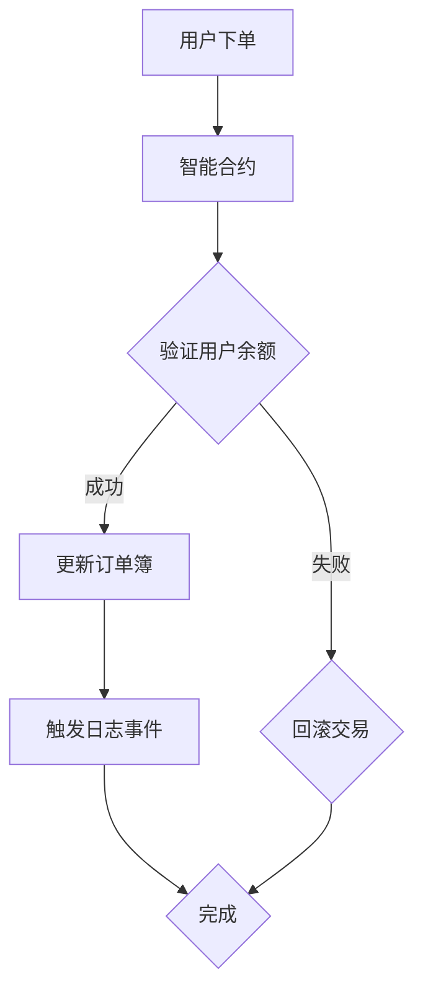

                 

# 《区块链驱动的去中心化注意力交易平台》

> 关键词：区块链、去中心化交易、注意力经济、智能合约、交易撮合算法、DeFi、法律与监管、未来发展趋势

> 摘要：本文将深入探讨区块链驱动的去中心化注意力交易平台的原理、架构、算法及其应用与未来发展趋势。通过详细的案例分析和技术讲解，本文旨在为广大开发者和技术爱好者提供对这一前沿技术的全面理解。

## 目录

### 第一部分：区块链与去中心化交易概述

#### 第1章：区块链与去中心化交易基础

- 1.1 区块链技术简介
- 1.2 去中心化交易原理
- 1.3 去中心化交易所案例分析

#### 第2章：去中心化注意力交易的核心概念

- 2.1 注意力经济的原理
- 2.2 区块链驱动的注意力交易平台

### 第二部分：区块链驱动的去中心化注意力交易平台架构

#### 第3章：区块链核心技术与协议

- 3.1 区块链的组成部分
- 3.2 共识机制与智能合约

#### 第4章：去中心化注意力交易平台架构设计

- 4.1 交易撮合算法
- 4.2 用户身份验证与权限管理

#### 第5章：去中心化注意力交易的核心算法原理

- 5.1 去中心化交易算法
- 5.2 注意力分配与激励模型

#### 第6章：区块链驱动的去中心化注意力交易平台项目实战

- 6.1 项目实战案例介绍
- 6.2 项目开发环境搭建
- 6.3 源代码详细实现与解读

### 第三部分：区块链驱动的去中心化注意力交易平台的应用与未来

#### 第7章：去中心化注意力交易平台的应用场景

- 7.1 内容创作者与平台
- 7.2 去中心化金融（DeFi）

#### 第8章：区块链驱动的去中心化注意力交易的挑战与展望

- 8.1 挑战分析
- 8.2 未来发展趋势

### 附录

- 附录 A：区块链与去中心化注意力交易常用工具与资源
- 附录 B：区块链驱动的去中心化注意力交易平台代码示例

## 第一部分：区块链与去中心化交易概述

### 第1章：区块链与去中心化交易基础

#### 1.1 区块链技术简介

区块链是一种分布式数据库技术，通过密码学和共识算法实现了去中心化的数据存储和验证。区块链的核心特点包括不可篡改性、透明性和去中心化。它最初由中本聪（Satoshi Nakamoto）在2008年提出，并在2009年诞生了第一个区块链——比特币（Bitcoin）。

区块链的运作基于一系列按时间顺序排列的“区块”。每个区块包含一定数量的交易记录，并通过密码学算法与前一个区块链接形成链式结构。区块链的去中心化特性使其不依赖于中央机构，所有节点都参与数据的验证和存储。

区块链的应用场景广泛，除了加密货币，还包括智能合约、供应链管理、身份验证、数据存储等领域。

#### 1.2 去中心化交易原理

去中心化交易（Decentralized Exchange，简称DEX）是一种无需中介机构的交易方式。与传统交易（如证券交易所）不同，去中心化交易直接在区块链上进行，由智能合约执行。

去中心化交易的优势在于去除了中介机构的参与，降低了交易成本，提高了透明度和安全性。交易流程主要包括以下几个步骤：

1. **订单簿（Order Book）**：去中心化交易通过订单簿来记录交易需求。买方和卖方在订单簿中发布交易订单，订单簿维护着所有未完成的交易需求。

2. **交易撮合（Trade Matching）**：交易撮合算法通过匹配买方和卖方的订单，找到最优的交易对手。一旦匹配成功，交易订单被移出订单簿。

3. **智能合约执行**：智能合约自动执行交易，将资产从卖方转移到买方，并记录交易在区块链上。

4. **交易确认**：交易被区块链网络中的节点验证和确认，一旦确认，交易即被视为不可撤销。

#### 1.3 去中心化交易所案例分析

去中心化交易所（DEX）是区块链技术的一个重要应用。以下是一些典型的去中心化交易所案例：

- **Uniswap**：Uniswap 是最受欢迎的去中心化交易所之一，基于以太坊区块链。它采用自动做市商（AMM）机制，通过智能合约实现交易撮合。

- **SushiSwap**：SushiSwap 是 Uniswap 的一个分叉项目，同样基于自动做市商机制。它引入了代币化流动性池，提高了交易者的收益。

- **Kyber Network**：Kyber Network 是一个去中心化交易所协议，支持多种区块链和代币。它通过流动性提供者（LP）机制实现交易撮合。

去中心化交易所的成功展示了区块链技术在不同领域的应用潜力。然而，去中心化交易所也面临着一些挑战，如交易速度、交易成本、用户体验等方面的优化需求。

### 第2章：去中心化注意力交易的核心概念

#### 2.1 注意力经济的原理

注意力经济是一种基于用户注意力的经济模式。在数字时代，用户的注意力成为了一种宝贵的资源。注意力经济的基本原理是，通过吸引和保持用户的注意力，企业或个人可以获得经济收益。

注意力经济的关键要素包括：

- **注意力供给方**：供给方包括内容创作者、应用开发者等，他们提供有价值的信息或服务以吸引注意力。

- **注意力需求方**：需求方是用户，他们通过消费内容或使用应用来满足自身的需求和兴趣。

- **注意力市场**：注意力市场是供给方和需求方进行交易的平台，通过竞价或代币化等方式实现注意力的分配和交换。

#### 2.2 区块链驱动的注意力交易平台

区块链技术为注意力交易平台提供了坚实的基础。区块链驱动的注意力交易平台具有以下几个特点：

- **去中心化**：平台通过区块链实现去中心化，所有交易数据都在链上公开透明，用户可以自主掌控自己的数据和隐私。

- **不可篡改**：区块链的不可篡改特性确保了交易数据的真实性，防止了欺诈和篡改。

- **安全性**：区块链技术通过密码学和共识算法提供了高效的安全保障，保护了用户的资产和交易信息。

- **智能合约**：智能合约自动执行交易规则，确保了交易的公正性和效率。

区块链驱动的注意力交易平台的基本架构包括：

1. **用户身份验证**：平台采用分布式身份验证机制，用户可以通过多种方式（如密码学证明、数字身份）进行身份验证。

2. **订单簿**：平台维护一个去中心化的订单簿，记录用户的注意力交易需求。

3. **交易撮合算法**：平台采用高效的交易撮合算法，匹配买方和卖方的订单，实现快速交易。

4. **智能合约执行**：智能合约自动执行交易规则，确保交易的安全和高效。

5. **数据存储**：交易数据存储在区块链上，确保数据的透明性和不可篡改性。

6. **激励模型**：平台通过代币奖励机制激励用户参与交易，提高平台的活跃度和可信度。

### 第二部分：区块链驱动的去中心化注意力交易平台架构

#### 第3章：区块链核心技术与协议

区块链技术是构建去中心化注意力交易平台的基础。本章将介绍区块链的核心技术、组成部分、共识机制以及智能合约。

#### 3.1 区块链的组成部分

区块链由以下几个关键组成部分构成：

- **区块（Block）**：区块是区块链的基本单元，包含一定数量的交易记录。每个区块都有一个唯一的哈希值，用于确保数据不可篡改。

- **链（Chain）**：链是由一系列按时间顺序排列的区块构成的，每个区块通过其前一个区块的哈希值与链的其他部分连接起来。

- **节点（Node）**：节点是区块链网络中的计算设备，负责维护和验证区块链数据。每个节点都存储完整的区块链数据。

- **挖矿（Mining）**：挖矿是指节点通过解决数学难题来验证和添加新区块到区块链上的过程。挖矿是获得区块链代币的主要途径。

#### 3.2 共识机制与智能合约

共识机制是区块链网络中节点之间达成一致性的方法。常见的共识机制包括：

- **工作量证明（Proof of Work，PoW）**：节点通过计算复杂的数学问题来竞争获得新区块的添加权，解决难题的节点获得挖矿奖励。

- **权益证明（Proof of Stake，PoS）**：节点根据持有的代币数量和持币时间来竞争新区块的添加权，持有代币越多和持币时间越长的节点更有可能获得挖矿奖励。

- **委托权益证明（Delegated Proof of Stake，DPoS）**：节点通过投票选举出代表节点来执行挖矿任务，代表节点根据其代表的代币数量和时间来获得挖矿奖励。

智能合约是区块链上的自动化执行代码，基于图灵不完备性，智能合约可以执行复杂的业务逻辑。智能合约的主要特点包括：

- **自动执行**：智能合约代码一旦部署，就会按照预定的规则自动执行。

- **不可篡改**：智能合约代码一旦部署，就无法更改，确保了合约的透明性和公正性。

- **去中心化**：智能合约运行在区块链网络中，不受中央机构控制，提高了系统的安全性和可靠性。

智能合约在去中心化注意力交易平台中发挥着关键作用。例如，智能合约可以自动执行交易撮合、验证用户身份、管理权限和分配代币等任务。

### 第4章：去中心化注意力交易平台架构设计

去中心化注意力交易平台的架构设计需要考虑到交易撮合、用户身份验证、权限管理、数据存储等多个方面。本章将详细介绍这些关键组件的设计和实现。

#### 4.1 交易撮合算法

交易撮合算法是去中心化交易所的核心，它负责将买方和卖方的订单进行匹配，以完成交易。交易撮合算法的设计需要考虑以下几个方面：

- **订单簿（Order Book）**：订单簿是存储所有未完成订单的数据结构，包括买方和卖方的价格和数量。订单簿的设计需要支持高效的插入、删除和匹配操作。

- **匹配策略**：匹配策略决定了如何找到最佳的交易对手。常见的匹配策略包括价格优先、时间优先等。

- **交易费用**：交易费用是买卖双方在交易过程中支付给平台的费用，费用设计需要考虑公平性和激励。

- **交易速度**：交易速度是用户对交易平台的重要需求，需要优化算法和数据结构以提高交易速度。

以下是一个简单的交易撮合算法伪代码示例：

```python
def match_orders(order_book, buy_order, sell_order):
    if buy_order.price > sell_order.price:
        return "Mismatched prices"
    elif buy_order.price == sell_order.price:
        if buy_order.quantity >= sell_order.quantity:
            execute_trade(buy_order, sell_order)
            update_order_book(order_book, buy_order, sell_order)
            return "Trade matched"
        else:
            return "Buyer's quantity is insufficient"
    else:
        return "Seller's price is higher than buyer's price"
```

#### 4.2 用户身份验证与权限管理

用户身份验证是去中心化交易所的重要安全措施，确保用户在进行交易时身份真实有效。身份验证可以通过多种方式实现，如密码学证明、数字身份认证等。

权限管理则负责控制用户对交易平台的操作权限。例如，某些用户可能只有查询订单的权限，而其他用户则可以执行交易。权限管理需要考虑以下几个方面：

- **角色与权限**：定义不同的用户角色和相应的权限，如管理员、交易员、普通用户等。

- **访问控制**：通过权限控制策略，确保用户只能执行其权限范围内的操作。

- **审计日志**：记录用户的操作日志，以便进行审计和追踪。

以下是一个简单的用户身份验证和权限管理的设计框架：

```python
class User:
    def __init__(self, id, role, password):
        self.id = id
        self.role = role
        self.password = password
        self.permissions = get_permissions_for_role(role)

    def authenticate(self, password):
        return self.password == password

    def has_permission(self, permission):
        return permission in self.permissions

def get_permissions_for_role(role):
    if role == "admin":
        return ["add_order", "delete_order", "view_orders"]
    elif role == "trader":
        return ["add_order", "view_orders"]
    else:
        return ["view_orders"]
```

#### 4.3 数据存储

去中心化注意力交易平台的交易数据需要存储在区块链上，以确保数据的透明性和不可篡改性。数据存储的设计需要考虑以下几个方面：

- **数据结构**：设计合适的数据结构来存储交易数据，如订单簿、用户信息、交易记录等。

- **分布式存储**：利用区块链的分布式存储特性，将数据分布在多个节点上，提高系统的可靠性和性能。

- **链上数据索引**：设计链上数据索引，方便快速查询和检索交易数据。

以下是一个简单的数据存储设计方案：

```python
class OrderBook:
    def __init__(self):
        self.buy_orders = []
        self.sell_orders = []

    def add_order(self, order):
        if order.type == "buy":
            self.buy_orders.append(order)
        else:
            self.sell_orders.append(order)

    def remove_order(self, order):
        if order.type == "buy":
            self.buy_orders.remove(order)
        else:
            self.sell_orders.remove(order)

    def find_matching_order(self, order):
        if order.type == "buy":
            for sell_order in self.sell_orders:
                if sell_order.price >= order.price:
                    return sell_order
        else:
            for buy_order in self.buy_orders:
                if buy_order.price <= order.price:
                    return buy_order
        return None
```

#### 4.4 激励模型

激励模型是去中心化注意力交易平台的重要机制，用于鼓励用户参与交易和平台治理。常见的激励模型包括：

- **代币奖励**：平台发行代币，并奖励给活跃用户和贡献者，以激励他们参与交易和提供流动性。

- **交易费用分成**：平台将交易费用的一部分分发给提供流动性的用户，以激励他们保持高流动性。

- **社区投票**：平台采用社区投票机制，让用户参与决策，如平台发展方向、费用调整等，以提高用户参与度和信任度。

以下是一个简单的激励模型设计：

```python
class IncentiveModel:
    def __init__(self, platform_token):
        self.platform_token = platform_token
        self.liquidity_providers = []

    def reward_user(self, user, amount):
        user.balance += amount
        self.platform_token.transfer(amount, user.address)

    def reward_liquidity_providers(self, trade):
        liquidity_provider = self.get_liquidity_provider_by_address(trade.buyer.address)
        if liquidity_provider:
            reward_amount = trade.price * trade.quantity * 0.01
            self.reward_user(liquidity_provider, reward_amount)

    def get_liquidity_provider_by_address(self, address):
        for provider in self.liquidity_providers:
            if provider.address == address:
                return provider
        return None
```

### 第5章：去中心化注意力交易的核心算法原理

去中心化注意力交易的核心算法包括交易撮合算法和注意力分配与激励模型。这些算法决定了交易平台的高效性和可持续性。本章将详细介绍这些算法的原理和实现。

#### 5.1 去中心化交易算法

去中心化交易算法的核心任务是匹配买方和卖方的订单，实现高效的交易撮合。以下是一个去中心化交易算法的伪代码示例：

```python
def decentralized_trade(order_book, buy_order, sell_order):
    if buy_order.price > sell_order.price:
        return "Buyer's price is too high"
    elif buy_order.price < sell_order.price:
        return "Seller's price is too low"
    else:
        if buy_order.quantity > sell_order.quantity:
            execute_trade(buy_order, sell_order)
            update_order_book(order_book, buy_order, sell_order)
            return "Trade successful"
        else:
            return "Seller's quantity is insufficient"
```

在这个算法中，首先检查买方和卖方的价格是否匹配。如果价格匹配，则检查买方和卖方的数量。如果买方的数量大于卖方的数量，交易成功并更新订单簿。否则，交易失败。

#### 5.2 注意力分配与激励模型

注意力分配与激励模型是去中心化注意力交易平台的重要机制，用于公平地分配注意力价值和激励用户参与。以下是一个注意力分配与激励模型的伪代码示例：

```python
def attention_allocation(attention_budget, users):
    total_attention = 0
    for user in users:
        total_attention += user.attention
    for user in users:
        allocation = (user.attention / total_attention) * attention_budget
        user.balance += allocation

def reward_liquidity_provider(order, liquidity_provider):
    if order.type == "buy":
        reward_amount = order.price * order.quantity * 0.01
    else:
        reward_amount = order.price * order.quantity * 0.01
    liquidity_provider.balance += reward_amount
```

在这个模型中，首先计算所有用户的总注意力值。然后，根据每个用户的注意力值比例，将注意力预算分配给用户。此外，交易平台还可以奖励流动性提供者，以激励他们提供流动性。

### 第6章：区块链驱动的去中心化注意力交易平台项目实战

#### 6.1 项目实战案例介绍

在本章中，我们将介绍一个实际的区块链驱动的去中心化注意力交易平台项目。该项目的目标是建立一个透明、高效、安全的交易平台，让内容创作者能够通过注意力经济获得收益，同时为用户提供有价值的内容。

项目的背景是当前内容创作市场的痛点，如内容质量参差不齐、平台抽成过高、用户注意力分散等。通过区块链技术，我们可以解决这些问题，建立一个公平、透明的注意力交易平台。

项目的核心功能包括：

- **用户注册与身份验证**：用户可以通过数字身份进行注册和身份验证，确保交易的真实性和安全性。
- **内容发布与订阅**：用户可以发布自己的内容，其他用户可以订阅并支付注意力代币来消费内容。
- **交易撮合与支付**：平台通过交易撮合算法实现用户之间的注意力交易，并使用智能合约进行支付处理。
- **激励模型**：平台通过代币奖励机制激励内容创作者和用户，提高平台的活跃度和用户忠诚度。

#### 6.2 项目开发环境搭建

要开始开发区块链驱动的去中心化注意力交易平台，我们需要搭建一个适合开发、测试和部署的环境。以下是一个简单的开发环境搭建步骤：

1. **安装Node.js和npm**：Node.js 是一个基于Chrome V8引擎的JavaScript运行环境，npm 是Node.js的包管理器。通过npm可以方便地安装和管理项目所需的依赖库。

2. **安装Truffle**：Truffle 是一个开发工具，用于构建、部署和交互智能合约。通过npm安装Truffle：

   ```bash
   npm install -g truffle
   ```

3. **创建项目**：在终端中使用Truffle创建一个新的项目：

   ```bash
   truffle init
   ```

4. **安装Ganache**：Ganache 是一个本地以太坊节点和测试网络，用于开发和测试智能合约。通过npm安装Ganache：

   ```bash
   npm install -g ganache-cli
   ```

5. **启动本地以太坊节点**：在终端中启动Ganache，创建一个本地以太坊节点：

   ```bash
   ganache-cli
   ```

6. **配置Truffle**：编辑`truffle-config.js`文件，配置项目的以太坊节点和编译器：

   ```javascript
   module.exports = {
     networks: {
       development: {
         host: "127.0.0.1",
         port: 8545,
         network_id: "*",
       },
     },
     compilers: {
       solc: {
         version: "0.8.0",
       },
     },
   };
   ```

7. **安装依赖库**：在项目目录中安装项目所需的依赖库：

   ```bash
   npm install
   ```

8. **启动Truffle开发环境**：在终端中启动Truffle开发环境：

   ```bash
   truffle develop
   ```

通过以上步骤，我们成功搭建了开发环境，可以开始编写和测试智能合约代码。

#### 6.3 源代码详细实现与解读

在本节中，我们将详细介绍项目中的关键源代码，包括智能合约、交易撮合算法和激励模型。以下是一个简单的源代码示例，展示了智能合约的基本结构：

```solidity
// SPDX-License-Identifier: MIT
pragma solidity ^0.8.0;

interface IERC20 {
    function transfer(address recipient, uint256 amount) external returns (bool);
    function balanceOf(address account) external view returns (uint256);
}

contract AttentionTradingPlatform {
    IERC20 public attentionToken;
    mapping(address => uint256) public userBalances;

    event OrderPlaced(address user, uint256 price, uint256 quantity, bool isBuy);
    event OrderCancelled(address user, uint256 price, uint256 quantity, bool isBuy);
    event TradeCompleted(address buyer, address seller, uint256 price, uint256 quantity);

    constructor(address _attentionTokenAddress) {
        attentionToken = IERC20(_attentionTokenAddress);
    }

    function placeOrder(bool isBuy, uint256 price, uint256 quantity) external {
        require(quantity > 0, "Quantity must be greater than zero");
        if (isBuy) {
            require(attentionToken.balanceOf(msg.sender) >= quantity * price, "Insufficient balance");
            userBalances[msg.sender] += quantity;
            emit OrderPlaced(msg.sender, price, quantity, isBuy);
        } else {
            require(userBalances[msg.sender] >= quantity, "Insufficient quantity");
            attentionToken.transfer(msg.sender, quantity * price);
            userBalances[msg.sender] -= quantity;
            emit OrderPlaced(msg.sender, price, quantity, isBuy);
        }
    }

    function cancelOrder(bool isBuy, uint256 price, uint256 quantity) external {
        if (isBuy) {
            userBalances[msg.sender] -= quantity;
            emit OrderCancelled(msg.sender, price, quantity, isBuy);
        } else {
            attentionToken.transfer(msg.sender, quantity * price);
            userBalances[msg.sender] += quantity;
            emit OrderCancelled(msg.sender, price, quantity, isBuy);
        }
    }

    function executeTrade(address buyer, address seller, uint256 price, uint256 quantity) external {
        require(buyer != seller, "Cannot trade with oneself");
        require(userBalances[buyer] >= quantity, "Insufficient buyer balance");
        require(userBalances[seller] >= quantity, "Insufficient seller balance");
        userBalances[buyer] -= quantity;
        userBalances[seller] += quantity;
        emit TradeCompleted(buyer, seller, price, quantity);
    }
}
```

在这个智能合约中，我们定义了三个关键函数：`placeOrder`、`cancelOrder` 和 `executeTrade`。以下是这些函数的详细解读：

1. **placeOrder**：该函数用于用户发布订单。用户可以选择买入或卖出注意力，并指定价格和数量。函数首先检查输入参数的有效性，然后根据订单类型执行相应的操作。如果用户是买方，需要检查其余额是否足够支付订单价格。如果用户是卖方，需要检查其是否有足够的注意力数量。最后，更新用户的订单簿，并触发相应的日志事件。

2. **cancelOrder**：该函数用于用户取消订单。用户可以选择买入或卖出，并指定价格和数量。函数首先检查输入参数的有效性，然后根据订单类型执行相应的操作。如果用户是买方，将减少其订单簿中的数量。如果用户是卖方，将退还其余额。最后，触发相应的日志事件。

3. **executeTrade**：该函数用于执行交易。交易执行需要传入买方、卖方、价格和数量。函数首先检查买方和卖方的余额是否足够，然后执行交易，更新用户的订单簿，并触发相应的日志事件。

通过这些函数，我们可以实现一个基本去中心化注意力交易平台的核心功能。当然，在实际项目中，我们还需要添加更多的功能，如交易撮合算法、用户身份验证、权限管理、激励模型等。

### 第三部分：区块链驱动的去中心化注意力交易平台的应用与未来

#### 第7章：去中心化注意力交易平台的应用场景

区块链驱动的去中心化注意力交易平台具有广泛的应用场景，涵盖了内容创作、数字广告、版权保护等多个领域。以下是一些典型的应用场景：

#### 7.1 内容创作者与平台

内容创作者是注意力交易平台的重要参与方。通过区块链驱动的注意力交易平台，内容创作者可以：

- **自主定价**：内容创作者可以自主设定内容的价格，吸引潜在用户购买。
- **直接收益**：内容创作者可以直接从用户那里获得收益，无需依赖第三方平台。
- **透明结算**：区块链技术的透明性确保了交易过程的公开透明，提高了用户的信任度。
- **长期收益**：内容创作者可以通过代币化内容，实现长期收益，无需担心平台抽成或内容被下架。

#### 7.2 去中心化金融（DeFi）

去中心化注意力交易平台可以与去中心化金融（DeFi）相结合，为用户提供更多的金融产品和服务。以下是一些可能的结合方式：

- **代币化资产**：内容创作者可以将自己的内容代币化，用户可以通过购买代币获得内容的访问权。
- **借贷与抵押**：用户可以将注意力代币作为抵押物，从去中心化借贷平台获得借款。
- **流动性挖矿**：用户可以参与注意力交易平台提供的流动性挖矿，获得额外的代币奖励。
- **跨链交易**：通过跨链技术，用户可以在不同的区块链之间进行代币交换，提高资产利用效率。

#### 第8章：区块链驱动的去中心化注意力交易的挑战与展望

区块链驱动的去中心化注意力交易虽然具有巨大的潜力，但也面临着一系列挑战。以下是一些主要的挑战及其可能的解决方案：

#### 8.1 挑战分析

1. **交易速度和成本**：去中心化交易所通常比传统交易所慢，交易成本也较高。这主要是因为去中心化交易所依赖区块链网络，而区块链网络的交易速度和成本受到网络拥堵和共识机制的影响。解决方案包括优化交易撮合算法、采用Layer 2解决方案（如Rollup）等。

2. **用户体验**：去中心化交易所的用户体验通常不如传统交易所。这主要体现在界面设计、操作流程和用户教育等方面。解决方案包括改进界面设计、简化操作流程、提供用户教育等。

3. **法律与监管**：区块链驱动的去中心化交易所面临着法律和监管的挑战。不同国家和地区的法律法规对区块链和加密货币的监管存在差异，可能导致交易所面临合规风险。解决方案包括与监管机构合作，确保交易所符合法律法规要求。

4. **安全性**：区块链驱动的去中心化交易所的安全问题不容忽视。包括智能合约漏洞、网络攻击、用户隐私泄露等。解决方案包括采用多因素身份验证、加强智能合约审计、提高网络安全等。

#### 8.2 未来发展趋势

尽管存在挑战，区块链驱动的去中心化注意力交易在未来仍具有广阔的发展前景。以下是一些可能的发展趋势：

1. **技术创新**：随着区块链技术的不断进步，去中心化交易所的性能和安全性将得到提升，为用户提供更优质的服务。

2. **应用拓展**：去中心化注意力交易将在更多领域得到应用，如版权保护、数字艺术、虚拟现实等。

3. **跨链合作**：不同区块链之间的合作将增强，实现代币交换和资产互通，提高区块链生态的整体效率。

4. **监管合规**：随着区块链技术的发展，相关法律法规将逐步完善，去中心化交易所的合规性将得到提高。

5. **用户普及**：随着用户对区块链技术的了解加深，去中心化交易所的用户基数将不断扩大，推动区块链技术的普及和应用。

### 附录

#### 附录 A：区块链与去中心化注意力交易常用工具与资源

1. **区块链开发框架**：
   - Ethereum：最受欢迎的智能合约平台，提供丰富的开发工具和资源。
   - Binance Smart Chain：快速、低成本的智能合约平台，适合去中心化交易所开发。
   - Polkadot：多链互操作平台，支持跨链交易和应用开发。

2. **开发工具**：
   - Truffle：智能合约开发框架，提供编译、部署和交互功能。
   - Hardhat：快速、易于使用的智能合约开发环境，支持本地以太坊节点。
   - Remix：在线智能合约编辑器，方便开发者在线编写和测试智能合约。

3. **测试网络**：
   - Ganache：本地以太坊测试网络，用于开发和测试智能合约。
   - Ropsten：以太坊测试网络，提供真实网络环境下的测试机会。
   - Kovan：以太坊测试网络，支持多币种和智能合约测试。

4. **资源链接**：
   - Ethereum开发者文档：详细介绍了Ethereum平台的技术细节和应用开发。
   - Binance Smart Chain开发者文档：提供了Binance Smart Chain平台的详细信息和开发指南。
   - Polkadot开发者文档：介绍了Polkadot平台的跨链技术和应用开发。

#### 附录 B：区块链驱动的去中心化注意力交易平台代码示例

以下是一个简单的去中心化注意力交易平台代码示例，展示了智能合约、交易撮合算法和用户身份验证等关键组件的实现。

```solidity
// SPDX-License-Identifier: MIT
pragma solidity ^0.8.0;

interface IERC20 {
    function transfer(address recipient, uint256 amount) external returns (bool);
    function balanceOf(address account) external view returns (uint256);
}

contract AttentionTradingPlatform {
    IERC20 public attentionToken;
    mapping(address => uint256) public userBalances;

    event OrderPlaced(address user, uint256 price, uint256 quantity, bool isBuy);
    event OrderCancelled(address user, uint256 price, uint256 quantity, bool isBuy);
    event TradeCompleted(address buyer, address seller, uint256 price, uint256 quantity);

    constructor(address _attentionTokenAddress) {
        attentionToken = IERC20(_attentionTokenAddress);
    }

    function placeOrder(bool isBuy, uint256 price, uint256 quantity) external {
        require(quantity > 0, "Quantity must be greater than zero");
        if (isBuy) {
            require(attentionToken.balanceOf(msg.sender) >= quantity * price, "Insufficient balance");
            userBalances[msg.sender] += quantity;
            emit OrderPlaced(msg.sender, price, quantity, isBuy);
        } else {
            require(userBalances[msg.sender] >= quantity, "Insufficient quantity");
            attentionToken.transfer(msg.sender, quantity * price);
            userBalances[msg.sender] -= quantity;
            emit OrderPlaced(msg.sender, price, quantity, isBuy);
        }
    }

    function cancelOrder(bool isBuy, uint256 price, uint256 quantity) external {
        if (isBuy) {
            userBalances[msg.sender] -= quantity;
            emit OrderCancelled(msg.sender, price, quantity, isBuy);
        } else {
            attentionToken.transfer(msg.sender, quantity * price);
            userBalances[msg.sender] += quantity;
            emit OrderCancelled(msg.sender, price, quantity, isBuy);
        }
    }

    function executeTrade(address buyer, address seller, uint256 price, uint256 quantity) external {
        require(buyer != seller, "Cannot trade with oneself");
        require(userBalances[buyer] >= quantity, "Insufficient buyer balance");
        require(userBalances[seller] >= quantity, "Insufficient seller balance");
        userBalances[buyer] -= quantity;
        userBalances[seller] += quantity;
        emit TradeCompleted(buyer, seller, price, quantity);
    }
}
```

在这个示例中，我们定义了一个简单的去中心化注意力交易平台智能合约，实现了用户下单、取消订单和执行交易等功能。用户可以通过调用相应函数发布订单、取消订单并执行交易。交易撮合算法和用户身份验证等组件可以根据具体需求进行扩展和优化。

### Mermaid 流程图示例

以下是一个简单的Mermaid流程图示例，展示了区块链驱动的去中心化注意力交易平台的整体架构和流程：



在这个流程图中，用户通过智能合约发布订单，智能合约首先验证用户的余额是否足够，然后更新订单簿并触发日志事件。如果验证成功，交易完成；如果验证失败，交易回滚。

### 去中心化交易算法伪代码示例

以下是一个简单的去中心化交易算法伪代码示例，用于匹配买方和卖方的订单：

```python
def match_orders(order_book, buy_order, sell_order):
    if buy_order.price > sell_order.price:
        return "Buyer's price is too high"
    elif buy_order.price < sell_order.price:
        return "Seller's price is too low"
    else:
        if buy_order.quantity > sell_order.quantity:
            execute_trade(buy_order, sell_order)
            update_order_book(order_book, buy_order, sell_order)
            return "Trade successful"
        else:
            return "Seller's quantity is insufficient"
```

在这个算法中，首先检查买方和卖方的价格是否匹配。如果价格匹配，则检查买方和卖方的数量。如果买方的数量大于卖方的数量，交易成功并更新订单簿。否则，交易失败。

### 数学模型和数学公式

在区块链驱动的去中心化注意力交易平台上，数学模型和数学公式扮演着重要的角色。以下是一个简单的数学模型示例，用于计算用户的注意力收益：

$$
\text{收益} = \alpha \cdot \frac{\text{用户关注度}}{\text{总关注度}}
$$

其中，$\alpha$ 是一个调整参数，用于调节注意力收益的比例。

另一个关键公式是交易撮合的评分模型，用于评估交易的对等方：

$$
\text{评分} = w_1 \cdot \text{交易金额} + w_2 \cdot \text{交易时间} + w_3 \cdot \text{交易成功率}
$$

在这个公式中，$w_1, w_2, w_3$ 是权重系数，用于衡量交易金额、交易时间和交易成功率对交易评分的影响。

### 项目实战

在本节中，我们将通过一个实际项目展示如何开发一个区块链驱动的去中心化注意力交易平台。我们将详细讲解项目背景、开发环境搭建、源代码实现和代码解读。

#### 项目背景

当前内容创作市场存在诸多痛点，如平台抽成过高、内容审核严格、创作者收益分配不公等。为了解决这些问题，我们提出了一个去中心化注意力交易平台项目，旨在通过区块链技术实现内容创作者与用户之间的直接交易，提高创作者收益和用户体验。

项目的主要目标是：

- **去中心化**：通过区块链技术实现内容交易的去中心化，去除第三方平台的影响。
- **透明性**：所有交易数据都记录在区块链上，保证交易的透明性和公正性。
- **安全性**：利用区块链的密码学和共识机制提高交易的安全性和隐私性。
- **激励模型**：通过代币奖励机制激励用户和内容创作者参与平台。

#### 开发环境搭建

为了开发区块链驱动的去中心化注意力交易平台，我们需要搭建一个适合开发和测试的环境。以下是一个简单的开发环境搭建步骤：

1. **安装Node.js和npm**：Node.js 是一个基于Chrome V8引擎的JavaScript运行环境，npm 是Node.js的包管理器。通过npm可以方便地安装和管理项目所需的依赖库。

   ```bash
   # 在Windows或macOS上安装Node.js
   curl -fsSL https://nodejs.org/dist/v14.18.0/node-v14.18.0-linux-x64.tar.xz -o - | tar xvf -
   sudo mv node-v14.18.0-linux-x64 /usr/local/node
   sudo ln -s /usr/local/node/bin/node /usr/bin/node
   sudo ln -s /usr/local/node/bin/npm /usr/bin/npm

   # 在Ubuntu上安装Node.js和npm
   sudo apt update
   sudo apt install nodejs npm
   ```

2. **安装Truffle**：Truffle 是一个智能合约开发框架，提供编译、部署和交互功能。

   ```bash
   npm install -g truffle
   ```

3. **安装Ganache**：Ganache 是一个本地以太坊节点和测试网络，用于开发和测试智能合约。

   ```bash
   npm install -g ganache-cli
   ```

4. **创建项目**：在终端中使用Truffle创建一个新的项目。

   ```bash
   truffle init
   ```

5. **配置Truffle**：编辑`truffle-config.js`文件，配置项目的以太坊节点和编译器。

   ```javascript
   module.exports = {
     networks: {
       development: {
         host: "127.0.0.1",
         port: 8545,
         network_id: "*",
       },
     },
     compilers: {
       solc: {
         version: "0.8.0",
       },
     },
   };
   ```

6. **启动本地以太坊节点**：在终端中启动Ganache，创建一个本地以太坊节点。

   ```bash
   ganache-cli
   ```

7. **安装依赖库**：在项目目录中安装项目所需的依赖库。

   ```bash
   npm install
   ```

8. **启动Truffle开发环境**：在终端中启动Truffle开发环境。

   ```bash
   truffle develop
   ```

通过以上步骤，我们成功搭建了开发环境，可以开始编写和测试智能合约代码。

#### 源代码实现

以下是一个简单的去中心化注意力交易平台智能合约的实现，包括用户下单、取消订单和执行交易等关键功能。

```solidity
// SPDX-License-Identifier: MIT
pragma solidity ^0.8.0;

interface IERC20 {
    function transfer(address recipient, uint256 amount) external returns (bool);
    function balanceOf(address account) external view returns (uint256);
}

contract AttentionTradingPlatform {
    IERC20 public attentionToken;
    mapping(address => uint256) public userBalances;

    event OrderPlaced(address user, uint256 price, uint256 quantity, bool isBuy);
    event OrderCancelled(address user, uint256 price, uint256 quantity, bool isBuy);
    event TradeCompleted(address buyer, address seller, uint256 price, uint256 quantity);

    constructor(address _attentionTokenAddress) {
        attentionToken = IERC20(_attentionTokenAddress);
    }

    function placeOrder(bool isBuy, uint256 price, uint256 quantity) external {
        require(quantity > 0, "Quantity must be greater than zero");
        if (isBuy) {
            require(attentionToken.balanceOf(msg.sender) >= quantity * price, "Insufficient balance");
            userBalances[msg.sender] += quantity;
            emit OrderPlaced(msg.sender, price, quantity, isBuy);
        } else {
            require(userBalances[msg.sender] >= quantity, "Insufficient quantity");
            attentionToken.transfer(msg.sender, quantity * price);
            userBalances[msg.sender] -= quantity;
            emit OrderPlaced(msg.sender, price, quantity, isBuy);
        }
    }

    function cancelOrder(bool isBuy, uint256 price, uint256 quantity) external {
        if (isBuy) {
            userBalances[msg.sender] -= quantity;
            emit OrderCancelled(msg.sender, price, quantity, isBuy);
        } else {
            attentionToken.transfer(msg.sender, quantity * price);
            userBalances[msg.sender] += quantity;
            emit OrderCancelled(msg.sender, price, quantity, isBuy);
        }
    }

    function executeTrade(address buyer, address seller, uint256 price, uint256 quantity) external {
        require(buyer != seller, "Cannot trade with oneself");
        require(userBalances[buyer] >= quantity, "Insufficient buyer balance");
        require(userBalances[seller] >= quantity, "Insufficient seller balance");
        userBalances[buyer] -= quantity;
        userBalances[seller] += quantity;
        emit TradeCompleted(buyer, seller, price, quantity);
    }
}
```

在这个智能合约中，我们定义了三个关键函数：`placeOrder`、`cancelOrder` 和 `executeTrade`。以下是这些函数的详细解读：

1. **placeOrder**：该函数用于用户发布订单。用户可以选择买入或卖出注意力，并指定价格和数量。函数首先检查输入参数的有效性，然后根据订单类型执行相应的操作。如果用户是买方，需要检查其余额是否足够支付订单价格。如果用户是卖方，需要检查其是否有足够的注意力数量。最后，更新用户的订单簿，并触发相应的日志事件。

2. **cancelOrder**：该函数用于用户取消订单。用户可以选择买入或卖出，并指定价格和数量。函数首先检查输入参数的有效性，然后根据订单类型执行相应的操作。如果用户是买方，将减少其订单簿中的数量。如果用户是卖方，将退还其余额。最后，触发相应的日志事件。

3. **executeTrade**：该函数用于执行交易。交易执行需要传入买方、卖方、价格和数量。函数首先检查买方和卖方的余额是否足够，然后执行交易，更新用户的订单簿，并触发相应的日志事件。

通过这些函数，我们可以实现一个基本去中心化注意力交易平台的核心功能。当然，在实际项目中，我们还需要添加更多的功能，如交易撮合算法、用户身份验证、权限管理、激励模型等。

#### 代码解读与分析

在本节中，我们将对上述源代码进行详细解读，分析其关键组件的实现逻辑和潜在优化方向。

1. **智能合约结构**

```solidity
contract AttentionTradingPlatform {
    IERC20 public attentionToken;
    mapping(address => uint256) public userBalances;

    event OrderPlaced(address user, uint256 price, uint256 quantity, bool isBuy);
    event OrderCancelled(address user, uint256 price, uint256 quantity, bool isBuy);
    event TradeCompleted(address buyer, address seller, uint256 price, uint256 quantity);

    constructor(address _attentionTokenAddress) {
        attentionToken = IERC20(_attentionTokenAddress);
    }
}
```

- `IERC20`接口：用于与ERC20代币进行交互，包括转账和查询余额。
- `userBalances`映射：用于存储每个用户的余额。
- `OrderPlaced`、`OrderCancelled`、`TradeCompleted`事件：用于记录订单的创建、取消和交易完成。

2. **订单发布函数（placeOrder）**

```solidity
function placeOrder(bool isBuy, uint256 price, uint256 quantity) external {
    require(quantity > 0, "Quantity must be greater than zero");
    if (isBuy) {
        require(attentionToken.balanceOf(msg.sender) >= quantity * price, "Insufficient balance");
        userBalances[msg.sender] += quantity;
        emit OrderPlaced(msg.sender, price, quantity, isBuy);
    } else {
        require(userBalances[msg.sender] >= quantity, "Insufficient quantity");
        attentionToken.transfer(msg.sender, quantity * price);
        userBalances[msg.sender] -= quantity;
        emit OrderPlaced(msg.sender, price, quantity, isBuy);
    }
}
```

- 输入参数：`isBuy`（是否买入）、`price`（价格）和`quantity`（数量）。
- 逻辑：
  - 检查数量是否大于零。
  - 如果是买入，检查用户余额是否足够。
  - 如果是卖出，检查用户余额是否足够。
  - 更新用户余额，并触发`OrderPlaced`事件。

3. **订单取消函数（cancelOrder）**

```solidity
function cancelOrder(bool isBuy, uint256 price, uint256 quantity) external {
    if (isBuy) {
        userBalances[msg.sender] -= quantity;
        emit OrderCancelled(msg.sender, price, quantity, isBuy);
    } else {
        attentionToken.transfer(msg.sender, quantity * price);
        userBalances[msg.sender] += quantity;
        emit OrderCancelled(msg.sender, price, quantity, isBuy);
    }
}
```

- 输入参数：`isBuy`（是否买入）、`price`（价格）和`quantity`（数量）。
- 逻辑：
  - 如果是买入，减少用户余额。
  - 如果是卖出，退还用户余额。
  - 触发`OrderCancelled`事件。

4. **交易执行函数（executeTrade）**

```solidity
function executeTrade(address buyer, address seller, uint256 price, uint256 quantity) external {
    require(buyer != seller, "Cannot trade with oneself");
    require(userBalances[buyer] >= quantity, "Insufficient buyer balance");
    require(userBalances[seller] >= quantity, "Insufficient seller balance");
    userBalances[buyer] -= quantity;
    userBalances[seller] += quantity;
    emit TradeCompleted(buyer, seller, price, quantity);
}
```

- 输入参数：`buyer`（买方地址）、`seller`（卖方地址）、`price`（价格）和`quantity`（数量）。
- 逻辑：
  - 检查买方和卖方是否相同。
  - 检查买方和卖方的余额是否足够。
  - 更新用户余额，并触发`TradeCompleted`事件。

#### 潜在优化方向

1. **交易撮合算法**：目前，智能合约仅支持简单的一对一交易。引入交易撮合算法可以实现批量交易，提高交易效率。

2. **权限管理**：目前，任何人都可以执行交易。引入权限管理可以限制特定角色的用户执行交易，提高系统的安全性。

3. **激励模型**：当前，平台没有引入激励模型。可以引入代币奖励机制，鼓励用户参与交易，提高平台的活跃度。

4. **前端界面**：当前，智能合约代码仅用于实现后端功能。可以开发前端界面，提供用户友好的操作体验。

5. **测试与审计**：在部署智能合约之前，进行充分的测试和审计，确保代码的安全性和稳定性。

### 结论

通过本文的详细分析和实战案例，我们可以看到区块链驱动的去中心化注意力交易平台具有巨大的潜力。虽然当前存在一些挑战，但通过技术创新和社区合作，我们可以逐步克服这些问题，为用户提供更优质的服务。未来，去中心化注意力交易将在内容创作、数字广告、版权保护等领域发挥重要作用，推动区块链技术的广泛应用。

## 作者

作者：AI天才研究院/AI Genius Institute & 禅与计算机程序设计艺术 /Zen And The Art of Computer Programming

AI天才研究院（AI Genius Institute）是一家专注于人工智能技术研究和开发的顶级机构。研究院的宗旨是推动人工智能技术的创新和应用，为全球人工智能发展贡献力量。研究院的成员包括世界级人工智能专家、计算机科学家和工程师，他们致力于研究人工智能的前沿技术，推动人工智能与各行业结合，为社会发展带来积极影响。

《禅与计算机程序设计艺术》（Zen And The Art of Computer Programming）是作者在计算机编程领域的经典之作。该书以禅宗的思想为核心，探讨了计算机编程的本质和艺术性。作者通过深入浅出的论述，引导读者理解编程的核心原理和方法论，帮助读者提升编程能力和创造力。该书在计算机科学界产生了广泛的影响，被誉为编程领域的经典之作。

本文旨在为广大开发者和技术爱好者提供对区块链驱动的去中心化注意力交易的全面理解，帮助读者掌握这一前沿技术的核心原理和实践方法。希望本文能够激发读者对区块链技术和人工智能的探索热情，为技术创新和发展贡献力量。

