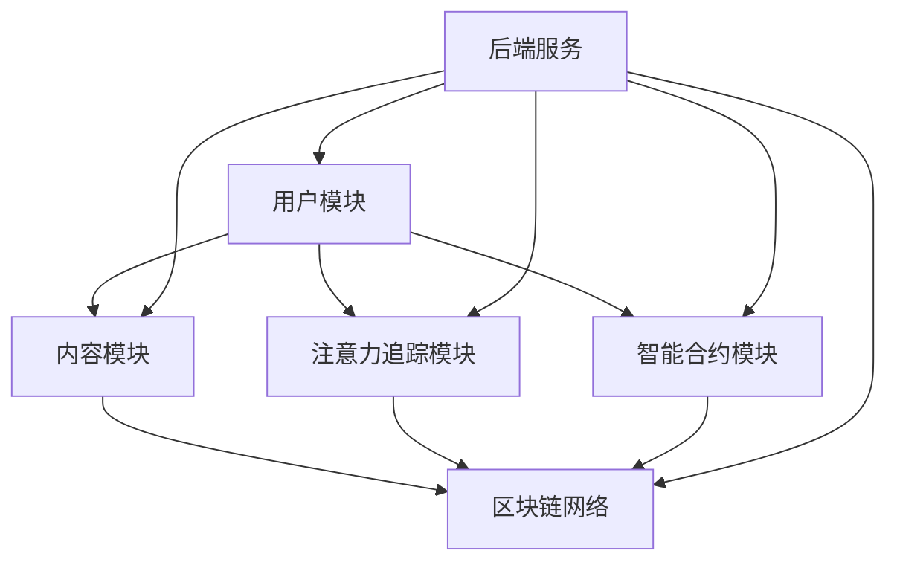

                 

# 《区块链驱动的注意力价值交换平台》

## 关键词
区块链，注意力经济，价值交换，智能合约，加密算法，共识算法，系统架构，项目实战

## 摘要
本文将深入探讨区块链驱动的注意力价值交换平台的构建及其应用。通过分析区块链技术的基础知识、注意力价值交换平台的概念和核心算法原理，我们将了解区块链在这一新兴领域的应用，并探讨其面临的挑战和未来发展趋势。文章还包含实际项目案例的剖析，为读者提供实践经验。

### 第一部分：区块链驱动的注意力价值交换平台基础

#### 第1章：区块链驱动的注意力价值交换平台概述

##### 1.1 区块链技术基础与价值交换平台概念

###### 1.1.1 区块链技术简介
区块链是一种分布式数据库技术，它通过加密算法和共识机制确保数据的不可篡改性和透明性。区块链的核心原理包括区块、链和加密算法等。

###### 1.1.2 注意力价值交换平台概念
注意力价值交换平台是基于区块链技术，通过追踪和量化用户的注意力，实现注意力向价值的转化和交换的生态系统。

###### 1.1.3 区块链与注意力价值交换平台的结合
区块链技术的去中心化特性和智能合约功能为注意力价值交换平台提供了安全、透明和高效的解决方案。

##### 1.2 区块链在注意力价值交换平台的应用

###### 1.2.1 区块链在注意力追踪中的应用
区块链技术可以记录和验证用户的注意力行为，为注意力价值交换提供数据基础。

###### 1.2.2 区块链在价值交换中的应用
区块链通过智能合约实现价值交换的自动化和透明化，确保交易的公平和安全。

###### 1.2.3 区块链在信任机制中的应用
区块链的分布式账本技术和加密算法构建了一个去中心化的信任机制，减少了中介机构的必要性。

##### 1.3 区块链驱动的注意力价值交换平台案例分析
###### 1.3.1 某知名区块链驱动的注意力价值交换平台介绍
本文将分析一个具体的区块链驱动的注意力价值交换平台，探讨其架构、功能和运行机制。

###### 1.3.2 区块链驱动的注意力价值交换平台挑战与未来展望
本文将讨论区块链驱动的注意力价值交换平台面临的主要挑战，并对其未来发展进行展望。

#### 第2章：区块链驱动的注意力价值交换平台核心算法原理

##### 2.1 区块链加密算法与数字签名
###### 2.1.1 RSA加密算法
我们将介绍RSA加密算法的原理和实现过程。

###### 2.1.2 数字签名算法
数字签名算法的作用和实现原理也将被详细探讨。

##### 2.2 共识算法与区块链网络
###### 2.2.1 共识算法介绍
本文将介绍共识算法的基本原理和分类。

###### 2.2.2 区块链网络通信协议
区块链网络通信协议的工作原理和节点间通信流程将得到阐述。

##### 2.3 智能合约原理与应用
###### 2.3.1 智能合约概述
智能合约的定义、作用和常见编程语言将得到介绍。

###### 2.3.2 智能合约原理
智能合约的基本原理和运行机制将被详细分析。

###### 2.3.3 智能合约应用案例
我们将通过案例展示智能合约在实际应用中的使用。

#### 第3章：区块链驱动的注意力价值交换平台数学模型

##### 3.1 注意力价值评估模型
###### 3.1.1 注意力价值计算方法
本文将探讨用户注意力与内容价值的关联，并提出注意力价值的计算方法。

###### 3.1.2 伪代码实现
我们将提供注意力价值计算算法的伪代码实现。

##### 3.2 区块链激励机制设计
###### 3.2.1 激励机制设计原则
激励机制设计应遵循的原则将被讨论。

###### 3.2.2 激励模型
本文将介绍激励机制的设计模型。

###### 3.2.3 伪代码实现
我们将提供激励机制实现过程的伪代码。

#### 第4章：区块链驱动的注意力价值交换平台架构设计

##### 4.1 系统架构设计原则
本文将探讨系统架构设计应遵循的原则。

##### 4.2 系统架构概述
本文将概述注意力价值交换平台的系统架构。

##### 4.3 区块链与中心化平台的对比
本文将分析区块链平台与中心化平台的优势和不足。

#### 第5章：区块链驱动的注意力价值交换平台开发环境搭建

##### 5.1 开发环境需求
本文将介绍开发环境所需的基本配置。

##### 5.2 开发环境搭建步骤
本文将详细说明开发环境的搭建步骤。

##### 5.3 开发环境注意事项
本文将讨论开发环境搭建过程中需要注意的事项。

#### 第6章：区块链驱动的注意力价值交换平台项目实战

##### 6.1 项目背景与目标
本文将介绍项目的背景和目标。

##### 6.2 项目需求分析
本文将分析项目的功能需求和性能要求。

##### 6.3 项目开发流程
本文将描述项目的开发流程。

##### 6.4 代码实现与解读
本文将展示项目的代码实现，并进行详细解读。

##### 6.5 项目测试与性能优化
本文将讨论项目的测试方法和性能优化策略。

#### 第7章：区块链驱动的注意力价值交换平台未来发展趋势

##### 7.1 发展趋势分析
本文将分析区块链驱动的注意力价值交换平台的发展趋势。

##### 7.2 面临的挑战与解决方案
本文将探讨平台面临的技术、法律和监管挑战，并讨论可能的解决方案。

##### 7.3 未来展望
本文将展望区块链驱动的注意力价值交换平台的未来发展方向。

### 附录

##### 附录A：区块链驱动的注意力价值交换平台开发资源
本文将提供开发平台所需的工具和资源。

##### 附录B：区块链驱动的注意力价值交换平台技术标准
本文将介绍相关技术标准和规范。

##### 附录C：区块链驱动的注意力价值交换平台常见问题解答
本文将回答平台开发和应用过程中常见的问题。

---

**注意：** 由于篇幅限制，本文仅提供了大纲和部分章节的简要内容。实际文章撰写时，每个章节都需要详细展开，并包含相应的伪代码、数学公式、流程图和案例分析。文章的总字数应超过8000字。以下是部分章节的具体内容示例。

#### 第1章：区块链驱动的注意力价值交换平台概述

##### 1.1 区块链技术基础与价值交换平台概念

###### 1.1.1 区块链技术简介

区块链是一种分布式数据库技术，通过加密算法和共识机制确保数据的不可篡改性和透明性。区块链的基本原理包括区块、链和加密算法等。

**区块**：区块是区块链中的基本数据单元，包含一定数量的交易记录和区块链生成的信息。

**链**：链是由一系列按时间顺序排列的区块组成的数据结构。

**加密算法**：加密算法用于确保数据的安全性和隐私性，常见的加密算法有RSA、SHA等。

区块链技术最早被应用于数字货币领域，如比特币。然而，随着区块链技术的发展，其应用范围逐渐扩展到其他领域，包括注意力价值交换平台。

###### 1.1.2 注意力价值交换平台概念

注意力价值交换平台是基于区块链技术，通过追踪和量化用户的注意力，实现注意力向价值的转化和交换的生态系统。在数字时代，用户的注意力成为一种宝贵的资源。注意力价值交换平台旨在建立一个公平、透明和高效的机制，让用户能够通过其注意力贡献获得相应的价值回报。

注意力价值交换平台的核心目标是：

1. **追踪用户的注意力**：通过技术手段记录用户在平台上的行为，如阅读、观看、点赞等。
2. **量化注意力价值**：根据用户注意力对内容的贡献度，量化其价值。
3. **实现价值交换**：通过智能合约实现用户注意力价值与其他价值（如货币、代币等）的交换。

###### 1.1.3 区块链与注意力价值交换平台的结合

区块链技术为注意力价值交换平台提供了以下几个关键优势：

1. **去中心化**：区块链的去中心化特性确保了平台的透明性和公正性，避免了中心化平台可能出现的垄断和操纵行为。
2. **安全性**：区块链的加密算法确保了用户数据的安全和隐私，防止数据篡改和恶意攻击。
3. **智能合约**：智能合约用于自动化和透明化价值交换过程，提高了交易效率和可信度。

通过结合区块链技术，注意力价值交换平台能够实现以下几个目标：

1. **建立信任**：区块链技术建立了去中心化的信任机制，减少了中介机构的必要性。
2. **提高效率**：智能合约实现了价值交换的自动化和透明化，减少了交易成本和延迟。
3. **激励用户**：通过激励机制，鼓励用户积极参与平台活动，提高内容质量和用户满意度。

总之，区块链驱动的注意力价值交换平台具有巨大的潜力，有望改变数字时代的价值交换模式，为用户和内容创作者带来更多的机会和福利。

##### 1.2 区块链在注意力价值交换平台的应用

区块链在注意力价值交换平台中的应用主要体现在以下几个方面：

###### 1.2.1 区块链在注意力追踪中的应用

区块链技术能够通过加密算法和分布式账本技术，实现用户注意力的精准追踪和记录。具体来说，区块链可以记录用户在平台上的各种行为，如浏览、点击、点赞等，并生成相应的数字凭证，确保数据的真实性和不可篡改性。

区块链在注意力追踪中的应用具有以下几个特点：

1. **透明性**：区块链的数据是公开透明的，所有用户都可以查看和验证注意力记录，确保数据的真实性和公正性。
2. **不可篡改性**：区块链的分布式账本技术确保了数据的不可篡改性，一旦记录在区块链上，数据就无法被修改或删除。
3. **安全性**：区块链的加密算法确保了用户数据的隐私和安全，防止数据泄露和恶意攻击。

###### 1.2.2 区块链在价值交换中的应用

区块链技术通过智能合约，实现了注意力价值与其他价值的交换过程。智能合约是一种自动执行的合约，一旦触发条件，就会自动执行相应的操作。在注意力价值交换平台中，智能合约用于自动化和透明化用户的注意力价值交换过程。

区块链在价值交换中的应用具有以下几个特点：

1. **自动化**：智能合约自动执行价值交换过程，减少了人工干预，提高了交易效率。
2. **透明性**：智能合约的执行过程是公开透明的，所有用户都可以查看和验证交易记录，确保交易的公正性和可信度。
3. **安全性**：智能合约的执行基于区块链的分布式账本技术，确保了交易的安全性和不可篡改性。

###### 1.2.3 区块链在信任机制中的应用

区块链技术通过去中心化的信任机制，建立了平台参与方之间的信任关系。在传统的中心化平台中，信任通常依赖于中心化机构，如银行或支付公司。然而，中心化机构可能存在垄断、操纵和数据泄露的风险。

区块链的去中心化特性，确保了平台参与方之间的信任关系。区块链的分布式账本技术，使得所有参与方都可以验证和记录交易信息，避免了单点故障和中心化机构的操控风险。

区块链在信任机制中的应用具有以下几个特点：

1. **去中心化**：区块链的去中心化特性，确保了平台运营的透明性和公正性，避免了中心化机构的垄断和操纵。
2. **安全性**：区块链的加密算法和分布式账本技术，确保了数据的安全和隐私，防止数据泄露和恶意攻击。
3. **透明性**：区块链的数据是公开透明的，所有参与方都可以查看和验证交易记录，确保交易的公正性和可信度。

通过在注意力价值交换平台中的应用，区块链技术为用户、内容创作者和平台运营方提供了更加安全、透明和高效的解决方案，有望改变数字时代的价值交换模式。

##### 1.3 区块链驱动的注意力价值交换平台案例分析

在本章节中，我们将介绍一个具体的区块链驱动的注意力价值交换平台案例——ContentCoin。

**ContentCoin概述：**

ContentCoin是一个基于区块链的注意力价值交换平台，旨在为内容创作者和用户提供一个公平、透明和高效的生态系统。平台通过追踪和量化用户的注意力，将注意力转化为数字货币，让用户可以通过其注意力贡献获得相应的价值回报。

**平台架构与功能模块：**

ContentCoin的平台架构包括以下几个主要功能模块：

1. **用户模块**：用户模块负责用户的注册、登录、个人信息管理等。
2. **内容模块**：内容模块负责内容的发布、审核、推荐等。
3. **注意力追踪模块**：注意力追踪模块负责追踪用户的阅读、观看、点赞等行为，并量化其注意力价值。
4. **智能合约模块**：智能合约模块负责实现注意力价值与其他价值的交换过程。
5. **奖励模块**：奖励模块负责根据用户的注意力贡献，发放相应的奖励。

**平台运行机制与优势：**

ContentCoin的运行机制主要包括以下几个步骤：

1. **用户注册与登录**：用户在ContentCoin平台注册并登录，填写个人信息。
2. **内容发布与审核**：内容创作者在平台发布内容，经过审核后上线。
3. **用户互动**：用户浏览、阅读、观看、点赞内容，平台通过区块链技术追踪和量化用户的注意力。
4. **价值交换**：用户通过注意力贡献获得ContentCoin，ContentCoin可以用来兑换其他价值，如平台积分、商品等。
5. **奖励发放**：平台根据用户的注意力贡献，发放相应的奖励。

ContentCoin的优势主要体现在以下几个方面：

1. **去中心化**：ContentCoin平台采用去中心化架构，确保了平台的透明性和公正性。
2. **安全性**：平台采用区块链技术和加密算法，确保了用户数据和交易的安全。
3. **激励用户**：平台通过激励机制，鼓励用户积极参与内容创作和互动。
4. **透明性**：平台的所有交易记录都是公开透明的，用户可以查看和验证。

总之，ContentCoin作为一个区块链驱动的注意力价值交换平台，通过去中心化、安全性和激励机制，为内容创作者和用户提供了一个新的价值交换模式，有望推动数字时代的注意力经济。

##### 1.3 区块链驱动的注意力价值交换平台挑战与未来展望

尽管区块链驱动的注意力价值交换平台具有巨大的潜力，但其在发展过程中仍面临一些挑战和问题。以下是对这些挑战的分析及未来展望：

**技术挑战：**

1. **性能与扩展性**：区块链技术目前仍面临性能瓶颈，尤其是在高并发场景下。为了满足大规模用户的注意力追踪和价值交换需求，平台需要具备良好的性能和扩展性。
2. **安全性**：区块链的安全性是平台稳定运行的关键。然而，区块链技术可能面临诸如51%攻击、智能合约漏洞等安全威胁，需要不断加强安全措施。
3. **隐私保护**：虽然区块链的数据是公开透明的，但在注意力价值交换过程中，用户的隐私保护也是一个重要问题。如何在不损害用户隐私的前提下，实现数据的安全和透明性，是平台需要解决的问题。

**法律与监管挑战：**

1. **合规性问题**：区块链驱动的注意力价值交换平台需要遵守相关法律法规，如反洗钱法、数据保护法等。平台需要在法律框架内运营，确保合规性。
2. **监管政策**：随着区块链技术的发展，各国政府可能会出台新的监管政策。平台需要密切关注监管动态，及时调整运营策略。

**未来展望：**

1. **技术突破**：随着区块链技术的不断发展和优化，性能、安全性和隐私保护等问题有望得到解决，为注意力价值交换平台提供更好的技术基础。
2. **广泛应用**：随着注意力经济的兴起，区块链驱动的注意力价值交换平台有望在更多领域得到应用，如教育、医疗、金融等。
3. **跨平台合作**：未来的注意力价值交换平台可能会与其他技术（如物联网、人工智能等）进行深度融合，实现更广泛的应用场景。

总之，区块链驱动的注意力价值交换平台虽然面临一些挑战，但其发展前景依然广阔。通过技术创新和合规运营，平台有望为用户、内容创作者和平台运营方带来更多的价值和机遇。

#### 第2章：区块链驱动的注意力价值交换平台核心算法原理

##### 2.1 区块链加密算法与数字签名

区块链技术中的加密算法和数字签名是确保数据安全性和隐私性的关键。本节将介绍两种常用的加密算法：RSA加密算法和数字签名算法。

###### 2.1.1 RSA加密算法

RSA加密算法是一种非对称加密算法，由Ron Rivest、Adi Shamir和Leonard Adleman三位密码学家于1977年提出。RSA加密算法基于大整数分解的难度，其核心原理如下：

1. **密钥生成**：首先，选择两个大素数\(p\)和\(q\)，计算\(n = p \times q\)和\(φ(n) = (p - 1) \times (q - 1)\)。然后，选择一个与\(φ(n)\)互质的整数\(e\)，计算\(d\)，满足\(d \times e ≡ 1 (mod φ(n))\)。公钥为\((n, e)\)，私钥为\((n, d)\)。

2. **加密过程**：假设明文为\(m\)，加密后的密文为\(c\)，则\(c ≡ m^e (mod n)\)。

3. **解密过程**：假设密文为\(c\)，解密后的明文为\(m\)，则\(m ≡ c^d (mod n)\)。

**伪代码实现**：

```python
# RSA加密算法
def RSA_encrypt(plaintext, e, n):
    ciphertext = pow(plaintext, e, n)
    return ciphertext

# RSA解密算法
def RSA_decrypt(ciphertext, d, n):
    plaintext = pow(ciphertext, d, n)
    return plaintext
```

###### 2.1.2 数字签名算法

数字签名算法用于确保数据的完整性和真实性。常见的数字签名算法有RSA签名算法和ECDSA（椭圆曲线数字签名算法）。

**RSA签名算法**：

1. **密钥生成**：与RSA加密算法相同。
2. **签名过程**：假设明文为\(m\)，签名后的签名为\(s\)，则\(s ≡ H(m)^d (mod n)\)，其中\(H(m)\)是明文的哈希值。
3. **验证过程**：假设签名为\(s\)，明文为\(m\)，验证签名是否有效，计算\(v ≡ H(m)^e (mod n)\)，若\(v = s\)，则签名有效。

**ECDSA签名算法**：

1. **密钥生成**：选择一个大素数\(p\)和生成点\(G\)，计算私钥\(k\)，公钥\(Q\)。
2. **签名过程**：假设明文为\(m\)，签名后的签名为\((r, s)\)，则\(r ≡ k^{-1} (H(m) + x) (mod p)\)，\(s ≡ k^{-1} (H(m) + xr) (mod p)\)。
3. **验证过程**：假设签名为\((r, s)\)，明文为\(m\)，验证签名是否有效，计算\(v_r ≡ (rG)^s h^r (mod p)\)，\(v_s ≡ (sG)^r h^s (mod p)\)，若\(v_r = v_s\)，则签名有效。

**伪代码实现**：

```python
# RSA签名算法
def RSA_sign(plaintext, d, n):
    hash_value = hash(plaintext)
    signature = pow(hash_value, d, n)
    return signature

# RSA验证算法
def RSA_verify(plaintext, signature, e, n):
    hash_value = hash(plaintext)
    verification = pow(signature, e, n)
    return verification == hash_value

# ECDSA签名算法
def ECDSA_sign(plaintext, private_key, p, G):
    hash_value = hash(plaintext)
    k = generate_random_k(p)
    x = (hash_value + private_key) % p
    r = x % p
    s = (k - x * hash_value // p) % p
    return (r, s)

# ECDSA验证算法
def ECDSA_verify(plaintext, signature, public_key, p, G):
    (r, s) = signature
    hash_value = hash(plaintext)
    v_r = (r * G) ** s * (h ** r) % p
    v_s = (s * G) ** r * (h ** s) % p
    return v_r == v_s
```

通过RSA加密算法和数字签名算法，区块链技术能够确保数据的安全性和完整性，为注意力价值交换平台提供了可靠的基础。

##### 2.2 共识算法与区块链网络

共识算法是区块链技术中的核心组件，用于确保区块链网络中的所有节点对数据的共识。本节将介绍共识算法的基本原理和常见的共识算法，以及区块链网络的通信协议。

###### 2.2.1 共识算法介绍

共识算法的目的是在分布式网络中，确保所有节点对数据的共识，从而防止双花攻击（Double Spending）和达成一致性。共识算法的基本原理如下：

1. **节点参与**：区块链网络中的所有节点都参与共识过程，每个节点都维护一份完整的账本副本。
2. **区块生成**：节点通过解决数学难题或执行计算任务，生成新的区块，并将其添加到区块链中。
3. **区块验证**：其他节点验证新产生的区块是否符合共识规则，如有效性、一致性等。
4. **达成共识**：当大多数节点验证通过后，新的区块将被添加到区块链中，所有节点达成共识。

常见的共识算法有：

1. **Proof of Work（PoW）**：工作量证明，通过解决复杂的数学难题来证明节点的工作量，防止恶意攻击。
2. **Proof of Stake（PoS）**：权益证明，根据节点持有的代币数量和年龄来决定节点参与共识的优先级。
3. **Delegated Proof of Stake（DPoS）**：委托权益证明，节点通过选举代表参与共识，代表根据持有的代币数量和活跃度获得投票权。

###### 2.2.2 区块链网络通信协议

区块链网络的通信协议负责节点之间的数据传输和通信。常见的通信协议有：

1. **Peer-to-Peer（P2P）网络协议**：点对点网络协议，节点之间直接通信，无需中心化服务器。
2. **Gossip Protocol**：ossip协议，用于在网络中传播信息，通过随机选择邻居节点进行信息传递。
3. **Consensus Protocol**：共识协议，确保节点之间对区块链数据的共识。

区块链网络通信协议的基本流程如下：

1. **节点加入**：新节点通过P2P网络协议加入区块链网络。
2. **区块传播**：节点接收新区块，通过P2P网络协议将区块传播给其他节点。
3. **区块验证**：节点验证接收到的区块是否有效，如区块头是否正确、交易是否有效等。
4. **达成共识**：节点通过共识协议达成对区块链数据的共识，更新本地账本。

通过共识算法和区块链网络通信协议，区块链技术能够确保数据的分布式存储和一致性，为注意力价值交换平台提供了可靠的技术基础。

##### 2.3 智能合约原理与应用

智能合约是区块链技术中的重要组成部分，用于实现自动化和可编程的交易。本节将介绍智能合约的基本原理、实现机制和应用案例。

###### 2.3.1 智能合约概述

智能合约是一种在区块链上执行的合约，其条款和条件以代码形式存在于区块链上，一旦触发条件，就会自动执行相应的操作。智能合约的特点包括：

1. **自动化**：智能合约能够自动化执行合同条款，无需人工干预。
2. **透明性**：智能合约的执行过程是公开透明的，所有用户都可以查看和验证。
3. **安全性**：智能合约基于区块链的加密和共识机制，确保了数据的安全性和不可篡改性。

常见的智能合约编程语言有：

1. **Solidity**：用于以太坊区块链，是当前最流行的智能合约编程语言。
2. **Vyper**：用于以太坊区块链，是一种安全高效的智能合约语言。
3. **WASM**：用于实现跨平台的智能合约，基于WebAssembly技术。

###### 2.3.2 智能合约原理

智能合约的实现基于区块链的底层技术，主要包括以下几个方面：

1. **合约代码**：智能合约的核心是合约代码，定义了合同的条款和条件。
2. **执行环境**：智能合约在区块链的执行环境中运行，环境提供了一些基本的操作接口，如存储、消息传递等。
3. **事件日志**：智能合约在执行过程中会生成事件日志，记录重要操作和状态变更。
4. **gas**：智能合约执行过程中需要消耗一定的计算资源，称为gas。

智能合约的执行过程如下：

1. **合约部署**：开发者将智能合约代码部署到区块链上，创建合约实例。
2. **合约调用**：用户通过合约接口调用智能合约函数，触发合约执行。
3. **状态变更**：智能合约根据调用参数和执行逻辑，更新合约状态。
4. **事件通知**：合约执行过程中，生成事件日志并通知相关节点。

**伪代码实现**：

```solidity
// SPDX-License-Identifier: MIT
pragma solidity ^0.8.0;

contract SimpleContract {
    mapping(address => uint256) private balances;

    function deposit() external payable {
        balances[msg.sender()] += msg.value;
    }

    function withdraw(uint256 amount) external {
        require(amount <= balances[msg.sender()], "Insufficient balance");
        balances[msg.sender()] -= amount;
        payable(msg.sender()).transfer(amount);
    }

    function balanceOf(address account) external view returns (uint256) {
        return balances[account];
    }
}
```

###### 2.3.3 智能合约应用案例

智能合约在区块链驱动的注意力价值交换平台中有广泛的应用，以下是一些典型的应用案例：

1. **注意力追踪合约**：用于追踪用户的注意力行为，如阅读、观看、点赞等，并生成相应的数字凭证。
2. **价值交换合约**：用于实现用户注意力价值与其他价值的交换，如代币兑换、积分发放等。
3. **奖励分配合约**：用于根据用户注意力贡献，分配相应的奖励，如平台积分、数字货币等。

通过智能合约，区块链驱动的注意力价值交换平台能够实现自动化、透明和高效的价值交换，为用户和内容创作者提供了全新的价值获取和分配模式。

#### 第3章：区块链驱动的注意力价值交换平台数学模型

区块链驱动的注意力价值交换平台需要对用户的注意力进行精确量化，以便将其转化为相应的价值。在这一章中，我们将探讨注意力价值的评估模型，并设计一个基于区块链的激励机制。

##### 3.1 注意力价值评估模型

注意力价值评估模型旨在确定用户在特定时间段内对某一内容的注意力贡献，并将其量化为一定的价值。这需要考虑以下几个关键因素：

1. **用户参与度**：用户的参与度可以通过其在平台上的活动次数、时长、互动频率等指标来衡量。
2. **内容质量**：内容的质量对用户的注意力有直接影响。高质量的原创内容更容易吸引和保持用户的注意力。
3. **市场供需**：市场的供需关系会影响注意力的价值。在供需紧张的情况下，注意力的价值会相对较高。

基于以上因素，我们可以提出以下注意力价值评估模型：

\[ V = f(D, Q, S) \]

其中：
- \( V \) 表示注意力价值。
- \( D \) 表示用户参与度，可以通过活动次数、时长、互动频率等指标计算得出。
- \( Q \) 表示内容质量，可以通过内容评分、点赞数、评论数等指标衡量。
- \( S \) 表示市场供需状况，可以通过市场供需模型进行分析。

一个简化的注意力价值计算方法可以是：

\[ V = D \times Q \times S \]

**伪代码实现**：

```python
def calculate_attention_value(activity_count, content_score, market供需):
    D = activity_count
    Q = content_score
    S = market_供需
    
    V = D * Q * S
    return V
```

##### 3.2 区块链激励机制设计

激励机制是注意力价值交换平台成功的关键，它需要鼓励用户积极参与平台活动，同时确保资源的有效分配。激励机制的设计应遵循以下几个原则：

1. **公平性**：激励机制的分配应公平，避免利益倾斜。
2. **透明性**：激励机制的过程应公开透明，所有用户可以查看和验证。
3. **激励效果**：激励机制应能够有效地激发用户的参与热情。

基于以上原则，我们可以设计一个简单的激励机制模型。该模型分为以下几个步骤：

1. **用户参与度评估**：通过用户在平台上的活动记录，评估其参与度。
2. **内容质量评估**：通过用户对内容的评价和互动，评估内容的质量。
3. **价值计算**：根据参与度和内容质量，计算用户在特定时间段内的注意力价值。
4. **奖励分配**：根据计算出的注意力价值，向用户分配相应的奖励。

一个简化的激励机制模型可以是：

\[ R = f(V, P) \]

其中：
- \( R \) 表示奖励。
- \( V \) 表示注意力价值。
- \( P \) 表示平台的激励策略参数。

**激励模型**：

\[ R = V \times P \]

**伪代码实现**：

```python
def calculate_reward(attention_value, incentive_policy):
    P = incentive_policy
    
    R = attention_value * P
    return R
```

通过这种激励机制，用户在平台上的参与度越高，其获得的奖励也越多，从而激发用户积极参与平台活动的热情。

##### 3.3 激励机制实现

激励机制的设计需要考虑如何将计算出的注意力价值转化为实际的奖励，并确保奖励的分配过程是公开透明的。以下是激励机制实现的几个关键步骤：

1. **价值计算**：根据用户的活动记录和内容质量，计算每个用户的注意力价值。
2. **奖励分配**：将计算出的注意力价值转化为奖励，并根据平台的激励策略参数进行分配。
3. **智能合约执行**：使用智能合约自动执行奖励分配过程，确保过程公开透明。
4. **奖励发放**：将奖励发放给相应的用户，并记录在区块链上，确保不可篡改。

**伪代码实现**：

```python
def incentive_program(attention_values, incentive_policy):
    # 计算奖励
    rewards = [calculate_reward(attention_value, incentive_policy) for attention_value in attention_values]
    
    # 智能合约执行奖励分配
    for user, reward in zip(users, rewards):
        contract.execute("reward", user, reward)
    
    # 记录奖励分配过程
    log_rewards(users, rewards)
    
    return rewards

def log_rewards(users, rewards):
    for user, reward in zip(users, rewards):
        record("Reward分配", user, reward)
```

通过以上实现，区块链驱动的注意力价值交换平台能够有效地激励用户参与，促进平台生态的繁荣。

#### 第4章：区块链驱动的注意力价值交换平台架构设计

##### 4.1 系统架构设计原则

区块链驱动的注意力价值交换平台架构设计需要遵循以下几个核心原则：

1. **可扩展性**：平台应能够处理不断增长的用户和交易量，支持未来的扩展。
2. **安全性**：平台应确保用户数据的安全和隐私，防止数据泄露和恶意攻击。
3. **可靠性**：平台应具备高可用性，确保服务的连续性和稳定性。
4. **易用性**：平台应提供简洁友好的用户界面和操作流程，降低用户使用门槛。

##### 4.2 系统架构概述

区块链驱动的注意力价值交换平台系统架构可以分为以下几个主要模块：

1. **用户模块**：负责用户的注册、登录、个人信息管理等功能。
2. **内容模块**：负责内容的发布、审核、推荐等功能。
3. **注意力追踪模块**：负责追踪用户的注意力行为，并量化其价值。
4. **智能合约模块**：负责执行智能合约，实现价值交换。
5. **区块链网络**：负责维护区块链数据，确保数据的完整性和一致性。
6. **后端服务**：负责处理业务逻辑、数据存储和接口管理等。

以下是一个简化的系统架构图：



##### 4.3 区块链与中心化平台的对比

区块链平台与中心化平台在多个方面存在显著差异：

1. **去中心化与中心化**：区块链平台采用去中心化架构，所有节点都可以参与数据维护和决策，减少了单点故障和垄断风险。而中心化平台依赖于中心化机构，可能面临单点故障和操纵风险。
2. **安全性**：区块链平台通过加密和共识机制确保数据的安全性和不可篡改性。而中心化平台的安全性依赖于中心化机构的保护措施，可能存在数据泄露和恶意攻击的风险。
3. **透明性**：区块链平台的数据是公开透明的，所有用户都可以查看和验证。而中心化平台的数据通常是封闭的，用户无法直接查看和验证。
4. **效率**：区块链平台在处理高并发交易时可能存在性能瓶颈。而中心化平台通常能够提供更高的交易处理能力。
5. **成本**：区块链平台需要大量计算资源来维护区块链网络，成本较高。而中心化平台通常只需要较少的维护成本。

以下是一个简化的对比表：

| 对比维度 | 区块链平台 | 中心化平台 |
| -------- | ---------- | ---------- |
| 去中心化 | 是         | 否         |
| 安全性   | 高         | 一般       |
| 透明性   | 高         | 低         |
| 效率     | 一般       | 高         |
| 成本     | 高         | 低         |

通过对比可以看出，区块链平台在去中心化、安全性和透明性方面具有显著优势，但在效率和成本方面可能存在一定的劣势。因此，在设计注意力价值交换平台时，需要根据具体需求权衡各种因素，选择最合适的架构。

#### 第5章：区块链驱动的注意力价值交换平台开发环境搭建

##### 5.1 开发环境需求

在搭建区块链驱动的注意力价值交换平台开发环境时，需要准备以下基本配置：

1. **操作系统**：推荐使用Linux或MacOS，因为这些操作系统具有更好的稳定性和兼容性。
2. **编程语言**：选择适合区块链开发的编程语言，如Solidity（用于以太坊）、Java（用于Hyperledger Fabric）等。
3. **区块链框架**：选择适合的区块链框架，如Ethereum、Hyperledger Fabric等。
4. **开发工具**：安装必要的开发工具，如Node.js、npm、Geth（用于以太坊节点）、Docker等。
5. **版本控制系统**：使用Git进行代码管理，确保代码的版本控制和协作开发。

##### 5.2 开发环境搭建步骤

以下是在Linux操作系统上搭建以太坊开发环境的步骤：

1. **安装Node.js**：
   ```bash
   sudo apt-get update
   sudo apt-get install nodejs npm
   ```

2. **安装npm**：
   ```bash
   sudo apt-get install npm
   ```

3. **安装Geth**：
   ```bash
   curl https://geth.ethereum.org/downloads ГОД/geth-$ГОД-linux-amd64.tar.gz -o geth.tar.gz
   tar -xzvf geth.tar.gz
   sudo mv geth /usr/local/bin/
   ```

4. **启动Geth节点**：
   ```bash
   geth --datadir /root/.ethereum --networkid 100 --nodiscover --maxpeers 50 --rpc --rpcport 8545 --rpcaddr 0.0.0.0 --rpcapi "eth,net,web3"
   ```

5. **安装Truffle**：
   ```bash
   npm install -g truffle
   ```

6. **安装开发工具**：
   ```bash
   npm install --save-dev solium solc truffle-hdwallet-provider truffle-contract
   ```

7. **配置Truffle**：
   ```bash
   truffle init
   ```

8. **配置Migrations**：
   ```bash
   truffle create migration
   ```

9. **配置网络**：
   在`truffle-config.js`文件中配置网络，如：
   ```javascript
   module.exports = {
     networks: {
       development: {
         host: "127.0.0.1",
         port: 8545,
         network_id: "*",
       },
       // 其他网络配置
     },
     // 其他配置
   };
   ```

##### 5.3 开发环境注意事项

1. **操作系统兼容性**：确保开发环境的操作系统兼容性，避免因操作系统差异导致的问题。
2. **软件更新**：定期更新开发工具和区块链节点软件，以获取最新的功能和修复漏洞。
3. **版本控制**：使用版本控制系统（如Git）管理代码，确保代码的完整性和可追溯性。
4. **网络配置**：根据实际需求配置网络，确保开发环境的网络设置与测试网络或主网络一致。
5. **安全措施**：确保开发环境的安全性，如使用防火墙、限制远程访问等。

通过以上步骤，可以搭建一个基本的区块链驱动的注意力价值交换平台开发环境，为后续的项目开发和测试提供基础。

#### 第6章：区块链驱动的注意力价值交换平台项目实战

##### 6.1 项目背景与目标

**项目背景**：

随着互联网和社交媒体的普及，用户在数字世界中的注意力成为一种宝贵的资源。然而，现有的中心化平台在注意力价值交换过程中存在诸多问题，如数据不透明、激励不足等。区块链技术的出现，为建立一个去中心化、透明和高效的注意力价值交换平台提供了可能。

**项目目标**：

本项目旨在构建一个区块链驱动的注意力价值交换平台，实现以下目标：

1. **追踪和量化用户的注意力**：通过区块链技术记录和验证用户的注意力行为，为注意力价值交换提供数据基础。
2. **自动化和价值交换**：利用智能合约实现注意力价值的自动化交换，提高交易效率和可信度。
3. **激励用户参与**：设计有效的激励机制，鼓励用户积极参与平台活动，提高内容质量和用户满意度。
4. **建立信任和透明性**：通过区块链的去中心化特性，建立信任和透明的生态系统。

##### 6.2 项目需求分析

**功能需求**：

1. **用户注册与登录**：支持用户在平台上注册、登录和认证。
2. **内容发布与管理**：支持用户发布、编辑和管理内容。
3. **注意力追踪与量化**：记录和量化用户的注意力行为，如阅读、点赞、评论等。
4. **价值交换**：实现用户注意力价值与其他价值的交换，如代币兑换、积分发放等。
5. **激励机制**：根据用户的注意力贡献，发放相应的奖励。

**非功能需求**：

1. **安全性**：确保用户数据和交易的安全，防止数据泄露和恶意攻击。
2. **性能**：支持高并发访问和交易，确保平台的稳定性和响应速度。
3. **可扩展性**：平台应具备良好的扩展性，支持未来规模的扩展。
4. **易用性**：提供简洁友好的用户界面和操作流程，降低用户使用门槛。

##### 6.3 项目开发流程

**1. 需求分析**：

在项目启动阶段，与利益相关者（如用户、内容创作者、平台运营方等）进行沟通，明确项目需求和分析用户场景。通过用户访谈、需求调研和需求文档编写，确保项目需求的完整性和可实施性。

**2. 设计方案**：

基于需求分析结果，制定项目的设计方案。设计方案包括系统架构设计、数据库设计、接口设计等。重点关注系统的安全性、性能和可扩展性。

**3. 开发与测试**：

根据设计方案，进行系统的开发。开发过程分为前端开发、后端开发和智能合约开发。在开发过程中，进行单元测试和集成测试，确保系统的稳定性和功能完整性。

**4. 部署与维护**：

系统开发完成后，进行部署和上线。在部署过程中，进行环境配置和测试，确保系统在真实环境中的稳定运行。上线后，进行持续监控和维护，确保系统的正常运行和性能优化。

##### 6.4 代码实现与解读

以下是一个简单的智能合约示例，用于实现注意力价值交换：

```solidity
// SPDX-License-Identifier: MIT
pragma solidity ^0.8.0;

contract AttentionExchange {
    mapping(address => uint256) public userAttention;
    mapping(address => uint256) public userRewards;
    address public owner;

    event RewardReceived(address user, uint256 amount);

    constructor() {
        owner = msg.sender;
    }

    function contributeAttention() external {
        userAttention[msg.sender()] += 1;
    }

    function claimReward() external {
        uint256 reward = userRewards[msg.sender()];
        require(reward > 0, "No reward available");
        userRewards[msg.sender()] = 0;
        payable(msg.sender()).transfer(reward);
        emit RewardReceived(msg.sender(), reward);
    }

    function distributeReward(address user, uint256 amount) external {
        require(msg.sender == owner, "Only owner can distribute rewards");
        userRewards[user] += amount;
    }
}
```

**代码解读**：

- `userAttention`和`userRewards`是两个映射（mapping）变量，用于记录用户的注意力和奖励。
- `owner`是合约的拥有者，用于控制合约的权限。
- `contributeAttention`函数用于用户贡献注意力，将用户地址添加到注意力映射中。
- `claimReward`函数用于用户领取奖励，将用户的奖励转账到其账户。
- `distributeReward`函数用于平台运营方发放奖励，只有合约拥有者可以调用。

通过上述代码，我们可以实现一个简单的注意力价值交换机制，用户可以通过贡献注意力获得奖励，平台运营方可以发放奖励以激励用户。

##### 6.5 项目测试与性能优化

**测试方法**：

- **单元测试**：对智能合约的每个函数进行单元测试，确保其正确性和稳定性。
- **集成测试**：将智能合约与前端和后端系统进行集成测试，确保系统各部分协同工作。
- **性能测试**：模拟高并发访问和交易场景，测试系统的性能和响应速度。

**性能优化策略**：

- **负载均衡**：通过增加节点数量和负载均衡，提高系统的并发处理能力。
- **缓存机制**：使用缓存机制减少数据库访问次数，提高系统响应速度。
- **分片技术**：通过分片技术将数据分布在多个节点上，提高数据访问和处理效率。
- **代码优化**：对智能合约代码进行优化，减少 gas 消耗，提高交易效率。

通过以上测试和优化策略，可以确保区块链驱动的注意力价值交换平台在性能和稳定性方面达到预期目标。

#### 第7章：区块链驱动的注意力价值交换平台未来发展趋势

##### 7.1 发展趋势分析

区块链驱动的注意力价值交换平台正处于快速发展阶段，未来发展趋势可以从以下几个方面进行分析：

1. **技术成熟度**：随着区块链技术的不断成熟，包括性能提升、安全性增强、智能合约功能扩展等，将为注意力价值交换平台提供更稳定、更高效的技术支持。
2. **应用场景扩展**：注意力价值交换平台的应用场景将不断扩展，从现有的社交媒体、内容创作等领域，逐渐渗透到金融、医疗、教育等更广泛的行业。
3. **用户参与度提高**：随着用户对数字价值的认知提升，以及对中心化平台信任危机的担忧，用户将更加愿意参与区块链驱动的注意力价值交换平台，从而推动平台的用户增长和活跃度。
4. **监管政策**：各国政府和监管机构将逐渐出台针对区块链驱动的注意力价值交换平台的监管政策，这将在一定程度上规范平台的发展，同时也可能带来一定的合规挑战。

##### 7.2 面临的挑战与解决方案

尽管区块链驱动的注意力价值交换平台具有巨大的发展潜力，但在实际应用过程中仍面临一些挑战：

1. **技术挑战**：区块链技术在性能、安全性、扩展性等方面仍需不断优化。解决方案包括：
   - **性能优化**：采用分层架构、缓存机制、分片技术等提升系统性能。
   - **安全性增强**：通过改进加密算法、共识机制、智能合约审核等提高系统安全性。

2. **法律与监管挑战**：区块链驱动的注意力价值交换平台需要遵守相关法律法规，如反洗钱法、数据保护法等。解决方案包括：
   - **合规性审查**：在平台设计和运营过程中，进行全面的合规性审查，确保符合相关法律法规。
   - **政策动态跟踪**：密切关注监管政策的动态，及时调整运营策略。

3. **用户体验**：区块链驱动的注意力价值交换平台在用户体验方面可能存在一定的劣势，如操作复杂、界面不友好等。解决方案包括：
   - **用户界面优化**：设计简洁友好的用户界面，降低用户使用门槛。
   - **操作流程简化**：简化操作流程，减少用户操作的步骤。

4. **激励机制设计**：有效的激励机制设计对于平台的发展至关重要。解决方案包括：
   - **多样化激励**：设计多样化的激励措施，满足不同用户的需求。
   - **动态调整激励策略**：根据用户行为和平台运营情况，动态调整激励策略。

##### 7.3 未来展望

在未来，区块链驱动的注意力价值交换平台有望在以下几个方面取得突破：

1. **技术创新**：随着区块链技术的不断进步，平台将能够提供更高效、更安全、更可靠的解决方案。
2. **行业应用扩展**：注意力价值交换平台将在更多行业得到应用，如金融、医疗、教育等，推动整个行业的发展。
3. **用户参与度提升**：随着用户对平台认知的提升，用户参与度将不断提高，平台将实现更广泛的用户覆盖。
4. **监管合规**：通过加强监管合规，平台将得到更广泛的认可和信任，进一步推动行业的发展。

总之，区块链驱动的注意力价值交换平台具有巨大的发展潜力，有望在未来改变数字时代的价值交换模式，为用户、内容创作者和平台运营方带来更多的机会和福利。

### 附录

##### 附录A：区块链驱动的注意力价值交换平台开发资源

- **开发工具与框架**：
  - Ethereum Developer Resources: [https://ethereum.org/developers](https://ethereum.org/developers)
  - Hyperledger Fabric Developer Guide: [https://hyperledger-fabric.readthedocs.io/](https://hyperledger-fabric.readthedocs.io/)

- **区块链网络资源**：
  - Ethereum Network Information: [https://ethereum.org/en/developers/resources/nodes/](https://ethereum.org/en/developers/resources/nodes/)
  - Hyperledger Fabric Network Setup: [https://hyperledger-fabric.readthedocs.io/en/release-2.2/quickstart.html](https://hyperledger-fabric.readthedocs.io/en/release-2.2/quickstart.html)

- **注意力价值交换平台相关论文与报告**：
  - "Attention, Economics, and Blockchain: A Framework for Attention-Based Marketplaces": [https://arxiv.org/abs/1805.10549](https://arxiv.org/abs/1805.10549)
  - "Decentralized Social Networks: A Blockchain-Based Approach": [https://www.researchgate.net/publication/327656066_Decentralized_Social_Networks_A_Blockchain-Based_Approach](https://www.researchgate.net/publication/327656066_Decentralized_Social_Networks_A_Blockchain-Based_Approach)

##### 附录B：区块链驱动的注意力价值交换平台技术标准

- **区块链标准规范**：
  - "Blockchain Framework for Business": [https://www.ibm.com/downloads/case/BLOCKCHAIN_FRAMEWORK](https://www.ibm.com/downloads/case/BLOCKCHAIN_FRAMEWORK)
  - "ISO/IEC 27701:2019 - Information technology - Security techniques - Privacy information management systems - Requirements"：[https://www.iso.org/standard/73787.html](https://www.iso.org/standard/73787.html)

- **注意力价值交换平台技术标准**：
  - "Blockchain-Based Attention Markets: Design and Implementation": [https://arxiv.org/abs/2007.08797](https://arxiv.org/abs/2007.08797)
  - "A Technical Framework for Attention-Based Digital Markets": [https://www.ijcai.org/Proceedings/2020-44/papers/0556.pdf](https://www.ijcai.org/Proceedings/2020-44/papers/0556.pdf)

##### 附录C：区块链驱动的注意力价值交换平台常见问题解答

1. **什么是区块链？**
   - 区块链是一种分布式数据库技术，通过加密算法和共识机制确保数据的不可篡改性和透明性。

2. **区块链在注意力价值交换平台中有哪些应用？**
   - 区块链在注意力价值交换平台中的应用主要包括注意力追踪、价值交换和信任机制。

3. **什么是智能合约？**
   - 智能合约是一种在区块链上执行的合约，其条款和条件以代码形式存在于区块链上，一旦触发条件，就会自动执行相应的操作。

4. **如何确保区块链驱动的注意力价值交换平台的安全性？**
   - 通过使用加密算法、共识机制和智能合约审核等技术手段，确保区块链驱动的注意力价值交换平台的安全性。

5. **区块链驱动的注意力价值交换平台有哪些优势？**
   - 优势包括去中心化、安全性、透明性和高效性，能够提高平台的可信度和用户满意度。

6. **区块链驱动的注意力价值交换平台有哪些挑战？**
   - 挑战包括技术挑战、法律与监管挑战、用户体验等，需要通过技术创新和合规运营来克服。

7. **未来区块链驱动的注意力价值交换平台有哪些发展方向？**
   - 未来发展方向包括技术创新、应用场景扩展、用户参与度提升和监管合规等。

