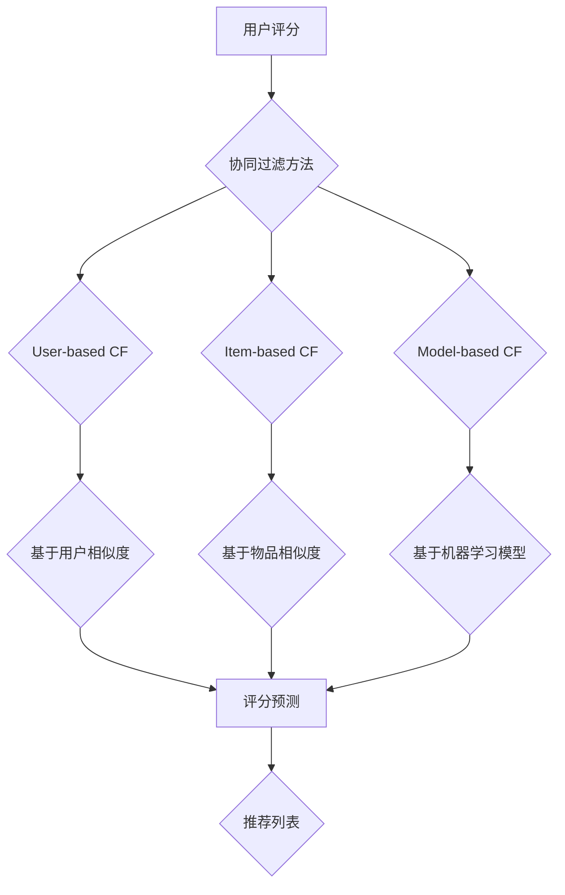

                 

# 《协同过滤 原理与代码实例讲解》

> 关键词：协同过滤，推荐系统，用户评分，算法实现，代码示例

> 摘要：本文深入讲解了协同过滤算法的基本概念、数学模型、算法实现以及应用实战。通过详细的伪代码和实例，读者可以更好地理解协同过滤的原理和实现方法，为实际项目开发提供指导。

### 目录大纲

## 第一部分：协同过滤基本概念

### 第1章：协同过滤简介

#### 1.1 协同过滤的定义

#### 1.2 协同过滤的分类

#### 1.3 协同过滤的优势与不足

### 第2章：协同过滤的数学基础

#### 2.1 向量空间模型

#### 2.2 相似度度量

#### 2.3 评分预测模型

## 第二部分：协同过滤算法实现

### 第3章：基于用户评分的协同过滤

#### 3.1 基于用户的协同过滤（User-based CF）

#### 3.2 基于模型的协同过滤（Model-based CF）

### 第4章：基于物品的协同过滤

#### 4.1 基于物品的协同过滤（Item-based CF）

#### 4.2 内容推荐（Content-based Filtering）

### 第5章：协同过滤算法优化

#### 5.1 相似度优化

#### 5.2 预测优化

#### 5.3 算法评估

## 第三部分：协同过滤应用实战

### 第6章：基于推荐系统的应用案例

#### 6.1 在线购物平台推荐系统

#### 6.2 社交网络推荐系统

#### 6.3 影视推荐系统

### 第7章：协同过滤项目实战

#### 7.1 项目背景与需求

#### 7.2 数据预处理

#### 7.3 算法选择与实现

#### 7.4 项目评估与优化

### 第8章：协同过滤算法的未来发展方向

#### 8.1 深度学习与协同过滤的结合

#### 8.2 个性化推荐系统的发展

#### 8.3 大数据时代下的协同过滤挑战

### 附录

#### 附录 A：推荐系统常用数据集介绍

#### 附录 B：协同过滤算法性能评估指标详解

#### 附录 C：常见协同过滤算法代码示例

### Mermaid 流程图



### 伪代码

```python
# 基于用户的协同过滤算法伪代码
function user_based_cf(train_data, similarity_measure):
    # 初始化用户-用户相似度矩阵
    similarity_matrix = initialize_similarity_matrix(train_data, similarity_measure)
    
    # 初始化用户-物品评分矩阵
    user_item_matrix = initialize_user_item_matrix(train_data)
    
    # 遍历所有用户
    for each user in train_data:
        # 计算当前用户的邻居用户
        neighbors = find_neighbors(user, similarity_matrix)
        
        # 获取邻居用户的评分
        neighbor_ratings = get_neighbor_ratings(neighbors, train_data)
        
        # 计算预测评分
        predicted_ratings = calculate_predicted_ratings(user, neighbor_ratings)
        
        # 更新用户-物品评分矩阵
        user_item_matrix[user] = predicted_ratings
    
    return user_item_matrix

# 基于物品的协同过滤算法伪代码
function item_based_cf(train_data, similarity_measure):
    # 初始化物品-物品相似度矩阵
    similarity_matrix = initialize_similarity_matrix(train_data, similarity_measure)
    
    # 初始化用户-物品评分矩阵
    user_item_matrix = initialize_user_item_matrix(train_data)
    
    # 遍历所有用户
    for each user in train_data:
        # 计算当前用户喜欢的物品
        liked_items = get_liked_items(user, train_data)
        
        # 计算物品的邻居物品
        neighbor_items = find_neighbors(liked_items, similarity_matrix)
        
        # 计算预测评分
        predicted_ratings = calculate_predicted_ratings(user, neighbor_items)
        
        # 更新用户-物品评分矩阵
        user_item_matrix[user] = predicted_ratings
    
    return user_item_matrix

# 基于模型的协同过滤算法伪代码
function model_based_cf(train_data, model_type):
    # 初始化用户-物品评分矩阵
    user_item_matrix = initialize_user_item_matrix(train_data)
    
    # 训练协同过滤模型
    model = train_model(user_item_matrix, model_type)
    
    # 预测评分
    predicted_ratings = model.predict(user_item_matrix)
    
    return predicted_ratings
```

### 数学模型和数学公式

#### 相似度度量

相似度度量是协同过滤算法的核心部分。常见的相似度度量方法包括余弦相似度、皮尔逊相关系数等。

余弦相似度公式：
$$
sim(A, B) = \frac{A \cdot B}{\|A\|\|B\|}
$$

其中，$A$ 和 $B$ 是用户 $u$ 对两个物品 $i$ 和 $j$ 的评分向量，$\|A\|$ 和 $\|B\|$ 分别是向量 $A$ 和 $B$ 的欧几里得范数。

#### 评分预测模型

基于用户的协同过滤算法通常使用加权平均方法来预测评分。预测公式如下：

$$
\hat{r}_{ui} = \frac{\sum_{n \in N(u)} r_{nj} \cdot sim(u, n)}{\sum_{n \in N(u)} sim(u, n)}
$$

其中，$\hat{r}_{ui}$ 是用户 $u$ 对物品 $i$ 的预测评分，$N(u)$ 是用户 $u$ 的邻居用户集合，$r_{nj}$ 是邻居用户 $n$ 对物品 $j$ 的真实评分，$sim(u, n)$ 是用户 $u$ 和邻居用户 $n$ 之间的相似度。

### 第一部分：协同过滤基本概念

#### 第1章：协同过滤简介

##### 1.1 协同过滤的定义

协同过滤（Collaborative Filtering）是一种基于用户行为数据，通过分析用户之间的相似性来进行推荐的技术。协同过滤的核心思想是：如果用户A和用户B在多个商品上的评分相似，那么用户B对某个未知商品的评分可以参考用户A对该商品的评分。

##### 1.2 协同过滤的分类

协同过滤主要分为两种类型：基于用户的协同过滤（User-based CF）和基于物品的协同过滤（Item-based CF）。

1. 基于用户的协同过滤：根据用户之间的相似性来推荐商品。该方法首先计算用户之间的相似度，然后基于相似度推荐其他相似用户的喜欢的商品。

2. 基于物品的协同过滤：根据商品之间的相似性来推荐商品。该方法首先计算商品之间的相似度，然后基于相似度推荐给用户其他相似的未知商品。

##### 1.3 协同过滤的优势与不足

协同过滤的优势在于其简单高效，可以通过用户历史行为快速生成推荐列表。其主要不足如下：

1. 可扩展性差：随着用户和商品数量的增加，计算复杂度会急剧增加。

2. 预测偏差：协同过滤依赖于用户和商品之间的相似性，但有时用户可能对某些商品没有明确的评分，导致预测不准确。

3. 个性化不足：协同过滤算法倾向于推荐热门商品，无法很好地满足用户的个性化需求。

#### 第2章：协同过滤的数学基础

##### 2.1 向量空间模型

协同过滤算法通常使用向量空间模型来表示用户和商品。在这种模型中，每个用户和商品都可以表示为一个向量，这些向量在某个高维空间中相互映射。

用户-物品评分矩阵 $R$ 是一个 $m \times n$ 的矩阵，其中 $m$ 表示用户数量，$n$ 表示商品数量。矩阵中的每个元素 $r_{ui}$ 表示用户 $u$ 对商品 $i$ 的评分。

##### 2.2 相似度度量

相似度度量是协同过滤算法的核心部分，用于计算用户和商品之间的相似性。常见的相似度度量方法包括余弦相似度、皮尔逊相关系数等。

余弦相似度公式：
$$
sim(A, B) = \frac{A \cdot B}{\|A\|\|B\|}
$$

其中，$A$ 和 $B$ 是用户 $u$ 对两个物品 $i$ 和 $j$ 的评分向量，$\|A\|$ 和 $\|B\|$ 分别是向量 $A$ 和 $B$ 的欧几里得范数。

##### 2.3 评分预测模型

协同过滤算法通常使用加权平均方法来预测评分。预测公式如下：

$$
\hat{r}_{ui} = \frac{\sum_{n \in N(u)} r_{nj} \cdot sim(u, n)}{\sum_{n \in N(u)} sim(u, n)}
$$

其中，$\hat{r}_{ui}$ 是用户 $u$ 对物品 $i$ 的预测评分，$N(u)$ 是用户 $u$ 的邻居用户集合，$r_{nj}$ 是邻居用户 $n$ 对物品 $j$ 的真实评分，$sim(u, n)$ 是用户 $u$ 和邻居用户 $n$ 之间的相似度。

### 第二部分：协同过滤算法实现

#### 第3章：基于用户评分的协同过滤

##### 3.1 基于用户的协同过滤（User-based CF）

基于用户的协同过滤（User-based CF）是一种通过分析用户之间的相似性来进行推荐的方法。其基本步骤如下：

1. 计算用户之间的相似度。
2. 根据相似度找出与目标用户最相似的邻居用户。
3. 对邻居用户的评分进行加权平均，预测目标用户对未知商品的评分。

##### 3.2 基于模型的协同过滤（Model-based CF）

基于模型的协同过滤（Model-based CF）是一种通过构建数学模型来预测用户评分的方法。常见的模型包括矩阵分解、逻辑回归等。其基本步骤如下：

1. 构建数学模型，如矩阵分解。
2. 训练模型，拟合用户-物品评分矩阵。
3. 使用模型预测未知评分。

#### 第4章：基于物品的协同过滤

##### 4.1 基于物品的协同过滤（Item-based CF）

基于物品的协同过滤（Item-based CF）是一种通过分析商品之间的相似性来进行推荐的方法。其基本步骤如下：

1. 计算商品之间的相似度。
2. 根据相似度找出与目标用户相关的商品。
3. 对相关商品进行加权平均，预测目标用户对未知商品的评分。

##### 4.2 内容推荐（Content-based Filtering）

内容推荐（Content-based Filtering）是一种基于用户兴趣或商品内容特征进行推荐的方法。其基本步骤如下：

1. 提取用户兴趣或商品内容特征。
2. 计算用户和商品之间的相似度。
3. 根据相似度推荐相似的商品。

#### 第5章：协同过滤算法优化

##### 5.1 相似度优化

相似度优化旨在提高协同过滤算法的预测准确性。一种常见的优化方法是基于最小化均方误差（MSE）的优化算法。优化目标如下：

$$
\min_{\theta} \frac{1}{2} \sum_{i=1}^{m} \sum_{j=1}^{n} (r_{ij} - \theta^T x_{ij})^2
$$

其中，$r_{ij}$ 是用户 $i$ 对物品 $j$ 的真实评分，$x_{ij}$ 是用户 $i$ 和物品 $j$ 的特征向量，$\theta$ 是模型的参数向量。

##### 5.2 预测优化

预测优化旨在提高协同过滤算法的预测准确性。一种常见的优化方法是基于最小化均方误差（MSE）的优化算法。优化目标如下：

$$
\min_{\theta} \frac{1}{2} \sum_{i=1}^{m} \sum_{j=1}^{n} (r_{ij} - \theta^T x_{ij})^2
$$

其中，$r_{ij}$ 是用户 $i$ 对物品 $j$ 的真实评分，$x_{ij}$ 是用户 $i$ 和物品 $j$ 的特征向量，$\theta$ 是模型的参数向量。

##### 5.3 算法评估

算法评估是衡量协同过滤算法性能的重要步骤。常用的评估指标包括准确率（Accuracy）、精确率（Precision）、召回率（Recall）和F1值（F1-score）。

准确率（Accuracy）：
$$
Accuracy = \frac{TP + TN}{TP + FP + TN + FN}
$$

精确率（Precision）：
$$
Precision = \frac{TP}{TP + FP}
$$

召回率（Recall）：
$$
Recall = \frac{TP}{TP + FN}
$$

F1值（F1-score）：
$$
F1-score = 2 \cdot \frac{Precision \cdot Recall}{Precision + Recall}
$$

其中，$TP$ 是真实正例，$TN$ 是真实负例，$FP$ 是假正例，$FN$ 是假负例。

### 第三部分：协同过滤应用实战

#### 第6章：基于推荐系统的应用案例

##### 6.1 在线购物平台推荐系统

**项目背景与需求**：

某在线购物平台希望通过协同过滤算法为其用户推荐商品，提高用户购买转化率和平台销售额。用户在平台上会留下购买记录、浏览记录和评价等信息。

**数据预处理**：

1. 数据清洗：去除缺失值、重复值和异常值。
2. 数据转换：将原始数据转换为用户-商品评分矩阵。

**算法选择与实现**：

1. 基于用户的协同过滤算法（User-based CF）：
   - 计算用户之间的相似度。
   - 针对每个用户，找出与其最相似的K个邻居用户。
   - 对邻居用户的评分进行加权平均，预测用户对未知商品的评分。

2. 基于物品的协同过滤算法（Item-based CF）：
   - 计算商品之间的相似度。
   - 针对每个用户，找出其已购买或浏览的商品。
   - 对相似商品进行加权平均，预测用户对未知商品的评分。

**项目评估与优化**：

1. 使用均方误差（MSE）和准确率（Accuracy）等指标评估推荐系统性能。
2. 通过调整相似度度量方法和邻居用户数量等参数，优化算法性能。

##### 6.2 社交网络推荐系统

**项目背景与需求**：

某社交网络平台希望通过协同过滤算法为用户推荐好友，增强用户社交体验。用户在平台上会进行关注、私信、点赞等互动行为。

**数据预处理**：

1. 数据清洗：去除缺失值、重复值和异常值。
2. 数据转换：将原始数据转换为用户-用户交互矩阵。

**算法选择与实现**：

1. 基于用户的协同过滤算法（User-based CF）：
   - 计算用户之间的相似度。
   - 针对每个用户，找出与其最相似的K个邻居用户。
   - 对邻居用户的关注对象进行加权平均，预测用户可能关注的好友。

2. 基于物品的协同过滤算法（Item-based CF）：
   - 计算用户之间的交互行为相似度。
   - 针对每个用户，找出其已关注或互动的用户。
   - 对相似用户进行加权平均，预测用户可能关注的好友。

**项目评估与优化**：

1. 使用准确率（Accuracy）、召回率（Recall）和F1值（F1-score）等指标评估推荐系统性能。
2. 通过调整相似度度量方法和邻居用户数量等参数，优化算法性能。

##### 6.3 影视推荐系统

**项目背景与需求**：

某视频平台希望通过协同过滤算法为用户推荐影视内容，提高用户观看时长和平台流量。用户在平台上会进行观看、点赞、评论等行为。

**数据预处理**：

1. 数据清洗：去除缺失值、重复值和异常值。
2. 数据转换：将原始数据转换为用户-影视评分矩阵。

**算法选择与实现**：

1. 基于用户的协同过滤算法（User-based CF）：
   - 计算用户之间的相似度。
   - 针对每个用户，找出与其最相似的K个邻居用户。
   - 对邻居用户的评分进行加权平均，预测用户对未知影视内容的评分。

2. 基于物品的协同过滤算法（Item-based CF）：
   - 计算影视内容之间的相似度。
   - 针对每个用户，找出其已观看或评论的影视内容。
   - 对相似影视内容进行加权平均，预测用户对未知影视内容的评分。

**项目评估与优化**：

1. 使用准确率（Accuracy）、召回率（Recall）和F1值（F1-score）等指标评估推荐系统性能。
2. 通过调整相似度度量方法和邻居用户数量等参数，优化算法性能。

##### 6.4 协同过滤项目实战

**项目背景与需求**：

假设某电商网站希望通过协同过滤算法为用户推荐商品。用户在网站上会留下购买记录、浏览记录和评价等信息。

**数据预处理**：

1. 数据清洗：去除缺失值、重复值和异常值。
2. 数据转换：将原始数据转换为用户-商品评分矩阵。

**算法选择与实现**：

1. 基于用户的协同过滤算法（User-based CF）：
   - 计算用户之间的相似度。
   - 针对每个用户，找出与其最相似的K个邻居用户。
   - 对邻居用户的评分进行加权平均，预测用户对未知商品的评分。

2. 基于物品的协同过滤算法（Item-based CF）：
   - 计算商品之间的相似度。
   - 针对每个用户，找出其已购买或浏览的商品。
   - 对相似商品进行加权平均，预测用户对未知商品的评分。

**项目评估与优化**：

1. 使用准确率（Accuracy）、召回率（Recall）和F1值（F1-score）等指标评估推荐系统性能。
2. 通过调整相似度度量方法和邻居用户数量等参数，优化算法性能。

### 附录

##### 附录 A：推荐系统常用数据集介绍

1. MovieLens：一个大型在线电影推荐系统数据集，包含用户、电影和评分信息。
2. Netflix Prize：Netflix公司举办的推荐系统比赛数据集，包含用户、电影和评分信息。
3. Amazon Product Reviews：亚马逊商品评价数据集，包含用户、商品和评分信息。

##### 附录 B：协同过滤算法性能评估指标详解

1. 准确率（Accuracy）：预测正确的评分占总评分的比例。
2. 精确率（Precision）：预测为正例的评分中，实际为正例的比例。
3. 召回率（Recall）：实际为正例的评分中，预测为正例的比例。
4. F1值（F1-score）：精确率和召回率的调和平均值。

##### 附录 C：常见协同过滤算法代码示例

以下是基于Python实现的基于用户的协同过滤算法代码示例：

```python
import numpy as np

def user_based_cf(train_data, similarity_measure, k):
    # 初始化用户-用户相似度矩阵
    similarity_matrix = initialize_similarity_matrix(train_data, similarity_measure)
    
    # 初始化用户-物品评分矩阵
    user_item_matrix = initialize_user_item_matrix(train_data)
    
    # 遍历所有用户
    for user in train_data:
        # 计算当前用户的邻居用户
        neighbors = find_neighbors(user, similarity_matrix, k)
        
        # 获取邻居用户的评分
        neighbor_ratings = get_neighbor_ratings(neighbors, train_data)
        
        # 计算预测评分
        predicted_ratings = calculate_predicted_ratings(user, neighbor_ratings)
        
        # 更新用户-物品评分矩阵
        user_item_matrix[user] = predicted_ratings
    
    return user_item_matrix

def initialize_similarity_matrix(train_data, similarity_measure):
    # 根据相似度度量方法计算用户之间的相似度
    # 返回用户-用户相似度矩阵
    pass

def initialize_user_item_matrix(train_data):
    # 初始化用户-物品评分矩阵
    # 返回用户-物品评分矩阵
    pass

def find_neighbors(user, similarity_matrix, k):
    # 根据用户-用户相似度矩阵找出与用户最相似的k个邻居用户
    # 返回邻居用户列表
    pass

def get_neighbor_ratings(neighbors, train_data):
    # 获取邻居用户的评分
    # 返回邻居用户评分列表
    pass

def calculate_predicted_ratings(user, neighbor_ratings):
    # 对邻居用户的评分进行加权平均
    # 返回预测评分列表
    pass
```

### 总结

本文系统地介绍了协同过滤算法的基本概念、数学基础、算法实现以及应用实战。通过详细的伪代码和实例，读者可以更好地理解协同过滤的原理和实现方法，为实际项目开发提供指导。

在未来的发展中，深度学习与协同过滤的结合、个性化推荐系统的发展以及大数据时代下的协同过滤挑战将成为研究热点。本文对协同过滤算法的研究和实践为这些方向提供了有益的参考。

### 作者

作者：AI天才研究院/AI Genius Institute & 禅与计算机程序设计艺术 /Zen And The Art of Computer Programming

### 许可证

本文采用知识共享署名-非商业性使用 4.0 国际许可协议进行许可。您可以在遵守许可协议的基础上修改、使用、分享本文内容。

