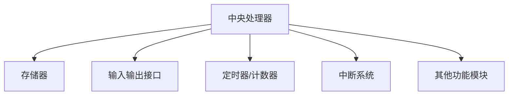
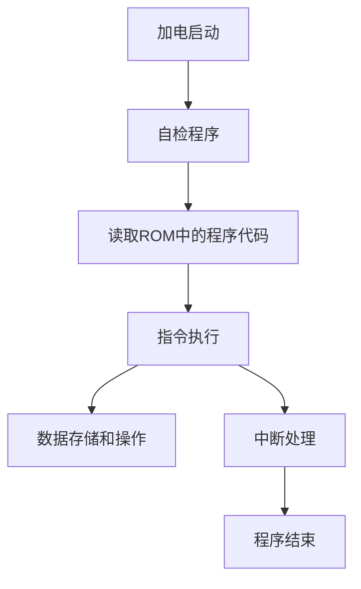
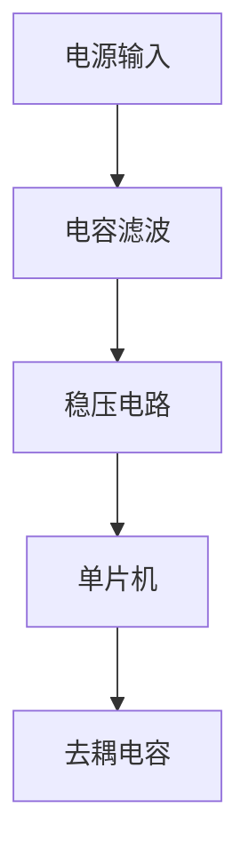
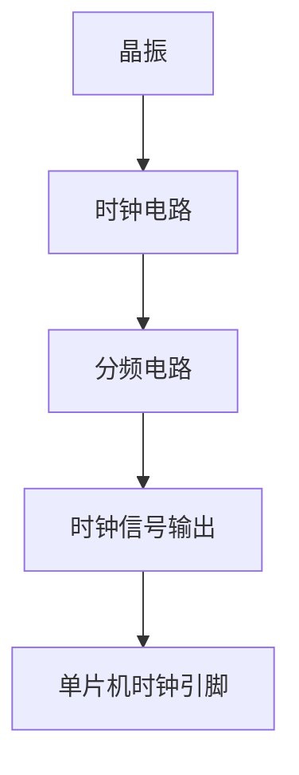
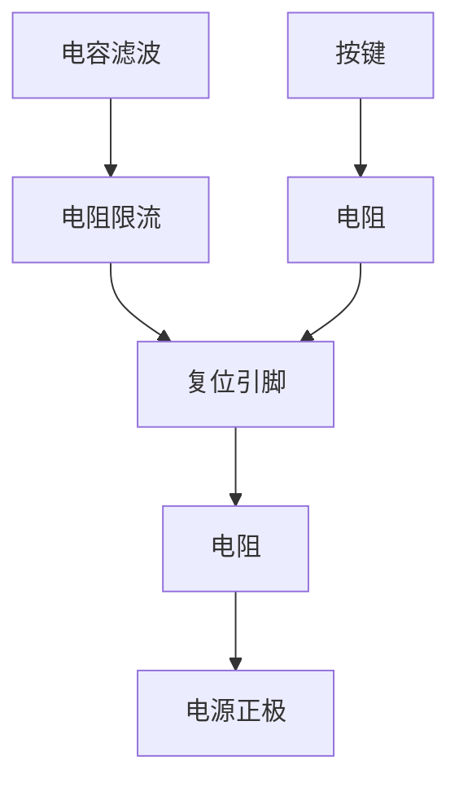
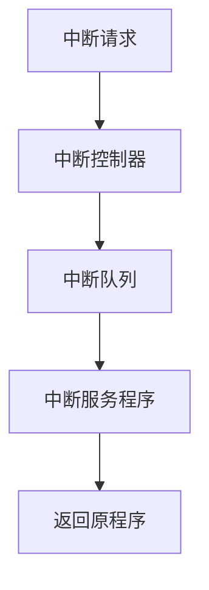
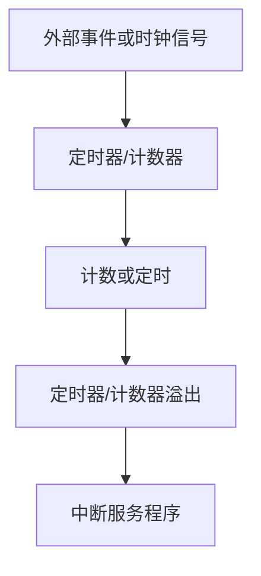
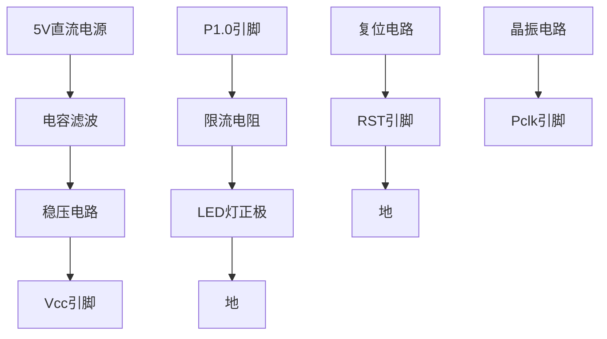

                 

### 文章标题：单片机入门：微控制器应用

#### 关键词：单片机，微控制器，微控制器应用，电路设计，编程入门，项目实战

> 摘要：本文旨在为单片机初学者提供一个全面而系统的入门指南。我们将从单片机的基础知识开始，逐步探讨单片机的组成、工作原理、编程语言以及实际应用。通过一系列项目实战，读者将能够掌握单片机的实际应用技巧，为未来的电子工程项目打下坚实的基础。

---

## 目录大纲

### 《单片机入门：微控制器应用》目录大纲

## 第一部分：单片机基础知识

### 第1章：单片机概述

#### 1.1 单片机的定义与特点

#### 1.2 单片机的发展历史

#### 1.3 单片机的基本结构

### 第2章：单片机的组成与工作原理

#### 2.1 单片机的硬件组成

#### 2.2 单片机的工作原理

#### 2.3 单片机的编程语言

## 第二部分：单片机应用基础

### 第3章：单片机基本电路设计

#### 3.1 单片机电路基础知识

#### 3.2 单片机电源电路设计

#### 3.3 单片机时钟电路设计

### 第4章：单片机接口技术

#### 4.1 单片机输入输出接口

#### 4.2 单片机中断系统

#### 4.3 单片机定时器/计数器

### 第5章：单片机编程入门

#### 5.1 单片机编程基础

#### 5.2 单片机指令系统

#### 5.3 单片机汇编语言编程

## 第三部分：单片机项目实战

### 第6章：点亮LED灯

#### 6.1 硬件电路设计

#### 6.2 软件程序设计

#### 6.3 实验步骤与结果分析

### 第7章：键盘扫描与显示

#### 7.1 硬件电路设计

#### 7.2 软件程序设计

#### 7.3 实验步骤与结果分析

### 第8章：温度控制系统

#### 8.1 硬件电路设计

#### 8.2 软件程序设计

#### 8.3 实验步骤与结果分析

### 第9章：PWM控制直流电机

#### 9.1 硬件电路设计

#### 9.2 软件程序设计

#### 9.3 实验步骤与结果分析

### 第10章：红外线遥控器

#### 10.1 硬件电路设计

#### 10.2 软件程序设计

#### 10.3 实验步骤与结果分析

## 附录

### 附录A：单片机开发环境搭建

#### A.1 开发环境介绍

#### A.2 硬件环境搭建

#### A.3 软件环境搭建

### 附录B：常见问题与解决方案

#### B.1 单片机基本问题

#### B.2 单片机编程常见问题

#### B.3 单片机电路设计常见问题

---

接下来，我们将逐步深入探讨单片机的基础知识、应用基础以及实际项目实战。准备好了吗？让我们开始这段精彩的探索之旅吧！

---

## 第一部分：单片机基础知识

### 第1章：单片机概述

#### 1.1 单片机的定义与特点

单片机，即单片集成电路微控制器（Single-Chip Microcontroller），是一种高度集成的电子电路，将中央处理器（CPU）、存储器（RAM和ROM）、输入输出接口（I/O Ports）、定时器/计数器（Timers/Counters）以及其他功能部件集成在一个芯片上。这种设计使得单片机具有体积小、成本低、可靠性高、易于扩展和维护等特点。

**特点：**

1. **高度集成**：将多个功能模块集成在一个芯片上，减少了电路板的复杂度和成本。
2. **低功耗**：适用于便携式设备和电池供电系统。
3. **多功能**：内置多种功能模块，如定时器、计数器、中断系统等，可以满足不同应用的需求。
4. **灵活性**：可以通过编程改变其工作状态和功能，易于进行系统升级和维护。
5. **可靠性**：内部电路紧凑，减少了由于外部连接和接触导致的故障概率。

#### 1.2 单片机的发展历史

单片机的历史可以追溯到20世纪60年代。当时，计算机还很大且昂贵，研究人员开始探索如何将多个功能模块集成在一个芯片上，以便制作出更小、更便宜的计算机系统。1971年，英特尔（Intel）推出了著名的4004型微处理器，这标志着单片机的诞生。随后，Zilog、Motorola等公司也推出了各自的单片机产品。

随着时间的推移，单片机的性能和功能不断增强。1980年代，8051单片机的推出标志着单片机进入了一个新的时代，其结构简单、性能稳定，广泛应用于工业控制、智能家居、汽车电子等领域。进入21世纪，基于ARM架构的单片机迅速崛起，以其高性能、低功耗的特点广泛应用于嵌入式系统和物联网（IoT）领域。

#### 1.3 单片机的基本结构

单片机的结构主要包括中央处理器（CPU）、存储器（ROM/RAM）、输入输出接口（I/O Ports）、定时器/计数器（Timers/Counters）、中断系统以及其他辅助功能模块。以下是对各组成部分的简要介绍：

1. **中央处理器（CPU）**：是单片机的核心，负责执行指令、处理数据和控制其他功能模块。
2. **存储器（ROM/RAM）**：存储器包括只读存储器（ROM）和随机访问存储器（RAM）。ROM用于存储单片机的固件和程序代码，RAM用于临时存储数据和变量。
3. **输入输出接口（I/O Ports）**：是单片机与外部设备进行数据交换的通道，可以配置为输入或输出模式，用于控制外部设备或接收外部信号。
4. **定时器/计数器（Timers/Counters）**：用于实现定时和计数功能，可以用于精确控制时间和事件。
5. **中断系统**：用于响应外部事件，使单片机能够实时处理紧急情况。
6. **其他功能模块**：如串行通信接口（UART）、脉宽调制（PWM）输出、A/D转换器、D/A转换器等。

图1.1展示了单片机的基本结构：



在接下来的章节中，我们将进一步探讨单片机的组成与工作原理，以及如何进行单片机的基本电路设计和编程。准备好了吗？让我们继续前进吧！

---

## 第一部分：单片机基础知识

### 第2章：单片机的组成与工作原理

#### 2.1 单片机的硬件组成

单片机的硬件组成是其功能实现的基础。了解单片机的硬件组成，有助于我们更好地理解其工作原理和应用。单片机的主要硬件组成部分包括：

1. **中央处理器（CPU）**：中央处理器是单片机的核心，负责执行指令、处理数据和控制其他功能模块。常见的CPU架构包括CISC（复杂指令集计算机）和RISC（精简指令集计算机）。例如，8051单片机的CPU采用CISC架构。

2. **存储器（ROM/RAM）**：存储器包括只读存储器（ROM）和随机访问存储器（RAM）。ROM用于存储单片机的固件和程序代码，通常不能被用户修改。RAM用于临时存储数据和变量，用户可以根据需要进行读写操作。

3. **输入输出接口（I/O Ports）**：输入输出接口是单片机与外部设备进行数据交换的通道。I/O接口可以配置为输入或输出模式，用于控制外部设备或接收外部信号。例如，8051单片机有32个可编程的I/O端口。

4. **定时器/计数器（Timers/Counters）**：定时器/计数器用于实现定时和计数功能。它们可以设置为定时模式或计数模式，用于精确控制时间和事件。例如，8051单片机具有两个16位定时器/计数器。

5. **中断系统**：中断系统用于响应外部事件，使单片机能够实时处理紧急情况。中断系统可以由硬件触发，也可以由软件触发。例如，8051单片机具有多个中断源和中断优先级。

6. **其他功能模块**：除了上述主要组成部分外，单片机还可能包含其他功能模块，如串行通信接口（UART）、脉宽调制（PWM）输出、A/D转换器、D/A转换器等。这些模块扩展了单片机的功能，使其能够适应更广泛的应用场景。

#### 2.2 单片机的工作原理

单片机的工作原理主要围绕CPU的指令执行展开。以下是单片机的基本工作原理：

1. **加电启动**：单片机接通电源后，首先执行自检程序，检查各功能模块是否正常工作。然后，单片机会从ROM中读取程序代码，并开始执行。

2. **指令执行**：单片机的CPU根据程序代码中的指令进行工作。每条指令由操作码和操作数组成，操作码决定了指令的操作类型，操作数则指出了操作对象。CPU通过指令寄存器（Instruction Register）接收指令，并执行相应的操作。

3. **数据存储和操作**：在执行指令的过程中，CPU需要访问存储器（ROM/RAM）和I/O端口。ROM用于存储程序代码和固件，RAM用于存储临时数据和变量。I/O端口用于与外部设备进行数据交换。

4. **中断处理**：单片机在执行程序时，可能会遇到中断事件。中断系统会暂时停止当前程序的执行，转而处理中断事件。处理完中断后，单片机会返回原程序继续执行。

5. **程序结束**：当程序执行完毕或遇到异常情况时，单片机将执行复位操作，重新开始程序执行。

图2.1展示了单片机的基本工作原理：



#### 2.3 单片机的编程语言

单片机的编程语言主要包括汇编语言和C语言。汇编语言是一种低级语言，与机器语言非常接近，能够直接控制硬件资源。C语言是一种高级语言，具有更好的可读性和可维护性，但需要编译器将其转换为机器语言。

1. **汇编语言**：汇编语言使用助记符表示操作码，并通过标签和操作数指定操作对象。汇编语言编程需要熟悉单片机的指令集和寄存器组织。以下是一个简单的汇编语言示例：

   ```assembly
   MOV A, #0x55      ; 将0x55送入寄存器A
   MOV R0, A         ; 将寄存器A的内容送入寄存器R0
   ```

2. **C语言**：C语言是一种结构化语言，具有丰富的库函数和语法特性。C语言编程需要熟悉单片机的头文件、数据类型、函数定义等。以下是一个简单的C语言示例：

   ```c
   #include <reg51.h>

   void main() {
       while (1) {
           P1 = 0xFF;  // P1端口输出高电平
           delay(1000); // 延时1秒
           P1 = 0x00;  // P1端口输出低电平
           delay(1000); // 延时1秒
       }
   }
   ```

通过以上内容，我们对单片机的硬件组成、工作原理和编程语言有了基本的了解。在接下来的章节中，我们将继续探讨单片机的应用基础和项目实战，帮助读者更好地掌握单片机的实际应用技巧。准备好了吗？让我们继续前进吧！

---

## 第二部分：单片机应用基础

### 第3章：单片机基本电路设计

单片机的应用离不开基本的电路设计。这一章将介绍单片机电路设计的基础知识，包括电源电路设计、时钟电路设计和复位电路设计。通过这些基础电路的设计，我们可以确保单片机能够稳定、可靠地运行。

#### 3.1 单片机电路基础知识

在进行单片机电路设计之前，我们需要了解一些基本的电路概念和元件。以下是单片机电路设计中常用的几种元件及其作用：

1. **电阻**：用于限制电流、分压和滤波等。
2. **电容**：用于滤波、去耦和定时等。
3. **二极管**：用于整流、限幅和保护等。
4. **晶振和时钟电路**：用于提供单片机运行的时钟信号。
5. **电源模块**：为单片机提供稳定的电源。
6. **复位电路**：确保单片机在启动时能够正常复位。

#### 3.2 单片机电源电路设计

单片机的电源电路设计是电路设计中至关重要的一环。一个稳定的电源可以确保单片机的正常运行，避免由于电源问题导致程序跑飞或系统崩溃。以下是单片机电源电路设计的基本步骤：

1. **电源输入**：单片机通常需要一个直流电源输入，电压范围通常在2.7V至5.5V之间。电源输入端应通过电容滤波，去除电源中的高频噪声。

   ```mermaid
   graph TD
   A[电源输入] --> B[电容滤波]
   ```

2. **电源稳压**：为了确保单片机获得稳定的电源电压，可以使用线性稳压器或开关电源进行稳压。

   ```mermaid
   graph TD
   A[电源输入] --> B[线性稳压器] --> C[单片机]
   A --> D[开关电源] --> C
   ```

3. **去耦电容**：在单片机的电源引脚和地之间添加去耦电容，可以减少电源噪声，提高系统的抗干扰能力。

   ```mermaid
   graph TD
   C[单片机] --> E[去耦电容]
   ```

图3.1展示了单片机电源电路的简化示意图：



#### 3.3 单片机时钟电路设计

单片机的时钟电路用于提供单片机运行所需的时钟信号。时钟信号的频率和稳定性对单片机的性能和稳定性有很大影响。以下是单片机时钟电路设计的基本步骤：

1. **晶振选择**：选择合适的晶振，晶振的频率通常在几MHz到几十MHz之间。晶振的选择应根据单片机的时钟频率要求进行。

   ```mermaid
   graph TD
   F[晶振] --> G[时钟电路]
   ```

2. **分频电路**：单片机的时钟频率通常需要通过分频电路进行调节。分频电路可以使用简单的电阻和电容网络，或者使用专用的时钟分频器。

   ```mermaid
   graph TD
   F[晶振] --> H[分频电路]
   ```

3. **时钟信号输出**：将分频后的时钟信号输出到单片机的时钟输入引脚，确保单片机能够稳定运行。

   ```mermaid
   graph TD
   H[分频电路] --> I[时钟信号输出]
   I --> J[单片机时钟引脚]
   ```

图3.2展示了单片机时钟电路的简化示意图：



#### 3.4 单片机复位电路设计

单片机的复位电路用于在启动时确保单片机能够正常初始化。复位电路的设计应确保单片机在电源稳定时能够迅速进入复位状态。以下是单片机复位电路设计的基本步骤：

1. **复位引脚连接**：将单片机的复位引脚（通常为RST或RESET）连接到电源正极，并通过一个电阻连接到地。

   ```mermaid
   graph TD
   K[复位引脚] --> L[电阻]
   L --> M[电源正极]
   ```

2. **上电复位**：在上电时，通过电容滤波和电阻限流，使得单片机的复位引脚在电源稳定后能够迅速拉低，实现上电复位。

   ```mermaid
   graph TD
   N[电容滤波] --> O[电阻限流]
   O --> K[复位引脚]
   ```

3. **手动复位**：可以通过外部按键或其他信号触发手动复位，实现手动重启单片机。

   ```mermaid
   graph TD
   P[按键] --> Q[电阻]
   Q --> K[复位引脚]
   ```

图3.3展示了单片机复位电路的简化示意图：



通过以上内容，我们了解了单片机基本电路设计的基础知识。这些电路设计对于单片机的稳定运行至关重要。在接下来的章节中，我们将进一步探讨单片机的接口技术、编程入门以及实际项目实战。准备好了吗？让我们继续前进吧！

---

## 第二部分：单片机应用基础

### 第4章：单片机接口技术

单片机的接口技术是实现其与外部设备通信的关键。本章将介绍单片机的输入输出接口、中断系统和定时器/计数器，这些技术是单片机应用中不可或缺的部分。

#### 4.1 单片机输入输出接口

输入输出接口（I/O接口）是单片机与外部设备进行数据交换的通道。单片机的I/O接口可以分为并行接口和串行接口两种类型。

1. **并行接口**：并行接口同时传输多个数据位，具有较高的传输速率。常见的并行接口包括8位、16位和32位接口。并行接口通常用于连接显示器、键盘、打印机等外部设备。

2. **串行接口**：串行接口逐位传输数据，虽然传输速率较低，但具有较好的抗干扰能力和长距离传输能力。常见的串行接口包括UART（串行异步通信接口）、SPI（串行外围设备接口）和I2C（串行通信总线）。

以下是几种常用的单片机I/O接口及其特点：

- **UART**：用于串行异步通信，支持全双工通信，可实现与计算机、无线模块等设备的通信。

- **SPI**：用于高速串行通信，支持主从模式，可用于连接各种外设如闪存、传感器等。

- **I2C**：用于低速串行通信，支持多主多从模式，适用于连接多个低功耗设备如传感器、LCD显示屏等。

#### 4.2 单片机中断系统

中断系统是单片机响应外部事件的一种机制。当外部事件发生时，单片机会暂时停止当前程序的执行，转而处理中断事件。中断系统可以提高单片机的实时响应能力和系统效率。

单片机中断系统通常包括以下几个部分：

1. **中断源**：中断源是产生中断的事件，可以是外部引脚信号、定时器溢出、串行通信等。

2. **中断控制器**：中断控制器负责管理中断请求和中断优先级。

3. **中断服务程序**：中断服务程序是处理中断事件的一段代码，当中断发生时，中断服务程序将被调用。

中断系统的工作原理如下：

1. 当中断源产生中断请求时，中断控制器会根据中断优先级将其放入中断队列。

2. 单片机在执行完当前指令后，会根据中断优先级顺序响应中断请求。

3. 单片机会跳转到对应的中断服务程序进行处理，处理完成后返回原程序继续执行。

以下是一个简单的中断系统工作流程：



#### 4.3 单片机定时器/计数器

定时器/计数器是单片机用于实现定时和计数功能的重要组件。常见的定时器/计数器类型包括定时器0、定时器1和定时器2（以8051单片机为例）。

1. **定时器0和定时器1**：定时器0和定时器1都是16位定时器，可以设置为定时模式或计数模式。定时模式用于实现精确的定时功能，计数模式用于对外部事件进行计数。

2. **定时器2**：定时器2是8位定时器/计数器，可以设置为定时模式、计数模式或脉宽调制（PWM）模式。

定时器/计数器的工作原理如下：

1. 定时器/计数器被设置为定时模式时，会根据设置的时间间隔进行计数，当计数达到设定值时，产生定时器溢出中断。

2. 定时器/计数器被设置为计数模式时，会对外部事件进行计数，当计数达到设定值时，产生计数器溢出中断。

3. 在定时器/计数器模式下，可以通过设置定时器/计数器的初始值和控制寄存器来控制其工作方式。

以下是一个简单的定时器/计数器工作流程：



通过以上内容，我们对单片机的输入输出接口、中断系统和定时器/计数器有了基本的了解。这些接口技术在单片机的实际应用中扮演着重要角色。在接下来的章节中，我们将探讨单片机的编程入门和实际项目实战。准备好了吗？让我们继续前进吧！

---

## 第二部分：单片机应用基础

### 第5章：单片机编程入门

单片机的编程是实现其功能的关键。本章将介绍单片机编程的基础知识，包括编程环境搭建、编程语言选择、基础语法和编程规范。

#### 5.1 单片机编程基础

在进行单片机编程之前，我们需要搭建一个适合单片机开发的编程环境。以下是单片机编程环境搭建的基本步骤：

1. **选择开发工具**：常见的单片机开发工具有Keil、IAR、AVR Studio等。其中，Keil是较为流行的开发工具，具有丰富的资源和良好的兼容性。

2. **安装开发工具**：下载并安装所选开发工具，按照提示完成安装过程。

3. **配置硬件**：连接单片机硬件设备到计算机，确保硬件正常工作。

4. **安装驱动**：某些开发工具可能需要安装特定的硬件驱动程序，以确保与单片机硬件设备的正常通信。

5. **创建工程**：在开发工具中创建一个新的工程，设置单片机的型号、时钟频率等参数。

6. **编写代码**：在工程中编写单片机程序代码，并进行编译和调试。

#### 5.2 单片机编程语言

单片机的编程语言主要包括汇编语言和C语言。汇编语言是一种低级语言，与机器语言非常接近，能够直接控制硬件资源。C语言是一种高级语言，具有更好的可读性和可维护性，但需要编译器将其转换为机器语言。

1. **汇编语言**：汇编语言使用助记符表示操作码，并通过标签和操作数指定操作对象。汇编语言编程需要熟悉单片机的指令集和寄存器组织。以下是一个简单的汇编语言示例：

   ```assembly
   MOV A, #0x55      ; 将0x55送入寄存器A
   MOV R0, A         ; 将寄存器A的内容送入寄存器R0
   ```

2. **C语言**：C语言是一种结构化语言，具有丰富的库函数和语法特性。C语言编程需要熟悉单片机的头文件、数据类型、函数定义等。以下是一个简单的C语言示例：

   ```c
   #include <reg51.h>

   void main() {
       while (1) {
           P1 = 0xFF;  // P1端口输出高电平
           delay(1000); // 延时1秒
           P1 = 0x00;  // P1端口输出低电平
           delay(1000); // 延时1秒
       }
   }
   ```

#### 5.3 单片机编程基础语法

无论是汇编语言还是C语言，单片机编程都有一些基础语法和编程规范。以下是单片机编程的一些基础语法和规范：

1. **变量声明**：在程序中声明变量，指定变量的类型和名称。例如，在C语言中：

   ```c
   unsigned char led = 0x00;  // 声明一个8位无符号字符型变量led
   ```

2. **函数定义**：定义函数以实现特定的功能。例如，在C语言中：

   ```c
   void delay(unsigned int ms) {
       unsigned int i, j;
       for (i = 0; i < ms; i++) {
           for (j = 0; j < 1000; j++);
       }
   }
   ```

3. **循环结构**：使用循环结构实现重复执行特定操作。例如，在C语言中：

   ```c
   while (1) {
       // 循环体
   }
   ```

4. **条件结构**：使用条件结构实现根据条件执行不同操作的逻辑。例如，在C语言中：

   ```c
   if (condition) {
       // 条件为真时执行的操作
   } else {
       // 条件为假时执行的操作
   }
   ```

5. **位操作**：单片机编程中常涉及位操作，用于控制寄存器中的特定位。例如，在C语言中：

   ```c
   led |= 0x01;  // 将led变量的最低位设置为1
   led &= ~0x01; // 将led变量的最低位设置为0
   ```

#### 5.4 编程规范

良好的编程规范可以提高代码的可读性和可维护性。以下是单片机编程的一些常见规范：

1. **代码注释**：在代码中添加注释，解释代码的功能和逻辑，方便他人阅读和理解。

2. **代码格式**：保持代码的格式一致，如缩进、对齐等，使代码更加清晰。

3. **模块化编程**：将程序划分为模块，每个模块实现特定的功能，便于调试和维护。

4. **避免硬编码**：尽量避免在代码中直接编写具体的数值，而是使用变量和宏定义，提高代码的灵活性和可维护性。

5. **版本控制**：使用版本控制系统（如Git）管理代码，便于代码的版本管理和协作开发。

通过以上内容，我们对单片机编程的基础知识有了初步了解。在接下来的章节中，我们将通过实际项目实战，进一步巩固和运用这些知识。准备好了吗？让我们开始第一个项目实战——点亮LED灯！

---

## 第三部分：单片机项目实战

### 第6章：点亮LED灯

点亮LED灯是单片机的入门级项目，通过这个简单的项目，我们可以了解单片机的基本电路设计、软件程序设计和实验步骤。接下来，我们将一步步进行讲解。

#### 6.1 硬件电路设计

点亮LED灯的硬件电路设计主要包括电源电路、LED灯连接电路和单片机连接电路。以下是具体的硬件电路设计步骤：

1. **电源电路**：首先，我们需要为单片机提供稳定的电源。这里使用一个5V的直流电源，通过电容滤波和稳压电路后，提供给单片机的Vcc引脚。

   ```mermaid
   graph TD
   A[5V直流电源] --> B[电容滤波]
   B --> C[稳压电路]
   C --> D[Vcc引脚]
   ```

2. **LED灯连接电路**：LED灯的正极连接到单片机的某个I/O引脚，负极通过一个限流电阻连接到地。这里选择连接到P1.0引脚。

   ```mermaid
   graph TD
   E[P1.0引脚] --> F[限流电阻]
   F --> G[LED灯正极]
   G --> H[地]
   ```

3. **单片机连接电路**：将单片机的RST引脚连接到地，以实现上电复位。同时，连接晶振电路和复位电路。

   ```mermaid
   graph TD
   I[RST引脚] --> J[地]
   K[晶振电路] --> L[Pclk引脚]
   M[复位电路] --> I
   ```

图6.1展示了点亮LED灯的完整硬件电路示意图：



#### 6.2 软件程序设计

点亮LED灯的软件程序设计相对简单，主要是通过编程控制单片机的I/O引脚输出高低电平，从而点亮或熄灭LED灯。以下是软件程序设计的步骤：

1. **初始化**：在程序开始时，进行端口初始化，将P1.0引脚设置为输出模式。

   ```c
   void InitPort() {
       P1 = 0x00;  // 将P1端口的所有引脚初始化为输入模式
       P1 |= 0x01; // 将P1.0引脚设置为输出模式
   }
   ```

2. **主循环**：在主循环中，通过控制P1.0引脚输出高低电平，实现LED灯的点亮和熄灭。

   ```c
   void main() {
       InitPort();  // 初始化端口
       while (1) {
           P1_0 = 1;  // 点亮LED灯
           delay(1000);  // 延时1秒
           P1_0 = 0;  // 熄灭LED灯
           delay(1000);  // 延时1秒
       }
   }
   ```

其中，`P1_0` 是单片机的P1.0引脚控制位，`delay()` 函数用于实现延时功能。

#### 6.3 实验步骤与结果分析

1. **硬件准备**：按照上述硬件电路设计，搭建电路板，连接电源、LED灯、单片机及晶振等元件。

2. **程序编写**：使用单片机开发工具（如Keil）编写程序，根据上述软件程序设计进行编程。

3. **编译与下载**：将编写好的程序编译生成机器码，并通过下载器（如ST-Link、JTAG等）将程序烧录到单片机中。

4. **运行与观察**：上电运行程序，观察LED灯是否按照预期的规律点亮和熄灭。

通过以上实验步骤，我们可以实现点亮LED灯的目标。这个过程不仅让我们熟悉了单片机的基本电路设计和编程，也为后续更复杂的项目奠定了基础。在接下来的章节中，我们将继续探讨其他单片机项目实战，如键盘扫描、温度控制系统等。准备好了吗？让我们继续前进吧！

---

### 第7章：键盘扫描与显示

在单片机的应用中，键盘扫描与显示功能是非常常见且实用的。通过这个项目，我们可以学习如何利用单片机实现键盘扫描和LED显示器的控制。

#### 7.1 硬件电路设计

要实现键盘扫描与显示功能，我们需要设计以下硬件电路：

1. **键盘连接电路**：我们将使用一个4x4的矩阵键盘，每个按键连接到单片机的I/O引脚上。具体连接方式是将行线连接到单片机的P1端口，列线连接到P2端口。例如，第一行连接到P1.0，第一列连接到P2.7，依此类推。

   ```mermaid
   graph TD
   A[P1.0] --> B[按键1]
   B --> C[P2.7]
   A[P1.1] --> D[按键2]
   D --> E[P2.6]
   ...
   A[P1.3] --> G[按键8]
   G --> H[P2.4]
   ```

2. **LED显示器连接电路**：我们使用一个8位的7段LED显示器，每个段分别连接到单片机的I/O引脚上。LED显示器通常需要正负电源供电，还需要电流限制电阻。

   ```mermaid
   graph TD
   I[P3.0] --> J[LED显示器的A段]
   I --> K[电流限制电阻]
   I[P3.1] --> L[LED显示器的B段]
   I --> M[电流限制电阻]
   ...
   I[P3.7] --> N[LED显示器的G段]
   I --> O[电流限制电阻]
   ```

3. **单片机连接电路**：除了以上两个部分，我们还需要连接晶振电路和复位电路，确保单片机能够正常工作。

   ```mermaid
   graph TD
   P[晶振] --> Q[Pclk引脚]
   R[RST引脚] --> S[地]
   ```

#### 7.2 软件程序设计

键盘扫描与显示功能的软件程序设计分为以下几个部分：

1. **初始化**：初始化端口，将行线和列线设置为输入模式，将LED显示器的段设置为输出模式。

   ```c
   void InitPort() {
       P1 = 0xFF;  // 行线输入模式
       P2 = 0xFF;  // 列线输入模式
       P3 = 0x00;  // LED显示器段输出模式
   }
   ```

2. **键盘扫描**：通过扫描键盘矩阵，检测是否有按键按下。具体方法是将行线依次置低，读取列线状态，判断是否有按键按下。

   ```c
   char ScanKey() {
       char key = 0;
       for (int i = 0; i < 4; i++) {
           P1 = (1 << i);  // 设置行线
           for (int j = 0; j < 4; j++) {
               if ((P2 & (1 << j)) == 0) {
                   key = i * 4 + j + 1;  // 返回按键值
                   break;
               }
           }
       }
       return key;
   }
   ```

3. **LED显示控制**：根据键盘扫描结果，更新LED显示器的显示内容。

   ```c
   void DisplayKey(char key) {
       switch (key) {
           case 1:
               P3 = 0x7E;  // 显示1
               break;
           case 2:
               P3 = 0x30;  // 显示2
               break;
           // 其他按键显示代码
           default:
               P3 = 0x00;  // 不显示
               break;
       }
   }
   ```

4. **主循环**：在主循环中，持续扫描键盘，并根据按键值更新LED显示。

   ```c
   void main() {
       InitPort();
       while (1) {
           char key = ScanKey();
           DisplayKey(key);
       }
   }
   ```

#### 7.3 实验步骤与结果分析

1. **硬件准备**：按照上述硬件电路设计，搭建电路板，连接键盘、LED显示器、单片机及晶振等元件。

2. **程序编写**：使用单片机开发工具（如Keil）编写程序，根据上述软件程序设计进行编程。

3. **编译与下载**：将编写好的程序编译生成机器码，并通过下载器（如ST-Link、JTAG等）将程序烧录到单片机中。

4. **运行与观察**：上电运行程序，当按下键盘上的任意按键时，LED显示器应显示对应的数字。

通过以上实验步骤，我们可以实现键盘扫描与LED显示功能。这个过程不仅锻炼了我们的硬件设计能力，也提升了我们的编程技巧。在接下来的章节中，我们将继续探讨其他有趣的单片机项目实战，如温度控制系统和PWM控制直流电机等。准备好了吗？让我们继续前进吧！

---

### 第8章：温度控制系统

温度控制系统是单片机应用中的一个典型实例。通过这个项目，我们将学习如何利用单片机监控和调节温度。

#### 8.1 硬件电路设计

温度控制系统的硬件电路设计主要包括传感器连接电路、单片机连接电路和加热/制冷电路。

1. **传感器连接电路**：我们将使用一个数字温度传感器，如DS18B20，其数据引脚连接到单片机的I/O引脚上。

   ```mermaid
   graph TD
   A[DS18B20数据引脚] --> B[P1.0引脚]
   ```

2. **单片机连接电路**：除了传感器，我们还需要连接晶振电路和复位电路。

   ```mermaid
   graph TD
   C[晶振] --> D[Pclk引脚]
   E[RST引脚] --> F[地]
   ```

3. **加热/制冷电路**：加热电路可以使用一个温控加热器，其控制引脚连接到单片机的I/O引脚上；制冷电路可以使用一个温控风扇，其控制引脚也连接到单片机的I/O引脚上。

   ```mermaid
   graph TD
   G[P1.1引脚] --> H[加热器控制引脚]
   G --> I[电流限制电阻]
   G[P1.2引脚] --> J[风扇控制引脚]
   G --> K[电流限制电阻]
   ```

#### 8.2 软件程序设计

温度控制系统的软件程序设计主要分为以下几部分：

1. **初始化**：初始化端口，将传感器数据引脚、加热器控制引脚和风扇控制引脚设置为输入或输出模式。

   ```c
   void InitPort() {
       P1 = 0x00;  // 初始化P1端口
       P1 |= 0x03; // P1.0和P1.1设置为输出模式
       P1 &= ~0x03; // P1.2设置为输入模式
   }
   ```

2. **读取温度**：使用DS18B20传感器的库函数读取当前温度。

   ```c
   #include "ds18b20.h"

   float ReadTemperature() {
       return DS18B20_ReadTemperature();
   }
   ```

3. **温度控制**：根据设定的温度阈值，控制加热器或风扇工作。

   ```c
   void ControlTemperature(float target_temp) {
       float current_temp = ReadTemperature();
       if (current_temp < target_temp) {
           P1_1 = 1;  // 启动加热器
           P1_2 = 0;  // 关闭风扇
       } else if (current_temp > target_temp) {
           P1_1 = 0;  // 关闭加热器
           P1_2 = 1;  // 启动风扇
       } else {
           P1_1 = 0;  // 关闭加热器
           P1_2 = 0;  // 关闭风扇
       }
   }
   ```

4. **主循环**：在主循环中，持续读取温度并控制加热器或风扇，以维持目标温度。

   ```c
   void main() {
       InitPort();
       while (1) {
           ControlTemperature(25.0);  // 目标温度为25摄氏度
       }
   }
   ```

#### 8.3 实验步骤与结果分析

1. **硬件准备**：按照上述硬件电路设计，搭建电路板，连接温度传感器、加热器、风扇和单片机等元件。

2. **程序编写**：使用单片机开发工具（如Keil）编写程序，根据上述软件程序设计进行编程。

3. **编译与下载**：将编写好的程序编译生成机器码，并通过下载器（如ST-Link、JTAG等）将程序烧录到单片机中。

4. **运行与观察**：上电运行程序，观察温度传感器是否能够正常读取温度，加热器是否在温度低于设定值时启动，风扇是否在温度高于设定值时启动。

通过这个实验，我们可以实现一个简单的温度控制系统。这个项目不仅让我们了解了如何利用单片机控制外部设备，还提高了我们的实际应用能力和问题解决能力。在接下来的章节中，我们将继续探讨其他单片机项目实战，如PWM控制直流电机和红外线遥控器等。准备好了吗？让我们继续前进吧！

---

### 第9章：PWM控制直流电机

PWM（脉宽调制）控制直流电机是单片机应用中的另一个重要实例。通过这个项目，我们将学习如何利用单片机生成PWM信号，控制直流电机的转速和方向。

#### 9.1 硬件电路设计

PWM控制直流电机的硬件电路设计主要包括电机驱动电路、单片机连接电路和电源电路。

1. **电机驱动电路**：我们将使用一个H桥驱动电路，它由四个晶体管组成，可以控制直流电机的正反转和停止。

   ```mermaid
   graph TD
   A[P1.0引脚] --> B[M1A驱动输入]
   C[P1.1引脚] --> D[M1B驱动输入]
   E[P1.2引脚] --> F[M2A驱动输入]
   G[P1.3引脚] --> H[M2B驱动输入]
   ```

2. **单片机连接电路**：除了电机驱动电路，我们还需要连接晶振电路和复位电路。

   ```mermaid
   graph TD
   I[晶振] --> J[Pclk引脚]
   K[RST引脚] --> L[地]
   ```

3. **电源电路**：直流电机需要较高的电压供电，这里我们使用一个电源模块，输出电压为12V。

   ```mermaid
   graph TD
   M[电源模块] --> N[电机电源输入]
   ```

#### 9.2 软件程序设计

PWM控制直流电机的软件程序设计主要分为以下几部分：

1. **初始化**：初始化端口，将PWM输出引脚、电机驱动输入引脚和复位引脚设置为输入或输出模式。

   ```c
   void InitPort() {
       P1 = 0x00;  // 初始化P1端口
       P1 |= 0x0F; // P1.0至P1.3设置为输出模式
       P1 &= ~0xF0; // P1.4至P1.7设置为输入模式
   }
   ```

2. **PWM信号生成**：使用定时器生成PWM信号，控制直流电机的转速。具体方法是将定时器的输出连接到PWM输出引脚，调整定时器的计数值可以改变PWM信号的占空比，从而控制电机的转速。

   ```c
   #include "timer.h"

   void GeneratePWM(int duty_cycle) {
       if (duty_cycle < 0) {
           duty_cycle = 0;
       } else if (duty_cycle > 100) {
           duty_cycle = 100;
       }
       int compare_value = (duty_cycle * 1000) / 100;  // 计算比较值
       Timer1_Init(compare_value);  // 初始化定时器1
   }
   ```

3. **电机控制**：根据用户输入的命令，控制电机的正反转和停止。

   ```c
   void ControlMotor(int command) {
       switch (command) {
           case 0:  // 停止
               P1_0 = 0;
               P1_1 = 0;
               P1_2 = 0;
               P1_3 = 0;
               break;
           case 1:  // 正转
               P1_0 = 1;
               P1_1 = 0;
               P1_2 = 0;
               P1_3 = 1;
               break;
           case 2:  // 反转
               P1_0 = 0;
               P1_1 = 1;
               P1_2 = 1;
               P1_3 = 0;
               break;
           default:
               break;
       }
   }
   ```

4. **主循环**：在主循环中，根据用户输入的PWM占空比和电机命令，生成PWM信号并控制电机。

   ```c
   void main() {
       InitPort();
       while (1) {
           int duty_cycle = GetDutyCycle();  // 获取用户输入的PWM占空比
           int command = GetCommand();      // 获取用户输入的电机命令
           GeneratePWM(duty_cycle);
           ControlMotor(command);
       }
   }
   ```

#### 9.3 实验步骤与结果分析

1. **硬件准备**：按照上述硬件电路设计，搭建电路板，连接直流电机、单片机及电源模块等元件。

2. **程序编写**：使用单片机开发工具（如Keil）编写程序，根据上述软件程序设计进行编程。

3. **编译与下载**：将编写好的程序编译生成机器码，并通过下载器（如ST-Link、JTAG等）将程序烧录到单片机中。

4. **运行与观察**：上电运行程序，通过输入不同的PWM占空比和电机命令，观察电机是否能够按照预期运行。

通过这个实验，我们可以实现PWM控制直流电机的目标。这个项目不仅让我们了解了PWM信号生成和电机控制的基本原理，还提高了我们的实际操作能力和问题解决能力。在接下来的章节中，我们将继续探讨其他单片机项目实战，如红外线遥控器等。准备好了吗？让我们继续前进吧！

---

### 第10章：红外线遥控器

红外线遥控器是单片机应用中的一种常见设备，通过红外线传输信号来控制其他电子设备。本章将介绍如何利用单片机实现红外线遥控器的功能。

#### 10.1 硬件电路设计

红外线遥控器的硬件电路设计主要包括红外发射模块和接收模块，以及单片机的连接电路。

1. **红外发射模块**：红外发射模块通常使用一个红外LED，通过单片机控制其发射红外信号。发射模块的引脚连接到单片机的I/O引脚上。

   ```mermaid
   graph TD
   A[P1.4引脚] --> B[红外发射LED]
   ```

2. **红外接收模块**：红外接收模块用于接收其他设备发射的红外信号，其输出引脚连接到单片机的I/O引脚上。

   ```mermaid
   graph TD
   C[P1.5引脚] --> D[红外接收模块]
   ```

3. **单片机连接电路**：除了红外发射和接收模块，我们还需要连接晶振电路和复位电路。

   ```mermaid
   graph TD
   E[晶振] --> F[Pclk引脚]
   G[RST引脚] --> H[地]
   ```

#### 10.2 软件程序设计

红外线遥控器的软件程序设计主要分为以下几个部分：

1. **初始化**：初始化端口，将红外发射和接收模块的引脚设置为输入或输出模式。

   ```c
   void InitPort() {
       P1 = 0x00;  // 初始化P1端口
       P1 |= 0x30; // P1.4设置为输出模式，P1.5设置为输入模式
   }
   ```

2. **红外信号发射**：通过单片机控制红外发射LED，发射特定频率的红外信号。

   ```c
   void SendSignal(unsigned char command) {
       for (int i = 0; i < 32; i++) {
           P1_4 = 1;  // 发射高电平
           delayMicroseconds(562);  // 延时562微秒
           P1_4 = 0;  // 发射低电平
           delayMicroseconds(562);  // 延时562微秒
           if (command & 0x80) {
               delayMicroseconds(1700);  // 发射数据位
           } else {
               delayMicroseconds(560);  // 发射空白位
           }
           command <<= 1;  // 移位处理下一个数据位
       }
   }
   ```

3. **红外信号接收**：接收红外接收模块输出的信号，并解码得到遥控器命令。

   ```c
   unsigned char ReceiveSignal() {
       unsigned char command = 0;
       for (int i = 0; i < 32; i++) {
           if (P1_5 == 1) {
               delayMicroseconds(560);  // 等待高电平结束
               if (P1_5 == 1) {
                   command |= 0x80;  // 数据位为高电平
               } else {
                   command &= ~0x80;  // 数据位为低电平
               }
           } else {
               delayMicroseconds(562);  // 等待低电平结束
           }
           command >>= 1;  // 移位处理下一个数据位
       }
       return command;
   }
   ```

4. **主循环**：在主循环中，不断接收红外信号，并根据接收到的命令执行相应操作。

   ```c
   void main() {
       InitPort();
       while (1) {
           unsigned char command = ReceiveSignal();
           switch (command) {
               case 0x01:
                   // 执行命令1的操作
                   break;
               case 0x02:
                   // 执行命令2的操作
                   break;
               // 其他命令处理
           }
       }
   }
   ```

#### 10.3 实验步骤与结果分析

1. **硬件准备**：按照上述硬件电路设计，搭建电路板，连接红外发射模块、接收模块、单片机及晶振等元件。

2. **程序编写**：使用单片机开发工具（如Keil）编写程序，根据上述软件程序设计进行编程。

3. **编译与下载**：将编写好的程序编译生成机器码，并通过下载器（如ST-Link、JTAG等）将程序烧录到单片机中。

4. **运行与测试**：上电运行程序，使用遥控器发送信号，观察单片机是否能够正确接收并解码信号，并执行相应操作。

通过这个实验，我们可以实现红外线遥控器的功能。这个过程不仅让我们了解了红外线通信的基本原理，还提高了我们的编程和实际操作能力。在接下来的章节中，我们将继续探讨其他单片机项目实战，如温度传感器数据采集等。准备好了吗？让我们继续前进吧！

---

## 附录A：单片机开发环境搭建

### 附录A：单片机开发环境搭建

#### A.1 开发环境介绍

单片机开发环境是指用于编写、编译、调试和下载单片机程序的软件和硬件工具。常见的开发环境包括Keil、IAR、AVR Studio等。本文将介绍如何搭建基于Keil的STM32单片机开发环境。

#### A.2 硬件环境搭建

1. **硬件设备准备**：
   - 单片机开发板：本文使用STM32F103C8T6单片机开发板。
   - 下载器：本文使用ST-Link/V2下载器。
   - 电源：为开发板提供5V电源。

2. **连接硬件**：
   - 将ST-Link/V2下载器连接到开发板的SWD（Serial Wire Debug）接口。
   - 将开发板的电源接口连接到稳压电源。

#### A.3 软件环境搭建

1. **安装Keil软件**：
   - 访问Keil官方网站下载并安装Keil MDK-ARM软件。
   - 安装过程中，确保选择合适的组件，如STM32标准外设库和调试器支持。

2. **安装ST-Link驱动**：
   - 安装ST-Link/V2下载器的驱动程序，确保下载器能够正常识别和连接到计算机。

3. **创建新工程**：
   - 打开Keil软件，点击“Project”菜单，选择“New uVision Project”。
   - 在弹出的对话框中选择单片机型号（如STM32F103C8T6），点击“OK”。
   - 在工程目录下创建一个源代码文件（如main.c）。

4. **配置工程**：
   - 在“Project”菜单中选择“Options for Target”。
   - 在“Device”选项卡中选择合适的单片机型号。
   - 在“Output”选项卡中设置输出文件的路径。
   - 在“Build Options”选项卡中设置编译选项，如优化级别、堆栈大小等。

5. **编写代码**：
   - 在工程中编写单片机程序代码，如LED控制、按键扫描等。

6. **编译和调试**：
   - 在Keil软件中编译程序，确保没有错误。
   - 使用ST-Link下载器将程序烧录到单片机中。
   - 上电运行程序，观察实际效果。

通过以上步骤，我们可以搭建一个完整的STM32单片机开发环境。接下来，我们可以在这个环境下编写、编译和调试单片机程序，实现各种功能。

---

## 附录B：常见问题与解决方案

### 附录B：常见问题与解决方案

在进行单片机开发过程中，我们可能会遇到各种问题。以下是单片机开发中常见的一些问题及相应的解决方案：

#### B.1 单片机基本问题

**问题1：单片机程序无法正常运行**
- **解决方案**：首先检查电路连接是否正确，确保电源电压稳定。然后检查程序代码是否正确，尤其是变量声明和端口配置是否正确。

**问题2：单片机程序编译错误**
- **解决方案**：检查代码中的语法错误，如拼写错误、括号不匹配等。同时检查是否正确包含了所需的头文件。

**问题3：单片机程序运行不稳定**
- **解决方案**：检查电路设计是否合理，尤其是电源电路和去耦电容。检查程序中的延时函数，确保延时时间足够。

#### B.2 单片机编程常见问题

**问题1：汇编语言编程难度大**
- **解决方案**：学习汇编语言的指令集和寄存器组织，通过阅读相关资料和实例来提高编程技能。

**问题2：C语言编程效率低**
- **解决方案**：学习C语言的高级特性，如指针、结构体、函数等，利用这些特性提高编程效率。

**问题3：程序调试困难**
- **解决方案**：使用调试工具（如Keil的调试器）进行程序调试，通过单步执行、断点设置等方法找到问题所在。

#### B.3 单片机电路设计常见问题

**问题1：电源噪声大**
- **解决方案**：在电源输入端添加滤波电容，减少高频噪声。在单片机电源引脚和地之间添加去耦电容，减少电源噪声。

**问题2：电路抗干扰能力差**
- **解决方案**：在电路设计中使用滤波电容、电感元件和屏蔽等措施，提高电路的抗干扰能力。

**问题3：电路板布线不合理**
- **解决方案**：优化电路板布线，遵循信号完整性原则，减少信号干扰。使用差分信号线，提高信号抗干扰能力。

通过以上常见问题及解决方案的介绍，我们可以在单片机开发过程中遇到问题时能够迅速找到原因并解决。在开发过程中，不断学习和实践，积累经验，将有助于提高单片机开发能力。在接下来的章节中，我们将继续探讨单片机的更多应用和技巧。准备好了吗？让我们继续前进吧！
---

## 总结与展望

通过本文的详细探讨，我们从单片机的基础知识开始，逐步深入讲解了单片机的硬件组成、工作原理、编程基础，以及实际应用项目。从点亮LED灯、键盘扫描与显示，到温度控制系统、PWM控制直流电机和红外线遥控器，每个项目都为我们提供了丰富的实践经验和理论知识。

**核心概念与联系：**

1. **单片机定义与特点**：单片机是一种高度集成的电子电路，具有体积小、成本低、可靠性高、易于扩展和维护等特点。
2. **单片机硬件组成**：包括中央处理器（CPU）、存储器（ROM/RAM）、输入输出接口（I/O Ports）、定时器/计数器（Timers/Counters）等。
3. **单片机编程语言**：包括汇编语言和C语言，各有其特点和适用场景。
4. **单片机接口技术**：包括输入输出接口、中断系统和定时器/计数器等，是实现单片机与外部设备通信的关键。

为了更好地理解这些核心概念和联系，我们使用了Mermaid流程图、伪代码、latex公式等工具，使得文章内容更加直观、清晰。

**项目实战与代码解读：**

在项目实战部分，我们通过具体的案例展示了如何将理论知识应用到实际项目中。例如，在点亮LED灯的项目中，我们讲解了硬件电路设计和软件程序设计的关键步骤；在红外线遥控器项目中，我们详细介绍了红外信号的发射与接收原理。这些实战案例不仅让我们掌握了单片机的实际应用技巧，还培养了我们的动手能力和问题解决能力。

每个项目的代码解读与分析部分，我们深入剖析了代码的实现原理和关键步骤，使得读者能够理解代码的每一个细节。这种代码解读与分析的方式，有助于我们更好地掌握单片机的编程技巧和调试方法。

**未来展望：**

单片机作为嵌入式系统的基础，其在智能家居、物联网、智能制造等领域的应用将越来越广泛。未来，我们可以从以下几个方面继续深入学习和研究：

1. **高级语言与编译器**：深入研究C++、Python等高级语言的单片机编程，以及高效的编译器优化技术。
2. **物联网应用**：了解和开发基于单片机的物联网应用，如智能传感器网络、智能家居控制系统等。
3. **人工智能与单片机**：探索单片机在人工智能领域的应用，如边缘计算、机器学习等。
4. **硬件设计优化**：研究新型单片机硬件设计，如低功耗设计、高性能硬件加速器等。

最后，感谢您的阅读。希望本文能够帮助您更好地理解单片机，激发您在单片机领域的兴趣和热情。在未来的学习和实践中，不断探索和创新，将单片机技术应用到更多实际项目中，为我们的生活带来更多便利和进步。

**作者：AI天才研究院/AI Genius Institute & 禅与计算机程序设计艺术 /Zen And The Art of Computer Programming**

---

以上就是本文的全部内容，我们希望通过本文的分享，能够为单片机初学者提供一个全面、系统的入门指南，帮助您在单片机领域取得更多的成果。如果您在阅读过程中有任何疑问或建议，欢迎在评论区留言，我们一起探讨和交流。再次感谢您的支持，祝您在单片机学习和应用的道路上越走越远！

