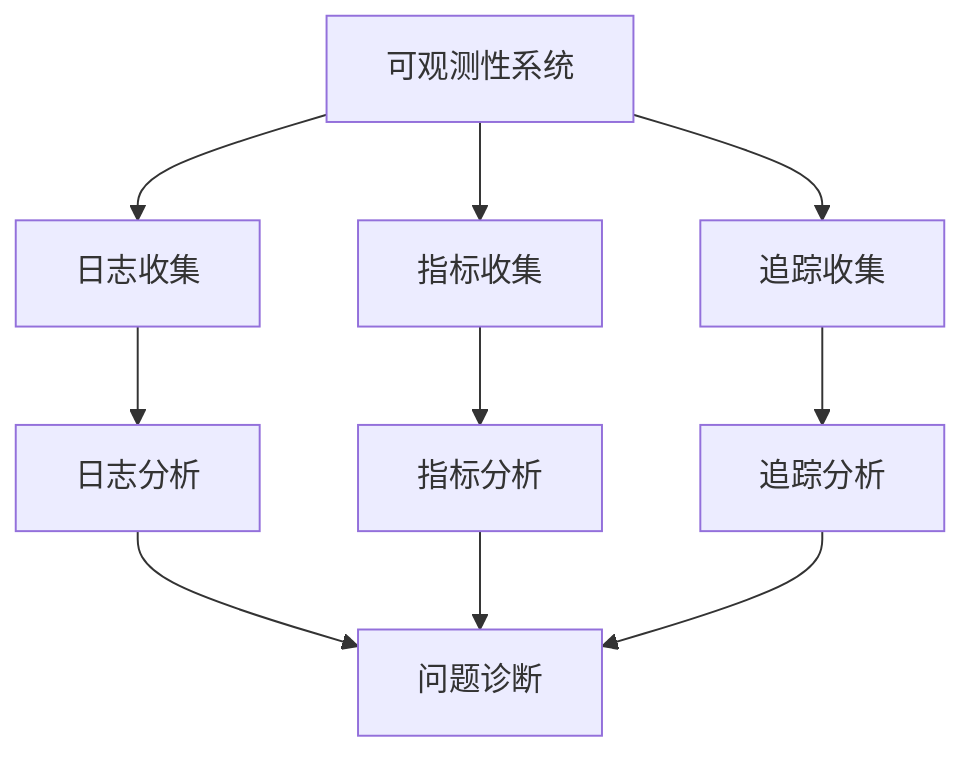
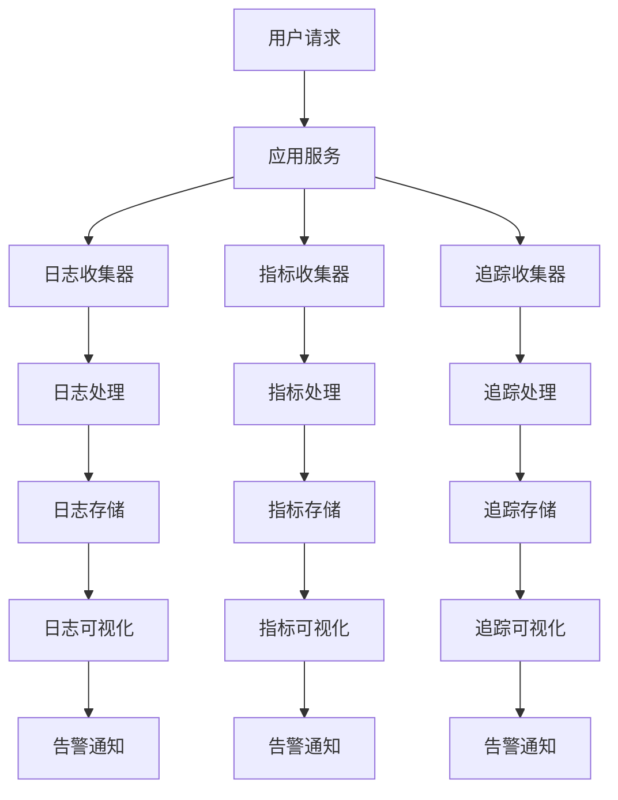

                 

# 可观测性工具链：日志、指标与追踪

## 关键词
- 可观测性
- 日志系统
- 指标系统
- 跟踪系统
- Prometheus
- Grafana
- OpenTelemetry

## 摘要
本文将深入探讨可观测性工具链的构建与集成，重点关注日志、指标和追踪系统在软件系统监控与故障排查中的应用。我们将从基础概念出发，逐步分析日志系统设计、指标系统设计和追踪系统设计，并结合实际案例，阐述如何有效集成和使用这些工具链，以实现高效的可观测性实践。通过本文，读者将掌握构建可观测性工具链的核心原理和实战技巧。

## 目录

### 第一部分：可观测性基础

- [第1章：可观测性概述](#第1章-可观测性概述)
  - [1.1 可观测性的重要性](#11-可观测性的重要性)
  - [1.2 可观测性的核心概念](#12-可观测性的核心概念)
- [第2章：日志系统设计](#第2章-日志系统设计)
  - [2.1 日志系统的基本原理](#21-日志系统的基本原理)
  - [2.2 日志分析工具](#22-日志分析工具)
  - [2.3 日志系统案例分析](#23-日志系统案例分析)
  - [2.4 日志系统的最佳实践](#24-日志系统的最佳实践)
- [第3章：指标系统设计](#第3章-指标系统设计)
  - [3.1 指标系统的基本原理](#31-指标系统的基本原理)
  - [3.2 指标系统工具](#32-指标系统工具)
  - [3.3 指标系统案例分析](#33-指标系统案例分析)
  - [3.4 指标系统最佳实践](#34-指标系统最佳实践)

### 第二部分：追踪与诊断

- [第4章：追踪系统设计](#第4章-追踪系统设计)
  - [4.1 追踪系统的基本原理](#41-追踪系统的基本原理)
  - [4.2 OpenTelemetry开源追踪系统](#42-opentelemetry开源追踪系统)
  - [4.3 分布式追踪案例分析](#43-分布式追踪案例分析)
  - [4.4 分布式追踪系统的最佳实践](#44-分布式追踪系统的最佳实践)
- [第5章：故障诊断与排查](#第5章-故障诊断与排查)
  - [5.1 故障诊断的基本流程](#51-故障诊断的基本流程)
  - [5.2 常见故障案例分析](#52-常见故障案例分析)
  - [5.3 故障排除与预防](#53-故障排除与预防)

### 第三部分：综合实践

- [第6章：可观测性工具链集成](#第6章-可观测性工具链集成)
  - [6.1 可观测性工具链的整体架构](#61-可观测性工具链的整体架构)
  - [6.2 工具链在容器环境中的应用](#62-工具链在容器环境中的应用)
  - [6.3 工具链在云环境中的应用](#63-工具链在云环境中的应用)
- [第7章：可观测性工具链案例分析](#第7章-可观测性工具链案例分析)
  - [7.1 案例一：电子商务平台的可观测性实践](#71-案例一电子商务平台的可观测性实践)
  - [7.2 案例二：金融系统的可观测性部署](#72-案例二金融系统的可观测性部署)
  - [7.3 案例三：游戏行业的可观测性实践](#73-案例三游戏行业的可观测性实践)
- [第8章：可观测性工具链的未来发展](#第8章-可观测性工具链的未来发展)
  - [8.1 可观测性工具链的趋势分析](#81-可观测性工具链的趋势分析)
  - [8.2 可观测性工具链的持续优化](#82-可观测性工具链的持续优化)
- [第9章：可观测性工具链的实战指南](#第9章-可观测性工具链的实战指南)
  - [9.1 实战指南一：搭建自己的可观测性工具链](#91-实战指南一搭建自己的可观测性工具链)
  - [9.2 实战指南二：使用指标系统优化业务](#92-实战指南二使用指标系统优化业务)
  - [9.3 实战指南三：实现分布式追踪](#93-实战指南三实现分布式追踪)

### 附录
- [附录A：常用可观测性工具汇总](#附录a-常用可观测性工具汇总)
- [附录B：可观测性工具配置示例](#附录b-可观测性工具配置示例)
- [附录C：可观测性学习资源推荐](#附录c-可观测性学习资源推荐)

---

### 第1章：可观测性概述

在当今高度分布式和动态变化的软件环境中，可观测性（Observability）成为软件开发和运维中不可或缺的一部分。它不仅帮助我们理解系统内部的状态和运行情况，还能在出现问题时快速定位和解决问题。本章节将介绍可观测性的基础概念，探讨其在DevOps中的应用，以及可观测性工具的演进历程。

#### 1.1 可观测性的重要性

可观测性是确保软件系统能够持续运行和快速响应问题的能力。与传统的监控（Monitoring）不同，监控通常只是被动地检测和报告系统状态，而可观测性则提供了一个更全面和主动的方法，使我们能够深入理解系统的行为和性能。

##### 1.1.1 可观测性在DevOps中的角色

在DevOps实践中，可观测性扮演着关键角色。它不仅支持持续集成和持续部署（CI/CD），还帮助开发团队和运维团队更紧密地协作。通过可观测性，开发人员可以更快地识别和修复代码中的问题，而运维人员可以更有效地管理和优化基础设施。

##### 1.1.2 可观测性与监控的区别与联系

监控和可观测性虽然密切相关，但它们的侧重点不同。监控通常关注系统资源使用、错误日志和告警机制，而可观测性则更注重系统内部状态的追踪和理解。换句话说，监控告诉我们“发生了什么”，而可观测性则帮助我们理解“为什么会发生”。

##### 1.1.3 可观测性工具的演进

随着云计算、容器化和微服务架构的普及，可观测性工具也在不断演进。早期的监控工具如Nagios和Zabbix，虽然提供了基本的监控功能，但在复杂分布式系统中显得力不从心。随着时间推移，新的工具如Prometheus、Grafana和OpenTelemetry等逐渐成为主流，它们提供了更强大和灵活的监控和追踪能力。

#### 1.2 可观测性的核心概念

可观测性依赖于几个核心概念，包括指标（Metrics）、日志（Logs）、追踪（Tracing）和监控（Monitoring）。以下是对这些核心概念的定义和它们之间的关系的介绍。

##### 1.2.1 指标（Metrics）

指标是用于量化系统性能和状态的数据点。例如，系统响应时间、CPU使用率、内存使用量等。通过收集和展示这些指标，我们可以快速了解系统当前的运行状态。

##### 1.2.2 日志（Logs）

日志是系统运行过程中产生的文本记录，包括错误信息、调试信息、用户操作等。日志提供了对系统行为的详细记录，帮助我们理解系统是如何响应特定事件的。

##### 1.2.3 跟踪（Tracing）

追踪是用于记录系统内各组件之间通信的数据。它可以帮助我们追踪请求从发起到响应的整个过程，包括每个请求的延迟、调用次数等。在分布式系统中，追踪是理解系统行为和性能的关键。

##### 1.2.4 监控（Monitoring）

监控是一种综合性的方法，它结合了指标、日志和追踪来提供对系统运行状况的全面视图。通过监控，我们可以及时发现潜在问题，并采取措施进行优化。

##### 1.2.5 可观测性架构的Mermaid流程图



#### 总结

本章介绍了可观测性的基础概念和它在DevOps中的应用。通过理解可观测性的核心概念，如指标、日志、追踪和监控，我们可以更好地构建和维护高效的可观测性系统。在接下来的章节中，我们将深入探讨日志系统、指标系统和追踪系统的设计与应用。

---

### 第2章：日志系统设计

日志系统是可观测性工具链中至关重要的一部分，它为我们提供了系统运行过程中的详细记录。一个良好的日志系统不仅能够帮助我们理解系统行为，还能在出现问题时提供关键的诊断信息。本章将详细讨论日志系统的基本原理、日志分析工具，并结合实际案例，阐述如何设计和实现高效的日志系统。

#### 2.1 日志系统的基本原理

##### 2.1.1 日志文件的格式

日志文件的格式是日志系统设计的核心。常见的日志文件格式包括简单的文本格式、JSON格式和结构化日志格式如Logstash格式。每种格式都有其优缺点，选择合适的格式取决于具体的业务需求和系统架构。

- **文本格式**：最简单的日志格式，通常包含时间戳、日志级别和消息。
- **JSON格式**：提供了一种结构化的方式来存储日志信息，便于后续分析和处理。
- **Logstash格式**：基于JSON格式，但包含了更多的元数据，如日志源、事件类型等。

##### 2.1.2 日志的收集与存储

日志的收集与存储是日志系统的关键环节。一个高效的日志系统需要能够实时收集来自不同组件的日志，并将它们存储在一个集中的地方，以便后续分析和查询。

- **日志收集**：常用的日志收集工具包括Logstash、Fluentd和Filebeat等。这些工具可以将日志从不同的源收集起来，并传输到一个中央日志存储。
- **日志存储**：日志存储的选择取决于数据量和查询需求。常见的选择包括Elasticsearch、MongoDB和Kafka等。Elasticsearch因其强大的全文检索能力而成为日志存储的常用工具。

##### 2.1.3 日志的查询与检索

高效的日志查询和检索能力是日志系统的重要特性。一个良好的日志系统应提供快速、灵活的查询接口，以便快速定位和处理日志。

- **查询接口**：Elasticsearch提供了强大的RESTful API，可以用于复杂查询和数据分析。
- **检索性能**：为了提高检索性能，可以通过分片和索引优化来减少查询延迟。

#### 2.2 日志分析工具

##### 2.2.1 Logstash的使用

Logstash是一个开源的数据处理工具，用于收集、处理和传输日志数据。它可以通过各种输入插件从不同源收集日志，通过过滤器插件对日志进行预处理，并通过输出插件将处理后的日志发送到目的地。

- **输入插件**：Logstash支持多种输入插件，如文件输入、TCP输入等，可以灵活地收集各种格式的日志。
- **过滤器插件**：Logstash的过滤器插件可以用于格式转换、字段添加和删除等操作，提高日志的可用性和一致性。
- **输出插件**：Logstash可以将处理后的日志输出到多种目的地，如Elasticsearch、Kafka等。

##### 2.2.2 Elasticsearch与Kibana的集成

Elasticsearch是一个高性能、可扩展的搜索引擎，常用于存储和查询大型日志数据。Kibana是Elastic Stack中的一个可视化工具，用于分析和展示Elasticsearch中的数据。

- **数据索引**：Elasticsearch使用索引（Index）来组织日志数据，每个索引对应一个日志源。通过索引，我们可以快速访问和查询特定时间段和类型的日志。
- **数据可视化**：Kibana提供了丰富的可视化仪表板，可以实时展示日志数据的统计信息和趋势。通过Kibana，我们可以快速识别异常行为和性能瓶颈。

##### 2.2.3 Fluentd的使用

Fluentd是一个开源的数据收集器，类似于Logstash，但更为轻量级。它通过插件系统提供了广泛的输入输出支持，适用于各种日志收集场景。

- **插件系统**：Fluentd的核心特点是灵活的插件系统，可以轻松地扩展其功能。例如，通过HTTP插件，Fluentd可以接收来自Web应用程序的日志数据。
- **性能优化**：Fluentd提供了多种性能优化策略，如批量处理和压缩传输，以提高日志收集的效率和可靠性。

#### 2.3 日志系统案例分析

##### 2.3.1 如何分析日志来诊断问题

通过日志分析，我们可以快速定位系统中的问题。以下是一个简单的日志分析过程：

1. **问题定位**：首先，根据错误消息或性能瓶颈，确定需要分析的日志文件。
2. **日志检索**：使用日志分析工具，如Elasticsearch或Kibana，检索相关日志。
3. **日志过滤**：根据关键字或时间范围，过滤出关键日志条目。
4. **日志解析**：解析日志格式，提取关键信息，如请求ID、用户ID、响应时间等。
5. **日志关联**：将不同日志条目关联起来，分析其之间的因果关系。

##### 2.3.2 实际场景下的日志系统架构设计

在设计一个高效的日志系统时，需要考虑以下几个方面：

1. **日志收集**：选择合适的日志收集工具，如Logstash或Fluentd，根据业务需求配置输入插件和输出插件。
2. **日志存储**：选择合适的日志存储方案，如Elasticsearch或MongoDB，根据数据量和查询需求进行索引优化和分片配置。
3. **日志分析**：使用日志分析工具，如Kibana或Grafana，构建可视化仪表板，提供实时日志监控和数据分析。
4. **日志安全**：确保日志系统的安全，如访问控制、数据加密和备份策略。

##### 2.3.3 开源日志系统对比

以下是对几个主流开源日志系统的对比：

| 系统       | 特点                     | 优点               | 缺点                 |
| ---------- | ------------------------ | ------------------ | --------------------- |
| Logstash   | 数据处理和转发           | 功能强大，灵活度高 | 复杂性较高，部署困难 |
| Fluentd   | 轻量级，灵活的插件系统   | 易于部署，性能好   | 功能相对有限         |
| Filebeat   | 轻量级，日志收集         | 易于部署，简单易用 | 功能相对有限         |
| Elasticsearch | 搜索引擎和日志存储     | 强大，可扩展性好 | 需要大量资源，部署复杂 |
| Kibana     | 可视化和分析             | 界面友好，功能强大 | 需要Elasticsearch支持 |

##### 2.3.4 日志系统的最佳实践

1. **标准化日志格式**：采用统一的日志格式，便于后续分析和处理。
2. **日志分级**：根据日志的重要性和紧急程度，设置不同的日志级别，便于快速定位和处理关键日志。
3. **日志存储策略**：根据业务需求和数据量，制定合理的日志存储策略，如定期备份、数据压缩和索引管理。
4. **日志监控**：建立日志监控系统，实时监控日志系统的运行状况，及时发现和处理异常。
5. **日志分析**：定期对日志进行分析，总结问题趋势和性能瓶颈，优化系统架构和日志处理流程。

#### 总结

本章详细介绍了日志系统的设计原理、日志分析工具，以及实际案例和最佳实践。通过了解日志系统的核心概念和架构设计，我们可以构建一个高效、可靠的日志系统，为软件系统的监控和故障排查提供坚实的基础。在接下来的章节中，我们将继续探讨指标系统和追踪系统的设计和应用。

---

### 第3章：指标系统设计

指标系统是可观测性工具链的重要组成部分，它通过量化数据来提供对系统性能和健康状况的实时监控。有效的指标系统可以帮助我们快速识别潜在问题，优化系统性能，并确保服务的持续稳定运行。本章将详细介绍指标系统的基本原理、常用工具及其在实际中的应用。

#### 3.1 指标系统的基本原理

##### 3.1.1 指标类型与定义

指标是衡量系统性能和状态的数据点，通常分为以下几类：

- **性能指标**：如响应时间、吞吐量、延迟等，用于衡量系统的运行效率和响应能力。
- **资源指标**：如CPU使用率、内存使用量、磁盘IO等，用于监控系统资源的利用情况。
- **错误率指标**：如错误率、异常率、失败率等，用于衡量系统的可靠性和稳定性。

##### 3.1.2 指标收集与聚合

指标收集是将系统的运行数据定期捕获并存储到合适的地方。常见的收集方法包括：

- **主动收集**：通过定时任务或API调用来收集系统指标。
- **被动收集**：通过系统自带的监控工具，如Prometheus等，自动捕获和收集指标。

指标聚合是将分散的指标数据汇总到一个中心存储，以便进行统一的监控和分析。常见的聚合方法包括：

- **时间序列聚合**：将同一时间段内的指标数据进行合并，生成更细粒度的统计数据。
- **指标归一化**：将不同单位的指标数据进行转换，使其在同一维度上可比较。

##### 3.1.3 指标可视化

指标可视化是将指标数据以图形化的方式展示，便于用户直观地理解系统状态和趋势。常用的可视化工具包括Grafana、Kibana等。这些工具提供了丰富的图表类型，如折线图、柱状图、饼图等，可以灵活地展示指标数据。

#### 3.2 指标系统工具

##### 3.2.1 Prometheus的使用

Prometheus是一个开源的监控解决方案，适用于各种规模和类型的系统。它具有以下特点：

- **服务器端+客户端架构**：Prometheus服务器负责存储和查询指标数据，客户端负责定期收集和推送指标。
- **拉模式数据采集**：Prometheus通过拉取目标服务的指标数据，避免了主动推送带来的网络负载。
- **多维数据模型**：Prometheus支持基于时间序列的多维数据模型，便于复杂的监控需求。

**Prometheus核心组件**：

- **Exporter**：用于收集和暴露指标数据的HTTP服务器，通常部署在目标服务上。
- **Prometheus Server**：负责存储、查询和报警，是指标系统的核心。
- **PushGateway**：用于处理大量短时指标数据的临时存储。

**Prometheus配置**：

- **配置文件**：Prometheus的配置文件定义了目标服务、数据采集规则和报警规则。
- **模板化配置**：Prometheus支持模板化配置，可以方便地管理大量目标和服务。

##### 3.2.2 Grafana作为指标可视化工具

Grafana是一个开源的可视化分析工具，常与Prometheus一起使用，提供强大的指标可视化功能。

- **数据源集成**：Grafana支持多种数据源，包括Prometheus、InfluxDB等，可以灵活地接入各种监控系统。
- **仪表板管理**：Grafana提供了丰富的仪表板组件，如图表、表单、热图等，可以自定义监控界面。
- **告警管理**：Grafana支持与Prometheus等工具集成，提供告警通知和事件管理。

**Grafana功能特点**：

- **可视化仪表板**：通过拖放操作，快速构建监控仪表板。
- **告警规则**：自定义告警规则，设置告警条件和通知方式。
- **数据探针**：通过数据探针，自动检测系统性能和健康状态。

##### 3.2.3 InfluxDB的使用

InfluxDB是一个开源的时间序列数据库，适用于存储和查询大量指标数据。

- **高性能写入**：InfluxDB支持高并发写入，适用于实时监控场景。
- **时间序列存储**：InfluxDB将指标数据以时间序列的形式存储，便于高效查询和聚合。
- **数据保留策略**：InfluxDB支持数据保留策略，自动删除过期数据，节省存储空间。

**InfluxDB主要组件**：

- **InfluxDB Server**：负责存储、查询和数据保留。
- **InfluxDB Client**：用于与InfluxDB服务器进行通信，发送和接收数据。
- **InfluxDB API**：提供HTTP API，用于管理数据和配置。

**InfluxDB配置**：

- **数据点格式**：InfluxDB的数据点格式为`<measurement>,<tags>=<field>:<value>`，支持多种字段类型。
- **数据写入**：通过InfluxDB Client或HTTP API，将指标数据写入数据库。
- **数据查询**：使用InfluxDB的SQL-like查询语言，从数据库中检索指标数据。

#### 3.3 指标系统案例分析

##### 3.3.1 如何构建高效的指标系统

构建一个高效的指标系统需要考虑以下几个方面：

1. **明确监控目标**：根据业务需求和系统特点，确定需要监控的关键指标和性能指标。
2. **指标数据收集**：选择合适的指标收集工具，确保数据的准确性和实时性。
3. **数据存储和查询**：选择合适的数据存储方案，确保数据的高效存储和快速查询。
4. **指标可视化**：构建直观的监控仪表板，展示关键指标和异常情况。
5. **告警管理**：设置合理的告警规则，及时发现和响应系统问题。

##### 3.3.2 指标系统在容器环境中的应用

在容器环境中，指标系统需要与容器编排工具（如Kubernetes）集成，以便于管理和监控容器化的应用。

- **Prometheus与Kubernetes集成**：通过Prometheus的Kubernetes exporter，可以自动发现和监控Kubernetes集群中的容器服务。
- **Kubernetes自定义指标**：通过自定义指标，监控容器资源使用情况、网络流量和日志等。
- **Prometheus告警与Kubernetes集成**：将Prometheus告警与Kubernetes的自动伸缩和调度策略集成，实现自动化故障恢复。

##### 3.3.3 实际业务场景下的指标系统架构设计

以下是一个实际业务场景下的指标系统架构设计示例：

1. **指标数据采集**：使用Prometheus client在每个容器中收集性能指标和资源使用情况。
2. **数据存储**：使用InfluxDB存储和查询指标数据，配置自动数据保留策略。
3. **指标可视化**：使用Grafana构建监控仪表板，展示关键指标和异常情况。
4. **告警管理**：设置Prometheus告警规则，通过邮件、短信等方式通知相关人员。
5. **自动化恢复**：将Prometheus告警与Kubernetes的自动伸缩和调度策略集成，实现自动化故障恢复。

##### 3.3.4 指标系统最佳实践

1. **标准化指标命名**：使用统一的命名规范，便于数据管理和查询。
2. **动态指标调整**：根据业务需求和环境变化，动态调整指标收集和报警策略。
3. **监控数据备份**：定期备份监控数据，防止数据丢失和损坏。
4. **性能优化**：优化指标数据存储和查询性能，减少延迟和资源消耗。
5. **用户培训**：定期对相关人员进行培训，提高对监控数据的理解和分析能力。

#### 总结

本章详细介绍了指标系统的基本原理、常用工具及其在实际中的应用。通过构建高效的指标系统，我们可以实时监控系统性能和健康状况，快速识别和响应问题。在接下来的章节中，我们将继续探讨追踪系统和故障诊断的相关内容。

---

### 第4章：追踪系统设计

在分布式系统中，追踪请求的完整路径和延迟成为理解系统行为和性能的关键。追踪系统（Tracing System）通过记录请求在系统中各个组件之间的传输过程，提供了对系统内部通信的详细视图。本章将探讨追踪系统的基本原理，重点介绍OpenTelemetry开源追踪系统，并分析追踪系统在实际应用中的案例。

#### 4.1 追踪系统的基本原理

##### 4.1.1 分布式追踪的概念

分布式追踪是指在分布式系统中，对请求从发起到响应的全过程进行跟踪和记录。它帮助开发者理解系统内部各个组件之间的交互，以及每个组件的处理时间和延迟。

- **请求链路**：分布式追踪记录了请求在系统中流转的完整路径，包括所有中间节点和服务的调用。
- **追踪数据**：追踪数据通常包含请求ID、服务名称、操作名称、开始和结束时间、延迟等。

##### 4.1.2 分布式追踪的模型

分布式追踪系统通常采用以下模型：

- **端到端追踪**：从客户端发起请求到最终返回结果的全过程。
- **服务网格追踪**：通过服务网格（如Istio、Linkerd）对服务间的通信进行追踪。
- **边车（Sidecar）模型**：在每个服务实例旁边部署一个追踪代理（边车），负责收集和发送追踪数据。

##### 4.1.3 分布式追踪的组件

分布式追踪系统通常包含以下几个关键组件：

- **追踪客户端**：在应用程序中嵌入，负责生成和发送追踪数据。
- **追踪代理**：负责收集和传输追踪数据到追踪服务器。
- **追踪服务器**：存储和查询追踪数据，提供可视化和分析工具。

#### 4.2 OpenTelemetry开源追踪系统

OpenTelemetry是一个开源的分布式追踪系统，提供了一致的API和SDK，支持多种追踪数据格式和传输协议。以下是OpenTelemetry的核心组件和使用方法：

##### 4.2.1 OpenTelemetry概述

OpenTelemetry的核心目标是提供统一的接口，使开发者能够轻松实现分布式追踪。其主要特点包括：

- **兼容性**：支持多种追踪数据和传输格式，如OpenCensus、Zipkin、Jaeger等。
- **语言支持**：提供多种编程语言的SDK，包括Java、Python、Go、C#等。
- **自定义**：允许开发者根据需求定制追踪规则和数据处理。

##### 4.2.2 OpenTelemetry的使用

使用OpenTelemetry，开发者可以按照以下步骤进行分布式追踪：

1. **引入依赖**：在项目中引入OpenTelemetry SDK依赖。
2. **初始化追踪器**：创建一个OpenTelemetry追踪器，用于生成和跟踪请求。
3. **生成追踪数据**：在请求处理过程中，使用追踪器生成追踪事件和数据。
4. **发送追踪数据**：将追踪数据发送到追踪服务器，通常通过HTTP传输协议。
5. **数据处理和分析**：在追踪服务器上处理和分析追踪数据，提供可视化报表和告警。

**示例代码（Python）**：

```python
from opentelemetry import trace
from opentelemetry.trace import Status, exporter

# 初始化追踪器
tracer = trace.Tracer()

# 生成追踪数据
with tracer.start_as_current_span("http_request"):
    # 模拟请求处理
    print("Processing request...")
    # 更新追踪状态
    current_span.set_status(Status.OK)
    # 完成请求处理
    print("Request processed.")

# 发送追踪数据
tracer exporter = exporter.HTTPExport(exporter_endpoint="http://127.0.0.1:4317/api/traces")
tracer export(Traces)
```

##### 4.2.3 OpenTelemetry与Prometheus的集成

OpenTelemetry与Prometheus的集成可以帮助我们结合追踪数据和指标数据进行全面的系统监控。以下是一个简单的集成步骤：

1. **配置Prometheus**：在Prometheus配置文件中添加OpenTelemetry exporter，配置追踪数据接收端点。
2. **采集追踪数据**：通过OpenTelemetry SDK将追踪数据发送到Prometheus。
3. **创建仪表板**：在Grafana或Kibana中创建仪表板，结合Prometheus数据和OpenTelemetry追踪数据，进行可视化展示。

#### 4.3 分布式追踪案例分析

##### 4.3.1 追踪系统在微服务架构中的应用

在微服务架构中，分布式追踪尤为重要。通过追踪系统，我们可以直观地了解请求在各个微服务之间的传输路径，快速定位和处理性能瓶颈和错误。

- **服务发现和路由**：使用服务网格或API网关，确保请求能够正确路由到目标微服务。
- **请求跟踪**：在每个微服务中嵌入OpenTelemetry SDK，记录请求的跟踪信息。
- **数据聚合和可视化**：将追踪数据发送到追踪服务器，使用Grafana或Kibana进行数据聚合和可视化展示。

##### 4.3.2 实际业务场景下的分布式追踪架构设计

以下是一个实际业务场景下的分布式追踪架构设计示例：

1. **服务端追踪**：在每个微服务实例中嵌入OpenTelemetry SDK，生成和发送追踪数据。
2. **边车代理**：在Kubernetes集群中部署OpenTelemetry边车代理，负责收集和发送微服务追踪数据。
3. **追踪服务器**：使用Jaeger或Zipkin作为追踪服务器，存储和查询追踪数据。
4. **监控仪表板**：在Grafana中创建监控仪表板，结合Prometheus和OpenTelemetry数据，提供全面的系统监控。

##### 4.3.3 分布式追踪系统的最佳实践

1. **统一追踪协议**：使用统一的追踪协议（如OpenCensus、Zipkin等），确保追踪数据的兼容性和可扩展性。
2. **数据压缩和传输优化**：对追踪数据进行压缩和优化传输，减少网络带宽消耗和延迟。
3. **实时追踪和告警**：实现实时追踪和告警，快速识别和响应系统问题。
4. **安全性和隐私保护**：确保追踪数据的安全性和隐私保护，防止数据泄露和滥用。
5. **监控与日志结合**：将追踪系统和日志系统结合，提供更全面的系统监控和分析。

#### 总结

本章介绍了追踪系统的基本原理、OpenTelemetry开源追踪系统的使用方法，并结合实际案例，探讨了分布式追踪系统的设计和应用。通过构建高效的追踪系统，我们可以深入了解分布式系统的运行状态，快速定位和处理性能瓶颈和错误。在下一章中，我们将进一步探讨故障诊断与排查的方法和策略。

---

### 第5章：故障诊断与排查

在复杂的软件系统中，故障是不可避免的现象。及时准确地诊断和排查故障，对于保证系统的稳定运行至关重要。本章将详细讨论故障诊断与排查的基本流程、常见故障案例分析，以及故障排除与预防的策略。

#### 5.1 故障诊断的基本流程

故障诊断是一个系统性的过程，通常包括以下几个步骤：

1. **问题定位**：首先，需要明确故障发生的具体位置，如某个服务器、网络链路或应用程序。
2. **数据收集**：收集与故障相关的数据，包括日志、性能指标、网络流量等。
3. **问题分析**：对收集到的数据进行详细分析，找出故障的根源。
4. **解决方案**：根据分析结果，制定和实施解决方案，修复故障。
5. **测试验证**：在实施解决方案后，对系统进行测试，确保故障已被解决。

#### 5.2 常见故障案例分析

以下是几个常见故障案例分析，以及相应的诊断和排查步骤：

##### 5.2.1 网络故障诊断

**故障现象**：系统出现连接失败、数据传输缓慢或网络中断等问题。

**诊断步骤**：

1. **检查网络设备状态**：查看路由器、交换机等网络设备的运行状态，确认是否有故障或配置错误。
2. **检查网络链路**：使用网络诊断工具（如ping、traceroute）检查网络链路的连通性和延迟。
3. **检查防火墙和ACL**：确认防火墙规则和访问控制列表（ACL）是否正确，是否阻止了数据传输。
4. **排查网络配置问题**：检查网络配置文件，确保IP地址、子网掩码、网关等配置正确。

##### 5.2.2 数据库故障排查

**故障现象**：数据库响应缓慢、数据丢失、错误提示等问题。

**诊断步骤**：

1. **检查数据库日志**：查看数据库的错误日志和警告日志，寻找故障线索。
2. **检查数据库性能**：使用数据库性能分析工具（如SQL Profiler、explain plan）分析数据库查询性能。
3. **检查数据库配置**：检查数据库配置文件，确认内存、线程等资源设置是否合理。
4. **备份和恢复**：在出现数据丢失时，使用备份文件进行数据恢复。

##### 5.2.3 应用程序崩溃分析

**故障现象**：应用程序无法启动或频繁崩溃。

**诊断步骤**：

1. **检查应用程序日志**：查看应用程序的错误日志，确定崩溃的原因。
2. **分析堆栈跟踪**：使用堆栈跟踪工具（如GDB、Visual Studio Debugger）分析崩溃时的堆栈信息。
3. **检查系统资源**：确认系统资源（如内存、CPU、磁盘空间）是否充足，是否存在资源泄漏。
4. **调试和修复**：根据分析结果，调试和修复应用程序代码，解决崩溃问题。

#### 5.3 故障排除与预防

##### 5.3.1 故障排除的策略

有效的故障排除策略可以加快故障解决的速度，以下是一些常用的故障排除策略：

- **二分法**：将问题范围逐步缩小，通过排除法找到故障点。
- **逐步验证**：在修复一个故障后，逐步验证其他部分是否恢复正常。
- **隔离测试**：在隔离环境中测试修复方案，确保问题已被解决。

##### 5.3.2 故障预防的措施

为了减少故障的发生，可以采取以下预防措施：

- **系统监控**：定期监控系统性能和状态，及时发现潜在问题。
- **代码审查**：对代码进行严格的审查和测试，确保代码质量和可靠性。
- **数据备份**：定期备份关键数据，防止数据丢失和损坏。
- **故障演练**：定期进行故障演练，提高故障响应和恢复能力。

##### 5.3.3 故障管理流程的优化

为了优化故障管理流程，可以采取以下措施：

- **自动化工具**：使用自动化工具（如自动化监控、自动备份、自动化恢复）减少人工操作，提高效率。
- **知识库**：建立故障知识库，记录故障原因和解决方法，便于快速查找和复用。
- **培训和教育**：定期对团队成员进行培训和教育，提高故障排查和解决能力。

#### 总结

本章介绍了故障诊断与排查的基本流程、常见故障案例分析，以及故障排除与预防的策略。通过掌握这些方法和技巧，可以更快速有效地解决系统故障，确保系统的稳定运行。在下一章中，我们将探讨如何集成和综合运用可观测性工具链，以实现更高效的可观测性实践。

---

### 第6章：可观测性工具链集成

在现代软件架构中，构建一个高效的、可扩展的可观测性工具链至关重要。可观测性工具链集成了日志系统、指标系统和追踪系统，为开发者和运维人员提供了全面的系统监控和故障排查能力。本章将详细讨论可观测性工具链的整体架构，以及在容器环境和云环境中的应用，并结合实际案例，展示工具链的集成方法和最佳实践。

#### 6.1 可观测性工具链的整体架构

一个完整且高效的工具链架构应包括以下核心组件：

- **数据收集器**：负责从不同的系统和服务中收集日志、指标和追踪数据。
- **数据存储**：用于存储和持久化收集到的数据，常见的选择包括Elasticsearch、InfluxDB、Kafka等。
- **数据处理**：对收集到的数据进行处理、清洗和聚合，使其更易于分析和可视化。
- **数据可视化**：提供图形化界面，将数据以图表、仪表板等形式展示，便于用户理解和分析。
- **告警和通知**：当系统状态异常或性能指标超出预期时，自动发送告警通知。

以下是一个典型的可观测性工具链架构图：



#### 6.2 工具链在容器环境中的应用

在容器环境中，如Kubernetes，集成可观测性工具链面临独特的挑战和机遇。以下是一些关键的应用场景和最佳实践：

##### 6.2.1 Kubernetes与可观测性工具的集成

Kubernetes提供了丰富的API和插件机制，便于与可观测性工具集成。以下是一些常见的集成方法：

- **Prometheus与Kubernetes**：使用Prometheus的Kubernetes插件，自动发现和监控Kubernetes集群中的Pod、Node和服务。
- **Grafana与Kubernetes**：通过Grafana的Kubernetes插件，直接从Kubernetes API获取监控数据，创建可视化仪表板。
- **OpenTelemetry与Kubernetes**：使用OpenTelemetry的Kubernetes集成，在容器中自动配置和部署追踪代理。

##### 6.2.2 容器监控与故障排查实战

在容器环境中，监控和故障排查的核心任务是确保服务的持续运行和快速响应。以下是一个实战案例：

1. **日志收集**：使用Fluentd或Logstash，将容器日志输出到Elasticsearch。
2. **指标收集**：部署Prometheus Server，配置Prometheus Client，定期收集容器性能指标。
3. **追踪收集**：在容器中部署OpenTelemetry SDK，记录请求的追踪信息。
4. **数据处理**：使用Kibana处理和分析日志，使用Grafana可视化指标和追踪数据。
5. **告警通知**：配置Prometheus告警规则，通过邮件、短信等渠道发送告警通知。

##### 6.2.3 容器环境的最佳实践

- **容器内日志配置**：确保容器日志格式统一，便于后续处理和分析。
- **日志存储优化**：根据业务需求和数据量，选择合适的日志存储方案，如Elasticsearch集群。
- **指标采集策略**：根据容器资源的实际使用情况，合理配置指标采集频率和采集项。
- **追踪数据压缩**：对追踪数据进行压缩，减少存储和传输的带宽消耗。

#### 6.3 工具链在云环境中的应用

在云环境中，如AWS、Azure和Google Cloud，可观测性工具链的集成和优化同样至关重要。以下是一些关键应用场景和最佳实践：

##### 6.3.1 云服务监控与故障排查

云服务提供了丰富的监控工具和服务，可以与可观测性工具链集成，实现全面的监控和故障排查。以下是一个实战案例：

1. **日志收集**：使用AWS CloudWatch或Azure Monitor收集云服务的日志数据。
2. **指标收集**：使用Prometheus Server，从云服务的指标API获取性能数据。
3. **追踪收集**：使用OpenTelemetry SDK，在云服务实例中部署追踪代理。
4. **数据处理**：使用AWS Lambda或Azure Functions处理和分析日志和指标数据。
5. **数据可视化**：使用Grafana或Kibana创建云服务监控仪表板，实时展示监控数据。

##### 6.3.2 云原生应用的监控与追踪

云原生应用通常采用微服务架构，需要高效的可观测性工具链来确保其稳定运行。以下是一些最佳实践：

- **自动化监控**：使用云服务提供的自动化监控工具，如AWS CloudWatch Auto Scaling、Azure Monitor for container instances。
- **追踪链路**：使用分布式追踪工具，如OpenTelemetry或Jaeger，确保请求在微服务之间的链路追踪。
- **自定义监控指标**：根据业务需求，自定义监控指标，确保关键业务指标得到监控。
- **日志与指标整合**：将日志和指标数据进行整合，实现更全面的问题分析和诊断。

##### 6.3.3 云环境的最佳实践

- **日志与指标同步**：确保日志和指标数据同步，便于跨平台分析。
- **云服务优化**：根据云服务的特性和性能，优化可观测性工具链的配置和资源分配。
- **多区域监控**：在多个云区域部署监控工具，确保全局的监控覆盖。
- **安全性与隐私保护**：确保监控数据和配置的安全性，防止数据泄露和未经授权的访问。

#### 总结

本章详细介绍了可观测性工具链的整体架构，以及在容器环境和云环境中的应用。通过集成和优化日志系统、指标系统和追踪系统，我们可以实现高效的可观测性实践，确保软件系统的稳定运行和快速响应。在下一章中，我们将通过实际案例分析，进一步探讨可观测性工具链在各个行业中的应用和效果。

---

### 第7章：可观测性工具链案例分析

在了解了可观测性工具链的理论基础和架构设计后，通过实际案例来分析其应用和效果将更加具体和直观。本章将探讨三个不同行业的案例，分别是电子商务平台、金融系统和游戏行业，详细介绍它们的监控需求、工具链选型、配置和监控数据集成与可视化，以展示可观测性工具链在实际环境中的运用。

#### 7.1 案例一：电子商务平台的可观测性实践

电子商务平台通常需要处理大量的并发请求，对系统的可用性和性能有极高的要求。以下是一个电子商务平台的可观测性实践案例：

##### 7.1.1 平台架构与监控需求分析

**架构特点**：

- **分布式微服务架构**：业务逻辑分散在多个微服务中，每个服务负责不同的业务功能。
- **前端和后端分离**：前端应用与后端服务分离，通过API进行通信。
- **容器化部署**：使用Docker和Kubernetes进行容器化部署和管理。

**监控需求**：

- **高可用性**：确保服务持续在线，快速响应客户请求。
- **性能监控**：监控系统的响应时间、吞吐量和资源利用率。
- **错误率监控**：实时监控错误率和异常情况，确保及时修复。
- **日志分析**：分析用户行为日志，优化用户体验和营销策略。

##### 7.1.2 可观测性工具链的选型与配置

**工具链选型**：

- **日志系统**：使用ELK Stack（Elasticsearch、Logstash、Kibana），处理和展示日志数据。
- **指标系统**：使用Prometheus和Grafana，监控和可视化系统的性能指标。
- **追踪系统**：使用OpenTelemetry和Jaeger，追踪请求的完整路径和延迟。

**配置与集成**：

1. **日志系统**：部署Elasticsearch集群，配置Logstash从Kubernetes容器中收集日志，并通过Kibana进行可视化展示。
2. **指标系统**：在Kubernetes中部署Prometheus Server和Client，定期收集微服务的性能指标，使用Grafana创建监控仪表板。
3. **追踪系统**：在每个微服务中集成OpenTelemetry SDK，生成和发送追踪数据，使用Jaeger进行追踪数据的可视化。

##### 7.1.3 监控数据集成与可视化

通过集成和配置，电子商务平台实现了全面的监控和可视化：

- **日志监控**：在Kibana中创建日志搜索仪表板，实时查看和过滤日志，快速诊断问题。
- **指标监控**：在Grafana中创建多个监控仪表板，展示CPU使用率、内存使用量、响应时间和错误率等关键指标。
- **追踪监控**：在Jaeger中创建追踪仪表板，可视化请求的路径和延迟，分析系统性能瓶颈。

#### 7.2 案例二：金融系统的可观测性部署

金融系统对数据的安全性和稳定性要求极高，以下是一个金融系统的可观测性部署案例：

##### 7.2.1 金融系统的特点与监控需求

**系统特点**：

- **高安全性**：系统设计需考虑数据安全和合规性。
- **高可靠性**：确保交易的连续性和数据的准确性。
- **高并发性**：处理大量交易请求，确保系统响应迅速。

**监控需求**：

- **交易监控**：实时监控交易处理速度、交易成功率和异常交易。
- **系统性能监控**：监控数据库、应用服务器和中间件的服务状态。
- **日志分析**：记录和分析交易日志，确保交易过程可追溯。
- **合规性监控**：确保系统符合金融行业的合规要求。

##### 7.2.2 可观测性工具链的定制化开发

**工具链选型**：

- **日志系统**：开发自定义的日志收集和分析系统，确保日志数据的完整性和安全性。
- **指标系统**：使用Prometheus和Grafana，结合自定义指标，实现全面的系统监控。
- **追踪系统**：使用OpenTelemetry和Zipkin，确保请求的追踪和交易链路的可视化。

**配置与集成**：

1. **日志系统**：开发日志收集代理，部署在关键交易节点上，将日志传输到日志存储系统，实现日志的集中管理和分析。
2. **指标系统**：配置Prometheus Server，使用自定义Exporter收集交易处理时间和成功率等指标，使用Grafana创建监控仪表板。
3. **追踪系统**：在每个交易服务中集成OpenTelemetry SDK，生成和发送追踪数据，使用Zipkin进行追踪数据的可视化。

##### 7.2.3 监控策略与故障排查

金融系统的监控策略和故障排查注重以下几个方面：

- **实时监控**：确保实时监控交易处理状态，及时发现和处理异常。
- **日志分析**：定期分析日志，识别潜在问题，提前预防。
- **告警机制**：设置详细的告警规则，确保在异常情况下及时通知相关人员。
- **故障排查**：结合日志、指标和追踪数据，快速定位故障，进行修复。

#### 7.3 案例三：游戏行业的可观测性实践

游戏行业对用户体验和游戏流畅性要求极高，以下是一个游戏行业的可观测性实践案例：

##### 7.3.1 游戏行业的监控难点与挑战

**难点与挑战**：

- **高并发用户**：游戏服务器需处理大量并发用户请求，确保系统性能和稳定性。
- **网络波动**：网络不稳定可能导致游戏卡顿，影响用户体验。
- **游戏内行为**：实时监控游戏内行为，分析玩家行为模式，优化游戏体验。
- **多平台兼容**：游戏需适应不同平台，如PC、手机、平板等，实现跨平台监控。

##### 7.3.2 可观测性工具链在游戏开发中的应用

**工具链选型**：

- **日志系统**：使用Fluentd和Kafka，处理和存储游戏日志数据。
- **指标系统**：使用Prometheus和Grafana，监控游戏服务器的性能指标。
- **追踪系统**：使用OpenTelemetry和Jaeger，追踪游戏内玩家的行为路径。

**配置与集成**：

1. **日志系统**：部署Kafka集群，使用Fluentd从各个游戏服务器收集日志，并将日志数据写入Kafka。
2. **指标系统**：在游戏服务器中部署Prometheus Client，定期收集性能指标，使用Grafana创建实时监控仪表板。
3. **追踪系统**：在每个游戏服务中集成OpenTelemetry SDK，生成和发送追踪数据，使用Jaeger可视化玩家行为路径。

##### 7.3.3 用户行为分析与优化

游戏行业的监控重点在于用户行为分析和优化：

- **玩家行为分析**：通过日志和追踪数据，分析玩家的游戏行为，如游戏时长、参与度等。
- **性能优化**：根据监控数据，优化游戏服务器的性能，降低延迟，提高用户体验。
- **游戏内事件监控**：监控游戏内重要事件，如战斗、交易等，确保事件处理的高效性和正确性。
- **异常处理**：实时监控游戏内异常行为，如作弊、恶意攻击等，及时采取措施。

#### 总结

本章通过三个实际案例，详细展示了可观测性工具链在不同行业中的应用和实践。通过日志系统、指标系统和追踪系统的集成，电子商务平台、金融系统和游戏行业都实现了高效的系统监控和故障排查，提升了服务的稳定性和用户体验。在下一章中，我们将探讨可观测性工具链的未来发展趋势和持续优化方向。

---

### 第8章：可观测性工具链的未来发展

随着云计算、容器化和微服务架构的不断发展，可观测性工具链也面临着新的挑战和机遇。未来，可观测性工具链的发展将围绕智能化、自动化和性能优化等方面展开。本章将分析可观测性工具链的趋势，探讨AI在可观测性中的应用，以及如何优化工具链的性能和安全性。

#### 8.1 可观测性工具链的趋势分析

##### 8.1.1 AI在可观测性中的应用

人工智能（AI）正在逐渐渗透到可观测性工具链中，为系统监控和故障排查带来了新的可能性。以下是一些AI在可观测性中的应用：

- **异常检测**：利用机器学习算法，对监控数据进行实时分析，自动识别异常模式和趋势。
- **根因分析**：通过AI技术，分析大量的日志和指标数据，快速定位问题的根源。
- **智能告警**：基于历史数据和AI算法，智能生成告警规则，提高告警的准确性和效率。
- **自动化恢复**：利用AI技术，实现自动化故障恢复，减少人工干预和恢复时间。

##### 8.1.2 云原生可观测性的发展

随着云原生技术的普及，云原生可观测性（Cloud-Native Observability）成为了一个重要研究方向。云原生可观测性强调在云原生环境中，如Kubernetes和Serverless，实现高效和自动化的监控和故障排查。以下是一些发展趋势：

- **自动化集成**：将可观测性工具链与云原生平台深度集成，实现自动化的数据收集、处理和可视化。
- **多云支持**：支持跨多个云平台的监控和追踪，提供一致的可观测性体验。
- **可扩展性**：确保可观测性工具链能够适应大规模、高并发的云原生环境，提供可扩展的监控能力。
- **安全性**：在云原生环境中，确保监控数据的存储和传输的安全性，防止数据泄露和未经授权的访问。

##### 8.1.3 智能监控与自动化故障排查

未来，智能监控和自动化故障排查将成为可观测性工具链的重要发展方向。通过引入AI和机器学习技术，系统可以更智能地监控和预测潜在问题，实现自动化的故障排查和恢复。以下是一些关键点：

- **预测性监控**：利用历史数据和AI算法，预测系统性能的下降和潜在故障，提前采取措施。
- **自动化恢复**：通过自动化脚本和工具，实现故障的自动恢复，减少人工干预和恢复时间。
- **闭环监控**：将监控、告警、故障排查和恢复形成一个闭环，实现自动化的故障管理。
- **用户体验**：提供更加直观、易用的监控界面和工具，提高开发者和运维人员的工作效率。

#### 8.2 可观测性工具链的持续优化

为了确保可观测性工具链的高效和可靠，持续优化是必不可少的。以下是一些优化方向：

##### 8.2.1 性能优化与资源管理

- **数据压缩和传输优化**：对监控数据进行压缩，减少存储和传输的带宽消耗。
- **批量处理**：优化数据收集和处理流程，实现批量处理，提高效率。
- **分布式存储和计算**：采用分布式存储和计算技术，提高数据处理能力和性能。

##### 8.2.2 可观测性工具链的安全性与隐私保护

- **数据加密**：确保监控数据在传输和存储过程中的加密，防止数据泄露。
- **访问控制**：设置严格的访问控制策略，确保监控数据的安全性和隐私保护。
- **数据隔离**：在分布式环境中，实现监控数据的隔离，防止数据泄露和未经授权的访问。

##### 8.2.3 可观测性工具链的用户体验提升

- **界面优化**：提供直观、易用的监控界面，提高用户的使用体验。
- **自动化配置**：提供自动化配置工具，简化工具链的部署和管理。
- **文档和教程**：提供详细的文档和教程，帮助用户快速上手和优化工具链的使用。

#### 总结

本章分析了可观测性工具链的未来发展趋势，探讨了AI在可观测性中的应用，以及如何优化工具链的性能和安全性。通过智能化和自动化的手段，未来的可观测性工具链将更加高效、可靠和易用，为开发者和运维人员提供更强大的监控和故障排查能力。

---

### 第9章：可观测性工具链的实战指南

在了解了可观测性工具链的理论基础和实际案例后，本章将提供一系列实战指南，帮助读者在实际环境中搭建、优化和使用可观测性工具链。我们将分步骤介绍如何搭建日志系统、优化指标系统以及实现分布式追踪，旨在为读者提供从零开始构建可观测性工具链的全面指南。

#### 9.1 实战指南一：搭建自己的可观测性工具链

##### 9.1.1 开发环境准备

在开始搭建可观测性工具链之前，需要准备好开发环境。以下是在Linux环境下搭建可观测性工具链所需的基本步骤：

1. **安装Docker**：Docker是一个容器化平台，可以简化工具链的部署和管理。可以从[官方文档](https://docs.docker.com/install/)安装Docker。

    ```shell
    sudo apt-get update
    sudo apt-get install docker.io
    ```

2. **安装Kubernetes**：Kubernetes是一个用于容器编排的工具，可以帮助我们管理容器化的应用。可以选择使用Minikube进行本地开发。

    ```shell
    curl -LO "https://storage.googleapis.com/minikube/releases/1.21.0/minikube-linux-amd64"
    sudo chmod +x minikube-linux-amd64
    sudo mv minikube-linux-amd64 /usr/local/bin/minikube
    minikube start --vm-driver=virtualbox
    ```

3. **安装Kubectl**：Kubectl是Kubernetes的命令行工具，用于与Kubernetes集群进行交互。

    ```shell
    curl -LO "https://storage.googleapis.com/kubernetes-release/release/$(curl -s https://storage.googleapis.com/kubernetes-release/release/stable.txt)/bin/darwin/amd64/kubectl"
    sudo chmod +x kubectl
    sudo mv kubectl /usr/local/bin/
    ```

##### 9.1.2 工具链组件安装与配置

1. **部署Elasticsearch集群**：

    ```shell
    docker run -d --name elasticsearch -p 9200:9200 -p 9300:9300 elasticsearch:7.10.0
    ```

2. **部署Kibana**：

    ```shell
    docker run -d --name kibana --link elasticsearch:elasticsearch -p 5601:5601 kibana:7.10.0
    ```

3. **部署Logstash**：

    ```shell
    docker run -d --name logstash --link elasticsearch:elasticsearch -p 5044:5044 -p 5040:5040 logstash:7.10.0
    ```

4. **配置Logstash输入插件**：

    创建一个名为`logstash-input-file.conf`的配置文件，内容如下：

    ```conf
    input {
      file {
        path => "/var/log/*.log"
        type => "system_log"
        tags => ["filebeat"]
      }
    }
    ```

    将此配置文件放入Logstash容器的`/etc/logstash/conf.d`目录。

5. **部署Fluentd**：

    ```shell
    docker run -d --name fluentd -p 24224:24224 -v /var/log:/fluentd/log fluentd
    ```

6. **配置Fluentd输入插件**：

    创建一个名为`fluent.conf`的配置文件，内容如下：

    ```conf
    <source>
      @type http
      port 24224
      bind 0.0.0.0
      format json
    </source>
    ```

    将此配置文件放入Fluentd容器的`/fluentd/etc`目录。

##### 9.1.3 实践案例：日志系统搭建

假设我们有一个简单的Web应用，其日志保存在`/var/log/myapp.log`文件中。以下是如何使用Logstash和Fluentd收集和解析这些日志的步骤：

1. **配置Logstash**：

    修改`logstash-input-file.conf`文件，将路径指向`/var/log/myapp.log`：

    ```conf
    input {
      file {
        path => "/var/log/myapp.log"
        type => "myapp_log"
        tags => ["myapp"]
      }
    }
    ```

2. **配置Logstash过滤器**：

    创建一个名为`logstash-filter-grok.conf`的配置文件，内容如下：

    ```conf
    filter {
      if [type] == "myapp_log" {
        grok {
          match => { "message" => "%{TIMESTAMP_ISO8601:timestamp}\t%{DATA:level}\t%{DATA:source}\t%{DATA:message}" }
        }
      }
    }
    ```

    将此配置文件放入`/etc/logstash/conf.d`目录。

3. **配置Logstash输出插件**：

    创建一个名为`logstash-output-elasticsearch.conf`的配置文件，内容如下：

    ```conf
    output {
      elasticsearch {
        hosts => ["elasticsearch:9200"]
        index => "myapp-log-%{+YYYY.MM.dd}"
      }
    }
    ```

    将此配置文件放入`/etc/logstash/conf.d`目录。

4. **启动Logstash**：

    ```shell
    docker run -d --name logstash --link elasticsearch:elasticsearch -p 5044:5044 -p 5040:5040 -v /var/log/myapp.log:/var/log/myapp.log logstash:7.10.0 -f /etc/logstash/conf.d/logstash-filter-grok.conf -f /etc/logstash/conf.d/logstash-output-elasticsearch.conf
    ```

5. **配置Fluentd**：

    修改`fluent.conf`文件，添加一个新的输入源，指向Logstash的HTTP接收端点：

    ```conf
    <source>
      @type http
      port 24224
      bind 0.0.0.0
      format json
      path /myapp/log
    </source>
    ```

    将此配置文件放入Fluentd容器的`/fluentd/etc`目录。

6. **启动Fluentd**：

    ```shell
    docker run -d --name fluentd -p 24224:24224 fluentd
    ```

7. **在Web应用中集成Fluentd**：

    在Web应用的配置中，设置日志输出到Fluentd的HTTP接收端点：

    ```shell
    fluentd -o "output fluentd://myapp/log"
    ```

通过以上步骤，我们可以将Web应用的日志收集到Elasticsearch中，并通过Kibana进行实时监控和查询。

#### 9.2 实战指南二：使用指标系统优化业务

##### 9.2.1 指标系统设计原则

设计指标系统时，应遵循以下原则：

- **相关性**：指标应与业务目标和关键性能指标（KPI）紧密相关。
- **可度量**：确保指标易于度量，数据可靠。
- **实时性**：指标数据应实时获取，及时反映系统状态。
- **可扩展性**：设计应支持系统的扩展和变化，便于添加新的指标。

##### 9.2.2 指标收集与聚合策略

1. **定义指标**：根据业务需求，定义需要收集的指标，如响应时间、吞吐量、错误率等。

2. **数据源收集**：使用Prometheus的Exporter，从不同的服务中收集指标数据。例如，可以从Web服务器、数据库和应用服务中收集性能指标。

3. **数据聚合**：使用Prometheus的规则文件，对收集到的数据进行聚合，生成更高级别的监控指标。

    ```yaml
    groups:
    - name: service_performance
      rules:
      - record: request_rate
        expr: rate(http_requests_total[5m])
    ```

4. **数据存储**：将聚合后的数据存储在Prometheus服务器中，便于后续查询和可视化。

##### 9.2.3 实践案例：业务指标监控与分析

假设我们有一个电子商务平台，需要监控以下关键指标：

- **页面响应时间**：监控用户访问主页、商品详情页等页面的响应时间。
- **订单处理时间**：监控订单从提交到处理完成的时间。
- **系统吞吐量**：监控系统每分钟处理的订单数量。

**步骤**：

1. **部署Prometheus和Grafana**：

    使用Docker部署Prometheus和Grafana：

    ```shell
    docker run -d --name prometheus -p 9090:9090 -v /etc/prometheus/prometheus.yml:/etc/prometheus/prometheus.yml prom/prometheus
    docker run -d --name grafana -p 3000:3000 -v /etc/grafana/grafana.ini:/etc/grafana/grafana.ini -v /var/lib/grafana:/var/lib/grafana grafana/grafana
    ```

2. **配置Prometheus**：

    创建一个名为`prometheus.yml`的配置文件，内容如下：

    ```yaml
    global:
      scrape_interval: 15s
      evaluation_interval: 15s

    scrape_configs:
    - job_name: 'prometheus'
      static_configs:
      - targets: ['localhost:9090']
    - job_name: 'web_server'
      static_configs:
      - targets: ['web-server:9113']
    - job_name: 'order_service'
      static_configs:
      - targets: ['order-service:9114']
    ```

3. **部署Exporter**：

    部署Web服务器和订单服务的Exporter，定期收集性能指标：

    ```shell
    docker run -d --name web_server_exporter --link web_server:web_server prom/exporter
    docker run -d --name order_service_exporter --link order_service:order_service prom/exporter
    ```

4. **创建Grafana仪表板**：

    在Grafana中创建仪表板，将Prometheus作为数据源，添加以下面板：

    - **页面响应时间**：展示主页和商品详情页的响应时间趋势。
    - **订单处理时间**：展示订单处理时间的分布和趋势。
    - **系统吞吐量**：展示每分钟订单处理量的统计图。

通过以上步骤，我们可以实时监控电子商务平台的关键业务指标，及时发现性能瓶颈和潜在问题。

#### 9.3 实战指南三：实现分布式追踪

分布式追踪是实现可观测性不可或缺的一环，以下是如何使用OpenTelemetry实现分布式追踪的步骤：

##### 9.3.1 分布式追踪架构设计

1. **服务划分**：将分布式系统划分为多个微服务，每个服务负责不同的业务功能。
2. **追踪客户端集成**：在每个微服务中集成OpenTelemetry SDK，生成和发送追踪数据。
3. **追踪代理部署**：在Kubernetes集群中部署OpenTelemetry代理，收集和转发追踪数据。
4. **追踪服务器配置**：配置Jaeger或Zipkin作为追踪服务器，存储和查询追踪数据。

##### 9.3.2 OpenTelemetry的集成与使用

1. **集成OpenTelemetry SDK**：

    在每个微服务的代码中集成OpenTelemetry SDK，例如在Go服务中使用OpenTelemetry：

    ```go
    import (
        "context"
        "github.com/open-telemetry/opentelemetry-go"
        "github.com/open-telemetry/opentelemetry-go/trace"
    )

    func main() {
        opentelemetry.Init()
        ctx := opentelemetry.ContextWithTracer(context.Background(), "my-service")
        // 业务逻辑
        trace.NewSpan(ctx, "process_request").End()
    }
    ```

2. **生成和发送追踪数据**：

    在每个服务中，使用OpenTelemetry SDK生成追踪数据，并将其发送到OpenTelemetry代理：

    ```go
    span := trace.NewSpan(context.Background(), "process_request")
    span.SetAttributes("http.method", "GET")
    span.SetStatus(trace.StatusOk)
    span.End()
    ```

3. **部署OpenTelemetry代理**：

    在Kubernetes集群中部署OpenTelemetry代理，收集和转发追踪数据：

    ```yaml
    apiVersion: apps/v1
    kind: Deployment
    metadata:
      name: opentelemetry-proxy
    spec:
      replicas: 1
      selector:
        matchLabels:
          app: opentelemetry-proxy
      template:
        metadata:
          labels:
            app: opentelemetry-proxy
        spec:
          containers:
          - name: opentelemetry-proxy
            image: opentelemetry/opentelemetry-collector
            ports:
            - containerPort: 4317
    ```

4. **配置追踪服务器**：

    配置Jaeger或Zipkin作为追踪服务器，存储和查询追踪数据。以下是一个Jaeger的配置示例：

    ```yaml
    apiVersion: v1
    kind: Service
    metadata:
      name: jaeger
    spec:
      ports:
      - name: jaeger-http
        port: 14268
        targetPort: 14268
      - name: jaeger-collector
        port: 14250
        targetPort: 14250
      selector:
        app: jaeger
    ```

##### 9.3.3 实践案例：分布式系统故障排查

1. **故障现象**：系统出现响应缓慢，部分请求处理失败。

2. **故障排查步骤**：

    - **查看追踪数据**：在Jaeger中查看追踪数据，分析请求的处理路径和延迟。
    - **定位故障节点**：发现某些节点处理请求的时间过长，进一步分析这些节点的日志和性能指标。
    - **检查数据库连接**：确认数据库连接数是否过多，是否存在数据库性能瓶颈。
    - **调整系统配置**：根据分析结果，调整系统配置，如数据库连接池大小、服务线程数等。

通过以上步骤，可以快速定位故障，并进行修复。

#### 总结

本章提供了搭建日志系统、优化指标系统和实现分布式追踪的实战指南，帮助读者在实际环境中构建和优化可观测性工具链。通过具体的案例和实践步骤，读者可以更好地理解和应用可观测性工具链，提升系统的监控和故障排查能力。

---

### 附录A：常用可观测性工具汇总

在构建可观测性工具链时，选择合适的工具至关重要。以下是对一些常用可观测性工具的汇总，包括日志系统、指标系统和追踪系统工具，以帮助读者进行选择和比较。

#### 附录A.1：日志系统工具对比

| 工具                | 描述                                                     | 优点                   | 缺点                       |
| ------------------- | -------------------------------------------------------- | ---------------------- | -------------------------- |
| Logstash           | 谷歌的开源日志收集工具，用于处理和传输日志数据             | 功能强大，灵活的插件系统 | 部署和维护相对复杂           |
| Fluentd            | 轻量级的日志收集器，适用于容器环境                         | 轻量级，易于部署       | 功能相对有限               |
| Filebeat           | Elastic Stack 的一部分，轻量级的日志收集器，适用于容器环境 | 简单易用               | 功能相对有限               |
| Logz.io            | 基于Elastic Stack的日志管理平台，提供日志分析和服务         | 易于使用，功能全面     | 需要Elastic Stack支持       |
| Graylog             | 开源日志管理平台，提供日志收集、存储和可视化功能           | 开源，高度可定制       | 需要一定配置和管理知识       |

#### 附录A.2：指标系统工具对比

| 工具               | 描述                                                         | 优点                     | 缺点                           |
| ------------------ | ------------------------------------------------------------ | ------------------------ | ------------------------------ |
| Prometheus         | 开源监控解决方案，支持服务发现和自动发现                       | 强大的数据模型，易于集成 | 需要较多的配置和集成             |
| Grafana            | 开源可视化仪表盘，可以与多种数据源集成，提供丰富的图表和仪表板   | 界面友好，功能强大       | 需要Elasticsearch或InfluxDB支持 |
| InfluxDB           | 开源时间序列数据库，适用于存储和查询大量指标数据               | 高性能，可扩展性强     | 数据存储和查询优化需要专业知识   |
| OpenTSDB           | 开源时间序列数据库，用于存储和查询大规模时间序列数据           | 高性能，可扩展性强     | 需要专业的运维知识               |
| Datadog            | 商业监控解决方案，提供全面的监控功能                         | 易于使用，功能全面     | 需要付费支持                   |

#### 附录A.3：追踪系统工具对比

| 工具              | 描述                                                         | 优点                     | 缺点                           |
| ----------------- | ------------------------------------------------------------ | ------------------------ | ------------------------------ |
| OpenTelemetry     | 开源追踪框架，提供统一的API和SDK，支持多种追踪数据和传输格式   | 统一API，支持多种语言和平台 | 需要一定的配置和集成             |
| Jaeger            | 开源分布式追踪系统，提供追踪数据的收集、存储和可视化             | 功能全面，易于使用       | 需要专业的运维知识               |
| Zipkin            | 开源分布式追踪系统，提供追踪数据的收集、存储和可视化             | 功能全面，易于使用       | 需要专业的运维知识               |
| OpenCensus        | 被Google废弃，但仍然有部分用户，开源分布式追踪系统             | 功能全面，Google支持     | 已被废弃，更新和维护较少         |
| Traceview         | 商业追踪解决方案，提供分布式追踪和性能分析功能                 | 功能强大，支持多种平台   | 需要付费支持                   |

通过以上对比，读者可以根据自己的需求和资源选择合适的工具，构建高效的可观测性工具链。

---

### 附录B：可观测性工具配置示例

以下是一些常用的可观测性工具的配置示例，包括Elasticsearch与Kibana、Prometheus与Grafana、OpenTelemetry配置示例，以供读者参考。

#### 附录B.1：Elasticsearch与Kibana配置

**Elasticsearch配置**

Elasticsearch的配置文件位于`/etc/elasticsearch/elasticsearch.yml`，以下是一个简单的配置示例：

```yaml
cluster.name: my-application
node.name: node-1
network.host: 0.0.0.0
http.port: 9200
discovery.type: single-node
```

**Kibana配置**

Kibana的配置文件位于`/etc/kibana/kibana.yml`，以下是一个简单的配置示例：

```yaml
server.host: "0.0.0.0"
elasticsearch.hosts: ["http://localhost:9200"]
kibana.instance.id: "kibana"
```

#### 附录B.2：Prometheus与Grafana配置

**Prometheus配置**

Prometheus的配置文件位于`/etc/prometheus/prometheus.yml`，以下是一个简单的配置示例：

```yaml
global:
  scrape_interval: 15s
  evaluation_interval: 15s
scrape_configs:
- job_name: 'prometheus'
  static_configs:
  - targets: ['localhost:9090']
- job_name: 'web_server'
  static_configs:
  - targets: ['web-server:9113']
- job_name: 'order_service'
  static_configs:
  - targets: ['order-service:9114']
```

**Grafana配置**

Grafana的配置文件位于`/etc/grafana/grafana.ini`，以下是一个简单的配置示例：

```ini
[server]
http_addr = 0.0.0.0
http_port = 3000
[grafana]
database = postgres
[datadog]
api_key = <your-api-key>
app_key = <your-app-key>
```

#### 附录B.3：OpenTelemetry配置示例

**OpenTelemetry配置**

以下是一个简单的OpenTelemetry配置示例，假设使用Go语言：

```go
import (
    "go.opentelemetry.io/otel/exporters/otlp/otlptrace"
    "go.opentelemetry.io/otel/sdk/trace"
)

func main() {
    // 创建OTLP exporter
    otlpExporter, err := otlptrace.New(
        otlptrace.WithEndpoint("your-collector-endpoint"),
        otlptrace.WithInsecure(),
    )
    if err != nil {
        log.Fatal(err)
    }

    // 创建Tracer
    tk := trace.NewTracerProvider(
        trace.WithExporters(otlpExporter),
        trace.WithID("my-service"),
    )

    // 使用Tracer
    ctx := tk.TracerProvider.Tracer("my-service").Start(context.Background(), "process_request")
    defer ctx.End()

    // 业务逻辑
}
```

以上配置示例提供了基础配置，读者可以根据具体需求进行扩展和调整。

---

### 附录C：可观测性学习资源推荐

为了更好地理解和掌握可观测性工具链，以下是一些推荐的学习资源，包括书籍、在线课程和社区与论坛。

#### 附录C.1：书籍推荐

1. **《Prometheus技术内幕》**：由Prometheus的主要贡献者撰写，详细介绍了Prometheus的设计原理、配置和最佳实践。
2. **《Kubernetes微服务监控实战》**：通过案例介绍了如何在Kubernetes环境中实现高效的监控和故障排查。
3. **《分布式系统追踪：理论与实践》**：详细阐述了分布式追踪的概念、模型和工具，是分布式追踪领域的经典之作。
4. **《Elastic Stack实战》**：全面介绍了Elastic Stack（Elasticsearch、Logstash、Kibana）的架构、配置和使用方法。

#### 附录C.2：在线课程推荐

1. **《Prometheus监控实战》**：由云原生计算基金会（CNCF）提供，涵盖Prometheus的安装、配置和监控技巧。
2. **《Kubernetes监控与性能优化》**：深入讲解了Kubernetes环境下的监控策略和性能优化方法。
3. **《分布式追踪技术》**：从基础概念到高级应用，全面介绍了分布式追踪技术。
4. **《Elastic Stack实战教程》**：系统讲解了Elastic Stack的安装、配置和使用技巧。

#### 附录C.3：社区与论坛推荐

1. **Prometheus官方社区**：[https://prometheus.io/community/](https://prometheus.io/community/)
2. **Kubernetes官方社区**：[https://kubernetes.io/community/](https://kubernetes.io/community/)
3. **OpenTelemetry官方社区**：[https://opentelemetry.io/community/](https://opentelemetry.io/community/)
4. **Elastic Stack官方社区**：[https://www.elastic.co/cn/community](https://www.elastic.co/cn/community)
5. **GitHub开源社区**：[https://github.com/](https://github.com/)（搜索相关开源项目和技术文档）

通过以上资源，读者可以更深入地学习可观测性工具链，掌握最佳实践，不断提升监控和故障排查能力。

---

## 结束语

可观测性工具链在软件系统的监控、故障排查和优化中发挥着重要作用。通过日志系统、指标系统和追踪系统的集成，开发者和运维人员可以更全面地了解系统的运行状态，快速识别和解决问题。本文详细介绍了可观测性工具链的核心概念、设计原理和实际应用，通过案例分析和实战指南，帮助读者构建和优化自己的可观测性工具链。

在未来的发展中，随着云计算、容器化和AI技术的不断进步，可观测性工具链将更加智能化、自动化和高效化。希望本文能够为读者提供有益的参考和启示，助力他们在可观测性领域取得更大的成就。

### 作者

**作者：AI天才研究院/AI Genius Institute & 禅与计算机程序设计艺术 /Zen And The Art of Computer Programming**

AI天才研究院致力于推动人工智能技术的发展和应用，致力于培养世界级的AI专家和研究者。同时，作者在计算机程序设计领域有着丰富的经验，著有《禅与计算机程序设计艺术》一书，深受读者喜爱。

